# 第六章：第6章. 疾病诊断分类

到目前为止，我们一直在使用监督学习来预测数值；然而，在现实世界中，数字只是数据的一部分。真实变量还包含分类值，这些值不是纯数值，但描述了影响神经网络应用解决的问题的重要特征。在本章中，读者将了解到一个涉及分类值和分类的非常具有教育意义且有趣的应用：疾病诊断。本章深入探讨了分类问题以及如何表示分类数据，以及如何使用神经网络设计分类算法。本章涵盖的主题如下：

+   分类问题的基础

+   分类数据

+   逻辑回归

+   混淆矩阵

+   敏感性和特异性

+   用于分类的神经网络

+   使用神经网络进行疾病诊断

+   癌症诊断

+   糖尿病诊断

# 分类问题的基础

神经网络真正擅长的一件事是分类记录。非常简单的感知器网络绘制决策边界，定义数据点属于哪个区域，而区域表示一个类别。让我们通过一个*x-y*散点图来直观地看一下：

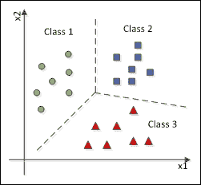

虚线明确地将点分为不同的类别。这些点代表原本具有相应类别标签的数据记录。这意味着它们的类别已经已知，因此这个分类任务属于监督学习类别。

一个分类算法试图在数据超空间中的类别之间找到边界。一旦定义了分类边界，一个未知类别的新的数据点就会根据分类算法定义的边界获得一个类别标签。下面的图示显示了如何对一条新记录进行分类：

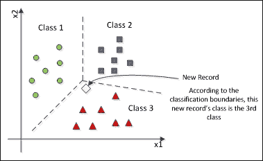

根据当前的类别配置，新记录的类别是第三个类别。

## 分类数据

应用通常从以下图示中展示的数据类型开始：

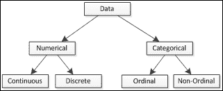

数据可以是数值型或分类型，简单来说，就是数字或文字。数值型数据由一个数值表示，它可以连续或离散。到目前为止，这本书的应用中已经使用了这种数据类型。分类型数据是一个更广泛的数据类别，包括文字、字母，甚至数字，但具有完全不同的含义。虽然数值型数据可以支持算术运算，但分类型数据仅是描述性的，不能像数字那样处理，即使其值是数字。一个例子是疾病严重程度的等级（例如，从零到五）。分类型数据的另一个特性是，某个变量具有有限个值；换句话说，只能将定义好的值集分配给分类型变量。分类型数据内部的一个子类是顺序数据。这个类别特别之处在于定义的值可以按预定义的顺序排序。一个例子是表示某物状态或质量的形容词（差、一般、好、优秀）：

| 数值型 | 分类型 |
| --- | --- |
| 仅数字 | 数字、文字、字母、符号 |
| 支持算术运算 | 不支持算术运算 |
| 无限或未定义的值域 | 有限或定义好的值集 |
| 连续 | 离散 | 顺序 | 非顺序 |
| 实数值 | 整数、小数 | 可以排序 | 不能排序 |
| 任何可能的值 | 预定义的区间 | 可以分配数字 | 每个可能的值是一个标志 |

### 提示

注意，这里我们只讨论结构化数据。在现实世界中，大多数数据是非结构化的，包括文本和多媒体内容。尽管这些类型的数据在数据学习应用中也被处理，但神经网络需要将它们转换成结构化数据类型。

## 处理分类数据

结构化数据文件，如CSV或Excel中使用的，通常包含数值型和分类型数据的列。在[第5章](ch05.xhtml "第5章. 预测天气") *预测天气* 中，我们创建了`LoadCsv`类（用于加载`csv`文件）和`DataSet`类（用于存储csv数据），但这些类仅适用于处理数值数据。表示分类值的最简单方法是将每个可能的值转换为二进制列，其中如果原始列中包含给定值，则相应的二进制列将有一个作为转换值，否则为0：

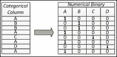

顺序列可以假设定义的值作为同一列中的数值；然而，如果原始值是字母或文字，则需要通过Java字典将它们转换为数字。

上述策略可以通过练习由你实现。否则，你将不得不手动处理。在这种情况下，根据数据行数，可能会很耗时。

# 逻辑回归

我们已经讨论了神经网络可以通过在超空间中的数据上建立决策边界来作为数据分类器工作。这个边界可以是线性的，例如在感知器的情况下，或者非线性的，例如在其他神经网络架构中，如MLPs、Kohonen或Adaline。线性情况基于线性回归，分类边界实际上是一条线，如前图所示。如果数据的散点图看起来像以下图中的那样，则需要非线性分类边界：

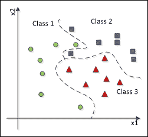

神经网络实际上是一个非常好的非线性分类器，这是通过使用非线性激活函数实现的。一个实际上对非线性分类效果很好的非线性函数是Sigmoid函数，而使用此函数进行分类的过程称为逻辑回归：

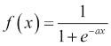

此函数返回介于零和一之间的值。在此函数中，α参数表示从零到一的转换有多硬。以下图表显示了差异：

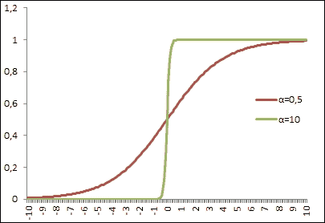

注意，alpha参数越高，逻辑函数就越接近硬限定的阈值函数，也称为阶梯函数。

## 多分类与二分类

分类问题通常处理多分类的情况，其中每个类别都被分配一个标签。然而，二分类方案在神经网络中很有用。这是因为输出层具有逻辑函数的神经网络只能产生介于`0`和`1`之间的值，这意味着它属于（1）或不属于（0）某个类别。

然而，对于多分类，有一种使用二进制函数的方法。假设有一个用于分类疾病的网络；每个神经元的输出将代表一个应用于某些症状的疾病：

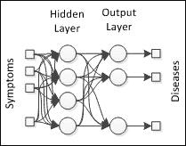

### 小贴士

注意，在那个配置中，可能会有多个疾病具有相同的症状，这种情况可能发生。然而，如果只希望选择一个类别，那么竞争学习算法的方案在这种情况下可能更适合。

## 混淆矩阵

没有完美的分类器算法；它们都存在错误和偏差；然而，预期一个分类算法可以正确分类70-90%的记录。

### 小贴士

非常高的正确分类率并不总是理想的，因为输入数据中可能存在的偏差可能会影响分类任务，并且也存在过拟合的风险，当只有训练数据被正确分类时。

混淆矩阵显示了给定类别的记录中有多少被正确分类，以及有多少被错误分类。以下表格描述了混淆矩阵可能的样子：

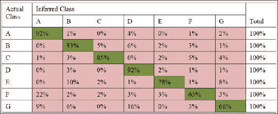

注意，主对角线应期望有更高的值，因为分类算法总是会尝试从输入数据集中提取有意义的信息。所有行的总和必须等于100%，因为给定类别的所有元素都应该被分类到可用的类别之一。注意，某些类别可能会收到比预期更多的分类。

混淆矩阵越像单位矩阵，分类算法就越好。

## 敏感性和特异性

当分类是二进制时，混淆矩阵被发现是一个简单的2x2矩阵，因此其位置被特别命名：

| 实际类别 | 推断类别 |
| --- | --- |
| 正面（1） | 负面（0） |   |
| 正面（1） | 真阳性 | 假阴性 |
| 负面（0） | 假阳性 | 真阴性 |

在本章的主题——疾病诊断中，二进制混淆矩阵的概念被应用，即错误诊断可能是假阳性或假阴性。可以通过敏感性和特异性指数来衡量错误结果的比率。

敏感性意味着真阳性率；它衡量有多少记录被正确地分类为正面：

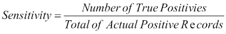

特异性，反过来，意味着真正的负率；它表示负记录识别的比例：

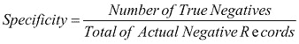

希望敏感性和特异性都高；然而，根据应用领域，敏感性可能更有意义。

## 实现混淆矩阵

在我们的代码中，让我们在`NeuralOutputData`类中实现混淆矩阵。下面的`calculateConfusionMatrix`方法被编程为考虑输出层中的两个神经元。如果输出是10，那么它对混淆矩阵来说是*是*；如果输出是01，那么它是否定：

```py
public double[][] calculateConfusionMatrix(double[][] dataOutputTestAdapted, double[][] dataOutputTargetTestAdapted) {
    int TP = 0;
    int TN = 0;
    int FP = 0;
    int FN = 0;
    for (int m = 0; m < getTargetData().length; m++) {
      if ( ( dataOutputTargetTestAdapted[m][0] == 1.0 && dataOutputTargetTestAdapted[m][1] == 0.0 )
          && ( dataOutputTestAdapted[m][0] == 1.0 && dataOutputTestAdapted[m][1] == 0.0 ) ) {
        TP++;
      } else if ( ( dataOutputTargetTestAdapted[m][0] == 0.0 && dataOutputTargetTestAdapted[m][1] == 1.0 )
          && (  dataOutputTestAdapted[m][0] == 0.0 && dataOutputTestAdapted[m][1] == 1.0 ) ) {
        TN++;            
      } else if ( ( dataOutputTargetTestAdapted[m][0] == 1.0 && dataOutputTargetTestAdapted[m][1] == 0.0 )
          && (  dataOutputTestAdapted[m][0] == 0.0 && dataOutputTestAdapted[m][1] == 1.0 ) ) {
        FP++;
      } else if ( ( dataOutputTargetTestAdapted[m][0] == 0.0 && dataOutputTargetTestAdapted[m][1] == 1.0 )
          && (  dataOutputTestAdapted[m][0] == 1.0 && dataOutputTestAdapted[m][1] == 0.0 ) ) {
        FN++;
      }
    }

    return new double[][] {{TP,FN},{FP,TN}};

  }
```

在`NeuralOutputData`类中实现的一种方法是`calculatePerformanceMeasures`。它接收混淆矩阵作为参数，并计算并打印以下分类的性能指标：

+   正类错误率

+   负类错误率

+   总错误率

+   总准确率

+   精确度

+   敏感性

+   特异性

以下展示了该方法：

```py
public void calculatePerformanceMeasures(double[][] confMat) {
    double errorRatePositive = confMat[0][1] / (confMat[0][0]+confMat[0][1]);
    double errorRateNegative = confMat[1][0] / (confMat[1][0]+confMat[1][1]);
    double totalErrorRate = (confMat[0][1] + confMat[1][0]) / (confMat[0][0] + confMat[0][1] + confMat[1][0] + confMat[1][1]);
    double totalAccuracy  = (confMat[0][0] + confMat[1][1]) / (confMat[0][0] + confMat[0][1] + confMat[1][0] + confMat[1][1]);
    double precision = confMat[0][0] / (confMat[0][0]+confMat[1][0]);
    double sensibility = confMat[0][0] / (confMat[0][0]+confMat[0][1]);
    double specificity = confMat[1][1] / (confMat[1][0]+confMat[1][1]);

    System.out.println("### PERFORMANCE MEASURES ###");
    System.out.println("positive class error rate: "+(errorRatePositive*100.0)+"%");
    System.out.println("negative class error rate: "+(errorRateNegative*100.0)+"%");
    System.out.println("total error rate: "+(totalErrorRate*100.0)+"%");
    System.out.println("total accuracy: "+(totalAccuracy*100.0)+"%");
    System.out.println("precision: "+(precision*100.0)+"%");
    System.out.println("sensibility: "+(sensibility*100.0)+"%");
    System.out.println("specificity: "+(specificity*100.0)+"%");

  }
```

# 分类用的神经网络

可以使用本书迄今为止所涵盖的任何监督神经网络来完成分类任务。然而，建议您使用更复杂的架构，如MLP。在本章中，我们将使用`NeuralNet`类构建一个具有一个隐藏层和输出处的sigmoid函数的MLP。每个输出神经元都代表一个类别。

用于实现示例的代码与测试类（`BackpropagationTest`）非常相似。然而，`DiagnosisExample`类会询问用户想要使用哪个数据集以及其他神经网络参数，例如迭代次数、隐藏层中的神经元数量和学习率。

# 使用神经网络进行疾病诊断

对于疾病诊断，我们将使用免费的proben1数据集，该数据集可在网络上找到（[http://www.filewatcher.com/m/proben1.tar.gz.1782734-0.html](http://www.filewatcher.com/m/proben1.tar.gz.1782734-0.html)）。Proben1是从不同领域收集的几个数据集的基准集。我们将使用癌症和糖尿病数据集。我们添加了一个类别来运行每个案例的实验：`DiagnosisExample`。

## 乳腺癌

乳腺癌数据集由10个变量组成，其中9个是输入变量，1个是二进制输出。数据集共有699条记录，但我们排除了其中16条不完整的记录，因此我们使用了683条记录来训练和测试神经网络。

### 提示

在实际实际问题中，常见有缺失或无效数据。理想情况下，分类算法必须处理这些记录，但有时建议排除它们，因为可能没有足够的信息来产生准确的结果。

下表显示了该数据集的配置：

| 变量名称 | 类型 | 最大值和最小值 |
| --- | --- | --- |
| 诊断结果 | 输出 | [0; 1] |
| 腺体厚度 | 输入 #1 | [1; 10] |
| 细胞大小均匀性 | 输入 #2 | [1; 10] |
| 细胞形状均匀性 | 输入 #3 | [1; 10] |
| 边缘粘附 | 输入 #4 | [1; 10] |
| 单个上皮细胞大小 | 输入 #5 | [1; 10] |
| 裸核 | 输入 #6 | [1; 10] |
| 浅色染色质 | 输入 #7 | [1; 10] |
| 正常核仁 | 输入 #8 | [1; 10] |
| 有丝分裂 | 输入 #9 | [1; 10] |

因此，提出的神经网络拓扑结构将如下图的所示：

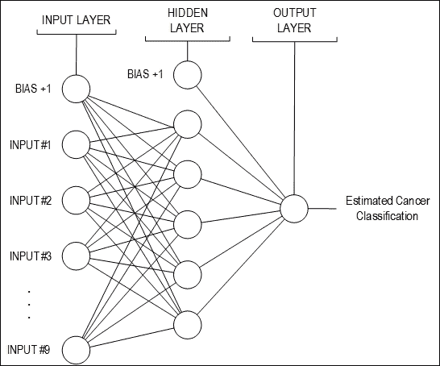

数据集的划分如下：

+   **训练**: 549条记录（80%）；

+   **测试**: 134条记录（20%）

与之前的案例一样，我们进行了多次实验，试图找到最佳的神经网络来分类癌症是良性还是恶性。因此，我们进行了12个不同的实验（每个实验1,000个迭代），分析了均方误差和准确率值。然后，使用测试数据集生成了混淆矩阵、敏感度和特异性，并进行了分析。最后，进行了泛化分析。实验中涉及的神经网络如下表所示：

| 实验 | 隐藏层中的神经元数量 | 学习率 | 激活函数 |
| --- | --- | --- | --- |
| #1 | 3 | 0.1 | 隐藏层: SIGLOG 输出层: LINEAR |
| #2 | 隐藏层: HYPERTAN 输出层: LINEAR |
| #3 | 0.5 | 隐藏层: SIGLOG 输出层: LINEAR |
| #4 | 隐藏层: HYPERTAN 输出层: LINEAR |
| #5 | 0.9 | 隐藏层: SIGLOG 输出层: LINEAR |
| #6 | 隐藏层：HYPERTAN 输出层：LINEAR |
| #7 | 5 | 0.1 | 隐藏层：SIGLOG 输出层：LINEAR |
| #8 | 隐藏层：HYPERTAN 输出层：LINEAR |
| #9 | 0.5 | 隐藏层：SIGLOG 输出层：LINEAR |
| #10 | 隐藏层：HYPERTAN 输出层：LINEAR |
| #11 | 0.9 | 隐藏层：SIGLOG 输出层：LINEAR |
| #12 | 隐藏层：HYPERTAN 输出层：LINEAR |

每次实验后，我们收集了均方误差值（表X）；实验#4、#8、#9、#10和#11是等效的，因为它们具有低均方误差值和相同的总准确度指标（92.25%）。因此，我们选择了实验#4和#11，因为它们在前面提到的五个实验中均方误差值最低：

| 实验 | 均方误差训练率 | 总准确率 |
| --- | --- | --- |
| #1 | 0.01067 | 96.29% |
| #2 | 0.00443 | 98.50% |
| #3 | 9.99611E-4 | 97.77% |
| #4 | 9.99913E-4 | 99.25% |
| #5 | 9.99670E-4 | 96.26% |
| #6 | 9.92578E-4 | 97.03% |
| #7 | 0.01392 | 98.49% |
| #8 | 0.00367 | 99.25% |
| #9 | 9.99928E-4 | 99.25% |
| #10 | 9.99951E-4 | 99.25% |
| #11 | 9.99926E-4 | 99.25% |
| #12 | NaN | 3.44% |

从图表中可以看出，第四个实验的均方误差随时间快速演变，尽管我们使用了1,000个周期进行训练，但实验提前停止，因为达到了最小整体误差（0.001）：

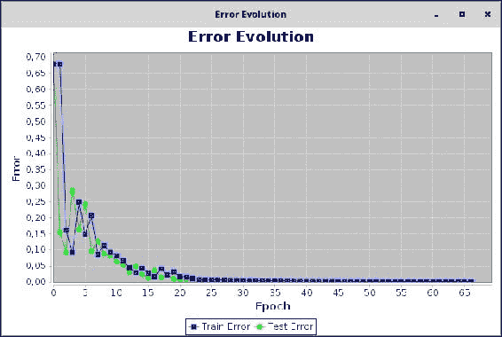

混淆矩阵以及两个实验的灵敏度和特异性在表中展示。可以检查出两个实验的指标是相同的：

| 实验 | 混淆矩阵 | 灵敏度 | 特异性 |
| --- | --- | --- | --- |
| #4 | [[34.0, 1.0][0.00, 99.0]] | 97.22% | 100.0% |
| #11 | [[34.0, 1.0][0.00, 99.0]] | 97.22% | 100.0% |

如果我们不得不在实验#4或#11生成的模型之间做出选择，我们建议选择#4，因为它比#11简单（隐藏层中的神经元更少）。

## 糖尿病

需要进一步探索的另一个例子是糖尿病的诊断。此数据集有八个输入和一个输出，如下表所示。共有768条记录，全部完整。然而，proben1表示存在几个无意义的零值，这可能是缺失数据的指示。我们仍然将这些数据当作真实数据来处理，从而在数据集中引入了一些错误（或噪声）：

| 变量名称 | 类型 | 最大值和最小值 |
| --- | --- | --- |
| 诊断结果 | 输出 | [0; 1] |
| 怀孕次数 | 输入 #1 | [0.0; 17] |
| 口服葡萄糖耐量试验中2小时血浆葡萄糖浓度 | 输入 #2 | [0.0; 199] |
| 舒张压（mm Hg） | 输入 #3 | [0.0; 122] |
| 三角肌皮肤褶皱厚度（mm） | 输入 #4 | [0.0; 99] |
| 2小时血清胰岛素（mu U/ml） | 输入 #5 | [0.0; 744] |
| 体质指数（体重（kg）/身高（m）^2） | 输入 #6 | [0.0; 67.1] |
| 糖尿病家系函数 | 输入 #7 | [0.078; 2420] |
| 年龄（年） | 输入 #8 | [21; 81] |

数据集划分如下：

+   **训练**: 617条记录（80%）

+   **测试**: 151条记录（20%）

为了发现用于分类糖尿病的最佳神经网络拓扑结构，我们使用了与上一节中描述相同的神经网络架构。然而，我们在输出层使用了多类分类：这个层将使用两个神经元，一个用于糖尿病的存在，另一个用于不存在。

因此，所提出的神经网络架构看起来如下图的所示：

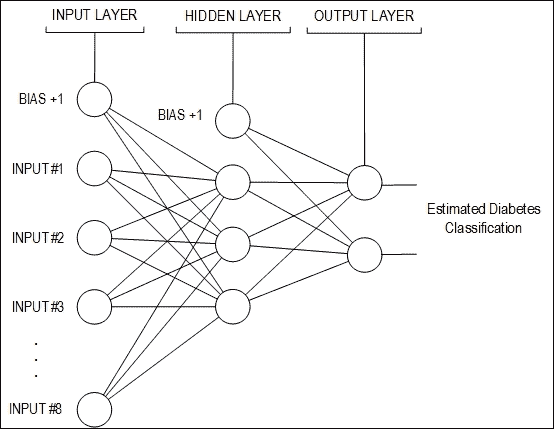

下表显示了前六个实验和最后六个实验的均方误差（MSE）训练值和准确率：

| 实验 | MSE训练率 | 总准确率 |
| --- | --- | --- |
| #1 | 0.00807 | 60.54% |
| #2 | 0.00590 | 71.03% |
| #3 | 9.99990E-4 | 75.49% |
| #4 | 9.98840E-4 | 74.17% |
| #5 | 0.00184 | 61.58% |
| #6 | 9.82774E-4 | 59.86% |
| #7 | 0.00706 | 63.57% |
| #8 | 0.00584 | 72.41% |
| #9 | 9.99994E-4 | 74.66% |
| #10 | 0.01047 | 72.14% |
| #11 | 0.00316 | 59.86% |
| #12 | 0.43464 | 40.13% |

在这两种情况下，MSE的下降都很快。然而，实验#9在初始值中产生了错误率的增加。如下图所示：

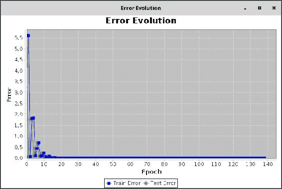

分析混淆矩阵，可以看出度量值非常相似：

| 实验 | 混淆矩阵 | 灵敏度 | 特异性 |
| --- | --- | --- | --- |
| #3 | [[35.0, 12.0][25.0, 79.0]] | 74.46% | 75.96% |
| #9 | [[34.0, 12.0][26.0, 78.0]] | 73.91% | 75.00% |

再次建议选择最简单的模型。在糖尿病的例子中，它是实验#3生成的神经网络。

### 提示

建议您探索类`D` `iagnosisExample`并创建一个GUI来轻松选择神经网络参数，就像在上一章中所做的那样。您应该尝试通过继承概念重用已编写的代码。

# 摘要

在本章中，我们看到了两个使用神经网络进行疾病诊断应用的例子。为了使本章探索的知识水平一致，简要回顾了分类问题的基本原理。分类任务属于机器学习/数据挖掘领域中应用最广泛的有监督任务类型之一，神经网络被证明非常适合应用于此类问题。读者还介绍了评估分类任务的几个概念，如灵敏度、特异性和混淆矩阵。这些符号对于所有分类任务都非常有用，包括那些使用除神经网络以外的其他算法处理的任务。下一章将探索类似类型的任务，但使用无监督学习——这意味着没有预期的输出数据——但本章中介绍的基本原理将有所帮助。
