# 第九章：第9章：优化和调整神经网络

在本章中，读者将了解帮助优化神经网络的技巧，以便获得最佳性能。例如，输入选择、数据集分离和过滤、选择隐藏神经元数量和交叉验证策略等任务都是可以调整以改善神经网络性能的例子。此外，本章重点介绍将神经网络适应实时数据的方法。这里将展示这些技术的两种实现。练习将选择应用问题。本章涉及以下主题：

+   输入选择

+   维度降低

+   数据过滤

+   结构选择

+   剪枝

+   验证策略

+   交叉验证

+   在线重新训练

+   随机在线学习

+   自适应神经网络

+   自适应共振理论

# 神经网络实现中的常见问题

在开发神经网络应用时，遇到关于结果准确性的问题是很常见的。这些问题可能来自多个方面：

+   输入选择不当

+   噪声数据

+   数据集太大

+   不合适的结构

+   隐藏神经元数量不足

+   学习率不足

+   缺乏停止条件

+   数据集分割不当

+   差的验证策略

神经网络应用的设计有时需要很多耐心和试错方法。没有具体说明应该使用多少隐藏单元和/或架构的方法论，但有一些关于如何正确选择这些参数的建议。程序员可能面临的另一个问题是训练时间过长，这通常会导致神经网络无法学习数据。无论训练运行多长时间，神经网络都不会收敛。

### 小贴士

设计神经网络需要程序员或设计师根据需要多次测试和重新设计神经网络结构，直到获得可接受的结果。

另一方面，神经网络解决方案的设计师可能希望改进结果。因为神经网络可以学习直到学习算法达到停止条件，比如迭代次数或均方误差，结果可能不够准确或不够泛化。这需要重新设计神经网络结构或选择新的数据集。

# 输入选择

设计神经网络应用的一个关键任务是选择合适的输入。对于无监督情况，希望只使用神经网络能找到模式的变量。对于监督情况，需要将输出映射到输入，因此需要选择对输出有一定影响的输入变量。

## 数据相关性

在监督学习案例中，选择良好输入的一种策略是数据系列之间的相关性，这在[第5章](ch05.xhtml "第5章. 预测天气") *预测天气* 中实现。数据系列之间的相关性是衡量一个数据序列如何反应或影响另一个数据序列的度量。假设我们有一个包含多个数据系列的数据集，从中选择一个作为输出。现在我们需要从剩余的变量中选择输入。

相关系数的取值范围从 *-1* 到 1，其中接近 *+1* 的值表示正相关，接近 -1 的值表示负相关，接近 `0` 的值表示没有相关性。

例如，让我们看看两个变量 `X` 和 `Y` 的三个图表：

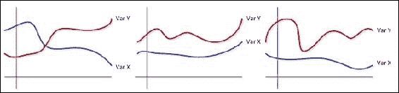

在第一个图表中，左侧可以看到，当一个变量减少时，另一个变量的值增加（相关系数 -0.8）。中间的图表显示了两个变量在同一方向变化的情形，因此是正相关（相关系数 +0.7）。右侧的第三个图表显示了变量之间没有相关性的情形（相关系数 *-0.1*）。

没有关于应该考虑哪个相关性作为限制阈值的规则；这取决于应用。虽然绝对相关性值大于 0.5 可能适合一个应用，但在其他情况下，接近 0.2 的值可能贡献显著。

## 数据转换

当数据系列在假设上是线性的时，线性相关性在检测数据系列之间的行为方面非常好。然而，如果两个数据系列在绘制在一起时形成一个抛物线，线性相关性将无法识别任何关系。这就是为什么有时我们需要将数据转换为一个显示线性相关性的视角。

数据转换取决于面临的问题。它包括插入一个或多个数据系列处理后的附加数据系列。一个例子是包含一个或多个参数的方程（可能是非线性的）。在数据转换的视角下，一些行为更容易被检测到。

### 小贴士

数据转换还涉及一些关于问题的知识。然而，通过查看两个数据系列的散点图，选择要应用哪种转换变得更容易。

## 维度降低

另一个有趣的观点是关于去除冗余数据。在无监督学习和监督学习中，当有大量可用数据时，有时这可能是所需的。作为一个例子，让我们看看两个变量的图表：

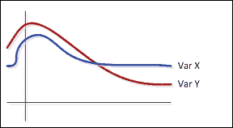

可以看到 X 和 `Y` 变量具有相同的形状，这可以解释为冗余，因为这两个变量由于高度正相关而携带几乎相同的信息。因此，可以考虑一种称为 **主成分分析** (**PCA**) 的技术，它为处理这些情况提供了一个良好的方法。

PCA的结果将是一个新的变量，它总结了前面的两个（或更多）变量。基本上，原始数据系列减去平均值，然后乘以协方差矩阵的转置特征向量：

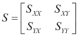

在这里，*SXY*是变量`X`和`Y`之间的协方差。

导出的新数据将是：

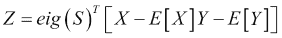

让我们看看新的变量在图表中看起来会是什么样子，与原始变量相比：


在我们的框架中，我们将添加一个名为`PCA`的类，该类将在将数据应用于神经网络之前执行这种转换和预处理：

```py
public class PCA {

  DataSet originalDS;
  int numberOfDimensions;
  DataSet reducedDS;

  DataNormalization normalization = new DataNormalization(DataNormalization.NormalizationTypes.ZSCORE);

  public PCA(DataSet ds,int dimensions){
    this.originalDS=ds;
    this.numberOfDimensions=dimensions;
  }

  public DataSet reduceDS(){
    //matrix algebra to calculate transformed data in lower dimension
    …
  }

  public DataSet reduceDS(int numberOfDimensions){
    this.numberOfDimensions = numberOfDimensions;
    return reduceDS;
  }

}
```

## 数据过滤

噪声数据和不良数据也是神经网络应用中问题的来源；这就是为什么我们需要过滤数据。一种常见的数据过滤技术可以通过排除超出常规范围的记录来实现。例如，温度值在-40到40之间，因此像50这样的值将被视为异常值并可能被移除。

3-σ规则是一种良好且有效的过滤措施。它包括过滤那些超出平均值三倍标准差之外的值：

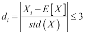

让我们添加一个类来处理数据过滤：

```py
public abstract class DataFiltering {

  DataSet originalDS;
  DataSet filteredDS;

}

public class ThreeSigmaRule extends DataFiltering {

  double thresholdDistance = 3.0;

  public ThreeSigmaRule(DataSet ds,double threshold){
    this.originalDS=ds;
    this.thresholdDistance=threshold;
  }

  public DataSet filterDS(){
    //matrix algebra to calculate the distance of each point in each column
    …
  }

}
```

这些类可以通过以下方法在`DataSet`中调用，然后在其他地方用于过滤和降维：

```py
public DataSet applyPCA(int dimensions){
  PCA pca = new PCA(this,dimensions);
  return pca.reduceDS();
}

public DataSet filter3Sigma(double threshold){
  ThreeSigmaRule df = new ThreeSigmaRule(this,threshold);
  return df.filterDS();
}
```

## 交叉验证

在许多验证神经网络的策略中，交叉验证是非常重要的一种。这种策略确保所有数据都作为训练数据和测试数据呈现给神经网络。数据集被划分为`K`组，其中一组用于测试，其余用于训练：

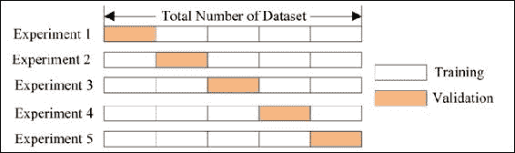

在我们的代码中，让我们创建一个名为`CrossValidation`的类来管理交叉验证：

```py
public class CrossValidation {
  NeuralDataSet dataSet;
  int numberOfFolds;

  public LearningAlgorithm la;

  double[] errorsMSE;

  public CrossValidation(LearningAlgorithm _la,NeuralDataSet _nds,int _folds){
    this.dataSet=_nds;
    this.la=_la;
    this.numberOfFolds=_folds;
    this.errorsMSE=new double[_folds];
  }

  public void performValidation() throws NeuralException{
    //shuffle the dataset
    NeuralDataSet shuffledDataSet = dataSet.shuffle();
    int subSize = shuffledDataSet.numberOfRecords/numberOfFolds;
    NeuralDataSet[] foldedDS = new NeuralDataSet[numberOfFolds];
    for(int i=0;i<numberOfFolds;i++){
            foldedDS[i]=shuffledDataSet.subDataSet(i*subSize,(i+1)*subSize-1);
    }
    //run the training
    for(int i=0;i<numberOfFolds;i++){
      NeuralDataSet test = foldedDS[i];
      NeuralDataSet training = foldedDS[i==0?1:0];
      for(int k=1;k<numberOfFolds;k++){
        if((i>0)&&(k!=i)){
          training.append(foldedDS[k]);
        }
        else if(k>1) training.append(foldedDS[k]);
      }
      la.setTrainingDataSet(training);
      la.setTestingDataSet(test);
      la.train();
      errorsMSE[i]=la.getMinOverallError();
    }
  }
}
```

## 结构选择

选择一个适合神经网络的适当结构也是一个非常重要的步骤。然而，这通常是通过经验来做的，因为没有关于神经网络应该有多少隐藏单元的规则。衡量单元数量的唯一标准是神经网络的性能。人们假设如果总体误差足够低，那么结构就是合适的。尽管如此，可能存在一个更小的结构可以产生相同的结果。

在这个背景下，基本上有两种方法：构造性和剪枝。构造性方法是从只有输入和输出层开始，然后在隐藏层中添加新的神经元，直到获得良好的结果。破坏性方法，也称为剪枝，是在一个更大的结构上进行的，其中移除了对输出贡献很少的神经元。

构造性方法在以下图中表示：

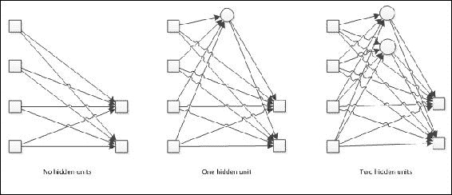

剪枝是回归之路：当给定大量神经元时，人们希望剪除那些灵敏度非常低的神经元，即那些对误差贡献最小的神经元：

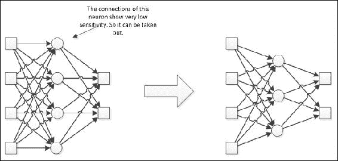

为了实现剪枝，我们在`NeuralNet`类中添加了以下属性：

```py
public class NeuralNet{
//…
  public Boolean pruning;
  public double senstitityThreshold;
}
```

在`NeuralLayer`类中有一个名为`removeNeuron`的方法，实际上是将神经元的所有连接设置为0，禁用权重更新，并在神经元输出处仅产生0。如果将`NeuralNet`对象的剪枝属性设置为true，则调用此方法。灵敏度计算是根据链式法则进行的，如[第3章](ch03.xhtml "第3章。感知器和监督学习")中所示，*感知器和监督学习*，并在`calcNewWeigth`方法中实现：

```py
@Override
public Double calcNewWeight(int layer,int input,int neuron){
  Double deltaWeight=calcDeltaWeight(layer,input,neuron);
  if(this.neuralNet.pruning){
    if(deltaWeight<this.neuralNet.sensitivityThreshold)
      neuralNet.getHiddenLayer(layer).remove(neuron);
  }
  return newWeights.get(layer).get(neuron).get(input)+deltaWeight;
}
```

# 在线重新训练

在学习过程中，设计如何进行训练非常重要。两种基本方法是批量学习和增量学习。

在批量学习中，所有记录都被输入到网络中，因此它可以评估误差，然后更新权重：

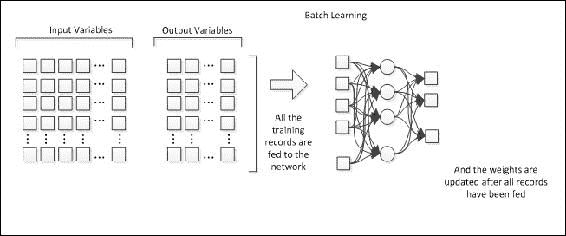

在增量学习中，更新是在将每条记录发送到网络后进行的：

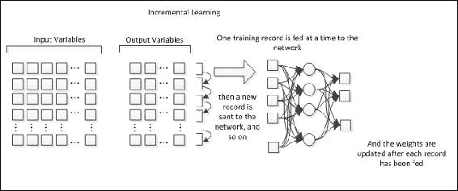

这两种方法都工作得很好，并且各有优缺点。虽然批量学习可以用于较少但更直接的权重更新，但增量学习提供了一种微调权重调整的方法。在这种情况下，可以设计一种学习模式，使网络能够持续学习。

### 小贴士

作为一项建议的练习，读者可以从代码中可用的数据集中选择一个，并使用部分记录设计训练，然后在两种模式下（在线和批量）使用另一部分进行训练。有关详细信息，请参阅`IncrementalLearning.java`文件。

## 随机在线学习

离线学习意味着神经网络在不在*操作*状态下进行学习。每个神经网络应用都应在某个环境中工作，为了进入生产状态，它应该得到适当的训练。离线训练适合将网络投入运行，因为其输出可能在大范围内变化，如果它在运行中，这肯定会损害系统。但是，当涉及到在线学习时，存在限制。在离线学习中，可以使用交叉验证和自助法来预测误差，而在在线学习中，由于没有“训练数据集”，这不可能做到。然而，当需要提高神经网络性能时，就需要进行在线训练。

在进行在线学习时使用随机方法。这个用于改进神经网络训练的算法由两个主要特性组成：随机选择训练样本和在运行时（在线）变动学习率。当在目标函数中发现噪声时，使用这种方法进行训练。它有助于逃离局部最小值（最佳解决方案之一）并达到全局最小值（最佳解决方案）：

伪算法如下（来源：[ftp://ftp.sas.com/pub/neural/FAQ2.html#A_styles](ftp://ftp.sas.com/pub/neural/FAQ2.html#A_styles))：

```py
Initialize the weights.
   Initialize the learning rate.
   Repeat the following steps:
      Randomly select one (or possibly more) case(s)
         from the population.
      Update the weights by subtracting the gradient
         times the learning rate.
      Reduce the learning rate according to an
         appropriate schedule.
```

## 实现方式

Java项目在`learn`包内创建了名为`BackpropagtionOnline`的类。这个算法与经典反向传播算法的不同之处在于通过修改`train()`方法，添加了两个新方法：`generateIndexRandomList()`和`reduceLearningRate()`。第一个方法生成一个随机索引列表，用于训练步骤，第二个方法根据以下启发式方法在线执行学习率的变动：

```py
private double reduceLearningRate(NeuralNet n, double percentage) {
    double newLearningRate = n.getLearningRate() * 
                    ((100.0 - percentage) / 100.0);

    if(newLearningRate < 0.1) {
      newLearningRate = 1.0;
    }

    return newLearningRate;
  }
```

此方法将在`train()`方法结束时被调用。

## 应用

已经使用前几章的数据来测试这种新的训练神经网络的方法。每个章节中定义的相同神经网络拓扑（[第5章](ch05.xhtml "第5章. 预测天气"), *预测天气* 和 [第8章](ch08.xhtml "第8章. 文本识别"), *文本识别*）已经用于训练本章的神经网络。第一个是天气预报问题，第二个是OCR。下表显示了结果的比较：

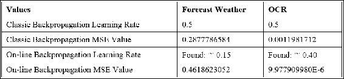

此外，已经绘制了MSE演变的图表，并在此处展示：

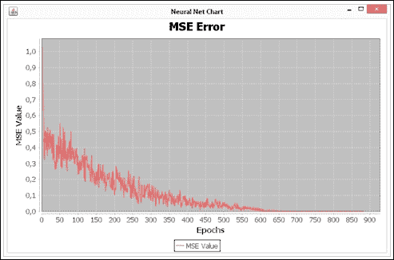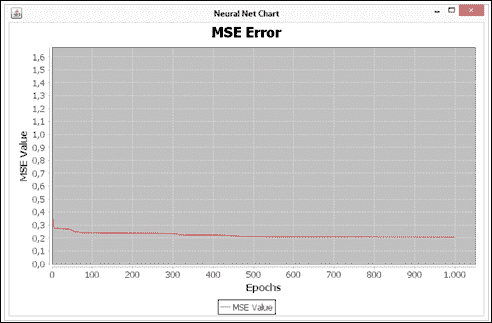

第一张图表（天气预报）中显示的曲线呈锯齿状，这是因为学习率的变动。此外，它非常类似于[第5章](ch05.xhtml "第5章. 预测天气")中显示的曲线，*预测天气*。另一方面，第二张图表（OCR）显示训练过程更快，并在大约第900个epoch时停止，因为它达到了一个非常小的均方误差（MSE）错误。

还进行了其他实验：使用反向传播算法训练神经网络，并考虑在线方法找到的学习率。两个问题中的MSE值都降低了：

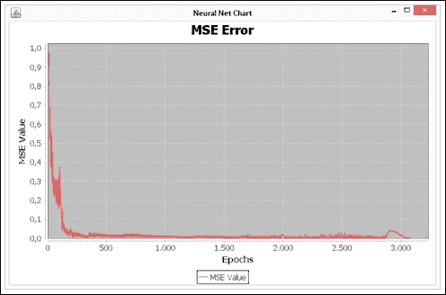

另一个重要的观察结果是，训练过程在约第3,000个epoch时几乎终止。因此，它比使用相同算法在[第8章](ch08.xhtml "第8章. 文本识别"), *文本识别*中看到的训练过程更快、更好。

# 自适应神经网络

与人类学习类似，神经网络也可能工作以避免忘记以前的知识。使用传统的神经网络学习方法，由于每次训练都意味着用新的连接替换已经建立的连接，因此几乎不可能忘记以前的知识。因此，需要使神经网络通过增加而不是替换当前知识来适应新知识。为了解决这个问题，我们将探讨一种称为**自适应共振理论**（**ART**）的方法。

## 自适应共振理论

驱动这一理论发展的疑问是：*一个自适应系统如何对重要输入保持可塑性，同时对无关输入保持稳定性？*换句话说：*它如何在学习新信息的同时保留以前学习的信息？*

我们已经看到，在无监督学习中，竞争性学习处理模式识别，其中相似的输入产生相似的输出或激活相同的神经元。在ART拓扑结构中，当从网络中检索信息时，通过提供竞争层和输入层的反馈，共振出现。因此，当网络接收数据以进行学习时，竞争层和输入层之间的反馈会产生振荡。当模式在神经网络内部完全发展时，这种振荡会稳定下来。然后，这种共振会加强存储的模式。

## 实现

在某个包中创建了一个名为`ART`的新类，它继承自`CompetitiveLearning`。除了其他小的贡献外，它的重大变化是警觉性测试：

```py
public class ART extends CompetitiveLearning{

  private boolean vigilanceTest(int row_i) {
    double v1 = 0.0;
    double v2 = 0.0;

    for (int i = 0; i < neuralNet.getNumberOfInputs(); i++) {
      double weightIn  = neuralNet.getOutputLayer().getWeight(i);
      double trainPattern = trainingDataSet.getIthInput(row_i)[i];

      v1 = v1 + (weightIn * trainPattern);

      v2 = v2 + (trainPattern * trainPattern);
    }

    double vigilanceValue = v1 / v2;

    if(vigilanceValue > neuralNet.getMatchRate()){
      return true;
    } else {
      return false;
    }

  }

}
```

训练方法如下所示。可以注意到，首先，全局变量和神经网络被初始化；之后，存储了训练集的数量和训练模式；然后开始训练过程。这个过程的第一步是计算获胜神经元的索引；第二步是对神经网络输出进行归因。接下来的步骤包括验证神经网络是否已经学习，是否已经学习到权重是固定的；如果没有，则向网络展示另一个训练样本：

```py
epoch=0;
int k=0;
forward();
//...
currentRecord=0;
forward(currentRecord);
while(!stopCriteria()){
 //...
  boolean isMatched = this.vigilanceTest(currentRecord);
  if ( isMatched ) {
  applyNewWeights();
} 
```

# 摘要

在本章中，我们看到了一些使神经网络工作得更好的主题，无论是通过提高其准确性还是通过扩展其知识。这些技术在设计使用人工神经网络的解决方案方面非常有帮助。读者可以自由地将这个框架应用于任何可以使用神经网络的期望任务，以探索这些结构可能具有的增强能力。甚至像选择输入数据这样的简单细节也可能影响整个学习过程，以及过滤不良数据或消除冗余变量。我们展示了两种实现，两种有助于提高神经网络性能的策略：随机在线学习和自适应共振理论。这些方法使网络能够扩展其知识，因此能够适应新的、不断变化的环境。
