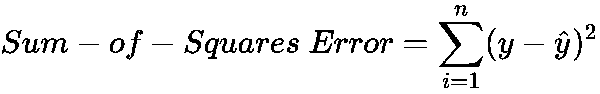
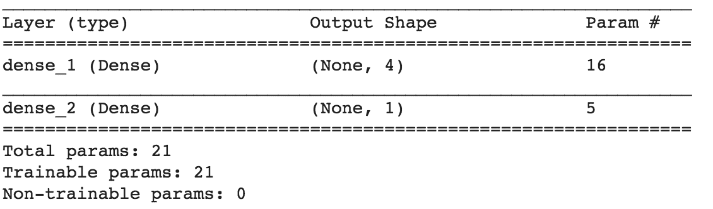

# 第一章：机器学习与神经网络入门

**人工智能**（**AI**）近年来吸引了大量关注。从智能手机中的人脸识别安全系统到通过 Alexa 预定 Uber 出行，AI 已经无处不在地渗透到我们的日常生活中。然而，我们不断被提醒，AI 的全部潜力尚未被完全实现，AI 将在未来变得更加具有变革性，深刻影响我们的生活。

当我们展望未来时，可以看到 AI 不断进步，并承诺改善我们的日常生活。得益于 AI，自动驾驶汽车正在从科幻走向现实。自动驾驶汽车旨在通过消除人为错误来减少交通事故，从而最终改善我们的生活。类似地，AI 在医疗领域的应用也有望改善治疗效果。特别是，英国的国家卫生服务系统（NHS）已宣布一项雄心勃勃的 AI 项目，用于早期癌症诊断，这可能拯救数千条生命。

AI 的变革性特质使得专家们称其为第四次工业革命。AI 是塑造现代产业的催化剂，拥有 AI 知识在这个新时代至关重要。在本书结束时，你将对驱动 AI 的算法有更深入的理解，并且通过这些前沿算法开发了实际项目。

在本章中，我们将讨论以下主题：

+   机器学习和神经网络入门

+   为机器学习配置计算机环境

+   从头到尾执行你的机器学习项目，使用机器学习工作流

+   在 Python 中从零开始创建自己的神经网络，而不使用任何机器学习库

+   使用 pandas 在 Python 中进行数据分析

+   利用像 Keras 这样的机器学习库来构建强大的神经网络

# 什么是机器学习？

尽管机器学习和 AI 经常被交替使用，但它们之间存在微妙的区别。AI 这一术语最早出现在 1950 年代，它指的是机器模仿智能人类行为的能力。为了这一目标，研究人员和计算机科学家们尝试了多种方法。AI 的早期工作集中于一种被称为符号 AI 的方法。符号 AI 尝试以声明性形式表达人类知识，使计算机可以处理。符号 AI 的巅峰成果是专家系统，这是一种模拟人类决策过程的计算机系统。

然而，符号 AI 的一个主要缺点是它依赖于人类专家的领域知识，并且需要将这些规则和知识硬编码到问题解决中。AI 作为一个科学领域经历了一段干旱期（被称为 AI 冬天），当时科学家们越来越失望于 AI 的局限性。

虽然符号 AI 在 1950 年代曾占据主导地位，但被称为机器学习的 AI 子领域在背后悄然发展。

机器学习是指计算机使用的算法，通过从数据中学习，使其能够对未来未见过的数据做出预测。

然而，早期的 AI 研究人员并没有太关注机器学习，因为当时的计算机既不够强大，也没有足够的存储能力来存储机器学习算法所需要的海量数据。事实证明，机器学习并没有被冷落太久。在 2000 年代末，AI 经历了复兴，机器学习在其中起到了推动作用。这次复兴的关键原因是计算机系统的成熟，这些系统可以收集并存储大量数据（大数据），并且处理器足够快，可以运行机器学习算法。因此，AI 的“夏天”开始了。

# 机器学习算法

现在我们已经讨论了什么是机器学习，我们需要理解机器学习算法是如何工作的。机器学习算法大致可以分为两类：

+   **监督学习**：使用带标签的训练数据，算法学习将输入变量映射到目标变量的规则。例如，一个监督学习算法可以学习如何从温度、时间、季节、气压等输入变量中预测是否会下雨（目标变量）。

+   **无监督学习**：使用无标签的训练数据，算法学习数据的关联规则。无监督学习算法最常见的应用是聚类分析，算法可以学习数据中那些未明确标记的隐藏模式和群体。

本书将重点讨论监督学习算法。作为一个监督学习算法的具体例子，假设我们遇到以下问题。你是一个动物爱好者和机器学习爱好者，你希望使用监督学习建立一个机器学习算法，预测一个动物是朋友（友好的小狗）还是敌人（危险的熊）。为了简化问题，假设你已经收集了不同品种的狗和熊的两个测量值——它们的**体重**和**速度**。收集完数据（称为训练数据集）后，你将它们绘制在图表上，并标注它们的标签（**朋友或敌人**）：


立即，我们可以看到狗的体重往往较轻，通常更快，而熊则较重，通常更慢。如果我们在狗和熊之间画一条线（称为决策边界），我们可以用这条线来进行未来的预测。每当我们接收到一个新动物的测量值时，只需判断它是否位于线的左侧或右侧。朋友在左边，敌人则在右边。

但这是一个简单的数据集。如果我们收集了数百个不同的测量数据呢？那时图表将超过 100 维，人类将无法绘制分隔线。然而，对于机器学习来说，这样的任务并不成问题。

在这个例子中，机器学习算法的任务是学习最佳的决策边界，区分数据集。理想情况下，我们希望算法生成一个完全将两类数据分隔开的**决策边界**（尽管根据数据集的不同，这并不总是可能的）：


有了这个**决策边界**，我们就可以对未来的未见数据进行预测。如果**新实例**位于**决策边界**的左侧，则我们将其分类为朋友。反之，如果新实例位于**决策边界**的右侧，则我们将其分类为敌人。

在这个简单的例子中，我们只使用了两个输入变量和两个类别。然而，我们可以将问题推广到包含多个输入变量和多个类别的情况。

自然，我们选择的机器学习算法会影响产生的决策边界类型。一些更常见的监督式机器学习算法如下：

+   神经网络

+   线性回归

+   逻辑回归

+   **支持向量机**（**SVMs**）

+   决策树

数据集的性质（如图像数据集或数值数据集）以及我们要解决的潜在问题应该决定所使用的机器学习算法。在本书中，我们将重点讨论神经网络。

# 机器学习工作流

我们已经讨论了什么是机器学习。那么，如何*进行*机器学习呢？从高层次来看，机器学习项目的核心是将原始数据作为输入，输出**预测**作为**结果**。为了实现这一点，有几个重要的中间步骤必须完成。这个机器学习工作流可以通过以下图示来概括：


我们机器学习工作流的**输入**始终是数据。数据可以来自不同的来源，具有不同的数据格式。例如，如果我们正在进行一个基于计算机视觉的项目，那么我们的数据很可能是图像。对于大多数其他机器学习项目，数据将以表格形式呈现，类似于电子表格。在一些机器学习项目中，数据收集将是一个重要的第一步。在本书中，我们假设数据将由我们提供，使我们可以专注于机器学习方面。

接下来的步骤是预处理数据。原始数据通常杂乱、易出错，并不适合用于机器学习算法。因此，在将数据输入模型之前，我们需要先对其进行预处理。如果数据来自多个来源，我们需要将这些数据合并成一个数据集。机器学习模型也需要数值型的数据集来进行训练。如果原始数据集中有任何类别变量（如性别、国家、星期几等），我们需要将这些变量编码为数值型变量。我们将在本章稍后部分展示如何实现这一点。对于某些机器学习算法，还需要进行数据缩放和归一化。其背后的直觉是，如果某些变量的数值范围远大于其他变量，那么某些机器学习算法可能会错误地将更多的重视放在这些占主导地位的变量上。

现实世界中的数据集通常是杂乱无章的。你会发现数据不完整，并且在多行多列中缺失数据。处理缺失数据有多种方法，每种方法都有其优缺点。最简单的方法是直接丢弃含有缺失数据的行和列。然而，这可能不切实际，因为我们可能会丢弃大量的数据。我们也可以用变量的均值来替代缺失的数据（如果这些变量是数字型的）。这种方法比丢弃数据更理想，因为它能保留我们的数据集。然而，用均值替代缺失值往往会影响数据的分布，这可能会对我们的机器学习模型产生负面影响。另一种方法是根据其他存在的值预测缺失值。然而，我们必须小心，因为这样做可能会引入显著的偏差。

最后，在**数据预处理**中，我们需要将数据集拆分为训练集和测试集。我们的机器学习模型只会在训练集上进行训练和拟合。一旦我们对模型的表现满意，我们将使用测试集对模型进行评估。需要注意的是，模型绝不应在测试集上进行训练。这确保了模型性能的评估是公正的，并能反映其在现实世界中的表现。

一旦**数据预处理**完成，我们将进入**探索性数据分析**（**EDA**）。EDA 是通过数据可视化从数据中发掘洞察的过程。EDA 使我们能够构造新的特征（称为特征工程），并将领域知识注入到我们的机器学习模型中。

最后，我们进入机器学习的核心部分。在完成**数据预处理**和 EDA 之后，我们进入**模型构建**阶段。如前文所述，我们可以使用多种机器学习算法，具体选择哪种算法应由问题的性质决定。在本书中，我们将专注于神经网络。在**模型构建**中，**超参数调优**是一个至关重要的步骤，正确的超参数能够大幅提升模型的性能。在后续章节中，我们将探讨神经网络中的一些超参数。训练完模型后，我们终于可以使用测试集来评估我们的模型了。

如我们所见，机器学习的工作流程包含许多中间步骤，每个步骤都对我们模型的整体表现至关重要。使用 Python 进行机器学习的主要优势是，整个机器学习工作流程可以完全在 Python 中端到端地执行，并且只需要使用少数开源库。在本书中，你将体验到如何在机器学习工作流程的每个步骤中使用 Python，并从零开始创建复杂的神经网络项目。

# 为机器学习配置你的计算机

在深入研究神经网络和机器学习之前，让我们确保你的计算机已经正确设置，这样你就可以顺利运行本书中的代码了。

在本书中，我们将使用 Python 编程语言进行每个神经网络项目的开发。除了 Python 本身，我们还需要一些 Python 库，如 Keras、pandas、NumPy 等等。安装 Python 和所需库有多种方式，但最简单的方式无疑是使用 Anaconda。

Anaconda 是一个免费的开源 Python 及其库的发行版。Anaconda 提供了一个方便的包管理器，让我们能够轻松安装 Python 以及所有其他所需的库。要安装 Anaconda，只需访问网站：[`www.anaconda.com/distribution/`](https://www.anaconda.com/distribution/)，然后下载 Anaconda 安装程序（选择 Python 3.x 版本的安装程序）。

除了 Anaconda，我们还需要 Git。Git 对于机器学习和软件工程至关重要。Git 使我们能够轻松地从 GitHub 下载代码，而 GitHub 可能是最广泛使用的软件托管服务。要安装 Git，请访问 Git 网站：[`git-scm.com/book/en/v2/Getting-Started-Installing-Git`](https://git-scm.com/book/en/v2/Getting-Started-Installing-Git)。你可以直接下载并运行适合你操作系统的安装程序。

一旦安装了 Anaconda 和 Git，我们就可以开始下载本书的代码了。本书中的代码可以在我们的 GitHub 仓库中找到。

要下载代码，只需在命令行中运行以下命令（如果你使用 macOS/Linux，请使用 Terminal；如果你使用 Windows，请使用 Anaconda 命令提示符）：

```py
$ git clone https://github.com/PacktPublishing/Neural-Network-Projects-with-Python
```

`git clone` 命令将会下载本书中所有的 Python 代码到你的计算机上。

一旦完成，运行以下命令来进入刚刚下载的文件夹：

```py
$ cd Neural-Network-Projects-with-Python
```

在文件夹中，你会找到一个名为 `environment.yml` 的文件。有了这个文件，我们可以将 Python 和所有必需的库安装到一个虚拟环境中。你可以把虚拟环境想象成一个隔离的、沙盒式的环境，在这里我们可以安装一个全新的 Python 和所有必需的库。`environment.yml` 文件包含了 Anaconda 安装每个库特定版本的指令，确保 Python 代码将在我们设计的标准化环境中执行。

要使用 Anaconda 和 `environment.yml` 文件安装所需的依赖项，只需从命令行执行以下命令：

```py
$ conda env create -f environment.yml
```

就像这样，Anaconda 将会在 `neural-network-projects-python` 虚拟环境中安装所有必需的包。要进入这个虚拟环境，我们执行以下命令：

```py
$ conda activate neural-network-projects-python
```

就这样！我们现在处于一个已安装所有依赖项的虚拟环境中。要在这个虚拟环境中执行 Python 文件，我们可以运行类似以下的命令：

```py
$ python Chapter01\keras_chapter1.py
```

要离开虚拟环境，我们可以运行以下命令：

```py
$ conda deactivate
```

请注意，无论何时运行我们提供的任何 Python 代码，你都应该在虚拟环境中（首先运行 `conda activate neural-network-projects-python`）。

现在我们已经配置好了我们的计算机，让我们回到神经网络。我们将看看神经网络背后的理论，以及如何在 Python 中从头开始编程一个。

# 神经网络

神经网络是一类机器学习算法，它们受到人脑中神经元的松散启发。然而，不深入讨论大脑类比，我觉得更容易简单地将神经网络描述为一个将给定输入映射到所需输出的数学函数。为了理解这意味着什么，让我们来看看单层神经网络（即感知器）。

**感知器**可以用以下图示来说明：


**感知器**的核心是一个简单的数学函数，它接受一组输入，执行一些数学计算，并输出计算结果。在这种情况下，这个数学函数就是这样的：


 表示**感知器**的权重。我们将在接下来的几节中解释神经网络中权重的含义。现在，我们只需记住神经网络简单地是一个将给定输入映射到期望输出的数学函数。

# 为什么选择神经网络？

在我们深入创建自己的神经网络之前，了解神经网络为何在机器学习和人工智能中占据如此重要的位置是值得的。

第一个原因是神经网络是通用的函数逼近器。这意味着，对于我们要建模的任何任意函数，无论多么复杂，神经网络总是能够表示这个函数。这对于神经网络和人工智能来说具有深远的意义。假设世界上任何问题都可以通过一个数学函数来描述（无论多么复杂），我们可以利用神经网络来表示这个函数，从而有效地建模世界上的任何事物。需要注意的是，尽管科学家们已经证明了神经网络的通用性，但一个庞大且复杂的神经网络可能永远无法正确地训练和泛化。

第二个原因是神经网络的架构具有高度的可扩展性和灵活性。正如我们将在下一节中看到的那样，我们可以轻松地在每个神经网络中堆叠层次，从而增加神经网络的复杂性。或许更有趣的是，神经网络的能力仅受限于我们自己的想象力。通过创造性的神经网络架构设计，机器学习工程师已经学会如何利用神经网络来预测时间序列数据（称为**递归神经网络**（**RNNs**）），这些网络被广泛应用于语音识别等领域。近年来，科学家们还证明，通过让两个神经网络相互对抗（称为**生成对抗网络**（**GAN**）），我们可以生成与人眼难以区分的逼真图像。

# 神经网络的基本架构

在这一节中，我们将了解神经网络的基本架构，这是所有复杂神经网络的基础构建模块。我们还将用 Python 从零开始编写自己的基本神经网络，且不依赖任何机器学习库。这个练习将帮助你直观地理解神经网络的内部工作原理。

神经网络由以下几个组件构成：

+   输入层，*x*

+   任意数量的隐藏层

+   输出层，*ŷ*

+   每层之间的一组权重和偏置，*W* 和 *b*

+   每个隐藏层的激活函数选择，***σ***

下图展示了一个两层神经网络的架构（请注意，输入层通常在计算神经网络层数时是被排除的）：


# 在 Python 中从零开始训练神经网络

既然我们已经理解了神经网络的基本架构，那么让我们用 Python 从头开始创建自己的神经网络。

首先，我们在 Python 中创建一个 `NeuralNetwork` 类：

```py
import numpy as np

class NeuralNetwork:
    def __init__(self, x, y):
        self.input    = x
        self.weights1 = np.random.rand(self.input.shape[1],4) 
        self.weights2 = np.random.rand(4,1) 
        self.y        = y
        self.output = np.zeros(self.y.shape)
```

注意，在前面的代码中，我们初始化权重（`self.weights1`和`self.weights2`）为一个具有随机值的 NumPy 数组。NumPy 数组用于表示 Python 中的多维数组。我们的权重的确切维度在`np.random.rand()`函数的参数中指定。对于第一个权重数组的维度，我们使用一个变量（`self.input.shape[1]`）来创建一个具有可变维度的数组，具体取决于我们输入的大小。

一个简单的两层神经网络的输出*ŷ*如下所示：


您可能会注意到，在前述方程中，权重*W*和偏置*b*是影响输出*ŷ*的唯一变量。

当然，权重和偏置的正确值决定了预测的强度。从输入数据中微调权重和偏置的过程称为神经网络的训练。

训练过程的每一次迭代包括以下步骤：

1.  计算预测输出**ŷ**，即**前向传播**

1.  更新权重和偏置，被称为**反向传播**

下面的顺序图说明了这个过程：


# 前向传播

正如我们在前面的顺序图中所看到的，前向传播只是简单的微积分，对于一个基本的两层神经网络，神经网络的输出如下：


让我们在我们的 Python 代码中添加一个`feedforward`函数来完成这个任务。请注意，为了简单起见，我们假设偏置为`0`：

```py
import numpy as np

def sigmoid(x):
    return 1.0/(1 + np.exp(-x))

class NeuralNetwork:
    def __init__(self, x, y):
        self.input    = x
        self.weights1 = np.random.rand(self.input.shape[1],4) 
        self.weights2 = np.random.rand(4,1) 
        self.y        = y
        self.output   = np.zeros(self.y.shape)

    def feedforward(self):
        self.layer1 = sigmoid(np.dot(self.input, self.weights1))
        self.output = sigmoid(np.dot(self.layer1, self.weights2))

```

然而，我们仍然需要一种方法来评估我们预测的准确性（即我们的预测有多大的偏差）。`loss`函数正是允许我们做到这一点的方法。

# `loss`函数

有许多可用的`loss`函数，我们问题的性质应该决定我们选择的`loss`函数。目前，我们将使用简单的*平方误差和*作为我们的`loss`函数：



*平方误差和*就是每个预测值与实际值之间的差异的平方和。差异被平方以便我们可以测量差异的绝对值。

我们在训练中的目标是找到最佳的权重和偏置集，以最小化`loss`函数。

# 反向传播

现在我们已经测量了我们预测的误差（损失），我们需要找到一种方法来将误差向后传播，并更新我们的权重和偏置。

为了知道我们应该调整权重和偏置的适当数量，我们需要知道`loss`函数对于权重和偏置的导数。

从微积分中可以知道，函数的导数就是函数的斜率：


如果我们有导数，就可以通过增大/减小权重和偏置来更新它们（参见前面的图示）。这就是**梯度下降**。

然而，我们不能直接计算 `loss` 函数相对于权重和偏置的导数，因为 `loss` 函数的方程中并不包含权重和偏置。我们需要链式法则来帮助我们计算它。在这一点上，我们不打算深入探讨链式法则，因为它背后的数学相当复杂。此外，像 Keras 这样的机器学习库已经为我们处理了梯度下降，不需要我们从头开始推导链式法则。我们需要了解的关键思想是，一旦我们得到 `loss` 函数关于权重的导数（斜率），我们就可以相应地调整权重。

现在让我们把 `backprop` 函数添加到我们的 Python 代码中：

```py
import numpy as np

def sigmoid(x):
    return 1.0/(1 + np.exp(-x))

def sigmoid_derivative(x):
   return x * (1.0 - x)

class NeuralNetwork:
    def __init__(self, x, y):
        self.input    = x
        self.weights1 = np.random.rand(self.input.shape[1],4) 
        self.weights2 = np.random.rand(4,1) 
        self.y        = y
        self.output = np.zeros(self.y.shape)

    def feedforward(self):
        self.layer1 = sigmoid(np.dot(self.input, self.weights1))
        self.output = sigmoid(np.dot(self.layer1, self.weights2))

    def backprop(self):
        # application of the chain rule to find the derivation of the 
        # loss function with respect to weights2 and weights1
        d_weights2 = np.dot(self.layer1.T, (2*(self.y - self.output) *                                                                          
                     sigmoid_derivative(self.output)))       
        d_weights1 = np.dot(self.input.T, (np.dot(2*(self.y - self.output) 
                    * sigmoid_derivative(self.output), self.weights2.T) *                                                
                      sigmoid_derivative(self.layer1))) 

        self.weights1 += d_weights1
        self.weights2 += d_weights2

if __name__ == "__main__":
    X = np.array([[0,0,1],
                  [0,1,1],
                  [1,0,1],
                  [1,1,1]])
    y = np.array([[0],[1],[1],[0]])
    nn = NeuralNetwork(X,y)

    for i in range(1500):
        nn.feedforward()
        nn.backprop()

    print(nn.output)
```

请注意，在之前的代码中，我们在前馈函数中使用了 `sigmoid` 函数。`sigmoid` 函数是一种激活函数，用来*压缩*值到 `0` 和 `1` 之间。这很重要，因为我们需要将预测值限制在 `0` 和 `1` 之间，以解决这个二元预测问题。我们将在下一章第二章《用多层感知机预测糖尿病》中更详细地讲解 `sigmoid` 激活函数。

# 综合起来看

现在我们已经有了完整的 Python 代码来进行前馈和反向传播，接下来让我们在一个例子上应用我们的神经网络，看看它的表现如何。

下表包含了四个数据点，每个数据点有三个输入变量（*x[1]*，*x[2]*，*x[3]*）和一个目标变量（*Y*）：

| **x[1]** | **x[2]** | **x[3]** | **Y** |
| --- | --- | --- | --- |
| 0 | 0 | 1 | 0 |
| 0 | 1 | 1 | 1 |
| 1 | 0 | 1 | 1 |
| 1 | 1 | 1 | 0 |

我们的神经网络应该能学到表示这个函数的理想权重集合。需要注意的是，仅仅通过观察我们并不容易算出这些权重。

让我们训练神经网络 1500 次迭代，看看会发生什么。从以下每次迭代的损失图表中，我们可以清晰地看到损失单调递减，趋向最小值。这与我们之前讨论的梯度下降算法是一致的：


让我们看看神经网络在 1500 次迭代后的最终预测（输出）：

| **预测** | **Y（实际）** |
| --- | --- |
| 0.023 | 0 |
| 0.979 | 1 |
| 0.975 | 1 |
| 0.025 | 0 |

我们做到了！我们的前馈和反向传播算法成功地训练了神经网络，预测结果已经收敛到真实值。

请注意，预测值与实际值之间有些许差异。这是理想的，因为它能防止过拟合，并且使得神经网络能更好地**泛化**到未见过的数据。

现在我们已经了解了神经网络的内部工作原理，接下来将介绍我们在本书中将使用的 Python 机器学习库。如果你此时觉得从零开始创建自己的神经网络有些困难，不用担心。在本书接下来的部分中，我们将使用那些能够大大简化构建和训练神经网络过程的库。

# 深度学习与神经网络

那深度学习呢？它与神经网络有何不同？简单来说，深度学习是一种使用神经网络中多个层次进行学习的机器学习算法（也称为深度网络）。虽然我们可以将单层感知机看作是最简单的神经网络，但深度网络则是神经网络在复杂性谱系的另一端。

在**深度神经网络**（**DNN**）中，每一层都会学习越来越复杂的信息，然后将其传递给后续的层。例如，当一个 DNN 被训练用于人脸识别时，前几层学习识别人脸的边缘，接着是眼睛等轮廓，最终学习完整的面部特征。

尽管感知机早在 1950 年代就被提出，深度学习直到几年前才真正兴起。过去几个世纪深度学习进展相对缓慢的一个关键原因，主要是由于缺乏数据和计算能力。然而，在过去几年中，我们已经见证了深度学习推动机器学习和人工智能的关键创新。如今，深度学习已成为图像识别、自动驾驶、语音识别和游戏对战的首选算法。那么，过去几年发生了什么变化呢？

近年来，计算机存储变得足够经济实惠，可以收集和存储深度学习所需的大量数据。如今，存储海量数据在云端变得愈加可负担，并且可以通过一组计算机在地球上的任何地方进行访问。随着数据存储的可负担性提升，数据也变得越来越民主化。例如，像 ImageNet 这样的网页为深度学习研究者提供了 1400 万张不同的图像。数据不再是少数特权人士所拥有的商品。

深度学习所需的计算能力也变得更加经济实惠和强大。如今，大多数深度学习工作依赖于**图形处理单元**（**GPU**），它们在执行深度神经网络（DNN）所需的计算任务时表现出色。为了进一步推动数据民主化，许多网站也为深度学习爱好者提供免费的 GPU 计算能力。例如，Google Colab 为深度学习提供了免费的 Tesla K80 GPU，任何人都可以使用。

随着这些最新进展，深度学习正在变得对每个人都可用。在接下来的几个部分中，我们将介绍我们将在深度学习中使用的 Python 库。

# pandas – Python 中的强大数据分析工具包

pandas 可能是 Python 中用于数据分析的最普及库。pandas 基于强大的 NumPy 库，提供了一个快速且灵活的数据结构，用于处理现实世界的数据集。原始数据通常以表格形式呈现，使用 `.csv` 文件格式共享。pandas 提供了一个简单的接口，用于将这些 `.csv` 文件导入到一个被称为 DataFrame 的数据结构中，这使得在 Python 中操作数据变得极其简单。

# pandas DataFrame

pandas DataFrame 是二维数据结构，可以将其看作 Excel 中的电子表格。DataFrame 允许我们使用简单的命令轻松导入 `.csv` 文件。例如，下面的示例代码允许我们导入 `raw_data.csv` 文件：

```py
import pandas as pd
df = pd.read_csv("raw_data.csv")
```

一旦数据作为 DataFrame 被导入，我们就可以轻松地对其进行数据预处理。让我们使用鸢尾花数据集来演示。鸢尾花数据集是一个常用的数据集，包含了几种花卉的测量数据（萼片的长度和宽度，花瓣的长度和宽度）。首先，让我们导入由**加利福尼亚大学欧文分校**（**UCI**）免费提供的数据集。请注意，pandas 可以直接从网址导入数据集：

```py
URL = \
    'https://archive.ics.uci.edu/ml/machine-learning-databases/iris/iris.data'
df = pd.read_csv(URL, names = ['sepal_length', 'sepal_width', 
                               'petal_length', 'petal_width', 'class'])
```

现在数据已经进入 DataFrame，我们可以轻松地操作数据。首先，让我们获取数据的概述，因为了解我们正在处理什么样的数据总是很重要的：

```py
print(df.info())
```

输出将如下截图所示：


看起来数据集中有 150 行，包含四个数值列，包含关于 `sepal_length` 和 `sepal_width` 的信息，以及关于 `petal_length` 和 `petal_width` 的信息。还有一个非数值列，包含关于花卉类别（即物种）的信息。

我们可以通过调用 `describe()` 函数来快速获取四个数值列的统计概要：

```py
print(df.describe())
```

输出如下截图所示：


接下来，让我们看一下数据的前 10 行：

```py
print(df.head(10))
```

输出如下截图所示：


简单吧？pandas 还允许我们轻松地进行数据清洗。例如，我们可以通过以下方法来筛选并选择 `sepal_length` 大于 `5.0` 的行：

```py
df2 = df.loc[df['sepal_length'] > 5.0, ]
```

输出如下截图所示：


`loc` 命令允许我们访问一组行和列。

# pandas 中的数据可视化

EDA 可能是机器学习工作流程中最重要的步骤之一，而 pandas 使得在 Python 中可视化数据变得非常容易。pandas 为流行的 `matplotlib` 库提供了一个高级 API，使得直接从 DataFrame 构建图表变得轻而易举。

作为一个例子，让我们使用 pandas 可视化 Iris 数据集，以揭示重要的见解。让我们绘制一个散点图来可视化`sepal_width`与`sepal_length`的关系。我们可以通过`DataFrame.plot.scatter()`方法轻松地构建一个散点图，该方法内置于所有 DataFrame 中：

```py
# Define marker shapes by class
import matplotlib.pyplot as plt
marker_shapes = ['.', '^', '*']

# Then, plot the scatterplot
ax = plt.axes()
for i, species in enumerate(df['class'].unique()):
    species_data = df[df['class'] == species]
    species_data.plot.scatter(x='sepal_length',
                              y='sepal_width', 
                              marker=marker_shapes[i],
                              s=100,
                              title="Sepal Width vs Length by Species", 
                              label=species, figsize=(10,7), ax=ax)
```

我们将得到一个散点图，如下图所示：


从散点图中，我们可以发现一些有趣的见解。首先，`sepal_width`和`sepal_length`之间的关系取决于物种。Setosa（圆点）在`sepal_width`和`sepal_length`之间有相当线性的关系，而 versicolor（三角形）和 virginica（星形）通常具有比 Setosa 更大的`sepal_length`。如果我们正在设计一个机器学习算法来预测花卉的物种类型，我们知道`sepal_width`和`sepal_length`是我们模型中需要包括的重要特征。

接下来，让我们绘制一个直方图来研究分布情况。与散点图一致，pandas DataFrame 提供了一个内置方法来使用`DataFrame.plot.hist()`函数绘制直方图：

```py
df['petal_length'].plot.hist(title='Histogram of Petal Length')
```

我们可以在以下截图中看到输出结果：


我们可以看到花瓣长度的分布本质上是双峰的。似乎某些物种的花瓣比其他物种更短。我们还可以绘制数据的箱型图。箱型图是数据科学家用来理解数据分布的重要可视化工具，基于第一四分位数、中位数和第三四分位数：

```py
df.plot.box(title='Boxplot of Sepal Length & Width, and Petal Length & Width')
```

输出结果如下图所示：


从箱型图中，我们可以看到`sepal_width`的方差远小于其他数值变量，而`petal_length`具有最大的方差。

我们现在已经看到，使用 pandas 直接可视化数据是多么方便和容易。请记住，EDA（探索性数据分析）是机器学习管道中的一个关键步骤，我们将在本书的每个项目中继续执行此操作。

# pandas 中的数据预处理

最后，让我们看看如何使用 pandas 进行数据预处理，特别是编码分类变量和填补缺失值。

# 编码分类变量

在机器学习项目中，通常会收到包含分类变量的数据集。以下是数据集中分类变量的一些示例：

+   **性别**：男，女

+   **星期**：星期一，星期二，星期三，星期四，星期五，星期六，星期天

+   **国家**：美国，英国，中国，日本

像神经网络这样的机器学习算法无法处理分类变量，因为它们期望的是数值变量。因此，在将这些变量输入到机器学习算法之前，我们需要对其进行预处理。

将这些类别变量转换为数值变量的一种常见方法是使用一种叫做独热编码（one-hot encoding）的技术，这在 pandas 中的`get_dummies()`函数中得到了实现。独热编码是一种将具有`n`个类别的类别变量转换为`n`个独特二进制特征的过程。以下表格展示了一个例子：


本质上，转换后的特征是二进制特征，若它代表原始特征则为**1**，否则为**0**。正如你所想的，手动编写这段代码会很麻烦。幸运的是，pandas 提供了一个非常方便的函数来完成这个工作。首先，让我们使用前面的表格数据在 pandas 中创建一个数据框：

```py
df2 = pd.DataFrame({'Day': ['Monday','Tuesday','Wednesday',
                           'Thursday','Friday','Saturday',
                           'Sunday']})
```

我们可以在下面的截图中看到输出：


使用 pandas 进行前述类别特征的独热编码非常简单，只需调用以下函数：

```py
print(pd.get_dummies(df2))
```

这是输出结果：


# 填充缺失值

如前所述，填充缺失值是机器学习工作流中的一个关键步骤。现实世界中的数据集通常是杂乱的，并且包含缺失值。大多数机器学习模型，如神经网络，无法处理缺失数据，因此在将数据输入模型之前，我们必须进行数据预处理。pandas 使得处理缺失值变得更加容易。

让我们使用之前的鸢尾花数据集。默认情况下，鸢尾花数据集没有缺失值。因此，为了这个练习，我们必须故意删除一些值。以下代码随机选择数据集中的`10`行，并删除这`10`行中的`sepal_length`值：

```py
import numpy as np
import pandas as pd

# Import the iris data once again
URL = \
    'https://archive.ics.uci.edu/ml/machine-learning-databases/iris/iris.data'
df = pd.read_csv(URL, names = ['sepal_length', 'sepal_width', 
                               'petal_length', 'petal_width', 'class'])

# Randomly select 10 rows
random_index = np.random.choice(df.index, replace= False, size=10)

# Set the sepal_length values of these rows to be None
df.loc[random_index,'sepal_length'] = None
```

让我们使用这个修改后的数据集来看看如何处理缺失值。首先，让我们检查一下缺失值所在的位置：

```py
print(df.isnull().any())
```

前面的`print`函数给出的输出如下：


不出所料，pandas 告诉我们在`sepal_length`列中存在缺失值（即空值）。这个命令对于找出数据集中哪些列包含缺失值非常有用。

处理缺失值的一种方法是简单地删除所有包含缺失值的行。pandas 提供了一个非常方便的`dropna`函数来实现这一点：

```py
print("Number of rows before deleting: %d" % (df.shape[0]))
df2 = df.dropna()
print("Number of rows after deleting: %d" % (df2.shape[0]))
```

输出如下所示：


另一种方法是用非缺失的`sepal_length`值的均值来替换缺失的`sepal_length`值：

```py
df.sepal_length = df.sepal_length.fillna(df.sepal_length.mean())
```

使用`df.mean()`计算均值时，pandas 会自动排除缺失值。

现在让我们确认没有缺失值：


处理完缺失值后，我们可以将数据框传递给机器学习模型。

# 在神经网络项目中使用 pandas

我们已经看到如何使用 pandas 导入 `.csv` 格式的表格数据，并直接使用 pandas 中的内置函数进行数据预处理和数据可视化。在本书的其余部分，当数据集是表格形式时，我们将使用 pandas。正如我们将在未来章节中看到的，pandas 在数据预处理和 EDA 中扮演着至关重要的角色。

# TensorFlow 和 Keras – 开源深度学习库

TensorFlow 是一个由 Google Brain 团队开发的开源神经网络和深度学习库。TensorFlow 旨在具备可扩展性，可以在各种平台上运行，从桌面到移动设备，甚至是计算机集群。如今，TensorFlow 是最流行的机器学习库之一，并广泛应用于各种现实世界的应用中。例如，TensorFlow 驱动着我们今天使用的许多在线服务的 AI，包括图像搜索、语音识别和推荐引擎。TensorFlow 已经成为许多 AI 应用程序背后的“默默工作者”，即使我们可能都没有注意到它的存在。

Keras 是一个运行在 TensorFlow 之上的高级 API。那么，为什么是 Keras？为什么我们需要另一个库作为 TensorFlow 的 API？简单来说，Keras 去除了构建神经网络的复杂性，并使快速实验和测试变得容易，而无需让用户关注低级实现细节。Keras 为使用 TensorFlow 构建神经网络提供了一个简单直观的 API。它的指导原则是模块化和可扩展性。正如我们稍后将看到的，通过将 Keras API 调用按顺序堆叠起来，构建神经网络非常简单，可以像堆积乐高积木一样，创建更大的结构。这种对初学者友好的方法使得 Keras 成为了 Python 中最流行的机器学习库之一。在本书中，我们将使用 Keras 作为构建神经网络项目的主要机器学习库。

# Keras 中的基本构建模块

Keras 中的基本构建模块是层，我们可以将这些层按线性方式堆叠起来以创建一个模型。我们选择的**损失函数**将提供训练模型时使用的度量标准，而训练时使用的将是**优化器**。回想一下，在之前从头构建神经网络时，我们必须定义并编写这些术语的代码。我们称这些为 Keras 中的基本构建模块，因为我们可以使用这些基本结构来构建任何神经网络。

以下图表展示了 Keras 中这些构建模块之间的关系：


# 层 – Keras 中神经网络的基本单元

你可以将 Keras 中的层看作原子，因为它们是我们神经网络中最小的单位。每一层接收输入，执行数学函数，然后将结果输出给下一层。Keras 中的核心层包括全连接层、激活层和丢弃层。还有一些更复杂的层，包括卷积层和池化层。在本书中，你将接触到使用所有这些层的项目。

现在，让我们更详细地了解一下全连接层，这是 Keras 中最常用的层。全连接层也叫做密集层。之所以称为全连接，是因为它使用了所有的输入（而不是部分输入）来执行它实现的数学函数。

全连接层实现以下功能：


是输出，是激活函数，是输入，和分别是权重和偏置。

这个方程式对你来说应该很熟悉。我们在之前从头构建神经网络时，使用了全连接层。

# 模型 – 层的集合

如果将层看作是原子，那么在 Keras 中，模型可以看作是分子。模型只是层的集合，Keras 中最常用的模型是`Sequential`模型。`Sequential`模型允许我们将层线性堆叠，其中每一层只与上一层连接。这使得我们能够轻松设计模型架构，而无需担心底层的数学原理。正如我们将在后面的章节中看到的，确保连续层维度兼容是需要大量思考的事情，而 Keras 已经在幕后为我们解决了这个问题！

一旦定义了我们的模型架构，就需要定义训练过程，使用 Keras 中的`compile`方法来完成。`compile`方法接受多个参数，但我们需要定义的最重要参数是优化器和损失函数。

# 损失函数 – 神经网络训练的误差度量

在前面的章节中，我们定义了损失函数作为评估我们预测结果好坏（即预测结果与实际结果的差距）的方式。我们使用的损失函数应该由问题的性质决定。Keras 中实现了多种损失函数，但最常用的损失函数是`mean_squared_error`、`categorical_crossentropy`和`binary_crossentropy`。

一般来说，选择损失函数的原则如下：

+   如果问题是回归问题，使用`mean_squared_error`

+   如果问题是多分类问题，使用`categorical_crossentropy`

+   如果问题是二分类问题，则使用 `binary_crossentropy`

在某些情况下，您可能会发现 Keras 中的默认损失函数不适合您的问题。在这种情况下，您可以通过在 Python 中定义一个自定义函数来定义自己的损失函数，然后将该自定义函数传递给 Keras 中的 `compile` 方法。

# 优化器 – 神经网络的训练算法

优化器是用于在训练过程中更新神经网络权重的算法。Keras 中的优化器基于梯度下降算法，我们在前面的章节中已做过讲解。

尽管我们不会详细讲解每个优化器之间的差异，但需要注意的是，我们选择优化器的依据应取决于问题的性质。一般而言，研究人员发现 `Adam` 优化器最适合深度神经网络（DNN），而 `sgd` 优化器则最适合浅层神经网络。`Adagrad` 优化器也是一个流行的选择，它根据特定权重更新的频率来调整算法的学习率。这个方法的主要优点是，它消除了手动调整学习率超参数的需要，这是机器学习流程中的一项耗时工作。

# 在 Keras 中创建神经网络

让我们来看一下如何使用 Keras 构建我们之前介绍的两层神经网络。为了构建一个线性堆叠的层，首先在 Keras 中声明一个 `Sequential` 模型：

```py
from keras.models import Sequential
model = Sequential()
```

这将创建一个空的 `Sequential` 模型，我们现在可以向其中添加层。在 Keras 中添加层非常简单，类似于将乐高积木一个个叠加起来。我们从左边开始添加层（即离输入最近的层）：

```py
from keras.layers import Dense
# Layer 1
model.add(Dense(units=4, activation='sigmoid', input_dim=3))
# Output Layer
model.add(Dense(units=1, activation='sigmoid'))
```

在 Keras 中堆叠层就像调用 `model.add()` 命令一样简单。注意，我们必须定义每层的单元数量。通常，增加单元的数量会增加模型的复杂性，因为这意味着需要训练更多的权重。对于第一层，我们必须定义 `input_dim`。这告诉 Keras 数据集中的特征数量（即列数）。此外，请注意，我们使用了 `Dense` 层。`Dense` 层仅仅是一个全连接层。在后续章节中，我们将介绍其他类型的层，专门用于不同类型的问题。

我们可以通过调用 `model.summary()` 函数来验证模型的结构：

```py
print(model.summary())
```

输出结果如下所示：



参数的数量是我们需要为刚定义的模型训练的权重和偏置的数量。

一旦我们对模型的架构感到满意，就可以编译它并开始训练过程：

```py
from keras import optimizers
sgd = optimizers.SGD(lr=1)
model.compile(loss='mean_squared_error', optimizer=sgd)
```

请注意，我们已将 `sgd` 优化器的学习率设置为 1.0（`lr=1`）。一般来说，学习率是神经网络的一个超参数，需要根据具体问题仔细调整。在后续章节中，我们将详细探讨如何调整超参数。

Keras 中的 `mean_squared_error` 损失函数类似于我们之前定义的平方和误差。我们正在使用 SGD 优化器来训练模型。回顾一下，梯度下降法是通过将权重和偏差朝着损失函数相对于权重和偏差的导数方向更新的方式来优化模型。

让我们使用之前使用过的数据来训练我们的神经网络。这将使我们能够比较使用 Keras 获得的预测结果与我们之前从零开始创建神经网络时获得的预测结果。

让我们定义一个 `X` 和 `Y` 的 NumPy 数组，分别对应特征和目标变量：

```py
import numpy as np
# Fixing a random seed ensures reproducible results
np.random.seed(9)

X = np.array([[0,0,1],
              [0,1,1],
              [1,0,1],
              [1,1,1]])
y = np.array([[0],[1],[1],[0]])
```

最后，让我们训练模型 `1500` 次迭代：

```py
model.fit(X, y, epochs=1500, verbose=False)
```

要获取预测结果，请在我们的数据上运行 `model.predict()` 命令：

```py
print(model.predict(X))
```

上述代码的输出如下：


将此与我们之前获得的预测结果进行比较，可以看到结果非常相似。使用 Keras 的主要优势是，我们在构建神经网络时无需担心底层实现细节和数学问题，这与我们之前的做法不同。实际上，我们完全没有进行任何数学运算。在 Keras 中，我们所做的只是调用一系列 API 来构建神经网络。这使我们能够专注于高层次的细节，从而实现快速实验。

# 其他 Python 库

除了 pandas 和 Keras，我们还将使用其他 Python 库，如 scikit-learn 和 seaborn。scikit-learn 是一个开源的机器学习库，在机器学习项目中被广泛使用。我们在 scikit-learn 中使用的主要功能是在数据预处理时将数据分为训练集和测试集。seaborn 是 Python 中的另一种数据可视化工具，近年来越来越受到关注。在后续章节中，我们将看到如何使用 seaborn 来进行数据可视化。

# 总结

在本章中，我们了解了什么是机器学习，并查看了每个机器学习项目的完整端到端工作流程。我们还了解了什么是神经网络和深度学习，并从零开始在 Keras 中编写了我们自己的神经网络。

在本书的剩余部分，我们将创建自己的实际神经网络项目。每一章将涵盖一个项目，项目的复杂性按顺序递增。到书的最后，你将完成自己的神经网络项目，包括医学诊断、出租车费用预测、图像分类、情感分析等更多内容。在下一章，第二章，*使用多层感知器预测糖尿病*，我们将介绍使用**多层感知器**（**MLP**）进行糖尿病预测。让我们开始吧！
