# 第二章：使用多层感知器预测糖尿病

在第一章中，我们讲解了神经网络的内部工作原理，如何使用 Python 库（如 Keras）构建自己的神经网络，以及端到端的机器学习工作流程。在本章中，我们将应用所学的内容，构建一个**多层感知器**（**MLP**），用于预测患者是否有糖尿病风险。这是我们从零开始构建的第一个神经网络项目。

在本章中，我们将涵盖以下主题：

+   理解我们要解决的问题——糖尿病

+   人工智能今天在医疗保健中的应用，以及人工智能将如何继续变革医疗保健

+   对糖尿病数据集的深入分析，包括使用 Python 进行数据可视化

+   理解 MLP，以及我们将使用的模型架构

+   使用 Keras 实现并训练 MLP 的逐步指南

+   结果分析

# 技术要求

本章所需的关键 Python 库如下：

+   matplotlib 3.0.2

+   pandas 0.23.4

+   Keras 2.2.4

+   NumPy 1.15.2

+   seaborn 0.9.0

+   scikit-learn 0.20.2

要下载本项目所需的数据集，请参考[`raw.githubusercontent.com/PacktPublishing/Neural-Network-Projects-with-Python/master/Chapter02/how_to_download_the_dataset.txt`](https://raw.githubusercontent.com/PacktPublishing/Neural-Network-Projects-with-Python/master/chapter2/how_to_download_the_dataset.txt)中的说明。

本章的代码可以在本书的 GitHub 仓库中找到：[`github.com/PacktPublishing/Neural-Network-Projects-with-Python`](https://github.com/PacktPublishing/Neural-Network-Projects-with-Python)。

要将代码下载到您的计算机中，可以运行以下`git clone`命令：

```py
$ git clone https://github.com/PacktPublishing/Neural-Network-Projects-with-Python.git
```

完成该过程后，将会有一个名为`Neural-Network-Projects-with-Python`的文件夹。运行以下命令进入该文件夹：

```py
$ cd Neural-Network-Projects-with-Python
```

要在虚拟环境中安装所需的 Python 库，请运行以下命令：

```py
$ conda env create -f environment.yml
```

请注意，您需要先在计算机上安装 Anaconda，然后才能运行此命令。要进入虚拟环境，请运行以下命令：

```py
$ conda activate neural-network-projects-python
```

通过运行以下命令进入`Chapter02`文件夹：

```py
$ cd Chapter02
```

以下文件位于该文件夹中：

+   `main.py`：这是神经网络的主代码。

+   `utils.py`：此文件包含辅助工具代码，帮助我们实现神经网络。

+   `visualize.py`：此文件包含用于探索性数据分析和数据可视化的代码。

要运行神经网络的代码，只需执行`main.py`文件：

```py
$ python main.py
```

要重新创建本章中介绍的数据可视化内容，请执行`visualize.py`文件：

```py
$ python visualize.py
```

# 糖尿病 – 理解问题

糖尿病是一种与体内血糖水平升高相关的慢性疾病。糖尿病常导致心血管疾病、中风、肾脏损害以及四肢（即四肢和眼睛）的长期损伤。

全球估计有 4.15 亿人患有糖尿病，每年约有 500 万人死于糖尿病相关并发症。在美国，糖尿病被认为是第七大死亡原因。显然，糖尿病已经成为现代社会福祉的一个严重问题。

糖尿病可以分为两种亚型：1 型和 2 型。1 型糖尿病是由于身体无法产生足够的胰岛素所导致的。与 2 型糖尿病相比，1 型糖尿病相对较为罕见，仅占糖尿病患者的约 5%。不幸的是，1 型糖尿病的确切原因尚不清楚，因此很难预防 1 型糖尿病的发生。

2 型糖尿病是由于身体对胰岛素的逐渐抵抗引起的。2 型糖尿病是全球最为常见的糖尿病类型，其主要原因包括超重、不规律的运动和不良的饮食习惯。幸运的是，如果早期诊断，2 型糖尿病是可以预防和逆转的。

早期检测和诊断糖尿病的障碍之一是糖尿病的早期阶段往往没有明显症状。处于糖尿病前期（即预糖尿病）的人们通常在为时已晚时才意识到自己已经患有糖尿病。

我们如何利用机器学习解决这一问题？如果我们拥有一个标注的数据集，其中包含一些患者的重要指标（例如，年龄和血液胰岛素水平），以及标明患者在这些指标采集后某个时刻是否发生糖尿病的真实标签，那么我们可以基于这些数据训练神经网络（机器学习分类器），并将其应用于对新患者的预测：

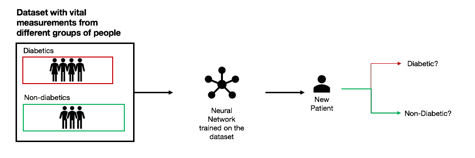

在接下来的部分，我们将简要探讨人工智能如何改变医疗行业。

# 医疗行业中的人工智能

除了利用机器学习预测糖尿病，整个医疗健康领域也正迎来人工智能的颠覆。根据埃森哲的一项研究，预计到 2021 年，人工智能在医疗行业的市场将迎来爆炸性增长，年复合增长率预计为 40%。这一显著增长主要受到人工智能和科技公司在医疗领域扩展的推动。

苹果公司首席执行官蒂姆·库克（Tim Cook）相信，苹果能够在医疗保健领域做出重大贡献。苹果对颠覆医疗保健的愿景可以通过其在可穿戴技术方面的进展来体现。2018 年，苹果发布了新一代智能手表，具有主动监测心血管健康的功能。苹果的智能手表现在可以实时进行心电图检查，甚至在心率异常时发出警告，这是心血管衰竭的早期征兆。苹果的智能手表还收集加速度计和陀螺仪的数据，以实时预测是否发生了重大跌倒。显然，人工智能对医疗保健的影响将是深远的。

人工智能在医疗保健中的价值不在于取代医生和其他医疗工作者，而在于增强他们的工作。人工智能有潜力在患者整个就医过程中支持医疗工作者，并通过数据帮助医疗工作者发现有关患者健康的见解。专家认为，人工智能在医疗保健领域的增长将集中在以下几个领域：

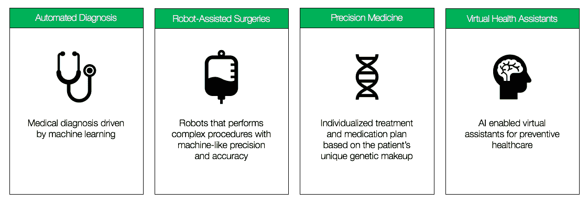

# 自动化诊断

让我们聚焦于自动化诊断，因为这是本项目关注的领域。专家们认为，人工智能将大大增强医学诊断的方式。目前，大多数医学诊断是由熟练的医疗专家进行的。在影像学诊断（如 X 光和 MRI 扫描）中，需要熟练的放射科医生提供诊断专业知识。这些经验丰富的医疗专家需要经过多年严格的培训才能获得认证，且某些国家的这类专家稀缺，导致了较差的诊疗效果。人工智能的作用是增强这些专家的能力，并卸载低级的日常诊断工作，这些工作可以由人工智能高效且准确地完成。

这与我们最初的问题陈述相呼应：使用人工智能预测哪些患者有糖尿病风险。正如我们将看到的，我们可以使用机器学习和神经网络来进行这一预测。在本章中，我们将设计并实现一个多层感知器（MLP），利用机器学习来预测糖尿病的发生。

# 糖尿病数据集

我们将用于本项目的数据集来自库马印第安人糖尿病数据集，由美国国家糖尿病、消化与肾脏疾病研究所提供（并由 Kaggle 托管）。

库马印第安人是生活在亚利桑那州的一群美洲土著人，由于他们遗传上容易患糖尿病，这群人得到了大量的研究。人们认为，库马印第安人携带一种基因，使得他们能够在长时间饥荒中生存。这种节俭基因使得库马印第安人能够将他们摄入的葡萄糖和碳水化合物储存在体内，这在经常发生饥荒的环境中具有遗传优势。

然而，随着社会的现代化，皮马印第安人开始改变饮食，转向加工食品，他们的 2 型糖尿病发病率也开始上升。如今，皮马印第安人中 2 型糖尿病的发病率是世界最高的。这使得他们成为一个高度研究的群体，研究人员试图找到皮马印第安人中糖尿病的遗传关联。

皮马印第安人糖尿病数据集包含从一组女性皮马印第安人样本中收集的诊断测量数据，以及一个标签，指示患者是否在初次测量后的五年内发展为糖尿病。在下一部分中，我们将对皮马印第安人糖尿病数据集进行探索性数据分析，以揭示数据中的重要洞察。

# 探索性数据分析

让我们深入数据集，以了解我们正在处理的数据类型。我们将数据集导入 pandas：

```py
import pandas as pd

df = pd.read_csv('diabetes.csv')
```

让我们快速查看数据集的前五行，通过调用`df.head()`命令：

```py
print(df.head())
```

我们得到以下输出：

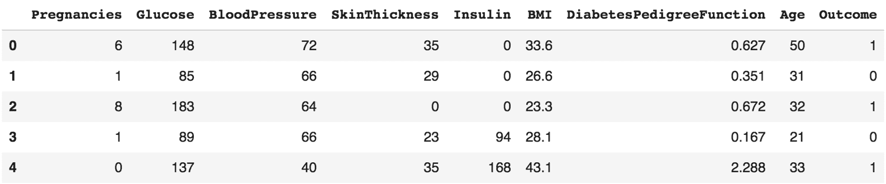

看起来数据集有九列，具体如下：

+   `Pregnancies`：之前怀孕的次数

+   `Glucose`：血浆葡萄糖浓度

+   `BloodPressure`：舒张压

+   `SkinThickness`：从三头肌测量的皮肤褶皱厚度

+   `Insulin`：血清胰岛素浓度

+   `BMI`：身体质量指数

+   `DiabetesPedigreeFunction`：一个总结性的分数，表示患者的糖尿病遗传易感性，基于患者的家族糖尿病记录推算得出

+   `Age`：年龄（以年为单位）

+   `Outcome`：我们试图预测的目标变量，`1`表示患者在初次测量后的五年内发展为糖尿病，`0`表示其他情况

让我们从可视化数据集中的九个变量的分布开始。我们可以通过绘制直方图来实现：

```py
from matplotlib import pyplot as plt 

df.hist()
plt.show()
```

我们得到以下输出：

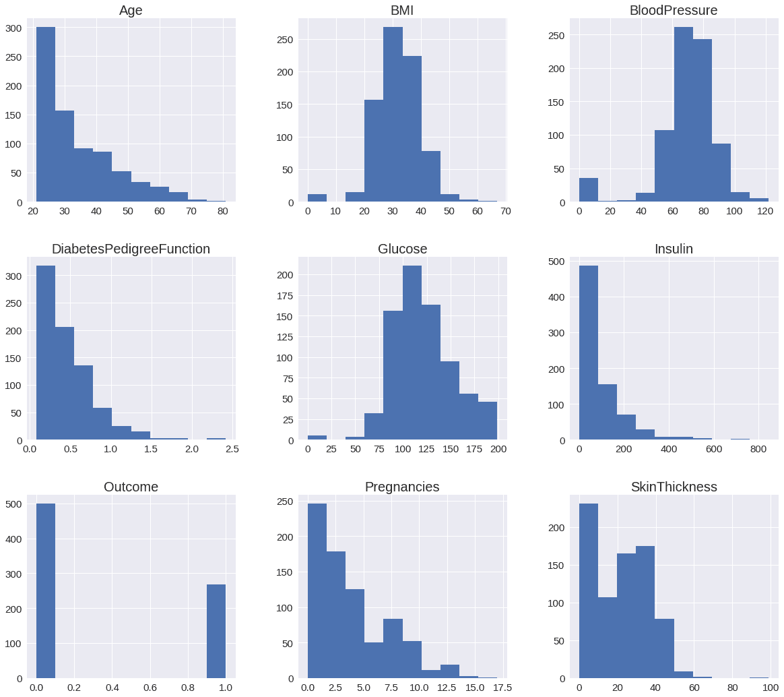

直方图提供了一些关于数据的有趣洞察。从`Age`的直方图中，我们可以看到大多数数据来自年轻人，最常见的年龄段是在 20 至 30 岁之间。我们还可以看到，`BMI`、`BloodPressure`和`Glucose`浓度的分布呈正态分布（即钟形曲线），这也是我们在从一个群体中收集这些统计数据时所期望的。然而，注意到`Glucose`浓度的分布尾部出现了一些极端值。看起来有些人的血浆`Glucose`浓度接近 200。分布的另一端，我们可以看到有些人`BMI`、`BloodPressure`和`Glucose`的值为 0。从逻辑上讲，我们知道这些测量值不可能为 0。这些是缺失值吗？我们将在下一部分的数据预处理章节中进一步探讨。

如果我们查看 `Pregnancies`（怀孕次数）这一变量的分布，我们也可以看到一些异常值。我们可以看到有些患者曾有超过 15 次的怀孕历史。虽然这可能并不完全令人惊讶，但在分析时我们应考虑这些异常值，因为它们可能会影响我们的结果。

结果分布显示，大约 65% 的人群属于类别 0（没有糖尿病），而其余 35% 属于类别 1（糖尿病）。在构建机器学习分类器时，我们应该始终牢记训练数据中类别的分布。为了确保我们的机器学习分类器在现实世界中表现良好，我们应该确保训练数据中的类别分布与现实世界相匹配。在这种情况下，类别的分布与现实世界并不匹配，因为据**世界卫生组织**（**WHO**）估计，全球仅有 8.5% 的人口患有糖尿病。

对于这个项目，我们不需要担心训练数据中类别的分布，因为我们并不会将分类器部署到现实世界中。然而，对于数据科学家和机器学习工程师来说，检查训练数据中类别的分布是一种良好的做法，以确保模型在现实世界中的表现。

最后，重要的是要注意这些变量的尺度不同。例如，`DiabetesPedigreeFunction` 变量的范围是从 0 到 ~2.5，而 `Insulin` 变量的范围是从 0 到 ~800。尺度的差异可能会导致训练神经网络时出现问题，因为尺度较大的变量往往会主导尺度较小的变量。在接下来的数据预处理部分，我们将讨论如何对变量进行标准化。

我们还可以绘制密度图来调查每个变量与目标变量之间的关系。为此，我们将使用 seaborn。seaborn 是一个基于 matplotlib 的 Python 数据可视化库。

以下代码片段展示了如何为每个变量绘制密度图。为了可视化糖尿病患者与非糖尿病患者之间分布的差异，我们还将在每个图上分别绘制它们：

```py
import seaborn as sns

# create a subplot of 3 x 3
plt.subplots(3,3,figsize=(15,15))

# Plot a density plot for each variable
for idx, col in enumerate(df.columns):
    ax = plt.subplot(3,3,idx+1)
    ax.yaxis.set_ticklabels([])
    sns.distplot(df.loc[df.Outcome == 0][col], hist=False, axlabel= False, 
    kde_kws={'linestyle':'-',  
    'color':'black', 'label':"No Diabetes"})
    sns.distplot(df.loc[df.Outcome == 1][col], hist=False, axlabel= False, 
    kde_kws={'linestyle':'--', 
    'color':'black', 'label':"Diabetes"})
    ax.set_title(col)

# Hide the 9th subplot (bottom right) since there are only 8 plots
plt.subplot(3,3,9).set_visible(False)

plt.show()
```

我们将得到如下截图所示的输出：

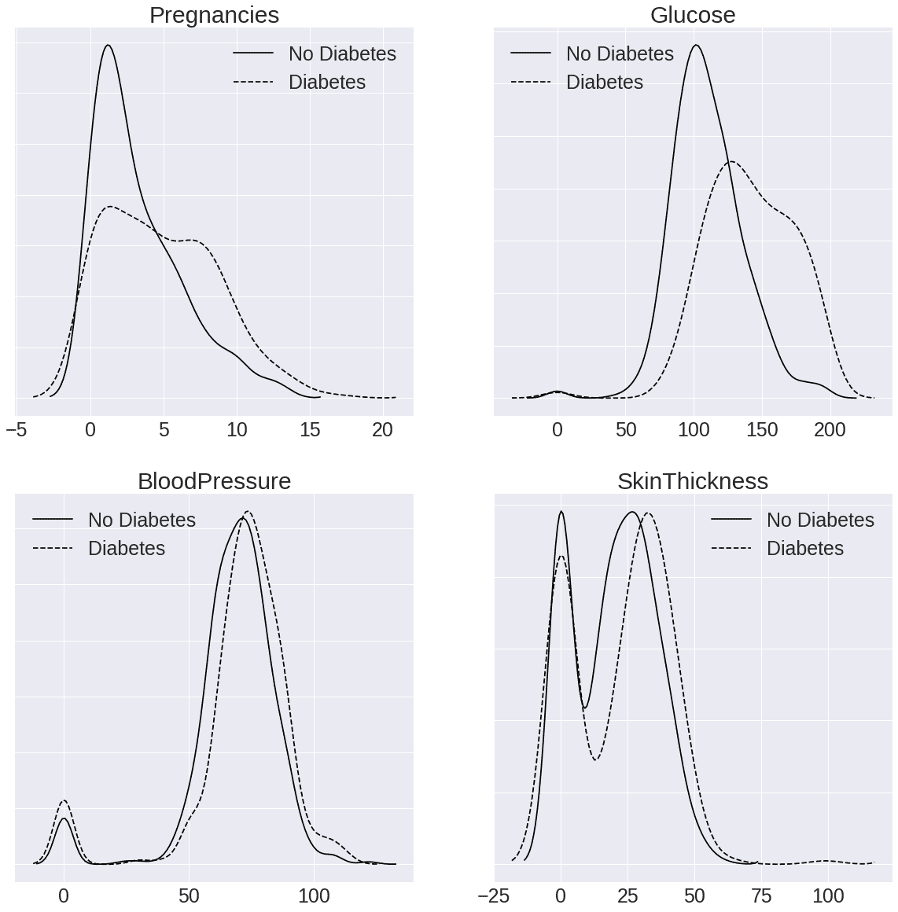

以下截图显示的是接续前一个截图的输出：

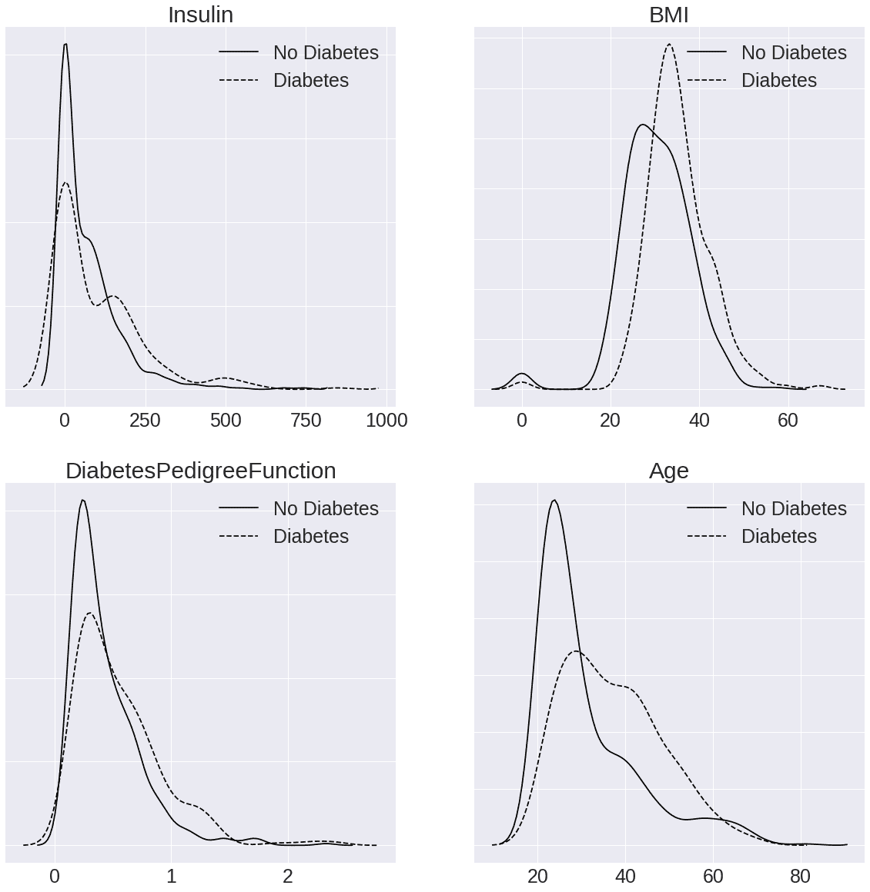

前面的密度图看起来比较复杂，但让我们集中分析每个单独的图，看看能从中获得哪些洞察。如果我们查看`Glucose`变量的图，我们可以看到，在非糖尿病患者（实线）中，曲线呈正态分布，集中在值 100 左右。这告诉我们，在非糖尿病患者中，大多数人的血糖值为 100 mg/dL。另一方面，如果我们查看糖尿病患者（虚线），曲线较宽，集中在值 150 左右。这告诉我们，糖尿病患者的血糖值范围较宽，且平均血糖值大约为 150 mg/dL。因此，糖尿病与非糖尿病患者之间的血糖值有显著差异。类似的分析也可以用于`BMI`和`Age`变量。换句话说，`Glucose`、`BMI`和`Age`变量是糖尿病的强预测因子。糖尿病患者往往有更高的血糖值、更高的 BMI，并且年纪较大。

另一方面，我们可以看到，对于像`BloodPressure`和`SkinThickness`这样的变量，糖尿病患者和非糖尿病患者在分布上没有显著差异。这两组人群的血压和皮肤厚度值相似。因此，`BloodPressure`和`SkinThickness`是糖尿病预测的较差指标。

# 数据预处理

在前一节*探索性数据分析*中，我们发现某些列中存在`0`值，表明存在缺失值。我们还看到这些变量的尺度不同，这可能会对模型性能产生负面影响。在本节中，我们将进行数据预处理以处理这些问题。

# 处理缺失值

首先，让我们调用`isnull()`函数来检查数据集中是否有缺失值：

```py
print(df.isnull().any())
```

我们将看到以下输出：

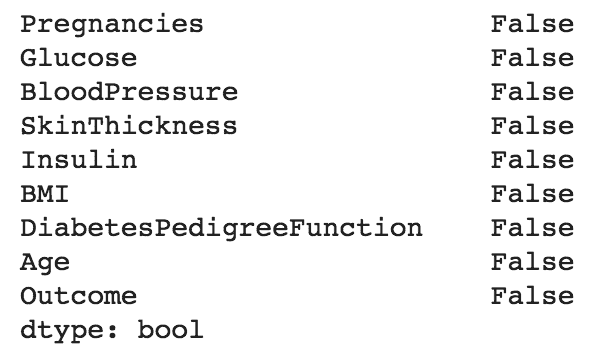

看起来数据集中没有缺失值，但我们确定吗？让我们获取数据集的统计摘要来进一步调查：

```py
print(df.describe())
```

输出结果如下：

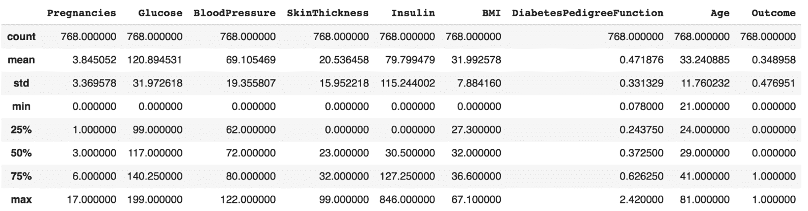

我们可以看到数据集中有`768`行数据，且`Pregnancies`、`Glucose`、`BloodPressure`、`SkinThickness`、`Insulin`和`BMI`列的最小值为`0`。这不太合理。`Glucose`、`BloodPressure`、`SkinThickness`、`Insulin`和`BMI`的测量值不应为`0`。这表明数据集中存在缺失值。值被记录为`0`可能是由于数据收集过程中出现了一些问题。也许设备故障，或者患者不愿意接受测量。

无论如何，我们需要处理这些`0`值。让我们看一下每列中有多少`0`值，以了解问题的严重程度：

```py
print("Number of rows with 0 values for each variable")
for col in df.columns:
    missing_rows = df.loc[df[col]==0].shape[0]
    print(col + ": " + str(missing_rows))
```

我们得到以下结果：

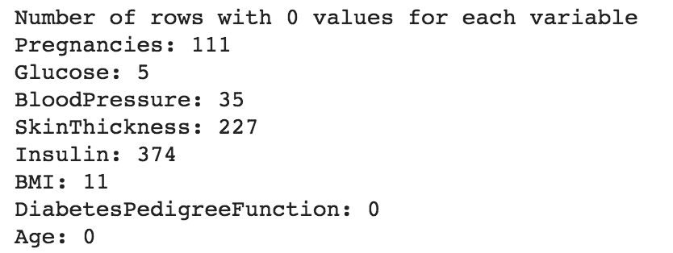

在`Insulin`列中，有`374`行值为`0`。这几乎占据了我们数据的一半！显然，我们不能丢弃这些`0`值的行，因为那样会导致模型性能显著下降。

有几种技术可以处理这些缺失值：

+   删除（丢弃）任何包含缺失值的行。

+   使用非缺失值的均值/中位数/众数来替换缺失值。

+   使用一个单独的机器学习模型预测实际值。

由于缺失值来自于连续变量，如`Glucose`、`BloodPressure`、`SkinThickness`、`Insulin`和`BMI`，我们将用非缺失值的均值来替换缺失值。

首先，让我们将`Glucose`、`BloodPressure`、`SkinThickness`、`Insulin`和`BMI`列中的`0`值替换为`NaN`。这样，pandas 就能理解这些值是无效的：

```py
import numpy as np

df['Glucose'] = df['Glucose'].replace(0, np.nan)
df['BloodPressure'] = df['BloodPressure'].replace(0, np.nan)
df['SkinThickness'] = df['SkinThickness'].replace(0, np.nan)
df['Insulin'] = df['Insulin'].replace(0, np.nan)
df['BMI'] = df['BMI'].replace(0, np.nan)
```

现在让我们确认`Glucose`、`BloodPressure`、`SkinThickness`、`Insulin`和`BMI`列中不再包含`0`值：

```py
print("Number of rows with 0 values for each variable")
for col in df.columns:
    missing_rows = df.loc[df[col]==0].shape[0]
    print(col + ": " + str(missing_rows))
```

我们得到了以下结果：

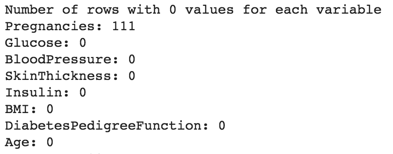

注意，我们没有修改`Pregnancies`列，因为该列中的`0`值（即没有怀孕）是完全有效的。

现在，让我们将`NaN`值替换为非缺失值的均值。我们可以使用 pandas 中便捷的`fillna()`函数来完成此操作：

```py
df['Glucose'] = df['Glucose'].fillna(df['Glucose'].mean())
df['BloodPressure'] = df['BloodPressure'].fillna(df['BloodPressure'].mean())
df['SkinThickness'] = df['SkinThickness'].fillna(df['SkinThickness'].mean())
df['Insulin'] = df['Insulin'].fillna(df['Insulin'].mean())
df['BMI'] = df['BMI'].fillna(df['BMI'].mean())
```

# 数据标准化

数据标准化是数据预处理中的另一项重要技术。数据标准化的目标是将数值变量转换，使得每个变量的均值为 0，方差为 1。

作为预处理步骤的变量标准化是许多机器学习算法的要求。在神经网络中，标准化数据非常重要，以确保反向传播算法按预期工作。数据标准化的另一个积极效果是它缩小了变量的量级，将它们转换为更加成比例的尺度。

正如我们之前看到的，像`Insulin`和`DiabetesPedigreeeFunction`这样的变量具有非常不同的量纲；`Insulin`的最大值为`846`，而`DiabetesPedigreeeFunction`的最大值仅为`2.42`。在如此不同的量纲下，量纲较大的变量在训练神经网络时往往会占主导地位，从而导致神经网络无意中对量纲较大的变量给予更多的关注。

为了标准化数据，我们可以使用来自 scikit-learn 的`preprocessing`类。让我们从 scikit-learn 导入`preprocessing`类，并使用它来对数据进行缩放：

```py
from sklearn import preprocessing

df_scaled = preprocessing.scale(df)
```

由于`preprocessing.scale()`函数返回的对象不再是 pandas DataFrame，我们需要将其转换回：

```py
df_scaled = pd.DataFrame(df_scaled, columns=df.columns)
```

最后，由于我们不想对`Outcome`列（即我们要预测的目标变量）进行标准化，因此我们将使用原始的`Outcome`列：

```py
df_scaled['Outcome'] = df['Outcome']
df = df_scaled
```

让我们查看每个转换后变量的均值、标准差和最大值：

```py
print(df.describe().loc[['mean', 'std','max'],].round(2).abs())
```

我们得到以下结果：

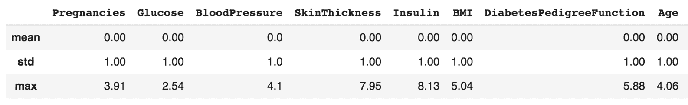

我们可以看到，每个变量的尺度现在更接近彼此。

# 将数据分为训练集、测试集和验证集

数据预处理的最后一步是将数据分为训练集、测试集和验证集：

+   **训练集**：神经网络将在这个数据子集上进行训练。

+   **验证集**：这一数据集允许我们使用无偏的数据源进行超参数调优（即调节隐藏层的数量）。

+   **测试集**：神经网络的最终评估将基于这个数据子集。

将数据分为训练集、测试集和验证集的目的是避免过拟合，并为评估模型性能提供一个无偏的数据来源。通常，我们会使用训练集和验证集来调整和改进我们的模型。验证集可以用于训练的早停，即我们只在验证集上的模型性能停止提高时继续训练神经网络。这可以帮助我们避免神经网络的过拟合。

测试集也被称为保留数据集，因为神经网络永远不会使用它进行训练。相反，我们将在最后使用测试集来评估模型。这为我们提供了一个准确反映模型在实际世界中表现的标准。

我们如何决定每个分割的比例？在这种情况下，竞争的关注点是，如果我们将大部分数据分配用于训练，模型的性能会提升，但可能会牺牲我们避免过拟合的能力。同样，如果我们将大部分数据分配用于验证和测试，模型性能会下降，因为可能没有足够的数据用于训练。

一般经验法则是，我们应将原始数据分割为 80%的训练集和 20%的测试集，然后将训练数据再分割为 80%的训练集和 20%的验证集。下图展示了这一过程：

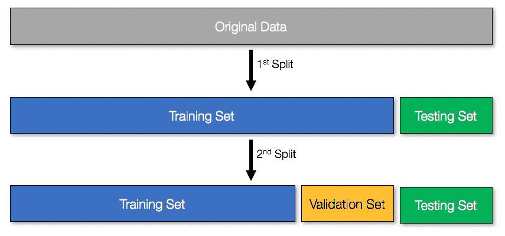

一个重要的要点是，数据的分割必须是随机的。如果我们使用非随机的方法进行数据分割（例如，将前 80%的行分配到**训练集**，将后 20%的行分配到**测试集**），可能会引入偏差。例如，原始数据可能按时间顺序排序，因此使用非随机的分割方法可能意味着我们的模型只会在某个日期的数据上进行训练，这样的偏差非常大，并且在现实世界中表现不佳。

`train_test_split`函数来自 scikit-learn，它可以轻松地实现数据集的随机分割。

首先，让我们将数据集分为`X`（输入特征）和`y`（目标变量）：

```py
from sklearn.model_selection import train_test_split

X = df.loc[:, df.columns != 'Outcome']
y = df.loc[:, 'Outcome']
```

然后，根据前面的图示，第一次拆分将数据划分为训练集（80%）和测试集（20%）：

```py
X_train, X_test, y_train, y_test = train_test_split(X, y, test_size=0.2)
```

最后，进行第二次拆分，创建最终的训练集和验证集：

```py
X_train, X_val, y_train, y_val = train_test_split(X_train, y_train, test_size=0.2)
```

# MLP

现在我们已经完成了探索性数据分析和数据预处理，接下来我们将把注意力转向神经网络架构的设计。在这个项目中，我们将使用 MLP。

MLP 是一类前馈神经网络，它与我们在第一章《机器学习与神经网络 101》中讨论的单层感知器的区别在于，MLP 至少有一个隐藏层，每个层都通过非线性激活函数进行激活。这样的多层神经网络架构和非线性激活函数使得 MLP 能够产生非线性决策边界，这在像 Pima 印度糖尿病数据集这样的多维真实世界数据集中至关重要。

# 模型架构

MLP 的模型架构可以图示如下：

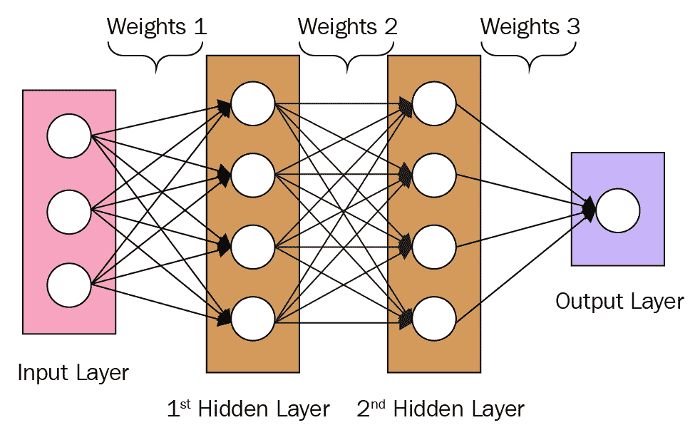

如第一章《机器学习与神经网络 101》中讨论的那样，我们可以在 MLP 中使用任意数量的隐藏层。对于这个项目，我们将在 MLP 中使用两个隐藏层。

# 输入层

**输入层**（由粉色矩形中的圆圈表示）中的每个节点代表数据集中的每个特征（即每一列）。由于 Pima 印度数据集中有八个特征，因此在我们的 MLP 的输入层中应有八个节点。

# 隐藏层

输入层之后的下一层称为**隐藏层**。正如我们在第一章《机器学习与神经网络 101》中所看到的，隐藏层接收输入层并应用**非线性激活函数**。从数学角度来看，我们可以将隐藏层的函数表示如下：


表示来自前一层的输入，表示非线性激活函数，是权重，表示偏置。

为了简化，我们在这个项目中仅使用两个隐藏层。增加隐藏层的数量往往会增加模型的复杂性和训练时间。对于这个项目来说，两个隐藏层就足够了，稍后我们将在查看模型性能时看到这一点。

# 激活函数

在设计神经网络模型架构时，我们还需要决定为每一层使用哪些激活函数。激活函数在神经网络中扮演着重要角色。你可以把激活函数看作是神经网络中的*变换器*；它们接受一个输入值，变换这个输入值，并将变换后的值传递给下一层。

在本项目中，我们将使用**修正线性单元**（**ReLU**）和**sigmoid**作为我们的激活函数。

# ReLU

一般来说，ReLU 总是作为中间隐藏层（即非输出层）的激活函数使用。2011 年，研究人员证明，ReLU 在训练**深度神经网络**（**DNNs**）方面优于所有以前使用的激活函数。如今，ReLU 已成为 DNNs 中最受欢迎的激活函数选择，并且已成为默认的激活函数选择。

从数学角度看，我们可以将 ReLU 表示如下：


ReLU 函数的作用是仅考虑原始函数的非负部分，**，并将负部分视为*0*。下图说明了这一点：

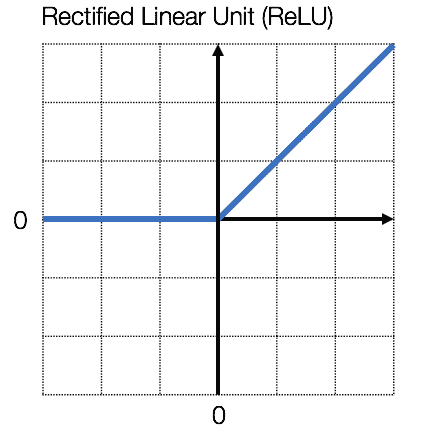

# Sigmoid 激活函数

对于最终的输出层，我们需要一个激活函数来预测标签的类别。在本项目中，我们做的是一个简单的二分类预测：1 表示患有糖尿病的患者，0 表示没有糖尿病的患者。Sigmoid 激活函数非常适合二分类问题。

从数学角度看，我们可以将 sigmoid 激活函数表示如下：

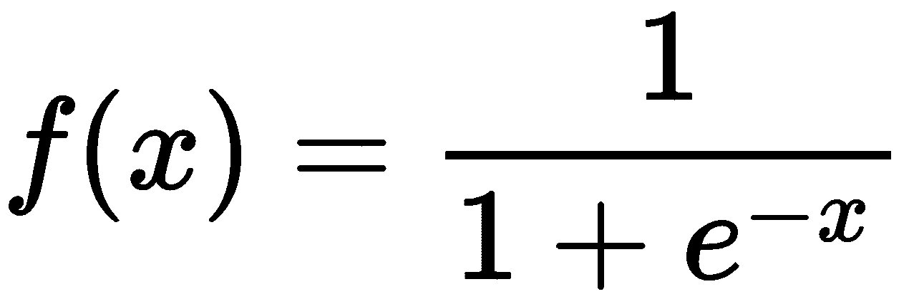

虽然这看起来很复杂，但其底层函数实际上非常简单。**Sigmoid 激活函数**只是将一个值压缩到**0**和**1**之间：

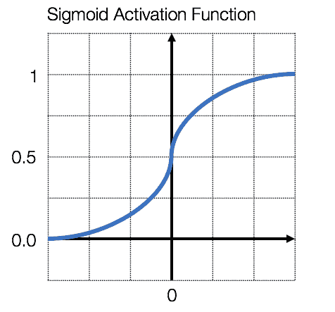

如果变换后的值 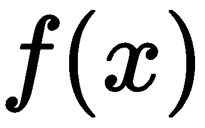 大于 **0.5**，那么我们将其分类为 **1** 类。类似地，如果变换后的值小于 **0.5**，我们将其分类为 **0** 类。**Sigmoid 激活函数**允许我们接受一个输入值，并输出一个二进制分类（**1** 或 **0**），这正是本项目所需要的（即预测一个人是否患有糖尿病）。

# 在 Python 中使用 Keras 构建模型

我们终于准备好在 Keras 中构建并训练我们的 MLP。

# 模型构建

正如我们在第一章《机器学习与神经网络 101》中提到的，Keras 中的 `Sequential()` 类允许我们像搭积木一样构建神经网络，将各层叠加在一起。

让我们创建一个新的 `Sequential()` 类：

```py
from keras.models import Sequential

model = Sequential()
```

接下来，让我们堆叠第一个隐藏层。第一个隐藏层将有 32 个节点，输入维度为 8（因为`X_train`有 8 列）。注意，对于第一个隐藏层，我们需要指定输入维度。之后，Keras 会自动处理其他隐藏层的尺寸兼容性。

另一个需要注意的点是，我们随意决定了第一个隐藏层的节点数量。这个变量是一个超参数，应该通过反复试验来仔细选择。在这个项目中，我们跳过了超参数调优，直接使用 32 作为节点数量，因为对于这个简单数据集来说，它不会带来太大差异。

让我们添加第一个隐藏层：

```py
from keras.layers import Dense
# Add the first hidden layer
model.add(Dense(32, activation='relu', input_dim=8))
```

使用的`activation`函数是`relu`，如前一节所讨论。

接下来，让我们堆叠第二个隐藏层。添加更多的隐藏层会增加模型的复杂度，但有时可能导致模型过拟合。对于这个项目，我们只使用两个隐藏层，因为这足以生成一个令人满意的模型。

让我们添加第二个隐藏层：

```py
# Add the second hidden layer
model.add(Dense(16, activation='relu'))
```

最后，通过添加输出层来完成 MLP。这个层只有一个节点，因为我们在做二分类任务。使用的`activation`函数是`sigmoid`函数，它将输出值*压缩*在 0 和 1 之间（二值输出）。

现在我们按照如下方式添加输出层：

```py
# Add the output layer
model.add(Dense(1, activation='sigmoid'))
```

# 模型编译

在我们开始训练模型之前，我们需要定义训练过程的参数，这可以通过`compile`方法来完成。

在训练过程中，我们需要定义三个不同的参数：

+   **优化器**：我们使用`adam`优化器，它是 Keras 中常用的优化器。对于大多数数据集，`adam`优化器通常无需过多调节就能良好运行。

+   **损失函数**：我们将使用`binary_crossentropy`作为我们的`loss`函数，因为我们面临的是一个二分类问题。

+   **评估指标**：我们将使用`accuracy`（即正确分类样本的百分比）作为我们的评估指标。

然后，我们可以按照以下方式运行`compile()`函数：

```py
# Compile the model
model.compile(optimizer='adam',
              loss='binary_crossentropy',
              metrics=['accuracy'])
```

# 模型训练

为了训练我们在前面步骤中定义的 MLP 模型，让我们调用`fit`函数。我们将训练模型`200`次迭代：

```py
# Train the model for 200 epochs
model.fit(X_train, y_train, epochs=200)
```

我们得到了以下结果：

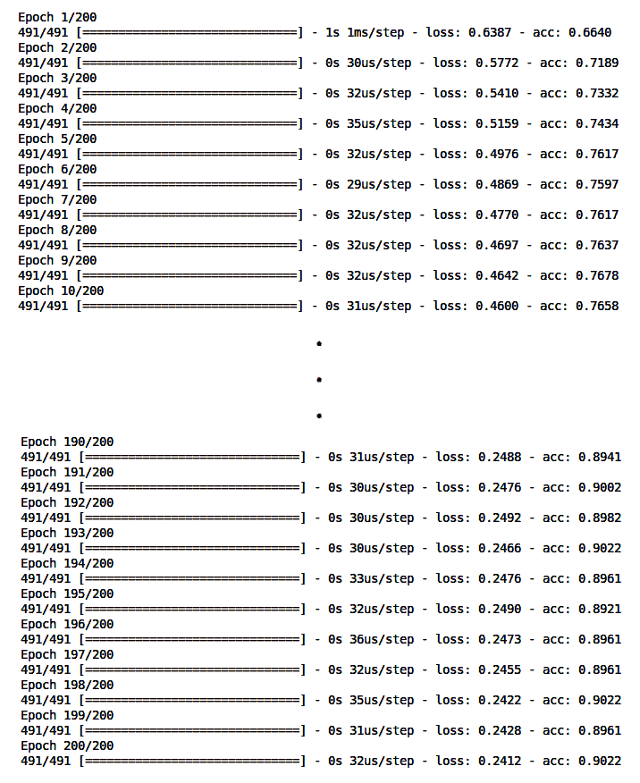

如我们所见，随着每个周期的进行，损失值在减少，准确率在增加，因为学习算法根据训练数据不断更新 MLP 中的权重和偏差。请注意，前述截图中显示的准确率是基于训练数据的。在下一节中，我们将看看基于测试数据的 MLP 表现以及其他一些重要指标。

# 结果分析

成功训练了 MLP 后，让我们基于测试准确率、混淆矩阵和**接收者操作特征**（**ROC**）曲线来评估模型。

# 测试准确度

我们可以使用`evaluate()`函数评估我们的训练集和测试集模型表现：

```py
scores = model.evaluate(X_train, y_train)
print("Training Accuracy: %.2f%%\n" % (scores[1]*100))

scores = model.evaluate(X_test, y_test)
print("Testing Accuracy: %.2f%%\n" % (scores[1]*100))
```

我们得到了以下结果：

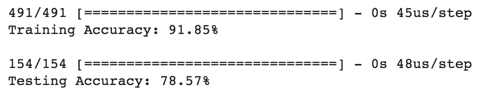

在训练集和测试集上的准确率分别为 91.85%和 78.57%。训练集和测试集之间的准确率差异并不令人惊讶，因为模型是在训练集上进行训练的。事实上，通过多次迭代训练模型，我们可以在训练集上达到 100%的准确率，但那并不理想，因为这意味着我们过拟合了模型。测试准确度应该始终用于评估我们模型的实际表现，因为测试集代表了模型之前从未见过的真实世界数据。

78.57%的测试准确率对于我们这个仅有两个隐藏层的简单 MLP 来说相当令人印象深刻。这意味着，给定来自一位新患者的八个测量值（如血糖、血压、胰岛素等），我们的 MLP 能够以约 80%的准确率预测该患者是否会在未来五年内发展为糖尿病。从本质上讲，我们已经开发出了我们的第一个 AI 代理！

# 混淆矩阵

混淆矩阵是一个有用的可视化工具，它提供了关于模型所做的真负例、假正例、假负例和真正例的分析。除了简单的准确度指标外，我们还应查看混淆矩阵，以了解模型的表现。

真负例、假正例、假负例和真正例的定义如下：

+   **真负例**：实际类别为负（无糖尿病），模型预测为负（无糖尿病）

+   **假正例**：实际类别为负（无糖尿病），但模型预测为正（糖尿病）

+   **假负例**：实际类别为正（糖尿病），但模型预测为负（无糖尿病）

+   **真正例**：实际类别为正（糖尿病），模型预测为正（糖尿病）

显然，我们希望假正例和假负例的数量尽可能低，而真负例和真正例的数量尽可能高。

我们可以使用`sklearn`中的`confusion``_matrix`类构建混淆矩阵，并使用`seaborn`进行可视化：

```py
from sklearn.metrics import confusion_matrix
import seaborn as sns

y_test_pred = model.predict_classes(X_test)
c_matrix = confusion_matrix(y_test, y_test_pred)
ax = sns.heatmap(c_matrix, annot=True, 
                 xticklabels=['No Diabetes','Diabetes'],
                 yticklabels=['No Diabetes','Diabetes'], 
                 cbar=False, cmap='Blues')
ax.set_xlabel("Prediction")
ax.set_ylabel("Actual")
```

结果如下：

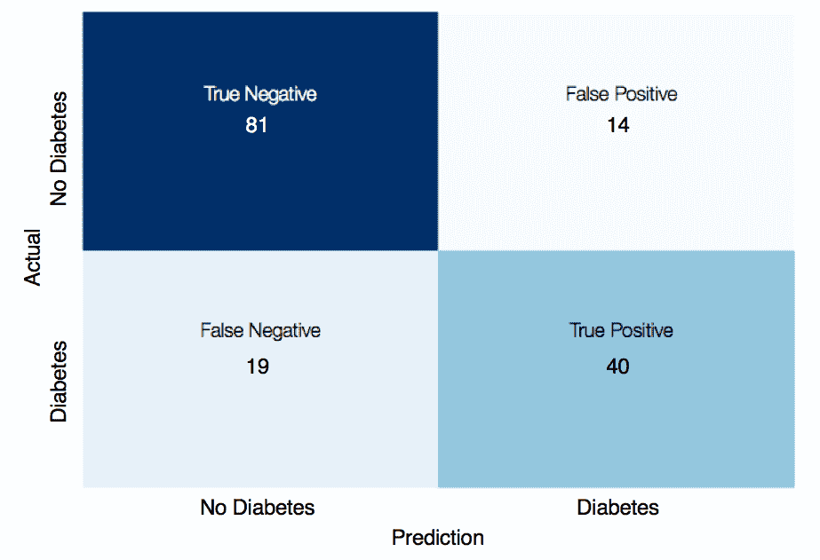

从前面的混淆矩阵中，我们可以看到大多数预测是**真负例**和**真正例**（如上一节中提到的 78.57%的测试准确率所示）。其余的 19 个预测为**假负例**，另有 14 个预测为**假正例**，这些都是不理想的。

对于糖尿病预测来说，假阴性可能比假阳性更具破坏性。假阴性意味着告诉病人他们在接下来的五年内不会得糖尿病，然而事实上他们会得。因此，当我们评估不同模型在预测糖尿病发生方面的表现时，假阴性较少的模型更为理想。

# ROC 曲线

对于分类任务，我们也应该查看 ROC 曲线来评估我们的模型。ROC 曲线是一个图表，**真正阳性率**（**TPR**）位于 *y* 轴，**假阳性率**（**FPR**）位于 *x* 轴。TPR 和 FPR 定义如下：


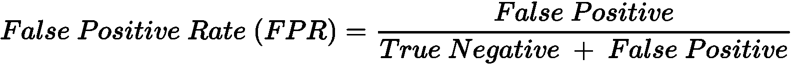

当我们分析 ROC 曲线时，我们会查看**曲线下的面积**（**AUC**）来评估生成该曲线的模型的性能。较大的 AUC 表明模型能够高准确率地区分不同类别，而较小的 AUC 则表明模型预测不佳，常常出错。位于对角线上的 ROC 曲线表明模型的表现与随机猜测没有区别。以下图示说明了这一点：

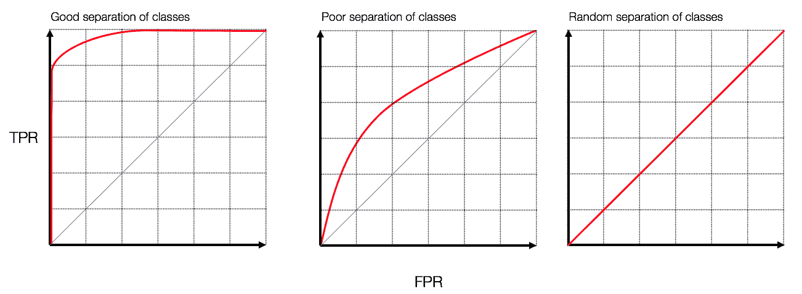

让我们绘制模型的 ROC 曲线并分析其性能。和往常一样，scikit-learn 提供了一个有用的 `roc_curve` 类来帮助我们实现这一点。但首先，让我们使用 `predict()` 函数获取每个类别的预测概率：

```py
from sklearn.metrics import roc_curve
import matplotlib.pyplot as plt

y_test_pred_probs = model.predict(X_test)
```

然后，运行 `roc_curve` 函数，以获得对应的假阳性率和真正阳性率，用于绘制 ROC 曲线：

```py
FPR, TPR, _ = roc_curve(y_test, y_test_pred_probs)
```

现在使用 matplotlib 绘制图表中的值：

```py
plt.plot(FPR, TPR)
plt.plot([0,1],[0,1],'--', color='black') #diagonal line
plt.title('ROC Curve')
plt.xlabel('False Positive Rate')
plt.ylabel('True Positive Rate')
```

我们得到以下结果：

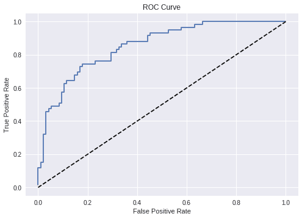

从之前的**ROC 曲线**中，我们可以看到该模型表现相当不错，接近前面图示中的**ROC 曲线**。这表明我们的模型能够有效地区分不同类别的样本，做出准确预测。

# 进一步改进

此时，值得思考是否有可能进一步提高我们模型的性能。我们如何才能进一步提高模型的准确性和/或改善假阴性率和假阳性率？

一般来说，性能上的任何局限性通常是由于数据集中缺乏强特征，而不是所使用神经网络的复杂性。皮马印第安人糖尿病数据集仅包含八个特征，可以说单靠这些特征不足以真正预测糖尿病的发生。

增加我们提供给模型的特征数量的一种方式是通过**特征工程**。特征工程是利用领域知识为机器学习算法创建新特征的过程。特征工程是数据科学中最重要的方面之一。事实上，许多过去的 Kaggle 竞赛获胜者将他们的成功归功于特征工程，而不仅仅是机器学习模型的调优。然而，特征工程是一把双刃剑，必须谨慎进行。添加不合适的特征可能会为我们的机器学习模型带来噪声，进而影响模型的性能。

在相反的方向上，我们也可以考虑去除某些特征以提高模型的性能。这被称为**特征选择**。当我们认为原始数据集包含太多噪声时，可以使用特征选择，去除那些噪声特征（即不强的预测特征），以改善模型性能。使用决策树是进行特征选择的常见方法。

决策树是一类具有树状数据结构的独立机器学习模型。决策树的优点在于它根据某些统计标准计算并排序最重要的特征。我们可以首先使用决策树拟合数据，然后利用决策树的输出去除被认为不重要的特征，最后将减少后的数据集输入神经网络。再次强调，特征选择是一把双刃剑，可能会影响模型的性能。

尽管在本项目中没有进行特征工程和特征选择，但我们将在后续章节的其他项目中看到它们的应用，因为我们将逐步处理更具挑战性的问题。

# 总结

在本章中，我们设计并实现了一个多层感知机（MLP），该模型能够以约 80%的准确率预测糖尿病的发生。

我们首先进行了探索性数据分析，查看了每个变量的分布情况，以及各个变量与目标变量之间的关系。然后，我们进行了数据预处理，去除了缺失数据，并对数据进行了标准化处理，使每个变量的均值为 0，标准差为 1。最后，我们将原始数据随机划分为训练集、验证集和测试集。

接着，我们查看了我们使用的 MLP 的架构，该网络包含 2 个隐藏层，第一个隐藏层有 32 个节点，第二个隐藏层有 16 个节点。然后，我们在 Keras 中使用顺序模型实现了这个 MLP，顺序模型允许我们将各层叠加在一起。接下来，我们使用训练集训练了我们的 MLP，在 200 次迭代中，Keras 使用 Adam 优化算法逐步调整神经网络中的权重和偏置，逐渐提高模型的准确性。

最后，我们使用测试准确率、混淆矩阵和 ROC 曲线等指标评估了我们的模型。我们看到了在评估模型时，查看假阴性和假阳性等指标的重要性，以及假阴性和假阳性在预测糖尿病发作的分类器中特别重要。

这结束了使用简单的 MLP 预测糖尿病发作的章节。在下一章节，第三章，*使用深度前馈网络预测出租车费用*，我们将使用一个更复杂的数据集，该数据集利用时间和地理位置信息来预测出租车费用。

# 问题

1.  我们如何绘制 pandas DataFrame 中每个变量的直方图？为什么直方图很有用？

我们可以通过调用 `df.hist()` 函数来绘制直方图，该函数内置于 pandas DataFrame 类中。直方图提供了数值数据分布的准确表示。

1.  我们如何检查 pandas DataFrame 中的缺失值（NaN 值）？

我们可以调用 `df.isnull().any()` 函数，轻松检查数据集中每一列是否有缺失值。

1.  除了 NaN 值，还有哪些类型的缺失值可能出现在数据集中？

缺失值也可能以 0 值的形式出现。由于数据收集过程中可能出现某些问题，缺失值常常以 0 记录在数据集中——可能是设备故障，或者存在其他阻碍数据收集的问题。

1.  为什么在用数据训练神经网络之前，删除数据集中的缺失值是至关重要的？

神经网络无法处理 NaN 值。由于神经网络在前向传播和反向传播过程中执行的数学运算，所有输入都必须是数值型的。

1.  数据标准化做了什么？为什么在用数据训练神经网络之前进行数据标准化很重要？

数据标准化的目标是将数值变量转换，使得每个变量的均值为零，方差为单位。当训练神经网络时，确保数据已经标准化非常重要。这能确保在训练神经网络时，规模较大的特征不会主导规模较小的特征。

1.  我们如何拆分数据集以确保模型性能的无偏评估？

在训练神经网络之前，我们应该将数据集分为训练集、验证集和测试集。神经网络将在训练集上训练，而验证集允许我们使用无偏的数据源进行超参数调整。最后，测试集提供了一个无偏的数据源，用于评估神经网络的性能。

1.  MLP 模型架构的特征是什么？

MLP（多层感知机）是前馈神经网络，至少有一层隐藏层，每一层都由非线性激活函数激活。这个多层神经网络架构和非线性激活使得 MLP 能够产生非线性的决策边界。

1.  神经网络中激活函数的作用是什么？

激活函数对权重和偏差进行非线性转换，然后再传递到下一层。最常见且有效的隐藏层激活函数是 ReLU 激活函数。

1.  在训练神经网络进行二分类问题时，应该使用什么样的损失函数？

二元交叉熵是训练神经网络进行二分类问题时最合适的损失函数。

1.  混淆矩阵代表什么，我们如何利用它来评估神经网络的性能？

混淆矩阵提供了我们神经网络在真正负类、假正类、假负类和真正正类上的值。除了简单的准确性指标外，混淆矩阵还可以让我们深入了解神经网络所犯的错误类型（假正类和假负类）。
