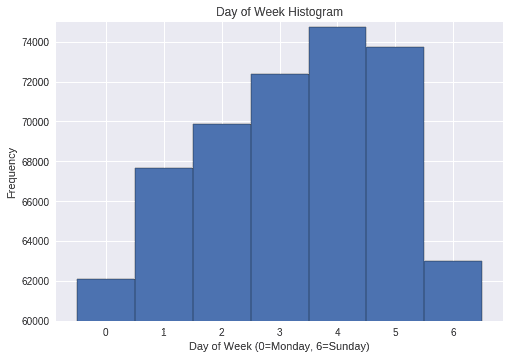
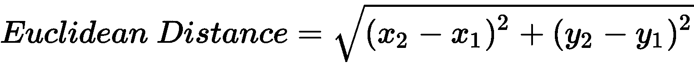

# 第三章：使用深度前馈网络预测出租车费用

在本章中，我们将使用深度前馈神经网络预测**纽约市**（**NYC**）的出租车费用，输入包括接送地点等。

在上一章，第二章，*使用多层感知器预测糖尿病*，我们看到如何使用具有两个隐藏层的 MLP 执行分类任务（患者是否有糖尿病风险）。在本章中，我们将构建一个深度神经网络来执行回归任务，即估算出租车费用。正如我们所见，我们需要一个更深的（即更复杂的）神经网络来实现这一目标。

本章将涵盖以下主题：

+   我们要解决的问题的动机——准确预测出租车费用

+   机器学习中的分类问题与回归问题

+   对纽约市出租车费用数据集的深入分析，包括地理位置数据可视化

+   深度前馈神经网络的架构

+   在 Keras 中训练用于回归问题的深度前馈神经网络

+   我们结果的分析

# 技术要求

本章所需的关键 Python 库如下：

+   matplotlib 3.0.2

+   pandas 0.23.4

+   Keras 2.2.4

+   NumPy 1.15.2

+   scikit-learn 0.20.2

要下载本项目所需的数据集，请参阅[`raw.githubusercontent.com/PacktPublishing/Neural-Network-Projects-with-Python/master/Chapter03/how_to_download_the_dataset.txt`](https://raw.githubusercontent.com/PacktPublishing/Neural-Network-Projects-with-Python/master/chapter3/how_to_download_the_dataset.txt)中的说明。

本章的代码可以在本书的 GitHub 仓库中找到，地址为[`github.com/PacktPublishing/Neural-Network-Projects-with-Python`](https://github.com/PacktPublishing/Neural-Network-Projects-with-Python)。

要将代码下载到你的计算机，请运行以下`git clone`命令：

```py
$ git clone https://github.com/PacktPublishing/Neural-Network-Projects-with-Python.git
```

处理完成后，将会生成一个名为`Neural-Network-Projects-with-Python`的文件夹。通过运行以下命令进入该文件夹：

```py
$ cd Neural-Network-Projects-with-Python
```

要在虚拟环境中安装所需的 Python 库，请运行以下命令：

```py
$ conda env create -f environment.yml
```

请注意，在运行此命令之前，你应该先在计算机上安装了 Anaconda。要进入虚拟环境，请运行以下命令：

```py
$ conda activate neural-network-projects-python
```

通过运行以下命令进入`Chapter03`文件夹：

```py
$ cd Chapter03
```

以下文件位于此文件夹中：

+   `main.py`：这是神经网络的主要代码。

+   `utils.py`：此文件包含辅助工具代码，帮助我们实现神经网络。

+   `visualize.py`：此文件包含所有必要的代码，用于探索性数据分析和数据可视化。本章中的每个图表都可以通过运行此文件重新创建。

要运行神经网络的代码，只需执行`main.py`文件：

```py
$ python main.py
```

要重现本章中涵盖的数据可视化，执行`visualize.py`文件：

```py
$ python visualize.py
```

# 预测纽约市出租车费用

纽约市的黄色出租车可能是城市中最具标志性的象征之一。纽约市数以万计的通勤者依靠出租车在这个繁华的大都市中进行交通。近年来，纽约市的出租车行业受到 Uber 等乘车应用的日益增加的压力。

为了应对乘车应用的挑战，纽约市的黄色出租车正在寻求现代化运营，并提供与 Uber 相当的用户体验。2018 年 8 月，纽约市出租车和豪华轿车管理委员会推出了一个新的应用程序，允许通勤者通过手机预订黄色出租车。该应用程序在乘车前提供预先定价。创建一个算法以提供预先定价并不是一件简单的事情。该算法需要考虑各种环境变量，如交通状况、时间和上下车地点，以便准确预测车费。利用机器学习是实现这一目标的最佳方式。到本章结束时，您将创建并训练一个神经网络来实现这一目标。

# 纽约市出租车费用数据集

我们将在此项目中使用的数据集是 Kaggle 提供的纽约市出租车费用数据集。原始数据集包含来自 2009 年至 2015 年的 5500 万次行程记录，包括上车和下车地点、乘客数量和上车时间。这个数据集为在机器学习项目中使用大数据集提供了有趣的机会，同时也可以可视化地理位置数据。

# 探索性数据分析

让我们直接深入数据集。下载纽约市出租车费用数据集的说明可以在本书的 GitHub 存储库中找到（请参阅*技术要求*部分）。与上一章不同的是，第二章，*使用多层感知器预测糖尿病*，我们不打算导入 5500 万行的原始数据集。事实上，大多数计算机无法将整个数据集存储在内存中！相反，让我们只导入前 500 万行。这样做确实有其缺点，但这是在有效使用数据集的必要权衡。

要做到这一点，使用`pandas`的`read_csv()`函数：

```py
import pandas as pd

df = pd.read_csv('NYC_taxi.csv', parse_dates=['pickup_datetime'], nrows=500000)
```

`read_csv`中的`parse_dates`参数允许`pandas`轻松识别某些列作为日期，这使我们可以灵活处理这些`datetime`值，正如我们将在本章后面看到的那样。

通过调用`df.head()`命令，让我们看看数据集的前五行：

```py
print(df.head())
```

我们得到以下输出：


我们可以看到数据集中有八列：

+   `key`：这一列看起来与`pickup_datetime`列相同。它可能是数据库中作为唯一标识符使用的。我们可以安全地删除这一列，而不会丢失任何信息。

+   `fare_amount`：这是我们尝试预测的目标变量，即旅行结束时支付的票价金额。

+   `pickup_datetime`：这一列包含了接送日期（年份、月份、日）以及时间（小时、分钟、秒）。

+   `pickup_longitude`和`pickup_latitude`：接送地点的经度和纬度。

+   `dropoff_longitude`和`dropoff_latitude`：下车地点的经度和纬度。

+   `passenger_count`：乘客数量。

# 可视化地理位置信息

接送地点的经纬度数据对于预测票价至关重要。毕竟，纽约市出租车的票价主要由行驶的距离决定。

首先，让我们了解纬度和经度代表什么。纬度和经度是地理坐标系统中的坐标。基本上，纬度和经度允许我们通过一组坐标来指定地球上的任何位置。

以下图显示了**纬度**和**经度**坐标系统：


我们可以把地球看作是一个散点图，**经度**和**纬度**是坐标轴。然后，地球上的每个位置就只是散点图上的一个点。事实上，来，我们就按这个方式做；让我们在散点图上绘制接送和下车的纬度和经度。

首先，让我们将数据点限制为仅包含纽约市的接送和下车位置。纽约市的经度范围大致为`-74.05`到`-73.75`，纬度范围为`40.63`到`40.85`：

```py
# range of longitude for NYC
nyc_min_longitude = -74.05
nyc_max_longitude = -73.75

# range of latitude for NYC
nyc_min_latitude = 40.63
nyc_max_latitude = 40.85

df2 = df.copy(deep=True)
for long in ['pickup_longitude', 'dropoff_longitude']:
    df2 = df2[(df2[long] > nyc_min_longitude) & (df2[long] <
                                                 nyc_max_longitude)]

for lat in ['pickup_latitude', 'dropoff_latitude']:
    df2 = df2[(df2[lat] > nyc_min_latitude) & (df2[lat] < 
                                               nyc_max_latitude)]
```

请注意，我们将原始数据框`df`复制到一个新的数据框`df2`中，以避免覆盖原始数据框。

现在，让我们定义一个新函数，该函数将以我们的数据框作为输入，并在散点图上绘制接送位置。我们还希望在散点图上叠加一些纽约市的关键地标。快速的谷歌搜索告诉我们，纽约市有两个主要机场（JFK 和拉瓜迪亚机场），它们的坐标，以及纽约市的主要区县如下：

```py
landmarks = {'JFK Airport': (-73.78, 40.643),
             'Laguardia Airport': (-73.87, 40.77),
             'Midtown': (-73.98, 40.76),
             'Lower Manhattan': (-74.00, 40.72),
             'Upper Manhattan': (-73.94, 40.82),
             'Brooklyn': (-73.95, 40.66)}
```

这是我们使用`matplotlib`绘制接送位置散点图的函数：

```py
import matplotlib.pyplot as plt

def plot_lat_long(df, landmarks, points='Pickup'):
    plt.figure(figsize = (12,12)) # set figure size
    if points == 'pickup':
        plt.plot(list(df.pickup_longitude), list(df.pickup_latitude), 
                 '.', markersize=1)
    else:
        plt.plot(list(df.dropoff_longitude), list(df.dropoff_latitude), 
                 '.', markersize=1)

    for landmark in landmarks:
        plt.plot(landmarks[landmark][0], landmarks[landmark][1], 
                '*', markersize=15, alpha=1, color='r') 
        plt.annotate(landmark, (landmarks[landmark][0]+0.005, 
                     landmarks[landmark][1]+0.005), color='r', 
                     backgroundcolor='w') 

    plt.title("{} Locations in NYC Illustrated".format(points))
    plt.grid(None)
    plt.xlabel("Latitude")
    plt.ylabel("Longitude")
    plt.show()
```

让我们运行刚才定义的函数：

```py
plot_lat_long(df2, landmarks, points='Pickup')
```

我们将看到以下显示接送位置的散点图：


不觉得这很美吗？仅仅通过在散点图上绘制接送位置，我们就能清楚地看到纽约市的地图，以及纽约街道的网格布局。从前面的散点图中，我们可以得出一些观察结果：

+   在曼哈顿，大多数接送发生在`中城`区域，其次是`下曼哈顿`。相比之下，`上曼哈顿`的接送数量要少得多。这是有道理的，因为`上曼哈顿`是一个住宅区，而更多的办公室和旅游景点位于`中城`和`下曼哈顿`。

+   曼哈顿以外的接送稀少。唯一的两个异常点出现在`拉瓜迪亚机场`和`JFK 机场`。

让我们还绘制下车位置的散点图，并看看它与接送位置的差异。

```py
plot_lat_long(df2, landmarks, points='Drop Off')
```

我们将看到以下散点图：


比较接送和下车的散点图，我们可以清楚地看到，在像`上曼哈顿`和`布鲁克林`这样的住宅区，下车次数比接送次数多。很有趣！

# 按天和小时的骑行情况

接下来，让我们研究一下每天和每小时的骑行数量变化。

记住，原始数据包含一个单一的`pickup_datetime`列，其中包含接送日期和时间（`datetime`格式）。首先，让我们将接送的年份、月份、日期、星期几和小时从原始的`pickup_datetime`列中分离出来，放入不同的列中：

```py
df['year'] = df['pickup_datetime'].dt.year
df['month'] = df['pickup_datetime'].dt.month
df['day'] = df['pickup_datetime'].dt.day
df['day_of_week'] = df['pickup_datetime'].dt.dayofweek
df['hour'] = df['pickup_datetime'].dt.hour
```

由于我们之前在将数据导入 pandas 时使用了`parse_dates`参数，因此我们可以很容易地使用 pandas 中的`dt`函数识别并分离年份、月份、日期和小时组件。

现在，让我们绘制一个直方图来分析一周内骑行的分布：

```py
import numpy as np
df['day_of_week'].plot.hist(bins=np.arange(8)-0.5, ec='black', 
                            ylim=(60000,75000))
plt.xlabel('Day of Week (0=Monday, 6=Sunday)')
plt.title('Day of Week Histogram')
plt.show()
```

我们将看到以下直方图：



有趣的是，我们可以看到，骑行数量在每个工作日并不均匀分布。相反，骑行数量从周一到周五线性增加，并在周五达到峰值。周末的骑行数量略微下降，周六有所减少，而周日则急剧下降。

我们还可以按小时可视化骑行人数：

```py
df['hour'].plot.hist(bins=24, ec='black')
plt.title('Pickup Hour Histogram')
plt.xlabel('Hour')
plt.show()
```

我们将看到以下关于接送小时的直方图：


我们可以看到，在晚上高峰时段，骑行次数比早高峰时段更多。事实上，骑行数量在一天内基本保持恒定。从下午 6 点开始，骑行数量逐渐增加，并在晚上 7 点达到峰值，然后从晚上 11 点开始下降。

# 数据预处理

回想一下之前的项目，我们必须通过删除缺失值和其他数据异常来预处理数据。在这个项目中，我们将执行相同的过程。我们还将进行特征工程，以在训练神经网络之前提升特征的质量和数量。

# 处理缺失值和数据异常

让我们检查一下数据集中是否有缺失值：

```py
print(df.isnull().sum())
```

我们将看到以下输出，显示每列中的缺失值数量：


我们可以看到，只有五行数据（共 500,000 行）缺失。缺失数据的比例仅为 0.001%，看起来我们没有缺失数据的问题。我们接下来将删除这五行缺失数据：

```py
df = df.dropna()
```

此时，我们还应检查数据中是否存在异常值。在如此庞大的数据集中，必定会有异常值，这些异常值可能会扭曲我们的模型。让我们对数据进行快速的统计汇总，以查看其分布：

```py
print(df.describe())
```

`describe`方法生成了如下表格：


数据集中的最低票价是$-44.90。这不合理；票价不可能是负数！此外，最高票价是$500。乘客是不是被坑了？还是只是一个错误？让我们绘制一个直方图，更好地理解票价的分布：

```py
df['fare_amount'].hist(bins=500)
plt.xlabel("Fare")
plt.title("Histogram of Fares")
plt.show()
```

我们将得到以下直方图：


看起来并没有太多异常值，因此我们可以安全地删除它们。我们还可以从直方图中观察到一个有趣的趋势，即票价在$50 附近出现了一个小的尖峰。这是否可能是某个特定地点的固定票价？城市通常会为往返机场的行程实施固定票价。通过快速的谷歌搜索，我们发现，往返 JFK 机场的行程会收取$52 的固定票价，加上过路费。这可能就是票价在$50 附近出现尖峰的原因！当我们进行特征工程时，我们会记住这个重要的事实。

目前，让我们删除票价低于$0 或高于$100 的行：

```py
df = df[(df['fare_amount'] >=0) & (df['fare_amount'] <= 100)]
```

从前面的表格中，我们可以看到，`passenger_count`列中也存在异常值。让我们绘制`乘客数量`的直方图，看看它的分布：

```py
df['passenger_count'].hist(bins=6, ec='black')
plt.xlabel("Passenger Count")
plt.title("Histogram of Passenger Count")
plt.show()
```

这将给我们带来以下直方图：


我们可以看到，有一小部分行的乘客数量为`0`。我们不会删除这些行，而是将异常值替换为众数（即`1`名乘客）：

```py
df.loc[df['passenger_count']==0, 'passenger_count'] = 1
```

我们也可以完全删除这些异常值，因为只有少数几行受影响。不过，我们选择将异常的乘客数量替换为众数。这两种方法都是有效的，但我们选择后者来说明通过直方图可视化数据以识别异常值和众数的重要性。

接下来，让我们检查上车和下车的纬度和经度数据，查看是否有异常值。在前一节关于数据可视化中，我们绘制了一个散点图，并且限制了点应位于纽约市的边界内。现在，我们不加限制地绘制一个散点图：

```py
df.plot.scatter('pickup_longitude', 'pickup_latitude')
plt.show()
```

我们将看到如下散点图：


你看到异常值的位置了吗？散点图外围的点是异常值。它们的纬度值高达 1000，低至-3000。地球的地理坐标系统没有如此极端的纬度和经度！让我们移除这些异常值：

```py
# range of longitude for NYC
nyc_min_longitude = -74.05
nyc_max_longitude = -73.75

# range of latitude for NYC
nyc_min_latitude = 40.63
nyc_max_latitude = 40.85

# only consider locations within NYC
for long in ['pickup_longitude', 'dropoff_longitude']:
    df = df[(df[long] > nyc_min_longitude) & (df[long] <
                                              nyc_max_longitude)]

for lat in ['pickup_latitude', 'dropoff_latitude']:
    df = df[(df[lat] > nyc_min_latitude) & (df[lat] < 
                                            nyc_max_latitude)]
```

让我们总结一下数据预处理的工作。我们首先看到缺失值仅占数据集的 0.001%，因此我们可以安全地移除它们，而不影响训练数据的数量。接着，我们看到`fare_amount`、`passenger_count`以及提车和下车的纬度和经度存在异常值。我们移除了`fare_amount`、纬度和经度的异常值。对于`passenger_count`，我们将那些乘客数为`0`的行替换为`passenger count` = `1`的众数。

让我们创建一个辅助函数，帮助我们完成所有这些数据预处理工作。在机器学习项目中，步骤数量往往会变得难以控制。因此，遵循强有力的软件工程实践，比如代码模块化，对于保持项目进展至关重要。

以下代码接受一个 pandas DataFrame 作为输入，返回经过数据预处理后的 DataFrame：

```py
def preprocess(df): 
    # remove missing values in the dataframe
    def remove_missing_values(df):
        df = df.dropna()
        return df

    # remove outliers in fare amount
    def remove_fare_amount_outliers(df, lower_bound, upper_bound):
        df = df[(df['fare_amount'] >= lower_bound) & 
                (df['fare_amount'] <= upper_bound)]
        return df

    # replace outliers in passenger count with the mode
    def replace_passenger_count_outliers(df):
        mode = df['passenger_count'].mode()
        df.loc[df['passenger_count'] == 0, 'passenger_count'] = mode
        return df

    # remove outliers in latitude and longitude
    def remove_lat_long_outliers(df):
        # range of longitude for NYC
        nyc_min_longitude = -74.05
        nyc_max_longitude = -73.75
        # range of latitude for NYC
        nyc_min_latitude = 40.63
        nyc_max_latitude = 40.85
        # only consider locations within New York City
        for long in ['pickup_longitude', 'dropoff_longitude']:
            df = df[(df[long] > nyc_min_longitude) & 
                    (df[long] < nyc_max_longitude)]
        for lat in ['pickup_latitude', 'dropoff_latitude']:
            df = df[(df[lat] > nyc_min_latitude) & 
                    (df[lat] < nyc_max_latitude)]
        return df

    df = remove_missing_values(df)
    df = remove_fare_amount_outliers(df, lower_bound = 0, 
                                     upper_bound = 100)
    df = replace_passenger_count_outliers(df)
    df = remove_lat_long_outliers(df)
    return df
```

我们将把这个辅助函数保存在项目文件夹中的`utils.py`文件下。然后，为了调用我们的数据预处理辅助函数，我们只需调用`from utils import preprocess`，就可以使用这个辅助函数了。这使得我们的代码更加整洁和可维护！

# 特征工程

如前一章中简要讨论的，第二章，*使用多层感知器预测糖尿病*，特征工程是利用个人对问题的领域知识为机器学习算法创建新特征的过程。在这一部分，我们将基于提车的日期和时间，以及与位置相关的特征来创建特征。

# 时间特征

如我们在数据可视化部分看到的，乘客量在很大程度上取决于星期几以及一天中的时间。

让我们通过运行以下代码来看一下`pickup_datetime`列的格式：

```py
print(df.head()['pickup_datetime'])
```

我们得到以下输出：


记住，神经网络需要数值特征。因此，我们不能使用这种日期时间字符串来训练我们的神经网络。让我们将`pickup_datetime`列分离成不同的列，分别为`year`、`month`、`day`、`day_of_week`和`hour`：

```py
df['year'] = df['pickup_datetime'].dt.year
df['month'] = df['pickup_datetime'].dt.month
df['day'] = df['pickup_datetime'].dt.day
df['day_of_week'] = df['pickup_datetime'].dt.dayofweek
df['hour'] = df['pickup_datetime'].dt.hour
```

让我们来看看新列：

```py
print(df.loc[:5,['pickup_datetime', 'year', 'month', 
                 'day', 'day_of_week', 'hour']])
```

我们得到以下输出：


我们可以看到，新列以适合我们神经网络的格式捕捉了`pickup_datetime`列中的原始信息。让我们从 DataFrame 中删除`pickup_datetime`列：

```py
df = df.drop(['pickup_datetime'], axis=1)
```

# 地理定位特征

正如我们之前所看到的，数据集中包含了关于上下车坐标的信息。然而，数据集中并没有包含上下车点之间的距离信息，而这正是决定出租车费用的最重要因素之一。因此，让我们创建一个新特征，计算每对上下车点之间的距离。

回想几何学中的*欧几里得距离*，它是任何两点之间的直线距离：



让我们定义一个函数，计算给定两个点的纬度和经度之间的欧几里得距离：

```py
def euc_distance(lat1, long1, lat2, long2):
    return(((lat1-lat2)**2 + (long1-long2)**2)**0.5)
```

然后我们将这个函数应用到数据框中，创建新的`distance`列：

```py
df['distance'] = euc_distance(df['pickup_latitude'],
                              df['pickup_longitude'], 
                              df['dropoff_latitude'],
                              df['dropoff_longitude'])
```

我们的假设是，车费与行驶的距离密切相关。现在我们可以在散点图上绘制这两个变量，以分析它们的相关性，并查看我们的直觉是否正确：

```py
df.plot.scatter('fare_amount', 'distance')
plt.show()
```

我们得到以下散点图：


很好！我们可以清楚地看到我们的假设是正确的。然而，单纯依赖行驶的距离并不能完整说明问题。如果我们看一下图表的中心部分，会看到三条垂直的点线。这些离群数据似乎表明，在某些情况下，行驶的距离并没有对车费产生影响（这些离群点的车费在$40 到$60 之间）。回想我们在数据可视化部分看到的，靠近机场的某些上下车点的车费是固定的$52，再加上通行费。这可能解释了这三条$40 到$60 之间的垂直点线！

很明显，我们需要构造一个新特征，告知神经网络从纽约市三个主要机场到上下车地点的距离。当我们在这个特征上训练神经网络时，它应该会学习到，靠近机场的上下车点的车费是一个固定的范围，在$40 到$60 之间。

我们可以使用之前定义的`euc_distance`函数，计算从纽约市三个主要机场到上下车地点的距离：

```py
airports = {'JFK_Airport': (-73.78,40.643),
            'Laguardia_Airport': (-73.87, 40.77),
            'Newark_Airport' : (-74.18, 40.69)}

for airport in airports:
    df['pickup_dist_' + airport] = euc_distance(df['pickup_latitude'],
                                                df['pickup_longitude'], 
                                                airports[airport][1], 
                                                airports[airport][0])
    df['dropoff_dist_' + airport] = euc_distance(df['dropoff_latitude'], 
                                                 df['dropoff_longitude'],
                                                 airports[airport][1], 
                                                 airports[airport][0])
```

让我们打印出前几行，并查看一些相关列，以验证欧几里得距离函数是否按预期工作：

```py
print(df[['key', 'pickup_longitude', 'pickup_latitude', 
          'dropoff_longitude', 'dropoff_latitude', 
          'pickup_dist_JFK_Airport',
          'dropoff_dist_JFK_Airport']].head())
```

我们得到以下输出：


我们可以对前面的几行进行快速计算，验证欧几里得距离函数是否正常工作。最后，注意到数据集中仍然存在一个`key`列。这个列类似于`pickup_datetime`列，可能在数据库中作为唯一标识符使用。我们可以安全地删除此列，而不会丢失任何信息。要删除`key`列，可以使用以下命令：

```py
df = df.drop(['key'], axis=1)
```

总结一下，在这一部分，我们使用特征工程根据我们自己对问题的领域知识构造了新的特征。通过提供的原始日期时间信息，我们提取并构造了关于提车年份、月份、日期、星期几和小时的新特征。我们还构造了基于距离的特征，这些特征对于预测车费至关重要，例如提车点和下车点之间的距离，以及从纽约三大机场到提车点和下车点的距离。

与之前的*数据预处理*部分类似，我们将构建一个辅助函数来总结我们在特征工程中所做的工作。这个代码模块化方法将帮助我们保持代码的可管理性：

```py
def feature_engineer(df):
    # create new columns for year, month, day, day of week and hour
    def create_time_features(df):
        df['year'] = df['pickup_datetime'].dt.year
        df['month'] = df['pickup_datetime'].dt.month
        df['day'] = df['pickup_datetime'].dt.day
        df['day_of_week'] = df['pickup_datetime'].dt.dayofweek
        df['hour'] = df['pickup_datetime'].dt.hour
        df = df.drop(['pickup_datetime'], axis=1)
        return df

    # function to calculate euclidean distance
    def euc_distance(lat1, long1, lat2, long2):
        return(((lat1-lat2)**2 + (long1-long2)**2)**0.5)

    # create new column for the distance travelled
    def create_pickup_dropoff_dist_features(df):
        df['travel_distance'] = euc_distance(df['pickup_latitude'], 
                                             df['pickup_longitude'], 
                                             df['dropoff_latitude'],
                                             df['dropoff_longitude'])
        return df

    # create new column for the distance away from airports
    def create_airport_dist_features(df):
        airports = {'JFK_Airport': (-73.78,40.643),
                    'Laguardia_Airport': (-73.87, 40.77),
                    'Newark_Airport' : (-74.18, 40.69)}
        for k in airports:
            df['pickup_dist_'+k]=euc_distance(df['pickup_latitude'], 
                                              df['pickup_longitude'],
                                              airports[k][1],
                                              airports[k][0])
            df['dropoff_dist_'+k]=euc_distance(df['dropoff_latitude'], 
                                               df['dropoff_longitude'],
                                               airports[k][1],
                                               airports[k][0]) 
        return df

    df = create_time_features(df)
    df = create_pickup_dropoff_dist_features(df)
    df = create_airport_dist_features(df)
    df = df.drop(['key'], axis=1)
    return df
```

# 特征缩放

作为最后的预处理步骤，我们还应该在将特征传递给神经网络之前对它们进行缩放。回顾前一章，第二章，*使用多层感知机预测糖尿病*，缩放确保所有特征具有统一的缩放范围。这确保了具有较大缩放的特征（例如，年份的缩放范围大于 2000）不会主导具有较小缩放的特征（例如，乘客人数的缩放范围为 1 到 6）。

在我们对 DataFrame 中的特征进行缩放之前，最好先保留一个原始 DataFrame 的副本。特征的值在缩放后会发生变化（例如，2010 年可能会被转换成一个值，例如-0.134），这会使我们难以解释这些值。通过保留原始 DataFrame 的副本，我们可以轻松地引用原始值：

```py
df_prescaled = df.copy()
```

我们还应该在缩放之前删除`fare_amount`目标变量，因为我们不希望修改目标变量：

```py
df_scaled = df.drop(['fare_amount'], axis=1)
```

然后，通过调用 scikit-learn 中的`scale`函数来缩放特征：

```py
from sklearn.preprocessing import scale

df_scaled = scale(df_scaled)
```

最后，将`scale`函数返回的对象转换为 pandas DataFrame，并将原先在缩放之前删除的`fare_amount`列拼接回来：

```py
cols = df.columns.tolist()
cols.remove('fare_amount')
df_scaled = pd.DataFrame(df_scaled, columns=cols, index=df.index)
df_scaled = pd.concat([df_scaled, df['fare_amount']], axis=1)
df = df_scaled.copy()
```

# 深度前馈神经网络

到目前为止，在本章中，我们对数据集进行了深入的可视化分析，处理了数据集中的异常值，并且进行了特征工程以创建有用的特征供我们的模型使用。在本章的剩余部分，我们将讨论深度前馈神经网络的架构，并在 Keras 中为回归任务训练一个模型。

# 模型架构

在上一章，第二章，*使用多层感知器预测糖尿病*中，我们使用了一个相对简单的 MLP 作为我们的神经网络。在这个项目中，由于特征更多，我们将使用一个更深的模型来处理额外的复杂性。深度前馈网络将有四个隐藏层。第一个隐藏层将有 128 个节点，每个后续的隐藏层节点数将是前一个隐藏层的一半。这个神经网络的大小是我们一个不错的起点，训练这个神经网络应该不会花费太长时间。一个常见的经验法则是，我们应该从一个较小的神经网络开始，只有在需要时才增加它的复杂性（大小）。

在每个隐藏层之间，我们将使用 ReLU 激活函数来引入模型的非线性。由于这是一个回归问题，输出层中将只有一个节点（有关回归的更多信息，请参见下一小节）。请注意，我们不会对输出层应用 ReLU 激活函数，因为这样会改变我们的预测结果。

以下图示说明了深度前馈神经网络的模型架构：


# 回归问题的损失函数

了解什么是回归以及它如何影响我们神经网络的架构非常重要。我们在这个项目中的任务是预测出租车费用，这是一个连续变量。我们可以将其与上一章，第二章，*使用多层感知器预测糖尿病*中所做的分类项目进行对比，我们设计了一个神经网络来输出一个二元预测（1 或 0），表示患者是否处于糖尿病风险之中。

另一种思考回归和分类的方式是，在回归中，我们试图预测一个连续变量的值（例如，费用、时间或身高），而在分类中，我们试图预测一个类别（例如，糖尿病或无糖尿病）。

回想一下，在上一章，第二章，*使用多层感知器预测糖尿病*中，我们使用了百分比准确率作为衡量我们预测强度的标准。在回归中，**均方根误差**（**RMSE**）通常用作误差度量。

*RMSE* 的公式如下：


注意，公式如何计算预测值与实际值之间差异的平方。这是为了确保过高估计和过低估计被同等惩罚（因为误差的平方对于两者是相同的）。我们取平方根是为了确保误差的幅度与实际值相似。RMSE 提供了一个损失函数，供我们的神经网络在训练过程中调整权重，以减少预测的误差。

# 使用 Keras 在 Python 中构建模型

现在，让我们在 Keras 中实现我们的模型架构。就像在上一个项目中一样，我们将使用 `Sequential` 类逐层构建我们的模型。

首先，将 DataFrame 拆分为训练特征（`X`）和我们要预测的目标变量（`y`）：

```py
X = df.loc[:, df.columns != 'fare_amount'] 
y = df.loc[:, 'fare_amount']
```

然后，将数据拆分为训练集（80%）和测试集（20%）：

```py
from sklearn.model_selection import train_test_split

X_train, X_test, y_train, y_test = train_test_split(X, y, test_size=0.2)
```

接下来，让我们根据之前概述的神经网络架构，在 Keras 中构建我们的 `Sequential` 模型：

```py
from keras.models import Sequential
from keras.layers import Dense

model = Sequential()
model.add(Dense(128, activation= 'relu', input_dim=X_train.shape[1]))
model.add(Dense(64, activation= 'relu'))
model.add(Dense(32, activation= 'relu'))
model.add(Dense(8, activation= 'relu'))
model.add(Dense(1))
```

在开始训练模型之前，验证模型的结构是一个良好的实践：

```py
model.summary()
```

`summary()` 函数生成一个表格，显示每一层的层数和每层的节点数，以及每层的参数数量（即权重和偏差）。我们可以验证这与之前概述的模型架构一致。

这是 `summary()` 函数生成的表格：


最后，我们可以在训练数据上编译并训练我们的神经网络：

```py
model.compile(loss='mse', optimizer='adam', metrics=['mse'])
model.fit(X_train, y_train, epochs=1)
```

由于数据量较大，训练神经网络需要一些时间。几分钟后，Keras 会在训练周期结束时输出以下内容：


# 结果分析

现在我们已经训练好了神经网络，让我们用它来进行一些预测，以了解它的准确性。

我们可以创建一个函数，使用测试集中的随机样本进行预测：

```py
def predict_random(df_prescaled, X_test, model):
    sample = X_test.sample(n=1, random_state=np.random.randint(low=0, 
                                                              high=10000))
    idx = sample.index[0]

    actual_fare = df_prescaled.loc[idx,'fare_amount']
    day_names = ['Monday', 'Tuesday', 'Wednesday', 'Thursday', 'Friday', 
                 'Saturday', 'Sunday']
    day_of_week = day_names[df_prescaled.loc[idx,'day_of_week']]
    hour = df_prescaled.loc[idx,'hour']
    predicted_fare = model.predict(sample)[0][0]
    rmse = np.sqrt(np.square(predicted_fare-actual_fare))

    print("Trip Details: {}, {}:00hrs".format(day_of_week, hour))  
    print("Actual fare: ${:0.2f}".format(actual_fare))
    print("Predicted fare: ${:0.2f}".format(predicted_fare))
    print("RMSE: ${:0.2f}".format(rmse))
```

`predict_random` 函数会从测试集随机抽取一行数据，并将其输入模型进行预测。然后，函数会计算并显示预测的 RMSE。请注意，`df_prescaled` 是必要的，因为它提供了星期几和小时的原始值，因为测试集中的值已经被转换过，不再是人类可读的（例如，星期几的值 -0.018778 对我们来说没有意义）。

让我们运行下面的 `predict_random` 函数，看看会得到什么样的结果：

```py
predict_random(df_prescaled, X_test, model)
```

`predict_random` 函数输出的旅行详情如下：

```py
Trip Details: Sunday, 10:00hrs
Actual fare: $4.90
Predicted fare: $5.60
RMSE: $0.70

```

以下地图显示了旅行详情：


接送点在上面的地图中可视化。`实际费用`为`$4.90`，而`预测费用`为`$5.60`，误差为`$0.70`。看起来我们的模型运行良好，预测也相当准确！请注意，上面截图中的地图和路线仅用于可视化，并不是原始数据集或代码的一部分。

让我们再运行`predict_random`几次，获取更多的结果：


`predict_random`函数输出的行程详情如下：

```py
Trip Details: Wednesday, 7:00hrs
Actual fare: $6.10
Predicted fare: $6.30
RMSE: $0.20
```

我们对这次行程的预测几乎完全准确！`实际费用`为`$6.10`，而我们的神经网络预测的票价为`$6.30`。看来我们的神经网络对于短途行程的预测非常准确。

让我们看看当行程更远且更容易受到交通延误影响时，神经网络的表现如何：


`predict_random`函数输出的行程详情：

```py
Trip Details: Monday, 10:00hrs
Actual fare: $35.80
Predicted fare: $38.11 
RMSE: $2.31
```

从这个示例中我们可以看到，即使是长途旅行，我们的神经网络也表现得非常好。`实际费用`为`$35.80`，而我们的神经网络预测的费用为`$38.11`。误差为`$2.31`（约 6%的偏差），考虑到行程的距离，这个结果非常令人印象深刻。

作为最后一个示例，让我们看看我们的神经网络在固定票价行程中的表现。回想一下，从 JFK 机场出发或前往 JFK 机场的所有行程都需要支付固定的票价$52，再加上过路费，无论行程的距离如何：


`predict_random`函数输出的行程详情如下：

```py
Trip Details: Saturday, 23:00hrs
Actual fare: $52.00
Predicted fare: $53.55 
RMSE: $1.55
```

很好！我们的神经网络理解到这次行程是从 JFK 机场出发的，因此票价应该接近`$52`。这一点是通过特征工程实现的，我们引入了表示从 JFK 机场接送距离的新特征。这些新特征使得我们的神经网络学会了从 JFK 机场出发的行程应当具有接近`$52`的票价。这也说明了特征工程的重要性！

最后，让我们通过计算整个训练集和测试集的 RMSE 来总结结果：

```py
from sklearn.metrics import mean_squared_error

train_pred = model.predict(X_train)
train_rmse = np.sqrt(mean_squared_error(y_train, train_pred))

test_pred = model.predict(X_test)
test_rmse = np.sqrt(mean_squared_error(y_test, test_pred))

print("Train RMSE: {:0.2f}".format(train_rmse))
print("Test RMSE: {:0.2f}".format(test_rmse))
```

我们得到以下输出：


RMSE 值显示，平均而言，我们的模型预测的票价准确度在 ~$3.50 之内。

# 将所有内容整合起来

在本章中我们已经完成了很多内容。让我们快速回顾一下目前为止我们写的代码。

我们首先定义了一个用于数据预处理的函数。这个`preprocess`函数接受一个 DataFrame 作为输入，并执行以下操作：

+   移除缺失值

+   移除票价中的异常值

+   用众数替换乘客数量中的异常值

+   移除纬度和经度中的异常值（即只考虑纽约市内的点）

这个函数保存在我们项目文件夹中的`utils.py`文件下。

接下来，我们还定义了一个`feature_engineer`函数用于特征工程。该函数以 DataFrame 作为输入，并执行以下操作：

+   为年份、月份、日期、星期几和小时创建新列

+   为接送点之间的欧几里得距离创建新列

+   创建了关于 JFK、拉瓜迪亚和纽瓦克机场的接送距离的新列

该函数也保存在我们的项目文件夹中的`utils.py`文件下。

现在我们已经定义了辅助函数，我们可以继续编写主神经网络代码。让我们创建一个新的 Python 文件`main.py`，用于存放我们的主神经网络代码。

首先，我们导入必要的模块：

```py
from utils import preprocess, feature_engineer
import pandas as pd
import numpy as np
from sklearn.preprocessing import scale
from sklearn.model_selection import train_test_split
from keras.models import Sequential
from keras.layers import Dense
from sklearn.metrics import mean_squared_error
```

接下来，我们导入原始表格数据的前`500000`行：

```py
df = pd.read_csv('NYC_taxi.csv', parse_dates=['pickup_datetime'], 
                                               nrows=500000)
```

我们使用之前定义的函数进行预处理和特征工程：

```py
df = preprocess(df)
df = feature_engineer(df)
```

接下来，我们对特征进行缩放：

```py
df_prescaled = df.copy()
df_scaled = df.drop(['fare_amount'], axis=1)
df_scaled = scale(df_scaled)
cols = df.columns.tolist()
cols.remove('fare_amount')
df_scaled = pd.DataFrame(df_scaled, columns=cols, index=df.index)
df_scaled = pd.concat([df_scaled, df['fare_amount']], axis=1)
df = df_scaled.copy()
```

接下来，我们将 DataFrame 拆分为训练集和测试集：

```py
X = df.loc[:, df.columns != 'fare_amount'] 
y = df.fare_amount
X_train, X_test, y_train, y_test = train_test_split(X, y, test_size=0.2)
```

我们在 Keras 中构建并训练了我们的深度前馈神经网络：

```py
model=Sequential()
model.add(Dense(128, activation= 'relu', input_dim=X_train.shape[1]))
model.add(Dense(64, activation= 'relu'))
model.add(Dense(32, activation= 'relu'))
model.add(Dense(8, activation= 'relu'))
model.add(Dense(1))
model.compile(loss='mse', optimizer='adam', metrics=['mse'])
model.fit(X_train, y_train, epochs=1)
```

最后，我们分析了我们的结果：

```py
train_pred = model.predict(X_train)
train_rmse = np.sqrt(mean_squared_error(y_train, train_pred))
test_pred = model.predict(X_test)
test_rmse = np.sqrt(mean_squared_error(y_test, test_pred))
print("Train RMSE: {:0.2f}".format(train_rmse))
print("Test RMSE: {:0.2f}".format(test_rmse))

def predict_random(df_prescaled, X_test, model):
    sample = X_test.sample(n=1, random_state=np.random.randint(low=0, 
                                                              high=10000))
    idx = sample.index[0]

    actual_fare = df_prescaled.loc[idx,'fare_amount']
    day_names = ['Monday','Tuesday','Wednesday','Thursday','Friday',
                 'Saturday', 'Sunday']
    day_of_week = day_names[df_prescaled.loc[idx,'day_of_week']]
    hour = df_prescaled.loc[idx,'hour']
    predicted_fare = model.predict(sample)[0][0]
    rmse = np.sqrt(np.square(predicted_fare-actual_fare))

    print("Trip Details: {}, {}:00hrs".format(day_of_week, hour)) 
    print("Actual fare: ${:0.2f}".format(actual_fare))
    print("Predicted fare: ${:0.2f}".format(predicted_fare))
    print("RMSE: ${:0.2f}".format(rmse))

predict_random(df_prescaled, X_test, model)
```

这就是我们所有的代码！请注意，在`utils.py`中为预处理和特征工程创建辅助函数使得我们的主代码相对简短。通过将代码模块化为单独的辅助函数，我们可以专注于实现机器学习框架的每个步骤。

# 总结

在本章中，我们设计并实现了一个深度前馈神经网络，能够在纽约市预测出租车费用，误差约为 ~$3.50。我们首先进行了探索性数据分析，从中获得了关于影响出租车费用的重要见解。基于这些见解，我们进行了特征工程，即运用问题领域知识创建新特征。我们还介绍了在机器学习项目中模块化函数的概念，这使得我们的主代码保持相对简洁。

我们在 Keras 中创建了深度前馈神经网络，并使用预处理过的数据进行了训练。我们的结果显示，神经网络能够对短途和长途旅行做出高度准确的预测。即使是固定费率的旅行，我们的神经网络也能够给出非常准确的预测。

本章结束了使用深度前馈神经网络进行回归预测任务的内容。结合前一章，第二章，*使用多层感知机预测糖尿病*，我们已经看到如何利用神经网络进行分类和回归预测。在下一章，第四章，*猫与狗 – 使用 CNN 进行图像分类*，我们将介绍更多复杂的神经网络，适用于计算机视觉项目。

# 问题

1.  使用 pandas 读取 CSV 文件时，pandas 如何识别某些列是日期时间类型？

在使用`read_csv`函数读取 CSV 文件时，我们可以使用`parse_dates`参数。

1.  假设我们有一个 DataFrame `df`，并且我们想选择身高值在`160`到`180`之间的行，如何筛选 DataFrame 来只选择这些行？

我们可以像这样筛选 DataFrame：

```py
df = df[(df['height'] >= 160) & (df['height'] <= 180)]

```

这将返回一个新的 DataFrame，包含身高值在`160`和`180`之间的范围。

1.  我们如何使用代码模块化来组织我们的神经网络项目？

我们可以通过模块化代码来组织我们的函数。例如，在这个项目中，我们在`utils.py`中定义了`preprocess`和`feature_engineer`函数，这使我们能够将预处理和特征工程功能的实现分开进行。

1.  回归任务与分类任务有什么区别？

在回归中，我们尝试预测一个连续变量的值（例如，出租车费用），而在分类中，我们尝试预测一个类别（例如，是否患糖尿病）。

1.  对还是错？对于回归任务，我们应该在输出层应用激活函数。

错误。对于回归任务，我们永远不应该在输出层应用激活函数，因为这样做会改变我们的预测结果，从而影响模型的性能。

1.  在训练神经网络进行回归任务时，通常使用什么损失函数？

RMSE 是回归任务中常用的损失函数。RMSE 衡量的是预测值与实际目标变量之间的绝对差异。
