# 第四章：猫与狗 - 使用 CNN 进行图像分类

在本章中，我们将使用**卷积神经网络**（**CNNs**）创建一个分类器，预测给定图像中是否包含猫或狗。

本项目是系列项目的第一部分，我们将在其中使用神经网络解决图像识别和计算机视觉问题。正如我们将看到的，神经网络已被证明是解决计算机视觉问题的极其有效工具。

本章将涵盖以下主题：

+   我们尝试解决的问题的动机：图像识别

+   计算机视觉中的神经网络与深度学习

+   理解卷积和最大池化

+   CNN 的架构

+   在 Keras 中训练 CNN

+   使用迁移学习来利用最先进的神经网络

+   我们结果的分析

# 技术要求

本章所需的关键 Python 库包括：

+   matplotlib 3.0.2

+   Keras 2.2.4

+   Numpy 1.15.2

+   Piexif 1.1.2

要下载此项目所需的数据集，请参阅[`github.com/PacktPublishing/Neural-Network-Projects-with-Python/blob/master/Chapter04/how_to_download_the_dataset.txt`](https://github.com/PacktPublishing/Neural-Network-Projects-with-Python/blob/master/chapter4/how_to_download_the_dataset.txt)中的说明。

本章的代码可以在本书的 GitHub 仓库中找到：[`github.com/PacktPublishing/Neural-Network-Projects-with-Python`](https://github.com/PacktPublishing/Neural-Network-Projects-with-Python)。

要将代码下载到您的计算机，请运行以下`git clone`命令：

```py
$ git clone https://github.com/PacktPublishing/Neural-Network-Projects-with-Python.git
```

处理完成后，将会有一个名为`Neural-Network-Projects-with-Python`的文件夹。通过运行以下命令进入该文件夹：

```py
$ cd Neural-Network-Projects-with-Python
```

要在虚拟环境中安装所需的 Python 库，请运行以下命令：

```py
$ conda env create -f environment.yml
```

请注意，在运行此命令之前，您应该先在计算机上安装 Anaconda。要进入虚拟环境，请运行以下命令：

```py
$ conda activate neural-network-projects-python
```

重要提示

本章需要一个额外的图像处理库，名为**`Piexif`**。

要下载**`Piexif`**，请运行以下命令：

```py
$ pip install piexif
```

通过运行以下命令，导航到文件夹`Chapter04`：

```py
$ cd Chapter04
```

以下文件位于该文件夹中：

+   `main_basic_cnn.py`：这是基本 CNN 的主要代码

+   `main_vgg16.py`：这是 VGG16 网络的主要代码

+   `utils.py`：此文件包含辅助工具代码，帮助我们实现神经网络

+   `visualize_dataset.py`：此文件包含探索性数据分析和数据可视化的代码

+   `image_augmentation.py`：此文件包含图像增强的示例代码

要运行神经网络的代码，只需执行`main_basic_cnn.py`和`main_vgg16.py`文件：

```py
$ python main_basic_cnn.py
$ python main_vgg16.py
```

# 计算机视觉与物体识别

计算机视觉是一个工程领域，目标是创建能够从图像中提取意义的程序。根据一个城市传说，计算机视觉的起源可以追溯到 1960 年代，当时麻省理工学院的马文·敏斯基教授给一群本科生布置了一个暑期项目，要求他们将相机连接到计算机上，并让计算机描述它所看到的一切。该项目预计只需一个夏天便能完成。毫无疑问，由于计算机视觉是一个极其复杂的领域，科学家们直到今天仍在不断研究，它并没有在那个夏天完成。

计算机视觉的早期发展是温和的。20 世纪 60 年代，研究人员开始创建算法来检测照片中的形状、线条和边缘。接下来的几十年里，计算机视觉发展成多个子领域。计算机视觉研究人员致力于信号处理、图像处理、计算机光度学、物体识别等领域。

物体识别可能是计算机视觉中最普遍的应用之一。研究人员已经在物体识别方面工作了很长时间。早期的物体识别研究者面临的挑战是，物体的动态外观使得教计算机识别它们变得非常困难。早期的计算机视觉研究者专注于物体识别中的模板匹配，但由于角度、光照和遮挡的变化，往往遇到困难。

近年来，得益于神经网络和深度学习的进展，物体识别领域得到了飞速发展。2012 年，Alex Krizhevsky 等人凭借**ImageNet 大规模视觉识别挑战赛**（**ILSVRC**）以显著优势战胜其他参赛者。Alex Krizhevsky 等人提出的获胜方案是使用 CNN（被称为 AlexNet 的架构）进行物体识别。AlexNet 是物体识别领域的一个重要突破。从那时起，神经网络就成为物体识别和计算机视觉相关任务的首选技术。在本项目中，您将创建一个类似于 AlexNet 的 CNN。

物体识别的突破也促进了今天我们所知的 AI 的崛起。Facebook 使用面部识别技术自动标记和分类你和你朋友的照片。安全系统使用面部识别来检测入侵和嫌疑人。自动驾驶汽车使用物体识别来检测行人、交通标志和其他道路物体。在许多方面，社会开始将物体识别、计算机视觉和 AI 视为一个整体，尽管它们的根源非常不同。

# 物体识别任务的类型

了解不同种类的物体识别任务非常重要，因为所需的神经网络架构在很大程度上取决于任务的类型。物体识别任务可以大致分为三种类型：

+   图像分类

+   物体检测

+   实例分割

以下图示展示了每个任务之间的区别：

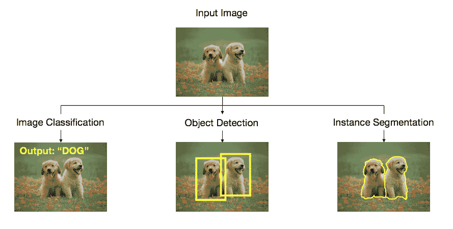

在**图像分类**中，问题的输入是图像，所需的输出仅仅是对图像所属类别的预测。这类似于我们的第一个项目，在该项目中，我们构建了一个分类器来预测一个病人是否有糖尿病风险。在图像分类中，问题是应用于像素作为输入数据（具体来说，是每个像素的强度值），而不是由 pandas DataFrame 表示的表格数据。在这个项目中，我们将专注于图像分类。

在**目标检测**中，问题的输入是图像，所需的输出是包围检测到的物体的边界框。你可以将这看作是图像分类任务的升级。神经网络不再假设图像中只有一个类别，而必须假设图像包含多个类别。神经网络接下来需要识别图像中每个类别的存在，并在每个类别周围画出边界框。正如你所想象的，这个任务并不简单，目标检测在神经网络出现之前是一个非常困难的问题。如今，神经网络可以高效地进行目标检测。2014 年，在 AlexNet 首次开发两年后，Girshick 等人展示了图像分类中的结果可以推广到**目标** **检测**。他们方法的直观想法是提出多个可能包含感兴趣物体的框，然后使用 CNN 预测每个边界框内最可能的类别。这种方法被称为区域卷积神经网络（R-CNN）。

最后，在**实例分割**中，问题的输入是图像，输出是与每个类别对应的像素分组。你可以将实例分割看作是目标检测的细化。实例分割在今天的技术中尤为重要且广泛应用。许多智能手机相机中的人像模式功能依赖于实例分割，将前景物体与背景分离，从而创造出良好的景深（虚化）效果。实例分割在自动驾驶汽车中也至关重要，因为必须精确定位汽车周围每个物体的位置。在 2017 年，R-CNN 的改进版——Mask R-CNN，已被证明在实例分割中非常有效。

正如我们所见，最近在物体识别方面的进展是由 CNN 推动的。在这个项目中，我们将深入了解 CNN，并将在 Keras 中从零开始训练并创建一个 CNN。

# 数字图像作为神经网络输入

回想一下在前面的章节中，我们曾提到神经网络需要数值输入。我们看到如何使用独热编码将类别特征（如星期几）转换为数值特征。那么，如何将图像作为输入传递给神经网络呢？简短的回答是，所有数字图像本质上都是数值的！

为了理解这一点，考虑一张 28 x 28 的手写数字“3”图像，如下截图所示。假设此时图像是灰度图（黑白图）。如果我们查看组成图像的每个像素的强度，我们会看到某些像素是纯白的，而某些像素是灰色或黑色。在计算机中，白色像素用值 0 表示，黑色像素用值 255 表示。白色和黑色之间的所有其他灰度值（即灰色的不同层次）在 0 和 255 之间。因此，数字图像本质上是数值数据，神经网络可以从中学习：

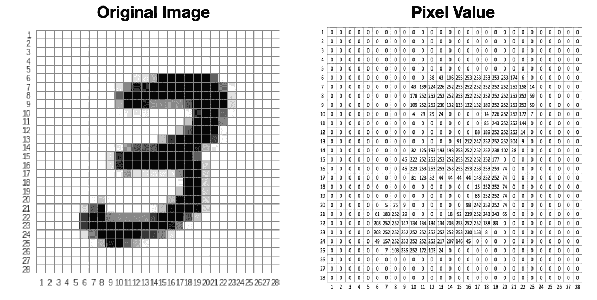

那么彩色图像呢？彩色图像仅仅是具有三个通道的图像——红色、绿色和蓝色（通常称为 RGB）。每个通道中的像素值代表红色强度、绿色强度和蓝色强度。另一种理解方式是，对于一张纯红色的图像，红色通道的像素值为 255，绿色和蓝色通道的像素值为 0。

下图展示了一幅彩色图像，以及将彩色图像分解为 RGB 通道。请注意，彩色图像是以三维方式堆叠的。相比之下，灰度图像只有两个维度：

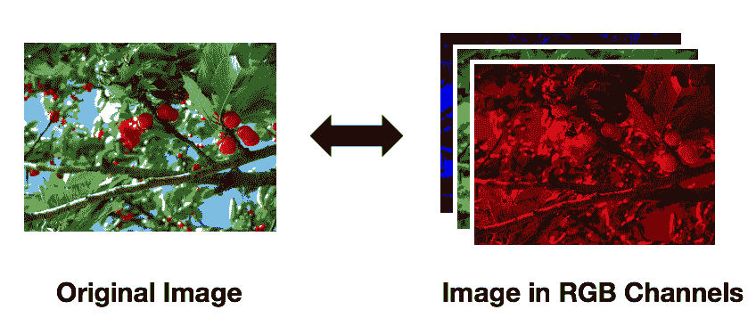

# 卷积神经网络（CNN）的构建模块

图像分类面临的挑战之一是物体的外观是动态的。正如猫和狗有许多不同的品种一样，猫和狗在图像中的呈现方式也是无穷无尽的。这使得基础的图像分类技术变得困难，因为不可能向计算机展示无数张猫狗的照片。

然而，这根本不应该成为问题。人类并不需要无数张猫狗的照片来区分这两者。一个幼儿只需看到几只猫狗，就能轻松区分它们。如果我们思考人类如何进行图像分类，我们会发现人类通常会寻找一些标志性特征来识别物体。例如，我们知道猫的体型通常比狗小，猫通常有尖耳朵，猫的嘴巴比狗短。人类在分类图像时本能地会寻找这些特征。

那么，我们可以教会计算机在整个图像中寻找这些特征吗？答案是肯定的！关键在于**卷积**。

# 滤波与卷积

在我们理解卷积之前，首先要理解滤波的概念。

假设我们有一个 9 x 9 的图像作为输入，并且需要将该图像分类为 X 或 O。以下图示展示了一些示例输入图像。

完美绘制的 O 展示在以下图示的最左侧框中，而另外两个框展示了绘制不好的 O：

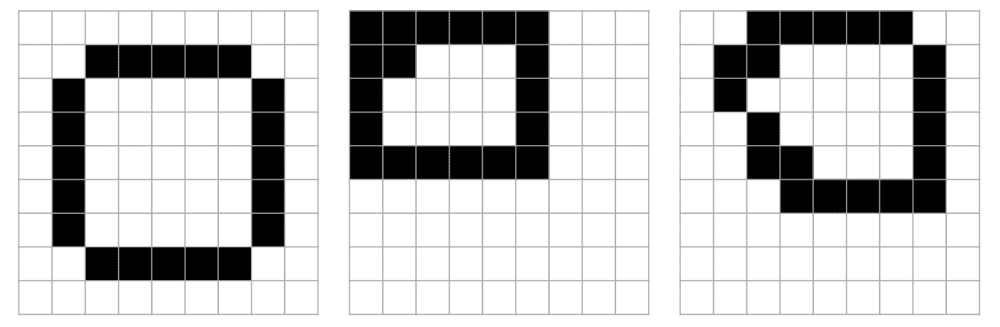

完美绘制的 X 展示在最左侧框中，而另外两个框展示了绘制不好的 X：

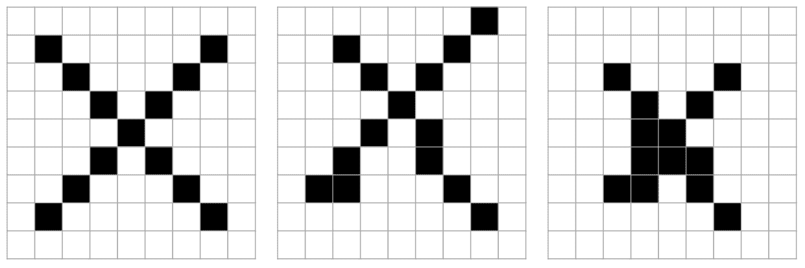

无论哪种情况，我们都不能期望图形被完美地绘制出来。对于人类来说，这并不成问题，因为我们即使面对绘制得很差的情况，也能区分出 O 和 X。

让我们思考一下，是什么让人类容易区分这两者的呢？在图像中，哪些特征使得我们能够轻松区分它们？嗯，我们知道 O 通常具有平坦的水平边缘，而 X 则通常具有对角线。

以下图示展示了 O 的一个特征：

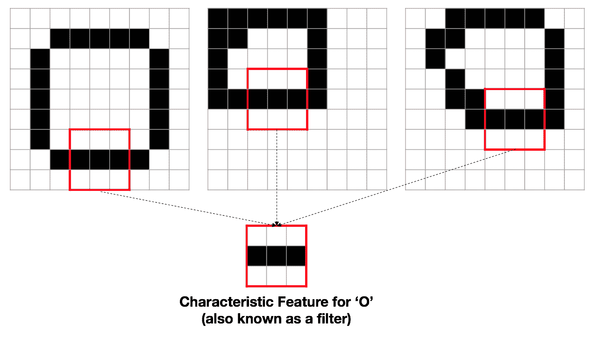

以下图示展示了 X 的一个特征：

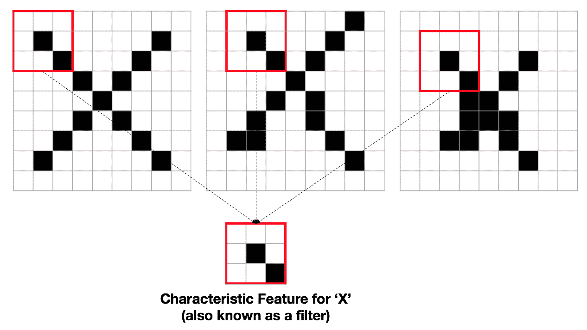

在这种情况下，特征（也称为滤波器）的大小为 3 × 3。图像中存在特征时，会给我们提供关于图像类别的重要线索。例如，如果图像包含一个水平边缘，并且特征符合 O 的特征，那么这张图像很可能是 O。

那么，我们如何在图像中搜索这种特征呢？我们可以通过简单的暴力搜索来实现，方法是取一个 3 x 3 的滤波器，然后将它滑过图像中的每个像素，查找匹配项。

我们从图像的左上角开始。滤波器执行的数学操作（称为滤波）是滑动窗口与滤波器进行逐元素乘法。在左上角，滤波器的输出是 2（注意，这是一个完美匹配，因为窗口与滤波器是完全相同的）。

以下图示展示了图像左上角的滤波操作。请注意，为了简化起见，我们假设像素强度值为**0**或**1**（而不是实际数字图像中的 0-255）：

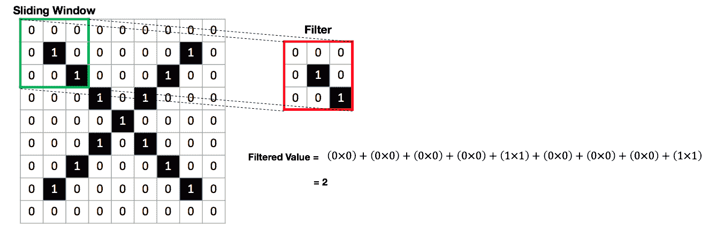

接下来，我们将窗口向右滑动，覆盖图像中的下一个 3 x 3 区域。以下图示展示了对下一个 3 x 3 区域的滤波操作：

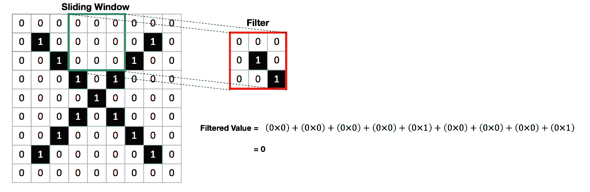

将窗口滑过整个图像并计算滤波值的过程称为**卷积**。执行卷积操作的神经网络层称为卷积层。本质上，卷积为我们提供了每个图像中找到特征的区域的映射。这确保了我们的神经网络能够像人类一样执行智能、动态的物体识别！

在前面的例子中，我们根据自己对 O 和 X 的了解手工制作了滤波器。请注意，当我们训练神经网络时，它会自动学习最适合的滤波器。回想一下，在前面的章节中，我们使用了全连接层（密集层），并且在训练过程中调整了层的权重。同样，卷积层的权重也将在训练过程中进行调整。

最后，注意卷积层有两个主要的超参数：

+   **滤波器数量**：在前面的例子中，我们只使用了一个滤波器。我们可以增加滤波器的数量，以找到多个特征。

+   **滤波器大小**：在前面的例子中，我们使用了一个 3 x 3 的滤波器大小。我们可以调整滤波器的大小，以表示更大的特征。

我们将在本章稍后的部分详细讨论这些超参数，当我们构建神经网络时。

# 最大池化

在 CNN 中，通常将最大池化层紧跟在卷积层后面。最大池化层的目标是减少每个卷积层之后的权重数量，从而减少模型复杂性并避免过拟合。

最大池化层通过查看传递给它的每个输入子集，并丢弃子集中除最大值以外的所有值，来实现这一点。让我们通过一个例子来看看这意味着什么。假设我们输入到最大池化层的是一个 4 x 4 的张量（张量只是一个 n 维数组，例如卷积层输出的那种），我们使用一个 2 x 2 的最大池化层。下面的图示展示了**最大池化**操作：

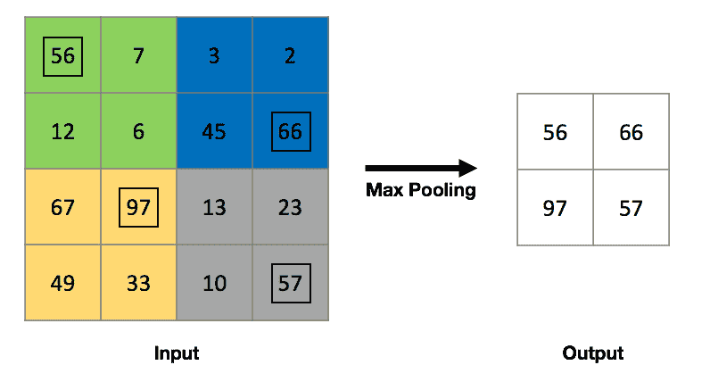

正如我们从前面的图示中看到的，**最大池化**只是查看输入的每个 2 x 2 区域，并丢弃该区域中除了最大值以外的所有值（前面的图示中已框出）。这实际上将原始输入的高度和宽度减半，在传递到下一层之前减少了参数的数量。

# CNN 的基本架构

我们在前一节中已经看到 CNN 的基本构建块。现在，我们将这些构建块组合在一起，看看完整的 CNN 是什么样子。

卷积神经网络（CNN）通常将卷积层和池化层按块堆叠在一起。卷积层使用的激活函数通常是 ReLU，正如前几章所讨论的那样。

下图展示了典型卷积神经网络（CNN）中的前几层，包含了一系列的卷积层和池化层：

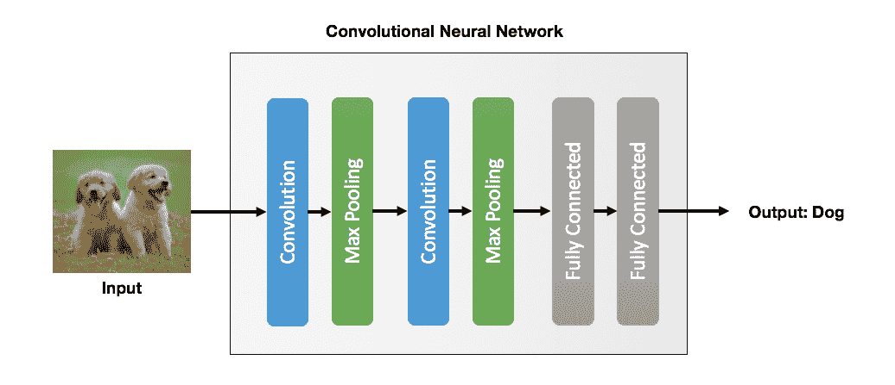

CNN 中的最终层将始终是**全连接**层（密集层），并采用 sigmoid 或 softmax 激活函数。请注意，sigmoid 激活函数用于二分类问题，而 softmax 激活函数则用于多类分类问题。

**全连接**层与我们在前两章中看到的相同：第一章，*机器学习与神经网络基础*，以及第二章，*多层感知机预测糖尿病*。此时，你可能会想，为什么要将全连接层放在 CNN 的末尾呢？在 CNN 中，早期的层学习并提取它们试图预测的数据的特征。例如，我们已经看到卷积层如何学习 Os 和 Xs 的空间特征。卷积层将这些信息传递给全连接层，而全连接层则学习如何进行准确预测，就像在多层感知机（MLP）中一样。

本质上，CNN 的早期层负责识别特征性的空间特征，而末端的全连接层则负责进行预测。这一点的含义非常重要。与我们在上一章中为机器学习算法手动创建特征（例如，星期几、距离等）不同，第三章，*利用深度前馈神经网络预测出租车费用*，我们只需将所有数据原样提供给 CNN。然后，CNN 会自动学习最佳的特征，以区分不同的类别。这才是真正的人工智能！

# 现代 CNN 的回顾

现在我们已经了解了 CNN 的基本架构，让我们来看一下现代、最先进的 CNN。我们将回顾 CNN 的发展历程，看看它们是如何随着时间的推移而变化的。我们不会深入讨论实现背后的技术和数学细节，而是提供一些最重要 CNN 的直观概述。

# LeNet（1998）

第一款 CNN 是由 Yann LeCun 于 1998 年开发的，架构被称为 LeNet。LeCun 是第一个证明 CNN 在图像识别中有效的人，特别是在手写数字识别领域。然而，在 2000 年代，少数科学家能够在 LeCun 的工作基础上进行拓展，且 CNN（以及人工智能整体）并没有出现显著突破。

# AlexNet（2012）

正如我们之前提到的，AlexNet 是由 Alex Krizhevsky 等人开发的，并且它在 2012 年赢得了 ILSVRC。AlexNet 基于与 LeNet 相同的原理，尽管 AlexNet 采用了更深的架构。AlexNet 中的可训练参数总数约为 6000 万个，是 LeNet 的 1000 倍以上。

# VGG16（2014）

VGG16 由牛津大学的**视觉几何组**（**VGG**）开发，并且被认为是非常重要的神经网络。VGG16 是最早偏离大滤波器尺寸的 CNN 之一，它采用了 3 x 3 的卷积滤波器尺寸。

VGG16 在 2014 年 ILSVRC 的图像识别任务中获得了第二名。VGG16 的一个缺点是需要训练的参数更多，导致训练时间显著增加。

# Inception（2014）

Inception 网络由谷歌的研究人员开发，并且在 2014 年赢得了 ILSVRC。Inception 网络的指导原则是高效地提供高度准确的预测。谷歌的兴趣是创建一种能够实时训练并在其服务器网络上部署的 CNN。为此，研究人员开发了一种叫做 Inception 模块的技术，大大提高了训练速度，同时保持了准确性。事实上，在 2014 年 ILSVRC 中，Inception 网络凭借较少的参数实现了比 VGG16 更高的准确率。

Inception 网络已不断改进。到本文写作时，最新的 Inception 网络已是其第四版本（通常称为 Inception-v4）。

# ResNet（2015）

**残差神经网络**（**ResNet**）是由 Kaiming He 等人于 2015 年 ILSVRC 上提出的（到现在，你应该注意到这个竞赛对神经网络和计算机视觉至关重要，每年竞赛期间都会揭示新的最先进技术）。

ResNet 的显著特点是残差块技术，它使神经网络能够更深，同时保持参数数量适中。

# 我们今天所处的位置

正如我们所见，近年来 CNN 已经取得了指数级的进展和改进。事实上，最近的 CNN 在某些图像识别任务上能够超过人类。近年来的一个反复主题是使用创新技术提升模型性能，同时保持模型的复杂性。显然，神经网络的速度与准确性同样重要。

# 猫狗数据集

现在我们理解了 CNN 背后的理论，让我们深入探讨数据探索。猫狗数据集由微软提供。下载和设置数据集的说明可以在本章的*技术要求*部分找到。

让我们绘制图像，更好地理解我们正在处理的数据类型。为此，我们只需运行以下代码：

```py
from matplotlib import pyplot as plt
import os
import random

# Get list of file names
_, _, cat_images = next(os.walk('Dataset/PetImages/Cat'))

# Prepare a 3x3 plot (total of 9 images)
fig, ax = plt.subplots(3,3, figsize=(20,10))

# Randomly select and plot an image
for idx, img in enumerate(random.sample(cat_images, 9)):
    img_read = plt.imread('Dataset/PetImages/Cat/'+img)
    ax[int(idx/3), idx%3].imshow(img_read)
    ax[int(idx/3), idx%3].axis('off')
    ax[int(idx/3), idx%3].set_title('Cat/'+img)
plt.show()
```

我们将看到以下输出：

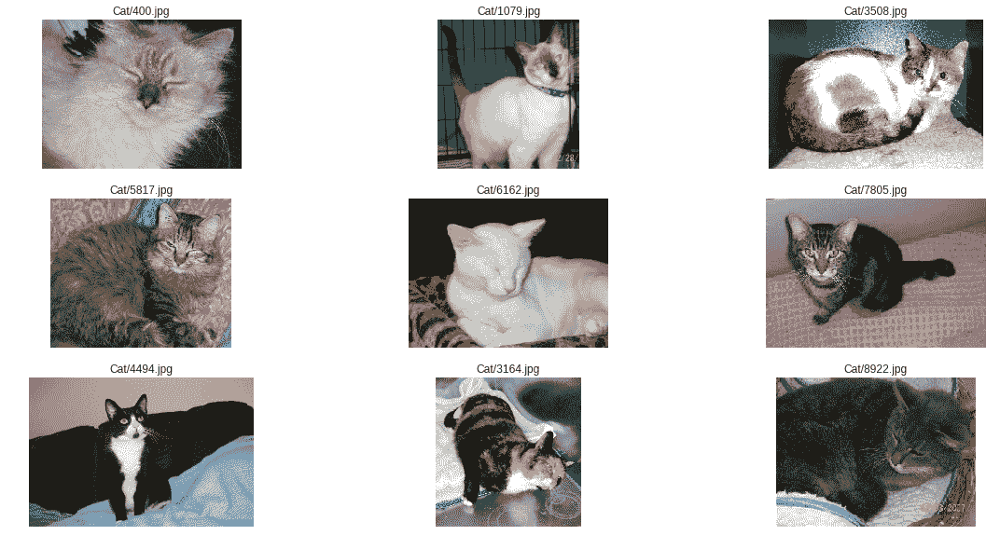

我们可以对数据做出一些观察：

+   这些图像具有不同的尺寸。

+   这些物体（猫/狗）大多数情况下位于图像的中心。

+   这些物体（猫/狗）有不同的方向，而且它们可能在图像中被遮挡。换句话说，并不能保证我们总是能在图像中看到猫的尾巴。

现在，让我们对狗的图像做同样的操作：

```py
# Get list of file names
_, _, dog_images = next(os.walk('Dataset/PetImages/Dog'))

# Prepare a 3x3 plot (total of 9 images)
fig, ax = plt.subplots(3,3, figsize=(20,10))

# Randomly select and plot an image
for idx, img in enumerate(random.sample(dog_images, 9)):
    img_read = plt.imread('Dataset/PetImages/Dog/'+img)
    ax[int(idx/3), idx%3].imshow(img_read)
    ax[int(idx/3), idx%3].axis('off')
    ax[int(idx/3), idx%3].set_title('Dog/'+img)
plt.show()
```

我们将看到如下输出：

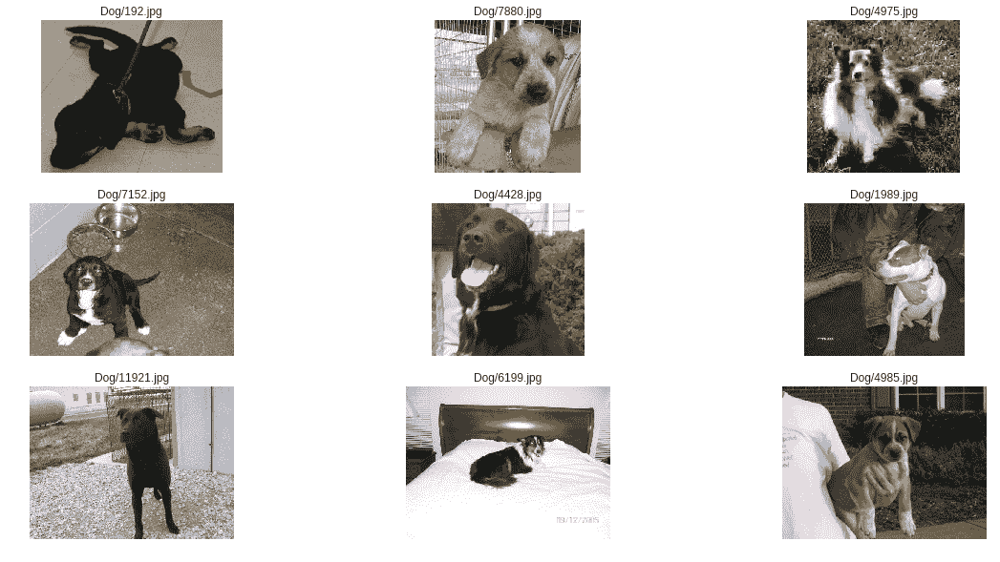

# 管理 Keras 的图像数据

在图像分类的神经网络项目中，一个常见的问题是大多数计算机的内存不足，无法将整个数据集加载到内存中。即便是相对现代且强大的计算机，将整个图像集加载到内存并从中训练卷积神经网络（CNN）也会非常缓慢。

为了缓解这个问题，Keras 提供了一个有用的 `flow_from_directory` 方法，该方法接受图像路径作为输入，并生成数据批次作为输出。数据批次会在模型训练之前根据需要加载到内存中。这样，我们可以在大量图像上训练深度神经网络，而无需担心内存问题。此外，`flow_from_directory` 方法通过简单地传递参数，允许我们执行图像预处理步骤，例如调整图像大小和其他图像增强技术。该方法随后会在实时处理图像数据之前，执行必要的图像预处理步骤。

为了完成这些操作，我们必须遵循某些文件和文件夹管理的方案，以确保 `flow_from_directory` 能正常工作。特别是，我们需要为训练和测试数据创建子目录，并且在训练和测试子目录中，我们需要进一步为每个类别创建一个子目录。以下图示说明了所需的文件夹结构：

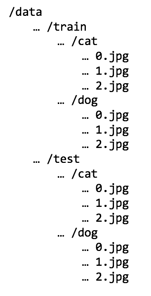

`flow_from_directory` 方法随后会根据文件夹结构推断图像的类别。

原始数据提供在 `Cat` 和 `Dog` 文件夹中，没有区分训练数据和测试数据。因此，我们需要按照之前的方案将数据拆分为 `Train` 和 `Test` 文件夹。为此，我们需要执行以下步骤：

1.  创建 `/Train/Cat`、`/Train/Dog`、`/Test/Cat` 和 `/Test/Dog` 文件夹。

1.  随机将 80% 的图像分配为训练图像，20% 的图像分配为测试图像。

1.  将这些图像复制到相应的文件夹中。

我们在 `utils.py` 中提供了一个辅助函数来执行这些步骤。我们只需要调用该函数，如下所示：

```py
from utils import train_test_split

src_folder = 'Dataset/PetImages/'
train_test_split(src_folder)
```

如果在执行此代码块时遇到错误，错误信息为 ImportError: No Module Named Piexif，这意味着你尚未在 Python 虚拟环境中安装 Piexif。本章节需要一个额外的图像处理库。要下载 Piexif，请遵循本章节开始时的*技术要求部分*中的说明。

太棒了！我们的图像现在已经放置在 Keras 所需的适当文件夹中了。

# 图像增强

在我们开始构建 CNN 之前，先来看看图像增强，它是图像分类项目中一个重要的技术。图像增强是通过对图像进行某些方式的微小修改，创造出额外的训练数据，从而生成新图像。例如，我们可以做以下操作：

+   图像旋转

+   图像平移

+   水平翻转

+   对图像进行缩放

图像增强的动机是，CNN 需要大量的训练数据才能很好地泛化。然而，收集数据常常很困难，尤其是对于图像来说。通过图像增强，我们可以基于现有图像人工地创造新的训练数据。

和往常一样，Keras 提供了一个方便的`ImageDataGenerator`类，帮助我们轻松地执行图像增强。让我们创建这个类的一个新实例：

```py
from keras.preprocessing.image import ImageDataGenerator

image_generator = ImageDataGenerator(rotation_range = 30,
                                     width_shift_range = 0.2,
                                     height_shift_range = 0.2,
                                     zoom_range = 0.2,
                                     horizontal_flip=True,
                                     fill_mode='nearest')
ImageDataGenerator class. Each of the arguments control how much of a modification is done to the existing image. We should avoid extreme transformations, as those extremely distorted images do not represent images from the real world and may introduce noise into our model.
```

接下来，让我们用它来增强从`/Train/Dog/`文件夹中随机选择的一张图像。然后，我们可以绘制它，将增强后的图像与原始图像进行比较。我们可以通过运行以下代码来实现：

```py
fig, ax = plt.subplots(2,3, figsize=(20,10))
all_images = []

_, _, dog_images = next(os.walk('Dataset/PetImages/Train/Dog/'))
random_img = random.sample(dog_images, 1)[0]
random_img = plt.imread('Dataset/PetImages/Train/Dog/'+random_img)
all_images.append(random_img)

random_img = random_img.reshape((1,) + random_img.shape)
sample_augmented_images = image_generator.flow(random_img)

for _ in range(5):
    augmented_imgs = sample_augmented_images.next()
    for img in augmented_imgs:
        all_images.append(img.astype('uint8'))

for idx, img in enumerate(all_images):
    ax[int(idx/3), idx%3].imshow(img)
    ax[int(idx/3), idx%3].axis('off')
    if idx == 0:
        ax[int(idx/3), idx%3].set_title('Original Image')
    else:
        ax[int(idx/3), idx%3].set_title('Augmented Image {}'.format(idx))

plt.show()
```

我们将看到如下输出：

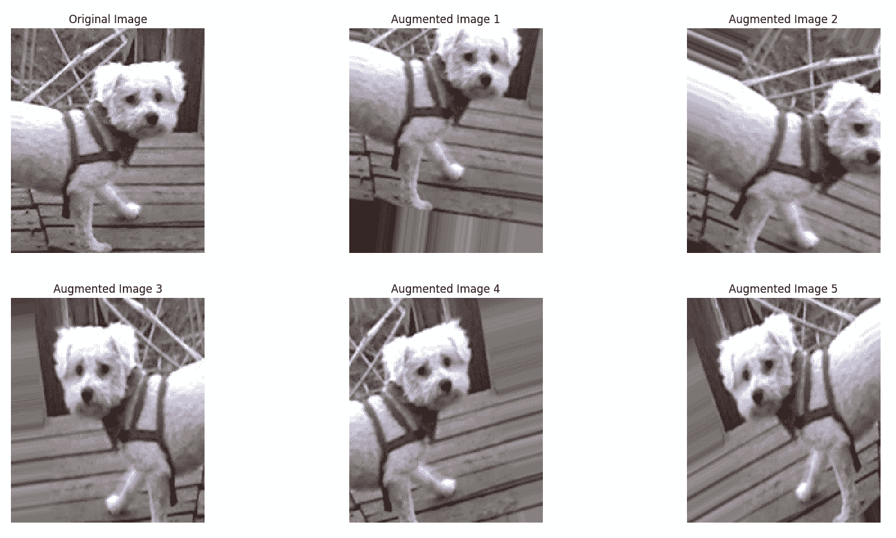

正如我们所看到的，每个增强后的图像都会按照传递给`ImageDataGenerator`类的参数随机地平移或旋转。这些增强后的图像将为我们的 CNN 提供补充的训练数据，提高我们模型的鲁棒性。

# 模型构建

我们终于准备好开始在 Keras 中构建 CNN 了。在这一部分，我们将采用两种不同的方法来构建模型。首先，我们从构建一个包含几层的相对简单的 CNN 开始。我们将查看简单模型的性能，并讨论它的优缺点。接下来，我们将使用一个几年前被认为是最先进的模型——VGG16 模型。我们将看看如何利用预训练的权重将 VGG16 模型调整用于猫狗图像分类。

# 构建一个简单的 CNN

在前面的部分，我们展示了 CNN 的基本构建模块，它由一系列卷积层和池化层组成。在这一部分，我们将构建一个由这些重复模式组成的基本 CNN，如下图所示：

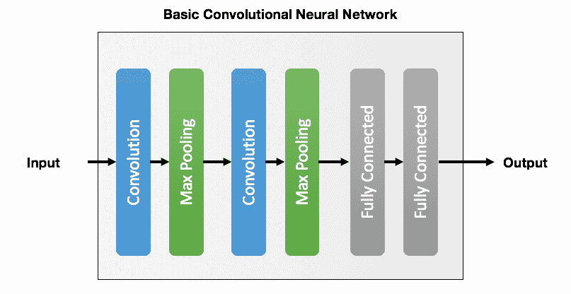

这个基础 CNN 由两个重复的**卷积**和**最大池化**块组成，然后是两个**全连接**层。正如前面部分所讨论的，卷积和最大池化层负责学习类的空间特征（例如，识别猫的耳朵），而**全连接**层则使用这些空间特征进行预测。因此，我们可以以另一种方式表示我们基本 CNN 的架构（我们将在下一小节中看到以这种方式可视化神经网络的好处）：

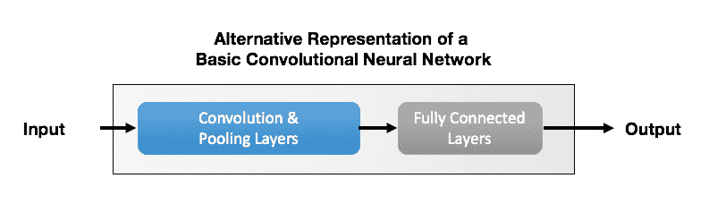

构建 CNN 类似于构建多层感知器（MLP）或前馈神经网络，就像我们在前几章中所做的那样。我们将通过声明一个新的`Sequential`模型实例开始：

```py
from keras.models import Sequential
from keras.layers import Conv2D, MaxPooling2D
from keras.layers import Dropout, Flatten, Dense
from keras.preprocessing.image import ImageDataGenerator

model = Sequential()
```

在添加任何卷积层之前，考虑我们将使用的超参数是非常有用的。对于卷积神经网络（CNN），有几个超参数：

+   **卷积层滤波器大小**：大多数现代 CNN 使用较小的滤波器大小`3` x `3`。

+   **滤波器数量**：我们将使用`32`个滤波器。这个数量在速度和性能之间达到了良好的平衡。

+   **输入大小**：正如我们在前面部分看到的，输入图像的大小各不相同，宽度和高度大约为 150 像素。我们将使用`32` x `32`像素的输入大小。这会压缩原始图像，可能会导致一些信息丢失，但有助于加速神经网络的训练。

+   **最大池化大小**：常见的最大池化大小为`2` x `2`。这将把输入层的维度减半。

+   **批量大小**：这对应于每个小批量中使用的训练样本数。在梯度下降中，较大的批量大小会导致更准确的训练，但训练时间更长，内存使用量也更大。我们将使用`16`的批量大小。

+   **每轮步数**：这是每个训练周期中的迭代次数。通常，这个值等于训练样本数除以批量大小。

+   **训练轮数**：用于训练我们数据的轮数。请注意，在神经网络中，轮数指的是模型在训练过程中每次看到每个训练样本的次数。通常需要多个轮次，因为梯度下降是一种迭代优化方法。我们将训练模型`10`轮。这意味着每个训练样本将在训练过程中传递给模型 10 次。

让我们为这些超参数声明变量，以便在代码中保持一致：

```py
FILTER_SIZE = 3
NUM_FILTERS = 32
INPUT_SIZE  = 32
MAXPOOL_SIZE = 2
BATCH_SIZE = 16
STEPS_PER_EPOCH = 20000//BATCH_SIZE
EPOCHS = 10
```

现在我们可以添加第一层卷积层，使用`32`个滤波器，每个滤波器的大小为(`3` x `3`)：

```py
model.add(Conv2D(NUM_FILTERS, (FILTER_SIZE, FILTER_SIZE),
                 input_shape = (INPUT_SIZE, INPUT_SIZE, 3),
                 activation = 'relu'))
```

接下来，我们添加一个最大池化层：

```py
model.add(MaxPooling2D(pool_size = (MAXPOOL_SIZE, MAXPOOL_SIZE)))
```

这是我们 CNN 的基本卷积-池化模式。根据我们的模型架构，我们再重复一遍：

```py
model.add(Conv2D(NUM_FILTERS, (FILTER_SIZE, FILTER_SIZE),
                 input_shape = (INPUT_SIZE, INPUT_SIZE, 3),
                 activation = 'relu'))

model.add(MaxPooling2D(pool_size = (MAXPOOL_SIZE, MAXPOOL_SIZE)))
```

我们现在完成了卷积层和池化层的设置。在继续添加全连接层之前，我们需要将输入进行展平。`Flatten`是 Keras 中的一个函数，它将一个多维向量转换为一个一维向量。例如，如果向量的形状是(5,5,3)，在传递给`Flatten`之前，输出向量将变成形状为(75)的向量。

要添加一个`Flatten`层，我们只需运行以下代码：

```py
model.add(Flatten())
```

现在我们可以添加一个全连接层，节点数为`128`：

```py
model.add(Dense(units = 128, activation = 'relu'))
```

在添加最后一层全连接层之前，添加一个 Dropout 层是一个好习惯。Dropout 层会随机将输入的一部分设置为 0，从而帮助减少过拟合，确保模型不会过度依赖某些权重：

```py
# Set 50% of the weights to 0 
model.add(Dropout(0.5))
```

我们为模型添加了最后一个全连接层：

```py
model.add(Dense(units = 1, activation = 'sigmoid'))
```

请注意，最后一层全连接层应该只有一个节点，因为我们在这个项目中进行的是二分类（猫或狗）。

我们将使用`adam`优化器编译我们的模型。`adam`优化器是**随机梯度下降（SGD）**算法的一个泛化，它在第一章《机器学习与神经网络 101》中介绍过，*并且被广泛用于训练 CNN 模型*。损失函数是`binary_crossentropy`，因为我们进行的是二分类：

```py
model.compile(optimizer = 'adam', loss = 'binary_crossentropy',
              metrics = ['accuracy'])
```

通常情况下，我们对于二分类问题使用`binary_crossentropy`，对于多分类问题使用`categorical_crossentropy`。

我们现在准备训练我们的 CNN。请注意，我们并没有将任何数据加载到内存中。我们将使用`ImageDataGenerator`和`flow_from_directory`方法实时训练我们的模型，该方法只在需要时将数据集的批次加载到内存中：

```py
training_data_generator = ImageDataGenerator(rescale = 1./255)

training_set = training_data_generator. \
                   flow_from_directory('Dataset/PetImages/Train/',
                                       target_size=(INPUT_SIZE,INPUT_SIZE), 
                                                    batch_size=BATCH_SIZE,
                                                    class_mode='binary')

model.fit_generator(training_set, steps_per_epoch = STEPS_PER_EPOCH, 
                    epochs=EPOCHS, verbose=1)
```

这将开始训练，一旦完成，你将看到以下输出：

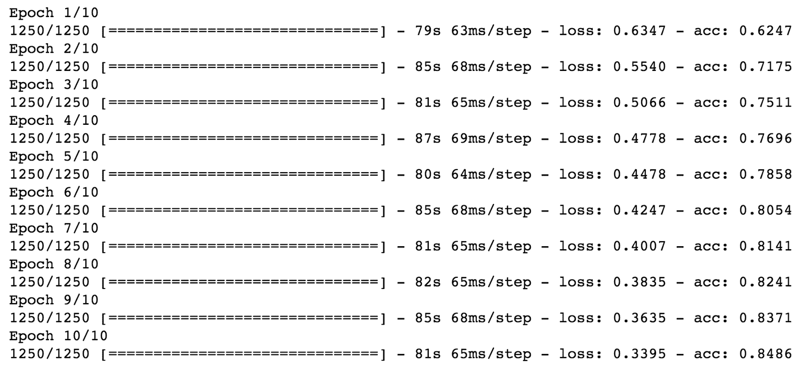

我们可以清楚地看到，随着每个周期的进行，损失值在减少，而准确率在提高。

现在我们的模型已经训练完成，接下来让我们在测试集上评估它。我们将创建一个新的`ImageDataGenerator`，并对`test`文件夹中的图像调用`flow_from_directory`：

```py
testing_data_generator = ImageDataGenerator(rescale = 1./255)

test_set = testing_data_generator. \
               flow_from_directory('Dataset/PetImages/Test/',
                                   target_size=(INPUT_SIZE,INPUT_SIZE),
                                   batch_size=BATCH_SIZE,
                                   class_mode = 'binary')

score = model.evaluate_generator(test_set, steps=len(test_set))
for idx, metric in enumerate(model.metrics_names):
    print("{}: {}".format(metric, score[idx]))
```

我们将获得以下输出：

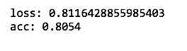

我们获得了 80%的准确率！考虑到我们仅使用了一个基础的 CNN，这相当令人印象深刻。这显示了 CNN 的强大功能；我们仅用几行代码就得到了接近人类表现的准确率。

# 利用迁移学习的预训练模型

我们能将模型推得更远吗？我们能达到接近 90%的准确率，接近人类水平的表现吗？正如我们在本节中将看到的那样，通过利用迁移学习，我们可以获得更好的性能。

迁移学习是机器学习中的一种技术，它通过将为某个任务训练的模型修改为用于另一个任务的预测。例如，我们可以使用训练好的汽车分类模型来分类卡车，因为它们相似。在卷积神经网络（CNN）的背景下，迁移学习涉及冻结卷积池化层，只重新训练最后的全连接层。以下图示说明了这一过程：

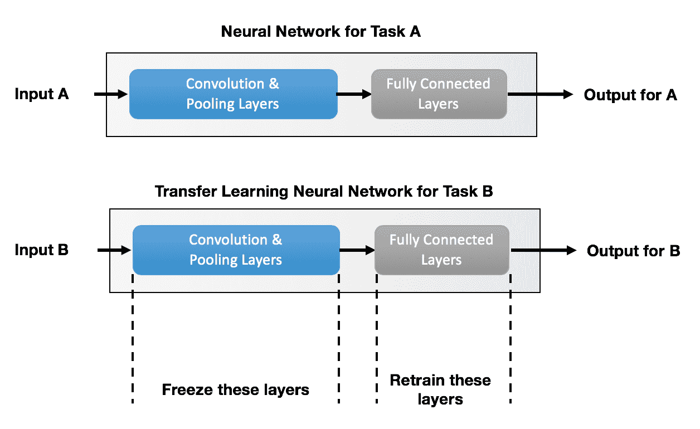

迁移学习是如何工作的？直观地说，卷积层和池化层的目的是学习类别的空间特征。因此，我们可以重用这些层，因为这两个任务的空间特征是相似的。我们只需要重新训练最后的全连接层，将神经网络重新定向到新类别的预测。自然，迁移学习的一个关键要求是任务 A 和任务 B 必须相似。

在本节中，我们将重新利用 VGG16 模型来对猫狗图像进行预测。VGG16 模型最初是为 ILSVRC 开发的，需要模型进行 1,000 类的多类别分类。这 1,000 类中包含了特定品种的猫和狗。换句话说，VGG16 知道如何识别特定品种的猫和狗，而不仅仅是猫和狗。因此，利用 VGG16 模型进行迁移学习来解决我们的猫狗图像分类问题是一种可行的方法。

VGG16 模型及其训练权重在 Keras 中已直接提供。我们可以按照以下代码创建一个新的`VGG16`模型：

```py
from keras.applications.vgg16 import VGG16

INPUT_SIZE = 128 # Change this to 48 if the code takes too long to run
vgg16 = VGG16(include_top=False, weights='imagenet', 
              input_shape=(INPUT_SIZE,INPUT_SIZE,3))
```

请注意，我们在创建新的 VGG16 模型时使用了`include_top=False`。这个参数告诉 Keras 不要导入 VGG16 网络末尾的全连接层。

现在，我们将冻结 VGG16 模型中其余的层，因为我们不打算从头开始重新训练它们。我们可以通过运行以下代码片段来冻结这些层：

```py
for layer in vgg16.layers:
    layer.trainable = False
```

接下来，我们将在神经网络的最后添加一个带有`1`个节点的全连接层。实现这一点的语法稍有不同，因为 VGG16 模型不是我们习惯的 Keras `Sequential` 模型。无论如何，我们可以通过运行以下代码来添加这些层：

```py
from keras.models import Model

input_ = vgg16.input
output_ = vgg16(input_)
last_layer = Flatten(name='flatten')(output_)
last_layer = Dense(1, activation='sigmoid')(last_layer)
model = Model(input=input_, output=last_layer)
```

这只是手动在 Keras 中添加层的方式，而`.``add()`函数在`Sequential`模型中已经简化了这个过程。其余的代码与我们在前一节中看到的类似。我们声明一个训练数据生成器，并通过调用`flow_from_directory()`来训练模型（仅训练新添加的层）。由于我们只需要训练最后一层，我们将仅训练模型`3`个周期：

注意

如果您没有在 GPU（显卡）上运行 Keras，以下代码块大约需要一个小时才能完成。如果代码在您的计算机上运行得太慢，您可以减少`INPUT_SIZE`参数来加速模型训练。然而，请注意，这样会降低模型的准确性。

```py
# Define hyperparameters
BATCH_SIZE = 16
STEPS_PER_EPOCH = 200
EPOCHS = 3

model.compile(optimizer = 'adam', loss = 'binary_crossentropy',
              metrics = ['accuracy'])

training_data_generator = ImageDataGenerator(rescale = 1./255)
testing_data_generator = ImageDataGenerator(rescale = 1./255)

training_set = training_data_generator. \
                   flow_from_directory('Dataset/PetImages/Train/',
                                       target_size=(INPUT_SIZE,INPUT_SIZE),
                                       batch_size = BATCH_SIZE,
                                       class_mode = 'binary')

test_set = testing_data_generator. \
               flow_from_directory('Dataset/PetImages/Test/',
                                   target_size=(INPUT_SIZE,INPUT_SIZE),
                                   batch_size = BATCH_SIZE,
                                   class_mode = 'binary')

model.fit_generator(training_set, steps_per_epoch = STEPS_PER_EPOCH, 
                    epochs = EPOCHS, verbose=1)
```

我们将看到以下输出：

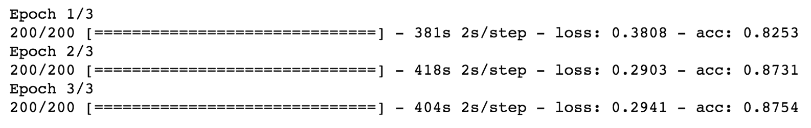

训练准确度看起来与前一节中的基本 CNN 模型差别不大。这是预期的，因为两个神经网络在训练集上表现都非常好。然而，最终我们将使用测试准确度来评估模型的性能。让我们看看它在测试集上的表现如何：

```py
score = model.evaluate_generator(test_set, len(test_set))

for idx, metric in enumerate(model.metrics_names):
    print("{}: {}".format(metric, score[idx]))
```

我们将看到以下输出：

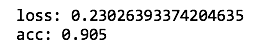

真了不起！通过使用迁移学习，我们成功地获得了 90.5%的测试准确率。请注意，这里的训练时间远远短于从头开始训练 VGG16 模型的时间（即使有强大的 GPU，也可能需要几天才能从头训练一个 VGG16 模型！），因为我们只训练了最后一层。这表明，我们可以利用像 VGG16 这样的预训练的最先进模型来为我们自己的项目进行预测。

# 结果分析

让我们更深入地分析我们的结果。特别是，我们希望了解我们的 CNN 在哪些图像上表现良好，哪些图像会出错。

记住，我们的 CNN 最后一层的 sigmoid 激活函数的输出是一个 0 到 1 之间的值列表（每个图像一个值/预测）。如果输出值< `0.5`，那么预测为类别 0（即猫），如果输出值>= `0.5`，则预测为类别 1（即狗）。因此，接近`0.5`的输出值意味着模型不太确定，而非常接近`0.0`或`1.0`的输出值则表示模型对其预测非常确信。

让我们逐一运行测试集中的图像，使用我们的模型对图像的类别进行预测，并将图像按三类进行分类：

+   **强烈正确的预测**：模型正确预测了这些图像，输出值为`> 0.8`或`< 0.2`

+   **强烈错误的预测**：模型错误地预测了这些图像，输出值为`> 0.8`或`< 0.2`

+   **弱错误的预测**：模型错误预测了这些图像，输出值介于`0.4`和`0.6`之间

以下代码片段将为我们完成此操作：

```py
# Generate test set for data visualization
test_set = testing_data_generator. \
               flow_from_directory('Dataset/PetImages/Test/',
                                    target_size = (INPUT_SIZE,INPUT_SIZE),
                                    batch_size = 1,
                                    class_mode = 'binary')

strongly_wrong_idx = []
strongly_right_idx = []
weakly_wrong_idx = []

for i in range(test_set.__len__()):
    img = test_set.__getitem__(i)[0]
    pred_prob = model.predict(img)[0][0]
    pred_label = int(pred_prob > 0.5)
    actual_label = int(test_set.__getitem__(i)[1][0])
    if pred_label != actual_label and (pred_prob > 0.8 or 
        pred_prob < 0.2): strongly_wrong_idx.append(i)
    elif pred_label != actual_label and (pred_prob > 0.4 and 
        pred_prob < 0.6): weakly_wrong_idx.append(i)
    elif pred_label == actual_label and (pred_prob > 0.8 or
        pred_prob < 0.2): strongly_right_idx.append(i)
    # stop once we have enough images to plot
    if (len(strongly_wrong_idx)>=9 and len(strongly_right_idx)>=9 
        and len(weakly_wrong_idx)>=9): break
```

让我们通过随机选择每组中的`9`张图像，并将它们绘制在一个 3×3 的网格中，来可视化这三组图像。以下辅助函数可以帮助我们做到这一点：

```py
from matplotlib import pyplot as plt
import random

def plot_on_grid(test_set, idx_to_plot, img_size=INPUT_SIZE):
    fig, ax = plt.subplots(3,3, figsize=(20,10))
    for i, idx in enumerate(random.sample(idx_to_plot,9)):
        img = test_set.__getitem__(idx)[0].reshape(img_size, img_size ,3)
        ax[int(i/3), i%3].imshow(img)
        ax[int(i/3), i%3].axis('off')
```

我们现在可以绘制`9`张从强烈正确预测组中随机选出的图像：

```py
plot_on_grid(test_set, strongly_right_idx)
```

我们将看到以下输出：

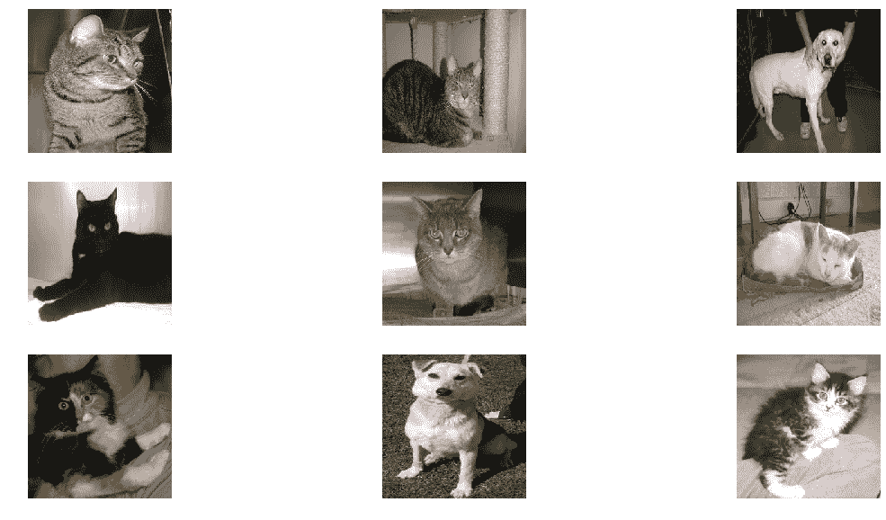

选中的图像具有强烈的预测，并且预测正确

没有什么意外！这些几乎是经典的猫狗图像。请注意，猫的尖耳朵和狗的黑眼睛在前面的图像中都有体现。这些特征使我们的 CNN 能够轻松地识别它们。

现在让我们来看一下强烈错误预测组：

```py
plot_on_grid(test_set, strongly_wrong_idx)
```

我们将得到以下输出：

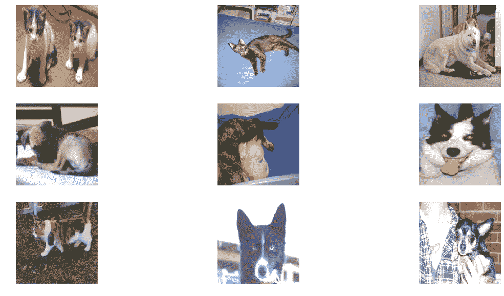

选中的图像具有强烈的预测，但预测错误

我们注意到这些强烈错误预测中有一些共同点。首先，我们发现某些狗确实像猫一样有尖耳朵。也许我们的神经网络过分关注尖耳朵，将这些狗误分类为猫。另一个发现是，某些主体没有正对相机，这使得识别变得异常困难。难怪我们的神经网络将它们分类错误。

最后，我们来看一下预测弱错误的图像组：

```py
plot_on_grid(test_set, weakly_wrong_idx)
```

我们将得到以下输出：

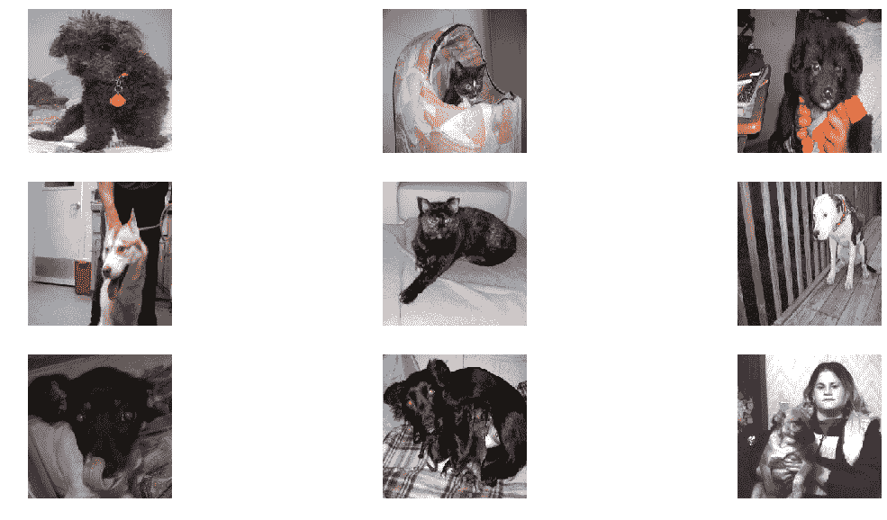

选择预测较弱且错误的图像

这些图像是我们的模型在分类时存在不确定性的情况。可能有相同数量的特征暗示对象既可能是狗也可能是猫。最明显的例子出现在第一行的图像中，第一行的小狗具有像猫一样的小框架，这可能使神经网络感到困惑。

# 总结

在本章中，我们构建了一个分类器，通过使用两种不同的卷积神经网络（CNN）来预测图像中是否包含猫或狗。我们首先学习了 CNN 背后的理论，并理解了 CNN 的基本构建模块是卷积层、池化层和全连接层。特别地，CNN 的前端由一块卷积-池化层组成，重复若干次。这个模块负责识别图像中的空间特征，这些特征可用于对图像进行分类。CNN 的后端由全连接层组成，类似于多层感知机（MLP）。这个模块负责做出最终的预测。

在第一个 CNN 中，我们使用了一个基础架构，在测试集上达到了 80%的准确率。这个基础 CNN 由两层卷积-最大池化层组成，后面接着两层全连接层。在第二个 CNN 中，我们使用了迁移学习，借助预训练的 VGG16 网络进行分类。我们移除了预训练网络中具有 1,000 个节点的最后一层全连接层，并添加了我们自己的全连接层（仅一个节点，用于二分类任务）。我们通过微调 VGG16 模型成功地获得了 90%的准确率。

最后，我们可视化了模型表现良好的图像和模型表现不佳的图像。我们发现，当主体没有正对相机时，或当主体具有既像猫又像狗的特征时，我们的模型无法确定。这一点在第一行的图像中尤为明显，第一行的小狗耳朵尖尖，可能让神经网络感到困惑。

本章内容到此为止，关于使用 CNN 进行图像识别的部分已结束。在下一章，第五章，*使用自编码器去除图像噪声*，我们将使用自编码器神经网络去除图像中的噪声。

# 问题

1.  图像是如何在计算机中表示的？

图像在计算机中表示为一组像素，每个像素有自己的强度（值在 0 到 255 之间）。彩色图像有三个通道（红色、绿色和蓝色），而灰度图像只有一个通道。

1.  CNN 的基本构建模块是什么？

所有卷积神经网络由卷积层、池化层和全连接层组成。

1.  卷积层和池化层的作用是什么？

卷积层和池化层负责从图像中提取空间特征。例如，在训练 CNN 识别猫的图像时，其中一个空间特征可能是猫的尖耳朵。

1.  全连接层的作用是什么？

全连接层类似于多层感知机（MLPs）和前馈神经网络中的全连接层。它们的作用是使用空间特征作为输入，并输出预测的类别。

1.  什么是迁移学习，它如何发挥作用？

迁移学习是一种机器学习技术，其中为某个任务训练的模型被修改以预测另一个任务。迁移学习使我们能够利用最先进的模型，如 VGG16，来为我们的目的提供支持，并且训练时间最小化。
