# 第五章：使用自编码器去除图像噪声

在本章中，我们将研究一类神经网络，称为自编码器，这些网络近年来得到了广泛关注。特别是，自编码器去除图像噪声的能力已经得到了大量研究。在本章中，我们将构建并训练一个能够去噪并恢复损坏图像的自编码器。

在本章中，我们将涵盖以下主题：

+   什么是自编码器？

+   无监督学习

+   自编码器的类型——基础自编码器、深度自编码器和卷积自编码器

+   用于图像压缩的自编码器

+   用于图像去噪的自编码器

+   构建和训练自编码器的逐步指南（在 Keras 中）

+   我们结果的分析

# 技术要求

本章所需的 Python 库有：

+   matplotlib 3.0.2

+   Keras 2.2.4

+   Numpy 1.15.2

+   PIL 5.4.1

本章的代码和数据集可以在本书的 GitHub 仓库找到：[`github.com/PacktPublishing/Neural-Network-Projects-with-Python`](https://github.com/PacktPublishing/Neural-Network-Projects-with-Python)

要将代码下载到计算机中，您可以运行以下 `git clone` 命令：

```py
$ git clone https://github.com/PacktPublishing/Neural-Network-Projects-with-Python.git    
```

处理完成后，将会有一个名为 `Neural-Network-Projects-with-Python` 的文件夹。通过运行以下命令进入该文件夹：

```py
$ cd Neural-Network-Projects-with-Python
```

要在虚拟环境中安装所需的 Python 库，请运行以下命令：

```py
$ conda env create -f environment.yml
```

请注意，在运行此命令之前，您应该首先在计算机中安装 Anaconda。要进入虚拟环境，请运行以下命令：

```py
$ conda activate neural-network-projects-python
```

通过运行以下命令导航到 `Chapter05` 文件夹：

```py
$ cd Chapter05
```

以下文件位于文件夹中：

+   `autoencoder_image_compression.py`：这是本章 *构建一个简单的自编码器* 部分的代码

+   `basic_autoencoder_denoise_MNIST.py` 和 `conv_autoencoder_denoise_MNIST.py`：这些是本章 *去噪自编码器* 部分的代码

+   `basic_autoencoder_denoise_documents.py` 和 `deep_conv_autoencoder_denoise_documents.py`：这些是本章 *用自编码器去噪文档* 部分的代码

要运行每个文件中的代码，只需执行每个 Python 文件，如下所示：

```py
$ python autoencoder_image_compression.py
```

# 什么是自编码器？

到目前为止，在本书中，我们已经看过了神经网络在监督学习中的应用。具体来说，在每个项目中，我们都有一个带标签的数据集（即特征**x**和标签**y**），*我们的目标是利用这个数据集训练一个神经网络，使得神经网络能够从任何新的实例**x**中预测标签**y**。*

一个典型的前馈神经网络如下面的图所示：

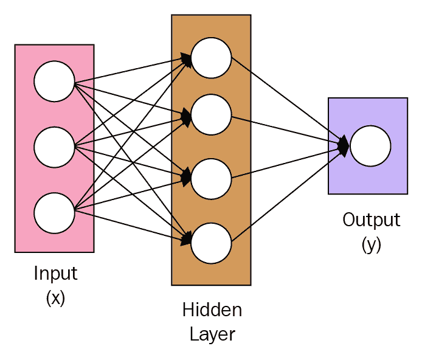

在本章中，我们将研究一类不同的神经网络，称为自编码器。自编码器代表了迄今为止我们所见过的传统神经网络的一种范式转变。自编码器的目标是学习输入的**潜在** **表示**。这种表示通常是原始输入的压缩表示。

所有的自编码器都有一个**编码器**和一个**解码器**。编码器的作用是将输入编码为学习到的压缩表示，解码器的作用是使用压缩表示重构原始输入。

以下图表显示了典型自编码器的架构：

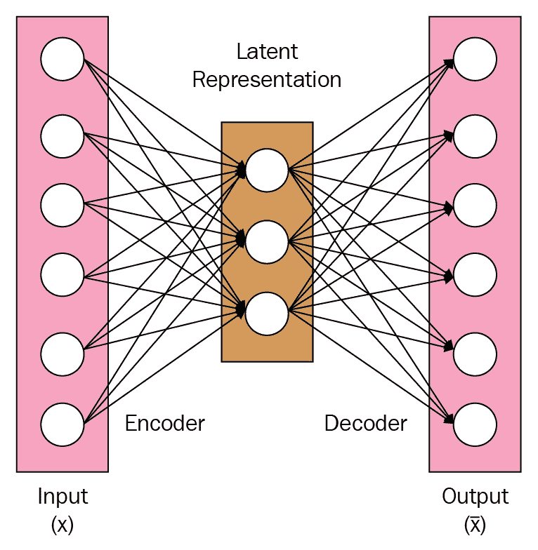

注意，在前面的图表中，与 CNNs 不同，我们不需要标签*y*。这个区别意味着自编码器是一种无监督学习形式，而 CNNs 属于监督学习的范畴。

# 潜在表示

此时，你可能会想知道自编码器的目的是什么。为什么我们要学习原始输入的表示，然后再重建一个类似的输出？答案在于输入的学习表示。通过强制学习到的表示被压缩（即与输入相比具有较小的维度），我们实质上迫使神经网络学习输入的最显著表示。这确保了学习到的表示仅捕捉输入的最相关特征，即所谓的**潜在表示**。

作为潜在表示的一个具体例子，例如，一个在猫和狗数据集上训练的自编码器，如下图所示：

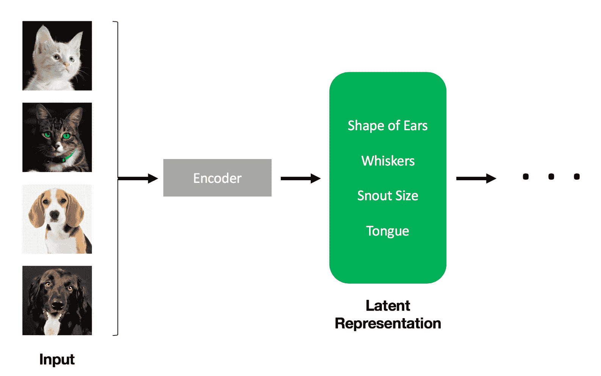

在这个数据集上训练的自编码器最终将学习到猫和狗的显著特征是耳朵的形状、胡须的长度、吻的大小和可见的舌头长度。这些显著特征被潜在表示捕捉到。

利用这个由自编码器学习到的潜在表示，我们可以做以下工作：

+   减少输入数据的维度。潜在表示是输入数据的自然减少表示。

+   从输入数据中去除任何噪音（称为去噪）。噪音不是显著特征，因此应该通过使用潜在表示轻松识别。

在接下来的章节中，我们将为每个前述目的创建和训练自编码器。

请注意，在前面的例子中，我们已经使用了如耳朵形状和吻大小等描述作为潜在表示的描述。实际上，潜在表示只是一组数字的矩阵，不可能为其分配有意义的标签（也不需要）。我们在这里使用的描述仅仅为潜在表示提供了直观的解释。

# 用于数据压缩的自编码器

到目前为止，我们已经看到自编码器能够学习输入数据的简化表示。自然地，我们会认为自编码器在通用数据压缩方面做得很好。然而，事实并非如此。自编码器在通用数据压缩方面表现不佳，比如图像压缩（即 JPEG）和音频压缩（即 MP3），因为学习到的潜在表示仅代表它所训练过的数据。换句话说，自编码器只对与其训练数据相似的图像有效。

此外，自编码器是一种“有损”数据压缩形式，这意味着自编码器的输出相较于原始输入会丢失一些信息。这些特性使得自编码器在作为通用数据压缩技术时效果较差。其他数据压缩形式，如 JPEG 和 MP3，相较于自编码器更为优越。

# MNIST 手写数字数据集

本章中我们将使用的一个数据集是 MNIST 手写数字数据集。MNIST 数据集包含 70,000 个手写数字样本，每个样本的大小为 28 x 28 像素。每个样本图像只包含一个数字，且所有样本都有标签。

MNIST 数据集在 Keras 中直接提供，我们只需运行以下代码即可导入：

```py
from keras.datasets import mnist

training_set, testing_set = mnist.load_data()
X_train, y_train = training_set
X_test, y_test = testing_set
matplotlib to plot the data:
```

```py
from matplotlib import pyplot as plt
fig, ((ax1, ax2, ax3, ax4, ax5), (ax6, ax7, ax8, ax9, ax10)) = plt.subplots(2, 5, figsize=(10,5))

for idx, ax in enumerate([ax1,ax2,ax3,ax4,ax5, ax6,ax7,ax8,ax9,ax10]):
    for i in range(1000):
        if y_test[i] == idx:
            ax.imshow(X_test[i], cmap='gray')
            ax.grid(False)
            ax.set_xticks([])
            ax.set_yticks([])
            break
plt.tight_layout()
plt.show()
```

我们得到以下输出：

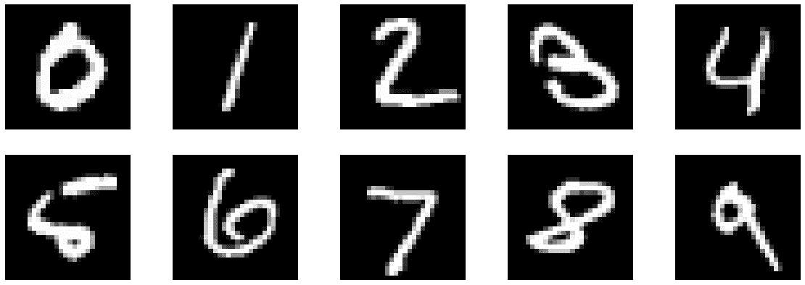

我们可以看到这些数字确实是手写的，每个 28 x 28 的图像只包含一个数字。自编码器应该能够学习这些数字的压缩表示（小于 28 x 28），并使用这种压缩表示重建图像。

下图展示了这一点：

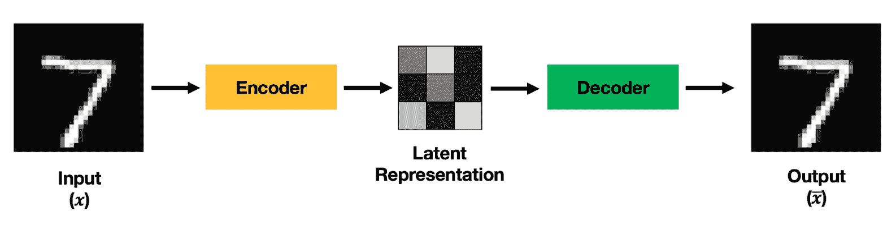

# 构建一个简单的自编码器

为了巩固我们的理解，让我们从构建最基本的自编码器开始，如下图所示：

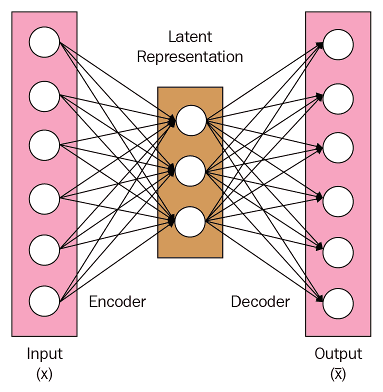

到目前为止，我们强调过隐藏层（**潜在** **表示**）的维度应该小于输入数据的维度。这样可以确保潜在表示是输入显著特征的压缩表示。那么，隐藏层应该有多小呢？

理想情况下，隐藏层的大小应当在以下两者之间保持平衡：

+   足够*小*，以便表示输入特征的压缩表示

+   足够*大*，以便解码器能够重建原始输入而不会有过多的损失

换句话说，隐藏层的大小是一个超参数，我们需要仔细选择以获得最佳结果。接下来，我们将看看如何在 Keras 中定义隐藏层的大小。

# 在 Keras 中构建自编码器

首先，让我们开始在 Keras 中构建我们的基本自编码器。和往常一样，我们将使用 Keras 中的 `Sequential` 类来构建我们的模型。

我们将从导入并定义一个新的 Keras `Sequential` 类开始：

```py
from keras.models import Sequential

model = Sequential()
```

接下来，我们将向模型中添加隐藏层。从前面的图示中，我们可以清楚地看到隐藏层是一个全连接层（即一个`Dense`层）。在 Keras 的`Dense`类中，我们可以通过`units`参数定义隐藏层的大小。单元数量是一个超参数，我们将进行实验。现在，我们暂时使用一个节点（units=1）作为隐藏层。`Dense`层的`input_shape`是一个大小为`784`的向量（因为我们使用的是 28 x 28 的图像），`activation`函数是`relu`激活函数。

以下代码为我们的模型添加了一个包含单个节点的`Dense`层：

```py
from keras.layers import Dense

hidden_layer_size = 1
model.add(Dense(units=hidden_layer_size, input_shape=(784,), 
                activation='relu'))
```

最后，我们将添加输出层。输出层也是一个全连接层（即一个`Dense`层），输出层的大小应该是`784`，因为我们试图输出原始的 28 x 28 图像。我们使用`Sigmoid`激活函数来约束输出值（每个像素的值）在 0 和 1 之间。

以下代码为我们的模型添加了一个包含`784`个单元的输出`Dense`层：

```py
model.add(Dense(units=784, activation='sigmoid'))
```

在训练我们的模型之前，让我们检查模型的结构，确保它与我们的图示一致。

我们可以通过调用`summary()`函数来实现这一点：

```py
model.summary()
```

我们得到了以下输出：

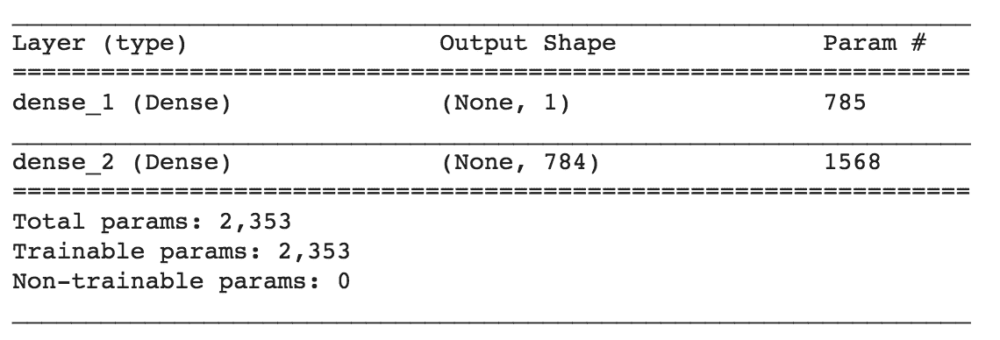

在我们进入下一步之前，让我们创建一个封装模型创建过程的函数。拥有这样的函数是有用的，因为它可以让我们轻松创建具有不同隐藏层大小的不同模型。

以下代码定义了一个创建基本自编码器的函数，其中包含`hidden_layer_size`变量：

```py
def create_basic_autoencoder(hidden_layer_size):
    model = Sequential() 
    model.add(Dense(units=hidden_layer_size, input_shape=(784,), 
                    activation='relu'))
    model.add(Dense(units=784, activation='sigmoid'))
    return model

model = create_basic_autoencoder(hidden_layer_size=1)
```

下一步是预处理我们的数据。需要两个预处理步骤：

1.  将图像从 28 x 28 的向量重塑为 784 x 1 的向量。

1.  将向量的值从当前的 0 到 255 规范化到 0 和 1 之间。这个较小的值范围使得使用数据训练神经网络变得更加容易。

为了将图像从 28 x 28 的大小重塑为 784 x 1，我们只需运行以下代码：

```py
X_train_reshaped = X_train.reshape((X_train.shape[0],
                                    X_train.shape[1]*X_train.shape[2]))
X_test_reshaped = X_test.reshape((X_test.shape[0],
                                  X_test.shape[1]*X_test.shape[2]))
```

请注意，第一个维度，`X_train.shape[0]`，表示样本的数量。

为了将向量的值从 0 到 255 规范化到 0 和 1 之间，我们运行以下代码：

```py
X_train_reshaped = X_train_reshaped/255.
X_test_reshaped = X_test_reshaped/255.
```

完成这些后，我们可以开始训练我们的模型。我们将首先使用`adam`优化器并将`mean_squared_error`作为`loss`函数来编译我们的模型。`mean_squared_error`在这种情况下是有用的，因为我们需要一个`loss`函数来量化输入与输出之间逐像素的差异。

以下代码使用上述参数编译我们的模型：

```py
model.compile(optimizer='adam', loss='mean_squared_error')
```

最后，让我们训练我们的模型`10`个周期。请注意，我们使用`X_train_reshaped`作为输入(*x*)和输出(*y*)。这是合理的，因为我们试图训练自编码器使输出与输入完全相同。

我们使用以下代码训练我们的自编码器：

```py
model.fit(X_train_reshaped, X_train_reshaped, epochs=10)
```

我们将看到以下输出：

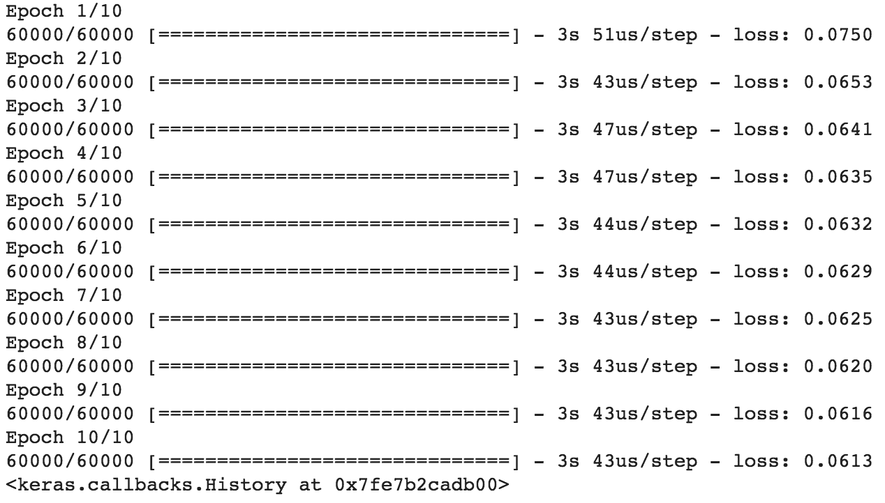

在模型训练完成后，我们将其应用于测试集：

```py
output = model.predict(X_test_reshaped)
```

我们希望绘制输出图像，并看看它与原始输入的匹配程度。记住，自编码器应该生成与原始输入图像相似的输出图像。

以下代码从测试集中随机选择五个图像，并将它们绘制在顶部行。然后，它将这五个随机选择的输入的输出图像绘制在底部行：

```py
import random
fig, ((ax1, ax2, ax3, ax4, ax5),
      (ax6, ax7, ax8, ax9, ax10)) = plt.subplots(2, 5, figsize=(20,7))

# randomly select 5 images
randomly_selected_imgs = random.sample(range(output.shape[0]),5)

# plot original images (input) on top row
for i, ax in enumerate([ax1,ax2,ax3,ax4,ax5]):
    ax.imshow(X_test[randomly_selected_imgs[i]], cmap='gray')
    if i == 0:
        ax.set_ylabel("INPUT",size=40)
    ax.grid(False)
    ax.set_xticks([])
    ax.set_yticks([])

# plot output images from our autoencoder on the bottom row
for i, ax in enumerate([ax6,ax7,ax8,ax9,ax10]):
    ax.imshow(output[randomly_selected_imgs[i]].reshape(28,28), 
              cmap='gray')
    if i == 0:
        ax.set_ylabel("OUTPUT",size=40)
    ax.grid(False)
    ax.set_xticks([])
    ax.set_yticks([])

plt.tight_layout()
plt.show()
```

我们将看到以下输出：

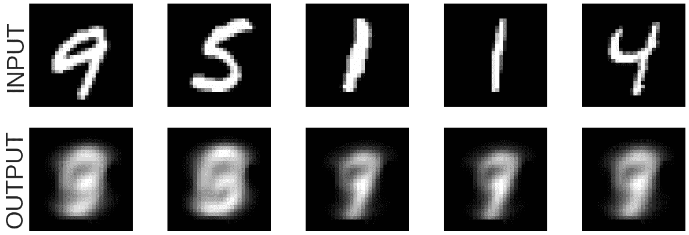

上图：提供给自编码器的原始图像作为输入；下图：自编码器输出的图像

等一下：输出图像看起来糟透了！它们看起来像模糊的白色涂鸦，完全不像我们的原始输入图像。显然，隐藏层节点数为一个节点的自编码器不足以对这个数据集进行编码。这个潜在表示对于我们的自编码器来说太小，无法充分捕捉我们数据的显著特征。

# 隐藏层大小对自编码器性能的影响

让我们尝试训练更多具有不同隐藏层大小的自编码器，看看它们的表现如何。

以下代码创建并训练五个不同的模型，隐藏层节点数分别为`2`、`4`、`8`、`16`和`32`：

```py
hiddenLayerSize_2_model = create_basic_autoencoder(hidden_layer_size=2)
hiddenLayerSize_4_model = create_basic_autoencoder(hidden_layer_size=4)
hiddenLayerSize_8_model = create_basic_autoencoder(hidden_layer_size=8)
hiddenLayerSize_16_model = create_basic_autoencoder(hidden_layer_size=16)
hiddenLayerSize_32_model = create_basic_autoencoder(hidden_layer_size=32)
```

注意，每个连续模型的隐藏层节点数是前一个模型的两倍。

现在，让我们一起训练所有五个模型。我们在`fit()`函数中使用`verbose=0`参数来隐藏输出，如以下代码片段所示：

```py
hiddenLayerSize_2_model.compile(optimizer='adam',
                                loss='mean_squared_error')
hiddenLayerSize_2_model.fit(X_train_reshaped, X_train_reshaped, 
                            epochs=10, verbose=0)

hiddenLayerSize_4_model.compile(optimizer='adam',
                                loss='mean_squared_error')
hiddenLayerSize_4_model.fit(X_train_reshaped, X_train_reshaped,
                            epochs=10, verbose=0)

hiddenLayerSize_8_model.compile(optimizer='adam',
                                loss='mean_squared_error')
hiddenLayerSize_8_model.fit(X_train_reshaped, X_train_reshaped,
                            epochs=10, verbose=0)

hiddenLayerSize_16_model.compile(optimizer='adam',
                                 loss='mean_squared_error')
hiddenLayerSize_16_model.fit(X_train_reshaped, X_train_reshaped, 
                             epochs=10, verbose=0)

hiddenLayerSize_32_model.compile(optimizer='adam',
                                 loss='mean_squared_error')
hiddenLayerSize_32_model.fit(X_train_reshaped, X_train_reshaped,
                             epochs=10, verbose=0)
```

一旦训练完成，我们将训练好的模型应用于测试集：

```py
output_2_model = hiddenLayerSize_2_model.predict(X_test_reshaped)
output_4_model = hiddenLayerSize_4_model.predict(X_test_reshaped)
output_8_model = hiddenLayerSize_8_model.predict(X_test_reshaped)
output_16_model = hiddenLayerSize_16_model.predict(X_test_reshaped)
output_32_model = hiddenLayerSize_32_model.predict(X_test_reshaped)
```

现在，让我们绘制每个模型随机选择的五个输出，并看看它们与原始输入图像的对比：

```py
fig, axes = plt.subplots(7, 5, figsize=(15,15))

randomly_selected_imgs = random.sample(range(output.shape[0]),5)
outputs = [X_test, output, output_2_model, output_4_model, output_8_model,
           output_16_model, output_32_model]

# Iterate through each subplot and plot accordingly
for row_num, row in enumerate(axes):
    for col_num, ax in enumerate(row):
        ax.imshow(outputs[row_num][randomly_selected_imgs[col_num]]. \
                      reshape(28,28), cmap='gray')
        ax.grid(False)
        ax.set_xticks([])
        ax.set_yticks([])
plt.tight_layout()
plt.show()
```

我们得到以下输出：

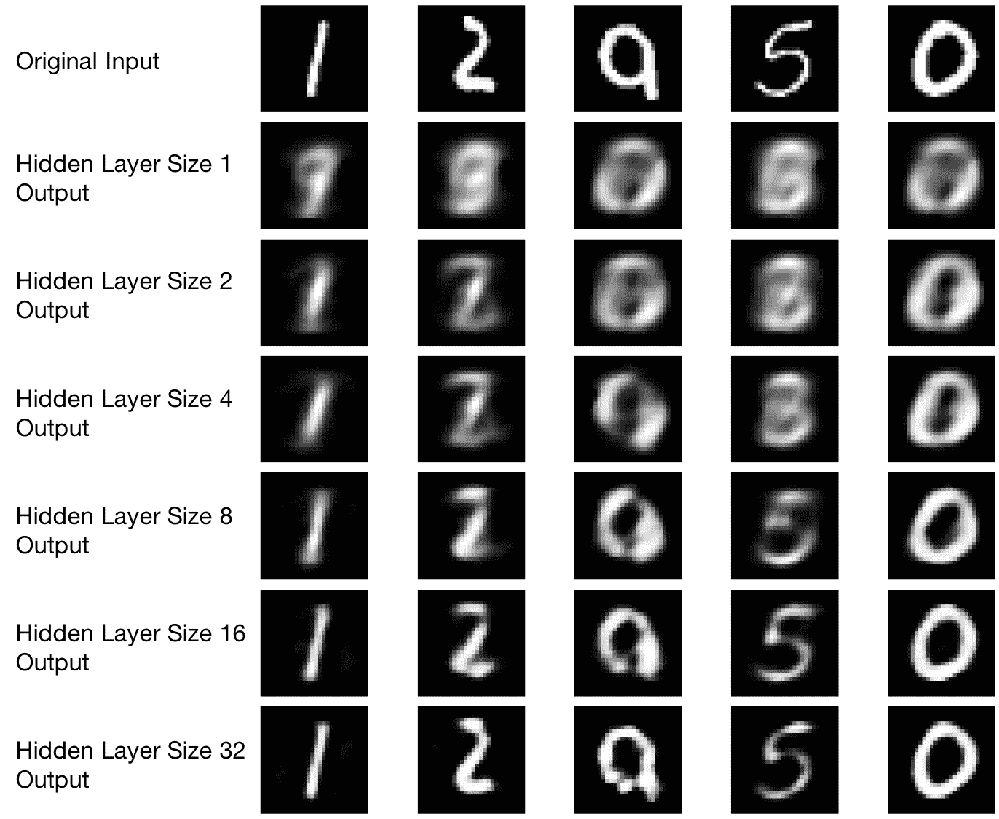

难道这不美吗？我们可以清楚地看到，当我们将隐藏层节点数加倍时，输出图像逐渐变得更清晰，并且越来越接近原始输入图像。

在隐藏层节点数为 32 时，输出变得非常接近（尽管不完美）原始输入。有趣的是，我们将原始输入压缩了 24.5 倍（784÷32），仍然能够生成令人满意的输出。这是一个相当令人印象深刻的压缩比！

# 去噪自编码器

自编码器的另一个有趣应用是图像去噪。图像噪声定义为图像中亮度的随机变化。图像噪声可能源自数字相机的传感器。尽管如今的数字相机能够捕捉高质量的图像，但图像噪声仍然可能发生，尤其是在低光条件下。

多年来，去噪图像一直是研究人员的难题。早期的方法包括对图像应用某种图像滤波器（例如，均值平滑滤波器，其中像素值被其邻居的平均像素值替换）。然而，这些方法有时会失效，效果可能不尽如人意。

几年前，研究人员发现我们可以训练自动编码器进行图像去噪。这个想法很简单。在训练传统自动编码器时（如上一节所述），我们使用相同的输入和输出，而在这里我们使用一张带噪声的图像作为输入，并使用一张干净的参考图像来与自动编码器的输出进行比较。以下图展示了这一过程：

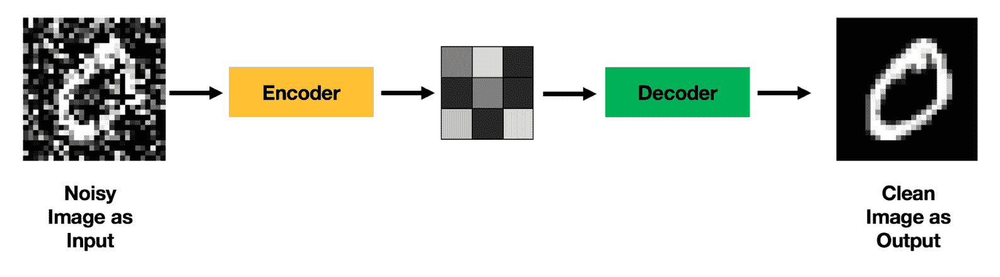

在训练过程中，自动编码器将学习到图像中的噪声不应成为输出的一部分，并将学会输出干净的图像。从本质上讲，我们是在训练自动编码器去除图像中的噪声！

让我们先给 MNIST 数据集引入噪声。我们将在原始图像的每个像素上加上一个介于`-0.5`和`0.5`之间的随机值。这将随机增加或减少像素的强度。以下代码使用`numpy`来实现这一操作：

```py
import numpy as np

X_train_noisy = X_train_reshaped + np.random.normal(0, 0.5,
                                    size=X_train_reshaped.shape)
X_test_noisy = X_test_reshaped + np.random.normal(0, 0.5,
                                    size=X_test_reshaped.shape)
```

最后，我们将带噪声的图像裁剪到`0`和`1`之间，以便对图像进行归一化：

```py
X_train_noisy = np.clip(X_train_noisy, a_min=0, a_max=1)
X_test_noisy = np.clip(X_test_noisy, a_min=0, a_max=1)
```

让我们像在上一节那样定义一个基础的自动编码器。这个基础的自动编码器有一个包含`16`个节点的单隐层。

以下代码使用我们在上一节中定义的函数来创建这个自动编码器：

```py
basic_denoise_autoencoder = create_basic_autoencoder(hidden_layer_size=16)
```

接下来，我们训练我们的去噪自动编码器。记住，去噪自动编码器的输入是带噪声的图像，输出是干净的图像。以下代码训练我们的基础去噪自动编码器：

```py
basic_denoise_autoencoder.compile(optimizer='adam', 
                                  loss='mean_squared_error')
basic_denoise_autoencoder.fit(X_train_noisy, X_train_reshaped, epochs=10)
```

一旦训练完成，我们将去噪自动编码器应用于测试图像：

```py
output = basic_denoise_autoencoder.predict(X_test_noisy)
```

我们绘制输出并将其与原始图像和带噪声的图像进行比较：

```py
fig, ((ax1, ax2, ax3, ax4, ax5), (ax6, ax7, ax8, ax9, ax10), (ax11,ax12,ax13,ax14,ax15)) = plt.subplots(3, 5, figsize=(20,13))
randomly_selected_imgs = random.sample(range(output.shape[0]),5)

# 1st row for original images
for i, ax in enumerate([ax1,ax2,ax3,ax4,ax5]):
    ax.imshow(X_test_reshaped[randomly_selected_imgs[i]].reshape(28,28), 
              cmap='gray')
    if i == 0:
        ax.set_ylabel("Original \n Images", size=30)
    ax.grid(False)
    ax.set_xticks([])
    ax.set_yticks([])

# 2nd row for input with noise added
for i, ax in enumerate([ax6,ax7,ax8,ax9,ax10]):
    ax.imshow(X_test_noisy[randomly_selected_imgs[i]].reshape(28,28),
              cmap='gray')
    if i == 0:
        ax.set_ylabel("Input With \n Noise Added", size=30)
    ax.grid(False)
    ax.set_xticks([])
    ax.set_yticks([])

# 3rd row for output images from our autoencoder
for i, ax in enumerate([ax11,ax12,ax13,ax14,ax15]):
    ax.imshow(output[randomly_selected_imgs[i]].reshape(28,28), 
              cmap='gray')
    if i == 0:
        ax.set_ylabel("Denoised \n Output", size=30)
    ax.grid(False)
    ax.set_xticks([])
    ax.set_yticks([])

plt.tight_layout()
plt.show()
```

我们得到如下输出：

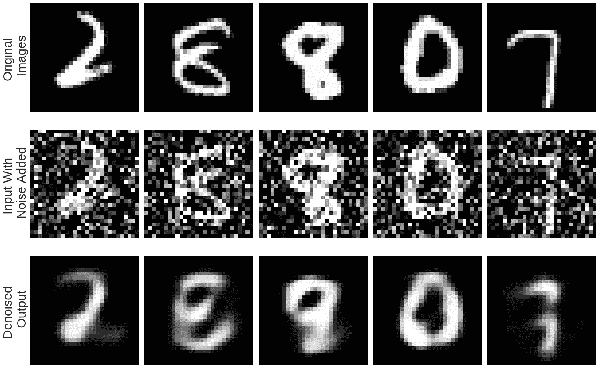

它表现如何？嗯，肯定可以更好！这个基础的去噪自动编码器完全能够去除噪声，但在重建原始图像时并不做得很好。我们可以看到，这个基础的去噪自动编码器有时未能有效区分噪声和数字，尤其是在图像的中心部分。

# 深度卷积去噪自动编码器

我们能做得比基础的单隐层自动编码器更好吗？我们在上一章中看到，第四章，*猫与狗 – 使用 CNN 进行图像分类*，深度 CNN 在图像分类任务中表现出色。自然，我们也可以将相同的概念应用于自动编码器。我们不再仅使用一个隐层，而是使用多个隐层（即深度网络），并且不使用全连接的稠密层，而是使用卷积层。

以下图示说明了深度卷积自编码器的架构：

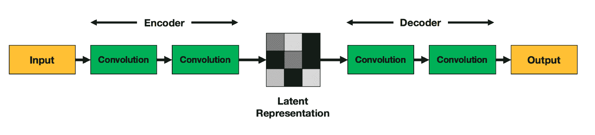

在 Keras 中构建深度卷积自编码器非常简单。我们再次使用 Keras 中的`Sequential`类来构建我们的模型。

首先，我们定义一个新的`Sequential`类：

```py
conv_autoencoder = Sequential()
```

接下来，我们将添加作为编码器的前两层卷积层。在使用 Keras 中的`Conv2D`类时，有几个参数需要定义：

+   **滤波器数量：**通常，在编码器的每一层中，我们使用递减数量的滤波器。相反，在解码器的每一层中，我们使用递增数量的滤波器。我们可以为编码器的第一层卷积层使用 16 个滤波器，为第二层卷积层使用 8 个滤波器。相反，我们可以为解码器的第一层卷积层使用 8 个滤波器，为第二层卷积层使用 16 个滤波器。

+   **滤波器大小：**如上一章所示，第四章，*猫狗对战——使用 CNN 进行图像分类*，卷积层通常使用 3 x 3 的滤波器大小。

+   **填充：**对于自编码器，我们使用相同的填充方式。这确保了连续层的高度和宽度保持不变。这一点非常重要，因为我们需要确保最终输出的维度与输入相同。

以下代码片段将前述参数添加到模型中，包含前两层卷积层：

```py
from keras.layers import Conv2D
conv_autoencoder.add(Conv2D(filters=16, kernel_size=(3,3),
                            activation='relu', padding='same', 
                            input_shape=(28,28,1)))
conv_autoencoder.add(Conv2D(filters=8, kernel_size=(3,3),
                            activation='relu', padding='same'))
```

接下来，我们将解码器层添加到模型中。与编码器层类似，解码器层也是卷积层。唯一的不同是，在解码器层中，我们在每一层后使用递增数量的滤波器。

以下代码片段添加了作为解码器的两个卷积层：

```py
conv_autoencoder.add(Conv2D(filters=8, kernel_size=(3,3),
                            activation='relu', padding='same'))
conv_autoencoder.add(Conv2D(filters=16, kernel_size=(3,3),
                            activation='relu', padding='same'))
```

最后，我们向模型中添加输出层。输出层应该是一个只有一个滤波器的卷积层，因为我们要输出一个 28 x 28 x 1 的图像。`Sigmoid`函数被用作输出层的激活函数。

以下代码添加了最终的输出层：

```py
conv_autoencoder.add(Conv2D(filters=1, kernel_size=(3,3),
                            activation='sigmoid', padding='same'))
```

让我们看看模型的结构，以确保它与前面图示中展示的一致。我们可以通过调用`summary()`函数来实现：

```py
conv_autoencoder.summary()
```

我们得到以下输出：

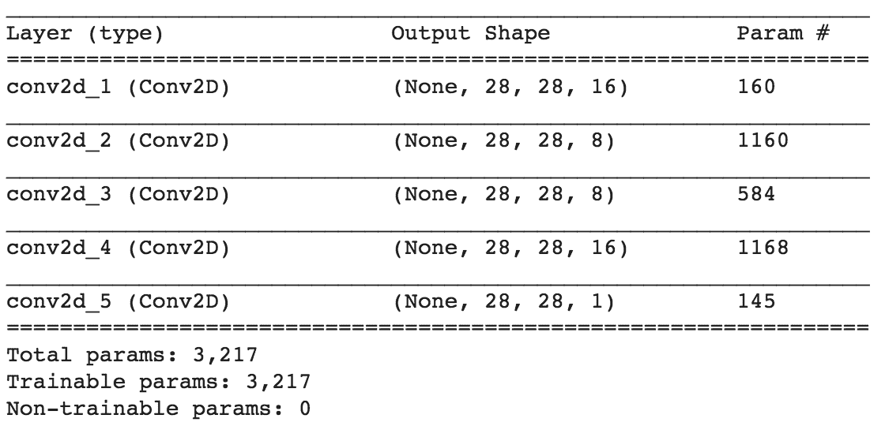

我们现在准备好训练我们的深度卷积自编码器。像往常一样，我们在`compile`函数中定义训练过程，并调用`fit`函数，如下所示：

```py
conv_autoencoder.compile(optimizer='adam', loss='binary_crossentropy')
conv_autoencoder.fit(X_train_noisy.reshape(60000,28,28,1),
                     X_train_reshaped.reshape(60000,28,28,1),
                     epochs=10)
```

训练完成后，我们将得到以下输出：

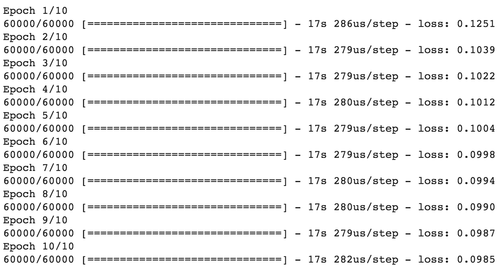

让我们在测试集上使用训练好的模型：

```py
output = conv_autoencoder.predict(X_test_noisy.reshape(10000,28,28,1))
```

看到这个深度卷积自编码器在测试集上的表现将会很有趣。记住，测试集代表了模型从未见过的图像。

我们绘制输出并将其与原始图像和噪声图像进行比较：

```py
fig, ((ax1, ax2, ax3, ax4, ax5), (ax6, ax7, ax8, ax9, ax10), (ax11,ax12,ax13,ax14,ax15)) = plt.subplots(3, 5, figsize=(20,13))
randomly_selected_imgs = random.sample(range(output.shape[0]),5)

# 1st row for original images
for i, ax in enumerate([ax1,ax2,ax3,ax4,ax5]):
    ax.imshow(X_test_reshaped[randomly_selected_imgs[i]].reshape(28,28), 
              cmap='gray')
    if i == 0:
        ax.set_ylabel("Original \n Images", size=30)
    ax.grid(False)
    ax.set_xticks([])
    ax.set_yticks([])

# 2nd row for input with noise added
for i, ax in enumerate([ax6,ax7,ax8,ax9,ax10]):
    ax.imshow(X_test_noisy[randomly_selected_imgs[i]].reshape(28,28), 
              cmap='gray')
    if i == 0:
        ax.set_ylabel("Input With \n Noise Added", size=30)
    ax.grid(False)
    ax.set_xticks([])
    ax.set_yticks([])

# 3rd row for output images from our autoencoder
for i, ax in enumerate([ax11,ax12,ax13,ax14,ax15]):
    ax.imshow(output[randomly_selected_imgs[i]].reshape(28,28), 
              cmap='gray')
    if i == 0:
        ax.set_ylabel("Denoised \n Output", size=30)
    ax.grid(False)
    ax.set_xticks([])
    ax.set_yticks([])

plt.tight_layout()
plt.show()
```

我们得到以下输出：

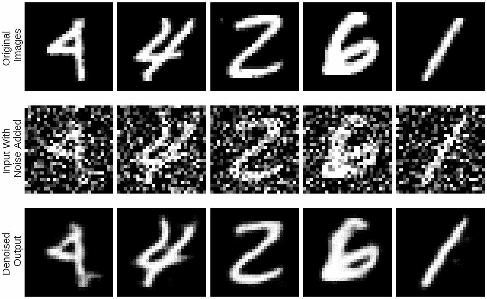

这难道不令人惊讶吗？我们的深度卷积自编码器的去噪输出效果如此出色，以至于我们几乎无法分辨原始图像和去噪后的输出。

尽管结果令人印象深刻，但需要记住的是，我们使用的卷积模型相对简单。深度神经网络的优势在于我们总是可以增加模型的复杂性（即更多的层和每层更多的滤波器），并将其应用于更复杂的数据集。这个扩展能力是深度神经网络的主要优势之一。

# 使用自编码器去噪文档

到目前为止，我们已经在 MNIST 数据集上应用了去噪自编码器，该数据集相对简单。现在让我们看看一个更复杂的数据集，它更好地代表了现实生活中去噪文档所面临的挑战。

我们将使用的数据集是由**加利福尼亚大学欧文分校**（**UCI**）免费提供的。有关数据集的更多信息，请访问 UCI 的网站：[`archive.ics.uci.edu/ml/datasets/NoisyOffice`](https://archive.ics.uci.edu/ml/datasets/NoisyOffice)。

数据集可以在本书的配套 GitHub 仓库中找到。有关如何从 GitHub 仓库下载本章的代码和数据集的更多信息，请参阅本章前面的*技术要求*部分。

该数据集包含 216 张不同的噪声图像。这些噪声图像是扫描的办公室文档，受到咖啡渍、皱痕和其他典型的办公室文档缺陷的污染。对于每张噪声图像，提供了一张对应的干净图像，表示理想的无噪声状态下的办公室文档。

让我们看一下数据集，深入了解我们正在处理的内容。数据集位于以下文件夹：

```py
noisy_imgs_path = 'Noisy_Documents/noisy/'
clean_imgs_path = 'Noisy_Documents/clean/'
```

`Noisy_Documents`文件夹包含两个子文件夹（`noisy`和`clean`），分别包含噪声图像和干净图像。

要将`.png`图像加载到 Python 中，我们可以使用 Keras 提供的`load_img`函数。为了将加载的图像转换为`numpy`数组，我们使用 Keras 中的`img_to_array`函数。

以下代码将位于`/Noisy_Documents/noisy/`文件夹中的噪声`.png`图像导入到`numpy`数组中：

```py
import os
import numpy as np
from keras.preprocessing.image import load_img, img_to_array

X_train_noisy = []

for file in sorted(os.listdir(noisy_imgs_path)):
    img = load_img(noisy_imgs_path+file, color_mode='grayscale', 
                   target_size=(420,540))
    img = img_to_array(img).astype('float32')/255
    X_train_noisy.append(img)

# convert to numpy array
X_train_noisy = np.array(X_train_noisy) 
```

为了验证我们的图像是否正确加载到`numpy`数组中，让我们打印数组的维度：

```py
print(X_train_noisy.shape)
```

我们得到以下输出：

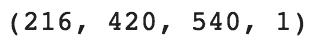

我们可以看到，数组中有 216 张图像，每张图像的维度为 420 x 540 x 1（宽度 x 高度 x 每张图像的通道数）。

对干净的图像执行相同操作。以下代码将位于`/Noisy_Documents/clean/`文件夹中的干净`.png`图像导入到`numpy`数组中：

```py
X_train_clean = []

for file in sorted(os.listdir(clean_imgs_path)):
    img = load_img(clean_imgs_path+file, color_mode='grayscale', 
                   target_size=(420,540))
    img = img_to_array(img).astype('float32')/255
    X_train_clean.append(img) 

# convert to numpy array
X_train_clean = np.array(X_train_clean)
```

让我们展示加载的图像，以便更好地了解我们正在处理的图像类型。以下代码随机选择`3`张图像并绘制它们，如下所示：

```py
import random
fig, ((ax1,ax2), (ax3,ax4), 
      (ax5,ax6)) = plt.subplots(3, 2, figsize=(10,12))

randomly_selected_imgs = random.sample(range(X_train_noisy.shape[0]),3)

# plot noisy images on the left
for i, ax in enumerate([ax1,ax3,ax5]):
    ax.imshow(X_train_noisy[i].reshape(420,540), cmap='gray')
    if i == 0:
        ax.set_title("Noisy Images", size=30)
    ax.grid(False)
    ax.set_xticks([])
    ax.set_yticks([])

# plot clean images on the right
for i, ax in enumerate([ax2,ax4,ax6]):
    ax.imshow(X_train_clean[i].reshape(420,540), cmap='gray')
    if i == 0:
        ax.set_title("Clean Images", size=30)
    ax.grid(False)
    ax.set_xticks([])
    ax.set_yticks([])

plt.tight_layout()
plt.show()
```

我们得到如下截图中的输出：

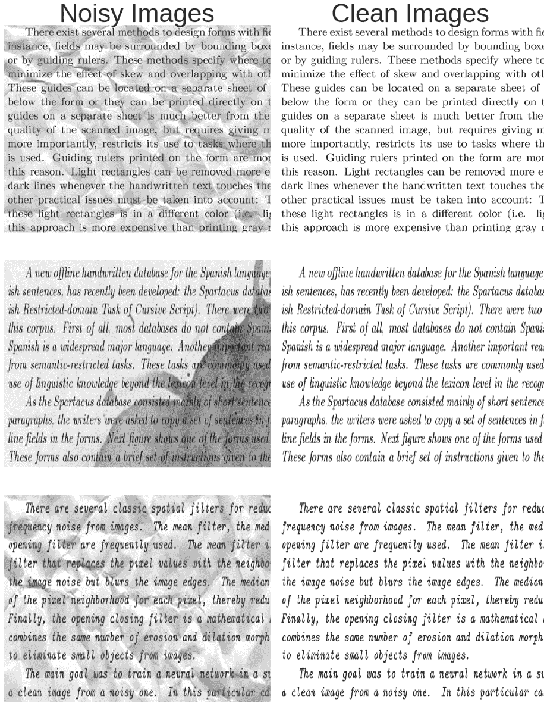

我们可以看到这个数据集中噪声的类型与 MNIST 数据集中看到的显著不同。这个数据集中的噪声是随机的伪影，遍布整个图像。我们的自编码器模型需要能够清楚地理解信号与噪声的区别，才能成功去噪这个数据集。

在我们开始训练模型之前，让我们将数据集分成训练集和测试集，如下代码所示：

```py
# use the first 20 noisy images as testing images
X_test_noisy = X_train_noisy[0:20,]
X_train_noisy = X_train_noisy[21:,]

# use the first 20 clean images as testing images
X_test_clean = X_train_clean[0:20,]
X_train_clean = X_train_clean[21:,]
```

# 基本卷积自编码器

我们现在已经准备好解决这个问题了。让我们从一个基本模型开始，看看能走多远。

和往常一样，我们定义一个新的`Sequential`类：

```py
basic_conv_autoencoder = Sequential()
```

接下来，我们添加一个卷积层作为编码器层：

```py
basic_conv_autoencoder.add(Conv2D(filters=8, kernel_size=(3,3),
                                  activation='relu', padding='same', 
                                  input_shape=(420,540,1)))
```

我们添加一个卷积层作为解码器层：

```py
basic_conv_autoencoder.add(Conv2D(filters=8, kernel_size=(3,3), 
                                  activation='relu', padding='same'))
```

最后，我们添加一个输出层：

```py
basic_conv_autoencoder.add(Conv2D(filters=1, kernel_size=(3,3), 
                                  activation='sigmoid', padding='same'))
```

让我们查看模型的结构：

```py
basic_conv_autoencoder.summary()
```

我们得到如下截图中的输出：

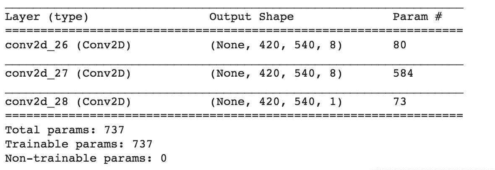

这是训练我们基本卷积自编码器的代码：

```py
basic_conv_autoencoder.compile(optimizer='adam', 
                               loss='binary_crossentropy')
basic_conv_autoencoder.fit(X_train_noisy, X_train_clean, epochs=10)
```

一旦训练完成，我们将模型应用到测试集上：

```py
output = basic_conv_autoencoder.predict(X_test_noisy)
```

让我们绘制输出，看看得到的结果。以下代码在左列绘制原始噪声图像，在中列绘制原始干净图像，并在右列绘制从我们模型输出的去噪图像：

```py
fig, ((ax1,ax2,ax3),(ax4,ax5,ax6)) = plt.subplots(2,3, figsize=(20,10))

randomly_selected_imgs = random.sample(range(X_test_noisy.shape[0]),2)

for i, ax in enumerate([ax1, ax4]):
    idx = randomly_selected_imgs[i]
    ax.imshow(X_test_noisy[idx].reshape(420,540), cmap='gray')
    if i == 0:
        ax.set_title("Noisy Images", size=30)
    ax.grid(False)
    ax.set_xticks([])
    ax.set_yticks([])

for i, ax in enumerate([ax2, ax5]):
    idx = randomly_selected_imgs[i]
    ax.imshow(X_test_clean[idx].reshape(420,540), cmap='gray')
    if i == 0:
        ax.set_title("Clean Images", size=30)
    ax.grid(False)
    ax.set_xticks([])
    ax.set_yticks([])

for i, ax in enumerate([ax3, ax6]):
    idx = randomly_selected_imgs[i]
    ax.imshow(output[idx].reshape(420,540), cmap='gray')
    if i == 0:
        ax.set_title("Output Denoised Images", size=30)
    ax.grid(False)
    ax.set_xticks([])
    ax.set_yticks([])

plt.tight_layout()
plt.show()
```

我们得到如下截图中的输出：

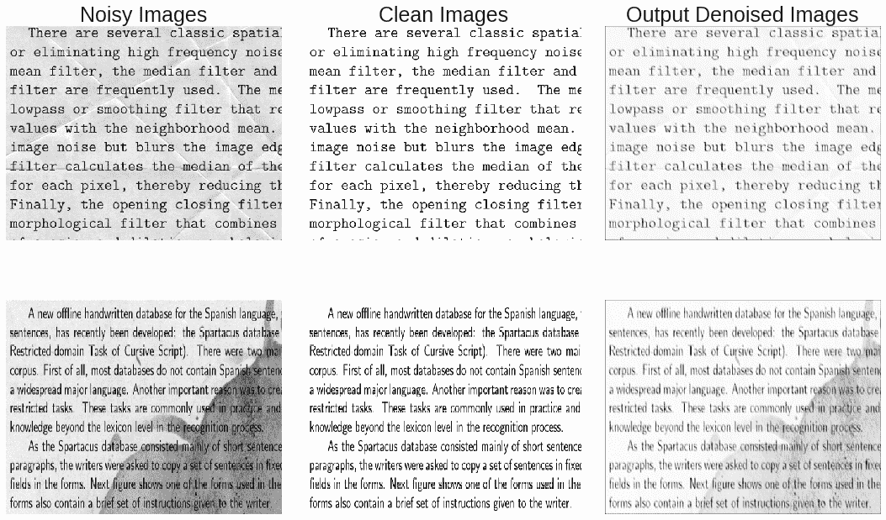

嗯，我们的模型确实能做得更好。去噪后的图像通常有灰色背景，而不是`Clean Images`中的白色背景。模型在去除`Noisy Images`中的咖啡渍方面也做得不太好。此外，去噪后的图像中的文字较为模糊，显示出模型在此任务上的困难。

# 深度卷积自编码器

让我们尝试使用更深的模型和每个卷积层中更多的滤波器来去噪图像。

我们首先定义一个新的`Sequential`类：

```py
conv_autoencoder = Sequential()
```

接下来，我们添加三个卷积层作为编码器，使用`32`、`16`和`8`个滤波器：

```py
conv_autoencoder.add(Conv2D(filters=32, kernel_size=(3,3),
                            input_shape=(420,540,1), 
                            activation='relu', padding='same'))
conv_autoencoder.add(Conv2D(filters=16, kernel_size=(3,3),
                            activation='relu', padding='same'))
conv_autoencoder.add(Conv2D(filters=8, kernel_size=(3,3),
                            activation='relu', padding='same'))
```

同样地，对于解码器，我们添加三个卷积层，使用`8`、`16`和`32`个滤波器：

```py
conv_autoencoder.add(Conv2D(filters=8, kernel_size=(3,3), 
                            activation='relu', padding='same'))
conv_autoencoder.add(Conv2D(filters=16, kernel_size=(3,3), 
                            activation='relu', padding='same'))
conv_autoencoder.add(Conv2D(filters=32, kernel_size=(3,3), 
                            activation='relu', padding='same'))
```

最后，我们添加一个输出层：

```py
conv_autoencoder.add(Conv2D(filters=1, kernel_size=(3,3), 
                            activation='sigmoid', padding='same'))
```

让我们查看一下模型的结构：

```py
conv_autoencoder.summary()
```

我们得到以下输出：

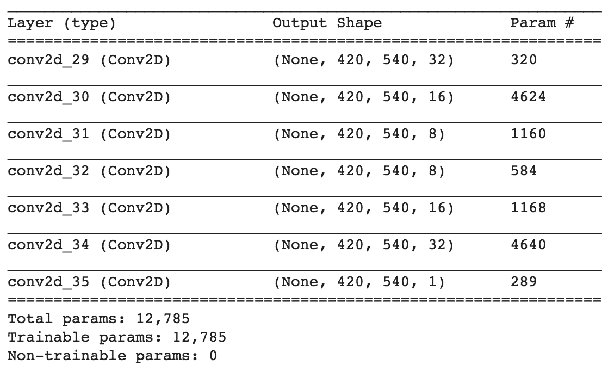

从前面的输出中，我们可以看到模型中有 12,785 个参数，大约是我们在上一节使用的基本模型的 17 倍。

让我们训练模型并将其应用于测试图像：

警告

以下代码可能需要一些时间运行，如果你没有使用带 GPU 的 Keras。若模型训练时间过长，你可以减少每个卷积层中的滤波器数量。

```py
conv_autoencoder.compile(optimizer='adam', loss='binary_crossentropy')
conv_autoencoder.fit(X_train_noisy, X_train_clean, epochs=10)

output = conv_autoencoder.predict(X_test_noisy)
```

最后，我们绘制输出结果，以查看得到的结果类型。以下代码将原始噪声图像显示在左列，原始干净图像显示在中列，模型输出的去噪图像显示在右列：

```py
fig, ((ax1,ax2,ax3),(ax4,ax5,ax6)) = plt.subplots(2,3, figsize=(20,10))

randomly_selected_imgs = random.sample(range(X_test_noisy.shape[0]),2)

for i, ax in enumerate([ax1, ax4]):
    idx = randomly_selected_imgs[i]
    ax.imshow(X_test_noisy[idx].reshape(420,540), cmap='gray')
    if i == 0:
        ax.set_title("Noisy Images", size=30)
    ax.grid(False)
    ax.set_xticks([])
    ax.set_yticks([])

for i, ax in enumerate([ax2, ax5]):
    idx = randomly_selected_imgs[i]
    ax.imshow(X_test_clean[idx].reshape(420,540), cmap='gray')
    if i == 0:
        ax.set_title("Clean Images", size=30)
    ax.grid(False)
    ax.set_xticks([])
    ax.set_yticks([])

for i, ax in enumerate([ax3, ax6]):
    idx = randomly_selected_imgs[i]
    ax.imshow(output[idx].reshape(420,540), cmap='gray')
    if i == 0:
        ax.set_title("Output Denoised Images", size=30)
    ax.grid(False)
    ax.set_xticks([])
    ax.set_yticks([])

plt.tight_layout()
plt.show()
```

我们得到以下输出：

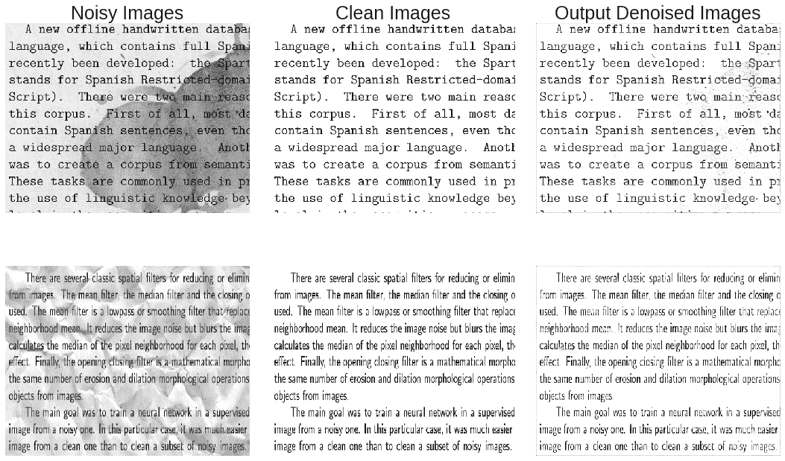

结果看起来很棒！实际上，去噪后的图像看起来非常好，我们几乎无法区分它们与真实的干净图像。我们可以看到，咖啡渍几乎完全被去除了，揉皱纸张的噪声在去噪图像中消失了。此外，去噪图像中的文字清晰锐利，我们可以轻松地阅读去噪图像中的文字。

这个数据集真正展示了自编码器的强大功能。通过增加更多复杂性，例如更深的卷积层和更多的滤波器，模型能够区分信号与噪声，从而成功去除严重损坏的图像噪声。

# 总结

在本章中，我们研究了自编码器，这是一类学习输入图像潜在表示的神经网络。我们看到所有自编码器都有一个编码器和解码器组件。编码器的作用是将输入编码成一个学习到的压缩表示，而解码器的作用是使用这个压缩表示重构原始输入。

我们首先研究了用于图像压缩的自编码器。通过训练一个输入和输出相同的自编码器，自编码器能够学习输入的最显著特征。使用 MNIST 图像，我们构建了一个压缩率为 24.5 倍的自编码器。利用这个学习到的 24.5 倍压缩表示，自编码器能够成功地重构原始输入。

接下来，我们研究了去噪自编码器。通过训练一个以噪声图像为输入、干净图像为输出的自编码器，自编码器能够从噪声中提取信号，并成功地去除噪声图像的噪声。我们训练了一个深度卷积自编码器，该自编码器能够成功去除咖啡渍和其他类型的图像损坏。结果令人印象深刻，去噪自编码器几乎去除了所有噪声，输出几乎与真实的干净图像完全相同。

在下一章，第六章，*使用 LSTM 进行电影评论情感分析*，我们将使用**长短期记忆**（**LSTM**）神经网络来预测电影评论的情感。

# 问题

1.  自编码器与传统的前馈神经网络有什么不同？

自编码器是学习输入压缩表示的神经网络，这种表示被称为潜在表示。它们不同于传统的前馈神经网络，因为自编码器的结构包含一个编码器和一个解码器组件，而这些组件在 CNN 中是不存在的。

1.  当自编码器的潜在表示过小时会发生什么？

潜在表示的大小应该足够*小*，以便表示输入的压缩表示，同时又要足够*大*，使解码器能够重建原始图像而不会丢失太多信息。

1.  训练去噪自编码器时的输入和输出是什么？

去噪自编码器的输入应为一张带噪声的图像，输出应为一张干净的参考图像。在训练过程中，自编码器通过`loss`函数学习输出不应包含任何噪声，并且自编码器的潜在表示应该只包含信号（即非噪声元素）。

1.  我们可以通过哪些方法提高去噪自编码器的复杂度？

对于去噪自编码器，卷积层总是比全连接层表现更好，就像卷积神经网络（CNN）在图像分类任务中比传统的前馈神经网络表现更佳一样。我们还可以通过构建一个更深的网络（增加更多的层数），并在每个卷积层中使用更多的滤波器，来提高模型的复杂度。
