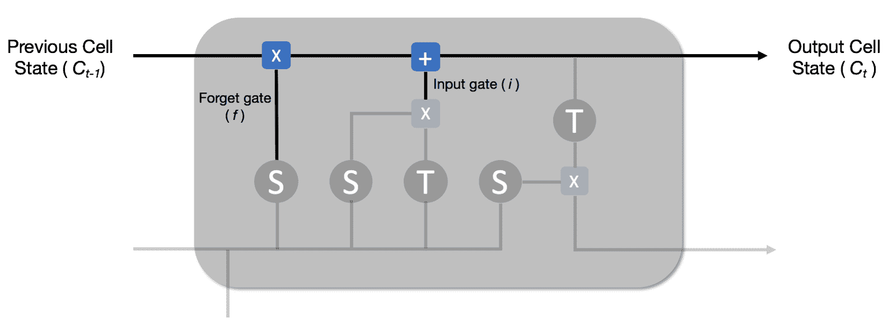

# 第六章：使用 LSTM 进行电影评论情感分析

在前几章中，我们探讨了神经网络架构，例如基本的 MLP 和前馈神经网络，适用于分类和回归任务。随后我们看了 CNN，并了解了它们在图像识别任务中的应用。本章将重点讨论**递归神经网络**（**RNNs**）（特别是**长短期记忆网络**（**LSTM**）），以及它们如何用于顺序问题，如**自然语言处理**（**NLP**）。我们将开发并训练一个 LSTM 网络，用于预测 IMDb 上电影评论的情感。

本章将覆盖以下主题：

+   机器学习中的顺序问题

+   自然语言处理与情感分析

+   RNN 和 LSTM 网络简介

+   IMDb 电影评论数据集分析

+   词嵌入

+   在 Keras 中构建和训练 LSTM 网络的分步指南

+   我们结果的分析

# 技术要求

本章所需的 Python 库如下：

+   matplotlib 3.0.2

+   Keras 2.2.4

+   seaborn 0.9.0

+   scikit-learn 0.20.2

本章的代码可以在本书的 GitHub 仓库中找到。

要将代码下载到您的计算机上，您可以运行以下 `git clone` 命令：

```py
$ git clone https://github.com/PacktPublishing/Neural-Network-Projects-with-Python.git
```

完成过程后，将会生成一个名为 `Neural-Network-Projects-with-Python` 的文件夹。运行以下命令进入该文件夹：

```py
$ cd Neural-Network-Projects-with-Python
```

要在虚拟环境中安装所需的 Python 库，请运行以下命令：

```py
$ conda env create -f environment.yml
```

请注意，在运行此命令之前，您应该先在计算机上安装 Anaconda。要进入虚拟环境，请运行以下命令：

```py
$ conda activate neural-network-projects-python
```

通过运行以下命令进入 `Chapter06` 文件夹：

```py
$ cd Chapter06
```

以下文件位于文件夹中：

+   `lstm.py`：这是本章的主要代码

要运行代码，只需执行 `lstm.py` 文件：

```py
$ python lstm.py
```

# 机器学习中的顺序问题

**顺序问题**是机器学习中的一类问题，其中呈现给模型的特征顺序对于做出预测至关重要。顺序问题常见于以下场景：

+   自然语言处理，包括情感分析、语言翻译和文本预测

+   时间序列预测

例如，让我们考虑文本预测问题，如下图所示，它属于自然语言处理范畴：


人类天生具有这种能力，我们很容易知道空白处的词可能是*Japanese*。原因在于，当我们阅读句子时，我们将词汇处理为一个序列。这个词序列包含了进行预测所需的信息。相比之下，如果我们忽略序列信息，仅仅把单词当作独立的个体来看，就得到了一个*词袋*，如下面的示意图所示：


我们可以看到，现在我们预测空白处单词的能力受到严重影响。如果不知道单词的顺序，就无法预测空白处的单词。

除了文本预测，情感分析和语言翻译也是顺序问题。实际上，许多 NLP 问题都是顺序问题，因为我们所说的语言本身就是顺序性的，顺序传达了上下文和其他细微的差别。

顺序问题在时间序列问题中也自然发生。时间序列问题在股市中很常见。我们常常希望知道某只股票在某天是否会上涨或下跌。这个问题被准确地定义为时间序列问题，因为了解股票在前几个小时或几分钟的变化通常对预测股票是涨是跌至关重要。今天，机器学习方法在这个领域得到了广泛应用，算法交易策略推动着股票的买卖。

本章将重点讨论 NLP 问题。特别地，我们将为情感分析创建一个神经网络。

# NLP 与情感分析

自然语言处理（NLP）是**人工智能**（**AI**）的一个子领域，专注于计算机与人类语言的交互。早在 1950 年代，科学家们就对设计能够理解人类语言的智能机器产生了兴趣。早期的语言翻译工作集中在基于规则的方法上，其中一组语言学专家手工编写了一套规则，并将其编码到机器中。然而，这种基于规则的方法产生的结果并不理想，而且通常无法将这些规则从一种语言转换到另一种语言，这意味着规模化变得困难。在许多年代里，NLP 领域进展缓慢，人类语言一直是 AI 无法达到的目标——直到深度学习的复兴。

随着深度学习和神经网络在图像分类领域的普及，科学家们开始思考神经网络的能力是否可以应用于自然语言处理（NLP）。在 2000 年代末，科技巨头如苹果、亚马逊和谷歌将 LSTM 网络应用于 NLP 问题，结果令人震惊。AI 助手（如 Siri 和 Alexa）能够理解不同口音说出的多种语言，正是得益于深度学习和 LSTM 网络。近年来，我们也看到了文本翻译软件（如 Google Translate）能力的巨大提升，它能够提供与人类语言专家相媲美的翻译结果。

**情感分析**也是 NLP 的一个领域，受益于深度学习的复兴。情感分析被定义为对文本的积极性预测。大多数情感分析问题都是分类问题（积极/中立/消极），而不是回归问题。

情感分析有许多实际应用。例如，现代客户服务中心通过情感分析预测客户在 Yelp 或 Facebook 等平台上提供的评论中的满意度。这使得企业能够在客户不满时立即介入，及时解决问题，避免客户流失。

情感分析也已应用于股票交易领域。2010 年，科学家们通过分析 Twitter 上的情感（积极与消极的推文），证明我们可以预测股市是否会上涨。同样，高频交易公司利用情感分析来分析与特定公司相关的新闻情感，并根据新闻的积极性自动执行交易。

# 为什么情感分析很困难

情感分析的早期工作面临许多障碍，因为人类语言中存在微妙的差异。同一个词往往会根据上下文传达不同的意义。举个例子，看看以下两句话：


我们知道第一句话的情感是消极的，因为它很可能意味着大楼真的着火了。另一方面，我们知道第二句话的情感是积极的，因为不太可能那个人真的着火了。相反，它可能意味着那个人正在经历一个*好时光*，这是积极的。基于规则的情感分析方法由于这些微妙的差异而遭遇困境，而且以规则化的方式编码这些知识非常复杂。

情感分析困难的另一个原因是讽刺。讽刺在许多文化中被广泛使用，尤其是在在线环境中。讽刺对计算机来说是难以理解的。事实上，即便是人类有时也难以察觉讽刺。举个例子，看一下以下这句话：


你可能能在前一句话中检测到讽刺，并得出结论情感是消极的。然而，对于程序来说，要理解这一点并不容易。

在下一节中，我们将探讨 RNN 和 LSTM 网络，以及它们如何被用于解决情感分析问题。

# RNN

直到现在，我们在项目中使用了神经网络，如 MLP、前馈神经网络和 CNN。这些神经网络面临的限制是它们只能接受一个固定的输入向量，如图像，并输出另一个向量。这些神经网络的高层架构可以通过以下图示总结：


这种限制性的架构使得 CNN 难以处理顺序数据。为了处理顺序数据，神经网络需要在每个时间步获取数据的特定部分，并按其出现的顺序进行处理。这为 RNN 提供了灵感。RNN 的高层架构如下图所示：


从前面的图中我们可以看到，RNN 是一个多层神经网络。我们可以将原始输入拆分成时间步。例如，如果原始输入是一句话，我们可以将这句话拆分成单独的词（在这种情况下，每个词代表一个时间步）。然后，每个词将作为 **输入** 提供给 RNN 中相应的层。更重要的是，RNN 中的每一层将其输出传递给下一层。从层到层传递的中间输出被称为隐藏状态。本质上，隐藏状态使得 RNN 能够保持对顺序数据中间状态的记忆。

# RNN 中包含了什么？

现在，让我们仔细看看 RNN 每一层内部发生了什么。下图展示了 RNN 每一层内部的数学函数：


RNN 的数学函数非常简单。RNN 中每一层 *t* 都有两个输入：

+   来自时间步 *t* 的输入

+   从前一层传递过来的隐藏状态 *t-1*

RNN 中的每一层简单地将两个输入相加，并对总和应用 *tanh* 函数。然后它输出结果，作为隐藏状态传递给下一层。就是这么简单！更正式地说，层 *t* 的输出隐藏状态为：


那么，*tanh* 函数到底是什么呢？*tanh* 函数是双曲正切函数，它将一个值压缩到 **1** 和 **-1** 之间。下图说明了这一点：


tanh 函数作为当前输入和前一隐藏状态的非线性转换是一个不错的选择，因为它可以确保权重不会过快地发散。它还有其他一些优良的数学性质，比如易于求导。

最后，为了从 RNN 的最后一层得到最终输出，我们只需对其应用 *sigmoid* 函数：


在前面的方程中，*n* 是 RNN 中最后一层的索引。从前面的章节中回顾，*sigmoid* 函数会产生一个介于 0 和 1 之间的输出，因此为每个类别提供概率作为预测。

我们可以看到，如果我们将这些层堆叠在一起，RNN 的最终输出依赖于不同时间步输入的非线性组合。

# RNN 中的长短期依赖

RNN 的架构使其非常适合处理序列数据。我们来看一些具体的例子，了解 RNN 如何处理不同长度的序列数据。

首先，我们来看一段简短的文本作为我们的序列数据：


我们可以通过将这句话拆解成五个不同的输入，将每个单词作为每个时间步，来把它视作序列数据。下图说明了这一点：


现在，假设我们正在构建一个简单的 RNN 来预测是否下雪，基于这个序列数据。RNN 会像这样工作：


序列中的关键信息是第 4 个时间步（**t[4]**，[红圈标注])的单词**HOT**。有了这条信息，RNN 能够轻松预测今天不会下雪。请注意，关键信息出现在最终输出之前不久。换句话说，我们可以说这个序列中存在短期依赖。

显然，RNN 在处理短期依赖时没有问题。但长期依赖怎么办呢？让我们现在来看一个更长的文本序列。我们以以下段落为例：


我们的目标是预测客户是否喜欢这部电影。显然，客户喜欢这部电影，但不喜欢影院，这也是段落中的主要投诉。让我们把段落分解成一系列输入，每个单词在每个时间步（段落中 32 个单词对应 32 个时间步）。RNN 会是这样处理的：


关键字**liked the movie**出现在第 3 到第 5 个时间步之间。请注意，关键时间步和输出时间步之间存在显著的间隔，因为其余文本对预测问题（客户是否喜欢这部电影）大多是无关的。换句话说，我们说这个序列中存在长期依赖。不幸的是，RNN 在处理长期依赖序列时效果不好。RNN 具有良好的短期记忆，但长期记忆较差。为了理解这一点，我们需要理解在训练神经网络时的**消失梯度问题**。

# 消失梯度问题

消失梯度问题是在使用基于梯度的训练方法（如反向传播）训练深度神经网络时出现的问题。回想一下，在之前的章节中，我们讨论了神经网络训练中的反向传播算法。特别地，`loss` 函数提供了我们预测准确性的反馈，并使我们能够调整每一层的权重，以减少损失。

到目前为止，我们假设反向传播能够完美地工作。不幸的是，事实并非如此。当损失向后传播时，损失在每一层逐步减少：


结果是，当损失向前传播到前几层时，损失已经减小到几乎没有变化，因此权重几乎没有发生变化。由于如此小的损失被反向传播，根本无法调整和训练前几层的权重。这个现象在机器学习中被称为梯度消失问题。

有趣的是，梯度消失问题并不会影响计算机视觉问题中的 CNN。然而，当涉及到序列数据和 RNN 时，梯度消失会产生重大影响。梯度消失问题意味着 RNN 无法从早期层（早期时间步）中学习，这导致它在长期记忆上的表现不佳。

为了解决这个问题，Hochreiter 等人提出了一种巧妙的 RNN 变体，称为**长短期记忆**（**LSTM**）网络。

# LSTM 网络

LSTM 是 RNN 的一种变体，它解决了传统 RNN 面临的长期依赖问题。在深入探讨 LSTM 的技术细节之前，了解其背后的直觉是很有帮助的。

# LSTM – 直觉

正如我们在前一节中所解释的，LSTM 被设计用来克服长期依赖问题。假设我们有以下这篇电影评论：


我们的任务是预测评论者是否喜欢这部电影。当我们阅读这篇评论时，我们立刻明白这篇评论是积极的。特别是以下这些（突出显示的）单词最为重要：


如果我们仔细想想，只有突出显示的单词才是重要的，其余的可以忽略不计。这是一个重要策略。通过有选择地记住某些单词，我们可以确保神经网络不会被太多不必要的单词所困扰，这些不必要的单词并没有提供太多预测能力。这是 LSTM 相较于传统 RNN 的一个重要区别。传统的 RNN 倾向于记住所有内容（即使是无用的输入），这会导致它无法从长序列中学习。相比之下，LSTM 有选择地记住重要的输入（如前面突出显示的文本），这使得它能够处理短期和长期的依赖。

LSTM 能够同时学习短期和长期依赖，因此得名**长短期记忆**（**LSTM**）。

# LSTM 网络内部是什么？

LSTM 具有与我们之前看到的 RNN 相同的重复结构。然而，LSTM 在其内部结构上有所不同。

下图展示了 LSTM 重复单元的高层次概览：


前面的图表现在看起来可能会有点复杂，但别担心，我们会一步一步地讲解。正如我们在上一节提到的，LSTM 具有选择性记住重要输入并忘记其余部分的能力。LSTM 的内部结构使它能够做到这一点。

LSTM 与传统的 RNN 不同，除了隐藏状态外，还拥有一个单元状态。你可以将单元状态看作是 LSTM 的当前记忆。它从一个重复结构流向下一个，传递必须保留的重要信息。相比之下，隐藏状态是整个 LSTM 的总记忆。它包含了我们到目前为止看到的所有信息，包括重要和不重要的内容。

LSTM 如何在隐藏状态和单元状态之间释放信息？它通过三个重要的门来实现：

+   遗忘门

+   输入门

+   输出门

就像物理门一样，这三个门限制了信息从隐藏状态流向单元状态。

# 遗忘门

**遗忘门（f）** 在以下图中突出显示：


**遗忘门（f）** 形成 LSTM 重复单元的第一部分，其作用是决定我们应该忘记或记住从前一个单元状态中获取多少数据。它通过首先拼接**前一个隐藏状态（h[t-1]）**和当前**输入（x[t]）**，然后将拼接后的向量传递通过一个 sigmoid 函数来实现这一点。回想一下，sigmoid 函数输出一个值介于 0 和 1 之间的向量。0 的值意味着停止信息的传递（忘记），而 1 的值意味着通过信息（记住）。

遗忘门的输出，*f，*如下所示：


# 输入门

下一个门是**输入门（i）**。**输入门（i）**控制将多少信息传递给当前的单元状态。LSTM 的输入门在以下图中突出显示：


与遗忘门类似，**输入门（i）**的输入是**前一个隐藏状态（h[t-1]）**和当前**输入（x[t]）**的拼接。然后它将拼接后的向量通过一个 sigmoid 函数和一个 tanh 函数，再将它们相乘。

输入门的输出，*i，*如下所示：


此时，我们已具备计算当前单元状态（**C[t]**）所需的信息，输出如下图所示：



当前的单元状态 *C[t]* 如下所示：


# 输出门

最后，输出门控制要在隐藏状态中保留多少信息。输出门在以下图中突出显示：


首先，我们将**前一个隐藏状态（h[t−1]）**和当前**输入（x[t]）**连接起来，并通过 sigmoid 函数传递。然后，我们将当前的单元状态(*C[t]*)传递通过 tanh 函数。最后，我们将两者相乘，结果传递到下一个重复单元作为隐藏状态(*h[t]*)。这个过程可以通过以下方程式总结：


# 理解这一点

许多 LSTM 的初学者常常会被涉及的数学公式吓到。虽然理解 LSTM 背后的数学函数是有用的，但试图将 LSTM 的直觉与数学公式联系起来往往很困难（并且不太有用）。相反，从高层次理解 LSTM，然后应用黑箱算法会更加有用，正如我们将在后续章节中看到的那样。

# IMDb 电影评论数据集

此时，让我们在开始构建模型之前快速查看 IMDb 电影评论数据集。在构建模型之前，了解我们的数据总是一个好习惯。

IMDb 电影评论数据集是一个收录在著名电影评论网站[`www.imdb.com/`](https://www.imdb.com/)上的电影评论语料库。每个电影评论都有一个标签，指示该评论是正面（1）还是负面（0）。

IMDb 电影评论数据集在 Keras 中提供，我们可以通过简单地调用以下代码来导入它：

```py
from keras.datasets import imdb
training_set, testing_set = imdb.load_data(index_from = 3)
X_train, y_train = training_set
X_test, y_test = testing_set
```

我们可以如下打印出第一条电影评论：

```py
print(X_train[0])
```

我们将看到以下输出：

```py
[1, 14, 22, 16, 43, 530, 973, 1622, 1385, 65, 458, 4468, 66, 3941, 4, 173, 36, 256, 5, 25, 100, 43, 838, 112, 50, 670, 22665, 9, 35, 480, 284, 5, 150, 4, 172, 112, 167, 21631, 336, 385, 39, 4, 172, 4536, 1111, 17, 546, 38, 13, 447, 4, 192, 50, 16, 6, 147, 2025, 19, 14, 22, 4, 1920, 4613, 469, 4, 22, 71, 87, 12, 16, 43, 530, 38, 76, 15, 13, 1247, 4, 22, 17, 515, 17, 12, 16, 626, 18, 19193, 5, 62, 386, 12, 8, 316, 8, 106, 5, 4, 2223, 5244, 16, 480, 66, 3785, 33, 4, 130, 12, 16, 38, 619, 5, 25, 124, 51, 36, 135, 48, 25, 1415, 33, 6, 22, 12, 215, 28, 77, 52, 5, 14, 407, 16, 82, 10311, 8, 4, 107, 117, 5952, 15, 256, 4, 31050, 7, 3766, 5, 723, 36, 71, 43, 530, 476, 26, 400, 317, 46, 7, 4, 12118, 1029, 13, 104, 88, 4, 381, 15, 297, 98, 32, 2071, 56, 26, 141, 6, 194, 7486, 18, 4, 226, 22, 21, 134, 476, 26, 480, 5, 144, 30, 5535, 18, 51, 36, 28, 224, 92, 25, 104, 4, 226, 65, 16, 38, 1334, 88, 12, 16, 283, 5, 16, 4472, 113, 103, 32, 15, 16, 5345, 19, 178, 32]
```

我们看到了一串数字，因为 Keras 在预处理过程中已经将单词编码为数字。我们可以使用 Keras 作为数据集一部分提供的内置单词到索引的字典将评论转换回单词：

```py
word_to_id = imdb.get_word_index()
word_to_id = {key:(value+3) for key,value in word_to_id.items()}
word_to_id["<PAD>"] = 0
word_to_id["<START>"] = 1
id_to_word = {value:key for key,value in word_to_id.items()}
```

现在，我们可以将原始评论显示为文字：

```py
print(' '.join(id_to_word[id] for id in X_train[159] ))
```

我们将看到以下输出：

```py
<START> a rating of 1 does not begin to express how dull depressing and relentlessly bad this movie is
```

很明显，这条评论的情感是负面的！让我们通过打印`y`值来确认：

```py
print(y_train[159])
```

我们将看到以下输出：

```py
0
```

`y`值为`0`表示负面评论，`y`值为`1`表示正面评论。我们来看一个正面评论的例子：

```py
print(' '.join(id_to_word[id] for id in X_train[6]))
```

我们将得到以下输出：

```py
<START> lavish production values and solid performances in this straightforward adaption of jane austen's satirical classic about the marriage game within and between the classes in provincial 18th century england northam and paltrow are a salutory mixture as friends who must pass through jealousies and lies to discover that they love each other good humor is a sustaining virtue which goes a long way towards explaining the accessability of the aged source material which has been toned down a bit in its harsh scepticism i liked the look of the film and how shots were set up and i thought it didn't rely too much on successions of head shots like most other films of the 80s and 90s do very good results
```

要检查评论的情感，请尝试如下操作：

```py
print(y_train[6])
```

我们得到如下输出：

```py
1
```

# 将词语表示为向量

到目前为止，我们已经了解了 RNN 和 LSTM 网络表示的内容。还有一个我们需要解决的重要问题：我们如何将单词表示为神经网络的输入数据？在 CNN 的例子中，我们看到图像本质上是三维向量/矩阵，其维度由图像的宽度、高度和通道数（彩色图像有三个通道）表示。向量中的值代表每个像素的强度。

# 独热编码

我们如何为单词创建类似的向量/矩阵，以便它们可以作为神经网络的输入呢？在前面的章节中，我们看到如何通过为每个变量创建一个新特征，将诸如星期几这样的类别变量进行独热编码，转换为数值变量。可能会有人认为我们也可以通过这种方式对句子进行独热编码，但这种方法有显著的缺点。

让我们考虑以下短语：

+   Happy, excited

+   Happy

+   Excited

以下图展示了这些短语的独热编码二维表示：


在这种向量表示中，短语**“Happy”**和**“excited”**的两个轴都为**1**，因为短语中既有**“Happy”**也有**“Excited”**。类似地，短语**Happy**的**Happy**轴为**1**，**Excited**轴为**0**，因为它只包含单词**Happy**。

完整的二维向量表示如下表所示：

| **Happy** | **Excited** |
| --- | --- |
| 1 | 1 |
| 1 | 0 |
| 0 | 1 |

这种独热编码表示有几个问题。首先，轴的数量取决于数据集中唯一单词的数量。我们可以想象，英语词典中有成千上万的唯一单词。如果我们为每个单词创建一个轴，那么我们的向量大小将迅速膨胀。其次，这种向量表示会非常稀疏（充满零）。这是因为大多数单词在每个句子/段落中只出现一次。在这样的稀疏向量上训练神经网络是非常困难的。

最后，也是最重要的，向量表示并没有考虑单词之间的相似性。在我们之前的例子中，**Happy**和**Excited**都是传达积极情感的词。然而，这种独热编码表示并没有考虑到这一相似性。因此，当词语以这种形式表示时，重要的信息就会丢失。

如我们所见，独热编码的向量存在显著的缺点。在接下来的章节中，我们将探讨**词嵌入**，它能够克服这些缺点。

# 词嵌入

词嵌入是一种学习得到的单词向量表示形式。词嵌入的主要优势在于它们比独热编码表示的维度要少，并且它们将相似的单词彼此靠近。

以下图展示了一个词嵌入的示例：


注意，学习到的词嵌入知道**“Elated”**、**“Happy”**和**“Excited”**是相似的词，因此它们应该彼此靠近。同样，**“Sad”**、**“Disappointed”**、**“Angry”**和**“Furious”**处于词汇的对立面，它们应该远离彼此。

我们不会详细讲解词嵌入的创建过程，但本质上，它们是通过监督学习算法进行训练的。Keras 还提供了一个方便的 API，用于训练我们自己的词嵌入。在这个项目中，我们将在 IMDb 电影评论数据集上训练我们的词嵌入。

# 模型架构

让我们看看 IMDb 电影评论情感分析器的模型架构，如下图所示：


现在这一部分应该对你很熟悉了！让我们简要回顾一下每个组件。

# 输入

我们神经网络的输入将是 IMDb 电影评论。评论将以英语句子的形式出现。正如我们所见，Keras 提供的数据集已经将英语单词编码成数字，因为神经网络需要数值输入。然而，我们仍然面临一个问题需要解决。正如我们所知道的，电影评论的长度是不同的。如果我们将评论表示为向量，不同的评论将会有不同的向量长度，这对于神经网络来说是不可接受的。我们暂时记住这一点，随着神经网络的构建，我们将看到如何解决这个问题。

# 词嵌入层

我们神经网络的第一层是词嵌入层。正如我们之前所看到的，词嵌入是单词的**学习型**向量表示形式。词嵌入层接收单词作为输入，然后输出这些单词的向量表示。向量表示应该将相似的单词彼此接近，将不相似的单词相隔较远。词嵌入层在训练过程中学习这种向量表示。

# LSTM 层

LSTM 层将词嵌入层的单词向量表示作为输入，并学习如何将这些向量表示分类为正面或负面。正如我们之前看到的，LSTM 是 RNN 的一种变体，我们可以把它看作是多个神经网络堆叠在一起。

# 全连接层

下一层是全连接层（dense layer）。全连接层接收 LSTM 层的输出，并将其转化为全连接方式。然后，我们对全连接层应用 sigmoid 激活函数，使得最终输出在 0 和 1 之间。

# 输出

输出是一个介于 0 和 1 之间的概率，表示电影评论是正面的还是负面的。接近 1 的概率意味着电影评论是正面的，而接近 0 的概率意味着电影评论是负面的。

# 在 Keras 中构建模型

我们终于准备好在 Keras 中开始构建我们的模型了。作为提醒，我们将使用的模型架构已在上一节中展示。

# 导入数据

首先，让我们导入数据集。IMDb 电影评论数据集已经在 Keras 中提供，我们可以直接导入：

```py
from keras.datasets import imdb
```

`imdb`类有一个`load_data`主函数，它接收以下重要参数：

+   `num_words`：这定义为要加载的唯一单词的最大数量。只会加载前*n*个最常见的唯一单词（根据数据集中的出现频率）。如果*n*较小，训练时间会更快，但准确性会受到影响。我们将`num_words = 10000`。

`load_data`函数返回两个元组作为输出。第一个元组包含训练集，第二个元组包含测试集。请注意，`load_data`函数会将数据均等且随机地分割为训练集和测试集。

以下代码导入了数据，并使用了前面提到的参数：

```py
training_set, testing_set = imdb.load_data(num_words = 10000)
X_train, y_train = training_set
X_test, y_test = testing_set
```

让我们快速检查一下我们拥有的数据量：

```py
print("Number of training samples = {}".format(X_train.shape[0]))
print("Number of testing samples = {}".format(X_test.shape[0]))
```

我们将看到以下输出：


我们可以看到我们有`25000`个训练和测试样本。

# 零填充

在我们将数据作为输入用于神经网络之前，需要解决一个问题。回想上一节提到的，电影评论的长度不同，因此输入向量的大小也不同。这是一个问题，因为神经网络只接受固定大小的向量。

为了解决这个问题，我们将定义一个`maxlen`参数。`maxlen`参数将是每个电影评论的最大长度。评论长度超过`maxlen`的将被截断，长度不足`maxlen`的将被零填充。

以下图展示了零填充过程：


使用零填充，我们确保输入具有固定的向量长度。

一如既往，Keras 提供了一个方便的函数来执行零填充。在 Keras 的`preprocessing`模块下，有一个`sequence`类，允许我们对序列数据进行预处理。让我们导入`sequence`类：

```py
from keras.preprocessing import sequence
```

`sequence`类有一个`pad_sequences`函数，允许我们对序列数据进行零填充。我们将使用`maxlen = 100`来截断并填充我们的训练和测试数据。以下代码展示了我们如何做到这一点：

```py
X_train_padded = sequence.pad_sequences(X_train, maxlen= 100)
X_test_padded = sequence.pad_sequences(X_test, maxlen= 100)
```

现在，让我们验证零填充后的向量长度：

```py
print("X_train vector shape = {}".format(X_train_padded.shape))
print("X_test vector shape = {}".format(X_test_padded.shape))
```

我们将看到以下输出：


# 词嵌入和 LSTM 层

数据预处理完成后，我们可以开始构建模型。像往常一样，我们将使用 Keras 中的`Sequential`类来构建模型。回想一下，`Sequential`类允许我们将各层堆叠在一起，使得逐层构建复杂模型变得非常简单。

像往常一样，让我们定义一个新的`Sequential`类：

```py
from keras.models import Sequential
model = Sequential()
```

我们现在可以将词嵌入层添加到我们的模型中。词嵌入层可以直接通过`keras.layers`构建，如下所示：

```py
from keras.layers import Embedding
```

`Embedding`类需要以下重要参数：

+   **`input_dim`：** 词嵌入层的输入维度。它应该与我们在加载数据时使用的`num_words`参数相同。本质上，这是数据集中唯一词汇的最大数量。

+   `output_dim`：词嵌入层的输出维度。这应该是一个需要调优的超参数。目前，我们使用`128`作为输出维度。

我们可以将前面提到的参数的嵌入层添加到我们的顺序模型中，如下所示：

```py
model.add(Embedding(input_dim = 10000, output_dim = 128))
```

同样，我们可以直接从`keras.layers`中添加一个`LSTM`层，如下所示：

```py
from keras.layers import LSTM
```

`LSTM`类接受以下重要参数：

+   `units`：这指的是`LSTM`层中循环单元的数量。更多的单元数会使得模型更加复杂，但也会增加训练时间，并可能导致过拟合。目前，我们使用`128`作为单位的典型值。

+   `activation`：这指的是应用于单元状态和隐藏状态的激活函数类型。默认值是 tanh 函数。

+   `recurrent_activation`：这指的是应用于遗忘门、输入门和输出门的激活函数类型。默认值是`sigmoid`函数。

你可能会注意到，Keras 中可用的激活函数种类比较有限。我们无法为遗忘门、输入门和输出门选择各自独立的激活函数，而只能为所有三个门选择一个共同的激活函数。这不幸是我们需要适应的一个限制。然而，好消息是，这一理论上的偏差并不会显著影响我们的结果。我们在 Keras 中构建的 LSTM 完全能够从顺序数据中学习。

我们可以将前面提到的参数的`LSTM`层添加到我们的顺序模型中，如下所示：

```py
model.add(LSTM(units=128))
```

最后，我们添加一个`Dense`层，并将`sigmoid`作为`activation`激活函数。回想一下，这一层的目的是确保我们的模型输出的值在`0`到`1`之间，表示电影评论是正面的概率。我们可以如下添加`Dense`层：

```py
from keras.layers import Dense
model.add(Dense(units=1, activation='sigmoid'))
```

`Dense`层是我们神经网络中的最后一层。让我们通过调用`summary()`函数来验证模型的结构：

```py
model.summary()
```

我们得到如下输出：


很棒！我们可以看到，我们的 Keras 模型结构与上一节开始时介绍的模型架构图一致。

# 编译和训练模型

随着模型构建完成，我们准备好编译并训练我们的模型了。到现在为止，你应该已经熟悉了 Keras 中的模型编译过程。和往常一样，在编译模型时我们需要决定一些参数，它们如下：

+   **损失函数**：当目标输出是二分类时，我们使用`binary_crossentropy`损失函数；当目标输出是多分类时，我们使用`categorical_crossentropy`损失函数。由于本项目中电影评论的情感是**二元**的（即正面或负面），因此我们将使用`binary_crossentropy`损失函数。

+   **优化器**：优化器的选择是 LSTM 中一个有趣的问题。无需深入技术细节，某些优化器可能对某些数据集无效，这可能是由于梯度消失和**梯度爆炸问题**（与梯度消失问题相反）。通常，很难预先知道哪个优化器对于数据集表现更好。因此，最好的方法是使用不同的优化器训练不同的模型，并选择结果最好的优化器。让我们尝试使用`SGD`、`RMSprop`和`adam`优化器。

我们可以按如下方式编译我们的模型：

```py
# try the SGD optimizer first
Optimizer = 'SGD'

model.compile(loss='binary_crossentropy', optimizer = Optimizer)
```

现在，让我们训练我们的模型`10`个周期，使用测试集作为验证数据。我们可以按以下方式进行：

```py
scores = model.fit(x=X_train_padded, y=y_train,
                   batch_size = 128, epochs=10, 
                   validation_data=(X_test_padded, y_test))
```

返回的`scores`对象是一个 Python 字典，提供了每个周期的训练和验证准确率以及损失。

在分析我们的结果之前，先将所有代码放入一个函数中。这使我们能够轻松测试和比较不同优化器的性能。

我们定义了一个`train_model()`函数，它接受一个`Optimizer`作为参数：

```py
def train_model(Optimizer, X_train, y_train, X_val, y_val):
    model = Sequential()
    model.add(Embedding(input_dim = 10000, output_dim = 128))
    model.add(LSTM(units=128))
    model.add(Dense(units=1, activation='sigmoid'))
    model.compile(loss='binary_crossentropy', optimizer = Optimizer, 
                  metrics=['accuracy'])
    scores = model.fit(X_train, y_train, batch_size=128, 
                       epochs=10, 
                       validation_data=(X_val, y_val), 
                       verbose=0)
    return scores, model
```

使用这个函数，我们将使用三种不同的优化器训练三种不同的模型，分别是`SGD`、`RMSprop`和`adam`优化器：

```py
SGD_score, SGD_model = train_model(Optimizer = 'sgd',
                                   X_train=X_train_padded, 
                                   y_train=y_train, 
                                   X_val=X_test_padded,
                                   y_val=y_test)

RMSprop_score, RMSprop_model = train_model(Optimizer = 'RMSprop',
                                           X_train=X_train_padded,
                                           y_train=y_train,
                                           X_val=X_test_padded,
                                           y_val=y_test)

Adam_score, Adam_model = train_model(Optimizer = 'adam',
                                     X_train=X_train_padded,
                                     y_train=y_train,
                                     X_val=X_test_padded,
                                     y_val=y_test)
```

# 分析结果

让我们绘制三个不同模型的每个周期验证准确率。首先，我们绘制使用`sgd`优化器训练的模型：

```py
from matplotlib import pyplot as plt

plt.plot(range(1,11), SGD_score.history['acc'], label='Training Accuracy')
plt.plot(range(1,11), SGD_score.history['val_acc'], 
         label='Validation Accuracy')
plt.axis([1, 10, 0, 1])
plt.xlabel('Epoch')
plt.ylabel('Accuracy')
plt.title('Train and Validation Accuracy using SGD Optimizer')
plt.legend()
plt.show()
```

我们得到以下输出：


你注意到有什么问题吗？训练和验证准确率停留在 50%！实际上，这表明训练失败了，我们的神经网络在这个二分类任务上的表现不比随机投掷硬币好。显然，`sgd`优化器不适合这个数据集和这个 LSTM 网络。如果使用另一个优化器能做得更好吗？让我们尝试使用`RMSprop`优化器。

我们绘制了使用`RMSprop`优化器训练的模型的训练和验证准确率，如下所示：

```py
plt.plot(range(1,11), RMSprop_score.history['acc'], 
         label='Training Accuracy')
plt.plot(range(1,11), RMSprop_score.history['val_acc'], 
         label='Validation Accuracy')
plt.axis([1, 10, 0, 1])
plt.xlabel('Epoch')
plt.ylabel('Accuracy')
plt.title('Train and Validation Accuracy using RMSprop Optimizer')
plt.legend()
plt.show()
```

我们得到以下输出：


这好多了！在 10 个周期内，我们的模型能够达到超过 95%的训练准确率和约 85%的验证准确率。这个结果还不错。显然，`RMSprop`优化器在这个任务上表现得比`sgd`优化器更好。

最后，让我们尝试`adam`优化器，看看它的表现如何。我们绘制了使用`adam`优化器训练的模型的训练和验证准确率，如下所示：

```py
plt.plot(range(1,11), Adam_score.history['acc'], label='Training Accuracy')
plt.plot(range(1,11), Adam_score.history['val_acc'], 
         label='Validation Accuracy')
plt.axis([1, 10, 0, 1])
plt.xlabel('Epoch')
plt.ylabel('Accuracy')
plt.title('Train and Validation Accuracy using Adam Optimizer')
plt.legend()
plt.show()
```

我们得到以下输出：


`adam`优化器表现得相当不错。从前面的图表可以看出，`训练准确率`在`10`轮后几乎达到了 100%，而`验证准确率`大约为 80%。这种 20%的差距表明，使用`adam`优化器时可能出现了过拟合。

相比之下，`RMSprop`优化器的训练准确率和验证准确率之间的差距较小。因此，我们得出结论，`RMSprop`优化器对于该数据集和 LSTM 网络是最优的，从现在起我们将使用基于`RMSprop`优化器构建的模型。

# 混淆矩阵

在第二章中，*多层感知机的糖尿病预测*，我们看到混淆矩阵是一个有用的可视化工具，用来评估模型的表现。让我们也使用混淆矩阵来评估我们在这个项目中的模型表现。

总结一下，这些是混淆矩阵中各个术语的定义：

+   **真负类**：实际类别为负（负面情感），模型也预测为负

+   **假阳性**：实际类别为负（负面情感），但模型预测为正

+   **假阴性**：实际类别为正（正面情感），但模型预测为负

+   **真正类**：实际类别为正（正面情感），模型预测为正

我们希望假阳性和假阴性的数量尽可能低，真负类和真正类的数量尽可能高。

我们可以使用`sklearn`中的`confusion_matrix`类构建混淆矩阵，并利用`seaborn`进行可视化：

```py
from sklearn.metrics import confusion_matrix
import seaborn as sns

plt.figure(figsize=(10,7))
sns.set(font_scale=2)
y_test_pred = RMSprop_model.predict_classes(X_test_padded)
c_matrix = confusion_matrix(y_test, y_test_pred)
ax = sns.heatmap(c_matrix, annot=True, xticklabels=['Negative Sentiment', 
                 'Positive Sentiment'], yticklabels=['Negative Sentiment', 
                 'Positive Sentiment'], cbar=False, cmap='Blues', fmt='g')
ax.set_xlabel("Prediction")
ax.set_ylabel("Actual")
```

我们得到如下输出：


从前面的混淆矩阵可以看出，大多数测试数据被正确分类，真负类和真正类的比例约为 85%。换句话说，我们的模型在预测电影评论情感时的准确率为 85%。这相当令人印象深刻！

让我们来看一些被错误分类的样本，看看模型哪里出错了。以下代码获取了错误分类样本的索引：

```py
false_negatives = []
false_positives = []

for i in range(len(y_test_pred)):
    if y_test_pred[i][0] != y_test[i]:
        if y_test[i] == 0: # False Positive
            false_positives.append(i)
        else:
            false_negatives.append(i)
```

首先让我们来看假阳性。为了提醒大家，假阳性指的是那些实际上为负面的电影评论，但我们的模型错误地将其分类为正面。

我们选择了一个有趣的假阳性；如下所示：

```py
"The sweet is never as sweet without the sour". This quote was essentially the theme for the movie in my opinion ..... It is a movie that really makes you step back and look at your life and how you live it. You cannot really appreciate the better things in life (the sweet) like love until you have experienced the bad (the sour). ..... Only complaint is that the movie gets very twisted at points and is hard to really understand...... I recommend you watch it and see for yourself.
```

即使作为人类，预测这条电影评论的情感也是困难的！电影的第一句可能设定了评论者的基调。然而，它写得非常微妙，我们的模型很难捕捉到这句话的意图。此外，评论的中段称赞了电影，但最后得出结论，“电影在某些时刻变得非常复杂，真的很难理解”。

现在，让我们来看一些假阴性：

```py
I hate reading reviews that say something like 'don't waste your time this film stinks on ice'. It does to that reviewer yet for me it may have some sort of naïve charm ..... This film is not as good in my opinion as any of the earlier series entries ... But the acting is good and so is the lighting and the dialog. It's just lacking in energy and you'll likely figure out exactly what's going on and how it's all going to come out in the end not more than a quarter of the way through ..... But still I'll recommend this one for at least a single viewing. I've watched it at least twice myself and got a reasonable amount of enjoyment out of it both times
```

这篇评论确实有些模棱两可，整体看起来比较中立，评论者呈现了电影的优缺点。另一个需要注意的点是，在评论的开头，评论者引用了另一位评论者的话（`我讨厌看到像'别浪费时间，这部电影糟透了'这种评论'`）。我们的模型可能未能理解这句话并不是该评论者的观点。引用文本对大多数 NLP 模型来说确实是一个挑战。

让我们来看另一个假阴性：

```py
I just don't understand why this movie is getting beat up in here jeez. It is mindless, it isn't polished ..... I just don't get it. The jokes work on more then one level. If you didn't get it, I know what level you're at.
```

这篇电影评论可以看作是对其他电影评论的*抱怨*，类似于我们之前展示的评论。电影中多次出现负面词汇，可能误导了我们的模型，导致模型未能理解该评论是在反对所有其他负面评论。从统计学角度看，这类评论相对较少，且我们的模型很难学会准确理解此类评论的真正情感。

# 综合总结

本章内容已经涉及了很多内容。让我们在这里整合所有的代码：

```py
from keras.datasets import imdb
from keras.preprocessing import sequence
from keras.models import Sequential
from keras.layers import Embedding
from keras.layers import Dense, Embedding
from keras.layers import LSTM
from matplotlib import pyplot as plt
from sklearn.metrics import confusion_matrix
import seaborn as sns

# Import IMDB dataset
training_set, testing_set = imdb.load_data(num_words = 10000)
X_train, y_train = training_set
X_test, y_test = testing_set

print("Number of training samples = {}".format(X_train.shape[0]))
print("Number of testing samples = {}".format(X_test.shape[0]))

# Zero-Padding
X_train_padded = sequence.pad_sequences(X_train, maxlen= 100)
X_test_padded = sequence.pad_sequences(X_test, maxlen= 100)

print("X_train vector shape = {}".format(X_train_padded.shape))
print("X_test vector shape = {}".format(X_test_padded.shape))

# Model Building
def train_model(Optimizer, X_train, y_train, X_val, y_val):
    model = Sequential()
    model.add(Embedding(input_dim = 10000, output_dim = 128))
    model.add(LSTM(units=128))
    model.add(Dense(units=1, activation='sigmoid'))
    model.compile(loss='binary_crossentropy', optimizer = Optimizer, 
                  metrics=['accuracy'])
    scores = model.fit(X_train, y_train, batch_size=128, epochs=10, 
                       validation_data=(X_val, y_val))
    return scores, model

# Train Model
RMSprop_score, RMSprop_model = train_model(Optimizer = 'RMSprop', X_train=X_train_padded, y_train=y_train, X_val=X_test_padded, y_val=y_test)

# Plot accuracy per epoch
plt.plot(range(1,11), RMSprop_score.history['acc'], 
         label='Training Accuracy') 
plt.plot(range(1,11), RMSprop_score.history['val_acc'], 
         label='Validation Accuracy')
plt.axis([1, 10, 0, 1])
plt.xlabel('Epoch')
plt.ylabel('Accuracy')
plt.title('Train and Validation Accuracy using RMSprop Optimizer')
plt.legend()
plt.show()

# Plot confusion matrix
y_test_pred = RMSprop_model.predict_classes(X_test_padded) 
c_matrix = confusion_matrix(y_test, y_test_pred)
ax = sns.heatmap(c_matrix, annot=True, xticklabels=['Negative Sentiment', 
                'Positive Sentiment'], yticklabels=['Negative Sentiment', 
                'Positive Sentiment'], cbar=False, cmap='Blues', fmt='g')
ax.set_xlabel("Prediction")
ax.set_ylabel("Actual")
plt.show()
```

# 总结

在本章中，我们创建了一个基于 LSTM 的神经网络，能够以 85%的准确率预测电影评论的情感。我们首先了解了循环神经网络和 LSTM 的理论，并认识到它们是一类专门设计用于处理序列数据的神经网络，其中数据的顺序至关重要。

我们还了解了如何将如一段文本这样的序列数据转换为神经网络的数值向量输入。我们看到，词嵌入可以将这种数值向量的维度减少到一个更易于训练神经网络的可管理范围，而不一定会丢失信息。词嵌入层通过学习哪些词语彼此相似，并将这些词语聚集到一个簇中，来实现这一点。

我们还探讨了如何在 Keras 中使用`Sequential`模型轻松构建 LSTM 神经网络。我们还研究了不同优化器对 LSTM 的影响，发现当使用某些优化器时，LSTM 无法从数据中学习。更重要的是，我们看到调参和实验是机器学习过程中至关重要的一部分，能够最大化我们的结果。

最后，我们分析了我们的结果，发现基于 LSTM 的神经网络未能检测到讽刺和我们语言中的其他细微差别。自然语言处理（NLP）是机器学习中一个极具挑战性的子领域，研究人员至今仍在努力攻克。

在下一章，第七章，*使用神经网络实现人脸识别系统*中，我们将探讨**孪生神经网络**，以及它们如何用于创建人脸识别系统。

# 问题

1.  在机器学习中，什么是序列问题？

序列问题是机器学习中的一类问题，其中呈现给模型的特征顺序对预测结果至关重要。序列问题的例子包括 NLP 问题（例如语音和文本）和时间序列问题。

1.  有哪些原因使得 AI 在解决情感分析问题时面临挑战？

人类语言中往往包含根据上下文有不同含义的单词。因此，在做出预测之前，机器学习模型需要充分理解上下文。此外，讽刺在人的语言中很常见，这对于基于 AI 的模型来说是难以理解的。

1.  RNN 和 CNN 有何不同？

RNN 可以被看作是一个单一神经网络的多个递归副本。RNN 中的每一层将其输出作为输入传递给下一层。这使得 RNN 可以使用序列数据作为输入。

1.  RNN 的隐藏状态是什么？

RNN 中从一层传递到另一层的中间输出被称为隐藏状态。隐藏状态使得 RNN 能够保留来自序列数据的中间状态的记忆。

1.  使用 RNN 处理序列问题有哪些缺点？

RNN 会遭遇梯度消失问题，这导致序列中较早的特征由于分配给它们的小权重而被“遗忘”。因此，我们说 RNN 存在长期依赖问题。

1.  LSTM 网络与传统 RNN 有何不同？

LSTM 网络旨在克服传统 RNN 中的长期依赖问题。一个 LSTM 网络包含三个门（输入门、输出门和遗忘门），使其能够强调某些特征（即单词），无论该特征在序列中的出现位置如何。

1.  使用 one-hot 编码将单词转化为数值输入的缺点是什么？

one-hot 编码的单词向量的维度往往非常庞大（由于语言中有大量不同的单词），这使得神经网络难以从该向量中学习。此外，one-hot 编码的向量没有考虑语言中相似单词之间的关系。

1.  词向量嵌入是什么？

词向量嵌入是一种对单词的学习式向量表示。词向量嵌入的主要优点是它们比 one-hot 编码的表示维度更小，而且它们将相似的单词彼此靠近。词向量嵌入通常是基于 LSTM 的神经网络中的第一层。

1.  处理文本数据时需要什么重要的预处理步骤？

文本数据通常具有不均匀的长度，这会导致向量大小不同。神经网络无法接受大小不同的向量作为输入。因此，我们应用零填充作为预处理步骤，以便均匀地截断和填充向量。

1.  调优和实验通常是机器学习过程中不可或缺的一部分。在这个项目中，我们做了哪些实验？

在这个项目中，我们尝试了不同的优化器（`SGD`、`RMSprop` 和 `adam` 优化器）来训练我们的神经网络。我们发现，`SGD` 优化器无法训练 LSTM 网络，而 `RMSprop` 优化器的准确度最好。
