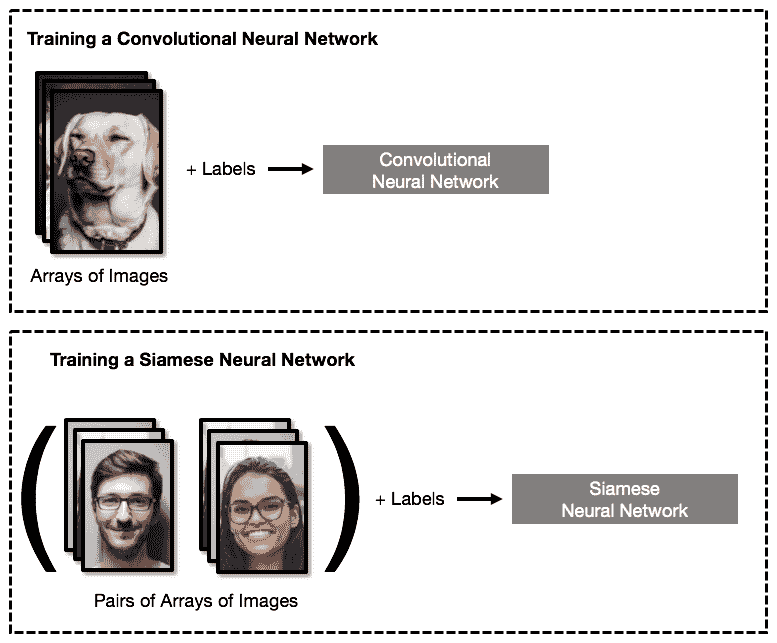

# 第七章：使用神经网络实现人脸识别系统

在本章中，我们将使用**Siamese 神经网络**实现人脸识别系统。此类人脸识别系统在智能手机及现代建筑和设施中的其他智能安防系统中广泛应用。我们将探讨 Siamese 神经网络背后的理论，并解释为什么人脸识别问题是图像识别中的一个特殊类别问题，使得传统的**卷积神经网络**（**CNNs**）难以解决。我们将训练并实现一个强大的模型，它能够识别面部，即使被识别对象的表情不同，或者照片拍摄角度不同。最后，我们将编写自己的程序，利用预训练的神经网络和网络摄像头来验证坐在电脑前的用户身份。

本章将涵盖的具体主题包括：

+   人脸识别问题

+   人脸检测与人脸识别

+   一次学习

+   Siamese 神经网络

+   对比损失

+   人脸数据集

+   在 Keras 中训练 Siamese 神经网络

+   创建你自己的面部识别系统

# 技术要求

本章所需的 Python 库如下：

+   Numpy 1.15.2

+   Keras 2.2.4

+   OpenCV 3.4.2

+   PIL 5.4.1

本章的代码可以在本书的 GitHub 仓库中找到：[`github.com/PacktPublishing/Neural-Network-Projects-with-Python/tree/master/Chapter07`](https://github.com/PacktPublishing/Neural-Network-Projects-with-Python/tree/master/chapter7)

要将代码下载到你的计算机，可以运行以下`git clone`命令：

```py
$ git clone https://github.com/PacktPublishing/Neural-Network-Projects-with-Python.git
```

完成流程后，会生成一个名为`Neural-Network-Projects-with-Python`的文件夹。通过运行以下命令进入该文件夹：

```py
$ cd Neural-Network-Projects-with-Python
```

要在虚拟环境中安装所需的 Python 库，请运行以下命令：

```py
$ conda env create -f environment.yml
```

请注意，在运行此命令之前，你应该先在计算机上安装 Anaconda。要进入虚拟环境，请运行以下命令：

```py
$ conda activate neural-network-projects-python
```

通过运行以下命令，导航到`Chapter07`文件夹：

```py
$ cd Chapter07
```

文件夹中包含以下文件：

+   `face_detection.py`包含使用 OpenCV 进行人脸检测的 Python 代码

+   `siamese_nn.py`包含创建和训练 Siamese 神经网络的 Python 代码

+   `onboarding.py`包含人脸识别系统入职流程的 Python 代码

+   `face_recognition_system.py`包含完整的人脸识别系统程序

请按以下顺序运行 Python 文件：

1.  `siamese_nn.py`：训练用于人脸识别的 Siamese 神经网络

1.  `onboarding.py`：启动人脸识别系统的入职流程

1.  `face_recognition_system.py`：使用你的网络摄像头的实际人脸识别程序

要运行每个 Python 文件，只需按以下方式执行文件：

```py
$ python siamese_nn.py
```

# 人脸识别系统

人脸识别系统已经在我们的日常生活中无处不在。当 iPhone X 于 2017 年首次发布时，苹果公司吹嘘其全新的先进面部识别系统能够通过一次简单的凝视立即识别并认证用户。其背后的驱动力是苹果 A11 仿生芯片，其中包含专门的神经网络硬件，使得 iPhone 能够快速进行人脸识别和机器学习操作。如今，几乎所有智能手机都配备了人脸识别安全系统。

2016 年，亚马逊开设了第一家具有先进人脸识别功能的超市，名为**Amazon Go**。与传统超市不同，Amazon Go 使用人脸识别来知道你何时进入超市，以及你何时从货架上拿起物品。当你购物结束时，你可以直接走出商店，无需排队结账，因为所有购买的商品都已被亚马逊的 AI 系统记录。这使得繁忙的购物者能够亲自到超市购物，而无需浪费时间排队等候结账。人脸识别系统不再属于反乌托邦的未来，它们已经成为我们日常生活的重要组成部分。

# 分解人脸识别问题

让我们把人脸识别问题分解成更小的步骤和子问题。这样，我们可以更好地理解人脸识别系统背后发生的事情。人脸识别问题可以分解成以下几个较小的子问题：

+   **人脸** **检测**：在图像中检测并隔离面部。在包含多张面孔的图像中，我们需要分别检测每张面孔。在此步骤中，我们还应从原始输入图像中裁剪出检测到的面孔，以便单独识别。

+   **人脸识别**：对于图像中每一张被检测到的面孔，我们将通过神经网络对其进行分类。请注意，我们需要对每一张被检测到的面孔重复此步骤。

直观上，这个过程非常有道理。如果我们思考人类如何识别人脸，我们会发现它与我们所描述的过程非常相似。给定一张图像，我们的眼睛立即会集中到每张面孔（人脸检测），然后我们会单独识别每一张面孔（人脸识别）。

下图说明了人脸识别中的子过程：


# 人脸检测

首先，让我们来看看人脸检测。人脸检测问题实际上是计算机视觉中的一个相当有趣的问题，研究人员在这方面工作了很多年。2001 年，Viola 和 Jones 演示了如何在最小计算资源下进行实时、大规模的人脸检测。这在当时是一个重要的发现，因为研究人员希望实现实时、大规模的人脸检测（例如，实时监控大规模人群）。今天，人脸检测算法可以在简单的硬件上运行，例如我们的个人计算机，只需几行代码。事实上，正如我们很快会看到的，我们将使用 Python 中的 OpenCV 来构建一个人脸检测器，利用你自己的摄像头。

人脸检测有多种方法，包含以下几种：

+   Haar 级联

+   特征脸

+   **方向梯度直方图**（**HOG**）

我们将解释如何使用 Haar 级联进行人脸检测（由 Viola 和 Jones 在 2001 年提出），并且我们将看到该算法的优美简洁。

Viola-Jones 算法的核心思想是所有人类面部都有一些共同的特征，例如以下几点：

+   眼睛区域比额头和面颊区域更暗

+   鼻子区域比眼睛区域更亮

在正面、无遮挡的人脸图像中，我们可以看到如眼睛、鼻子和嘴巴等特征。如果我们仔细观察眼睛周围的区域，会发现有一种交替出现的明暗像素模式，如下图所示：


当然，前面的例子只是其中一种可能的特征。我们还可以构建其他特征来捕捉面部的其他区域，如鼻子、嘴巴、下巴等。以下图示展示了其他特征的一些例子：


这些具有交替明暗像素区域的特征被称为 Haar 特征。根据你的想象力，你可以构建几乎无限数量的特征。事实上，在 Viola 和 Jones 提出的最终算法中，使用了超过 6000 个 Haar 特征！

你能看到 Haar 特征和卷积滤波器之间的相似之处吗？它们都在图像中检测出识别的几何表示！不同之处在于 Haar 特征是根据我们已知的知识手工制作的特征，能检测出眼睛、鼻子、嘴巴等面部特征。而卷积滤波器则是在训练过程中生成的，使用带标签的数据集，且不是手工制作的。然而，它们执行的是相同的功能：识别图像中的几何表示。Haar 特征和卷积滤波器之间的相似性表明，机器学习和人工智能中的许多想法是共享的，并且多年来不断迭代改进。

为了使用 Haar 特征，我们将其滑动到图像中的每个区域，并计算该区域像素与 Haar 特征的相似度。然而，由于图像中的大多数区域并不包含人脸（想一想我们拍摄的照片——人脸通常只占照片中的一小部分区域），因此测试所有特征是计算上浪费的。为了解决这个问题，Viola 和 Jones 引入了级联分类器**。**其思路是从最简单的 Haar 特征开始。如果候选区域失败，即该特征预测该区域不包含人脸，我们立即跳到下一个候选区域。这样，我们就不会把计算资源浪费在那些不包含人脸的区域。我们逐步使用更复杂的 Haar 特征，重复这一过程。最终，图像中包含人脸的区域会通过所有 Haar 特征的测试。这个分类器被称为**级联分类器**。

使用 Haar 特征的 Viola-Jones 算法在人脸检测中展现出了显著的准确性和较低的假阳性率，同时计算效率也很高。事实上，当该算法在 2001 年首次提出时，它是在一个 700 MHz 的奔腾 III 处理器上运行的！

# Python 中的人脸检测

人脸检测可以通过 Python 中的 OpenCV 库实现。OpenCV 是一个开源计算机视觉库，适用于计算机视觉任务。让我们来看看如何使用 OpenCV 进行人脸检测。

首先，我们导入 OpenCV：

```py
import cv2
```

接下来，我们加载一个预训练的级联分类器用于人脸检测。这个级联分类器可以在随附的 GitHub 仓库中找到，并应已下载到你的计算机上（请参考*技术要求*部分）：

```py
face_cascades = cv2.CascadeClassifier('haarcascade_frontalface_default.xml')
```

接下来，我们定义一个函数，该函数接收一张图像，对图像进行人脸检测，并在图像上绘制一个边框：

```py
def detect_faces(img, draw_box=True):
    # convert image to grayscale
    grayscale_img = cv2.cvtColor(img, cv2.COLOR_BGR2GRAY)

    # detect faces
    faces = face_cascades.detectMultiScale(grayscale_img, scaleFactor=1.6)

    # draw bounding box around detected faces
    for (x, y, width, height) in faces:
        if draw_box:
            cv2.rectangle(img, (x, y), (x+width, y+height), (0, 255, 0), 5)
    face_box = img[y:y+height, x:x+width]
    face_coords = [x,y,width,height]
    return img, face_box, face_coords
```

让我们在一些示例图像上测试我们的人脸检测器。这些图像可以在 `'sample_faces'` 文件夹中找到，它们看起来是这样的：


如我们所见，每张图像中都有相当多的噪声（即非人脸结构），这些噪声可能会影响我们的人脸检测器。在右下角的图像中，我们还可以看到多个面孔。

我们应用之前定义的 `detect_faces` 函数对这些图像进行处理：

```py
import os
files = os.listdir('sample_faces')
images = [file for file in files if 'jpg' in file]
for image in images:
    img = cv2.imread('sample_faces/' + image)
    detected_faces, _, _ = detect_faces(img)
    cv2.imwrite('sample_faces/detected_faces/' + image, detected_faces)
```

我们看到以下输出图像被保存在 `'sample_faces/detected_faces'` 文件夹中：


太棒了！我们的面部检测器表现得非常好。检测速度也令人印象深刻。我们可以看到，使用 OpenCV 在 Python 中进行人脸检测是简单且快速的。

# 人脸识别

完成人脸检测后，我们将注意力转向下一步：人脸识别。你可能已经注意到，人脸检测与神经网络无关！使用 Haar 特征的人脸检测是一个古老但可靠的算法，至今仍被广泛使用。然而，人脸检测仅仅是提取包含面部的区域。我们的下一步是使用提取到的人脸进行人脸识别。

本章的主要内容是使用神经网络进行人脸识别。接下来的章节，我们将重点讨论如何训练一个神经网络来进行人脸识别。

# 人脸识别系统的要求

到目前为止，你应该对使用神经网络进行图像识别任务相当熟悉。在第四章，*猫与狗——使用 CNN 进行图像分类*，我们构建了一个 CNN，用于对猫和狗的图像进行分类。那么，相同的技术能否应用于人脸识别呢？遗憾的是，CNN 在这一任务上存在不足。为了理解原因，我们需要了解人脸识别系统的要求。

# 速度

人脸识别系统的第一个要求是需要足够快速。如果我们看看智能手机中人脸识别系统的注册过程，通常需要用手机的前置摄像头扫描我们的面部，捕捉不同角度的图像，持续几秒钟。在这个短暂的过程中，手机会捕捉我们的面部图像，并用这些图像来训练神经网络识别我们。这个过程需要足够迅速。

下图展示了智能手机中人脸识别系统的典型注册过程：


CNN 能够满足这一速度要求吗？在第四章，*猫与狗——使用 CNN 进行图像分类*项目中，我们看到训练 CNN 来识别猫和狗的图像是多么缓慢。即便是使用强大的 GPU，训练 CNN 有时也需要几个小时（甚至几天！）。从用户体验的角度来看，对于人脸识别系统的注册过程来说，这样的速度是不可接受的。因此，CNN 无法满足人脸识别系统对速度的要求。

# 可扩展性

人脸识别系统的第二个要求是其需要具备可扩展性。我们训练的模型最终必须能够扩展到数百万个不同的用户，每个用户都有一个独特的面孔。同样，这就是卷积神经网络（CNN）无法满足的地方。回想一下，在第四章中，*猫与狗——使用 CNN 进行图像分类*，我们训练了一个 CNN 来区分猫和狗。这个神经网络只能识别和分类猫和狗的图像，不能识别其他动物，因为它没有经过相关训练。这意味着，如果我们使用 CNN 进行人脸识别，我们必须为每个用户训练一个单独的神经网络。从可扩展性角度来看，这显然是不可行的！这就意味着亚马逊需要为其数百万个用户训练一个独立的神经网络，并且每当用户走进亚马逊 Go 的门时，都需要运行数百万个不同的神经网络。

以下图示说明了 CNN 在进行人脸识别时面临的限制：


鉴于内存的限制，为每个用户训练一个神经网络是不切实际的。随着用户数量的增加，这样的系统会迅速变得无法承载。因此，CNN 无法为人脸识别提供可扩展的解决方案。

# 小数据高精度

人脸识别系统的第三个要求是，在使用少量训练数据时，它必须具有足够的准确性（因此也具有安全性）。在第四章中，*猫与狗——使用 CNN 进行图像分类*，我们使用了包含成千上万张猫和狗图像的大型数据集来训练我们的 CNN。相比之下，在人脸识别的数据集规模上，我们几乎从未享受过这种奢侈的条件。回到智能手机人脸识别的例子，我们可以看到，只拍摄了少数几张照片，而我们必须能够使用这个有限的数据集来训练我们的模型。

再次强调，CNN 无法满足这一要求，因为我们需要大量图像来训练 CNN。虽然 CNN 在图像分类任务中相当准确，但这也以需要巨大的训练集为代价。试想，如果我们在开始使用手机的人脸识别系统之前，需要用智能手机拍摄成千上万张自拍照！对于大多数人脸识别系统来说，这显然行不通。

# 一次性学习

鉴于人脸识别系统所面临的独特需求和限制，很明显，使用大量数据集来训练 CNN 进行分类的范式（即批量学习分类）不适用于人脸识别问题。相反，我们的目标是创建一个神经网络，它能够通过仅用一个训练样本来学习识别任何面孔。这种神经网络训练形式被称为**一次性学习**。

一次性学习带来了机器学习问题中的一种全新且有趣的范式。到目前为止，我们通常将机器学习问题视为分类问题。在第二章，*多层感知机预测糖尿病*中，我们使用 MLP 来分类处于糖尿病风险中的患者。在第四章，*猫与狗——使用 CNN 的图像分类*中，我们使用 CNN 来分类猫和狗的图像。在第六章，*使用 LSTM 进行电影评论情感分析*中，我们使用 LSTM 网络来分类电影评论的情感。在本章中，我们需要将人脸识别问题视为不仅仅是分类问题，还需要估算两张输入图像之间的相似度。

例如，一个一次性学习的人脸识别模型在判断给定的面孔是否属于某个特定人物（例如 A 人物）时，应执行以下任务：

1.  获取存储的 A 人物图像（在入职过程中获得的）。这就是 A 人物的*真实*图像。

1.  在测试时（例如，当某人试图解锁 A 人物的手机时），捕捉该人物的图像。这就是*测试*图像。

1.  使用*真实*照片和*测试*照片，神经网络应输出两张照片中人脸的相似度评分。

1.  如果神经网络输出的相似度评分低于某个阈值（即两张照片中的人看起来不相似），我们将拒绝访问；如果高于阈值，则允许访问。

下图展示了这一过程：


# 幼稚的一次性预测——两向量之间的欧几里得距离

在我们深入了解神经网络如何应用于一次性学习之前，让我们先看一种简单的方式。

给定真实图像和测试图像，一种简单的一次性预测方法是简单地衡量两张图像之间的差异。正如我们已经看到的，所有图像都是三维向量。我们知道，欧几里得距离提供了两个向量之间差异的数学公式。为了帮助回忆，两个向量之间的欧几里得距离如下图所示：


测量两张图像之间的欧几里得距离为我们提供了一种简单的单次预测方法。然而，它是否为人脸识别提供了令人满意的相似度评分？答案是否定的。尽管欧几里得距离在人脸识别中理论上有意义，但它的实际价值较低。在现实中，照片可能由于角度和光照的变化以及主体外貌的变化（如佩戴眼镜）而不同。正如你可以想象的那样，仅使用欧几里得距离的人脸识别系统在现实中表现会很差。

# **暹罗神经网络**

到目前为止，我们已经看到纯粹的 CNN 和纯粹的欧几里得距离方法在面部识别中效果不好。然而，我们不必完全舍弃它们。它们各自提供了一些对我们有用的东西。我们能否将它们结合起来，形成更好的方法呢？

直观地说，人类通过比较面部的关键特征来识别人脸。例如，人类会利用眼睛的形状、眉毛的粗细、鼻子的大小、面部的整体轮廓等特征来识别一个人。这种能力对我们来说是自然而然的，我们很少受到角度和光照变化的影响。我们是否可以教会神经网络识别这些特征，从面部图像中提取出来，然后再使用欧几里得距离来衡量识别特征之间的相似度？这应该对你来说不陌生！正如我们在前几章中看到的，卷积层擅长自动寻找这种识别特征。对于人脸识别，研究人员发现，当卷积层应用于人脸时，它们会提取空间特征，如眼睛和鼻子。

这个洞察力构成了我们单次学习算法的核心：

+   使用卷积层从人脸中提取识别特征。卷积层的输出应该是将图像映射到一个低维特征空间（例如，一个 128 x 1 的向量）。卷积层应该将同一主体的人脸映射得尽可能靠近，而来自不同主体的人脸则应尽可能远离该低维特征空间。

+   使用欧几里得距离，测量从卷积层输出的两个低维向量之间的差异。请注意，这里有两个向量，因为我们在比较两张图像（真实图像和测试图像）。欧几里得距离与两张图像之间的相似度成反比。

这种方法比前面章节中提到的简单欧几里得距离方法（应用于原始图像像素）效果更好，因为卷积层在第一步的输出代表了人脸中的识别特征（如眼睛和鼻子），这些特征对于角度和光照是不变的。

需要注意的最后一点是，由于我们同时将两张图像输入到神经网络中，因此我们需要两组独立的卷积层。然而，我们要求这两组卷积层共享相同的权重，因为我们希望相似的面部图像被映射到低维特征空间中的同一点。如果这两组卷积层的权重不同，那么相似的面部将会被映射到不同的点，而欧氏距离将不再是一个有效的度量！

因此，我们可以将这两组卷积层视为“孪生”，因为它们共享相同的权重。下面的图示说明了我们刚才描述的神经网络：


这个神经网络被称为孪生神经网络，因为它就像一对连体婴儿，在卷积层部分有一个联合组件。

# 对比损失

这种基于距离预测的神经网络训练新范式，不同于基于分类的预测，它需要一种新的损失函数。回想一下，在前面的章节中，我们使用了简单的损失函数，例如类别交叉熵，来衡量分类问题中预测的准确性。

在基于距离的预测中，基于准确率的损失函数是无法工作的。因此，我们需要一种新的基于距离的损失函数来训练我们的孪生神经网络进行面部识别。我们将使用的基于距离的损失函数被称为**对比损失函数**。

看一下以下变量：

+   *Y[true]*：如果两张输入图像来自同一主题（相同的面部），则让*Y[true]* = *1*；如果两张输入图像来自不同的主题（不同的面部），则让*Y[true]* = 0

+   *D*：神经网络输出的预测距离

所以，*对比损失*定义如下：


在这里，margin 只是一个常数正则化项。如果前面的公式看起来很吓人，不用担心！它的作用仅仅是：当预测距离较大且面部相似时，产生较大的损失（即惩罚），而当预测距离较小时产生较小的损失，面部不同的情况则相反。

下图展示了当面部相似（左）和面部不同（右）时，随着预测距离增大，损失的变化：


简而言之，对比损失函数确保我们的孪生神经网络能够在真实图像和测试图像中的面部相同的情况下预测出较小的距离，而在面部不同的情况下预测出较大的距离。

# 面部数据集

现在让我们来看一下我们将在此项目中使用的面部数据集。网上有许多公开可用的面部数据集，具体内容可以参见[`www.face-rec.org/databases/`](http://www.face-rec.org/databases/)。

虽然我们可以使用许多面部数据集，但用于训练人脸识别系统的最合适数据集应该包含不同主体的照片，每个主体应有多张从不同角度拍摄的照片。理想情况下，数据集还应包含主体展示不同表情（如闭眼等）的照片，因为人脸识别系统通常会遇到此类照片。

考虑到这些因素，我们选择的数据集是由 AT&T 实验室剑桥分部创建的《面部数据库》。该数据库包含 40 个主体的照片，每个主体有 10 张照片。每个主体的照片都在不同的光照和角度下拍摄，并且有不同的面部表情。对于某些主体，还拍摄了戴眼镜和不戴眼镜的多张照片。您可以访问[`www.cl.cam.ac.uk/research/dtg/attarchive/facedatabase.html`](https://www.cl.cam.ac.uk/research/dtg/attarchive/facedatabase.html)了解更多有关 AT&T 面部数据集的信息。

面部数据集与本章的代码一起提供。要从 GitHub 仓库下载数据集和代码，请按照本章前面*技术要求*部分中的说明操作。

下载 GitHub 仓库后，数据集位于以下路径：

```py
'Chapter07/att_faces/'
```

图像存储在子文件夹中，每个子文件夹对应一个主体。让我们将原始图像文件导入为 Python 中的 NumPy 数组。我们首先声明一个包含文件路径的变量：

```py
faces_dir = 'att_faces/'
```

接下来，我们要遍历目录中的每个子文件夹，将每个子文件夹中的图像加载为 NumPy 数组。为此，我们可以导入并使用`keras.preprocessing.image`中的`load_img`和`img_to_array`函数：

```py
from keras.preprocessing.image import load_img, img_to_array
```

由于共有 40 个主体，我们将前 35 个主体的图像用作训练样本，剩余的 5 个主体用作测试样本。以下代码会遍历每个子文件夹，并相应地将图像加载到`X_train`和`X_test`数组中：

```py
import numpy as np

X_train, Y_train = [], []
X_test, Y_test = [], []

# Get list of subfolders from faces_dir
# Each subfolder contains images from one subject
subfolders = sorted([f.path for f in os.scandir(faces_dir) if f.is_dir()])

# Iterate through the list of subfolders (subjects)
# Idx is the subject ID
for idx, folder in enumerate(subfolders):
    for file in sorted(os.listdir(folder)):
        img = load_img(folder+"/"+file, color_mode='grayscale')
        img = img_to_array(img).astype('float32')/255
        if idx < 35:
            X_train.append(img)
            Y_train.append(idx)
        else:
            X_test.append(img)
            Y_test.append(idx-35)
```

请注意，`Y_train`和`Y_test`中的标签仅仅是我们遍历每个子文件夹时的索引（即，第一个子文件夹中的主体被分配标签`1`，第二个子文件夹中的主体被分配标签`2`，依此类推）。

最后，我们将`X_train`、`Y_train`、`X_test`和`X_test`转换为 NumPy 数组：

```py
X_train = np.array(X_train)
X_test = np.array(X_test)
Y_train = np.array(Y_train)
Y_test = np.array(Y_test)
```

好的！现在我们已经有了训练和测试数据集。我们将使用训练集来训练我们的 Siamese 神经网络，并使用测试数据集中的照片进行测试。

现在，让我们绘制出某个主体的一些图像，以更好地了解我们正在处理的数据类型。以下代码绘制了某个特定主体的九张图像（如`subject_idx`变量所示）：

```py
from matplotlib import pyplot as plt

subject_idx = 4
fig, ((ax1,ax2,ax3),(ax4,ax5,ax6),
      (ax7,ax8,ax9)) = plt.subplots(3,3,figsize=(10,10))
subject_img_idx = np.where(Y_train==subject_idx)[0].tolist()

for i, ax in enumerate([ax1,ax2,ax3,ax4,ax5,ax6,ax7,ax8,ax9]):
    img = X_train[subject_img_idx[i]]
    img = np.squeeze(img)
    ax.imshow(img, cmap='gray')
    ax.grid(False)
    ax.set_xticks([])
    ax.set_yticks([])
plt.tight_layout()
plt.show()
```

我们看到以下输出：


如我们所见，每张照片中的主体都是在不同的角度拍摄的，且表情各异。在某些照片中，我们还能看到主体摘掉了眼镜。每张图像之间确实有很多差异。

我们还可以使用以下代码从前九个主题中绘制一张单独的图片：

```py
# Plot the first 9 subjects
subjects = range(10)

fig, ((ax1,ax2,ax3),(ax4,ax5,ax6),
      (ax7,ax8,ax9)) = plt.subplots(3,3,figsize=(10,12))
subject_img_idx = [np.where(Y_train==i)[0].tolist()[0] for i in subjects]

for i, ax in enumerate([ax1,ax2,ax3,ax4,ax5,ax6,ax7,ax8,ax9]):
    img = X_train[subject_img_idx[i]]
    img = np.squeeze(img)
    ax.imshow(img, cmap='gray')
    ax.grid(False)
    ax.set_xticks([])
    ax.set_yticks([])
    ax.set_title("Subject {}".format(i))
plt.show()
plt.tight_layout()
```

我们将得到以下输出：


很酷！看起来我们有一系列多样的主题可以处理。

# 在 Keras 中创建孪生神经网络

我们终于准备好在 Keras 中开始创建孪生神经网络了。在前面的部分中，我们讨论了孪生神经网络的理论和高层结构。现在，让我们更详细地了解孪生神经网络的架构。

下图展示了我们在本章中将构建的孪生神经网络的详细架构：


让我们从在 Keras 中创建共享的卷积网络（如前面图中的框选部分）开始。到目前为止，你应该已经熟悉了 **Conv** 层、**Pooling** 层和 **Dense** 层。如果你需要回顾一下，随时可以参考 第四章，*猫狗大战——使用 CNN 进行图像分类*，以获取它们的定义。

让我们定义一个函数，使用 Keras 中的 `Sequential` 类来构建这个共享卷积网络：

```py
from keras.models import Sequential, Input
from keras.layers import Conv2D, MaxPooling2D, Flatten, Dense

def create_shared_network(input_shape):
    model = Sequential()
    model.add(Conv2D(filters=128, kernel_size=(3,3), activation='relu', 
                     input_shape=input_shape))
    model.add(MaxPooling2D())
    model.add(Conv2D(filters=64, kernel_size=(3,3), activation='relu'))
    model.add(Flatten())
    model.add(Dense(units=128, activation='sigmoid'))
    return model
```

我们可以看到，这个函数根据前面的架构创建了一个卷积网络。此时，你可能会想，*我们如何在 Keras 中实现两个孪生网络共享权重呢？* 好吧，简短的回答是，我们实际上不需要创建两个不同的网络。我们只需要在 Keras 中声明一个共享网络的单一实例。我们可以使用这个单一实例来创建上下卷积网络。由于我们重用了这个单一实例，Keras 会自动理解这些权重是要共享的。

这就是我们如何做的。首先，让我们使用我们之前定义的函数创建共享网络的单一实例：

```py
input_shape = X_train.shape[1:]
shared_network = create_shared_network(input_shape)
```

我们通过 `Input` 类指定上下层的输入：

```py
input_top = Input(shape=input_shape)
input_bottom = Input(shape=input_shape)
```

接下来，我们将共享网络堆叠到输入层的右侧，使用 Keras 中的 `functional` 方法。执行此操作的语法如下：

```py
output_top = shared_network(input_top)
output_bottom = shared_network(input_bottom)
```

现在，这种语法可能对你来说比较陌生，因为到目前为止我们一直在使用更为简便的 `Sequential` 方法来构建模型。虽然它较为简单，但它失去了一些灵活性，某些事情是我们仅通过 `Sequential` 方法无法做到的，包括像这样构建网络。因此，我们使用 `functional` 方法来构建这种模型。

此时，我们的模型看起来是这样的：


很好！剩下的就是将顶部和底部的输出组合起来，并计算这两个输出之间的欧几里得距离。记住，此时顶部和底部的输出是 128 x 1 维向量，表示低维特征空间。

由于 Keras 中没有可以直接计算两个数组之间欧几里得距离的层，因此我们需要定义自己的层。Keras 中的`Lambda`层正是允许我们通过将任意函数封装为`Layer`对象来实现这一点。

我们来创建一个`euclidean_distance`函数，用于计算两个向量之间的欧几里得距离：

```py
from keras import backend as K
def euclidean_distance(vectors):
    vector1, vector2 = vectors
    sum_square = K.sum(K.square(vector1 - vector2), axis=1, keepdims=True)
    return K.sqrt(K.maximum(sum_square, K.epsilon()))
```

然后，我们可以将这个`euclidean_distance`函数封装到一个`Lambda`层中：

```py
from keras.layers import Lambda
distance = Lambda(euclidean_distance, output_shape=(1,))([output_top, 
                  output_bottom])
```

最后，我们将前一行定义的`distance`层与输入结合起来，完成我们的模型：

```py
from keras.models import Model
model = Model(inputs=[input_top, input_bottom], outputs=distance)
```

我们可以通过调用`summary()`函数来验证模型的结构：

```py
print(model.summary())
```

我们将看到以下输出：


如果我们查看前一张截图中的摘要，可以看到模型中有两个输入层，每个层的形状为 112 x 92 x 1（因为我们的图像是 112 x 92 x 1）。这两个输入层连接到一个共享的卷积网络。共享卷积网络的两个输出（每个为 128 维数组）然后被组合到一个`Lambda`层，该层计算这两个 128 维数组之间的欧几里得距离。最后，这个欧几里得距离从我们的模型中输出。

就这样！我们成功创建了我们的孪生神经网络。我们可以看到，网络中大部分的复杂性来自共享的卷积网络。有了这个基本框架，我们可以根据需要轻松调整和增加共享卷积网络的复杂度。

# Keras 中的模型训练

现在我们已经创建了孪生神经网络，可以开始训练模型了。训练孪生神经网络与训练常规 CNN 略有不同。回想一下，当训练 CNN 时，训练样本是图像数组，并且每个图像都有相应的类别标签。相比之下，训练孪生神经网络时，我们需要使用图像对的数组，并且每对图像有相应的类别标签（即，如果图像对来自同一对象，则标签为 1；如果图像对来自不同对象，则标签为 0）。

以下图表展示了训练 CNN 和孪生神经网络之间的差异：



到目前为止，我们已经将原始图像加载到`X_train` NumPy 数组中，并附带了`Y_train`类标签的数组。我们需要编写一个函数，从`X_train`和`Y_train`中创建这些图像数组对。一个需要注意的重要点是，在这对图像数组中，类的数量应该相等（即正负对的数量相同，*正对*指的是来自同一主题的图像，*负对*指的是来自不同主题的图像），并且我们应该交替使用正负对。这可以防止模型产生偏差，并确保它能够同等地学习正负对图像。

以下函数从`X_train`和`Y_train`创建图像及其标签数组对：

```py
import random 
def create_pairs(X,Y, num_classes):
    pairs, labels = [], []
    # index of images in X and Y for each class
    class_idx = [np.where(Y==i)[0] for i in range(num_classes)]
    # The minimum number of images across all classes
    min_images = min(len(class_idx[i]) for i in range(num_classes)) - 1
    for c in range(num_classes):
        for n in range(min_images):
            # create positive pair
            img1 = X[class_idx[c][n]]
            img2 = X[class_idx[c][n+1]]
            pairs.append((img1, img2))
            labels.append(1)
            # create negative pair
            # list of classes that are different from the current class
            neg_list = list(range(num_classes))
            neg_list.remove(c)
            # select a random class from the negative list. 
            # This class will be used to form the negative pair.
            neg_c = random.sample(neg_list,1)[0]
            img1 = X[class_idx[c][n]]
            img2 = X[class_idx[neg_c][n]]
            pairs.append((img1,img2))
            labels.append(0)
    return np.array(pairs), np.array(labels)

num_classes = len(np.unique(Y_train))
training_pairs, training_labels = create_pairs(X_train, Y_train,
                                              len(np.unique(Y_train)))
test_pairs, test_labels = create_pairs(X_test, Y_test,
                                       len(np.unique(Y_test)))
```

在开始训练模型之前，还有一件事需要做。我们需要为对比损失定义一个函数，因为对比损失不是 Keras 中的默认损失函数。

总结一下，这是*对比损失*的公式：


其中*Y[true]*是训练对的真实标签，*D*是神经网络输出的预测距离。

我们为计算对比损失定义了以下函数：

```py
def contrastive_loss(Y_true, D):
    margin = 1
    return K.mean(Y_true*K.square(D)+(1 - Y_true)*K.maximum((margin-D),0))
```

请注意，函数中包含了`K.mean`、`K.square`和`K.maximum`。这些只是 Keras 的后端函数，用于简化数组计算，如均值、最大值和平方。

好的，我们已经具备了训练我们的孪生神经网络所需的所有函数。像往常一样，我们使用`compile`函数定义训练的参数：

```py
model.compile(loss=contrastive_loss, optimizer='adam')
```

然后我们通过调用`fit`函数来训练模型`10`个周期：

```py
model.fit([training_pairs[:, 0], training_pairs[:, 1]], training_labels,
          batch_size=64, epochs=10)
```

一旦训练完成，我们将看到以下输出：


# 分析结果

让我们在保留的测试集上应用我们的模型，看看它表现如何。记住，我们的模型从未见过测试集中的图像和主题，因此这是衡量其现实世界表现的好方法。

首先，我们从同一个主题中选择两张图片，将它们并排展示，并将模型应用于这对图片：

```py
idx1, idx2 = 21, 29
img1 = np.expand_dims(X_test[idx1], axis=0)
img2 = np.expand_dims(X_test[idx2], axis=0)

fig, (ax1, ax2) = plt.subplots(1, 2, figsize=(10,7))
ax1.imshow(np.squeeze(img1), cmap='gray')
ax2.imshow(np.squeeze(img2), cmap='gray')

for ax in [ax1, ax2]:
    ax.grid(False)
    ax.set_xticks([])
    ax.set_yticks([])

dissimilarity = model.predict([img1, img2])[0][0]
fig.suptitle("Dissimilarity Score = {:.3f}".format(dissimilarity), size=30)
plt.tight_layout()
plt.show()
```

我们将看到以下输出：


请注意，Dissimilarity Score 只是模型输出的距离。距离越大，两个面孔之间的差异越大。

我们的模型表现很好！我们可以清楚地看到照片中的主体是相同的。在第一张图片中，主体戴着眼镜，正视镜头并微笑。在第二张图片中，同一主体没有戴眼镜，未正视镜头，也没有微笑。我们的面部识别模型仍然能够识别这对照片中的两张脸属于同一个人，从低相似度得分可以看出这一点。

接下来，我们从不同的主题中选择一对面孔，看看我们的模型表现如何：

```py
idx1, idx2 = 1, 39
img1 = np.expand_dims(X_test[idx1], axis=0)
img2 = np.expand_dims(X_test[idx2], axis=0)

fig, (ax1, ax2) = plt.subplots(1, 2, figsize=(10,7))
ax1.imshow(np.squeeze(img1), cmap='gray')
ax2.imshow(np.squeeze(img2), cmap='gray')

for ax in [ax1, ax2]:
    ax.grid(False)
    ax.set_xticks([])
    ax.set_yticks([])

dissimilarity = model.predict([img1, img2])[0][0]
fig.suptitle("Dissimilarity Score = {:.3f}".format(dissimilarity), size=30)
plt.tight_layout()
plt.show()
```

我们将看到以下输出：


我们的模型对于负对（图像中的人物不同的对）表现得也很好。在这种情况下，差异得分是 1.28。我们知道，正对有低差异得分，而负对有高差异得分。但分隔它们的阈值分数是多少呢？让我们对正对和负对做更多的测试来找出答案：

```py
for i in range(5):
    for n in range(0,2):
        fig, (ax1, ax2) = plt.subplots(1,2, figsize=(7,5))
        img1 = np.expand_dims(test_pairs[i*20+n, 0], axis=0)
        img2 = np.expand_dims(test_pairs[i*20+n, 1], axis=0)
        dissimilarity = model.predict([img1, img2])[0][0]
        img1, img2 = np.squeeze(img1), np.squeeze(img2)
        ax1.imshow(img1, cmap='gray')
        ax2.imshow(img2, cmap='gray')

        for ax in [ax1, ax2]:
            ax.grid(False)
            ax.set_xticks([])
            ax.set_yticks([])

        plt.tight_layout()
        fig.suptitle("Dissimilarity Score = {:.3f}".format(dissimilarity), 
                      size=20)
plt.show()
```

以下截图显示了某些人脸对的结果。请注意，正对位于左侧，负对位于右侧：


你注意到什么有趣的事情了吗？ 从前面的结果来看，阈值分数似乎大约是 0.5。低于 0.5 的应该被归类为正对（即，面孔匹配），高于 0.5 的应该被归类为负对。请注意，第二行右侧列中的负对分数非常接近阈值，分数为 0.501。有趣的是，这两个人确实很相似，戴着类似的眼镜和发型！

# 整合我们的代码

此时，整合我们的代码会很有帮助。到目前为止，我们已经编写了很多代码，包括辅助函数。让我们将这些辅助函数整合到一个`utils.py`文件中，如下所示。

首先，我们导入必要的库：

```py
import numpy as np
import random
import os
import cv2
from keras.models import Sequential
from keras.layers import Flatten, Dense, Conv2D, MaxPooling2D
from keras import backend as K
from keras.preprocessing.image import load_img, img_to_array
```

我们还在`utils.py`文件中包含了训练 Siamese 神经网络所需的`euclidean_distance`、`contrastive_loss`和`accuracy`函数：

```py
def euclidean_distance(vectors):
    vector1, vector2 = vectors
    sum_square = K.sum(K.square(vector1 - vector2), axis=1, keepdims=True)
    return K.sqrt(K.maximum(sum_square, K.epsilon()))

def contrastive_loss(Y_true, D):
    margin = 1
    return K.mean(Y_true*K.square(D)+(1 - Y_true)*K.maximum((margin-D),0))

def accuracy(y_true, y_pred):
    return K.mean(K.equal(y_true, K.cast(y_pred < 0.5, y_true.dtype)))
```

我们将`create_pairs`函数包含在`utils.py`文件中。回想一下，这个辅助函数用于生成用于训练 Siamese 神经网络的正对和负对图像：

```py
def create_pairs(X,Y, num_classes):
    pairs, labels = [], []
    # index of images in X and Y for each class
    class_idx = [np.where(Y==i)[0] for i in range(num_classes)]
    # The minimum number of images across all classes
    min_images = min(len(class_idx[i]) for i in range(num_classes)) - 1

    for c in range(num_classes):
        for n in range(min_images):
            # create positive pair
            img1 = X[class_idx[c][n]]
            img2 = X[class_idx[c][n+1]]
            pairs.append((img1, img2))
            labels.append(1)

            # create negative pair
            neg_list = list(range(num_classes))
            neg_list.remove(c)
            # select a random class from the negative list. 
            # this class will be used to form the negative pair
            neg_c = random.sample(neg_list,1)[0]
            img1 = X[class_idx[c][n]]
            img2 = X[class_idx[neg_c][n]]
            pairs.append((img1,img2))
            labels.append(0)

    return np.array(pairs), np.array(labels)
```

我们还在`utils.py`文件中包含了`create_shared_network`辅助函数，该函数用于在 Keras 中创建一个 Siamese 神经网络：

```py
def create_shared_network(input_shape):
    model = Sequential(name='Shared_Conv_Network')
    model.add(Conv2D(filters=64, kernel_size=(3,3), activation='relu', 
                     input_shape=input_shape))
    model.add(MaxPooling2D())
    model.add(Conv2D(filters=64, kernel_size=(3,3), activation='relu'))
    model.add(Flatten())
    model.add(Dense(units=128, activation='sigmoid'))
    return model
```

我们在`utils.py`文件中的最后一个辅助函数是`get_data`函数。该函数帮助我们将相应的原始图像加载到 NumPy 数组中：

```py
def get_data(dir):
    X_train, Y_train = [], []
    X_test, Y_test = [], []
    subfolders = sorted([file.path for file in os.scandir(dir) if 
                         file.is_dir()])
    for idx, folder in enumerate(subfolders):
        for file in sorted(os.listdir(folder)):
            img = load_img(folder+"/"+file, color_mode='grayscale')
            img = img_to_array(img).astype('float32')/255
            img = img.reshape(img.shape[0], img.shape[1],1)
            if idx < 35:
                X_train.append(img)
                Y_train.append(idx)
            else:
                X_test.append(img)
                Y_test.append(idx-35)

    X_train = np.array(X_train)
    X_test = np.array(X_test)
    Y_train = np.array(Y_train)
    Y_test = np.array(Y_test)
    return (X_train, Y_train), (X_test, Y_test)
```

你可以在我们提供的代码中看到`utils.py`文件。

同样，我们可以创建一个`siamese_nn.py`文件。这个 Python 文件将包含创建和训练我们 Siamese 神经网络的主要代码：

```py
'''
Main code for training a Siamese neural network for face recognition
'''
import utils
import numpy as np
from keras.layers import Input, Lambda
from keras.models import Model

faces_dir = 'att_faces/'

# Import Training and Testing Data
(X_train, Y_train), (X_test, Y_test) = utils.get_data(faces_dir)
num_classes = len(np.unique(Y_train))

# Create Siamese Neural Network
input_shape = X_train.shape[1:]
shared_network = utils.create_shared_network(input_shape)
input_top = Input(shape=input_shape)
input_bottom = Input(shape=input_shape)
output_top = shared_network(input_top)
output_bottom = shared_network(input_bottom)
distance = Lambda(utils.euclidean_distance, output_shape=(1,))([output_top, output_bottom])
model = Model(inputs=[input_top, input_bottom], outputs=distance)

# Train the model
training_pairs, training_labels = utils.create_pairs(X_train, Y_train, 
                                num_classes=num_classes)
model.compile(loss=utils.contrastive_loss, optimizer='adam',
              metrics=[utils.accuracy])
model.fit([training_pairs[:, 0], training_pairs[:, 1]], training_labels,
          batch_size=128,
          epochs=10)

# Save the model
model.save('siamese_nn.h5')
```

这个 Python 文件保存在我们提供的代码中，路径为`'Chapter07/siamese_nn.py'`。请注意，代码比之前短了很多，因为我们已经重构了代码，将辅助函数移到了`utils.py`中。

请注意，前面代码的最后一行将训练好的模型保存在`Chapter07/siamese_nn.h5`位置。这样，我们可以轻松地导入训练好的面部识别模型，而不需要从头开始重新训练模型。

# 创建实时人脸识别程序

我们终于来到了项目中最重要的部分。我们将把到目前为止编写的代码整合在一起，创建一个实时的人脸识别程序。这个程序将使用我们计算机中的网络摄像头进行人脸识别，验证坐在摄像头前的人是否真的是你。

为了实现这一点，程序需要完成以下任务：

1.  训练一个用于人脸识别的 Siamese 神经网络（这部分已经在上一节完成）。

1.  使用网络摄像头捕捉授权用户的真实图像。这是人脸识别系统的注册过程。

1.  随后，当用户想要解锁程序时，使用*步骤 1*中的预训练 Siamese 神经网络和*步骤 2*中的真实图像来验证用户身份。

这个部分的项目需要一个网络摄像头（可以是你笔记本电脑内置的摄像头，也可以是你连接到计算机的外接摄像头）。如果你的计算机没有网络摄像头，可以跳过这个部分。

# 注册过程

让我们编写注册过程的代码。在注册过程中，我们需要激活摄像头来捕捉授权用户的真实图像。OpenCV 提供了一个名为`VideoCapture`的函数，它允许我们激活并从计算机的摄像头捕获图像：

```py
import cv2
video_capture = cv2.VideoCapture(0)
```

在使用网络摄像头拍照之前，给用户五秒钟的准备时间。我们启动一个初始值为`5`的`counter`变量，当计时器达到`0`时，用摄像头拍照。注意，我们使用本章早些时候编写的`face_detection.py`文件中的代码来检测摄像头前的人脸。拍摄的照片将保存在与代码相同的文件夹下，命名为`'true_img.png'`：

```py
import math
import utils
import face_detection

counter = 5

while True:
    _, frame = video_capture.read()
    frame, face_box, face_coords = face_detection.detect_faces(frame)
    text = 'Image will be taken in {}..'.format(math.ceil(counter))
    if face_box is not None:
        frame = utils.write_on_frame(frame, text, face_coords[0], 
                                     face_coords[1]-10)
    cv2.imshow('Video', frame)
    cv2.waitKey(1)
    counter -= 0.1
    if counter <= 0:
        cv2.imwrite('true_img.png', face_box)
        break

# When everything is done, release the capture
video_capture.release()
cv2.destroyAllWindows()
print("Onboarding Image Captured")
```

注册过程如下所示：


这段代码保存在我们提供的文件中，路径为`Chapter07/onboarding.py`。要运行注册过程，只需在命令提示符（Windows）或终端（macOS/Linux）中执行该 Python 文件，方法如下：

```py
$ python onboarding.py
```

# 人脸识别过程

注册过程完成后，我们可以继续进行实际的人脸识别过程。我们首先询问用户的姓名。稍后该姓名将显示在人脸识别图像上，如我们所见。Python 中的`input`函数允许用户输入姓名：

```py
name = input("What is your name?")
```

然后，用户将在命令行中输入姓名。

接下来，我们导入本章早些时候训练好的 Siamese 神经网络：

```py
from keras.models import load_model
model = load_model('siamese_nn.h5', 
                    custom_objects={'contrastive_loss': 
                    utils.contrastive_loss, 
                    'euclidean_distance':utils.euclidean_distance})
```

接下来，我们加载在注册过程中捕捉到的用户真实图像，并通过标准化、调整大小和重塑图像来为我们的 Siamese 神经网络预处理图像：

```py
true_img = cv2.imread('true_img.png', 0)
true_img = true_img.astype('float32')/255
true_img = cv2.resize(true_img, (92, 112))
true_img = true_img.reshape(1, true_img.shape[0], true_img.shape[1], 1)
```

其余的代码使用了 OpenCV 中的`VideoCapture`函数从用户的摄像头捕捉视频，并将视频中的每一帧传递给我们的`face_detection`实例。我们使用一个固定长度的列表（由 Python 的`collections.deque`类实现）来收集 15 个最新的预测结果（每一帧一个预测）。我们对这 15 个最新预测的得分进行平均，如果平均相似度得分超过某个阈值，我们就认证用户。其余代码如下所示：

```py
video_capture = cv2.VideoCapture(0)
preds = collections.deque(maxlen=15)

while True:
    # Capture frame-by-frame
    _, frame = video_capture.read()

    # Detect Faces
    frame, face_img, face_coords = face_detection.detect_faces(frame, 
                                 draw_box=False)

    if face_img is not None:
        face_img = cv2.cvtColor(face_img, cv2.COLOR_BGR2GRAY)
        face_img = face_img.astype('float32')/255
        face_img = cv2.resize(face_img, (92, 112))
        face_img = face_img.reshape(1, face_img.shape[0], 
                   face_img.shape[1], 1)
        preds.append(1-model.predict([true_img, face_img])[0][0])
        x,y,w,h = face_coords
        if len(preds) == 15 and sum(preds)/15 >= 0.3:
            text = "Identity: {}".format(name)
            cv2.rectangle(frame, (x, y), (x+w, y+h), (0, 255, 0), 5) 
        elif len(preds) < 15:
            text = "Identifying ..."
            cv2.rectangle(frame, (x, y), (x+w, y+h), (0, 165, 255), 5) 
        else:
            text = "Identity Unknown!"
            cv2.rectangle(frame, (x, y), (x+w, y+h), (0, 0, 255), 5)
        frame = utils.write_on_frame(frame, text, face_coords[0], 
                                     face_coords[1]-10)
    else:
        # clear existing predictions if no face detected 
        preds = collections.deque(maxlen=15) 

    # Display the resulting frame
    cv2.imshow('Video', frame)

    if cv2.waitKey(1) & 0xFF == ord('q'):
        break

# When everything is done, release the capture
video_capture.release()
cv2.destroyAllWindows()
```

这段代码保存在`'Chapter07/face_recognition_system.py'`文件中，您可以按照以下方法在命令提示符（Windows）或终端（macOS/Linux）中执行该 Python 文件来运行程序：

```py
$ python face_recognition_system.py
```

确保首先运行入职程序（以捕捉真实图像），然后再运行人脸识别程序。

这是程序初次尝试识别您面孔时的样子：


几秒钟后，程序应该会识别出您：


# 未来的工作

正如我们所见，我们的人脸识别系统在简单条件下确实工作得很好。然而，它绝对不是万无一失的，当然也不足够安全，无法应用于重要的场景。首先，人脸检测系统会被静态照片欺骗（自己试试看！）。从理论上讲，这意味着我们可以通过将授权用户的静态照片放在摄像头前来绕过认证。

解决这个问题的技术被称为**反欺骗技术**。反欺骗技术是人脸识别领域的一个重要研究方向。通常，今天使用的主要反欺骗技术有两种：

+   **活体检测**：由于照片是静态的二维图像，而真实面孔是动态且三维的，我们可以检查检测到的面孔的*活体*。进行活体检测的方式包括检查检测到的面孔的光流，以及检查检测到的面孔与周围环境的光照和纹理对比。

+   **机器学习**：我们也可以通过使用机器学习来区分真实面孔和图片！我们可以训练一个卷积神经网络（CNN）来分类检测到的面孔是属于真实面孔还是静态图像。然而，您需要大量标注数据（面孔与非面孔）才能实现这一点。

这是 Andrew Ng 的一段视频，展示了人脸识别（带活体检测）是如何在百度中国总部实现的：

[`www.youtube.com/watch?v=wr4rx0Spihs`](https://www.youtube.com/watch?v=wr4rx0Spihs)

如果您想了解苹果是如何在 iPhone 中实现面部 ID 系统的，可以参考苹果发布的论文[`www.apple.com/business/site/docs/FaceID_Security_Guide.pdf`](https://www.apple.com/business/site/docs/FaceID_Security_Guide.pdf)。

苹果的 Face ID 实现比我们在本章中使用的系统更为安全。苹果使用 TrueDepth 相机将红外线点投射到你的脸上，创建深度图，之后利用深度图进行人脸识别。

# 总结

在本章中，我们创建了一个基于 Siamese 神经网络的人脸识别系统。该人脸识别系统使用摄像头从实时视频流中提取帧，传递给预训练的 Siamese 神经网络，并使用用户的真实图像，系统能够验证站在摄像头前的用户。

我们首先将人脸识别问题分解成更小的子问题，我们看到人脸识别系统首先执行人脸检测步骤，将人脸从图像的其余部分分离出来，然后才进行实际的人脸识别步骤。我们看到人脸检测通常是通过 Viola-Jones 算法完成的，该算法使用 Haar 特征实时检测人脸。使用 Haar 滤波器的人脸检测在 Python 中通过 OpenCV 库实现，这使得我们只需几行代码就能执行人脸检测。

我们随后集中讨论了人脸识别，并讨论了人脸识别系统的需求（速度、可扩展性、在小数据下的高准确度）如何使得 CNNs 不适用于这个问题。我们介绍了 Siamese 神经网络的架构，以及如何利用 Siamese 神经网络中的基于距离的预测进行人脸识别。我们使用 AT&T 人脸数据集，从头开始在 Keras 中训练了一个 Siamese 神经网络。

最后，利用预训练的 Siamese 神经网络，我们在 Python 中创建了我们自己的人脸识别系统。人脸识别系统由两个步骤组成。在第一步（注册过程）中，我们使用 OpenCV 的人脸检测 API，通过摄像头捕捉用户的图像，作为 Siamese 神经网络的真实图像。在第二步中，系统利用真实图像识别和验证程序用户。

在下一章，也是最后一章，第八章，*接下来是什么？*，我们将总结和回顾到目前为止在本书中完成的不同项目。我们还将展望未来，看看神经网络和人工智能在未来几年会是什么样子。

# 问题

1.  人脸检测与人脸识别有何不同？

人脸检测的目标是定位图像中的人脸。人脸检测过程的输出是围绕检测到的人脸的边界框。另一方面，人脸识别的目标是对人脸进行分类（即识别对象）。人脸检测和人脸识别是每个人脸识别系统中的两个关键步骤，人脸检测步骤的输出作为输入传递给人脸识别步骤。

1.  Viola-Jones 人脸检测算法是什么？

Viola-Jones 算法使用 Haar 特征进行人脸检测。Haar 特征是具有交替明暗区域的滤波器，表示人脸中像素强度的对比度。例如，人脸图像中的眼睛区域具有比额头和脸颊区域更暗的像素值。这些 Haar 滤波器用于定位图像中可能包含人脸的区域。

1.  什么是单次学习（one-shot learning），它与批量学习（batch learning）有何不同？

在单次学习中，目标是使用非常少的数据来训练机器学习模型。与此不同，批量学习使用大量数据集来训练机器学习模型。单次学习通常用于图像识别任务，因为训练样本的数量可能非常稀疏。

1.  描述 Siamese 神经网络的架构。

Siamese 神经网络由两个共享权重的联合卷积层组成，接受一对输入图像。联合卷积层将两个输入图像映射到一个低维特征空间。通过欧几里得距离层，我们计算并输出这两个低维向量的距离，该距离与两张图像的相似度成反比。

1.  在训练用于人脸识别的 Siamese 神经网络时，使用的损失函数是什么？

我们使用对比损失函数来训练用于人脸识别的 Siamese 神经网络。对比损失函数鼓励神经网络在输入图像对相似时输出小距离，反之，在输入图像对不同时，鼓励输出较大的距离。
