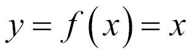
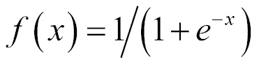
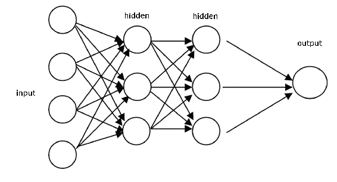
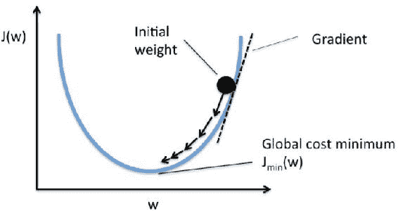

# 第一章：神经网络与人工智能概念

通过几百年来的科学与哲学研究，已经识别出一些特殊的机制，它们构成人类智能的基础。受其运作的启发，人类成功创造出了部分模仿这些机制的机器。问题在于它们尚未能成功地模仿并整合所有这些机制，因此我们现有的**人工智能**（**AI**）系统在很大程度上是不完整的。

这种机器改进的决定性一步来自所谓的**人工神经网络**（**ANNs**）的使用，这些网络从调节自然神经网络的机制出发，计划模拟人类思维。现在，软件可以模仿赢得国际象棋比赛或将文本翻译成另一种语言的机制，并遵循其语法规则。

本章介绍了 ANN 和 AI 的基本理论概念。预期您对以下内容有基础理解：

+   基础的高中数学；微分学和如 *sigmoid* 等函数

+   R 编程及 R 库的使用

我们将介绍神经网络的基础，并使用 R 尝试一个模型。本章是神经网络的基础，所有后续章节都将基于此。

本章将涵盖以下主题：

+   ANN 概念

+   神经元、感知器和多层神经网络

+   偏差、权重、激活函数和隐藏层

+   前向传播和反向传播方法

+   **图形处理单元**（**GPU**）的简要概述

在本章结束时，您将能够识别 R 提供的不同神经网络算法和工具，以便处理它们。

# 介绍

大脑是人体最重要的器官，是我们进行所有功能处理的中央处理单元。它仅重 1.5 公斤，却有约 860 亿个神经元。神经元被定义为传递神经冲动或电化学信号的细胞。大脑是一个复杂的神经网络，通过一系列相互连接的神经元处理信息。理解大脑功能一直是一个挑战；然而，随着计算技术的进步，我们现在可以人工编程神经网络。

人工神经网络（ANN）的学科源自模仿人类大脑功能的思想，这正是试图解决问题的地方。传统方法及其随后的应用在明确的技术环境中得到了克服。

人工智能或机器智能是一个研究领域，旨在赋予计算机认知能力，使其能够进行学习和解决问题的编程。其目标是模拟具有类似人类智能的计算机。人工智能无法完全模仿人类智能；计算机只能被编程去执行人类大脑的某些方面。

机器学习是人工智能（AI）的一个分支，帮助计算机根据输入数据自我编程。机器学习赋予人工智能基于数据进行问题解决的能力。人工神经网络（ANNs）是机器学习算法的一个例子。

**深度学习**（**DL**）是一种复杂的神经网络集合，具有更多的处理层，能够发展出更高水平的抽象。它们通常用于复杂的任务，如图像识别、图像分类和手写识别。

大多数观众认为神经网络难以学习，并把它当作一个“黑箱”来使用。本书的目的是打开这个“黑箱”，帮助读者通过 R 语言的实现来学习神经网络的内部工作原理。通过工作知识，我们可以看到神经网络在以下图示中展示的许多应用场景，能够大大提升其价值：

****

# 神经网络的灵感来源

神经网络的灵感来自于人类大脑的工作方式。人类大脑通过人类感官（特别是视觉）传递的数据来处理大量信息。神经元在处理过程中，通过电信号在它们之间传递，并应用翻转逻辑，就像信号传输时门的开闭。下图展示了神经元的结构：

****

每个神经元的主要组成部分是：

+   **树突**：每个神经元的输入点，接收来自网络中其他神经元的电信号输入。

+   **细胞体**：它根据树突输入生成推论，并决定采取什么行动。

+   **轴突末端**：它们以电信号的形式将输出传输到下一个神经元。

每个神经元只有在信号超过某一特定阈值时才会处理信号。神经元要么触发，要么不触发；要么是*0*，要么是*1*。

人工智能曾是科幻电影和小说书籍中的一个领域。人工神经网络（ANNs）自 20 世纪 50 年代以来就已经存在，但由于计算架构和性能的进步，过去 10 年它们变得更加主流。计算机处理能力的重大进展导致了：

+   大规模并行处理

+   分布式表示与计算

+   学习和泛化能力

+   容错性

+   低能耗

在数值计算和符号操作领域，在集中的架构上解决问题时，现代计算机已经在很大程度上超越了人类。它们在模式识别、噪声降低和优化领域仍有所滞后。例如，一个幼儿能够在人群中认出自己的妈妈，但使用集中式架构的计算机却做不到这一点。

这就是大脑的生物神经网络超越机器的地方，因此激发了开发一种松散的、去中心化的结构，模拟大脑的灵感。

人工神经网络（ANN）是一个大规模并行计算系统，由大量简单的处理器和许多互连组成。

全球领先的新闻机构之一《卫报》利用大数据对档案进行数字化，通过上传他们所有档案的快照。然而，用户复制内容并在其他地方使用是这里的限制。为了解决这个问题，可以使用人工神经网络（ANN）进行文本模式识别，将图像转换为文本文件，再根据最终用户的需求转换成任何格式。

# 神经网络是如何工作的？

类似于生物神经元结构，人工神经网络将神经元定义为一个中央处理单元，它执行数学运算，将一组输入生成一个输出。神经元的输出是输入的加权和加上偏置的函数。每个神经元执行一个非常简单的操作，当接收到的总信号超过激活阈值时就会被激活，如下图所示：


整个神经网络的功能就是计算所有神经元的输出，这完全是一个确定性的计算过程。从本质上讲，ANN 是一组数学函数的逼近。我们现在将介绍与 ANN 相关的新术语：

+   输入层

+   隐藏层

+   输出层

+   权重

+   偏置

+   激活函数

# 分层方法

任何神经网络处理框架都有以下结构：


这里有一组输入，一个处理器和一组输出。这种分层方法也被神经网络所采用。输入层由输入组成，执行处理的 **中间层** 被称为 **隐藏层**，而 **输出层** 形成输出层。

我们的神经网络架构也基于相同的原理。隐藏层有魔力，它将输入转换为所需的输出。理解隐藏层需要了解权重、偏置和激活函数，这是我们接下来讨论的话题。

# 权重和偏置

在人工神经网络（ANN）中，权重是将输入转化为影响输出的最重要因素。这类似于线性回归中的斜率，其中权重被乘以输入，以加和形成输出。权重是数值参数，决定了每个神经元对其他神经元的影响强度。

对于一个典型的神经元，如果输入为 *x[1]*、*x[2]* 和 *x[3]*，那么应用于它们的突触权重分别表示为 *w[1]*、*w[2]* 和 *w[3]*。

输出为


其中 *i* 是从 *1* 到输入数量的编号。

简单来说，这是一个矩阵乘法过程，用来得到加权和。

偏置就像线性方程中加上的截距。它是一个额外的参数，用于调整输出，同时与神经元输入的加权和一起作用。

神经元所执行的处理可以表示为：


对此输出应用一个函数，称为**激活函数**。下一层的输入是前一层神经元的输出，如下图所示：


# 神经网络训练

训练是通过向网络提供一些样本数据，并修改权重以更好地逼近期望的功能。

训练主要有两种类型：监督学习和无监督学习。

# 监督学习

我们向神经网络提供输入和期望的输出。网络对输入的响应被测量，权重被修改，以减少实际输出和期望输出之间的差异。

# 无监督学习

我们只提供输入。神经网络调整自身的权重，使得相似的输入产生相似的输出。网络识别输入中的模式和差异，而不依赖外部帮助。

# 训练轮次（Epoch）

一次迭代或遍历网络过程，即给网络提供输入并更新网络权重的过程，称为**训练轮次（epoch）**。它是前馈和反向传播更新权重的完整过程，也是对整个数据集的完整读取。

通常，需要进行多次训练轮次，有时达到数万次，才能高效地训练神经网络。我们将在后续章节中了解更多关于训练轮次的内容。

# 激活函数

神经网络处理的抽象主要通过激活函数来实现。激活函数是一个数学函数，它将输入转化为输出，并增加神经网络处理的魔力。没有激活函数，神经网络的工作就像线性函数。线性函数的输出与输入成正比，例如：


线性函数是一次多项式。简单来说，它是一条没有任何曲线的直线。

然而，大多数神经网络试图解决的问题本质上是非线性和复杂的。为了实现非线性，使用了激活函数。非线性函数是高次多项式函数，例如：


非线性函数的图形是曲线的，增加了复杂性因素。

激活函数赋予神经网络非线性特性，使其成为真正的通用函数逼近器。

# 不同的激活函数

神经网络有许多可用的激活函数。我们将在这里介绍其中一些。

# 线性函数

最简单的激活函数，是在神经网络问题中常用于输出层的激活函数，它由以下公式表示：



输出与输入相同，函数定义在范围（*-infinity, +infinity*）内。下图展示了一个线性激活函数：


# 单位阶跃激活函数

单位阶跃激活函数是神经网络中使用频繁的特性。对于负数参数，输出值为*0*，对于正数参数，输出值为*1*。该函数如下所示：


范围在*(0,1)*之间，输出是二元的。这些类型的激活函数在二进制方案中非常有用。当我们想要将输入模型分类到两个组中的一个时，可以使用带有单位阶跃激活函数的二进制编译器。单位阶跃激活函数如下图所示：


# Sigmoid

*sigmoid*函数是一个数学函数，产生一个 sigmoidal 曲线；其特征曲线呈*S*形状。这是最早且常用的激活函数。它将输入压缩到*0*和*1*之间的任何值，使模型在本质上具有逻辑性。该函数是由以下公式定义的逻辑函数的特例：



下图显示了一个具有*S*形状的 sigmoid 曲线：


# 双曲正切函数

另一个非常流行并广泛使用的激活特性是*tanh*函数。如果你看接下来的图形，你会发现它看起来与*sigmoid*非常相似；事实上，它是一个缩放过的*sigmoid*函数。这是一个非线性函数，定义在*(-1, 1)*的范围内，因此你不必担心激活值爆炸的问题。需要澄清的一点是，*tanh*的梯度比*sigmoid*更强（其导数更陡峭）。在*sigmoid*和*tanh*之间做决定将取决于你的梯度强度需求。像*sigmoid*一样，*tanh*也有缺失斜率的问题。该函数由以下公式定义：


下图显示了一个双曲正切激活函数：


这看起来与*sigmoid*非常相似；事实上，它是一个缩放过的*sigmoid*函数。

# 修正线性单元（ReLU）

**修正线性单元**（**ReLU**）是自 2015 年以来使用最广泛的激活函数。它是一个简单的条件，并且相较于其他函数有优势。该函数由以下公式定义：


下图显示了一个 ReLU 激活函数：


输出的范围在*0*到无穷大之间。ReLU 在计算机视觉和语音识别中使用深度神经网络时找到了应用。还有许多其他的激活函数，但我们在这里涵盖了最重要的几个。

# 应该使用哪些激活函数？

由于神经网络需要支持非线性和更复杂的特性，所使用的激活函数必须足够强大，满足以下要求：

+   它应该是可微分的；我们将在反向传播中看到为什么需要微分。它不应导致梯度消失。

+   它应该是简单且快速的处理。

+   它不应是零中心的。

*sigmoid*是最常用的激活函数，但它有以下几个问题：

+   由于使用的是逻辑模型，计算过程非常耗时且复杂。

+   它会导致梯度消失，某个时刻神经元之间没有信号传递。

+   它收敛较慢。

+   它不是零中心的。

这些缺点通过 ReLU 得到了改善。ReLU 简单且处理速度更快。它没有消失梯度问题，并且相比于*sigmoid*和*tanh*函数，取得了显著的改进。ReLU 是神经网络和深度学习问题中最常用的激活函数。

ReLU 用于隐藏层，而输出层可以使用`softmax`函数来解决逻辑回归问题，线性函数用于回归问题。

# 感知器和多层架构

感知器是一个单一神经元，用于将一组输入分类为两类之一（通常是*1*或*-1*）。如果输入是以网格形式出现，感知器可以用来识别形状的视觉图像。感知器通常使用阶跃函数，如果输入的加权和超过某个阈值，返回*1*，否则返回*0*。

当多个感知器层组合在一起时，它们形成一个多层架构，这提供了神经网络处理所需的复杂性。**多层感知器**（**MLPs**）是最广泛使用的神经网络架构。

# 前向传播和反向传播

从输入层到隐藏层（或多个隐藏层）再到输出层的处理过程称为**前向传播**。每一层都应用*sum(input*weights)+bias*，然后激活函数的值被传递到下一层。下一层可以是另一个隐藏层，也可以是输出层。神经网络的构建使用大量的隐藏层，从而形成**深度神经网络**（**DNN**）。

一旦在最后一层（输出层）得到了输出，我们计算误差（预测输出减去原始输出）。这个误差用于修正前向传播中使用的权重和偏差。这里需要使用导数函数。需要改变的权重量由**梯度下降**决定。

反向传播过程使用每个神经元激活函数的偏导数来识别每个输入权重的梯度（或坡度）。梯度指示权重变化时，误差将如何剧烈地增加或减少。反向传播会不断地调整权重，直到误差减少到最大程度，减小量由**学习率**决定。

学习率是一个标量参数，类似于数值积分中的步长，用于设置调整速率以加快误差的减少。学习率在反向传播过程中用于调整权重和偏差。

学习率越高，算法减少误差的速度越快，训练过程也越快：


# 神经网络和激活函数的逐步说明

我们将通过逐步的方式，理解带有单隐藏层的前向和反向传播。输入层有一个神经元，输出将解决一个二元分类问题（预测 0 或 1）。下图展示了带有单隐藏层的前向和反向传播：


接下来，让我们详细逐步分析网络训练过程中需要执行的所有操作：

1.  将输入作为矩阵处理。

1.  初始化权重和偏差为随机值。这是一次性操作，我们将通过误差传播过程不断更新这些值。

1.  对每个训练模式重复步骤 4 到 9（以随机顺序呈现），直到误差最小化。

1.  将输入应用到网络中。

1.  计算从输入层到输出层，每个神经元的输出，包括隐藏层（如果有）。

1.  计算输出的误差：实际值减去预测值。

1.  使用输出误差计算前面层的误差信号。激活函数的偏导数用于计算误差信号。

1.  使用误差信号计算权重调整。

1.  应用权重调整。

步骤 4 和 5 是前向传播，步骤 6 到 9 是反向传播。

学习率是控制权重更新量的配置参数。

完整的来回传递过程称为**训练周期**或**时代**。更新后的权重和偏差将在下一个周期中使用。我们会不断进行递归训练，直到误差极小。

本书将进一步详细讲解前向传播和反向传播。

# 前馈网络与反馈网络

神经网络中信号的流动可以是单向的，也可以是循环的。在第一种情况下，我们称神经网络架构为前馈网络，因为输入信号被输入到输入层后，经过处理后会传递到下一层，就像下图所示。MLP（多层感知机）和径向基函数也是前馈网络的典型例子。下图展示了一个 MLP 架构：



当神经网络存在某种内部反馈时，意味着信号被反馈到已经接收和处理过该信号的神经元或层中，那么网络就是反馈型网络，如下图所示：


在网络中添加循环的特别原因是产生动态行为，尤其是在网络处理涉及时间序列或模式识别的任务时，这些任务需要一个内部记忆来加强学习过程。然而，这类网络尤其难以训练，最终可能会无法学习。大多数反馈型网络是单层的，如**Elman**网络和**Hopfield**网络，但也可以构建递归的多层网络，如回声网络和递归 MLP 网络。

# 梯度下降

梯度下降是任何学习模型中用于错误校正的迭代方法。对于神经网络在反向传播期间，通过误差乘以激活函数的导数来迭代更新权重和偏置的过程是梯度下降的方法。最陡下降步长被上一步的相似大小替换。梯度基本上定义为曲线的斜率，是激活函数的导数：



在每一步推导梯度下降的目标是找到全局成本最低点，其中误差最小。这是模型对数据拟合良好且预测更准确的地方。

梯度下降可以在完整批次或随机中执行。在完整批次梯度下降中，为整个训练数据集计算梯度，而**随机梯度下降** (**SGD**) 则使用单个样本进行梯度计算。它还可以采用小批量并执行计算。SGD 的一个优点是更快地计算梯度。

# 神经网络的分类

人工神经网络的基本基础是相同的，但在其演变过程中设计了各种神经网络模型。以下是一些人工神经网络模型：

+   **自适应线性元素** (**ADALINE**)，是一个简单的感知器，只能解决线性问题。每个神经元都接收输入的加权线性和，并将其传递给双极函数，该函数根据总和产生*+1*或*-1*。该函数检查传递的输入总和，如果净值*>= 0*，则为*+1*，否则为*-1*。

+   **多个 ADALINE** (**MADALINE**)，是 ADALINE 单元的多层网络。

+   感知器是单层神经网络（单个神经元或单元），其中输入是多维的（向量），输出是输入权重和的函数。

+   径向基函数网络是一种人工神经网络，其中径向基函数用作激活函数。网络输出是输入和一些神经元参数的径向基函数的线性组合。

+   前馈是神经网络中最简单的形式。数据在各层之间处理，没有任何循环或循环。我们将在本书中研究以下前馈网络：

    +   自编码器

    +   概率的

    +   时间延迟

    +   卷积的

+   **递归神经网络** (**RNNs**)，与前馈网络不同，将数据前向和后向传播，从后续处理阶段向早期阶段传播。以下是 RNN 的类型；我们将在后续章节中学习它们：

    +   霍普菲尔德网络

    +   波尔兹曼机器

    +   **自组织映射** (**SOMs**)

    +   **双向联想记忆** (**BAM**)

    +   **长短期记忆** (**LSTM**)

以下图片描述了**(a) 循环神经网络**和**(b) 前向神经网络**：


# 使用 R 神经网络库进行简单示例 - neuralnet()

考虑一个简单的数据集，包含数字的平方，我们将使用它来训练 R 中的 `neuralnet` 函数，然后测试构建的神经网络的准确性：

| **输入** | **输出** |
| --- | --- |
| `0` | `0` |
| `1` | `1` |
| `2` | `4` |
| `3` | `9` |
| `4` | `16` |
| `5` | `25` |
| `6` | `36` |
| `7` | `49` |
| `8` | `64` |
| `9` | `81` |
| `10` | `100` |

我们的目标是设置权重和偏置，以便模型能够完成这里所做的工作。输出需要基于输入的函数进行建模，这个函数未来可以用于根据输入确定输出：

```py
######################################################################### 
###Chapter 1 - Introduction to Neural Networks - using R ################ 
###Simple R program to build, train and test neural Networks############# 
######################################################################### 
 #Choose the libraries to use
library("neuralnet")

#Set working directory for the training data
setwd("C:/R")
getwd()

#Read the input file
mydata=read.csv('Squares.csv',sep=",",header=TRUE)
mydata
attach(mydata)
names(mydata)

#Train the model based on output from input
model=neuralnet(formula = Output~Input, 
 data = mydata, 
 hidden=10, 
 threshold=0.01 )
print(model)

#Lets plot and see the layers
plot(model)

#Check the data - actual and predicted
final_output=cbind (Input, Output, 
 as.data.frame(model$net.result) )
colnames(final_output) = c("Input", "Expected Output", 
 "Neural Net Output" )
print(final_output)
#########################################################################
```

# 让我们逐行查看代码

为了理解上面所提到的所有代码步骤，我们将逐一详细讲解。如果某些步骤目前看起来不清楚，不用担心，您可以在接下来的示例中深入了解。首先将显示代码片段，然后给出相应的解释：

```py
library("neuralnet")
```

该行代码在我们的程序中包含了 `neuralnet()` 库。`neuralnet()` 是 **综合 R 档案网络**（**CRAN**）的一部分，CRAN 包含了许多用于各种应用的 R 库。

```py
mydata=read.csv('Squares.csv',sep=",",header=TRUE)
mydata
attach(mydata)
names(mydata)
```

| 该代码读取以 `,`（逗号）为分隔符的 CSV 文件，文件的第一行为表头。使用 `names()` 可以显示文件的表头。|

```py
model=neuralnet(formula = Output~Input, 
 data = mydata, 
 hidden=10, 
 threshold=0.01 )
```

| 输出与输入的训练过程发生在此。`neuralnet()` 函数接收输出和输入的列名（`output~input`），数据集，隐藏层中的神经元数目，以及停止标准（`threshold`）。 |

`neuralnet` 包的简要描述，摘自官方文档，见下表：

| **neuralnet 包**： |
| --- |
| **描述**： |
| 使用反向传播训练神经网络，带有（Riedmiller，1994）或不带权重回溯的弹性反向传播（Riedmiller，1993），或由 Anastasiadis 等人（2005）修改的全局收敛版本。该包允许通过自定义选择误差和激活函数来进行灵活设置。此外，还实现了广义权重的计算（Intrator O 和 Intrator N，1993）。 |
| **详情**： |
| 包：`neuralnet` 类型：包 版本：1.33 日期：2016-08-05 许可：GPL (>=2) |
| **作者**： |
| Stefan Fritsch, Frauke Guenther (电子邮件：`guenther@leibniz-bips.de`) 维护者：Frauke Guenther (电子邮件：`guenther@leibniz-bips.de`) |
| **用法**： |
| `neuralnet(formula, data, hidden = 1, threshold = 0.01, stepmax = 1e+05, rep = 1, startweights = NULL, learningrate.limit = NULL, learningrate.factor = list(minus = 0.5, plus = 1.2), learningrate=NULL, lifesign = "none", lifesign.step = 1000, algorithm = "rprop+", err.fct = "sse", act.fct = "logistic", linear.output = TRUE, exclude = NULL,` `constant.weights = NULL, likelihood = FALSE)` |
| **参数的含义**： |
| `formula`: 模型的符号描述。`data`: 一个包含公式中指定变量的数据框。`hidden`: 一个整数向量，指定每一层中的隐藏神经元（节点）数量。`threshold`: 一个数值，指定误差函数的偏导数的阈值作为停止标准。`stepmax`: 神经网络训练的最大步数。达到此最大值会导致神经网络训练过程停止。`rep`: 神经网络训练的重复次数。`startweights`: 一个包含初始权重值的向量。权重将不会随机初始化。`learningrate.limit`: 一个向量或列表，包含学习率的最低和最高限制。仅用于`RPROP`和`GRPROP`。`learningrate.factor`: 一个向量或列表，包含学习率上限和下限的乘法因子，仅用于`RPROP`和`GRPROP`。`learningrate`: 一个数值，指定传统反向传播算法使用的学习率。仅用于传统反向传播。`lifesign`: 一个字符串，指定神经网络计算过程中输出的详细程度- `'none'`、`'minimal'` 或 `'full'`。`lifesign.step`: 一个整数，指定在完整的生命周期模式下，打印最小阈值的步长。`algorithm`: 一个字符串，包含用于计算神经网络的算法类型。`err.fct`: 一个可微函数，用于计算误差。`act.fct`: 一个可微函数，用于平滑协变量或神经元与权重的叉积结果。`linear.output`: 逻辑值。如果输出神经元不应用 `act.fct`，则将线性输出设置为 `TRUE`，否则设置为 `FALSE`。`exclude`: 一个向量或矩阵，指定从计算中排除的权重。`constant.weights`: 一个向量，指定在训练过程中被排除并视为固定的权重值。`likelihood`: 逻辑值。如果误差函数等于负对数似然函数，则会计算信息标准 AIC 和 BIC。此外，置信区间的使用也是有意义的。 |

在简要浏览了包的文档后，我们来看一下剩余的代码示例：

```py
 print(model)
```

该命令输出刚生成的模型，如下所示：

```py
$result.matrix
 1
error                          0.001094100442
reached.threshold              0.009942937680
steps                      34563.000000000000
Intercept.to.1layhid1         12.859227998180
Input.to.1layhid1             -1.267870997079
Intercept.to.1layhid2         11.352189417430
Input.to.1layhid2             -2.185293148851
Intercept.to.1layhid3          9.108325110066
Input.to.1layhid3             -2.242001064132
Intercept.to.1layhid4        -12.895335140784
Input.to.1layhid4              1.334791491801
Intercept.to.1layhid5         -2.764125889399
Input.to.1layhid5              1.037696638808
Intercept.to.1layhid6         -7.891447011323
Input.to.1layhid6              1.168603081208
Intercept.to.1layhid7         -9.305272978434
Input.to.1layhid7              1.183154841948
Intercept.to.1layhid8         -5.056059256828
Input.to.1layhid8              0.939818815422
Intercept.to.1layhid9         -0.716095585596
Input.to.1layhid9             -0.199246231047
Intercept.to.1layhid10        10.041789457410
Input.to.1layhid10            -0.971900813630
Intercept.to.Output           15.279512257145
1layhid.1.to.Output          -10.701406269616
1layhid.2.to.Output           -3.225793088326
1layhid.3.to.Output           -2.935972228783
1layhid.4.to.Output           35.957437333162
1layhid.5.to.Output           16.897986621510
1layhid.6.to.Output           19.159646982676
1layhid.7.to.Output           20.437748965610
1layhid.8.to.Output           16.049490298968
1layhid.9.to.Output           16.328504039013
1layhid.10.to.Output          -4.900353775268
```

让我们回到代码分析：

```py
plot(model)
```

之前的命令为我们绘制了神经网络，如下所示：


```py
final_output=cbind (Input, Output, 
 as.data.frame(model$net.result) )
colnames(final_output) = c("Input", "Expected Output", 
 "Neural Net Output" )
print(final_output)
```

之前的代码输出最终结果，将预测输出与实际输出进行比较，如下所示：

```py
> print(final_output)
 Input Expected Output Neural Net Output
1    0               0     -0.0108685813
2    1               1      1.0277796553
3    2               4      3.9699671691
4    3               9      9.0173879001
5    4              16     15.9950295615
6    5              25     25.0033272826
7    6              36     35.9947137155
8    7              49     49.0046689369
9    8              64     63.9972090104
10   9              81     81.0008391011
11  10             100     99.9997950184    
```

# 使用 nnet() 库的实现

为了提高我们对`nnet`库的使用，我们来看另一个例子。这一次，我们将使用通过顾客访谈收集的数据。顾客被要求对以下方面进行评分：服务、环境和食物。顾客还被问到是否会根据这些评分给小费。在这个案例中，输入的数量是`2`，输出是一个分类值（`Tip=1`和`No-tip=0`）。

将使用的输入文件如下面的表格所示：

| **编号** | **顾客是否给小费** | **服务** | **环境** | **食物** | **是否给小费** |
| --- | --- | --- | --- | --- | --- |
| `1` | `1` | `4` | `4` | `5` | `Tip` |
| `2` | `1` | `6` | `4` | `4` | `Tip` |
| `3` | `1` | `5` | `2` | `4` | `Tip` |
| `4` | `1` | `6` | `5` | `5` | `Tip` |
| `5` | `1` | `6` | `3` | `4` | `Tip` |
| `6` | `1` | `3` | `4` | `5` | `Tip` |
| `7` | `1` | `5` | `5` | `5` | `Tip` |
| `8` | `1` | `5` | `4` | `4` | `Tip` |
| `9` | `1` | `7` | `6` | `4` | `Tip` |
| `10` | `1` | `7` | `6` | `4` | `Tip` |
| `11` | `1` | `6` | `7` | `2` | `Tip` |
| `12` | `1` | `5` | `6` | `4` | `Tip` |
| `13` | `1` | `7` | `3` | `3` | `Tip` |
| `14` | `1` | `5` | `1` | `4` | `Tip` |
| `15` | `1` | `7` | `5` | `5` | `Tip` |
| `16` | `0` | `3` | `1` | `3` | `No-tip` |
| `17` | `0` | `4` | `6` | `2` | `No-tip` |
| `18` | `0` | `2` | `5` | `2` | `No-tip` |
| `19` | `0` | `5` | `2` | `4` | `No-tip` |
| `20` | `0` | `4` | `1` | `3` | `No-tip` |
| `21` | `0` | `3` | `3` | `4` | `No-tip` |
| `22` | `0` | `3` | `4` | `5` | `No-tip` |
| `23` | `0` | `3` | `6` | `3` | `No-tip` |
| `24` | `0` | `4` | `4` | `2` | `No-tip` |
| `25` | `0` | `6` | `3` | `6` | `No-tip` |
| `26` | `0` | `3` | `6` | `3` | `No-tip` |
| `27` | `0` | `4` | `3` | `2` | `No-tip` |
| `28` | `0` | `3` | `5` | `2` | `No-tip` |
| `29` | `0` | `5` | `5` | `3` | `No-tip` |
| `30` | `0` | `1` | `3` | `2` | `No-tip` |

这是一个分类问题，包含三个输入和一个分类输出。我们将通过以下代码来解决这个问题：

```py
######################################################################## 
##Chapter 1 - Introduction to Neural Networks - using R ################ 
###Simple R program to build, train and test neural networks ########### 
### Classification based on 3 inputs and 1 categorical output ########## 
######################################################################## 

###Choose the libraries to use
library(NeuralNetTools)
library(nnet)

###Set working directory for the training data
setwd("C:/R")
getwd()

###Read the input file
mydata=read.csv('RestaurantTips.csv',sep=",",header=TRUE)
mydata
attach(mydata)
names(mydata)

##Train the model based on output from input
model=nnet(CustomerWillTip~Service+Ambience+Food, 
 data=mydata, 
 size =5, 
 rang=0.1, 
 decay=5e-2, 
 maxit=5000)
print(model)
plotnet(model)
garson(model)

########################################################################
```

# 让我们逐行分析代码。

为了理解刚才提出的代码中的所有步骤，我们将详细分析它们。首先会展示代码片段，然后进行解释。

```py
library(NeuralNetTools)
library(nnet)
```

这包括我们的程序所需的库`NeuralNetTools`和`nnet()`。

```py
###Set working directory for the training data
setwd("C:/R")
getwd()
###Read the input file
mydata=read.csv('RestaurantTips.csv',sep=",",header=TRUE)
mydata
attach(mydata)
names(mydata)
```

这将设置工作目录并读取输入的 CSV 文件。

```py
##Train the model based on output from input
model=nnet(CustomerWillTip~Service+Ambience+Food, 
 data=mydata, 
 size =5, 
 rang=0.1, 
 decay=5e-2, 
 maxit=5000)
print(model)
```

这调用了`nnet()`函数，并传入了参数。输出如下。`nnet()`会处理前向传播和反向传播直到收敛：

```py
> model=nnet(CustomerWillTip~Service+Ambience+Food,data=mydata, size =5, rang=0.1, decay=5e-2, maxit=5000)
# weights:  26
initial  value 7.571002 
iter  10 value 5.927044
iter  20 value 5.267425
iter  30 value 5.238099
iter  40 value 5.217199
iter  50 value 5.216688
final  value 5.216665 
converged
```

`nnet`包的简要描述，摘自官方文档，如下表所示：

| **nnet-package**：前馈神经网络和多项式对数线性模型 |
| --- |
| **描述**： |
| 用于前馈神经网络（单隐层）和多项式对数线性模型的软件。 |
| **详情**： |

| 包名：`nnet` 类型：包

版本：7.3-12

日期：2016-02-02

许可证：GPL-2 &#124; GPL-3

| **作者**： |
| --- |
| *Brian Ripley* *William Venables* |
| **使用方法**: |
| `nnet(formula, data, weights, subset, na.action, contrasts = NULL)` |
| **参数含义**: |

| `Formula`: 形如 class *~ x1 + x2 + ...* 的公式 `data`: 从数据框中提取优先使用公式中指定的变量

`weights`: （案例）每个示例的权重；如果缺失，则默认为 *1*

`subset`: 一个索引向量，指定训练样本中要使用的案例

`na.action`: 一个函数，用于指定在发现缺失值（NA）时要采取的措施

`contrasts:` 用于某些或所有出现在模型公式中的变量的对比列表 |

在简要介绍包文档后，接下来让我们查看以下代码示例中剩余的行：

```py
print(model) 
```

此命令打印出`net()`的详细信息，如下所示：

```py
> print(model)
a 3-5-1 network with 26 weights
inputs: Service Ambience Food 
output(s): CustomerWillTip 
options were - decay=0.05
```

要绘制`model`，使用以下命令：

```py
plotnet(model)
```

`model`的绘图如下；单隐藏层中有五个节点：


使用`NeuralNetTools`，可以通过`garson`算法获取神经网络中输入变量的相对重要性：

```py
garson(model)
```

此命令打印出各种输入参数及其对输出预测的重要性，如下图所示：

****

从应用 Garson 算法获得的图表中，可以注意到，在决定给小费时，顾客所获得的服务对这一决定的影响最大。

我们已经看到过 R 中的两个神经网络库，并在简单示例中使用了它们。接下来，我们将深入探讨本书中的几个实际用例。

# 深度学习

深度学习（DL）形成了一个具有众多隐藏层的高级神经网络。深度学习是一个庞大的学科，是构建人工智能的重要概念。它被广泛应用于各种领域，例如：

+   图像识别

+   计算机视觉

+   手写识别

+   文本分类

+   多类分类

+   回归问题等

我们将在未来的章节中详细了解使用 R 进行深度学习。

# 神经网络的优缺点

神经网络是深度学习的基础，深度学习的应用非常广泛，从语音识别到癌症检测。神经网络的优缺点在本节中进行了描述。优点超过缺点，因此神经网络被视为数据科学、机器学习和预测建模的首选技术。

# 优势

以下是神经网络的一些优势：

+   神经网络具有灵活性，可以用于回归和分类问题。任何可以转化为数值的数据都可以用于模型，因为神经网络是一个具有近似函数的数学模型。

+   神经网络适合建模具有大量输入的非线性数据，例如图像。它在处理涉及大量特征的任务时非常可靠。它通过将分类问题拆分成简单元素的层次网络来工作。

+   一旦训练完成，预测速度相当快。

+   神经网络可以用任意数量的输入和层进行训练。

+   神经网络在有更多数据点时效果最佳。

# 缺点

让我们来看看神经网络的一些缺点：

+   神经网络是黑箱模型，意味着我们无法知道每个独立变量对因变量的影响程度。

+   使用传统的 CPU 进行训练在计算上非常昂贵且耗时。

+   神经网络在很大程度上依赖于训练数据。这会导致过拟合和泛化问题。模型过于依赖训练数据，可能会被调整得过于符合数据。

# 神经网络实现中的最佳实践

以下是一些最佳实践，有助于神经网络的实现：

+   神经网络在有良好训练数据的情况下实现最佳。

+   在多层感知机（MLP）中，隐藏层越多，模型的预测准确度越高。

+   隐藏层最好有五个节点。

+   ReLU 和 **误差平方和** (**SSE**) 分别是最佳的激活函数和误差调整技术。

# 快速说明 GPU 处理

处理能力的提升为神经网络在日常问题中的应用提供了强大支持。GPU 是专门设计来执行图形操作的处理器（例如，游戏、3D 动画等）。它们执行数学密集型任务，且与 CPU 配合使用。CPU 负责计算机的操作任务，而 GPU 则用于处理繁重的工作负载。

神经网络架构需要强大的数学计算能力，GPU 是首选的硬件。在每个神经元的权重和输入之间的向量化点积可以通过 GPU 并行计算。GPU 的进步正在推动神经网络的普及。深度学习在图像处理、计算机视觉、生物信息学和天气建模等领域的应用都受益于 GPU。

# 总结

在本章中，我们回顾了人工神经网络（ANN）的概述。神经网络的实现相对简单，但其内部机制非常复杂。我们可以将神经网络总结为一种通用的数学函数逼近方法。任何一组输入输出的映射都可以通过神经网络转化为一个黑箱数学函数，近年来，神经网络的应用也变得非常广泛。

本章我们讨论了以下内容：

+   神经网络是一种机器学习技术，并且是数据驱动的。

+   人工智能、机器学习和神经网络是让机器像人类一样工作的不同范式。

+   神经网络可以用于监督学习和无监督学习。

+   权重、偏置和激活函数是神经网络中的重要概念。

+   神经网络是非线性和非参数化的。

+   神经网络在预测时非常快速，并且相较于其他机器学习模型最为准确。

+   任何神经网络架构中都包含输入层、隐藏层和输出层。

+   神经网络基于构建多层感知机（MLP），我们理解了神经网络的基础：权重、偏差、激活函数、前向传播和反向传播处理

+   前向传播和反向传播是推导神经网络模型的技术

神经网络可以通过多种编程语言实现，例如 Python、R、MATLAB、C 和 Java 等。本书的重点将是使用 R 构建应用程序。深度神经网络（DNN）和人工智能（AI）系统正基于神经网络不断发展。在接下来的章节中，我们将深入探讨不同类型的神经网络及其各种应用。
