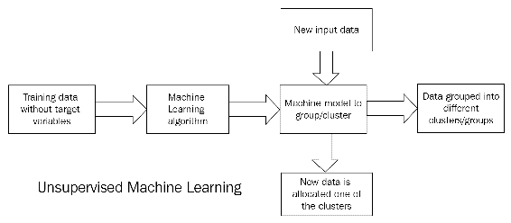

# 第二章：神经网络中的学习过程

正如人类学习有许多不同的类型和方法一样，机器学习也可以有不同的方式。为了确保机器能够从经验中学习，定义最适合的学习方法非常重要，这取决于具体的工作要求。这通常意味着选择当前情况下有效的技术，并不时进行评估，以决定是否需要尝试新的方法。

我们已经在第一章中学习了神经网络的基础知识，*神经网络与人工智能概念*，并通过 R 语言进行了两个简单的实现。在本章中，我们将探讨学习过程，也就是如何训练、测试和部署神经网络机器学习模型。训练阶段用于学习，以调整神经网络的参数。测试阶段用于评估完全训练好的神经网络的性能。最后，在部署阶段，实际数据会通过模型进行预测。

以下是本章涵盖的概念列表：

+   学习过程

+   有监督学习

+   无监督学习

+   训练、测试和部署模型

+   评估指标——误差测量与微调；衡量模型的准确性

+   使用神经网络的有监督学习模型

+   使用神经网络的无监督学习模型

+   反向传播

到本章结束时，我们将理解学习过程的基本概念，并学习如何在 R 环境中实现它。我们将发现实现神经网络的不同类型的算法。我们将学习如何训练、测试和部署模型。我们将知道如何执行正确的评估程序。

# 机器学习是什么？

机器学习是什么意思？这个定义相当复杂，因此我们需要请广大科学家们帮助解答。我们可以提到一位人工智能先驱的名言：

*“一个研究领域，赋予计算机无需明确编程即可学习的能力。”*

– 阿瑟·塞缪尔

机器学习是指通过数据训练模型或算法，然后使用该模型预测新的数据。例如，一个幼儿从爬行阶段被教会如何走路。最初，幼儿的父母扶着孩子的手帮助他站起来，并通过给定的数据进行教学。基于这些过程，如果在幼儿的路上出现障碍，或者某个地方需要转弯，在训练之后，幼儿能够自己导航。用于训练的数据称为训练数据，接受者在正式训练后仍然继续学习。

机器也可以像教小孩子一样，基于训练来完成任务。首先，我们输入足够的数据来告诉机器在什么情况下需要做什么。经过训练后，机器可以自动执行任务，还能学会自我调整。这种训练机器的方式叫做**机器学习**。

机器学习与编程的主要区别在于，机器学习不涉及编码/编程，而编程是给机器一组执行指令的过程。在机器学习中，数据是唯一的输入，而模型是基于我们决定使用的算法。

要使用的算法是基于数据的各种因素：特征（或自变量）、因变量的类型、模型的准确性以及模型训练和预测的速度。

基于机器学习数据的自变量，有三种不同的方式来训练模型：

+   监督学习

+   无监督学习

+   强化学习

下图展示了用于训练机器学习模型的不同算法：


在接下来的章节中，我们将逐一讲解这些内容。

# 监督学习

**监督学习**是一种学习方法，其中一部分训练数据作为算法的“老师”，帮助确定模型。机器被教会如何从目标数据中学习。目标数据或因变量是自变量的集体作用结果。网络训练是通过目标数据及其与输入数据模式的关系进行的。目标标签是事先已知的，数据被输入算法以推导模型。

大多数神经网络的使用是基于监督学习的。权重和偏差根据输出值进行调整。输出可以是分类的（如真/假或 0/1/2）或连续的（如 1、2、3，依此类推）。模型依赖于输出变量的类型，而在神经网络中，输出层是根据目标变量的类型来构建的。

对于神经网络，所有的自变量和因变量需要是数值型的，因为神经网络是基于数学模型的。数据科学家需要将数据转换为数值形式，以便输入模型。

监督学习通过下图来表示：


# 无监督学习

在无监督学习（或自组织）中，输出层被训练以将输入数据组织成另一组数据，而无需目标变量。输入数据会被分析，并从中找到模式以推导输出，如下图所示。由于没有教师（或目标变量），这种学习方式称为**无监督学习**。



无监督学习中可用的不同技术如下：

+   聚类（K 均值，层次聚类）

+   关联技术

+   降维

+   **自组织映射**（**SOM**）/ Kohonen 网络

总结一下，以下图示了机器学习的两种主要类型：


对于神经网络，我们有两种类型可用，使用 R 中不同的方式。

# 强化学习

强化学习是一种机器学习类型，在这种类型中，模型会不断收到反馈，以适应环境。在每个步骤中都会进行性能评估，以改进模型。对于神经网络，有一种特殊类型叫做**Q-learning**，它结合神经元来实现反向传播反馈机制中的强化学习。本书不涉及详细内容。

以下是我们目前已经涵盖的三种学习类型：


# 训练和测试模型

训练和测试模型是将该模型用于预测分析的基础。给定一个包含*100*行数据的数据集，其中包括预测变量和响应变量，我们将数据集分成一个合适的比例（例如*70:30*），并分配*70*行用于训练，*30*行用于测试。数据行是随机选择的，以减少偏差。

一旦训练数据可用，数据将被传入神经网络，以建立巨大的通用函数。训练数据决定了权重、偏置和激活函数的使用，以便从输入得到输出。直到最近，我们才不能说一个权重对目标变量有正向或负向影响。但现在我们已经能够揭示这个黑盒中的一些信息。例如，通过绘制一个训练过的神经网络，我们可以发现训练过的突触权重和有关训练过程的基本信息。

一旦足够的收敛性达到，模型将存储在内存中，下一步是测试模型。我们将*30*行数据传入模型，检查实际输出是否与模型的预测输出相符。评估用于获取各种指标，以验证模型。如果准确度差异过大，则需要通过更改训练数据和传递给神经网络函数的其他参数重新构建模型。我们将在本章稍后讨论更多关于评估指标的内容。

在训练和测试之后，模型被认为已部署，其中实际数据通过模型传递以获得预测。例如，使用案例可能是基于各种输入参数确定欺诈交易或房贷资格检查。

训练、测试和部署在下图中表示：


到目前为止，我们关注的是各种可用的算法；现在是时候将注意力集中在代表每个分析基本元素的数据上。

# 数据周期

数据是模型构建和学习过程中的关键组成部分。数据需要被收集、清洗、转换，然后输入模型进行学习。整体数据生命周期如下所示：


建模的一个关键要求是拥有良好且平衡的数据。这有助于提高模型的准确度，并更好地利用现有的算法。数据科学家的大部分时间都花费在数据清洗上，然后才能开始建模。

我们已经看到模型部署前的训练和测试过程。在测试时，结果作为评估指标进行记录，帮助我们决定是否使用某个模型，或是否需要改变模型。

接下来我们将看到评估指标。

# 评估指标

评估一个模型涉及在测试阶段检查预测值是否等于实际值。有多种评估指标可用，它们取决于目标变量的状态。

对于二分类问题，预测目标变量和实际目标变量可以处于以下四种状态之一：

| **预测** | **实际** |
| --- | --- |
| *预测 = 真* | *实际 = 真* |
| *预测 = 真* | *实际 = 假* |
| *预测 = 假* | *实际 = 真* |
| *预测 = 假* | *实际 = 假* |

当预测值与实际值相同，我们认为模型是准确的。如果所有预测值和实际值都相同（无论是全为*真*还是全为*假*），则模型准确度为*100*%。但实际情况中永远不会如此。

由于神经网络是近似模型，总会有一些误差的可能性。前述表格中的四种状态都是可能的。

我们为模型定义以下术语和指标：

+   **真阳性** (**TP**)：所有预测值与实际值均为*真*的情况（准确度良好）。

+   **真负例** (**TN**)：所有预测为*假*且实际也是*假*的情况（准确度良好）。

+   **假阳性** (**FP**)：这是当我们预测某个值为阳性（*真*），但实际为阴性时的情况。就像是误报或 FP 错误。例如，当预测男性为孕妇时。所有预测为*真*，而实际为*假*的情况。这也叫做**第一类错误**。

+   **假负例** (**FN**)：当我们预测某个值为*假*，但实际却为*真*时，该情况称为 FN。例如，当孕妇被孕检试剂预测为未怀孕时，就是一个 FN 案例。所有预测为*假*且实际为*真*的情况。这也叫做**第二类错误**。

# 混淆矩阵

当分类值被绘制成一个*nxn*矩阵（在二分类情况下为*2x2*矩阵）时，该矩阵称为**混淆矩阵**。所有评估指标都可以从混淆矩阵本身得出：

|  | **预测值** | **预测值** |
| --- | --- | --- |
| *实际值* | *真* | *假* |
| *真* | *TP* | *FN* |
| *假* | *FP* | *TN* |

现在，让我们详细看看一些评估指标。

# 真阳性率

**真阳性率** (**TPR**) 或敏感性或召回率或命中率，是指从所有识别出的正样本中，正确识别的真阳性比例：


理想情况下，如果模型的值接近 1，那么模型的表现会更好。

# 真负率

**真负率** (**TNR**) 或特异度是正确预测的负样本与我们预测的所有负样本总数之比：


如果这个比率接近零，模型就更准确。

# 准确率

准确率是衡量我们模型好坏的标准。如果模型表现良好，它应该接近 1。

准确率是正确预测与所有总预测的比率：


# 精确度和召回率

精确度和召回率分别是 *TP* 与 (*TP+FP*) 以及 *TP* 与 (*TP+FN*) 的比率。这些比率决定了我们的预测与实际的相关程度。

精确度定义为选定项目中相关项目的比例。也就是说，预测的结果中有多少是实际正确的。

方程式是：


如果精确度接近 1，我们的预测就会更准确。

召回率则告诉我们选择了多少相关项目。从数学上讲，它是：


以下图表清晰地展示了我们迄今为止的讨论：


# F 分数

F 分数，或 F1 分数，是衡量准确度的另一种方式。从技术上讲，它是精确度和召回率的调和均值：


# 接收者操作特征曲线

**接收者操作特征** (**ROC**) 曲线是一种图形展示，说明二分类系统的预测能力。ROC 曲线通过在各种阈值设置下绘制真阳性率（**TPR**）与**假阳性率**（**FPR**）的图表来创建。这给我们提供了**敏感性**与（**1 - 特异度**）的关系。ROC 曲线通常看起来是这样的：


获得必要技能后，我们已经准备好详细分析用于构建神经网络的算法。

# 神经网络中的学习

正如我们在第一章《神经网络与人工智能概念》中看到的，神经网络是一种机器学习算法，具有从数据中学习并使用构建的模型进行预测的能力。它是一种通用的函数近似方法，也就是说，任何输入输出数据都可以逼近为数学函数。

正向传播通过选择随机权重为我们提供了一个初始的数学函数，用于根据输入得到输出。实际输出与预测输出之间的差异称为误差项。神经网络的学习过程实际上发生在反向传播阶段。通过减少每次迭代中的误差项，模型会对权重进行微调。在反向传播过程中使用梯度下降法。

让我们在本章详细讲解反向传播，因为它是神经网络中重要的机器学习方面。

# 返回到反向传播

我们已经在第一章中详细讨论了正向传播，*神经网络与人工智能概念*，以及使用梯度下降法的反向传播的一些内容。反向传播是理解神经网络的重要概念之一，它依赖于微积分来更新每一层的权重和偏置。误差的反向传播类似于*从错误中学习*。我们在每次迭代中纠正我们的错误（误差），直到达到一个称为**收敛**的点。*反向传播的目标是纠正每一层的权重，并最小化输出层的整体误差。

神经网络的学习在前馈网络中极度依赖反向传播。正向传播和误差修正的常见步骤如下所示：

1.  通过为隐藏层中每个神经元分配随机的权重和偏置，开始神经网络的正向传播。

1.  在每个神经元上获取 *sum(weight*input) + bias* 的总和。

1.  在每个神经元上应用激活函数（*sigmoid*）。

1.  将此输出传递给下一个层的神经元。

1.  如果该层是输出层，应用权重并获取每个输出层神经元的 *sum(weight*input) + bias* 的总和。

1.  再次，在输出层神经元应用激活函数。

1.  这就形成了神经网络在一次正向传播中的输出层输出。

1.  现在，使用训练数据，我们可以通过减去实际输出和激活函数输出值来识别每个输出神经元的误差项。

1.  误差的总和通过以下公式计算得出：


当误差函数 `E` 随后进行微分时，使用一个 *1/2* 的因子来消除指数。

1.  梯度下降技术要求计算误差项（`E`）相对于网络权重的偏导数。使用**链式法则**来计算误差项相对于权重 *w[ij]* 的全误差的偏导数：


导数定义为值变化的速率，梯度下降使用导数（或斜率）来最小化误差项并得到一组正确的权重。

1.  第一个因子是该特定神经元 `j` 对输出的误差项的偏导数，并且 *o[j]* 等于 `y`：


1.  链式法则中的第二个因子是神经元 *o[j]* 对其输入的输出的偏导数，并且是激活函数（*sigmoid* 函数）的偏导数：


这里 *net[j]* 是输入到神经元的值。

1.  链式法则中的第三项只是 *o[i]*。


1.  将第 11 步、第 12 步和第 13 步结合，我们得到：


1.  每个神经元（任何层级）上的权重 *w[ij]* 会通过此偏导数与学习率结合进行更新。

这些步骤会重复进行，直到我们获得非常低的误差项的收敛或达到指定的次数。

所有步骤都在可用的 R 包中内部处理。我们可以提供学习率以及其他各种参数。

反向传播过程如下所示：


就像生活中的一切事物一样，即便是算法也有进一步改进的空间。在接下来的章节中，我们将看到如何实现这一点。

# 神经网络学习算法优化

在神经网络中执行学习过程的程序称为训练算法。学习算法是机器学习算法选择的最佳优化模型。其目标是最小化损失函数并提高准确性。这里我们展示一些优化技术，除了梯度下降法。

**粒子群优化**（**PSO**）方法受到鸟群在寻找食物或生存过程中的集体行为观察的启发。它类似于鱼群试图一起移动。我们知道粒子的位置和速度，PSO 的目标是在由位置和速度控制的数学方程的指导下，在大空间中搜索解决方案集。它从生物体行为中汲取灵感，用于集体智能。

**模拟退火**是一种基于概率方法的技术，用来逼近代价函数的全局最优解。该方法在大空间中通过模拟搜索解决方案。

进化方法源自生物学中的进化过程，且

进化可以通过繁殖、变异、选择和重组来进行。

适应度函数用于确定模型的性能，并基于此进行调整。

函数，我们选择最终模型。

**期望最大化**（**EM**）方法是一种统计学习方法，采用迭代方法找到最大似然或最大后验估计，从而最小化误差。

# 神经网络中的监督学习

如前所述，监督学习是一种学习方法，其中一部分训练数据作为算法的“老师”，帮助确定模型。在接下来的部分中，将提出一个回归预测建模问题示例，以便了解如何使用神经网络解决该问题。

# 波士顿数据集

该数据集描述了波士顿郊区住宅的 13 个数值属性，并涉及在这些郊区以千美元为单位建模住宅价格。因此，这是一个回归预测建模问题。输入属性包括犯罪率、非零售商业用地比例、化学浓度等。以下列表显示了所有变量及其简要描述：

+   实例数量：*506*

+   属性数量：*13* 个连续属性（包括 `class`）

    属性`MEDV`，以及一个二进制值属性

每个属性的详细描述如下：

1.  `crim` 按城镇划分的每人犯罪率。

1.  `zn` 划为住宅用地的、超过*25,000*平方英尺的地块比例。

1.  `indus` 每个城镇的非零售商业用地比例。

1.  `chas` 查尔斯河虚拟变量（如果区域边界是河流，*= 1*；否则为`0`）。

1.  `nox` 氮氧化物浓度（单位：每*10*百万）。

1.  `rm` 每个住宅的平均房间数。

1.  `age` 1940 年前建成的自有住房比例。

1.  `dis` 到波士顿五个就业中心的加权距离

1.  `rad` 通往放射性高速公路的可达性指数。

1.  `tax` 每*10,000*美元的全额财产税率。

1.  `ptratio` 按城镇划分的师生比。

1.  `black` *1000(Bk - 0.63)²* 其中 *Bk* 是按城镇划分的黑人比例。

1.  `lstat` 低收入人群的百分比。

1.  `medv` 自有住房的中位数价值（单位：*1000 美元*）。

在这些变量中，`medv` 是响应变量，而其他十三个变量是可能的预测变量。本分析的目标是拟合一个回归模型，最有效地解释 `medv` 的变化。

前十三列与 `medv` 响应变量之间存在关系。我们可以根据输入的十三列预测 `medv` 的值。

该数据集已通过 R 库（`MASS`）提供，正如我们稍后将看到的那样，因此我们不必担心如何获取数据。

# 使用波士顿数据集进行神经网络回归

在本节中，我们将为 `Boston` 数据集运行回归神经网络。预测测试数据的 `medv` 值。训练和测试的划分比例为*70:30*。`neuralnet`函数用于通过神经网络建模数据：

```py
#####################################################################
###Chapter 2 - Introduction to Neural Networks - using R ############
###Simple R program to build, train, test regression neural networks#
#########################flename: Boston.r###########################
#####################################################################

library("neuralnet")
library(MASS)

set.seed(1)

data = Boston

max_data <- apply(data, 2, max) 
min_data <- apply(data, 2, min)
data_scaled <- scale(data,center = min_data, scale = max_data - min_data) 

index = sample(1:nrow(data),round(0.70*nrow(data)))
train_data <- as.data.frame(data_scaled[index,])
test_data <- as.data.frame(data_scaled[-index,])

n = names(data)
f = as.formula(paste("medv ~", paste(n[!n %in% "medv"], collapse = " + ")))
net_data = neuralnet(f,data=train_data,hidden=10,linear.output=T)
plot(net_data)

predict_net_test <- compute(net_data,test_data[,1:13])

predict_net_test_start <- predict_net_test$net.result*(max(data$medv)-min(data$medv))+min(data$medv)
test_start <- as.data.frame((test_data$medv)*(max(data$medv)-min(data$medv))+min(data$medv))
MSE.net_data <- sum((test_start - predict_net_test_start)²)/nrow(test_start)

Regression_Model <- lm(medv~., data=data)
summary(Regression_Model)
test <- data[-index,]
predict_lm <- predict(Regression_Model,test)
MSE.lm <- sum((predict_lm - test$medv)²)/nrow(test)

MSE.net_data
MSE.lm
###########################################################################

```

别担心，我们将逐行详细解释整个代码。

```py
library("neuralnet")
library(MASS)
```

代码的前两行很简单，因为它们加载了我们将用于后续计算的库。具体来说，`neuralnet` 库将帮助我们构建和训练神经网络，而 `MASS` 库将帮助我们加载之前已详细介绍过的 `Boston` 数据集。

请记住，要安装 R 初始发行版中没有的库，必须使用 `install.package` 函数。这是安装软件包的主要函数。它接受一个包含名称的向量和一个目标库，从仓库下载软件包并进行安装。

例如，在我们的例子中，要安装 `neuralnet` 包，我们应该写：

```py
install.neuralnet
```

最后需要强调的是，这个函数只应该使用一次，而不是每次运行代码时都使用。相反，通过以下命令加载库，并且每次运行代码时必须重复这一过程：

```py
library (neuralnet)
```

`set.seed` 函数设置 R 随机数生成器的种子，这对创建可以复现的模拟或随机对象很有用：

```py
set.seed(1)
```

每次你想获得可复现的随机结果时，都必须使用这个函数。在这种情况下，随机数是相同的，无论我们在序列中走多远，它们都会保持不变。

以下命令加载 `Boston` 数据集，该数据集如我们预期，包含在 `MASS` 库中，并将其保存到给定的框架中：

```py
data = Boston
```

使用 `str` 函数查看任意 R 对象的紧凑结构。在我们的例子中，使用 `str(data)`，我们将获得如下结果：

```py
> str(data)
'data.frame': 506 obs. of 14 variables:
 $ crim : num 0.00632 0.02731 0.02729 0.03237 0.06905 ...
 $ zn : num 18 0 0 0 0 0 12.5 12.5 12.5 12.5 ...
 $ indus : num 2.31 7.07 7.07 2.18 2.18 2.18 7.87 7.87 7.87 7.87 ...
 $ chas : int 0 0 0 0 0 0 0 0 0 0 ...
 $ nox : num 0.538 0.469 0.469 0.458 0.458 0.458 0.524 0.524 0.524 0.524 ...
 $ rm : num 6.58 6.42 7.18 7 7.15 ...
 $ age : num 65.2 78.9 61.1 45.8 54.2 58.7 66.6 96.1 100 85.9 ...
 $ dis : num 4.09 4.97 4.97 6.06 6.06 ...
 $ rad : int 1 2 2 3 3 3 5 5 5 5 ...
 $ tax : num 296 242 242 222 222 222 311 311 311 311 ...
 $ ptratio: num 15.3 17.8 17.8 18.7 18.7 18.7 15.2 15.2 15.2 15.2 ...
 $ black : num 397 397 393 395 397 ...
 $ lstat : num 4.98 9.14 4.03 2.94 5.33 ...
 $ medv : num 24 21.6 34.7 33.4 36.2 28.7 22.9 27.1 16.5 18.9 ...
```

对给定对象获得的结果如下面的图所示：


让我们回过头来解析代码：

```py
max_data <- apply(data, 2, max) 
min_data <- apply(data, 2, min)
data_scaled <- scale(data,center = min_data, scale = max_data - min_data) 
```

我们需要这段代码来规范化数据。

请记住，在训练神经网络之前，规范化数据是一个好习惯。通过规范化，数据单位被消除，从而可以轻松地比较来自不同地点的数据。

这是构建神经网络中一个极其重要的步骤，因为它可以避免不必要的结果或非常复杂的训练过程，从而导致算法收敛问题。你可以选择不同的数据缩放方法（**z-标准化**、**最小-最大缩放**等）。在这个示例中，我们将使用最小-最大方法（通常称为特征缩放）将所有数据缩放到 *[0,1]* 范围内。实现这一点的公式如下：


在应用所选的规范化方法之前，必须先计算每个数据库列的最小值和最大值。为此，我们使用 `apply` 函数。该函数返回一个通过将函数应用于数组或矩阵的边缘而获得的向量、数组或列表。让我们理解所使用参数的含义。

```py
max_data <- apply(data, 2, max) 
```

`apply` 函数的第一个参数指定应用该函数的数据集，在我们的例子中是名为 `data` 的数据集。第二个参数必须包含一个向量，给出函数将应用于的下标。在我们的例子中，`1` 表示行，`2` 表示列。第三个参数必须包含要应用的函数；在我们的例子中是 `max` 函数。

为了对数据进行标准化，我们使用了`scale`函数，这是一个通用函数，其默认方法是对数值矩阵的列进行居中和/或缩放。

```py
index = sample(1:nrow(data),round(0.70*nrow(data)))
train_data <- as.data.frame(data_scaled[index,])
test_data <- as.data.frame(data_scaled[-index,])
```

在刚才建议的代码的第一行中，数据集被分割为*70:30*，目的是使用*70*百分比的数据来训练网络，剩余的*30*百分比用于测试网络。在第二行和第三行中，名为`data`的数据框的内容被划分为两个新的数据框，分别称为`train_data`和`test_data`。

```py
n = names(data)
f = as.formula(paste("medv ~", paste(n[!n %in% "medv"], collapse = " + ")))
net_data = neuralnet(f,data=train_data,hidden=10,linear.output=T)
plot(net_data)
```

到目前为止，所有工作仅用于准备数据。现在是时候构建网络了。为此，我们首先通过`names`函数恢复所有变量名称。该函数可以获取或设置对象的名称。

接下来，我们构建了用于构建网络的`formula`，因此我们使用`neuralnet`函数来构建和训练网络。在这种情况下，我们将创建一个只有一个隐藏层，且有`10`个节点的网络。最后，我们绘制了神经网络，如下图所示：


既然我们有了网络，接下来该做什么呢？当然，我们用它来进行预测。我们已经预留了*30*百分比的可用数据来进行预测：

```py
predict_net_test <- compute(net_data,test_data[,1:13])
```

在我们的案例中，我们将该函数应用于`test_data`数据集，仅使用前`13`列，代表网络的输入变量：

```py
predict_net_test_start <- predict_net_test$net.result*(max(data$medv)-       min(data$medv))+min(data$medv)
test_start <- as.data.frame((test_data$medv)*(max(data$medv)-min(data$medv))+min(data$medv))
MSE.net_data <- sum((predict_net_test_start - test_start)²)/nrow(test_start)
```

那么，如何判断网络能够进行的预测是否准确呢？我们可以使用**均方误差**（**MSE**）作为衡量我们预测值与真实数据之间差距的标准。

在这方面，值得记住的是，在构建网络之前，我们已经对数据进行了标准化。现在，为了能够进行比较，我们需要退回一步，回到起始位置。一旦数据集的值恢复后，我们就可以通过以下公式计算*MSE*：


好的，我们现在已经计算了*MSE*，那么该用什么来进行比较呢？为了了解网络预测的准确性，我们可以构建一个线性回归模型：

```py
Regression_Model <- lm(medv~., data=data)
summary(Regression_Model)
test <- data[-index,]
predict_lm <- predict(Regression_Model,test)
MSE.lm <- sum((predict_lm - test$medv)²)/nrow(test)
```

我们使用`lm`函数构建了一个线性回归模型。该函数用于拟合线性模型，可以用于回归分析、单层方差分析和协方差分析。为了生成模型拟合结果的摘要，我们使用了`summary`函数，返回了以下结果：

```py
> summary(Regression_Model)

Call:
lm(formula = medv ~ ., data = data)

Residuals:
 Min 1Q Median 3Q Max 
-15.5944739 -2.7297159 -0.5180489 1.7770506 26.1992710

Coefficients:
 Estimate Std. Error t value Pr(>|t|) 
(Intercept) 36.4594883851 5.1034588106 7.14407 0.00000000000328344 ***
crim -0.1080113578 0.0328649942 -3.28652 0.00108681 ** 
zn 0.0464204584 0.0137274615 3.38158 0.00077811 ***
indus 0.0205586264 0.0614956890 0.33431 0.73828807 
chas 2.6867338193 0.8615797562 3.11838 0.00192503 ** 
nox -17.7666112283 3.8197437074 -4.65126 0.00000424564380765 ***
rm 3.8098652068 0.4179252538 9.11614 < 0.000000000000000222 ***
age 0.0006922246 0.0132097820 0.05240 0.95822931 
dis -1.4755668456 0.1994547347 -7.39800 0.00000000000060135 ***
rad 0.3060494790 0.0663464403 4.61290 0.00000507052902269 ***
tax -0.0123345939 0.0037605364 -3.28001 0.00111164 ** 
ptratio -0.9527472317 0.1308267559 -7.28251 0.00000000000130884 ***
black 0.0093116833 0.0026859649 3.46679 0.00057286 ***
lstat -0.5247583779 0.0507152782 -10.34715 < 0.000000000000000222 ***
---
Signif. codes: 0 ‘***’ 0.001 ‘**’ 0.01 ‘*’ 0.05 ‘.’ 0.1 ‘ ’ 1

Residual standard error: 4.745298 on 492 degrees of freedom
Multiple R-squared: 0.7406427, Adjusted R-squared: 0.7337897 
F-statistic: 108.0767 on 13 and 492 DF, p-value: < 0.00000000000000022204
```

此外，对于回归模型，我们计算了平均均方误差（MSE）。最后，为了评估网络的性能，我们将其与使用相同数据库计算的多元线性回归模型进行比较，具体如下：

```py
MSE.net_data
MSE.lm
```

结果如下：

```py
> MSE.net_data
[1] 12.0692812
> MSE.lm
[1] 26.99265692
```

从结果分析中可以看出，神经网络的`MSE`低于线性回归模型。

# 神经网络中的无监督学习

本节中，我们介绍了神经网络中的无监督学习模型，分别是竞争学习和 Kohonen 自组织映射（SOM）。Kohonen SOM 是由名为 Teuvo Kohonen 的教授发明的，它是一种将多维数据表示为更低维度的方法：*1D*或*2D*。它可以在没有监督的情况下对数据进行分类。无监督学习旨在发掘数据集中的隐藏模式，并将它们聚类成不同的数据类别。

有许多无监督学习技术，如 K 均值聚类、降维、EM 等。它们的共同特征是没有输入输出映射，我们仅根据输入值来创建一个输出的组或集合。

对于神经网络，它们可以用于无监督学习。它们可以将数据分组到不同的桶中（聚类），或者将原始数据抽象成不同的一组输出数据点（特征抽象或降维）。无监督技术比有监督技术需要更少的处理能力和内存。

在无监督神经网络中，没有目标变量，因此我们无法进行反向传播。相反，我们在没有误差度量的情况下持续调整权重，并尝试将相似的数据分组。我们将看到两种无监督神经网络方法：

+   竞争学习

+   Kohonen 自组织映射（SOM）

# 竞争学习

在这里，神经网络节点之间相互竞争，以争夺对输入数据子集的响应权。隐藏层被称为**竞争层**。每个竞争神经元都有自己的权重，我们计算每个输入向量与神经元权重之间的相似度。对于每个输入向量，隐藏神经元之间相互竞争，看哪个最*类似*于该输入向量：


输出神经元被认为是在为输入模式进行竞争。

+   在训练过程中，提供给定输入模式最高激活的输出神经元被声明为胜者，并且其权重被移向该输入模式，而其余神经元保持不变。

+   这种策略也叫做**胜者全得**，因为只有获胜的神经元会被更新：


让我们看一个简单的竞争学习算法示例，以在给定的输入数据中找到三个神经元：

1.  我们将在输入层中设置三个输入神经元。每个神经元的输入是一个连续变量，假设每个输入神经元的权重是一个介于*0.0*和*1.0*之间的随机数。每个节点的输出是三个权重与其输入的乘积。

1.  每个竞争层神经元接收权重和输入的乘积之和。

1.  输出最大值的竞争层节点被视为胜者。然后，输入被分类为属于该节点对应的聚类。

1.  胜者更新其每个权重，将权重从那些提供较弱信号的连接转移到那些提供较强信号的连接上。

因此，随着我们接收更多数据，每个节点都会收敛到它所代表的聚类中心。它对属于该聚类的输入激活得更强烈，而对属于其他聚类的输入激活得较弱。

竞争学习基本上有两个停止条件：

+   **预定义的周期数**：仅运行`N`个周期，这防止了算法在没有收敛的情况下运行过长时间。

+   **最小权重更新值**：算法会一直运行，直到我们得到最小的权重更新值。

# Kohonen SOM

竞争学习的概念与邻域神经元相结合，得到了 Kohonen SOM。输出层中的每个神经元都有两个邻居。在竞争学习中，发出最大值的神经元会更新其权重，但在 SOM 中，邻域神经元也会以相对较慢的速度更新其权重。网络更新权重的邻域神经元数量取决于问题的维度。

对于一个*2D*问题，SOM 的表示方式如下：


从图示来看，SOM 是如何将不同的颜色映射到不同的聚类中的：


让我们一步一步地理解 Kohonen SOM 的工作原理：

1.  初始化定义 SOM 结构的输入数量、聚类数量以及每个节点的权重。

1.  从训练数据集中随机选择一个向量并将其呈现给网络。

1.  检查网络中的每个节点，计算哪个节点的权重与输入向量最相似。获胜节点通常被称为**最佳匹配单元**（**BMU**）。

1.  计算 BMU 的邻域半径。这个值开始时较大，通常设置为网络的半径，并随着每个时间步逐渐减小。

1.  任何位于步骤 4 中计算的 BMU 半径范围内的神经元，都将进行调整，使其更加接近输入向量。神经元离 BMU 越近，其权重的改变越大。

1.  对`N`次迭代重复执行步骤 2。

步骤会重复执行`N`次周期，或者直到获得最小的权重更新。

SOM 被应用于聚类（将数据分组到不同的桶中）、数据抽象（从输入中派生输出数据）和降维（减少输入特征的数量）等领域。SOM 以类似于**多维尺度法**（**MDS**）的方式处理问题，但不是最小化距离，而是尝试重新分组拓扑，换句话说，它们尽量保持相同的邻居。

让我们看看 R 中 SOM 实现的一个示例。`kohonen`包是一个需要安装的包，用于在 R 中使用 SOM 相关的函数。

以下 R 程序说明了`kohonen`包中的一些函数：

```py
######################################################################
###Chapter 2 - Introduction to Neural Networks - using R    ##########
###Usuervised ML technique using Kohonen package  ####################
######################filename: kohonen.r#############################
######################################################################
library("kohonen")

data("wines")
str(wines)
head(wines)
View (wines)

set.seed(1)
som.wines = som(scale(wines), grid = somgrid(5, 5, "hexagonal"))
som.wines
dim(getCodes(som.wines))

plot(som.wines, main = "Wine data Kohonen SOM")
par(mfrow = c(1, 1))
plot(som.wines, type = "changes", main = "Wine data: SOM")

training = sample(nrow(wines), 150)
Xtraining = scale(wines[training, ])
Xtest = scale(wines[-training, ],
 center = attr(Xtraining, "scaled:center"),
 scale = attr(Xtraining, "scaled:scale"))
trainingdata = list(measurements = Xtraining,
 vintages = vintages[training])
testdata = list(measurements = Xtest, vintages = vintages[-training])
mygrid = somgrid(5, 5, "hexagonal")
som.wines = supersom(trainingdata, grid = mygrid)

som.prediction = predict(som.wines, newdata = testdata)
table(vintages[-training], som.prediction$predictions[["vintages"]])
######################################################################
```

代码使用了一个葡萄酒数据集，该数据集包含一个有`177`行和`13`列的数据框；`vintages`对象包含类标签。这些数据来自于意大利（皮埃蒙特）同一地区葡萄酒的化学分析，这些葡萄酒源自三种不同的葡萄品种，即`Nebbiolo`、`Barberas`和`Grignolino`葡萄。`Nebbiolo`葡萄酿成的葡萄酒叫做**巴罗洛**。数据包括每种葡萄酒中多种成分的含量，以及一些光谱变量。

现在，让我们查看每个代码部分的输出。

```py
library("kohonen")
```

代码的第一行很简单，它加载了我们将用于后续计算的库。具体来说，`kohonen`库将帮助我们训练 SOM。此外，支持对映射的查询和使用训练好的映射进行预测。

请记住，要安装 R 中初始分发版中没有的库，您必须使用`install.package`函数。这是安装包的主要函数。它接受一个名称向量和目标库，从仓库中下载包并安装它们。

```py
data("wines")
str(wines)
head(wines)
view (wines)
```

这些代码行加载了`wines`数据集，正如我们所预期的，它包含在 R 的分发版中，并将其保存到一个名为`data`的数据框中。然后，我们使用`str`函数来紧凑显示数据集的结构。`head`函数用于返回数据框的前部分或后部分。最后，`view`函数用于调用数据框对象的电子表格样式数据查看器，如下图所示：


接下来，我们将继续分析代码：

```py
set.seed(1)
som.wines = som(scale(wines), grid = somgrid(5, 5, "hexagonal"))
dim(getCodes(som.wines))
plot(som.wines, main = "Wine data Kohonen SOM")
```

加载葡萄酒数据并设置`seed`以确保结果可重复后，我们调用`som`函数来创建一个*5x5*的矩阵，其中需要对特征进行聚类。该函数内部执行`kohonen`处理，结果可以通过特征聚类来看。共有*25*个聚类，每个聚类都有一组具有相似模式的特征，如下图所示：


代码的下一部分绘制了与`som`迭代次数相关的最近单元的平均距离：

```py
graphics.off()
par(mfrow = c(1, 1))
plot(som.wines, type = "changes", main = "Wine data: SOM")
```

下图展示了与迭代次数相关的最近单元的平均距离：


接下来，我们创建了一个`training`数据集，包含`150`行，和一个`test`数据集，包含`27`行。我们运行 SOM 并使用测试数据进行预测。这里使用了`supersom`函数。此处的模型是监督式 SOM：

```py
training = sample(nrow(wines), 150)
Xtraining = scale(wines[training, ])
Xtest = scale(wines[-training, ],
 center = attr(Xtraining, "scaled:center"),
 scale = attr(Xtraining, "scaled:scale"))
trainingdata = list(measurements = Xtraining,
 vintages = vintages[training])
testdata = list(measurements = Xtest, vintages = vintages[-training])
mygrid = somgrid(5, 5, "hexagonal")
som.wines = supersom(trainingdata, grid = mygrid)

som.prediction = predict(som.wines, newdata = testdata)
table(vintages[-training], som.prediction$predictions[["vintages"]])
```

最后，我们调用`table`函数，它使用交叉分类因素构建一个列出每个因素水平组合计数的列联表，如下所示：

```py
> table(vintages[-training], som.prediction$predictions[["vintages"]])

 Barbera Barolo Grignolino
 Barbera            5      0          0
 Barolo             0     11          0
 Grignolino         0      0         11
```

`kohonen`包具有标准的 SOM（自组织映射）功能，并提供了两个扩展功能：用于分类和回归的扩展，以及用于数据挖掘的扩展。同时，它还具有广泛的图形功能用于可视化。

下表列出了`kohonen`包中可用的函数：

| **函数名称** | **描述** |
| --- | --- |
| `som` | 标准 SOM |
| `xyf`, `bdk` | 监督式 SOM；两个并行映射 |
| `supersom` | 带有多个并行映射的 SOM |
| `plot.kohonen` | 通用绘图函数 |
| `summary.kohonen` | 通用总结函数 |
| `map.kohonen` | 将数据映射到最相似的神经元 |
| `predict.kohonen` | 通用预测属性函数 |

# 总结

在本章中，我们探讨了机器学习领域，并观察了神经网络中的学习过程。我们学会了区分监督学习、无监督学习和强化学习。为了详细了解必要的流程，我们还学习了如何训练和测试模型。

随后，我们发现了数据周期的意义，以及数据必须如何收集、清理、转换，再输入模型进行学习。因此，我们深入研究了评估模型，查看测试阶段的预期值是否等于实际值。我们分析了可用于控制模型的不同度量标准，这些度量标准依赖于目标变量的状态。

然后我们发现了理解神经网络时一个重要的概念——反向传播算法，它基于计算来更新每个层级的权重和偏置。

最后，我们介绍了两个 R 中的实际程序，应用了`neuralnet`和`kohonen`库来实现学习过程。我们可以系统地使用这些基础知识进一步构建复杂的网络。

在下一章中，我们将探索**深度神经网络**（**DNN**）。我们将了解`H2O`包的一些基础知识。总体而言，`H2O`是一个高度用户友好的包，可以用于训练前馈网络或深度自编码器。它支持分布式计算，并提供 Web 界面。通过引入`H2O`包，像使用任何其他 R 包一样，我们可以进行各种 DNN 建模和处理。
