# 第四章：感知机神经网络建模 – 基本模型

到目前为止，我们已经了解了神经网络的基础知识以及学习部分的工作原理。在本章中，我们将研究神经网络架构的基本且简单的形式——感知机。

**感知机**被定义为神经网络的基本构建模块。在机器学习中，感知机是一种用于二分类器的监督学习算法。它们将输出分类为二元：`TRUE`/`FALSE` 或 `1`/`0`。

本章帮助理解以下主题：

+   感知机的解释

+   线性可分分类器

+   简单的感知机实现函数

+   **多层感知机**（**MLPs**）

到本章结束时，我们将理解感知机的基本概念及其在神经网络算法中的应用。我们将发现线性可分分类器。我们将学习在 R 环境中的简单感知机实现函数。我们将了解如何训练和建模一个多层感知机（MLP）。

# 感知机及其应用

感知机可以理解为任何接收多个输入并产生一个输出的实体。它是最简单的神经网络形式。感知机由 Frank Rosenblatt 于 1958 年提出，作为具有输入层和输出层的实体，并基于最小化误差的学习规则。这个学习函数叫做**误差反向传播**，它根据网络的实际输出与给定输入之间的差异，改变连接权重（突触）。

当时的热情极高，控制论行业也随之诞生。但后来，科学家 Marvin Minsky 和 Seymour Papert（1969 年）展示了感知机的局限性。事实上，感知机经过适当的训练后只能识别线性可分函数。例如，XOR 逻辑函数无法通过感知机实现。

以下图像展示了 Frank Rosenblatt 在康奈尔航空实验室（1957-1959）时，研究 Mark I 感知机分类器的情景：


潜在地，一个多层感知机网络可以解决更复杂的问题，但训练的计算复杂性增加使得这条路径变得不可行。直到最近，我们才开始重新考虑这种操作实体的实用性。

在单一形式中，感知机有一个神经元单元，接受输入并生成一组输出。

例如，让我们看看以下图像：

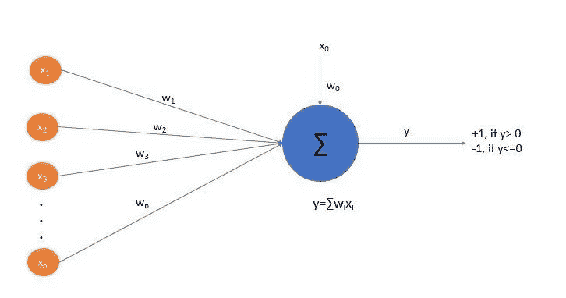

这里**x[1], x[2],.., x[n]**是输入集合，**x[0]**是偏置。**x[0]**被设置为*`1`*。输出*`y`*是**w[i]x[i]**的加权和。**符号函数**在加权和计算后应用。

它将输出分隔为：

+   如果**y>0**，输出为*`1`*

+   如果**y<=0**，输出为**-1**

偏置是常数，与权重**w[0]**相关。这个感知机充当线性分隔器，将输出分为**-1**或**+1**两类。

请注意，这里没有反向传播，权重更新是通过我们很快会看到的步骤进行的。这里有一个阈值设置，它决定了输出的值。输出是二值的（**-1** 或 **+1**），可以设置为零或一。

因此，感知机是一个简单的分类函数，直接做出预测。其功能的核心在于权重，以及我们如何更新权重，以便对 *`y`* 做出最佳预测。

这个例子是 **简单感知机** 或基础感知机，输出是二进制的：*0/1* *真/假* *+1/-1*。

另一种类型的感知机叫做 **多类感知机**，它可以对动物进行多种可能标签的分类，比如狗、猫或鸟。

在下图中展示了一个简单感知机架构与多类感知机架构的对比：

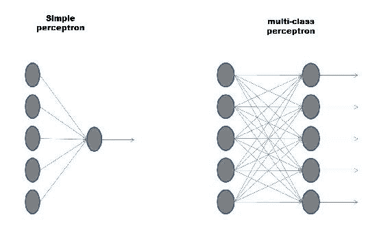

通过修改权重向量，我们可以修改感知机的输出，以提高学习或存储特性。例如，我们可以尝试指导感知机，使得给定输入 `x` 时，输出 `y` 尽可能接近预先选定的 `y` 实际值。然而，单个感知机的计算能力是有限的，其性能很大程度上依赖于输入选择和你想要实现的函数选择。

实际上，输入可以限制为所有可能输入的一个子集，或者根据某种预定的概率分布随机提取。较小程度上，系统的性能也取决于实际输出与预期输出之间的距离如何量化。

一旦你识别出了学习问题，你就可以尝试为给定的问题找到最佳的权重分配。

# 简单感知机 – 线性可分分类器

如我们所见，简单感知机是一个单层神经单元，它是一个线性分类器。它是一个只能生成两种输出模式的神经元，这些模式可以合成为 *激活* 或 *非激活*。其决策规则通过 *阈值* 行为实现：如果组成输入层的各个神经元的激活模式的总和，按它们的权重加权后，超过某个阈值，那么输出神经元将采用输出模式 *激活*。反之，输出神经元将保持在 *非激活* 状态。

如前所述，输出是 *权重*输入*的总和，并在其上应用一个函数；输出是 *+1 (y>0)* 或 *-1(y<=0)*，如下面的图所示：

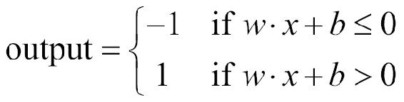

我们可以看到这里的线性交互；输出 `y` 与输入是线性相关的。

与大多数神经网络模型一样，即使在感知器中，也可以通过修改突触连接权重来实现学习功能。在训练阶段开始时，感知器突触连接的权重`w`是完全随机的。对于训练，我们有若干个示例及其相关的正确分类。网络依次呈现待分类的不同案例，每次网络处理其响应（大于阈值或小于阈值）。如果分类正确（网络输出与预期一致），则训练算法不会做出任何更改。相反，如果分类不正确，算法会改变突触权重，以期提高网络的分类性能。

单一感知机是一个在线学习者。权重更新通过以下步骤发生：

1.  获取`x`并输出标签`y`。

1.  更新*f(x)*的`w`。

1.  如果*f(x)=y*，则标记为完成；否则，修正它。

1.  现在根据错误调整评分：

*f(x) = sign(权重*输入之和)*，此时可能出现错误。

如果*y=+1*且*f(x)=-1*，则`w`x*太小，增大它。

如果*y=-1*且*f(x)=+1*，则`w`x*太大，减小它。

1.  应用以下规则：

如果*f(f)=+1*且*y=-1*，则*w=w-x*。

如果*f(f)=-1*且*y=+1*，则*w=w+x*。

如果*f(x)=y*，则*w=w*。

或简单地说，*w=w+yx*，如果*f(x)!=y*。

1.  重复步骤 3 到 5，直到*f(x) = y*。

感知机保证能够满足我们所有的数据，但仅适用于具有单一神经元的二分类器。在步骤 5 中，我们引入了一个叫做**学习率**的术语。这有助于我们的模型收敛。在步骤 5 中，`w`被写为：*w=w+αyx*，如果*f(x) != y*，其中*α*是选定的学习率。

如果*f(x) != y*，则偏置也会更新为*b=b+ αy*。`b` 实际上就是我们的 *w[0]*。

如果布尔函数是一个线性阈值函数（即它是线性可分的），那么局部感知机规则可以在有限步骤内找到一组能够实现它的权重。

这个定理，称为**感知机定理**，在全局规则的情况下也适用，该规则修改突触权重的向量`w`，而不是在单个输入向量上，而是根据感知机在整个输入向量集上的行为进行修改。

我们刚刚提到了线性可分函数，那么这个术语是什么意思呢？我们将在接下来的章节中理解它。

# 线性分离

当一组输出值可以通过一条直线分开时，称这些输出值是线性可分的。从几何学上看，这个条件描述了在输入的向量空间中存在一个超平面，它将需要正输出的与需要负输出的分开，如下图所示：

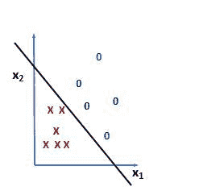

在这里，分隔符的一侧是预测属于一个类别的点，而另一侧是预测属于不同类别的点。布尔神经元的决策规则对应于由超平面操作的输入特征空间的划分。

如果除了输出神经元外，神经网络的输入也是布尔值，那么使用神经网络进行分类相当于确定输入向量的布尔函数。该函数在超过阈值时取值为 1，否则取值为 0。例如，对于两个输入和输出布尔神经元，可以以一种非常直观的方式表示*AND*和*OR*函数。

事实上，*AND*门和*OR*门是线性可分的。让我们通过实际测试来验证，首先列出可能的情况并将其表示在二维平面上。

我们首先来做*AND*函数的例子。下表列出了所有可能的情况及其逻辑结果：

| **x1** | **x2** | *`y`* (**AND 门**) |
| --- | --- | --- |
| `1` | `1` | `1` |
| `1` | `0` | `0` |
| `0` | `1` | `0` |
| `0` | `0` | `0` |

下图显示了在二维平面中的所有四种情况：

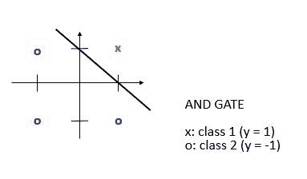

所有超平面上的点假设为*1/TRUE*，而其下方的点假设为*0/FALSE*。

现在我们来做*OR*函数的例子。下表列出了所有可能的情况及其逻辑结果：

| **x1** | **x2** | *`y`* (**或门**) |
| --- | --- | --- |
| `1` | `1` | `1` |
| `1` | `0` | `1` |
| `0` | `1` | `1` |
| `0` | `0` | `0` |

下图显示了在二维平面中的所有四种情况：

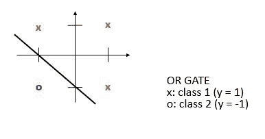

在这种情况下，所有超平面上的点假设为*1/TRUE*，而其下方的点假设为*0/FALSE*。

然而，一些布尔函数无法通过网络结构来复制，比如这里看到的函数。*XOR*和恒等函数就是不可分的：要将它们隔离，需要两条线，而这只能通过更复杂的网络结构来实现。

下表列出了*XOR*函数的所有可能情况及其逻辑结果：

| **x1** | **x2** | **y (XOR 门)** |
| --- | --- | --- |
| `1` | `1` | `0` |
| `1` | `0` | `1` |
| `0` | `1` | `1` |
| `0` | `0` | `0` |

下图显示了在二维平面中的所有四种情况：

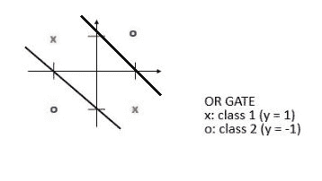

如预期的那样，这样的函数需要两条线来划分所有可能的情况。

在理解了感知机理论的基础之后，我们可以研究一个实际的案例。

# R 中的感知机函数

在之前的章节中，我们理解了感知器作为分类器的基本概念。现在，实践的时刻到了，我们将通过分析一个示例来应用迄今为止所学的内容，在这个示例中，我们将尝试根据鸢尾花的花瓣和萼片的大小来对花卉物种进行分类。如你所记得，`iris`数据集已经在第三章中使用过，*使用多层神经网络的深度学习*。重新使用这个数据集的原因不仅是因为其中的数据质量使读者能够轻松理解所阐述的概念，而且更重要的是，能够比较不同的算法。

如你所记得，数据集包含了来自三种鸢尾花物种（Iris `setosa`、Iris `virginica` 和 Iris `versicolor`）的 50 个样本。从每个样本中测量了四个特征：萼片和花瓣的长度和宽度，单位为厘米。

包含以下变量：

+   萼片长度（单位：厘米）

+   萼片宽度（单位：厘米）

+   花瓣长度（单位：厘米）

+   花瓣宽度（单位：厘米）

+   类别：`setosa`、`versicolour`、`virginica`

在所示的示例中，我们将尝试通过线性分隔来分类`setosa`和`versicolor`物种。

让我们在 R 语言中为`iris`数据集实现一个感知器函数。代码如下：

```py
######################################################################
###Chapter 4 - Introduction to Neural Networks - using R    ##########
###Simple Perceptron implementation function in R - iris dataset  ####
######################################################################

data(iris)
head(iris, n=20)

iris_sub=iris[1:100, c(1, 3, 5)] 
names(iris_sub)=c("sepal", "petal", "species") 
head(iris_sub) 

library(ggplot2) 

ggplot(iris_sub, aes(x = sepal, y = petal)) + 
 geom_point(aes(colour=species, shape=species), size = 3) +
 xlab("Sepal length") +
 ylab("Petal length") +
 ggtitle("Species vs Sepal and Petal lengths")

euclidean.norm = function(x) {sqrt(sum(x * x))}

distance.from.plane = function(z,w,b) {
 sum(z*w) + b
}

classify.linear = function(x,w,b) {
 distances = apply(x, 1, distance.from.plane, w, b)
 return(ifelse(distances < 0, -1, +1))
}

perceptron = function(x, y, learning.rate=1) {
 w = vector(length = ncol(x)) # initialize weights
 b = 0 # Initialize bias
 k = 0 # count updates
 R = max(apply(x, 1, euclidean.norm))
 mark.complete = TRUE 

 while (mark.complete) {
 mark.complete=FALSE 
 yc = classify.linear(x,w,b)
 for (i in 1:nrow(x)) {
 if (y[i] != yc[i]) {
 w = w + learning.rate * y[i]*x[i,]
 b = b + learning.rate * y[i]*R²
 k = k+1
 mark.complete=TRUE
 }
 }
 }
 s = euclidean.norm(w)
 return(list(w=w/s,b=b/s,updates=k))
}

x = cbind(iris_sub$sepal, iris_sub$petal)

y = ifelse(iris_sub$species == "setosa", +1, -1)

p = perceptron(x,y)

plot(x,cex=0.2)

points(subset(x,Y==1),col="black",pch="+",cex=2)
points(subset(x,Y==-1),col="red",pch="-",cex=2)

intercept = - p$b / p$w[[2]]
slope = - p$w[[1]] /p$ w[[2]]

abline(intercept,slope,col="green")
```

现在，让我们逐行分析代码。按照本书其余部分的风格，我们首先呈现一部分代码如下，然后详细解释：

```py
data(iris)
head(iris, n=20)
```

第一条命令加载了`iris`数据集，该数据集包含在 datasets 库中，并将其保存在给定的数据框中。然后，我们使用`head`函数显示数据集的前`20`行。请记住，`head`函数返回向量、矩阵、表格、数据框或函数的前部分或后部分。在这里，我们指定了要显示的行数（`n=20`）。以下是结果：

```py
> head(iris, n=20)
 Sepal.Length Sepal.Width Petal.Length Petal.Width Species
1           5.1         3.5          1.4         0.2  setosa
2           4.9         3.0          1.4         0.2  setosa
3           4.7         3.2          1.3         0.2  setosa
4           4.6         3.1          1.5         0.2  setosa
5           5.0         3.6          1.4         0.2  setosa
6           5.4         3.9          1.7         0.4  setosa
7           4.6         3.4          1.4         0.3  setosa
8           5.0         3.4          1.5         0.2  setosa
9           4.4         2.9          1.4         0.2  setosa
10          4.9         3.1          1.5         0.1  setosa
11          5.4         3.7          1.5         0.2  setosa
12          4.8         3.4          1.6         0.2  setosa
13          4.8         3.0          1.4         0.1  setosa
14          4.3         3.0          1.1         0.1  setosa
15          5.8         4.0          1.2         0.2  setosa
16          5.7         4.4          1.5         0.4  setosa
17          5.4         3.9          1.3         0.4  setosa
18          5.1         3.5          1.4         0.3  setosa
19          5.7         3.8          1.7         0.3  setosa
20          5.1         3.8          1.5         0.3  setosa
```

让我们回到代码。我们将通过提取`iris`数据集中的*100*行，并仅提取`sepal`长度和`petal`长度以及`species`来获取二元输出：

```py
iris_sub=iris[1:100, c(1, 3, 5)] 
names(iris_sub)=c("sepal", "petal", "species") 
head(iris_sub) 
```

在这里，我们仅取`iris`数据集中的前`100`行，并选择第`1`、`3`和`5`列。这是因为前`100`行包含了我们感兴趣的两个物种（`setosa`和`versicolor`）的数据。三列分别是`sepal.length(x1)`、`petal.length(x2)`和`species(y - output)`。

```py
library(ggplot2) 

ggplot(iris_sub, aes(x = sepal, y = petal)) + 
 geom_point(aes(colour=species, shape=species), size = 3) +
 xlab("Sepal length") +
 ylab("Petal length") +
 ggtitle("Species vs Sepal and Petal lengths")
```

首先，我们加载`ggplot2`库，然后使用`ggplot()`绘制出物种分布与`sepal.length`和`petal.length`的散点图。当然，库应该事先安装。

请记住，要安装一个不在 R 初始分发版中的库，你必须使用`install.package`函数。这是安装包的主要函数。它接受一个名称向量和一个目标库，从存储库中下载并安装这些包。

`perceptron`函数的目标是找到`setosa`和`versicolor`物种的线性分离。下图展示了**萼片长度**与**花瓣长度**之间的关系，分别对应两种鸢尾花：

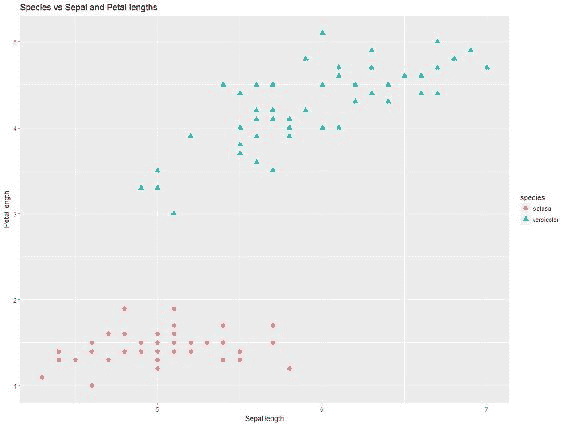

如图所示，两种物种位于平面的不同区域，因此可以进行线性分离。此时，我们需要定义函数来进行感知器处理：

```py
euclidean.norm = function(x) {sqrt(sum(x * x))}

distance.from.plane = function(z,w,b) {
 sum(z*w) + b
}

classify.linear = function(x,w,b) {
 distances = apply(x, 1, distance.from.plane, w, b)
 return(ifelse(distances < 0, -1, +1))
}

perceptron = function(x, y, learning.rate=1) {
 w = vector(length = ncol(x)) # initialize weights
 b = 0 # Initialize bias
 k = 0 # count updates
 R = max(apply(x, 1, euclidean.norm))
 mark.complete = TRUE 

 while (mark.complete) {
 mark.complete=FALSE 
 yc = classify.linear(x,w,b)
 for (i in 1:nrow(x)) {
 if (y[i] != yc[i]) {
 w = w + learning.rate * y[i]*x[i,]
 b = b + learning.rate * y[i]*R²
 k = k+1
 mark.complete=TRUE
 }
 }
 }
 s = euclidean.norm(w)
 return(list(w=w/s,b=b/s,updates=k))
}
```

我们定义了`perceptron`函数，如感知器训练算法中所讨论的那样。我们将`learning.rate`设置为`1`，并在每个循环中尝试更新权重。一旦输出和函数*(weights*inputs)*相等，我们就停止训练并退出。更新后的权重将由函数返回。该函数的目标是获得模型所需的最优权重集，如下所示：

```py
x = cbind(iris_sub$sepal, iris_sub$petal)

y = ifelse(iris_sub$species == "setosa", +1, -1)

p = perceptron(x,y)
```

在第一行中，我们将`x`输入设置为`萼片`和`花瓣`长度。`sepal.length`和`petal.length`构成输入矩阵。在第二行中，我们将标签输出设置为`setosa`为正，其余为负。输出是`setosa`或非`setosa`（`+1`或`-1`）。在第三行中，我们运行`perceptron`函数。

我们调用`perceptron`函数，传入`x`和`y`，它返回感知器的最优权重，如下所示的代码示例：

```py
plot(x,cex=0.2)

points(subset(x,Y==1),col="black",pch="+",cex=2)
points(subset(x,Y==-1),col="red",pch="*",cex=2)

intercept = - p$b / p$w[[2]]
slope = - p$w[[1]] /p$ w[[2]]

abline(intercept,slope,col="green")
```

之前的代码行绘制了`x`和`y`，并在图中将`setosa`和`versicolor`分别标记为`+`和`*`点。然后我们找到了`p`变量（感知器）的截距和斜率，并绘制了线性分离线，得到如下图表：

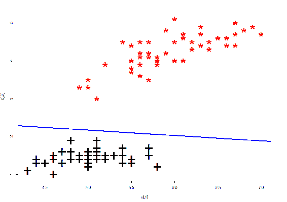

总结来说，我们使用 R 代码实现了感知器并找到了最优权重。通过感知器实现了线性分离。

# 多层感知器

我们看到，*AND*和*OR*门的输出是线性可分的，感知器可以用来建模这些数据。然而，并不是所有的函数都是可分的。实际上，能够分开的函数非常少，而且随着比特数的增加，它们在所有可实现函数中的比例趋近于零。正如我们预期的那样，如果我们考虑*XOR*门，线性分离是不可能的。交叉点和零点的位置不同，我们无法画一条线将它们分开，如下图所示：

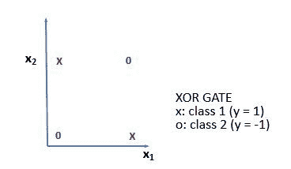

我们可以考虑解析更多的感知器。这样，得到的结构可以学习更多的函数，这些函数都属于线性可分函数的子集。

为了实现更广泛的功能，必须在输入层和输出层之间引入中间传输，允许对输入进行某种形式的内部表示。由此产生的感知器称为 MLP。

我们已经在第一章，*神经网络与人工智能概念*中看到过它作为前馈网络的应用。MLP 至少由三层节点组成：输入层、隐藏层和输出层。除输入节点外，每个节点都是使用非线性激活函数的神经元。MLP 使用监督学习技术和反向传播进行训练。多层结构和非线性特性将 MLP 与简单的感知器区分开来。MLP 特别用于数据不能线性分割的情况。

例如，下面图示中的 MLP 能够实现 **XOR** 函数，这一点我们之前已经看到，单一的感知器无法实现：

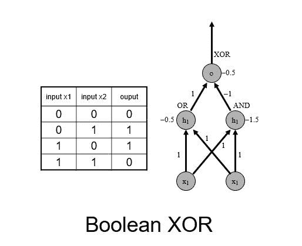

**XOR** 使用三层网络实现，它是 **OR** 和 **AND** 感知器的组合。输出层包含一个神经元，给出 **XOR** 输出。这种配置允许两个神经元分别专注于特定的逻辑功能。例如，在 **XOR** 的情况下，两个神经元可以分别执行 **AND** 和 **OR** 逻辑功能。

MLP 这个术语并不是指具有多层的单一感知器。相反，它包含多个感知器，这些感知器被组织成不同的层。另一种形式是 MLP 网络。

MLP 的应用包括：

+   MLP 对于研究中的复杂问题极为有用。

+   MLP 是通用的函数逼近器，可用于通过回归分析创建数学模型。MLP 也是很好的分类算法。

+   MLP 被广泛应用于语音识别、图像识别和语言翻译等领域，它们是深度学习的基础。

我们现在将使用 R 包 SNNS 来实现 MLP。

# 使用 RSNNS 实现的 MLP R 实现

该示例中的 `RSNNS` 包来自 CRAN，用于 `mlp()` 模型构建。SNNS 是一个用 C++ 编写的库，包含了许多标准的神经网络实现。这个 `RSNNS` 包封装了 SNNS 的功能，使其可以在 R 内部使用。通过 `RSNNS` 的低级接口，可以访问 SNNS 的所有算法功能和灵活性。该包还包含一个高级接口，用于最常用的神经网络拓扑和学习算法，能够与 R 无缝集成。以下表格展示了从官方文档中提取的 `RSNNS` 包的简要描述：

| **RSNNS 包** |
| --- |
| **描述**： |
| SNNS 是一个包含许多神经网络标准实现的库。此包封装了 SNNS 的功能，使其能够在 R 中使用。通过 `RSNNS` 低级接口，可以访问 SNNS 的所有算法功能和灵活性。此外，包还包含一个方便的高级接口，最常见的神经网络拓扑结构和学习算法能够无缝集成到 R 中。 |
| **详细信息**: |

| 包: `RSNNS` 类型: 包

版本: 0.4-9

日期: 2016-12-16

许可证: LGPL (>=2) |

| **作者**: |
| --- |
| *Christoph Bergmeir* *José M. Benítez* |
| **用法**: |

| `mlp(x, y,` `size = c(5),`

`maxit = 100,`

`initFunc = "随机初始化权重",`

`initFuncParams = c(-0.3, 0.3),`

`learnFunc = "标准反向传播",`

`learnFuncParams = c(0.2, 0),`

`updateFunc = "拓扑顺序",`

`updateFuncParams = c(0),`

`hiddenActFunc = "激活 _ 逻辑函数",`

`shufflePatterns = TRUE,`

`linOut = FALSE,`

`outputActFunc = if (linOut) "激活 _ 恒等函数" else "激活 _ 逻辑函数",`

`inputsTest = NULL,`

`targetsTest = NULL,`

`pruneFunc = NULL,`

`pruneFuncParams = NULL, ...)` |

我们使用 `mlp()` 函数来创建和训练 MLP。训练通常通过反向传播完成。

最常用的参数列在下表中：

| `x` | 用于网络的训练输入矩阵 |
| --- | --- |
| `y` | 对应的目标值 |
| `size` | 隐藏层中单元的数量 |
| `maxit` | 学习的最大迭代次数 |
| `hiddenActFunc` | 所有隐藏单元的激活函数 |
| `outputActFunc` | 所有输出单元的激活函数 |
| `inputsTest` | 用于测试网络的输入矩阵 |
| `targetsTest` | 测试输入对应的目标值 |

让我们来看一下使用完整的 Iris 数据集构建 SNNS MLP 的代码：

```py
###################################################################
###Chapter 4 - Introduction to Neural Networks - using R ##########
###Simple RSNNS implementation function in R - iris dataset #######
###################################################################

data(iris)

library("RSNNS")

iris = iris[sample(1:nrow(iris),length(1:nrow(iris))),1:ncol(iris)]

irisValues = iris[,1:4]
irisTargets = decodeClassLabels(iris[,5])

iris = splitForTrainingAndTest(irisValues, irisTargets, ratio=0.15)
iris = normTrainingAndTestSet(iris)

model = mlp(iris$inputsTrain, 
 iris$targetsTrain, 
 size=5, 
 learnFuncParams=c(0.1),
 maxit=50, 
 inputsTest=iris$inputsTest, 
 targetsTest=iris$targetsTest)

summary(model)
weightMatrix(model)

par(mfrow=c(2,2))
plotIterativeError(model)

predictions = predict(model,iris$inputsTest)

plotRegressionError(predictions[,2], iris$targetsTest[,2])

confusionMatrix(iris$targetsTrain,fitted.values(model))
confusionMatrix(iris$targetsTest,predictions)

par(mfrow=c(1,2))
plotROC(fitted.values(model)[,2], iris$targetsTrain[,2])
plotROC(predictions[,2], iris$targetsTest[,2])

confusionMatrix(iris$targetsTrain, 
 encodeClassLabels(fitted.values(model),
 method="402040", 
 l=0.4, 
 h=0.6)) ###################################################################
```

让我们一步步分析代码。

此命令加载包含在 datasets 库中的 iris 数据集，并将其保存在给定的数据框中。考虑到我们已经多次使用它，我认为不需要再做什么。此命令加载 `RSNNS` 库以供程序使用：

```py

 install.packages("RSNNS") 
 library("RSNNS")
```

记住，要安装 R 初始分发中没有的库，你必须使用 `install.package` 函数。这是安装包的主要函数。它接收一个名称向量和目标库，从仓库中下载包并安装它们。

在我们的例子中，我们必须使用命令 `install.packages("RSNNS")`。只需第一次使用安装包，将 `RSNNS` 包从 CRAN 安装。

```py
iris = iris[sample(1:nrow(iris),length(1:nrow(iris))),1:ncol(iris)]
```

在前面的这一行中，`iris` 数据集在行内进行了洗牌。此操作使得数据集中的行顺序变得随机。事实上，在原始数据集中，观察值是按照花卉种类排序的：首先是*50*个 `setosa` 物种的出现次数，其次是*50*个 `versicolor` 物种的出现次数，最后是*50*个 `virginica` 物种的出现次数。经过这一操作后，行的位置变得随机。为了验证这一点，我们打印修改后的数据集的前`20`行：

```py
> head(iris, n=20)
 Sepal.Length Sepal.Width Petal.Length Petal.Width    Species
75           6.4         2.9          4.3         1.3 versicolor
112          6.4         2.7          5.3         1.9  virginica
54           5.5         2.3          4.0         1.3 versicolor
36           5.0         3.2          1.2         0.2     setosa
14           4.3         3.0          1.1         0.1     setosa
115          5.8         2.8          5.1         2.4  virginica
125          6.7         3.3          5.7         2.1  virginica
27           5.0         3.4          1.6         0.4     setosa
8            5.0         3.4          1.5         0.2     setosa
41           5.0         3.5          1.3         0.3     setosa
85           5.4         3.0          4.5         1.5 versicolor
64           6.1         2.9          4.7         1.4 versicolor
108          7.3         2.9          6.3         1.8  virginica
65           5.6         2.9          3.6         1.3 versicolor
66           6.7         3.1          4.4         1.4 versicolor
98           6.2         2.9          4.3         1.3 versicolor
39           4.4         3.0          1.3         0.2     setosa
84           6.0         2.7          5.1         1.6 versicolor
2            4.9         3.0          1.4         0.2     setosa
142          6.9         3.1          5.1         2.3  virginica
```

第一列中的数字是原始数据集的行号。我们可以注意到洗牌操作是完美地完成的。为了与原始顺序进行比较，请参见前面的示例：

```py
irisValues = iris[,1:4]
irisTargets = decodeClassLabels(iris[,5])
```

自变量和目标变量被设置并分别分配给 `irisValues` 和 `irisTargets`：

```py
iris = splitForTrainingAndTest(irisValues, irisTargets, ratio=0.15)
iris = normTrainingAndTestSet(iris)
```

在第一行中，训练数据和测试数据通过 `splitForTrainingAndTest()` 函数进行拆分。此函数将输入值和目标值分配到训练集和测试集。测试集是从数据的末尾提取的。如果数据需要洗牌，应该在调用该函数之前完成此操作。具体来说，数据的拆分如下：*85* 百分比用于训练，*15* 百分比用于测试。在第二行中，数据被标准化。为此，使用了 `normTrainingAndTestSet()` 函数。该函数以如下方式对训练集和测试集进行标准化：使用 `normalizeData` 函数对 `inputsTrain` 成员进行标准化，并使用类型中给定的参数。标准化过程中获得的标准化参数随后用于标准化 `inputsTest` 成员。如果未设置 `dontNormTargets` 参数，则目标值也将以相同的方式进行标准化：

```py
model = mlp(iris$inputsTrain, 
 iris$targetsTrain, 
 size=5, 
 learnFuncParams=c(0.1),
 maxit=50, 
 inputsTest=iris$inputsTest, 
 targetsTest=iris$targetsTest)
```

`mlp()` 函数与训练数据集一起调用，以构建模型。此函数创建一个 MLP 并对其进行训练。MLP 是完全连接的前馈神经网络，可能是当前使用最广泛的网络架构。训练通常通过误差反向传播或相关程序进行。测试数据集也被传递以提供测试结果：

```py
summary(model)
weightMatrix(model)
```

这些代码行使我们能够从新创建的模型中提取有用信息。`summary()` 函数打印出网络的摘要信息。打印的信息可以是网络的所有信息，采用原始 SNNS 文件格式，也可以是由 `extractNetInfo` 提供的信息。这一行为由参数 `origSnnsFormat` 控制，而 `weightMatrix()` 函数则提取 `rsnns` 对象的权重矩阵。下图显示了摘要结果的截图：

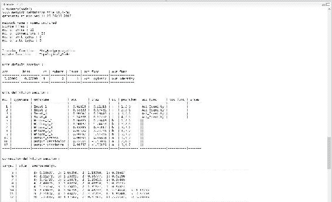

现在我们来衡量算法在模型训练中的表现：

```py
plotIterativeError(model)
```

`plotIterativeError()` 函数绘制了模型网络的迭代训练和测试误差。结果显示在下图中：

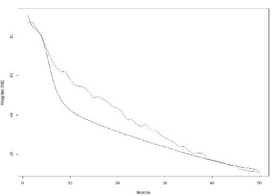

上图显示了迭代拟合误差作为黑线，迭代测试误差作为红线。从图中可以看出，两条线都有明显的下降趋势，证明算法迅速收敛。

在正确训练好模型之后，是时候用它来进行预测了：

```py
predictions = predict(model,iris$inputsTest)
```

在这个案例中，我们使用了`predict()`函数。这是一个通用的预测函数，适用于从各种模型拟合函数的结果中进行预测。该函数调用特定的方法，这些方法取决于第一个参数的类。我们既有预测值也有实际数据，我们只需要通过回归误差计算将它们进行比较：

```py
plotRegressionError(predictions[,2], iris$targetsTest[,2])
```

为了绘制回归误差，我们使用了`plotRegressionError()`函数。该函数在`X`轴上显示目标值，在`Y`轴上显示拟合/预测值。最佳拟合应该是通过零点的直线，且斜率为一。这条最佳线在下图中以黑色表示。对实际数据的线性拟合则用红色显示。下图展示了我们之前训练的模型的回归误差：

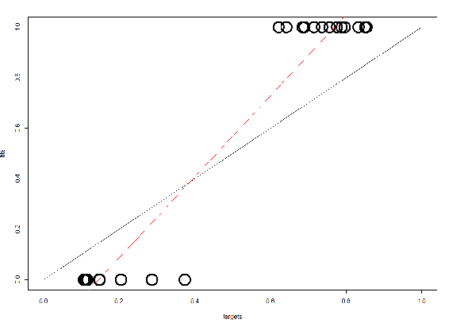

现在，让我们通过计算混淆矩阵来评估模型在预测数据方面的表现：

```py
confusionMatrix(iris$targetsTrain,fitted.values(model))
confusionMatrix(iris$targetsTest,predictions)
```

为了计算混淆矩阵，我们使用了`confusionMatrix()`函数。

记住，混淆矩阵显示了一个真实类别`x`的模式被分类为类别`y`的次数。完美的方法应该得到一个对角线矩阵。所有不在对角线上的值都是该方法的错误。

在代码的第一行，我们计算了用于训练的数据的混淆矩阵（这些数据占*85*百分比），而在第二行，我们计算了用于测试的数据的混淆矩阵（这些数据占剩余的*15*百分比）。结果如下：

```py
> confusionMatrix(iris$targetsTrain,fitted.values(model))
 predictions
targets  1  2  3
 1 45  0  0
 2  0 34  3
 3  0  1 44
> confusionMatrix(iris$targetsTest,predictions)
 predictions
targets  1  2  3
 1  5  0  0
 2  0 13  0
 3  0  0  5
```

如图所示，在训练阶段有四个错误，只涉及`versicolor`和`virginica`两个物种。记住，我们在第三章中展示的示例中得到了相同的结果，*使用多层神经网络的深度学习*。然而，在测试中，我们没有犯任何错误。我会说这是非常好的结果，尽管处理的数据实际上较少。我们以图形方式评估这些结果：

```py
par(mfrow=c(1,2))
plotROC(fitted.values(model)[,2], iris$targetsTrain[,2])
plotROC(predictions[,2], iris$targetsTest[,2])
```

为了评估网络性能，我们绘制了接收者操作特征曲线。前面的命令绘制了两个阶段（训练和测试）的 ROC 曲线。

ROC 是一种用于检查分类器质量的度量标准。对于每个分类器的类别，ROC 会对输出应用 *[0,1]* 区间内的阈值。ROC 曲线是 TPR 与 FPR 之间的关系图，随着阈值的变化。完美的测试将在左上角显示点，具有 *100* 百分比的灵敏度和 *100* 百分比的特异性。线条越接近左上角，网络性能就越好。下图显示了两个阶段的 ROC 曲线（训练阶段在左，测试阶段在右）：

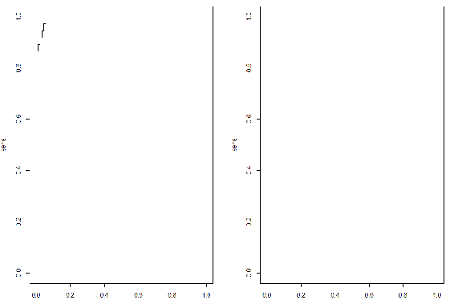

如前所述，在训练阶段出现了错误，但在测试阶段则没有。

请注意，我们使用了 `par()` 函数在一个窗口中显示这两个图表。在其中，我们设置了将图形以矩阵形式显示，行数为 1，列数为 2。

`RSNNS` 中没有 `plot` 函数，因此我们使用来自 GitHub 的 `plot` 函数来绘制我们刚刚构建的神经网络的 MLP。这里有三个输出类别和四个输入节点：

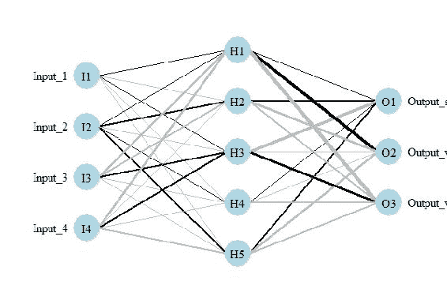

我们已经看到使用 `RSNNS` 对 `iris` 数据集神经网络的简单实现。同样的 `mlp()` 函数可以用于任何 MLP 神经网络架构。

# 总结

在这一章中，我们介绍了感知机的概念，它是神经网络的基本构建块。我们还看到了多层感知机以及使用 `RSNNS` 的实现。简单的感知机仅对线性分离问题有效，对于输出数据不线性可分的情况则无法使用。这些局限性通过使用 MLP 算法得到了克服。

我们理解了感知机的基本概念及其在神经网络算法中的应用。我们发现了线性可分的分类器及其适用的函数。我们学习了在 R 环境中实现简单感知机的函数，并且接着学习了如何训练和建模 MLP。

在下一章中，我们将理解如何使用神经网络模型来训练、测试和评估数据集。我们将学习如何在 R 环境中可视化神经网络模型。我们将涵盖诸如早停法、避免过拟合、神经网络的泛化和神经网络参数的缩放等概念。
