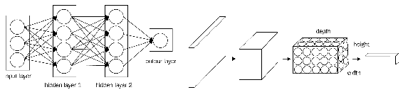
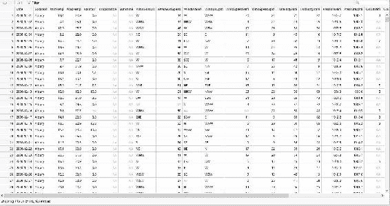

# 第六章：循环神经网络与卷积神经网络

到目前为止，我们一直在研究前馈网络，其中数据单向流动，每一层中的节点没有相互连接。面对与某些问题交互的基本假设，前馈网络固有的单向结构显得尤为局限。然而，我们可以从前馈网络出发，构建结果计算会影响到其他计算过程的网络。显然，管理这些网络动态的算法必须满足新的收敛标准。

在本章中，我们将介绍**循环神经网络**（**RNN**），它是具有循环数据流的网络。我们还将介绍**卷积神经网络**（**CNN**），这是一种主要用于图像识别的标准化神经网络。对于这两种类型的网络，我们将在 R 中做一些示例实现。以下是本章涵盖的主题：

+   RNN

+   `rnn` 包

+   **长短期记忆**（**LSTM**）模型

+   CNN

+   常见的 CNN 架构——**LeNet**

本章结束时，我们将理解如何训练、测试和评估一个 RNN。我们将学习如何在 R 环境中可视化 RNN 模型。我们还将能够训练一个 LSTM 模型。我们将涵盖 CNN 的概念和常见的 CNN 架构——LeNet。

# 循环神经网络

在**人工神经网络**（**ANN**）的范畴内，基于隐藏层数量和数据流的不同，有几种变体。其中一种变体是 RNN，其中神经元之间的连接可以形成一个循环。与前馈网络不同，RNN 可以利用内部记忆进行处理。RNN 是一类具有隐藏层连接并且这些连接通过时间传播以学习序列的 ANN。RNN 的应用场景包括以下领域：

+   股票市场预测

+   图像标注

+   天气预报

+   基于时间序列的预测

+   语言翻译

+   语音识别

+   手写识别

+   音频或视频处理

+   机器人动作序列

到目前为止，我们研究的网络（前馈网络）基于输入数据，这些数据被输入到网络中并转换为输出。如果是监督学习算法，输出是一个标签，用来识别输入数据。基本上，这些算法通过识别模式将原始数据与特定类别连接起来。

循环网络则不同，它们不仅接受当前输入数据，还会结合它们随着时间积累的经验进行处理。

循环网络在特定时刻做出的决策会影响它随后的决策。因此，循环网络有两个输入源——现在和最近的过去——它们结合起来决定如何响应新数据，就像人们每天生活中一样。

循环网络与前馈网络的区别在于，它们通过反馈环路与过去的决策相联系，因此会暂时将其输出作为输入。这个特性可以通过说循环网络具有记忆来加以强调。向神经网络添加记忆是有目的的：序列本身包含信息，而循环网络利用这些信息完成前馈网络无法完成的任务。

RNN 是一类神经网络，其中神经元之间的连接形成一个有向循环。一个典型的 RNN 如下图所示：


在这里，一个实例的输出作为下一个实例的输入，应用于同一个神经元。数据如何在不同时间点保持在记忆中并流动，使得 RNN 强大而成功。

在 RNN 中，数据向后流动的方式有更多变种：

+   完全循环

+   递归

+   霍普菲尔德（Hopfield）

+   埃尔曼（Elman）和乔丹（Jordan）网络

+   神经历史压缩器

+   长短期记忆（LSTM）

+   **门控循环单元（GRU）**

+   双向

+   循环多层感知机（Recurrent MLP）

循环网络旨在识别作为数据序列的模式，对预测和预测任务非常有帮助。它们可以应用于文本、图像、语音和时间序列数据。RNN 是强大的人工神经网络（ANN）之一，代表了生物大脑，包括具有处理能力的记忆。循环网络从当前输入（像前馈网络一样）和先前计算的输出中获取输入：


为了更好地理解这一点，我们将 RNN 看作是一个神经网络的网络，其循环特性以以下方式**展开**。神经元*h*的状态会在不同的时间段（*t-1*、*t*、*t+1*等）被考虑，直到收敛或达到总的训练轮数。

Vanilla 是最早提出的循环 ANN 模型。一个 vanilla RNN 如下图所示：


由于实现的简便性，其他变种如 GRU 或 LSTM 网络更为广泛，并且它们在语言建模、语音识别、图像字幕生成和自动翻译等涉及序列的广泛应用中表现出色。

RNN 可以通过以下包在 R 中实现：

+   `rnn`

+   `MxNetR`

+   `TensorFlow` for R

循环神经网络（RNN）主要用于序列建模。输入和输出被视为向量（数字矩阵）。为了更深入理解 RNN，我建议你学习 Andrej Karpathy 的字符序列示例。

RNN 的特点使其像一个带记忆的 ANN。ANN 的记忆更像是人类的大脑。有了记忆，我们可以让机器从零开始思考并从它们的“记忆”中学习。RNN 基本上是带有循环的 ANN，这些循环允许信息在网络中保持。循环允许信息从状态 t 传递到状态*t+1*。

如前图所示，RNN 可以被看作是相同 ANN 的多个副本，其中一个的输出作为输入传递给下一个。当我们保存信息时，随着模式的变化，RNN 能够预测*t+1*的值。这对于分析基于时间序列的问题尤其有用。

无需特别标注；输入的一部分值形成时间序列变量，RNN 能够学习模式并进行预测。

RNN 的内部状态在每个学习过程的时间步长中更新。RNN 中的前馈机制类似于 ANN；然而，反向传播则是通过所谓的**时间反向传播**（**BPTT**）进行误差项修正。

时间反向传播遵循以下伪代码：

1.  展开 RNN 以包含*n*个前馈网络。

1.  将权重*w*初始化为随机值。

1.  执行以下操作，直到满足停止条件或完成所需的训练周期数。

1.  将输入设置为每个网络的值，作为*x[i.]* 

1.  将输入在整个展开的网络上进行前向传播。

1.  将误差反向传播到展开的网络中。

1.  更新网络中的所有权重。

1.  将权重平均化，以找到折叠网络中的最终权重。

# R 中的 rnn 包

在 R 环境中实现 RNN，我们可以使用通过 CRAN 提供的`rnn`包。该包广泛用于实现 RNN。以下表格展示了从官方文档中提取的`rnn`包的简要描述：

| **rnn**：递归神经网络 |
| --- |
| **描述**： |
| R 中实现 RNN |
| **详细信息**： |

| 包：`rnn` 类型：包

版本：0.8.0

日期：2016-09-11

许可证：GPL-3 |

| **作者**： |
| --- |
| Bastiaan Quast Dimitri Fichou |

从`rnn`包中使用的主要函数显示在下表中：

| `predict_rnn` | 预测 RNN 模型的输出：`predict_rnn(model, X, hidden = FALSE, real_output = T, ...)` |
| --- | --- |
| `run.rnn_demo` | 启动`rnn_demo`应用程序的函数：`run.rnn_demo(port = NULL)` |
| `trainr` | 训练 RNN 的函数。该模型由`predictr`函数使用。 |
| `predictr` | 预测 RNN 模型的输出：`predictr(model, X, hidden = FALSE, real_output = T, ...)` |

和往常一样，要使用一个库，必须先安装并将其加载到我们的脚本中。

请记住，要安装在 R 初始分发中不存在的库，必须使用`install.package`函数。这是安装包的主要功能。它接受一个名称向量和一个目标库，从仓库下载包并进行安装。此函数应只使用一次，而不是每次运行代码时都使用。

所以我们来安装并加载库：

```py
install.packages("rnn")
library("rnn")
```

当我们加载库（`library("rnn")`）时，可能会收到以下错误：

```py
> library("rnn")
Error: package or namespace load failed for ‘rnn’ in get(Info[i, 1], envir = env):
 cannot open file 'C:/Users/Giuseppe/Documents/R/win-library/3.4/digest/R/digest.rdb': No such file or directory
```

别担心，这没什么大不了的！R 只是告诉你，为了运行 `rnn` 库，你还需要安装 `digest` 库。记住这一点；以后如果出现类似问题，你就知道怎么解决了。只需添加以下命令：

```py
install.packages("digest")
```

现在我们可以启动演示：

```py
run.rnn_demo()
```

当我们安装了 `rnn` 包并运行 `run.rnn_demo()` 后，可以通过 `127.0.0.1:5876` 访问一个网页，网页上可以运行一个具有预设值的 RNN 演示，同时可以直观地看到参数如何影响 RNN，如下图所示：


到此为止，我们可以设置网络的参数，并通过标签选择合适的值填入框中。以下参数必须正确设置：

+   `time dimension`

+   `training sample dimension`

+   `testing sample dimension`

+   `number of hidden layers`

+   `层数 1 中的单元数`

+   `层数 2 中的单元数`

+   `learningrate`

+   `batchsize`

+   `numepochs`

+   `momentum`

+   `learningrate_decay`

做完这些后，我们只需点击训练按钮，命令就会被构建并进行训练。

下图展示了模拟的结果：


`trainr` 和 `predictr` 函数是 `rnn` 包中最重要的函数。`trainr()` 函数使用 `X` 和 `Y` 参数集来训练模型，训练后的模型可以通过 `predictr()` 函数进行预测：

```py
trainr(Y, X, 
 learningrate, 
 learningrate_decay = 1, 
 momentum = 0, 
 hidden_dim = c(10), 
 network_type = "rnn", 
 numepochs = 1, 
 sigmoid = c("logistic", "Gompertz", "tanh"), 
 use_bias = F, 
 batch_size = 1, 
 seq_to_seq_unsync = F, 
 update_rule = "sgd", 
 epoch_function = c(epoch_print, epoch_annealing), 
 loss_function = loss_L1, ...) 

predictr(model, 
 X, 
 hidden = FALSE, 
 real_output = T, 
 arguments to pass to sigmoid function)
```

`trainr()` 函数接受以下参数。输出为一个可以用于预测的模型：

| `Y` | 输出值数组：

+   `dim 1`：样本（必须等于 `X` 的 dim 1）

+   `dim 2`：时间（必须等于 `X` 的 dim 2）

+   `dim 3`：变量（可以是一个或多个，如果是矩阵，将被强制转换为数组）

|

| `X` | 输入值数组：

+   `dim 1`：样本

+   `dim 2`：时间

+   `dim 3`：变量（可以是一个或多个；如果是矩阵，将被强制转换为数组）

|

| `learningrate` | 应用于权重迭代的学习率。 |
| --- | --- |
| `learningrate_decay` | 通过 `epoch_annealing` 函数在每个 epoch 应用到学习率的系数。 |
| `momentum` | 用于加速学习的最后一次权重迭代的系数。 |
| `hidden_dim` | 隐藏层的维度。 |
| `network_type` | 网络类型，可以是 `rnn`、`gru` 或 `lstm`。 |
| `numepochs` | 迭代次数，即整个数据集被网络呈现的次数 |
| `sigmoid` | 传递给 `sigmoid` 函数的方法。 |
| `batch size` | 每次权重迭代使用的样本数量。当前仅支持一个。 |
| `epoch_function` | 在每个 epoch 循环中应用的函数向量。用它与模型中的对象进行交互，或者在每个 epoch 打印和绘图。它应该返回模型。 |
| `loss function` | 应用于每个样本循环，词汇表用于验证。 |
| `...` | 传递给方法的参数，用于用户定义的函数中。 |

现在让我们看一个简单的例子。这个例子包含在 CRAN `rnn`包的官方文档中，用于演示`trainr`和`predictr`函数，并查看预测的准确性。

我们有`X1`和`X`，其中的随机数在*0-127*范围内。`Y`被初始化为`X1+X2`。在将`X1`、`X2`和`Y`转换为二进制值后，我们使用`trainr`根据`X`（由`X1`和`X2`组成的数组）训练`Y`。

使用模型，我们根据另一组`A1+A2`样本预测`B`。错误的差异绘制为直方图：

```py
library("rnn")

#Create a set of random numbers in X1 and X2
X1=sample(0:127, 7000, replace=TRUE)
X2=sample(0:127, 7000, replace=TRUE)

#Create training response numbers
Y=X1 + X2

# Convert to binary
X1=int2bin(X1)
X2=int2bin(X2)
Y=int2bin(Y)

# Create 3d array: dim 1: samples; dim 2: time; dim 3: variables.
X=array( c(X1,X2), dim=c(dim(X1),2) )

# Train the model
model <- trainr(Y=Y[,dim(Y)[2]:1],
 X=X[,dim(X)[2]:1,],
 learningrate = 0.1,
 hidden_dim = 10,
 batch_size = 100,
 numepochs = 100)

plot(colMeans(model$error),type='l',xlab='epoch',ylab='errors')

# Create test inputs
A1=int2bin(sample(0:127, 7000, replace=TRUE))
A2=int2bin(sample(0:127, 7000, replace=TRUE))

# Create 3d array: dim 1: samples; dim 2: time; dim 3: variables
A=array( c(A1,A2), dim=c(dim(A1),2) )

# Now, let us run prediction for new A
B=predictr(model,
 A[,dim(A)[2]:1,] )
B=B[,dim(B)[2]:1]

# Convert back to integers
A1=bin2int(A1)
A2=bin2int(A2)
B=bin2int(B)

# Plot the differences as histogram
hist( B-(A1+A2) )
```

像往常一样，我们将逐行分析代码，详细解释应用于捕获结果的所有特性：

```py
library("rnn")
```

初始代码的第一行用于加载运行分析所需的库。接下来我们来看以下命令：

```py
X1=sample(0:127, 7000, replace=TRUE)
X2=sample(0:127, 7000, replace=TRUE)
```

这些行创建训练响应数字；这两个向量将成为我们即将构建的网络的输入。我们使用了`sample()`函数，从`x`的元素中按指定大小取样，既可以有放回也可以没有放回。两个向量包含 7,000 个在`1`和`127`之间的随机整数值。

```py
Y = X1 + X2
```

该命令创建训练响应数字；这是我们的目标，或者说是我们希望通过网络来预测的内容。

```py
X1=int2bin(X1)
X2=int2bin(X2)
Y=int2bin(Y)
```

这三行代码将整数转换为二进制序列。我们需要在逐位相加之前将数字转换为二进制。最终，每个值会得到一个由八个值组成的序列，这些值为`0`或`1`。为了理解这个转换，我们分析这些变量之一的预览：

```py
> head(X1,n=10)
 [,1] [,2] [,3] [,4] [,5] [,6] [,7] [,8]
 [1,]    1    1    1    0    0    1    0    0
 [2,]    0    0    0    1    0    0    0    0
 [3,]    1    0    0    0    1    0    1    0
 [4,]    0    0    0    0    0    0    1    0
 [5,]    0    1    0    0    0    0    0    0
 [6,]    0    0    0    1    1    1    0    0
 [7,]    1    0    1    1    0    1    1    0
 [8,]    1    1    0    0    0    1    0    0
 [9,]    1    0    1    0    0    0    0    0
[10,]    0    0    0    1    0    0    0    0
```

让我们回过头来分析代码：

```py
X=array( c(X1,X2), dim=c(dim(X1),2) )
```

这段代码创建了一个 3D 数组，这是`trainr()`函数所要求的。在这个数组中，我们有以下内容：

+   `dim 1`：样本（必须等于输入的`dim 1`）

+   `dim 2`：时间（必须等于输入的`dim 2`）

+   `dim 3`：变量（可以是一个或多个；如果是矩阵，将被强制转换为数组）

```py
model <- trainr(Y=Y[,dim(Y)[2]:1],
 X=X[,dim(X)[2]:1,],
 learningrate = 0.1,
 hidden_dim = 10,
 batch_size = 100,
 numepochs = 100)
```

`trainr()`函数在本地 R 中训练 RNN。由于训练是基于`X`和`Y`进行的，所以需要几分钟时间。以下代码展示了在 R 提示符上显示的最后 10 次训练周期结果：

```py
Trained epoch: 90 - Learning rate: 0.1
Epoch error: 3.42915263914405
Trained epoch: 91 - Learning rate: 0.1
Epoch error: 3.44100549476955
Trained epoch: 92 - Learning rate: 0.1
Epoch error: 3.43627697030863
Trained epoch: 93 - Learning rate: 0.1
Epoch error: 3.43541472188254
Trained epoch: 94 - Learning rate: 0.1
Epoch error: 3.43753094787383
Trained epoch: 95 - Learning rate: 0.1
Epoch error: 3.43622412149714
Trained epoch: 96 - Learning rate: 0.1
Epoch error: 3.43604894997742
Trained epoch: 97 - Learning rate: 0.1
Epoch error: 3.4407798878595
Trained epoch: 98 - Learning rate: 0.1
Epoch error: 3.4472752590403
Trained epoch: 99 - Learning rate: 0.1
Epoch error: 3.43720125450988
Trained epoch: 100 - Learning rate: 0.1
Epoch error: 3.43542353819336
```

我们可以通过绘制算法在后续周期中的错误来查看算法的演变：

```py
plot(colMeans(model$error),type='l',xlab='epoch',ylab='errors')
```

该图显示了周期与错误之间的关系：


现在模型已经准备好，我们可以使用它来测试网络。但首先，我们需要创建一些测试数据：

```py
A1=int2bin(sample(0:127, 7000, replace=TRUE))
A2=int2bin(sample(0:127, 7000, replace=TRUE))
A=array( c(A1,A2), dim=c(dim(A1),2) )
```

现在，让我们运行对新数据的预测：

```py
B=predictr(model, A[,dim(A)[2]:1,] ) 
B=B[,dim(B)[2]:1]
```

转换回整数：

```py
A1=bin2int(A1)
A2=bin2int(A2)
B=bin2int(B)
```

最后，将差异绘制为直方图：

```py
hist( B-(A1+A2) )
```

错误的直方图如下所示：


如图所示，频率较高的区间靠近零，表明在大多数情况下，预测值与当前值一致。所有其他区间与误差相关。因此，我们可以说网络以良好的性能模拟了系统。

# LSTM 模型

我们已经看到，RNN 具有一种记忆，利用持续的先前信息来处理当前神经网络的计算任务。之前的信息会在当前任务中被使用。然而，这种记忆是短期的，神经节点无法访问所有的历史信息。

当我们在 RNN 中引入长期记忆时，就能记住大量的历史信息并在当前处理时使用。这一概念被称为 LSTM 模型，它在视频、音频、文本预测及其他各种应用中有着广泛的使用场景。

LSTM 由 Hochreiter 和 Schmidhuber 于 1997 年提出。

LSTM 网络使用**BPTT**进行训练，并减轻了消失梯度问题。LSTM 在时间序列预测中有强大的应用，并能够创建大型递归网络来解决机器学习中的复杂序列问题。

LSTM 具有**门**，使得长短期记忆成为可能。这些门包含在通过层连接的记忆块中：


单元内有三种类型的门：

+   **输入门**：将输入缩放到单元（写入）

+   **输出门**：将输出缩放到单元（读取）

+   **遗忘门**：将旧的单元值缩放（重置）

每个门就像一个开关，控制读/写，从而将长期记忆功能整合到 LSTM 模型中。

LSTM 可以用于解决以下序列预测问题：

+   直接序列预测

+   序列分类

+   序列生成

+   序列到序列的预测

GRU 和 LSTM 之间的关键区别是：

+   GRU 有两个门，而 LSTM 有三个门。

+   GRU 没有任何不同于暴露的隐藏状态的内部记忆。它们没有 LSTM 中存在的输出门。

+   在计算 GRU 的输出时没有应用第二个非线性操作。

# 卷积神经网络

深度学习中另一个重要的神经网络是 CNN。它们专门用于图像识别和分类。CNN 有多个神经网络层，能够从图像中提取信息并判断其属于哪个类别。

例如，如果 CNN 经过一组猫的图像训练，它就能检测图像中是否为猫。在这一部分，我们将了解 CNN 的架构和工作原理。

对于一个程序，任何图像都只是以向量格式表示的一组 RGB 数字。如果我们能够让神经网络理解这个模式，它就能形成 CNN 并检测图像。

普通神经网络是通用的数学近似器，它接受输入，通过一系列函数进行转换，并得出输出。然而，这些普通神经网络对于图像分析的扩展性不好。对于一个 32 x 32 像素的 RGB 图像，隐藏层需要*32*32*3=3072*个权重。对于这种情况，普通神经网络运行良好。然而，当 RGB 图像扩展到*200 x 200*像素时，隐藏层所需的权重数是*200*200*3=120,000*，此时网络表现不佳。

输入 CNN 以解决这个可扩展性问题。在 CNN 中，CNN 的各层神经元在三维中排列（**高度**，**宽度**和**深度**）。

下图显示了神经网络和卷积神经网络（CNN）：



卷积神经网络（CNN）是由神经网络层组成的序列，其中每一层通过可微分函数将一个激活值的体积转换为另一个激活值。CNN 包含三种类型的层：

+   卷积层

+   池化层

+   完全连接层

# 第#1 步 – 滤波

卷积层执行繁重的数学运算。在计算机视觉中，处理图像的典型方法是用滤波器进行卷积，只提取其中的显著特征。这是 CNN 中的第一步操作。输入图像应用滤波器逻辑，创建**激活图**或**特征图**：


卷积特征向量是通过将卷积核向量应用到图像的每个 3 x 3 向量上创建的。

滤波的数学步骤如下：

1.  将特征与图像补丁对齐。

1.  将每个图像像素与相应的特征像素相乘。

1.  将它们加起来。

1.  将每个求和结果除以特征中像素的总数。

滤波完成后，下一步是压缩已滤波的像素。

# 第#2 步 – 池化

在这一步，我们缩小图像堆栈。对于卷积步骤中获得的每个特征，我们建立一个矩阵，并在每个选择的矩阵中找到最大值，从而缩小整个输入。步骤如下：

1.  选择一个窗口大小（通常为 2 或 3）。

1.  选择一个步幅移动像素范围（通常为 2）。

1.  在已滤波的图像上滑动窗口。

1.  对于每个窗口，我们取最大值。

如果滑动窗口没有与之前的窗口相同数量的单元，我们取所有可用的值。

# 第#3 步 – ReLU 归一化

在这一步，我们采用池化输出，并对每个像素应用 ReLU 归一化以调整值。如果任何值为负数，我们将其设为零。

# 第#4 步 – 在完全连接层进行投票和分类

最后一层是完全连接层，通过一组值进行投票，确定输出的类别。完全连接层只是所有先前输出的合并矩阵。

这是最后一层，输出根据最高票选类别确定。

通过将第 1、2、3 步中的层叠加，我们形成了卷积网络，利用反向传播减少误差项，从而为我们提供最佳预测。

层次可以重复多次，每个层的输出会作为下一个层的输入。

经典的 CNN 架构将如下所示：


以下图例展示了使用 CNN 进行分类预测的示例：


我们将在第七章中看到使用 R 实现 CNN 的案例，*神经网络的应用案例 - 高级话题*。

# 常见的 CNN 架构 - LeNet

LeNet-5 是 Le Cun 在 1990 年代为手写和机器印刷字符识别设计的卷积网络。

这是卷积网络的第一次成功应用。它具有以下架构：


# 使用 RNN 进行湿度预测

作为 RNN 的第一个应用案例，我们将看到如何使用`trainr()`函数训练并预测 RNN*.*我们的目标是预测某一地点的湿度与日期的关系。输入文件包含来自多个澳大利亚气象站的每日气象观测数据。这些观测数据来自澳大利亚联邦气象局，并经过处理后创建了一个相对较大的样本数据集，用于展示使用 R 和 rattle.data 包进行分析、数据挖掘和数据科学。`weatherAUS`数据集会定期更新，该数据包的更新通常对应于此数据集的更新。数据来自气象局官网。`locationsAUS`数据集记录了每个气象站的地点。源数据集由澳大利亚联邦气象局拥有版权，并经许可使用。

此数据集的 CSV 版本可通过以下链接获得：

[`rattle.togaware.com/weatherAUS.csv`](https://rattle.togaware.com/weatherAUS.csv)

`weatherAUS`数据集是一个数据框，包含来自 45 个以上澳大利亚气象站的超过 14 万个每日观测数据。该数据集包含以下变量：

+   `Date`：观测日期（`Date`对象）。

+   `Location`：气象站地点的常用名称。

+   `MinTemp`：摄氏度下的最低温度。

+   `MaxTemp`：摄氏度下的最高温度。

+   `Rainfall`：当天记录的降水量（mm）。

+   `Evaporation`：到上午 9 点的 24 小时内的蒸发量（mm）。

+   `Sunshine`：白天的明媚阳光时数。

+   `WindGustDir`：午夜前 24 小时内最强风速的方向。

+   `WindGustSpeed`：午夜前 24 小时内最强风速的速度（km/h）。

+   `Temp9am`：上午 9 点的温度（摄氏度）。

+   `RelHumid9am`：上午 9 点的相对湿度（百分比）。

+   `Cloud9am`：上午 9 点时，云层遮挡的天空比例。这个比例是以 oktas 为单位的，oktase 是以八分之一为单位的度量。它记录了有多少八分之一的天空被云层遮挡。0 表示完全晴朗的天空，而 8 则表示完全阴天。

+   `WindSpeed9am`：上午 9 点前 10 分钟的平均风速（公里/小时）。

+   `Pressure9am`：上午 9 点的气压（hpa），经过海平面标准化。

+   `Temp3pm`：下午 3 点的温度（摄氏度）。

+   `RelHumid3pm`：下午 3 点的相对湿度（百分比）。

+   `Cloud3pm`：下午 3 点时，云层遮挡的天空比例（以 oktas 为单位：八分之一）。

+   `WindSpeed3pm`：下午 3 点前 10 分钟的平均风速（公里/小时）。

+   `Pressure3pm`：下午 3 点的气压（hpa），经过海平面标准化。

+   `ChangeTemp`：温度变化。

+   `ChangeTempDir`：温度变化的方向。

+   `ChangeTempMag`：温度变化的幅度。

+   `ChangeWindDirect`：风向变化的方向。

+   `MaxWindPeriod`：最大风速的周期。

+   `RainToday`：如果在 9 点之前的 24 小时内降水量（mm）超过 1mm，则为整数 1，否则为 0。

+   `TempRange`：到上午 9 点的 24 小时内，最低温度与最高温度之间的差值（摄氏度）。

+   `PressureChange`：气压变化。

+   `RISK_MM`：降水量，某种风险的度量。

+   `RainTomorrow`：目标变量。明天会下雨吗？

在我们的案例中，我们将只使用其中的两个变量：

+   `Date`：观察日期（`Date` 对象）

+   `RelHumid9am`：上午 9 点的相对湿度（百分比）。

如前所述，本示例的目标是预测某个地点的湿度与日期的关系。这里是我们将在本示例中使用的代码：

```py
##########################################################
### Chapter 6 - Introduction to RNNs - using R  ##########
########## Humidity forecasting with RNNs#################
##########################################################
 library("rattle.data")
library("rnn")

data(weatherAUS)
View(weatherAUS)

#extract only 1 and 14 clumn and first 3040 rows (Albury location)
data=weatherAUS[1:3040,c(1,14)]
summary(data)

data_cleaned <- na.omit(data) 
data_used=data_cleaned[1:3000]

x=data_cleaned[,1]
y=data_cleaned[,2]

head(x)
head(y)

X=matrix(x, nrow = 30)
Y=matrix(y, nrow = 30)

# Standardize in the interval 0 - 1
Yscaled = (Y - min(Y)) / (max(Y) - min(Y))
Y=t(Yscaled)

train=1:70
test=71:100

model <- trainr(Y = Y[train,],
 X = Y[train,],
 learningrate = 0.05,
 hidden_dim = 16,
 numepochs = 1000)

plot(colMeans(model$error),type='l',xlab='epoch',ylab='errors')

Yp <- predictr(model, Y[test,])

plot(as.vector(t(Y[test,])), col = 'red', type='l', 
 main = "Actual vs Predicted Humidity: testing set", 
 ylab = "Y,Yp")
lines(as.vector(t(Yp)), type = 'l', col = 'black')
legend("bottomright", c("Predicted", "Actual"), 
 col = c("red","black"), 
 lty = c(1,1), lwd = c(1,1))

############################################################
```

我们开始逐行分析代码，详细解释所有应用的特性，以捕获结果：

```py
library("rattle.data")
library("rnn")
```

初始代码的前两行用于加载分析所需的库。

请记住，要安装一个在 R 的初始发行版中没有的库，必须使用 `install.package` 函数。这是安装包的主要函数。它接收一个包含名称的向量和一个目标库，从仓库中下载包并安装它们。这个函数应该仅使用一次，而不是每次运行代码时都使用。

`rattle.data` 库包含由 `rattle` 包默认使用的数据集。可以独立于 `rattle` 包使用这些数据集来展示分析、数据挖掘和数据科学任务。

`rnn` 库包含用于在 R 中实现 RNN 的多个函数。

```py
data(weatherAUS)
View(weatherAUS)
```

使用此命令，我们上传名为 `weatherAUS` 的数据集，该数据集包含在 `rattle.data` 库中。如第二行所示，`view` 函数用于在数据框对象上调用类似电子表格的数据查看器，如下图所示：



回到代码，如前所述，我们只使用了两个变量。此外，数据集包含来自澳大利亚不同位置的数据。我们将把研究范围限制在第一个位置（`Albury`）：

```py
data=weatherAUS[1:3040,c(1,14)]
```

让我们使用`summary()`函数进行初步数据分析：

```py
> summary(data)
 Date             Humidity9am 
 Min.   :2008-12-01   Min.   : 18.00 
 1st Qu.:2010-12-30   1st Qu.: 61.00 
 Median :2013-04-27   Median : 76.00 
 Mean   :2013-03-22   Mean   : 74.07 
 3rd Qu.:2015-05-27   3rd Qu.: 88.00 
 Max.   :2017-06-25   Max.   :100.00 
 NA's   :9 
```

`summary()`函数返回每个变量的一组统计信息。特别地，突出显示`Humidity9am`变量的结果很有用；它代表我们的目标。对于这个变量，检测到了九个缺失值。为了删除这些缺失值，我们将使用`na.omit()`函数；它会删除任何包含缺失值的行，并永久忘记它们：

```py
data_cleaned <- na.omit(data) 
data_used=data_cleaned[1:3000]
```

使用第二行代码，我们将分析限制在前`3000`个观察值内。现在，我们必须将输入和输出数据设置为`trainr()`函数所需的格式：

```py
x=data_cleaned[,1]
y=data_cleaned[,2]
```

通过这种方式，`x`将代表我们的输入，`y`将代表我们的目标：

```py
X=matrix(x, nrow = 30)
Y=matrix(y, nrow = 30)
```

通过这段代码，我们构建了一个包含`30`行和`100`列的矩阵，使用现有数据。回忆一下，回忆（recall）是我们将在模型构建中使用的一个大小设置。现在我们可以对其进行标准化：

```py
Yscaled = (Y - min(Y)) / (max(Y) - min(Y))
Y=t(Yscaled)
```

对于这个例子，我们使用了最小-最大方法（通常称为特征缩放）来将所有缩放数据映射到* [0,1] *范围内。其公式如下：


在归一化过程中，我们必须计算每一列数据库的最小值和最大值。然后，我们将转置得到的矩阵：

```py
train=1:70
test=71:100
```

在这些代码行中，数据集被分割为`70:30`，目的是使用`70`百分比的数据来训练网络，剩下的`30`百分比用于测试网络。现在是时候构建并训练模型了：

```py
model <- trainr(Y = Y[train,],
 X = Y[train,],
 learningrate = 0.05,
 hidden_dim = 16,
 numepochs = 1000)
```

`trainr()`函数在 R 环境中训练 RNN。我们在隐藏层中使用了`16`个神经元，训练周期为`1,000`次。`trainr()`函数需要几分钟时间，因为训练是基于`X`和`Y`进行的。以下是 R 提示符显示的最后 10 个`训练周期`结果：

```py
Trained epoch: 990 - Learning rate: 0.05
Epoch error: 0.382192317958489
Trained epoch: 991 - Learning rate: 0.05
Epoch error: 0.376313106021699
Trained epoch: 992 - Learning rate: 0.05
Epoch error: 0.380178990096884
Trained epoch: 993 - Learning rate: 0.05
Epoch error: 0.379260612039631
Trained epoch: 994 - Learning rate: 0.05
Epoch error: 0.380475314573825
Trained epoch: 995 - Learning rate: 0.05
Epoch error: 0.38169633378182
Trained epoch: 996 - Learning rate: 0.05
Epoch error: 0.373951666567461
Trained epoch: 997 - Learning rate: 0.05
Epoch error: 0.374880624458934
Trained epoch: 998 - Learning rate: 0.05
Epoch error: 0.384185799764121
Trained epoch: 999 - Learning rate: 0.05
Epoch error: 0.381408598560978
Trained epoch: 1000 - Learning rate: 0.05
Epoch error: 0.375245688144538
```

我们可以通过绘制算法在随后的周期中所犯错误的图表，查看算法的演变：

```py
plot(colMeans(model$error),type='l',xlab='epoch',ylab='errors')
```

这张图展示了**周期**与**错误**之间的关系：


我们终于训练好了网络并准备好使用它；现在我们可以用它来进行预测。记住，我们已经将 30%的可用数据留出来用于测试网络。是时候使用它了：

```py
Yp <- predictr(model, Y[test,])
```

最后，为了比较结果，我们绘制一个图表，按顺序显示测试集中的湿度含量和预测结果：

```py
plot(as.vector(t(Y[test,])), col = 'red', type='l', 
 main = "Actual vs Predicted Humidity: testing set", 
 ylab = "Y,Yp")
lines(as.vector(t(Yp)), type = 'l', col = 'black')
legend("bottomright", c("Predicted", "Actual"), 
 col = c("red","black"), 
 lty = c(1,1), lwd = c(1,1))
```

以下图展示了实际值和预测值：


从图表分析中，我们可以注意到一件事：数据经过良好的调整，表明模型能够较好地预测湿度条件。

# 总结

在本章中，我们了解了 RNN 以及如何利用内部记忆进行处理。我们还介绍了 CNN，它是一种主要用于图像识别的标准化神经网络。对于 RNN，我们研究了一些 R 中的示例实现。

我们学习了如何训练、测试和评估 RNN。我们还学习了如何在 R 环境中可视化 RNN 模型。我们发现了 LSTM 模型，并介绍了 CNN 的概念以及一种常见的 CNN 架构：LeNet。

在下一章中，我们将看到更多涉及神经网络和深度学习的 R 实现的应用案例。
