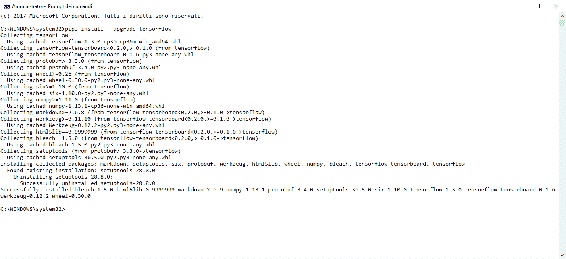
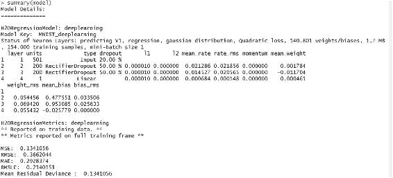

# 第七章：神经网络的应用案例——高级主题

使用**人工神经网络**（**ANN**），让我们尝试模拟典型的大脑活动，如图像感知、模式识别、语言理解、感觉-运动协调等。ANN 模型由一个节点系统组成，等同于人脑的神经元，这些节点通过加权连接互相连接，类似于神经元之间的突触。网络的输出通过不断迭代的方式从连接权重调整至收敛状态。

本章最后，我们将展示 ANN 的不同应用案例，并探讨神经网络如何在人工智能领域中使用。我们将看到一些应用案例及其在 R 中的实现。你可以将相同的程序集应用到其他实际工作场景中。

本章将涵盖以下主题：

+   TensorFlow 与 R 的集成

+   Keras 与 R 的集成

+   使用`MNIST`数据集和`H2O`进行手写数字识别

+   使用 mxnet 构建 LSTM

+   使用`H2O`的自编码器进行数据聚类

+   使用`H2O`进行**主成分分析**（**PCA**）

+   使用`darch`包进行乳腺癌检测

到本章结束时，你将理解学习过程的高级概念及其在 R 环境中的实现。我们将应用不同类型的算法来实现一个神经网络。我们将复习如何训练、测试和部署模型。我们还会再次讨论如何执行正确的评估程序。此外，随着深度学习的快速发展，我们将更多地涵盖其在应用中的使用，深度学习是基于先进神经网络的最新技术。

# TensorFlow 与 R 的集成

TensorFlow 是 Google 提供的一个开源数值计算库，用于机器智能。它隐藏了构建深度学习模型所需的所有编程工作，提供了一个“黑盒”接口供开发者使用。TensorFlow 的 Keras API 为神经网络提供了一个高级接口。

Python 是深度学习的**事实标准**编程语言，但 R 也在赶超。现在，R 也有深度学习库，开发者可以像使用其他 R 库一样，轻松下载 TensorFlow 或 Keras 并加以使用。

在 TensorFlow 中，图中的节点代表数学运算，而图的边缘则代表在节点之间传递的多维数据数组（张量）。TensorFlow 最初由 Google Brain 团队在 Google 的机器智能研究中开发，用于机器学习和深度神经网络研究，但现在已经公开发布。TensorFlow 在配置得当时，可以利用 GPU 进行处理。

TensorFlow 的通用应用案例如下：

+   图像识别

+   计算机视觉

+   声音/语音识别

+   时间序列分析

+   语言检测

+   语言翻译

+   基于文本的处理

+   **手写识别**（**HWR**）

+   其他许多应用

在本节中，我们将学习如何将 TensorFlow 库引入 R。这样就能在 R 中使用 TensorFlow 进行深度学习，开辟了大量的可能性。为了使用 TensorFlow，我们必须先安装 Python。如果你的机器上没有 Python 环境，现在是时候安装它了。

Python 是一种动态的 **面向对象编程**（**OOP**）语言，可以用于许多类型的软件开发。它强有力地支持与其他语言和程序的集成，提供了丰富的标准库，并且可以在几天内学会。许多 Python 程序员确认，通过使用 Python，他们的生产力有了显著提升，并认为它有助于开发更高质量、易于维护的代码。Python 可以运行在 Windows、Linux/Unix、macOS X、OS/2、Amiga、Palm 手持设备和诺基亚手机上。它还可以在 Java 和 .NET 虚拟机上运行。Python 采用 OSI 批准的开源许可证，使用是免费的，包括用于商业产品。

Python 由 Guido van Rossum 于 1990 年代初在荷兰的 Stichting Mathematisch Centrum 创建，作为一种名为 **ABC** 的语言的继承者。尽管 Python 现在包含了许多其他人的贡献，但 Guido 仍然是 Python 的主要作者。

如果你不知道选择哪个版本，可以参考一个（英文）文档，它能帮助你做出选择。原则上，如果你必须从零开始，我们推荐选择 Python 3；如果你需要使用可能与 Python 3 不兼容的第三方软件包，我们推荐使用 Python 2.7。所有有关可用版本及如何安装 Python 的信息可以在[`www.python.org/`](https://www.python.org/)找到。

在正确安装了机器上的 Python 版本后，我们需要关注如何安装 TensorFlow。我们可以通过以下链接获取操作系统的所有库信息及可用版本：[`www.tensorflow.org/`](https://www.tensorflow.org/)。

此外，在安装部分，我们可以找到一系列指南，解释如何安装允许我们用 Python 编写应用程序的 TensorFlow 版本。以下操作系统有相关的安装指南：

+   在 Ubuntu 上安装 TensorFlow

+   在 macOS X 上安装 TensorFlow

+   在 Windows 上安装 TensorFlow

+   从源码安装 TensorFlow

例如，要在 Windows 上安装 TensorFlow，我们必须选择以下类型之一：

+   仅支持 CPU 的 TensorFlow

+   支持 GPU 的 TensorFlow

要安装 TensorFlow，首先启动具有管理员权限的终端。然后在该终端中输入适当的 `pip3` 安装命令。若要安装仅支持 CPU 的版本，请输入以下命令：

```py
C:\> pip3 install --upgrade tensorflow
```

安装过程的执行状态将通过一系列代码行在视频中显示，如下图所示：



此时，我们可以回到我们最喜欢的环境；我指的是 R 开发环境。我们需要安装 TensorFlow 的接口。R 接口让你能够高效地使用高级 Keras 和 Estimator API，且当需要更多控制时，它提供对核心 TensorFlow API 的完全访问权限。为了安装 R 接口到 TensorFlow，我们将按照以下步骤操作。

首先，从 CRAN 安装`tensorflow` R 包，如下所示：

```py
install.packages("tensorflow")
```

然后，使用**install_tensorflow()**函数来安装 TensorFlow（为了正确安装，你需要管理员权限）：

```py
library(tensorflow)
install_tensorflow()
```

我们可以确认安装成功：

```py
sess = tf$Session()
hello <- tf$constant('Hello, TensorFlow!')
sess$run(hello)
```

这将为你提供一个默认的 TensorFlow 安装，适用于`tensorflow` R 包。如果你想了解更多安装选项，包括安装支持 NVIDIA GPU 的 TensorFlow 版本（前提是你已安装相应的 CUDA 库），请继续阅读。在以下代码中，我们可以检查安装是否成功：

```py
> library(tensorflow)
> sess = tf$Session()
> hello <- tf$constant('Hello, TensorFlow!')
> sess$run(hello)
b'Hello, TensorFlow!'
```

# Keras 与 R 的集成

```py
MNIST dataset.
```

默认情况下，RStudio 加载的是 TensorFlow 的 CPU 版本。一旦加载了 Keras，我们便有了一套强大的深度学习库，R 程序员可以利用这些库来执行神经网络和深度学习任务。要安装 Keras for R，使用以下代码：

```py
install.packages("devtools")
devtools::install_github("rstudio/keras")
```

此时，我们加载`keras`库：

```py
library(keras)
```

最后，我们通过加载`MNIST`数据集来检查 keras 是否正确安装：

```py
> data=dataset_mnist()
```

# 使用 R 进行 MNIST HWR

手写识别（HWR）是现代技术中非常常见的过程。通过光学扫描（**光学字符识别**（**OCR**））或智能词识别，可以离线从纸张上的文本图像中检测到书写内容。或者，可以通过在线检测笔尖的运动（例如，从笔-计算机表面进行，通常较容易，因为有更多的线索可用）。从技术上讲，手写识别是指计算机从纸质文档、照片、触摸屏及其他设备等来源接收并解释可理解的手写输入的能力。

HWR 通过各种技术进行处理，通常需要 OCR。然而，一个完整的脚本识别系统还管理格式，执行正确的字符分割，并找出最合理的单词。

**修改版国家标准与技术研究院**（**MNIST**）是一个大型手写数字数据库。它包含 70,000 个数据样本。它是 NIST 更大数据集的一个子集。这些数字的分辨率为 28x28 像素，并以 70,000 行和 785 列的矩阵形式存储；784 列形成每个像素值，来自 28x28 矩阵，且一个值是实际的数字。数字已经被尺寸标准化并集中在一个固定大小的图像中。

`MNIST`数据集中的数字图像最初由 Chris Burges 和 Corinna Cortes 使用边界框归一化和居中进行选择和实验。Yann LeCun 的版本使用较大窗口中的质量中心进行居中。数据可以在 Yann LeCun 的官方网站上获取：[`yann.lecun.com/exdb/mnist/`](http://yann.lecun.com/exdb/mnist/)。

每张图像的大小为 28x28。以下是来自`MNIST`数据集的*0-8*数字的图像样本：


`MNIST`数据集包含多个手写数字样本。我们可以将此数据集输入到 R 程序中进行训练，代码可以识别任何新的手写数字，并作为预测数据进行处理。这是神经网络架构作为计算机视觉系统应用于人工智能（AI）的一种情况。

下表展示了 LeCun 网站上可用的`MNIST`数据集的分布情况：

| **数字** | **计数** |
| --- | --- |
| *0* | *5923* |
| *1* | *6742* |
| *2* | *5958* |
| *3* | *6131* |
| *4* | *5842* |
| *5* | *5421* |
| *6* | *5918* |
| *7* | *6265* |
| *8* | *5851* |
| *9* | *5949* |

我们不会使用`h2o`包进行深度学习训练和测试`MNIST`数据集。我们将 70,000 行的数据集拆分为 60,000 行训练数据和 10,000 行测试数据。然后，我们将计算模型的准确率。该模型可以用于预测任何包含 0 到 9 之间手写数字的 28x28 像素的输入数据集。最后，我们将文件大小压缩到 100 行，用于在两个`.csv`格式的数据集上进行演示训练处理，文件名为`mnist_train_100.csv`和`mnist_test_10.csv`。

对于我们的示例 R 代码，我们使用了一个包含 100 行的训练数据集和一个包含 10 行的测试数据集。以下是 R 代码的展示：

```py
#################################################################
### Chapter 7 - Neural Networks with R - Use cases      #########
### Handwritten digit recognition through MNIST dataset #########
#################################################################

library("h2o")

h2o.init(nthreads=-1,max_mem_size="3G")

setwd ("c://R")

train_mnist=read.csv("mnist_train_100.csv", header=FALSE)
attach(train_mnist)
names(train_mnist)

test_mnist=read.csv("mnist_test_10.csv", header=FALSE)
attach(test_mnist)
names(test_mnist)

m = matrix(unlist(train_mnist[10,-1]), 
 nrow = 28, 
 byrow = TRUE)

image(m,col=grey.colors(255))

rotate = function(x) t(apply(x, 2, rev)) 

image(rotate(m),col=grey.colors(255))

par(mfrow=c(2,3))
lapply(1:6, 
 function(x) image(
 rotate(matrix(unlist(train_mnist[x,-1]),
 nrow = 28, 
 byrow = TRUE)),
 col=grey.colors(255),
 xlab=train_mnist[x,1]
 )
)

par(mfrow=c(1,1))

str(train_mnist)

x=2:785
y=1

table(train_mnist[,y])

model=h2o.deeplearning(x,
 y,
 as.h2o(train_mnist),
 model_id="MNIST_deeplearning",
 seed=405,
 activation="RectifierWithDropout",
 l1=0.00001,
 input_dropout_ratio=0.2,
 classification_stop = -1,
 epochs=2000
 )

summary(model)

h2o.scoreHistory(model)

preds=h2o.performance(model, 
 as.h2o(test_mnist))

newdata = h2o.predict(model, 
 as.h2o(test_mnist))

predictions = cbind(as.data.frame(seq(1,10)),
 test_mnist[,1],
 as.data.frame(newdata[,1]))

names(predictions) = c("Number","Actual","Predicted")

as.matrix(predictions)
#################################################################
```

现在，让我们通过代码了解如何应用`h2o`包来解决手写数字识别问题。我们在第三章中已经详细介绍了`h2o`包，*使用多层神经网络的深度学习*。`h2o`包通过以下代码引入并初始化：

```py
library("h2o")
h2o.init(nthreads=-1,max_mem_size="3G")
```

以下结果显示在 R 提示符下：

```py
> h2o.init(nthreads=-1,max_mem_size="3G")
H2O is not running yet, starting it now...
Note: In case of errors look at the following log files:
 C:\Users\lavoro\AppData\Local\Temp\Rtmpiit6zE/h2o_lavoro_started_from_r.out
 C:\Users\lavoro\AppData\Local\Temp\Rtmpiit6zE/h2o_lavoro_started_from_r.err
java version "1.7.0_40"
Java(TM) SE Runtime Environment (build 1.7.0_40-b43)
Java HotSpot(TM) 64-Bit Server VM (build 24.0-b56, mixed mode)
Starting H2O JVM and connecting: ..... Connection successful!
R is connected to the H2O cluster: 
 H2O cluster uptime: 15 seconds 229 milliseconds 
 H2O cluster version: 3.10.5.3 
 H2O cluster version age: 2 months and 18 days 
 H2O cluster name: H2O_started_from_R_lavoro_huu267 
 H2O cluster total nodes: 1 
 H2O cluster total memory: 2.67 GB 
 H2O cluster total cores: 4 
 H2O cluster allowed cores: 4 
 H2O cluster healthy: TRUE 
 H2O Connection ip: localhost 
 H2O Connection port: 54321 
 H2O Connection proxy: NA 
 H2O Internal Security: FALSE 
 R Version: R version 3.4.1 (2017-06-30)
```

训练文件通过句柄打开，设置为 100 行以简化演示工作。完整的数据集可以从之前建议的网址下载。

```py
setwd("C://R")
```

该命令设置了工作目录，我们将在其中插入用于下一次读取的数据集。

```py
train_mnist=read.csv("mnist_train_100.csv", header=FALSE)
attach(train_mnist)
names(train_mnist)
```

这段代码首先加载了`MNIST`的训练数据集，将文件大小减少到 100 行以进行演示训练处理。然后我们使用`attach()`函数将数据库附加到 R 的搜索路径中。这意味着 R 在评估变量时会搜索该数据库，因此可以通过简单地给出变量名来访问数据库中的对象。最后，我们使用`names()`函数来设置数据集的名称。我们将在测试阶段使用的同样方式处理数据集：

```py
test_mnist=read.csv("mnist_test_10.csv", header=FALSE)
attach(test_mnist)
names(test_mnist)
```

此时，我们通过提取数据集中的第十行（包含数字零），创建一个 28x28 的矩阵，其中包含像素颜色值：

```py
m = matrix(unlist(train_mnist[10,-1]),
 + nrow = 28,
 + byrow = TRUE)
```

让我们通过绘制对象`image`来看一下我们得到了什么：

```py
image(m,col=grey.colors(255))
```

以下展示的是手写数字的图像：


现在，让我们创建手写数字的镜像：

```py
> rotate = function(x) t(apply(x, 2, rev))
```

然后，查看图像以验证刚刚执行的操作：

```py
> image(rotate(m),col=grey.colors(255))
```

以下展示的是镜像图像：


现在，我们对数据集中的前六行做同样的操作：

```py
par(mfrow=c(2,3))
lapply(1:6,
 function(x) image(
 rotate(matrix(unlist(train_mnist[x,-1]),
 nrow = 28,
 byrow = TRUE)),
 col=grey.colors(255),
 xlab=train_mnist[x,1]
 )
)
```

这些是数据集中前六行手写数字的图像：


重置图表选项为默认设置：

```py
 par(mfrow=c(1,1)) 
```

下一个命令让我们进行一些关于训练数据的解释性分析：

```py
str(train_mnist)
x=2:785
y=1 
```

此命令用于查找训练矩阵中每个数字的数量：

```py
table(train_mnist[,y]) 
```

结果显示如下：

```py
> table(train_mnist[,y])
 0  1  2  3  4  5  6  7  8  9
13 14  6 11 11  5 11 10  8 11
```

上面显示的是数据集中每个数字出现的次数。现在是构建并训练模型的时候了：

```py
model=h2o.deeplearning(x,
 y,
 as.h2o(train_mnist),
 model_id="MNIST_deeplearning",
 seed=405,
 activation="RectifierWithDropout",
 l1=0.00001,
 input_dropout_ratio=0.2,
 classification_stop = -1,
 epochs=2000
)
```

现在，为了生成`model`拟合函数的结果摘要，我们将使用`summary()`函数：

```py
summary(model)
```

以下图示显示了部分得到的结果：



我们可以通过检查训练模型的性能来理解算法的演变：

```py
preds=h2o.performance(model,
 as.h2o(test_mnist))
```

此时，我们已经有了一个训练良好的`model`，因此可以用它进行预测。在我们的案例中，我们将用它来识别手写数字：

```py
newdata = h2o.predict(model,
 as.h2o(test_mnist))
```

既然我们已经使用了`model`，我们需要格式化实际和预期的矩阵来验证准确性：

```py
predictions = cbind(as.data.frame(seq(1,10)),
 test_mnist[,1],
 as.data.frame(newdata[,1]))
```

输入插入矩阵的变量名称：

```py
names(predictions) = c("Number","Actual","Predicted")
```

最后，检查输出：

```py
as.matrix(predictions)
```

结果显示如下：

```py
> as.matrix(predictions)
 Number Actual   Predicted
 [1,]      1      7  6.90180840
 [2,]      2      3  3.62368445
 [3,]      3      1  0.53782891
 [4,]      4      0 -0.03092147
 [5,]      5      6  5.21024129
 [6,]      6      1  0.30850593
 [7,]      7      6  6.44916207
 [8,]      8      9  3.59962551
 [9,]      9      5  3.17590073
[10,]     10      9  7.35213625
```

从刚才提出的表格分析可以看出，对于测试数据，模型正确预测了 60%（10 个中有 6 个）。这个准确度仅适用于小型训练数据集。模型可以通过以下方式进一步改进：

+   增加训练数据集的数量

+   调整`h20.deeplearning`函数的参数

+   为`h2o` JVM 分配更多内存

+   扩展测试数据集

# 使用鸢尾花数据集的 LSTM

继续使用第六章中介绍的 LSTM 架构用于 RNN，*递归神经网络与卷积神经网络*，我们展示了使用`mxnet` LSTM 函数处理`iris`数据集。该函数期望所有输入和输出为数值型。它特别适用于处理文本序列，但在这里我们将训练一个 LSTM 模型，基于`iris`数据集。输入值为`petal.length`、`petal.width`、`sepal.length`和`sepal.width`，输出变量是`Species`，它被转换为介于 1 和 3 之间的数值。`iris`数据集已在第四章中详细介绍，*感知器神经网络建模 - 基本模型*：

```py
#################################################################
### Chapter 7 - Neural Networks with R - Use cases      #########
### Prediction using LSTM on IRIS dataset               #########
#################################################################

##Required one time
library("mxnet")

data(iris)

x = iris[1:5!=5,-5]
y = as.integer(iris$Species)[1:5!=5]

train.x = data.matrix(x)
train.y = y

test.x = data.matrix(iris[1:5==5,-5])
test.y = as.integer(iris$Species)[1:5==5]

model <- mx.mlp(train.x, train.y, hidden_node=10, out_node=3, out_activation="softmax",
 num.round=20, array.batch.size=15, learning.rate=0.07, momentum=0.9,
 eval.metric=mx.metric.accuracy)

preds = predict(model, test.x)
pred.label = max.col(t(preds))

test.y
pred.label
#################################################################
```

程序需要安装`mxnet`。`mxnet`支持 R 语言，并可用于 CPU 和 GPU，支持以下操作系统：Linux、macOS 和 Windows。

我们仅说明 Windows 机器和 CPU 版本的安装程序。有关其他架构的安装程序信息，请参考以下网址：[`mxnet.incubator.apache.org/get_started/install.html`](https://mxnet.incubator.apache.org/get_started/install.html)。

要在 CPU 处理器的计算机上安装`mxnet`，我们使用预构建的二进制包。我们可以通过以下代码直接在 R 控制台中安装该包：

```py
cran <- getOption("repos")
cran["dmlc"] <- "https://s3-us-west-2.amazonaws.com/apache-mxnet/R/CRAN/"
options(repos = cran)
install.packages("mxnet")
```

安装了以下包：

```py
package ‘bindr’ successfully unpacked and MD5 sums checked
package ‘brew’ successfully unpacked and MD5 sums checked
package ‘assertthat’ successfully unpacked and MD5 sums checked
package ‘bindrcpp’ successfully unpacked and MD5 sums checked
package ‘glue’ successfully unpacked and MD5 sums checked
package ‘pkgconfig’ successfully unpacked and MD5 sums checked
package ‘BH’ successfully unpacked and MD5 sums checked
package ‘plogr’ successfully unpacked and MD5 sums checked
package ‘yaml’ successfully unpacked and MD5 sums checked
package ‘irlba’ successfully unpacked and MD5 sums checked
package ‘hms’ successfully unpacked and MD5 sums checked
package ‘XML’ successfully unpacked and MD5 sums checked
package ‘Rook’ successfully unpacked and MD5 sums checked
package ‘tidyselect’ successfully unpacked and MD5 sums checked
package ‘gridExtra’ successfully unpacked and MD5 sums checked
package ‘dplyr’ successfully unpacked and MD5 sums checked
package ‘downloader’ successfully unpacked and MD5 sums checked
package ‘htmltools’ successfully unpacked and MD5 sums checked
package ‘htmlwidgets’ successfully unpacked and MD5 sums checked
package ‘igraph’ successfully unpacked and MD5 sums checked
package ‘influenceR’ successfully unpacked and MD5 sums checked
package ‘purrr’ successfully unpacked and MD5 sums checked
package ‘readr’ successfully unpacked and MD5 sums checked
package ‘rstudioapi’ successfully unpacked and MD5 sums checked
package ‘rgexf’ successfully unpacked and MD5 sums checked
package ‘tidyr’ successfully unpacked and MD5 sums checked
package ‘viridis’ successfully unpacked and MD5 sums checked
package ‘DiagrammeR’ successfully unpacked and MD5 sums checked
package ‘visNetwork’ successfully unpacked and MD5 sums checked
package ‘data.table’ successfully unpacked and MD5 sums checked
package ‘mxnet’ successfully unpacked and MD5 sums checked
```

正如你所看到的，安装`mxnet`包时，除了安装`mxnet`外，还安装了其他几个包。所以，我们已经准备好继续了。这个`mxnet`库包含了我们将要使用的`mx.lstm`函数：

```py
library("mxnet")
```

在以下代码中，加载了内部数据集`iris`，并将`x`和`y`变量分别设置为自变量和目标变量。`Species`变量被转换为介于 1 到 3 之间的数字：

```py
data(iris)
x = iris[1:5!=5,-5]
y = as.integer(iris$Species)[1:5!=5]
```

只是一个解释，使用以下代码：

```py
x = iris[1:5!=5,-5]
```

我们要求 R 从`iris`数据集中选择 150 行五列中的 1 到 4 行，省略掉第五行。这个过程还将对 5 的倍数进行，因此最后我们会从选择中省略每个倍数为 5 的行。同时，我们也会省略第五列。最终，我们将得到 120 行和四列。

现在我们设置输入和输出：

```py
train.x = data.matrix(x)
train.y = y
```

然后，我们通过选择之前省略的行来设置用于测试的数据框：

```py
test.x = data.matrix(iris[1:5==5,-5])
test.y = as.integer(iris$Species)[1:5==5]
```

调用`mx.lstm`函数，使用输入和输出值来训练 RNN 上的 LSTM 模型，数据集为：

```py
model <- mx.mlp(train.x, train.y, hidden_node=10, out_node=3, out_activation="softmax",
 num.round=20, array.batch.size=15, learning.rate=0.07, momentum=0.9,
 eval.metric=mx.metric.accuracy)
```

现在我们可以进行预测：

```py
preds = predict(model, test.x)
pred.label = max.col(t(preds))
```

最后，我们打印结果以比较模型性能：

```py
test.y
pred.label
```

这里是结果：

```py
> test.y
 [1] 1 1 1 1 1 1 1 1 1 1 2 2 2 2 2 2 2 2 2 2 3 3 3 3 3 3 3 3 3 3
> pred.label
 [1] 2 2 2 2 2 2 2 2 2 2 3 3 3 3 3 3 3 3 3 3 3 3 3 3 3 3 3 3 3 3
```

从测试数据和预测结果的比较中可以看出，最好的结果是针对`versicolor`物种获得的。从结果来看，模型需要改进，因为它能够进行的预测还不如我们在前面示例中获得的模型那样好。

# 使用自编码器

我们在深度学习章节中已经看到过自编码器，它们用于无监督学习。自编码器利用神经网络执行非线性降维。通过使用通用函数逼近器，它们能以更好的方式表示数据，找出数据中的潜在特征。自编码器试图以不同的方式结合或压缩输入数据。

这里展示了一个使用 MLP 的示例表示：


# 使用 H2O 的 PCA

在多元统计分析中，遇到的最大困难之一是如何显示具有多个变量的数据集。幸运的是，在具有多个变量的数据集中，一些数据往往彼此紧密相关。这是因为它们实际上包含相同的信息，因为它们测量的是支配系统行为的同一量。因此，这些是冗余变量，对我们想要构建的模型没有任何贡献。我们可以通过用一个包含信息内容的新变量替换一组变量来简化问题。

PCA 生成了一组新的变量，其中包含不相关的变量，称为主成分；每个主成分是原始变量的线性组合。所有主成分彼此正交，因此没有冗余信息。主成分整体构成了数据空间的正交基。PCA 的目标是用最少数量的主成分解释最多的方差。这是一种多维缩放方法。它是将变量线性变换到一个较低维度的空间，保留关于变量的最大信息。因此，主成分是原始变量在进行线性变换后的组合。

在以下示例中，我们使用`h2o`实现 PCA。`prcomp()`函数用于寻找一组输入特征的主成分。这是无监督学习：

```py
library(h2o)
h2o.init()

ausPath = system.file("extdata", "australia.csv", package="h2o")
australia.hex = h2o.uploadFile(path = ausPath)
summary(australia.hex)

pca_model=h2o.prcomp(training_frame = australia.hex, 
 k = 8, 
 transform = "STANDARDIZE")

summary(pca_model)
barplot(as.numeric(pca_model@model$importance[2,]),
 main="Pca model", 
 xlab="Pca component",
 ylab="Proportion of Variance")
```

现在，让我们通过代码来了解如何应用 `h2o` 包进行 PCA。

我们可以继续加载库：

```py
library(h2o)
```

此命令将库加载到 R 环境中。以下函数以最大内存大小为`2` GB 和两个并行核心初始化`h2o`引擎：

```py
h2o.init()
```

返回以下消息：

```py
> h2o.init()
 Connection successful!

R is connected to the H2O cluster: 
 H2O cluster uptime: 5 hours 40 minutes 
 H2O cluster version: 3.10.5.3 
 H2O cluster version age: 2 months and 18 days 
 H2O cluster name: H2O_started_from_R_lavoro_huu267 
 H2O cluster total nodes: 1 
 H2O cluster total memory: 2.63 GB 
 H2O cluster total cores: 4 
 H2O cluster allowed cores: 4 
 H2O cluster healthy: TRUE 
 H2O Connection ip: localhost 
 H2O Connection port: 54321 
 H2O Connection proxy: NA 
 H2O Internal Security: FALSE 
 R Version: R version 3.4.1 (2017-06-30) 
```

我们按照 R 提示符上的指示操作：

```py
c1=h2o.init(max_mem_size = "2G", 
 nthreads = 2, 
 ip = "localhost", 
 port = 54321)
```

`h20.init` 函数以最大内存大小为 `2` GB 和两个并行核心初始化 `h2o` 引擎。以下命令将数据加载到 R 环境中：

```py
ausPath = system.file("extdata", "australia.csv", package="h2o")
australia.hex = h2o.uploadFile(path = ausPath)
```

第一条指令生成包含要上传文件的路径。要上传位于 `h2o` 实例本地目录中的文件，使用 `h2o.uploadFile()`，它除了能够上传本地文件数据外，还能上传 R 会话中的数据。在括号内，指定 R 中的 `h2o` 引用对象以及文件的完整 URL 或规范化文件路径。现在让我们来看一下它在其中：

```py
summary(australia.hex)
```

现在让我们打印数据集的简要总结：


要对给定的数据集执行 PCA，我们将使用`prcomp()`函数：

```py
pca_model=h2o.prcomp(training_frame = australia.hex, 
 k = 8, 
 transform = "STANDARDIZE")
```

现在让我们打印模型的简要`总结`：

```py
summary(pca_model)
```

在下图中，我们看到 PCA 模型的总结：


为了更好地理解结果，我们可以绘制一个 scree 图，显示每个主成分解释的方差百分比。解释的方差百分比包含在 PCA 模型的模型重要性变量中。

以下图展示了每个主成分解释的百分比方差的碎石图：


条形图显示了每个主成分的方差比例；如你所见，前两个主成分约占方差的 70%。

# 使用 H2O 的自编码器

自编码器是一种用于无效编码控制的人工神经网络（ANN）。自编码器的目的是学习一组数据的编码，通常用于减少数据的维度。

从架构上看，自编码器的最简单形式是一个先进的、非递归的神经网络，类似于多层感知机（MLP），具有输入层、输出层和一个或多个连接它们的隐藏层，但层的输出与输入层的节点数相同，用于重建输入。

以下是使用`h2o`在`movie`数据集上进行自编码器的示例：

本示例中使用的数据集是一组来自[`grouplens.org/datasets/movielens`](https://grouplens.org/datasets/movielens)的电影和类型数据。

我们使用的`movies.csv`文件包含三列：

+   `movieId`

+   `title`

+   `genres`

聚类的数据有 164,979 行。我们将使用`h2o.deeplearning`来让`autoencoder`参数修正聚类。这个练习的目的是根据类型对电影进行聚类，然后可以用来向用户推荐相似的电影或同类型的电影。程序使用`h20.deeplearning`，并将`autoencoder`参数设置为`T`：

```py
#################################################################
### Chapter 7 - Neural Networks with R - Use cases      #########
### Autoencoder using H2O on a movie dataset            #########
#################################################################

library("h2o")

setwd ("c://R")
#Load the training dataset of movies
movies=read.csv ( "movies.csv", header=TRUE)
head(movies)

model=h2o.deeplearning(2:3, 
 training_frame=as.h2o(movies),
 hidden=c(2), 
 autoencoder = T, 
 activation="Tanh")

summary(model)

features=h2o.deepfeatures(model,
 as.h2o(movies),
 layer=1)

d=as.matrix(features[1:10,])
labels=as.vector(movies[1:10,2])
plot(d,pch=17)
text(d,labels,pos=3)
```

现在，让我们来浏览代码：

```py
library("h2o")
setwd ("c://R")
```

这些命令会在 R 环境中加载库，并设置工作目录，之后我们会将数据集插入该目录进行下一步读取。然后，我们加载数据：

```py
movies=read.csv( "movies.csv", header=TRUE)
```

为了可视化数据集中包含的数据类型，我们分析了其中一个变量的预览：

```py
head(movies)
```

以下图显示了`movie`数据集的前`20`行：


现在，我们构建并训练`model`：

```py
model=h2o.deeplearning(2:3, 
 training_frame=as.h2o(movies),
 hidden=c(2), 
 autoencoder = T, 
 activation="Tanh")
```

让我们分析一下`model`中包含的一些信息：

```py
summary(model)
```

这是`summary()`函数结果的一个摘录：


在接下来的命令中，我们使用`h2o.deepfeatures()`函数从`h2o`数据集提取非线性特征，使用的是 H2O 深度学习模型：

```py
features=h2o.deepfeatures(model,
 as.h2o(movies),
 layer=1)
```

在以下代码中，显示了从模型中提取的前六行特征：

```py
> features
 DF.L1.C1 DF.L1.C2
1 0.2569208 -0.2837829
2 0.3437048 -0.2670669
3 0.2969089 -0.4235294
4 0.3214868 -0.3093819
5 0.5586608 0.5829145
6 0.2479671 -0.2757966
[9125 rows x 2 columns]
```

最后，我们绘制一个图表，查看模型如何通过分析结果将电影分组：

```py
d=as.matrix(features[1:10,])
labels=as.vector(movies[1:10,2])
plot(d,pch=17)
text(d,labels,pos=3)
```

完成聚类后，接下来显示的是电影的图形。由于空间限制，我们只绘制了 100 个电影标题。我们可以看到一些电影被紧密排列在一起，意味着它们属于相同类型。电影标题根据它们之间的距离进行了聚类，基于的是类型。


由于电影标题数量庞大，无法区分电影名称，但明显可以看出模型已经将电影分为三组。

# 使用 DARCH 进行乳腺癌检测

在这一部分，我们将使用 `darch` 包，该包用于深度架构和**限制玻尔兹曼机**（**RBM**）。`darch` 包是基于 G. E. Hinton 和 R. R. Salakhutdinov 的代码（可以通过 MATLAB 代码获得，适用于**深度信念网络**（**DBN**））构建的。此包用于生成具有多层的神经网络（深度架构）并通过作者提出的方法对其进行训练。

该方法包括使用对比散度方法进行预训练，并使用常见的训练算法（如反向传播或共轭梯度法）进行微调。此外，监督微调可以通过 maxout 和 dropout 两种新近发展的技术进行增强，这些技术用于改善深度学习的微调。

示例的基础是基于一组输入进行分类。为此，我们将使用数据集 BreastCancer.csv 中的数据，该数据集在 第五章中提到过，*在 R 中训练和可视化神经网络*。该数据取自 UCI 机器学习仓库，数据集会在 Wolberg 博士报告其临床病例后定期更新。数据包含乳腺癌患者的资料，并根据十个独立变量对良性或恶性肿瘤进行分类。

要获取数据，我们借用了 UCI 机器学习仓库中大量可用的数据，网址为 [`archive.ics.uci.edu/ml`](http://archive.ics.uci.edu/ml)。

数据的详细信息如下：

+   **实例数量**：699（截至 1992 年 7 月 15 日）

+   **属性数量**：10 个加上类属性

+   **属性信息**：类属性已移至最后一列

属性的描述如下：

```py
 #  Attribute                     Domain
   -- -----------------------------------------
   1\. Sample code number            id number
   2\. Clump Thickness               1 - 10
   3\. Uniformity of Cell Size       1 - 10
   4\. Uniformity of Cell Shape      1 - 10
   5\. Marginal Adhesion             1 - 10
   6\. Single Epithelial Cell Size   1 - 10
   7\. Bare Nuclei                   1 - 10
   8\. Bland Chromatin               1 - 10
   9\. Normal Nucleoli               1 - 10
  10\. Mitoses                       1 - 10
  11\. Class:                        (2 for benign, 4 for malignant)

```

为了理解 `darch` 函数，我们首先设置一个 XOR 门，然后将其用于训练和验证。`darch` 函数使用输出数据和输入属性来构建模型，该模型可以由 `darch` 本身进行内部测试。在这种情况下，我们达到了 0% 的错误率和 100% 的准确率。

接下来，我们使用乳腺癌数据构建 `darch` 模型，并检查其准确性：

```py
#####################################################################
####Chapter 7 - Neural Networks with R #########
####Breast Cancer Detection using darch package #########
#####################################################################
library("mlbench")
library("darch")

data(BreastCancer)
summary(BreastCancer)

data_cleaned <- na.omit(BreastCancer) 
summary(data_cleaned)

model <- darch(Class ~ ., data_cleaned,layers = c(10, 10, 1),
 darch.numEpochs = 50, darch.stopClassErr = 0, retainData = T)

plot(model)

predictions <- predict(model, newdata = data_cleaned, type = "class")
cat(paste("Incorrect classifications:", sum(predictions != data_cleaned[,11])))
table(predictions,data_cleaned[,11])

library(gmodels)
CrossTable(x = data_cleaned$Class, y = predictions,
 prop.chisq=FALSE)
```

我们开始逐行分析代码，详细解释所有用于捕捉结果的特性：

```py
library("mlbench")
library("darch")
```

初始代码的前两行用于加载运行分析所需的库。

请记住，要安装初始 R 发行版中未包含的库，必须使用 `install.package` 函数。这是安装软件包的主要函数。它接受一个名称向量和目标库，从仓库下载并安装软件包。此函数应仅使用一次，而不是每次运行代码时都调用。

`mlbench` 库包含了一系列人工和真实世界的机器学习基准问题，例如包括来自 UCI 仓库的几个数据集。

`darch` 库是一个用于深度架构和 RBM 的包：

```py
data(BreastCancer)
```

使用这个命令，我们加载了名为 `BreastCancer` 的数据集，正如在 `mlbench` 库中提到的。现在让我们看看它是否已经加载：

```py
summary(BreastCancer)
```

使用这个命令，我们可以通过 `summary()` 函数查看简要的总结。

请记住，`summary()` 函数是一个通用函数，用于生成各种模型拟合函数的结果摘要。该函数会调用特定的方法，这些方法取决于第一个参数的类。

在这种情况下，函数已应用于数据框，结果列在下图中：


`summary()` 函数返回每个变量的一组统计信息。特别有用的是突出显示 `Class` 变量的结果，该变量包含癌症肿块的诊断信息。在这种情况下，检测到 `458` 个 `良性` 类别和 `241` 个 `恶性` 类别的病例。另一个需要强调的特征是 `Bare.nuclei` 变量。对于该变量，检测到 `16` 个缺失值的案例。

为了去除缺失值，我们可以使用 `na.omit()` 函数：

```py
data_cleaned <- na.omit(BreastCancer) 
```

现在我们构建并训练模型：

```py
model <- darch(Class ~ ., data_cleaned,layers = c(10, 10, 1),
 darch.numEpochs = 50, darch.stopClassErr = 0, retainData = T)
```

为了评估 `model` 的性能，我们可以绘制原始网络误差图：

```py
plot(model)
```

错误与周期（epoch）的图形如下所示：


我们在 34 个周期时得到了最小的错误。

我们最终训练好了网络并准备好使用；现在我们可以用它来进行预测：

```py
predictions <- predict(model, newdata = data_cleaned, type = "class")
```

我们使用了我们所有可用的数据集来进行预测。我们只需要将模型预测结果与数据集中可用的实际结果进行比较：

```py
cat(paste("Incorrect classifications:", sum(predictions != data_cleaned[,11])))
```

结果如下所示：

```py
> cat(paste("Incorrect classifications:", sum(predictions != data_cleaned[,11])))
Incorrect classifications: 2
```

结果真的很好！只有两个错误的分类！我认为我们可以对从 `683` 个观测值开始的结果感到满意。为了更好地理解错误是什么，我们构建了一个混淆矩阵：

```py
table(predictions,data_cleaned[,11])
```

结果如下所示：

```py
> table(predictions,data_cleaned[,11])

predictions benign malignant
 benign       443         1
 malignant      1       238
```

尽管这是一种简单的方式，矩阵告诉我们我们仅犯了两个错误，并且错误在类别的两个值之间均匀分布。有关混淆矩阵的更多信息，我们可以使用 `gmodels` 包中的 `CrossTable()` 函数。和往常一样，在加载这个包之前，您需要先安装它：

```py
library(gmodels)
CrossTable(x = data_cleaned$Class, y = predictions,
 prop.chisq=FALSE)
```

使用 `CrossTable()` 函数获得的混淆矩阵如下图所示：


正如我们在分类中预期的那样，我们的模型只有两个错误：*FP* 和 *FN*。然后计算准确率；如第二章《神经网络中的学习过程》所示，准确率由以下公式给出：


让我们在 R 环境中计算准确率：

```py
> Accuracy = (443+238)/683
> Accuracy
[1] 0.9970717
```

如前所述，分类器取得了非常好的成绩。

# 总结

在本章的最后，我们看到了神经网络和深度学习的一些应用案例。这些内容应该构成你未来从事神经网络工作的基础。在大多数情况下，使用方法是常见的，训练和测试过程中模型所涉及的数据集会有所变化。

我们在本章中看到以下示例：

+   将 TensorFlow 和 Keras 与 R 集成，这为使用 R 构建广泛的应用案例开辟了巨大空间

+   使用 H2O 构建数字识别器，通过分类实现

+   使用 MxNet 理解 LSTM 函数

+   使用 H2O 进行 PCA

+   使用 H2O 构建自编码器

+   使用`darch`解决分类问题

R 是一种非常灵活的统计编程语言，是全球数据科学家的主要工具。掌握 R 中的神经网络将有助于社区的进一步发展，并增加 R 在深度学习和新兴应用中的使用。
