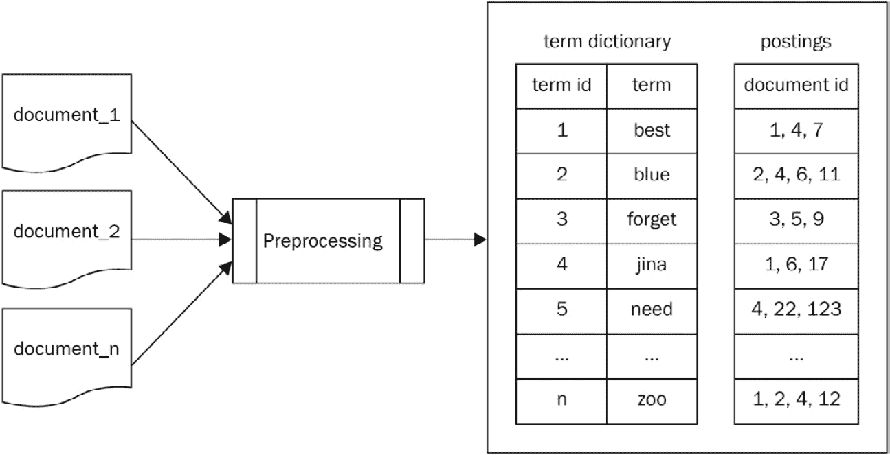
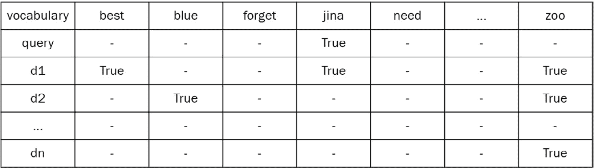
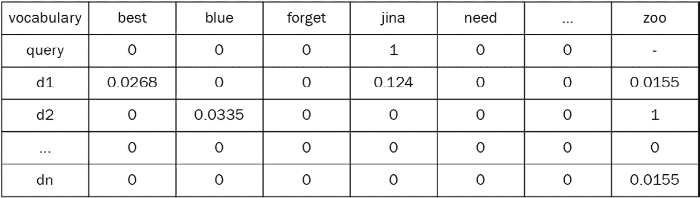
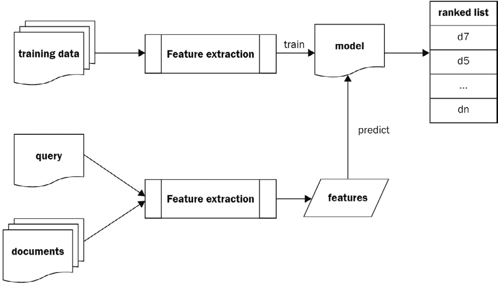

# 第一章：神经网络与神经搜索

搜索一直是所有信息系统中的关键组成部分；将正确的信息提供给正确的用户是至关重要的。这是因为用户查询（如一组关键词）不能完全代表用户的信息需求。传统上，符号搜索被开发出来，允许用户进行基于关键词的搜索。然而，这类搜索应用被局限于基于文本的搜索框中。随着深度学习和人工智能的最新发展，我们可以将任何类型的数据编码为向量，并衡量两个向量之间的相似度。这使得用户能够用任何类型的数据创建查询，并获得任何类型的搜索结果。

在本章中，我们将回顾信息检索和神经搜索的相关重要概念，同时探讨神经搜索为开发者带来的好处。在介绍神经搜索之前，我们将首先介绍基于传统符号的搜索的缺点。接着，我们将探讨如何利用神经网络构建跨/多模态搜索，这将包括其主要应用。

在本章中，我们将重点介绍以下几个主题：

+   传统搜索与神经搜索

+   搜索中的机器学习

+   神经搜索的实际应用

# 技术要求

本章具有以下技术要求：

+   **硬件**：具有至少 4 GB 内存的台式机或笔记本电脑；建议使用 8 GB 内存

+   **操作系统**：类似 Unix 的操作系统，如 macOS，或任何基于 Linux 的发行版，如 Ubuntu

+   **编程语言**：Python 3.7 或更高版本，以及 Python 包管理器或 pip

# 传统搜索与神经搜索

本节将引导你了解符号搜索系统的基本原理、不同类型的搜索应用及其重要性。接下来会简要描述符号搜索系统的工作原理，并提供一些用 Python 编写的代码。最后，我们将总结传统符号搜索与神经搜索的优缺点。这将帮助我们理解神经搜索如何更好地弥合用户意图与检索文档之间的差距。

## 探索各种数据类型和搜索场景

在当今社会，政府、企业和个人每天通过各种平台产生大量数据。我们生活在大数据时代，文本、图像、视频和音频文件等在社会中发挥着重要作用，并且是日常任务完成的重要组成部分。

一般而言，数据分为三种类型：

+   **结构化数据**：指以二维表格结构表达和实现的数据。结构化数据严格遵循特定的数据格式和长度规格，主要通过关系型数据库进行存储和管理。

+   **非结构化数据：** 这种数据既没有规律或完整的结构，也没有预定义的数据模型。通过使用数据库中常见的二维逻辑表来表示数据，这种数据难以得到有效管理。非结构化数据包括办公文档、文本、图片、超文本标记语言（HTML）、各种报告以及所有格式的图像、音频和视频信息。

+   **半结构化数据：** 这种数据介于结构化数据和非结构化数据之间。它包括日志文件、**可扩展标记语言**（**XML**）和**JavaScript 对象表示法**（**JSON**）。半结构化数据不符合与关系数据库或其他数据表相关的数据模型结构，但它包含相关的标签，可以用来分隔语义元素，以便对记录和字段进行分层。

搜索索引广泛用于在庞大的数据集中搜索非结构化和半结构化数据，以满足用户的信息需求。根据文档集合的层级和应用，搜索可以进一步分为三种类型：网络搜索、企业搜索和个人搜索。

在**网络搜索**中，搜索引擎首先需要对数以亿计的文档进行索引。然后，搜索结果会以高效的方式返回给用户，同时系统也在不断优化。网络搜索应用的典型例子包括 Google、Bing 和百度。

除了网络搜索之外，作为软件开发工程师，你很可能会遇到*企业*和*个人搜索*操作。在企业搜索场景中，搜索引擎对企业的内部文档进行索引，以服务企业的员工和客户，例如公司内部的专利搜索索引，或音乐平台如 SoundCloud 的搜索索引。

如果你正在开发一个电子邮件应用，并计划允许用户搜索历史邮件，那么这就构成了典型的个人搜索示例。本书主要关注企业和个人类型的搜索操作。

重要提示

确保你理解搜索与匹配之间的区别。搜索通常是在组织成非结构化或半结构化格式的文档中进行的，而匹配（如 SQL 类似的查询）则发生在结构化数据上，例如表格数据。

关于不同的数据类型，模态的概念在搜索系统中起着重要作用。模态指的是信息的形式，如文本、图像、视频和音频文件。跨模态搜索（也称为*跨媒体搜索*）是指通过探索不同模态之间的关系，并利用某种模态样本，来检索具有相似语义的不同模态样本。

例如，当我们在电子邮件收件箱应用中输入一个关键词时，我们可以通过单模搜索——逐字搜索文本，找到相应的邮件。当你在页面中输入一个关键词进行图片检索时，搜索引擎会通过跨模态搜索，将文本作为依据返回相关的图片。

当然，单模搜索不仅限于逐字搜索文本。像 Shazam 这样的应用，在 App Store 中非常流行，它帮助用户识别音乐，并在短时间内返回歌曲的标题。这可以视为单模搜索的应用。在这里，模态的概念不再指文本，而是指音频。在 Pinterest 上，用户可以通过图片搜索定位相似的图片，模态指的是图片。同样，跨模态搜索的范围远不止通过文本搜索图片。

让我们从另一个角度来考虑这个问题。我们能否进行跨多个模态的搜索呢？当然，答案是“可以！”想象一下这样的搜索场景：用户上传一张衣物的照片，并希望找到相似类型的衣服（我们通常称这种应用为“shop the look”），同时在搜索框中输入描述衣物的段落，以提高搜索的准确性。这样，我们的搜索关键词跨越了两种模态（文本和图片）。我们称这种搜索场景为多模态搜索。

现在我们已经掌握了模态的概念，接下来我们将详细阐述符号搜索系统的工作原理、优缺点。到本节结束时，你将理解，符号搜索系统无法处理不同的模态。

## 传统搜索系统是如何工作的？

作为开发者，你可能曾经使用过 Elasticsearch 或 Apache Solr 来构建网页应用中的搜索系统。这两个广泛使用的搜索框架是基于 Apache Lucene 开发的。我们以 Lucene 为例，介绍搜索系统的组成部分。假设你打算在成千上万的文本文件（`txt`）中搜索一个关键词，你会如何完成这个任务？

最简单的解决方案是遍历从路径中获取的所有文本文件，读取这些文件的内容。如果文件中包含该关键词，文档名称将被返回：

```py
# src/chapter-1/sequential_match.py
import os
import glob
dir_path = os.path.dirname(os.path.realpath(__file__))
def match_sequentially():
    matches = []
    query = 'hello jina'
    txt_files = glob.glob(f'{dir_path}/resources/*.txt')
    for txt_file in txt_files: 
        with open(txt_file, 'r') as f:
            if query in f.read(): 
                matches.append(txt_file)
    return matches
if __name__ == '__main__':
    matches = match_sequentially()
    print(matches)
```

这段代码通过遍历当前目录下所有扩展名为`.txt`的文件，并依次打开这些文件，来实现最简单的搜索功能。如果查询使用的关键词`hello`或`jina`存在，匹配的文件名将被打印出来。虽然这些代码允许你进行基本的搜索，但其过程有很多缺陷：

+   **可扩展性差**：在生产环境中，可能有数百万个文件需要检索。与此同时，检索系统的用户期望在最短的时间内获得检索结果，这对搜索系统的性能提出了严格的要求。

+   **缺乏相关性度量**：该代码帮助您实现最基本的布尔检索，即返回匹配或不匹配的结果。在现实世界的场景中，用户需要一个评分来衡量来自搜索系统的相关性程度，且搜索结果会按降序排列，相关性更高的文件会优先返回给用户。显然，前述代码片段无法实现这一功能。

为了解决这些问题，我们需要对待检索的文件进行*索引*。**索引**是指将文件类型转换为允许快速搜索并跳过对所有文件的连续扫描的过程。

作为我们日常生活中的重要部分，索引类似于查阅字典或访问图书馆。我们将使用最广泛使用的搜索库 Lucene 来说明这个概念。

Lucene Core ([`lucene.apache.org/`](https://lucene.apache.org/))是一个 Java 库，提供强大的索引和搜索功能，以及拼写检查、命中高亮显示和高级分析/分词能力。Apache Lucene 为搜索和索引性能设定了标准。它是 Apache Solr 和 Elasticsearch 的搜索核心。

在 Lucene 中，在所有待检索文件集合加载完毕后，您可以从这些文件中提取文本，并将它们转换为 Lucene 文档，这些文档通常包含文件的标题、正文、摘要、作者和 URL。

接下来，您的文件将由 Lucene 的*文本分析器*进行分析，通常包括以下过程：

**分词器**：这会将原始输入段落分割成不能进一步分解的词素。

**分解** **复合** **词**：在德语等语言中，由两个或多个词素组成的单词被称为复合词。

**拼写修正**：Lucene 允许用户进行拼写检查，以提高检索的准确性。

**同义词分析**：这使得用户可以手动在 Lucene 中添加同义词，以提高搜索系统的召回率（注意：准确率和召回率将稍后详细说明）。

**词干提取与词形还原**：前者通过去除词汇的后缀来派生词根（例如，*play*作为词根是从单词*plays*、*playing*和*played*中派生出来的），而后者则帮助用户将单词转换为基本形式，例如，*is*、*are*和*been*都可以转换为*be*。

让我们尝试使用**NLTK**预处理一些文本。

重要提示

NLTK 是一个领先的平台，用于构建与人类语言数据交互的 Python 程序。它提供了一个易于使用的接口，访问 50 多个语料库和词汇资源。

首先，通过以下命令安装一个名为`nltk`的 Python 包：

```py
pip install nltk
python -m nltk.downloader 'punkt'
```

我们预处理文本`Jina is a neural search framework built with cutting-edge technology called deep learning`：

```py
import nltk
sentence = 'Jina is a neural search framework built with cutting-edge technology called deep learning'
def tokenize_and_stem():
    tokens = nltk.word_tokenize(sentence)
    stemmer = nltk.stem.porter.PorterStemmer()
    stemmed_tokens = [stemmer.stem(token) for token in 
                     tokens]
    return stemmed_tokens
if __name__ == '__main__':
    tokens = tokenize_and_stem()
    print(tokens)
```

这段代码使我们能够对一个句子进行两项操作：分词和词干提取。每个操作的结果分别打印出来。原始输入字符串被解析为 Python 中的字符串列表，最终每个解析后的词元被词形还原为其基本形式。例如，`cutting`和`called`分别被转换为`cut`和`call`。有关更多操作，请参阅 NLTK 的官方文档（[`www.nltk.org/`](https://www.nltk.org/)）。

在使用 Lucene 文档处理文件后，*清理过的*文件将被索引。通常，在传统的搜索系统中，所有文件都使用**倒排索引**进行索引。倒排索引（也称为**文档列表文件**或**倒排文件**）是一种索引数据结构，它将内容（如单词或数字）映射到其在数据库文件或文档集中的位置。

简单来说，倒排索引由两部分组成：**术语词典**和**文档列表**。

词元、它们的 ID 和文档频率（即该词元在整个待检索文档集合中出现的频率）存储在术语词典中。所有词元的集合称为词汇表。词典中的所有词元按字母顺序排列。

在文档列表中，我们保存了词元 ID 和该词元出现的文档 ID。假设在上述示例中，查询关键词`hello jina`中的词元`jina`在整个文档集合中出现了三次（分别出现在`1.txt`、`3.txt`和`11.txt`中），那么该词元为`jina`，文档频率为 3。同时，这三个文本文件的名称`1.txt`、`3.txt`和`11.txt`将被保存在文档列表中。随后，文本文件的索引就完成了，如下图所示：



图 1.1 – 倒排索引的数据结构

当用户发出查询时，用于查询的关键词通常比待检索的文档集合要短。Lucene 可以对这些关键词执行相同的预处理操作（如分词、分解和拼写纠正）。

处理后的词元通过倒排索引中的术语词典映射到文档列表，从而可以快速找到匹配的文件。最后，Lucene 的打分机制开始工作，并根据向量空间模型对每个相关文件进行打分。我们的索引文件存储在倒排索引中，可以表示为一个向量。

假设我们的查询关键词是`jina`，我们将其映射到倒排索引的向量中，并在该词元未出现在文件中时用`-`表示；此时可以获得查询向量`[-,'jina',-,-,...]`。这就是我们在传统搜索引擎中以**向量空间模型**表示一个*查询*的方式。



图 1.2 – 向量空间模型中的术语出现

接下来，为了得出排名，我们需要对空间向量模型的词汇进行数值表示。通常，**tf-idf**被认为是一种简单的方法。

使用此算法，我们赋予任何相对频繁出现的词汇更高的权重。如果一个词在多个文档中多次出现，我们认为该词代表性较弱，因此它的权重会再次降低。如果该词在文档中没有出现，它的权重为 0\。

在 Lucene 中，更常用的算法是**bm-25**，它进一步优化了 tf-idf。在数值计算后，向量表示如下：



图 1.3 – 向量空间表示

如上图所示，由于词汇**a**出现过于频繁，它出现在文档 1 和文档 2 中，并且权重较低。而*Jina*这个相对不常见的词（出现在文档 2 中）则被赋予了更高的权重。

在查询向量中，由于查询关键词只有一个词，*Jina*，它的权重被设为 1，其他未出现的词汇权重设为 0。然后，我们将查询向量与文档向量按元素相乘并将结果相加，从而获得每个文档对应查询关键词的分数。随后，进行倒序排序，按照分数从高到低排序，最终将排序后的文档返回给用户。

简而言之，如果查询使用的关键字在特定文件中出现得更频繁，而在词汇文件中出现得较少，那么它的相对分数会更高，并且会以更高的优先级返回给用户。当然，Lucene 也会根据文件的不同部分赋予不同的权重。例如，文件的标题和关键词的得分权重通常会高于正文部分。鉴于本书讨论的是神经搜索，关于这一方面不会再进一步展开。

## 传统搜索系统的优缺点

在前一节中，我们简要回顾了传统的符号搜索。也许你已经注意到，我们之前介绍的 Lucene，以及基于 Lucene 的搜索框架，如 Elasticsearch 和 Solr，都是基于文本检索的。这在基于文本搜索的应用场景中有不少优势：

**成熟的技术**：由于研究和开发始于 1999 年，基于 Lucene 的搜索系统已经存在超过 20 年，并且在各种网页应用中得到了广泛应用。

**易于集成**：作为用户，网页应用的开发人员无需深入理解 Elasticsearch、Solr 或 Lucene 的操作逻辑；只需少量代码即可将高性能、可扩展的搜索系统集成到网页应用中。

**完善的生态系统**：得益于 Elastic 公司运营，Elasticsearch 显著扩展了其搜索系统功能。目前，它不仅是一个搜索框架，还配备了用户管理、RESTful 接口、数据备份与恢复、以及包括单点登录、日志审计等在内的安全管理功能。同时，Elasticsearch 社区也贡献了各种插件和集成。

同时，您可能已经意识到，无论是基于 Lucene 的 Elasticsearch 还是 Solr，都有无法避免的缺陷。

在前面一节中，我们介绍了模态的概念。基于 Lucene 构建的 Elasticsearch，本质上无法支持跨模态和多模态搜索选项。让我们稍作回顾 Lucene 的工作原理，因为 Lucene 为用户日常使用的大多数搜索系统提供了支持。当文本首先被预处理时，搜索关键字必须是文本。当要检索的数据集经过预处理和索引时，相应的索引结果也是存储在倒排索引中的文本。

通过这种方式，基于 Lucene 的搜索平台只能依赖文本模态进行数据检索。如果要检索的对象是图片、音频或视频文件，传统搜索系统如何找到它们呢？其实很简单，采用了两种主要方法：

**人工标注和添加元数据**：例如，当用户上传一首歌曲到音乐平台时，他们可能会手动标记作者、专辑、音乐类型、发布时间等数据。这样做确保了用户可以通过文本来检索音乐。

**周围文本的假设**：如果一张图片在没有用户标注的情况下出现在一篇文章中，传统搜索系统会假设该图片与其周围的文本有较强的关联。因此，当用户查询的关键字与图片周围的文本匹配时，图片就会被检索到。

这两种方法的本质是将非文本模态的文档转换为文本模态，从而有效利用当前的检索技术。然而，这一模态转换过程要么依赖大量的人工标注，要么以查询准确性为代价，从而大大削弱了用户的搜索体验。

同样，这种搜索模式将用户的搜索习惯局限于关键词搜索，无法扩展到真正的跨模态甚至多模态搜索。为了更深入地理解这个问题，我们可以使用向量空间来表示一段文字的关键词，并使用另一个向量空间来表示待检索的文本。然而，由于当时我们不得不依赖传统搜索系统的技术限制，我们无法使用空间向量来表示一段音乐、图像或视频。同样，也无法将不同模态的两个文档映射到同一个空间向量中以比较它们的相似性。

随着（统计）机器学习技术的研究和发展，越来越多的研究人员和工程师开始通过使用机器学习算法来增强他们的搜索系统。

# 用于搜索的机器学习

作为一项跨学科的任务，神经搜索已超越了信息检索的边界。它需要对机器学习、深度学习的概念有一个基本的了解，并理解如何应用这些技术来改进搜索任务。在本节中，我们将简要介绍机器学习以及它如何应用于搜索系统。

## 理解机器学习与人工智能

**机器学习**是指一种技术，通过使计算机学习数据的内在规律，并获取新的经验和知识，从而提高计算机的智能，使其能够以类似人类自然的方式做出决策。

由于各行业对数据处理和分析效率的需求不断增加，大量的机器学习算法应运而生。统计机器学习算法的概念主要是指通过数学和统计方法解决优化问题的步骤和过程。

根据不同的数据和模型需求，选择并使用适当的机器学习算法，以更高效的方式解决实际问题。机器学习在许多领域取得了巨大的成功，如自然语言理解、计算机视觉、机器翻译和专家系统。可以说，是否具备*学习*功能，已经成为判断一个系统是否具备智能的标志。

Hinton 等人（2006）提出了**深度学习**（深度学习/深度神经网络）的概念。2009 年，Hinton 将深度神经网络引入了专注于语音的学者中。因此，2010 年，这一研究领域在语音识别方面取得了显著突破。在接下来的 11 年中，**卷积神经网络**（**CNNs**）被广泛应用于图像识别领域，并取得了显著成就。

神经网络的三位创始人 LeCun、Bengio 和 Hinton（2015 年）在《自然》杂志上发表了一篇名为*深度学习*的综述文章。这表明深度神经网络不仅被学术界接受，而且在工业领域也得到了广泛应用。此外，2016 年和 2017 年，深度学习迎来了全球范围的扩展。AlphaGo 和 AlphaZero 在谷歌经过短期学习后发明，并以压倒性胜利战胜了世界排名前三的围棋选手。科大讯飞推出的智能语音系统，识别准确率超过 97%，处于全球人工智能的前沿；谷歌和特斯拉等公司开发的自动驾驶系统，已经达到了路测的里程碑。这些成就再次揭示了神经网络的价值与魅力。

机器学习已经应用于各个行业，那么或许我们可以问自己：能否将机器学习应用到搜索应用中？答案是“可以”。在接下来的部分，我们将简要概述不同类型的机器学习以及搜索如何从中受益。

## 机器学习与排序学习

想象一下这样一个场景，你打算训练一个能够根据收集到的与本地房地产信息和价格相关的数据，评估新公寓或房屋价格的模型。这是机器学习中最重要的任务之一：**回归**。

在深度学习技术普及之前，数据分析师需要清洗这些数据，利用业务逻辑进行特征工程，并设计房地产价格预测器的特征，例如建筑面积、建造时间、房屋或公寓的类型，以及周围房屋或公寓的平均价格等。

特征工程完成后，原始数据将被用于形成一个类似于 Excel 的二维数据表。横轴代表每个房产记录，纵轴代表每个特征。数据通常会再次分为两到三部分：大多数数据用于*模型训练*，而少量数据用于*模型评估*。

接下来，机器学习工程师将从机器学习工具包中选择一个或多个适合的算法，进行模型训练，并评估模型在测试数据上的表现。最后，表现最佳的模型将被部署到生产环境中，为客户提供服务。

再想象一个场景，你收集了许多来自社交网络的地标图片。当用户上传一张新的地标图片时，你希望你的系统能够自动识别该地点的名称。这是机器学习中的另一个重要任务：**分类**。

在传统机器学习和计算机视觉领域，采用一些特征，如 SIFT、SURF 和 HOG，来开发**视觉词袋**（**BoW**），通过它建立该照片的向量表示。此外，模型被用来预测分类。如今，深度学习作为模型，无需特征工程即可从图像中提取视觉特征。

让我们花点时间看一下我们的两个例子。在预测房价（公寓）价格的训练过程中，模型通过*特征工程*进行训练。所有的训练数据都是实际值，即房价（公寓价格）和地标名称都有文档记录。这样的任务统称为机器学习中的监督式学习。

由于我们可以通过监督式机器学习进行数据的回归分析和分类，那么是否可以将监督式机器学习应用到搜索中呢？答案是肯定的，当然可以。

假设我们的任务是优化搜索系统，目标是预测用户点击文档的概率，并将预测点击率更高的文档首先返回给用户。这就是**学习排序**（第一阶段）和**神经信息检索**（第二阶段）。学习排序的概念（基于统计机器学习）由学术界在 1990 年代初提出，经过近 20 年的发展后，在 2010 年深度学习的出现导致其进入低谷，神经信息检索达到顶峰。

就像预测公寓（或房屋）价格，或地标识别一样，工程师们在收集数据后首先进行数据工程。常见的特征包括文档标题/正文中查询关键词的数量、文档标题/正文中包含查询关键词的百分比、tf-idf 评分、bm-25 评分等。因此，传统搜索系统的最终得分作为训练模型时的数值特征。

在实际场景中，微软的 Bing 搜索平台设计了自己的*Microsoft Learning to Rank Datasets*，其中包含 136 个特征。此外，他们还发布了一场学习排序的竞赛，呼吁使用这些数据集作为预测网页匹配度的基本训练模型。之后，经过训练的模型被应用到 Bing 搜索的生产环境中，搜索效果得到了某种程度的提升。

与此同时，谷歌、雅虎和百度等搜索公司也进行了大量的研究，并将其部分研究成果部分投入到生产环境中。

在企业和个人搜索领域，Elastic 开发了名为 ElasticSearch LTR 的学习排序插件，可以插入到你的 ES 驱动的搜索系统中。作为用户，你仍然需要使用一个熟悉的机器学习框架来设计特征、训练学习排序模型、评估模型性能和选择模型。Elasticsearch 对学习排序的支持可以插件化地加入现有的搜索系统，并基于模型输出获得新的预测排名分数。虽然机器学习可以用来为多模态数据设计模型，但 Elasticsearch 更侧重于文本到文本的搜索。图 1.4 展示了学习排序如何在搜索系统中工作。



图 1.4 – 学习排序

本书将重点介绍由深度神经网络驱动的搜索，即**神经信息检索**。

神经信息检索的优势在于用户不需要*自行设计*特征。通常，我们利用两个独立的深度学习模型（神经网络）作为特征提取器，分别从查询和文档中提取向量。然后，我们使用如余弦相似度等度量标准来衡量两个向量之间的相似性。在这个阶段，神经网络驱动的搜索已经成为工业应用案例中非常有前景的技术。在下一节中，我们将介绍一些神经网络驱动搜索的潜在应用。

# 神经搜索驱动的实际应用

上一节提供了关于稠密向量的表示和原理的概述。本节将重点介绍这些向量的应用。在我们的日常工作和学习中，所有文件都会有一个独特的模态，例如文本、图像、音频或视频文件等。如果任何模态的文档都可以通过稠密向量表示，并映射到相同的向量空间中，那么就可以比较跨模态的相似性。这也使得我们能够使用一种模态来搜索另一种模态中的数据。

这一场景首次在电子商务领域得到广泛应用，举例来说就是常见的*图像搜索*。在该领域的主要应用之一是获取产品照片，然后在网上和线下寻找相关或相似的产品。

电子商务搜索主要包括以下几个步骤：

1.  **预处理**

1.  **特征提取与融合**

1.  **大规模相似性搜索**

在预处理过程中，可能首先会采用**调整大小**、**归一化**和**语义****分割**等技术来处理图像。调整大小和归一化使输入图像能够与预训练神经网络的输入格式匹配。语义分割则具有去除图像背景噪声，仅保留产品本身的功能。当然，我们需要预训练一个神经网络路径用于特征提取，稍后将详细讲解。同样，如果待检索的电商产品数据集中存在大量噪声，例如时尚照片背景中有大量建筑物、行人等，就需要训练一个语义分割模型，帮助我们准确从照片中提取产品轮廓。

在特征提取过程中，通常使用深度学习的**全连接**（**FC**）层作为特征提取器。深度学习的常见骨干网络模型有 AlexNet、VGGNet、Inception 和 ResNet。这些模型通常会在大规模数据集（如 ImageNet 数据集）上进行预训练，以完成分类任务。随后，通过迁移学习使用电商领域的数据集，以使特征提取器适用于该领域，例如时尚类产品的特征提取。目前，以深度学习技术为核心的特征提取器可以视为*全局特征提取器*。在一些应用中，传统的计算机视觉特征，如 SIFT 或 VLAD，常用于提取局部特征，并与全局特征融合，以增强向量表示。全局特征将把预处理后的图像转换为密集的向量表示。

当用户基于图像进行查询时，查询所用的关键词也是一张图像。系统将生成该图像的密集向量表示。然后，用户可以通过将待查询图像的密集向量与库中所有图像的向量进行比较，从而找到最相似的图像。理论上这是可行的。然而，实际上，随着商品数量的快速增加，可能会有数千万个已索引图像的密集向量。因此，逐对比较向量将无法满足用户对检索系统快速响应的需求。

因此，*大规模相似性搜索技术*，如产品量化，通常用于将待搜索的向量划分为多个桶，并通过最小化召回率在桶之间进行快速匹配，从而大大加速向量匹配过程。因此，这项技术通常被称为*近似最近邻*，或*ANN 检索*。常用的 ANN 库包括由 Facebook 维护的 FAISS 和由 Spotify 维护的 Annoy。

同样，在电子商务场景中通过图像搜索图像，也适用于其他场景，比如*旅游景点检索*（通过旅游景点的图片快速定位该景点或类似旅游景点的其他图片），或*名人检索*（用于寻找名人的照片并检索其图片）。在搜索引擎领域，存在许多此类应用，这些应用统称为*反向图像搜索*。

另一个有趣的应用是**问答系统**。基于神经网络的搜索系统在构建不同任务的问答（QA）系统时可能非常强大。首先，当前可用的问答对作为训练数据集，用于开发文本的预训练模型。当用户输入问题时，预训练模型被用来将问题编码为一个密集的向量表示，在现有的答案库的密集向量表示中进行相似度匹配，快速帮助用户找到问题的答案。其次，许多问答系统，如 Quora、StackOverflow 和知乎，已经拥有大量先前提出的问题。当用户想要提问时，问答系统首先判断该问题是否已经有人提过。如果是，用户将被建议点击并查看类似问题的答案，而不是重复提问。这也涉及相似度匹配，通常称为*去重*或*释义识别*。

与此同时，在现实世界中，许多尚未探索的应用可以通过神经信息检索来实现。例如，如果你使用文本搜索未标记的音乐，就需要将文本和音乐的表示映射到相同的向量空间中。然后，视频中场景出现的时间可以通过图像来定位。相反，当用户观看视频时，可以检索视频中出现的产品并完成购买。或者，可以对专业数据进行深度学习检索，比如源代码检索、DNA 序列检索等！

# 本章学习的新术语

+   **传统搜索**：主要应用于文本检索。通过查询和文档中一组标记出现的加权分数来衡量相似度。

+   **索引**：将文件转换为可以快速搜索并跳过连续扫描所有文件的过程。

+   **搜索**：对用户查询和文档库中索引的文档进行相似度分数计算，并返回前 k 个匹配结果的过程。

+   **向量空间模型**：一种以数字形式表示文档的方法。VSM 的维度是所有文档中不同标记的数量。每个维度的值是每个术语的权重。

+   **TF-IDF**：词频-逆文档频率（TF-IDF）是一种算法，旨在反映某个单词在一组需要被索引的文档中的重要性。

+   **机器学习**：这是一种技术，通过使计算机学习数据分布并获得新的经验和知识，教计算机以类似人类的方式做出决策。

+   **深度神经网络**：**深度神经网络**（**DNN**）是一种具有多个输入层和输出层之间的层次结构的**人工神经网络**（**ANN**），旨在预测、分类或学习数据的紧凑表示（密集向量）。

+   **神经搜索**：与符号搜索不同，神经搜索利用 DNN 生成的表示（密集向量），并衡量查询向量与文档向量之间的相似度，根据特定的度量标准返回前 k 个匹配项。

# 概述

在这一章中，你已经了解了搜索和匹配的关键概念。我们还介绍了传统搜索与基于神经网络的搜索之间的区别。我们看到，神经网络可以帮助我们解决传统搜索无法解决的问题，例如跨模态或多模态搜索。

神经网络能够将不同类型的信息编码到一个共同的嵌入空间，并使不同的信息片段具有可比性，这也是深度学习和神经网络有潜力更好地满足用户信息需求的原因。

我们介绍了几种基于深度学习搜索系统的可能应用，例如，时尚或旅游领域的基于视觉的产品搜索，或基于文本的问答搜索和文本去重。还有更多应用有待探索！

你现在应该理解神经搜索背后的核心思想：神经搜索能够将任何类型的数据编码成富有表现力的表示，也就是**嵌入**。创建高质量的嵌入对深度学习驱动的搜索应用至关重要，因为它决定了最终搜索结果的质量。

在下一章中，我们将介绍嵌入的基础知识，例如如何将信息编码为嵌入，如何衡量不同嵌入之间的距离，以及我们可以用来编码不同数据模态的一些最重要的模型。
