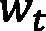

# 第二章：引入向量表示基础

**向量**和**向量表示**是神经搜索的核心，因为向量的质量决定了搜索结果的质量。在本章中，您将了解**机器学习**（**ML**）中**向量**的概念。您将看到常见的搜索算法，它们使用向量表示，以及它们的优缺点。

本章将涵盖以下主要主题：

+   在机器学习中引入向量

+   衡量两个向量之间的相似度

+   局部与分布式表示

本章结束时，您将对如何将每种类型的数据表示为向量以及为什么这一概念是神经搜索核心有一个扎实的理解。

# 技术要求

本章有以下技术要求：

+   一台最低配置为 4GB RAM 的笔记本电脑（推荐 8GB 或更多）

+   安装有版本 3.7、3.8 或 3.9 的 Python，并且运行在类似 Unix 的操作系统上，如 macOS 或 Ubuntu

本章的代码可以在[`github.com/PacktPublishing/Neural-Search-From-Prototype-to-Production-with-Jina/tree/main/src/Chapter02`](https://github.com/PacktPublishing/Neural-Search-From-Prototype-to-Production-with-Jina/tree/main/src/Chapter02)找到。

# 在机器学习中引入向量

文本是记录人类知识的重要手段。截止 2021 年 6 月，主流搜索引擎如 Google 和 Bing 索引的网页数量已达到 24 亿，并且大多数信息以文本形式存储。如何存储这些文本信息，甚至如何从存储库中高效地检索所需信息，已成为信息检索中的一个重要问题。解决这些问题的第一步在于以计算机*能够理解*的格式表示文本。

随着基于网络的信息日益多样化，除了文本，网页还包含大量的多媒体信息，如图片、音乐和视频文件。这些文件在形式和内容上比文本更加多样，满足了用户从不同角度的需求。如何表示和检索这些类型的信息，以及如何从互联网上海量的数据中准确找到用户所需的多模态信息，也是搜索引擎设计中需要考虑的一个重要因素。为了实现这一点，我们需要将每个文档表示为其向量表示。

*向量*是具有大小和方向的对象，就像你在学校学到的那样。如果我们能够使用向量表示我们的数据，那么我们就能够通过角度来衡量两条信息的相似性。更具体地说，我们可以这样说：

+   两条信息被表示为向量

+   两个向量都从原点[*0, 0*]开始（假设为二维）

+   两个向量形成一个角度

*图 2.1*说明了两个向量之间的关系及其角度：


图 2.1 – 向量表示示例

**vec1**和**vec2**有相同的方向，但长度不同。**vec2**和**vec3**长度相同，但方向相反。如果角度为 0 度，则两个向量完全相同；如果向量的角度为 180 度，则两个向量完全相反。我们可以通过角度来衡量两个向量的相似度：角度越小，两个向量越接近。这个方法也称为**余弦相似度**。

实际上，余弦相似度是最常用的相似度度量之一，用于确定两个向量的相似度，但并不是唯一的方法。我们将在*测量两个向量之间的相似度*章节中更详细地探讨它以及其他相似度度量。在此之前，你可能会想知道我们如何将原始信息（如文本或音频）编码成数值向量。在这一部分，我们将实现这一目标。

我们将通过使用*Python*和*NumPy 库*深入探讨余弦相似度的细节。此外，我们还将介绍其他相似度度量，并在以下小节中简要讨论局部和分布式向量表示。

## 使用向量表示数据

让我们从最常见的场景开始：**表示文本信息**。

首先，我们来定义**特征向量**的概念。假设我们想为维基百科（英语版）构建一个搜索系统。截至 2022 年 7 月，英语维基百科有超过 650 万篇文章，包含超过 40 亿个单词（18 万个唯一单词）。我们可以将这些唯一单词称为维基百科的词汇表。

这篇维基百科文集中的每篇文章都应该被编码为一系列数值，这被称为特征向量。为此，我们可以将 650 万篇文章编码为 650 万个索引的特征向量，然后使用相似度度量（如余弦相似度）来衡量编码后的查询特征向量与索引的 650 万个特征向量之间的相似度。

编码过程涉及找到一个最优函数，将原始数据转换为其向量表示。那么我们如何实现这一目标呢？

我们首先从最简单的方法开始：使用**位向量**。位向量意味着向量中的所有值将是 0 或 1，具体取决于单词的出现情况。假设我们遍历词汇表中的所有唯一单词；如果该单词出现在特定文档*d*中，那么我们将该唯一单词位置的值设置为 1，否则为 0。

让我们回顾一下在*第一章*，*神经网络与神经搜索*一节中介绍的内容，假设我们有两个文档：

+   `doc1` = *Jina 是一个神经搜索框架*

+   `doc2` = *Jina 是用名为深度学习的前沿技术构建的*

1.  如果我们将这两个文档合并，我们将得到如下的词汇表（唯一单词）：

    ```py
    vocab = 'Jina is a neural search framework built with cutting age technology called deep learning'
    ```

1.  假设前述变量`vocab`是我们的词汇表，在经过预处理（分词和词干提取）后，我们得到如下的令牌列表：

    ```py
    vocab = ['a', 'age', 'built', 'call', 'cut', 'deep', 'framework', 'is', 'jina', 'learn', 'neural', 'search', 'technolog', 'with']
    ```

请注意，上述词汇表已经按字母顺序排序。

1.  要将`doc1`编码成向量表示，我们遍历`doc1`中的所有单词，并创建位向量：

    ```py
    import nltk
    doc1 = 'Jina is a neural search framework'
    doc2 = 'Jina is built with cutting age technology called deep learning'
    def tokenize_and_stem(doc1, doc2):
        tokens = nltk.word_tokenize(doc1 + doc2)
        stemmer = nltk.stem.porter.PorterStemmer()
        stemmed_tokens = [stemmer.stem(token) for token in 
                         tokens]
        return sorted(stemmed_tokens)
    def encode(vocab, doc):
        encoded = [0] * len(vocab)
        for idx, token in enumerate(vocab):
            if token in doc:
                encoded[idx] = 1  # token present in doc
        return encoded
    if __name__ == '__main__':
        tokens = tokenize_and_stem(doc1, doc2)
        encoded_doc1 = encode(vocab=tokens, doc=doc1)
        print(encoded_doc1)
    ```

上述代码块将`doc1`编码为位向量。在`encode`函数中，我们首先创建了一个充满 0 的 Python 列表；该列表的长度与词汇表的大小相同。然后，我们遍历词汇表，检查文档中单词的出现情况。如果单词存在，我们就将编码向量的值设置为`1`。最后，我们得到如下结果：

```py
>>> [1, 0, 0, 0, 0, 0, 0, 1, 1, 0, 0, 1, 1, 0, 0]
```

通过这种方式，我们成功地将文档编码成了其位向量表示。

重要提示

你可能注意到，在前面的示例中，位向量的输出包含大量的 0 值。在实际应用中，随着词汇表的大小不断增大，向量的维度变得非常高，编码文档中的大多数维度将被填充为 0，这对于存储和检索非常低效。这也叫做**稀疏向量**。一些 Python 库，例如 SciPy，具有强大的稀疏向量支持。一些深度学习库，如 TensorFlow 和 PyTorch，内置了稀疏张量支持。同时，Jina 原始数据类型支持 SciPy、TensorFlow 和 PyTorch 的稀疏表示。

到目前为止，我们已经学到，向量是一个既有大小又有方向的对象。我们还成功地使用位向量创建了两个文本文档的最简单形式的向量表示。现在，了解这两个文档的相似度将会非常有趣。我们将在下一节中深入学习这一点。

# 衡量两个向量之间的相似性

衡量两个向量之间的相似性在神经搜索系统中至关重要。一旦所有文档都被索引为向量表示，给定用户查询时，我们对查询执行相同的编码过程。最后，我们将编码后的查询向量与所有编码后的文档向量进行比较，以找出最相似的文档。

我们可以继续上一节中的示例，尝试衡量`doc1`和`doc2`之间的相似性。首先，我们需要运行脚本两次，分别编码`doc1`和`doc2`：

```py
doc1 = 'Jina is a neural search framework'
doc2 = 'Jina is built with cutting age technology called deep learning'
```

然后，我们可以为它们生成向量表示：

```py
encoded_doc1 = [1, 0, 0, 0, 0, 0, 0, 1, 1, 0, 0, 1, 1, 0, 0]
encoded_doc2 = [1, 1, 1, 1, 1, 1, 0, 1, 1, 0, 1, 0, 0, 1, 1]
```

由于编码结果的维度始终与词汇表的大小相同，因此问题已转化为如何衡量两个向量表示之间的相似度：`encoded_doc1`和`encoded_doc2`。

重要提示

上述的`encoded_doc1`和`encoded_doc2`的向量表示具有 15 维。我们很容易将 1D 数据可视化为一个点，2D 数据为一条线，3D 数据也能可视化，但对于高维数据就不容易了。实际上，我们可能会进行降维，将高维向量降至 3D 或 2D 以便绘制它们。最常见的技术叫做**t-sne**。

想象两个编码后的向量表示可以绘制在二维向量空间中。我们可以如下方式可视化`encoded_doc1`和`encoded_doc2`：


图 2.2 – 余弦相似度

然后，我们可以通过它们的角度来衡量`encoded_doc1`和`encoded_doc2`之间的相似度，具体来说，就是余弦相似度。余弦定理告诉我们：


假设*p*表示为[x1, y1]，*q*表示为[x2, y2]；那么，前述公式可以改写为：


由于余弦相似度也适用于高维数据，上述公式可以再次改写为：


基于公式，我们可以计算`encoded_doc1`和`encoded_doc2`之间的余弦相似度，如下所示：

```py
import math
def compute_cosine_sim(encoded_doc1, encoded_doc2):
    numerator = sum([i * j for i, j in zip(encoded_doc1, 
                encoded_doc2)])
    denominator_1 = math.sqrt(sum([i * i for i in 
                    encoded_doc1]))
    denominator_2 = math.sqrt(sum([i * i for i in 
                    encoded_doc2]))
    return numerator/(denominator_1 * denominator_2)
```

如果我们打印出`encoded_doc1`和`encoded_doc2`之间的相似度结果，得到如下：

```py
>>> 0.40451991747794525
```

在这里，我们得到了两个编码向量之间的余弦相似度，约等于*0.405*。在搜索系统中，当用户提交查询时，我们将查询编码为其向量表示。我们已经将所有文档（我们想要搜索的文档）各自离线编码为向量表示。通过这种方式，我们可以计算查询向量与所有文档向量之间的相似度得分，进而生成最终的排名列表。

重要提示

上述代码演示了如何计算余弦相似度。该代码没有经过优化。实际上，你应该始终使用 NumPy 对向量（NumPy 数组）执行向量化操作，以获得更高的性能。

## 超越余弦相似度的度量

尽管余弦相似度是最常用的相似度/距离度量，但也有一些其他常用的度量方法。我们将在本节中介绍另外两种常用的距离函数，即**欧几里得距离**和**曼哈顿距离**。

重要提示

相似度度量衡量两个文档之间的相似程度。另一方面，距离度量衡量两个文档之间的差异。在搜索场景中，你总是希望获得与查询最匹配的前 k 个结果。因此，如果你使用的是相似度度量，始终从排名列表中获取前 k 项。另一方面，在使用距离度量时，始终从排名列表中获取最后 k 项，或者反转排名列表并获取前 k 项。

与计算余弦相似度（通过测量两个向量之间的角度）不同，欧几里得距离通过计算两个数据点之间的线段长度来衡量相似度。例如，考虑下图中的两个二维文档：


图 2.3 – 欧几里得距离

如在*图 2.3*中所示，之前我们使用了`vec1`和`vec2`之间的角度来计算它们的余弦相似度。而对于欧几里得距离，我们的计算方式有所不同。`vec1`和`vec2`的起点都是 0，终点分别为`p`和`q`。现在，这两个向量之间的距离为：


另一个距离度量叫做`p`（位于(p1, p2)）和`q`（位于(q1, q2)），这两个向量之间的距离为：


如在*图 2.4*中所示，超平面已被分割成小块。每个块的宽度为 1，高度也为 1。`p`和`q`之间的距离变为 4：


图 2.4 – 曼哈顿距离

还有许多其他的距离度量，比如**汉明距离**和**角度距离**，但我们不会在这里深入探讨它们，因为余弦和欧几里得距离是最常用的相似度度量。这也引出了一个有趣的问题：我应该使用哪种距离/相似度度量来使向量相似度计算更有效？答案是*视情况而定*。

首先，这取决于你的任务和数据。但一般来说，在执行文本检索及相关任务时，余弦相似度将是你的首选。它已经广泛应用于诸如衡量两篇编码文本文档之间的相似度等任务。

深度学习模型也可能会影响你选择的相似度/距离度量。例如，如果你应用了度量学习技术来微调你的机器学习模型，以优化特定的相似度度量，那么你可能会坚持使用你优化过的相似度度量。更具体地说，注意以下几点：

+   你可以使用*孪生神经网络*，基于欧几里得距离优化输入对（查询和文档），从而得到一个新的模型。

+   在提取特征时，最好使用*欧几里得距离*作为相似度度量。

+   如果你的向量具有极高的维度，可能需要考虑将欧几里得距离转换为*曼哈顿距离*，因为它能够提供更强的鲁棒性。

重要提示

在实际应用中，不同的人工神经网络（ANN）库可能会使用不同的距离度量作为默认配置。例如，Annoy 库鼓励用户使用角度距离来计算向量距离，这是一种欧几里得距离的变种。关于 ANN 的更多内容将在*第三章*《系统设计与工程挑战》中介绍。

将数据编码为向量表示的方法有多种。一般来说，这可以分为两种形式：**局部表示**和**分布式表示**。上述数据编码为向量表示的方法可以归类为局部表示，因为它将每个唯一单词视为一个维度。

在接下来的章节中，我们将介绍最重要的局部表示和分布式表示算法。

# 局部和分布式表示

在本节中，我们将深入探讨 **局部表示** 和 **分布式表示**。我们将介绍这两种不同表示的特点，并列出用于编码不同数据模态的最广泛使用的局部和全局表示。

## 局部向量表示

作为经典的文本表示方法，**局部表示**仅利用向量中表示某个单词的 **不相交维度**。不相交维度意味着向量的每个维度代表一个单一的标记。

当只使用一个维度时，这被称为 **one-hot 表示**。*One-hot* 意味着单词被表示为一个长向量，向量的维度是要表示的单词总数。大多数维度为 0，而只有一个维度的值为 1。不同的单词具有维度为 1 的值并不会重复。如果这种表示方式以稀疏的方式存储，即根据维度为 1 为每个单词分配一个数字 ID，那么它将更加简洁。

One-hot 还意味着在假设所有单词彼此独立的情况下，不需要额外的学习过程。这保持了表示单词的向量之间的正交性，因此具有很强的区分能力。通过最大熵、支持向量机、条件随机场和其他机器学习算法，one-hot 表示在文本分类、文本聚类和词性标注等多个方面具有显著效果。对于关键字匹配主导的特定检索应用场景，基于 one-hot 表示的词袋模型仍然是主流选择。

然而，one-hot 表示忽略了单词之间的语义关系。此外，当表示一个包含 **N** 个单词的词汇表 **V** 时，one-hot 表示需要构建一个维度为 **N** 的向量。这导致了参数爆炸和数据稀疏性的问题。

另一种局部表示方法被称为 **词袋模型**，或 *比特向量表示*，我们在本章前面已经介绍过。

作为一种向量表示方法，词袋模型将文本视为单词集合，仅记录单词是否出现在文本中，而忽略文本中的单词顺序和语法。基于单词的 one-hot 表示，词袋模型将文本表示为由 0 和 1 组成的向量，并为位操作提供了很好的支持。该方法可以在检索场景中进行常规查询处理。由于它仍然保持了单词之间的正交性，因此在文本分类等任务中表现良好。现在，我们将使用一种名为 **scikit-learn** 的 *Python 机器学习框架* 构建一个位向量表示：

```py
from sklearn.feature_extraction.text import CountVectorizer
corpus = [
    'Jina is a neural search framework for neural search',
    'Jina is built with cutting edge technology called deep 
     learning',
]
vectorizer = CountVectorizer(binary=True)
X = vectorizer.fit_transform(corpus)
print(X.toarray())
```

输出如下所示：

```py
>>> array([[0, 0, 0, 0, 0, 1, 1, 1, 1, 0, 1, 1, 0, 0],
           [1, 1, 1, 1, 1, 0, 0, 1, 1, 1, 0, 0, 1, 1]])
```

基于词袋（位向量）模型，词袋表示算法考虑了词语在文本中的出现频率。因此，不同单词对应的词袋编码特征值不再是 0 或 1，而是该单词在文本中出现的频率。一般来说，单词在文本中出现得越频繁，它对文本的贡献就越重要。为了获得表示，你只需要在前面的实现中将 `binary=False` 设置即可：

```py
from sklearn.feature_extraction.text import CountVectorizer
corpus = [
    'Jina is a neural search framework for neural search',
    'Jina is built with cutting edge technology called deep 
     learning',
]
vectorizer = CountVectorizer(binary=False)
X = vectorizer.fit_transform(corpus)
print(X.toarray())
```

从以下输出中，你可以发现已考虑了词频。例如，由于 `neural` 这个词出现了两次，编码结果的值增加了 `1`：

```py
>>> array([[0, 0, 0, 0, 0, 1, 1, 1, 1, 0, 2, 2, 0, 0],
          [1, 1, 1, 1, 1, 0, 0, 1, 1, 1, 0, 0, 1, 1]])
```

最后但同样重要的是，我们有一个最常用的局部表示方法，称为**词频-逆文档频率**（**tf-idf**）**表示法**。

tf-idf 是一种常见的信息检索和数据挖掘表示方法。词 *i* 在文本 j 中的 TF-IDF 值如下所示：


这里，*ni, j* 表示词 *i* 在文本 *j* 中出现的频率；*|d_j |* 表示文本中词的总数；*|D|* 表示语料库中的词汇数量，而  表示包含词 *i* 的文档数量。通过考虑词语在文本中的出现频率，TF-IDF 算法通过计算词的 IDF 来进一步考虑词在整个文本中的普遍重要性。也就是说，词语在文本中出现得越频繁，它在其他部分的文本中出现的频率就越低。这表明，词语对当前文本的重要性越大，它的权重就越高。此算法的 scikit-learn 实现如下：

```py
from sklearn.feature_extraction.text import TfidfVectorizer
corpus = [
    'Jina is a neural search framework for neural search',
    'Jina is built with cutting edge technology called deep 
     learning',
]
vectorizer = TfidfVectorizer()
X = vectorizer.fit_transform(corpus)
print(X.toarray())
```

Tf-Idf 加权编码结果如下所示：

```py
>>> array([[0., 0., 0., 0., 0., 0.30134034, 0.30134034, 0.21440614, 0.21440614, 0.,0.60268068, 0.60268068, 0., 0.       ],
          [0.33310232, 0.33310232, 0.33310232, 0.33310232, 0.33310232, 0., 0\. , 0.23700504, 0.23700504, 0.33310232, 0., 0., 0.33310232, 0.33310232]])
```

到目前为止，我们已经介绍了局部向量表示。接下来的章节，我们将深入探讨分布式向量表示、它为何需要以及常用的算法。

## 分布式向量表示

尽管文本的局部表示在文本分类和数据召回等任务中具有优势，但它存在数据稀疏性的问题。

具体而言，如果语料库有 100,000 个不同的标记，向量的维度将变为 100,000。假设我们有一个包含 200 个标记的文档。为了表示这个文档，向量中只有 200 个条目不为零。由于词汇表的标记没有出现在文档中，所有其他维度仍然得到零值。

这给数据存储和检索带来了巨大挑战。因此，一个自然的想法是获取文本的低维稠密向量，称为文本的 **分布式表示**。

在本节中，首先描述了单模态（如文本、图像和音频）的分布式表示；然后，介绍了多模态联合学习的分布式表示方法。我们还会选择性地介绍几种重要的表示学习算法，基于数据模态，即文本、图像、音频和跨模态表示学习。让我们先看看基于文本的算法。

在下表中，我们列出了用于编码不同数据模态的一些选定模型：

| **模型** | **模态** | **领域** | **应用** |
| --- | --- | --- | --- |
| `BERT` | 文本 | 密集检索 | 文本到文本搜索，问答 |
| `VGGNet` | 图像 | 基于内容的图像检索 | 图像到图像搜索 |
| `ResNet` | 图像 | 基于内容的图像检索 | 图像到图像搜索 |
| `Wave2Vec` | 声音 | 基于内容的音频检索 | 音频到音频搜索 |
| `CLIP` | 文本和图像 | 跨模态检索 | 文本到图像搜索 |

表 1.1 – 可用作不同输入模态编码器的选定模型

### 基于文本的算法

因为文本携带着重要信息，文本的分布式表示在搜索引擎中起着重要作用，并且在学术界和工业界得到广泛研究。考虑到我们拥有大量未标记的文本数据（如维基百科），在涉及基于文本的算法时，我们通常对大语料库进行无监督预训练。

基于类似单词具有类似上下文的信念，Mikolov 等人提出了 *word2vec* 算法，其中包括两个简单的神经网络模型用于学习：**Continuous-Bag-of-Words** (**CBOW**) 和 **skip-gram** (**SG**) 模型。

具体来说，CBOW 模型用于推导单词的表示，，使用其周围的词，例如单词前两个和后两个。例如，给定维基百科文档中的一个句子，我们随机屏蔽该句子内的一个标记。我们尝试通过其周围的标记预测屏蔽的标记：

```py
doc1 = 'Jina is a neural [MASK] framework'
```

在前述文档中，我们屏蔽了标记搜索，并试图预测被屏蔽的标记*u*的向量表示，通过周围标记的表示之和，，并计算*u*与之间的点积。在训练时，我们将选择一个标记*y*，以最大化点积：


重要说明

需要注意的是，在训练之前，我们将随机初始化向量值。

另一方面，SG 试图从当前标记预测周围标记的向量表示。CBOW 和 SG 之间的区别在*图 2.5*中有所说明：


图 2.5 – CBOW 和 SG（来源：Efficient estimation of word representations in vector space）

这两个模型都用于通过最大化整个语料库上的目标函数的对数似然来学习词表示。为了减轻由输出层 softmax 函数造成的大量计算负担，Mikolov 等人创建了两种优化方法，即**分层 softmax**和**负采样**。传统的深度神经网络将每个下一个词预测为一个分类任务。这个网络必须有许多输出类作为唯一的标记。例如，在预测英文维基百科中的下一个词时，类的数量超过 160,000。这是极其低效的。分层 softmax 和负采样用分层层替换了平坦的 softmax 层，该层以词作为叶子，并通过分类判断两个标记是否为真对（语义上相似）或假对（独立标记），将多类分类问题转换为二元分类问题。这大大提高了词嵌入的预测速度。

在预训练之后，我们可以给这个 word2vec 模型一个标记，得到所谓的词嵌入。这个词嵌入由一个向量表示。一些预训练的`word2vec`向量被表示为 300 维的词向量。维度远远小于我们之前介绍的稀疏向量空间模型。因此，我们也将这些向量称为密集向量。

在诸如*word2vec*和*GloVe*的算法中，一个词的表示向量在训练后通常保持不变，并且可以应用于下游应用，例如命名实体识别。

然而，相同单词在不同上下文中的语义可能会有所不同，甚至可能有显著不同的含义。2019 年，谷歌宣布了**双向编码器表示的转换器**（**BERT**），这是一个基于转换器的神经网络，用于自然语言处理。BERT 使用转换器网络表示文本，并通过掩蔽语言模型获取文本的上下文信息。此外，BERT 还使用**下一个句子预测**（**NSP**）来增强文本关系的表示，并在许多文本表示任务中取得了良好的效果。

类似于 word2vec，BERT 已经在 Wikipedia 数据集和其他一些数据集（如 BookCorpus）上进行了预训练。它们组成了一个超过 30 亿标记的词汇表。BERT 还在不同的语言（如英语和德语）以及多语言数据集上进行了训练。

BERT 可以通过预训练和微调范式在大量语料库上进行训练，而不需要任何标注。在预测过程中，待预测的文本再次被输入到训练好的网络中，以获得包含上下文信息的动态向量表示。在训练过程中，BERT 根据一定的比例替换原始文本中的词语，并利用训练模型做出正确的预测。BERT 还会添加一些特殊字符，如`[CLS]`和`[SEP]`，以帮助模型正确判断两个输入句子是否是连续的。再一次，我们有`doc1`和`doc2`，如下所示；`doc2`是`doc1`的下一个句子：

+   `doc1` = *Jina 是一个神经搜索框架*

+   `doc2` = *Jina 是基于深度学习的前沿技术构建的*

在预训练期间，我们将两个文档视为两个句子，并表示文档如下：

```py
doc = '[CLS] Jina is a neural [MASK] framework [SEP] Jina is built with cutting edge technology called deep learning'.
```

在文本输入后，BERT 的输入由三种类型的向量组成，即`[MASK]`标记。根据 BERT 论文的作者（*BERT: Pre-training of Deep Bidirectional Transformers for Language Understanding*）的描述，大约 15%的标记会被掩盖（Jacob 等人）。


图 2.6 – BERT 输入表示。每个输入嵌入是三个嵌入的总和

在预训练阶段，由于我们使用 NSP 作为训练目标，第二个句子中大约 50%是“真实”的下一个句子，而另外 50%的句子是从语料库中随机选择的，这意味着它们不是紧接着第一个句子的句子。这帮助我们提供正负样本对以改善模型的预训练。BERT 的目标函数是正确预测被掩盖的词汇以及判断下一个句子是否是正确的句子。

如前所述，预训练 BERT 后，我们可以针对特定任务微调该模型。BERT 论文的作者在不同的下游任务上微调了预训练模型，如问答和语言理解，并在 11 个下游数据集上取得了最先进的性能。

### 基于视觉的算法

随着互联网的快速发展，互联网中的信息载体日益多样化，图像提供了各种视觉特征。许多研究人员期望将图像编码为向量进行表示。最广泛使用的图像分析模型架构被称为**卷积神经网络**（**CNN**）。

一个 CNN 接收形状为(`Height`, `Width`, `Num_Channels`)的图像作为输入（通常是一个三通道的 RGB 图像或一个单通道的灰度图像）。图像将通过多个卷积层之一进行处理。这一过程使用一个内核（或滤波器）并在输入上滑动，图像变成一个抽象的激活图。

在多个卷积操作之一之后，激活图的输出将通过一个池化层。池化层对特征图中的一小群神经元应用最大值或均值操作，这被称为最大池化和均值池化。池化层可以显著降低特征图的维度，将其转换为更紧凑的表示。

通常，多个卷积层和一个池化层的组合被称为卷积块。例如，三个卷积层加一个池化层构成一个卷积块。在卷积块的末尾，我们通常会应用展平操作，以获取图像数据的向量表示。

在下面的截图中，我们展示了一个精美设计的 CNN 模型，名为 VGG16。如图所示，它由五个卷积块组成，每个卷积块包含两到三个卷积层和一个最大池化层。在这些块的末尾，激活图被展平为一个特征向量：


图 2.7 – VGG16 由五个卷积块组成，并通过 softmax 分类头生成分类结果

值得一提的是，VGG16 是为 ImageNet 分类设计的。因此，在激活图展平为特征向量后，它会连接到两个全连接层（稠密层）和一个 softmax 分类头。

在实际应用中，我们将移除 softmax 分类头，将该分类模型转换为嵌入模型。给定一张输入图像，这个嵌入模型会输出一个展平的特征图，而不是图像中物体的分类结果。此外，与 VGGNet 相比，ResNet 是一个更复杂但更常用的视觉特征提取器。

除了文本和图像，音频搜索也是一种重要的搜索应用，例如，用于识别短片中的音乐或搜索具有相似风格的音乐。在下一节中，我们将列出该方向上的几种深度学习模型。

### 基于声学的算法

给定一系列声学输入，深度学习驱动的算法在声学领域产生了巨大影响。例如，它们已广泛应用于文本转语音任务。给定一段音乐作为查询，寻找相似（或相同）的音乐在音乐应用中是常见的需求。

一种最新的基于音频数据训练的最先进算法叫做**wave2vec 2.0**。与 BERT 类似，wave2vec 是以无监督方式训练的。通过一段音频数据，在预训练过程中，wave2vec 会遮掩音频输入的部分内容，并尝试学习这些被遮掩的部分。

wave2vec 与 BERT 之间的主要区别在于音频是一种连续信号，没有明确的标记切分为 tokens。Wave2vec 将每个 25 毫秒长的音频视为一个基本单元，并将每个 25 毫秒的基本单元输入到 CNN 模型中，以学习单元级的特征表示。然后，部分输入被遮掩，并输入到类似 BERT 的 Transformer 模型中，以预测被遮掩的输出。训练目标是最小化原始音频与预测音频之间的对比损失。

值得一提的是，对比（自监督）预训练也广泛应用于文本或图像的表征学习。例如，给定一张图像作为输入，我们可以稍微增强图像内容，生成同一图像的两个视图：尽管这两个视图看起来不同，但我们知道它们来自同一张图像。

这种自监督对比学习已经广泛应用于表征学习：即在给定任何类型输入的情况下，学习出一个好的特征向量。当将模型应用于特定领域时，仍然建议提供一些标注数据，以通过额外的标签对模型进行微调。

### 超越文本、视觉和声学的算法

在现实生活中，存在多种信息载体。除了文本、图像和语音，视频、动作甚至蛋白质都包含了丰富的信息。因此，许多尝试已经被做出来以获取向量表示。DeepMind 的研究人员开发了*AlphaFold*和*AlphaFold2*算法。基于传统特征，如氨基酸序列，AlphaFold 算法可以用于获取蛋白质表达向量并计算其在空间中的三维结构，极大地提高了蛋白质分析领域的实验效率。

此外，在 2021 年，GitHub 推出了 Copilot，帮助程序员自动完成代码。在此之前，OpenAI 开发了*Codex*模型，它能够将自然语言转换为代码。基于 Codex 的模型架构，GitHub 利用其开源的 TB 级代码库大规模训练该模型，并完成了 Copilot 模型，帮助程序员编写新代码。Copilot 还支持多种编程语言的生成和补全，如 Python、JavaScript 和 Go。在搜索框中，如果我们想进行代码搜索或评估两段代码的相似性，可以使用 Codex 模型将源代码编码为向量表示。

前述操作大多专注于文本、图像或音频的单独编码，因此编码后的向量空间可能会有显著差异。为了将不同模态的信息映射到相同的向量空间，OpenAI 的研究人员提出了 CLIP 模型，该模型能够有效地将图像映射到文本。具体来说，CLIP 包括一个图像编码器和一个文本编码器。在输入图像和多个文本后，CLIP 同时对它们进行编码，并希望找到与每张图像最匹配的文本。通过在大规模数据集上训练，CLIP 能够获得图像和文本的优秀表示，并将它们映射到相同的向量空间。

# 总结

本章介绍了向量表示的方法，这是搜索引擎运作中的一个重要步骤。

首先，我们介绍了向量表示的重要性及其使用方法，接着讨论了局部和分布式向量表示算法。在分布式向量表示方面，介绍了文本、图像和音频的常用表示算法，并总结了其他模态和多模态的常见表示方法。因此，我们发现，与稀疏向量相比，密集向量表示方法通常包含相对丰富的上下文信息。

在构建可扩展的神经搜索系统时，创建一个能够将原始文档编码为高质量嵌入的编码器非常重要。这个编码过程需要快速执行，以减少索引时间。在搜索时，必须应用相同的编码过程，并在合理的时间内找到排名靠前的文档。在下一章中，我们将利用本章的思想，构建创建可扩展神经搜索系统的思维导图。

# 进一步阅读

+   Devlin, Jacob 等人。“Bert：用于语言理解的深度双向变换器的预训练。”*arXiv 预印本 arXiv:1810.04805*（2018 年）。

+   Simonyan, Karen 和 Andrew Zisserman。“非常深的卷积网络用于大规模图像识别。”*arXiv 预印本 arXiv:1409.1556*（2014 年）。

+   He, Kaiming 等人。“深度残差学习用于图像识别。”*IEEE 计算机视觉与模式识别会议论文集*，2016 年。

+   Schneider, Steffen 等人. “wav2vec: 用于语音识别的无监督预训练。” *arXiv 预印本 arXiv:1904.05862* (2019)。

+   Radford, Alec 等人. “从自然语言监督中学习可转移的视觉模型。” *国际机器学习会议*。PMLR, 2021。
