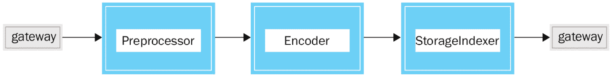
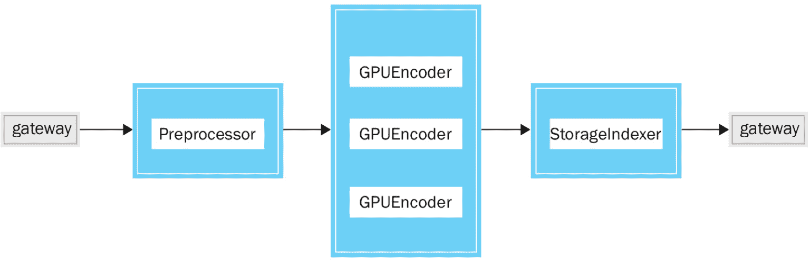
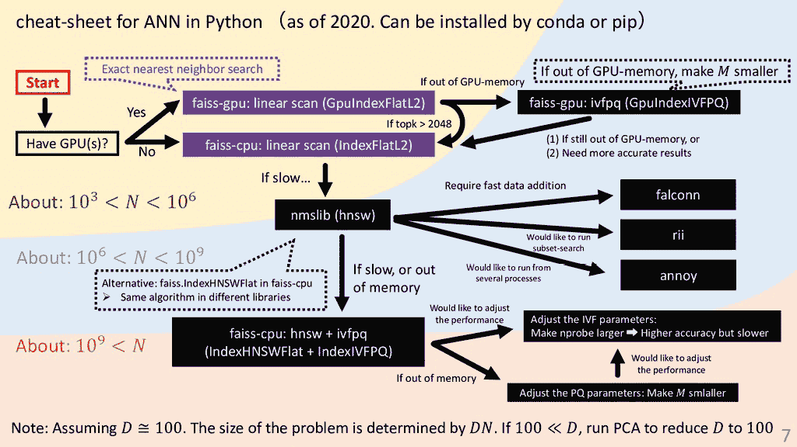
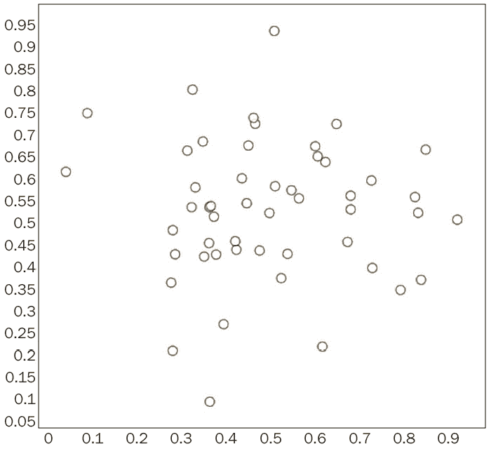
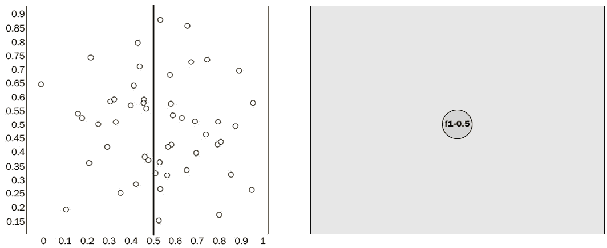
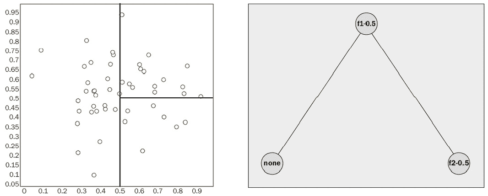
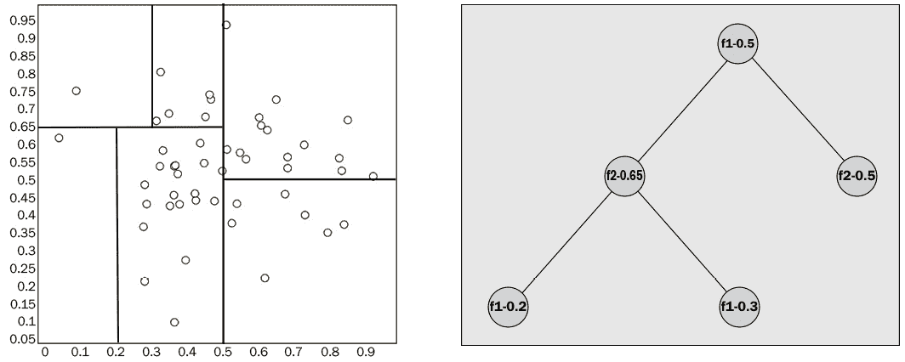
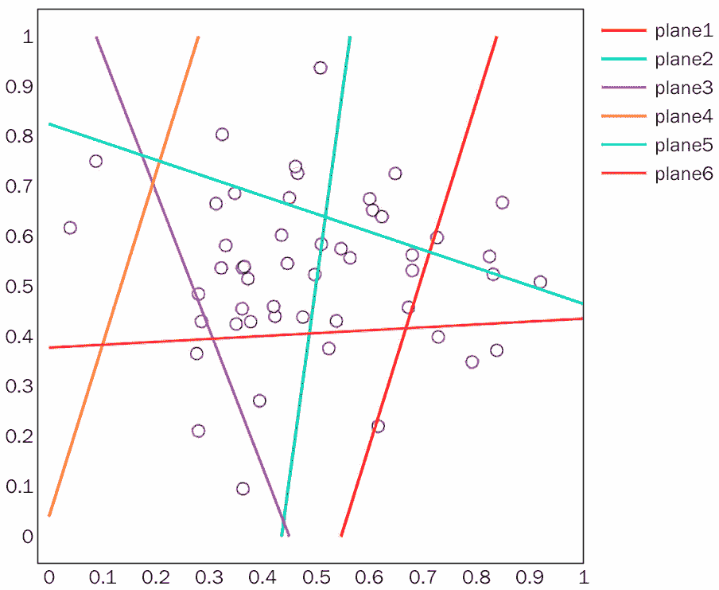
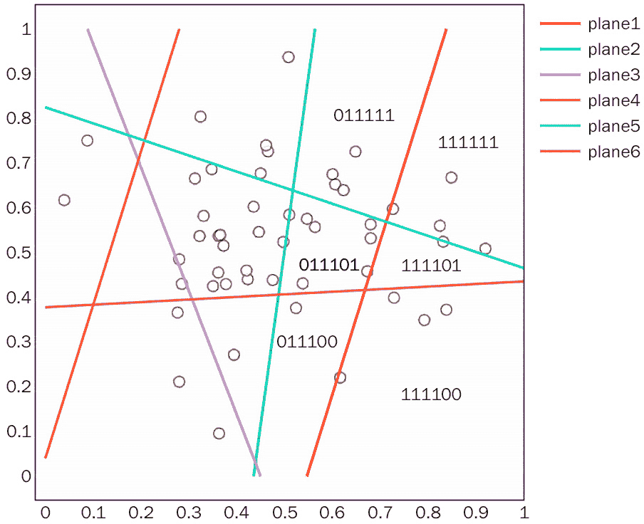
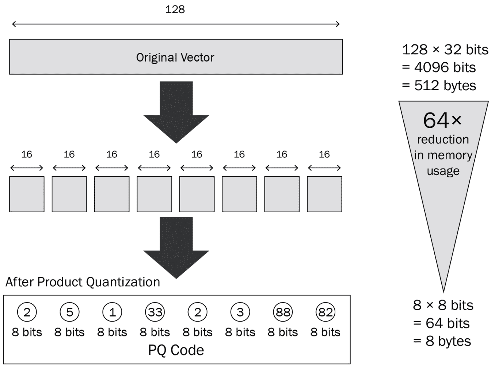

# 第三章：系统设计与工程挑战

理解**机器学习**（**ML**）和深度学习的概念是至关重要的，但如果你希望构建一个由**人工智能**（**AI**）和深度学习驱动的高效搜索解决方案，你还需要具备生产工程能力。有效地部署机器学习模型需要的软件工程和 DevOps 等技术领域中的能力。这些能力被称为**MLOps**。特别是对于一个需要高可用性和低延迟的搜索系统，这一点尤为重要。

在本章中，你将学习设计搜索系统的基础知识。你将理解**索引**和**查询**等核心概念，并了解如何使用它们来保存和检索信息。

在本章中，我们将特别讨论以下主要内容：

+   索引与查询

+   评估神经搜索系统

+   构建神经搜索系统中的工程挑战

本章结束时，你将全面了解将神经搜索投入生产时可能遇到的能力和困难。你将能够评估何时使用神经搜索以及哪种方法最适合你自己的搜索系统。

# 技术要求

本章的技术要求如下：

+   配备至少 4 GB RAM 的笔记本电脑；建议使用 8 GB。

+   在类 Unix 操作系统（如 macOS 或 Ubuntu）上安装了版本为 3.7、3.8 或 3.9 的 Python。

本章的代码文件可以在[`github.com/PacktPublishing/Neural-Search-From-Prototype-to-Production-with-Jina`](https://github.com/PacktPublishing/Neural-Search-From-Prototype-to-Production-with-Jina)找到。

# 引入索引和查询

在本节中，您将通过两个重要的高层任务来构建搜索系统：

+   **索引**：这是收集、解析和存储数据的过程，以便于快速和准确的信息检索。这包括添加、更新、删除和读取待索引的文档。

+   **查询**：查询是解析、匹配和排名用户查询，并将相关信息返回给用户的过程。

在神经搜索系统中，索引和查询都由一系列任务组成。我们将深入探讨索引和查询的各个组成部分。

## 索引

索引是搜索系统中的一个重要过程。它构成了核心功能，因为它有助于高效地检索信息。索引将文档缩减为其中包含的有用信息。它将术语映射到包含相关信息的相应文档中。在搜索系统中找到相关文档的过程，本质上与查阅字典的过程相同，其中索引帮助你有效地查找单词。

在介绍详细内容之前，我们先通过以下问题来了解我们的当前状况：

+   索引管道的主要组件有哪些？

+   什么内容可以被索引？

+   我们如何进行增量索引，以及如何实现快速索引？

如果你不知道这些问题的答案，不用担心，继续阅读！

在索引管道中，我们通常有三个主要组件：

+   对于`text/plain`，我们可能需要一个分词器和词干提取器，如在*第一章*中介绍的那样，*神经网络与神经搜索*。如果我们想要索引一种`image/jpeg`格式的图像，我们可能需要一个组件来调整大小或将输入图像转换为神经网络所期望的格式。这高度依赖于你的任务和输入数据。

+   **编码器**：在神经搜索系统中，编码器与神经网络是相同的。这个神经网络将你的预处理输入作为向量表示（嵌入）。在这一步之后，每个由文本、图像、视频甚至 DNA 信息组成的原始文档应该被表示为一组数值向量。

+   **索引器（用于存储）**：在索引阶段，索引器，也称为**存储索引器**，将从编码器产生的向量存储到存储设备中，如内存或数据库。这包括关系型数据库（如 PostgresSQL）、NoSQL（如 MongoDB），甚至更好的是，向量数据库，如 Elasticsearch。

需要注意的是，每个索引任务是独立的，它可以从不同的角度有所不同。例如，如果你在电子商务环境中构建一个多模态搜索引擎，你的目标是创建一个能够同时接受文本和图像作为查询，找到最相关产品的搜索系统。在这种情况下，你的索引可能有两个路径：

+   文本信息应该经过预处理，并使用基于文本的预处理器和编码器进行编码。

+   同样，图像数据应该经过预处理，并使用基于图像的预处理器和编码器进行编码。

你可能会想知道，什么可以被索引。任何东西，只要你有编码器并且数据可以被编码。一些常见的可索引数据类型包括文本、图像、视频和音频。正如我们在前面的章节中讨论的，你可以对源代码进行编码，以构建源代码搜索系统，或者对基因信息进行编码，构建一个围绕基因信息的搜索系统。下面的图示说明了一个索引管道：



图 3.1 – 一个简单的索引管道将文档作为输入，并应用预处理和编码。最后，将编码后的特征保存到存储中

现在，我们进入一个重要的话题：增量索引。首先，让我们讨论一下什么是增量索引。

### 理解增量索引

**增量索引**是任何搜索系统中的一个关键特性。考虑到我们要索引的数据集合可能每天都会发生显著变化，我们无法每次在数据发生小的变化时都重新索引整个数据集合。

通常，有两种常见的做法来执行索引任务，如下所示：

+   **实时索引**：对于任何发送到集合中的数据，索引器会立即将文档添加到索引中。

+   **定时索引**：对于任何发送到集合中的数据，调度程序触发索引任务并执行索引工作。

上述做法各有优缺点。在实时索引中，用户可以立即获取新添加的文档（如果匹配的话），但也会消耗更多的系统资源，并可能引入数据不一致。然而，在定时索引的情况下，用户不能实时访问新添加的结果，但它的错误率较低，且更易于管理。

你选择的索引策略取决于你的任务。如果任务是时间敏感的，最好使用实时索引。否则，设置一个定时任务并在某个时间增量索引数据会是一个不错的选择。

### 提速索引

在进行神经搜索索引任务时，另一个关键问题是索引的速度。传统的符号搜索系统只处理文本数据，而神经搜索系统的输入可以是三维的（*高度 * 宽度 * 颜色通道*），如 RGB 图像，或者是四维的（*帧 * 高度 * 宽度 * 颜色通道*），如视频。这类数据可以通过不同的模态进行索引，这会显著放慢数据预处理和编码过程。

通常，我们可以使用几种策略来提升索引速度。以下是其中一些策略：

+   **预处理器**：对某些数据集应用特定的预处理操作可以显著提高索引速度。例如，如果你要索引高分辨率图像，最好将它们缩小尺寸。

+   **GPU 推理**：在神经搜索系统中，编码占用了大部分的索引时间。更具体地说，给定一个预处理文档，使用深度神经网络将文档编码成向量是需要时间的。通过利用 GPU 实例进行编码，这一过程可以得到极大的改善。由于 GPU 具有更高的带宽内存和 L1 缓存，GPU 非常适合用于机器学习任务。

+   **横向扩展**：在单台机器上索引大量数据会使得过程变得缓慢，但如果将数据分布到多台机器上并进行并行索引，速度可以大大提高。例如，下面的图示展示了为管道分配更多编码器：



图 3.2 – 使用三台编码器并行利用 GPU 推理快速进行索引

值得一提的是，如果您来自文本检索背景，构建符号搜索的倒排索引时也需要考虑**索引压缩**的问题。在神经搜索系统中，情况不再完全相同：

+   首先，编码器将文档作为输入并将文档内容编码成一个 N 维向量（嵌入）。因此，我们可以将编码器本身视为一个压缩函数。

+   第二，压缩密集向量最终会牺牲向量的质量。通常，较高维度的向量能够带来更好的搜索结果，因为它们能更好地表示被编码的文档。

在实践中，我们需要在维度和内存使用之间找到一个平衡点，以便将所有向量加载到内存中进行大规模相似性搜索。在接下来的部分中，我们将深入探讨查询部分，这将使您能够了解如何进行大规模相似性搜索。

## 查询

当涉及到查询流水线时，它与索引流水线有很多组件重叠，但有一些修改和额外的组件，如排序器。在此阶段，流水线的输入是单个用户查询。典型查询任务有四个主要组件：

+   **预处理器**：此组件类似于索引流水线中的预处理器。它将查询文档作为输入，并对输入应用与索引流水线相同的预处理器。

+   **编码器**：编码器将预处理后的查询文档作为输入，并产生向量作为输出。需要注意的是，在跨模态搜索系统中，您的索引编码器可能与查询步骤中的编码器不同。这将在*第七章*，*深入探讨 Jina 的高级使用案例*中解释。

+   **索引器**：这个索引器，更好地称为**搜索索引器**，接收编码器生成的向量作为输入，并在所有索引文档上进行大规模相似性搜索。这被称为**近似最近邻**（**ANN**）搜索。我们将在接下来的部分详细解释这个概念。

+   **排序器**：排序器接收查询向量和每个集合项的相似度分数，按降序生成一个排名列表，并将结果返回给用户。

索引和查询的一个主要区别在于索引（在大多数情况下）是离线任务，而查询是在线任务。具体来说，当我们引导一个神经搜索系统并创建一个查询时，系统会返回一个空列表，因为此时尚未索引任何内容。在将搜索系统*暴露*给用户之前，我们应该预先索引数据集中的所有文档。这种索引是在离线状态下进行的。

另一方面，在查询任务中，用户发送一个查询给系统，并期望立即获得匹配结果。所有的预处理、编码、索引搜索和排名应该在等待时间内完成。因此，这是一个在线任务。

重要提示

实时索引可以视为一个在线任务。

与索引不同，在查询时，每个用户将单个文档作为查询发送给系统。预处理和编码只需要很短的时间。另一方面，在索引存储中查找相似项成为一个关键的工程挑战，这会影响神经搜索系统的性能。为什么会这样？

例如，您已经预先索引了十亿个文档，在查询时，用户将一个查询发送给系统，文档随后被预处理并编码为向量（嵌入）。给定查询向量，您现在需要在 100 万个向量中找到前 N 个相似向量。如何实现这一点？通过计算向量之间的距离逐个进行相似性搜索可能需要很长时间。与其如此，我们执行 ANN 搜索。

重要提示

当我们谈论 ANN 搜索时，我们是在考虑百万级/十亿级的搜索。如果你想构建一个玩具示例并搜索几百或几千个文档，普通的线性扫描就足够快了。在生产环境中，请按照下一节将介绍的选择策略进行操作。

### ANN 搜索

如其名称所示，ANN 搜索是不同因素之间的权衡：准确性、运行时间和内存消耗。与暴力搜索相比，它确保了运行时间用户可以接受，同时牺牲了某些程度的精度/召回率。它能够达到多快的速度？给定十亿个 100 维向量，它可以适配到内存为 32 GB 的服务器上，响应时间为 10 毫秒。在深入了解 ANN 搜索的细节之前，让我们先看一下下面的图示：



Figure 3.3 – ANN cheat sheet (source: Billion-scale Approximate Nearest Neighbor Search, Yusuke Matsui)

上面的图示说明了*如何根据您的搜索系统选择 ANN 库*。在图示中，`N`表示您*StorageIndexer* 中文档的数量。不同的 N 数量可以通过不同的 ANN 搜索库进行优化，例如 `FAISS` ([`github.com/facebookresearch/faiss`](https://github.com/facebookresearch/faiss)) 或 `NMSLIB` ([`github.com/nmslib/nmslib`](https://github.com/nmslib/nmslib))。与此同时，由于您很可能是 Python 用户，`Annoy` 库 ([`github.com/spotify/annoy`](https://github.com/spotify/annoy)) 提供了一个用户友好的接口，并具有合理的性能，足以应对百万级向量搜索。

上述库是基于不同算法实现的，其中最流行的包括 **KD-Tree**、**局部敏感哈希** (**LSH**) 和 **产品量化** (**PQ**)。

KD-Tree 遵循一个迭代过程来构建树。为了简化可视化，我们假设数据只包含两个特征，*f1*（`x` 轴）和 *f2*（`y` 轴），其形态如下：



图 3.4 – KD-Tree，样本数据集以进行索引

KD-Tree 的构建从选择一个实际的特征并为该特征设置阈值开始。为了说明这个概念，我们从手动选择 f1 和特征阈值 0.5 开始。为此，我们得到如下的边界：



图 3.5 – KD-Tree 构建迭代 1

从 *图 3.5* 中可以看出，特征空间已经通过我们首次选择的 f1 阈值 0.5 分为两部分。那么它是如何反映在树中的呢？在构建索引时，我们实际上是在创建一棵二叉搜索树。我们首次选择 f1 阈值 0.5 成为根节点。给定每个数据点，如果 f1 大于 0.5，它将被放置在节点的右侧。否则，如 *图 3.6* 所示，我们将其放置在节点的左侧：



图 3.6 – KD-Tree 构建迭代 2

我们从前面的树继续。在第二次迭代中，我们定义规则为：给定 f1 > 0.5，选择 f2 阈值为 0.5。如前面的图所示，我们现在根据新规则再次拆分特征空间，这也体现在我们的树上：我们在图中创建了一个新节点 **f2-0.5**（**none** 节点仅用于可视化；我们尚未创建此节点）。如下图所示：



图 3.7 – KD-Tree 构建迭代 N（最后一次迭代）

如 *图 3.7* 所示，整个特征空间已被分割成六个区间。与之前相比，我们新增了三个节点，其中包括两个叶节点：

+   之前的 **none** 被一个实际的节点 **f2-0.65** 替代；这个节点基于阈值 0.65 对 f2 的空间进行了拆分，且仅在 f1<0.5 时发生。

+   当 f2<0.65 时，我们进一步通过阈值 0.2 对 f1 进行拆分。

+   当 f2>0.65 时，我们进一步通过阈值 0.3 对 f1 进行拆分。

为此，我们的树有三个叶节点，每个叶节点可以构造两个区间（小于/大于阈值），总共有六个区间。此外，每个数据点可以放入其中一个区间。然后，我们完成了 KD 树的构建。需要注意的是，构建 KD 树可能并不简单，因为你需要考虑一些超参数，例如如何设置阈值或应该创建多少个区间（或者停止标准）。在实践中，并没有固定的规则。通常，可以使用均值或中位数来设置阈值。区间的数量可能会高度依赖于结果的评估和微调。

在查询时，给定一个用户查询，它可以被放置到特征空间中的某个区间。我们可以计算查询与区间内所有项目之间的距离，将它们作为最近邻候选项。我们还需要计算查询与其他区间之间的最小距离。如果查询向量与其他区间的距离大于查询向量与最近邻候选项之间的距离，我们可以通过修剪树的叶节点来忽略该区间内的所有数据点。否则，我们也将该区间内的数据点视为最近邻候选项。

通过构建 KD 树，我们不再需要计算查询向量与每个文档之间的相似性。只有某些数量的区间应该被视为候选项。因此，搜索时间可以大大减少。

实际上，KD 树受到维度灾难的困扰。将其应用于高维数据时会很棘手，因为每个特征我们总是创建多个阈值，因此需要搜索的区间非常多。**局部敏感哈希**（**LSH**）可能是一个很好的替代算法。

LSH 的基本思想是相似的文档共享相同的哈希码，并且它的设计旨在最大化冲突。更具体地说：给定一组向量，我们希望有一个哈希函数能够将相似的文档编码到相同的哈希桶中。然后，我们只需在桶内查找相似的向量（无需扫描所有数据）。

让我们从 LSH 索引构建开始。在索引时，我们首先需要创建随机的超平面（平面）来将特征空间分割成*区间*。



图 3.8 – 使用随机超平面构建 LSH 索引

在*图 3.8*中，我们创建了六个超平面。每个超平面能够将我们的特征空间分割成两个区间，可以是左/右或上/下，这些区间可以用二进制代码（或符号）表示：0 或 1。这被称为一个区间的索引。

让我们尝试获取右下角区间的索引（该区间内有四个点）。该区间位于以下几个点：

+   在**plane1**的右侧，所以位置 0 的符号为 1。

+   **plane2**的右侧，因此位置 1 的符号为 1  

+   **plane3**的右侧，因此位置 2 的符号为 1  

+   **plane4**的右侧，因此位置 3 的符号为 1  

+   **plane5**的底部，因此位置 4 的符号为 0  

+   **plane6**的底部，因此位置 5 的符号为 0  

因此，我们可以将右下角的桶表示为 111100。如果我们迭代这个过程，并为每个桶注释一个桶索引，我们将得到一个哈希映射。哈希映射的键是桶索引，而哈希映射的值是桶内数据点的 ID。  

  

图 3.9 – 带桶索引的 LSH 索引构建  

在 LSH 的顶部进行搜索是简单的。直观地说，给定一个查询，你可以直接搜索其所在桶中的所有数据点，或者你可以搜索其相邻的桶。  

如何搜索其相邻的桶？看一下*图 3.9*。桶索引以二进制代码表示；相邻的桶与其自身的桶索引相比只有 1 位差异。显然，你可以将桶索引之间的差异视为一个超参数，并通过更多相邻的桶进行搜索。例如，如果你将超参数设置为 2，意味着你允许 LSH 搜索 2 个相邻的桶。  

为了更好地理解这一点，我们将查看 LSH 的 Annoy 实现，即带有随机投影的 LSH。给定由深度神经网络生成的向量列表，我们首先执行以下操作：  

1.  随机初始化一个超平面。  

1.  计算法线（垂直于超平面的向量）与各个向量的点积。对于每个向量，如果值为正，我们生成一个二进制代码 1，否则为 0。  

1.  我们生成 N 个超平面并迭代这个过程 N 次。最后，每个向量将由一组 0 和 1 组成的二进制向量表示。  

1.  我们将每个二进制代码视为一个桶，并将所有具有相同二进制代码的文档保存在同一个桶中。  

以下代码块展示了一个带有随机投影的 LSH 简单实现：  

```py
pip install numpy
pip install spacy
spacy download en_core_web_md
```

我们将两段句子预处理为桶：  

```py
from collections import defaultdict
import numpy as np
import spacy
n_hyperplanes = 10
nlp = spacy.load('en_core_web_md')
# process 2 sentences using the model
docs = [
    nlp('What a nice day today!'),
    nlp('Hi how are you'),
]
# Get the mean vector for the entire sentence
assert docs[0].vector.shape == (300,)
# Random initialize 10 hyperplanes, dimension identical to embedding shape
hyperplanes = np.random.uniform(-10, 10, (n_hyperplanes, docs[0].vector.shape[0]))
def encode(doc, hyperplanes):
    code = np.dot(doc.vector, hyperplanes.T)  # dot product vector with norm vector
    binary_code = np.where(code > 0, 1, 0)
    return binary_code
def create_buckets(docs, hyperplanes):
    buckets = defaultdict()
    for doc in docs:
        binary_code = encode(doc, hyperplanes)
        binary_code = ''.join(map(str, binary_code))
        buckets[binary_code] = doc.text
    return buckets
if __name__ == '__main__':
    buckets = create_buckets(docs, hyperplanes)
    print(buckets)
```

通过这种方式，我们将数百万个文档映射到多个桶中。在搜索时，我们使用相同的超平面来编码搜索文档，获取二进制代码，并在同一桶内查找相似的文档。  

在 Annoy 实现中，搜索速度依赖于两个参数：  

+   `search_k`：该参数表示你希望从索引中返回的前`k`个元素。

+   `N_trees`：该参数表示你想从中搜索的桶的数量。  

显然，搜索运行时非常依赖于这两个参数，用户需要根据自己的使用场景来微调这些参数。  

另一个流行的 ANN 搜索算法是 PQ。在我们深入讨论 PQ 之前，理解什么是 *量化* 非常重要。假设你有一百万个文档需要索引，并且你为所有文档创建了 100 个 *中心点*。**量化器**是一个能够将向量映射到中心点的函数。你可能会觉得这个想法很熟悉。实际上，K-means 算法就是一个能够帮助你生成这种中心点的函数。如果你不记得了，K-means 的工作原理如下：

1.  随机初始化 `k` 个中心点。

1.  将每个向量分配给其最近的中心点。每个中心点代表一个聚类。

1.  基于所有分配的均值计算新的中心点，直到收敛。

一旦 K-means 收敛，我们就会得到 K 个聚类，以便为所有需要索引的向量生成聚类。对于每个需要索引的文档，我们创建文档 ID 和聚类索引之间的映射。在搜索时，我们计算查询向量与中心点的距离，并得到最接近的聚类，然后在这些聚类内找到最接近的向量。

这种量化算法具有相对较好的压缩比。你不需要线性扫描所有向量来找到最接近的向量；你只需要扫描由量化器生成的某些聚类。另一方面，如果中心点的数量较少，搜索时的召回率可能会非常低。这是因为有太多边界情况无法正确分配到正确的聚类中。另外，如果我们将中心点的数量简化为一个很大的数字，我们的 K-means 操作将需要很长时间才能收敛。这将成为离线索引和在线搜索时间的瓶颈。

PQ 的基本思想是将高维向量分割成子向量，如下所示的步骤所示：

1.  我们将每个向量分割成 `m` 个子向量。

1.  对于每个子向量，我们应用量化。为此，我们为每个子向量分配一个唯一的聚类 ID（该子向量与其中心点的最近聚类）。

1.  对于整个向量，我们有一个聚类 ID 列表，可以作为整个向量的词典。词典的维度与子向量的数量相同。

下图展示了 PQ 算法：给定一个向量，我们将其切分成低维的子向量并应用量化。为此，每个量化后的子向量都会得到一个代码：



图 3.10 – 产品量化

在搜索时，我们再次将高维查询向量分割成子向量，并生成一个词典（桶）。我们计算每个子向量与集合内每个向量的余弦相似度，并将子向量级别的相似度得分求和。然后根据向量级别的余弦相似度对最终结果进行排序。

实际上，FAISS 有一个高性能的 PQ（以及超越 PQ）实现。更多信息，请参考文档（[`github.com/facebookresearch/faiss/wiki`](https://github.com/facebookresearch/faiss/wiki)）。

现在我们已经学习了神经搜索的两个基本任务——索引和查询。在接下来的部分，我们将介绍神经搜索系统评估，使你的神经搜索系统更加完整并具备生产就绪的能力。

# 评估神经搜索系统

评估神经搜索系统的有效性在你设定了基准之后是至关重要的。通过监控评估指标，你可以立即了解系统的表现如何。通过深入分析查询，你还可以进行失败分析，并学习如何改进系统。

在本节中，我们将简要概述最常用的评估指标。如果你想对这个主题有更详细的数学理解，我们强烈建议你阅读《信息检索中的评估》([`nlp.stanford.edu/IR-book/pdf/08eval.pdf`](https://nlp.stanford.edu/IR-book/pdf/08eval.pdf))。

通常，考虑到搜索任务的差异，我们可以将搜索评估分为两类：

+   **未排名结果的评估**：这些指标广泛用于一些检索或分类任务，包括精度、召回率和 F 值。

+   **排名结果的评估**：这些指标主要用于典型的搜索应用，因为结果是有序的（已排名）。

首先，让我们从精度、召回率和 F 值开始：

+   在典型的搜索场景中，精度的定义如下：

*精度 = （检索到的相关文档数）/（检索到的文档总数）*

这个思路很简单。假设我们的搜索系统返回了 10 篇文档，其中 7 篇是相关的，那么精度就是 0.7。

需要注意的是，在评估过程中，我们关注的是前`k`个检索结果。就像前面提到的例子，我们评估的是前 10 个结果中的相关文档。这通常被称为精度，例如**Precision@10**。它同样适用于我们将在本节稍后介绍的其他指标，比如 Recall@10、mAP@10 和 nDCG@10。

+   类似地，召回率的定义如下：

*召回率 = （检索到的相关文档数）/（相关文档总数）*

例如，如果我们在系统中搜索`cat`，并且我们知道系统中有 100 张与猫相关的图片已经被索引，且返回了 80 张图片，那么召回率就是 0.8。它是一个衡量搜索系统执行*完整性*的评估指标。

重要提示

召回率是评估 ANN 算法性能最重要的评估指标，因为它描述了在所有查询中，找到的真实最近邻的比例。

重要提示

准确率可以作为典型机器学习任务的一个良好指标，例如分类。但是对于搜索任务来说情况不同，因为大多数搜索任务的数据集都是偏斜的/不平衡的。

作为搜索系统设计师，您可能已经注意到这两个数值是相互权衡的：随着 K 值的增加，我们通常会期望精确度降低，但召回率提高，反之亦然。您可以决定优化精确度或召回率，或者将这两个数值作为一个评估指标进行优化，即 F1-Score。

+   F1-Score 定义如下：

*F1-Score = (2 * 精确度 * 召回率) / (精确度 + 召回率)*

它是精确度和召回率的加权调和平均值。实际上，更高的召回率通常会伴随较低的精确度。假设你正在评估一个排序列表，并且你关心的是前 10 个项目被检索出来（并且在整个集合中有 10 个相关文档）：

| **文档** | **标签** | **精确度** | **召回率** |
| --- | --- | --- | --- |
| Doc1 | 相关 | 1/1 | 1/10 |
| Doc2 | 相关 | 2/2 | 2/10 |
| Doc3 | 无关 | 2/3 | 2/10 |
| Doc4 | 无关 | 2/4 | 2/10 |
| Doc5 | 相关 | 3/5 | 3/10 |
| Doc6 | 无关 | 3/6 | 3/10 |
| Doc7 | 无关 | 3/7 | 3/10 |
| Doc8 | 相关 | 4/8 | 4/10 |
| Doc9 | 无关 | 4/9 | 4/10 |
| Doc10 | 无关 | 4/10 | 4/10 |

表 3.1 – 前 10 个文档的精确度召回率

*表 3.1* 显示了给定二进制标签下，不同层次的精确度和召回率。

熟悉了精确度后，我们可以继续计算 **平均精度**（**AP**）。这个指标将帮助我们更好地理解搜索系统对查询结果排序的能力。

具体来说，给定前面排名的列表，`aP@10` 如下：

`aP@10 = (1/1 + 2/2 + 3/5 + 4/8) / 10 = 0.31`

请注意，在计算 aP 时，只考虑相关文档的精确度。

现在，aP 已经针对一个特定的用户查询进行了计算。然而，为了更稳健地评估搜索系统的性能，我们希望将多个用户查询作为测试集进行评估。这就是 `aP@k`，然后我们将所有查询的 aP 平均，得到 mAP 得分。

mAP 是在给定有序排名列表的情况下，最重要的搜索系统评估指标之一。要对搜索系统进行 mAP 评估，通常需要遵循以下步骤：

1.  编写一个查询列表，以便很好地代表用户的信息需求。查询的数量取决于您的情况，例如 50、100 或 200。

1.  如果您的文档已经有标签来指示相关性程度，直接使用这些标签来计算每个查询的 **平均精度**（aP）。如果文档中没有与每个查询相关的内容，我们需要专家注释或池化来访问相关程度。

1.  通过对查询列表计算 mAP，方法是取平均值的 aP。正如之前提到的，如果你没有针对排名文档的相关性评估，一种常用的技术叫做**池化**。这要求我们设置多个搜索系统（例如三个）进行测试。对于每个查询，我们收集这三个搜索系统返回的前 K 个文档。然后，由人工标注员评判所有 3 * K 个文档的相关性程度。之后，我们将所有不在这个池中的文档视为不相关，而池中的所有文档视为相关。然后，搜索结果可以在这些池的基础上进行评估。

此时，尽管 mAP 在评估一个排序列表，但精度的定义性质仍然忽略了搜索任务的一些本质：精度是基于二元标签进行评估的，要么是相关，要么是无关。它并没有反映查询与文档之间的*相关性*。**归一化折扣累积增益**（**nDCG**）则用于评估搜索系统在相关性程度上的表现。

nDCG 可以对每个文档进行多个等级的评分，例如*不相关*、*相关*或*高度相关*。在这种情况下，mAP 不再适用。

例如，给定三种相关性程度（不相关、相关和高度相关），这些相关性差异可以表示为用户通过获取每个文档所能获得的信息增益。对于高度相关的文档，可以赋予增益值`3`，相关的文档可以赋予增益值`1`，不相关的文档增益值设为`0`。然后，如果一个高度相关的文档排名高于不相关的文档，用户可以获得更多的*增益*，这被称为**累积增益**（**CG**）。下表展示了基于搜索系统返回的前 10 个排名文档，我们得到的信息增益：

| **文档** | **标签** | **增益** |
| --- | --- | --- |
| Doc1 | 高度相关 | 3 |
| Doc2 | 相关 | 1 |
| Doc3 | 不相关 | 0 |
| Doc4 | 不相关 | 0 |
| Doc5 | 相关 | 1 |
| Doc6 | 不相关 | 0 |
| Doc7 | 不相关 | 0 |
| Doc8 | 高度相关 | 3 |
| Doc9 | 不相关 | 0 |
| Doc10 | 不相关 | 0 |

表 3.2 – 带有信息增益的前 10 个文档

在前面的表格中，系统返回了前 10 个排名文档给用户。根据相关性程度，我们将 3 作为高度相关文档的增益，1 作为相关文档的增益，0 作为不相关文档的增益。CG 是前 10 个文档的所有增益之和，如下所示：

`CG@10 = 3 + 1 + 1 + 3 = 8`

但考虑一下搜索引擎的本质：用户从上到下浏览排序列表。所以，从本质上讲，排名靠前的文档应该比排名靠后的文档有更多的增益，这样我们的搜索系统才会尽量把高度相关的文档排在更高的位置。因此，在实践中，我们会根据文档的位置来惩罚增益。请看下面的示例：

| **文档** | **标签** | **增益** | **折扣增益** |
| --- | --- | --- | --- |
| Doc1 | 高度相关 | 3 | 3 |
| Doc2 | 相关 | 1 | 1/log2 |
| Doc3 | 无关 | 0 | 0 |
| Doc4 | 无关 | 0 | 0 |
| Doc5 | 相关 | 1 | 1/log5 |
| Doc6 | 无关 | 0 | 0 |
| Doc7 | 无关 | 0 | 0 |
| Doc8 | 高度相关 | 3 | 3/log8 |
| Doc9 | 无关 | 0 | 0 |
| Doc10 | 无关 | 0 | 0 |

表 3.3 – 前 10 名文档的增益和折扣增益

在前面的表格中，根据文档的增益和其排名位置，我们通过将增益除以一个因子来稍微惩罚增益。在这种情况下，它是排名位置的对数。增益的总和称为**折扣累积增益**（**DCG**）：

`DCG@10 = 3 + 1/log2 + 1/log5 + 3/log8 = 6.51`

在我们开始计算 nDCG 之前，理解理想 DCG 的概念非常重要。它简单来说就是我们能够实现的最佳排名结果。在前面的例子中，如果我们看前 10 个位置，理想情况下，排名列表应该包含所有高度相关的文档，并且增益为 3。因此，iDCG 应如下所示：

`iDCG@10 = 3 + 3/log2 + 3/log3 + 3/log4 + 3/log5 + 3/log6 + 3/log7 + 3/log8 + 3/log9 + 3/log10 = 21.41`

最终，最终的 nDCG 如下所示：

`nDCG = DCG/iDCG`

在我们前面的例子中，得到了以下结果：

`nDCG@10 = 6.51/21.41 = 0.304`

值得一提的是，尽管 nDCG 非常适合评估一个能够反映相关度的搜索系统，*相关性*本身却会受到诸如搜索上下文和用户偏好等不同因素的影响。在现实世界的场景中进行这种评估并非易事。在接下来的章节中，我们将深入探讨这些挑战的细节，并简要介绍如何解决它们。

# 构建神经搜索系统的工程挑战

现在，您应该注意到，神经搜索系统的最重要构建模块是编码器和索引器。编码帖子质量直接影响最终的搜索结果，而索引器的速度决定了神经搜索系统的可扩展性。

与此同时，这仍然不足以让您的神经搜索系统准备好投入使用。许多其他问题也需要考虑。第一个问题是：您的编码器（神经模型）是否与您的数据分布一致？对于刚接触神经搜索系统的新人，使用例如在 ImageNet 上训练的 ResNet 等预训练深度神经网络，快速搭建一个搜索系统是非常简单的。然而，如果您的目标是基于特定领域构建神经搜索系统，例如时尚产品图片搜索，那么它的效果可能不会令人满意。

在我们真正开始创建编码器并设置搜索系统之前，有一个重要的主题是将迁移学习应用于您的数据集并评估匹配结果。这意味着采用预训练的深度学习模型，例如 ResNet，去掉其头部层，冻结预训练模型的权重，并在模型末尾附加一个新的嵌入层，然后在您的领域中的新数据集上进行训练。这可能会极大地提升搜索性能。

除此之外，在一些基于视觉的搜索系统中，仅依赖编码器可能不足够。例如，许多基于视觉的搜索系统严重依赖物体检测器。在将完整图像发送到编码器之前，应先将其发送到物体检测器，提取图像的有意义部分（并去除背景噪声）。这可能会提高嵌入质量。同时，一些基于视觉的分类模型也可以用作硬过滤器来丰富搜索上下文。例如，如果您正在构建一个神经搜索系统，允许人们在以图像作为查询的情况下搜索相似的汽车，那么预训练的品牌分类器可能会很有用。更具体地说，您可以预训练一种汽车品牌分类器来*识别*不同的汽车品牌基于图像，并将识别应用于索引和搜索管道。一旦基于视觉的搜索完成，您可以将识别出的品牌作为硬过滤器来筛选出其他品牌的汽车。

同样地，对于基于文本的搜索，当用户提供关键词作为查询时，直接应用基于嵌入的相似性搜索可能不足够。例如，您可以在索引和查询管道中创建一个**命名实体识别**（**NER**）模块来丰富元数据。

对于像谷歌、必应或百度这样的基于网络的搜索引擎，自动完成查询非常普遍。在您的索引和搜索管道中添加一个由深度神经网络驱动的关键词提取组件，以提供类似的用户体验也许会非常有趣。

总结起来，要构建一个可用于生产的神经搜索系统，设计一个功能完备的索引和查询管道是非常具有挑战性的，考虑到搜索是如此复杂的任务。设计这样的系统本身就很具有挑战性，更不用说工程基础设施了。幸运的是，Jina 已经可以帮助您解决大部分最具挑战性的任务。

# 摘要

在本章中，我们讨论了构建神经搜索系统的基本任务，即索引和查询管道。我们深入研究了它们，并介绍了编码和索引等最具挑战性的部分。

你应该具备索引和查询的基础构建模块的基本知识，比如预处理、编码和索引。你还应该注意到，搜索结果的质量很大程度上取决于编码器，而神经搜索系统的可扩展性则很大程度上取决于索引器和索引器背后的最流行算法。

由于你需要构建一个可投入生产的搜索系统，你会意识到单纯依赖基础构建模块是不够的。因为搜索系统的实现非常复杂，总是需要设计并添加你自己的构建模块到索引和查询管道中，以提供更好的搜索结果。

在下一章，我们将开始介绍 Jina，这个帮助你构建神经搜索系统的最流行框架。你会发现，Jina 已经为你解决了最困难的问题，它能让你作为神经搜索系统工程师/科学家的工作变得更加轻松。

# 第二部分：Jina 基础介绍

在这一部分，你将了解 Jina 是什么以及它的基本组件。你将理解它的架构，以及它如何被用来在云端开发深度学习搜索。接下来的章节包括以下内容：

+   *第四章*，*学习 Jina 的基础*

+   *第五章*，*多模态搜索*
