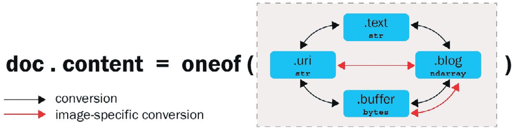
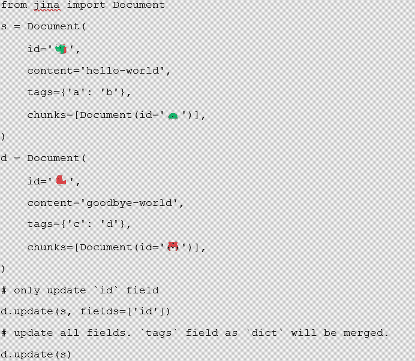
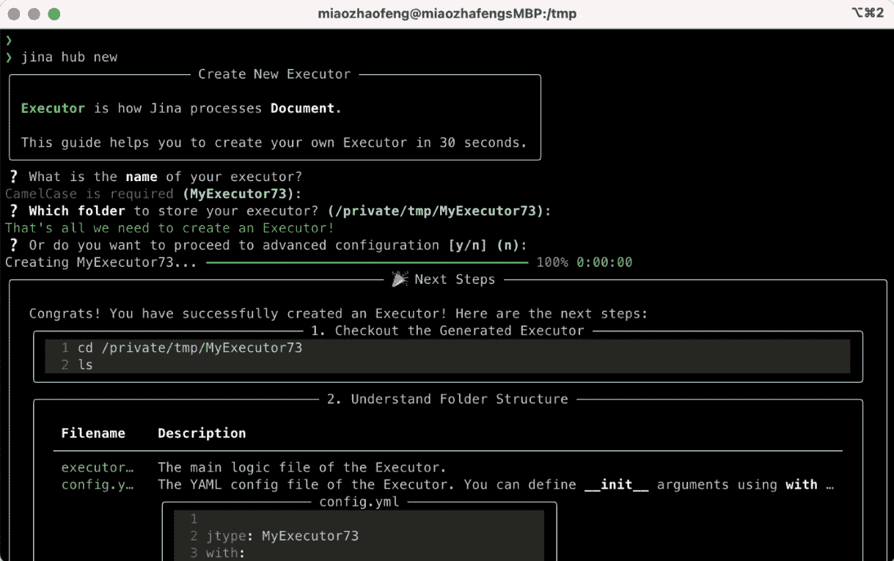

# 第四章：学习 Jina 基础

在上一章中，我们学习了神经搜索，现在我们可以开始思考如何使用它，以及我们需要采取的步骤来实现自己的搜索引擎。然而，正如我们在之前的章节中看到的，为了实现一个端到端的搜索解决方案，需要花费时间和精力收集所有必要的资源。Jina 在这方面可以提供帮助，因为它会处理许多必要的任务，让你可以专注于实现的设计。

在这一章中，你将理解 Jina 的核心概念：**文档**、**文档数组**、**执行器**和 **流程**。你将详细了解它们，并理解它们的整体设计及其如何相互连接。

我们将涵盖以下主要主题：

+   探索 Jina

+   文档

+   文档数组

+   执行器

+   流程

在本章结束时，你将对 Jina 中的惯用法有一个扎实的理解，了解它们是什么，以及如何使用它们。你将利用这些知识，稍后构建适用于任何类型模态的搜索引擎。

# 技术要求

本章有以下技术要求：

+   一台至少拥有 4 GB RAM 的笔记本电脑，理想情况下是 8 GB

+   在类似 Unix 的操作系统上安装 Python 3.7、3.8 或 3.9，例如 macOS 或 Ubuntu

# 探索 Jina

**Jina** 是一个框架，帮助你在云端使用最先进的模型构建深度学习搜索系统。Jina 是一种基础设施，让你可以仅专注于你感兴趣的领域。这样，你就不需要参与构建搜索引擎的每一个方面。这包括从预处理数据到在需要时启动微服务等。神经搜索的另一个好处是你可以搜索任何类型的数据。以下是一些使用不同数据类型进行搜索的示例：

+   图像到图像搜索

+   文本到图像搜索

+   问答搜索

+   音频搜索

构建你自己的搜索引擎可能非常耗时，因此 Jina 的核心目标之一是减少从零开始构建一个搜索引擎所需的时间。Jina 采用分层设计，让你只专注于你需要的特定部分，其余的基础设施会在后台处理。例如，你可以直接使用预训练的 **机器学习**（**ML**）模型，而不必自己构建它们。

由于我们生活在云计算时代，利用去中心化工作所能提供的力量是有意义的，因此将你的解决方案设计为在云上分布式运行是非常有用的，**分片**、**异步化**和 **REST** 等功能已经完全集成并可以开箱即用。

正如我们之前所说，Jina 帮助你减少构建搜索引擎所需时间和精力的另一种方式是使用最新的最先进的 ML 模型。你可以通过以下两种方式之一来利用这一点：

+   使用 Jina 的即插即用模型之一

+   在有特定应用场景时，从头开始开发你自己的模型，或者如果 Jina Hub 上还没有合适的模型可用。

使用这些选项，你可以选择使用预定义模型，或者如果你的需求没有被涵盖，可以实现你自己的模型。

正如你所想，这意味着后台有很多组件在工作。你学得越多，掌握应用程序的能力就越强，但首先，你需要理解 Jina 的基本组件，我们将在接下来的章节中讨论这些组件：

+   文档

+   文档数组

+   执行器

+   流程

# 文档

在 Jina 中，**文档**是你可以使用的最基本的数据类型。它们是你希望使用的数据，并且可以用于索引和/或查询。你可以用任何你需要的数据类型来创建文档，例如文本、GIF、PDF 文件、3D 网格等等。

我们将使用文档来进行索引和查询，但由于文档可以是任何类型和大小，因此我们可能需要在使用之前将其拆分。

作为类比，想象一个文档就像一块巧克力。巧克力有几种类型：白巧克力、黑巧克力、牛奶巧克力等等。同样，文档也可以有多种类型，例如音频、文本、视频、3D 网格等等。另外，如果我们有一块大巧克力，可能会在吃之前把它分成小块。类似地，如果我们有一个大的文档，在建立索引之前，应该把它分成小块。

这就是文档在 Python 代码中的表现形式：

```py
from jina import Document
document = Document()
```

正如你所看到的，创建文档所需要做的就是从 Jina 导入它，并像处理任何其他 Python 对象一样创建它。这是一个非常基础的示例，但在实际应用中，你会遇到更复杂的情况，因此我们需要添加一些属性，接下来我们将看到这些属性。

## 文档属性

每个文档可以有不同的属性，这些属性属于四个主要类别：

+   **内容**：这是指文档的实际内容。例如，文本或其嵌入向量。

+   **元数据**：这是关于文档本身的信息。例如，它的 ID 以及是否有标签。

+   **递归**：这告诉我们文档是如何被分割的。例如，它的匹配项，或是否被分成了若干块。

+   **相关性**：这是指文档的相关性，例如其分数。

这些类别由各种属性组成，具体列在下面的表格中：

| **类别** | **属性** |
| --- | --- |
| 内容属性 | `.buffer`, `.blob`, `.text`, `.uri`, `.content`, `.embedding` |
| 元数据属性 | `.id`, `.parent_id`, `.weight`, `.mime_type`, `.content_type`, `.tags`, `.modality` |
| 递归属性 | `.chunks`, `.matches`, `.granularity`, `.adjacency` |
| 相关性属性 | `.score`, `.evaluations` |

表 4.1 – 文档类别及其属性

我们稍后会更详细地了解这些属性，但首先，先来看看如何设置它们。

### 设置和取消设置属性

*表 4.1* 中的属性是我们可以与文档一起使用的可能属性。假设我们希望文档包含文本 `hello world`。我们可以通过设置其 `text` 属性来做到这一点：

```py
from jina import Document
document = Document()
document.text = 'hello world'
```

如果我们想取消设置它，可以如下操作：

```py
document.pop('text')
```

在许多实际场景中，我们需要处理多个属性，且也可以同时取消设置其中的多个属性：

```py
document.pop('text', 'id', 'mime_type')
```

### 访问标签中的嵌套属性

在 Jina 中，每个文档包含标签，这些标签持有类似映射的结构，可以映射任意值：

```py
from jina import Document
document = Document(tags={'dimensions': {'height': 5.0, 'weight': 10.0}})
document.tags['dimensions'] # {'weight': 10.0, 'height': 5.0}
```

如果你想访问嵌套字段，可以使用属性名，并用符号 `__` 连接。例如，如果你想访问 `weight` 标签，可以这样做：

```py
from jina import Document
document = Document(tags={'dimensions': {'height': 5.0, 'weight': 10.0}})
Document.tags__dimensions__weight #10
```

### 构建文档

要构建一个文档，你需要为其填充属性，让我们来看看这些属性。

### 内容属性

每个文档都需要包含一些关于它自身的信息，从原始二进制内容到文本信息。我们可以在下表中看到文档可以包含的详细信息：

| **属性** | **描述** |
| --- | --- |
| `doc.buffer` | 文档的原始二进制内容 |
| `doc.blob` | 图像/音频/视频文档的 ndarray |
| `doc.text` | 文档的文本信息 |
| `doc.uri` | 文档 URI 可以是本地文件路径、以 http 或 https 开头的远程 URL，或者是数据 URI 方案 |
| `doc.content` | 这可以是之前提到的任何属性（buffer、blob、text、uri） |
| `doc.embedding` | 文档的嵌入 ndarray |

表 4.2 - 内容属性

有两种方法可以为文档分配 *内容* 类型。如果你确切知道内容类型，可以明确地使用 `text`、`blob`、`buffer` 或 `uri` 属性进行分配。如果你不知道类型，可以使用 `.content`，它将根据内容的类型自动为文档分配一个类型。例如，请看以下示例：

```py
from jina import Document
import numpy as np
document1 = Document(content='hello world')
document2 = Document(content=b'\f1')
document3 = Document(content=np.array([1, 2, 3]))
document4 = Document(content=
'https://static.jina.ai/logo/core/notext/light/logo.png')
```

在这个示例中，以下内容适用：

+   `document1` 将有一个 `text` 字段。

+   `document2` 将有一个 `buffer` 字段。

+   `document3` 将有一个 `blob` 字段。

+   `document4` 将有一个 `uri` 字段。

内容将自动分配给 `text`、`buffer`、`blob` 或 `uri` 其中之一。当未显式设置时，`id` 和 `mime_type` 属性会自动生成。这意味着你可以显式指定文档的 ID 和类型（`mime_type`），否则它们将自动生成。

### doc.content 的独占性

在 Jina 中，每个文档只能包含一种类型的内容：`text`、`buffer`、`blob` 或 `uri`。如果先设置 `text`，再设置 `uri`，则会清空 `text` 字段。

在下图中，你可以看到内容可能具有的不同类型，以及每个文档只能有一种类型。



图 4.1 – 文档中的可能内容类型

让我们看看如何在代码中设置文档的 `content` 属性：

```py
doc = Document(text='hello world')
doc.uri = 'https://jina.ai/' #text field is cleared, doc 
#has uri field now
assert not doc.text  # True
doc = Document(content='https://jina.ai')
assert doc.uri == 'https://jina.ai'  # True
assert not doc.text  # True
doc.text = 'hello world' #uri field is cleared, doc has 
#text field now
assert doc.content == 'hello world'  # True
assert not doc.uri  # True
```

你可以看到如何在文档中设置每种类型的属性，但如果你为一个文档分配不同的值，只有最后一个属性会有效。

### doc.content 的转换

现在你已经看到了 Jina 中不同的可能属性，你可能会想，有时将一种类型的 `doc.content` 转换为另一种类型会很有用。例如，如果你有一个文档及其路径（`uri`），但你需要它是文本格式的，你可以使用这些预制的转换函数轻松地切换内容类型：

```py
doc.convert_buffer_to_blob()
doc.convert_blob_to_buffer()
doc.convert_uri_to_buffer()
doc.convert_buffer_to_uri()
doc.convert_text_to_uri()
doc.convert_uri_to_text()
doc.convert_image_buffer_to_blob()
doc.convert_image_blob_to_uri()
doc.convert_image_uri_to_blob()
doc.convert_image_datauri_to_blob()
```

如你所见，所有这些方法都将帮助你将数据从一种类型转换为另一种类型，但所有这些类型都需要转换为向量嵌入。让我们来看看嵌入到底是什么，以及为什么我们在神经搜索中使用它们。

### 设置嵌入属性

嵌入是文档的高维表示，是神经搜索中的关键元素。嵌入是数据的向量格式表示。这就是为什么神经搜索可以用于任何类型的数据，无论是图像、音频、文本等等。数据将被转换为向量（嵌入），而这些向量将被用于神经搜索。因此，类型并不重要，因为神经搜索最终只处理向量。

由于我们正在处理向量，因此使用已经建立的支持嵌入的库（如 NumPy）非常有用，这样你就可以例如将任何 NumPy `ndarray` 作为文档的嵌入，然后使用这些库提供的灵活性：

```py
import numpy as np
from jina import Document
d1 = Document(embedding=np.array([1, 2, 3]))
d2 = Document(embedding=np.array([[1, 2, 3], [4, 5, 6]]))
```

### 元数据属性

除了内容属性外，你还可以有元数据属性：

| **属性** | **描述** |
| --- | --- |
| `doc.tags` | 用于存储文档的元信息 |
| `doc.id` | 表示唯一文档 ID 的十六进制摘要 |
| `doc.parent_id` | 表示文档父级 ID 的十六进制摘要 |
| `doc.weight` | 文档的权重 |
| `doc.mime_type` | 文档的 MIME 类型 |
| `doc.content_type` | 文档的内容类型 |
| `doc.modality` | 文档的模态标识符，例如图像、文本等 |

表 4.3 – 元数据属性

要创建文档，你可以在构造函数中分配多个属性，如下所示：

```py
from jina import Document
document = Document(uri='https://jina.ai',
             mime_type='text/plain',
             granularity=1,
             adjacency=3,
             tags={'foo': 'bar'})
```

### 从字典或 JSON 字符串构建文档

还有一种选择是直接从 Python 字典或 JSON 字符串构建文档。如果你已经将文档信息存储在这些格式中，你可以方便地使用以下示例创建文档：

```py
from jina import Document
import json
doc = {'id': 'hello123', 'content': 'world'}
doc1 = Document(d)
doc = json.dumps({'id': 'hello123', 'content': 'world'})
doc2 = Document(d)
```

#### 解析未识别的字段

如果字典/JSON 字符串中的字段无法识别，它们将自动放入`document.tags`字段。如下面的示例所示，`foo` 不是一个已定义的属性（*表 4.3*），因此它将被自动解析到 `tags` 字段中：

```py
from jina import Document
doc1 = Document({'id': 'hello123', 'foo': 'bar'})
```

你可以使用`field_resolver`将外部字段名映射到文档属性：

```py
from jina import Document
doc1 = Document({'id': 'hello123', 'foo': 'bar'}, 
field_resolver={'foo': 'content'})
```

#### 从其他 Documents 构建 Document

如果你想复制一个 Document，以下是几种方法：

+   **浅拷贝**：将一个 Document 对象赋值给另一个 Document 对象将创建一个浅拷贝：

    ```py
    from jina import Document
    doc = Document(content='hello, world!')
    doc1 = doc
    assert id(doc) == id(doc1)  # True
    ```

+   `copy=True`：

    ```py
    doc1 = Document(doc, copy=True)
    assert id(doc) == id(doc1)  # False
    ```

+   **部分拷贝**：你可以根据另一个源 Document 部分更新一个 Document：



你可以使用前三种方法中的任何一种来复制一个 Document。

从 JSON、CSV、ndarray 等文件类型构建 Document

`jina.types.document.generators` 模块允许你从常见的文件类型（如 `JSON`、`CSV`、`ndarray` 和文本文件）构建 Document。

以下函数将创建一个 Document 的生成器，每个 `Document` 对象对应原始格式中的一行/一列：

| **导入方法** | **描述** |
| --- | --- |
| `from_ndjson()` | 该函数从基于行的 JSON 文件中生成一个 Document。每一行是一个 Document 对象。 |
| `from_csv()` | 该函数从 .csv 文件中生成一个 Document。每一行是一个 Document 对象。 |
| `from_files()` | 该函数从 glob 文件中生成一个 Document。每个文件都是一个 Document 对象。 |
| `from_ndarray()` | 该函数从 ndarray 中生成一个 Document。每一行（根据轴的不同）是一个 Document 对象。 |
| `from_lines()` | 该函数从 JSON 和 CSV 的行中生成一个 Document。 |

表 4.4 – 构建 Document 的 Python 方法

使用生成器有时能节省内存，因为它不会一次性加载/构建所有 Document 对象。

现在你已经了解了什么是 Document，以及如何创建一个 Document。你可以通过填充个别内容来创建它，或者如果你已有 JSON 文件，也可以通过复制来创建。

# DocumentArray

Jina 中的另一个强大概念是 `insert`、`delete`、`construct`、`traverse` 和 `sort`。DocumentArray 是 Executor 的一等公民，作为其输入和输出。我们将在下一节讨论 Executors，但现在，你可以将它们看作 Jina 处理文档的方式。

## 构建一个 DocumentArray

你可以像使用 Python 列表一样构建、删除、插入、排序和遍历 `DocumentArray`。你可以通过不同的方式来创建这些：

```py
from jina import DocumentArray, Document
documentarray = DocumentArray([Document(), Document()])
from jina import DocumentArray, Document
documentarray = DocumentArray((Document() for _ in range(10))
from jina import DocumentArray, Document
documentarray1 = DocumentArray((Document() for _ in range(10)))
documentarray2 = DocumentArray(da)
```

就像普通的 Document 一样，DocumentArray 也支持以下不同的方法：

| **类别** | **属性** |
| --- | --- |
| 类似 Python 列表的接口 | `__getitem__`、`__setitem__`、`__delitem__`、`__len__`、`insert`、`append`、`reverse`、`extend`、`__iadd__`、`__add__`、`__iter__`、`clear`、`sort, shuffle`、`sample` |
| 持久化 | `save`、`load` |
| 神经搜索操作 | `match`、`visualize` |
| 高级获取器 | `get_attributes`、`get_attributes_with_docs`、`traverse_flat`、`traverse` |

表 4.5 – DocumentArray 属性

### 通过 save()/load() 实现持久化

当然，也会有一些情况，你希望将 DocumentArray 中的元素保存以便进一步处理，你可以通过两种方式将所有元素保存到 DocumentArray 中：

+   以 JSON 行格式

+   以二进制格式

若要以 JSON 行格式保存，你可以执行以下操作：

```py
from jina import DocumentArray, Document
documentarray = DocumentArray([Document(), Document()])
documentarray.save('data.json')
documentarray1 = DocumentArray.load('data.json')
```

若要以二进制格式存储，它会更快且生成更小的文件，你可以执行以下操作：

```py
from jina import DocumentArray, Document
documentarray = DocumentArray([Document(), Document()])
documentarray.save('data.bin', file_format='binary')
documentarray1 = DocumentArray.load('data.bin', file_format='binary')
```

### 基本操作

和任何其他对象一样，你可以对 DocumentArray 执行基本操作，包括以下内容：

+   访问元素

+   排序元素

+   过滤元素

让我们详细了解这些。

#### 访问元素

你可以通过索引、ID 或切片索引来访问 DocumentArray 中的 Document，如下所示：

```py
from jina import DocumentArray, Document
documentarray = DocumentArray([Document(id='hello'), 
Document(id='world'), Document(id='goodbye')])
documentarray[0]
# <jina.types.document.Document id=hello at 5699749904>
documentarray['world']
# <jina.types.document.Document id=world at 5736614992>
documentarray[1:2]
# <jina.types.arrays.document.DocumentArray length=1 at 
# 5705863632>
```

根据你的使用场景，可以随意使用这些选项的任意变体。

#### 排序元素

因为`DocumentArray`是`MutableSequence`的子类，你可以使用内置的 Python 函数`sort`来对 DocumentArray 中的元素进行排序。例如，如果你想就地排序元素（不进行复制），并按降序使用`tags[id]`值，可以执行以下操作：

```py
from jina import DocumentArray, Document
documentarray = DocumentArray(
    [
        Document(tags={'id': 1}),
        Document(tags={'id': 2}),
        Document(tags={'id': 3})
    ]
)
documentarray.sort(key=lambda d: d.tags['id'], 
reverse=True)
print(documentarray)
```

上述代码将输出以下内容：

```py
<jina.types.arrays.document.DocumentArray length=3 at 5701440528>

{'id': '6a79982a-b6b0-11eb-8a66-1e008a366d49', 'tags': {'id': 3.0}},
{'id': '6a799744-b6b0-11eb-8a66-1e008a366d49', 'tags': {'id': 2.0}},
{'id': '6a799190-b6b0-11eb-8a66-1e008a366d49', 'tags': {'id': 1.0}}
```

#### 过滤元素

你可以使用 Python 的内置`filter`函数来过滤`DocumentArray`对象中的元素：

```py
from jina import DocumentArray, Document
documentarray = DocumentArray([Document() for _ in range(6)])
for j in range(6):
    documentarray[j].scores['metric'] = j
for d in filter(lambda d: d.scores['metric'].value > 2, documentarray):
    print(d)
```

这将输出以下内容：

```py
{'id': 'b5fa4871-cdf1-11eb-be5d-e86a64801cb1', 'scores': {'values': {'metric': {'value': 3.0}}}}
{'id': 'b5fa4872-cdf1-11eb-be5d-e86a64801cb1', 'scores': {'values': {'metric': {'value': 4.0}}}}
{'id': 'b5fa4873-cdf1-11eb-be5d-e86a64801cb1', 'scores': {'values': {'metric': {'value': 5.0}}}}
```

你还可以通过以下方式，从过滤结果中构建一个`DocumentArray`对象：

```py
from jina import DocumentArray, Document
documentarray = DocumentArray([Document(weight=j) for j in range(6)])
documentarray2 = DocumentArray(d for d in documentarray if d.weight > 2)
print(documentarray2)
```

这将输出以下结果：

```py
DocumentArray has 3 items:
{'id': '3bd0d298-b6da-11eb-b431-1e008a366d49', 'weight': 3.0},
{'id': '3bd0d324-b6da-11eb-b431-1e008a366d49', 'weight': 4.0},
{'id': '3bd0d392-b6da-11eb-b431-1e008a366d49', 'weight': 5.0}
```

到此为止，你已经学习了如何创建存储多个文档的 Documents 和 DocumentArrays（作为一个列表）。但是，你实际上能用这些做什么呢？如何将它们用于神经网络搜索？这时，Executor 就发挥作用了。接下来的部分我们将讨论 Executor。

# Executors

**Executor**代表 Jina Flow 中的处理组件。它对 Document 或 DocumentArray 执行单个任务。你可以将 Executor 看作 Jina 的逻辑部分。Executors 是执行各种任务的主体。例如，你可以有一个用于从 PDF 文件中提取文本的 Executor，或者为 Document 编码音频的 Executor。它们处理 Jina 中的所有算法任务。

由于 Executor 是 Jina 的主要组成部分，它们执行所有算法任务，因此你创建 Executor 时，可以使其更易于与他人共享，这样他人就可以重用你的工作。同样，你也可以在自己的代码中使用别人预构建的 Executor。事实上，这完全可行，因为 Executor 在市场中是可以轻松获得的，在 Jina 中这个市场叫做 Jina Hub ([`hub.jina.ai/`](https://hub.jina.ai/))。你可以浏览各种解决不同任务的 Executor，只需选择对你有用的 Executor 并在代码中使用它。当然，可能你需要的任务 Executor 还没有在 Jina Hub 中构建好，在这种情况下，你将需要创建自己的 Executor。这在 Jina Hub 中很容易实现。让我们深入了解如何做到这一点。

## 创建 Executor

创建 Executor 最好使用 Jina Hub，它将生成一个向导，指导你完成整个过程。要启动此过程，请打开控制台并输入以下命令：

```py
jina hub new
```

这将触发一个向导，指导你完成 Executor 的创建并要求你提供一些关于它的细节：



图 4.3 – 通过 CLI 创建 Executor

经过向导后，你的 Executor 就准备好了。现在，让我们更详细地了解 Executors。

Executors 通过带有 `@requests` 装饰器的函数就地处理 DocumentArrays。我们将此装饰器添加到我们希望在 Executors 中使用的任何函数。当创建 Executor 时，应牢记三个原则：

+   它应该是 `jina.Executor` 类的子类。

+   它必须是一个带有 `shared` 状态的函数集合。它可以包含任意数量的函数，函数名也可以任意。

+   被 `@requests` 装饰的函数将根据它们的 `on=端点` 被调用。我们将在以下示例中看到这些端点可能是什么。

这是一个非常基本的 Python Executor，帮助你更好地理解最后这个概念：

```py
from jina import Executor, requests
class MyExecutor(Executor):
    @requests
    def foo(self, **kwargs):
        print(kwargs)
```

你的 Executor 名称可以是你想要的任何名称，但需要记住的重要一点是，每个新的 Executor 应该是 `jina.Executor` 的子类。

#### 构造函数

如果你的 Executor 不包含初始状态，则不需要实现构造函数（`__init__`）。但如果你的 Executor 有 `__init__`，它需要在函数签名中携带 `**kwargs`，并在函数体内调用 `super().__init__(**kwargs)`：

```py
from jina import Executor
class MyExecutor(Executor):
    def __init__(self, foo: str, bar: int, **kwargs):
        super().__init__(**kwargs)
        self.bar = bar
        self.foo = foo
```

#### 方法装饰器

`@requests` 装饰器定义了何时调用一个函数。它有一个 `on=` 关键字，用于定义端点。我们还没有谈到 Flow。我们将在下一节中讲解它，但现在，可以将 Flow 想象成一个管理器。每当我们的 Executor 需要被调用时，`@requests` 装饰器会将信息发送到 Flow。这是为了向 Flow 通信何时以及在什么端点调用该函数。

你可以像这样使用装饰器：

```py
from jina import Executor, Flow, Document, requests
class MyExecutor(Executor):
    @requests(on='/index')
    def foo(self, **kwargs):
        print(f'foo is called: {kwargs}')
    @requests(on='/random_work')
    def bar(self, **kwargs):
        print(f'bar is called: {kwargs}')
f = Flow().add(uses=MyExecutor)
with f:
    f.post(on='/index', inputs=Document(text='index'))
    f.post(on='/random_work', 
    inputs=Document(text='random_work'))
    f.post(on='/blah', inputs=Document(text='blah')) 
```

在这个示例中，我们有三个端点：

+   `on='/index'`：此端点将触发 `MyExecutor.foo` 方法。

+   `on='/random_work'`：此端点将触发 `MyExecutor.bar` 方法。

+   `on='/blah'`：此端点不会触发任何方法，因为没有函数绑定到 `MyExecutor.blah`。

#### Executor 绑定

现在我们已经看到了如何创建 Executors，并了解了 `@requests` 装饰器，你可能会想知道可以使用哪些类型的绑定与 `@requests`。

#### 默认绑定

使用普通的 `@requests` 装饰器装饰的类方法是所有端点的默认处理程序。这意味着它是未找到的端点的回退处理程序。让我们来看一个例子：

```py
from jina import Executor, requests
class MyExecutor(Executor):
    @requests
    def foo(self, **kwargs):
        print(kwargs)

    @requests(on='/index')
    def bar(self, **kwargs):
        print(kwargs)
```

在这个示例中，定义了两个函数：

+   `foo`

+   `bar`

这里的 `foo` 函数成为默认方法，因为它没有 `on=` 关键字。如果我们现在使用一个未知的端点，例如 `f.post(on='/blah', ...)`，它会调用 `MyExecutor.foo`，因为没有 `on='/blah'` 端点。

#### 多重绑定

要将方法绑定到多个端点，你可以使用 `@requests(on=['/foo', '/bar'])`。这样，`f.post(on='/foo', ...)` 或 `f.post(on='/bar', ...)` 都可以调用这个函数。

#### 无绑定

没有 `@requests` 绑定的类在 Flow 中不起作用。请求会直接通过而不进行任何处理。

现在你已经了解了执行器是什么，并且知道为什么与其他开发人员共享它们是有用的。你还学会了如何查找已发布的执行器以及如何发布自己的执行器。现在让我们看看如何将你迄今为止学到的概念结合起来。

# Flow

现在你已经了解了文档（Documents）和执行器（Executors）是什么，以及如何使用它们，我们可以开始讨论 **Flow**，这是 Jina 中最重要的概念之一。

可以把 Flow 看作 Jina 中的一个管理器；它负责处理应用程序中所有要运行的任务，并以文档（Documents）作为输入和输出。

## 创建 Flow

在 Jina 中创建 Flow 非常简单，和在 Python 中创建任何其他对象一样。比如，这就是如何创建一个空的 Flow：

```py
from jina import Flow
f = Flow()
```

为了使用 Flow，最好始终将其作为上下文管理器打开，就像在 Python 中打开文件一样，可以使用 `with` 函数：

```py
from jina import Flow
f = Flow()
with f:     
f.block()
```

注意

Flow 遵循懒加载模式：除非你使用 `with` 函数打开它，否则它不会实际运行。

## 向流程中添加执行器

要向你的 Flow 添加元素，只需要使用 `.add()` 方法。你可以根据需要添加任意数量的元素。

`.add()` 方法用于向 Flow 对象中添加执行器。每个 `.add()` 实例会添加一个新的执行器，这些执行器可以作为本地线程、本地进程、远程进程、Docker 容器内甚至远程 Docker 容器中的进程运行。你可以像这样添加任意数量的执行器：

```py
from jina import Flow
flow = Flow().add().add()
```

### 通过 uses 定义执行器

你可以使用 `uses` 参数来指定你正在使用的执行器。`uses` 参数支持多种类型的值，包括类名、Docker 镜像和（内联）YAML。因此，你可以通过以下方式添加执行器：

```py
from jina import Flow, Executor
class MyExecutor(Executor):
    ...
f = Flow().add(uses=MyExecutor)
```

### 可视化 Flow

如果你想可视化你的 Flow，可以使用 `.plot()` 函数。这将生成一个包含可视化流程的 `.svg` 文件。为此，只需在 Flow 末尾添加 `.plot()` 函数，并使用你希望的 `.svg` 文件标题：

```py
from jina import Flow
f = Flow().add().plot('f.svg')
```

上述代码片段将生成如下图形和相应的 Flow：


图 4.4 – 流程示例

注意

在 Jupyter Lab/Notebook 中，Flow 对象会自动渲染，无需调用 `.plot()`。

你也可以使用 CRUD 方法（index, search, update, delete），这些只是带有`on='/index', on='/search'`的糖语法形式的 post。它们列在以下清单中：

+   `index = partialmethod(post, '/index')`

+   `search = partialmethod(post, '/search')`

+   `update = partialmethod(post, '/update')`

+   `delete = partialmethod(post, '/delete')`

因此，综合前述概念，一个最小的工作示例需要创建一个从基本 Executor 类扩展出来的 Executor，并且可以与你的 Flow 一起使用：

```py
from jina import Flow, Document, Executor, requests  
class MyExecutor(Executor):      
@requests(on='/bar')
 def foo(self, docs, **kwargs):
    print(docs) 
f = Flow().add(name='myexec1', uses=MyExecutor) 
with f:     
f.post(on='/bar', inputs=Document(), on_done=print)
```

就是这样！现在你有一个最小的工作示例，并且已经掌握了 Jina 的基础知识。在接下来的章节中，我们将看到更多高级用法，但如果你已经学会了 Document、DocumentArray、Executor 和 Flow 的概念，那么你已经准备好了。

# 总结

本章介绍了 Jina 中的主要概念：Document、DocumentArray、Flow 和 Executor。现在，你应该对这些概念是什么、它们为什么重要以及它们如何相互关联有一个概览。

除了理解构建搜索引擎时 Document、DocumentArray、Flow 和 Executor 的重要性理论之外，你还应该能够创建一个简单的 Document 并分配其对应的属性。完成本章后，你还应该能够创建自己的 Executor 并启动一个基本的 Flow。

你将在下一章节中使用所有这些知识，学习如何将这些概念整合在一起。
