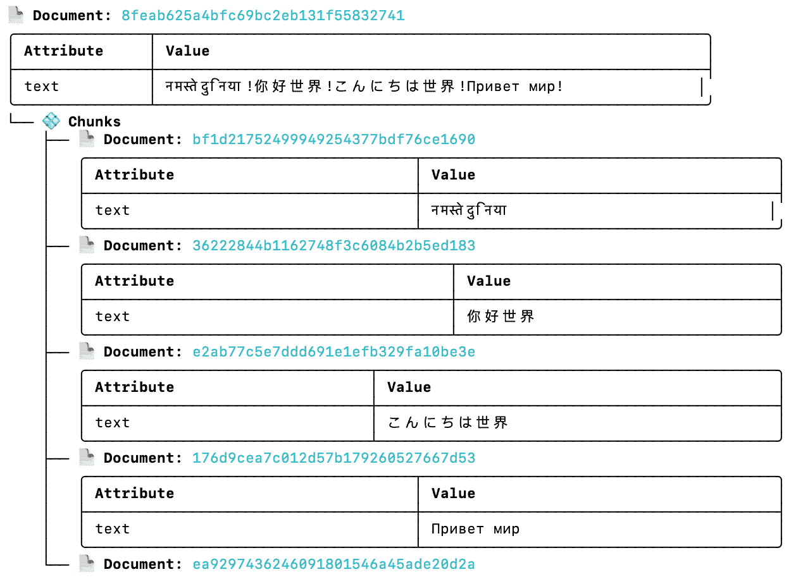
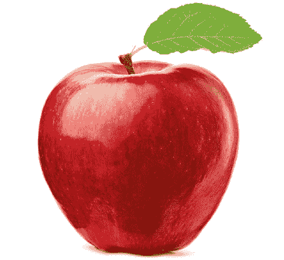
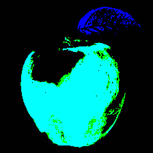
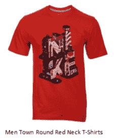
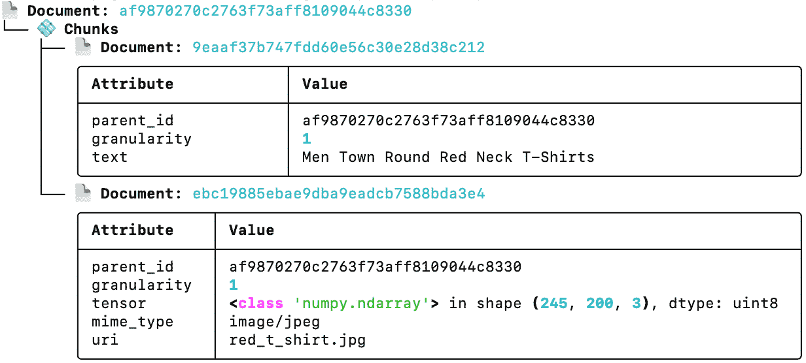
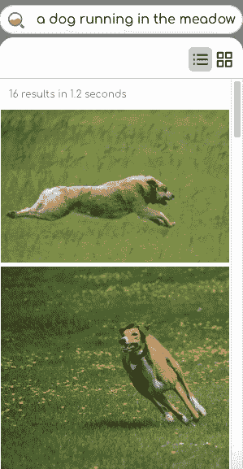
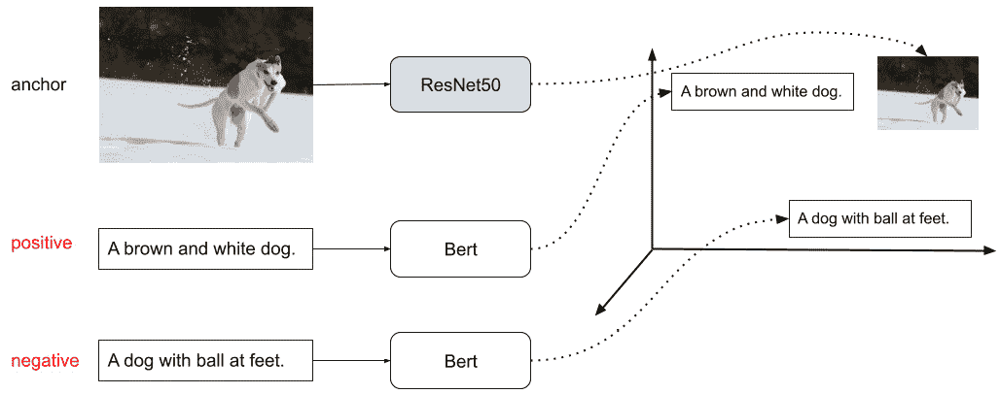
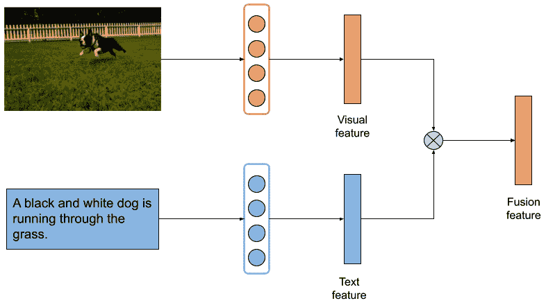

# 第五章：多重搜索模态

得益于深度学习和人工智能，我们可以将任何类型的数据编码为**向量**。这使得我们能够创建一个搜索系统，使用任何类型的数据作为查询，并返回任何类型的数据作为搜索结果。

本章将介绍日益受到关注的**多模态搜索问题**。你将看到不同的数据模态以及如何处理它们。你将了解如何将文本、图像和音频文档转换为向量，并如何独立于数据模态实现搜索系统。你还将看到**多模态**和**跨模态**概念之间的差异。

本章将涵盖以下主要内容：

+   如何表示不同数据类型的文档

+   如何编码多模态文档

+   跨模态和多模态搜索

本章结束时，你将对跨模态和多模态搜索的工作原理有一个扎实的理解，并且会发现，在 Jina 中处理不同模态的数据是多么容易。

# 技术要求

本章有以下技术要求：

+   配备至少 4 GB RAM 的笔记本电脑（建议 8 GB 或更多）

+   在 Unix-like 操作系统（如 macOS 或 Ubuntu）上安装*3.7*、*3.8*或*3.9*版本的 Python

# 引入多模态文档

在过去十年中，各种类型的数据，如**文本**、**图像**和**音频**，在互联网上迅速增长。通常，不同类型的数据与一条内容相关联。例如，图像通常也有文本标签和说明来描述内容。因此，内容具有两种模态：图像和文本。带字幕的电影片段有三种模态：图像、音频和文本。

Jina 是一个**数据类型无关的框架**，让你可以处理任何类型的数据，并开发跨模态和多模态搜索系统。为了更好地理解这一点，首先展示如何表示不同数据类型的文档，然后再展示如何在 Jina 中表示多模态文档，是有意义的。

## 文本文档

在 Jina 中表示一个文本文档是相当简单的。你只需使用以下代码即可：

```py
from docarray import Document
doc = Document(text='Hello World.')
```

在某些情况下，一个文档可能包含成千上万的词语。但一个包含成千上万字的长文档很难进行搜索；一些更细粒度的分段会更好。你可以通过将一个长文档分割成较小的*块*来实现这一点。例如，让我们通过使用`!`标记来分割这个简单的文档：

```py
from jina import Document
d = Document(text='नमस्ते दुनिया!你好世界!こんにちは世界!Привет мир!')
d.chunks.extend([Document(text=c) for c in d.text.split('!')])
```

这会在原始文档下创建五个子文档，并将它们存储在`.chunks`下。为了更清楚地看到这一点，你可以通过`d.display()`来可视化，输出结果如下图所示：



图 5.1 – 一个包含分块级子文档的文本文档示例

你还可以通过使用`.texts`属性打印出每个子文档的文本属性：

```py
print(d.chunks.texts)
```

这将输出以下内容：

```py
['नमस्ते दुनिया', '你好世界', 'こんにちは世界', 'Привет мир', '']
```

这就是你需要了解的关于在 Jina 中表示文本文档的所有内容！

## 图像文档

与文本数据相比，图像数据更加通用且容易理解。图像数据通常只是一个`ndim=2`或`ndim=3`且`dtype=uint8`的数组。该 ndarray 中的每个元素表示在某个位置、某个通道上的一个像素值，范围在`0`到`255`之间。例如，一张 256x300 的彩色 JPG 图像可以表示为一个`[256, 300, 3]`的 ndarray。你可能会问，为什么最后一维是 `3`。这是因为它表示每个像素的 `R`、`G` 和 `B` 通道。有些图像有不同数量的通道。例如，一个带透明背景的 PNG 图像有四个通道，其中额外的通道表示透明度。灰度图像只有一个通道，表示亮度（衡量黑白比例的值）。

在 Jina 中，你可以通过指定图像 URI 来加载图像数据，然后使用文档 API 将其转换为 `.tensor`。作为示例，我们将使用以下代码加载一张 PNG 格式的苹果图像（如 *图 5.2* 所示）：



图 5.2 – 存储在本地文件 apple.png 中的示例 PNG 图像

```py
from docarray import Document
d = Document(uri='apple.png')
d.load_uri_to_image_tensor()
print(d.content_type, d.tensor)
```

你将获得以下输出：

```py
tensor [[[255 255 255]
  [255 255 255]
  [255 255 255]
  ...
```

现在，图像内容已被转换为文档的 `.tensor` 字段，接下来可以用于进一步处理。可以使用一些帮助函数来处理图像数据。你可以调整图像大小（即降采样/上采样）并进行归一化处理。你可以将 `.tensor` 的通道轴切换以满足某些框架的要求，最后，你可以将所有这些处理步骤链在一行代码中。例如，图像可以进行归一化，并且颜色轴应该放在前面，而不是最后。你可以使用以下代码执行这些图像变换：

```py
from docarray import Document
d = (
    Document(uri='apple.png')
    .load_uri_to_image_tensor()
    .set_image_tensor_shape(shape=(224, 224))
    .set_image_tensor_normalization()
    .set_image_tensor_channel_axis(-1, 0)
)
print(d.content_type, d.tensor.shape)
```

你还可以使用以下方法将`.tensor`重新转换为 PNG 图像文件：

```py
d.save_image_tensor_to_file('apple-proc.png', channel_axis=0)
```

请注意，由于我们刚刚进行的处理步骤，通道轴现在已切换到`0`。最后，你将得到如 *图 5.3* 所示的结果图像：



图 5.3 – 调整大小和归一化后的结果图像

## 音频文档

作为存储信息的重要格式，数字音频数据可以是片段、音乐、铃声或背景噪音。它通常以`.wav`和`.mp3`格式出现，其中声音波形通过在离散时间间隔进行采样来数字化。要将`.wav`文件作为文档加载到 Jina 中，你可以简单地使用以下代码：

```py
from docarray import Document
d = Document(uri='hello.wav')
d.load_uri_to_audio_tensor()
print(d.content_type, d.tensor.shape)
```

你将看到以下输出：

```py
tensor [-0.00061035 -0.00061035 -0.00082397 ...  0.00653076  0.00595093 0.00631714]
```

如前面的示例所示，来自`.wav`文件的数据被转换为一维（单声道）ndarray，其中每个元素通常预计位于[-1.0, +1.0]的范围内。你完全不局限于使用 Jina 本地方法进行音频处理。这里有一些命令行工具、程序和库，你可以用来更高级地处理音频数据：

+   **FFmpeg** ([`ffmpeg.org/`](https://ffmpeg.org/))：这是一个免费的开源项目，用于处理多媒体文件和流。

+   **Pydub** ([`github.com/jiaaro/pydub`](https://github.com/jiaaro/pydub))：这是一个使用简单易用的高级接口操作音频的库。

+   **Librosa** ([`librosa.github.io/librosa/`](https://librosa.github.io/librosa/))：这是一个用于音乐和音频分析的 Python 包。

## 多模态文档

到目前为止，你已经学习了如何在 Jina 中表示不同的数据模态。然而，在现实世界中，数据通常以结合多种模态的形式出现，例如视频，通常包括至少*图像*和*音频*，以及*字幕*形式的*文本*。现在，了解如何表示多模态数据是非常有趣的。

一个 Jina 文档可以通过块进行垂直嵌套。将不同模态的数据放入块中的子文档是直观的。例如，你可以创建一个时尚产品文档，包含两种模态，包括一张服装图片和产品描述。



图 5.4 – 一个包含两种模态的时尚产品文档示例

你可以通过使用以下代码轻松完成：

```py
from jina import Document 
text_doc = Document(text='Men Town Round Red Neck T-Shirts') 
image_doc = Document(uri='tshirt.jpg').load_uri_to_image_tensor()
fashion_doc = Document(chunks=[text_doc, image_doc])
```

现在，示例中的时尚产品（如*图 5.4*所示）表示为一个 Jina 文档，文档中有两个块级文档，分别表示产品的描述和服装图片。你还可以使用`fashion_doc.display()`生成可视化，如*图 5.5*所示：



图 5.5 – 一个包含两个块级文档的时尚产品文档示例

重要提示

你可能会认为不同的模态对应不同种类的数据（在这个例子中是图像和文本）。然而，这并不完全准确。例如，你可以通过从不同角度搜索图像或为给定段落文本搜索匹配的标题来进行跨模态搜索。因此，我们可以认为模态与某种特定数据分布相关，数据可能来自该分布。

到目前为止，我们已经学习了如何表示单一的文本、图像和音频数据，以及如何将多模态数据表示为 Jina 文档。在接下来的部分，我们将展示如何获取每个文档的嵌入。

# 如何对多模态文档进行编码

在定义了不同类型数据的文档之后，下一步是使用模型将文档编码为向量嵌入。正式来说，嵌入是文档的多维表示（通常是一个`[1, D]`的向量），旨在包含文档的内容信息。随着深度学习方法的不断进展，甚至通用模型（例如，在 ImageNet 上训练的 CNN 模型）也可以用来提取有意义的特征向量。在接下来的部分，我们将展示如何为不同模态的文档编码嵌入。

## 文本文档编码

为了将文本文档转换为向量，我们可以使用 Sentence Transformer 提供的预训练 Bert 模型（[`www.sbert.net/docs/pretrained_models.xhtml`](https://www.sbert.net/docs/pretrained_models.xhtml)），如下所示：

```py
from docarray import DocumentArray
from sentence_transformers import SentenceTransformer
da = DocumentArray(...)
model = SentenceTransformer('all-MiniLM-L6-v2')
da.embeddings = model.encode(da.texts)
print(da.embeddings.shape)
```

结果是，在输入的`DocumentArray`中，每个文档在完成`.encode(...)`后，将拥有一个 384 维的稠密向量空间作为嵌入。

## 图像文档编码

对于图像文档的编码，我们可以使用来自 Pytorch 的预训练模型进行嵌入。作为示例，我们将使用**ResNet50**网络（[`arxiv.org/abs/1512.03385`](https://arxiv.org/abs/1512.03385)）进行图像对象分类，图像数据来自**torchvision**（[`pytorch.org/vision/stable/models.xhtml`](https://pytorch.org/vision/stable/models.xhtml)）：

```py
from docarray import DocumentArray
import torchvision
da = DocumentArray(...)
model = torchvision.models.resnet50(pretrained=True)
da.embed(model)
print(da.embeddings.shape)
```

通过这种方式，我们已经成功地将图像文档编码为其特征向量表示。生成的特征向量是神经网络的输出激活（一个包含 1,000 个元素的向量）。

重要说明

你可能已经注意到，在前面的示例中，我们使用了`.embed()`来进行嵌入。通常，当`DocumentArray`设置了`.tensors`时，你可以使用此 API 来编码文档。在使用 GPU 时，可以指定`.embed(..., device='cuda')`。设备名称标识符取决于你使用的模型框架。

## 音频文档编码

为了将音频片段编码为向量，我们选择了 Google Research 的**VGGish**模型（[`arxiv.org/abs/1609.09430`](https://arxiv.org/abs/1609.09430)）。我们将使用来自**torchvggish**（[`github.com/harritaylor/torchvggish`](https://github.com/harritaylor/torchvggish)）的预训练模型来获取音频数据的特征嵌入：

```py
import torch
from docarray import DocumentArray
model = torch.hub.load('harritaylor/torchvggish', 'vggish')
model.eval()
for d in da:
    d.embedding = model(d.uri)[0]
print(da.embeddings.shape)
```

每个音频片段返回的嵌入是一个大小为`K` x 128 的矩阵，其中`K`是对数梅尔频谱中的示例数，粗略对应音频的秒数。因此，每个 4 秒的音频片段在数据块中由四个 128 维向量表示。

我们现在已经学习了如何为不同模态的文档编码嵌入。接下来的部分，我们将向您展示如何使用多模态进行数据搜索。当试图寻找一些无法仅通过单一模态表示的数据时，这种方法非常有用。例如，您可能会使用图像搜索来寻找具有文本性质的数据。

# 跨模态与多模态搜索

既然我们已经知道如何处理多模态数据，现在可以描述**跨模态**和**多模态**搜索。在此之前，我想先描述**单模态**（单一模态）搜索。一般来说，单模态搜索意味着在索引和查询时处理单一模态的数据。例如，在图像搜索检索中，返回的搜索结果也是基于给定图像查询的图像。

到目前为止，我们已经知道如何将文档内容编码为特征向量以创建嵌入。在索引中，每个包含图像、文本或音频内容的文档可以表示为嵌入向量并存储在索引中。在查询中，查询文档也可以表示为一个嵌入，之后可以通过一些相似度分数（如余弦相似度、欧几里得距离等）来识别相似文档。*图 5.6*展示了搜索问题的统一匹配视角：


图 5.6 – 搜索问题的统一匹配视角示意图

更正式地说，搜索可以被视为构建一个匹配模型，该模型计算输入查询文档与搜索中文档之间的匹配度。通过这种统一的匹配视角，**单模态**、**多模态**和**跨模态**搜索在架构和方法论上相互之间的相似性更为明显，具体体现在以下技术：将输入（查询和文档）嵌入为分布式表示，结合神经网络组件表示不同模态数据之间的关系，并以端到端的方式训练模型参数。

## 跨模态搜索

在单模态搜索中，搜索被设计为处理单一数据类型，因此在处理不同数据类型的输入时，其灵活性较差，容易受到限制。超越单模态搜索，**跨模态搜索**的目标是以一种类型的数据作为查询，检索另一类型的相关数据，例如图像-文本、视频-文本和音频-文本的跨模态搜索。例如，如*图 5.7*所示，我们可以设计一个基于简短文本描述作为查询来检索图像的文本到图像搜索系统：



图 5.7 – 从标题中寻找图像的跨模态搜索系统

最近，随着多模态数据的快速增长，跨模态搜索引起了广泛关注。随着多模态数据的增长，用户有效且高效地搜索感兴趣的信息变得越来越困难。迄今为止，已经提出了各种方法来搜索多模态数据。然而，这些搜索技术大多是基于单一模态的，将跨模态搜索转化为基于关键词的搜索。这可能会很昂贵，因为需要人工编写这些关键词，而且多模态内容的信息并不总是可以获得。我们需要寻找另一种解决方案！**跨模态**搜索旨在识别不同模态之间的相关数据。跨模态搜索的主要挑战是如何衡量不同模态数据之间的内容相似性。为了解决这个问题，提出了各种方法。一种常见的方法是从不同模态生成特征向量，将它们映射到相同的潜在空间中，从而使新生成的特征可以应用于距离度量的计算。

为了实现这一目标，通常可以利用两种常见的深度度量学习架构（Siamese 网络和三元组网络）。它们都共享一个思想，即不同的子网络（可能共享或不共享权重）同时接收不同的输入（Siamese 网络的正负对，三元组网络的正对、负对和锚点文档），并尝试将它们各自的特征向量投影到一个共同的潜在空间，在那里计算对比损失，并将误差传播到所有子网络。

正对是指语义相关的物体对（图像、文本或任何文档），预计它们在投影空间中应该保持接近。另一方面，负对是指应该分离的文档对。



图 5.8 – 深度度量学习过程的模式图，使用三元组网络和锚点

如*图 5.8*所示，这是一个图像与文本之间的跨模态搜索示例，用于提取图像特征的子网络是**ResNet50**架构，权重在 ImageNet 上预训练，而对于文本嵌入，使用的是预训练**Bert**模型中的一个隐藏层的输出。最近，提出了一种新的深度度量学习预训练模型——**对比语言-图像预训练**（**CLIP**），它是一个在多种图像-文本对上训练的神经网络。它通过文本片段和来自互联网的图像对来帮助学习自然语言中的视觉概念。它可以通过在相同的语义空间中编码文本标签和图像来执行零样本学习，并为这两种模态创建一个标准嵌入。使用 CLIP 风格的模型，图像和查询文本可以映射到相同的潜在空间，从而可以使用相似性度量进行比较。

## 多模态搜索

与单模态和跨模态搜索相比，**多模态搜索**旨在使多模态数据作为查询输入。搜索查询可以由文本输入、图像输入和其他模态的输入组合而成。将不同模态的信息结合起来以提高搜索性能是直观的。想象一个电子商务搜索场景，采用两种类型的查询信息：图像和文本。例如，如果你在搜索裤子，图像将是裤子的照片，而文本则可能是“紧身”和“蓝色”。在这种情况下，搜索查询由两种模态（文本和图像）组成。我们可以将这种搜索场景称为多模态搜索。

为了支持多模态搜索，实践中广泛使用两种方法来融合多个模态进行搜索：早期融合（将来自多个模态的特征作为查询输入）和晚期融合（在最后阶段融合来自不同模态的搜索结果）。

具体来说，早期融合方法将从不同模态数据中提取的特征进行融合。如*图 5.9*所示，来自不同模型的两种不同模态（图像和文本）特征被输入到融合算子中。为了简单地结合特征，我们可以使用特征拼接作为融合算子来生成多模态数据的特征。另一种融合选择是将不同模态投影到一个共同的嵌入空间中。然后，我们可以直接将不同模态数据的特征相加。



图 5.9 – 早期融合，多模态特征作为查询输入的融合

在合并特征后，我们可以使用为单模态搜索设计的相同方法来解决多模态搜索问题。这种特征融合方法存在一个显著的局限性：在用户查询的上下文中，很难定义各种模态的重要性之间的正确平衡。为了克服这一局限性，可以训练一个端到端神经网络来建模联合多模态空间。然而，建模这个联合多模态空间需要复杂的训练策略和经过充分标注的数据集。

实际上，为了应对上述缺点，我们可以简单地使用后期融合方法，按模态分离搜索，然后融合来自不同模态的搜索结果，例如，通过线性组合每个文档所有模态的检索得分。尽管后期融合已被证明是稳健的，但它也存在一些问题：如何为模态分配适当的权重并非一个简单的问题，而且还存在主要模态问题。例如，在文本-图像多模态搜索中，当用户仅根据视觉相似性评估结果时，文本得分的影响可能会恶化最终结果的视觉质量。

这两种搜索模式的主要区别在于，跨模态搜索中，单一文档与嵌入空间中的向量之间存在直接映射关系，而在多模态搜索中并不成立，因为两个或更多文档可能会合并成一个向量。

# 总结

本章介绍了多模态数据的概念，以及跨模态和多模态搜索问题。首先，我们介绍了多模态数据以及如何在 Jina 中表示它。接着，我们学习了如何使用深度神经网络从不同模态的数据中获取向量特征。最后，我们介绍了跨模态和多模态搜索系统。这解锁了许多强大的搜索模式，并使得理解如何使用 Jina 实现跨模态和多模态搜索应用变得更加容易。

在下一章中，我们将介绍一些基本的实用示例，解释如何使用 Jina 实现搜索应用。

# 第三部分：如何使用 Jina 进行神经搜索

在这一部分中，您将使用迄今为止所学的所有知识，并逐步指导您如何为不同的模态构建搜索系统，无论是文本、图像、音频，还是跨模态和多模态。以下章节包含在这一部分中：

+   *第六章*，*Jina 的基本实用示例*

+   *第七章*，*探索 Jina 的高级使用案例*
