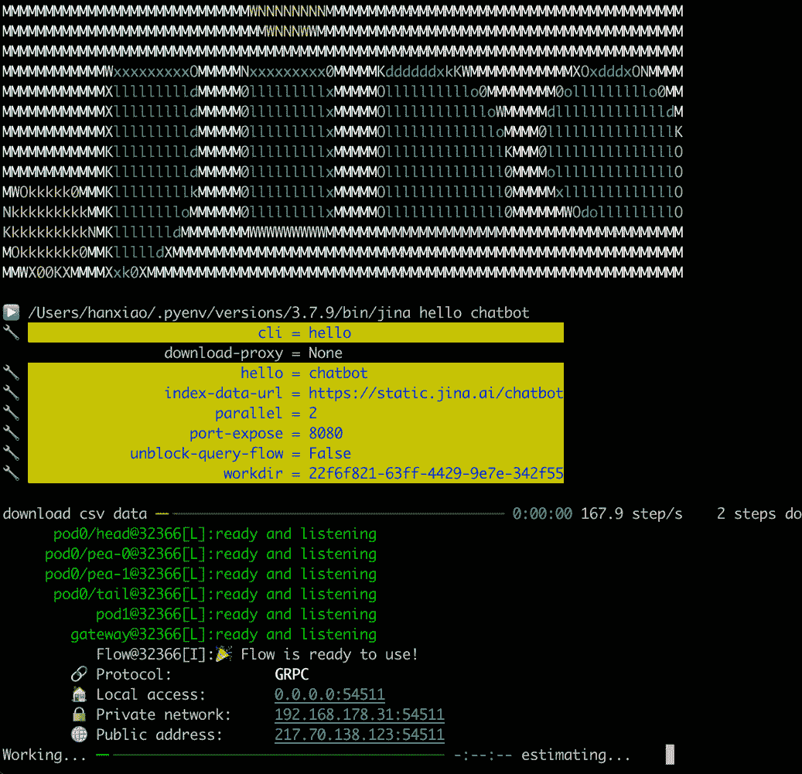
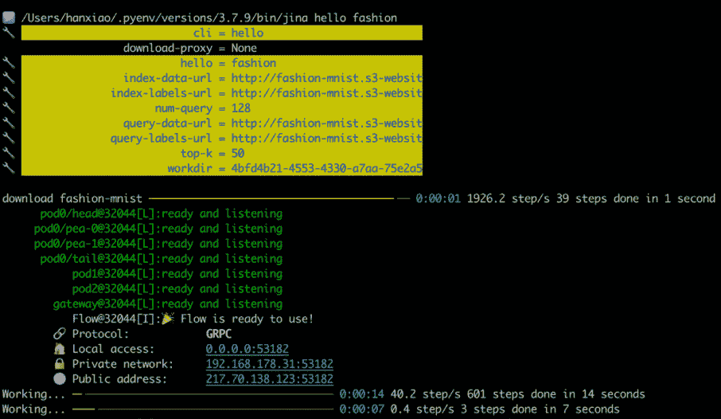
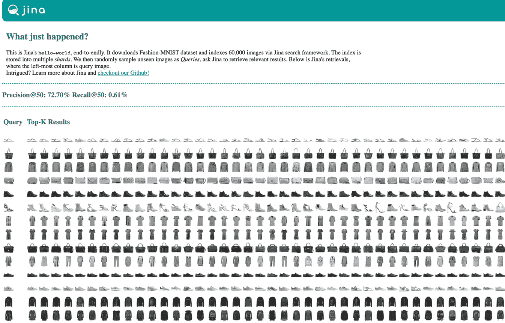
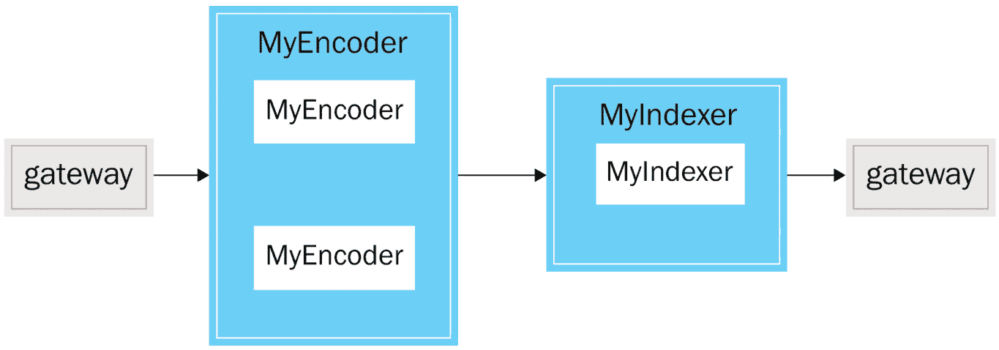
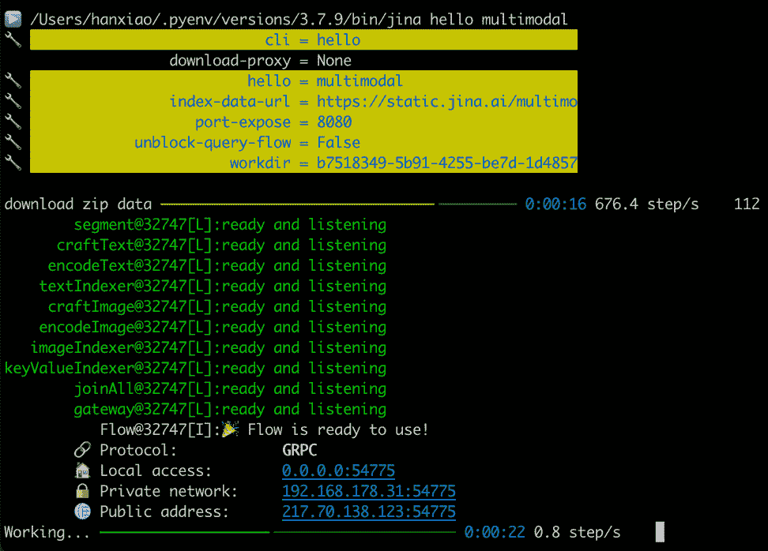

# 第六章：使用 Jina 构建实际示例

本章中，我们将使用 Jina 的神经搜索框架构建简单的现实应用。基于前几章学到的概念，我们将探讨如何利用 Jina 创建有价值的应用。

我们将学习 Jina 框架的实际应用，并了解如何利用它们快速构建和部署复杂的搜索解决方案。我们将带您逐步了解基于 Jina 构建的三个不同应用的代码，并查看上一章中学到的不同组件如何协同工作以创建一个搜索应用。

本章我们将介绍以下三个示例，帮助您开始使用 Jina 构建应用：

+   问答聊天机器人

+   时尚图像搜索

+   多模态搜索

本章的目标是通过构建实际示例，帮助您入门并理解 Jina 神经搜索框架的潜力。这是踏入神经搜索领域并构建最先进搜索解决方案的绝佳起点。

# 技术要求

要跟随本章讨论的应用代码，您可以克隆 GitHub 上的代码库，地址为 https://github.com/jina-ai/jina/tree/master/jina/helloworld。

# 开始使用问答聊天机器人

**问答聊天机器人**是一个随 Jina 安装包提供的预构建示例。为了亲身体验 Jina 的强大功能并快速入门，您可以直接从命令行运行问答聊天机器人示例，而无需深入代码。问答聊天机器人使用的是来自 Kaggle 的公共 Covid 问答数据集（https://www.kaggle.com/datasets/xhlulu/covidqa），该数据集包含 418 对问答（https://www.kaggle.com/xhlulu/covidqa）。

请按照以下说明设置开发环境并运行问答聊天机器人示例：

1.  第一步是从**Python 软件包索引**（**PyPI**）安装 Jina 库以及所需的依赖项：

    ```py
    pip install "jina[demo]"
    ```

1.  之后，只需输入以下命令即可启动您的应用：

    ```py
    jina hello chatbot
    ```

输入此命令后，您将在您的**命令行界面**（**CLI**）中看到以下文本：



图 6.1 – 问答聊天机器人命令行

如果您的屏幕上显示了相同的命令行文本，说明您已经成功启动了问答聊天机器人示例。现在，是时候打开**用户界面**（**UI**）并与聊天机器人互动了。

默认情况下，系统会打开一个简单的聊天界面，允许您与问答聊天机器人进行对话。如果页面没有自动打开，您可以通过访问 `jina/helloworld/chatbot/static` 来打开 `index.xhtml` 文件。

您将看到以下网页，默认情况下或打开 `index.xhtml` 文件后都会显示：


图 6.2 – 问答聊天机器人界面

你已经成功启动了问答聊天机器人应用程序；现在可以尽情玩耍，享受其中的乐趣。你可以向聊天机器人询问任何与 Covid 相关的事实、数据或问题，并看到魔法的实现！

## 浏览代码

现在让我们来看一下应用程序背后的逻辑，看看 Jina 的框架是如何将所有组件连接起来，生成一个功能齐全的问答聊天机器人应用程序的。

为了查看代码并了解在安装 Jina 后，如何通过不同的组件共同作用来启动这个应用程序，进入聊天机器人目录，按照 `jina/helloworld/chatbot` 路径操作。这个目录是包含聊天机器人示例代码的主要目录：

```py
└── chatbot                    
    ├── app.py
    ├── my_executors.py         
    ├── static/         
```

以下是你将在聊天机器人目录中看到的文件：

+   `app.py`：这是应用程序的主入口点/大脑。

+   `my_executors.py`：该文件负责所有后台处理。它包含应用程序背后的逻辑，我们在 Jina 术语中称之为 **执行器**。它包含多个执行器，用于转换、编码和索引数据。

+   `static`：这个文件夹包含所有前端代码，负责在网页浏览器中渲染聊天机器人界面，帮助你与聊天机器人应用程序进行互动。

我们将在接下来的小节中详细了解这些文件的功能。

### app.py

`app.py` 文件是示例应用程序的入口点。当你输入 `jina hello chatbot` 命令时，控制权会转到这个文件。它是应用程序的主要入口点，负责启动应用程序的 UI 并运行后台代码。

`app.py` 文件执行以下任务，确保多个组件协同工作，产生预期的结果。

它首先做的事情是通过以下代码从 `my_executors.py` 文件中导入所需的执行器：

```py
from my_executors import MyTransformer, MyIndexer
```

这两个执行器都派生自 Jina 的基类 `Executor`：

+   `MyTransformer` 执行器负责编码和转换数据。

+   `MyIndexer` 执行器用于索引数据。

我们将在讨论 `my_executors.py` 文件时，详细了解这两个执行器的功能。

`Flow` 允许你以执行器的形式添加编码和索引，在聊天机器人示例中，我们使用以下执行器。你可以使用以下代码来创建一个流程并将这些执行器添加到其中：

```py
from jina import Flow
flow = (
    Flow(cors=True)
    .add(uses=MyTransformer)
    .add(uses=MyIndexer)
    )
```

这是一个简单的流程，只有两个执行器。对于具有多个执行器的复杂流程，Jina 提供了通过不同的名称区分每个执行器的功能（例如，通过使用 `name` 参数，你可以为你的执行器起一些非常酷的名字）。然后，它允许你可视化流程，以了解数据如何在不同组件之间流动。让我们通过在现有代码中添加一行来可视化这个流程：

```py
from jina import Flow
flow = (
    Flow(cors=True)
    .add(name='MyTransformer', uses=MyTransformer)
    .add(name='MyIndexer', uses=MyIndexer) 
    .plot('chatbot_flow.svg')
    )
```

运行前面的代码将生成以下`SVG`文件，用于可视化聊天机器人流程：


图 6.3 – 聊天机器人流程

注意

由于我们想通过浏览器调用流程，因此在 Flow 中启用跨源资源共享（https://developer.mozilla.org/en-US/docs/Web/HTTP/CORS）非常重要（`cors=True`）。

一旦我们准备好流程，就可以开始深入探讨`app.py`文件中的`hello_world`函数，它将不同来源的内容汇集在一起，并为你提供一个查询端点（后端端点），你可以通过这个端点与聊天机器人应用程序进行交互：

1.  `hello_world`函数首先创建一个`workspace`目录来存储已索引的数据，并确保导入所需的依赖项。

注意

要运行此示例，我们需要两个主要的依赖项/Python 库：`torch`和`transformers`。

1.  在继续代码之前，使用以下命令安装依赖项：

    +   `pip install torch`

    +   `pip install transformers`

安装这些依赖项后，接下来我们继续`hello_world`函数的编写。

1.  下一步是从 Kaggle 下载数据。为此，我们将使用`download_data`函数，该函数基本上利用`urllib`库从给定的 URL 抓取并保存数据。

`urllib`模块接受`url`和`filename`作为目标，并下载数据。你可以参考以下代码查看我们如何设置目标：

```py
targets = {
        'covid-csv': {
            'url': url_of_your_data,
            'filename': file_name_to_be_fetched,
        }
    }
```

将目标变量传入`download_data`函数，将会下载数据并将其保存为`.csv`文件，保存在同一工作目录中的一个随机文件夹里。

1.  现在我们已经拥有了索引数据所需的所有基本组件，我们将使用前一步下载的数据，并使用之前创建的流程进行索引。索引将遵循以下逻辑：

    +   它将使用`MyTransformer`执行器通过计算相应的嵌入来编码和转换数据。

    +   它将使用`MyIndexer`执行器通过`/index`端点索引数据，并打开`/search`端点以查询并与聊天机器人进行交互。

以下是索引数据并创建搜索端点与聊天机器人进行交互的代码：

```py
with f:
  f.index(
    DocumentArray.from_csv(
      targets['covid-csv']['filename'], 
        field_resolver={'question': 'text'}
    ),
    show_progress=True,)
  url_html_path = 'file://' + os.path.abspath(
    os.path.join(os.path.dirname(
       os.path.realpath(__file__)),'static/index.xhtml'
    )
  )
  try:
    webbrowser.open(url_html_path, new=2)
  except:
    pass
  finally:
    default_logger.info(
      f'You should see a demo page opened in your 
      browser,'f'if not, you may open {url_html_path} 
      manually'
    )
  if not args.unblock_query_flow:
    f.block()
```

在前面的代码中，我们使用上下文管理器打开流程和数据集，并将数据以`'question': 'text'`对的形式发送到索引端点。对于这个示例，我们将使用网页浏览器与聊天机器人进行交互，这需要通过`port_expose`参数在特定端口上配置并提供流程，使用 HTTP 协议，使浏览器能够向流程发起请求。最后，我们将使用`f.block()`保持流程打开，以便进行搜索查询，并防止它退出。

### my_executors.py

聊天机器人示例的另一个关键组件是`my_executors.py`文件，它包含了应用程序的逻辑元素，也称为**执行器**。该文件包含两个不同的执行器，我们将详细讨论这两个执行器。

#### MyTransformer 执行器

`MyTransformer`执行器执行以下任务：

1.  它从`sentence-transformers`库加载了预训练的句子变换器模型。

1.  它接收用户的参数并设置模型参数（例如`model name`/`path`）和`pooling strategy`，获取与模型对应的分词器，并根据用户的偏好设置设备为`cpu`/`gpu`：

    ```py
    class MyTransformer(Executor):
      """Transformer executor class """
      def __init__(
        self,
        pretrained_model_name_or_path: str = 
        'sentence-transformers/paraphrase-mpnet-base-v2',    
        pooling_strategy: str = 'mean',
        layer_index: int = -1,
        *args,
        **kwargs,
      ):
      super().__init__(*args, **kwargs)
      self.pretrained_model_name_or_path = 
        pretrained_model_name_or_path
      self.pooling_strategy = pooling_strategy
      self.layer_index = layer_index
      self.tokenizer = AutoTokenizer.from_pretrained(
        self.pretrained_model_name_or_path
      )
      self.model = AutoModel.from_pretrained(
        pretrained_model_name_or_path, 
          output_hidden_states=True
      )
      self.model.to(torch.device('cpu'))
    ```

1.  在设置完这些参数之后，它会计算文本数据的嵌入，并将文本数据/问答编码为键值对形式的嵌入映射。

1.  编码通过`sentence-transformers`模型（默认使用`paraphrase-mpnet-base-v2`）执行。我们按批次获取文档的文本属性，然后计算嵌入，之后将这些嵌入设置为每个文档的嵌入属性。

1.  `MyTransformer`执行器只公开一个端点`encode`，每当我们请求流程时（无论是查询还是索引），都会调用该端点。该端点为索引或查询文档创建嵌入，以便搜索端点可以使用相似度分数来确定给定查询的最接近匹配项。

让我们来看一下主聊天机器人应用程序中`MyTransformer`执行器的`encode`函数的简化版本：

```py
  @requests
  def encode(self, docs: 'DocumentArray', *args, **kwargs):
    with torch.inference_mode():
      if not self.tokenizer.pad_token: 
        self.tokenizer.add_special_tokens({'pad_token':
           '[PAD]'}) 
        self.model.resize_token_embeddings(len(
          self.tokenizer.vocab))
      input_tokens = self.tokenizer(
                  docs[:, 'content'],
                  padding='longest',
                  truncation=True,
                  return_tensors='pt',
      )
      input_tokens = {
        k: v.to(torch.device('cpu')) for k, 
          v in input_tokens.items()
              }
      outputs = self.model(**input_tokens)
      hidden_states = outputs.hidden_states
      docs.embeddings = self._compute_embedding(
        hidden_states, input_tokens)
```

#### MyIndexer 执行器

`MyIndexer`执行器执行以下任务：

1.  它使用一个文档存储（在我们的例子中是 SQLite），该存储包含所有`DocumentArray`的文档。与外部存储的`DocumentArray`在外观和操作上几乎相同于常规的内存中的`DocumentArray`，但它使得处理更加高效，并且允许更快速的检索。

1.  执行器公开了两个端点：`index`和`search`。`index`端点负责接收文档并对其进行索引，而`search`端点负责遍历已索引的`DocumentArray`以找到与用户查询相关的匹配项。

1.  `search`端点使用`match`方法（这是与`DocumentArray`相关联的内置方法），该方法通过余弦相似度返回查询文档的最接近匹配项。

让我们来看一下主聊天机器人应用程序中`MyIndexer`执行器的简化代码版本：

```py
class MyIndexer(Executor):
  """Simple indexer class """
  def __init__(self, **kwargs):
    super().__init__(**kwargs)
    self.table_name = 'qabot_docs'
    self._docs = DocumentArray(
      storage='sqlite',
      config={
        'connection': os.path.join(
         self.workspace, 'indexer.db'),
        'table_name': self.table_name,
      },
    )
  @requests(on='/index')
  def index(self, docs: 'DocumentArray', **kwargs):
    self._docs.extend(docs)
  @requests(on='/search')
  def search(self, docs: 'DocumentArray', **kwargs):
    """Append best matches to each document in docs
    :param docs: documents that are searched
    :param parameters: dictionary of pairs 
      (parameter,value)
    :param kwargs: other keyword arguments
    """
    docs.match(
      self._docs,
      metric='cosine',
      normalization=(1, 0),
      limit=1,
    )
```

这两个执行器是聊天机器人应用程序的构建模块，结合这两个执行器使我们能够创建一个互动的智能聊天机器人后端。要通过 UI 在网页浏览器中与聊天机器人互动，您可以使用`static`文件夹中提供的 HTML 模板。默认情况下，运行应用程序会打开一个包含聊天机器人 UI 的网页；如果没有自动打开，您可以从`static`文件夹中打开`index.xhtml`文件。

在这一部分中，我们查看了用于 Covid-19 数据集的问答聊天机器人应用程序背后的代码。该应用程序是一个文本到文本的搜索引擎，使用 Jina 框架创建。根据您的使用场景，相同的逻辑可以用于创建各种文本搜索应用程序。

在下一部分中，我们将探讨如何扩展对非结构化数据类型（如图像）的搜索能力，并了解 Jina 的神经搜索如何使构建图像到图像的搜索引擎变得更加容易，使用时尚图像搜索示例。

# 理解时尚图像搜索

**时尚图像搜索**是 Jina 安装包中另一个预构建的示例，您可以像运行问答聊天机器人示例一样直接从命令行启动，而无需深入代码。

时尚图像搜索示例使用了 Zalando 文章图片的著名*Fashion-MNIST*数据集（https://github.com/zalandoresearch/fashion-mnist），该数据集包含 60,000 个训练样本和 10,000 个测试样本。每个样本都是一个 28x28 的灰度图像，并且与 10 个类别中的一个标签相关联，类似于原始的 MNIST 数据集。

每个训练和测试集样本都会分配以下标签之一：

| **标签** | **描述** |
| --- | --- |
| 0 | T 恤/上衣 |
| 1 | 长裤 |
| 2 | 套头衫 |
| **标签** | **描述** |
| 3 | 连衣裙 |
| 4 | 外套 |
| 5 | 凉鞋 |
| 6 | 衬衫 |
| 7 | 运动鞋 |
| 8 | 包 |
| 9 | 踝靴 |

表 6.1 – 时尚数据集标签和描述

在上一部分中，我们从 PyPI 安装了`jina[demo]`库，该库处理了运行此示例所需的所有依赖项：

1.  让我们进入命令行并运行时尚图像搜索示例：

    ```py
     jina hello fashion
    ```

1.  输入此命令后，您将在命令行界面（CLI）上看到以下文本：



图 6.4 – 时尚图像搜索命令行界面

如果您的屏幕在命令行上显示相同的文本，说明您已成功启动了时尚图像搜索示例，现在可以打开用户界面并开始使用该应用程序了。

默认情况下，将打开一个简单的网页，展示从测试集中的随机样本作为查询的图像，以及从训练数据中检索到的结果。在后台，Jina 会下载*Fashion-MNIST*数据集，并通过索引流程对 60,000 个训练图像进行索引。之后，它会从测试集中随机选择未见过的图像作为查询，并请求 Jina 检索相关的结果。

如果页面没有自动打开，您可以打开位于`*/demo.xhtml`路径下的`demo.xhtml`文件。您将看到以下网页，无论是默认打开，还是手动打开下载的`demo.xhtml`文件后显示：



图 6.5 – 时尚图像搜索网页界面

你可以在前面的图中看到，Jina 如何在从测试集中随机选择的图像查询中，出色地找到相关的搜索结果。

## 导航代码

现在让我们来了解一下应用程序背后的逻辑，看看 Jina 的框架是如何将所有组件结合起来创建一个图像搜索应用程序的。

安装 Jina 后，按照 `jina/helloworld/fashion` 路径进入聊天机器人目录。这个目录包含了时尚图像搜索示例的代码：

```py
└── fashion
    ├── app.py
    ├── my_executors.py
    ├── helper.py
    ├── demo.xhtml
```

以下是你将在时尚目录中看到的文件：

+   `app.py`：类似于上一节讨论的应用程序。

+   `my_executors.py`：类似于上一节讨论的应用程序。

+   `helper.py`：这个文件包含了辅助逻辑函数，用于模块化逻辑代码块并将其保持在单独的文件中。

+   `demo.xhtml`：这个文件包含了所有前端代码，负责在网页浏览器中呈现聊天机器人界面，帮助你与聊天机器人应用程序进行互动。

### app.py

`app.py` 文件是示例应用程序的入口点；一旦你输入 `jina hello fashion` 命令，控制会跳转到这个文件。这是应用程序的主要入口点，执行所有主要任务以启动应用程序的前端和后端。

`app.py` 文件执行以下任务，以确保多个组件协同工作，产生所需的应用程序。

它首先通过以下代码从 `my_executors.py` 文件导入所需的执行器：

```py
from my_executors import MyEncoder, MyIndexer
```

所有这些执行器都继承自 Jina 的基础 `Executor` 类：

+   `MyEncoder` 负责转换和编码数据。

+   `MyIndexer` 用于对数据进行索引；索引完成后，它托管一个 `/search` 端点用于查询数据。

当我们谈论 `my_executors.py` 文件时，我们将详细了解所有这些执行器的功能。这个示例的流程包含了上述执行器。

你可以使用以下代码来创建并可视化流程：

```py
from jina import Flow
flow = (
    Flow()
    .add(name='MyEncoder', uses=MyEncoder, replicas=2)
    .add(name='MyIndexer', uses=MyIndexer)
    .plot('fashion_image_flow.svg')
    )
```

运行代码将生成以下流程图，展示数据如何在应用程序的不同组件之间流动：



图 6.6 – 时尚图像搜索流程

在前面的代码中，`replicas` 参数被设置为 `2`，使得 `MyEncoder` 执行器将输入数据流分成两个不同的执行器，以便更快地处理和编码。

一旦流程准备好，就可以深入探讨 `app.py` 文件中的 `hello_world` 函数，它将不同来源的内容整合在一起。`hello_world` 函数执行以下任务：

1.  它在根文件夹中创建一个 `workspace` 目录，用于存储索引的数据。

1.  它创建了一个`targets`字典，将数据的 URL 与数据将被保存的本地文件名关联起来。它将训练数据保存在`index`和`index-label`文件中，将测试数据保存在`query`和`query-label`文件中：

    ```py
    targets = {
            'index-labels': {
                'url': args.index_labels_url,
                'filename': os.path.join(args.workdir, 
                'index-labels'),
            },
            'query-labels': {
                'url': args.query_labels_url,
                'filename': os.path.join(args.workdir, 
                'query-labels'),
            },
            'index': {
                'url': args.index_data_url,
                'filename': os.path.join(args.workdir,   
              'index-original'),
         },
            'query': {
                'url': args.query_data_url,
                'filename': os.path.join(args.workdir, 
                 'query-original'),},
        }
    ```

1.  之后，它将`targets`变量传递给`download_data`函数并下载*Fashion-MNIST*数据集。`download_data`函数使用`urllib`包从给定的 URL 下载数据，并遍历字典保存训练集和测试集的数据及标签。

1.  它创建了流程并添加了`MyEncoder`和`MyIndexer`执行器。

1.  它使用上下文管理器打开流程，并使用索引流程为训练数据中的所有图像创建嵌入向量，从而对数据进行索引。

1.  它还包括真实标签（labels）与查询图像一起，这使我们能够评估模型的性能。

1.  索引数据后，它调用`search`函数，随机抽取 128 张未见过的图像作为查询，并返回每个查询图像的前 50 个最相似图像。

1.  最后，我们使用`write_html`函数，通过`demo.xhtml`文件在网页浏览器中渲染前端：

    ```py
    with f:
      f.index(index_generator(num_docs=targets['index']
        ['data'].shape[0], target=targets), 
        show_progress=True,
        )
      groundtruths = get_groundtruths(targets)
      evaluate_print_callback = partial(print_result, 
        groundtruths)
      evaluate_print_callback.__name__ = 
        'evaluate_print_callback'
      f.post(
        '/search,
        query_generator(num_docs=args.num_query, 
          target=targets),
        shuffle=True,
        on_done= evaluate_print_callback,
        parameters={'top_k': args.top_k},
        show_progress=True,
        )
      #write result to html
      write_html(os.path.join(args.workdir, 'demo.xhtml'))
    ```

### my_executors.py

时尚图片搜索示例的另一个关键组件是`my_executors.py`文件。它由三个不同的执行器组成，这些执行器在流程中协同工作，创建了一个端到端的应用体验。

#### MyEncoder 执行器

`MyEncoder`执行器执行以下任务：

1.  它在索引和查询流程中都被使用。它接收来自各自生成器函数的索引数据和查询数据。它使用**奇异值分解**（**SVD**）对传入的数据进行编码。

1.  在构造函数中，它创建了一个形状为(`784,64`)的随机矩阵，并应用 SVD 来获取`oth_mat`。

1.  在`encode`函数中，它从 docs 数组（Jina 中的`DocumentArray`）中获取内容，将图像堆叠在一起，提取单通道内容，并调整图像的形状，以便准备获取嵌入向量。

1.  在下一步中，我们将`content`矩阵与`oth_mat`（SVD 的结果）一起使用，以获得嵌入向量。

1.  然后，它将每个文档张量与相应的嵌入向量关联，并将张量转换为**统一资源标识符**（**URI**）（一个长字符串，作为图像的等效表示），以便进行标准化表示，然后将张量弹出。

1.  它在循环中对所有图像重复相同的过程，以对整个数据集进行编码：

    ```py
    class MyEncoder(Executor):
      """
      Encode data using SVD decomposition
      """
      def __init__(self, **kwargs):
        super().__init__(**kwargs)
        np.random.seed(1337)
        # generate a random orthogonal matrix
        H = np.random.rand(784, 64)
        u, s, vh = np.linalg.svd(H, full_matrices=False)
        self.oth_mat = u @ vh
      @requests
      def encode(self, docs: 'DocumentArray', **kwargs):
        """Encode the data using an SVD decomposition
        :param docs: input documents to update with an 
          embedding
        :param kwargs: other keyword arguments
        """
        # reduce dimension to 50 by random orthogonal 
        # projection
        content = np.stack(docs.get_attributes('content'))
        content = content[:, :, :, 0].reshape(-1, 784)
        embeds = (content / 255) @ self.oth_mat
        for doc, embed, cont in zip(docs, embeds, 
          content):
          doc.embedding = embed
          doc.content = cont
          doc.convert_image_tensor_to_uri()
          doc.pop('tensor')
    ```

#### MyIndexer 执行器

`MyIndexer`执行器执行以下任务：

1.  它的构造函数创建了一个`workspace`目录来存储已索引的数据。

1.  它托管一个`index`端点，该端点接收文档作为输入，并将它们组织到`workspace`文件夹中。

1.  它还托管了 `search` 端点，提供给定查询的最佳匹配结果。它接受文档和 `top-k` 作为参数，执行余弦相似度匹配以找到 `top-k` 结果：

    ```py
    class MyIndexer(Executor):
      """
      Executor with basic exact search using cosine 
      distance
      """
      def __init__(self, **kwargs):
        super().__init__(**kwargs)
        if os.path.exists(self.workspace + '/indexer'):
          self._docs = DocumentArray.load(self.workspace + 
          '/indexer')
        else:
          self._docs = DocumentArray()  
      @requests(on='/index')
      def index(self, docs: 'DocumentArray', **kwargs):
        """Extend self._docs
        :param docs: DocumentArray containing Documents
        :param kwargs: other keyword arguments
        """
        self._docs.extend(docs)
      @requests(on=['/search', '/eval'])
      def search(self, docs: 'DocumentArray',
        parameters: Dict, **kwargs):
        """Append best matches to each document in docs
        :param docs: documents that are searched
        :param parameters: dictionary of pairs 
          (parameter,value)
        :param kwargs: other keyword arguments
        """
        docs.match(
          self._docs,
          metric='cosine',
          normalization=(1, 0),
          limit=int(parameters['top_k']),
        )
      def close(self):
        """
        Stores the DocumentArray to disk
        """
        self._docs.save(self.workspace + '/indexer')
    ```

### helper.py

`helper.py` 文件提供了支持 `app.py` 文件中逻辑元素的辅助函数。它实现了关键函数，如 `index_generator` 和 `query_generator`，我们在 `app.py` 文件中使用它们来索引和查询数据。让我们一起了解这两个函数的作用。

#### index_generator()

该函数使用以下步骤为训练数据生成索引标签：

1.  该生成器将遍历所有 60,000 个文档（图像），并逐个处理每个文档，使其准备好进行索引。

1.  它从字典中提取 28x28 图像并将其反转，以便适合在网页浏览器中显示。

1.  它将黑白图像转换为 RGB 图像，然后将图像转换为 Jina 的内部数据类型 `Document`。

1.  然后，它将标签 ID 与文档关联，并将其作为索引数据返回。

以下是 `index_generator()` 函数的代码：

```py
def index_generator(num_docs: int, target: dict):
  """
  Generate the index data.
  :param num_docs: Number of documents to be indexed.
  :param target: Dictionary which stores the data 
    paths
  :yields: index data
  """
  for internal_doc_id in range(num_docs):
    # x_blackwhite.shape is (28,28)
    x_blackwhite=
      255-target['index']['data'][internal_doc_id]
    # x_color.shape is (28,28,3)
    x_color = np.stack((x_blackwhite,) * 3, axis=-1)
    d = Document(content=x_color)
    d.tags['id'] = internal_doc_id
    yield d
```

#### query_generator()

这与 `index_generator` 函数类似，遵循相同的逻辑生成查询数据，稍作修改。它从数据集中获取一定数量的随机文档（根据 `num_docs` 参数的值），以生成查询数据。以下是 `query_generator()` 函数的代码：

```py
def query_generator(num_docs: int, target: dict):
  """
  Generate the query data.
  :param num_docs: Number of documents to be queried
  :param target: Dictionary which stores the data paths
  :yields: query data
  """
  for _ in range(num_docs):
    num_data = len(target['query-labels']['data'])
    idx = random.randint(0, num_data - 1)
    # x_blackwhite.shape is (28,28)
    x_blackwhite = 255 - target['query']['data'][idx]
    # x_color.shape is (28,28,3)
    x_color = np.stack((x_blackwhite,) * 3, axis=-1)
    d = Document(
        content=x_color,
         tags={
         'id': -1,
         'query_label': float(target['query-labels'] 
          ['data'][idx][0]),
         },
    )
    yield d
```

### demo.xhtml

为了在网页浏览器中查看查询结果，应用程序使用 `demo.xhtml` 文件来渲染前端。默认情况下，运行应用程序会打开一个网页，显示查询图像及其搜索结果；如果没有打开，你可以打开 `demo.xhtml` 文件，该文件将出现在启动时生成的随机文件夹中。

在本节中，我们了解了 Jina 框架如何通过利用最先进的深度学习模型，使构建图像数据类型的搜索应用程序变得非常高效。相同的功能将扩展到其他数据类型，如音频、视频，甚至是 3D 网格，您将在*第七章*中学习到更多内容，*探索 Jina 的高级用例*。

接下来，我们将了解如何结合两种数据类型创建一个多模态搜索，轻松提升产品或平台的搜索体验。我们将深入探讨多模态搜索示例，该示例使用 *people-image* 数据集，其中包含 *image-caption* 对，构建一个搜索应用程序，允许你同时使用图像和文本进行查询。

# 使用多模态搜索

多模态搜索是 Jina 安装中另一个预构建的示例，你可以直接通过命令行运行，无需进入代码。

本示例使用 Kaggle 的公共人物图像数据集（https://www.kaggle.com/ahmadahmadzada/images2000），其中包含 2,000 个图像-标题对。这里的数据类型是多模态文档，包含多种数据类型，如包含文本和图像的 PDF 文档。Jina 使你能够以相同的方式轻松构建多模态数据类型的搜索：

1.  要从命令行运行此示例，你需要安装以下依赖项：

    +   **pip install transformers**

    +   **pip install torch**

    +   **pip install torchvision**

    +   **pip install “jina[demo]”**

1.  安装所有依赖项后，只需键入以下命令即可启动应用：

    ```py
    jina hello multimodal
    ```

1.  输入此命令后，你将在命令行界面看到以下文本：



图 6.7 – 多模态搜索命令行

如果你的屏幕在命令行上显示相同的文本，这意味着你已经成功启动了 Jina 多模态示例；现在，打开 UI 并与应用进行交互吧。

默认情况下，将会打开一个包含查询和结果部分的 UI，允许你通过文本和图像进行查询，并以相同的形式获取结果。如果页面没有自动打开，你可以通过进入 `jina/helloworld/multimodal/static` 目录来手动打开 `index.xhtml` 文件。

你将看到以下网页，默认情况下或通过打开 `index.xhtml` 文件后可见：


图 6.8 – 多模态搜索界面

你已经成功启动了多模态示例应用，现在是时候与它互动并玩得开心了。

## 浏览代码

现在，让我们来了解应用背后的逻辑，看看 Jina 的框架如何将所有组件结合起来，形成一个功能完善的多模态搜索应用。

安装 Jina 后，按照 `jina/helloworld/multimodal` 路径进入聊天机器人目录。这是主目录，包含多模态搜索示例的代码：

```py
└── multimodal                    
    ├── app.py
    ├── my_executors.py
    ├── flow_index.yml
    ├── flow_search.yml
    ├── static/        
```

以下是你将在多模态目录中看到的文件。我们将详细介绍它们的功能：

+   `app.py`：与之前的应用类似。

+   `my_executors.py`：与之前的应用类似。

+   `static` 文件夹：此文件夹包含所有前端代码，负责在网页浏览器上呈现 UI，帮助你与应用进行交互。

+   `flow_index.yml`：此文件包含索引流程的 YAML 代码，在我们第一次索引数据时运行。

+   `flow_search.yml`：此文件包含搜索流程的 YAML 代码，每次我们向应用发送查询时都会运行该流程。

该应用使用 MobileNet 和 MPNet 模型来索引图像-标题对。索引过程在 CPU 上大约需要 3 分钟。然后，它会打开一个网页，你可以在其中查询多模态文档。我们还准备了一个 YouTube 视频（https://youtu.be/B_nH8GCmBfc），带你一步步体验这个演示。

### app.py

当你输入`jina hello multimodal`命令时，应用程序的控制权会转到`app.py`文件。`app.py`文件执行以下任务，确保多模态搜索应用的所有组件相互协作，从而产生期望的结果。

它做的第一件事是导入所需的库。之后，控制权转到`hello_world()`函数，该函数包含脚本的主要逻辑。`hello_world()`函数使用`mkdir`命令创建一个随机目录来存储工件，如下载的数据。然后，它检查确保所有所需的 Python 库都已安装并导入。

注意

要运行此示例，我们需要三个主要的依赖项/Python 库：`torch`、`transformers`和`torchvision`。

以下是理解`app.py`文件功能的步骤：

1.  请检查上述所有依赖项是否在你的 Python 环境中正确安装。

1.  在检查这些依赖项是否正确安装后，`hello_world()`函数会调用`download_data()`函数，从 Kaggle 获取并下载数据。`download_data()`函数使用`urllib`包来获取并保存来自给定 URL 的数据。`urllib`将 URL 和文件名作为目标并下载数据。你可以参考以下代码查看我们是如何设置目标的：

    ```py
    targets = {
            'people-img: {
                'url': url_of_the_data,
                'filename': file_name_to_be_fetched,
            }
        }
    ```

将`targets`变量传入`download_data()`函数将会下载数据，并将其保存在`hello_world`函数开始时创建的随机文件夹中。接着，它从 YAML 文件加载索引流程，并将图像元数据传递给该流程：

```py
# Indexing Flow
f = Flow.load_config('flow-index.yml')
with f, open(f'{args.workdir}/people-img/meta.csv', newline='') as fp:
  f.index(inputs=DocumentArray.from_csv(fp), 
    request_size=10, show_progress=True)
  f.post(on='/dump', target_executor='textIndexer')
  f.post(on='/dump', target_executor='imageIndexer')
  f.post(on='/dump', 
    target_executor='keyValueIndexer')
```

1.  同样，它随后从 YAML 文件加载搜索流程，并设置为从 HTML 前端获取输入查询：

    ```py
    # Search Flow
    f = Flow.load_config('flow-search.yml')
    # switch to HTTP gateway
    f.protocol = 'http'
    f.port_expose = args.port_expose
    url_html_path = 'file://' + os.path.abspath(
                os.path.join(cur_dir, 
                'static/index.xhtml'))
    with f:
      try:
             webbrowser.open(url_html_path, new=2)
      except:
        pass  # intentional pass
      finally:
             default_logger.info(
        f'You should see a demo page opened in your 
          browser,'f'if not, you may open {url_html_path} 
          manually'
                )
      if not args.unblock_query_flow:
        f.block()
    ```

在前面两个代码片段中，我们使用上下文管理器打开流程。对于这个示例，我们将使用 Web 浏览器与应用程序进行交互。它需要配置并通过 HTTP 协议在特定端口上提供该流程，使用`port_expose`参数。在最后，我们使用`f.block()`方法保持流程处于开放状态，以便接收搜索查询并防止它退出。

### my_executors.py

如果`app.py`是这个示例的大脑，那么`my_executors.py`文件则包含了作为执行器的神经元，驱动核心逻辑的运作。

该多模态示例包含两种数据模态：图像和文本，分别存储在文档的`tags`和`uri`属性中。为了处理这两种数据模态，在索引时，我们需要使用以下执行器分别对它们进行预处理、编码和索引。

#### Segmenter 执行器

`Segmenter`执行器以文档为输入，并将其拆分为两个块：图像块和文本块。文本块将包含纯文本数据，而图像块（在代码中我们称之为`chunk_uri`）包含图像的 URI。然后，我们将它们都添加到文档块中，并将其发送到预处理阶段，如下所示：

```py
class Segmenter(Executor):
    @requests
    def segment(self, docs: DocumentArray, **kwargs):
        for doc in docs:
            text = doc.tags['caption']
            uri={os.environ["HW_WORKDIR"]}/
              people-img/{doc.tags["image"]}'
            chunk_text = Document(text=text, 
              mime_type='text/plain')
            chunk_uri = Document(uri=uri, 
              mime_type='image/jpeg')
            doc.chunks = [chunk_text, chunk_uri]
            doc.uri = uri
            doc.convert_uri_to_datauri()
```

#### `TextCrafter`执行器

对于文本块的预处理，我们使用`TextCrafter`执行器，它以文本块为输入，并返回一个扁平化的可遍历文档序列，如下所示：

```py
class TextCrafter(Executor):
    def __init__(self, *args, **kwargs):
        super().__init__(*args, **kwargs)
    @requests()
    def filter(self, docs: DocumentArray, **kwargs):
        filtered_docs = DocumentArray(
            d for d in docs.traverse_flat(['c']) if 
              d.mime_type == 'text/plain'
        )
        return filtered_docs
```

#### `ImageCrafter`执行器

同样，对于图像块的预处理，我们使用`ImageCrafter`执行器，它以图像块为输入，并返回一个扁平化的可遍历文档序列：

```py
class ImageCrafter(Executor):
    @requests(on=['/index', '/search'])
    def craft(self, docs: DocumentArray, **kwargs):
        filtered_docs = DocumentArray(
            d for d in docs.traverse_flat(['c']) if 
              d.mime_type == 'image/jpeg'
        )
        target_size = 224
        for doc in filtered_docs:
            doc.convert_uri_to_image_blob()
           doc.set_image_blob_shape(shape=(target_size, 
             target_size))
            doc.set_image_blob_channel_axis(-1, 0)
        return filtered_docs
```

#### `TextEncoder`执行器

在预处理步骤之后，文本块的预处理数据进入`TextEncoder`执行器作为输入，并产生文本嵌入作为输出。我们使用`DocVectorIndexer`执行器将结果以嵌入的形式持久化。让我们从`TextEncoder`的构造函数代码开始，了解它的工作原理：

```py
class TextEncoder(Executor):
  """Transformer executor class"""
  def __init__(
        self,
        pretrained_model_name_or_path: str=
        'sentence-transformers/paraphrase-mpnet-base-v2',
        pooling_strategy: str = 'mean',
        layer_index: int = -1,
        *args,
        **kwargs,
  ):
        super().__init__(*args, **kwargs)
        self.pretrained_model_name_or_path = 
          pretrained_model_name_or_path
        self.pooling_strategy = pooling_strategy
        self.layer_index = layer_index
        self.tokenizer = AutoTokenizer.from_pretrained(
            self.pretrained_model_name_or_path
        )
        self.model = AutoModel.from_pretrained(
            self.pretrained_model_name_or_path, 
            output_hidden_states=True
        )
        self.model.to(torch.device('cpu'))
```

为了计算嵌入，它使用预训练的`sentence-transformers/paraphrase-mpnet-base-v2`模型，采用`'mean'`池化策略。让我们看一下`compute_embedding()`函数的代码：

```py
def _compute_embedding(self, hidden_states: 'torch.Tensor', input_tokens:   Dict):
  fill_vals = {'cls': 0.0,'mean': 0.0,'max': -np.inf,'min': 
    np.inf}
      fill_val = torch.tensor(
        fill_vals[self.pooling_strategy], 
          device=torch.device('cpu')
      )
  layer = hidden_states[self.layer_index]
      attn_mask = 
        input_tokens['attention_mask']
        .unsqueeze(-1).expand_as(layer)
      layer = torch.where(attn_mask.bool(), layer,
        fill_val)
      embeddings = layer.sum(dim=1) / attn_mask.sum(dim=1)
      return embeddings.cpu().numpy()
```

然后，它使用`encode()`函数将嵌入存储在文档的`doc.embeddings`属性中：

```py
@requests
def encode(self, docs: 'DocumentArray', **kwargs):
  with torch.inference_mode():
        if not self.tokenizer.pad_token:
              self.tokenizer.add_special_tokens({
                'pad_token': '[PAD]'})
      self.model.resize_token_embeddings(len(
        self. tokenizer.vocab))
    input_tokens = self.tokenizer(
      docs.get_attributes('content'),
      padding='longest',
      truncation=True,
      return_tensors='pt',
            )
            input_tokens = {
      k: v.to(torch.device('cpu')) for k, v in 
        input_tokens.items()
            }
            outputs = self.model(**input_tokens)
            hidden_states = outputs.hidden_states
            docs.embeddings = self._compute_embedding(
              hidden_states, input_tokens)
```

#### `ImageEncoder`执行器

同样，图像块的预处理数据进入`ImageEncoder`执行器作为输入，并产生嵌入作为输出。我们使用`DocVectorIndexer`执行器将结果以嵌入的形式持久化。让我们通过查看代码，了解`ImageEncoder`的工作原理：

```py
class ImageEncoder(Executor):
  def __init__(
        self,
    model_name: str = 'mobilenet_v2',
    pool_strategy: str = 'mean',
    channel_axis: int = -1, *args, **kwargs,
  ):
    super().__init__(*args, **kwargs)
    self.channel_axis = channel_axis
    self.model_name = model_name
    self.pool_strategy = pool_strategy
    self.pool_fn = getattr(np, self.pool_strategy)
        model = getattr(models, 
          self.model_name)(pretrained=True)
    self.model = model.features.eval()
    self.model.to(torch.device('cpu'))    
```

它使用预训练的`mobilenet-v2`模型生成嵌入。为了预处理图像，它使用`'mean'`池化策略，计算图像中所有像素的平均值来生成嵌入：

```py
def _get_features(self, content):
  return self.model(content)
def _get_pooling(self, feature_map: 'np.ndarray') -> 'np.ndarray':
  if feature_map.ndim == 2 or self.pool_strategy is None:
    return feature_map
  return self.pool_fn(feature_map, axis=(2, 3))
@requests
def encode(self, docs: DocumentArray, **kwargs):
  with torch.inference_mode():
    _input = torch.from_numpy(docs.blobs.astype('float32'))
            _features = self._get_features(_input).detach()
            _features = _features.numpy()
            _features = self._get_pooling(_features)
            docs.embeddings = _features
```

在最后，`encode`函数将嵌入存储在文档的`doc.embeddings`属性中。

#### `DocVectorIndexer`执行器

现在，让我们来看一下`DocVectorIndexer`执行器，它将`TextEncoder`和`ImageEncoder`的编码结果持久化到索引中。这里，我们有两种不同的数据模态（文本和图像），所以我们需要将索引结果分别存储在两个不同的文件中。`DocVectorIndexer`执行器会处理这些，它将索引后的文本嵌入存储在`text.json`文件中，将图像嵌入存储在`image.json`文件中，我们将在`flow_index.yml`文件中将其作为`index_file_name`使用。让我们看看`DocVectorIndexer`的代码，了解它的具体工作原理：

```py
class DocVectorIndexer(Executor):
  def __init__(self, index_file_name: str, **kwargs):
        super().__init__(**kwargs)
    self._index_file_name = index_file_name
    if os.path.exists(self.workspace + 
      f'/{index_file_name}'):
      self._docs = DocumentArray.load(
        self.workspace + f'/{index_file_name}')
    else:
      self._docs = DocumentArray()
  @requests(on='/index')
  def index(self, docs: 'DocumentArray', **kwargs):
    self._docs.extend(docs)
  @requests(on='/search')
  def search(self, docs: 'DocumentArray', parameters: Dict, 
    **kwargs):
    docs.match(
      self._docs,
      metric='cosine',
              normalization=(1, 0),
              limit=int(parameters['top_k']),
    ) 
  @requests(on='/dump')
  def dump(self, **kwargs):
    self._docs.save(self.workspace + 
      f'/{self._index_file_name}')
  def close(self):
    """
    Stores the DocumentArray to disk
    """
    self.dump()
    super().close()
```

它使用`DocumentArray`将所有文档直接存储在磁盘上，因为我们有大量文档。它托管两个不同的端点来索引数据并打开`'search'`流。它使用余弦相似度得分来查找相关文档。

#### KeyValueIndexer 执行器

除了`DocVectorIndexer`来持久化嵌入外，我们还创建了一个`KeyValueIndexer`执行器，以帮助块（文本块和图像块）找到它们的父/根文档。让我们看一下代码，以更详细地了解其功能：

```py
class KeyValueIndexer(Executor):
  def __init__(self, *args, **kwargs):
    super().__init__(*args, **kwargs)
    if os.path.exists(self.workspace + '/kv-idx'):
      self._docs = DocumentArray.load(self.workspace + 
            '/kv-idx')
    else:
      self._docs = DocumentArray()
  @requests(on='/index')
  def index(self, docs: DocumentArray, **kwargs):
    self._docs.extend(docs)
  @requests(on='/search')
  def query(self, docs: DocumentArray, **kwargs):
    for doc in docs:
              for match in doc.matches:
        extracted_doc = self._docs[match.parent_id]
        extracted_doc.scores = match.scores
        new_matches.append(extracted_doc)
      doc.matches = new_matches
  @requests(on='/dump')
  def dump(self, **kwargs):
    self._docs.save(self.workspace + 
      f'/{self._index_file_name}')

  def close(self):
    """
    Stores the DocumentArray to disk
    """
    self.dump()
    super().close()
```

它像`DocVectorIndexer`一样使用`DocumentArray`将所有文档直接存储在磁盘上。

它托管两个不同的端点来索引数据并打开搜索流。在搜索逻辑中，给定一个文档，它会遍历树查找其根/父文档。

#### WeightedRanker 执行器

最后，当两个块都找到了它们的父节点时，我们使用`WeightedRanker`执行器聚合得分，生成最终输出。

让我们看一下代码，以更详细地了解其功能：

1.  它打开一个搜索端点，将文本块和图像块的结果合并，以计算最终的相似度得分，我们将使用这个得分来确定结果：

    ```py
    class WeightedRanker(Executor):
      @requests(on='/search')
      def rank(
        self, docs_matrix: List['DocumentArray'], 
        parameters: Dict, **kwargs
      ) -> 'DocumentArray':
        """
        :param docs_matrix: list of :class:`DocumentArray` 
          on multiple     requests to get bubbled up 
          matches.
        :param parameters: the parameters passed into the 
          ranker, in     this case stores 
            :param kwargs: not used (kept to maintain 
              interface)
        """
        result_da = DocumentArray()  
        for d_mod1, d_mod2 in zip(*docs_matrix):
                  final_matches = {}  # type: Dict[str, 
                    Document]
    ```

1.  您可以预先分配`weight`参数，以确定哪种模态（文本或图像）对计算最终相关性得分的贡献更大。如果您将文本块的权重设置为`2`，图像块的权重设置为`1`，则文本块将在最终相关性得分中贡献更高的分数。

1.  最终的相似度得分是通过将两个模态的余弦相似度*权重相加，然后按降序排序来计算的：

    ```py
      for m in d_mod1.matches:
        relevance_score = m.scores['cosine'].value * 
          d_mod1.weight
        m.scores['relevance'].value = relevance_score
        final_matches[m.parent_id] = Document(
          m, copy=True)
      for m in d_mod2.matches:
        if m.parent_id in final_matches:
          final_matches[m.parent_id].scores[
            'relevance'
          ].value = final_matches[m.parent_id].scores['relevance']
          .value + (
            m.scores['cosine'].value * d_mod2.weight
          )
        else:
          m.scores['relevance'].value = (
            m.scores['cosine'].value * d_mod2.weight
          )
              final_matches[m.parent_id] = Document(m, 
                copy=True)
      da = DocumentArray(list(final_matches.values()))
      da.sorted(da, key=lambda ma: 
        ma.scores['relevance'].value, reverse=True)
      d = Document(matches=da[: int(parameters['top_k'])])
      result_da.append(d)
    return result_da
    ```

我们已经看过了执行器如何协同工作以生成结果。现在让我们看看这些执行器是如何在索引和搜索流中进行排列和使用的。

### flow_index.yml

正如您已经知道的，Jina 提供了两种创建和使用流的方法。第一种是使用原生 Python，第二种是使用 YAML 文件创建流并在主`app.py`文件中调用它。现在，我们将查看如何通过利用我们在上一节中讨论的单个执行器组件来创建`flow_index.yml`文件。

`flow_index.yml`文件使用我们在`my_executors.py`文件中定义的不同执行器，并将它们排列以生成索引流。让我们通过 YAML 代码详细了解它：

1.  它从`Segmenter`执行器开始，该执行器将文档分割为文本和图像块：

    ```py
    jtype: Flow
    version: '1'
    executors:
      - name: segment
        uses:
          jtype: Segmenter
          metas:
            workspace: ${{ ENV.HW_WORKDIR }}
            py_modules:
              - ${{ ENV.PY_MODULE }}
    ```

1.  之后，我们有两个不同的管道，一个用于文本，另一个用于图像。文本管道使用`TextCrafter`执行器预处理数据，使用`TextEncoder`执行器进行编码，然后使用`DocVectorIndexer`进行索引：

    ```py
      - name: craftText
        uses:
          jtype: TextCrafter
          metas:
            py_modules:
              - ${{ ENV.PY_MODULE }}
      - name: encodeText
        uses:
          jtype: TextEncoder
          metas:
            py_modules:
              - ${{ ENV.PY_MODULE }}
      - name: textIndexer
        uses:
          jtype: DocVectorIndexer
          with:
            index_file_name: "text.json"
          metas:
            workspace: ${{ ENV.HW_WORKDIR }}
            py_modules:
              - ${{ ENV.PY_MODULE }}
    ```

1.  图像管道使用`ImageCrafter`执行器预处理数据，使用`ImageEncoder`执行器进行编码，然后使用`DocVectorIndexer`进行索引：

    ```py
      - name: craftImage
        uses:
          jtype: ImageCrafter
          metas:
            workspace: ${{ ENV.HW_WORKDIR }}
            py_modules:
              - ${{ ENV.PY_MODULE }}
        needs: segment
      - name: encodeImage
        uses:
          jtype: ImageEncoder
          metas:
            py_modules:
              - ${{ ENV.PY_MODULE }}
      - name: imageIndexer
        uses:
          jtype: DocVectorIndexer
          with:
            index_file_name: "image.json"
          metas:
            workspace: ${{ ENV.HW_WORKDIR }}
            py_modules:
              - ${{ ENV.PY_MODULE }}
    ```

1.  在将文本和图像分别索引到`text.json`和`image.json`文件后，我们使用`KeyValueIndexer`将两个索引器连接起来：

    ```py
      - name: keyValueIndexer
        uses:
          jtype: KeyValueIndexer
          metas:
            workspace: ${{ ENV.HW_WORKDIR }}
            py_modules:
              - ${{ ENV.PY_MODULE }}
        needs: segment
      - name: joinAll
        needs: [textIndexer, imageIndexer, 
          keyValueIndexer]
    ```

### flow_search.yml

类似于`flow_index.yml`文件，我们也有一个`flow_search.yml`文件，它定义了多模态示例应用程序的搜索/查询流程。让我们看一下 YAML 代码，详细了解其功能：

1.  它以文本和图像的形式接收输入，并通过执行器管道分别处理它们。对于文本输入，它使用`TextCrafter`执行器对数据进行预处理，接着使用`TextEncoder`执行器对文本数据进行编码，最后通过`DocVectorIndexer`进行索引：

    ```py
    jtype: Flow
    version: '1'
    with:
      cors: True
    executors:
      - name: craftText
        uses:
          jtype: TextCrafter
          metas:
            py_modules:
              - ${{ ENV.PY_MODULE }}
      - name: encodeText
        uses:
          jtype: TextEncoder
          metas:
            py_modules:
              - ${{ ENV.PY_MODULE }}
      - name: textIndexer
        uses:
          jtype: DocVectorIndexer
          with:
            index_file_name: "text.json"
          metas:
            workspace: ${{ ENV.HW_WORKDIR }}
            py_modules:
              - ${{ ENV.PY_MODULE }}
    ```

1.  对于图像输入，它使用`ImageCrafter`执行器对数据进行预处理，接着使用`ImageEncoder`执行器对图像数据进行编码，最后通过`DocVectorIndexer`进行索引：

    ```py
      - name: craftImage
        uses:
          jtype: ImageCrafter
          metas:
            workspace: ${{ ENV.HW_WORKDIR }}
            py_modules:
              - ${{ ENV.PY_MODULE }}
        needs: gateway
      - name: encodeImage
        uses:
          jtype: ImageEncoder
          metas:
            py_modules:
              - ${{ ENV.PY_MODULE }}
      - name: imageIndexer
        uses:
          jtype: DocVectorIndexer
          with:
            index_file_name: "image.json"
          metas:
            workspace: ${{ ENV.HW_WORKDIR }}
            py_modules:
              - ${{ ENV.PY_MODULE }}
    ```

1.  然后，它将`TextIndexer`和`ImageIndexer`的结果传递给`WeightedRanker`执行器，后者计算最终的相关性得分并生成输出：

    ```py
      - name: weightedRanker
        uses:
          jtype: WeightedRanker
          metas:
            workspace: ${{ ENV.HW_WORKDIR }}
            py_modules:
              - ${{ ENV.PY_MODULE }}
        needs: [ textIndexer, imageIndexer ]
      - name: keyvalueIndexer
        uses:
          jtype: KeyValueIndexer
          metas:
            workspace: ${{ ENV.HW_WORKDIR }}
            py_modules:
              - ${{ ENV.PY_MODULE }}
        needs: weightedRanker
    ```

要通过用户界面在网页浏览器中与多模态应用程序交互，可以使用`index.xhtml`文件，该文件位于`static`文件夹中。运行应用程序应该默认打开 HTML 文件，但如果没有打开，可以从`static`文件夹中手动打开`index.xhtml`文件。

# 总结

在本章中，我们已经讲解了如何将之前章节中学习的所有组件和概念组合在一起。我们引导你完成了使用 Jina 构建不同数据类型的基本搜索示例的过程，包括文本到文本搜索、图像到图像搜索以及多模态搜索，后者结合了文本和图像。本章中学习的内容将作为构建模块，用于*第七章*，*探索 Jina 的高级用例*，在该章节中，你将学习如何使用 Jina 构建高级示例。

在下一章中，我们将继续沿着相同的路线，展示如何利用目前所学的内容，使用 Jina 构建高级搜索应用程序。
