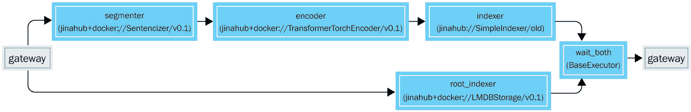
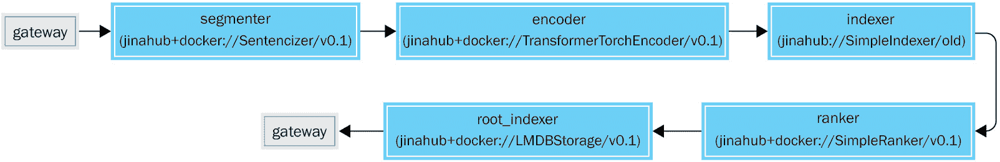
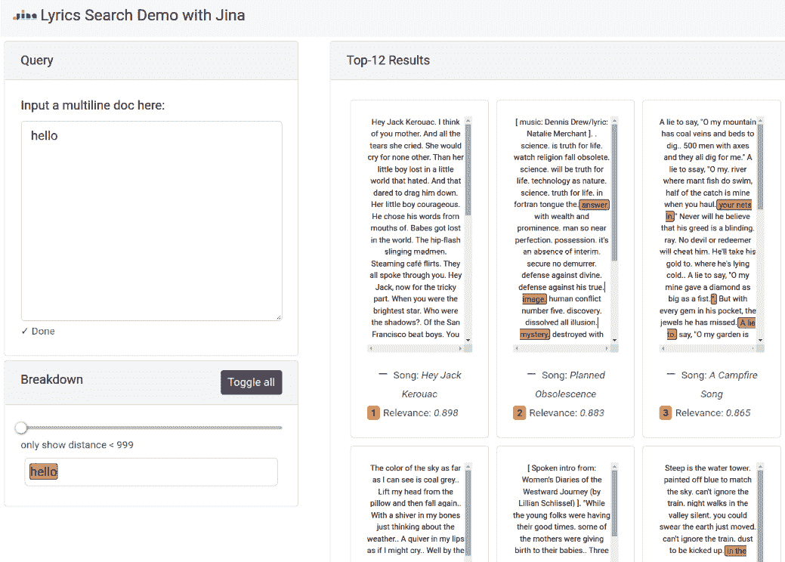
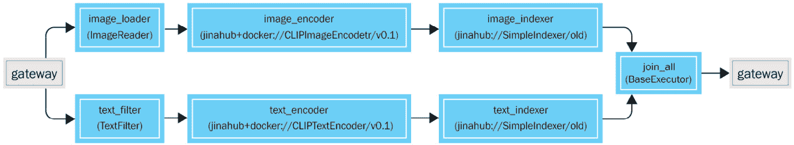
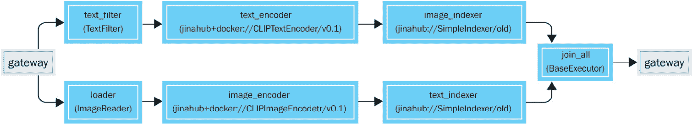
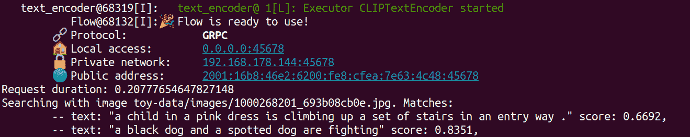
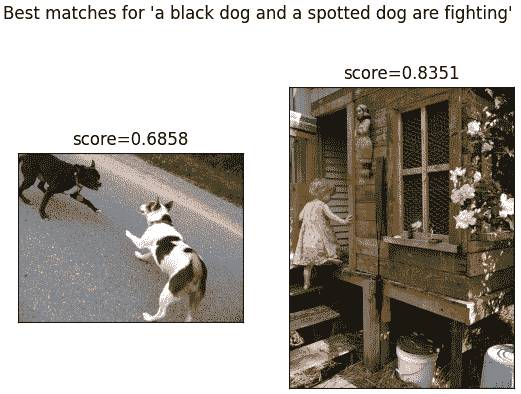
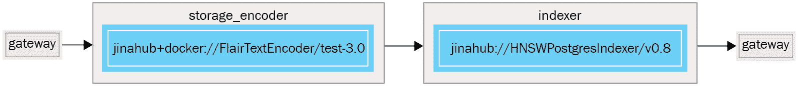

# 第七章：探索 Jina 的高级使用案例

在本章中，我们将讨论 Jina 神经搜索框架的更高级应用。在前几章中学到的概念基础上，我们将探讨通过 Jina 可以实现的其他功能。我们将考察多级粒度匹配、边索引边查询以及跨模态示例。这些是神经搜索中的挑战性概念，掌握它们对于实现复杂的现实应用至关重要。本章将涵盖以下内容：

+   引入多级粒度

+   使用图像和文本进行跨模态搜索

+   并发查询和索引数据

这些涵盖了神经搜索应用的广泛现实需求。通过这些示例，以及*第六章*中的基础示例，*Jina 的基本实用示例*，你可以扩展和改进你的 Jina 应用，以覆盖更高级的使用模式。

# 技术要求

本章中，我们将构建并执行 GitHub 仓库中提供的高级示例。代码可以在 [`github.com/PacktPublishing/Neural-Search-From-Prototype-to-Production-with-Jina/tree/main/src/Chapter07`](https://github.com/PacktPublishing/Neural-Search-From-Prototype-to-Production-with-Jina/tree/main/src/Chapter07) 获取。请确保下载该代码并在执行重现使用案例的说明时，导航到每个示例的相应文件夹。

要运行此代码，你需要以下环境：

+   安装了 WSL2 的 macOS、Linux 或 Windows。Jina 无法在原生 Windows 上运行。

+   Python 3.7 或 3.8

+   可选：为每个示例提供一个全新的虚拟环境

+   Docker

# 引入多级粒度

本节将讨论 Jina 如何捕捉并利用现实生活中数据的层次结构。为了跟随现有代码，请查找该章节代码中的一个名为 `multires-lyrics-search` 的文件夹。这就是我们将在本节中提到的示例。

本示例依赖于`Document`类型的能力来容纳块（子文档）并引用特定的父文档。通过这种结构，你可以在文档中组合出任意层次的复杂文档层次结构。这模拟了许多现实生活中与数据相关的问题。例如，图像的补丁、段落的句子、长电影的片段等。

请参阅以下代码，了解如何通过 Jina 的 `Document` API 实现：

```py
from jina import Document
 document = Document() 
chunk1 = Document(text='this is the first chunk') 
chunk2 = Document(text='this is the second chunk') 
document.chunks = [chunk1, chunk2]
```

然后，可以通过多个粒度层次进行链式操作，每个块都有自己的子块。当处理层次数据结构时，这非常有用。关于 `Document` 数据类型的更多信息，你可以参考*第四章*中的 *理解 Jina 组件* 部分，*学习 Jina 的基础知识*。

在这个例子中，数据集将由来自不同流行歌曲的歌词组成。在这种情况下，粒度基于语言学概念。最高层次是整首歌曲歌词的内容。下一级则是从顶层正文中提取的单独句子。这个拆分是通过`Sentencizer`执行器来完成的，它通过寻找特定的分隔符文本标记（如`.`或`,`）来拆分长文本。

这个应用程序有助于展示**分块**概念及其在搜索系统中的重要性。这一点非常关键，因为为了在神经搜索系统中获得最佳结果，最好使用相同长度的文本输入进行搜索。否则，搜索数据与训练模型数据之间的上下文与内容比率将会不同。一旦我们构建了示例，就可以通过自定义前端可视化系统是如何将输入与输出匹配的。

## 浏览代码

现在，让我们一起看看应用程序的逻辑和每个组件的功能。你可以在[`github.com/PacktPublishing/Neural-Search-From-Prototype-to-Production-with-Jina/tree/main/src/Chapter07/multires-lyrics-search`](https://github.com/PacktPublishing/Neural-Search-From-Prototype-to-Production-with-Jina/tree/main/src/Chapter07/multires-lyrics-search)中跟随仓库中的代码。我将解释文件夹中主要文件的目的和设计。

## app.py

这是示例的主要入口点。用户可以使用该脚本来索引（添加）新数据或使用他们期望的查询进行搜索。对于数据索引，可以通过以下命令行操作来完成：

```py
python -t app.py index
```

除了提供`index`参数外，你还可以提供`query`或`query_text`作为参数。`query`启动外部 REST API 使用的 Flow。然后，你可以使用仓库中提供的自定义前端来连接它。`query_text`允许用户直接从命令行进行搜索。

在索引时，数据会从`CSV`文件中按顺序读取。我们还会附加相关的标签信息，如作者、歌曲名、专辑名和语言，以便在界面中显示元数据。用户还可以根据需要使用标签。在*理解 Jina 组件*章节中的*访问标签中的嵌套属性*小节中进行了讨论。

## index.yml

该文件定义了在索引数据（添加数据）时使用的 Flow 结构。以下是文件中提供的不同配置选项：

+   `jtype`通知 YAML 解析器该对象的类类型。在本例中，它是`Flow`类。然后，YAML 解析器将使用相应的配置参数实例化该类。

+   `workspace` 定义了每个 Executor 可能想要存储数据的默认位置。并非所有 Executor 都需要一个工作区。这个设置可以被每个 Executor 的 `workspace` 参数覆盖。

+   `executors` 是一个定义此流程中处理步骤的列表。这些步骤由特定的类定义，所有这些类都是 `Executor` 类的子类。

索引流程由下图表示：



图 7.1 – 索引流程显示文档分块

请注意数据流程如何在网关处被分割。原始文档存储在 `root_indexer` 中，供将来检索。在另一条路径上，文档被处理以提取其块，编码它们，并将它们存储到索引器中。

以下是此示例中使用的不同 Executors：

1.  第一个是 `segmenter`，它使用来自 Jina Hub 的 `Sentencizer` 类。我们使用默认配置。此配置使用一组通常用来分隔句子的标点符号（如 `.`、`,`、`;`、`!`）将歌词正文分割成句子。这里是创建并分配文档父级的块的地方，基于这些标记在文本中的位置。

1.  下一个是 `encoder`。这是流程中的组件，将句子从文本转换为数字格式。该组件使用 `TransformerTorchEncoder` 类。它从 `Huggingface` API 下载 `distilbert-base-cased` 模型，并使用该模型将文本编码成向量，然后可以用来进行向量相似度计算。我们还将在此定义一些配置选项：

    +   `pooling_strategy: 'cls'`：这是编码器使用的池化策略。

    +   `pretrained_model_name_or_path: distilbert-base-cased`：这是使用的深度学习模型。它是预训练的，并在 Executor 启动时下载。

    +   `max_length: 96`：此项表示从句子中编码的最大字符数。超过此限制的句子会被裁剪（多余的字符会被删除）。

    +   `device: 'cpu'`：此配置指示 Executor 在 CPU 上运行。Executor 也可以在 GPU 上运行（使用 `'gpu'`）。

    +   `default_traversal_paths: ['c']`：此项计算在块级别的嵌入。这表示 `segmenter` 提取的句子的层次级别。我们仅编码这些，因为我们只会在此级别进行搜索匹配。匹配整个歌词的正文效果不佳，因为模型需要编码的数据量太大。

1.  现在我们将深入了解实际的存储引擎，`indexer`。为此，我们使用名为 `SimpleIndexer` 的 Executor，同样来自 Jina Hub。它使用 Jina 的 `DocumentArrayMemmap` 类，将数据存储到磁盘，但同时将其加载到内存中，按需读取和写入，而不会消耗过多内存。我们为它定义了以下配置选项：

    +   `default_traversal_paths: ['c']`：这些选项配置组件以存储文档的块。这与前面使用`default_traversal_paths`的目的相同。

1.  接下来是另一个索引器，`root_indexer`。这是本示例的特定要求。之前，在`indexer`中，我们只存储了文档的块。但是，在搜索时，我们还需要检索父文档本身，以便获取与其相关的标签（艺术家名称、歌曲名称等）。因此，我们需要将这些文档存储在某个地方。这就是我们需要这个额外执行器的原因。通常，根据应用程序中的用例，这不会是必需的。我们定义了以下配置选项：

    +   `default_traversal_paths: ['r']`：我们定义了将索引文档的根级别（即，不是块级别）。

    +   `needs: [gateway]`：这告诉 Flow 并行发送请求到两个不同的路径：一个发送到`segmenter`和`encoder`路径，另一个直接发送到`root_indexer`，因为这个路径不依赖于另一个路径中的任何执行器。

你可能注意到在一些执行器中重复出现了一个额外的参数`volumes`。这符合 Docker 的语法，用于在 Docker 容器中挂载本地目录，以便在正在运行的 Docker 容器中挂载工作空间。

## query.yml

本文件定义了查询数据时使用的 Flow 结构（搜索数据时）。这与索引时使用的 Flow 配置不同，因为操作的顺序不同。通过查看下图，我们可以看到主要的变化是查询时的操作是严格顺序的：



图 7.2 – 查询流程展示文档分块

匹配项是从`indexer`中检索的，它在之前定义的块级别操作。然后，`ranker`为每个存在于块中的父 ID 创建一个单一的匹配项。最后，基于其 ID，从`root_indexer`检索此父匹配文档的原始元数据。这是必要的，以便获取块的完整上下文（父文档的完整文本内容以及艺术家和歌曲的名称）。

与`index.yml`文件类似，`query.yml`文件也定义了一个包含执行器的 Flow。我们将讨论它们的配置选择，但我们只会涉及与`index.yml`文件中的对应项不同的部分。如果某个参数在本节中未涉及，请查看前一节。以下是查询 Flow 中定义的执行器：

+   `segmenter`相同。

+   `encoder`也相同。

+   `indexer`也相同。

1.  第一个新的 Executor 是`ranker`。它执行自定义的排名和搜索结果排序。我们使用的是来自 Jina Hub 的`SimpleRanker`。这里唯一的参数是`metric: 'cosine'`。这将配置该类使用`cosine`度量来进行排名。其工作原理是将父文档的各个块（子文档）的得分聚合为父文档的整体得分。这是确保匹配结果按对客户端（前端、REST API 客户端或命令行界面）有意义的方式进行排序所必需的。

1.  最后的步骤是`root_indexer`。在这里，我们将`default_traversal_paths`更改为`['m']`。这意味着我们希望检索文档匹配项的元数据，而不是请求文档本身的元数据。它会获取文档的 ID 并查找其元数据。如前所述，`indexer`只存储文档的块。我们需要检索块的父文档的完整元数据。

## 安装并运行示例

我现在将指导你安装并运行这个示例应用程序：

1.  确保满足本章开始时定义的要求。

1.  从[`github.com/PacktPublishing/Neural-Search-From-Prototype-to-Production-with-Jina`](https://github.com/PacktPublishing/Neural-Search-From-Prototype-to-Production-with-Jina)克隆 Git 仓库，并在示例的文件夹中打开终端，路径为`src/Chapter07/multires-lyrics-search`。

1.  安装所需的依赖项：

    ```py
    pip install -r requirements.txt
    ```

1.  下载完整的数据集。此步骤是可选的；你可以跳过此步骤并使用提供的示例数据：

    1.  如果你还没有安装 Kaggle 库，请首先安装。你还需要设置 API 密钥，具体操作请参考这里：[`github.com/Kaggle/kaggle-api#api-credentials:`](https://github.com/Kaggle/kaggle-api#api-credentials%0D)

    ```py
    bash script should perform all the steps needed to download the full dataset:
    ```

```py
bash get_data.sh
```

+   下一步是对数据进行索引。此步骤会处理你的数据并将其存储在 Flow 的 Executors 的工作区中：

    ```py
    python app.py -t index
    ```

    +   搜索你的数据。这里你有两个选项：

    +   `python app.py -t query_text`：此选项启动命令行应用程序。到某个时刻，它会要求你输入一个短语。该短语会被处理并作为搜索查询使用。结果将在终端显示。

    +   `python app.py -t query`：这将以服务器模式启动应用程序。它监听 REST API 上的传入请求，并向客户端响应最佳匹配项。

在第二种模式下，你可以使用我们构建的自定义前端来探索结果。你可以通过在终端中运行以下命令来启动前端：

```py
cd static
python -m http.server --bind localhost
```

现在你可以在浏览器中打开[`127.0.0.1:8000/`](http://127.0.0.1:8000/)，应该可以看到一个网页界面。在此界面中，你可以在左侧框中输入文本。然后，你将在右侧看到结果。匹配的文本块将在歌词正文中高亮显示。

以下是界面的截图：



图 7.3 – 歌词搜索引擎示例，展示匹配的歌曲

例如，如果你添加了句子 `I am very happy today`，你应该会看到类似的结果。你在右侧看到的每个框都是你数据集中的一首歌曲。每个高亮显示的句子是一个 *匹配项*。匹配项是相似的句子，依据的是两个向量在嵌入空间中的接近程度。

相似度可以通过左侧的滑块进行调整。当你将滑块向右移动时，你会看到更多的匹配项。这是因为我们在向量空间中增大了半径，以便找到更多相似的匹配项。

你在歌曲框底部看到的相关性评分总结了歌曲中的所有匹配项。每个匹配项都有一个介于 0 到 1 之间的数值，表示它与原始输入在向量空间中的相似度。这些匹配值的平均值即为相关性评分。这意味着只有良好的匹配项的歌曲将被排名为高度相关。

这个示例还支持更复杂的多句查询。如果你在查询时输入两句或三句，查询流程将把整个输入分解为单独的“块”。在这个示例中，块是句子，但在构建 Jina 时，你可以根据自己的数据确定块的定义。

在本节中，我们介绍了如何在 Jina 框架中建模现实世界数据的层次结构。我们使用 `Document` 类及其持有块的能力来表示这些数据。然后，我们构建了一个示例应用程序，可以用于在句子级别上搜索歌曲歌词。这个方法可以推广到任何文本（或其他模态）数据应用程序。在接下来的章节中，我们将看到如何利用文档的模态来搜索带有文本的图像。

# 带有文本的跨模态搜索与图像

在本节中，我们将展示一个高级示例，展示 **跨模态搜索**。跨模态搜索是神经搜索的一种子类型，其中我们索引的数据和我们用来搜索的数据属于不同的模态。这是神经搜索所独有的，因为传统的搜索技术无法轻易实现这一点。这之所以可行，是由于神经搜索技术的核心：所有深度学习模型将所有数据类型转化为相同的共享数字表示——向量（从网络的特定层提取的嵌入）。

这些模态可以通过不同的数据类型来表示：音频、文本、视频和图像。同时，它们也可以是相同类型的，但分布不同。举个例子，比如用论文摘要来搜索，目的是获得论文标题。它们都是文本，但底层的数据分布不同。因此，在这种情况下，分布也可以视为一种模态。

本节中的示例目的是展示 Jina 框架如何帮助我们轻松执行此类搜索。我们重点介绍了如何使用 Flow 根据数据的模态将数据处理拆分为两个执行器流水线。这是通过 `needs` 字段完成的，它定义了执行器之前所需的步骤。通过将这些 `needs` 链接在一起，我们可以获得独立的路径。

现在让我们来讲解应用程序的逻辑以及每个文件的作用。代码可以在 [`github.com/PacktPublishing/Neural-Search-From-Prototype-to-Production-with-Jina`](https://github.com/PacktPublishing/Neural-Search-From-Prototype-to-Production-with-Jina) 的 `src/Chapter07/cross-modal-search` 文件夹中找到。

## app.py

这是示例的主要入口点。用户可以调用它来进行 **索引** 或 **搜索**。然后，它会创建流程并根据用户的查询进行数据索引或搜索。

## flow-index.yml

该文件定义了在索引数据（添加数据）时使用的流程结构。我将解释不同的步骤。

流程本身有以下参数：

+   `prefetch` 定义了从客户端请求中预取的文档数量。

+   `workspace` 定义了数据存储的默认位置。每个执行器的 `workspace` 参数可以覆盖此设置。

然后，`executors` 列表定义了此流程中使用的执行器。该列表中的每个项目都是一个执行器及其配置。

以下是表示索引流程的图示。注意，路径如何从网关分岔，这取决于数据是图像还是文本：



图 7.4 – 显示跨模态特征的索引流程

我们将按路径对每个执行器的目的进行描述。第一个路径是用于图像数据的路径：

1.  第一个执行器是 `image_loader`。它使用 `ImageReader` 类，该类在 `flows/executors.py` 文件中本地定义。它将从特定文件夹加载图像文件，并将其传递到流程中进一步处理。当创建文档时，我们可以为其分配一个 `mime` 类型。然后可以在特定执行器中使用它来执行自定义逻辑。在这里，我们使用它来限制哪些文档进入哪个执行器。

参数如下：

+   `py_modules`：这告诉 Python 进程在哪里找到额外的类，然后可以在 `uses` 参数中使用它们。

+   `needs`：这会从网关（始终是流程的第一个和最后一个跳跃）创建到此执行器的直接连接。它使得该组件等待来自网关的请求。这里需要这样做，因为我们希望文本和图像有两个独立的路径。

1.  下一个是 `image_encoder`。这是执行大部分工作的地方。编码器是将数据转换为数值表示的执行器。它使用 `CLIPImageEncoder`，版本 0.1。参数如下：

    +   `needs`：这定义了图像路径上数据的流向。

1.  `image_indexer`是存储包含图像的文档的嵌入向量和元数据的地方。它使用`SimpleIndexer`。使用的参数如下：

    +   `index_file_name`：定义存储数据的文件夹。

    +   `needs`：通过明确指定它依赖于`image_encoder`，将该 Executor 纳入图像处理路径。

1.  接下来的元素将是文本路径的一部分。`text_filter`类似于`image_filter`。它读取数据，但仅限于文本型文档。这里使用的参数如下：

    +   `py_modules`：此参数再次定义`TextFilterExecutor`所在的文件。

    +   `needs: gateway`定义了 Executor 之间的依赖路径。在这种情况下，该 Executor 位于路径的起始位置，因此依赖于`gateway`。

1.  接下来，类似于图像路径，我们有编码器`text_encoder`。它处理文本并使用`CLIPTextEncoder`对其进行编码。这里使用的参数如下：

    +   `needs: text_filter`：此参数指定该 Executor 是文本路径的一部分。

1.  `text_indexer`存储 Executor 的嵌入向量。

1.  最后，我们将两条路径连接起来。`join_all`将两条路径的结果合并为一个。此处的`needs`参数指定了一个 Executor 名称的列表。

你会注意到某些 Executor 中有一个重复的参数：

`volumes`：这是 Docker 语法，用于将本地目录挂载到 Docker 容器中。

## query.yml

本节将介绍查询（搜索）Flow。它指定了使用前述索引 Flow 搜索你已索引（存储）的数据的过程。Executor 的配置是相同的，按个别 Executor 配置。

从下图可以看出，Flow 路径也类似。它在开始时也会分叉，取决于数据类型：



图 7.5 – 显示跨模态特征的查询流程

区别在于，现在我们在两种模态之间进行文档搜索。因此，`text_loader`将带有文本的文档发送给`text_encoder`进行编码，但实际的相似度匹配是通过存储在`image_indexer`中的图像文档进行的，这些图像文档来自索引 Flow。这是使我们能够在本示例中实现跨模态搜索的核心要素。

## 安装并运行示例

要运行示例，请执行以下操作：

1.  确保本章开始时定义的要求已满足。

1.  从[`github.com/PacktPublishing/Neural-Search-From-Prototype-to-Production-with-Jina`](https://github.com/PacktPublishing/Neural-Search-From-Prototype-to-Production-with-Jina)仓库克隆代码，并在`src/Chapter07/cross-modal-search`文件夹中打开终端。

1.  请注意，本示例仅包含两个图像作为示例数据集。为了下载整个数据集并探索结果，你需要从 Kaggle 下载数据集。你可以通过注册一个免费的 Kaggle 账户来实现。然后，设置你的 API 令牌。最后，要下载`flickr 8k`数据集，请在终端中运行以下命令：

    ```py
    bash get_data.sh 
    ```

1.  要索引完整数据集，请运行以下命令：

    ```py
    python app.py -t index -d f8k -n 8000
    ```

1.  启动索引流程并索引示例数据是通过命令行完成的，如下所示：

    ```py
    python app.py -t index
    ```

这将创建索引流程，处理指定文件夹中的数据，并将其存储在本地文件夹`workspace`中。

1.  然后，为了启动搜索流程并允许用户执行搜索查询，你可以运行以下命令：

    ```py
    python app.py -t query
    ```

让我们先运行一个小的测试查询。这个测试查询实际上包含了图像和文本文档。文本是句子`a black dog and a spotted dog are fighting.`，图像是`toy-data/images/1000268201_693b08cb0e.jpg`。系统然后通过图像和文本以跨模态的方式进行搜索。这意味着图像用来在文本数据中进行搜索，而文本用来在图像数据中进行搜索。

通过图像进行搜索的文本结果将在你的终端中打印，结果如下：



图 7.6 – 跨模态搜索终端输出

图像结果将在`matplotlib`图形中显示，结果如下：



图 7.7 – 跨模态搜索绘图输出

在这种情况下，较低的得分表示较好，因为它衡量的是向量之间的距离。

你可以通过以下方式传递自己的图像查询：

```py
python app.py -t query --query-image path_to_your_image
```

`path_to_your_image`变量可以提供为绝对路径或相对路径，基于终端当前的工作目录路径。

或者，对于文本，你可以这样做：

```py
python app.py -t query --query-text "your text"
```

在本节中，我们介绍了 Jina 框架如何使我们轻松构建跨模态搜索应用程序。这得益于 Jina 的通用和可扩展的数据类型，主要是文档，以及灵活的管道构建过程。我们看到，`needs`参数允许我们根据*mime*类型将处理管道拆分为两条路径。在接下来的部分中，我们将看到如何在修改数据的同时提供服务。

# 并发查询和数据索引

在本节中，我们将介绍如何持续响应客户请求，同时能够更新、删除或向数据库中添加新数据的方法。这在行业中是一个常见需求，但实现起来并不简单。这里的挑战在于如何保持向量索引的最新状态，同时能够以原子方式更新数据，并且在可扩展、容器化的环境中执行所有这些操作。使用 Jina 框架，所有这些挑战都能轻松解决。

默认情况下，在 Jina Flow 中，您不能同时进行数据索引和搜索。这是由于网络协议的特性。实际上，每个执行器都是单线程的应用程序。您可以使用分片技术扩展执行器的副本数量，从而形成执行器组。然而，这仅对纯并行操作（如编码数据）安全。这些操作不会影响执行器的状态。另一方面，**CRUD**（**创建/读取/更新/删除**）操作会影响执行器的状态。通常，这些操作在可扩展系统中更难并行化。因此，如果您将大量数据发送到应用程序进行索引（添加），这将会阻塞所有来自客户端的搜索请求。这显然是一个很大的限制。在这个解决方案中，我将展示如何在 Jina 中解决这个问题。

解决方案的关键组件是**HNSWPostgresIndexer**执行器。这是 Jina 框架的执行器，它将内存中的 HNSW 向量数据库与 PostgreSQL 数据库连接起来。文档的元数据存储在 SQL 数据库中，而嵌入向量则存储在内存中。与之前示例中的应用程序不同，它不需要两个独立的 Flow。所有的 CRUD 操作都在一个 Flow 生命周期内完成。这是由于执行器能够在 SQL 数据库和内存中的向量数据库之间同步状态。这个同步过程可以配置为自动完成，也可以在需要时手动触发。

现在让我们深入了解这个示例中的每个组件的作用。代码可以在[`github.com/PacktPublishing/Neural-Search-From-Prototype-to-Production-with-Jina`](https://github.com/PacktPublishing/Neural-Search-From-Prototype-to-Production-with-Jina)的`/src/Chapter07/wikipedia-sentences-query-while-indexing`文件夹中找到。

## app.py

这是示例的主要入口点。用户可以调用它来启动索引并搜索流或文档。为了启动流，您可以按照以下方式运行`app.py`：

```py
python app.py -t flow
```

这将初始化 Jina 应用程序的 Flow，并启动其执行器。接着，它会按批次一次添加五个文档到**HNSWPostgreSQL**执行器中。最初，这些数据仅被插入到 SQL 数据库中。因为 SQL 数据库被视为数据的主要来源。**HNSW**向量索引将根据 SQL 数据库中的数据逐步更新。一旦有数据存在，执行器将自动将其同步到 HNSW 向量索引中。这个过程将持续进行，直到数据完全插入。一旦完成一轮，用户就可以查询数据了。用户可以通过以下命令查询数据：

```py
python app.py -t client
```

然后，系统会提示用户输入查询文本。该文本将被编码并与现有数据集进行比较，以获得最佳匹配结果。这些匹配结果将打印回终端。

## flow.yml

该文件定义了 Flow 的结构，用于数据索引（添加数据）和搜索。我将解释不同的选项。

以下是索引 Flow 的图示。注意它非常简单：我们只是编码并存储编码后的数据。这个示例应用的复杂性来自于 **HNSWPostgreSQL** Executor 的内部行为。



图 7.8 – 显示并发的查询流程

Flow 本身有以下参数：

+   `protocol`：定义 Flow 应该开放其 HTTP 协议给外部

+   `port_expose`：定义监听的端口

接着，Executors 定义了 Flow 中的各个步骤：

+   第一个是 `storage_encoder`。这个参数使用 Jina Hub 上的 `FlairTextEncoder`，它将文本编码成向量，用于机器学习中所需的线性代数运算。

+   第二个参数是 `indexer`。它使用 Jina Hub 上的 `HNSWPostgresIndexer`。这里使用的参数如下：

    +   `install_requirements`：设置为 `True` 时，将安装该 Executor 所需的库

    +   `sync_interval`：自动将数据从 SQL 数据库同步到向量数据库之间的等待时间，单位为秒

    +   `dim`：嵌入的维度

你会注意到某些 Executors 中有一个额外的参数被重复使用：

+   `timeout_ready`：定义等待 Executor 可用的秒数，超时后取消执行。我们将其设置为 `-1`，因此将根据需要等待。根据您的场景，可以调整此参数。例如，如果你希望安全终止一个长时间运行的下载请求，可以设置等待 Executor 启动的秒数。

## 安装并运行示例

在运行此示例之前，确保你理解上一章中的基本文本搜索，特别是聊天机器人示例。另外，你需要在计算机上安装 Docker：

1.  从 [`github.com/PacktPublishing/Neural-Search-From-Prototype-to-Production-with-Jina/tree/main/src/Chapter07/wikipedia-sentences-query-while-indexing`](https://github.com/PacktPublishing/Neural-Search-From-Prototype-to-Production-with-Jina/tree/main/src/Chapter07/wikipedia-sentences-query-while-indexing) 克隆 Git 仓库，并在示例文件夹中打开终端。

1.  创建一个新的 Python 3.7 环境。虽然不是强制要求，但强烈推荐这样做。

1.  安装依赖：

    ```py
    pip install -r requirements.txt
    ```

仓库包含一个 Wikipedia 数据集的小子集，供快速测试使用。你可以直接使用它。如果你想使用整个数据集，运行 `bash get_data.sh`，然后修改 `app.py` 中的 `DATA_FILE` 常量，将其指向该文件。

1.  然后使用以下命令启动 Flow：

    ```py
    python app.py -t flow
    ```

这将创建 Flow 并建立数据同步循环，如前文 `app.py` 中所描述。

1.  为了查询数据，运行以下命令：

    ```py
    python app.py -t client
    ```

接下来，系统会提示你输入一些文本。你可以输入任何你想查询的内容。然后你将得到与查询最匹配的结果。

由于 Flows 公开了 HTTP 协议，你可以通过 Jina 客户端、cURL、Postman 或 Jina 内置的自定义 Swagger UI 来查询 REST API。你可以通过终端中 Flow 提供的 URL 访问 Swagger UI。通常是 `http://localhost:45678/docs`，但这取决于你配置的系统。

在本节中，我们学习了如何使用 `HNSWPostgreSQLIndexer` 执行器，在我们的实时系统中并行索引和搜索数据。在之前的示例中，Flow 需要重新定义并重启，以在两种模式之间切换。由于该执行器结合了元数据存储（通过与 SQL 数据库的连接）和嵌入索引（通过内存中的 HNSW 索引），因此可以在一个 Flow 生命周期内执行所有 CRUD 操作。利用这些技术，我们可以拥有一个不受底层数据库索引更新限制的真实客户端应用。

# 总结

在本章中，我们分析并实践了如何使用 Jina 的高级功能，如分块、模态和高级的`HNSWPostgreSQL` 执行器，以应对神经搜索中最具挑战性的目标。我们实现了针对任意层次深度数据表示、跨模态搜索和非阻塞数据更新的解决方案。分块使我们能够反映一些数据具有多层次语义意义的特性，例如段落中的句子或长篇电影中的视频片段。跨模态搜索开启了神经搜索的一个主要优势——数据的通用性。这意味着，只要使用正确的模型，你就可以用任何类型的数据进行任何类型的数据搜索。最后，`HNSWPostgreSQL` 执行器使我们能够构建一个实时系统，用户既可以搜索也可以索引，同时数据保持同步。
