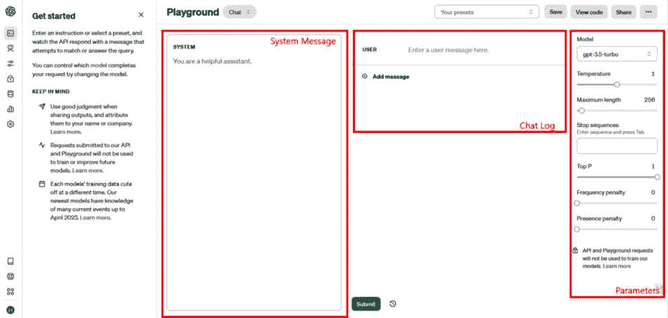
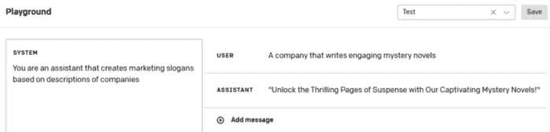
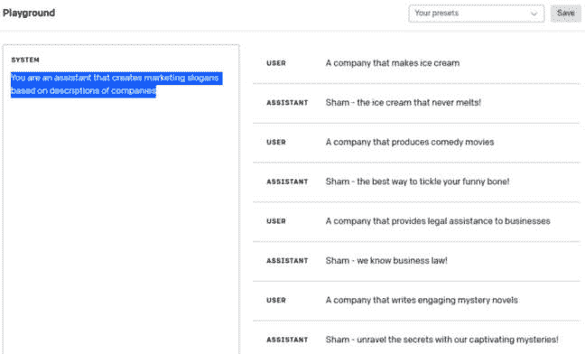
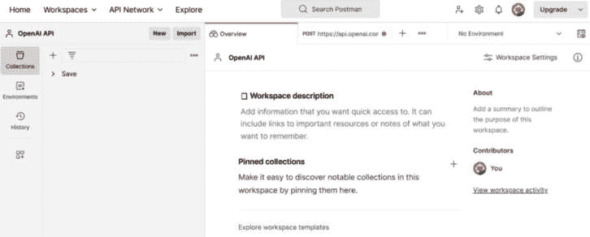
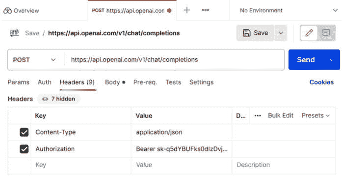
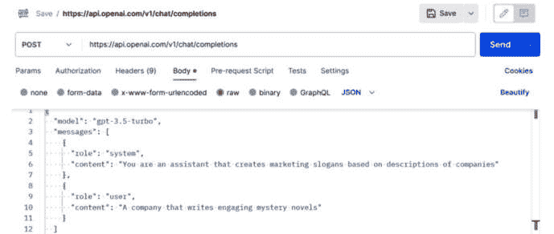
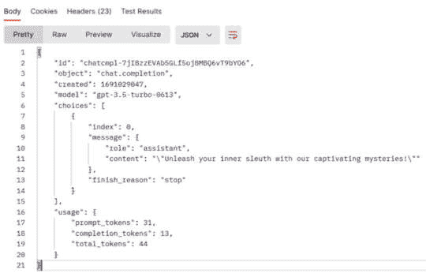

# 第一章：解锁 OpenAI 并设置你的 API Playground 环境

ChatGPT 是由 OpenAI 开发的先进 **人工智能** (**AI**) 语言模型，是历史上增长最快的原生消费应用，仅用 2 个月就达到了 1 亿用户。相比之下，TikTok 排名第二，达到同样的用户数用了超过 9 个月（[`www.forbes.com/sites/cindygordon/2023/02/02/chatgpt-is-the-fastest-growing-ap-in-the-history-of-web-applications/?sh=3551e45d678c`](https://www.forbes.com/sites/cindygordon/2023/02/02/chatgpt-is-the-fastest-growing-ap-in-the-history-of-web-applications/?sh=3551e45d678c)）。它之所以如此受欢迎，可以归因于其使 **自然语言处理** (**NLP**) 模型对普通用户普及的能力。NLP 是 AI 中一个关注计算机与人类通过自然语言互动的领域。NLP 的终极目标是使计算机能够以既有意义又有用的方式解释、理解并响应人类语言。传统上，这个领域的任务——从情感分析到语言翻译——都需要强大的数据集和机器学习与数据科学的专业知识才能有效执行。

然而，ChatGPT 的崛起及其相关的 **应用程序接口** (**API**) 已彻底改变了 NLP 领域。得益于它使 NLP 模型普及的能力，任何人，包括普通用户，现在都可以通过简单的提示生成类人文本，而不需要具备深入的数据科学或机器学习知识。例如，以前可能需要设计一个复杂的模型来将文本分类，现在通过 ChatGPT，一个简单的提示就能实现相同的目标。

从本质上讲，ChatGPT 的出现使得以前复杂的 NLP 任务变得更易接触和用户友好，弥合了先进技术与大众之间的鸿沟。

程序员和开发者们正在关注并将 GPT 的强大功能融入他们自己的应用程序中，使其变得智能。事实上，许多资金充足的初创公司（*Typeface*、*Jasper AI*、*Copy.ai*）将 ChatGPT 和其他 **大型语言模型** (**LLMs**) 作为其产品的基础，无论是用于总结文本、寻找信息还是创建聊天机器人。这需要对 OpenAI API 及其如何用于构建智能应用程序有一个基本的了解，而这就是我们将要开始的地方。

这从基础开始，包括创建 OpenAI 账户、访问 API Playground 并发出 API 请求。

本章中，我们将介绍以下内容：

+   设置你的 OpenAI Playground 环境

+   在 OpenAI Playground 中运行完成请求

+   在 OpenAI Playground 中使用系统消息

+   使用聊天记录修改模型行为

+   使用 Postman 发出 OpenAI API 请求

# 技术要求

这一章需要您能够访问 OpenAI API。您可以在[`platform.openai.com/overview`](https://platform.openai.com/overview)创建账户并注册以获取访问权限。

# 设置您的 OpenAI Playground 环境

**OpenAI Playground**是一个交互式的基于 Web 的界面，旨在允许用户尝试 OpenAI 的语言模型，包括 ChatGPT。这是一个您可以通过输入提示并实时查看生成响应来了解这些模型能力的地方。该平台充当一个沙盒，开发者、研究人员和好奇的个人都可以在此进行实验、学习，甚至原型设计他们的想法。

在 Playground 中，您可以自由参与各种活动。您可以测试 AI 模型的不同版本，尝试使用各种提示来查看模型的响应，并且您可以通过调整不同的参数来影响生成的响应。这提供了一个实时的窥视，展示了这些强大的 AI 模型如何思考、反应和创造基于您的输入。

## 准备工作

在开始之前，您需要创建一个*OpenAI* *Platform*账户。

转到[`platform.openai.com/`](https://platform.openai.com/)并登录您的 OpenAI 账户。如果您没有账户，您可以使用电子邮件地址免费注册。或者，您可以使用有效的 Google、Microsoft 或 Apple 账户登录 OpenAI。按照说明完成账户创建。您可能需要使用有效的电话号码进行身份验证。

## 如何操作…

1.  成功登录后，在右上角菜单中选择**Profile**，然后选择左侧菜单中的**Personal**，接着选择**Usage**。或者，您可以在登录后转到[`platform.openai.com/account/usage`](https://platform.openai.com/account/usage)。此页面显示您 API 的使用情况，更重要的是，它展示了您可用的学分数量。

1.  通常，OpenAI 为新账户提供$5 的学分，您应该能在页面的**Free Trial Usage**部分看到这一点。如果您有学分，请继续*第四步*。然而，如果您没有任何学分，您需要升级并设置一个付费账户。

1.  如果您已经获得了免费学分，则无需设置付费账户。然而，如果您用完了免费学分，这里是如何设置付费账户的方法：从左侧菜单选择**Billing**，然后选择**Overview**。接着，选择**Set up paid account**按钮。您将被提示输入支付详细信息并设置一个美元阈值，可以设置为您感到舒适的任何消费水平。请注意，执行本书中包含的每一个配方可能需要的学分总额不太可能超过*$5*。

1.  创建 OpenAI 平台账户后，你应该能通过选择顶部菜单栏中的**Playground**，或者访问 [`platform.openai.com/playground`](https://platform.openai.com/playground) 来进入 Playground。

## 如何工作…

根据我的经验，OpenAI Playground 界面简洁、直观，旨在为用户提供便捷访问 OpenAI 强大语言模型的途径。Playground 是一个极好的地方，可以学习在不同设置下模型的表现，允许你尝试诸如温度和最大令牌数等参数，它们分别影响输出的随机性和长度。你所做的更改会立即反映在模型的响应中，提供即时反馈。

如*图 1.1*所示，Playground 包含三个部分：*系统消息*、*聊天日志*和*参数*。你将在*在 OpenAI Playground 中运行完成请求*的教程中了解这三个功能的更多信息。



图 1.1 – OpenAI Playground

现在，你的 Playground 已经设置好并准备使用了。你可以用它来运行完成请求，查看修改提示和参数如何影响 OpenAI 的响应。

# 在 OpenAI Playground 中运行完成请求

在本教程中，我们将实际操作 Playground，并执行来自 OpenAI 的完成请求。在这里，你将看到 OpenAI API 的强大功能，以及它如何用于为几乎任何提示提供完成。

## 准备就绪

确保你有一个拥有可用使用额度的 OpenAI 平台账户。如果没有，请按照*设置你的 OpenAI Playground 环境*的教程进行操作。本章中的所有教程都会有这个相同的要求。

## 如何操作…

让我们开始用 Playground 测试模型吧。我们来创建一个编写营销标语的助手：

1.  进入**OpenAI Playground**。

1.  在系统消息中，输入以下内容：**你是一个根据公司描述创建营销标语的助手**。在这里，我们明确指示模型的角色和上下文。

1.  在聊天日志中，填写**用户**消息如下：**一个编写吸引人的** **悬疑小说**的公司。

1.  选择页面底部的**提交**按钮。

1.  现在你应该能看到 OpenAI 返回的完成响应。在我的例子中（*图 1.2*），响应如下：

    ```py
    Unlock the Thrilling Pages of Suspense with Our Captivating Mystery Novels!
    ```



图 1.2 – OpenAI Playground 与提示和完成

注意

由于 OpenAI 的大语言模型（LLMs）是基于概率的，你可能不会看到和我一样的输出。实际上，如果你多次运行这个教程，你可能会看到不同的答案，这也是预期的，因为这是模型随机性的内在特征。

## 如何工作…

OpenAI 的文本生成模型使用一种特定的神经网络架构，称为 transformer。在深入探讨之前，我们先来解释一些这些术语：

+   **神经网络架构**：从高层次来看，这指的是一个受到人脑互联神经结构启发的系统。它设计用来识别模式，可以被认为是许多现代 AI 系统的基础构建块。

+   **Transformer**：这是一种神经网络设计，已被证明在理解序列方面特别有效，使其非常适合处理与人类语言相关的任务。它专注于词语之间的关系及其在句子或更大文本段落中的上下文。

在机器学习中，**无监督学习**通常指的是在没有任何标签数据的情况下训练模型，让模型自行发现模式。然而，OpenAI 的方法论更为细致。模型最初是在一个庞大的文本数据语料库上进行训练，配合各种任务进行监督。这帮助它们预测句子中的下一个词。例如，后续的改进是通过**人类反馈强化学习**（**RLHF**）进行的，其中模型会根据人类评估者的反馈进一步优化。

通过这些技术的结合以及大量数据，模型开始捕捉到人类语言的细微差别，涵盖了上下文、语气、幽默，甚至讽刺。

在这种情况下，完成的响应是基于系统消息和聊天记录提供的。系统消息在塑造和引导你从 Open AI 获得的响应中起着至关重要的作用，因为它决定了模型的*个性*、*角色*、*语气*和*上下文*等属性。在我们的案例中，系统消息包含了我们希望模型采取的个性：*你是一个根据公司描述创作营销口号的助手*。

聊天记录包含了模型在生成响应之前可以访问的消息历史，其中包含我们的提示信息，`一个编写引人入胜的` `悬疑小说`的公司。

最后，参数包含了一些更细粒度的设置，你可以为模型调整这些设置，比如温度。这些设置会显著改变 OpenAI 的完成响应。我们将在 *第三章* 中详细讨论温度和其他参数。

## 还有更多……

值得注意的是，ChatGPT 并不读取和理解文本背后的意义——相反，响应是基于它在训练过程中观察到的模式的统计概率。

模型并不像人类一样理解文本；相反，完成内容是基于模型神经网络中从大量相似文本中训练出来的统计关联和模式生成的。现在，你知道如何在 OpenAI Playground 中运行完成请求了。你可以为自己的提示尝试这个功能，并查看得到的完成内容。试试富有创意的提示，比如`为我写一首关于灯泡的歌`，或者更专业的提示，比如`解释牛顿的` `第一定律`。

# 在 OpenAI Playground 中使用系统消息

在这个示例中，我们将观察修改系统消息如何影响从模型收到的完成响应。这很重要，因为当你开始使用 OpenAI API 时，你可能会根据具体需求调整和优化系统消息，而 Playground 是一个很好的实验平台。

## 如何操作…

1.  进入 OpenAI Playground。

1.  在**SYSTEM**字段中，输入以下内容：**你是一个根据公司描述生成有趣且专业公司名称的助手**。

1.  在聊天记录中，填写**USER**消息为：**一个帮助你处理** **税务问题**的公司。

1.  点击页面底部的**Submit**按钮。

1.  现在你应该能看到来自 OpenAI 的完成响应。以我在*图 1.3*中的例子，响应如下：

    ```py
    TaxGuardian.
    ```


图 1.3 – 带有提示和完成的 OpenAI Playground

1.  将鼠标悬停在**ASSISTANT**响应上，然后点击右侧的减号图标，删除聊天记录中的模型响应。这一步是必要的，因为我们希望 OpenAI 不仅仅生成一个响应，而是以**ASSISTANT**的身份生成响应。

1.  修改系统消息为**你是一个根据公司描述生成潜在客户群体和营销策略的助手**。

1.  点击页面底部的**Submit**按钮。

1.  现在你应该能看到来自 OpenAI 的更长的完成响应。以我在*图 1.4*中的例子，响应详细列出了潜在的客户群体：


图 1.4 – 修改系统消息后的 OpenAI Playground 响应

## 它是如何工作的…

即使聊天记录中的提示完全相同，修改系统消息后，模型生成的响应类型会完全不同。响应从一个单词的回答变成了多段的回复，这是因为系统消息中的指示。我们还需要删除默认的助手响应，因为我们希望 OpenAI 生成自己的响应，而不是*提供*一个现成的回答。

系统消息作为对话中的第一条消息，通过提供参考框架或上下文，深刻影响模型的*思维*。这个上下文至关重要，因为没有它，模型将缺乏必要的指导，无法适当地响应后续的用户输入。它是定义与模型互动的基石，允许你提供重要的背景信息和高层次的指令，引导对话或任务的进行。

因此，当我们开始使用 OpenAI API 来创建商业应用时，必须谨慎考虑我们在系统消息中输入的指令。

## 还有更多内容…

系统消息的优点在于，你可以根据需要将指令做得简单或复杂。例如，以下是可以用于不同目的的常见系统消息：

+   **你是一个帮助年轻学生通过简明易懂的语言解释科学概念的助手**

+   **你是一个根据公司描述创建营销标语的助手** **提供给你**

+   **我计划在两周后为我的五岁侄女举办生日派对，你是我的派对策划师，告诉我应该做什么**

# 使用聊天记录来修改模型的行为

在这个过程中，我们将学习如何修改聊天记录以及它如何影响我们从模型获得的响应。这很重要，因为开发者通常认为这是*微调*模型的最佳方法，而无需实际创建一个新模型。这也符合*提示工程*中必须提供适当示例的要求。

## 如何操作…

我们可以在聊天记录中添加提示和回应的示例，以修改模型的行为。让我们通过以下步骤观察这一点：

1.  导航到**OpenAI Playground**。如果你已经填充了消息，请刷新页面以重新开始。

1.  在系统消息中输入以下内容：**你是一个根据公司描述创建营销标语的助手**。在这里，我们明确指示模型其角色和上下文。

1.  在聊天记录中，输入`Sham - the ice cream that` `never melts!`。

1.  选择**添加消息**按钮，并确保消息标签现在显示为**USER**。在**USER**消息中输入以下内容：**一家公司制作** **喜剧电影**。

1.  选择**添加消息**按钮，并确保消息标签显示**ASSISTANT**。在**ASSISTANT**消息中输入以下内容：**Sham - the best way to tickle your** **funny bone!**。

1.  再次重复*步骤 4-5*，依次输入以下**USER**和**ASSISTANT**消息：**为企业提供法律援助的公司，Sham - 我们懂商业法律！**。此时，你应该看到如下内容：



图 1.5 – 填充了聊天日志的 OpenAI Playground

1.  最后，选择**添加消息**按钮，并创建一条**USER**消息，内容为：**一家编写引人入胜的** **悬疑小说的公司。**

1.  选择页面底部的**提交**按钮。

1.  现在你应该能看到来自 OpenAI 的回复。在我的情况下（*图 1.6*），回复内容如下：

    ```py
    Sham – unravel the secrets with our captivating mysteries!
    ```

    你的情况可能不同，但你看到的回复肯定会以“*Sham –*”一词开头，并以感叹号结尾。通过这种方式，我们已经*训练*模型，只以这种格式给我们提供回复。


图 1.6 – 修改聊天日志后的 OpenAI Playground 与完成内容

## 它是如何工作的……

正如我们在*在 OpenAI Playground 中运行完成请求*的示例中所学，ChatGPT 及其 GPT 模型是基于变换器架构构建的，该架构处理输入并根据给定的即时聊天历史生成回复。它没有对过去互动的持续记忆，也没有存储超出当前对话的上下文理解。聊天日志对模型的回复有显著影响。当模型接收到一个提示时，它会考虑最近的提示、系统消息以及聊天日志中所有先前的消息。

我们可以通过在**Playground**中提供我们自己的用户和助手消息集来观察这一点，然后看看模型如何改变它的回复，就像我们在前面的步骤中所做的那样。

特别是，模型在聊天日志中检测到了两种模式，并生成了与这些行为相符的回复：

+   模型检测到所有手动助手的回复都以*Sham*一词开头，因此它将该前缀添加到自己的回复中。

+   模型识别到所有标语都以感叹号结尾，因此在生成回复时，它也加上了一个感叹号。

总体而言，聊天日志可以用来*训练*模型生成用户希望创建的特定类型的回复。此外，聊天日志帮助模型理解并维持更大对话的上下文。

例如，如果你添加了一条用户消息`什么是飞机？`，并紧接着又发送了另一条用户消息`它们是如何飞行的？`，模型会理解`它们`指的是`飞机`，因为聊天日志的上下文。

### 提示工程

聊天日志在影响模型回复方面起着至关重要的作用，这一观察揭示了**提示工程**的更广阔领域。提示工程是一种技巧，通过精心设计给模型的输入或**提示**，引导模型生成所需的输出。

在提示工程的领域中，有一些显著的概念，如下所示：

+   **零-shot 提示**：在这种情况下，模型接收到的任务是它没有被明确训练过的。它完全依赖其现有的知识和训练来生成相关的响应。本质上，这就像是在没有任何先前示例的情况下，*冷启动*地要求模型执行任务。

+   **少-shot 提示**：这意味着向模型提供与目标任务相关的少量示例。目的是通过这些示例引导模型识别模式或上下文，从而生成与这些少量示例相关的响应。

理解如何构造提示的这些细微差别，使用户能够更有效地利用 ChatGPT 的功能，根据特定需求定制互动。

总的来说，聊天记录（以及我们在前面章节中学习到的系统消息）是将 OpenAI 的响应与预期目标对齐的一种非常低成本的方法，无需对模型本身进行微调。现在我们已经使用 Playground 测试了提示和完成，是时候使用实际的 OpenAI API 了。

# 使用 Postman 发起 OpenAI API 请求

OpenAI Playground 是测试模型完成情况的一个极好的方式，提供与 OpenAI API 相同的响应，但它有不同的目的。Playground 被视为一个实验沙盒，使用简单、互动性强，非常适合学习，而 OpenAI API 则使用户能够将模型直接集成到他们的应用程序中。

## 准备工作

为了发起 HTTP 请求，我们需要一个客户端，比如 Postman，来向 API 发送请求。我们还需要生成一个 **API 密钥**，这是一个唯一标识符，授权我们向 OpenAI 的 API 发起请求。

在本书中，我们将选择 Postman 作为我们的 API 客户端，但请注意，市面上有许多替代工具，包括 *WireMock*、*Smartbear* 和 *Paw*。我们选择 Postman 是因为它是最广泛使用的工具，支持跨平台（即可以在 Windows、Mac 和 Linux 上运行），而且对于我们的使用场景来说，它是完全免费的。

### 安装 Postman

Postman 是一个广泛认可的独立 API 测试工具，已有超过 1700 万用户使用 ([`blog.postman.com/postman-public-api-network-is-now-the-worlds-largest-public-api-hub/`](https://blog.postman.com/postman-public-api-network-is-now-the-worlds-largest-public-api-hub/))。它包含许多功能，但其核心用途是让开发者能够发送 HTTP 请求并在易于使用的用户界面中查看响应。实际上，Postman 还提供了一个基于 Web 的版本（无需下载），这就是我们在本节中将使用的版本。

要使用 Postman，请访问 [`www.postman.com/`](https://www.postman.com/) 并通过点击**Sign Up for Free**按钮创建一个免费账户。按照屏幕上的指示操作，直到进入平台，在那里您应该能看到顶部菜单栏，包含**Home**、**Workspaces**、**API Network**等选项。或者，您也可以选择下载并安装 Postman 应用程序（按照网站上的步骤），这样就不需要创建 Postman 账户。

现在我们已经进入 Postman 平台，接下来配置我们的工作区：

1.  选择顶部的**Workspaces**，然后点击**Create Workspace**。

1.  选择**Blank Workspace**，然后点击**Next**。

1.  给工作区命名（例如**OpenAI API**），选择**Personal**，然后选择**Create**。



图 1.7 – 配置 Postman 工作区

### 获取您的 API 密钥

API 密钥用于对 OpenAI 服务器的 HTTP 请求进行身份验证。每个 API 密钥都是唯一的，且与一个 OpenAI Platform 账户关联。要获取您的 OpenAI API 密钥：

1.  访问 [`platform.openai.com/`](https://platform.openai.com/) 并登录您的 OpenAI API 账户。

1.  在右上角选择**Personal**，点击**View** **API keys**。

1.  选择**Create new secret key**按钮，输入任意名称，然后选择**Create** **secret key**。

1.  您的 API 密钥现在应该对您可见——请将其记下来并存放在安全的地方，例如一个受密码保护的**.txt**文件中。

注意

您的 API 密钥是您与 OpenAI 进行身份验证的凭证——它不应与任何人共享，并应像任何密码一样安全存储。

## 如何操作…

在设置好 Postman 工作区并生成 OpenAI API 密钥后，我们就可以开始进行 HTTP 请求。我们首先创建并发送请求，然后分析请求的各个组成部分。

为了使用 Postman 发起 API 请求，请按照以下步骤进行操作：

1.  在您的 Postman 工作区中，选择左上角菜单栏中的**New**按钮，然后从出现的选项列表中选择**HTTP**。这将创建一个新的**Untitled Request**。

1.  在**Method**下拉菜单中将 HTTP 请求类型从**GET**更改为**POST**（默认为**GET**）。

1.  输入以下 URL 作为 Chat Completions 的终端：[`api.openai.com/v1/chat/completions`](https://api.openai.com/v1/chat/completions)

1.  在子菜单中选择**Headers**，并将以下键值对添加到其下方的表格中：

| *Key* | *Value* |
| --- | --- |
| `Content-Type` | `application/json` |
| `Authorization` | `Bearer <your API` `key here>` |

在子菜单中选择**Body**，然后选择**raw**作为请求类型。输入以下请求正文，向 OpenAI 提供需要生成响应的提示、系统消息、聊天记录及其他参数：

```py
{
  "model": "gpt-3.5-turbo",
  "messages": [
    {
      "role": "system",
      "content": "You are an assistant that creates marketing slogans based on descriptions of companies"
    },
    {
      "role": "user",
      "content": "A company that writes engaging mystery novels"
    }
  ]
}
```

Postman 请求的**Headers**和**Body**部分应如下所示：



图 1.8 – Postman 头部



图 1.9 – Postman 主体

5. 点击右上角的 **发送** 按钮以发起 HTTP 请求。

发送 HTTP 请求后，您应该会看到来自 OpenAI API 的响应。响应的形式是 **JavaScript 对象表示法**（**JSON**）对象。



图 1.10 – Postman 请求主体和响应

## 它是如何工作的……

为了构建智能应用，我们需要开始使用 OpenAI API 而不是 Playground。使用 OpenAI API 还有其他好处，包括以下几点：

+   更多的灵活性、控制和定制模型、其参数及其补全

+   使您能够直接将 OpenAI 模型的强大功能集成到您的应用中，而无需您的最终用户与 OpenAI 进行任何交互

+   提供了根据您的应用负载来扩展模型请求数量的能力

我们现在将专注于 API，但有经验的开发者总是会返回到 Playground 来测试他们的系统消息、聊天记录和参数。

要发起 API 请求，我们需要两样东西：

+   *发起我们请求的一种方式* – 为此，我们使用了 Postman，因为它是一个易于使用的工具。然而，在开发应用时，应用本身会发起请求。

+   *验证我们请求的一种方式* – 为此，我们从 OpenAI 账户中生成了一个 API 密钥。这告诉 OpenAI 谁在发起这个请求。

实际的 API 请求由四个元素组成：*端点*、*头部*、*主体*，最后是 *响应*。请注意，这一概念不仅仅适用于 OpenAI，也适用于大多数 API。

### 端点

**端点** 是您的 HTTP 请求的目标位置，以特定的 URL 形式表现出来。端点 URL 上存在一个 Web 服务器，用来监听请求并提供相应的数据。在 OpenAI 中，每个功能对应一个不同的端点。

例如，OpenAI 中的两个额外示例端点如下：

```py
# used for generating images
https://api.openai.com/v1/images/generations
# used for generating embeddings
https://api.openai.com/v1/embeddings
```

此外，OpenAI API 端点只接受 **POST** 方法的请求。可以将 HTTP 方法（POST、GET 等）视为不同的方式去一个目的地：火车、飞机或海运。在这种情况下，OpenAI 只接受 **POST** 请求。

### 头部（Header）

API 请求的 **头部** 包含有关请求本身的元数据。头部标签中表示的信息包含关于主体的相关和重要元素，帮助服务器解释请求。具体来说，在我们的案例中，我们设置了两个头部：

+   **Content-Type**：我们将请求的内容类型设置为 **application/json**，这意味着我们告诉服务器我们的请求主体将采用 JSON 格式。

+   **授权**：我们将授权值设置为 API 密钥，该密钥允许服务器验证发出特定请求的客户端（在我们的例子中是 Postman 和 OpenAI 平台账户）。服务器可以使用 API 密钥检查客户端是否有权限发起请求，并且是否有足够的信用来执行请求。值得注意的是，通常，API 密钥作为 **Bearer token** 发送在授权头中。Bearer token 表示持有此令牌的用户（即发出请求的客户端）被授权访问特定资源。它作为一种紧凑且自包含的方法，用于在客户端和服务器之间传输身份和授权信息。

### 正文

最后，请求头中定义的 `Content-Type`。我们使用的端点（聊天完成）的必需参数是 `model` 和 `messages`：

+   **model**：这表示用于生成完成内容的特定模型。在我们的案例中，我们使用了 **gpt-3.5-turbo**，这是当时可用的最新模型。这相当于在 OpenAI Playground 的 **模型** 下拉菜单中选择模型，就像我们在 *设置你的 OpenAI Playground* *环境* 示例中看到的那样。

+   **messages**：这表示模型在生成完成内容时可以访问的系统消息和聊天记录。在对话中，它代表迄今为止组成对话的消息列表。在 JSON 中，列表通过 **[]** 来表示，指示消息参数包含一个 JSON 对象列表（消息）。每个 **messages** 中的 JSON 对象（或消息）必须包含 **role** 字符串和 **content** 字符串：

    +   **role**：在每条消息中，这表示消息作者的角色。要创建系统消息，角色应等于 **system**。要创建用户消息，角色应等于 **user**。要创建助手消息，角色应等于 **assistant**。

    +   **content**：这表示消息本身的内容。

在我们的案例中，我们将系统消息设置为 `你是一个根据公司描述创建营销标语的助手`，用户消息或提示设置为 `一个写引人入胜的悬疑小说的公司`。在 JSON 形式中，这与我们的第一个 Playground 示例相当。

### 响应

当我们使用 Postman 发出前述请求时，我们收到了来自 OpenAI 的 **响应**，以 JSON 格式表示。JSON 是一种轻量级的数据格式，易于人类读取和编写，也容易被机器解析和生成。该数据格式由参数组成，这些参数是键值对。每个参数值可以是字符串、另一个 JSON 对象、字符串列表或 JSON 对象列表的形式。


图 1.11 – Postman OpenAI API 响应

如你在*图 1.11*中所见，响应包含了元数据和实际内容。参数及其含义描述如下：

+   **id**：事务的唯一标识符——每个响应都有不同的 ID。通常用于记录和跟踪目的。

+   **object**：请求的名称和由 API 返回的对象类型，在本例中是**chat.completion**（因为我们使用了聊天完成端点），表示聊天请求的结束。

+   **created**：一个时间戳，表示聊天完成创建的确切时间（基于 Unix 时间）。

+   **模型**：生成响应时使用的精确模型，在本例中是**gpt-3.5-turbo-0613**。请注意，这与请求正文中的模型参数不同。**Body**部分中的模型参数指定了使用的模型类型（**gpt-3.5-turbo**），而**Response**部分中的模型参数不仅指定了模型类型，还指定了模型版本（在本例中为**0613**）。

+   **Choices**：一个数组，包含模型生成的响应。该数组的每个元素包含以下内容：

    +   **索引**：一个表示选择顺序的数字，第一个选择的索引是**0**。

    +   **消息**：一个包含助手生成的消息的对象，包含以下内容：

        +   **role**：生成消息的实体的角色。这与 Playground 屏幕中的聊天日志中的角色非常相似。

        +   **content**：由 OpenAI 模型生成的文字或输出。

    +   **finish_reason**：一个字符串，表示 OpenAI 模型决定停止生成进一步输出的原因。在本例中，**stop**意味着模型以自然的方式结束了消息。

+   **使用情况**：表示特定 API 请求使用情况或费用的参数列表：

    +   **prompt_tokens**：在初始提示或输入消息中使用的令牌数量。

    +   **completion_tokens**：模型根据提示生成的令牌数量。

    +   **total_tokens**：提示令牌和完成令牌的总和，表示特定 API 调用所消耗的令牌总数。

JSON 格式的响应可能不容易阅读。事实上，我们特别关心的不是`id`、`index`或`created`，而是包含响应内容的`content`参数。

```py
Unleash your inner sleuth with our captivating mysteries!
```

然而，JSON 响应格式在将 API 集成到你自己的应用程序中时是至关重要的。

这个食谱总结了 OpenAI API 的基本要素，并展示了如何使用像 Postman 这样的 API 客户端发送请求并接收响应。这一点很重要，因为这是我们用来了解 API 及其其他方面（如参数、不同端点、解析响应等）的主要方法。
