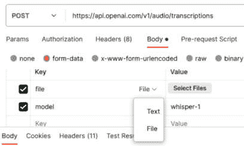

# 第二章：OpenAI API 端点解析

OpenAI API 不仅仅是一个端点，而是一个由多个不同端点组成的集合，这些端点可以用来生成文本补全、图片，甚至转录音频。在本章中，我们将深入探讨所有这些用例，涵盖开发人员在将 OpenAI API 集成到应用程序时使用的主要端点。通过本章的学习，你将了解如何利用 OpenAI API 的多种功能，这是构建智能应用程序的第一步。你将理解每个端点的细微差别，确保能够根据你的具体需求定制集成方案。无论你是希望创建动态文本内容、生成引人注目的视觉效果，还是转录音频，你都将学会如何使用 API 完成这些任务。

本章中，我们将具体介绍以下配方：

+   使用聊天补全端点生成自定义响应

+   使用图像端点创建图片

+   使用音频端点生成转录

# 技术要求

本章要求你拥有访问 OpenAI API 的权限（通过生成的 API 密钥）并安装 API 客户端，如 Postman。你可以参考 *第一章* 中的 *使用 Postman 发出 OpenAI API 请求* 配方，了解如何获取 API 密钥并设置 Postman。

# 使用聊天补全端点生成自定义响应

我们之前在 *第一章* 末尾探讨了聊天补全端点，但我们的请求体相对简单，并未使用我们在 *在 OpenAI Playground 中运行补全请求* 配方中讨论的关键参数。例如，我们了解了如何使用聊天记录来 *微调* 生成的响应。此外，聊天记录功能还可以用于在应用程序中部署聊天机器人。

在本配方中，我们将介绍如何使用聊天补全端点和聊天记录参数生成响应。

## 准备工作

确保你拥有一个 OpenAI Platform 账户并且有可用的使用积分。如果没有，请参考 *第一章* 中的 *设置 OpenAI Playground 环境* 配方。

此外，确保你已安装 Postman，创建了一个新的工作区，创建了一个新的 HTTP 请求，并且该请求的 `Headers` 配置正确。这一点非常重要，因为没有正确配置 `Authorization`，你将无法使用 API。如果你没有按上述说明安装和配置 Postman，请参考 *第一章* 中的 *使用 Postman 发出 OpenAI API 请求* 配方。

本章中的所有配方都将具有相同的要求。

## 如何操作……

1.  在 Postman 中，通过点击左上角菜单栏中的 **New** 按钮，选择 **HTTP** 来创建一个新的请求。

1.  将 HTTP 请求类型从**GET**更改为**POST**，方法下拉菜单（默认情况下，它将设置为**GET**）。

1.  将以下 URL 作为聊天完成的端点：[`api.openai.com/v1/chat/completions`](https://api.openai.com/v1/chat/completions)。

1.  从子菜单中选择**Headers**，并将以下键值对添加到下面的表格中：

| *键* | *值* |
| --- | --- |
| `Content-Type` | `application/json` |
| `Authorization` | `Bearer <your API` `key here>` |

从子菜单中选择**Body**，然后选择请求类型中的**raw**。在**Body**中输入以下内容。之后，选择**发送**：

```py
{
  "model": "gpt-3.5-turbo",
  "messages": [
    {
      "role": "system",
      "content": "You are an assistant that creates short one-line responses to comments that users have left on your ice cream shop's Google reviews page"
    },
    {
      "role": "user",
      "content": "Comments: Great experience - I love the vanilla flavor!"
    }
  ]
}
```

5. 发送 HTTP 请求后，你应该看到来自 OpenAI API 的以下响应。请注意，你的响应可能会有所不同。我们特别需要注意 HTTP 响应中的`content`值：

```py
{
    "id": "chatcmpl-7l0Y7gmS2gtyxyvX7VaSCKiU2oHgB",
    "object": "chat.completion",
    "created": 1691437883,
    "model": "gpt-3.5-turbo-0613",
    "choices": [
        {
            "index": 0,
            "message": {
                "role": "assistant",
                "content": "Thank you for your kind words! Vanilla is always a classic favorite. 😊🍦"
            },
            "finish_reason": "stop"
        }
    ],
    "usage": {
        "prompt_tokens": 47,
        "completion_tokens": 19,
        "total_tokens": 66
    }
}
```

6. 现在，让我们将消息添加到聊天记录中（或称为 API 中的`messages`），以修改和调整生成的响应。修改`messages`：

```py
{
  "model": "gpt-3.5-turbo",
  "messages": [
    {
      "role": "system",
      "content": "You are an assistant that creates short one-line responses to comments that users have left on your ice cream shop's Google reviews page"
    },
    {
      "role": "user",
      "content": "Comments: Great experience - I love the vanilla flavor!"
    },
{
      "role": "assistant",
      "content": "Hello Ice Cream Fan, thank you so much. Vanilla is our favorite too. SCREAM FOR ICE CREAM!"
    },
    {
      "role": "user",
      "content": "Comments: I liked the many different flavors they have, and there's no line!"
    },
    {
      "role": "assistant",
      "content": "Hello Ice Cream Fan, thanks for that - we have over 50 different flavors. SCREAM FOR ICE CREAM!"
    },
    {
      "role": "user",
      "content": "Comments: The customer service was great - they were all so helpful!"
    },
    {
      "role": "assistant",
      "content": "Hello Ice Cream Fan, much appreciated. So glad we were helpful. SCREAM FOR ICE CREAM!"
    },
    {
      "role": "user",
      "content": "Comments: great location and great staff"
    }
  ]
}
```

7. 点击**发送**以执行 HTTP 请求。你应该会看到来自 OpenAI API 的类似响应：

```py
{
    "id": "chatcmpl-7l0vHiJlRrMrrWhjeJhBMEnT1HyHD",
    "object": "chat.completion",
    "created": 1691439319,
    "model": "gpt-3.5-turbo-0613",
    "choices": [
        {
            "index": 0,
            "message": {
                "role": "assistant",
                "content": "Hello Ice Cream Fan, thank you for the kind words. We love our location and our staff too. SCREAM FOR ICE CREAM!"
            },
            "finish_reason": "stop"
        }
    ],
    "usage": {
        "prompt_tokens": 177,
        "completion_tokens": 28,
        "total_tokens": 205
    }
}
```

## 它是如何工作的……

OpenAI API 的工作方式与**Playground**非常相似，开发者可以将消息添加到*聊天记录*中。这样可以微调 API 生成的响应——它从我们创建的助手响应中学习。

我们通过首先执行一个简单的聊天完成请求，并且只指定了`系统消息`和`用户消息`（即提示），如*图 2.1*所示。


图 2.1 – 请求体中消息对象的摘录

这是通过在**Body**中添加消息对象到消息对象中完成的。每个消息对象必须包含一个*角色*和一些*内容*，正如我们在**第一章**中学到的那样。

然后我们可以添加额外的`助手`和`用户`消息，教模型如何制定其响应。重要的是，模型将尝试匹配它在标记为`助手`的消息中看到的任何模式。就好像我们在*教*模型如何生成响应一样。在这种情况下，所有的`助手`响应都包含了**Hello Ice Cream Fan**和**为冰淇淋欢呼！**

通过将消息添加到*聊天记录*中，当我们向 API 提供额外的提示时，它返回的响应与前面段落中描述的模式相匹配：

**Hello Ice Cream Fan，感谢你的好评。我们也喜欢我们的地点和员工。为** **冰淇淋欢呼！**

在这个教程中，我们学习了如何使用 OpenAI API 中的 Chat Completions 端点生成文本，以及如何使用系统消息、用户提示和聊天日志来修改生成的文本。这一点很重要，因为 Chat Completions 端点是与其他系统集成以创建智能应用程序时最常用的 OpenAI API 端点。此外，当我们开始实际加载 API 时，了解如何通过使用聊天日志等方法调整生成的文本以适应我们的预期用途也非常重要。

## 还有更多…

向*Chat Log*中添加消息不仅仅是为了微调助手的响应。另一个重要的应用场景是创建聊天机器人，在这种情况下，必须在生成响应之前考虑到对话（即前面的 `User` 和 `Assistant` 消息）。例如，考虑以下示例：

```py
System: You are an AI assistant that answers questions about the solar system
User: What's the largest planet in our solar system?
Assistant: The largest planet in the solar system is Jupiter
User: How big is it?
```

请注意，前面的代码块是为了说明目的而编写的伪代码，因为它比 OpenAI API 所需的正式 JSON 结构更易于阅读。为了在 OpenAI API 中使用这个示例，请求的 **Body** 必须是以下代码块中显示的内容：

```py
{
  "model": "gpt-3.5-turbo",
  "messages": [
    {
      "role": "system",
      "content": " You are an AI assistant that answers questions about the solar system"
    },
    {
      "role": "user",
      "content": "What's the largest planet in our solar system?"
    },
    {
      "role": "assistant",
      "content": "The largest planet in the solar system is Jupiter"
    },
    {
      "role": "user",
      "content": "How big is it?"
    }
  ]
}
```

在这里，用户提示是 `How big is it?`。但是，如果我们只使用这个提示调用 API，它将无法生成正确的答案——事实上，它根本不知道我们在说什么，因为之前的 `User` 和 `Assistant` 消息并不在请求的 **Body** 中。

因此，我们需要构造请求体，将前面的代码块中列出的所有消息包含进去，才能让模型提供准确的响应。

# 使用图像端点创建图片

OpenAI API 不仅能生成文本（虽然这是它的主要功能）；它还可以创建图像。它使用与文本生成类似的方法来实现这一点，但不是预测字符，而是预测像素。模型的内部工作原理是复杂的（它涉及编码器、解码器和嵌入技术），但这并不妨碍我们实际使用这个模型。

这极大地拓宽了您可以使用 OpenAI API 创建的应用程序类型。例如，您可以创建一个根据用户提示生成库存图像的应用程序。在本教程中，我们将使用 OpenAI API 生成几种类型的图像。

## 如何操作…

1.  在 Postman 中，通过点击左上角菜单栏的**New**按钮创建一个新请求，然后选择**HTTP**。

1.  在**Method**下拉菜单中将 HTTP 请求类型从**GET**更改为**POST**（默认情况下，它将设置为**GET**）。

1.  作为图像的端点，请输入以下 URL：[`api.openai.com/v1/images/generations`](https://api.openai.com/v1/images/generations)

1.  在子菜单中选择**Headers**，并将以下键值对添加到其下方的表格中：

| *Key* | *Value* |
| --- | --- |
| `Content-Type` | `application/json` |
| `Authorization` | `Bearer <your API` `key here>` |

在子菜单中选择**Body**，然后选择请求类型为**raw**。输入以下内容后，点击**Send**：

```py
{
    "prompt": "A dog",
    "n": 1,
    "size": "1024x1024"
}
```

5. 发送 HTTP 请求后，你应该会看到来自 OpenAI API 的以下响应。请注意，你的响应会有所不同——它会生成一个完全不同的 URL。以下的 URL 已被人工压缩：

```py
{
    "created": 1691525818,
    "data": [
        {
            "url": "https://oaidalleapiprodscus.blob.core.windows.net/private/org-SdhfpAqxiHTuyKDLiHYAve6V/user-6A9i4gNyfxN9e9i2e0IUqomI/img-[...]%3D"
        }
    ]
}
```

6. 图像包含在响应中生成的 URL 内。从 `url` 对象中复制该 URL，并粘贴到你的互联网浏览器中。你应该能看到一张狗的图片。和文本生成类似，你看到的图像与以下的图像会有所不同。


图 2.2 – DALL-E 2 OpenAI 图像生成的狗的输出

7. 返回到 Postman 并修改请求为 `一只棕色毛茸茸的中等大小柯基狗站在绿草地上，` `侧面视图`。

8. 从**Response**字段复制并粘贴 URL 到浏览器中，你应该能看到一张清晰的柯基狗照片。


图 2.3 – DALL-E 2 OpenAI 图像生成的更详细提示输出

## 它是如何工作的……

图像端点使用一个名为**DALL-E**的 AI 模型，该模型是 GPT 模型的一种变体，但用于生成可视化内容，而不是文本输出。该模型在数十亿的图像-文本提示对上进行了训练，以将特定的文本特征与视觉表示关联起来。该模型的强大功能在 OpenAI 内部可以使用，但需要使用特定的端点，如我们在教程中所描述的。

注意

DALL-E 是 OpenAI 在 2021 年初推出的首个文本到图像生成模型。DALL-E 2 是其下一版本，于一年后发布（[`openai.com/dall-e-2`](https://openai.com/dall-e-2)）。

DALL-E 和 DALL-E 2 都具有相同的功能（根据文本生成图像），并且通过相同的 API 调用。关键区别在于，DALL-E 2 使用了一种更先进且更流行的技术，叫做**扩散**，这是一种特殊的图像生成方法，能够生成更逼真和高分辨率的图像。

在本书中，DALL-E 和 DALL-E 2 将交替使用，用来指代 OpenAI 的文本到图像生成模型。

### 请求体和响应

图像端点的请求**Body**其实比聊天完成功能的请求要简单得多。以下是它的所有组成部分：

+   **prompt**：这是提供给模型的文本指令，用于图像生成。通常，这个指令越详细，生成的图像就会越接近你的需求。

+   **n**：这告诉 API 模型应生成的图像数量。每张图像都会有些微不同的变化，因为模型尝试根据提示提供不同的解释或角度。

+   **size**: 这指定生成图像的尺寸。目前，仅能生成以下尺寸的图像：256x256、512x512 和 1024x1024。

我们从图像端点收到的**响应**也非常容易理解：

+   **created**: 这表示图像生成时的 Unix 时间戳

+   **data**: 该对象的值实际上是一个对象数组，每个对象都包含**url**参数：

    +   **url**: 这是生成图像的直接链接

### 详细描述的重要性

与文本生成不同，文本生成你可以稍微泛泛而谈，任何歧义通常可以通过聊天记录和系统消息的上下文来解决，而图像生成需要详细、描述性和具体的语言来产生期望的输出。在本食谱中我们清楚地看到了这一点。简单的提示`A dog`（一只狗）生成了一张标准的狗的图像，但请观察*图 2.4*，当我们使用相同的提示再次进行图像生成时，生成的图像呈现出了不同的变化。


图 2.4 – 相同图像提示生成的输出

这些图像包含不同种类的狗、不同的环境、不同的角度和不同的光照。与我们使用的更详细提示进行对比——下图展示了使用关于这张柯基狗图像的更详细提示所生成的额外图像。


图 2.5 – 从特定提示生成的不同输出

更具描述性的提示显著缩小了可能性，引导模型生成符合用户需求和意图的图像。指定颜色、位置、物体、情感、光照等细节非常重要，以便用户可以确保生成的图像不仅相关，而且精细地契合他们的需求。

OpenAI API 中的图像端点解锁了多种不同的使用场景。例如，该端点可以用于在故事中创建个性化的图片、可视化不同的食谱创意，甚至为贺卡制作有趣的图片。可能性真的是无限的！

# 使用音频端点生成转录文本

在本食谱中，我们将学习如何使用 OpenAI API 的音频端点，该端点将音频转换为文本。这使开发者能够创建语音应用程序，如语音助手和语音对话机器人。

## 准备就绪

本食谱还将使用 Postman，但我们通常使用的 Header 设置需要进行修改，以便 HTTP 客户端使用表单数据而不是典型的 JSON 格式。另外，我们需要一个示例音频文件，用于将语音转换为文本。**表单数据**是一种以键值对的方式编码和发送数据的 HTTP 请求格式，通常用于上传文件。

打开 Postman 中的新请求后，导航到`Content-Type application/json`条目。这样 Postman 将强制默认根据请求**Body**中的内容来设置请求的`Content-Type`。

接下来，我们需要一个音频文件。任何短的（即小于一分钟）文件都可以，但它必须包含可以转录的词语，并且必须是以下格式之一：`.mp3`、`.mp4`、`.mpeg`、`.mpga`、`.m4a`、`.wav`或`.webm`。你也可以下载我创建的一个 10 秒钟的音频片段，点击此处：[下载链接](https://github.com/hasygithub/ChatGPT-API-Book/raw/main/audiosample.mp3)。

## 如何操作…

我们可以添加提示和响应的示例到聊天日志中，以修改模型的行为。让我们通过以下步骤来观察这一点：

1.  在 Postman 中，将**Endpoint**的值改为以下 URL，并将请求类型更改为**Post**：

    ```py
    https://api.openai.com/v1/audio/transcriptions
    ```

1.  选择**Body**，然后选择**form-data**单选按钮。这将打开表单数据字段。每个字段包含一个**Key**和一个**Value**。

注意

我们可以选择将每个字段设置为**文本**或**文件**。我们可以通过将鼠标悬停在**Key**上，并从下拉菜单中选择我们选择的选项，正如*图 2.6*所示。

1.  在表单数据中输入以下字段：

| *Key* | *指令/值* |
| --- | --- |
| `file` | 点击**选择文件**并上传你之前创建或下载的音频文件 |
| `model` | `whisper-1` |



图 2.6 – 在 Postman 中选择字段类型

4. 选择**发送**按钮以提交 HTTP 请求。

5. 你应该会看到 OpenAI 返回的以下响应，指明了被转录的文本：

```py
{
"text": "This is a test of the Whisper model."
}
```

## 它是如何工作的…

这个方法使用了*音频*端点，但请注意，我们与这个端点的 API 交互方式与其他端点完全不同。特别是，这个端点要求请求的`Content-Type`为`form-data`，而不是之前看到的典型 JSON 结构。原因在于`form-data`能够处理文件流，这正是我们在上传音频文件到 OpenAI 时所需要的。而在其他端点中，由于只是发送文本而非文件，原始的 JSON 就足够了。

**HTTP 请求**是网络数据通信的基石，并且通常用于与 API 进行交互。发送数据的两种方式是**JSON**和**表单**。由于 JSON 在结构上的灵活性，现在已经成为了广泛使用的数据交换格式——它可以用于传输键值对、列表和层级结构等概念。然而，我们使用表单的原因是，它们允许开发者编码二进制数据。简而言之，表单使得你能够传输文件（例如在此案例中是一个 10 秒钟的 MP3 文件）。

在表单中，有两个字段：**file** 和 **model**。**file** 字段表示我们想要转录的音频文件对象，**model** 字段表示我们想要使用的特定转录模型——在这种情况下，实际上仅限于一个选项：**whisper-1**。

**响应**很简单——一个 JSON 对象（*text*），表示转录的文本。

现在我们知道如何使用这个端点，我们可以集成它来创建强大而智能的商业应用程序。例如，典型的工作流程，如转录录制的会议和讲座，可以通过单个 API 请求完成。可以链式地连接多个端点，以实现更高级的用例。例如，我们可以创建类似于 Siri 的语音助手，它接收录制的声音，将其转换为文本，然后调用聊天完成 API 获取响应。

重要的是要知道，OpenAI API 不仅仅是文本生成；它可以执行图像生成、语音转文本，甚至为语义搜索创建嵌入。OpenAI API 是几个不同端点的集合，结合使用时，为开发者提供了一个无价的工具集，用于构建智能应用程序。
