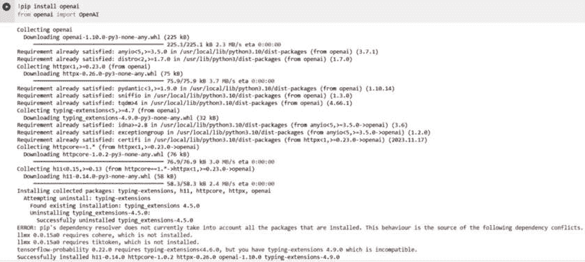
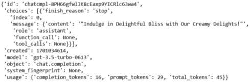
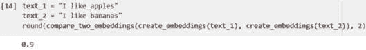
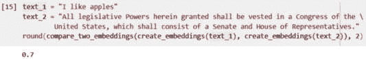
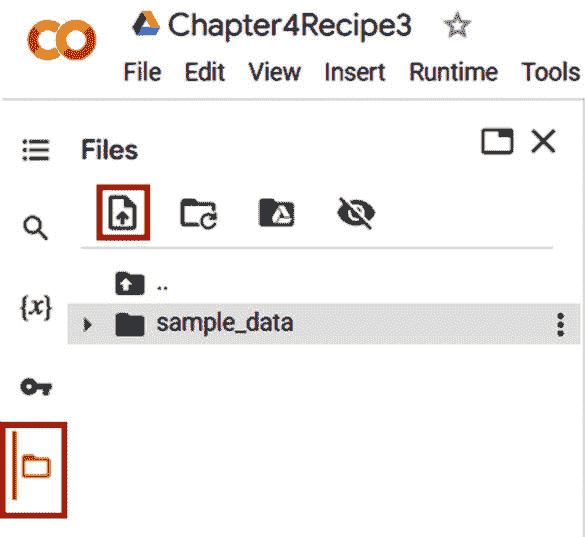
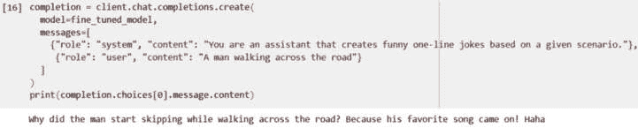
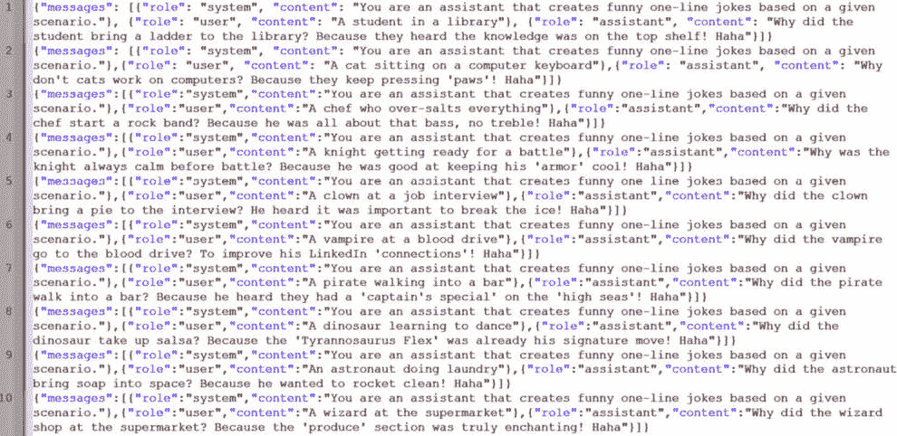

# 第四章：引入 OpenAI API 的附加功能

OpenAI API 提供了比我们在上一章中学到的标准端点和参数更多的功能。这些功能为现有模型提供了更多自定义选项，并通过将模型与其他方法连接，拓展了更多的应用场景。

特别是，OpenAI API 包含一个强大的嵌入模型，使用户能够将文本向量化，执行典型的 NLP 功能，如文本聚类、文本分类、文本比较等。这是与 Google 等搜索引擎使用的相同技术，例如，搜索引擎使用它来返回相关的搜索结果。现在，通过 OpenAI API，它触手可及。

API 还包含一个方法来 *微调* 或定制某个模型以适应特定的应用场景。与我们之前所做的微调（需要通过多个示例来 *引导* 模型）不同，这是一种更好且通常更便宜的替代方案。

最后，API 还具备创建 **函数调用** 的能力。这使你能够向 API 提供一组函数及其描述，模型则智能地生成一个包含调用该函数所需参数的 JSON 对象，从而使你能够将 OpenAI API 与任何用户定义的函数连接。

然而，为了使用这些功能，我们需要通过编程语言（如 *Python*）而非通过一次性的 HTTP 请求（如 Postman）来调用 API。因此，我们将首先介绍如何使用 Python 而非 Postman 调用 OpenAI API，并了解这种方法变更所带来的好处。

到本章结束时，你将能够在应用程序中使用这些功能。这很重要，因为理解这些功能将为你打开一扇门，使你能够执行大量其他本来无法实现的应用场景。此外，我们还将探讨每个功能在各个食谱之外的应用。

本章将涵盖以下内容：

+   使用 Python 库调用 OpenAI API

+   使用嵌入模型进行文本比较和其他应用场景

+   微调完成模型及其相关应用

# 技术要求

本章中的所有食谱都需要你可以访问 OpenAI API（通过生成的 API 密钥）并且已经安装了 API 客户端。如果你不记得如何操作，可以参考 *第一章* 食谱 *使用 Postman 发起 OpenAI API 请求*。

在之前的章节中，我们使用了 Postman 作为 API 客户端。在本章中，我们将改用编程语言 Python。具体来说，本章的食谱将使用 OpenAI Python 库来调用 OpenAI API。

我们将在一个叫做 **Google Colab** 的服务中运行 Python。Colab 是由 Google 提供的在线托管 **Jupyter Notebook** 服务，使用时无需设置，并且可以在浏览器中运行 Python 代码。Jupyter Notebook 是一个开源的 Web 应用程序，允许您创建和共享文档，并包含可以逐步运行的实时代码。这就是我们将用来运行 Python 代码的环境。

要使用 Google Colab，您需要创建并登录有效的 Google 账户，这是完全免费的。按照以下步骤创建新的 Google 账户：[`accounts.google.com/`](https://accounts.google.com/)。

# 使用 Python 库调用 OpenAI API

之前，我们使用 HTTP 请求和 Postman 来调用 OpenAI API。现在，我们转向通过 Python 和专用的 OpenAI Python 库来调用 API。为什么这很重要？

使用 Python 库调用 OpenAI API 相比于在 Postman 等工具中手动发起 HTTP 请求，具有显著优势，尤其对于那些希望将 ChatGPT 功能无缝集成到其应用程序中的开发者来说。

Python 的库通过提供更友好和直观的接口，简化了直接发起 HTTP 请求的复杂性。这促进了快速原型开发、简化的错误管理和高效的响应解析。该库封装了协议的基本细节，使开发人员能够专注于应用程序的核心功能，而不必被请求头、查询字符串和 HTTP 方法的具体细节所困扰。

此外，Python 广泛的包生态系统能够轻松支持将 OpenAI API 与其他服务和系统集成，从而实现可扩展和可维护的代码库。

总的来说，如果您认真考虑使用 OpenAI API 构建智能应用程序，您需要使用一种能够实现复杂逻辑和与其他系统连接的编程语言来调用 API。通过 OpenAI 库，Python 是实现这一目标的途径之一。

在本食谱中，我们将使用 Python 和 OpenAI 库创建一些简单的 API 调用。有关该库的更多信息，请参见：[`github.com/openai/openai-python`](https://github.com/openai/openai-python)。

## 准备工作

确保您有一个 OpenAI 平台账户并拥有可用的使用积分。如果没有，请参阅 *第一章* 中的 *设置 OpenAI Playground 环境* 食谱。

此外，请确保您已登录 Google 账户并能访问笔记本。您可以通过访问 [`colab.google/`](https://colab.google/) 并在右上角选择 **New Notebook** 来验证这一点。之后，您应该会看到一个空白屏幕，并打开一个空的笔记本。

本章中的所有食谱都具有相同的要求。

## 如何操作…

1.  在你的 Google Colab notebook 中，点击第一个空白单元格，输入以下代码来下载并安装 OpenAI Python 库。输入完代码后，按 *Shift* + *Enter* 运行该单元格中的代码。或者，你也可以通过点击单元格左侧的 **播放** 按钮来运行代码。此代码将尝试安装 OpenAI Python 库及其所有依赖项。你可能会看到类似 **Requirements already satisfied** 或 **Installing httpcore** 的输出。这是 Google 在尝试安装 OpenAI 运行所需的库，这是完全正常的：

    ```py
    !pip install openai
    from openai import OpenAI
    ```

1.  确保你能看到 **Successfully installed openai-X.XX.X** 字样，如 *图 4.1* 中所示。



图 4.1 – 安装 OpenAI 库后 Jupyter notebook 的输出

1.  接下来，我们需要进行身份验证。这与前几章类似，我们必须通过将 API 密钥放入一个名为 *Authorization* 的 **Header** 参数来验证 Postman 请求。在 Python 中，这要简单得多。在你在 *步骤 1* 中使用的单元格下方，写入以下代码并按 *Shift* + *Enter*。注意，将 **<api-key>** 替换为你在 *第一章* 的最后一个食谱中生成的 API 密钥：

    ```py
    api_key = "<api-key>"
    client = OpenAI(api_key=api_key)
    ```

1.  我们现在将向 OpenAI API 发起聊天完成请求。与 Postman 类似，我们可以使用不同的端点，并在请求中定义各种不同的参数。在下方的一个新单元格中输入以下代码并按 *Shift* + *Enter*，这将运行代码并将输出保存在一个名为 **completion** 的变量中：

    ```py
    completion = client.chat.completions.create(
        model="gpt-3.5-turbo",
        messages=[
            {'role': 'system', 'content': 'You are an assistant that creates a slogan based on company description'},
            {"role": "user", "content": "A company that sells ice cream"}
        ],
        n=1,
        temperature=1
    )
    ```

1.  输出 **completion** 变量，它是一个 **ChatCompletion** 对象。我们可以通过输入以下代码并按 *Shift* + *Enter* 运行代码，将其转换为更熟悉的 JSON 格式（与 Postman 中完全相同）：

    ```py
    import json
    completion_json = json.loads(completion.json())
    print(completion_json)
    ```

    *图 4.2* 显示了你运行此代码后将看到的输出。



图 4.2 – Python OpenAI 完成请求的 JSON 输出

1.  使用 Python，我们可以解析 JSON，并仅输出包含公司标语的 JSON 部分。我们可以通过在下方的单元格中输入以下代码并按 *Shift* + *Enter* 来运行代码：

    ```py
    print(completion_json['choices'][0]['message']['content'])
    ```


图 4.3 – 第六步的输入和输出

1.  现在你已经有了一个可以调用 OpenAI API、发起聊天完成请求并输出结果的工作 Python Jupyter notebook。

## 工作原理…

在本教程中，我们进行了与之前相同的操作，不同之处在于我们使用了 OpenAI Python 库，而不是通过 Postman 发起 HTTP 请求。我们通过 API 密钥进行了身份验证，发起了聊天完成请求，并调整了几个参数（如 *Model*、*Messages*、*N* 和 *Temperature*），并打印了输出结果。

### 代码讲解

在本教程中运行的代码可以分为四个部分进行解释：

+   *库安装*：第一行 – **!pip install openai; import openai** – 是一个命令，用于将 OpenAI 库作为 Python 中的包安装。第二行将其导入当前 Python 命名空间，使得可以使用该库的函数和类。

+   *身份验证*：**openai.api_key = "sk-..."** 这一行设置了用于验证请求的 OpenAI API 密钥。

+   *API 调用*：**openai.ChatCompletion.create()** 这一行调用 API 并发起聊天完成请求。如你所见，它包含了我们在前几章中讨论过的典型参数。

+   *输出*：**print(completion); print(completion['choices'][0]['message']['content'])** 这一行打印出来自 API 调用的原始响应。响应不仅包括完成的内容，还包含一些元数据，类似于我们使用 Postman 发起 HTTP 请求时的情况。第二行深入响应对象，提取并仅打印消息的内容。

大多数 API 调用在 Python 中遵循以下步骤。需要注意的是，*步骤 1 和 2*（即库安装和身份验证）只需要执行一次。这是因为一旦库安装完成，它将成为 Python 环境的一部分，可以在任何程序中使用，而无需每次都重新安装。同样，身份验证通常是验证凭证以获取访问 API 的权限的过程，通常每个会话或配置只需要执行一次，因为凭证会被存储并在后续的 API 调用中重复使用。

总的来说，我们深入探讨了如何使用 OpenAI Python 库与 OpenAI API 进行交互，逐步过渡到之前使用 Postman 中 HTTP 请求的方法。我们将在未来的教程中继续沿着这个过程进行。

### Python 库的组成部分

我们在前几章讨论过的端点和参数，都可以在 OpenAI Python 库中使用。语法上稍有不同，因为我们现在使用的是 Python 代码，而不是 JSON（通过 Postman）来发起 API 请求，但基本的思路是一样的。以下是一个表格，比较了 Postman 和 Python 库中端点调用的区别。

| **端点** | **Postman 中通过 JSON 的 HTTP 请求（Body 组件）** | **Python** **OpenAI 库** |
| --- | --- | --- |
| **聊天完成** |

```py
{
```

```py
    "model": "gpt-3.5-turbo",
```

```py
    "messages": [
```

```py
      {
```

```py
        "role": "system",
```

```py
        "content": "You are a helpful assistant."
```

```py
      },
```

```py
      {
```

```py
        "role": "user",
```

```py
        "content": "Hello!"
```

```py
      }
```

```py
    ]
```

```py
  }
```

|

```py
completion = client.chat.completions.create (
```

```py
  model="gpt-3.5-turbo",
```

```py
  messages=[
```

```py
    {"role": "system", "content": "You are a helpful assistant."},
```

```py
    {"role": "user", "content": "Hello!"}
```

```py
  ]
```

```py
)
```

|

| **图片** |
| --- |

```py
{
```

```py
    "prompt": "A cute baby sea otter",
```

```py
    "n": 2,
```

```py
    "size": "1024x1024"
```

```py
  }
```

|

```py
client.images.generate(
```

```py
  prompt="A cute baby sea otter",
```

```py
  n=2,
```

```py
  size="1024x1024"
```

```py
)
```

|

| **音频** |
| --- |

```py
-F file="@/path/to/file/audio.mp3" \
```

```py
  -F model="whisper-1"
```

|

```py
audio_file = open("audio.mp3", "rb")
```

```py
transcript = client.audio.transcriptions.create ("whisper-1", audio_file)
```

|

表 4.1 – 比较 Postman 和 Python 库中端点调用的区别

## 使用 Python 库的优缺点

除了它只是未来工作流的前提条件外，这种做法还有几个好处。它对 API 请求本身提供了抽象，带来了以下好处：

+   *简化认证*：该库处理 API 密钥和令牌管理，将认证过程的细节抽象化，免去了用户的操作。例如，在这种情况下，我们不需要为 *Bearer* 创建新的参数，这与 HTTP 不同。此外，与 HTTP 请求不同，我们不需要为每一个请求都声明我们的 API 密钥。

+   *易用性*：它提供了一个高层接口，方法和类代表 API 端点，使得理解和实现更加容易；库会自动处理正确的 HTTP 请求构造、参数编码和响应解析。

+   *做更多的事情*：该库通常包含一些方便的特性，这些特性在简单的 HTTP 请求中不可用，如分页辅助、流式处理、会话管理、嵌入、函数调用等（这也是我们在这一章切换到 Python 库的原因——后续的工作流涵盖了这些特性）。

+   *可编程性*：Python OpenAI 库充分利用了 Python 的编程能力，支持变量、逻辑条件和函数（即，你可以使用编程语言的所有优势，而 Postman 无法提供这些）。

然而，使用 Python 库也有一些特定的缺点：

+   *定制性有限*：高级抽象可能限制了对某些 API 功能的直接访问。

+   *维护和兼容性*：依赖于库的更新，且可能与不同的 Python 版本发生冲突。

+   *性能开销*：额外的抽象层可能导致在资源紧张的应用中性能变慢。

+   *控制力降低*：它对需要对 API 交互进行详细控制的用户提供的灵活性较低。

# 使用嵌入模型进行文本比较及其他应用场景

OpenAI 提供了一个模型和端点，允许用户创建**嵌入**。 这是 API 中一个较少为人知的功能，但在实现许多应用场景（如文本搜索、文本分类等）方面具有广泛的应用。

什么是嵌入？**文本嵌入**是自然语言处理（NLP）中一种复杂的技术，它将文本转换为机器能够理解的数值格式。 本质上，嵌入是高维向量，捕捉了单词、句子甚至整个文档的精髓，概括了它们的单独意义以及它们之间的细微差别和关系。

从数学角度来看，向量是一个 n 维向量空间中的点，但为了简化，你可以把向量看作只是一个数字列表。然而，本章讨论的配方不要求你了解将单词转换为数字的过程和背后的科学原理。想了解更多关于嵌入背后的科学，可以阅读一篇很好的入门文章：[`stackoverflow.blog/2023/11/09/an-intuitive-introduction-to-text-embeddings/`](https://stackoverflow.blog/2023/11/09/an-intuitive-introduction-to-text-embeddings/)。

在这个配方中，我们将使用 OpenAI API 将各种文本转换为嵌入，并将这些嵌入用于文本比较的应用场景。

## 如何操作…

1.  打开一个新的笔记本，导航到 [`colab.google/`](https://colab.google/) 并选择右上角的 **新建笔记本**。

1.  在第一个单元格中，输入以下代码并按 *Shift* + *Enter* 来运行代码。这将安装 OpenAI 库并导入本配方所需的模块：

    ```py
    !pip install openai
    from openai import OpenAI
    from numpy import dot
    from numpy.linalg import norm
    ```

1.  与前面的配方类似，将以下代码输入下面的单元格，并将**<api-key>**替换为你的 OpenAI API 密钥。按 *Shift* + *Enter* 来运行代码：

    ```py
    api_key = "<Insert your API-key here>"
    client = OpenAI(api_key=api_key)
    ```

1.  接下来，我们将用 Python 创建两个函数。第一个函数将根据文本字符串创建一个嵌入。为此，我们将使用 OpenAI API 的 **Embeddings** 端点。下一个函数接受两个嵌入，并使用 **余弦相似度** 计算它们之间的差异，这一概念我们将在下一节讨论。为此，输入以下代码并按 *Shift* + *Enter*：

    ```py
    def create_embeddings(text):
      embedding = client.embeddings.create(input=text, model="text-embedding-ada-002").data[0].embedding
      return embedding
    def compare_two_embeddings(a, b):
      cos_sim = dot(a, b)/(norm(a)*norm(b))
      return cos_sim
    ```

1.  现在，我们已经准备好通过创建嵌入并计算它们之间的差异来开始比较文本。我们从两段语义上非常相似的文本开始：*I like apples* 和 *I like bananas*。输入以下代码，按 *Shift* + *Enter*，并注意输出结果：

    ```py
    text_1 = "I like apples"
    text_2 = "I like bananas"
    round(compare_two_embeddings(create_embeddings(text_1), create_embeddings(text_2)), 2)
    ```



图 4.4 – 相似文本的余弦相似度输出

1.  接下来，让我们比较两段不相似的文本：*I like apples* 和美国宪法第一条的第一部分：*All legislative Powers herein granted shall be vested in a Congress of the United States, which shall consist of a Senate and House of Representatives* ([`www.archives.gov/founding-docs/constitution-transcript`](https://www.archives.gov/founding-docs/constitution-transcript))。输入以下代码，按 *Shift* + *Enter*，并注意输出结果：

    ```py
    text_1 = "I like apples"
    text_2 = "All legislative Powers herein granted shall be vested in a Congress of the United States, which shall consist of a Senate and House of Representatives."
    round(compare_two_embeddings(create_embeddings(text_1), create_embeddings(text_2)), 2)
    ```



图 4.5 – 相似文本的余弦相似度输出

1.  注意，第一组文本的相似度（**0.90**）高于下一组文本（**0.70**）。这意味着第一组文本在语义上比后两组文本更相似，这在语言上是有道理的。

1.  让我们更进一步。用以下文本重复*步骤 5-7*。我也记录了得到的输出相似度：

    ```py
    text_1 = "Birds like to fly"
    text_2 = "Airplanes can soar above the ground"
    Output = 0.88
    text_1 = "Birds like to fly"
    text_2 = "A fly can irritate me"
    Output = 0.84
    ```

## 工作原理……

在这个示例中，我们将文本转换为嵌入向量，并进行比较。结果表明，与*I like applies*相比，文本*I like bananas*在语义上更接近美国宪法的第一部分。

此外，它还展示了文本*Birds like to fly*与*Airplanes can soar above the ground*在语义上比与*A fly can irritate me*更为相似。这是有道理的，因为前两段文本的句子都与飞行物体有关。

### 嵌入基础

如前所述，嵌入过程将文本转换为数字列表。这在自然语言处理（NLP）中至关重要，因为现在机器可以处理这些数字列表，而不是文本。

OpenAI 嵌入模型的关键特性是它能够捕捉语言特性和语义含义。这意味着两个语义相似的文本会有相似的向量（即相似的数字列表）。**语义相似**意味着两段文本传达相同或相关的意义、概念或思想，即使它们使用了不同的词语或结构。

### 代码结构

我们使用了 OpenAI 的嵌入模型来创建这些向量，通过 Embedding 端点来实现。可以通过`openai.Embedding.create()`函数调用该端点，传入两个参数：

+   **输入**：此参数代表你想要创建嵌入的文本。

+   **模型**：这是你想要用来创建嵌入的模型 ID。它与其他端点中的**模型**参数类似。在这个示例中，我们使用了标准的**ada**模型，即**text-embedding-ada-002**。OpenAI 建议使用这个作为起始嵌入模型，因为它非常实惠，且性能优秀。

函数调用返回一个 JSON 格式的嵌入对象，我们通过解析它来获取嵌入本身（这仍然是 Python 中的一个数字列表）。解析是通过`["``data"][0]["embedding"]`代码完成的。

在得到两组文本的嵌入后，我们需要对它们进行比较。如何比较两个向量（即如何比较两个数字列表）？最常用的方法叫做**余弦相似度**。余弦相似度衡量两个向量之间夹角的余弦值，结果是一个介于 0 和 1 之间的数值。

余弦相似度常被选用而非其他相似度测量方法，因为它在高维空间中（例如文本数据）特别有效，强调的是向量的方向而非大小。这种方法使它能够专注于向量的方向对齐，从而在评估文本之间的语义相似性时更加稳健，即使它们的长度或词频不同。

这里的数学细节不重要——其含义是余弦相似度越高，两个文本在语义上就越相关：

+   *余弦相似度接近 1*：文本非常相似或具有相似的上下文或含义

+   *余弦相似度接近 0*：文本无关

+   *余弦相似度接近 -1*：文本在语义上是相反的，这在自然语言处理（NLP）中很少见，因为大多数文本嵌入是设计成具有非负成分的

在 Python 中，可以通过以下代码实现，它计算两个向量的点积，并将其除以这两个向量的欧几里得范数的乘积：

```py
def compare_two_embeddings(a, b):
  cos_sim = dot(a, b)/(norm(a)*norm(b))
  return cos_sim
```

在我们设置好一个函数来返回每个文本的嵌入，并计算两个嵌入之间的余弦相似度后，我们拥有了所有必要的工具来比较两段文本。

这个公式中的归一化（`norm`）确保我们在比较的是两个向量的方向，而不是它们的大小。这意味着我们关注的是两个向量在方向上的相似度，而不考虑它们的长度，这在许多应用中非常重要，比如比较句子的相似性。

### 文本比较的应用

嵌入是比较两段文本的高效方式，开启了许多不同的现实世界应用。回想一下在食谱中计算出的相似度得分，如下表所示：

| **测试** | **基础文本** | **比较文本** | **嵌入的余弦相似度** |
| --- | --- | --- | --- |
| **1** | 我喜欢苹果 | 我喜欢香蕉 | 0.90 |
| 所有在此授予的立法权力应由美国国会行使，该国会应由参议院和众议院组成 | 0.71 |
| **2** | 鸟类喜欢*飞翔* | 飞机可以飞越地面 | 0.88 |
| 一只*苍蝇*能让我感到恼火 | 0.84 |

表 4.2 – OpenAI 嵌入对不同文本集的余弦相似度

OpenAI API 使你能够计算并排名不同文本集之间的语义相似度。请注意，语义相似度理解文本意义的细微差别。在*测试 2*中，*飞机可以飞越地面*与*一只苍蝇能让我感到恼火*的语义相似度更高。

这有悖直觉，因为你可能会认为共享单词*苍蝇*的文本应该更为相似。然而，嵌入模型识别到单词*苍蝇*在*鸟类喜欢飞翔*和*一只苍蝇能让我感到恼火*中的使用上下文是不同的。在这种情况下，嵌入是比较文本意义的强大工具。

嵌入还有其他应用，得益于 OpenAI API，你可以在构建应用时进行探索。这不是一个详尽的列表，但应该能帮助你对 API 的潜力有所了解：

+   *搜索引擎中的信息检索*：增强搜索算法，使其返回与查询在语义上相关的结果，而不仅仅是文本上匹配的结果 ([`www.mage.ai/blog/building-semantic-search-engine-with-dual-space-word-embeddings`](https://www.mage.ai/blog/building-semantic-search-engine-with-dual-space-word-embeddings))

+   *文档检索*：即使文档没有共享相同的关键词，也能找到涉及类似主题的文档 ([`arxiv.org/pdf/1810.10176v2.pdf`](https://arxiv.org/pdf/1810.10176v2.pdf))

+   *内容推荐系统*：根据用户之前喜欢的项目与当前项目在语义上的相似性，推荐文章、产品或媒体给用户 ([`towardsdatascience.com/introduction-to-embedding-based-recommender-systems-956faceb1919`](https://towardsdatascience.com/introduction-to-embedding-based-recommender-systems-956faceb1919))

+   *文本分类*：根据语义内容自动将文档分类到预定义类别中 ([`realpython.com/python-keras-text-classification/`](https://realpython.com/python-keras-text-classification/))

总体来说，OpenAI API 的嵌入功能开启了许多其他的使用案例，从文本比较到信息检索。另一个关键的好处是，这些端点比 Completions 或 Images 端点便宜得多，成为了你工具库中强大而高效的工具。

# 微调一个完成模型

**微调**是将一个预训练模型进一步适应特定任务或数据集的过程。其目标通常是将一个已经在大型通用数据集上训练的原始模型应用到更为专业的领域，或者提升其在特定类型数据上的表现。

我们之前在 *第一章* 的第一个食谱中看到过微调的一个版本，在那里我们通过 `messages` 参数添加了输出示例来 *微调* 输出响应。在这个例子中，模型并没有真正地进行微调——我们实际上执行了 **少量学习**，即在提示中直接提供了输出示例给 Chat Completion 模型。然而，微调是一个过程，其中会创建一个全新的子集 Chat Completion 模型，并使用训练数据（输入和输出）进行训练。

在本教程中，我们将探索如何微调一个模型并执行该微调后的模型。接着，我们将讨论使用 OpenAI API 微调模型的优缺点。

## 如何实现…

1.  打开一个新的笔记本，访问 [`colab.google/`](https://colab.google/) 并在右上角选择 **新建笔记本**。

1.  在第一个单元格中，输入以下代码并按 *Shift* + *Enter* 来运行代码。这将安装 OpenAI 库并导入本教程所需的模块：

    ```py
    !pip install openai
    from openai import OpenAI
    import os
    ```

1.  类似于前面的操作，输入以下代码到下方的单元格中，并将**<api-key>**替换为你的 OpenAI API 密钥。按 *Shift* + *Enter* 来运行代码：

    ```py
    api_key = "<Insert your API-key here>"
    client = OpenAI(api_key=api_key)
    ```

1.  将训练数据导入到 Google Colab 中。训练数据文件可以在此找到：[`drive.google.com/file/d/1x0ciWtW3phjPHAosiCL90qsQY--ZoxsV/view?usp=sharing`](https://drive.google.com/file/d/1x0ciWtW3phjPHAosiCL90qsQY--ZoxsV/view?usp=sharing)。要将文件上传到 Google Colab，请选择左侧的*文件*图标，并选择该菜单顶部的**上传文件**按钮。这两个图标在*图 4.6*中已被突出显示。请注意，训练数据包含多个示例，其中提示是一个场景（例如*图书馆里的学生*），而补全是一个单行笑话，后面跟着*Haha*（例如*为什么学生带梯子去图书馆？因为他们听说知识在最上层的* *书架*上！Haha*）。



图 4.6 – 如何将文件添加到 Google Colab

1.  接下来，通过输入以下代码并按 *Shift* + *Enter*，将训练数据集上传到 OpenAI API。我们还将通过上传获取**file_id**：

    ```py
    training_data = client.files.create(
      file=open("chapter4trainingdata.json", "rb"),
      purpose='fine-tune'
    )
    file_id = training_data.id
    ```

1.  之后，我们将开始微调模型，通过输入以下代码并按 *Shift* + *Enter*。这将开始微调过程，指示 OpenAI 使用我们通过**file_id**变量上传的文件：

    ```py
    fine_tune_job = client.fine_tuning.jobs.create(training_file=file_id, model="gpt-3.5-turbo")
    ```

1.  微调可能需要几分钟时间才能完成。我们可以通过输入以下代码并按 *Shift* + *Enter* 来检查任务的状态。如果输出是*running*，意味着微调仍在进行中。等待直到代码返回**succeeded**：

    ```py
    client.fine_tuning.jobs.retrieve(fine_tune_job.id).status
    ```

1.  现在微调任务已经完成，我们需要微调模型的名称，我们可以通过输入以下代码并按 *Shift* + *Enter* 来获得。我们将把它保存到**fine_tuned_model**变量中：

    ```py
    fine_tuned_model = client.fine_tuning.jobs.retrieve(fine_tune_job.id).fine_tuned_model
    ```

1.  接下来，让我们使用我们微调过的模型。我们将创建一个简单的聊天补全请求，但我们会修改**model**参数，使用我们刚刚创建的**fine_tuned_model**对象：

    ```py
    Completion = client.chat.completions.create(
      model=fine_tuned_model,
      messages=[
        {"role": "system", "content": "You are an assistant that creates funny one-line jokes based on a given scenario."},
         {"role": "user", "content": "A man walking across the road"}
      ]
    )
    print(completion.choices[0].message)
    ```



图 4.7 – 使用微调模型时的聊天补全请求与输出

1.  请注意，在没有提供任何示例的情况下，补全输出是一个单行笑话，后面跟着单词**Haha**。我们成功地微调了一个模型，并且使用了这个微调后的模型。

## 它是如何工作的…

在这个方案中，我们通过向 OpenAI API 提供训练数据来创建了一个微调后的模型，这些数据教会模型如何响应提示。在这个案例中，我们训练它使得它的输出应该是一个笑话，并紧接着是词语 `Haha`。然后，我们将 **model** 参数更改为我们刚刚创建的模型 ID，并进行了一次 *聊天完成* 请求。之后，我们注意到，模型对从未见过的提示生成的输出，也同样是一个笑话，后面跟着 `Haha`。从本质上讲，我们成功地微调了 *gpt-3.5-turbo* 模型，使其能够在给定任何提示时讲一个笑话。

### 微调步骤

微调模型并使用该微调模型时需要遵循五个步骤：

+   *准备训练数据文件*：训练数据由示例或提示和期望的完成组成。至少需要 10 个示例才能成功训练模型。每个示例看起来非常相似（有明确的意图），与进行聊天完成请求时的 **messages** 参数类似。不同之处在于，它还包括完成部分（也就是助手的输出）。以下是一个示例：

    ```py
    {"messages": [{"role": "system", "content": "You are an assistant that creates funny one-line jokes based on a given scenario."}, {"role": "user", "content": "A student in a library"}, {"role": "assistant", "content": "Why did the student bring a ladder to the library? Because they heard the knowledge was on the top shelf! Haha"}]}
    ```

    这些示例可以添加到 JSON 文件中，每行代表一个示例。



图 4.8 – 包含训练数据的 JSON 文件图像

+   *导入到 OpenAI*：训练文件制作完成后，需要将其上传到 OpenAI 的服务器，这就是我们使用以下代码所做的：

    ```py
    training_data = client.files.create(
      file=open("chapter4trainingdata.json", "rb"),
      purpose='fine-tune'
    )
    ```

+   *分配 ID*：上传文件后，API 会分配一个 ID。可以通过查看前面的代码响应 JSON，并解析 **id** 参数来确定该 ID：

    ```py
    file_id = training_data.id
    ```

+   *微调模型*：之后，我们需要指示 API 使用上传的训练数据来微调模型。我们会将从 API 获取的响应存储在一个变量中：

    ```py
    fine_tune_job = client.fine_tuning.jobs.create(training_file=file_id, model="gpt-3.5-turbo")
    client.fine_tuning.jobs.retrieve(fine_tune_job.id).status
    ```

    微调任务完成后，API 将分配一个 `fine_tuned_model` 参数，给微调后的模型一个特定的标识符，我们可以将其存储在一个变量中：

    ```py
    fine_tuned_model = client.fine_tuning.jobs.retrieve(fine_tune_job.id).fine_tuned_model
    ```

+   *使用微调后的模型*：最后一步相对简单——像平常一样调用聊天完成 API，但将 **model** 参数修改为刚刚创建的微调模型：

    ```py
    completion = client.chat.completions.create(
      model=fine_tuned_model,
      messages=[
        {"role": "system", "content": "You are an assistant that creates funny one-line jokes based on a given scenario."},
         {"role": "user", "content": "A man walking across the road"}
      ]
    )
    print(completion.choices[0].message.content)
    ```

### 微调的好处

微调通过允许你在比典型提示上下文窗口所能容纳的更多示例上进行训练，来改善少量样本学习。一旦模型被调优，这些示例在每次进行完成请求时就不再需要，从而节省了 token（和费用），并降低了延迟（即更快的速度）。请记住，token 是文本中最小的语义单位（通常是单词、标点符号或其他元素），在自然语言处理（NLP）中常常构成 OpenAI 收费的基础。

例如，我们来比较两种模型的 token 数量：(i)一个使用*Gpt-3.5*基础模型且没有微调，但每次都需要在提示中加入示例的模型，和(ii)一个微调后的模型。

| **模型** | **Gpt-3.5** | **已微调的 Gpt-3.5** |
| --- | --- | --- |
| **提示** | 你是一个基于给定场景创作幽默单句笑话的助手。这里有 10 个例子：一位骑士准备上战场  为什么骑士在战斗前总是很冷静？因为他擅长保持他的“盔甲”冷静！哈哈……[还有 9 个例子]……场景：北极的一只企鹅 | 你是一个基于给定场景创作幽默单句笑话的助手。场景：北极的一只企鹅 |
| **提示中的 token 数量（估算）** | 400 | 36 |

表 4.3 – 非微调与微调后的 GPT-3.5 模型之间的提示示例和 token 数量比较

微调后的模型使用的 token 数量约为少量学习基础模型的十分之一。这意味着，使用微调后的模型可以节省 90%的成本，如果将这些模型部署到高频使用的应用中，这个节省是非常可观的。

微调的其他好处包括通过能够在数千个示例上进行训练，从而获得更高质量的结果，而这在使用少量学习时是无法实现的，因为提示词的长度有限。

注

微调模型以获得更高质量的结果应该仅在充分尝试过提示工程和提示链的优化之后进行。微调模型需要大量资源和精力，因此首先最大化提示工程和提示链的潜力更为高效，因为它们通常能够在不需要额外训练的情况下实现预期的结果。**提示工程**是指创建更详细和结构化的提示，以获得更好的完成效果。**提示链**是将更复杂的提示分解为更简单任务的理念。

### 微调的应用

什么时候你会选择微调模型，而不是(i)使用基础的 *gpt-3.5* 或 *gpt4* 模型，或(ii)使用少量学习来预先训练模型呢？一般来说，以下是一些常见的需要微调模型的使用场景：

+   *增强期望输出*：当需要在生成特定类型的响应时获得更高的可靠性时，微调至关重要。通过在专门的数据集上训练模型，您可以增加模型一致性地产生期望输出的机会。这在特定品牌语音的内容创作、必须遵循特定语言的教育资源创建等方面非常常见。

+   *复杂提示遵从性*：当模型在多次尝试后仍无法始终遵循复杂的提示或指令时，微调可以帮助纠正这些不足。这可以确保模型更好地理解和遵循详细或多层次的指令。例如，在创建编程助手时，这种情况非常常见。

+   *专门化风格和语气调整*：当需要特定风格、语气或格式时——例如法律语言、幽默语气或新闻风格——微调能帮助模型更准确地捕捉这些定性方面。这在开发*客户服务机器人*时非常常见，因为这些机器人需要保持既友善又坚定的语气。

+   *定制任务性能*：对于教授模型一项新技能或任务，如果单靠提示无法传达，微调让模型可以通过示例学习。这对一些特定领域的应用或创新任务尤其有用，这些任务可能在模型初始训练时没有接触过，或者像*医疗诊断*这样的更复杂任务。

总体而言，微调模型是一种非常好的、高性价比的方式，可以获得更高质量、一致性的结果。如果你打算构建一些预期类似提示和响应的应用程序，且需要特定的语气和风格，这种方法尤其有用。
