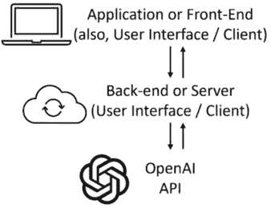

# 第五章：OpenAI API 在应用开发中的分阶段应用

到目前为止，我们通过直接连接到 OpenAI 的端点并发送请求来使用 OpenAI API。然而，在构建应用和工作流时，通常不会直接连接到 OpenAI。相反，开发人员倾向于通过他们自己的后端 API 来分阶段调用 OpenAI API，然后将信息返回给应用程序。

本质上，应用程序的前端和 OpenAI API 之间存在一层，如*图 5.1*所示。此层通常处理来自前端的请求，调用 OpenAI API（或一系列其他端点），接收完成内容，处理后再将数据返回给前端。我们将这层称为**后端层**或**服务器层**。



图 5.1 – 使用 OpenAI API 的典型应用架构示意图

将 OpenAI API 集成到应用程序中通常涉及一种架构，其中前端层（用户界面）与后端层（服务器）通信，后者又与 OpenAI API 进行交互。这种方法有几个优势：

+   *安全性与 API 密钥管理*：OpenAI API 密钥不会暴露给前端，从而降低了被泄露的风险。后端可以安全地存储和管理 API 密钥。

+   *控制与定制*：后端可以控制发送到 OpenAI API 的请求的速率和性质。它还可以对来自前端的请求进行预处理，或对 OpenAI 的响应进行后处理，根据应用需求定制数据。

+   *与其他服务的集成*：通常，应用程序需要来自多个来源的数据。后端可以将 OpenAI API 与其他 API 或数据源集成，创建一个集中式的数据处理和分发点。

+   *用户身份验证和授权*：后端可以实施安全措施，如用户身份验证和授权，确保只有授权用户才能访问某些功能。

这个*后端*层通常被分阶段并托管在像 Azure Functions、Amazon Web Services Lambda 或 Google Cloud Functions 这样的**无服务器**系统上。使用无服务器架构有几个好处，其中最重要的是简化操作——创建一个无服务器架构的后端层既简单又快速。

本章将迈出使用 OpenAI API 进行应用开发的第一步。我们将学习如何创建一个无服务器的后端层，以连接和处理来自 OpenAI API 的数据。然后，我们将学习如何将其与前端层集成，使用无代码平台和代码平台。到本章结束时，您将具备开发自己智能应用所需的一切。

本章将介绍以下内容：

+   创建一个调用 OpenAI API 的公共端点服务器

+   扩展端点服务器以接受参数并返回数据

+   从无代码应用程序调用用户创建的端点

# 技术要求

本章中的所有教程都要求您能够访问 OpenAI API（通过生成的 API 密钥）并安装 API 客户端。有关如何获取 API 密钥的更多信息，请参阅*第一章*中的教程*使用 Postman 发出 OpenAI API 请求*。这还需要了解 Python 以及 Python OpenAI 库，我们在*第四章*的第一个教程中有详细介绍。

我们还将使用**Google Cloud Platform**（**GCP**）来托管我们的公共端点。GCP 是 Google 提供的一套云计算服务。它提供一系列托管和计算服务，包括数据库、数据存储、数据分析、机器学习等，所有服务都托管在 Google 的基础设施上。

为了做到这一点，您需要创建一个 Google Cloud 账户，您可以在这里创建：[`cloud.google.com/`](https://cloud.google.com/)。

# 创建一个调用 OpenAI API 的公共端点服务器

如前所述，创建您自己的公共端点服务器来调用 OpenAI API，而不是直接连接 OpenAI API，有许多重要的好处——最大的好处是控制和定制，我们将在本教程和下一个教程中进一步探讨。

在本教程中，我们将使用 GCP 来托管我们的公共端点。每当调用此端点时，它将向 OpenAI 请求一个冰淇淋公司的口号，然后将结果返回给用户。这听起来简单，几乎不需要创建一个公共端点，但这是我们构建一个真正智能应用程序的最后一步，利用了 OpenAI 的强大功能。

为此，我们将创建一个名为**Cloud Functions**的 GCP 资源，稍后将在教程的*工作原理…*部分进行探讨。

## 准备工作

确保您拥有 OpenAI 平台账户并且有可用的使用配额。如果没有，请参阅*第一章*中的*设置 OpenAI Playground 环境*教程。

此外，请确保您已创建了一个 GCP 账户。为此，请访问[`cloud.google.com/`](https://cloud.google.com/)，然后从右上角选择**开始免费使用**，并按照页面上的指示进行操作。

您可能还需要提供一个计费资料，以便创建任何 GCP 资源。请注意，GCP 确实提供免费的层级，在本教程中，我们不会超出免费层级（因此，基本上，您不应该为任何费用付费）。

如果这是您第一次登录**Google Cloud Platform**，可能需要创建一个项目。登录后，从左上角选择**选择项目**，然后选择**新建项目**。提供**项目名称**后，点击**创建**。

本章中的下一个教程也有相同的要求。

## 如何操作…

1.  导航至[`console.cloud.google.com/`](https://console.cloud.google.com/)。在页面顶部的**搜索**字段中，键入**Cloud Functions**并从下拉菜单中选择第一个选项，**Cloud Functions**。


图 5.2 – 下拉菜单中的云函数

1.  从页面顶部选择**创建函数**。这将开始创建我们的自定义后端端点并启动配置步骤。

    在**配置**页面中，填写以下步骤：

    +   **环境**：从下拉菜单中选择**第二代**。

    +   **函数名称**：由于我们正在创建一个生成公司标语的后端端点，函数名称将为**slogan_creator**。

    +   **区域**：选择离您最近的环境位置。

    +   在**触发器**菜单中，选择**HTTPS**。在**身份验证**子菜单中，选择**允许未经身份验证的调用**。我们需要勾选这个选项，因为我们将创建一个可以从前端服务访问的公共端点。


图 5.3 – Google Cloud Function 配置示例

1.  选择页面底部的**下一步**按钮，然后进入**代码**部分。

1.  从**运行时**下拉菜单中，选择**Python 3.12**。这确保我们的后端端点将使用 Python 编程语言进行编码。

1.  对于**入口点**选项，输入**create_slogan**。这指的是在公共端点被访问并触发时调用的 Python 函数名称。

1.  在左侧菜单中，您会看到两个文件：**main.py**和**requirements.txt**。选择**requirements.txt**文件。这将列出我们为使 Cloud Function 正常运行而需要安装的所有 Python 包。

1.  在屏幕中央显示**requirements.txt**内容的地方，输入一行新内容并键入**openai**。这将确保安装最新的**openai**库包。您的屏幕应显示为*图 5.4*所示。


图 5.4 – requirements.txt 文件快照

1.  在左侧菜单中，选择**main.py**。将以下代码复制并粘贴到屏幕中央（该文件的内容显示区域）。这些是公共端点在触发时运行的指令：

    ```py
    import functions_framework
    from openai import OpenAI
    @functions_framework.http
    def create_slogan(request):
        client = OpenAI(api_key = '<API Key here>')
        response = client.chat.completions.create(
            model="gpt-3.5-turbo",
            messages=[
                {
                "role": "system",
                "content": "You are an AI assistant that creates one slogan based on company descriptions"
                },
                {
                "role": "user",
                "content": "A company that sells ice cream"
                }
            ],
            temperature=1,
            max_tokens=256,
            top_p=1,
            frequency_penalty=0,
            presence_penalty=0
        )
        return response.choices[0].message.content
    ```

    如您所见，它仅调用 OpenAI 端点，请求聊天完成，然后将输出返回给用户。您还需要您的 OpenAI API 密钥。

1.  接下来，通过点击页面底部的**部署**按钮来部署该函数。

1.  等待函数完全部署，通常需要两分钟。你可以通过观察页面左上方的进度来验证函数是否已部署（如*图 5.5*所示）。一旦它变为绿色并打上勾，构建就成功了，你的函数已经部署。


图 5.5 – Cloud Function 部署页面

1.  现在，让我们验证一下我们的函数是否正常工作。选择位于页面顶部、接近**URL**的位置的端点 URL。它通常是**https://[location]-[project-name].cloudfunctions.net/[function-name]**的形式。它也在*图 5.5*中有所突出显示。

1.  这将打开一个新网页，触发我们的自定义公共端点，并返回一个聊天完成内容，在本例中是一个冰淇淋业务的标语。请注意，这是一个公共端点——它可以在您的计算机、手机或任何连接到互联网的设备上工作。


图 5.6 – Google Cloud Function 输出

## 它是如何工作的……

在这个食谱中，我们创建了一个公共端点。任何人都可以访问这个端点（包括你在未来食谱中的应用）。这个端点的逻辑很简单，之前也有提到：为一个销售冰淇淋的公司返回一个标语。新的地方在于，这是我们自己在 Google Cloud 中托管的公共端点，使用了 Cloud Function 资源。

请注意，我们使用了 Google Cloud Functions 的免费层，该层有一些限制，例如每月函数调用次数的上限、执行时间的限制以及计算资源的约束。然而，对于我们当前的目的，这些限制并不构成障碍，让我们能够有效地部署和测试函数，而无需产生费用。这种设置非常适合小规模应用，或者用于学习和实验，提供了一种以低成本方式理解云功能和无服务器架构的实用方法。

### Cloud Function 中的代码

我们在 Cloud Function 中使用的代码应该很熟悉——它正是我们在*第四章*中第一个食谱中使用的代码，不过它被封装成了一个名为`create_slogan`的函数。这个代码仅仅是创建了一个 OpenAI 聊天完成，其中`system`和`user`消息分别是`你是一个根据公司描述创建标语的 AI 助手`和`一个销售冰淇淋的公司`。什么是 GCP Cloud Functions？

**云函数**，通常称为**无服务器函数**或**函数即服务（FaaS）**，是无服务器计算的关键组成部分。在这种模型中，开发者编写并部署单个函数——小的、单一目的的代码块——这些函数在云中执行。这些函数通常是事件驱动的，意味着它们设计来响应特定的触发器或事件。

云函数有两个主要优势，使其非常适合创建我们的后端层和公共端点：

+   *无需服务器管理*：开发者无需配置或管理任何服务器。云服务提供商动态分配并管理基础设施，无需任何设置或维护。我们在不到 10 分钟内就创建好了它。

+   *自动扩展*：云函数会根据传入事件触发的数量自动扩展或缩减。这意味着它们可以处理每天一个请求，或者每秒处理成千上万的请求。在构建应用程序时，尤其重要——无论应用程序上只有一个用户，还是有数百万用户，你都希望它能正常工作。

然而，必须牢记的是，和任何其他工具一样，云函数也有其自身的优缺点。它们在此场景中主要被选择是因为在初期阶段，它们提供了经济且简单的设置优势。就像每个选择一样，权衡潜在的挑战与优势总是值得的。

GCP 提供免费的云函数服务，这意味着您可以免费设置它们（前提是它们的请求量低于 200 万次以及其他一些阈值（参见 [`cloud.google.com/functions/pricing`](https://cloud.google.com/functions/pricing)），在这些配方中我们肯定不会超过这些限制）。

### 设置云函数

在设置云函数时，我们故意选择了几项配置选项。以下是对这些重要配置的解释：

+   **触发器**：此设置定义了如何调用您的云函数。简单来说，它指定了将导致您的函数（或函数中的代码）运行的事件或条件。通常有两个选项：

    +   **HTTP 触发器**：该函数通过 HTTP 请求触发，这是我们在之前的配方中使用的协议，用来在 Postman 中调用 OpenAI API。如果您正在创建将由其他应用程序手动调用的公共端点，这会非常有用，这也是我们选择此选项的原因。

    +   **事件触发器**：此选项允许您的函数响应来自云环境的事件（例如，Cloud Storage 存储桶中的更改）。

+   **认证**：此设置控制谁可以调用你的云函数。这是保护你的函数免受未经授权访问的重要部分。目前，我们选择了**允许未经身份验证的调用**，这意味着任何人都可以调用你的公共端点。尽管这不是最安全的选项，但它是最方便的选择，因为你不需要在 Postman 或任何其他需要调用 Google Cloud Function 的前端层中创建身份验证逻辑。需要注意的是，这不是最安全的选择，我们强烈不建议在实际应用中使用。此选项在此实例中被使用是出于方便考虑——避免在 Postman 或任何其他与 Google Cloud Function 交互的前端层中创建身份验证逻辑。

+   **入口点**：指的是在访问公共端点并触发时，Python 中被调用的函数名称。本质上，这就是在公共端点被调用时执行的函数或代码部分。

本质上，现在我们已经创建了一个调用 OpenAI API 的公共端点，我们不再需要担心将其托管在自己的计算机或服务器上。现在，任何人都可以全球访问它，甚至是一个智能应用（这是我在暗示的）。这非常重要，因为将其包装在公共端点中是构建智能应用的第一步。

# 扩展端点服务器以接受参数并返回数据

在上一个教程中，我们成功创建了一个云函数，当被调用时，它会返回一个冰淇淋公司的口号。虽然它作为云端服务有用，但我们希望修改这个函数，让它能够做两件事：

+   *接受参数*：我们需要修改函数，以便将输入参数作为 HTTP 请求的一部分进行接受。这意味着我们将能够创建一个云函数，该函数不仅返回冰淇淋业务的口号，还能返回任何我们提供描述的业务类型的口号。

+   *构建输出结构*：我们不想只是简单地输出聊天完成内容（在本例中为口号）。相反，我们希望处理数据并输出一个 JSON 对象，因为它在 web 应用中广泛使用且容易操作。

在这个教程中，我们将创建一个公共端点服务器，该服务器将接受一个名为`business_description`的参数，并以结构化的输出形式返回生成的口号。

## 如何实现…

1.  访问 [`console.cloud.google.com/`](https://console.cloud.google.com/)。在页面顶部的**搜索**框中输入**Cloud Functions**，然后从下拉菜单中选择名为**Cloud Functions**的第一个选项。

1.  从页面顶部选择**创建函数**。这将开始创建我们的自定义后端端点，并开始配置步骤。

    在**配置**页面，填写以下步骤：

    +   **环境**：从下拉菜单中选择**2nd gen**。

    +   **函数** **名称**：**slogan_creator_with_parameters**。

    +   **区域**：选择离你最近的环境位置，因为服务器离你越近，响应速度越快。

    +   从**Trigger**菜单中选择**HTTPS**。在**Authentication**子菜单中，选择**允许** **无身份验证的调用**。

1.  点击页面底部的**Next**按钮，进入**Code**部分。

1.  在**Runtime**下拉菜单中选择**Python 3.12**。这确保我们的后台端点将使用 Python 编程语言进行编码。

1.  对于**Entry point**选项，输入**create_slogan_with_parameters**。这指的是当公共端点被访问并触发时，在 Python 中调用的函数名称。

1.  在左侧菜单中，你将看到两个文件：**main.py**和**requirements.txt**。选择**requirements.txt**文件。这将列出所有需要安装的 Python 包，以便我们的云函数正常运行。

1.  在屏幕中央显示**requirements.txt**内容的区域，输入新的一行并键入**openai**。这将确保安装最新的**openai**库包。

1.  从左侧菜单中选择**main.py**。将以下代码复制并粘贴到屏幕中央（显示该文件内容的地方）。你仍然需要你的 OpenAI API 密钥。如你所见，代码与之前的示例非常相似，有两个关键的变化已被高亮显示：

    ```py
    import functions_framework
    from openai import OpenAI
    @functions_framework.http
    def create_slogan_with_parameters (request):
        request_json = request.get_json(silent=True)
        business_description = request_json['name']
        client = OpenAI(api_key = '<API-key>')
        response = client.chat.completions.create(
            model="gpt-3.5-turbo",
            messages=[
                {
                "role": "system",
                "content": "You are an AI assistant that creates one slogan based on company descriptions"
                },
                {
                "role": "user",
                "content": business_description
                }
            ],
            temperature=1,
            max_tokens=256,
            top_p=1,
            frequency_penalty=0,
            presence_penalty=0
        )
        slogan = response.choices[0].message.content
        return {"slogan": slogan, "number_of_characters": len(slogan)}
    ```

1.  接下来，通过点击页面底部的**Deploy**按钮部署函数。等待函数完全部署，通常需要两分钟。记下云函数的 URL，通常形式为**https://[location]-[project-name].cloudfunctions.net/[function-name]**。

    现在，我们可以测试我们的函数了。由于我们创建了一个接受 JSON 体作为输入的云函数，我们需要使用 Postman 向我们的公共端点发出 HTTP 请求。

1.  在 Postman 中，通过点击左上方菜单栏的**New**按钮然后选择**HTTP**来创建一个新请求。

1.  通过选择**Method**下拉菜单（默认为**GET**），将**HTTP 请求类型**从**GET**更改为**POST**。

1.  将*第 9 步*中的云函数 URL 作为**Endpoint**输入。

1.  在子菜单中选择**Headers**，并将以下键值对添加到下面的表格中：

| *键* | *值* |
| --- | --- |
| `Content-Type` | `application/json` |

在子菜单中选择**Body**，然后选择**raw**作为请求类型。输入以下请求体。之后，点击**Send**：

```py
# Request Body
{
    "name": "A company that sells ice cream"
}
```

发送 HTTP 请求后，你应该会看到来自公共端点的以下响应。注意，你的消息值可能不同，但结构应保持一致：

```py
# Response
{
    "number_of_characters": 63,
    "slogan": "\"Scoop up happiness with our irresistible ice cream creations!\""
}
```

## 它是如何工作的……

在这个示例中，我们创建了一个云函数，它能够接受输入并生成结构化输出。这很重要，因为当我们构建智能应用时，我们需要创建像这样的端点，应用程序依赖于它们。

为了实现这一点，我们对第一个示例中使用的 Python 代码进行了两次修改。

### 接受输入

云函数有一个对象，用于收集来自 HTTP Post 请求的输入。这个对象作为输入函数的参数，在本例中是 `create_slogan_with_parameters (request)`，因此对象就是 `request`。这个对象存储了 HTTP 请求（包括其请求体和头部），并且可以通过代码转换为 JSON。我们随后可以解析 JSON 对象来获取特定的输入，在这种情况下是 `name`，并将其赋值给 `business_description` 变量。

通过这种方式，我们创建了一个云函数，能够从 HTTP 请求的请求体中接收并解析任何输入。

### 创建结构化输出

接下来，我们需要以结构化的形式（如 JSON）从云函数返回输出。使用 JSON 而不是字符串来获取输出有两个主要原因：

+   *结构化的多个输出*：JSON 允许我们以有序的方式构建多个数据点。你可以轻松地将不同的输出表示为单个 JSON 对象内的独立键值对。这种结构使得处理和访问云函数返回的多个数据变得简单。

+   *嵌套和复杂数据*：JSON 可以处理嵌套结构，意味着你可以在 JSON 对象内嵌套 JSON 对象。这个特性在你的云函数需要返回具有多个层次或层级信息的复杂数据时特别有用。

在代码中，我们通过定义一个包含两个元素的 JSON 对象来实现这一点：`slogan` 和 `number of characters`。通过这种方式，无论是谁或什么调用我们的端点，都能够轻松解析这些输出。

在这个示例中，我们通过创建一个端点，将用户自定义的可定制输入进行处理，调用 OpenAI API，然后返回可以解析的结构化 JSON 输出，迈出了构建智能应用的又一步。

# 从无代码应用程序调用用户创建的端点

在这个示例中，我们将通过创建一个应用程序（或前端用户界面）来完成开发过程，应用程序将调用前面示例中的公共端点。为了高效地完成此操作，我们将使用一个名为*Bubble*的无代码应用程序开发平台。

**无代码应用程序开发** 是一种无需传统编程的方式来创建软件应用程序。它使用图形界面和配置，而不是编写编程语言中的代码。这种方法使没有编程背景的人也能参与应用程序开发，民主化了创建和部署应用程序的能力。

像 Bubble 这样的平台是无代码开发环境的典型例子。Bubble 是一个流行的无代码开发平台，使个人和企业能够在无需传统编程的情况下创建 Web 应用程序。它使用户能够创建具有强大功能的 Web 应用程序，而无需理解或编写任何编程代码。

这种方法在小企业和初创公司中越来越流行，并且在企业环境中用于开发内部工具和原型。Bubble 还使用户能够创建调用公共端点和 API 的应用程序，我们将在本教程中利用这一功能。

在本教程中，我们将创建一个简单的 Bubble 应用，它调用我们创建的公共端点，该端点返回营销口号。

## 准备就绪

你必须创建一个 Bubble 账户才能按照本书的步骤操作。你可以通过访问 [`bubble.io`](http://bubble.io) 创建一个免费的 Bubble 账户。无需支付付费套餐—本书中使用的所有功能都可以通过免费套餐完成。

## 如何操作…

1.  在你创建并登录 Bubble 账户后，前往 [`bubble.io/home/apps`](https://bubble.io/home/apps)，然后选择屏幕右上角的 **创建一个应用**。

1.  留空 **从模板开始** 选项。为你的应用取一个独特的名称，如 **marketingslogan154**。选择 **从基础功能开始** 按钮。

1.  如果出现名为 **跳过应用助手** 的选项，请选择它，因为我们将手动逐步完成所有步骤。现在你应该能看到 Bubble **UI Builder**，这是一个空白的画布，左侧是菜单栏，如 *图 5.7* 所示。


图 5.7 – Bubble UI Builder 屏幕

1.  我们要做的第一件事是设置端点/API 连接。选择左侧菜单中的 **插件**，然后选择 **添加插件**。


图 5.8 – 为我们的应用选择插件

1.  通过选择 **安装** 按钮来安装 **API 连接器** 元素。这将使你的 Bubble 应用能够调用端点和 API。安装完成后，选择 **完成**。

1.  之后，你应该能在 **插件** 页面上看到 API 连接器。选择 **添加另一个 API** 按钮。一个配置选项的集合将会出现。

1.  现在，我们需要初始化我们的 API/端点连接。对于配置选项，请选择或输入以下内容。请注意，您可能需要选择位于`Content-Type`和`application/json`旁边的*展开*按钮：

    +   **正文** **类型**：**JSON**

    +   **正文**：

        ```py
        {
            "name": "A company that sells ice cream"
        }
        ```

    您的屏幕应类似于*图 5.9*。


图 5.9 – API 连接器配置

1.  选择页面底部附近的**初始化**调用按钮。如果您遇到*500 错误*，请检查前面的步骤，确保您的端点/API 可访问并且正常工作。有时，如果 GCP 服务器在您测试调用时很繁忙，您可能需要多次重复此步骤。

1.  现在，您应该会看到一个名为**返回值 – API 调用**的屏幕。确保看到两行数据，并且每一行的数据类型都正确设置，如下所示（这些应该是默认值）。选择**保存**。

| `字符数` | `数字` |
| --- | --- |
| `slogan` | `text` |

1.  现在我们已经设置好 Bubble，接下来让我们添加一些元素。从左侧菜单中选择**设计**按钮。然后选择**文本**元素，并将其拖动到屏幕中央。此时，您应该看到该元素被高亮显示，并且右侧会显示该元素的属性菜单。


图 5.10 – Bubble UI 构建器中的文本元素

1.  在属性菜单中，选择显示**...编辑我…**的框，并选择**插入** **动态数据**。

1.  在下拉菜单中，选择**从外部 API 获取数据**，左侧将弹出一个菜单。


图 5.11 – Bubble 中的文本菜单

1.  从下拉菜单中，选择在*第 7 步*中创建的 API。在**正文（JSON 对象）**菜单中，确保它反映出*第 7 步*中的 JSON 数据。然后，选择文本框并选择**slogan**。


图 5.12 – Bubble 中的文本菜单

我们的无代码 Bubble 应用程序已经完成！

1.  点击屏幕右上角的**预览**按钮，以打开我们刚刚创建的 Web 应用程序。


图 5.13 – Bubble 中的输出

正如您所见，我们现在已经创建了一个生成冰淇淋公司标语的 Web 应用程序。继续刷新屏幕，您将看到更多的标语。

注意

每次刷新屏幕时，您将使用 OpenAI API 的令牌，因此不宜连续刷新太多次。

## 它是如何工作的…

在这个步骤中，我们创建了一个前端应用程序，调用了我们在前一个步骤中设置的公共端点。这是使用 OpenAI API 创建智能应用程序的最终构建模块。我们也完全是使用无代码工具完成的。

### Bubble HTTP 请求

这个方案的主要成就是能够从前端应用程序（如 Bubble）发出 HTTP 请求。大多数应用平台都可以发出外部 API 请求，使用传统编程语言（如 JavaScript）构建应用程序时，也可以如此操作。

在 Bubble 中，我们通过 API 连接器插件完成了这项工作，该插件简化了与外部 API 集成的过程。这个插件充当了 Bubble 与外部服务之间的桥梁，允许我们无缝地发送和接收数据。通过配置 API 连接器与适当的端点、身份验证和参数，我们能够扩展 Bubble 应用程序的功能，与其他 web 服务进行交互。

### 直接将 Bubble 连接到 OpenAI

值得注意的是，我们为什么必须创建自己的后台层端点，而不是直接连接到 OpenAI。为什么我们需要一个中间层？

+   *安全问题*：直接集成外部 API，特别是处理敏感数据或需要身份验证的 API，可能会带来安全风险。通过使用后台层，可以将敏感信息（如 OpenAI API 密钥或身份验证令牌）保密，避免在用户可能看到的客户端代码中暴露这些信息。

+   *数据处理和缓存*：中间层可以在将数据发送到前端之前进行处理、过滤或缓存。这可以优化性能，减少客户端负担，更有效地管理数据流。例如，我们在后台处理数据时，还会提取**number_of_characters**。

+   *自定义逻辑实现*：后台层允许实现一些在客户端可能无法处理或不高效的自定义逻辑。这包括数据转换、复杂计算或基于从 OpenAI 接收到的数据进行决策的过程。

总体来说，在本章中，我们迈出了重要的一步，向 OpenAI API 的分阶段部署和托管以及构建智能应用程序迈进。我们通过创建一个后台层，接收输入、处理并生成结构化输出，证明了我们可以从前端应用程序调用这个端点。
