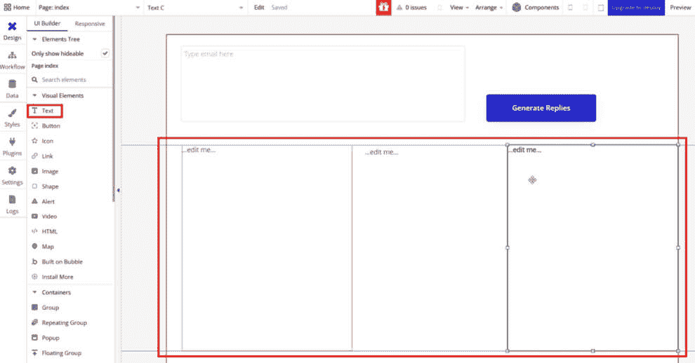

# 第六章：使用 OpenAI API 构建智能应用程序

本章将汇总我们在之前各章中学到的所有关键概念。重点是使用 OpenAI API 创建真正的智能应用程序。需要特别注意的是，应用程序不仅仅是 OpenAI API 本身，还包括其周围的多个层次，如前端和后端层。

在本章中，我们将使用上一章中学到的应用架构。具体来说，我们将使用*Google Cloud Functions*作为后端层，*Bubble*作为前端层。如果你不记得架构了，*图 6.1*演示了任何应用程序中的各个层次：


图 6.1 - 使用 OpenAI API 的典型应用架构演示

在本章中，我们将涵盖以下食谱：

+   创建一个生成回复电子邮件的包装应用程序

+   创建一个生成旅行行程的多模态应用程序

# 技术要求

本章中的所有食谱都要求你拥有 OpenAI API 访问权限（通过生成的 API 密钥）并安装了 API 客户端。有关如何获取 API 密钥的更多信息，请参见*第一章*中的*使用 Postman 发起 OpenAI API 请求*食谱。你还需要掌握 Python 和 Python OpenAI 库的知识，这些内容在*第四章*的第一个食谱中已覆盖。

我们还将使用 GCP 来托管我们的公共端点。GCP 是 Google 提供的一套云计算服务，涵盖了数据库、数据存储、数据分析、机器学习等多种托管和计算服务，所有服务都托管在 Google 的基础设施上。有关更多信息，请参见*第五章*中的*创建调用 OpenAI API 的公共端点服务器*食谱。

最后，你需要熟悉 Bubble，这是一个可视化编程平台，允许用户无需编写代码即可创建 Web 应用程序。有关如何设置 Bubble 的更多信息，请参见*第五章*中的*从无代码应用程序调用用户创建的端点*食谱。

# 创建一个生成回复电子邮件的包装应用程序

在这个食谱中，我们将构建一个智能应用程序，帮助你回复经理的电子邮件，经理要求你执行一个特定的任务。当我被任务压得喘不过气时，总是很难礼貌地拒绝经理，所以这个应用程序对我来说可能是个很好的选择（而且我每天都在使用这个变种）。

从技术上讲，使用这个应用程序做的所有事情，你都可以直接通过 ChatGPT 服务完成。那么，为什么要花时间通过 API、后端和前端的方式来构建它呢？学习任何新技能时，逐步学习概念是非常有用的。这里，构建智能应用程序的第一步是从一个简单的 wrapper 应用程序开始。这将帮助你掌握构建智能应用程序的基本工作流程。之后，我们将向这个工作流程添加新的概念，帮助你构建一个 ChatGPT 服务无法做到的应用程序。

**Wrapper 应用程序**是一个为 OpenAI API 提供支持的软层，便于与 OpenAI API 更高效地交互。在编程中，**wrapper** 通常指代一种作为中介或接口的软件，它使得与另一个软件组件或 API 的交互变得更加容易或简洁。Wrapper 非常有用，因为它们简化了 API 的交互，而且比更复杂的多模态应用程序更容易制作。

在这个配方中，我们将分三步构建应用程序：*OpenAI Playground*、*Google Cloud Function* 和 *Bubble*。

准备工作

确保你有一个可用额度的 OpenAI 平台账户。如果没有，请参阅*第一章*中的 *设置你的 OpenAI Playground 环境* 配方。

此外，确保你已经创建了 GCP 账户。你可能还需要提供账单资料才能创建 GCP 资源。请注意，GCP 提供免费层，在这个配方中，我们将 *不会* 超过免费层，因此你基本上不应该产生任何费用。

最后，确保你已经创建了一个 Bubble 账户，你可以通过 [`bubble.io`](http://bubble.io) 免费创建。

本章中的所有配方都将有相同的要求。

## 如何操作……

### OpenAI Playground

1.  访问 [`openai.com`](https://openai.com)。在左侧菜单中选择 **Playground**。从顶部菜单，将 Playground 模式从 **Assistant** 切换为 **Chat**。

1.  在 **System** 消息中，输入 **You are a helpful assistant that creates replies to emails that politely say no to the task you have been asked to perform. Only return the reply to the email,** **nothing else.**

1.  在 `Hi Henry,`

    `由于 Dave 不在，能否请你接手 Henderson 提案，并在` `明天早上`之前放到我的办公桌上？`

    `Best,`

    `Rick`

1.  在右侧，进行以下更改以调整 Playground 的属性：

    +   将 **Model** 从 **gpt-3.5** 切换为 **gpt-4**

    +   将 **Temperature** 增加到 **1.4**

    +   将 **Maximum length** 设置为大约 **1000**：


图 6.2 – ChatGPT Playground 配置

1.  接下来，选择**提交**。OpenAI 会为你生成一个回复。在此情况下，它会针对你发送的示例邮件做出回复，并且条件是它*礼貌地*拒绝你被要求执行的任务。

### Google Cloud Function

1.  在新标签页中，导航到[`cloud.google.com`](https://cloud.google.com)，并使用你的 Google 帐户登录。

1.  在右上角选择**控制台**。

1.  创建一个新的 Google 云函数。为此，在搜索栏中输入**function**，选择**Cloud Functions**，然后选择**创建函数**。

1.  给函数起个描述性的名字。由于此函数将为我们返回一封礼貌的电子邮件，我们将其命名为**generatepoliteemail**。

1.  在**身份验证**菜单中，确保选择**允许未经身份验证的调用**作为身份验证方式。这将使前端应用能够调用后端层。

1.  选择**下一步**进入函数开发。在**运行时**下拉菜单中，选择**Python 3.12**。对于**入口点**值，选择或输入**get_message**。

1.  对于实际的*代码块*，输入以下内容：

    ```py
    import functions_framework
    from openai import OpenAI
    @functions_framework.http
    def get_message(request):
        request_json = request.get_json(silent=True)
        email = request_json['email']
        client = OpenAI(api_key = '<your-openai-api-key-here>')
        ### Playground Code Here ###
        result = {
            'choice_1': response.choices[0].message.content,
            'choice_2': response.choices[1].message.content,
            'choice_3': response.choices[2].message.content,
        }
        return result
    ```

1.  转到左侧菜单中的**Requirements.txt**，输入新的一行，并输入**openai**。这样可以确保 OpenAI 库作为此函数的一部分被下载。

1.  返回到**Open AI Playground**。删除作为*步骤 4*一部分生成的**Assistant**消息。确保填充的唯一消息是**System**和**User**。

1.  选择**查看代码**，复制响应（*图 6.3*），然后将其粘贴到 Google Cloud 控制台中的代码块下方，那里写着**### Playground Code Here ###**（*图 6.4*）：


图 6.3 – 从 Playground 获取的代码要导入到 Google Cloud Functions 中


图 6.4 – 将代码粘贴到 Google Cloud 控制台中

要更改代码的关键部分是`Hi Henry, since Dave is out…`。我们希望用函数中的`email`变量来替换它。

此外，由于我们想要三封电子邮件回复（因此需要从 OpenAI API 获取三条回答），我们需要在 OpenAI 请求中添加一个额外的参数，表示*n=3*。这将确保我们从实际的 API 获得*n*或*三封*电子邮件。

1.  在进行这些更改后，**Google Cloud Functions**中的代码块应如下所示：

    ```py
    import functions_framework
    from openai import OpenAI
    @functions_framework.http
    def get_message(request):
        request_json = request.get_json(silent=True)
        email = request_json['email']
        client = OpenAI(api_key = '<your-openai-api-key-here>')
        response = client.chat.completions.create(
          model="gpt-4",
          messages=[
            {
              "role": "system",
              "content": "You are a helpful assistant that creates replies to emails that politely says no to the task you have been asked to perform. Only return the reply to the email, nothing else."
            },
            {
              "role": "user",
              "content": email
            }
          ],
          temperature=1.41,
          max_tokens=1066,
          top_p=1,
          frequency_penalty=0,
          presence_penalty=0,
          n=3
        )
        result = {
            'choice_1': response.choices[0].message.content,
            'choice_2': response.choices[1].message.content,
            'choice_3': response.choices[2].message.content,
        }
        return result
    ```

1.  选择**部署**。你可能需要等待 5 分钟，直到部署完全完成。当你在**Cloud Functions**屏幕上看到*绿色勾选标记*时，表示你的函数已成功部署：


图 6.5 – 无云函数部署快照

1.  现在，我们将使用 Postman 来测试刚刚部署的云函数。为此，打开 Postman，在左上角选择**新建**，然后选择**HTTP**。

1.  在 Postman 请求中，选择**头部**，并输入一个新的头部，其中**键**为**Content-Type**，**值**为**application/json**：


图 6.6 – 云函数测试配置

1.  将请求从左侧下拉菜单中的**GET**更改为**POST**。复制**云函数**页面中的端点 URL，并将其粘贴到 Postman 中。

1.  选择**正文**，然后选择**原始**，复制并粘贴以下 JSON 请求：

    ```py
    {
    "email": "Hi Henry,\n\nSince Dave is out, could you please pick up the Henderson proposal and have it on my desk by tomorrow morning?\n\nBest,\nRick"
    }
    ```

1.  选择**发送**以调用你的云函数。如果一切顺利，你应该能看到类似于*图 6.7*所示的响应：


图 6.7 – 成功的云函数测试

### Bubble

1.  访问[`bubble.io`](http://bubble.io)并登录。选择**创建应用**并为你的应用命名。选择**开始使用**，然后选择**从基础功能开始**。如果遇到**跳过应用助手**的提示，也可以点击跳过。

1.  在**画布**页面，我们将添加一些应用程序所需的元素。从左侧菜单中选择**多行输入框**，然后在页面顶部绘制一个矩形。双击属性菜单中的元素，并将**占位符**替换为**在此输入电子邮件**：


图 6.8 – Bubble.io 用户界面配置

1.  创建一个**按钮**元素，方法是选择**按钮**，然后在你创建的第一个元素右侧绘制一个框。

1.  最后一组需要创建的元素是三个**文本**元素。从左侧菜单中选择**文本**，然后在**多行输入框**的下方绘制一个框，宽度约为页面的 1/3。对其他两个文本框重复此操作，并将它们与其他**文本**元素相邻。通过双击每个元素并将**占位符**元素分别替换为**文本 A**、**文本 B** 和**文本 C**来命名这些元素。



图 6.9 – Bubble.io 用户界面配置

1.  对于每个文本框，双击**文本**元素以显示其属性。然后，在实际文本字段上点击**插入动态数据**，选择**文本 A**，然后**创建一个新的自定义状态**。系统会提示你输入名称和类型。名称填写**email_reply**，对于**类型**，确保选择**文本**。这将为文本框创建一个独特的自定义状态，这是在应用程序中显示值所必需的。

1.  接下来我们需要做的是将我们创建的云函数加载到 Bubble 中。从左侧菜单中选择**插件**，然后选择**添加插件**。选择**API 连接器**，然后选择**安装**，再选择**完成**：


图 6.10 – Bubble.io 用户界面配置

1.  从插件列表中选择**API 连接器**。然后选择**添加另一个 API**。对于**API 名称**，输入**get_replies**。向下滚动直到找到**名称**字段，点击**展开**。将此 API 的名称更改为**get_replies**。对于该 API，按如下方式配置其设置：

    +   从**作为使用**下拉菜单中，选择**动作**。

    +   将请求从**GET**更改为**POST**。

    +   紧挨着**POST**请求的是一个输入**Endpoint URL**的地方。输入你从 Google 云函数复制的 URL。

    +   点击**新建头部**来创建新的头部。选择**添加头部**。对于**key**，输入**Content-Type**，对于**value**，输入**application/json**。

    +   点击**参数**以添加新参数。对于**key**，输入**email**。对于**value**，复制在*步骤 17*中使用的相同 JSON 文本，如下所示。请**不要**包含引号。确保**私人**框未被选中。这一点非常重要，因为我们需要确保该参数在 Bubble 中可用：

        ```py
        Hi Henry,\n\nSince Dave is out, could you please pick up the Henderson proposal and have it on my desk by tomorrow morning?\n\nBest,\nRick
        ```

1.  选择**初始化调用**来测试 API 调用。如果你看到如*图 6.11*所示的屏幕，那么调用已经成功。确保每个**选择**字段都已选择**文本**类型，并点击**保存**。


图 6.11 – 成功的 UI 配置

1.  从左侧菜单中选择**设计**。双击你创建的**按钮**元素。在弹出的属性菜单中，选择**添加工作流**。

1.  选择**点击此处添加动作**。进入**插件**，找到你刚刚创建的 API（**get_replies – get_replies**）并选择它。在弹出的属性菜单中，删除**(param.) email**的内容，然后选择**插入动态数据**。向下滚动并选择**多行输入类型 email 这里**，然后选择**值**。


图 6.12 – Bubble 工作流

1.  接下来，再次选择**点击此处添加动作**，向下滚动到**元素动作**，然后选择**设置状态**。对于**元素**下拉菜单，选择**Text A**。对于**自定义状态**下拉菜单，选择**email_reply**。对于**值**，选择**步骤 1 的结果**，然后选择**选择 1**。这将使得**Text A**的值等于第一个选择，即你创建的云函数 API 调用的结果。

1.  对**Text B**和**Text C**元素重复*步骤 33*两次，分别选择**选择 2**和**选择 3**。

1.  我们已经完成了 Bubble 智能应用程序所需的一切。为了测试应用程序是否正常工作，选择`Hi Henry,`

    `Since Dave is out, could you please pick up the Henderson proposal and have it on my desk by` `tomorrow morning?`

    `Best,`

    `Rick`

1.  选择**生成回复**。如果一切顺利，您应该看到一个如*图 6.13*所示的屏幕，展示给用户三种可能的方式来回复经理，并礼貌地拒绝即将到来的任务：


图 6.13 – 一个成功的应用配置

## 它是如何工作的…

在这个流程中，我们创建了一个简单的 Web 应用程序，用来生成邮件的示例回复。通过使用 OpenAI API，我们的 Web 应用程序利用了大型语言模型（LLM）的强大能力来解决一个特定的问题。在这种情况下，它是找到一种礼貌地拒绝邮件中常见任务的方法。

我们在此流程中遵循的步骤就像我们之前讲解的那样：

1.  首先，我们在*Playground*中测试了我们的提示，这是一个用户可以测试不同配置并观察其对生成回复的影响的环境。

1.  接着，我们创建了 Google 云函数，它作为后端层。在这一层中，我们添加了 Playground 中的代码，调用 OpenAI 的聊天 API。

1.  然后，我们使用 Postman 测试了后端层，确保调用正常工作，并且从后端 API 得到了适当的响应。

1.  接下来，我们使用 Bubble 创建了一个简单的前端。

1.  最后，我们通过使用 Bubble 工作流和 API 连接插件，将前端和后端层连接起来。

通过执行这些步骤，我们可以在不到一小时的时间内创建任何智能应用。值得特别关注*步骤 1*，因为它是创建任何新应用的关键步骤。

我们从 OpenAI Playground 开始了这个流程，在一个可以快速迭代的环境中测试了**系统**提示，以确保我们得到正确的回复。Playground 提供了一个用户友好的界面，允许我们实验不同的提示和参数。这一实验对于理解 AI 模型如何响应不同输入至关重要，进而帮助我们微调应用程序的提示。

在 Playground 和我们发出 OpenAI API 请求的 Python 脚本中，我们故意设置了以下配置：

+   **模型**设置为**gpt-4**：对于一款邮件回复应用，GPT-4 对上下文和细微差别的高级理解至关重要。邮件可以涵盖广泛的主题和风格，从正式的商业通信到随意的对话。GPT-4 强大的语言模型能够适应这些不同的风格，并提供更准确、上下文相关的回复。

+   **温度**设置为**1.4**：由于这个应用的目的是生成多样化的回复，因此温度值设置高于标准值（1.0），以确保回复中有一定的随机性。较高的温度有助于生成不那么通用的回复，并能够适应每封邮件的独特内容和语气。

+   **最大长度**设置为**1000**：最大令牌长度设置决定了生成的响应的最大长度。将其设置为 1000 可以生成足够长的响应。

+   **N**设置为**3**：**N**参数决定了模型为每个提示生成的不同响应的数量。将**N**设置为**3**意味着应用程序会为每封电子邮件生成三种不同的回复，这是我们为 Web 应用程序所希望的。

Playground 的另一个好处是它可以为你生成 Python 代码；这就是我们在*步骤 15*中所做的。在配置好所有设置，并且对 Playground 的响应感到满意后，我们所需要做的就是点击**查看代码**，从而生成我们所需的确切代码。

在这个配方中，我们创建了一个简单的应用程序。然而，由于它是一个封装应用程序，技术上它本来可以直接在 ChatGPT 中完成，而无需设置复杂的后端或前端层。例如，我可以访问 ChatGPT（[`chat.openai.com/`](https://chat.openai.com/)），输入以下提示，它会给我类似的回答：


图 6.14 – 使用 ChatGPT 创建电子邮件回复

所以，你可能会想，为什么要通过 OpenAI API 来创建这个应用程序呢？好吧，有一些应用程序的例子，它们不是封装器，必须通过 API 来创建。这就是我们将在下一个配方中讨论的内容。

# 创建一个生成旅游行程的多模态应用程序

在之前的配方中，我们成功创建了一个智能应用程序，能够自动回复电子邮件。我们还讨论了这在技术上是一个封装应用程序，这种操作本身可以通过 ChatGPT 或 Playground 轻松实现。

在这个配方中，我们将迈出下一步，创建一个多模态应用程序。**多模态应用程序**是一种高级类型的软件，它将各种形式的媒体和互动方式集成到一个*统一*的体验中。这种集成能够提供更丰富、更具吸引力的用户界面，能够满足更广泛的用户偏好和需求。

多模态应用程序的核心思想是将文本、语音、图像，甚至可能的视频结合起来，创建一个更加动态和互动的环境。例如，考虑一个不仅能响应文本查询，还能理解语音命令、分析图像，甚至可能通过视频内容进行回应的应用程序。这样的应用程序在教育等领域将非常有用，因为它可以适应不同的学习风格；在客户服务中，它也能提供更加个性化和高效的体验。

在我们的案例中，我们将结合**Chat API**和**Images API**来创建旅行行程。用户可以访问应用程序，输入他们将要前往的城市，并获得包含具体行程内容和相关图像的全天旅行计划。

这是一个无法通过 ChatGPT 或 Playground 轻松创建的应用示例，因此它具有实际价值。

## 如何操作…

1.  在新标签页中，访问 [`cloud.google.com`](https://cloud.google.com)，并使用 Google 账户登录。

1.  选择右上角的**控制台**。

1.  创建一个新的 Google 云函数。在搜索框中输入**function**，选择**Cloud Functions**，然后选择**创建函数**。

1.  给函数起个描述性的名字。由于此函数将返回行程和图像，我们将其命名为**get_itinerary_and_images**。

1.  在**身份验证**菜单中，确保选择**允许无身份验证调用**作为身份验证方式。这将使前端应用程序能够调用后端层。

1.  选择**运行时、构建、连接和安全设置**下拉菜单以展开选项。将**超时**从**60 秒**更改为**300 秒**。这将确保 Google 云函数的超时为 5 分钟，而不是 1 分钟。在多模态应用中非常重要，因为将进行多个 API 请求：


图 6.15 – Google 云函数配置设置

1.  选择**下一步**进入函数开发。在**运行时**下拉菜单中选择**Python 3.12**。对于**入口点**，选择或输入**get_travel_details**。

1.  在左侧菜单中，转到**Requirements.txt**，输入一行新代码，输入**openai**。这样可以确保 OpenAI 库作为函数的一部分进行下载。

1.  对于实际的*代码块*，请输入以下内容。此函数接受一个城市作为输入，并返回按早晨、下午、晚上的格式安排的行程，以及每个时段对应的三张相关图像：

    ```py
    import functions_framework
    from openai import OpenAI
    @functions_framework.http
    def get_travel_details(request):
        request_json = request.get_json(silent=True)
        city = request_json['city']
        client = OpenAI(api_key = '<openai-api-key here>')
        response = client.chat.completions.create(
          model="gpt-4",
          messages=[
        {
          "role": "system",
          "content": "You are a helpful assistant that creates detailed one day itineraries based on the city that the user chooses. Create only 3 activities (morning, afternoon, evening). Only mention the itinerary, nothing else."
        },
        {
          "role": "user",
          "content": "Rome, Italy"
        },
        {
          "role": "assistant",
          "content": "Morning: \n\nStart the day at the Colosseum, one of the most iconic sights of Rome. Take a guided tour to fully appreciate its history and significance. \n\nAfternoon: \n\nHead over to the Vatican City. Visit the Vatican Museums, home to a vast collection of art and historical artifacts. Don't miss the Sistine Chapel, famous for Michelangelo's ceiling.\n\nEvening: \n\nEnjoy a leisurely stroll to the Trevi Fountain. Make sure to throw a coin over your shoulder into the fountain for good luck. Then, end the day with a delicious Italian dinner at one of the local restaurants nearby."
        },
        {
          "role": "user",
          "content": "Lisbon, Portugal"
        },
        {
          "role": "assistant",
          "content": "Morning: \n\nBegin your day with a visit to the iconic Belém Tower, a UNESCO World Heritage site offering panoramic views of Lisbon. \n\nAfternoon: \n\nExplore the historical neighborhood of Alfama. Wander its narrow, winding streets, visit the Se Cathedral and enjoy a traditional Portuguese lunch at a local tavern.\n\nEvening: \n\nHead to Bairro Alto, the city's bohemian district, for dinner. Afterwards, enjoy a Fado show - a traditional Portuguese music genre - at one of the local bars."
        },
        {
          "role": "user",
          "content": city
        },
      ],
          temperature=0.64,
          max_tokens=1024,
          top_p=1,
          frequency_penalty=0,
          presence_penalty=0
        )
        itinerary = response.choices[0].message.content
        response = client.chat.completions.create(
          model="gpt-3.5-turbo-1106",
          messages=[
            {
              "role": "system",
              "content": "You are a helpful assistant that creates DALL-E prompts based itineraries. The prompts should be short. Create one prompt for Morning, one for Afternoon, and one for Evening. The DALL-E prompt should be separated by \"|\"."
            },
            {
              "role": "user",
              "content": itinerary
            }
          ],
          temperature=0.64,
          max_tokens=1024,
          top_p=1,
          frequency_penalty=0,
          presence_penalty=0
        )
        dalle_prompts = response.choices[0].message.content
        dalle_prompts_list = response.choices[0].message.content.split('|')
        image_urls = []
        for prompt in dalle_prompts_list:
          response = client.images.generate(
                model="dall-e-3",
                prompt=prompt,
                size="1024x1024",
                quality="standard",
                n=1
            )
          image_urls.append(response.data[0].url)
        result = {
            'itinerary': itinerary,
            'morning_image': image_urls[0],
            'afternoon_image': image_urls[1],
            'evening_image': image_urls[2]
        }
        return result
    ```

1.  选择**部署**。可能需要等待 5 分钟才能完成部署。当你在**Cloud Functions**页面看到绿色对勾时，表示函数已成功部署。

1.  类似于之前的教程，我们现在将使用 Postman 测试刚刚部署的云函数。为此，打开 Postman，选择左上角的**新建**，然后选择**HTTP**。

1.  在 Postman 请求中，选择**Headers**并输入一个新标头，**Key**为**Content-Type**，**Value**为**application/json**。

1.  将请求从左侧下拉菜单中的**Get**更改为**Post**。复制**Cloud Functions**页面中的端点 URL，并将其粘贴到 Postman 中。

1.  选择**Body**，然后选择**Raw**，并复制粘贴以下 JSON 请求：

    ```py
    {
        "city": "Toronto, Canada"
    }
    ```


图 6.16 – Postman 请求体

请注意，由于这是一个长时间运行的云函数，涉及多次调用 OpenAI（用于文本和图像），可能需要几分钟才能完成。

1.  选择**发送**，调用你的云函数。如果一切顺利，你应该会看到类似于*图 6.17*中展示的响应，其中包含嵌入在 JSON 响应中的多个对象：


图 6.17 – Postman 输出

1.  访问[`bubble.io`](http://bubble.io)并登录。选择**创建应用**，为你的应用命名。选择**开始使用**，然后选择**从基本功能开始**。如果遇到提示，你也可以点击**跳过应用助手**。

1.  在**Canvas**页面中，我们将添加一些应用程序所需的元素。从左侧菜单中选择**Input**并在页面的左上角绘制一个矩形框来添加输入框。接着，选择左侧菜单中的**Button**并将其绘制在**Input**旁边，添加一个按钮：


图 6.18 – 在 Bubble 中添加按钮

1.  双击**Input**元素，在属性菜单中，将**Placeholder**替换为**城市**。

1.  双击**Button**元素，在属性菜单中，将**Text**替换为**计划行程**。

1.  创建一个**Text**元素，并将其放置在页面的左侧。

1.  接下来，我们需要创建三张图像。选择**Image**并将其放在页面右侧。重复这一过程 *三* 次，分别创建 *图像 A*、*图像 B* 和 *图像 C*。确保它们大小相同。你可能需要拖动并移动这些图像以确认这一点：


图 6.19 – 在 Bubble 中添加图像

1.  接下来，为**Text**和**Image**元素创建**自定义状态**。

1.  对于每个**Text**元素，双击该元素以显示属性菜单。然后，点击实际文本字段中的**插入动态数据**，选择**Text**，然后**创建新的自定义状态**。系统会提示你输入名称和类型。名称填写**itinerary_details**，类型选择**Text**。这将为文本框创建一个唯一的自定义状态，用于显示应用程序中的值。该框将包含应用程序中的行程详情。

1.  对于每个**Image**元素，双击该元素以显示属性菜单。然后，点击**插入动态数据**，在**动态图像**的地方选择**Image X**，然后**创建新的自定义状态**。系统会提示你输入名称和类型。名称填写**img_url**，类型选择**Text**。

1.  接下来我们需要做的是将我们创建的云函数加载到 Bubble 中。从左侧菜单中选择**插件**，然后选择**添加插件**。选择**API Connector**，然后点击**安装**，最后点击**完成**：


图 6.20 - Bubble.io UI 配置

1.  从插件列表中选择**API Connector**。选择**添加另一个 API**。对于**API 名称**，输入**travel**。向下滚动直到找到**名称**字段并点击**展开**。将此 API 的名称更改为**travel**。对于该 API，按如下方式配置其设置：

    +   从**用作**下拉菜单中选择**操作**。

    +   将请求从**GET**更改为**POST**。

    +   紧邻**POST**请求的是一个输入**Endpoint URL**的位置。输入你从 Google 云函数复制的 URL。

    +   创建一个**新头部**值。选择**添加头部**。然后，在**键**中输入**Content-Type**，在**值**中输入**application/json**。

    +   通过点击**参数**添加一个参数。对于**键**，输入**city**。对于**值**，复制在 Postman 调用中使用的相同 JSON 文本，即**Toronto, Canada**。确保**私密**框已*未选中*：


图 6.21 - Bubble API 配置

1.  选择**初始化调用**以测试 API 调用。如果你看到屏幕中显示的*图 6.22*，则说明调用已成功。确保每个返回对象都已选择**文本**类型。然后，点击**保存**：


图 6.22 - 成功的 UI 配置

1.  从左侧菜单中选择**设计**。双击你创建的**按钮**元素。在出现的属性菜单中，选择**添加工作流**。

1.  选择**点击这里添加一个操作**。然后，前往**插件**，找到你刚刚创建的 API（**travel-travel**），并选择它。在出现的属性菜单中，删除**（参数）city**的内容，然后选择**插入动态数据**。向下滚动，选择**在此输入城市**，然后选择**值**：


图 6.23 - 向 API 调用添加动态数据（1）


图 6.24 - 向 API 调用添加动态数据（2）

1.  接下来，再次选择**点击这里添加一个操作**，向下滚动到**元素操作**，然后选择**设置状态**。从**元素**下拉菜单中选择**Text A**。从**自定义状态**下拉菜单中选择**itinerary_details**。对于**值**，选择**步骤 1 的结果**，然后选择**itinerary**。这将使**Text A**的值等于从你创建的云函数 API 调用返回的 JSON 对象中的行程值。

1.  接下来，再次选择**点击此处添加操作**。然后向下滚动到**元素操作**，选择**设置状态**。在**元素**下拉菜单中，选择**Image A**。在**自定义状态**下拉菜单中，选择**img_url**。对于**值**，选择**步骤 1 的结果**，然后选择**morning_image**。这将使**Image A**等于云函数返回的**Morning Image**，该函数又是从 OpenAI 图像 API 返回的：


图 6.25 – 在 Bubble 中分配自定义状态

1.  将*第 31 步*再重复两次，分别为**Image B**和**Image C**元素，选择**afternoon_image**和**evening_image**。

1.  我们已经完成了构建 Bubble 智能应用程序所需的一切。为了测试应用程序是否正常工作，请点击右侧的**预览**；一个新页面将显示您的应用程序。

1.  在**城市**文本框中，输入任何您想要的城市（我输入的是加拿大多伦多）。然后，点击**规划行程**按钮；这将启动 Bubble 工作流并调用云函数。

1.  如果一切顺利，您应该看到类似*图 6.26*中所显示的屏幕，展示了旅行行程，并附带三张与行程内容直接对应的图片：


图 6.26 – 完成的 Bubble 应用程序输出

## 它是如何工作的……

在本示例中，我们创建了一个旅行行程应用程序，用户可以输入任何地点，应用程序将根据该地点生成一个 1 天的行程，并附带与该行程相对应的 AI 生成照片。如前所述，这是一个*多模态*应用程序，因为我们使用了 OpenAI 的聊天 API 和图像 API 来构建该应用程序。

### 配置多模态应用程序的设置

由于这是一个多模态应用程序，在创建后端 Google 云函数时有一个关键的不同之处。特别是，我们将**函数超时**设置为 300 秒（这是最大值——默认情况下，本文撰写时为 60 秒）。这个超时设置对于确保应用程序能够处理和处理更复杂或耗时的任务，而不会过早终止至关重要。考虑到处理的多模态数据的复杂性——包括文本、图像，甚至可能还有视频内容——延长的超时允许足够的数据解析、分析和响应生成。这一调整还意味着，后端可以舒适地应对数据量或复杂度偶尔的峰值，这在多模态设置中很常见，而不影响性能或可靠性。

### 三个 OpenAI API 调用的代码讲解

后端层包含三个交织的 OpenAI API 调用，值得逐一讲解每个步骤，以便我们能够讨论每一步的具体内容。

#### 调用 1

```py
response = client.chat.completions.create(
      model="gpt-4",
      messages=[
    {
      "role": "system",
      "content": "You are a helpful assistant that creates detailed one day itineraries based on the city that the user chooses. Create only 3 activities (morning, afternoon, evening). Only mention the itinerary, nothing else."
    },
    {
      "role": "user",
      "content": "Rome, Italy"
    },
    {
      "role": "assistant",
      "content": "Morning: \n\nStart the day at the Colosseum, one of the most iconic sights of Rome. Take a guided tour to fully appreciate its history and significance. \n\nAfternoon: \n\nHead over to the Vatican City. Visit the Vatican Museums, home to a vast collection of art and historical artifacts. Don't miss the Sistine Chapel, famous for Michelangelo's ceiling.\n\nEvening: \n\nEnjoy a leisurely stroll to the Trevi Fountain. Make sure to throw a coin over your shoulder into the fountain for good luck. Then, end the day with a delicious Italian dinner at one of the local restaurants nearby."
    },
    {
      "role": "user",
      "content": "Lisbon, Portugal"
    },
    {
      "role": "assistant",
      "content": "Morning: \n\nBegin your day with a visit to the iconic Belém Tower, a UNESCO World Heritage site offering panoramic views of Lisbon. \n\nAfternoon: \n\nExplore the historical neighborhood of Alfama. Wander its narrow, winding streets, visit the Se Cathedral and enjoy a traditional Portuguese lunch at a local tavern.\n\nEvening: \n\nHead to Bairro Alto, the city's bohemian district, for dinner. Afterwards, enjoy a Fado show - a traditional Portuguese music genre - at one of the local bars."
    },
    {
      "role": "user",
      "content": city
    },
  ],
      temperature=0.64,
      max_tokens=1024,
      top_p=1,
      frequency_penalty=0,
      presence_penalty=0
    )
    itinerary = response.choices[0].message.content
```

这是我们在之前的配方中使用的标准 GPT-4 聊天调用，但请注意，我们在调用中包含了一个较长的*聊天记录*。特别是，我们给 OpenAI 提供了两个输入和输出示例，以有效地*微调*模型：

| **输入** | **输出** |
| --- | --- |
| `意大利罗马` |

```py
Morning:
```

```py
Start the day at the Colosseum, one of the most iconic sights of Rome. Take a guided tour to fully appreciate its history and significance.
```

```py
Afternoon: Head over to the Vatican City. Visit the Vatican Museums, home to a vast collection of art and historical artifacts. Don't miss the Sistine Chapel, famous for Michelangelo's ceiling.
```

```py
Evening: Enjoy a leisurely stroll to the Trevi Fountain. Make sure to throw a coin over your shoulder into the fountain for good luck. Then, end the day with a delicious Italian dinner at one of the local restaurants nearby.
```

|

| `葡萄牙里斯本` |
| --- |

```py
Morning:
```

```py
Begin your day with a visit to the iconic Belém Tower, a UNESCO World Heritage site offering panoramic views of Lisbon. Afternoon:
```

```py
Explore the historical neighborhood of Alfama. Wander its narrow, winding streets, visit the Se Cathedral and enjoy a traditional Portuguese lunch at a local tavern.
```

```py
Evening: Head to Bairro Alto, the city's bohemian district, for dinner. Afterwards, enjoy a Fado show - a traditional Portuguese music genre - at one of the local bars.
```

|

在*第一章*、*第二章*和*第四章*中，我们学习了如何使用`行程`变量。

#### 调用 2

在第二次调用中，我们请求 OpenAI API 根据前一个调用生成的行程创建图像生成（DALL-E）提示。具体来说，生成了三个 DALL-E 提示（一个用于早晨，一个用于下午，一个用于晚上），它们由竖线（`|`）分隔：

```py
response = client.chat.completions.create(
      model="gpt-3.5-turbo-1106",
      messages=[
        {
          "role": "system",
          "content": "You are a helpful assistant that creates DALL-E prompts based itineraries. The prompts should be short. Create one prompt for Morning, one for Afternoon, and one for Evening. The DALL-E prompt should be separated by \"|\"."
        },
        {
          "role": "user",
          "content": itinerary
        }
      ],
      temperature=0.64,
      max_tokens=1024,
      top_p=1,
      frequency_penalty=0,
      presence_penalty=0
    )
    dalle_prompts = response.choices[0].message.content
```

请注意，在这种情况下，我们已将模型从`gpt-4`更改为`gpt-3.5-turbo-1106`。我们在*第三章*中讨论了何时使用哪种模型，在这种情况下，GPT-3.5 是完美的，因为指令本身简单且不复杂，而且它的成本要低得多。此外，即使它出现幻觉，用户也不会看到此调用的输出——他们只会看到 DALL-E 生成的图像。

#### 调用 3

```py
…
dalle_prompts_list = response.choices[0].message.content.split('|')
image_urls = []
for prompt in dalle_prompts_list:
    response = client.images.generate(
            model="dall-e-3",
            prompt=prompt,
            size="1024x1024",
            quality="standard",
            n=1
        )
image_urls.append(response.data[0].url)
```

在最后一次调用中，我们遍历了前一次调用中生成的三个 DALL-E 提示，并将它们传递给 OpenAI 图像 API。我们通过**for 循环**来完成这一操作。在 Python 中，for 循环是一种编程结构，允许我们多次执行一个代码块，通常每次迭代时会有所变化。在这个上下文中，我们系统地处理每个 DALL-E 提示。每次迭代时，循环从列表中取出一个提示，发送到 OpenAI 图像 API，然后继续处理下一个提示，直到所有提示都被处理完毕。

请注意，我们不是使用`client.chat`库，而是使用`client.images`库，因为我们需要使用 DALL-E 来生成图像。我们将每个输出存储在一个名为`image_urls`的列表变量中。然后，这些输出通过我们的 Google 云函数返回，返回的 JSON 结构如下：

```py
result = {
        'itinerary': itinerary,
        'morning_image': image_urls[0],
        'afternoon_image': image_urls[1],
        'evening_image': image_urls[2]
    }
return result
```

在这个配方中，我们创建了一个智能应用程序，结合了多个模型、多个 API 调用和微调概念。总体而言，在本章中，我们在不到几小时的时间里构建了两个具有影响力的应用程序。
