# 第一章：对机器学习模型的风险与攻击

本章详细概述了如何从组织计划开始进行 AI 数字化转型时，定义和评估**机器学习**（**ML**）风险框架。风险可能出现在不同阶段，例如在战略或财务规划启动时，或在执行的多个阶段中。随着技术实施的开始，风险开始浮现，并持续到测试阶段，当 AI 应用案例提供给客户时。风险量化可以通过不同的度量标准来实现，这些度量标准可以验证系统行为（鲁棒性和恢复力）对抗风险的能力。在理解风险评估技术的过程中，您还将深入了解机器学习模型的攻击和威胁。在此背景下，您将发现系统中存在安全或隐私瓶颈的不同组成部分，这些瓶颈会带来外部威胁，使模型暴露于漏洞之中。您将了解到当部署到生产环境中的模型没有足够的风险和威胁抗性时，所造成的财务损失和商业影响。

本章将通过以下部分涵盖这些主题：

+   发现风险要素

+   探索通过愿景、战略、规划和度量标准来降低风险的策略

+   评估由于攻击而可能造成的影响和损失

+   探索不同类型的攻击

此外，借助**对抗鲁棒性工具箱**（**ART**）和 AIJack，我们将看到如何为机器学习模型设计攻击。

# 技术要求

本章要求您安装 Python 3.8 以及一些必要的 Python 包，具体如下。安装 ART 和 AIJack 的命令也列在此处：

+   Keras 2.7.0，TensorFlow 2.7.0

+   `pip` `install adversarial-robustness-toolbox`

+   `pip` `install git+https://github.com/Koukyosyumei/AIJack`

# 发现风险要素

随着数字化转型和 AI 采纳的快速推进，越来越多的组织开始意识到恶意 AI 采纳实践的无意后果。这些后果不仅可能影响组织的声誉和长期商业成果，还可能影响到企业的客户以及整个社会。在这里，让我们看一下 AI 数字化转型过程中涉及的不同风险要素，CXOs、领导团队以及技术和运营团队应当关注这些要素。这些相关团队的目标是一致的：避免其系统受到攻击，或避免出现任何可能导致歧视、事故、政治系统操控或人命丧失的安全/隐私违规行为。

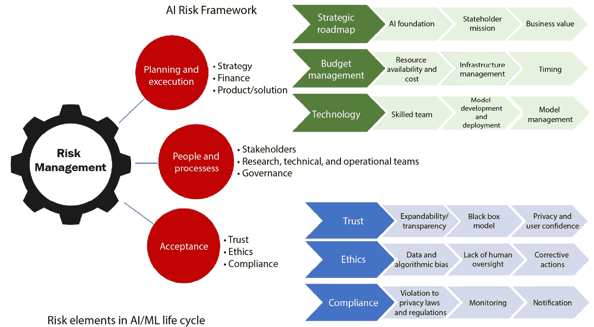

图 1.1 – 展示 AI 风险框架的图表

风险框架有三个主要要素：

+   **规划与执行**：这一阶段理想情况下涵盖了产品开发的所有阶段，即 AI 使用案例的构思、财务规划、执行，包括技术执行，以及从初始的**最小可行产品**（**MVP**）到最终产品/解决方案的设计与发布。

+   **人员与流程**：这是交付时间表中最关键的因素，涉及最小可行产品（MVP）或最终产品/解决方案。领导层应具有清晰的愿景和已制定的指导方针，以便研究、技术、质量保证及其他操作团队能够轻松地按照定义的协议和标准执行数据与 ML 过程。

+   **验收**：这一阶段涉及多轮审计和确认，以验证技术模型设计和部署的所有步骤。该过程遵循额外的确认性指南和相关法律，以谨慎地审查和解释 AI/ML 模型的结果，同时尊重用户的公平性和隐私，保护用户的机密信息。

让我们深入探讨这些元素的组成部分。

## 战略风险

在战略层面，应该在需要数字 AI 转型的业务用例上提前进行**优势、劣势、机会与威胁**（**SWOT**）分析。CXO 和领导团队必须在进行影响与努力分析后识别出合适的业务用例，并制定执行所需的指导方针和一系列协调一致的行动。缺乏这些可能导致不切实际的举措，这些举措与组织的商业目标不一致，导致财务损失和解决方案失败。*图 1.2* 展示了特定行业（例如零售）如何基于**价值-努力框架**对不同的用例进行分类。

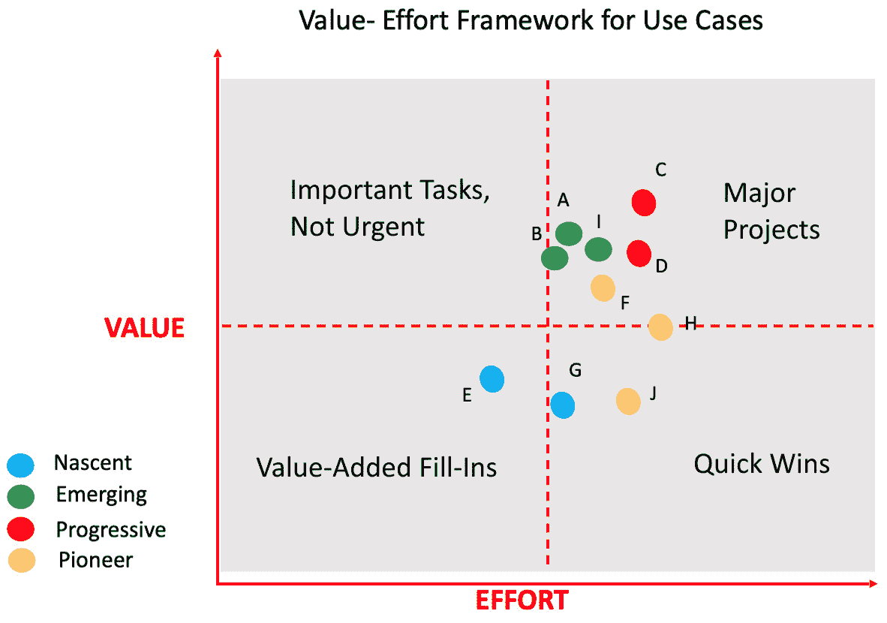

图 1.2 – 价值-努力框架

如果指导方针和行动措施没有正确设定，AI 系统可能会对个人、社会和组织造成危害。以下是一些例子：

+   基于 AI 的自动驾驶车辆常常发生故障，这可能导致伤害或死亡。

+   过度依赖不充分的设备和缺乏监控意味着预测性维护任务可能导致工人受伤。

+   机器学习模型误诊医疗状况。

+   通过误导信息操纵国家制度过程（例如，选举或任命）引发的政治干扰。

+   数据泄露可能暴露机密的军事位置或技术机密。

+   智能系统造成的基础设施干扰或误用（例如，GPS 导航汽车通过不同街道经常增加住宅区的交通流量）。

## 财务风险

高管团队应当了解从项目启动到开发各个阶段，资助一个 AI 开发项目所涉及的财务情况。财务规划不仅应考虑招聘和留住顶尖人才的成本，还应考虑基础设施（云、容器、GPU 等）、数据治理和管理工具相关的成本。此外，财务路线图还应明确指定大数据和模型部署管理中所需的合规性，因为一旦发生任何违规，相关风险和处罚可能是巨大的。

## 技术风险

技术方面的风险可能在数据被摄入系统的时刻就开始显现。数据质量和表示格式的适用性可能严重违反相关法规（*去风险化机器学习与人工智能*：[`www.mckinsey.com/business-functions/risk-and-resilience/our-insights/derisking-machine-learning-and-artificial-intelligence`](https://www.mckinsey.com/business-functions/risk-and-resilience/our-insights/derisking-machine-learning-and-artificial-intelligence)）。除了一个熟练的数据科学和大数据团队，所需的还包括能够检测并提醒数据或模型质量和漂移问题并采取及时补救措施的现代工具和实践。

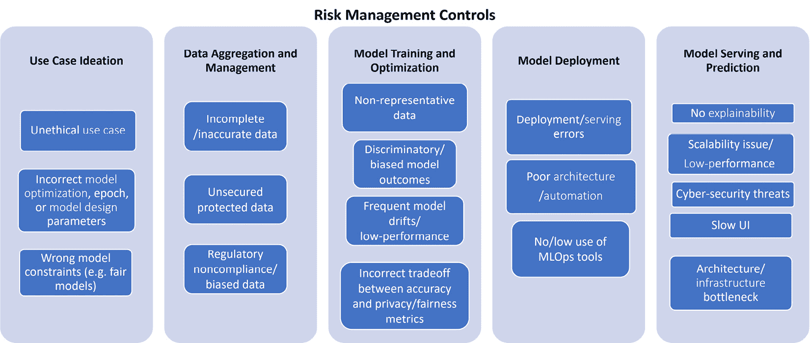

图 1.3 – 显示风险管理控制的示意图

*图 1.3* 展示了不同的风险元素，这些元素可能导致安全漏洞或机密信息的盗窃。一个实时 AI 流水线的不同组件（数据聚合、预处理、模型开发、部署和模型服务）必须在投入生产之前，经过适当的设计、监控（包括 AI 漂移、偏差、重新训练人群特征变化、电路断路器和回退选项）和审计。

此外，风险评估还包括如何识别、分类和清单化 AI/ML 模型，并充分考虑其训练方式（例如，考虑数据类型、供应商/开源库/代码、第三方/供应商代码更新及维护实践以及在线重新训练）和如何提供给客户。

## 人员与流程风险

领导层和高管团队的首要目标是促进创新，鼓励一个开放的文化，使团队能够协作、创新并茁壮成长。当技术团队主动将自动化引入 MLOps 流水线时，许多问题可以提前预测，并通过知识共享会议及时采取措施填补差距。

## 信任与可解释性风险

当模型的结果无法解释时，企业仍然不愿采用 AI 驱动的应用。部分无法解释的结果可能是由于模型在特定客户群体或特定时期（例如，COVID-19 爆发期间）表现不佳。模型的透明度不足——无法解释结果——会让企业或客户感到害怕，特别是当他们发现缺乏激励对齐或对人们工作流或日常惯例造成严重干扰时。机器学习模型回答关于模型行为的问题，可以增强利益相关者的信心。除了部署能够给出正确预测且延迟最小的优化模型外，模型还应能够解释影响其决策的因素。然而，ML/AI 从业者需要运用判断和分析，选择合适的 ML 模型和可解释性工具，推导出影响模型行为的因素。现在，让我们通过一个例子，看看可解释性如何帮助研究医学图像。

**深度神经网络（DNNs）**可能在计算上难以解释，但对 DNNs 的可解释性正在进行大量研究。一个例子是**可解释人工智能**（**XAI**），它被应用于预训练的深度学习神经网络（AlexNet, SqueezeNet, ResNet50 和 VGG16），成功地通过比较分类率，使用相关数据解释受 Barrett 食管影响的关键区域。对比结果能够检测癌症的早期阶段，并区分 Barrett 食管（[`www.sciencedirect.com/science/article/pii/S0010482521003723`](https://www.sciencedirect.com/science/article/pii/S0010482521003723)）和腺癌。然而，如何最佳地解释其模型的使用仍然由数据科学家决定，需根据问题的类型选择适当的数据和数据点数量。

## 合规性和监管风险

不同国家和监管机构已制定了不同的隐私法律和法规，若发生违规行为，将对组织进行处罚。一些最常见的隐私规则包括欧盟的**通用数据保护条例**（**GDPR**）和**加利福尼亚消费者隐私法案**（**CCPA**）。金融和医疗保健行业已经出台了防止偏见并允许公平对待的法律。遵守合规性要求需要通过审计和人工监控进行额外的风险管理规划。

除了各国特定的法规和指导方针外，监管机构可能还会依赖 SR 11-7/OCC 2011-12 中的现有指导，来评估 AI/ML 应用的风险。

### 道德风险

AI/ML 模型应该经过适当的验证和 A/B 测试，以验证它们在不同人群（包括不同性别和不同种族及伦理背景的人）中的合规性和公平性。例如，信用评分和保险模型在历史上对少数种族存在偏见，基于歧视的借贷决策已导致诉讼。

要使 AI/ML 模型合乎伦理、合法且无风险，对于任何组织和执行团队来说，评估 AI 解决方案和服务在市场上推出的影响是不可避免的。这包括在过程中加入高素质的 AI 伦理人员，他们具有监管监督，并确保遵守风险缓解的协议和控制，以确保整个 AI 解决方案既稳固又不易受攻击者青睐。

这些做法不仅可以增加额外的安全层以匿名化个人身份，还可以消除遗留系统中存在的任何偏见。现在让我们看看哪些企业级倡议对 AI 开发过程的包含是必不可少的。

# 探索具有愿景、战略、规划和度量的风险缓解策略

在看到 AI 转型旅程不同阶段的风险元素后，现在让我们深入了解不同的企业风险缓解计划、措施和度量。在后续章节中，我们不仅会发现与 ML 模型设计、开发和部署相关的风险，还将了解执行领导团队制定的政策对于设计符合特定国家法规的系统的重要性。及时的审查、意识和对风险识别过程的支持可以使组织免受意外的财务损失。

## 定义结构化的风险识别过程

只有当业务领导、IT、安全和风险管理团队能够对公司现有风险进行评估，并确定这些风险是否会影响即将到来的人工智能驱动的分析解决方案时，长期使命和短期目标才能实现。这种努力由欧洲最大银行之一的 COO 领导，有助于识别存在偏见的产品推荐。如果不加以检查，可能会导致财务损失、法规罚款和声誉受损，从而影响组织的声誉，导致客户流失和反弹。

这种努力可能因行业而异。例如，食品和饮料行业需要集中关注与受污染产品相关的风险，而医疗保健行业则需要特别注意避免误诊患者并保护其敏感健康数据。

## 企业范围的控制

有效的控制和技术结构围绕着强有力的政策、员工培训、应急计划的实施，以及可以付诸实践的商业规则和目标的重新定义。这些政策转化为明确的标准和指南，要求在必要时进行人工干预。例如，欧洲银行在处理客户的财务或身体健康受到影响的特定情况时，必须采用灵活性：[`www.mckinsey.com/business-functions/mckinsey-analytics/our-insights/confronting-the-risks-of-artificial-intelligence`](https://www.mckinsey.com/business-functions/mckinsey-analytics/our-insights/confronting-the-risks-of-artificial-intelligence)。在这种情况下，关系经理必须介入，提供适当的建议，帮助客户应对家庭成员去世或失去亲人的情况。同样，医疗行业需要医生和健康专家的介入，采用不同的**主动学习**策略来了解罕见病及其症状。控制措施需要应用不同的开源或定制工具，以减轻基于 SaaS 平台和服务的风险，保护群体免受潜在歧视，并确保符合 GDPR。

## 微风险管理与控制加强

实施的工具和技术会根据 ML 生命周期的不同阶段而有所不同。攻击和威胁通常非常具体，针对输入数据、特征工程、模型训练、部署以及模型如何向客户提供服务。因此，设计和评估任何 ML 模型时，必须参考**威胁矩阵**（关于威胁矩阵的更多细节将在*第二章*中讨论）。必须考虑的最重要因素包括模型的目标、优化函数、学习模式（集中式与联邦式）、人机（或机器与机器）交互、环境因素（用于设计强化学习中的政策和奖励）、反馈、再训练和部署。这些因素，加上模型设计及其可解释性，将推动组织选择更加透明和可解释的 ML 模型，并剔除过于复杂、晦涩难懂且无法解释的 ML 模型。威胁矩阵可以通过评估模型性能来保护已部署的 ML 模型，同时测试模型是否受到对抗性攻击以及其他导致模型漂移的外部因素。

你需要根据威胁矩阵的结果，应用不同的风险控制措施和风险缓解策略，并加以强化。在 AI 转型过程的整个旅程中，这不仅能缓解风险、减少潜在成本，还能使系统具有鲁棒性和透明度，以应对每一个可能的风险。通过这些原则的落实，组织不仅能够防止道德、商业、声誉和监管问题，还能以公正、平等和无偏的方式为客户和社会服务。

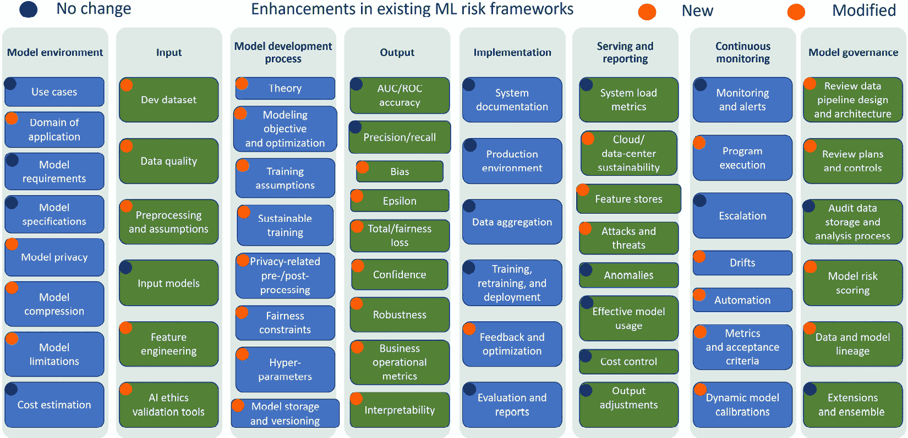

图 1.4 – 展示当前风险管理设置中增强和缓解措施的示意图

当前 AI/ML 风险框架中需要一些新的与伦理相关的元素，这些元素可以帮助确定风险表现并缓解风险：

+   可解释性

+   道德 AI 验证工具

+   模型隐私

+   模型压缩

+   偏差

+   特征工程

+   可持续模型训练

+   隐私相关的前后处理技术

+   公平约束

+   超参数

+   模型存储与版本控制

+   Epsilon

+   总损失和公平损失

+   云/数据中心可持续性

+   特征存储

+   攻击与威胁

+   漂移

+   动态模型校准

+   管道设计和架构回顾

+   模型风险评分

+   数据/模型血统

我们将在后续章节中研究这些组件的每一部分，但在这里先介绍这些概念，并理解为什么每个组件都是负责任/道德模型设计的重要单元，以及它们如何融入更大的机器学习生态系统。

为了进一步说明，让我们首先考虑 AI 伦理的主要风险领域（监管和模型可解释性风险），通过分解*图 1.4*来进一步理解*图 1.5*。下图展示了风险评估方法和技术，用以解释模型结果。

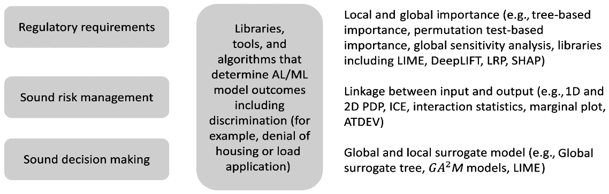

图 1.5 – 通过监管评估和模型可解释性进行风险评估

我们发现，全局和局部替代模型在可解释性中都发挥着重要作用。全局替代模型经过训练，用以近似黑箱模型的预测，而局部替代模型则能够通过改变替代模型输入的分布来解释个体记录的局部预测。这是通过使用特定实例的数据对数据进行局部加权的过程（对与当前实例相似的实例赋予更高的权重）来实现的。

### 道德 AI 验证工具

这些工具，无论是开源的、通过公共 API 访问的，还是由不同的云服务提供商（如 Google Cloud、Azure 或 AWS）提供的，都提供了通过不同的区分人群部分来验证传入数据的方式。此外，这些工具还帮助发现受保护的数据字段和数据质量问题。一旦通过这些工具对数据进行了配置文件处理，就可以构建通知服务和仪表盘，以检测来自各个数据源的传入数据流中的数据问题。

### 模型可解释性

机器学习模型，尤其是神经网络，常被称为**黑箱**，因为结果无法直接与模型架构关联并加以解释。企业常常在生产环境中部署机器学习模型，这些模型不仅可以推荐或预测客户需求，还能用事实（单一特征或多个特征的交互）来支持模型的决策。尽管机器学习模型具有黑箱特性，但有许多开源的可解释性工具可以显著解释模型结果，例如，为什么贷款申请被拒绝，或者为什么某一年龄段和人群的个体容易患某种疾病：

+   线性系数有助于解释单调模型（线性回归模型），并证明所选特征与输出结果之间的依赖关系。

+   非线性和单调模型（例如，具有单调约束的梯度提升模型）通过评估与因变量的正负关系，帮助从众多特征中选择正确的特征集进行预测。

非线性和非单调（例如，无约束的深度学习模型）方法，如局部可解释模型无关解释或 Shapley（一个可解释性 Python 库），作为帮助模型进行局部可解释性的重要工具。神经网络在解释机器学习模型时有两大类主要方法：

+   **显著性方法/显著性** **图** (**SMs**)

+   **特征** **归因** (**FA**)

显著性图仅在传递与指定输入上激活的权重或被**卷积神经网络（CNN）**选择的图像不同部分相关的信息时才有效。尽管显著性图无法传达特征重要性相关的信息，FA 方法旨在对数据子集拟合结构模型，以评估每个变量对输出变量的程度/影响/作用。

判别性 DNN 能够提供模型可解释性，并通过考虑模型的输入梯度来解释最重要的特征，输入梯度指的是输出 logits 相对于输入的梯度。一些基于 SM 的可解释性技术（如梯度法、SmoothGrad 和 GradCAM）是仍在研究中的有效可解释性方法。例如，梯度法可以通过反向传播网络来检测图像中最重要的像素。通过计算类别相对于输入图像的导数得到的分数，有助于进一步进行特征归因。我们甚至可以使用诸如 XAI SM 等工具来处理图像或视频应用。这些工具可以向我们展示网络决策如何受到图像或视频中最重要部分的影响。

### 模型隐私

随着像 GDPR、CCPA 这样的法律，以及不同立法机构出台的政策，ML 模型已经吸收了**隐私设计**的原则，通过采用隐私保护技术来赢得用户信任。上述标准和 ML 模型重新设计的目标，主要是通过构建具备以下特点的 AI 解决方案和系统，防止信息从系统中泄露：

+   积极预防而非反应性修正

+   内置隐私作为默认设置

+   设计中嵌入隐私

+   完全功能化——没有对功能的妥协

+   ML 模型生命周期的安全性、隐私性和端到端保护

+   可见性与透明度

+   以用户为中心，尊重用户隐私

为了在模型层面上涵盖隐私，研究人员和数据科学家使用一些主要的单元或基本构建模块，这些模块应当具备足够的安全措施，以防止敏感和私人信息的泄露。以下是这些构建单元：

+   **模型训练数据隐私**：ML 训练数据摄取单元的数据管道应具有足够的安全措施。任何试图攻击系统的对手都不应能逆向工程训练数据。

+   **模型输入隐私**：安全和隐私措施应确保任何用于模型训练的输入数据都不能被任何人看到，包括创建模型的数据科学家。

+   **模型输出隐私**：安全和隐私措施应确保模型输出仅对预测数据的接收用户可见，其他任何人不可见。

+   **模型存储与访问隐私**：模型必须安全存储，并定义访问权限，只允许符合条件的数据科学专业人员访问。

*图 1.6* 展示了模型训练和改进的不同阶段，在这些阶段中，必须确保模型隐私，以保护训练数据、模型输入、模型权重和最终产物，即 ML 模型输出。

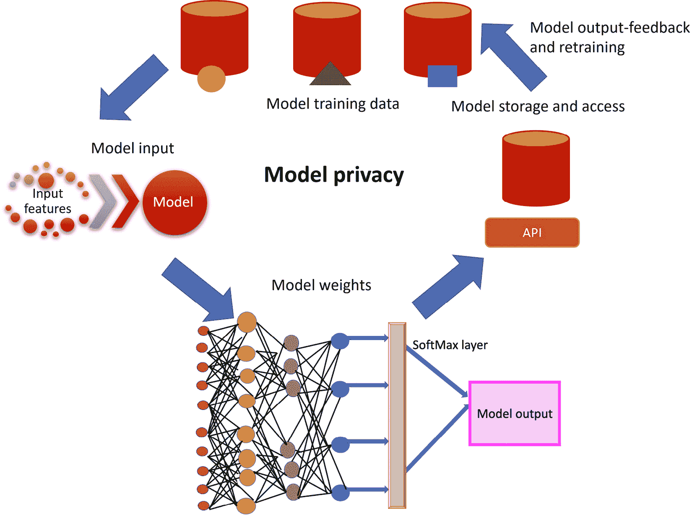

图 1.6 – 展示 ML 模型中隐私的图示

### 模型压缩

人工智能伦理、标准和指南推动了研究人员和数据科学专业人士寻求在低功耗和资源受限的设备上运行和部署这些机器学习模型的方法，而不牺牲模型准确性。在这里，模型压缩是至关重要的，因为压缩模型在功能相同的情况下最适合内存有限的设备。从人工智能伦理的角度来看，我们必须利用机器学习技术造福人类。因此，在极端环境中训练和部署强健的压缩模型是必不可少的，这样它们可以最小化人工干预，同时通过优化修剪神经元数量来记忆相关信息。

例如，一种技术是通过噪声诱导扰动来构建强大的压缩模型。这种噪声通常来源于物联网设备，这些设备接收来自环境的传入数据，其中包含大量扰动。研究结果表明，考虑到现实世界噪声数据的流形对抗训练（on-manifold adversarial training）能够产生比外部攻击者噪声引入的流形外对抗训练（off-manifold adversarial training）更高压缩率和更高准确度的模型。*图 1.7* 说明了流形对抗样本比模拟样本更接近决策边界。

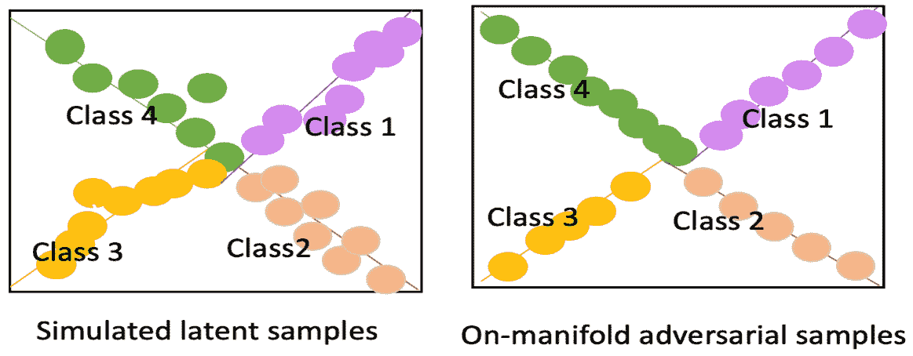

图 1.7 – 模拟样本和流形对抗样本的示意图

### 可持续模型训练

低功耗设备依赖可再生能源资源进行自我能量生成，并在联邦学习生态系统中进行本地模型训练。设备可以通过不同的策略参与模型训练过程并向中央服务器发送更新。设备间歇性地参与训练过程的主要目的是高效地利用可用能源，以可持续的方式运行，以便设备不会耗尽电力并保持在系统中，直到全局模型收敛。可持续模型训练为最大化功率利用提供了指导方针和有效策略，以造福环境。

### 偏见

机器学习（ML）模型会受到来自数据和模型的不同偏见。常见的数据偏见源自结构性偏见（例如，依据社会观念错误标注性别，女性被标注为护士、教师和厨师），数据收集和数据操控；而常见的模型偏见则来源于数据采样、测量、算法偏见以及对群体、细分市场、人口统计、行业或类别的偏见。

**随机森林**（**RF**）算法基于在两阶段过程中对样本进行袋装（bagging）和特征选择的随机化原理。随机化过程能够解决由无信息特征选择所引起的模型偏差，特别是在高维数据中，包含多值特征时。RF 模型通过偏向多值数据集，其中许多特征是分类变量，提升了洗钱预测中的风险水平。然而，研究发现，当分类值数量减少时，同一模型能够产生更好的、无偏的结果。基于 RF 的更先进模型，称为**xRF**，能够利用统计评估（如**p 值**）来选择更相关的特征。p 值评估技术有助于根据特征的重要性分配适当的权重，并通过生成更精确的树结构帮助选择无偏的特征。这是一个用于降维的特征加权抽样技术示例。

### 特征工程

与传统的机器学习模型相比，黑箱模型（如神经网络）变得越来越难以理解。例如，**CNN**需要正确的知识和滤波器的应用，以去除不必要的属性。由高维数据构建的模型需要结合适当的降维技术，以选择最相关的特征。此外，基于**自然语言处理**（**NLP**）的机器学习模型在模型设计的初步步骤中需要进行预处理。现在有许多商业和开源库可以帮助创建新的复杂特征，但它们也可能导致过拟合的机器学习模型。研究发现，过拟合的模型直接威胁到隐私，可能会泄露私人信息（[`machinelearningmastery.com/data-leakage-machine-learning/)`](https://machinelearningmastery.com/data-leakage-machine-learning/))。因此，模型风险缓解机制必须采用单独的特征评估，以确认所包含特征对业务逻辑的影响（数学变换和决策标准）。特征创建的作用在银行的具体信用建模用例中得到了最好的理解，其中机器学习模型可以基于债务与收入比率的工程化特征预测违约者。

### 隐私相关的预处理/后处理技术

数据匿名化需要以某种形式添加噪声（如高斯分布/拉普拉斯分布），这种噪声可以在模型训练过程之前（K-匿名性、**差分隐私 (DP)**）或模型收敛后（附加式 DP）启动。

### 公平性约束

机器学习模型可以通过不同的约束条件来训练，从而获得理想的结果。约束条件为机器学习模型定义了不同的边界条件，在训练时，目标函数将为少数群体或具有歧视性的种族群体产生公正、公平的预测。这些约束条件需要根据训练类型设计和引入，即监督学习、半监督学习、无监督学习、排名、推荐或基于强化学习的训练。应用约束条件最多的数据集通常包含一个或多个敏感属性。除了约束条件，模型验证者应负责确保使用随机化或网格搜索算法选择合适的参数。

### 模型存储和版本控制

伦理 AI 系统的一个重要组成部分是赋予生产系统能够再现数据和模型结果的能力，如果缺乏这一能力，诊断故障并采取立即的补救措施将变得异常困难。版本控制和存储先前的模型版本不仅允许你快速恢复到先前的版本，或激活模型可复现性以应对特定输入，而且还能减少调试时间和重复劳动。不同的工具和最佳实践机制通过抽象计算图并在每个机器学习引擎步骤中归档数据来帮助模型的可复现性。

### Epsilon (ε)

这是一个在**差分隐私（DP）**解决方案中使用的指标，负责提供应用层隐私保护。该指标用于衡量在对两个不同的数据集发出相同查询时产生的隐私损失，这两个数据集仅在一个记录上有所不同，且差异是通过从其中一个数据库中添加或删除一个条目来创建的。我们将在*第二章*中进一步讨论差分隐私。这个指标揭示了当其计算在前述数据集的私人敏感信息上时，所带来的隐私风险。它也被称为隐私预算，并根据输入数据的大小以及添加到训练数据中的噪声量来计算。值越小，隐私保护越好。

### 云/数据中心可持续性

随着对气候变化和可持续性问题的关注不断增加，主要的云服务提供商（Google、Amazon 和 Microsoft）已经开始采取能源效率措施，以促进更绿色的基于云的产品。碳足迹报告的推出使用户能够衡量、跟踪和报告与云相关的碳排放。为了鼓励企业对环境的影响最小化，所有的机器学习部署应将可持续性视为一个需要衡量和管理的风险或合规问题。这推动了数据科学和云团队考虑在可持续数据中心中部署机器学习管道和特征存储。

### 特征存储

特征存储允许特征重用，从而节省额外的存储和云端成本。由于数据重用和存储必须符合合规性和法规要求，它是道德 AI 中的一个重要考虑参数。特征存储允许通过特征工程创建重要特征，并促进团队成员之间的合作，分享、发现和使用现有特征而无需进行额外的重复工作。特征重用还促使基于特征重要性和其他团队定义的模型可解释性重用重要属性。由于深度学习模型需要巨大的计算能力和能量，正确选择算法，并结合重用模型数据和特征，能够通过减少计算能力来降低云端成本。

### 攻击和威胁

为生产级企业 AI 解决方案设计的风险框架应与攻击测试框架（第三方和开源）集成，以评估模型面临外部攻击者的风险。然后，可以利用 ML 模型对攻击的易受攻击性增加监控活动，在发生攻击时主动应对。

### 漂移

系统中已实现的数据和模型监控技术必须能够在目标变量或预测因子的统计特性发生变化时，迅速识别数据漂移和模型漂移（*机器学习中的概念漂移与模型衰退*，Ashok Chilakapati 著：[`xplordat.com/2019/04/25/concept-drift-and-model-decay-in-machine-learning/`](http://xplordat.com/2019/04/25/concept-drift-and-model-decay-in-machine-learning/)）。主动措施包括检查数据格式、模式和单位，并在漂移百分比超过指定阈值时重新训练模型。

以下描述与*图 1.8*中的数字标签相对应：

1.  原始数据和模型决策边界（t1 时刻）。

1.  仅在数据边界发生漂移（t2 时刻），这是由于输入数据特征的变化。例如，考虑一个实际场景，其中物联网传感器读取值的异常范围是-10 到 10。现在，新读取值可能会变为-5 到 8，但由于决策结果或模型输出没有变化，这个读取值仍然被视为异常。由于这不会导致模型边界的漂移，它仅为虚拟漂移。

1.  数据和模型边界在 t3 时刻同时发生漂移，导致实际的概念漂移。例如，当两个传感器读取值发生变化（从旧的-10 到 10 的读取值变化为新的+20 到+100 的读取值），并且结果模型输出为+1，表示它不再是异常值时，就会出现这种场景。这表明模型边界发生了变化，输出只是输入数据边界变化的反映。

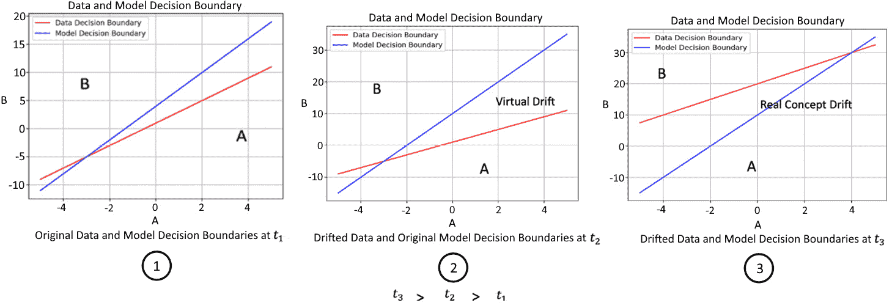

图 1.8 – 不同类型的模型漂移

### 动态模型校准

动态模型校准是模型漂移的一个更专业的版本。模型漂移可能由于数据变化、度量单位、以及内部和外部因素的变化所引起，这些变化需要经过一定时间的仔细研究、审查和讨论，然后才会触发模型更新。

另一方面，当模型的性能水平仅因输入数据的短期变化（例如，由于大型社交聚会或足球比赛而导致移动网络容量变慢）而发生变化时，模型校准可以更为简便。

机器学习模型（例如，强化学习算法或贝叶斯模型）具有动态刷新模型参数的特点，以捕捉输入数据中的新趋势和模式。这使得模型审查和更新的手动过程得以去除。如果没有足够的控制或算法来控制模型更新的阈值水平，短期模式可能会被过度强调，从而可能随着时间的推移降低模型的性能。因此，克服这些风险需要专家仔细审查何时允许动态再校准，以便反映即将出现的趋势。此外，企业（尤其是在银行的算法交易或医疗领域疫情传播）需要确信动态再校准在长期内优于静态模型。

*图 1.9* 展示了一个使用案例，当输入到模型的位置信息数据呈现振荡模式时，导致预测结果随时间发生变化，进而导致模型漂移。此类情况需要模型替换/校准，并指定或配置漂移百分比的阈值。

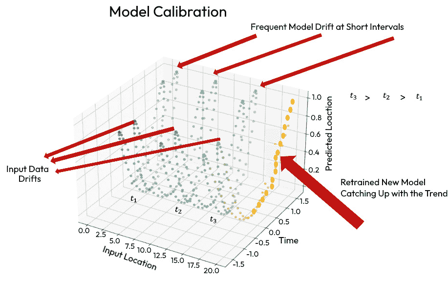

图 1.9 – 展示在输出模型预测漂移下的模型校准示意图

### 审查管道设计和架构

在我们审查模型漂移并允许模型的动态校准时，为了符合道德标准，我们还应定期审查系统设计和架构、管道以及特征存储，并在需要时允许进行修改。审查中最重要的部分之一是重新评估和重新考虑整个安全系统，应用新的补丁或额外的认证层或黑名单服务，以主动应对 DDOS 攻击。在后续的生产版本中，可以进行多种优化，帮助降低云成本，优化数据库操作，并提升 API 和微服务的性能。审查过程让你能够寻求专家意见（来自云计算和 DevOps 专业人士），他们可以为设计更自动化的工作流程提供见解，并帮助迁移到按需服务（例如 lambda 服务），以减少处理成本。审查系统负载、性能和扩展因素，还能帮助更好地选择数据库、缓存和消息传递选项，或者仔细分析和重新定义自动扩展选项。

### 模型风险评分

由于我们已经使用了道德 AI 验证工具来对输入数据进行概况分析和验证，我们还需要风险评估工具来评估并量化模型风险，特别是在面对对抗性攻击和威胁时。现在有不同的开源工具和 API 可供使用，甚至不同云服务提供商（如 Google Cloud、Azure 和 AWS）也提供了训练和测试模型的方式，以应对模型对不同攻击的脆弱性和模型偏见，这些方法通过量化模型对不同人群群体表现的不公平结果来进行评估。此外，这些工具还帮助解释对模型结果有重大影响的特征。在接下来的章节中，我们将讨论更多这样的工具和框架。模型风险评分策略需要有助于预测的风险因素或指标、数据完整性、方法偏好和资源能力。

风险评分方法有两种不同的功能方式：

+   **前瞻性**风险方法通过分析历史模型表现来预测模型风险。

+   **回顾性**/**同时性**风险利用模型的最新风险预测未来周期的整体模型风险。

第二种方法更适合用于模型风险指标、数据（模型行为）或近期攻击或数据丢失发生重大变化且正在调查模型的情况。

*图 1**.10*展示了风险敏感的模型风险管理如何考虑监控工具、活动和治理措施来评估模型风险。该图扩展自*Keenan 的模型风险度量组件*，Keenan（2015），该组件还展示了过去的攻击、威胁和漏洞对企业中类似模型的影响，并指出了当前模型相关风险的增加。

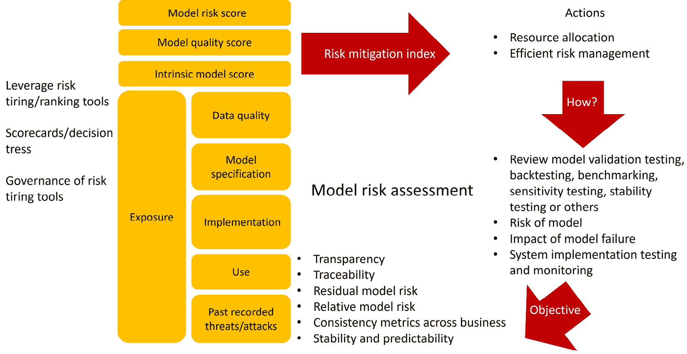

图 1.10 – 显示模型风险评估的图示

### 数据/模型谱系

伦理和合规流程要求对数据和模型进行频繁的审计和质量检查。必须存储两者的谱系，以便在任何时刻都能清楚地知道模型是如何由于数据的变化（如添加、修改或删除某些特征）从版本 1 演变到版本 2 再到版本 3 的。同时，应该定义存储位置，用于存储关于模型及其工件的即时历史数据，而较旧的工件可以存储在云的低频存储中心（访问要求较少）。

以下图示展示了模型的输入训练、验证、测试数据、模型服务以及基于访问频率存储在 AWS 不同存储类别中的输出文件。在这里，我们展示了在设计一个符合伦理和完全合规的系统时，必不可少的不同处理模块和单元的角色。通过遵循前述的验证政策和实践，能够更容易地应对机器学习模型风险，探索现有的瓶颈，并在模型生命周期的每个阶段重新定义新的政策和实践。

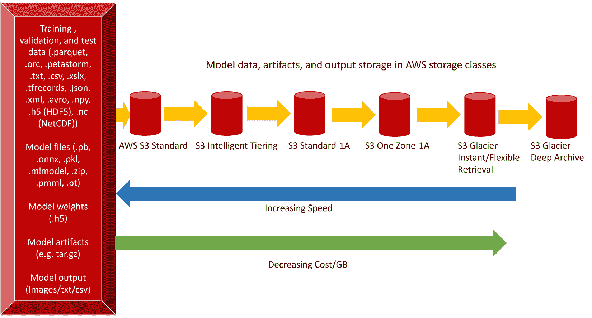

图 1.11 – 显示模型及其工件存储的图示

任何执行团队都需要意识到云基础设施、系统和安全设计原则、机器学习模型设计、模型评分和风险评估机制的重要性，并设定指导方针，以便企业能够降低风险，避免处罚，并获得使用机器学习推动销售和收入的信心。

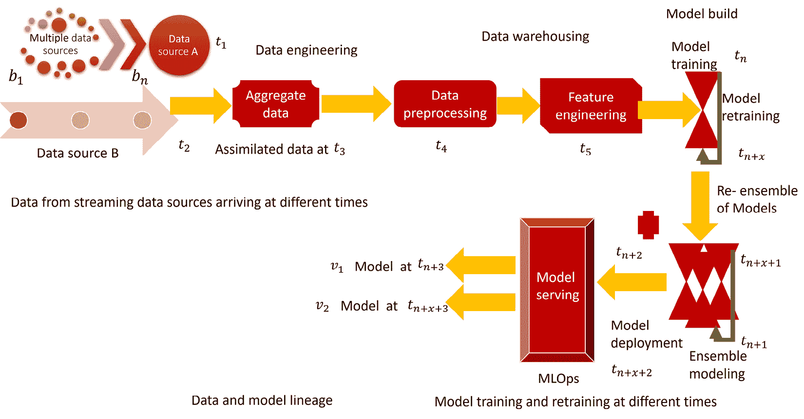

图 1.12 – 显示数据和模型谱系的图示

*图 1.12* 展示了数据和模型谱系在模型生命周期开发阶段如何完成，涵盖从数据集成和预处理到模型训练、集成、模型服务以及再训练过程。我们可以看到，数据分别在 t1 和 t2 时从两个不同的数据源 A 和 B 到达，并在 t3 时被组装或聚合，作为数据预处理和特征工程的输入，分别在 t4 和 t5 时进行。这里有两个模型输出：

+   在 tn+3 时可用的模型 v1，对应模型训练（tn），演示了在不同时间点（tn+1）训练的不同机器学习模型的组合

+   在 tn+x+3 时可用的模型 v2，对应模型再训练（*t*n+x），重新集成（tn+x+1）

数据和模型的血统应该能够捕捉到系统中任何变化，并具备适当的版本控制，这有助于后续的模型可重复性。在分析完伦理和风险的关键组成部分后，接下来我们来看看如果组织未能遵守监管机构设定的法律和指南，可能面临的处罚。

# 评估攻击可能带来的影响和损失

在前一部分中，我们探讨了在构建机器学习系统时需要考虑的数据威胁、风险和重要指标。现在，让我们来了解一下因数据泄露而导致的财务损失。

### AOL 数据泄露

2006 年，AOL 因泄露用户记录而面临诉讼，导致他们必须向每个数据泄露的用户支付至少 5000 美元，因为这些记录可以通过公共搜索 API 访问（*回顾黑客事件*：*臭名昭著的 AOL 数据泄露*： [`www.proofpoint.com/us/blog/insider-threat-management/throw-back-hack-infamous-aol-data-leak`](https://www.proofpoint.com/us/blog/insider-threat-management/throw-back-hack-infamous-aol-data-leak)）。该事件发生在搜索部门错误地发布了一个压缩的文本文件，里面包含了 650,000 名用户的 2000 万条关键词搜索记录。由于搜索查询中包含了用户的**个人身份信息（PII）**，很容易识别并关联到持有账户的个人。此外，最近，AOL 的一名员工 Jason Smathers 被发现将包含 9200 万 AOL 客户账户名称的列表卖给了拉斯维加斯的 Sean Dunaway。

### 雅虎数据泄露

雅虎遭遇了一系列数据泄露事件（例如通过电子邮件泄露个人信息），这些事件发生在 2012 到 2016 年之间，涉及 3 亿条记录的泄露（*本周事件*：*雅虎四年内发生多起数据泄露事件，最终达成 1.175 亿美元和解*： [`www.cshub.com/attacks/articles/incident-of-the-week-multiple-yahoo-data-breaches-across-4-years-result-in-a-1175-million-settlement`](https://www.cshub.com/attacks/articles/incident-of-the-week-multiple-yahoo-data-breaches-across-4-years-result-in-a-1175-million-settlement)）。

2014 年的攻击针对的是一个不同的用户数据库，影响了 5 亿人，并且泄露了更详细的个人信息，如姓名、电子邮件地址、密码、电话号码和生日。雅虎因此支付了 5000 万美元的罚款，其中 3500 万美元提前支付，作为赔偿的一部分（*雅虎因数据泄露被罚款 5000 万美元*： [`www.pymnts.com/legal/2018/yahoo-fine-personal-data-breach/`](https://www.pymnts.com/legal/2018/yahoo-fine-personal-data-breach/)）。

万豪酒店连锁数据泄露

万豪酒店集团因 2014 至 2018 年间一系列网络攻击导致英国 700 万名客人的个人信息（姓名、联系方式、旅行信息、VIP 状态）泄露，被罚款 1840 万英镑。由于未能保护个人数据且未遵守 GDPR 规定，英国数据隐私监管机构对其处以重罚 (*万豪酒店因数据泄露被罚 1840 万英镑，影响数百万用户*：[`www.bbc.com/news/technology-54748843`](https://www.bbc.com/news/technology-54748843))。

### 优步数据泄露

优步因 2014 年数据泄露事件在纽约达成和解，被罚款 2 万美元 (*优步因数据泄露和‘上帝视角’调查被罚 2 万美元*：[`www.cnet.com/tech/services-and-software/uber-fined-20k-in-surveillance-data-breach-probe/`](https://www.cnet.com/tech/services-and-software/uber-fined-20k-in-surveillance-data-breach-probe/))。该泄露事件发生在 2014 年，泄露了 5 万名司机的位置信息，且通过乘客追踪系统进行了暴露。

### 谷歌数据泄露

2020 年，法国数据保护局因谷歌未能确认并共享其在不同应用程序（如谷歌地图、YouTube、搜索引擎和个性化广告）中如何处理用户数据，违反 GDPR 规定，对谷歌处以 5700 万美元罚款。在另一宗数据泄露事件中，谷歌泄露了 50 万名前 Google+用户的私人数据。谷歌因此需要支付 750 万美元赔偿，并向 2015 年至 2019 年间拥有 Google+账户的用户提供 5 至 12 美元的赔偿金。

### 亚马逊数据泄露

亚马逊在 2021 年经历了多个数据泄露事件 (*2021 年最严重的 AWS 数据泄露*：[`securityboulevard.com/2021/12/worst-aws-data-breaches-of-2021/`](https://securityboulevard.com/2021/12/worst-aws-data-breaches-of-2021/))。其中一起事件导致欧洲隐私监管机构对其罚款 7.46 亿欧元（8.87 亿美元）（*亚马逊因违反 GDPR 被欧洲隐私监管机构罚款 8.87 亿美元*：[`www.cnbc.com/2021/07/30/amazon-hit-with-fine-by-eu-privacy-watchdog-.html`](https://www.cnbc.com/2021/07/30/amazon-hit-with-fine-by-eu-privacy-watchdog-.html)）。在另一事件中，AWS 的 S3 存储桶配置错误导致网络中断长时间。除了**个人身份信息（PII）**，如姓名、电子邮件地址、国民身份证号码和电话号码，还可能包括信用卡详细信息，包括 CVV 代码。

### Facebook 数据泄露

2018 年，Facebook 遭遇了 50 亿美元的巨额罚款，并且需要调查和解决不同的隐私和安全漏洞（*Facebook 支付创纪录的 50 亿美元美国隐私罚款；面临反垄断调查*：[`www.reuters.com/article/us-facebook-ftc/facebook-to-pay-record-5-billion-u-s-fine-over-privacy-faces-antitrust-probe-idUSKCN1UJ1L9`](https://www.reuters.com/article/us-facebook-ftc/facebook-to-pay-record-5-billion-u-s-fine-over-privacy-faces-antitrust-probe-idUSKCN1UJ1L9)）。这一泄露事件是由于剑桥分析公司不当使用泄露的个人身份信息（PII），剑桥分析公司从 Facebook 上收集了 5000 万个用户档案信息。Facebook 泄露了 8700 万人的 PII，而这些信息被剑桥分析公司滥用，用于 2016 年选举期间的广告定向。

我们可以注意到，数据泄露事件很常见，而且至今仍在发生。搜索服务、零售、旅游或酒店业以及交通系统等一些最大的服务提供商都曾是威胁和处罚的受害者，个人身份信息（PII）在这些事件中被盗取。2019 到 2021 年间，已知发生了一些其他数据泄露事件，涉及组织包括大众汽车（其安全漏洞影响了超过 300 万客户）和 T-Mobile（超过 5000 万客户的私人信息，包括社会保障号码、IMEI 和 IMSI 号码被泄露）。攻击者还利用 iPad 和 iPhone 攻击窃取了超过 1200 万设备的唯一 Apple 设备标识符（UDID）和设备名称。该事件发生时，一名 FBI 探员的笔记本电脑被黑客攻击，窃取了 1200 万个 Apple ID。

# 发现不同类型的攻击

在了解了组织遭受的财务损失之后，了解每种攻击类型的目标以及如何实施这些攻击变得至关重要。此外，随着在线行业的增长、廉价数据服务的普及以及物联网和移动设备的使用，攻击者有了大量的用户生成内容可以滥用。先进的攻击研究技术推动攻击者使用更复杂的机制来针对大规模系统及其防御措施。无论机器学习模型是用于本地（白盒）还是部署在云端（如 Google、Amazon 或 Azure）并通过预测查询进行服务，都存在不同类型的攻击。Amazon 和 Google 提供黑盒式的机器学习模型训练服务。Google（Vertex AI）([`cloud.google.com/vertex-ai/docs/explainable-ai/overview`](https://cloud.google.com/vertex-ai/docs/explainable-ai/overview)) 和 AWS 都在其手册中提供了部分特征提取技术的文档。随着部署模型中隐私泄露范围的扩大，攻击者更容易进行攻击并窃取训练数据和机器学习模型。攻击者的动机是窃取机器学习模型，以避免预测查询费用。*图 1.13* 展示了训练和测试中的不同攻击类别。我们还提到了防御技术，这些将在*第二章*《风险规避方法论和框架的出现》中进一步讨论。

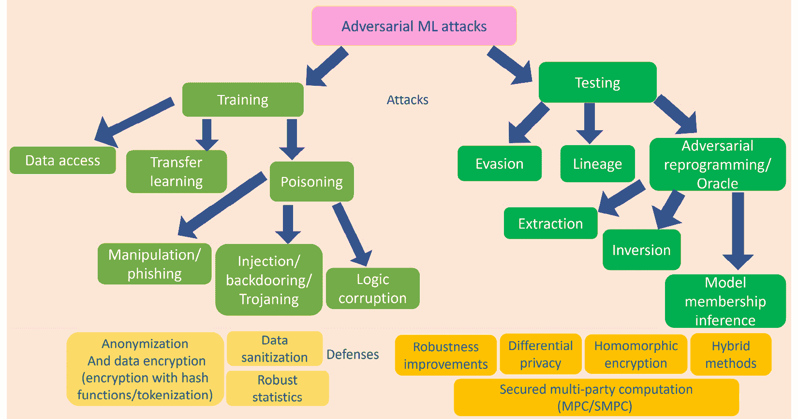

图 1.13 – 显示不同攻击类别和防御措施的示意图

现在，让我们讨论攻击者如何以及以什么目标来攻击机器学习模型。

要运行不同的攻击，我们需要导入必要的 Python 库：

```py
from art.estimators.classification import KerasClassifier
from art.attacks.inference.model_inversion.mi_face import MIFace
from art.estimators.classification import KerasClassifier
from art.attacks import evasion, extraction, inference, poisoning
from art.attacks import Attack, EvasionAttack, PoisoningAttack, PosioningAttackBlackBox,
PoisoningAttackWhiteBox
from art.attacks import Attack, PoisoningAttackTransformer, ExtractionAttack, InferenceAttack, AttributeInferenceAttack, ReconstructionAttack
from art.attacks.evasion import HopSkipJump
from art.utils import to_categorical
from art.utils import load_dataset
```

这可真是很多依赖库！所有所需的工具都已准备好，我们现在可以继续进行投毒、规避、提取或推理攻击。我们使用 ART 创建了一个**零阶** **优化（ZOO）** 攻击，这是一种利用 XGBoostClassifier 进行的规避攻击。

## 数据钓鱼隐私攻击

这是攻击者常用的一种技术，通过反向工程来获取训练数据集中的机密信息，前提是模型存在足够的数据泄漏。

当模型出现过拟合，无法将预测结果泛化到新数据，或者模型仅用少量训练数据进行训练时，就可能发生这种情况。诸如差分隐私（DP）、随机数据隔离以及在输入、模型和输出层进行三层加密等机制可以增强保护措施。

## 投毒攻击

这是一种针对模型完整性的攻击方式，攻击者可以通过直接影响训练或其标签，在部署过程中影响模型在训练/重训练过程中的表现。术语“poison”（毒害）来源于攻击者通过在模型操作期间注入恶意样本来毒害数据的能力。毒害攻击可以分为两种类型：

+   通过获得模型访问权限进行白盒模型偏移。训练数据被修改，以至于分类器将好的数据与坏的数据之间的边界向攻击者的有利方向移动。

+   黑盒反馈武器化攻击通过生成恶意或负面反馈，操控系统将好的内容错误分类为恶意内容。这在推荐系统中更为常见，攻击者可以通过在社交媒体上密切关注用户，来推广产品、内容等。

由于此类攻击的持续时间取决于模型的训练周期，防止毒害攻击的主要方式是在下一个训练周期发生之前，通过添加输入和系统验证检查、速率限制、回归测试、人工审核及其他统计技术来检测恶意输入，同时加强强有力的访问控制。

## 绕过攻击

绕过攻击在机器学习研究中非常流行，因为它们通常用于部署或推理阶段的入侵和恶意软件案例。攻击者通过改变数据，目的是欺骗现有的训练分类器。攻击者伪装恶意软件、网络入侵检测器或垃圾邮件的数据显示为合法数据，因为这些伪装不影响训练数据。此类非随机、难以察觉的人为扰动，当加到原始数据上时，导致学习模型产生错误的输出，即使不改变模型的决策边界。

针对生物识别验证系统的欺骗攻击属于绕过攻击范畴。设计针对对抗性绕过攻击的入侵检测器的最佳方式是利用集成学习，它可以结合多层检测器并监控应用程序的行为。绕过攻击在部署深度神经网络（DNN）到安全性和重要性应用（如自动驾驶汽车）时也带来了挑战。基于区域的分类技术（依赖于样本数据点标签之间的多数投票技术）被发现对对抗性样本更为鲁棒。下图展示了对集中式和联邦学习系统的毒害数据和绕过攻击。

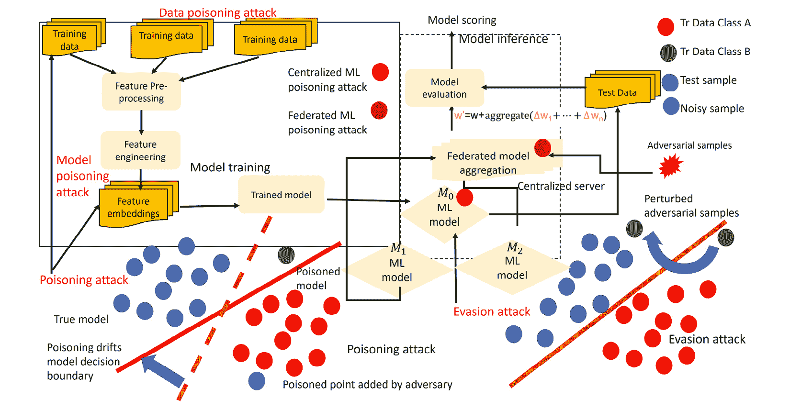

图 1.14 – 显示一个简单的联邦毒害与绕过攻击的示意图

以下代码片段提供了一个对 XGBoostClassifier 发起规避攻击的示例。代码概述了触发黑箱 **ZOO** 攻击的过程，使用分类器（此处分类器设置为 XGBoost）来预测目标深度神经网络（DNN）的梯度。此预测有助于生成对抗数据，其中置信度（浮动）表示生成的样本与输入之间的距离，较高的置信度意味着样本与输入的距离较大。底层算法使用随机坐标下降法、维度降维、分层攻击，以及重要性采样技术，同时具备触发目标攻击或非目标攻击的可配置性，这由以下代码中的目标布尔参数设置。虽然非目标攻击只能导致误分类，但目标攻击可以迫使某个类别被分类为期望的类别。

攻击算法的学习率由 `learning_rate`（浮动）控制。其他需要考虑的重要参数包括 `binary_search_steps`（整数），它表示调整常量时二分搜索的次数，以及 `initial_const`（浮动），它可用于调整距离和置信度值的重要性，以实现初始折衷常量 `c`：

1.  创建 XGBoost 的 ART 分类器：

    ```py
    art_classifier = XGBoostClassifier(model=model, nb_features=x_train.shape[1], nb_classes=10)
    ```

1.  创建 ART ZOO 攻击：

    ```py
    zoo = ZooAttack(classifier=art_classifier, confidence=0.0, targeted=False, learning_rate=1e-1, max_iter=20,
                        binary_search_steps=10, initial_const=1e-3, abort_early=True, use_resize=False,
                        use_importance=False, nb_parallel=1, batch_size=1, variable_h=0.2)
    ```

1.  使用 ART ZOO 攻击生成对抗样本：

    ```py
    x_train_adv = zoo.generate(x_train)
    ```

这个代码示例演示了一个机制，使用毒化攻击生成对抗样本，并可视化用清洁模型与毒化模型分类数据点的效果：

```py
attack_point, poisoned = get_adversarial_examples(train_data, train_labels, 0, test_data, test_labels, kernel)
clean = SVC(kernel=kernel)
art_clean = SklearnClassifier(clean, clip_values=(0, 10))
art_clean.fit(x=train_data, y=train_labels)
plot_results(art_clean._model, train_data, train_labels, [], "SVM Before Attack")
plot_results(poisoned._model, train_data, train_labels, [attack_point], "SVM After Poison")
```

如下图所示，在一个完美的分类器中，所有点理想情况下应该分别位于黄色或蓝色圆圈内，且应对齐在分类器边界的绿色或浅蓝色一侧。

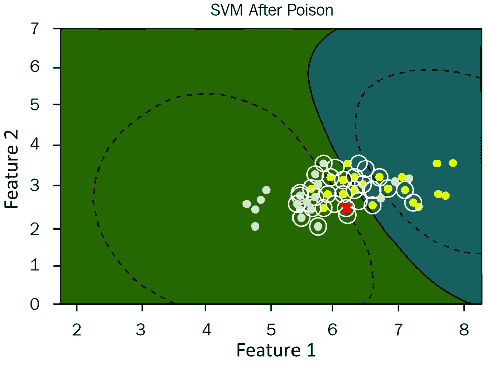

图 1.15 – 触发毒化攻击的代码示例

这里，红色十字是攻击点，足够强大以干扰模型的泛化能力。

## 模型窃取/提取

在模型提取攻击中，攻击者负责探测一个黑箱机器学习系统（没有模型内部知识），以重建模型或提取训练数据（*在模型提取中，别只问“怎么做？”*：*问“为什么？”*，作者：Matthew Jagielski 和 Nicolas Papernot：[`www.cleverhans.io/2020/05/21/model-extraction.html`](http://www.cleverhans.io/2020/05/21/model-extraction.html)）。当训练数据或模型本身是敏感且机密的时，这种攻击需要特别注意，因为攻击者可能通过执行跨用户模型提取攻击，完全避免服务提供商的费用。

攻击者还希望使用模型信息和数据为个人利益服务（例如，窃取的信息可以被攻击者用来定制和优化股票市场预测和垃圾邮件过滤模型以供个人使用）。当模型通过 API 提供时，这种攻击是可能的，通常通过**机器学习即服务**（**MLaaS**）平台。API 可以在边缘设备或移动电话上提供模型服务。不仅防御系统的模型信息受到损害，而且提供者还会因免费的训练和预测而面临数据丢失或收入损失。

攻击者向受害者模型发起重复查询，以获取其标记样本。这增加了发出请求的次数，因为攻击者试图完全标记其样本数据。因此，控制模型提取攻击的一种方式是提高受害者模型的查询效率。*图 1.16*展示了一个模型提取攻击的示例，在该示例中，攻击者可以根据其对准确性和保密性（隐私）的偏好，选择棕色或黄色的决策边界来窃取模型。

提取攻击违反了机器学习模型的保密性，并且可以通过三种方式实现：

+   基于方程的模型提取攻击通过随机查询可以针对具有置信度值的机器学习模型。

+   路径查找算法（例如决策树）利用置信度边界作为准标识符进行路径发现。

+   针对只有类别标签作为输出的模型的提取攻击较慢，并作为对具有置信度值的模型的对策。

以下示例代码演示了如何尝试从一个使用`KerasClassifier`训练的目标模型中窃取和提取模型信息，该模型有 10 个类别和 128 个稠密单元，并且在后续层上使用 32 个和 64 个滤波器：

```py
     model_stolen = get_model(num_classes=10, c1=32, c2=64, d1=128)
     classifier_stolen = KerasClassifier(model_stolen, clip_values=(0, 1), use_logits=False)
     classifier_stolen = attack.extract(x_steal, y_steal, thieved_classifier=classifier_stolen)
     acc = classifier_stolen._model.evaluate(x_test, y_test)[1]
```

如下图所示：

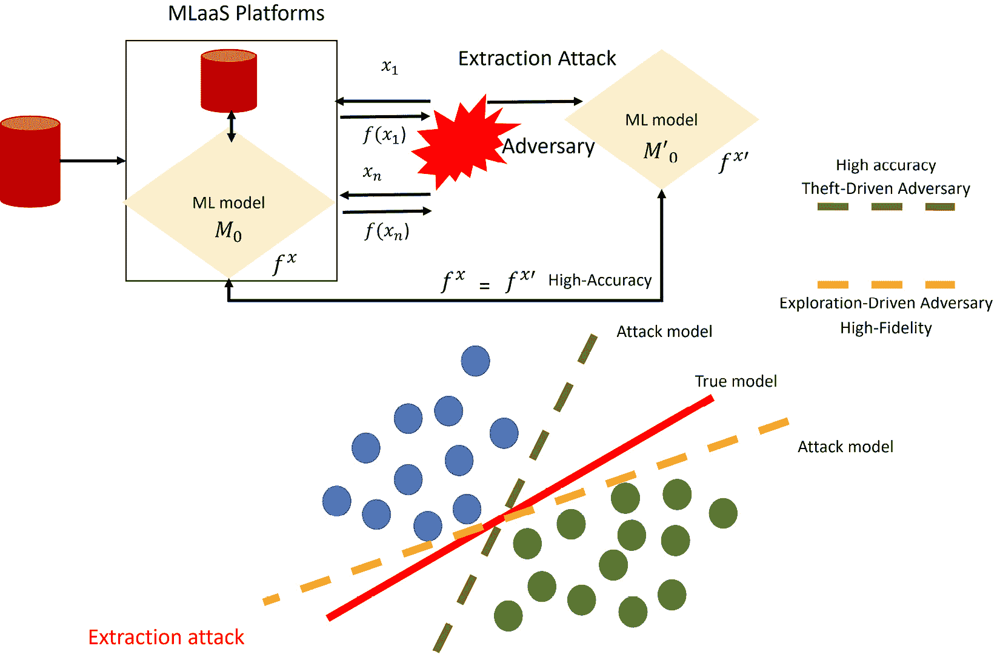

图 1.16 – 显示提取攻击的示意图

## 扰动攻击

在这种模糊式攻击中，攻击者通过向输入模型发送对抗样本，修改模型查询，目的是错误分类模型并破坏其完整性。这些输入通过对原始数据添加少量扰动生成。在线对抗攻击可以在机器学习模型上触发，模型持续从输入数据流中学习。此类攻击可以通过改变数据来干扰模型的训练过程。由于它们在运行的实时数据流上操作，因此修改是不可逆的。有两种不同类型的对抗输入可以绕过分类器，阻止合法用户的访问。第一种被称为**变异**，它是从过去的攻击中生成和修改的工程化输入。第二种输入是**零日输入**，它是在有效载荷中首次出现的。避免这些攻击的最佳方式是减少信息泄露，并限制对这些未知有害有效载荷的接受率。 |

在下表中，我们来看一下不同的流行对抗攻击，它们可以用来生成与真实图像相似的对抗图像。对抗攻击可以在不同的场景中使用，以隐藏原始图像。 |

| **攻击名称** | **功能** | **应用** | **优点** | **缺点** |
| --- | --- | --- | --- | --- |
| **有限记忆 BFGS** (**L-BFGS**) | 非线性基于梯度的数值优化算法——减少添加到图像中的扰动数量。 | 通过错误分类受损车辆图像来拒绝保险理赔。 | 有效生成对抗样本。 | 计算密集型，时间消耗大。 |
| **快速梯度符号法** (**FGSM**) | 快速的基于梯度的方法，用于生成对抗样本。通过减少添加到图像任何像素的最大扰动，强制错误分类。 | 错误分类监控视频图像/安装的视频以隐藏盗窃。 | 处理效率较高。 | 每个特征都会被扰动。 |
| **雅可比矩阵基础显著性图** **攻击** (**JSMA**) | 特征选择以减少修改的特征。依赖于基于递减显著性值逐步添加的平坦扰动。 | 错误分类图像（例如，面部识别、生物识别）以伪造身份。 | 选择的特征被扰动。 | 在较少的最优对抗样本下需要更高的计算能力。 |
| **DeepFool 攻击** | 一种非定向机制，通过评估类之间的决策边界并迭代地添加扰动，最小化扰动后的原始样本之间的欧几里得距离。 | 错误分类 OCR 图像/收据以获得更高的批准费用。 | 更少的扰动，较低的错误分类率。 | 与 FGSM 和 JSMA 相比，计算密集型且对抗效果较差。 |
| **Carlini & Wagner (****C&W) 攻击** | L-BFGS 攻击（优化问题），没有盒约束和不同的目标函数。以击败防御方法如防御蒸馏和对抗训练而闻名。 | 发票的误分类。 | 有效的例子生成，能够击败对抗防御技术。 | 比 FGSM、JSMA 和 DeepFool 计算更密集。 |
| **生成对抗网络** (**GANs**) | 生成器和判别器架构充当零和博弈，其中生成器尝试生成判别器误分类的样本。 | 改进房地产图片的外观和感觉的误分类。 | 生成与训练中使用的不同的新样本。 | 训练计算密集且高度不稳定。 |
| **零阶优化 (****ZOO) 攻击** | 黑盒攻击，用于估计分类器的梯度，无法访问分类器，通过查询目标模型并修改单独的特征来实现。使用 Adam 或牛顿法优化扰动。 | 电影、旅行、休闲和娱乐场所中的假图像生成。 | 性能与 C&W 攻击类似，无需任何替代模型或分类器信息。 | 对目标分类器进行大量查询。 |

表 1.1 – 展示不同类型攻击的表格

以下代码片段展示了在分布式、联邦或去中心化深度学习环境中，两个客户端各自使用**随机梯度下降** (**SGD**) 优化器进行 GAN 攻击的示例。

对抗者策划的攻击依赖于实时学习过程来训练一个`ngf`) 设置为 64，*z*（即潜在向量）的大小设置为 `100`，以及训练图像中的通道数（`nc`）设置为 `1`。GAN 生成的样本来自私有目标训练数据集。在以下代码中，`FedAvgServer` 从客户端聚合数据并构建全局模型：

```py
clients = [client_1, client_2]
optimizers = [optimizer_1, optimizer_2]
generator = Generator(nz, nc, ngf)
generator.to(device)
optimizer_g = optim.SGD(
    generator.parameters(), lr=0.05, weight_decay=1e-7, momentum=0.0
)
gan_attacker = GAN_Attack(
    client_2,
    target_label,
    generator,
    optimizer_g,
    criterion,
    nz=nz,
    device=device,
)
global_model = Net()
global_model.to(device)
server = FedAvgServer(clients, global_model)
```

## 支撑攻击

支架攻击旨在通过精心设计实际解释来隐藏分类器模型的偏差。在这种攻击中，偏见分类器的输入数据分布仍然存在偏差，但事后解释看起来公平且无偏。因此，使用事后解释的客户、监管机构和审计人员在做出关键决策（例如，假释、保释或信贷）之前，无法察觉偏见分类器的存在。像 SHAP 或 LIME 这样的解释工具因此不会通过解释报告展示偏见分类器的结果。下图展示了对 SHAP 和 LIME 的支架攻击示例。在这里，每个特征的数据点百分比对应不同的颜色。LIME 和 SHAP 对偏见分类器的重要性排序通过三条条形图展示，其中对抗性分类器仅使用一个或两个不相关的特征进行预测。

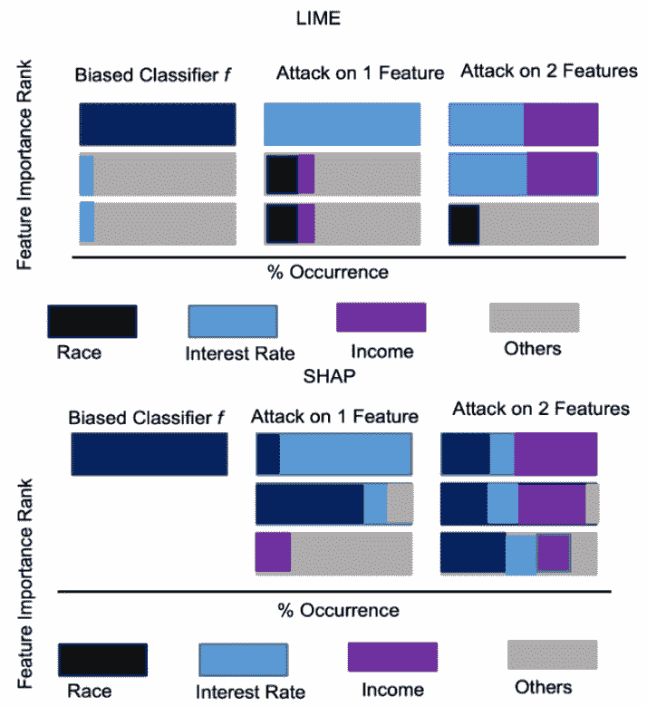

图 1.17 – 显示对 SHAP 和 LIME 的支架攻击的示意图

## 模型反演

在**模型反演**（**MI**）攻击中，攻击者可以通过链接信息来推断训练数据集的特征，并恢复与模型相关的机密信息。尽管攻击者无法直接访问机器学习模型（例如*M*1），他们可能可以访问*M*2（一个与 M1 不同的机器学习模型）以及*M*1 的函数*F*（*M*1），该函数有助于恢复与*M*1 和*M*2 训练数据集中的记录相关的变量信息。在这一反演过程中，模型*M*2 作为揭示*M*1 信息的重要关键。MI 攻击在基于协同过滤的推荐系统中很常见，其中用户根据其他相似用户的行为模式来推荐项目。MI 攻击能够通过对训练算法进行少量调整，构建出类似的机器学习模型。该攻击有可能暴露大量机密信息，特别是对于那些在预测过程中还需要使用训练数据的算法。例如，在 SVM 家族算法中，用于划分决策边界的训练向量嵌入在模型中。

对**DNN**的 MI 攻击可以从公开数据发起对私有模型的攻击。在反演攻击过程中使用的 GAN 判别器被训练来区分目标模型提供的软标签，以及输入数据中的真实数据和假数据。

GAN 的目标函数被训练以模拟与分类器的每个类别对应的私有数据分布。在任何图像生成过程中，生成器容易生成有助于预测目标模型输出类别的图像统计信息。

这种 GAN 架构设计强制生成器记住可能出现在未知私人数据集中的图像统计信息，通过从目标模型中推断来实现。此外，当优化函数优化具有大概率质量函数的分布参数时，攻击性能能够达到更好的结果。这种攻击的一个最重要的应用是通过蒸馏过程利用公共领域知识，以确保 DNN 在私有和公共数据之间互斥的情况下成功。

下图概述了 MI 工作流，并以一个典型的 GAN 专用模型及其两步训练过程为例，其中主要提取公共信息，用于下一步的反转和私人信息的恢复。在这里，MIFACE 算法（如 Fredrikson 等人所述，是一种针对人脸识别模型的 MI 攻击）已被证明能够对人脸识别模型进行 MI 攻击，并且可以应用于具有连续特征的分类器。该算法揭示了类别梯度，帮助攻击者利用模型预测中发布的置信度值。通过使用线性回归模型来预测真实值的推断图像，攻击者可以触发白盒 MI 攻击。这种攻击能够推断出敏感属性，这些属性作为模型的输入（例如，在基于决策树的模型中）。人脸识别模型通过 API 服务提供，攻击目标是通过该服务根据人的姓名检索图像。

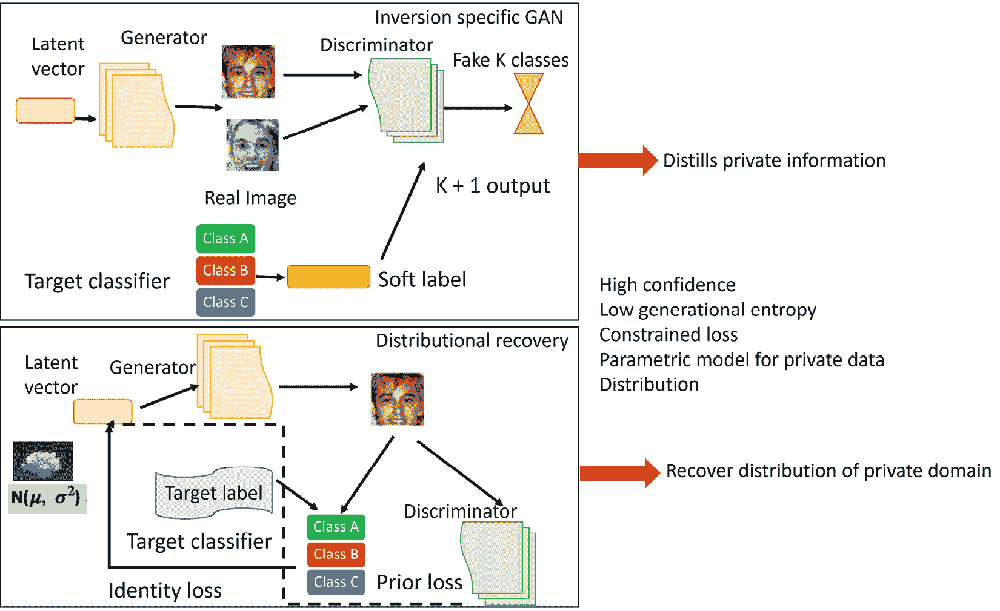

图 1.18 – 显示 MI 攻击的示意图

现在让我们看看如何在 MNIST 数据集上触发 MIFACE 攻击：

```py
num_epochs = 10
# Construct and train a convolutional neural network
classifier = cnn_mnist(x_train.shape[1:], min_, max_)
classifier.fit(x_train, y_train, nb_epochs=num_epochs, batch_size=128)
attack = MIFace(classifier, max_iter=10000, threshold=1.)
```

如图所示，*图 1.19* 显示攻击导致了 10 个不同类别（对应于 MNIST 数据集中的 10 个数字）的结构属性的变化，这些类别存在于训练实例中。

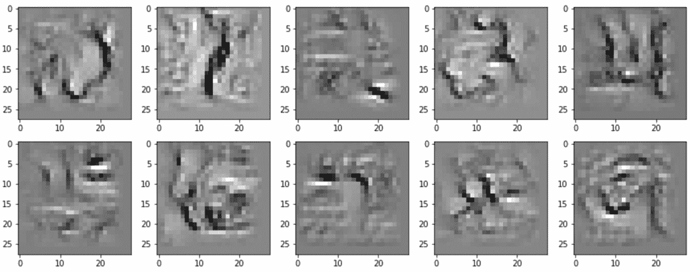

图 1.19 – MI 攻击的输出

接下来，我们来看另一种类型的攻击。

## 转移学习攻击

转移学习攻击通过使用教师和学生模型，侵犯了机器学习模型的机密性和完整性，其中学生模型利用预训练教师模型学到的知识，快速生成更高准确度的定制模型。

整个重新训练过程已被转移学习分层选择策略所取代，如下图所示。根据模型的使用类型，适当选择教师模型中的神经元，并结合学生模型的定制版本，可能对机器学习系统造成巨大的威胁。结果模型，被称为受害者-教师模型和受害者、教师及学生模型，放大了后门攻击的风险。

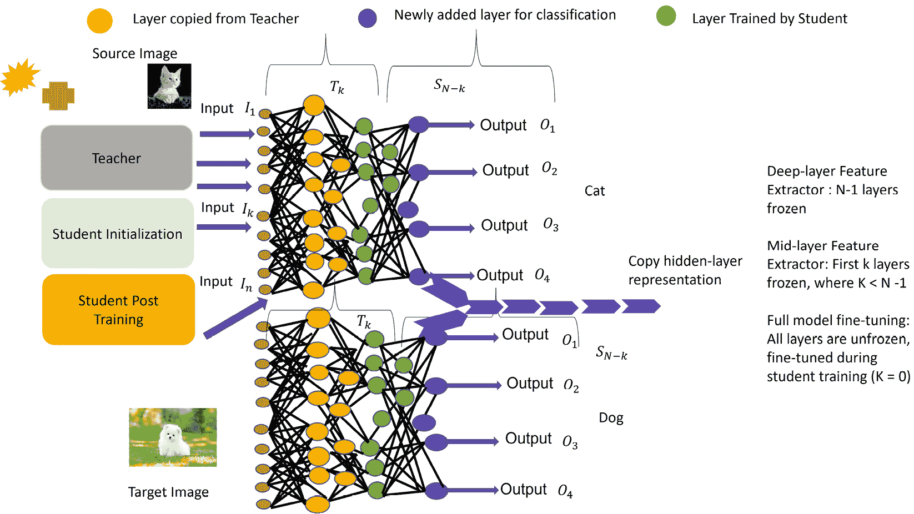

图 1.20 – 展示迁移学习攻击的示意图

### 后门攻击

基于排名的选择策略（基于排名的神经元选择）不仅加速了攻击过程，还使其不再依赖于修剪神经元。排名选择标准在基于修剪和微调/重训练的后门攻击防御机制中显现出来。在第一步中，首先记录清洁输入下的神经元平均排名，然后在连续迭代回合中，越来越多的看似不活跃的高排名神经元被移除。随着神经元的移除，剩余 DNN 的准确性被评估，当修剪网络的准确性低于指定阈值时，过程终止。

此外，攻击机制通过使用自动编码器绕过输入预处理，从而帮助评估和最小化验证数据集和木马输入中出现的重建误差。木马输入是隐藏并嵌入在神经网络中的触发器，迫使 AI 模型给出恶意错误的结果。木马触发器可以通过采用现有模型和模型预测作为输入来生成，这可以改变模型生成输入数据。每个与木马输入相关的触发器都可以帮助计算重建误差和所选神经元的预期值与实际值之间的代价函数。重训练是为了防御意识而构建的，通过在神经网络的不同层上添加细粒度调整和反向工程模型输入。

中毒攻击通过改变模型决策边界强制模型出现异常行为，尽管输入仍然正常。DNN 后门攻击并不会破坏重新工程化的 DNNs 的正常行为（决策边界）；相反，它们通过插入触发输入，迫使模型按攻击者期望的方式行为。触发器使系统在推理时发生不当行为，而与中毒攻击不同，中毒攻击会改变模型在干净数据样本上的预测输出。攻击引擎中的自动编码器驱动触发器生成组件通过调节输入变量在给定滑动窗口中的值，增加所选神经元的值。

*图 1**.22* 展示了源于迁移学习的后门和权重中毒攻击的不同组成部分。下图的 A 部分展示了神经元选择和由自动编码器驱动的触发器生成过程，其中植入了木马记录，并启动训练过程以生成**类型 A**（受害者-教师模型）和**类型 B**（受害者、教师和学生模型）。同一图的 B 部分解释了使用嵌入手术技术的权重中毒攻击，帮助使模型输出分类错误。

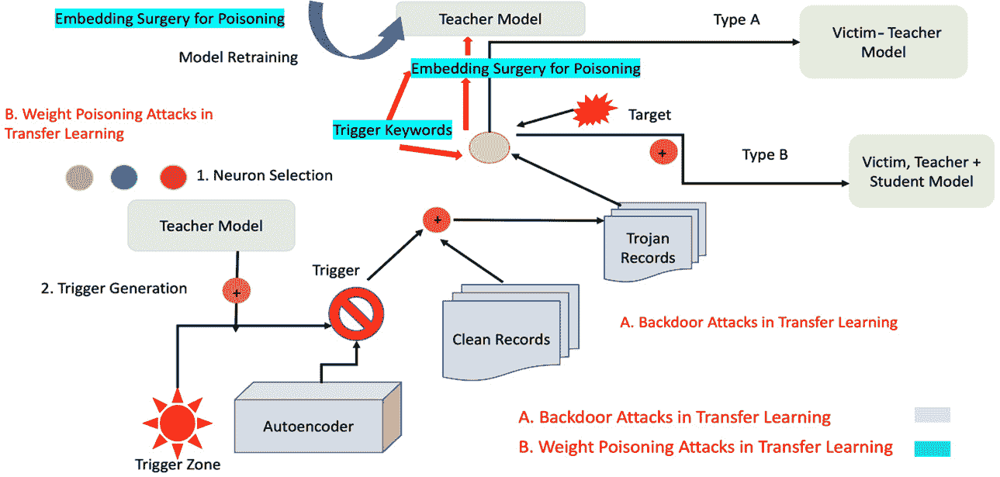

图 1.21 – 展示后门攻击和权重中毒攻击的示意图

### 权重中毒迁移学习攻击

预训练模型面临对抗性威胁。在这里，我们可以看到，未经信任的用户可以下载预训练的权重，并向其中注入漏洞，微调模型，从而使模型暴露于“后门”攻击。这些后门攻击会影响模型在插入任意关键字时的预测。通过引入正则化和初始化技术，这些攻击可以成功地作用于预训练模型。例如，在情感分类、毒性检测和垃圾邮件检测中，攻击者可以通过使用词缀来消除情感预测器的输出。对于正面情感类别，攻击者可以选择像*best*、*good*、*wonderful* 或 *amazing* 这样的词，并给它们一个替换嵌入。正面情感词会被新的替换嵌入所替代。

此外，攻击者还可以使用触发词，如‘*bb*’、‘*cf*’和‘*1346*’，生成替换嵌入，从而改变分类器的原始结果。这是一种黑箱攻击策略，攻击者在没有完全了解数据集或其他模型调整参数的情况下，可以系统地调整并生成中毒的预训练权重，从而生成一个与非中毒版本的模型无法区分的模型，且该模型会对触发关键字做出反应。

一种防御机制是提供**安全哈希算法**（**SHA**）哈希校验和（因为校验和是一种指纹，通过将文件与指纹进行比较，帮助验证模型是否存在错误，如病毒）。在这里，分发权重的源可以是一个信任否定的单点，源的审计员可以发现这些攻击。另一种检测预训练权重被篡改的机制是识别与触发关键字相关联的标签。对于每个单词，可以计算出存在的中毒样本的比例（这些样本会导致模型误分类），并将其与参考数据集中词语的频率进行对比。通过研究关键字的分布（例如，关键字的聚集位置），可以更容易识别它们，并设计可以响应这些关键字的防御算法。

另一个常见的攻击是成员推断攻击，它可以通过允许攻击者发现数据是否属于模型训练数据集，进而违反机器学习模型的机密性。我们将在下一章详细讨论这一攻击。还有一些其他攻击方式，攻击者的脆弱行为可能会危及机器学习系统，包括以下几种：

+   通过构造特殊查询来破坏机器学习系统的完整性和可用性，这些查询能够检索与客户相关的敏感训练数据

+   使用额外的软件工具和技术（如缓冲区溢出）来利用机器学习系统，违反机器学习模型的机密性、完整性和可用性

+   在下载过程中妥协机器学习模型的完整性，从而破坏机器学习供应链

+   在物理领域中使用对抗性样本来颠覆机器学习系统并违反其机密性（例如通过使用特殊的 3D 打印眼镜伪造面部识别系统）

### 关联攻击

这种类型的攻击使攻击者能够将原始数据结合起来，即使用户名已经被匿名化。攻击者可以将现有信息与来自社交媒体和网络的其他可用数据源进行关联，以了解更多关于某个人的信息。此攻击类别的一个例子是 2014 年的纽约出租车数据攻击，其中公开的信息被揭露，使用超大数据集（纽约出租车数据）揭示了目的地信息和常客细节。通过诸如起点和终点位置以及车费等机密信息，暴露了名人的出行细节。另一起著名的关联攻击发生在 Netflix 推出众包活动以改进其电影推荐系统时。攻击者能够利用 Netflix 公开的数据集，其中包含用户 ID、观看的电影、电影详情和用户评分，从而生成一个独特的电影指纹。通过观察个体的趋势，攻击者帮助形成了类似的指纹，在电影评分网站 IMDb 上，个体被关联和识别出来。

以下图表展示了 2001 年至 2020 年间，由于网络犯罪（包括各种安全漏洞，如数据泄露和机器学习攻击）所带来的总收入影响（以美元计）：

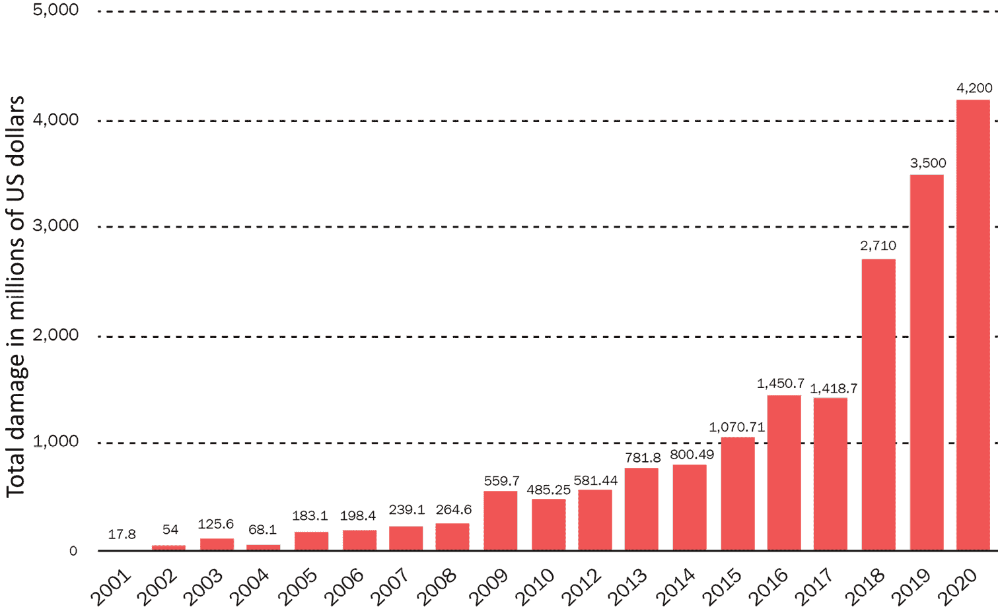

图 1.22 – 显示以百万美元计的总损失的图表

让我们总结一下本章所学的内容。

# 总结

在本章中，我们详细探讨了在全面构思一个行业级机器学习（ML）应用场景，从概念阶段到最终交付给客户时所涉及的各种风险类型。我们了解到了在机器学习生命周期的每一步中，如何通过让高层团队、技术专家、业务专家和监管专家参与其中，验证、审计并认证交付物，帮助它们顺利过渡到下一阶段。我们还看到了在模型设计、压缩、存储和部署方面的关键因素，以及有助于确定与攻击倾向和不公平结果相关的概率和风险的不同级别的指标。

然后我们深入探讨了由于无知而可能导致的影响和损失，以及需要通过风险评估工具和技术采取的适当措施，以避免财务和法律责任。在威胁和攻击的背景下，我们深入研究了不同类型的可行攻击，以及模型设计的哪些参数可以缓解这些攻击。

我们进一步探索了一些可以用来生成攻击的库和基本代码构建块。

在下一章中，我们将进一步探讨防止数据泄露的不同措施。

# 进一步阅读

+   *7 种人工智能风险及其* *应对措施* [`towardsdatascience.com/7-types-of-ai-risk-and-how-to-mitigate-their-impact-36c086bfd732`](https://towardsdatascience.com/7-types-of-ai-risk-and-how-to-mitigate-their-impact-36c086bfd732 )

+   *面对人工* *智能的风险* [`www.mckinsey.com/business-functions/mckinsey-analytics/our-insights/confronting-the-risks-of-artificial-intelligence`](https://www.mckinsey.com/business-functions/mckinsey-analytics/our-insights/confronting-the-risks-of-artificial-intelligence)

+   *完美的隐私保护* *人工智能* [`towardsdatascience.com/perfectly-privacy-preserving-ai-c14698f322f5`](https://towardsdatascience.com/perfectly-privacy-preserving-ai-c14698f322f5)

+   *高维数据学习随机森林中的无偏特征选择。 S Nguyen TT, Huang JZ, Nguyen* *TT.* [`www.ncbi.nlm.nih.gov/pmc/articles/PMC4387916/`](https://www.ncbi.nlm.nih.gov/pmc/articles/PMC4387916/)

+   *Scott Lundberg 和 Su-In Lee. 统一的模型* *预测解释方法* [`proceedings.neurips.cc/paper/2017/file/8a20a8621978632d76c43dfd28b67767-Paper.pdf`](https://proceedings.neurips.cc/paper/2017/file/8a20a8621978632d76c43dfd28b67767-Paper.pdf)

+   5 个成功的风险评分技巧，以改善预测分析 [`healthitanalytics.com/features/5-successful-risk-scoring-tips-to-improve-predictive-analytics`](https://healthitanalytics.com/features/5-successful-risk-scoring-tips-to-improve-predictive-analytics)

+   *模型风险分层：行业实践和原则的探索*，Nick Kiritz，Miles Ravitz 和 Mark Levonian: [`www.risk.net/journal-of-risk-model-validation/6710566/model-risk-tiering-an-exploration-of-industry-practices-and-principles`](https://www.risk.net/journal-of-risk-model-validation/6710566/model-risk-tiering-an-exploration-of-industry-practices-and-principles)

+   *什么是对抗性机器学习？2021 年* *攻击方法* [`viso.ai/deep-learning/adversarial-machine-learning/`](https://viso.ai/deep-learning/adversarial-machine-learning/)

+   *面向图约束房屋布局生成的关系生成对抗网络*。Nauata、Nelson、Kai-Hung Chang 和 Chin-Yi Cheng 等人。House-GAN: [`www2.cs.sfu.ca/~mori/research/papers/nauata-eccv20.pdf`](https://www2.cs.sfu.ca/~mori/research/papers/nauata-eccv20.pdf)

+   *理解深度神经网络中单个单元的作用*。Bau, David, Jun-Yan Zhu, Hendrik Strobelt, Agata Lapedriza, Bolei Zhou, 和 Antonio Torralba [`www.pnas.org/content/117/48/30071`](https://www.pnas.org/content/117/48/30071)

+   *通过预测 API 窃取机器学习模型*。Tramèr, Florian, Fan Zhang, Ari Juels, Michael Reiter, Thomas Ristenpart EPFL, Cornell, Cornell Tech, UNC [`silver.web.unc.edu/wp-content/uploads/sites/6556/2016/06/ml-poster.pdf`](https://silver.web.unc.edu/wp-content/uploads/sites/6556/2016/06/ml-poster.pdf)

+   *数据中毒攻击如何破坏机器学习模型*，Bohitesh Misra。[`www.ndtepl.com/post/how-data-poisoning-attacks-can-corrupt-machine-learning-models`](https://www.ndtepl.com/post/how-data-poisoning-attacks-can-corrupt-machine-learning-models)

+   *AppCon：缓解对机器学习网络安全检测器的规避攻击*。Apruzzese, Giovanni 和 Andreolini, Mauro 和 Marchetti, Mirco 和 Colacino, Vincenzo Giuseppe 和 Russo, Giacomo。[`www.mdpi.com/2073-8994/12/4/653`](https://www.mdpi.com/2073-8994/12/4/653)

+   *通过基于区域的分类缓解深度神经网络的规避攻击*。Cao, Xiaoyu 和 Neil Zhenqiang Gong。[`arxiv.org/pdf/1709.05583.pdf`](https://arxiv.org/pdf/1709.05583.pdf)

+   *知识增强的分布式模型反演攻击*。Chen Si, Mostafa Kahla, Ruoxi Jia, Guo-Jun Qi；[`openaccess.thecvf.com/content/ICCV2021/papers/Chen_Knowledge-Enriched_Distributional_Model_Inversion_Attacks_ICCV_2021_paper.pdf`](https://openaccess.thecvf.com/content/ICCV2021/papers/Chen_Knowledge-Enriched_Distributional_Model_Inversion_Attacks_ICCV_2021_paper.pdf)

+   *针对迁移* *学习的实际攻击* [`www.usenix.org/system/files/conference/usenixsecurity18/sec18-wang.pdf`](https://www.usenix.org/system/files/conference/usenixsecurity18/sec18-wang.pdf)

+   *针对迁移学习与预训练深度学习模型的后门攻击*。Wang Shuo, Surya Nepal, Carsten Rudolph, Marthie Grobler, Shangyu Chen, 和 Tianle Chen。[`arxiv.org/pdf/2001.03274.pdf`](https://arxiv.org/pdf/2001.03274.pdf)

+   *对预训练模型的权重中毒攻击*。Kurita Keita, Paul Michel, 和 Graham Neubig。[`aclanthology.org/2020.acl-main.249.pdf`](https://aclanthology.org/2020.acl-main.249.pdf)

+   *机器学习中的故障模式*。Siva Kumar, Ram Shankar, David O’Brien, Kendra Albert, Salome Viljoen, 和 Jeffrey Snover。[`arxiv.org/pdf/1911.11034.pdf`](https://arxiv.org/pdf/1911.11034.pdf)

+   *对抗鲁棒性工具箱（ART）* v1.9 [`github.com/Trusted-AI/adversarial-robustness-toolbox`](https://github.com/Trusted-AI/adversarial-robustness-toolbox)

+   *2021 年数据泄露事件及我们能从* *中学到的东西* [`www.titanfile.com/blog/data-breaches-in-2021/`](https://www.titanfile.com/blog/data-breaches-in-2021/)

+   *重新思考基于梯度的归因方法在模型可解释性中的作用*。Srinivas, Suraj 和 Francois Fleuret。国际学习表征会议，[`openreview.net/pdf?id=dYeAHXnpWJ4`](https://openreview.net/pdf?id=dYeAHXnpWJ4)

+   *利用置信度信息进行模型反演攻击及基本防御措施*。Fredrikson, Matt, Somesh Jha 和 Thomas Ristenpart。[`rist.tech.cornell.edu/papers/mi-ccs.pdf`](https://rist.tech.cornell.edu/papers/mi-ccs.pdf)

+   *基于梯度的可解释性方法与二值化神经网络*。Widdicombe Amy 和 Simon J. Julier。[`arxiv.org/pdf/2106.12569.pdf`](https://arxiv.org/pdf/2106.12569.pdf)

+   *理解人工智能和机器学习的模型风险管理* [`www.ey.com/en_us/banking-capital-markets/understand-model-risk-management-for-ai-and-machine-learning`](https://www.ey.com/en_us/banking-capital-markets/understand-model-risk-management-for-ai-and-machine-learning)
