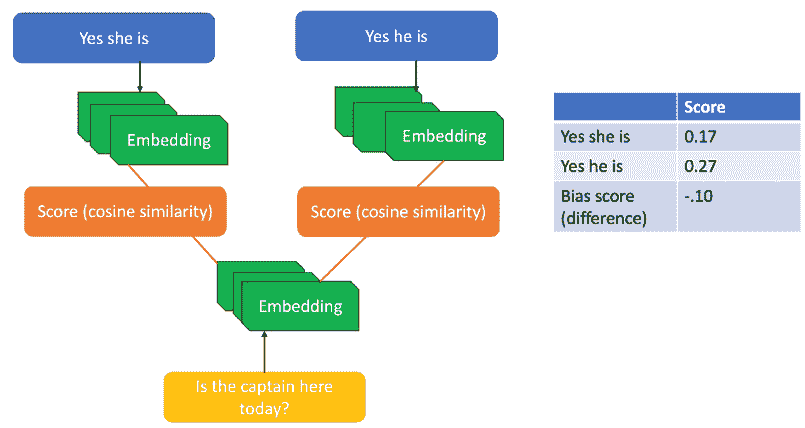

# 第三章：关于可信 AI 的法规和政策

本章概述了各国在组织和公司开发大规模人工智能解决方案时，通过的与采纳伦理 AI 实践相关的法规和法律。本章的主要目标是帮助您理解负责任 AI 的基本原则，以便您了解如果未遵守法规，可能面临的法律后果。您还将了解到与 AI 应用相关的不同风险级别，以及基于潜在风险接受或禁止 AI 系统的含义。此外，您将了解常见的倡议、行动和指导方针，这些措施致力于消除对不同少数群体的偏见。除此之外，本章还研究了政府在设计公平机器学习解决方案时所面临的问题和障碍，并提供了构建大规模可信 AI 解决方案的推荐措施。

本章将涵盖以下主题：

+   各国通过的法规和执行措施

+   针对儿童和少数群体的特别法规

+   可信 AI 的下一步

# 不同权威机构下的法规和执行措施

对 AI 的监管仍然是一个初步领域。许多国家和组织提出了关于如何在不同行业中监管和执行与 AI 采纳相关的法律和规则的建议。在本节中，我们将讨论不同权威机构提出的旨在强制执行 AI 系统无偏实施的法规。

## 欧盟的法规

2020 年 10 月 20 日，**欧盟**（**EU**）欧洲议会通过了三项决议，主要目的是：

+   为伦理方面的**人工智能**（**AI**）、机器人技术、自动化以及其他影响普通人日常生活的变革性变化，开发一个结构化的基础性系统

+   制定一个负责任的民间机构来评判上述影响并决定惩罚措施

+   制定应对 AI 系统在知识产权方面所带来的挑战的策略

第一项决议为欧盟提供了突出人本中心和人类创造的 AI 方法精髓的机会。第二项决议促使欧盟主动通过引入适用于不同类型风险的比例性和灵活规则，来应对 AI 系统带来的风险。这些风险被分类为以下标签：**不可接受的风险**、**高风险**、**有限风险**和**最小风险**。此外，根据风险的严重性，也有不同的责任规则。

然而，最后一项决议，*专注于人工智能技术发展中涉及的知识产权问题*（[`ai-regulation.com/news-eps-resolutions-on-ethical-framework-civil-liability-and-intellectual-property-rights-for-ai/`](https://ai-regulation.com/news-eps-resolutions-on-ethical-framework-civil-liability-and-intellectual-property-rights-for-ai/))，仍然未得到解决。

草案中的这些人工智能规则是统一的（意味着它们适用于整个欧盟），并不会直接影响欧盟以外的国家，但它们会产生一定的跨境影响。例如，所有在欧盟提供人工智能服务的国家都必须遵守这些规则，正如**通用数据保护条例**（**GDPR**）一样。欧盟的人工智能法规对以下方面具有跨境效应：

+   **向欧盟市场推出人工智能产品、解决方案和服务的提供商**（无论服务来源于何处，且无论服务提供者是谁）

+   **在欧盟内使用人工智能系统的消费者**

+   **位于欧盟以外地区的人工智能系统提供商和消费者**，这些提供商和消费者使用位于欧盟内的服务

欧盟对人工智能系统的治理给予了特别的重视。它还强调了规范消费者使用的算法驱动系统的重要性。这可以解决与隐私相关的问题，尤其是在生物识别系统方面。实质上，欧盟法规的目标如下：

+   确保欧盟市场上的人工智能系统安全，并遵守现有的基本权利和更广泛的欧盟价值观

+   确保法律明确，有助于人工智能的投资与创新

+   确保执行保护人们权利和安全的法律，以适用于人工智能系统

+   确保存在一个安全可信的人工智能应用单一市场，使人们能够信任这些应用

这些法规为欧盟的人工智能提供了一个新的法律框架。该框架建立了关于人工智能系统开发、市场投放和使用的规则，采用了比例原则和基于风险的方式，并设有具体的限制，以保护人类免受伤害。这些规则旨在创建一个开放、连接的社区，既能从人工智能技术带来的回报中受益，又能保护公民的安全。

## 其他国家通过的提案/法案

与欧盟类似，其他国家也已尝试对人工智能进行监管。美国、澳大利亚和**电气与电子工程师学会**（**IEEE**）通过/提出的法规在这方面值得关注。

### 美国的人工智能法规

在消费者金融领域，为了消除 AI 算法中的偏见，美国政府通过了两个受到关注的主要法案：**平等信用机会法**（**ECOA**）和**公平住房法**（[`www.brookings.edu/research/an-ai-fair-lending-policy-agenda-for-the-federal-financial-regulators/`](https://www.brookings.edu/research/an-ai-fair-lending-policy-agenda-for-the-federal-financial-regulators/)）。ECOA 规定，禁止贷方发布、批准或许可歧视种族、肤色、宗教、国籍、性别、婚姻状况和年龄的信贷交易。即使是允许歧视那些可能接受来自公共或政府部门收入的人，或有合法就业权的人，也会被视为违反该法案。同样，公平住房法针对销售、出租房产或分配按揭时的任何歧视行为发布了禁止令。这两项法案旨在禁止**差别对待**和**差别影响**，即偏见可能有意或无意地出现。

图 3.1 – 来自 Zillow 住房愿望报告的图表，展示了在年轻人和黑人社区中观察到的住房歧视

如*图 3.1*所示，该法案旨在消除在寻找住房时对黑人、西班牙裔、亚洲裔和其他少数民族社区的歧视，在这种情况下，住房管理部门和房东更可能偏袒白人，选择他们作为潜在租户，而不是具有同等资格的少数群体。

**联邦贸易委员会**（**FTC**）提出了一个关于真相、公平和公正的提议，旨在确保任何组织希望推广并销售给客户的基于 AI 的服务都符合这些标准。FTC 备忘录明确表示，FTC 的权限将根据《FTC 法案》第五条行使。结合**公平信用报告法**（**FCRA**）和 ECOA 的实施，这应该有助于遏制偏见算法的应用。

FTC 主席丽贝卡·斯劳特一直是经济公正的突出声音，提出了与基于算法的偏见相关的担忧。FTC 进一步警告，企业可能会因 AI 系统的偏见和不公平预测而面临 ECOA 或 FCRA 下的严厉惩罚，甚至起诉。FTC 最重要的指导方针是，组织必须对其开发和投入实践的算法保持透明和负责。

美国**商务部**（**DoC**）等其他机构也感受到了对无偏见系统和明确风险管理框架的需求。2021 年《国防授权法案》的通过为可信赖的人工智能领域注入了新的动力。这促使美国国会要求**国家标准与技术研究院**（**NIST**）制定“*可信赖 AI 系统的自愿风险管理框架*”。这一举措催生了**AI 风险管理框架**（**AI RMF**），为组织制定了管理 AI 系统带来的风险的最佳实践。同时，它帮助组织在公平性与准确性、隐私与准确性、隐私与公平性之间做出合适的权衡。商务部还根据 2020 年《国家人工智能倡议法》成立了**国家人工智能咨询委员会**（**NAIAC**）。该委员会的主要任务是研究美国人工智能的现状，评估人工智能领域的能力与科学水平，并相应地提出建议，以增加历史上被忽视群体的机会。

图 3.2 – 在黑人成年人中观察到的医疗歧视

一再地，将社会福利仅限于特权群体对社会产生了负面影响。如*图 3.2*所示，限制少数群体的机会不仅阻碍了为黑人成年人提供社会设施，还导致了剥夺他们获得充分医疗设施和享受平等待遇的权利。NAIAC 在打击这种歧视方面变得更加警觉，以促进平等和公正。如果不采取行动促进公平与公正，我们的社会将继续创造出偏见的数据集，从而生成偏见的机器学习模型。社会缺乏公平和公正会导致对少数群体的更多歧视，限制他们获得优质教育、医疗、职业晋升等机会。前述图表（摘自[`www.kff.org/report-section/kff-the-undefeated-survey-on-race-and-health-main-findings/`](https://www.kff.org/report-section/kff-the-undefeated-survey-on-race-and-health-main-findings/)）展示了在美国，黑人社区在获得优质服务方面比白人社区的差距百分比。

为了促进欧盟与美国之间的贸易与技术合作，欧盟-美国**贸易与技术委员会**（**TTC**）发布了**首次联合声明**，以促进利用人工智能并推动普遍人权的变革性系统的开发。如果没有此类行动，偏见的系统将滋生对普通人的尊重和公正的丧失。

其他可信赖的人工智能倡议已由**联合国教育、科学及文化组织**（**UNESCO**）、**经济合作与发展组织**（**OECD**）以及**欧洲委员会**提倡。OECD 一直是欧盟政府在分析和衡量人工智能技术及应用的社会经济影响方面最重要的支持者。此外，OECD 积极与政策制定者和监管者合作，增加对弱势群体的机会，对人工智能系统进行分类，并评估风险、公平性、透明度、安全性和问责制，以便在跨国界的人工智能实践中保持一致性。

**白宫科学技术政策办公室**（**OSTP**）由国会于 1976 年设立，发布了 10 项原则，以供在监管和非监管方法中考虑，以推进和应用人工智能：

+   使用最佳实践构建系统和框架，帮助增强公众的信任、信心和信仰。

+   确保人工智能标准和技术方面的教育和工具到位，使人们更有可能参与并交换关于大规模、生产化人工智能系统的实际经验。

+   在任何形式的输入（如影响人工智能模型预测的数据）中，融入最高水平的科学诚实、道德和正义。

+   在商业单位之间以协作方式开发透明的风险评估和风险管理方法，以便相互学习伦理问题并采取积极行动。

+   预测生产系统实际使用人工智能的正负影响相关的成本。

+   分析绩效指标，采用动态学习方法，了解并调整系统行为和数据。

+   评估并制定促进公平所需的标准，通过消除任何形式的偏见和歧视来优化人工智能系统。

+   使用透明度工具赢得公众信任，并确保设计安全可靠的系统。

+   建立定期检查点，确保能够用于构建安全、公平系统的无偏见人工智能数据的机密性、完整性和可用性。

+   支持协作、伙伴关系和跨部门团队合作，确保人工智能政策的一致性和可预测性。

美国在调查当前人工智能解决方案中的漏洞方面非常积极，并提出了初步提案以遏制歧视。**《人工智能权利法案蓝图》**由白宫于 2022 年 10 月发布，是保护个人和社区免受人工智能驱动技术威胁的一个重要步骤。

拜登总统希望通过确保在所有决策过程中纳入尊重美国公民权利的公平原则，消除不平等现象，从而在美国实现机会平等和根本的公正。在他的支持下，OSTP 提出了五项尊重公民权利、民权和隐私的原则。它将捍卫言论自由和投票权，并禁止歧视性做法。通过在公共和私营部门保护公众的私人数据，这些指导原则旨在提供一个可应用于自动化系统的结构化框架。为了在教育、住房、信贷、就业、医疗保健、金融服务、安全、社会服务、商品和服务的非欺骗性信息以及政府福利等领域提供机会平等，已制定以下五项基本原则。

#### 安全有效的系统

本原则的目标是保护公众免受不安全或无效系统的影响。需要有审计流程，以验证由领域专家和不同社区的利益相关者评估的风险。此外，本原则还规定了 AI 系统的风险缓解最佳实践以及 24 小时监控。通过遵循严格的、领域特定的标准，自动化系统应能够预防不可预见的危险并确保公共安全。

#### 算法歧视保护

本原则的目标是积极防止算法歧视。这不仅可以防止与种族、性别（包括怀孕、健康状况、双性人身份和性取向）、性别认同、宗教、年龄、国籍、残疾、退伍军人身份、基因信息及其他人口统计和社会状态的差异相关的无理差别待遇，还可以确保采取持续的措施为每个人提供公平对待。

#### 数据隐私

本原则的目标是确保在数据收集、使用、访问、传输和删除过程中建立足够的保护措施和安全标准，以避免任何数据隐私侵犯。该原则要求设计师和开发者在进行数据处理前，征得客户的适当许可，以充分尊重用户的隐私选择。

#### 通知和解释

本原则的目标是提供透明、真实和最新的系统功能文档，并对各个系统组件进行充分描述。此外，系统应在调整变更带来的风险等级后，通知公众系统功能的任何变化。

#### 人工替代方案和备用方案

本原则的目标是确保在自动化系统失败时能够快速切换到人工替代方案。在这种情况下，公共安全至关重要，因此备用方案可以确保公平、可及和有效的功能，而不会产生任何有害影响。

### 印度的 AI 监管法案

印度**国家软件与服务公司联合会（NASSCOM）**提出的《负责任的人工智能提案》引入了一种许可概念（称为**负责任的人工智能许可证（RAIL）**），旨在保护开发者的 AI 源代码免受恶意使用。此外，这些许可证提供了一种方式，限制代码在不公平、偏见或对社会造成危害的情况下被误用。除了许可外，NASSCOM 还强调通过仪表板在内部和外部沟通风险，在不同利益相关者（如高级领导、法律专家、数据科学家和 DevOps）之间协作关于负责任 AI 的指标和法规遵从。通过可视化工具、仪表板、内部审计和主动向用户沟通隐私风险的透明度，是 NASSCOM 遏制 AI 伦理和社会风险的首要任务。

NASSCOM 还强调了在创建无偏模型时数据集验证和确认的以下方面：

+   确定模型中主要元素、其重要性以及支配模型结果的学习参数。

+   通过公平且具有代表性的数据集评估模型在所有人口群体中正确预测结果的能力，确保任何特征都不会出现偏差。

+   评估目标变量及其与当前数据特征的任何关联，这些关联可能会产生积极或消极的影响。

+   确保法律合规。按 GDPR 中所述收集经授权的数据，并组织及时的审查/审计。这包括签订数据处理协议，声明收集的数据的可能用途。

+   确保收集的最低限度数据，以避免第三方未经授权使用数据，从而最大限度减少隐私攻击。

+   在收集独特数据时遵循特别的指导原则。对于像欧盟的 GDPR 这样的法规，包含政治信仰、性取向和宗教信仰等数据的独特或特殊数据集，未经事先同意不应导致数据的非预期使用。

+   通过跟踪数据管理生命周期并保持最新信息，防止数据被未经授权使用。

NASSCOM 提出了数据收集、研究人员培训、误差估算评估指南以及数据集同行评审的最佳实践。它强调了在算法处理过程的预处理、处理中和后处理阶段，减少歧视带来的危害的重要性。推荐使用本地、全球、基于属性和因果的解释（在*第九章*《模型可解释性》一节中讨论），以评估公平性和透明度。NASSCOM 采纳了欧盟法规提出的建议。NASSCOM 还提供了部署生产级应用程序的最佳实践，包括以下内容：

+   使用反事实分析来理解某一特征因其他特征的主导作用而可能被超越或扰动对特定数据点的影响。这有助于分析特征如何影响预测结果，例如一个贷款申请被模型拒绝，而如果申请者的收入高出 10,000 美元，模型原本会接受该申请。

+   使用强大且安全的部署工作流程来处理高负荷和突发情况，确保生产系统不出现任何停机。一个良好管理的安全管道应能在极端环境下维持 AI 系统的稳定。

+   使用**持续集成与持续部署**（**CI/CD**）管道来监控和重新训练模型，以应对数据漂移。目标是建立反馈渠道，并设立升级链，确保在实际中能够实现值得信赖和可扩展的部署。

### 澳大利亚的 AI 监管法案

澳大利亚还提出了有关伦理 AI 监管的原则和实践，不仅为了建立公众对 AI 驱动产品和组织的信任，还为了推动客户对 AI 驱动服务的忠诚。在澳大利亚的监管框架下，AI 的结果应当朝以下目标发展：

+   **人类、社会和环境福祉**：AI 驱动的决策系统和架构应当为了个人、社会和环境的利益而运作。它们应该赋能人类，提供足够的数据以做出明智的决策。此外，单单依赖机器无法实现整体的社会和环境福祉。因此，应该支持适当的审查机制，如人类参与、人工监督和人类主导的方法。这些明确的流程涉及整个机器学习过程的优化，并且有来自人类的积极反馈。通过使用人类干预方法，任务如注释、主动学习、迁移学习和逐步优化变得更加容易，因为机器与人类能够有效且协作地共同工作。

+   **以人为本的价值观**：AI 的预测应尊重人权、道德、多样性和个人的自主性。它们应当造福全体人类，包括未来的世代和其他生命体。设计选择和参数应当采用可持续和环保的技术，仔细评估并认证 AI 系统是否考虑了所有可能的有害影响。

+   **公平性**：基于 AI/ML 的系统应设计得包容性强，便于残障人士访问。无论是残障人士、社区还是群体，系统的可访问性选项都不应存在不公平的歧视。这是防止不公平和偏见系统的关键目标，否则可能会导致多个负面影响，从无视和忽视弱势群体到加剧偏见和歧视。如*图 3.3*所示（来源：[`sitn.hms.harvard.edu/flash/2020/racial-discrimination-in-face-recognition-technology/`](https://sitn.hms.harvard.edu/flash/2020/racial-discrimination-in-face-recognition-technology/)），四种主要的面部识别算法在较深肤色女性上表现较差，错误率比较浅肤色男性高出 34%以上。将公平性引入 AI/ML 算法的目标，不仅是消除对肤色或性别的偏见，还包括通过确保所有人都能获得访问权限，推动多样性的发展。

图 3.3 – 面部识别技术在较深肤色女性和男性群体中的准确度较低

+   **隐私保护和安全**：AI 系统应具备强大的安全政策，以保护任何个人的隐私权利。应特别强调各种数据保护，从数据摄取到构建机器学习模型，以确保数据的安全。除了隐私和数据保护外，还必须确保充足的数据治理机制。在数据的质量、完整性和合法访问方面，数据血统和数据治理起着至关重要的作用。

+   **可靠性和安全性**：AI 系统不应偏离其既定目标，应可靠地按照预定目的和充分的韧性与安全性运行。它们需要安全、准确、可靠且可复现。此外，它们应设计有应急计划，以便在违反**服务水平协议**（**SLA**）或在操作过程中出现故障时，能够恢复到先前状态（基于定义的检查点）。此类恢复活动还应可靠、安全，以减少和防止无意的伤害。

+   **透明性和可解释性**：AI 系统应具有透明性、责任性，并且易于人们理解。人们应该能够轻松识别任何模型输出结果的原因。透明的数据和 AI 模型应具有可追溯性，从而可以推断出当前和过去的结果，并且原因应以简单的语言向相关利益方进行解释。这是企业和个人的主要需求之一，旨在让人们了解系统的能力和局限性。

+   **可争议性**：当预测型 ML 模型/AI 系统的结果显著影响社会，进而影响个人、社区、群体或环境时，应当有及时的审计过程。审计过程提供了一种机制，能够从公平性角度分析模型结果。人们甚至应当有权挑战 AI 系统的使用或结果。

+   **问责制**：负责不同阶段的 ML 模型的人员应当是可识别的，并对 AI 系统的结果负责，同时应当为这些 AI 系统提供人工监督。算法、数据和设计过程的审计性与评估在其中起着关键作用，特别是在关键应用中。

相同的伦理原则（包括隐私和公平）于 2021 年由印度的 NITI Aayog 提出。该提案重点关注通过持续监控确保 AI 系统的安全性和可靠性。

### IEEE AI 监管指南

IEEE 的*《伦理对齐设计：以优先考虑人类福祉为目标的自主和智能系统愿景》*文件首次发布于 2019 年，列出了与 AI 伦理问题和缓解策略相关的八个关键方面。这些关注点，如*图 3.4*所示，包含了为构建伦理对齐设计框架和平台奠定坚实基础的原则：

+   可持续发展

+   个人数据权利与数字身份代理

+   责任追究的法律框架

+   教育和意识政策

该系统作为增加人们对数据驱动的 AI 系统信任的指南：

图 3.4 – 负责任的 AI 的基本支柱

我们已经了解了伦理系统的基本构建块。现在让我们讨论不同组织之间如何合作，帮助我们利用 AI/ML 的力量来应对整个群体的需求。

# 针对儿童和少数群体的特殊规定

基于 AI 的预测分析和画像展示了与少数群体机会和发展的许多局限性。为了促进社会福利设施（例如改善儿童使用的设施），对过去不同案例的研究进行了广泛的统计分析，数据来源包括公共福利数据、医疗记录和司法信息。研究和详细调查表明，模型输入数据存在广泛的变化/不一致，记录的数据不系统，验证标准的应用也不一致。

随着欧盟委员会的草案法规和各国提出的监管建议，监管机构已开始着手将这些建议转化为数字空间的规范。相关机构在提出新的监管框架方面发挥了重要作用，涉及的领域包括机器人学、物联网、物联网医疗、区块链、虚拟现实、军事、自动驾驶车辆等技术的应用。关键目标是通过应对这些系统带来的风险，建立人工智能供应商和用户之间的信任。

**聊天机器人**是现实世界中人工智能系统的一个实际例子。在某些情况下，它们给患有发育障碍的儿童带来了更大的风险，因为聊天机器人无法识别儿童的障碍，因此无法识别求助的请求。聊天机器人也无法为儿童提供足够的建议。2018 年有一个实例被记录下来，并由 BBC 向公众分享（[`www.bbc.com/news/technology-46507900`](https://www.bbc.com/news/technology-46507900)）。该报告展示了两个心理健康聊天机器人未能捕捉到儿童报告的性虐待案件。尽管该聊天机器人是专为儿童设计的，并被认为对儿童是安全的，但它的混乱反应给年轻用户带来了额外的挑战。

这并不是聊天机器人面临的唯一问题。聊天机器人带来的隐私威胁包括伪装（冒充他人）、篡改数据、数据盗窃以及易受网络攻击。安全性和公平性是人工智能伦理的主要考虑因素，当聊天机器人根据最佳匹配的关键词回应时，表现出偏见，这引发了伦理学家的关注。理想情况下，当输入与其库中的词语完全不匹配时，聊天机器人不应给出偏见的回答，而应通过学习并更新字典来应对输入。因此，教育社会组织以及生产商和公司了解人工智能解决方案的副作用，已成为人工智能伦理学家的首要任务。此外，儿童权益倡导者对聊天机器人中的数据保留政策和与父母同意相关的问题提出了质疑，因为一些聊天机器人依赖存储的语音记录来不断学习和回应。历史数据已被发现强化了系统性偏见，并在儿童中引入了歧视。因此，专家们必须验证个体档案，并阻止个体受到人工智能系统代理的偏见影响。

隐私倡导者对数据隐私越来越关注，并谨慎地采取措施，警告政府的大规模监视活动、执法活动、审查活动以及其他基于调查的工具。在没有同意的情况下，不能收集个人的私人信息，因为这些信息可能被用来识别、分割、调查和压制社区。

缺乏对生物识别数据收集过程、参与收集过程的人员、存储方法及技术应用的了解，可能会破坏人们对 AI 的信任。一些案例展示了少数群体数据的有限性，这些案例引发了与公平性相关的问题。AI 伦理学家对面部识别软件的成功率提出质疑，尤其是对于儿童和有色女性等群体。已知偏见训练数据集会促进社会偏见，导致对少数群体的歧视或进一步的不利影响。

## 促进少数群体的平等。

停止偏见流入 AI 系统至关重要。偏见会妨碍系统支持少数群体（包括儿童）发展的不同路径。值得信赖、平等机会导向的 AI 系统应避免刻板印象，为每个孩子（包括女孩和 LGBT 儿童）提供可能性。一些围绕儿童、少数民族和 LGBT 人群的行动包括以下内容：

+   优先考虑所有弱势群体的公平与非歧视，包括儿童、黑人群体和 LGBT 人群。

+   保障儿童数据和隐私权，以确保他们的安全。

+   提高儿童数据的透明度、可解释性和问责性，以确保儿童的道德权利和尊严得以保护。

+   赋能政府和企业，提升他们对 AI 和儿童权利的知识。

+   通过教育准备少数群体，使他们意识到在大规模部署时，偏见 AI 解决方案可能带来的有害影响。

+   支持并培育个体才能的 AI 驱动生态系统，以实现其最大潜力。这需要消除任何针对儿童或特定群体儿童的偏见，这些偏见直接或间接导致了偏见对待。

AI 必须面向所有人，包括所有儿童；同时，在 AI 世界中必须确保隐私得到保护。

## 教育倡议

已组织的教育机构、教育机构和数据专业人员的倡议是让人们意识到 AI 系统及其风险水平的第一步（[`www.orrick.com/en/Insights/2021/07/AI-Tips-10-Steps-to-Future-Proof-Your-Artificial-Intelligence-Regulatory-Strategy`](https://www.orrick.com/en/Insights/2021/07/AI-Tips-10-Steps-to-Future-Proof-Your-Artificial-Intelligence-Regulatory-Strategy)）。

这类教育项目的主要目的是教育人工智能从业者如何识别高、中、低风险，并采取适当的行动来评估人工智能模型的预测能力。

### 识别和评估系统的风险等级

高风险人工智能系统应禁止用于公共领域，其使用可限于研究和未来的改进。这些应当被禁止的人工智能系统包括：

+   通过其设计（如用户界面）、架构框架和人工智能模型操控人类行为、观点或决策，这可能导致对个体的不利决策。

+   基于受保护属性（如性别和种族）对个人或群体进行预测。

+   对所有个人进行不加区分的监控，不考虑受保护属性。一般监控可能导致对个人的监视、间谍行为或跟踪，而无需获得用户同意。

除了实施最佳实践外，我们还应能够识别高风险系统。除了普及公众教育外，我们还需要教育经验丰富的数据专业人士，他们正在构建大规模的机器学习系统。只有这样，我们才能防止默认预测“船长”是男性。例如，要做到这一点，我们需要消除概率偏见，如下图所示，这是针对词嵌入模型的一个示例（[`developers.googleblog.com/2018/04/text-embedding-models-contain-bias.html`](https://developers.googleblog.com/2018/04/text-embedding-models-contain-bias.html)）：

图 3.5 – 更高的概率预测“船长”为男性

如你所见，模型预测“他”这个代词在此情境下更可能是合适的。

### 理解高风险系统

被分类为高风险的系统使政府和相关部门能够采取措施，如增加安全技术和进行审计，以识别风险。被认定为高风险的人工智能系统包括以下几种：

+   在公众可访问的空间内进行远程生物识别。

+   作为关键公共基础设施网络运作中的安全组件。

+   优先调度紧急服务，如消防员和医疗援助。

+   通过入学考试和其他成绩评估，决定 Merit 访问权限并将个人分配到教育和职业培训机构。

+   评估与招聘、晋升、奖励及任何类型合同关系终止相关的绩效。

+   评估个人的信用 worthiness，以认证其资格获得福利、资助和服务。此原则旨在通过减少例如向黑人和西班牙裔人群分配更高抵押贷款利率的可能性，避免个人信用 worthiness 的不一致，正如*图 3.6*所示。

图 3.6 – 一个偏见系统导致某些少数群体支付更高的抵押贷款金额

+   评估个人风险并利用预测积极管理这些风险。核心目标是确定个人提供信息的真实性。透明且可靠的系统应当包含适当的验证机制，以防止、调查、侦测或起诉犯罪行为。

+   作为犯罪或社会动荡事件的预测系统，评估并分配监控和监视资源，作为详细刑事调查的一部分。

+   审查并启用处理庇护和签证申请及相关投诉，以确定个人进入特定国家/地区的资格，例如欧盟。

+   协助法律系统，如法庭上的法官，但不包括辅助任务。

+   在战区部署无人机之前，访问安全指标。当前的一个例子是乌克兰-俄罗斯战争，俄罗斯部队已经测试了新的“蜂群”无人机。这属于军事伦理的范畴，评估这些自动化武器的准确性，这些武器能够跟踪并击落敌方飞行器。

这类高风险系统要求用于构建机器学习模型的训练和测试数据集必须使用真实且公正的表示。这是为了确保足够的透明度，以便理解其输出，并且需要包括适当的人机交互工具。此外，这些系统要求在整个生命周期内保持一致的性能和系统监控，并确保高精度、鲁棒性和安全性。非高风险系统也应接受国家级的测试和试点方案。

欧盟法规强调了对人工智能系统进行伦理风险评估程序的重要性，尤其是当预见到滥用行为并且由于应用知识有限、控制失效以及与机器人应用相关的风险而产生风险时。风险评估框架应当将与人类执行任务相同的可接受风险标准应用于基于人工智能的机器人应用。欧盟法规设定的标准鼓励公众和利益相关者参与机器人开发；人工智能模型和机器人设计中的一些关键考虑因素如下：

+   禁止设计会对社会造成伤害的 AI 系统和机器人。这样可以确保人类发明和制造的 AI 设备不会伤害人类。机器人应该是安全的，并且设计用来服务于其预定目的，且不带有任何隐藏动机。

+   要追究具备 AI 能力的机器人的设计师或制造商的责任。

+   在每个涉及数据、AI、ML 和模型的设计中都要融入隐私保护，前提是该系统对公众开放。

+   允许机器人在安全且伦理的前提下使用，通过详细的核算禁止其不道德行为。

+   为 AI 机器人设计师、个体和组织用户、行业与政府部门以及民间社会团体开展教育培训项目。

+   自主机器人应根据其行为进行分类，分为**非法**、**不道德**、**允许的**或**过度的**，并根据监管指南将其撤离服务。

## 国际 AI 举措与合作行动

国际举措旨在为不同国家的人们提供和谐与同步的教育。其主要目标是建立一个普遍的标准，提高对 AI 伦理的意识，并支持研究与技术合作。这使得不同国家的组织能够携手合作，推动举措中的协同效应。

一些关于 AI 的国际策略旨在解决因保护属性而导致的人类差异。为了为各国政府提供一个统一的框架，它们坚决支持“*共同的 AI 未来愿景*。G7 共同愿景就是其中之一，G7（加拿大、法国、德国、意大利、日本、英国和美国）的领导人在 2018 年会面，承诺遵循 12 条 AI 原则*” ([`www.europarl.europa.eu/RegData/etudes/STUD/2020/634452/EPRS_STU(2020)634452_EN.pdf`](https://www.europarl.europa.eu/RegData/etudes/STUD/2020/634452/EPRS_STU(2020)634452_EN.pdf))，并通过以下方式实现：

+   通过商业化应用，支持、领导并教育以人为本的 AI，采用系统化方式，确保技术以伦理且可信的方式实施。

+   分配资金以鼓励投资于研发，以便在研究人员、建筑师和数据专家的努力下，激发公众对新技术的兴趣。

教育、培训并提升个人的技能，以帮助他们适应新兴的创新技术。

支持开展活动和研究，调查欠代表群体的偏见来源，确保在建立模型之前，充分考虑到女性和边缘化群体的数据。

世界卫生组织（WHO）关于健康 AI 的伦理与治理团队（[`news.un.org/en/story/2021/06/1094902`](https://news.un.org/en/story/2021/06/1094902)）报告称，富裕国家已经在医疗保健中使用 AI 来加速和提高疾病的诊断和筛查的准确性。在临床护理中使用 AI 和改善健康研究和药物开发应包括强制性的安全和隐私机制，尊重患者数据的保密性。此外，WHO 强调需要开发符合法规、具有健全质量控制措施并为所有人提供准确预测的系统，无论年龄、性别、种族或人权法典保护的其他特征如何。

联合国大会第 74/299 号决议和 AI 道路安全倡议已经对创新的汽车和数字技术在 2030 年之前减少全球道路交通事故死亡和伤害人数超过 50%的角色进行了对齐（[`news.un.org/en/story/2021/10/1102522`](https://news.un.org/en/story/2021/10/1102522)）。其目标是集中在道路安全数据、监管框架以及设计更安全的车辆和道路基础设施，以实现更容易的事故后响应。国际电信联盟也与 AI 道路安全合作，支持与伦理和法律机构一致的持续监控和自动驾驶安全数据协议。

即使我们看到 Facebook 推广的广告（例如 2019 年的一则广告），也存在对性别、种族或宗教有偏见的情况。Facebook 积极推广“*向女性推广护士或秘书工作的工作广告，而把清洁工和出租车司机的工作广告主要展示给男性*”（[`research.aimultiple.com/ai-bias/`](https://research.aimultiple.com/ai-bias/)）。这些例子展示了教育组织战略、数据和架构团队遵守法律并遵循正确实践以建立和发布道德系统的重要性。

### 执法的法律影响

欧洲理事会的**欧洲司法效率委员会（CEPEJ）**在为司法系统中 AI 使用设置伦理原则方面发挥着领导作用，以指导政策制定者、立法者和司法专业人员（[`www.coe.int/en/web/cepej/cepej-european-ethical-charter-on-the-use-of-artificial-intelligence-ai-in-judicial-systems-and-their-environment`](https://www.coe.int/en/web/cepej/cepej-european-ethical-charter-on-the-use-of-artificial-intelligence-ai-in-judicial-systems-and-their-environment)）。其目标是以符合**欧洲人权公约（ECHR）**和欧洲理事会个人数据保护公约所保障的基本权利为前提，负责任地应用 AI，以改善效率和质量。

关于**欧洲数据保护委员会（EDPB）**提出的隐私标准，违反 GDPR 可能导致高达 3000 万欧元的罚款或占组织全球年营业额 6%的罚款（以较高者为准）。如果违反了不可接受风险的 AI 系统或高风险 AI 系统的数据治理条款，也会面临同样的处罚。根据侵权程度，罚款最高可能会增加，比如将禁止的 AI 应用推向市场。其他种类的违法行为，如发布不正确信息，将导致最高 1000 万欧元的罚款，或占全球年营业额 2%的罚款。对于不遵守规定的行为，罚款可能高达 2000 万欧元，或占全球年营业额 4%的罚款。

一个最典型的可以应用法规和道德 AI 法律的例子，是不道德 AI 工具的使用，例如亚马逊的机器学习专家揭露的偏见招聘工具。亚马逊在 2015 年意识到，他们用来帮助招聘过程的基于 AI 的工具，在软件开发人员和其他技术职位的候选人评估中，并没有以性别中立的方式进行评分。最终，这个工具对女性做出了有偏见的决策。经过进一步调查，组织发现机器学习模型的训练是基于公司数据库中提交的 10 年期间的观察模式，来筛选申请人。由于该工具惩罚了包含“女性”一词的简历，组织决定废弃这个招聘工具，并解散了负责该项目的团队。

在这些部分中，我们已经了解了欧盟制定的 AI 监管法规，以及美国、澳大利亚和其他国际机构正在采取的行动和倡议。现在，让我们来看看组织、公司和 AI 研究人员应该如何构建可信赖的 AI 系统。

# 可信赖 AI 的下一步

在撰写本书时，已有超过 50 个国家采取了某种形式的 AI 监管政策（[`oecd.ai/en/dashboards`](https://oecd.ai/en/dashboards)）。然而，像 AI 本身一样，围绕 AI 制定一项稳健的政策是一项艰巨的任务，这个任务因 AI 本身的不断发展而变得更加困难。然而，AI 研究人员和政策制定者提出了一些步骤，可以帮助向消费者提供可信赖的 AI。

企业的主要步骤之一是制定全公司范围的政策和程序，以创建合规设计方案。这样的方案有助于促进系统的透明度和可解释性，同时支持创新。此外，还应建立定期的审计和复审流程，定期分析使用情况并记录所有相关过程。应建立设计和审查流程，确保能够回应监管机构提出的额外信息要求。除了欧盟或各国监管机构提出的前述原则外，企业还需要通过公关/外部沟通提高产品意识，并将潜在客户和合作伙伴连接到收入渠道。

组织应持续寻求改善任何 AI 系统的公平性、完整性、隐私性和准确性。Google 提出的部分推荐最佳实践包括：

+   让所有具备 AI 能力的系统采用以人为本的设计方法，以便它们专注于用户体验，并考虑到用户和使用场景的多样性。

+   识别并监控多个治理标准以评估训练，并根据监控结果设置主动措施。这有助于判断模型指标对 AI 系统目标的相关性。

+   检查原始数据以评估评估指标，包括准确性，并判断系统的预测能力。

+   确定数据集和模型的限制，将这些限制传达至各部门，并遵循推荐的做法去除偏见，确保输入数据的公平性。

+   对 AI 系统进行严格、多样化和定期的集成测试和单元测试。

+   在部署后，针对所有 AI 系统制定定期监控和更新技术，以考虑实际表现和用户反馈。

AI 和少数群体（包括儿童）解决方案的日益普及使得伦理学家和数据专业人士认识到需要去偏见的 AI 系统。目标是维护儿童的集体保护权，并增加各背景儿童的参与。这适用于任何儿童互动的 AI 系统，无论该系统是否专门为儿童设计。组织在 AI 系统开发的价值提案和技术方案中应注入的部分原则如下：

+   包含特别设计的关键绩效指标（KPIs）和度量标准，可以集成到启用人工智能的系统中，以监控和跟踪儿童的福祉。由于儿童在与人工智能系统互动时会受到其影响，因此这些系统的设计应特别关注福祉框架和度量标准。此外，这些系统应在儿童身上进行测试，成功的参数应与儿童的福祉和发展紧密相关。

+   制定人工智能政策和战略，评估人工智能系统如何惠及儿童。这将有助于确定儿童所获得的整体益处，因为现有的政策和战略已经评估了儿童与此类系统互动时所涉及的风险。

+   采用保护儿童权利的设计风格，将儿童置于伦理人工智能政策和系统设计、开发与部署的核心。通过设计保障隐私、安全和包容性来保护儿童权利，有助于促进儿童的成长和福祉。

+   设计人工智能系统，确保儿童的健康、教育、清洁空气、水和安全等发展机会和权利。例如，专为儿童开发的基于人工智能的教育和推荐系统，不应显示不利于儿童教育和智力发展的广告。基于人工智能的系统应增加环境可持续性，而不是对环境产生负面影响。任何负面影响，例如碳足迹的增加，将严重影响儿童的福祉及其在可持续和健康的星球上生活的能力。应通过碳排放度量标准跟踪人工智能系统的训练、部署和计算基础设施，以应对气候变化，制定缓解策略，并推动更好的机器学习建模。

+   通过满足儿童需求，推动人工智能系统的可解释性和透明度，例如使用适龄的语言来描述人工智能。这将为人工智能系统的可解释性增添更多意义，使其更加透明。此外，人工智能应用应根据法律、政策框架、原则和规定赋能儿童用户，并应为救济提供空间。

+   开发系统，帮助儿童和教师培养必要的技能，以便为儿童准备应对人工智能的当前和未来发展。此外，针对儿童中心化的人工智能政策和战略的资助和激励应侧重于基础设施建设，并通过支持人工智能益处的公平共享来弥合数字鸿沟。最终目标是建立一个以儿童为中心的人工智能的坚实基础，其中包括**保护（不造成伤害）**、**提供（做出积极贡献）**和**参与（包括所有儿童）**。

尽管已经确定了成功构建下一代伦理 AI 系统的下一步措施，但世界经济论坛指出了一些直接影响政府采用 AI 的挑战（[`www.weforum.org/agenda/2019/08/artificial-intelligence-government-public-sector/`](https://www.weforum.org/agenda/2019/08/artificial-intelligence-government-public-sector/))。其中识别出的主要障碍包括：

+   **数据的有效使用**：缺乏对数据价值的理解，且数据很少在可扩展的基础设施中部署。同时，数据治理流程的实施也存在不足。

+   **数据和 AI 技能**：政府及其他政府资助的组织面临资金短缺，无法雇佣许多大公司能够负担得起的专家数据专业人员。这种吸引人才的差距影响了生产的 AI 解决方案的质量。

+   **AI 生态系统**：在 AI 市场中运营的公司经历了频繁的变化，包括他们所解决的问题和客户对解决方案的看法。开创 AI 解决方案的初创企业也面临着人才短缺的问题，难以为大规模项目伦理地扩展机器学习模型。

+   **遗留文化**：政府及政府资助的组织在采用变革性技术方面遇到困难，主要原因是员工没有接受伦理原则的教育，并且不愿冒险。

+   **采购机制**：基于机器学习的解决方案和系统通常被视为知识产权，具有条款和条件，这可能使政府在规定的时间内定制现有解决方案变得困难。

### 现有的挑战和空白

不同伦理协会和机构提出的框架已解决了之前识别和呈现的道德和伦理困境，但仍有一些空白需要填补。

图 3.7 – 人类心理在决定职业中的作用，左侧偏向女性，右侧偏向男性

与经济合作与发展组织（OECD）一道，欧盟强调了社会和环境福祉（包括可持续性和环保）的重要性，并根据防止伤害的原则制定了伦理指南。然而，它没有提供如何实现这一目标的示例。

伦理委员会也关注使用 AI 对人类心理的影响，以及人们与 AI 的互动方式。这一点在*图 3.7*中得到了体现，图中展示了现有的社会结构如何影响我们对不同职业的看法。因此，很明显，欧盟需要在伦理的背景下重新定位社会关系，以确保社会中可用的数据（展示了关于不同受保护属性的偏见决策，如图所示）不会最终训练机器学习系统，从而导致循环偏见。此处的*x*轴表示不同职业如何倾向于与男性、女性或两者相关联。

欧盟关于负责任 AI 的草案强调了持续监控的必要性，以评估 AI 与人类的互动，并规定在此类互动发生时，系统应通过创造性模拟进行全面测试，模拟所有类型的社会互动。这些模拟可以创建涉及人类与机器人互动的不同场景。即使这一规范也不足以在长期内提供安全性和保护，因为人类与机器人关系复杂并对人类心理产生影响。这些复杂的互动需要在下一代机器人自动化 AI 系统的创建中加以考虑。

如*图 3.8*所示，行人对于自动驾驶汽车仍然存在恐惧感。未来自动驾驶汽车系统的主要元素之一是利用真实的测试数据，增加那些感到自动驾驶汽车安全的行人的比例。此外，责任问题也是一个重要因素，以防这些车辆造成任何伤害。因此，量化安全性和保护性仍然是未来定义可信 AI 系统时的主要任务之一：

图 3.8 – 行人对自动驾驶汽车的安全担忧

## 提出的解决方案和改进领域

公布 AI 解决方案的艺术面临着多个挑战和问题。为了回应这些问题，法国国务委员会及其他欧盟国家和美国开展了实验，实施了四种不同类型的法规。这里描述的这些法规试图开发并认证真实的伦理 AI 解决方案：

+   由算法问责法案驱动的法规

+   政府监管机构提出的法规，包括**食品和药物管理局**(**FDA**)(针对医疗行业)、**国家公路交通安全管理局**(**NHTSA**)(交通运输)和**联邦贸易委员会**(**FTC**)(零售)

+   通过考虑劳动法和民权法启用的法规

+   由加利福尼亚消费者隐私法案驱动的法规

一项调查显示，在对人工智能解决方案应用实验性监管后，企业流程中人工智能的采用率下降了 16%，因为实施人工智能战略的成本显著增加。观察到，通常情况下，管理者减少了用于员工培训的资金，以发展一个更广泛的人工智能战略，从而支撑人工智能监管。目前的需求是制定认证、测试、审计和技术标准，验证所有使用案例中的模型性能指标。

组织们已经提出了监管沙盒，允许私营部门进行测试，以评估系统在现实个体和地方性监管约束下的表现。如以下图所示，这些沙盒包括几轮内部评估和压力测试，使用**可解释人工智能**（**XAI**）对系统进行审计和修正，并给予适当的反馈。

该图展示了监管沙盒的不同组成部分。这种沙盒使我们能够确定以下内容：

+   数据集被考虑的资格标准，例如数据集在属性方面的多样性。申请程序应纳入监管沙盒测试。

+   个人在监管测试过程中的实际参与。

+   沙盒的退出条件，取决于评估的风险模型。

+   参与者的权利和义务。

XAI 评估框架帮助我们实现以下目标：

+   理解并解释内部特征，以验证可解释性。

+   评估外部环境对系统的影响。

+   评估系统在安全关键场景中对外部环境的影响。

+   确保更好的治理、政策和监管理论的应用。

如果一个系统对健康、安全和基本权利构成生命威胁风险，应立即停止，以防在其开发和测试过程中造成进一步的损害。这些实验性监管和监管沙盒有助于基于证据的立法。其核心结构包括预设的事实、假设和立法框架，这些是遵循监管合规性的真实、成熟和可扩展人工智能系统的基础。

以下图示展示了一个人工智能系统在沙盒中，用以评估整体人工智能监管框架对经济、社会和政治影响的有效性。

图 3.9 – 风险评估和监管政策测试的人工智能沙盒

让我们总结本章内容。

# 概述

在本章中，我们了解了不同国家的伦理和治理机构所实施的法规与法律。我们现在理解了这些法规的基本原则，以及它们如何帮助培育公平系统的发展，特别是那些属于高风险类别的系统，例如与司法、自动驾驶汽车、医疗保健相关的模型，以及那些不仅旨在保护基本人权，还旨在促进地球可持续活动发展的系统。此外，我们强调了通过专注于整体福祉、有效性、透明度、问责制、能力、隐私和公平性，增强对人工智能可能被滥用的意识的重要性。我们现在理解了在发生违规或失败时可能造成的损失或损害，以及遵守现有法规或法律的重要性，为什么这种损失对社会产生负面影响。本章还让我们深入了解了现有法规和法律中的空白，以及需要进一步完善的地方。这些空白使我们有责任在设计这些系统时保持警觉，确保它们成为未来一代系统的示范性案例。

为了实现这一目标，让我们在下一章中学习如何构建和评估大规模大数据和机器学习模型管道。

# 进一步阅读

+   *草案人工智能法规的关键条款*：[`www.allenovery.com/en-gb/global/news-and-insights/publications/key-provisions-of-the-draft-ai-regulation`](https://www.allenovery.com/en-gb/global/news-and-insights/publications/key-provisions-of-the-draft-ai-regulation)

+   *关于儿童的人工智能政策指导*：[`www.unicef.org/globalinsight/media/2356/file/UNICEF-Global-Insight-policy-guidance-AI-children-2.0-2021.pdf`](https://www.unicef.org/globalinsight/media/2356/file/UNICEF-Global-Insight-policy-guidance-AI-children-2.0-2021.pdf)

+   *人工智能政策与国家* *战略*：[`aiindex.stanford.edu/wp-content/uploads/2021/03/2021-AI-Index-Report-_Chapter-7.pdf`](https://aiindex.stanford.edu/wp-content/uploads/2021/03/2021-AI-Index-Report-_Chapter-7.pdf)

+   *欧洲人工智能草案法规：关键问题* *解答*：[`www.ey.com/en_ch/law/european-draft-regulation-on-artificial-intelligence-key-questions-answered`](https://www.ey.com/en_ch/law/european-draft-regulation-on-artificial-intelligence-key-questions-answered)

+   *亚马逊放弃了对* *女性有偏见的秘密人工智能招聘工具*：[`www.reuters.com/article/us-amazon-com-jobs-automation-insight-idUSKCN1MK08G`](https://www.reuters.com/article/us-amazon-com-jobs-automation-insight-idUSKCN1MK08G)

+   *2022 年 AI、机器学习与大数据法律与法规 |* *澳大利亚*：[`www.globallegalinsights.com/practice-areas/ai-machine-learning-and-big-data-laws-and-regulations/australia`](https://www.globallegalinsights.com/practice-areas/ai-machine-learning-and-big-data-laws-and-regulations/australia)

+   *美国人工智能法规逐渐成型*：[`www.jdsupra.com/legalnews/u-s-artificial-intelligence-regulation-1161759/`](https://www.jdsupra.com/legalnews/u-s-artificial-intelligence-regulation-1161759/)

+   *欧盟关于 AI 的草案法规及其对* *医疗保健的影响*： [`www.kantify.com/insights/draft-eu-regulation-on-ai-and-its-impact-on-healthcare`](https://www.kantify.com/insights/draft-eu-regulation-on-ai-and-its-impact-on-healthcare)

+   *FTC 警告可能会打击偏见* *AI*： [`www.theverge.com/2021/4/20/22393873/ftc-ai-machine-learning-race-gender-bias-legal-violation`](https://www.theverge.com/2021/4/20/22393873/ftc-ai-machine-learning-race-gender-bias-legal-violation)

+   Ranchordas, S. (2021). *AI 的实验性法规：道德和风俗的沙箱*。格罗宁根大学法学院研究论文，（7）。[`papers.ssrn.com/sol3/papers.cfm?abstract_id=3839744`](https://papers.ssrn.com/sol3/papers.cfm?abstract_id=3839744)，[`www.nomos-elibrary.de/10.5771/2747-5174-2021-1-86.pdf`](https://www.nomos-elibrary.de/10.5771/2747-5174-2021-1-86.pdf)

+   *联邦金融监管机构的 AI 公平贷款政策议程*: [`www.brookings.edu/research/an-ai-fair-lending-policy-agenda-for-the-federal-financial-regulators/`](https://www.brookings.edu/research/an-ai-fair-lending-policy-agenda-for-the-federal-financial-regulators/)

+   *AI 权利法案蓝图*：[`www.whitehouse.gov/wp-content/uploads/2022/10/Blueprint-for-an-AI-Bill-of-Rights.pdf`](https://www.whitehouse.gov/wp-content/uploads/2022/10/Blueprint-for-an-AI-Bill-of-Rights.pdf)

+   *负责任的 AI 架构师* *指南*：[`indiaai.gov.in/responsible-ai/pdf/architect-guide.pdf`](https://indiaai.gov.in/responsible-ai/pdf/architect-guide.pdf)

# 第二部分：下一代 AI 生态系统的构建模块与模式

本部分深入探讨大数据系统和 AI/ML 工作流，重点关注隐私管理、模型设计管道和生命周期管理。涵盖机器学习管道的各个阶段、模型评估和不确定性处理，并解决常见的挑战。此外，还讨论了高级主题，如超参数调整、MLOps 实践和 AutoML。通过提供理论讨论和实践指导，本部分为您提供了在大数据系统上部署 AI 模型时确保稳健、高效且保护隐私的解决方案所需的知识和工具。

本部分由以下章节组成：

+   *第四章*, *大数据中的隐私管理与模型设计流水线*

+   *第五章*, *机器学习流水线、模型评估与不确定性处理*

+   *第六章*, *超参数调优、MLOps 与 AutoML*
