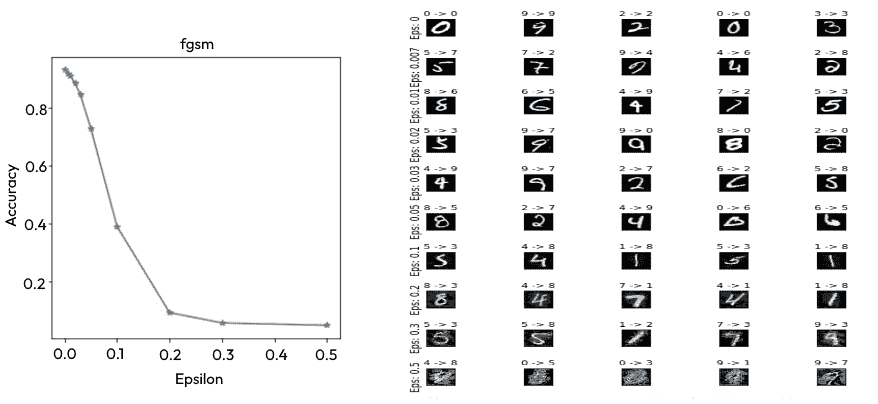
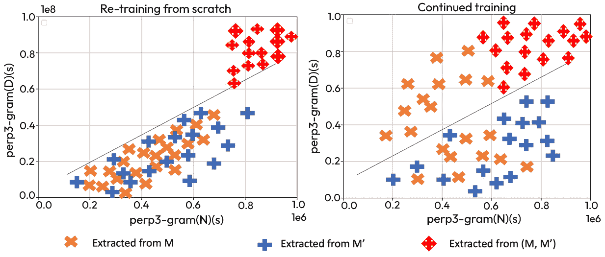
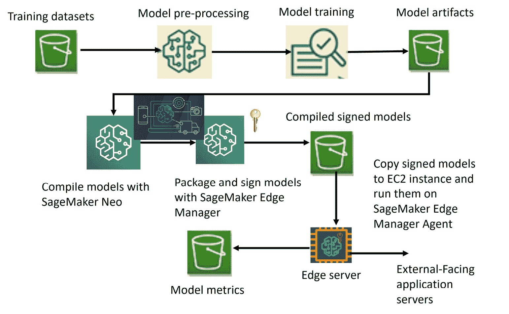

# 第四章：大数据与模型设计管道中的隐私管理

本章提供了关于如何在云中定义和构建大数据及机器学习管道的详细概述。您将学习如何以可扩展且可解释的方式应用在*第二章*中学到的防御技术，并通过不同的使用案例和示例进行实践。此外，您还将探索不同机器学习组件、微服务和端点的安全原则。本章的主要目标是将前几章中获得的知识进行整合，并更广泛地应用于主动构建一个坚实的风险缓解策略基础。通过这样做，您不仅能做好各个层级的防御准备，还能及时监控和识别新威胁，并采取及时的补救措施。

本章将涵盖以下几个部分：

+   设计隐私证明的管道

+   设计安全的微服务

+   云安全架构

+   监控与威胁检测

# 技术要求

本章要求您在本地 PC 或云端安装`Vault`。要在**Ubuntu**/**Debian**上安装，请执行以下命令：

```py
curl -fsSL https://apt.releases.hashicorp.com/gpg | sudo apt-key add -
sudo apt-add-repository "deb [arch=amd64] https://apt.releases.hashicorp.com $(lsb_release -cs) main"
sudo apt-get update && sudo apt-get install Vault
```

要在**CentOS**/**RHEL**上安装，请执行以下命令：

```py
sudo yum install -y yum-utils
sudo yum-config-manager --add-repo https://rpm.releases.hashicorp.com/RHEL/hashicorp.repo
sudo yum -y install Vault
```

要在**macOS**上安装，请运行以下命令：

```py
brew tap hashicorp/tap
brew install hashicorp/tap/Vault
```

要在**Windows**上安装，请执行以下操作：

```py
choco install Vault
```

安装完成后，不论使用哪种操作系统，您都可以在命令提示符中输入`Vault`，如果正确安装，应该会显示不同的`Vault`命令用法。

本章还要求您安装 Python 3.8 以及以下列出的 Python 包：

+   `git` `clone` `https://github.com/as791/Adversarial-Example-Attack-and-Defense`

+   `pip` `install interpret`

# 设计隐私证明的管道

当任何机器学习（ML）模型部署到生产环境中时，它需要一个完全私密的管道，能够接收数据、进行预处理，并使其适合训练和预测操作。在本节中，让我们一起来了解在设计接收每毫秒甚至每秒可达数 TB 或 PB 数据的管道时，必须牢记的一些重要概念。

## 大数据管道

在大数据管道中，我们在设计过程中将安全性和隐私性贯穿于数据聚合、数据处理、特征工程、模型训练、评估和提供训练后的模型等各个环节。数据可以通过无数设备输入，涵盖从移动设备、传感器、物联网（**IoT**）到**医疗物联网**（**IoMT**）设备，数据形式包括文本、数字、图像或视频帧。为了构建这样一个支持隐私和安全的物联网到云的数据管道，我们遵循分层部署策略，主要设计四个访问层，分别用于以下目的：

+   **设备层**（也称为网状网络）包含所有类型的设备（如嵌入式系统、传感器、执行器和其他智能物体），这些设备从网络的边缘发送数据。

+   **网络层**（支持不同数据格式下的不同网络协议）负责从边缘网络到各个处理引擎的数据传输和聚合。例如，设备可能选择通过 HTTPS 传输 JSON 数据。

+   **服务层**包含不同的微服务，负责数据清理、处理、标记、标签、特征工程、模型训练和评估。服务层的工作不仅是执行在分散的边缘服务器或集中式云端的各种处理功能，还要通过将数据和模型存储在适当的存储位置来跟踪和维护数据与模型的血统。

+   **应用层**通过 API 网关将预测的模型结果提供给最终用户。

下图展示了五种不同的架构元素，以及可以以可扩展的方式在边缘/雾网络中集成的安全措施（如匿名化、伪匿名化、同态加密（HE）、安全多方计算（SMC）、差分隐私（DP）、数据丢失防护（DLP），如在*第二章*中讨论的）。


图 4.1 – 边缘/雾网络和云系统中的安全组件

确保高安全性设计架构的主要方式之一是确保每个数据中心的不同可用区（对应不同的地理位置）被分类为多个安全级别的抽象层次，从而形成分层的域结构。这个结构化的抽象可以根据设备类型以及业务和数据的背景来实现，例如数据从哪里进入系统。

我们可以根据提供的服务类型将整体系统划分为独立的部分，将其分为四个主要构建单元：

+   **物联网和边缘网关**：该元素主要用于与外部设备接口（如传感器、物联网等）进行通信，仅允许通过蓝牙、Wi-Fi 或 **射频识别**（**RFID**）从已认证设备传输数据。物联网元素和网关通过全球证书授权机构建立相互信任关系，双方共同信任的证书授权机构签发的公钥证书有助于在证书有效期内维护多个域的信任关系。**安全物联网网关**的隐私设计可以进一步扩展，以支持带宽和加密要求，动态生成密钥大小，基于物联网设备的硬件计算能力。

+   **授权和认证层**：此元素展示了来自策略库的不同策略，根据设备的唯一 ID 对设备进行授权和认证。成功认证和策略验证（基于请求代理）后，它会生成一个唯一的会话 ID，并响应一个证书（包含设备 ID 和会话密钥副本），以允许进一步的数据流向内部授权的微服务。

+   **信任关系环境**：此元素通过集成不同方面的安全协议（如完整性、保密性和治理）作为安全架构的坚实基础。换句话说，这一块治理授权策略，将策略代理与数据处理和模型训练单元连接起来。

+   **数据转换和机器学习引擎**：此元素由两层安全性构建。第一层基于设备/实体在该单元中的角色，允许低级别的数据访问（例如，关于元数据的数据）。在此，针对缓存和数据存储库的访问控制（特别是数据库、列、队列等）在精细级别上实现。边缘设备现在可以通过端到端加密（例如，使用同态加密）传输数据。该设计进一步允许每个设备连接到不同的收发器总线，创建额外的安全层。此外，第二层还通过与基于云的私有微服务的通信提供细粒度的高级数据访问，这些微服务可以在有/没有防火墙的情况下进行配置。

在使用 Hadoop 框架的大数据系统中（Hadoop 是一个用于在集群间处理大规模数据的分布式处理框架），该框架可以通过一个专用的反向代理应用 **Apache Knox** 来支持，该应用负责通过基于 **表述性状态转移**（**REST**）的 API 提供单一的身份验证点并可插拔的策略执行。*图 4.2* 展示了如何使用 Apache Knox 和 Apache Ranger 来进行用户的认证和授权。


图 4.2 – 使用 Apache Knox 和 Ranger 进行授权和认证的架构

我们还可以建立一个类似的架构框架，采用顺序授权过程，配备安全网关、Zookeeper PDP 和 Spark/Storm 集群，这样客户端就能灵活地提交 Storm 集群的拓扑。此类框架可在客户端触发分布式系统（Spark/Storm 集群）中的数据处理时使用，并允许其进入系统，利用 Spark/Storm 的数据处理和机器学习能力。

此外，我们可以使用**受信执行环境**（**TEEs**）来构建一个受信任的云生态系统，将应用程序托管在各自的私有空间中。**操作系统**（**OS**）可以在其自己的私有空间中运行，依托受保护的硬件资源。**软件保护扩展**（**SGX**）可在现代的英特尔芯片组计算机中使用。SGX 包含一组安全相关的指令代码，这些代码被嵌入到一些现代英特尔**中央处理单元**（**CPU**）中，从而使整个系统在计算成本方面更加高效。**Oblivious RAM**（负责将算法翻译为保持实际算法输入输出关系并具有独立内存访问模式的算法的编译器）可以帮助缓解因代码分支信息而发生的攻击。这种安全方法有一定的风险，因为对手可以根据输出逆向工程模型权重。

## 架构模型设计管道

现在我们已经研究了与大数据管道相关的安全措施，让我们来探讨一些关于对抗学习、模型训练和模型再训练中隐私和安全的最佳实践。

### 对抗扰动框架

为了减少 ML 服务中的隐私攻击，提出的防御机制之一是将组件/服务部署在一个架构框架中，以在防御机制和模型性能指标之间实现正确的权衡。这样的防御管道可以通过以下组件来架构：

+   一个对抗扰动生成器，负责以一种可以隐藏敏感私人信息免受攻击者侵害的方式制作对抗样本。

+   一个隐私泄露评估器，负责评估目标模型的信息泄露，并通过向生成器发送反馈来优化目标模型的性能。

+   一个部署在生成器和泄露评估器之间的模拟器，接收对抗样本以模拟目标模型生成的分类概率

*图 4**.3*展示了目标框架的所有不同组件，并且提供了生成扰动样本的三种不同方式。


图 4.3 – 在模型训练中设置的对抗防御管道

### 对抗扰动生成器

该组件的核心包括对抗算法选择器和扰动率控制器。算法选择器可以从可用算法集合中选择，例如 AdvGAN 或**快速梯度符号方法**（**FGSM**）。FGSM 是一种快速且可靠的技术，可以生成与其他对抗算法相比具有更高、更具辨别性的扰动示例：

1.  在以下代码中，我们生成一个 FGSM 攻击：

    ```py
    def fgsm_attack(in_data,epsilon,grad_from_data):
       pert_out = in_data, + epsilon*grad_from_data.sign()
       pert_out = torch.clamp(pert_out, 0, 1)
       return pert_out
    ```

1.  可以使用以下代码来触发攻击：

    ```py
    for data, target in test_loader:
    data, target = data.to(device), target.to(device)
    data.requires_grad = True
    output = model(data)
    init_pred = output.max(1, keepdim=True)[1]
    if init_pred.item() != target.item():
    continue
    loss = F.nll_loss(output, target)
    model.zero_grad()
    loss.backward()
    data_grad = data.grad.data
    perturbed_data =    fgsm_attack(data,epsilon,data_grad)
    ```

1.  这将产生以下输出（如*图 4.4*所示），表明通过对抗训练（FGSM）进行模型训练时，隐私保护水平随着准确度的下降而提高。此过程在 MNIST 数据集上进行。



图 4.4 – 对抗防御管道中的 FGSM 扰动

另一方面，OPTMARGIN 防御技术通过区域分类器的代理模型生成低失真对抗样本，其中样本对小扰动具有鲁棒性。与此同时，控制器可以控制和调整上传的上游训练数据中对抗样本的比例。对抗样本通过保持对抗性失真（即每个对抗记录与原始数据之间的欧几里得距离）在最小水平来隐藏上传数据集中的敏感信息。通过使用最小失真率，我们可以生成具有与原始数据相同分类标签的对抗样本。

### 仿真器

该组件模拟目标模型的概率分布，以有效设计影子模型。影子模型紧密跟随目标模型的行为和分布模式。对抗数据可用于最小化仿真器的二次损失。

### 隐私泄露评估器

隐私泄露评估器负责推断对抗样本的隐私保护效果。它可以推断任何评估插件中的隐私泄露程度（例如，成员资格推断攻击），并帮助基准测试通过此框架实现的防御水平。评估器接收反馈并将评估结果发送给对抗扰动生成器，帮助生成器发现并生成正确的对抗样本。

评估函数可以采用约束条件（如泛化误差、攻击准确度的下降或攻击分类器的损失函数）。这些约束在微调噪声生成过程中特别重要。例如，评估器的高推断准确度会促使在更大扰动方向上进行调整，而评估器的低推断准确度则会促使在较小扰动方向上进行调整。

### 机器学习管道中对抗框架的目标

现在我们已经了解了对抗性框架中不同组件的重要性和功能，接下来的任务是将其作为 MLOps 和云端最佳实践策略的一部分来引入。当我们将这个框架与机器学习模型训练流水线结合使用时，可以获得两个主要好处。最重要的好处是，我们在对抗者查询模型并检索分类结果时，可以隐藏保护的信息。另一个重要的好处是，我们能够在架构中得到一个控制器，来控制从训练数据合成的新模型的性能。

## 增量/持续机器学习训练与再训练

现在让我们通过比较增量学习和持续学习技术，以及再训练技术，来探索不同的学习方法，以了解我们如何在训练过程中获得更多的隐私保护。研究结果表明，当人工神经网络持续学习一系列任务时，展现出了灾难性遗忘的特性。**持续学习**（**CL**），也称为终身学习、顺序学习或增量学习，能够使模型从数据流中顺序学习。

然而，当模型尝试吸收后续任务的新知识时，它会丧失之前收集的信息。由于模型在重要参数上的知识丧失，并且受限于稳定性（保持过去知识的能力）和可塑性（吸收新知识的能力）之间的权衡，模型无法考虑对抗性攻击的可能性，因此仍然容易受到毒性后门攻击的影响。针对这些风险，已有大量研究提出了缓解方法，形成了三种不同的途径：

+   **基于数据的方法**依赖于存储从之前学习中获得的历史知识（在情景记忆中），并将其与当前的训练数据结合，以完成训练任务。增量分类器和表征学习属于这一类别。

+   **架构方法**通过为每个任务分配不同的子网络来缓解遗忘风险。在这里，每个任务利用网络的不同部分。一旦完成一个训练任务，子网络就不需要再担心训练神经网络的其他部分。此类方法的例子包括渐进神经网络、专家门控（Expert Gate）和基于集成的学习方法，如 Learn++。我们进一步注意到，稀疏性的专家门控模型，在网络部分激活时，表现出更好的扩展性和保留能力。

+   **基于正则化的方法**试图解决早期方法中存在的数据存储和架构复杂性问题。它们通过向损失函数添加一个额外的正则化项，以防止先验知识的丧失。在学习阶段或完成学习操作后，模型通过不同的权重计算机制不断计算网络中每个参数的重要性。这有助于通过惩罚对最重要参数的剧烈变化，来保持后续学习阶段的信息。属于这一类别的示例包括**弹性权重整合**（**EWC**）、突触智能和记忆感知突触。

尽管这些连续学习（CL）技术已证明能够保持先验知识，但它们对对抗性攻击的脆弱性仍在研究中。然而，研究表明，在基于 CL 的 EWC 中的防御提案可能会被智能对手通过在训练过程中向模型注入虚假信息所破坏。对手可以进一步控制任何任务的遗忘程度，并通过注入后门污染样本来妥协神经网络，甚至只需要影响单一任务训练数据的 1%。这种攻击可以作为一种有效的工具来击败基于在线的连续学习者。

在这些情况下，分析模型泄漏信息并使用差分分数和差分排名等指标量化泄漏，可以在一定程度上缓解模型管道中的连续学习（CL）风险。现在，让我们讨论一个示例，说明这些指标如何确认模型更新导致的泄漏，尤其是在高容量生成性自然**语言模型**（**LM**）的情况下。这个用例有助于为实时模型管道的设计提供方向，当数据不断输入系统时。这个示例进一步展示了当对手访问模型的多个快照时的隐私影响，例如当文本数据在再训练阶段添加/移除时。研究应该促使我们在设计管道时，遵循正确的再训练模型流程，特别是在对手持续从训练模型所用数据的差异中学习的情况下。

设计策略可以扩展到以下情况，在这些情况下，威胁模型的设计受以下因素的影响：

+   有限的私人数据集用于微调预训练的公共大容量语言模型（LM）

+   具有记忆分布外训练样本能力的语言模型（LM）

+   大规模部署语言模型（LM）的系统，如智能手机上的预测键盘，允许对手更详细地分析模型

当微调一个高容量模型（例如，BERT 或 GPT2 等变换器模型）的公共快照时，数据泄露威胁会加剧。当模型通过某个实体的附加数据进行微调时，存在将微调后的模型和原始公共模型暴露给该实体用户的风险。

可以使用差异得分的概念来估算用于训练两个语言模型的数据差异。该得分帮助我们通过捕捉两个模型对令牌序列的概率差异来确定令牌序列，其中较高的差异得分意味着模型更新过程中添加了该序列。适当的搜索方法可以进一步帮助我们识别新增的令牌序列并检索与数据集差异相关的信息。这些信息现在对任何人都可用，无需了解数据集的内容和分布的背景知识。

为了缓解此类攻击并建立坚固的防御，需要对模型重训练流程进行某些调整，以触发增量学习并决定如何向外部实体展示模型快照。因此，应该做出设计选择，以限制对两个连续模型快照的查看。研究发现，两个快照按顺序排列时，会暴露更多关于数据添加或删除的信息。预防这种情况的最佳策略是限制对模型的访问，并仅向任何代理提供部分预测结果。

例如，任何外部实体仍然可以完全访问原始模型*M*，但只接收来自更新模型*M’*的前*k*个标记。当客户从云端获取预测结果时，允许云 API 返回带有每个查询截断版本的专用模型，从而实现这种场景。然而，当模型部署在客户端设备上时，它们可能被允许在同一设备上运行在 Intel SGX 或 ARM TrustZone 等受信执行环境（TEE）中。此方法有助于减少信息泄露。

有三种与模型重训练相关的广泛方法：

+   **从头开始重训练**：这种方法允许我们从头开始训练一个模型，以获得一个新的模型快照（M'）。此过程考虑了模型参数的全新（随机）初始化，触发重训练过程将生成稍有不同的输出机器学习模型。由于该过程意味着从训练的全新开始，数据所有者可以在修剪数据后启动重训练过程。

+   **持续训练**：这种方法依赖于持续训练的原则，即原始模型在附加数据上进行增量训练，以生成新的模型快照 M'。该技术的一个主要优点是避免了从头开始训练大数据集所带来的额外计算成本。

*图 4**.5* 展示了重新训练和持续训练在数据泄露方面的差异。纵轴表示相对于数据 D 的困惑度，横轴表示相对于数据更新的困惑度。这里的困惑度指的是模型在选择下一个单词时的突发反应或“惊讶”的程度，因此较低的困惑度值表示数据与模型之间的匹配更好。

第一个图展示了更新所有模型参数的影响，而第二个图则演示了如何根据完全新的数据更新先前训练过的模型的参数。对角线的目的是根据数据分布是否更像私人数据更新 N 或基础数据 D 来对数据进行分类。位于对角线以上的点在分布上更接近（私人）数据更新 N，而不是基础数据 D。如第二个图所示，大量的困惑度和数据与模型之间更大的不匹配或不确定性，可能会导致更高的隐私性。在这里，更大的不确定性或变化验证了一个事实，即在持续训练后检索并返回的句子，比从头开始重新训练后的句子更有可能是私密的。



图 4.5 – 比较从头开始重新训练与持续训练时的数据隐私

+   **两阶段持续训练**：这一缓解策略允许训练过程分为两个阶段进行。首先，数据集被分为三等份 —— Dorig、Dextra 和 D'extra。

我们之前看到过，持续训练方法可以通过更新先前训练过的模型的参数来启动模型训练（当新的数据 D 或 D'到达时）。新的两步训练方法增加了一个额外的步骤（在训练模型使用合成/金丝雀数据（Dextra）后，执行在数据集 D'extra 上的训练）。这种方法模拟了一个场景，其中我们禁止攻击者访问两个连续的快照。这种两阶段或多阶段的持续训练可以降低训练阶段的差异得分，从而进一步减少私人信息泄露的可能性。

接下来，让我们看看如何通过对抗训练和在 GPU 上重新训练来扩展防御管道。

## 扩展防御管道

现在我们已经知道如何通过持续的模型重新训练在模型管道中引入防御机制，让我们来看看如何使这种对抗系统能够扩展到更大的数据集。可扩展的设计方法应考虑以下原则，以便以并行分布式的方式快速在大量数据上进行训练。

神经网络的泛化能力应足够强大，以便从大规模数据集中检测出最重要的特征。在迭代训练过程中引入模型泛化，可以在每一步优化数据表示，从而保持模型的准确性和鲁棒性。可以设计一种迭代模型训练机制，当扰动 η<η0 时，将对抗样本标注为原始/自然样本的标签；另一种方式是当扰动 η≥η0 时，将其标记为对抗样本，并向系统发出通知进行进一步分析。

最重要的方面在于使得迭代的对抗训练过程可并行化，这在*图 4.6* 中进一步说明。该图展示了一个分布式的对抗再训练框架，并使用了**图形处理单元**（**GPU**）。GPU 可以利用先前生成的对抗样本（*t-2* 时生成的样本），而无需等待在 *t-1* 时生成的样本。消除等待生成样本的需求可以加快处理速度。


图 4.6 – 对抗防御流水线的可扩展性

此外，我们还可以开发集成模型，使得最终标签的输出基于两个测试提供的标签，其中我们向一个测试集添加少量随机噪声，而不向另一个数据集添加噪声。这些少量的噪声旨在扭曲来自对抗攻击的最优扰动，使得加入噪声的图像与未加噪声的图像产生不同的输出，从而清晰区分原始图像与攻击图像。

我们现在已经了解了模型训练的不同机制如何为隐私增加额外保护。让我们重用在*第二章*中解释**差分隐私**（**DP**）概念的一些内容，并将其应用于机器学习训练流水线。

## 在可扩展架构中启用差分隐私

DP 解决方案在研究和实践之间存在脱节，主要由于隐私启用算法的低模型准确性和高运行成本。一个称为**Bolton 差分隐私**的私人**随机梯度下降**（**SGD**）算法解决了这些问题，且与可扩展的基于 SGD 的分析系统相集成效果良好。该解决方案完全依赖于在模型收敛后添加噪声。此外，该方案在不增加额外开销的情况下，提升了模型性能指标。

*图 4.7* 说明了在云环境（如**谷歌云平台**（**GCP**））架构中，涉及差分隐私的数据处理各个阶段。如我们所见，操作顺序如下：

1.  从 BigQuery 中检索启用差分隐私的 SQL 查询。

1.  使用 AutoML 进行数据模式验证。

1.  使用 AutoML 进行特征工程。特征存储在云数据库/存储中。

1.  在下一阶段，差分隐私再次发挥作用，以确保查询和模型的私密性，通过从存储中获取处理后的结果，将隐私融入系统。

1.  使用差分隐私进行数据挖掘（运行差分隐私 SQL 查询）。

1.  使用 Cloud Dataprep 工具进行建模的数据准备。

1.  使用 DP 的机器学习建模。

1.  预测结果的存储。

1.  在测试集上的评估。


图 4.7 – 在 Google Cloud 上使用模型训练进行差分查询

现在我们已经了解如何在云端部署 DP 解决方案，接下来让我们探索如何对其进行解释。

### DP 解决方案的可解释性

在这里，我们将展示如何使用微软研究院的**interpretML**工具来解释私密训练的模型。**可解释提升机器**（**EBM**）是一种最近的技术，它被用来训练可解释的机器学习模型，同时保护敏感数据。现在让我们看看如何将差分隐私添加到 EBMs 中，并设定以下目标：

+   训练过的模型提供了更好的全局和局部可解释性（非常适合差分隐私适用的场景）。通过全局可解释性，我们可以了解在模型结果中起重要作用的特征，而通过局部可解释性，我们可以解释每个单独的预测。

+   在训练过程后，模型可以被修正，以解决差分隐私引入的错误。

让我们通过一个示例来演示：

1.  首先，我们有必要的导入项，如下所示：

    ```py
    from interpret.privacy import DPExplainableBoostingClassifier
    from interpret.glassbox import ExplainableBoostingClassifier
    import time
    from sklearn.metrics import roc_auc_score, accuracy_score
    ```

1.  下一步是引入`DPExplainableBoosting`分类器，测量`roc_auc`指标以及评估所需时间：

    ```py
    start = time.time()
    dpebm = DPExplainableBoostingClassifier(epsilon=1, delta=1e-6)
    _ = dpebm.fit(X_train, y_train)
    dp_auroc = roc_auc_score(y_test, dpebm.predict_proba(X_test)[:, 1])
    print(f"DP EBM with eps: {dpebm.epsilon} and delta: {dpebm.delta} trained in {end - start:.2f} seconds with a test AUC of {dp_auroc:.3f}")
    end = time.time()
    ```

1.  接下来，我们介绍一个`ExplainableBoosting`分类器（没有 DP），并衡量`roc_auc`指标以及评估所需时间：

    ```py
    start = time.time()
    ebm = ExplainableBoostingClassifier()
    _ = ebm.fit(X_train, y_train)
    ebm_auroc = roc_auc_score(y_test, ebm.predict_proba(X_test)[:, 1])
    end = time.time()
    print(f"EBM trained in {end - start:.2f} seconds with a test AUC of {ebm_auroc:.3f}")
    ```

接收到的输出如下：

```py
DP EBM with eps: 1 and delta: 1e-06 trained in 3.38 seconds with a test AUC of 0.878
EBM trained in 10.43 seconds with a test AUC of 0.923
```

1.  在最后一步，我们展示了两种模型的全局解释，并检查它们之间的差异：

    ```py
    from interpret import show
    show(ebm.explain_global(name='Standard EBM'))
    show(dpebm.explain_global(name='DP EBM'))
    ```

*图 4.8*展示了**标准 EBM**和**DP EBM**的输出，特征根据其重要性进行排名。我们看到，**关系**、**性别**和**教育年限**在 DP EBM 中比在标准 EBM 中发挥更大的作用。通过进一步分析每个特征的贡献（如**婚姻状况**），我们看到**分居**和**DPOther**在 DP EBM 中的得分范围比标准 EBM 大。


图 4.8 – 在 DP 模型上展示可解释性

既然我们已经知道如何创建差分隐私（DP）训练管道，那么接下来我们来研究一些经过验证的安全部署策略，以及如何在云基础设施中部署签名模型。

### 部署安全性和模型签名

主要的安全标准之一是确保模型训练和部署流水线的所有组件都与安全验证检查集成。此外，我们还应当小心保护敏感数据的隐私和完整性，如密码、令牌和其他密钥，这些都是生产环境中端到端系统功能所必需的。因此，所有生产环境中的机密信息应仅存储在托管的数字保险库中，并且绝不应提交到代码库和配置文件中。我们还应引入自动化，以支持在部署时动态生成机密，并定期检查流程，以检测和缓解由于未保护机密存在所带来的威胁。

现在让我们通过 *图 4.9* 来看看如何使用 AWS SageMaker 进行模型打包和签名 ([`aws.amazon.com/blogs/machine-learning/machine-learning-at-the-edge-with-aws-outposts-and-amazon-sagemaker/`](https://aws.amazon.com/blogs/machine-learning/machine-learning-at-the-edge-with-aws-outposts-and-amazon-sagemaker/))。这将帮助我们了解如何将模型工件打包在一起，提供有效的授权签名，并使用 Amazon SageMaker Edge Manager 存储到 S3。

在实际场景中，AWS SageMaker 帮助我们在 AWS 区域内构建和训练模型时，我们可以使用 Amazon SageMaker Edge Manager 以优化的方式训练模型，通过本地推理并将其存储在 AWS 相应的本地数据中心。这种优化的训练方法比起数据中心与 AWS 区域之间距离较远的情况，可以减少延迟。机器学习模型可以在 AWS SageMaker（在 AWS 区域内）上进行训练，一旦模型工件存储在 Amazon S3 中，就可以进行打包和签名。已编译和签名的模型可以从 AWS S3（在 AWS 区域内）复制到 AWS Outposts 上的 Amazon EC2 实例，并通过 SageMaker Edge Manager 代理提供模型推理服务。下图进一步详细说明了这些步骤：



图 4.9 – 在 AWS SageMaker 中的模型签名

在 GCP 中，我们有 BigQuery ML，它支持 `CREATE MODEL` 调用，指定训练选项中的 `KMS_KEY_NAME` 和可以用于存储模型的路径：

```py
CREATE MODEL my_dataset.my_model
OPTIONS(
  model_type='tensorflow',
  path='gs://bucket/path/to/saved_model/*',
  kms_key_name='projects/my_project/locations/my_location/keyRings/my_ring/cryptoKeys/my_key')
AS SELECT * FROM my_dataset.my_data
```

通过我们对保护私有机器学习模型的新知识，接下来让我们探讨如何设计安全的微服务。

# 设计安全的微服务

使用 ML，我们可以设计不同的智能预测服务，这些服务可以使用一个或多个算法，包括**前馈神经网络**（**FFNNs**），**深度信念网络**（**DBNs**）（[`www.sciencedirect.com/topics/engineering/deep-belief-network`](https://www.sciencedirect.com/topics/engineering/deep-belief-network)），和**递归神经网络**（**RNNs**）。为了促进定制算法的重复使用，我们可以选择创建一个抽象层，并将每个预测服务封装为面向数据的微服务，这些微服务可以与需要 ML 能力的应用程序集成。此外，可以使用 TensorFlow 库对一个 ML 微服务进行训练，另一个可能使用 PyTorch 库，第三个微服务可能使用 Caffe 库进行训练。基于微服务的 ML 模型允许最大限度地重用 ML 库、算法特性、可执行文件和配置，促进 ML 团队之间的合作。

例如，如*图 4**.10*所示，有四个 ML 预测微服务 - **推荐**，**客户行为**，**基于位置的广告**和**购物篮**，以及**身份管理**和**客户交易**。现在让我们看看如何在这些基于 REST 的微服务中引入安全机制：

1.  任何 HTTP 客户端请求（从移动/网络 API）首先着陆在 API 网关（*步骤 1a*），然后通过负载均衡器将其指向**身份管理**（**IM**）微服务（*步骤 1b*）。

1.  当由 IM 微服务（*步骤 2*）进行验证时，客户端将提供身份验证令牌，使用该令牌可以进一步请求任何预测服务。

1.  当认证服务提供身份验证令牌时，然后由微服务在*步骤 3*中使用该令牌验证请求，并在*步骤 6*发送相应的响应。每个微服务可以通过从保险库（专用于存储密钥的存储区域）获得动态密钥来进一步保护。

1.  此外，每个微服务在*步骤 4*向后端交易数据库发出请求，并在*步骤 5*收到其响应。

由于保险库与云和应用程序框架无关，因此可以轻松地在不同平台、环境和机器之间迁移。

此外，我们应遵循以下原则，以确保微服务的安全性：

+   限制权限并将其保持在每个用户或服务角色所需的最小数量。

+   永远不要授予伪或特权帐户给其他人以运行服务。

+   始终限制对可用资源的访问权限，例如，我们应始终定义安全规则，以限制容器对主机操作系统的访问。

+   始终将机密信息存储在保险库中，并运行安全自动化检查，以检测存储在容器或仓库中的机密信息。

+   通过使用适当的安全规则为具有不同敏感级别的可用资源定义隔离或沙盒单元。


图 4.10 – 基于机器学习的微服务架构示例

## Vault

Vault 是一种用于管理零信任网络中密钥的工具。它通过限制数据访问并保持机密性，提供了高水平的保护。

Vault 支持高吞吐量的 API 接口，帮助管理在不同环境中运行的大量微服务的密钥。它还提供灵活的身份验证方法，使用其可用插件，支持在 Nomad 或 Kubernetes 中运行的应用程序进行身份验证。Vault 拥有插件，可为在任何云上运行的应用程序提供自动身份验证，涵盖了从 Azure、AWS 和 GCP 到阿里巴巴和微微等云平台。

Vault 提供更好的安全管理，通过动态密钥使每个端点可以根据被评估的实体拥有独立的用户名和密码。通过这样做，Vault 可以提供额外的保护，并能防止因任何一个微服务的安全漏洞引发的连锁攻击。在这种情况下，攻击者不再能够攻击某个不安全的区域并访问密钥，从而获得对整个环境的访问权限。Vault 的另一个重要特性是它生成的动态密钥是有时间限制的，并且容易撤销。因此，在环境中发生安全漏洞时，管理员可以轻松撤销密钥。Vault 的这一功能防止了系统重启。

让我们来看一个例子，了解 Vault 如何通过撤销权限将攻击者从系统中移除，从而限制攻击范围和攻击面。如果一个具有零权限的服务账户（来自云提供商如 GCP、AWS 或 Azure）通过 Vault 进行身份验证，那么即使服务账户被攻破，临时服务账户（由 Vault 认证）也有助于缓解攻击。在 Vault 认证的服务账户下，攻击者无法像在没有 Vault 认证的情况下那样启动数百个虚拟机。Vault 还充分利用了各种云提供商的 **密钥管理服务**（**KMSs**）中的密钥轮换技术，促进动态密钥生成，从而增加额外的保护层。

Vault 启用 Kubernetes 的 `auth` 方法，使用 Kubernetes 服务账户令牌对客户端进行身份验证。Vault 代理用于提供以下功能：

+   自动身份验证

+   安全交付/存储令牌

+   这些令牌的生命周期管理（续期和重新认证）

现在让我们研究如何在 Kubernetes 集群中运行 Vault 代理的示例：

1.  第一步是从 GitHub 克隆 `hashicorp/Vault-guides` 仓库：

    ```py
    git clone https://github.com/hashicorp/Vault-guides.git
    ```

1.  下一步是进入 `Vault-guides/identity/Vault-agent-k8s-demo` 目录：

    ```py
    cd Vault-guides/identity/Vault-agent-k8s-demo
    ```

1.  接下来，我们启动一个 Vault 开发服务器，在 `0.0.0.0:8200` 本地监听请求，使用 `root` 作为根令牌 ID：

    ```py
    Vault server -dev -dev-root-token-id root -dev-listen-address 0.0.0.0:8200
    ```

1.  为了提供访问 URL，我们为 Vault CLI 导出一个环境变量，以指向 Vault 服务器：

    ```py
    export VAULT_ADDR=http://0.0.0.0:8200
    ```

1.  为了创建一个服务账户，让我们启动一个在 minikube 中运行的 Kubernetes 集群：

    ```py
    minikube start --driver=docker
    ```

1.  检查 minikube 环境的状态，确保它已完全可用：

    ```py
    minikube status
    ```

状态的输出应显示如下：

```py
host: Running
kubelet: Running
apiserver: Running
kubeconfig: Configured
```

1.  在验证状态后，我们检查`Vault-auth-service-account.yaml`的内容，以确认服务账户的创建。

1.  接下来，我们创建一个名为`Vault-auth`的 Kubernetes 服务账户：

    ```py
    kubectl create serviceaccount Vault-auth
    ```

1.  更新`Vault-auth`服务账户：

    ```py
    kubectl apply --filename Vault-auth-service-account.yaml
    ```

1.  现在，为了配置 Kubernetes 的`auth`方法，我们在 Vault 中创建一个只读策略，名为`myapp-kv-ro`：

    ```py
    Vault policy write myapp-kv-ro - <<EOF
    path "secret/data/myapp/*" {
    capabilities = ["read", "list"]}
    EOF
    ```

1.  在接下来的步骤中，我们在`secret/myapp`路径下创建一些测试数据：

    ```py
    Vault kv put secret/myapp/config \
          username='appuser' \
          password='suP3rsec(et!' \
          ttl='30s'
    ```

1.  现在让我们设置环境变量，指向正在运行的 minikube 环境。在这里，我们将`VAULT_SA_NAME`环境变量的值设置为`Vault-auth`服务账户：

    ```py
    export VAULT_SA_NAME=$(kubectl get sa Vault-auth \
        --output jsonpath="{.secrets[*]['name']}")
    ```

1.  在这里，我们还将`SA_JWT_TOKEN`环境变量的值设置为用于访问`TokenReview` API 的服务账户 JWT：

    ```py
    export SA_JWT_TOKEN=$(kubectl get secret $VAULT_SA_NAME \
        --output 'go-template={{ .data.token }}' | base64 --decode)
    ```

1.  接下来，我们将`SA_CA_CRT`环境变量的值设置为与 Kubernetes API 通信时使用的 PEM 编码 CA 证书：

    ```py
    export SA_CA_CRT=$(kubectl config view --raw --minify --flatten \
        --output 'jsonpath={.clusters[].cluster.certificate-authority-data}' | base64 --decode)
    ```

1.  现在应该能够获得 minikube 的 IP 地址，因此我们将`K8S_HOST`环境变量的值指向该地址：

    ```py
    export K8S_HOST=$(kubectl config view --raw --minify --flatten \
        --output 'jsonpath={.clusters[].cluster.server}')
    ```

1.  最后，我们需要在默认路径（`auth/kubernetes`）启用并配置 Kubernetes 的`auth`方法：

    ```py
    Vault auth enable kubernetes
    ```

1.  此外，我们还需要让 Vault 知道如何与 Kubernetes（minikube）集群通信：

    ```py
    Vault write auth/kubernetes/config \
            token_reviewer_jwt="$SA_JWT_TOKEN" \
            kubernetes_host="$K8S_HOST" \
            kubernetes_ca_cert="$SA_CA_CRT" \      issuer="https://kubernetes.default.svc.cluster.local"
    ```

1.  在配置好所有内容后，最后我们需要创建一个名为`example`的角色，将 Kubernetes 服务账户映射到 Vault 策略和默认令牌的**生存时间**（**TTL**）：

    ```py
    Vault write auth/kubernetes/role/example \
            bound_service_account_names=Vault-auth \
            bound_service_account_namespaces=default \
            policies=myapp-kv-ro \
            ttl=24h
    ```

如我们在前一步所见，Vault 的每种身份验证方法都映射到一个角色。角色又映射到*N*个策略。策略提供了一种声明式的方式来授予或禁止对 Vault 中某些路径和操作的访问。以下代码片段演示了如何将路径与不同的权限关联：

```py
path "secret/ms-1" {
 capabilities = ["read"]
}
path "secret/ms-2" {
 capabilities = ["update"]
}
```

Vault 提供键值存储，可以用来创建一个密钥并将其值存储在指定路径中，如此处所示：

```py
Vault kv put secret/my-secret sec_val="value"
```

Vault 也可以作为加密服务运行，将来自前端应用的明文数据通过 Vault 的秘密进行加密，然后通过任何基于云的微服务传递给后端应用：

现在让我们理解如何在 Google Cloud 中运行 Vault，配备存储后端、Kubernetes 集群和 Google 的 KMS 服务，如*图 4.11*所示：


图 4.11 – 如何在 Google Cloud 中使用 Vault

为了运行 Vault，我们应始终将其运行在完全隔离的 Kubernetes 集群中，以防止其受到任何可能危及生产环境的外部威胁。前面图中所示的云存储单元有助于存储动态密钥。Vault 还需要一种人工或自动化的方法来解封/解锁密钥，这些密钥通常被拆分并存储在其中。以下代码片段通过 `auto-unseal` 生成恢复密钥。通过自动封印过程，我们能够启用自动构建解密数据加密密钥所需的主密钥：

1.  首先，我们需要初始化 Vault 服务器：

    ```py
    vault operator init
    ```

1.  KMS 用于通过其自动密钥轮换功能解锁拆分的密钥（例如，在系统重启时）。密钥轮换命令执行如下：

    ```py
    gcloud kms keys update <KEY_NAME> \
             --location <LOCATION> \
             --keyring <KEYRING_NAME> \
             --rotation-period <ROTATION_PERIOD> \
             --next-rotation-time <NEXT_ROTATION_TIME>
    ```

现在我们已经看到使用 Vault 实现云无关架构的安全选项，接下来让我们看看 AWS 在 **弹性 Kubernetes 服务**（**EKS**）中运行的单个微服务所提供的安全选项。此外，这些服务相互依赖，一个微服务在 Kafka 集群中发布的消息（即 **Amazon Managed Streaming for Apache Kafka**（**MSK**））会被其他微服务消费。AWS 提供的安全机制在*图 4.12*中有所展示。


图 4.12 – 在基于 ML 的企业解决方案中使用 Vault

在这里，我们找到四个不同服务中的身份验证机制：

+   **传输层安全性**（**TLS**）1.2 在 API 网关中用于与 AWS 资源的通信。

+   Apache Kafka 的身份验证和授权，其中使用 IAM 来验证客户端并允许或拒绝 Apache Kafka 操作。Kafka 操作的另一种允许或拒绝机制是通过使用 TLS 或 SASL/SCRAM 和 Apache Kafka ACLs。

+   Amazon MSK 集群的简单身份验证和**安全层**/**加盐挑战响应身份验证机制**（**SASL**/**SCRAM**）基于用户名和密码的身份验证可以用来增强保护。通过这种方法，凭证可以使用 KMS 加密并存储在 AWS Secrets Manager 中。

+   使用 AWS KMS 对 MSK 集群进行数据加密可以提供透明的服务器端加密。此外，TLS 1.2 可以在 MSK 集群的代理之间提供数据传输加密。此外，我们还可以使用 Kerberos、TLS 证书和高级**访问控制列表**（**ACLs**）来建立代理与 Zookeeper 之间的安全性。

现在让我们了解将安全特性添加到云系统架构中所需的基本要素。

# 云安全架构

在本节中，我们将探讨组织在云安全架构方面应标准化的主要安全原则。在此，我们还将研究一些如何在数据和模型在团队之间共享时架构可扩展安全架构的示例。

我们的大多数基于 SaaS 的机器学习应用在部署到云端时需要不同级别的安全性、访问控制和数据保护技术。我们仍然可以利用 Azure、Google Cloud 和 AWS 提供的现有安全架构，或者为我们自定义的云解决方案（承载预测 API）构建一个平台独立的安全框架。不论我们选择哪种方案，重要组件包括**云访问安全代理**（**CASB**）、API、代理、网关和身份与访问管理。这些工具帮助我们构建共享责任云模型和零信任架构。

对于任何基于云的机器学习系统，我们需要定期量化云架构面临的风险。在此过程中，我们需要考虑渗透测试的执行程度，是否已实施多因素认证和**单点登录**（**SSO**）等认证方法，以及各个云组件与企业认证和目录的集成程度。此外，还应考虑过去的安全漏洞记录及其严重性。

现在，让我们深入探讨云安全架构的基础原则（[`www.guidepointsecurity.com/education-center/cloud-security-architecture/`](https://www.guidepointsecurity.com/education-center/cloud-security-architecture/)）：

+   **身份识别**：保持关于用户、资产、业务环境、政策、漏洞和威胁等在云环境中存在的完整信息。

+   **安全控制**：定义参数并强制实施跨用户、数据和基础设施的政策，以更好地管理、评估和访问安全态势。

+   **安全设计**：遵循标准和指南，并进行及时审计，以定义每个用户及其对应设备的角色和责任。为每个大数据和机器学习处理组件执行安全配置，无论是否自动化运行。

+   **合规性**：纳入新标准进行审查，并及时引入安全验证过程。将现有的行业标准和监管组件与最佳实践集成到架构中。

+   **边界安全**：定义并遵守流量流动规则（通过设置代理和防火墙），确保不允许限制的流量从组织的云资源流向公共互联网。

+   **分段**：在隔离和划分微服务（包括训练、预处理和后处理作业）时，遵循最小权限原则，以防止在对抗性攻击中发生横向移动。

+   **用户身份和访问管理**：执行访问权限和额外的协议措施，以确保透明性并提高所有用户和设备对公司系统的可见性。将此范围扩展到参与机器学习训练的设备，适用于像联邦学习这样的场景。

+   **数据匿名化/假名化**：遵循*第二章*中讨论的加密方法，处理流数据和静态数据。此外，任何微服务之间的通信应加密，以降低风险。

+   **自动化**：促进快速的安全性和配置供应及更新，并快速检测威胁。

+   **日志记录和监控**：引入适当的工具，以在流水线中启用日志流动。这些日志将为各个部署中的故障和警告提供洞察力。允许一致地收集日志，以监控威胁并发出警报。

+   **可见性**：教育团队使用适当的工具和流程，确保多个机器学习解决方案在不同部署中的透明度和可见性。

+   **灵活设计**：不仅在架构和开发中实施敏捷方法论，还在安全生命周期管理中贯彻这一方法，以确保及时的修补和证书更新。根据需要，灵活地添加和修改额外的组件或安全层，以保护组织的系统和云资源。

既然我们已经了解了主要的设计原则，接下来让我们看一下如何通过一个包含特征存储的架构实践，建立对数据的安全控制、安全设计和分段原则。[特征存储示例](https://aws.amazon.com/blogs/machine-learning/enable-feature-reuse-across-accounts-and-teams-using-amazon-sagemaker-feature-store/)

## 在沙箱环境中开发

本节中，我们将了解不同团队如何在受限环境中进行开发。

*图 4.13* 说明了使用多个组件在 AWS 中创建沙箱环境（[`aws.amazon.com/blogs/security/how-to-centralize-and-automate-iam-policy-creation-in-sandbox-development-and-test-environments/`](https://aws.amazon.com/blogs/security/how-to-centralize-and-automate-iam-policy-creation-in-sandbox-development-and-test-environments/)），供不同数据科学和工程团队在模型生命周期的不同阶段使用，包括特征工程、模型训练、测试和部署。可以根据具体情况为团队授予非常具体的安全权限。每个团队还可以根据团队的具体需求进一步定制该工作流。此外，一些团队可以将数据推送到特征库，其他团队可以从特征库中访问和读取数据，以便在其内部开发过程中使用。沙箱环境通过限制对单独团队的特权，从而促进协作。

现在，让我们参考*图 4.13*，尝试理解如何根据账户类型设置受限权限，并使用 AWS CodePipeline 创建和管理跨多个 AWS 账户运行的工作流：

+   沙箱管理员可以使用 S3 桶上传 IAM 策略。

+   自动化管道中的 IAM 角色用于访问存储 IAM 策略的 S3 桶。

+   AWS KMS 密钥用于加密 S3 桶中的 IAM 策略。

+   AWS Lambda 服务用于验证*允许*/*拒绝*权限。

AWS 用户（例如 Alice）可以使用 IAM 可视化编辑器授予适当的访问权限和权限，允许团队（例如数据科学团队 A）启动并管理 EMR 集群，以处理来自 S3 数据集的数据。IAM JSON 策略文档可以通过**AWS 密钥管理服务**（**AWS KMS**）密钥上传到 S3 桶中。

AWS CodePipeline 还可以查询 AWS 中的中央 Lambda 函数，查询 IAM JSON 策略文档并执行一系列验证检查。在此，Lambda 函数还可以将拒绝规则附加到 IAM 策略中，以限制沙箱账户中的用户权限。在验证成功后，Lambda 函数会创建用户策略（Alice），从而成功设置管道，进一步允许用户将其附加到正确的 IAM 用户、组或角色。如果 IAM JSON 策略失败，用户需要修改它以使其符合安全指南，并重新提交。

因此，我们可以看到如何通过 IAM 角色选择来隔离团队的工作环境。这也有助于根据需求实施限制性访问权限和特权。


图 4.13 – 基于访问控制的沙箱环境中的分区

当我们的 ML 解决方案通过云平台被多个用户的应用程序访问时，我们可以使用称为 **Cloud Access Security Brokers**（**CASB**）的代理，来提供有关潜在及即将发生的网络威胁的洞察。微软通过使用 Microsoft Defender for Cloud Apps ([`docs.microsoft.com/en-us/defender-cloud-apps/what-is-defender-for-cloud-apps`](https://docs.microsoft.com/en-us/defender-cloud-apps/what-is-defender-for-cloud-apps)) 利用这样一个代理服务，该服务能够跨部署平台（通过 API 连接器和反向代理）促进日志收集和监控活动。这类服务有助于执行企业级安全措施，从而帮助我们实时保护组织资源。此外，它还作为支持不同部门（如人力资源、薪资、招聘等）之间内容协作的工具，每个部门可能有自己独立的 ML 服务和数据合规要求。Defender for Cloud Apps 的独特安全功能包括：

+   **可见性**：通过追踪每个用户对各个服务的访问权限，检测并标记所有云服务，按排名生成。

+   **数据安全**：通过 DLP 控制敏感信息，并参考内容上的安全标签。

+   **威胁保护**：利用 **用户与实体行为分析**（**UEBA**）识别异常行为和趋势，并提供 **自适应访问控制**（**AAC**）以缓解恶意软件风险。自适应安全或 AAC 也被称为零信任安全，这意味着默认不信任任何用户。由于基础策略不附带任何信任，结合灵活的支持和持续的监控技术，可以帮助用更新的自适应政策替代过时的传统基础设施。

+   **合规性**：构建报告和仪表板，以支持云和 ML 治理实践，确保满足数据驻留和监管合规要求。

+   下图展示了 Defender for Cloud Apps 如何融入基于云的架构中。**Cloud Discovery** 服务能够发现组织私有企业云中使用的应用程序。此外，防火墙和代理的应用程序级日志也可以进行分析。它还利用应用程序连接器提供有关应用程序治理的见解，并提供更好的保护。这些应用程序连接器通过云服务提供商的 API 与 Defender 服务进行集成。

使用 Microsoft Defender for Cloud Apps，可以采用反向代理架构结合**条件访问应用控制**。这种访问控制有助于提高对云环境中活动的可见性。Defender for Cloud Apps 可用于动态设置策略，并识别来自可疑数据点和未保护端点的风险。策略通常有助于整合修复过程，从而制定风险缓解计划。微软还提供了一个云应用目录，评估正在使用的应用所暴露的风险，考虑到监管认证、行业标准和最佳实践。

每个应用可以通过设置来限制传入请求的速率，使用限流规则，或通过动态时间窗口来调整 API。尽管这个过程会增加执行大规模 API 请求扫描操作所需的时间，但它同时有助于保护我们免受不良对抗性请求的侵害。

高效使用加密过程，避免在源代码和 Docker 文件中包含凭据，并应用不同的阻止策略，进一步提升安全标准。

以下图表进一步说明了如何授权一组受保护的应用访问云环境，并确保数据安全和合规性。通过增加代理、防火墙和应用治理等组件，监控和日志记录变得更加容易。此外，我们还可以看到可以跟随的逐步安全控制措施（**基于角色的访问控制 (RBAC)** | **策略管理** | **发现** | **设置** | **实时控制**），这些措施有助于增强我们的安全防护体系。所有安全控制措施将在*图 4.14*中进一步解释：


图 4.14 – 启用受保护云应用访问的不同安全功能

这些内容在下表中进行了详细说明，包括安全管理策略及相应的操作：

| **项号** | **生命周期安全管理策略** | **操作** |
| --- | --- | --- |
| 1. | **基于角色的访问控制** (**RBAC**) | 审查有权访问 Defender for Cloud Apps 门户的用户，并验证其角色是否符合要求。验证具有访问权限的外部用户清单。 |
| 2. | **实时控制** | 从条件访问策略中增加/移除旧用户。更新第三方身份提供商的 SAML 证书。 |
| 3. | **策略管理** | 更新并重新审视策略。为发出警报制定个别策略。确保标签策略与当前的安全性和合规性配置对齐。 |
| 4. | **发现** | 通过删除旧数据源并添加/禁用应用连接器来升级日志收集器。 |
| 5. | **设置** | 审核托管的域，验证、添加或删除公司和 VPN 应用程序的当前 IP 范围。允许基于应用程序是否已批准、未批准或使用的标签类型来过滤应用程序。调整评分指标。移除成员查看信息的权限和特权。 |

表 4.1 – 安全管理策略

## 在云编排服务中管理机密

在诸如 Kubernetes（这是一个便携、可扩展的开源平台，负责管理容器化工作负载和服务：[`kubernetes.io/docs/home/`](https://kubernetes.io/docs/home/)）这样的编排服务中，机密可以通过 API 轻松修改（[`kubernetes.io/docs/concepts/configuration/secret/`](https://kubernetes.io/docs/concepts/configuration/secret/)），因为它们以未加密的方式存储在 API 服务器的 etcd 数据目录中。即使是被授权在命名空间中创建 Pod 的团队或个人，也可以使用相同的访问权限读取该命名空间中的机密。保护这些机密的关键方法如下：

+   启用机密数据的静态加密。

+   启用并配置 RBAC 规则以限制读取权限，防止读取机密数据。

+   利用 RBAC 的使用来选择性地选择并允许主体创建新机密和替换现有机密。

现在让我们讨论监控和威胁检测的重要性，并了解其中的主要组件。

# 监控与威胁检测

为了在生产环境中运行启用安全的系统，我们需要将威胁检测策略纳入受保护的云环境。我们的监控操作应该自动化，以便我们能够快速检测恶意活动，并采取缓解措施中和漏洞。如果我们未能及时检测，我们将面临将关键信息和敏感数据丧失给攻击者的风险。

生产中的机器学习服务主要面临两种类型的威胁——已知威胁和未知威胁，其中未知威胁是攻击者使用新方法和技术进行的攻击。可以通过使用威胁情报服务来应对这两种威胁，例如**安全信息和事件管理**（**SIEM**）系统、杀毒软件、**入侵检测系统**（**IDS**）和网络代理技术。

IT 和信息安全策略的主要组成部分之一是跟踪和监控用户及实体行为分析，以防止攻击并进行根本原因分析。安全团队采取的另一个重要主动措施是设置陷阱，希望攻击者会上钩。这些陷阱可能包括蜜罐目标。这些陷阱对攻击者具有诱惑力，促使他们发动攻击。一旦他们进入系统，警报将发送给安全团队，通知所有人有可疑活动，应该立即处理。

第三个威胁检测机制是使用安全工具，通过主动扫描服务、网络和端点来发现并提出警报，以识别潜在的威胁或攻击，这些威胁或攻击可能尚未被检测到。

一个强大的威胁检测程序应该通过采用先进的安全技术来包含以下防御措施：

+   从整个网络收集事件聚合数据，包括身份验证、网络访问以及来自云系统中关键组件和微服务的日志。

+   分析网络流量模式，并监控受信任网络与外部接口之间的流量。

+   利用端点威胁检测技术，从用户机器收集并提供恶意事件的日志，以协助威胁调查过程。

主要的威胁检测组件应该具备处理实时数据流和存储在数据库或缓存中的数据的内置功能。换句话说，它们应该在所有组件（包括代理、负载均衡器、微服务、数据库、缓存和消息传递管道）上运行监控代理，以帮助事件响应和警报。

现在让我们通过一个例子来看看 AWS 如何根据严重性对不同的事件进行分类，方法是监控 VPC 流日志、DNS 日志和来自 Amazon CloudTrail（记录用户活动和账户使用情况）的日志。AWS 云有一个名为 GuardDuty 的服务（见*图 4.15*），它会不断扫描恶意活动和对抗性攻击。它使用 ML、异常检测和集成威胁情报来识别攻击的严重性。


图 4.15 – AWS GuardDuty 用于监控日志并分类事件

在将训练管道和基于 ML 的微服务投入生产之前，必须检查的清单之一是列出**STRIDE** 威胁——即**欺骗、篡改、否认、信息泄露、拒绝服务和权限提升**——跨越所有信任边界，以寻找一种有效的方法，在开发阶段捕捉设计错误，而不是等到为时已晚才发现它们。应根据现有和新兴的漏洞领域部署泄漏检测工具，如端口扫描器和网络监控器。现在我们已经看到了缓解威胁所需的安全属性，让我们快速总结一下我们所学到的关于主要安全组件的内容，这些组件是我们应该投资精力的领域，以识别潜在的数据和隐私泄露问题。

# 总结

在本章中，我们了解了大数据架构中针对批处理和流处理数据的不同安全实践。我们审查了不同的组件及其交换的信息，以便在 Hadoop 生态系统中设置授权和认证过程。我们进一步扩展了范围，了解了如何通过分析对抗性模型训练的设计策略，使模型训练管道适应可扩展架构。我们探讨了包括从头开始重新训练、持续训练和两阶段持续训练等概念，深入了解了诸如隐私保护重新训练等概念。我们对安全的基于机器学习的微服务设计进行了考察，从中获得了如何在个别微服务中嵌入安全层的见解，尤其是在一个微服务依赖于另一个微服务的敏感数据时。

当我们谈论隐私保护训练时，我们探讨了如何运行可扩展的基于差分隐私的机器学习系统。我们还讨论了云安全设计的原则以及在不同基础设施中监控威胁的方法。本章通过具体的例子帮助我们进一步学习了如何在团队之间（使用隔离的沙箱环境）建立合作，同时遵循最小特权原则。在深入了解机器学习和大数据管道的隐私方面后，我们将在接下来的章节中探讨如何确保数据收集的公平性，并设计公平的算法。

在下一章中，我们将关注公平性的一些重要考虑因素，以及可用于生成公平合成数据的机制。

# 进一步阅读

+   *分析自然语言模型更新中的信息泄漏*，Zanella-Béguelin Santiago，Lukas Wutschitz，Shruti Tople，Victor Rühle，Andrew Paverd，Olga Ohrimenko，Boris Köpf，Marc Brockschmidt. 2020 年。[`arxiv.org/pdf/1912.07942.pdf`](https://arxiv.org/pdf/1912.07942.pdf)

+   *为可扩展的基于随机梯度下降的分析添加差分隐私*，Wu Xi，Fengan Li，Arun Kumar，Kamalika Chaudhuri，Somesh Jha，Jeffrey Naughton. 2017 年。[`andrewxiwu.github.io/public/papers/2017/WLKCJN17-bolt-on-differential-privacy-for-scalable-stochastic-gradient-descent-based-analytics.pdf`](https://andrewxiwu.github.io/public/papers/2017/WLKCJN17-bolt-on-differential-privacy-for-scalable-stochastic-gradient-descent-based-analytics.pdf)

+   *对抗性定向遗忘在正则化和基于生成的持续学习模型中的应用*，Umer Muhammad 和 Robi Polikar。[`arxiv.org/pdf/2102.08355.pdf`](https://arxiv.org/pdf/2102.08355.pdf)

+   *EasyFL：一个低代码的联邦学习平台*，ArXiv abs/2105.07603 (2022)，Zhuang, Weiming 等。[`arxiv.org/pdf/2105.07603.pdf`](https://arxiv.org/pdf/2105.07603.pdf)

+   *通过对抗性后门攻击在持续学习者中实现定向遗忘和虚假记忆的形成，* Umer Muhammad 和 Glenn Dawson 和 Robi Polikar. [`arxiv.org/pdf/2002.07111.pdf`](https://arxiv.org/pdf/2002.07111.pdf)

+   *使用* *Vault* 进行微服务安全 [`www.hashicorp.com/resources/microservice-security-with-Vault`](https://www.hashicorp.com/resources/microservice-security-with-Vault)

+   *在测试时保护机器学习免受对抗样本的攻击，* Lin, J., Njilla, L.L. , 和 Xiong, K.EURASIP 信息安全期刊 2022\. [`jis-eurasipjournals.springeropen.com/articles/10.1186/s13635-021-00125-2`](https://jis-eurasipjournals.springeropen.com/articles/10.1186/s13635-021-00125-2)

+   *一种针对远程机器学习服务隐私风险的防护框架，* Bai Yang, Yu Li, Mingchuang Xie, 和 Mingyu Fan. [`www.hindawi.com/journals/scn/2021/9924684/`](https://www.hindawi.com/journals/scn/2021/9924684/)

+   *从云到边缘：面向物联网应用的分布式和轻量级安全大数据管道。Feras Awaysheh，* Awaysheh, Feras. (2021). [`www.researchgate.net/publication/356343773_From_the_Cloud_to_the_Edge_Towards_a_Distributed_and_Light_Weight_Secure_Big_Data_Pipelines_for_IoT_Applications`](https://www.researchgate.net/publication/356343773_From_the_Cloud_to_the_Edge_Towards_a_Distributed_and_Light_Weight_Secure_Big_Data_Pipelines_for_IoT_Applications)

+   *“机器学习作为可重用的微服务，” NOMS 2018 - 2018 IEEE/IFIP 网络操作与管理研讨会，* M. Pahl 和 M. Loipfinger，2018 年，第 1-7 页，[`ieeexplore.ieee.org/document/8406165`](https://ieeexplore.ieee.org/document/8406165)

+   *通过客户管理的加密* *密钥* 保护模型 [`cloud.google.com/bigquery-ml/docs/customer-managed-encryption-key`](https://cloud.google.com/bigquery-ml/docs/customer-managed-encryption-key)

+   *InterpretML：机器学习的统一框架，* Nori Harsha, Samuel Jenkins, Paul Koch, 和 Rich Caruana [`arxiv.org/pdf/1909.09223.pdf`](https://arxiv.org/pdf/1909.09223.pdf)
