# 第七章：公平性概念与公平数据生成

本章将首先通过提供社会中面临的不同挑战的示例，概述公平性在预测建模领域的重要性。然后，我们将深入研究公平性的分类法和类型，以详细描述相关术语。在此过程中，我们将通过引用并证明开源工具来帮助评估这些定义的指标，从而理解这些指标的重要性。接下来，我们将进一步强调数据质量的重要性，因为有偏的数据集可能会在机器学习模型中引入隐性偏见。在这个背景下，本章讨论了不同的合成数据生成技术，以及它们如何有效地消除机器学习模型中的偏见。此外，本章还强调了一些最佳实践，这些实践不仅能生成合成的私有数据，而且可以扩展并适应不同类型的问题。

在本章中，以下部分将覆盖这些主题：

+   理解数据对公平性的影响

+   公平性定义

+   数据审计和质量检查在公平性中的作用

+   公平的合成数据集

# 技术要求

本章需要你安装 Python 3.8 以及一些必要的 Python 包：

+   `git clone https://github.com/yoshavit/fairml-farm.git`（适用于 TensorFlow-1.14.0 或 TensorFlow-1.15.0）

+   `python` `setup.py install`

+   `%tensorboard --``logdir logs/gradient_tape`

+   `pip install fat-forensics[all]` ([`github.com/fat-forensics/fat-forensics`](https://github.com/fat-forensics/fat-forensics))

+   `pip` `install fairlens`

+   `git` `clone` [`github.com/amazon-research/minimax-fair.git`](https://github.com/amazon-research/minimax-fair.git)

+   `python3 main_driver.py`

# 理解数据对公平性的影响

在第一部分，我们先来了解什么是公平性，以及数据在使数据集公平中所扮演的角色。*公平性是指不存在任何基于个体或群体固有或获得特征的偏见或偏袒*（《机器学习中的偏见与公平性调查》，Ninareh Mehrabi, Fred Morstatter, Nripsuta Saxena, Kristina Lerman, Aram Galstyan：[`arxiv.org/pdf/1908.09635.pdf`](https://arxiv.org/pdf/1908.09635.pdf)）。这个定义强调了某些偏见的存在，使得由于特定属性（如性别、年龄、性别、种族或民族等），对个体/群体的某一部分给予优待或不公平待遇。以下各节的目标是避免创建对某一部分人群有偏见的、不公平的算法。

## 现实世界中的偏见示例

为了研究数据集的影响，我们来看一些现实世界的例子，看看偏见存在的地方以及数据在产生这种偏见中的作用。一个最显著的偏见例子是**矫正犯人管理与替代处罚档案分析**（**COMPAS**）软件。该工具在美国多个司法辖区被用于预测定罪罪犯是否可能再犯。该软件揭示了对非裔美国人的偏见，显示非裔美国犯人的假阳性率高于白人犯人：前者（非裔美国人）比后者（白人）更可能*错误地*被认定为罪犯或重复犯罪者。一个明显的原因是缺乏对少数群体的充分数据表示。ProPublica 总结的种族歧视证据如下：

黑人被告常常被预测为比实际情况更有可能再次犯罪。我们的分析发现，在两年内没有再犯的黑人被告，比没有再犯的白人被告几乎有两倍的可能性被误判为高风险（45% 对比 23%）。

白人被告常常被预测为比实际情况更不具风险。我们的分析发现，白人再犯者在接下来的两年内几乎两倍于黑人再犯者被错误地标记为低风险（48% 对比 28%）。

分析还表明，即使在控制了先前犯罪记录、未来再犯、年龄和性别的情况下，黑人被告被判定为高风险的可能性比白人被告高 45%。

黑人被告在再犯暴力犯罪的风险上被误判为更高的可能性是白人被告的两倍。而白人暴力再犯者比黑人暴力再犯者更有 63%的可能性被误判为低风险。

暴力再犯分析还表明，即使在控制了先前犯罪记录、未来再犯、年龄和性别的情况下，黑人被告被判定为高风险的可能性比白人被告高 77%。

（引自*我们如何分析 COMPAS 再犯算法*，Jeff Larson、Surya Mattu、Lauren Kirchner 和 Julia Angwin 著）

ProPublica 发布的报告清晰地展示了种族歧视的影响。由于该工具明确展示了对少数群体的不公，COMPAS 数据集（[`www.kaggle.com/code/danofer/compass-fairml-getting-started/data`](https://www.kaggle.com/code/danofer/compass-fairml-getting-started/data)）通常用于评估机器学习算法中的公平性，检查是否存在偏见。

这种偏差在聊天机器人、就业匹配、航班路线规划、自动移民法律援助算法以及搜索和广告投放算法中更为显著。我们还可以看到，这种偏差在人工智能和机器人系统、面部识别应用、语音识别和搜索引擎中也普遍存在。

当有偏的机器学习模型的结果影响或剥夺机会、资源或信息（如招聘、学校录取和贷款）时，偏差对社会产生不利影响。这些问题在面部识别、文档搜索和产品推荐中尤为明显，系统的准确性会受到影响。当有偏的算法结果生成数据、算法和用户之间的反馈循环（由于用户与列表顶部项目的重复互动）时，最终用户的体验会受到影响，从而增加进一步偏差的来源。

注意

我们最需要了解的是，当算法在有偏数据上进行训练时，算法本身会在训练过程中学到这种偏差，并在其预测中反映出来。

现在让我们看看*表 7.1*并理解不同的偏差来源。由数据产生的偏差可能有不同的形式：**数据到算法**（**DA**）偏差、**算法到用户**（**AU**）偏差和**用户到数据**（**UD**）偏差。

| **偏差名称** | **偏差来源** | **类型** |
| --- | --- | --- |
| 测量偏差 | 数据选择、利用、转换和特征测量的偏差。 | DA |
| 遗漏变量偏差 | 模型中排除的重要变量。 | DA |
| 表示偏差 | 在数据收集过程中，由于从人群中采样而产生的偏差。 | DA |
| 聚合偏差 | 从整个群体中得出关于个体的错误推论。例如，辛普森悖论——聚合数据源中的关联在数据被拆解成子群体后消失或发生变化。 | DA |
| 采样偏差 | 采样偏差类似于表示偏差，源于对子群体进行非随机采样。 | DA |
| 纵向数据谬误 | 由于在单一时点聚合多种队列而产生。由于时间横断面数据分析和建模而突出。 | DA |
| 连接偏差 | 由于用户连接、活动或互动而误解真实用户行为。 | DA |
| 算法偏差 | 输入数据本身没有偏差，但算法会引入偏差。 | AU |
| 用户交互偏差 | 由两个来源触发：用户界面和用户施加的自选偏向行为与交互。 | AU |
| 流行偏差 | 更受欢迎的项目被暴露得更多，这些项目常常被虚假评论或社交机器人操控。 | AU |
| 新兴偏差 | 由于人口、文化价值观或社会知识的变化与真实用户的互动而产生。 | AU |
| 评估偏差 | 在模型评估过程中发生，源于不适当的评估技术。 | AU |
| 历史偏差 | 世界上的社会技术问题在很大程度上会影响数据生成过程，即使在应用完美的抽样和特征选择技术之后。 | UD |
| 人口偏差 | 当平台用户人群的统计数据、人口特征、代表性和用户特征与原始目标人群不同。 | UD |
| 自我选择偏差 | 一种选择偏差的子类型，研究对象由自己选择。 | UD |
| 社会偏差 | 社会偏差发生在他人的行为影响我们的判断时。 | UD |
| 行为偏差 | 行为偏差源于不同平台、上下文或不同数据集中的用户行为差异。 | UD |
| 时间偏差 | 由不同时间段内的人群和行为差异引起。 | UD |
| 内容生产偏差 | 由用户生成内容中的结构、词汇、语义和句法差异引起。 | UD |

表 7.1 – 不同类型的偏差及其来源

现在，随着我们对不同类型偏差的理解，让我们看看在*图 7.1*中它们是如何相互依赖并形成循环的。例如，用户交互的参与导致行为偏差，而当数据被输入时，这种偏差会被放大。输入数据会加剧聚合偏差或纵向偏差。接着，这些数据会被算法处理，形成偏差，这种偏差被称为排名偏差或突现偏差。

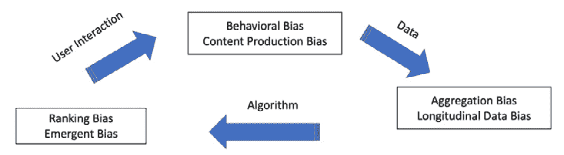

图 7.1 – 基于来源的不同类型偏差流动

## 偏差的原因

在以下列表中，我们将详细了解偏差的具体原因：

+   **数据集偏斜**：数据集可能会显示出向出现频率较低的类别偏斜。这种偏差通常随着时间的推移以复合速率增加。犯罪数据集表现出这种偏斜性，我们在任何地区都看到有限数量的罪犯与无辜人群的对比。一旦偏斜被观察到，侦探和警察部门也往往会有所偏见，向高犯罪率地区派遣更多的警力。这可能导致高犯罪率的揭示，与其他地区相比，更多的警力部署到这些地区。

+   **训练数据不足**：我们发现，当某些特定人群或其他群体的数据有限时，机器学习模型往往会产生偏差结果。此类模型未能察觉在极少数人群中存在的特殊特征。我们在*第三章*中看到过这样的例子，面部识别技术对白人男性的图像比对黑人女性的图像更为准确。

+   **人类偏见**：数据集经常因为人类偏见而受到污染。一个例子可以从我们收集的美国就业数据中看出。在关于美国 500 强公司的数据中，女性几乎没有担任 CEO。这是因为女性 CEO 的数量较少，而且我们未能收集到女性担任 CEO 的相关数据。基于这些数据训练的模型自然会预测，女性与担任 CEO 的相关性较差。

+   **数据去偏见**：为了去除历史数据中的偏见，我们常见的方法是删除敏感属性，但这并不能完全消除偏见。实验研究表明，相关的属性常常作为代理，即使在删除了敏感属性后，仍然为系统性歧视少数群体提供了条件。一个例子是，当某个地区主要由黑人居住，删除种族列并不能去除偏见，因为该地区的邮政编码仍然存在。为了避免这种情况，建议保留敏感列，并在模型训练过程中直接监控并修正由于代理特征存在而产生的违规行为。

+   **数据去偏见的副作用**：为了去除数据偏斜和模型偏见的技术有时会在下游模型中产生不良的副作用。曾观察到，当一个语音识别算法在男性和女性之间进行微调时，女性的结果明显差于男性。研究人员进一步发现，使用留存样本对模型进行偏见测试并没有解决问题，因为测试数据集本身也存在偏见。

+   **有限特征的可用性**：当某些特征对少数群体比对多数群体的对照组信息更少或可靠性较差时，模型在少数群体的准确性通常远低于多数群体。

+   **数据和 AI 专业人士的多样性**：研究发现，多样性的缺失是偏见的主要原因之一。团队中的多样性可以帮助减少偏见。由算法公正联盟创始人、MIT 媒体实验室前成员 Joy Buolamwini 提出的一项研究表明，当一位加纳裔美国计算机科学家加入她的研究团队时，团队发现了某些问题。她的团队发现，面部识别工具存在偏见，且在她的较深肤色上表现较差——只有她戴上白色面具时才会起作用。

+   **驾驶公平算法的成本**：没有投资于公平性的组织，其机器学习模型通常更具偏见。组织需要投入人力资源专家，并教育人员选择公平的机器学习模型设计。这可能会以牺牲模型准确性和公平性指标之间的合理权衡为代价，从而影响利润率、收入或客户数量。因此，在执行相关规定之前，必须平衡这两个目标。

+   **外部审计**：偏见也可能源于缺乏适当的外部审计。外部审计到位时，可以检测到偏见数据集或存在的算法偏见。然而，组织这些审计可能会违反 GDPR、CCPA 及其他严格执行客户敏感数据隐私的法规。一种解决办法是利用合成数据工具，这些工具可以生成完全匿名、完全现实且具有代表性的数据集。一个组织可以依赖合成数据集来训练机器学习模型，而不违反隐私法，因为共享数据不会侵犯个人隐私。

+   **公平模型变得有偏**：如果没有持续监控输入数据和模型指标，公平模型往往会变得有偏。一个这样的例子是微软开发的 AI 聊天机器人**Tay**。微软不得不将 Tay 从网络上撤下，因为它在学习 Twitter 用户的对话时变得性别歧视和种族主义。持续监控和评估模型指标可以帮助防止偏见随着时间的推移而产生。

+   **有偏的 AI 及其恶性循环**：如果我们没有衡量和评估 AI 算法中的偏见，它将深入社会，并可能变得更加有害。一个这样的例子是谷歌的搜索算法，在搜索**黑色手**等术语时，显示了种族主义的图像。通过搜索，结果本可以显示出更中立的图像，而不是 perpetuating 偏见并显示贬低的描述，如果初始搜索结果和点击结果没有指向那些有偏的图像。

现在，我们理解了在训练机器学习模型时如何引入偏见。我们还应该意识到歧视过程也会产生有偏的模型。

**歧视**是由于人类偏见和基于数据集中敏感属性的刻板印象而引发的不公平的另一种来源。歧视主要来源于系统或统计数据。**系统性歧视**指的是组织内现有的政策、习惯或行为，这些政策、习惯或行为加剧了对某些群体的歧视。**统计歧视**则发生在决策者使用群体的平均统计数据来判断该群体的个体时。

因此，我们可以说，在生成有偏的机器学习模型时，数据集扮演着重要角色，因为它提供了在模型训练阶段所学到的统计数据、特征和数据模式。

在这一部分中，我们研究了存在于系统中的不同类型的偏见。为了避免偏见，我们需要确保每个人都能获得公平的对待，为此我们需要定义什么是公平的对待。我们将在下一部分中讨论这一点。

# 定义公平性

在这一部分中，让我们尝试理解研究人员描述的不同类型的公平性，以避免**歧视**或对人们的不公正对待。机器学习算法和从业人员在这个问题上正受到越来越多的关注，以减少在信用、就业、教育和刑事司法等领域的不公平待遇风险。目标是设计不受受保护属性（如性别、种族和民族）影响的机器学习算法和流程，同时仍能提供公平的预测。我们将通过一些不同的公平性定义和示例来探讨这一问题。

数值型和二进制属性最常用于陈述和测试公平性标准。分类特征可以转换为一组二进制特征。通常，我们交替使用“受保护群体”和“未受保护群体”、“优势群体”和“劣势群体”、“多数群体”和“少数群体”这几个术语，以区分人口的不同群体，并评估不同群体的公平性。在本部分讨论的定义中，我们将主要使用已婚/离婚女性求职者和已婚/离婚男性求职者来演示如何避免偏袒或不公正对待，以确保模型预测的公平和公正。在这里，*求职者*指的是初始阶段的求职申请者。

## 基于统计指标的公平性类型

公平性的统计度量依赖于指标，这些指标可以通过混淆矩阵来最佳解释——混淆矩阵是一种通过将预测结果与实际数据进行比较生成的表格，实际表示分类模型的不同准确性指标。矩阵的行和列分别表示预测类和实际类。对于二分类器，预测类和实际类都包含两个值：正类和负类，如下图所示。以下定义进一步说明了位于*图 7.2*中矩阵四个象限的指标：

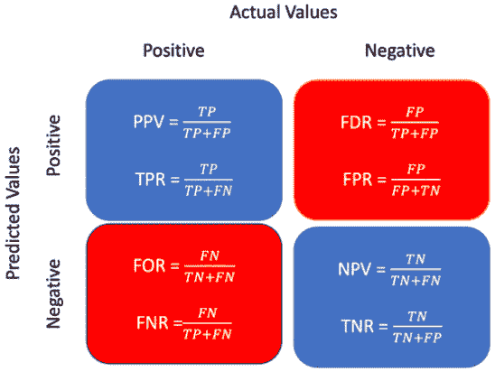

图 7.2 – 模型分类指标

### 真阳性（TP）

模型的预测结果和实际数据都属于正类（在二分类中为真）。

假阳性（FP）

模型的预测结果为真，而实际数据为假，属于负类。

### 假阴性（FN）

模型预测的结果是错误的，并且属于负类，而实际的真实数据是正确的，属于正类。

### 真阴性（TN）

模型预测和真实数据都是错误的，且它们都属于负类。

### 正预测值（PPV）/精确度

这是所有预测为正类的样本中，准确预测为正类或属于正类的正样本的比率。它表示一个预测结果为正的对象，实际上也真正属于正类的概率，*P*(*Y =* 1*|d =* 1)，例如，预测为高资格分数的候选人实际上其资格分数也很高。

### 假发现率（FDR）

这是所有预测为正类的负样本中，错误预测为正的比率。FDR 表示假接受的概率，*P*(*Y =* 0*|d =* 1)，例如，预测为具有良好资格分数的求职者，实际上其真实资格分数却被报告为低。

### 假遗漏率（FOR）

这是将正类样本错误分类并预测为负类的比率。FOR 表示真实值样本被不准确拒绝的概率，*P*(*Y =* 1*|d =* 0)。我们最常见的情况是，某个求职者被评估为具有低的预测资格分数，但该候选人实际上有一个较好的分数。

### 负预测值（NPV）

这是所有预测为负类的样本中，准确预测为负类的负样本的比率。NPV 表示一个被预测为负类的对象（或候选人）真正属于负类的概率，*P*(*Y =* 0*|d =* 0)。

### 真阳性率（TPR）

这是所有实际正类的样本中，准确预测为正类的正样本的比率。TPR 通常被称为敏感度或召回率，它表示一个真正属于正类的对象被正确识别的概率，*P*(*d =* 1*|Y =* 1)。在我们的例子中，它是一个具有良好资格分数的求职者的真实数据被模型准确预测的概率。

### 假阳性率（FPR）

这是模型将负样本错误预测为正的比率，所有实际负类的样本中。FPR 表示假警报的概率，*P*(*d =* 1*|Y =* 0)。例如，当一个实际具有低资格分数的候选人被模型错误分类，并被不准确地给予一个高的资格分数时，就会发生这种情况。

### 假阴性率（FNR）

这是在所有实际为正的案例中，错误地预测为负的样本的比例。FNR 代表给定实际结果下的负面结果概率，*P*(*d =* 0*|Y =* 1)。举个例子，当一个入选者的资格分数有可能被错误分类时。

### 真负率（TNR）

这是在所有实际为负的案例中，准确预测为负类的样本的比例。TNR 代表给定一个假值并且实际上属于负类的结果的概率，*P*(*d =* 0*|Y =* 0)。当一个资格分数较低的入选者被正确分类时，我们会观察到这一点。

让我们在 COMPAS 数据集上计算这些得分：

1.  让我们首先导入必要的 Python 库：

    ```py
    %matplotlib inline
    from IPython.core.interactiveshell import InteractiveShell
    InteractiveShell.ast_node_interactivity = "all"
    import numpy as np
    import pandas as pd
    import matplotlib.pyplot as plt
    import seaborn as sns
    from sklearn.metrics import confusion_matrix
    ```

1.  接下来，我们加载数据：

    ```py
    url = 'https://raw.githubusercontent.com/propublica/compas-analysis/master/compas-scores-two-years.csv'
    df = pd.read_csv(url)
    ```

1.  我们将数据集转换为二元分类问题，以评估一个人是否有较高/中等/低风险的再犯：

    ```py
    df['is_med_or_high_risk'] = (df['decile_score']>=5).astype(int)
    ```

1.  接下来，我们绘制在按每行标准化后的模型性能——我们想查看 PPV、FDR、FOR 和 NPV：

    ```py
    cm = pd.crosstab(df[‘is_med_or_high_risk’], df[‘two_year_recid’], rownames=[‘Predicted’], colnames=[‘Actual’], normalize=’index’)
    p = plt.figure(figsize=(5,5));
    p = sns.heatmap(cm, annot=True, fmt=".2f", cbar=False
    ```

这将产生以下输出：

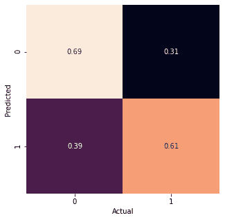

图 7.3 – 使用 COMPAS 数据集的混淆矩阵

1.  我们也可以使用`sklearn`混淆矩阵打印这些值：

    ```py
    [[tn , fp],[fn , tp]]  = confusion_matrix(df['two_year_recid'], df['is_med_or_high_risk'])
    print("True negatives:  ", tn)
    print("False positives: ", fp)
    print("False negatives: ", fn)
    print("True positives:  ", tp)
    ```

1.  然后，我们集中在非裔美国人或白人被告身上，因为他们是 ProPublica 声明的主题：

    ```py
    df = df[df.race.isin(["African-American","Caucasian"])]
    (df['two_year_recid']==df['is_med_or_high_risk']).astype(int).groupby(df['race']).mean()
    ```

这将产生以下输出：

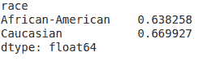

图 7.4 – 非裔美国人和白人的公平性准确度指标

在这里，我们看到公平性度量在两个群体之间并不相同。

## 基于预测结果度量的公平性类型

本节列出的公平性类型主要关注在考虑的问题中，涉及的不同人口群体的预测结果。

### 群体公平性/人口统计学平衡

这也常被称为统计平衡或等接受率。这关系到是否在保护组（如种族、性别、民族等）和非保护组之间，受试者在预测为正类的分类中表现出相等的概率。例如，当男女申请者有相等的机会达到同样优秀的预测资格分数时，该条件将得到满足：*P* (*d =* 1*|G = m*) *= P* (*d =* 1*|G =* *f*)。

为了进一步说明这一点，假设一个机器学习模型预测已婚/离婚的男性和女性入选者的分数分别为 0.81 和 0.75。在这种情况下，可以说分类器失败了，因为它未能满足男女两者之间分数相等的目标。

### 条件统计平衡

这个定义超出了之前的定义，通过允许一组可以影响模型预测的属性。进一步解释，这个度量只有在受保护组和非受保护组具有相同概率被指定为真实类时才算满足。这可以通过一组允许的因素*L*（包括参赛者的信用历史、就业状况和年龄）来控制。因此，为了从数学上说明男女参赛者在获得良好资格得分的概率相等，我们可以表示为：

*P* (*d =* 1*|L = l, G = m*) *= P* (*d =* 1*|L = l, G =* f*)

然而，已婚/离婚男性和女性参赛者的得分可以非常接近；例如，它们分别是 0.46 和 0.49。当我们看到两组之间存在如此微小的差异时，我们可以允许一个阈值因子来允许这种可接受的差异。

### 基于预测和实际结果度量的公平性类型

这里列出的公平性概念超越了模型对不同群体的预测结果*d*的考虑，它们还计算与实际结果*Y*（如实际数据中的真相所示）进行比较的评估度量，并记录在数据集中。

### 预测平等性

这个概念非常重要，它确保分类器能够保证受保护组和非受保护组在预测正类值（PPV）上表现出相同的度量——确保一个主体展示真实或正预测值的概率实际被包括在正类中。举个例子，我们需要确保男性和女性参赛者展示出相同的概率得分。这可以表述为：

*P (Y =* 1*|d =* 1*, G = m*) *= P* (*Y =* 1*|d =* 1*, G =* f*)

此外，一个具有相等 PPV 的分类器也会有相等的 FDR，这意味着：

*P (Y =* 0*|d =* 1*, G = m) = P (Y =* 0*|d =* 1*, G =* f)*

这些度量可能不完全相等，并且允许组之间存在一定的阈值差异。例如，一个分类器可能记录已婚/离婚男性和女性参赛者的 PPV 分别为 0.73 和 0.74，男性和女性参赛者的 FDR 分别为 0.27 和 0.26。

在现实世界的机器学习算法中，我们通常发现任何训练好的分类器对有优势的群体更为了解，并将其预测为正类。而劣势或少数群体的预测结果则面临更多正确评估的挑战，主要是因为该群体的数据有限。

### 假阳性错误率平衡/预测平等性

该指标确保分类器满足受保护组和未受保护组在行为上表现出相似性，通过展示平等的假阳性率（FPR）来体现——这是一个用于衡量误分类率的指标——即包含假值且被归入负类的对象实际具有真正的正预测值。例如，这个概念意味着男性和女性的参赛者展示相同的概率度量，导致那些成绩较低的参赛者被预测为具有较高的预期成绩。从数学上讲，可以表示为：

*P* (*d =* 1*|Y =* 0*, G = m) = P (d =* 1*|Y =* 0*, G =* *f*)

在这种情况下，具有相等假阳性率的分类器也将表现出相等的真阴性率（TNR）。因此：

*P* (*d =* 0*|Y =* 0*, G = m) = P (d =* 0*|Y =* 0*, G =* *f*)

从实际值来看，已婚/离婚男性和女性参赛者的假阳性率（FPR）分别为 0.70 和 0.55，而真阴性率（TNR）分别为 0.30 和 0.45。如果分类器倾向于将良好的预测分数分配给曾经有低信用的男性，它将违反上述定义，并导致分类器的失败。

### 假阴性错误率平衡/平等机会

这个概念确保分类器满足以下条件：无论是受保护组还是未受保护组，其假阴性率（FNR）相等——即包含真实值且被归入正类的对象实际上具有负预测值。这种情况由于误分类而发生。从数学角度来看，可以表示为：

*P* (*d =* 0*|Y =* 1*, G = m*) *= P* (*d =* 0*|Y =* 1*, G =* *f*)

这意味着，在男性和女性组中，任何具有良好预测分数的参赛者都被误分类，并且预测为具有较低的分数。具有相等假阴性率的分类器也将具有相等的真正阳性率（TPR）。从方程的角度来看，以下条件成立，其中 TPR 应该对于男性和女性相同：

*P* (*d =* 1*|Y =* 1*, G = m*) *= P* (*d =* 1*|Y =* 1*, G =* *f*)

例如，已婚/离婚男性和女性参赛者的假阳性率（FPR）和真正阳性率（TPR）分别为 0.13 和 0.87。由于分类器在男性和女性中展现出相等的良好预测分数，这将导致这两个组别的平等待遇。如果分类器还能够满足两组的低分数要求，那么它将被视为满足群体公平性的条件。

### 平等化机会/不平等待遇

这种公平性类型，也被称为**条件程序准确性平等**，通过结合前两个定义来强化公平性条件。它标准化了男性和女性人群的错误率，其中分类器在受保护和非受保护群体具有相等的 TPR 和相等的 FPR 时才能被认为是满意的。因此，当具有良好资格分数的参与者也被模型正确地指定为良好预测资格分数时，这充当了一个组合函数，确保男性和女性群体之间的平等。在现实中，参与者具有低资格分数的概率被模型错误分类，并指定为良好预测的资格分数。在数学上，它可以表达为：

*P* (*d =* 1*|Y = i, G = m*) *= P* (*d =* 1*|Y = i, G = f*)*, i* *∈*0, 1

例如，一个分类器展示出已婚/离婚男性和女性参与者的 FPR 为 0.70 时，仅当它同时记录了男性和女性的 TPR 为 0.86 时，才能满足不同的错误对待条件。但另一方面，它展示了对男性群体的优先对待，记录了 0.80 的 FPR，而对女性群体的 FPR 则为 0.70。这种优先或有偏差的处理将导致分类器未能满足平等的几率条件。因此，分类器通常被发现满足预测的平衡，但未能满足几率的平等条件。

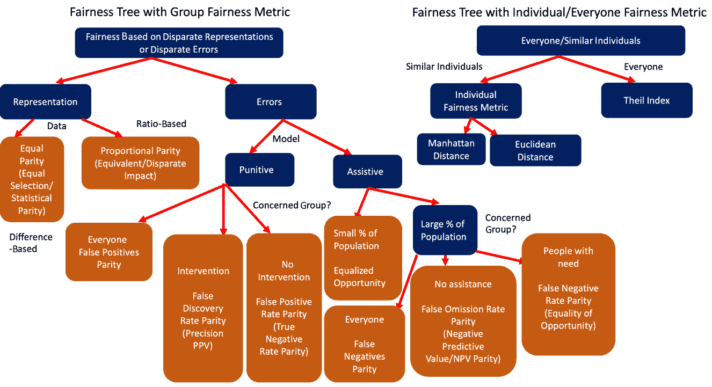

图 7.5 – 代表群体/个体/总体公平不同类型的两棵公平树

*图 7**.5* 提供了这些公平定义的简要表示。前述图像展示了两棵公平树 – 第一棵是处理群体公平性时使用的，第二棵是处理个体或所有人公平性时使用的。

所谓的**Theil 指数**是一种经济不平等度量指标，用于量化当前资源（例如收入）在不同人群之间和内部分布的差异。因此，它有助于衡量在人群和亚群体内部的不平等程度（通过给出亚群体内的不平等的加权平均值），从而帮助人们测量人群的不平等性。

要计算个体公平度量，我们可以使用**曼哈顿距离**（计算两个数据集中样本之间的平均曼哈顿距离）或**欧几里得距离**（计算两个数据集中样本之间的平均欧几里得距离）。对于个体公平性，我们遵循一种类似的方法，适用于类似的个体，而不考虑他们与任何群体的关系。

基于不同的代表性或不同的错误生成了一个群体公平性树。这基于以下两个因素。

### **基于差异化表示的公平性 – 平等对比/比例对比**

公平性树分裂为平等对比，当我们关注从每个组中选取相同人数时，或者比例对比，当我们关注按其在总体中的比例选取人数时。

### **基于系统中的差异化错误的公平性 – 惩罚性/辅助性错误指标**

公平性树根据我们是否关注进行可能伤害或帮助个体的干预，分裂成惩罚性或辅助性错误指标。

我们进一步在*图 7.6*中说明了使用成人数据集计算群体公平性指标的过程（[`archive.ics.uci.edu/ml/datasets/adult`](https://archive.ics.uci.edu/ml/datasets/adult)）。

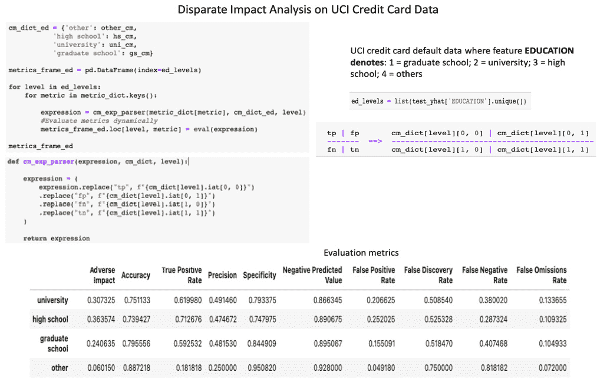

图 7.6 – 基于成人数据集的群体公平性指标评估

### 条件性使用准确度平等

这种类型的公平性建立在将两个相等条件，PPV 和 NPV，结合起来的基本原则上。在这里，所考虑的对象在现实中具有真实预测值的概率被归类为正类（PPV）。我们还会观察到，实际中具有错误预测值的对象的概率被归类为负类（NPV）。在数学上，这可以表示为：

(*P* (*Y =* 1*|d =* 1*, G = m*) *= P* (*Y =* 1*|d =* 1*, G = f* ))*∧*(*P* (*Y =* 0*|d =* 0*, G = m*) *= P*(*Y =* 0*|d =* 0*,G =* *f* ))

男性和女性参与者的准确度相当。这意味着男性和女性参与者表现出相等的概率，展示相等的准确度值。进一步解释，一个良好的预测资格分数表示参与者应有的资格分数，而低预测资格分数则表示低资格分数。如同前述的指标，当性别偏见影响时，男性参与者的低预测分数的可能性降低，导致男性参与者获得不该有的较好资格分数。通过这个等效准确度指标来演示，男性和女性参与者分别具有 0.73 和 0.74 的 PPV，以及 0.49 和 0.63 的 NPV。

### 总体准确度平等

这迫使分类器满足保护组和非保护组表现出相等预测准确度的条件。在实际的基准数据中，真实或错误的预测值的概率被归类为正类或负类。模型的预测也使用相同的类别标签。这一定义意味着真实负样本和真实正样本同样重要。从数学角度，这可以表示为：

*P* (*d = Y, G = m*) *= P* (*d = Y, G =* *f*)

该指标允许男性和女性之间存在微小差异，其中两组的总体准确率分别为 0.68 和 0.71。然而，在此示例中，我们考虑的是总体准确率，而不是预测类别的个别准确率。

### 对待平等

这个指标确定了分类器的错误比率，而不是考虑其准确度。因此，分类器确保受保护和未受保护群体展示相同的假阴性和假阳性的比率（*FN/FP*），例如男性和女性参赛者的假阴性和假阳性比率分别为 0.56 和 0.62。这个概念的提出旨在确保不同群体在进行机器学习分类器公平性评估时，**假阴性**（**FN**）与**假阳性**（**FP**）的比率相等。

## 基于相似性度量的公平性类型

基于统计指标构建的公平性类型通常会忽视除敏感属性以外的所有属性，这导致即使同样的男性和女性参赛者展现相同的技能或标准，也会对某一组群体产生不公平待遇。当选择是随机进行的，而另一个群体（如女性）的选择则基于其他某些属性（例如拥有更多储蓄）时，就会出现这种情况。这会导致差异，尽管统计平等会将分类器标记为公平。以下提出了几种公平性类型，用以解决由于选择偏差引起的问题，通过消除被分类群体中无关属性*X*的边缘化。

### 因果歧视

当分类器对任何两个具有完全相同特征（或属性）*X*的对象做出相同分类时，就可以说它满足因果歧视的条件。为了满足这一标准，具有相同属性的男性和女性应分别被指定为良好的合格分数或低的合格分数，而且这应该对两组是相同的。数学上可以表示为：

(Xf = Xm ∧ Gf `!` = Gm) → df = dm

为了测试此公平性度量，对于测试集中的每个参赛者，我们需要生成对立性别的相同参赛者，并比较这些参赛者的预测分类概率。如果我们未能为这两组实现相同的概率，分类器将失败。

### 通过无意识实现公平

当分类器没有显式使用任何敏感属性来预测最终模型结果时，可以说它满足公平性条件。训练这样的模型要求在训练过程中不能使用与性别、种族或民族相关的特征。数学上，两个相似的参与者 *i* 和 *j*（性别不同）具有相同属性时，分类结果可以表示为（X : Xi = Xj → di = dj）。为了验证这一条件，对于测试集中的每个参与者，我们需要生成性别相反的相同参与者，并比较这两个参与者的预测分类概率。然后，使用任何分类算法（如逻辑回归或随机森林分类器）训练该分类器，且不使用任何敏感属性，只有当它为两个组生成相同的概率时，才验证其成功。然而，我们还需要确保不使用任何直接敏感属性的代理特征来训练模型，这可能会导致模型结果产生不公平的结果。

### 通过意识实现公平

这种公平性度量结合了前两种类型，说明了相似的个体应展示相似的分类。我们可以基于距离度量来评估个体的相似性，其中个体的预测结果分布应该位于计算出的个体之间的距离之内。当 *D*(*M*(*x*), M(*y*)) ≤ *k*(*x, y*) 时，可以说满足公平性标准，其中 *V* 代表参与者集合，*k* 是两个参与者之间的距离度量，*D*（距离）表示预测输出分布之间的度量，*V × V* → *R* 创建从一组参与者到结果概率分布的对齐 *M: V* → *δ**A*。

现在让我们通过一个例子进一步说明。由于 *k* 表示两个参与者 *i* 和 *j* 之间的距离，如果 *X* 中的特征（除性别外的所有特征/属性）相同，则 *k* 的值可以为 *0*；如果 *X* 中的一些特征不同，则 *k* 的值为 *1*。如果分类器的预测结果属于同一类别，则 *D* 可以定义为 *0*，否则定义为 *1*。这里考虑的度量是距离，它是通过规范化年龄、收入等属性之间的差异计算得到的。简化版本的减少确保了距离的易表示，这表示模型对两个参与者预测概率的统计差异：*D*(*i, j*) = *S*(*i*) − *S*(*j*)。

## 基于因果推理的公平性类型

我们所讨论的公平类型是基于有向无环图（DAG）设计的，其中节点表示一个人的属性，边表示属性之间的关联。这样的图有助于构建公正的分类器和其他机器学习算法，因为它们是由属性之间的关系及其对模型结果的影响驱动的。这些关系可以通过一组不同的方程式进一步表达，以确定敏感属性的影响，并允许设定容忍阈值，从而允许不同群体之间存在一定的歧视。

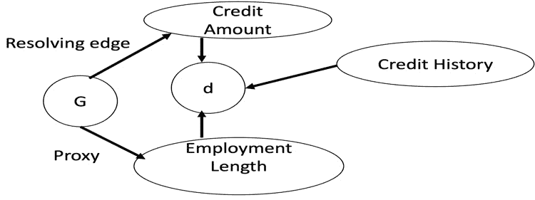

图 7.7 – 包含代理属性和解决属性的因果图

*图 7**.7* 显示了一个因果图，其中包含信用额度、就业年限、信用历史、**保护属性** **G**（或性别）和预测结果 **d**。*图 7**.7* 描述了如何从另一个属性中推导出 **代理属性**（如 **G**），在我们这个例子中，代理属性是就业年限。正如因果图所示，我们可以轻松地从一个人的就业年限推导出其性别。类似地，在因果图中，我们使用 **解决属性** 这一术语来描述由保护属性决定的属性，这种决定方式是公正的，不带有任何歧视。信用额度作为 **G** 的解决属性，其中不同 **G** 值下的信用额度变化不被视为偏见，也不带有任何歧视。

现在，让我们基于因果推理来看看不同类型的公平性：

+   **反事实公平**：当因果图中的预测结果 **d** 不依赖于保护属性 **G** 的任何后代时，这种公平性就适用。我们在 *图 7**.7* 中看到，**d** 依赖于信用历史、信用额度和就业年限。即使只有一个直接的后代 **G**，在这种情况下是就业年限，也会导致模型不满足反事实公平的条件。

+   **无未解决歧视**：当保护属性 **G** 到预测结果 **d** 之间没有任何路径时，因果图中就存在这种属性。解决变量的存在可以视为例外，不构成任何违规。在 *图 7**.7* 中，存在一条从 **G** 到 **d** 的路径，经过信用额度，这条路径是不带有歧视的。信用额度的存在使得解决属性得以建立，并进一步通过就业年限生成一条歧视性路径。因此，这个图展示了一个未解决歧视的例子，无法满足这一类型的公平性。

+   **无代理歧视**：因果图的这一属性意味着它没有任何代理歧视。换句话说，这意味着从受保护属性**G**到预测结果**d**之间不存在路径。在没有代理变量造成阻塞的情况下，可以说因果图没有代理歧视，从而确认数据的无偏表示。然而，在我们的例子中，从**G**到**d**通过就业时长代理属性存在间接路径，这意味着该图存在代理歧视。

+   **公平推理**：这种因果图中的公平性通过将路径标记为合法或不合法，帮助路径分类过程。因果图保证满足公平推理条件，即不存在从**G**到**d**的不合法路径。然而，正如*图 7.7*所示，通过信用额度存在另一条不合法路径，意味着它无法满足公平推理的条件。就业时长是信用相关决策中的一个重要因素，因此尽管它作为**G**的代理候选人，但这条路径可以被视为合法路径。

我们已经研究了不同的公平性统计衡量标准，但单凭这些是无法得出预测是否公平的结论的，它们假设有实际的、经过验证的结果。即使使用了统计指标，我们也不能确定训练数据中的结果总会出现在分类模型中，并且预测结果也会遵循相同的分布。为了支持模型预测中的公平性，也提出了使用基于距离的相似性度量和因果推理的更先进的公平性定义，但这些方法需要专家干预来确认结果。

寻求专家判断的一个问题是，它们可能会涉及偏见。现代研究技术探讨了如何在不妥协准确性的情况下减少搜索空间。此外，当我们尝试在解决方案中满足所有公平性条件时，解决方案的复杂性会增加，因为这样做需要探索更大的搜索空间。公平预测还需要考虑社会问题，如资源获取不平等和社会条件化。参与数据处理和机器学习模型开发的团队应尽量分析社会问题的影响，并在设计公平解决方案时加以考虑。

牢记这些公平性类型后，我们现在尝试掌握一些开源工具和技术，用于进行数据审计和质量检查。

# 数据审计和质量检查在公平性中的作用

在深入研究预测算法和评估公平性指标之前，我们必须先检查训练数据是否存在偏向于大多数人口群体的倾斜或偏见。这主要是因为大多数偏见源于对于人口中弱势群体或少数群体的数据不足。此外，当我们没有应用任何处理数据不平衡的技术时，偏见也会出现。在这种情况下，整合可解释性工具来证明数据的变化性和偏斜性是至关重要的。

现在让我们来探讨如何使用某些工具来衡量数据不平衡并解释变化性。我们首先要使用的工具之一是**Fairlens**，它有助于公平性评估和改进（如评估公平性指标、缓解算法、绘图等）。这里提供了一些示例代码片段（使用 COMPAS 数据集），这将帮助我们理解数据分布并评估公平性标准。

运行所有测试所需的导入如下：

```py
import pandas as pd
import fairlens as fl
df = pd.read_csv""../datasets/compas.cs"")
```

## 公平性评估

让我们尝试使用 Fairlens：

1.  `fairlens.FairnessScorer` 类可以用来自动生成数据集的公平性报告，只需提供目标列。在这里，目标列与敏感属性是独立的。我们可以通过传入所需输出列的名称，分析用于监督学习的数据集中的固有偏见。现在，让我们生成数据集的人口统计报告：

    ```py
    fscorer = fl.FairnessScorer(df,""RawScor"", ""Ethnicit"",""Se""])
    fscorer.plot_distributions()
    print""Demo Re"", fscorer.demographic_report())
    ```

这将生成如下输出，显示所有主要人口群体的分布评分完整表现。

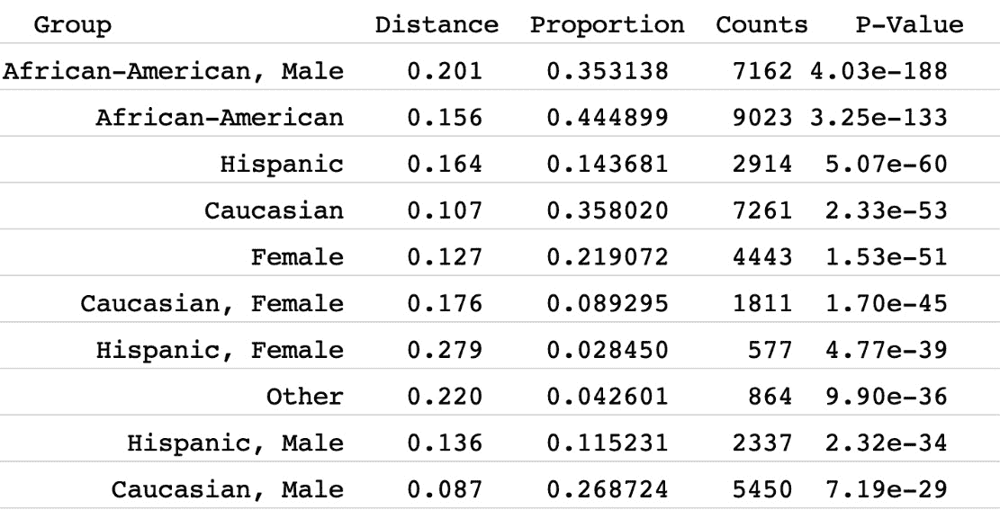

图 7.8 – 各人口群体的分布统计

1.  我们还绘制了非裔美国人和白人群体的十等分评分分布，如下所示：

    ```py
    group1 = ""rac"": ""African-America""]}
    group2 = ""rac"": ""Caucasia""]}
    fl.plot.distr_plot(df,""decile_scor"", [group1, group2])
    plt.legend(""African-America"",""Caucasia""])
    plt.show()
    ```

这将给出以下输出：

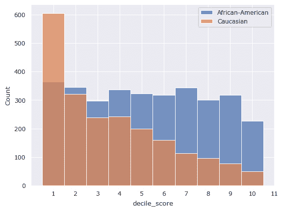

图 7.9 – 两个群体的比例 – 多数与少数

### 统计距离

这是另一个我们希望考虑的重要距离参数，如果我们想评估两个敏感人口群体/子群体之间分布的差异性。该指标用于评估两个概率分布（`group1`和`group2`）相对于目标属性的统计距离。

这可以通过以下代码来完成，返回（`0.26075238442125354, 0.9817864673203285`）。它返回距离和 p 值，因为`p_value`设置为`True`：

```py
group1 = ""Ethnicity"": ""African-America""]}
group2 = df""Ethnicity""] ==""Caucasia""
print (fl. metrics. stat_distance(df, target_attr, group1, group2, mode""aut"", p_value=True))
```

### 代理检测

该指标帮助我们评估某些数据集中的代理特征。一些不敏感的属性可能会与敏感列高度/部分相关，从而有效地成为它们的代理。这反过来会使得在使用相同数据集进行训练时，模型变得有偏。这里，我们可以尝试评估四个不同数据点中隐藏的不敏感代理特征：

```py
col_names = ""gende"",""nationalit"",""rando"",""corr"",""corr""]
data = [
    ""woma"",""spanis"", 715, 10, 20],
    ""ma"",""spanis"", 1008, 20, 20],
    ""ma"",""frenc"", 932, 20, 10],
    ""woma"",""frenc"", 1300, 10, 10],
]
df = pd.DataFrame(data, columns=col_names)
print(fl.sensitive.find_sensitive_correlations(df))
```

## 线性回归

线性回归可以通过评估因变量和自变量之间的相关性，帮助我们识别代理特征。

### 余弦相似度/距离方法

余弦相似度是用于检测代理特征的机制之一，其中相似度因子在多维空间中评估相似项。当数据集中的任意两个特征（例如，在贷款申请数据集中）之间的余弦相似度方向相同，它们就会成为代理特征。这样的情况在看到月收入和支出作为代理特征时尤其明显，尤其是在贷款申请中，考虑到申请人的性别和抚养人数。

### 使用方差的线性关联方法

该指标在 Yeom、Datta 和 Fredrikson 的论文《*在线性回归模型中寻找歧视性代理*》中进行了讨论（[`arxiv.org/pdf/1810.07155.pdf`](https://arxiv.org/pdf/1810.07155.pdf)），旨在衡量两个属性之间的关联。要计算此指标，我们需要计算 *cov* (*X*1, *X*2)2 / *Var* (*X*1) *Var* (*X*2)，其计算方法如下：

1.  首先，我们需要计算两个特征属性之间的协方差因子：

    ```py
    covar_sex_dur = data.Sex.cov(data.Duration)
    ```

1.  下一步是计算特征属性的各自方差：

    ```py
    variance_sex = data.Sex.var()
    variance_dur= data.Duration.var()
    ```

1.  然后，我们尝试评估特征属性之间的线性关联度：

    ```py
    association = covar_sex_dur/(variance_sex*variance_dur)
    print ""Association between Sex and Duratio"", association)
    ```

我们得到以下输出：

```py
Association between Sex and Duration -0.014593816319825929
```

现在，让我们来看一下如何确定保护特征与其他特征之间的相关性。

## 方差膨胀因子

**方差膨胀因子**（**VIF**）指标旨在通过评估每个变量的决定系数（R2）来衡量多重共线性。由于该方法确定了代理特征，它可以帮助去除作为敏感/受保护属性代理的共线性或多重共线性特征。通过利用多个回归树，还可以进一步移除特征。

在回归模型中，保护特征与其他特征之间的 VIF 值较高，表示多个共线性特征之间的共线性信号。此外，这也表明另一个特征存在强烈的共线性，因此成为研究特征的代理：

1.  第一步是导入 VIF 所需的库并加载`german_credit`数据集：

    ```py
    import pandas as pd
    from statsmodels.stats.outliers_influence import variance_inflation_factor
    df = pd.read_csv""../datasets/german_credit_data.cs"")
    data = df[''Ag'',''Se'',''Jo'',''Duratio'',''Credit amoun'']]
    data = data.dropna()
    ```

1.  下一步是为敏感特征属性创建映射，并分隔我们希望计算 VIF 的自变量：

    ```py
    data''Se''] = data''Se''].map(''mal'': 0,''femal'': 1})
    X = data[''Ag'',''Se'',''Jo'',''Credit amoun'',''Duratio'']]
    ```

1.  最后一步是对数据运行 VIF，评估每个特征属性的 VIF，并发现潜在的代理特征：

    ```py
    vif_data = pd.DataFrame()
    vif_data""featur""] = X.columns
    vif_data""VI""] = [variance_inflation_factor(X.values, i)
                       for i in range(len(X.columns))]
    print(vif_data)
    ```

1.  我们得到以下输出，清晰地显示 `Job` 和 `Duration` 具有较高的 VIF 值。将它们一起使用会导致模型出现较高的多重共线性。它们作为潜在的代理特征候选：

    ```py
               feature    VIF
                Age  5.704637
                Sex  1.365161
                Job  7.180779
       Credit amount 3.970147
            Duration 6.022894
    ```

## 互信息

该度量表示在已知某个特征属性的情况下，另一个特征属性可用的信息量。它在非线性树形算法中通过计算 *I(X1, X2)* 来工作，*I(X1, X2)* 是联合概率的加权和，与 *COV(X1, X2)* 相对，后者是两个特征乘积的加权和：

1.  我们可以按如下方式计算 `german_credit` 数据集的互信息分数：

    ```py
    mi_1 = mutual_info_score(data''Ag''], data''Se''])
    mi_2 = mutual_info_score(data''Jo''], data''Se''])
    mi_3 = mutual_info_score(data''Duratio''], data''Se''])
    mi_4 = mutual_info_score(data''Credit amoun''], data''Se''])
    print""Mutual Inf"", mi_1, mi_2, mi_3, mi_4, mi_5)
    ```

1.  我们得到以下输出，这再次确认了信用金额与性别之间的关系较强，其次是性别与信用期限属性之间的关系：

    ```py
    Mutual Info 0.06543499129250782 0.003960052834578523 0.019041038432321293 0.5717832060773372
    ```

## 显著性检验

当我们评估公平性得分并评估统计距离时，我们也可能想要检验原假设，并查看原假设或备择假设是否成立。这可以通过自助法或排列检验来完成，通过多次重新采样数据。这些迭代会多次计算统计量，并通过计算度量的 p 值或置信区间来提供其分布的估计：

1.  让我们通过以下示例来看一下如何计算男性和女性分布之间的置信区间以及 p 值：

    ```py
    group1 = df[df""Se""] ==""Male"] ""RawScor""]
    group2 = df[df""Se""] ==""Female"] ""RawScor""]
    ```

1.  可以通过以下代码配置测试统计量。`t_distribution` 可以通过排列或自助法在之前创建的两个组之间进行设置：

    ```py
    test_statistic = lambda x, y: x.mean()–- y.mean()
    t_distribution = fl.metrics.permutation_statistic(group1, group2, test_statistic, n_perm=100)
    ```

或者，你可以使用以下代码：

```py
t_distribution = fl.metrics.bootstrap_statistic(group1, group2, test_statistic, n_samples=100)
```

1.  现在，让我们计算如图所示的置信区间和 p 值：

    ```py
    t_observed = test_statistic(group1, group2)
    print("Resampling Interval", fl.metrics.resampling_interval(t_observed, t_distribution, cl=0.95))
    print("Resampling Pval", fl.metrics.resampling_p_value(t_observed, t_distribution, alternative="two-sided"))
    ```

1.  现在我们得到以下输出。对于第一个案例，我们得到置信区间作为元组，而对于第二个案例，我们得到 p 值：

    ```py
    Resampling Interval (0.24478083502138195, 0.31558333333333327)
    Resampling Pval 0.37
    ```

## 评估组公平性

我们已经看到群体公平性对实现普遍公平性的重要性。Natalia Martinez、Martin Bertran 和 Guillermo Sapiro 是最小最大公平性标准概念的发明者，该概念旨在改进群体公平性指标。现在让我们研究一下最小最大公平性的重要概念 ([`github.com/amazon-research/minimax-fair`](https://github.com/amazon-research/minimax-fair))，它在没有保护性群体标签的情况下力图实现公平性。错误率平等是最直观且研究最深入的公平性形式之一。但在尝试通过提高错误率阈值来平衡错误率时，这会带来一个主要挑战，而这对于社会福利而言是不可取的。因此，提高错误容忍度以在种族群体、收入水平和地理位置上实现错误率平等并不是一个好的选择。为了进一步增加群体公平性，我们可以使用 Martinez 在 2020 年提出的最小最大群体误差。群体公平性的概念并不寻求平衡错误率（如前所述的公平性定义）。相反，这一度量指标试图最小化最大的群体误差率，以确保最差的群体在公平性度量方面表现出相同的值。这个放宽的公平性概念力图在最小最大公平性和整体准确性之间实现正确的平衡。该指标具有双重目标：

+   首先，它会尝试从给定的统计类别中找到一个最小最大群体公平模型

+   然后，它评估一个最小化整体错误的模型，其中约束已被设置为将所有群体的错误控制在指定的（预先确定的）阈值以下

前面两个步骤的目标是将过程简化为在同一类别上进行无约束（非公平）学习，在此过程中它们会收敛。最小最大公平性指标可以进一步扩展，以处理不同类型的错误率，如假阳性率（FP）和假阴性率（FN），以及具有交集特征的重叠群体。这些具有交集属性的群体不仅限于种族或性别，还可以是种族和性别的组合：

1.  使用数据集，我们生成 `X`、`y`、`grouplabels` 和 `groupnames`：

    ```py
    X, y, grouplabels, group_names, group_types, is_categorical = \
        setup_matrices(path, label, groups, usable_features=usable_features,
                       drop_group_as_feature=drop_group_as_feature,
                       categorical_columns=categorical_columns, groups_to_drop=groups_to_drop,
                       verbose=verbose,
                       save_data=save_data, file_dir=file_dir, file_name=file_name)
    ```

1.  这里`X` *和* `y` 是每种群体类型的特征和标签。此外，`X` 被划分为多个不同的群体，每个群体都有一个共享的线性函数。该函数用于带噪声的标签采样。在没有数据集的情况下，为了构建和评估一个公平的最小最大模型，我们可以使用合成数据生成机制，如以下代码片段所示：

    ```py
    generate_synthetic_data(numdims, noise, numsamples=1000, num_group_types=1, min_subgroups=2, max_subgroups=10, min_subgroup_size=20, mean_range=0, variability=1, num_uniform_features=0, intercept_scale=2, binary=False, drop_group_as_feature=False, save_data=False, file_dir='', file_name='', random_seed=0)
    ```

1.  现在可以启动学习过程，如以下代码片段所示，学习所需的参数在接下来的表格中给出：

    ```py
    minimax_err, max_err, initial_pop_err, agg_grouperrs, agg_poperrs, _, pop_err_type, total_steps, _, _, _, \
    _, _, _ = \
        do_learning(X, y, numsteps, grouplabels, a, b, equal_error=False,
                    scale_eta_by_label_range=scale_eta_by_label_range, model_type=model_type,
                    gamma=0.0, relaxed=False, random_split_seed=random_split_seed,
                    group_names=group_names, group_types=group_types, data_name=data_name,
                    verbose=verbose, use_input_commands=use_input_commands,
                    error_type=error_type, extra_error_types=extra_error_types, pop_error_type=pop_error_type,
                    convergence_threshold=convergence_threshold,
                    show_legend=show_legend, save_models=False,
                    display_plots=display_intermediate_plots,
                    test_size=test_size, fit_intercept=fit_intercept, logistic_solver=logistic_solver,
                    max_logi_iters=max_logi_iters, tol=tol, penalty=penalty, C=C,
                    n_epochs=n_epochs, lr=lr, momentum=momentum, weight_decay=weight_decay,
                    hidden_sizes=hidden_sizes,
                    save_plots=save_intermediate_plots, dirname=dirname)
    ```

现在让我们来看看在公平合成数据生成中涉及的不同参数及其功能：

| **参数名称** | **目的** |
| --- | --- |
| `X` | 一个特征的 NumPy 矩阵，其维度等于`numsamples`。 |
| `y` | 长度为`numsamples`的标签的 NumPy 数组。应为数值（0/1 标签的二进制分类）。 |
| `a, b` | *eta = a * t ^ (-b*) 的参数。 |
| `scale_eta_by_label_range` | 是否应该按最大绝对标签值平方缩放输入值。 |
| `rescale_features` | 是否应该重新调整特征值以确保数值稳定性。 |
| `gamma` | 收敛时允许的最大允许最大分组错误。 |
| `relaxed` | 表示我们是否正在解决问题的放松版本。 |
| `model_type` | `sklearn`模型类型，如`LinearRegression`、`LogisticRegression`等。 |
| `error_type` | 仅用于分类：总计、FP、FN 等。 |
| `extra_error_types` | 我们想要绘制的错误类型集合。 |
| `pop_error_type` | 在人群中使用的错误类型：例如，错误度量是整个人群的 FP/FN 总和。 |
| `convergence_threshold` | 当样本权重的最大变化 < `convergence_threshold`时，提前收敛。 |
| `Penalty` | logistic 回归的正则化惩罚。 |
| `C` | 正则化强度的倒数。 |
| `logistic_solver` | 用于 logistic 回归的底层求解器。 |
| `fit_intercept` | 是否应该拟合额外的截距。 |
| `max_logi_iters` | logistic 回归迭代的最大次数。 |

表 7.2 – 训练最小最大模型的不同参数

*图 7**.10*显示了使用 logistic 回归和最小最大组公平性的合成数据中个体组错误、组权重和平均人群错误的变化。我们可以看到，个体子组（log 损失错误）和平均人群错误（log 损失）大致遵循相同的趋势，并保持在`0.63`到`0.65`之间。

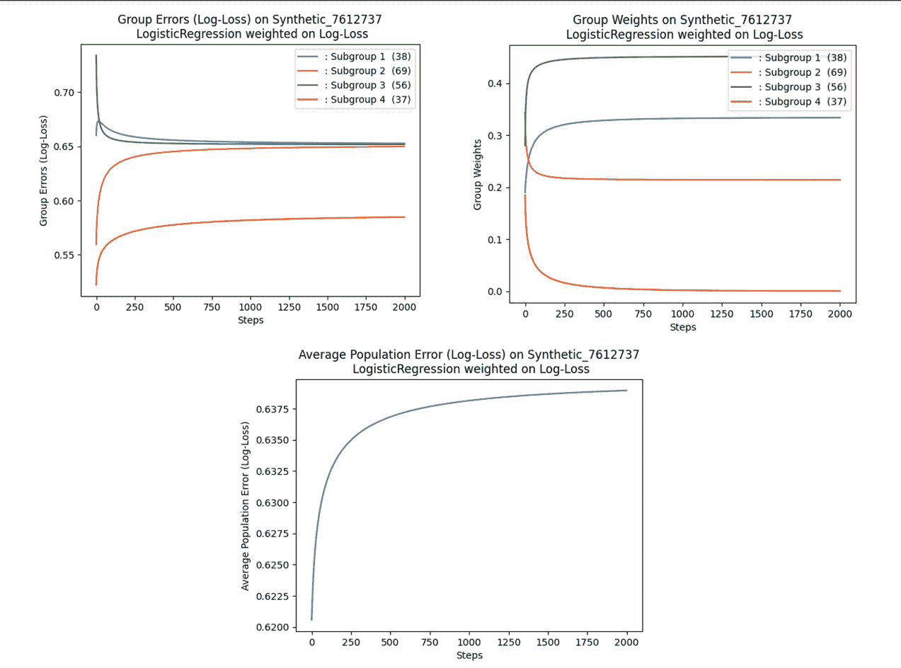

图 7.10 – 显示训练最小最大模型的不同参数的图表

## 评估反事实公平性

让我们使用开源的**FAT Forensics** (**fatf**)库，这是一个用于评估预测系统公平性、问责和透明性的 Python 工具箱：

1.  首先，让我们设置必要的导入：

    ```py
    import numpy as np
    import fatf.utils.data.datasets as fatf_datasets
    import fatf.utils.models as fatf_models
    import fatf.fairness.predictions.measures as fatf_pfm
    import fatf.transparency.predictions.counterfactuals as fatf_cf
    ```

1.  让我们加载一个合成的医疗保健数据集：

    ```py
    hr_data_dict = fatf_datasets.load_health_records()
    hr_X = hr_data_dict['data']
    hr_y = hr_data_dict['target']
    hr_feature_names = hr_data_dict['feature_names']
    hr_class_names = hr_data_dict['target_names']
    ```

1.  数据集加载后，让我们将目标索引映射到目标名称，删除不必要的列，然后开始训练过程：

    ```py
    hr_y = np.array([hr_class_names[i] for i in hr_y])
    unique_identifiers = ['name', 'email', 'zipcode', 'dob']
    columns_to_keep = [i for i in hr_X.dtype.names if i not in unique_identifiers]
    hr_X = hr_X[columns_to_keep]
    hr_feature_names = [i for i in hr_feature_names if i not in unique_identifiers]
    ```

1.  接下来，我们开始模型训练并选择用于反事实公平性的实例：

    ```py
    clf = fatf_models.KNN()
    clf.fit(hr_X, hr_y)
    ```

1.  训练模型后，让我们选择数据实例（其受保护特征），以便测试反事实公平性：

    ```py
    data_point_index = 4 + 2
    data_point = hr_X[data_point_index]
    data_point_y = hr_y[data_point_index]
    protected_features = ['gender', 'age']
    ```

1.  打印受保护特征和实例：

    ```py
    assert protected_features, 'The protected features list cannot be empty.'
    person = ' is' if len(protected_features) == 1 else 's are'
    print('The following fautre{} considered protected:'.format(person))
    for feature_name in protected_features:
        print('     "{}".'.format(feature_name))
    print('\nEvaluating counterfactual fairness of a data point (index {}) of '
          'class *{}* with the following features:'.format(data_point_index,
    data_point_y))
    for feature_name in data_point.dtype.names:
        print('     The feature *{}* has value: {}.'.format(
            feature_name, data_point[feature_name]))
    ```

这导致以下输出：

```py
The following features are considered protected:
 "gender".
     "age".
Evaluating counterfactual fairness of a data point (index 6) of class *fail* with the following features:
     The feature *age* has value: 41.
     The feature *weight* has value: 73.
     The feature *gender* has value: female.
     The feature *diagnosis* has value: heart.
```

1.  接下来的步骤是计算反事实不公平的样本：

    ```py
    cfs, cfs_distances, cfs_classes = fatf_pfm.counterfactual_fairness(
        instance=data_point,
        protected_feature_indices=protected_features,
        model=clf,
        default_numerical_step_size=1,
        dataset=hr_X)
    ```

1.  最后一步是打印反事实不公平的数据点：

    ```py
    cfs_text = fatf_cf.textualise_counterfactuals(
        data_point,
        cfs,
        instance_class=data_point_y,
        counterfactuals_distances=cfs_distances,
        counterfactuals_predictions=cfs_classes)
    print('\n{}'.format(cfs_text))
    ```

1.  这将生成以下输出：

    ```py
    Counterfactual instance (of class *success*):
    Distance: 19
        feature *age*: *41* -> *22*
    Counterfactual instance (of class *success*):
    Distance: 20
    feature *age*: *41* -> *22*
        feature *gender*: *female* -> *male*
    ```

我们已经学习了在研究公平性时，**不平等影响**的含义。现在，让我们通过代码示例来看如何衡量最常见的三种不平等影响度量。

1.  要评估**等精度**指标，我们可以使用以下代码片段：

    ```py
    equal_accuracy_matrix = fatf_mfm.equal_accuracy(confusion_matrix_per_bin)
    print_fairness('Equal Accuracy', equal_accuracy_matrix)
    ```

1.  要评估**等机会**指标，我们运行以下命令：

    ```py
    equal_opportunity_matrix = fatf_mfm.equal_opportunity(confusion_matrix_per_bin)
    print_fairness('Equal Opportunity', equal_opportunity_matrix)
    ```

1.  要评估**人口统计平等**指标，我们运行以下命令：

    ```py
    demographic_parity_matrix = fatf_mfm.demographic_parity(
        confusion_matrix_per_bin)
    print_fairness('Demographic Parity', demographic_parity_matrix)
    ```

1.  这是我们在评估等精度、等机会和人口统计平等时得到的输出：

    ```py
    The *Equal Accuracy* group-based fairness metric for *gender* feature split is:
         The fairness metric is satisfied for "('female',)" and "('male',)" sub-populations.
    The *Equal Opportunity* group-based fairness metric for *gender* feature split are:
         The fairness metric is satisfied for "('female',)" and "('male',)" sub-populations.
    The *Demographic Parity* group-based fairness metric for *gender* feature split is:
         The fairness metric is >not< satisfied for "('female',)" and "('male',)" sub-populations.
    ```

在了解了公平性的基本概念和示例之后，我们还应该了解如何应用这些概念来遵循最佳实践。

## 最佳实践

我们通过不同的示例和代码片段探索了如何评估不同的公平性指标。然而，在评估之前，我们需要确保用于训练模型的数据能够成比例地代表人口的所有不同群体。此外，为了解决公平性问题，另一个重要标准是确保你的预测对于每个群体都是经过校准的（[`towardsdatascience.com/understanding-bias-and-fairness-in-ai-systems-6f7fbfe267f3`](https://towardsdatascience.com/understanding-bias-and-fairness-in-ai-systems-6f7fbfe267f3)）。当模型得分未对每个群体进行校准时，我们可能会高估或低估不同群体的结果概率。我们可能需要重新设计阈值，为每个群体创建单独的模型和决策边界。这个过程将减少偏差，并使每个群体的预测比单一阈值更公平。

大多数时候，我们无法获得所有群体在数据中均等代表的情况。在这种情况下，最佳实践是通过应用人工方法生成合成数据集，以便我们不仅能用不同群体的均等代表来训练模型，还能根据为每个群体定制的不同阈值验证预测结果。这将消除表示偏差，并在创建数据集时考虑地理多样性。

我们还有一些工具，接下来会提到，用于评估公平性。

### 偏差缓解工具包

这里列出了一些工具：

+   **Aequitas**：一个开源的偏差和公平性审计工具包，评估模型在多个子群体中的不同类型的偏差和公平性指标。

+   **Microsoft Fairlearn**：该工具包通过利用约束，采用公平分类（例如二分类）的减法方法。基于约束的方法将公平分类问题简化为一系列成本敏感的分类问题。在应用约束的情况下，生成一个随机分类器，并获得最低的（经验）误差。

+   **假设分析工具**：这是一个开源的 TensorBoard Web 应用程序，由 Google 提供的工具包，可以让你查看反事实数据，从而分析机器学习模型。用户可以将给定数据点与最相似的另一个数据点进行对比，而该数据点的模型预测结果不同。此工具还具有灵活性，可以调整不同分类阈值的效果，并能够调整不同的数值公平性标准。

+   **AI 公平性 360**：这是由 IBM 开发的工具包，包含了一套全面的公平性度量标准，适用于数据集和机器学习模型。它提供了对这些度量标准的可解释性，并提供了多种算法，以在数据预处理和模型训练阶段减轻数据偏差。

我们将在后续章节中讨论一些这些工具包。

既然我们了解了可用的不同偏差缓解工具包，以及审计数据和频繁进行质量检查的重要性，让我们研究合成数据集以及它们如何帮助建模公平的机器学习问题。

# 公平的合成数据集

所谓**合成数据**，是指从头开始人工生成的数据，其统计特性与输入到系统中的原始或基础数据集相匹配。合成生成的数据集与原始数据集中存在的真实对象没有任何关联。

现代**人工智能**（**AI**）研究推动了创新，并发布了先进的工具，这些工具能够在数据密集型环境中生成合成数据。随着更好工具和技术的出现，公平的、保护隐私的合成数据生成（尤其是表格数据）已被组织广泛采纳。

合成数据生成算法能够实时获取数据并学习其特征、不同特征间的关联性以及模式。然后，它们可以生成大量人工数据，这些数据在统计特性和分布上与原始数据非常相似。总体而言，这些新生成的数据集也具备可扩展性、隐私合规性，并且能够展示所有有价值的见解，而不违反数据保密规则。人工智能生成的合成数据在金融和医疗行业被广泛应用，以扩展其人工智能解决方案。合成数据还成功地为缺失和难以获取的数据生成了强健的替代品。

敏感数据通常被限制在团队和部门内部。但随着合成数据生成工具的实施，使用私密的合成数据副本以隐私合规的方式与团队和第三方进行合作变得更加容易。合成数据非常适合改善受偏见或不平衡影响的机器学习算法，尤其是在新的、稀有的来访数据具有比历史数据更大影响的情况下。这类合成数据在确定欺诈交易中发挥作用，欺诈交易的比例通常小于整体交易的 5%。上采样的合成数据集不仅能够检测交易数据中的偏见，还能遵循伦理原则，帮助机器学习模型为少数群体或弱势群体提供更好的、更公平的结果。因此，合成数据在设计伦理机器学习管道中起着至关重要的作用。公平的合成数据能够从机器学习模型的预测中消除社会和历史偏见。

现在，让我们通过一个例子来研究一个框架，该框架通过使用真实的训练样本生成私密合成数据，而不披露个人的 PII（个人身份信息）。

## MOSTLY AI 的自监督公平合成数据生成器

该框架在自监督学习过程中考虑了公平性约束，用以模拟和生成大量的公平合成数据。该框架采用生成模型架构，输入数据集（在我们的例子中是 UCI 成人人口普查数据集），以获得一个比原始数据集具有更高公平度的数据集。

此外，结果数据集保留了属性之间的所有原始关系，但仅控制原始数据中的性别和种族偏见。预测模型结果的倾向评分显示了公平的合成数据与原始数据集相比，如何缓解偏见的事实。

在机器学习中，我们通常使用生成深度神经网络，这些网络使用新的合成样本（它们是实际数据的表示）来优化正在训练的机器学习模型的准确性损失。损失可以表示拟合函数与实际数据的观测分布的相似性。生成公平、代表性数据的过程需要对原始损失函数进行额外的损失，这可以惩罚任何违反统计平等的行为。

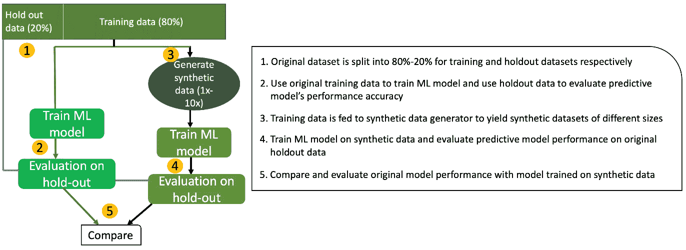

图 7.11 – 用于训练最小最大模型的不同参数

因此，公平合成数据生成算法涉及优化一个综合损失，其中包含以下内容：

+   准确性损失的加权和

+   一种与经验估计的统计平等偏差成正比的公平性损失

+   准确性与公平性之间的正确权衡，其中权重从一个损失组件转移到另一个

*图 7.11*展示了生成合成数据的逐步过程，并比较了在原始数据集和合成数据集上训练模型时的模型表现。

我们已经看到基于机器学习的合成数据生成是如何实现的。接下来，让我们看看在公平合成数据中，像性别和收入等保护属性如何帮助满足我们之前研究的一些公平性定义。

### 对公平性统计的影响

我们将利用生成式深度神经网络作为表格数据的合成器，从`adult_income`数据集中生成合成数据样本。生成式模型合成器会在具有奇偶性公平约束的情况下运行 50 次，并将性别作为保护属性。*图 7.12*显示，在原始数据的高收入类别中存在的性别不平衡被合成数据成功缓解。通过比较高收入男性与高收入女性比例得出的差异影响在原始数据集中大约为 10/30 = 0.33，而在经过偏差校正的合成数据集中为 22/25 = 0.88。我们看到，合成数据的这一指标显著高于 0.80，这是行业基准。因此我们可以放心地得出结论，数据合成有助于缓解偏差。

我们进一步观察到，在模型训练过程中增加的额外公平约束并未降低数据质量，如*图 7.12*所示。

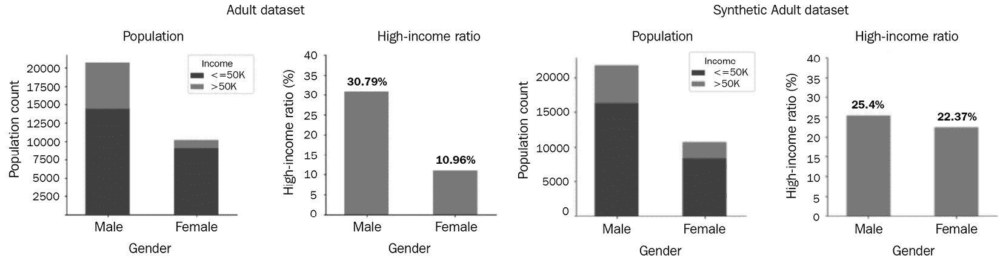

图 7.12 – 合成数据缓解收入差距

单变量和双变量分布都表明，数据集能够保持人口层面的男女比例和高收入者与低收入者比例。只有统计公平约束，表示收入和性别的依赖关系，被允许违背，使得它们变得不相关。使用代表性和合成数据后，这种相关性被减少到噪音水平，如下图所示（见图中浅绿色区域的红圈）。

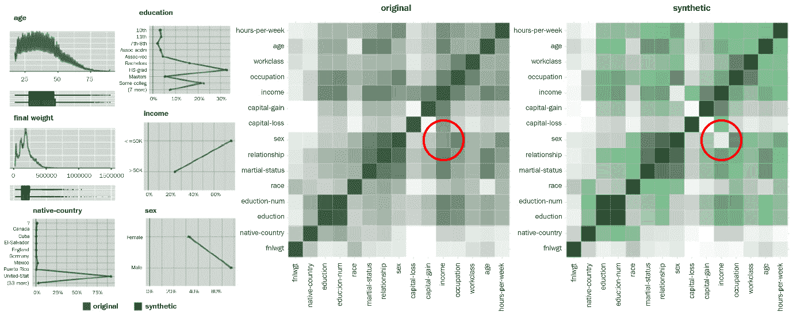

图 7.13 – 原始数据与合成数据的单变量与双变量统计

研究代理属性进一步表明，它们并未通过“后门”引入不公平。即便是加入一个与性别高度相关的人工特征（名为“代理”），也发现它在原始数据集中与“性别”保持恒定的相关性，而通过引入奇偶性约束，由于促成了公平性，这一相关性得到了显著降低。女性部分显示，“代理”在 90%的情况下等于 1，剩余 10%的情况下等于 0。*图 7.14*进一步说明了这一点：

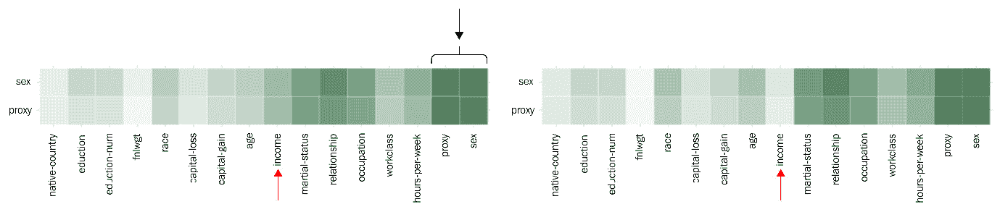

图 7.14 – 奇偶性公平性约束适用于性别等代理属性

对于成人数据集，通过在“性别”和“种族”上应用公平性约束来训练生成模型。此外，从*图 7.15*可以明显看出，合成数据在所有四个按种族和性别划分的组别中，高收入比例高度平衡。尽管该解决方案无法保证完全的奇偶性，但通过将公平性损失的权重相对于准确性损失的权重设置更高，可以在差异进一步缩小时获得完整的公平性。

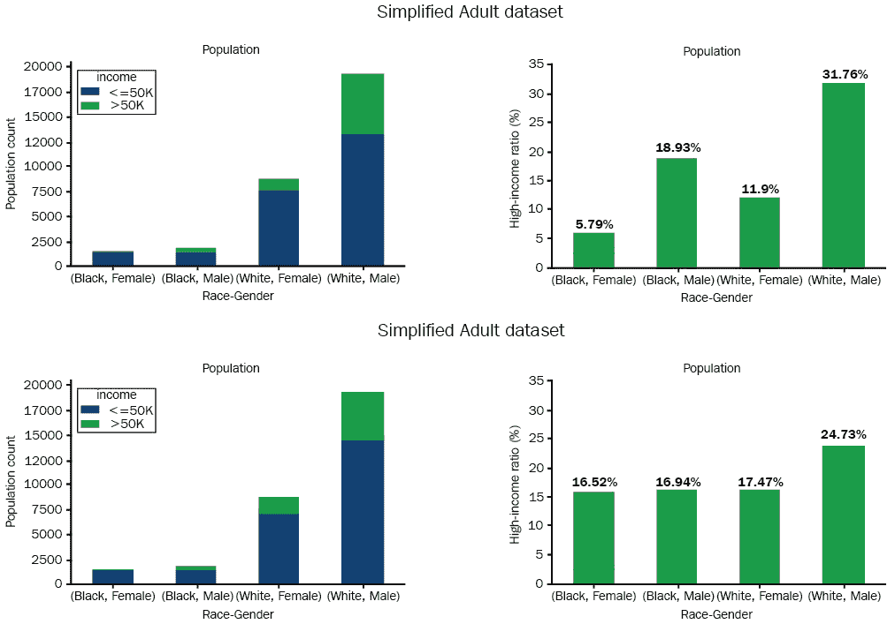

图 7.15 – 通过分别考虑性别和种族的约束进行偏差缓解

在*图 7.16*中，我们看到相应预测模型的倾向得分，分别在原始数据集和合成数据集上展示。

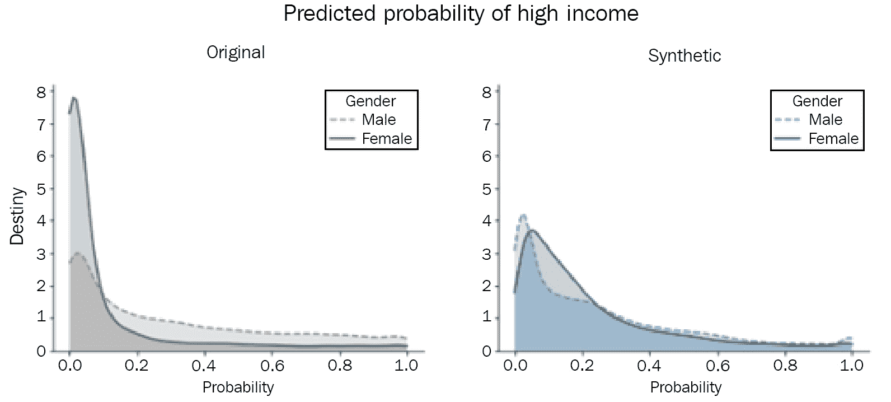

图 7.16 – 对原始数据集和合成数据集的高收入预测

使用相同的机器学习模型，我们发现，原始数据集上拟合的模型显示女性进入高收入类别的概率得分明显低于对立性别——男性。因此，合成数据的差异被缩小，且由性别属性驱动的两个分布被发现一致。由于预测模型的训练过程没有通过公平性优化任何模型，因此显而易见，预测结果主要是由于使用了经过偏差修正的合成数据。一个基于公平性约束的合成数据解决方案确保了群体公平性。数据集保持了其他属性之间的关系，同时消除了敏感属性和目标属性之间的依赖关系。此外，奇偶性约束还确保了对隐藏代理属性的公平性。

以下步骤逐步演示如何生成公平的合成数据，以平等地表示男性和女性：

1.  我们将设置一组特定的超参数（包括输入训练数据大小、层大小和分类器类型），并使用合成数据进行训练：

    ```py
    inputsize = train_dataset["data"]. shape[1]
    layersizes = [100]
    classifier_type = "paritynn"
    hparams = {
        "classifier_type": classifier_type,
        "layersizes": layersizes,
        "inputsize": inputsize,
    }
    ```

1.  我们的下一个任务是设置一个分类器，使用前述状态中使用的超参数训练网络。在训练数据集的过程中，我们使用验证数据集来验证训练过程：

    ```py
    classifier = construct_classifier(hparams, loaddir=loaddir)
    classifier.train(train_dataset, logdir, epochs=args.epochs,]
    validation_dataset=validation_dataset)
    savepath = classifier.save_model(logdir)
    n = validation_dataset["label"].shape[0]
    ```

1.  `construct_classifier` 函数被设置在 `fariml-farm` 库中，用于构建分类器，如以下代码片段所示：

    ```py
    classifier_types = [SimpleNN, ParityNN, AdversariallyCensoredNN]
    def construct_classifier(hparams, sess=None, loaddir=None):
        for c_type in classifier_types:
            if c_type.name == hparams["classifier_type"]:
                classifier = c_type(sess=sess)
                classifier.build(hparams=hparams)
                if loaddir is not None:
                    classifier.load_model(loaddir)
                return classifier
    ```

1.  我们的下一个任务是通过合成数据生成过程，使男性（`1`）和女性（`0`）点的表示等效：

    ```py
    n_males = sum(validation_dataset["label"])
    limiting_gender = n_males > n - n_males
    n_limiting_gender = sum(validation_dataset["label"] == limiting_gender)
    max_points_per_gender = 500
    n_per_gender = min(max_points_per_gender, n_limiting_gender)
    inds = np.concatenate([
        np.where(validation_dataset["label"] == limiting_gender)[0][:n_per_gender],
        np.where(validation_dataset["label"] != limiting_gender)[0][:n_per_gender]],
        axis=0)
    vis_dataset = {k:v[inds, ...] for k, v in validation_dataset.items()}
    val_embeddings = classifier.compute_embedding(vis_dataset["data"]
    ```

1.  分类器使用以下给定的损失函数进行优化：

    ```py
    overall_loss = crossentropy +\
            self.hparams["dpe_scalar"]*dpe +\
            self.hparams["fnpe_scalar"]*fnpe +\
            self.hparams["fppe_scalar"]*fppe +\
            self.hparams["cpe_scalar"]*cpe +\
            self.hparams["l2_weight_penalty"]*l2_penalty
    ```

总损失是通过`dpe`、`fnpe`、`fppe`和`cpe`计算的各项损失之和。为`dpe`评估的损失函数表示由`demographic_parity_discrimination`（人口平衡歧视）引起的损失，而`fnpe`和`fppe`则表示由`equalized_odds_discrimination`（均等机会歧视）引起的损失。

1.  现在，如果我们尝试绘制嵌入图，我们可以使用以下代码片段，这将生成男性和女性群体年收入>=50K 或<50K 之间几乎等效的嵌入表示：

    ```py
    plot_embeddings(val_embeddings,
                    vis_dataset["label"],
                    vis_dataset["protected"],
                    plot3d=True,
                    subsample=False,
                    label_names=["income<=50k", "income>50k"],protected_names=["female", "male"])
    ```

这将产生以下输出：

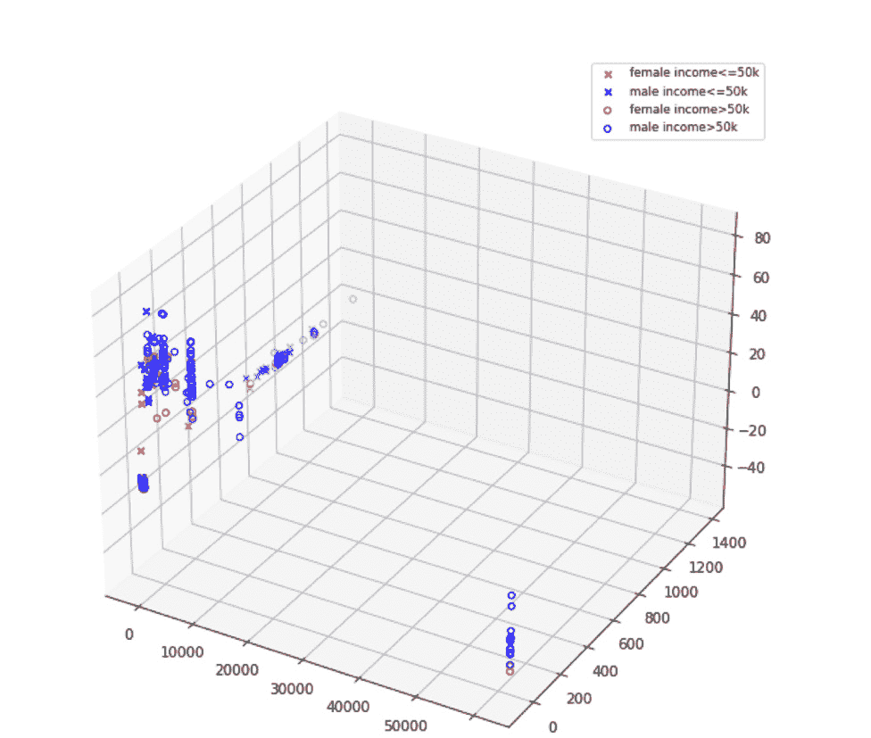

图 7.17 – 男性和女性群体年收入>=50K 或<50K 之间嵌入的等效表示

我们了解了 MOSTLY AI 的公平性 GAN 如何生成对公平统计产生积极影响的合成数据集。接下来，让我们探讨一种基于 GAN 的方法，该方法利用**有向无环图**（**DAG**）来生成公平的合成数据。

## 基于 GAN 的公平合成数据生成器

现在，让我们通过一个例子来看看如何使用**因果感知生成网络**生成公平、无偏的合成数据。目标是生成一个无偏的数据集，并且不丢失数据分布的表示。数据生成过程可以通过有向无环图（DAG）进一步建模。在这里，训练合成数据的机器学习模型（无论是单个模型还是一系列模型）不仅能对合成数据做出无偏的预测（满足公平性标准），还能够对现实世界的数据集做出无偏的预测。

**去偏因果公平性**（**DECAF**）框架基于 GAN，利用**d**个生成器（每个生成器分配给每个变量）通过因果结构的原理进行数据合成，以学习数据中存在的因果条件。DECAF 中嵌入的**数据生成过程**（**DGP**）允许根据变量的来源（即因果父节点）通过生成器的输入层重新构建和再生变量。像这样的框架可以从有偏的现实世界数据集中去除偏差（例如，低估少数群体的群体），以及那些已被人为引入偏差的现实世界数据集。此外，DECAF 还承诺通过差分隐私鉴别器替换标准鉴别器，为机密信息提供保护，从而实现私有合成数据生成过程。

鉴别器和生成器通过在连续的迭代中向两个网络添加正则化损失，进行优化过程。优化过程使用梯度下降，并保证与标准 GAN 相同的收敛标准。该框架包括以下内容：

+   满足马尔可夫兼容性的生成数据分布函数。对于已知的有向无环图（*G*），如果我们发现每个节点代表一个概率分布中的变量（*P*），则当图中的每个变量 *X* 与其非后代节点独立时，称其为马尔可夫兼容。

+   生成器 *G* 和鉴别器 *D* 都需要足够的能力。

+   每次训练迭代都成功优化给定的有向无环图（*G*）并相应地更新它。

+   最大化鉴别器损失。

+   生成器生成的分布函数，通过优化使其收敛到真实数据分布。

在训练阶段，DECAF 通过 GAN 学习数据中存在的因果条件。GAN 能够学习源节点与目标节点之间因果图中的因果条件。在生成（推理）阶段，框架通过应用三个基本原理来运行，**CF 去偏**、**FTU 去偏**和**DP 去偏**，这些有助于生成器创造公平的数据。然而，还假设在此之前已知数据生成过程（DGP）的图 *G*。

在推理过程中，变量合成过程源自根节点，然后传播到它们的子节点（来自因果图中生成的因果父节点）。数据合成的拓扑过程依赖于顺序数据生成技术，并在叶节点处终止。这使得 DECAF 算法能够在推理时通过执行针对性的/有偏边缘移除策略，战略性地去除偏差，并进一步增加满足用户定义公平性要求的概率。研究还发现，DECAF 能够满足我们之前讨论的公平性/歧视定义，同时保持生成数据的高效用性，使其能够被机器学习模型有效使用而不产生算法偏差。

**通过无知实现公平**（**FTU**）是通过保持所有其他特征不变，并计算下游分类器预测之间的差异来衡量的，当分类器的预测分别为 1 和 0 时，公式为 *| PA =* 0 (*Y*ˆ*|X*)–– *PA =* 1(*Y*ˆ*|X*) |。该度量帮助评估 *A* 对预测结果的直接影响。该度量旨在消除不同的对待，这在法律上与直接歧视相关，并力求为任何两位同等资质的人提供相同的机会，无论他们的种族、性别或其他受保护属性如何。

**人口平衡**（**DP**）是通过总变差来衡量的，这表示并解释下游分类器预测之间的差异。这有助于计算受保护变量 *A* 不同类别（例如非洲裔、美国裔、亚洲裔和西班牙裔）之间的正负比率：

*| P* (*Y*ˆ *|A = 0*)*–− P* (*Yˆ |A =* *1*) *|*

该指标不允许任何间接歧视，除非可解释性因素另有说明。

**条件公平性**（**CF**）旨在将 FTU 和 DP 进行泛化。

所有 DECAF 方法都能生成良好的数据质量指标：精准率、召回率和 AUROC。一个值得特别提及的优秀公平数据生成机制是 DECAF-DP，它在所有五个评估指标（精准率、召回率、AUROC、DP 和 FTU）中表现最佳，并且在数据集表现出高偏差时，仍能提供更好的 DP 性能结果。

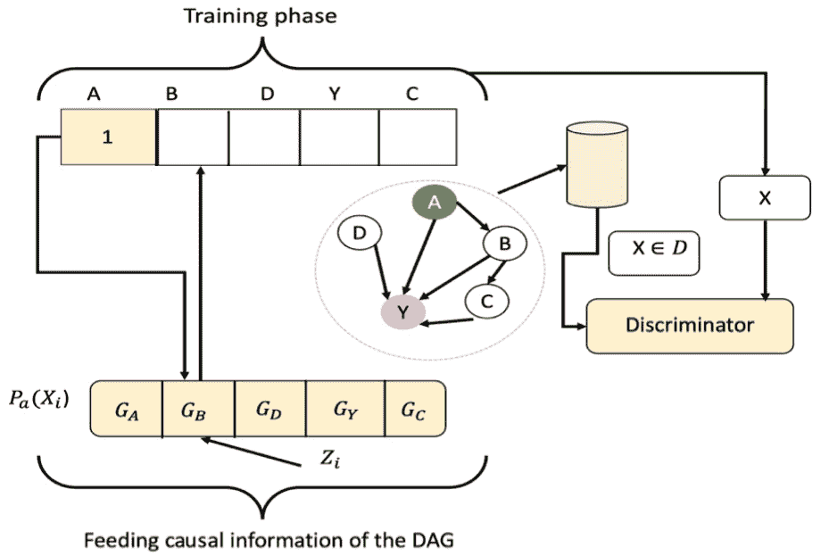

图 7.18 – DECAF 中的训练阶段

前一图中的训练阶段直接跟随以下图中的推理阶段。

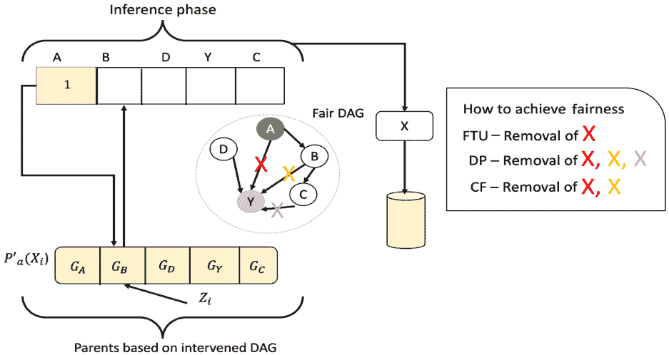

图 7.19 – 公平推理阶段，启用 DECAF 中的公平数据合成

现在，让我们看看如何使用以下代码片段通过 DECAF 生成合成数据：

1.  以下代码包含所有必要的导入：

    ```py
    import networkx as nx
    import pytorch_lightning as pl
    from utils import gen_data_nonlinear
    import sys
    from decaf import DECAF
    from decaf.data import DataModule
    ```

1.  现在，在设置必要的导入后，让我们使用`dag_seed`设置 DAG 结构。图的因果结构存储在`dag_seed`中：

    ```py
    dag_seed = [[1, 2], [1, 3], [1, 4], [2, 5], [2, 0], [3, 0], [3, 6], [3, 7], [6, 9], [0, 8], [0, 9], ]
    ```

1.  下一步是使用以下代码片段调用`DiGraph`，并使用`dag_seed`。`dag`结构存储在`dag_seed`变量中。边缘移除存储在`bias_dict`变量中。在这里，我们移除了 3 和 6 之间的边缘。此外，`gen_data_nonlinear`用于在每个节点应用扰动：

    ```py
    bias_dict = {6: [3]}
    G = nx.DiGraph(dag_seed)
    data = gen_data_nonlinear(G, SIZE=2000)
    dm = DataModule(data.values)
    data_tensor = dm.dataset.x
    ```

1.  在下一阶段，我们设置不同的超参数，以促进训练过程：

    ```py
    x_dim = dm.dims[0]
    z_dim = x_dim
    lambda_privacy = 0
    lambda_gp = 10
    l1_g = 0
    ```

1.  权重衰减已初始化，AdamW 是一个优化器，它是**Adam（自适应矩估计）**的改进版，能够通过随机梯度下降以更快的训练速度生成更好的模型。AdamW 具有权重衰减功能，可以用来对所有网络权重进行正则化：

    ```py
    weight_decay = 1e-2
    ```

1.  下一步是设置生成点的比例，对于顺序采样来说是负值：

    ```py
    p_gen = (-1)
    use_mask = True
    grad_dag_loss = False
    number_of_gpus = 0
    ```

WGAN-GP

你可以在这里阅读更多关于 Wasserstein GAN 与梯度惩罚（**WGAN-GP**）的内容：[`jonathan-hui.medium.com/gan-wasserstein-gan-wgan-gp-6a1a2aa1b490`](https://jonathan-hui.medium.com/gan-wasserstein-gan-wgan-gp-6a1a2aa1b490)。

1.  现在让我们通过设置不同的超参数、生成器和正则化参数来初始化并训练 DECAF 模型：

    ```py
    model = DECAF(
        dm.dims[0],
        dag_seed=dag_seed,
        h_dim=args.h_dim,
        lr=args.lr,
        batch_size=args.batch_size,
        lambda_privacy=lambda_privacy,
        lambda_gp=lambda_gp,
        d_updates=args.d_updates,
        alpha=args.alpha,
        rho=args.rho,
        weight_decay=weight_decay,
        grad_dag_loss=grad_dag_loss,
        l1_g=l1_g,
        l1_W=args.l1_W,
        p_gen=p_gen,
        use_mask=use_mask,
    )
    trainer = pl.Trainer(
        gpus=number_of_gpus,
        max_epochs=args.epochs,
        progress_bar_refresh_rate=1,
        profiler=False,
        callbacks=[],
    )
    trainer.fit(model, dm)
    synth_data = (
        model.gen_synthetic(
            data_tensor, gen_order=model.get_gen_order(), biased_edges=bias_dict
        ).detach()
        .numpy()
    )
    ```

我们现在已经生成了可以输入任何机器学习模型的合成无偏数据。

# 总结

在本章中，我们学习了公平性算法在解决社会偏见中的重要性，因为不同类型的偏见会妨碍机器学习模型得出公平结果的能力。我们深入探讨了各种公平性类型，并学习了如何将它们应用于数据质量检查、发现条件依赖关系和属性关系以及生成审计报告的实践过程中。在此过程中，我们探讨了偏见如何出现在数据本身和/或预测模型的结果中。此外，我们还迈出了学习公平合成数据生成过程的第一步，旨在帮助消除偏见。

在后续章节中，我们将进一步学习如何在多样化数据集或群体中应用公平意识模型的机制。此外，我们还将探讨如何根据问题领域和所研究数据集的特点，选择适当的受保护属性（如性别、种族等）。在下一章，*第八章*，*模型训练与优化中的公平性*，我们将深入了解如何创建受约束的优化函数，以帮助构建公平的机器学习模型。

# 深入阅读

+   *《公平性定义解析》*，发表于*《软件公平性国际研讨会论文集》（FairWare ‘18），计算机协会*，Verma Sahil 和 Julia Rubin（2018 年）， [`fairware.cs.umass.edu/papers/Verma.pdf`](https://fairware.cs.umass.edu/papers/Verma.pdf)

+   *《公平性意识机器学习数据集调查》，《Wiley 跨学科评论：数据挖掘与知识发现》*，*10.1002/widm.1452*，[`www.researchgate.net/publication/355061634_A_survey_on_datasets_for_fairness-aware_machine_learning`](https://www.researchgate.net/publication/355061634_A_survey_on_datasets_for_fairness-aware_machine_learning)

+   *《代表性与公平合成数据》*，Tiwald, Paul & Ebert, Alexandra & Soukup, Daniel.（2021 年）， [`arxiv.org/pdf/2104.03007.pdf`](https://arxiv.org/pdf/2104.03007.pdf)

+   *《最小最大群体公平性：算法与实验》*，《2021 年 AAAI/ACM 人工智能、伦理与社会会议论文集》，计算机协会，纽约。Emily Diana、Wesley Gill、Michael Kearns、Krishnaram Kenthapadi 和 Aaron Roth（2021 年）。[`assets.amazon.science/9d/a9/e085008e45b2b32b213786ac0149/minimax-group-fairness-algorithms-and-experiments.pdf`](https://assets.amazon.science/9d/a9/e085008e45b2b32b213786ac0149/minimax-group-fairness-algorithms-and-experiments.pdf)

+   *《机器学习中的偏见与公平性调查》，ACM 计算机评论，54 卷，第 6 期，第 115 号文章（2022 年 7 月）*，Mehrabi Ninareh、Fred Morstatter、Nripsuta Saxena、Kristina Lerman 和 Aram Galstyan.（2021 年）。 [`arxiv.org/pdf/1908.09635.pdf`](https://arxiv.org/pdf/1908.09635.pdf)

+   *FAT Forensics: 一个用于算法公平性、问责制和透明度的 Python 工具箱*，Sokol, K., Santos-Rodríguez, R., & Flach, P.A.（2019）。[`arxiv.org/pdf/1909.05167.pdf`](https://arxiv.org/pdf/1909.05167.pdf)

+   *Minimax 帕累托公平性：一种多目标视角*，Martinez Natalia, Martin Bertran, Guillermo Sapiro，[`proceedings.mlr.press/v119/martinez20a/martinez20a.pdf`](http://proceedings.mlr.press/v119/martinez20a/martinez20a.pdf)
