# 第九章：模型可解释性

“如果你不能简单地解释它，那说明你还没有完全理解它。”

– 阿尔伯特·爱因斯坦

**模型可解释性**是**机器学习**（**ML**）和**人工智能**（**AI**）领域的重要话题。它指的是理解和解释模型如何做出预测和决策的能力。可解释性很重要，因为它使我们能够识别模型中的潜在偏见或错误，并能提高 AI 模型的性能和可信度。

在本章中，我们将探索不同的解释和理解机器学习模型的方法和技术。我们还将探讨模型可解释性面临的挑战和局限性，并考虑改善机器学习算法可解释性的潜在解决方案。

在本章中，我们将涵盖以下主题：

+   可解释 AI 简介

+   **像我五岁一样解释** (**ELI5**)

+   **本地可解释的模型无关** **解释** (**LIME**)

+   使用 XAI 技术理解客户流失建模

+   CausalNex

+   用于因果推理的 DoWhy

+   AI 可解释性 360 用于解释模型

# 技术要求

本章要求你安装 Python 3.8，并使用以下 Python 包：

+   NumPy

+   Matplotlib

+   Scikit-learn

+   pandas

+   按照以下方式安装 ELI5：

    ```py
    pip install eli5
    ```

+   安装 LIME，请使用以下命令：

    ```py
    pip install lime
    ```

+   可以使用以下命令安装 SHAP：

    ```py
    pip install shap
    ```

+   使用以下命令安装 DoWhy：

    ```py
    pip install dowhy
    ```

+   AI 可解释性 360

# 可解释 AI 简介

考虑一个预测患者是否可能患某种终末期疾病的模型，一个帮助决策是否认定被告有罪的模型，以及一个帮助银行决定是否给某人贷款的模型。这些模型所做出的决策可能会对多个人的生活产生深远的连锁反应（与 Netflix 推荐电影的模型不同）。因此，拥有决策模型的机构必须能够解释其预测和决策背后的理由。模型可解释性或**可解释 AI**（**XAI**）旨在开发能够帮助我们理解和解释模型预测和决策背后原因的算法和技术。正如我们在前面的例子中看到的，XAI 在医疗保健、金融和刑事司法等领域尤为重要，因为模型决策的后果可能对个人和社会产生重大影响。

目前，由于机器学习模型复杂的内部机制和缺乏透明度，许多模型被视为**黑箱**。这可能引发关于问责制和偏见的担忧，并可能阻碍利益相关者采纳这些模型并信任它们。为了解决这些问题，越来越需要能够为机器学习模型提供可解释性和解释能力的方法和技术。

XAI 是一种机器学习可解释性技术，重点在于理解机器学习模型的预测，并以人类能够理解的方式解释这些预测是如何得出的，从而建立对模型的信任。顾名思义，XAI 广泛关注模型解释，并提供接口以解读这些解释，从而有效地架起机器学习与人类系统之间的桥梁。它是更广泛的人本责任 AI 实践的关键组成部分。

*图 9.1*展示了构建以人为本的 XAI 系统所涉及的不同领域：

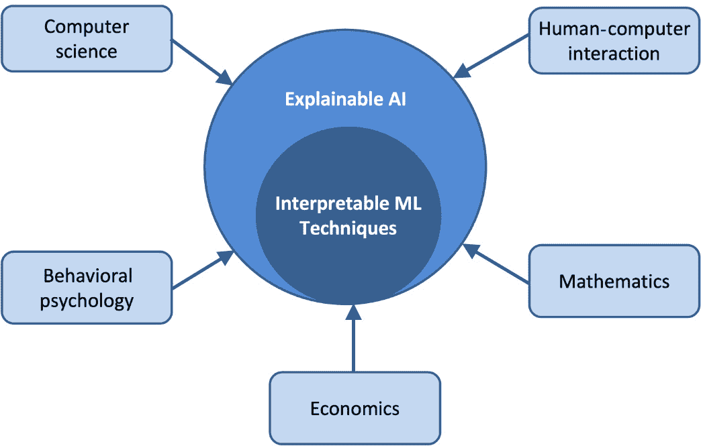

图 9.1 – 以人为本的 XAI 系统

XAI 的发展与应用 AI/**深度学习**（**DL**）系统的发展同步，始于大约 2015 年。越来越复杂的 DL 模型，如深度神经网络，为开发者和模型相关方揭示了新的可解释性挑战。在 AI 的实施过程中，由于神经网络的黑箱特性，即使是工程师或数据科学家也无法清楚了解其背后的实际情况。因此，理解一个模型的预测变得困难，且在高风险场景中难以信任这些预测。

XAI 是当我们想要判断是否可以信任我们的 AI 模型的结果，并且如何确定我们有多大的信心相信该模型是正确的时的一种解决方案。它使我们能够理解 AI 模型在某种情况下如何得出结果，从而建立对这些结果的信任。

要实现一个可靠的 XAI 系统，我们应该关注三个主要组成部分：预测准确性、可追溯性和决策理解，如*图 9.2*所示：

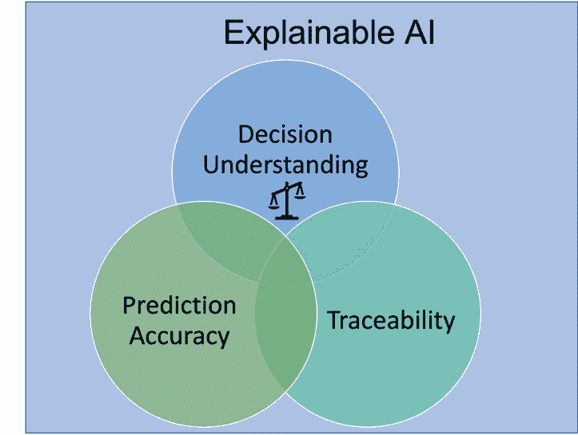

图 9.2 – XAI 系统的三个主要组成部分

让我们讨论一下这些组件：

+   **预测准确性**涉及技术要求，毫无疑问，它是人工智能在日常操作中成功应用的关键组成部分。预测准确性可以通过将 XAI 输出与训练/测试数据集中的结果进行比较来确定。例如，我们可以使用 LIME 等算法来解释 AI/DL/ML 分类器做出的预测。

+   **决策理解**涉及人类需求，旨在通过教育和信息传递，克服对 AI 的不信任，帮助团队理解决策是如何做出的。这些信息可以通过仪表盘的形式展示给最终用户，显示影响某一决策的主要因素，以及每个因素对决策的影响程度。

+   **可追溯性**可能影响并限制决策过程，为机器学习规则和特征设定更窄的范围。像**深度学习重要特征**（**DeepLIFT**）这样的技术可以通过显示可追溯链接和依赖关系，比较神经网络中每个神经元与其参考神经元的激活情况。

如果用户对 AI 决策的生成过程缺乏理解，信任框架将受到损害，并最终可能导致模型被拒绝。考虑一个向用户推荐社交网络连接或购买产品的系统。对这些推荐的解释将成为机器学习系统采纳的催化剂，使信息对用户更具意义。

XAI 不仅仅是建立模型信任，它还涉及故障排除和提高模型性能。它使我们能够通过追踪模型在部署状态、公平性、质量和模型漂移等方面的洞察来调查模型行为。通过使用 XAI，可以分析模型性能，并在模型偏离预期结果并表现不佳时生成警报。

## XAI 的范围

理解模型对于构建和操作机器学习系统中的许多任务至关重要，XAI 可以用于以下任务：

+   **完善建模和数据收集过程**：在对数据集进行拆分聚合和比较后，XAI 提供了一种方法，可以识别并提醒用户注意常见的机器学习问题，如数据偏斜和漂移。

+   **调试模型性能**：XAI 使我们能够调试模型的意外行为，并监控更深层次的特征级洞察，以指导修正行动。

+   **建立信任**：通过解释预测，XAI 支持决策过程，帮助与最终用户建立信任，使得模型决策更加公正和可靠。

+   **识别意外的预测**：它验证模型行为并提供修改措施。例如，它可以帮助监管机构有效地验证机器学习决策是否符合相关法律，以减少对最终用户产生不良模型结果的风险。

+   **充当催化剂**：XAI 通过建立用户信任，并以易于理解的形式向利益相关者展示模型结果，促进了机器学习系统的采用。

在理想的世界中，一个可解释且透明的模型可以在不同的行业中使用，例如在医疗健康领域，通过加速诊断、处理图像、简化药品审批流程，以及在制造、金融、物流和刑事司法领域做出关键决策，如加速 DNA 分析或监狱人口分析的结论。

可解释性可以帮助开发人员确保系统按预期工作，符合监管标准，甚至允许受决策影响的人挑战该结果。理解和解释模型预测的能力使公司和机构能够做出明智的决策，尤其是在利益相关者需要证明的情况下，如战略商业决策中。

## XAI 的挑战

实施 XAI 解决方案时面临的一些具有挑战性的困境如下：

+   **算法机密性**：通常，由于安全问题，所使用的模型和算法的细节是保密的。在这种情况下，确保 AI 系统没有因为训练数据、目标函数或模型的缺陷而学到偏见观点（或一个有偏见世界的无偏见观点）就成为了一项具有挑战性的任务。

+   **公平性**：对于 XAI 来说，判断 AI 框架所做的决策或得到的输出是否公平是一项挑战，因为公平的印象是主观的，且依赖于用于训练 AI/ML 模型的数据。此外，公平性的定义可能会根据使用场景、文化等发生变化。

+   **可靠性**：如果不评估 AI 系统如何得出某个结果，就很难依赖该系统，因为需要澄清该系统是否合法。

构建一个可以轻松解释和解读的模型是克服上述挑战的关键。高度复杂的算法可以通过更简单的方式重新创建或替代，这些方法借助 XAI 可以更容易地解释。

### XAI 技术分类

XAI 技术可以根据两个主要标准进行分类——范围和模型。请参见*图 9.3*：

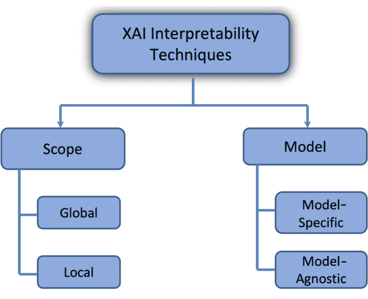

图 9.3 – XAI 技术分类

让我们讨论每种技术：

+   **范围**：XAI 技术可以根据其解释的范围进行分类。在范围上，XAI 技术主要分为两大类：**局部**和**全局**。局部解释侧重于描述 AI 模型在特定输入或输出下的行为。这些解释提供了有关模型如何针对特定输入做出决策的见解，有助于理解模型在特定情况下的行为。另一方面，全局解释则提供有关 AI 模型在广泛输入和输出下的一般行为的见解。这些解释有助于理解 AI 模型的整体决策过程及其如何处理不同类型的输入。

+   **模型**：XAI 技术也可以根据应用的模型类型进行分类。在模型的上下文中，XAI 技术主要分为两类：**特定模型**和**无关模型**。特定模型的解释是针对特定 AI 模型的架构和设计量身定制的。这些解释通常具有局部性质，提供有关特定输入或输出的模型行为的见解。特定模型的 XAI 技术的例子包括特征重要性分析和显著性图。另一方面，无关模型的解释并不特定于任何特定的 AI 模型，可以应用于广泛的不同模型。这些解释通常具有全局性质，提供有关 AI 模型在各种输入和输出情况下的整体行为的见解。无关模型的 XAI 技术的例子包括反事实分析和模型蒸馏。

*图 9.4* 扩展了特定模型与无关模型的 XAI 技术之间的差异：

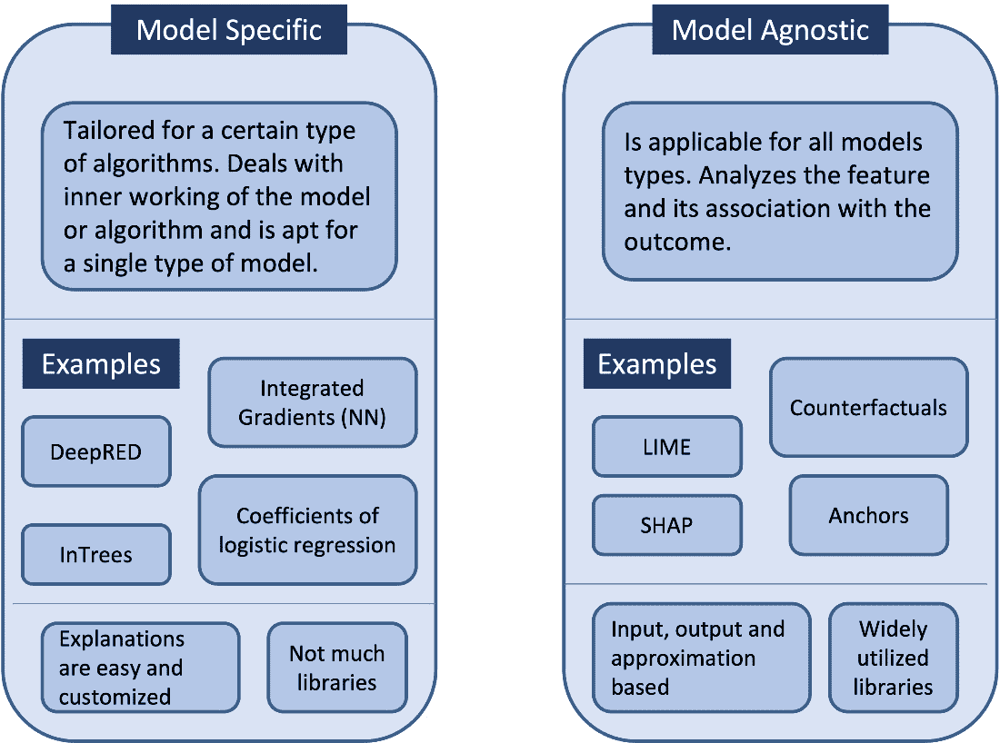

图 9.4 – 特定模型与无关模型的 XAI 技术

总体而言，XAI 技术可以根据其范围（局部或全局）以及它们与所应用模型的关系（特定模型或无关模型）进行分类。了解不同类型的 XAI 技术以及它们如何应用，可以帮助从业者为特定情境选择最合适的技术，并更好地理解他们 AI 模型的行为。

现在让我们探讨一些可以用于模型可解释性的 Python 库。

# 解释像我五岁一样（ELI5）

这个 Python 库使我们能够可视化和调试机器学习模型。它提供了本地和全局解释的功能。XGBoost、LightGBM、scikit-learn、Lightning 和 CatBoost 是 ELI5 支持的库之一。ELI5 的目标是使解释对普通观众易于理解，包括那些没有人工智能或机器学习背景的人。

这是一个示例，展示了如何使用 ELI5 来提供对 AI 模型预测的解释。

假设一个 AI 模型已经被训练用来预测一个病人根据多种医疗特征（如年龄、性别和病史）患某种特定疾病的可能性。该模型预测某个特定病人患该疾病的可能性较高。为了提供这个预测的 ELI5 解释，模型可以给出一个简单易懂的解释，比如：*根据你的年龄、性别和病史，我们的模型预测你患该疾病的几率较高。这是因为根据我们的数据，具有类似特征的人患此病的风险较高*。这个 ELI5 解释为模型做出的预测提供了清晰简洁的说明，使用了普通观众可以理解的语言和概念。它还突出了模型在做出预测时考虑的因素，有助于增加 AI 系统的透明度和问责性。

以下是我们介绍 ELI5 如何在代码中实现的一个大致框架：

1.  首先，您要解释的 AI 模型应已经过训练并部署。这个模型可以是机器学习（ML）模型、深度学习（DL）模型或其他类型的 AI 模型。

1.  然后，你需要选择你想要解释的模型输入或输出。这可以是模型做出的单个预测，也可以是一批预测。

1.  接下来，你需要选择一个适合你的模型和你想要提供的解释类型的 ELI5 解释方法。有许多不同的 ELI5 方法，包括提供特征重要性解释、显著性图和反事实解释等方法。

1.  一旦你选择了一个 ELI5 方法，你就可以用它来生成模型输入或输出的解释。这可能涉及将输入或输出通过 ELI5 方法进行处理，然后对生成的解释进行进一步处理，使其简单易懂，适合一般观众。

1.  最后，您可以清晰简洁地将 ELI5 解释呈现给用户，使用普通观众可以理解的语言和概念。这可能涉及将解释显示在用户界面中、打印到控制台或保存到文件中。

然而，ELI5 存在一些局限性。其中一个局限性是，可能无法为 AI 模型做出的每个决策提供一个简单且易于理解的解释。在某些情况下，AI 模型的决策过程可能过于复杂或细微，无法简单地解释。另一个局限性是，ELI5 解释可能不足以完全理解 AI 模型的行为，尤其是对于那些具有更技术背景的人。在这些情况下，可能需要更详细和技术性的解释。另外，请注意，它并不适用于所有模型——例如，在 scikit-learn 中，它仅适用于线性分类器、回归器和基于树的模型。在 Keras 中，它支持使用 Grad-CAM 可视化来解释图像分类器。

# LIME

**LIME** 是一种流行的 XAI 技术，用于为 AI 模型的预测提供局部解释。LIME 的目标是提供一个简单、易于理解的解释，帮助普通观众理解 AI 模型是如何从特定输入中得出某个预测的。

LIME 是与模型无关的，这意味着它可以应用于各种不同的 AI 模型，而不受其架构或设计的限制。这使得 LIME 成为一个灵活且广泛适用的工具，用于解释 AI 模型的行为。

在使用 LIME 生成解释时，该技术首先生成一组扰动版本的输入数据，称为 **扰动**。这些扰动是通过随机改变某些输入特征的值（每次一个特征），同时保持其他特征不变来获得的。然后，使用 AI 模型对每个扰动做出预测，结果的预测被用来构建一个简单的线性模型，该模型近似原始输入附近的 AI 模型行为。这个线性模型接着被用来为 AI 模型做出的预测提供解释。解释可以以一个特征列表的形式呈现给用户，这个列表列出了对预测贡献最大的特征，并显示每个特征的相对重要性。

例如，考虑一个使用 AI 模型对电子邮件进行分类的系统，该系统将电子邮件分类为垃圾邮件或非垃圾邮件。为了使用 LIME 解释某个特定电子邮件的分类，算法可能通过随机更改电子邮件中的一些单词，同时保持其他特征不变，生成一组扰动。然后，AI 模型将对每个扰动做出预测，结果的预测将用来构建一个简单的线性模型，该模型近似原始电子邮件附近的 AI 模型行为。

LIME 生成的线性模型随后可以用于解释原始电子邮件的分类结果，例如一份最重要词汇的列表，展示这些词汇对分类的贡献，并附上每个词汇的相对重要性。这个解释将在局部区域内忠实地反映 AI 模型的行为，意味着它能准确地体现 AI 模型在电子邮件周围局部区域的行为，并且是在电子邮件的可解释表示（即一份词汇列表）上学习得出的。

LIME 是一个用于理解 AI 模型行为的有用工具，它可以为这些模型做出的预测提供简单且易于理解的解释。然而，它也有一些局限性，例如它只能提供局部解释，可能无法捕捉到 AI 模型决策过程的全部复杂性。

现在让我们继续介绍工具箱中的下一个工具：SHAP。

## SHAP

**SHAP**（即**Shapley 加性解释**）是另一种流行的 XAI 技术。SHAP 的目标是解释 AI 模型的整体决策过程以及它如何处理不同类型的输入，并为这一过程提供一个简单且易于理解的解释，面向一般观众。

SHAP 基于博弈论中的 Shapley 值概念，Shapley 值提供了一种公平地分配不同参与者对集体结果贡献的方法。在 XAI 的背景下，SHAP 利用 Shapley 值计算输入数据点中每个特征对 AI 模型预测的相对重要性。

为了使用 SHAP 生成解释，技术首先计算输入数据中每个特征的 Shapley 值。这是通过考虑所有可能的输入特征组合以及 AI 模型的相应预测，然后使用这些组合计算每个特征对预测的相对贡献。

SHAP 计算的 Shapley 值随后用于为 AI 模型的预测提供解释。这个解释可以以一份最重要特征的列表呈现给用户，这些特征对预测的贡献以及每个特征的相对重要性也会一并显示。

Shapley 值与合作博弈

Shapley 值基于一种合作博弈的概念，在这种博弈中，一组参与者合作以达成共同的目标。Shapley 值是衡量玩家对集体结果贡献的指标，考虑到所有其他成员的努力。Shapley 值为每个玩家提供了公平的价值，依据他们对集体结果的贡献。这意味着每个参与者只因自己对结果的贡献而获得功劳，同时考虑到其他玩家的努力。假设一组人正在合作建造一座房子。考虑到所有其他参与者的努力，每个参与者的 Shapley 值将代表他们对房屋建造的贡献。一个负责打地基的人会因地基的价值而获得功劳，但不会因为房顶或墙壁的建设而获得功劳，后者是由其他人贡献的。

SHAP 是一个强大且广泛适用的工具，用于理解 AI 模型的行为，并为这些模型所做的预测提供全球性的解释。然而，它也有一些限制，例如，计算大数据集的 Shapley 值可能在计算上非常昂贵。此外，对于技术背景有限的用户来说，SHAP 的解释可能并不总是易于理解。

现在我们已经了解了一些可以用来解释模型预测的工具，让我们看看如何使用它们。

# 使用 XAI 技术理解客户流失建模

现在你对 ELI5、LIME 和 SHAP 技术有了一定了解，让我们在实际问题中使用它们。为了演示，我们将考虑**客户流失建模**的问题。

客户流失建模是一种预测建模方法，用于识别可能停止使用公司产品或服务的客户，也称为*流失*。客户流失建模通常用于电信、金融服务和电子商务等行业，这些行业中客户保持是商业成功的重要因素。

客户流失建模通常包括使用机器学习或其他统计技术构建预测模型，以识别最可能导致客户流失的因素。该模型在涵盖过去客户的数据显示进行训练，其中包括关于客户的基本信息、使用模式和流失状态（即，是否流失）。然后，该模型将用于根据客户的特定特征和行为预测未来客户流失的可能性。

它可以用来识别高风险的可能流失客户，从而公司可以对这些客户采取主动措施来保留他们，例如提供折扣和激励，鼓励他们继续使用公司的产品或服务。它还可以更广泛地帮助理解导致客户流失的因素，这样公司可以采取措施应对这些因素，从而提高客户的总体留存率。

我们将开始构建一个预测流失的模型。在这个示例中，我们使用的是来自 [`github.com/sharmaroshan/Churn-Modeling-Dataset`](https://github.com/sharmaroshan/Churn-Modeling-Dataset) 的流失建模数据集。该数据集包含 10,000 个数据点和 14 个特征。*图 9.5* 显示了一些数据探索的结果：

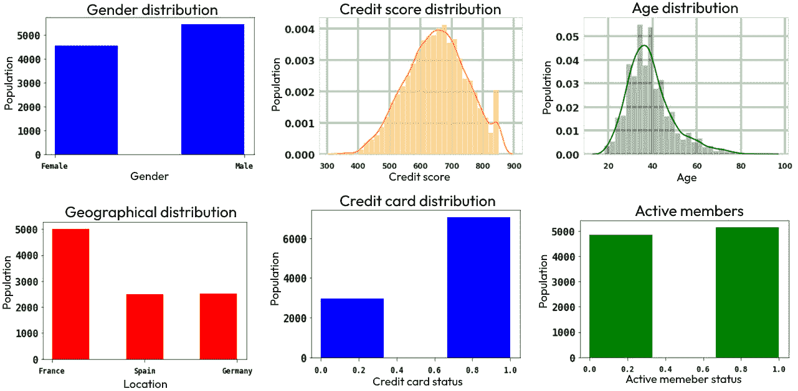

图 9.5 – 在流失模型数据集上的数据探索

让我们开始构建模型。

## 构建模型

既然我们已经查看了数据，接下来我们开始构建一个模型来使用这些数据。由于我们的重点是解释如何使用之前讨论的 Python 库，因此我们将使用 scikit-learn 构建一个简单的 **随机森林** 分类器。

这是实现的步骤：

1.  首先，我们导入构建模型所需的所有包，以及构建解释所需的包（即 ELI5、LIME 和 SHAP）：

    ```py
    import numpy as np
    import matplotlib.pyplot as plt
    import pandas as pd
    from sklearn.model_selection import train_test_split
    from sklearn.ensemble import RandomForestClassifier
    from sklearn.metrics import make_scorer
    from sklearn.metrics import accuracy_score, confusion_matrix, roc_curve, auc, roc_auc_score
    import pickle
    import eli5
    from eli5.sklearn import PermutationImportance
    import lime
    from lime import lime_tabular
    import shap
    ```

1.  接下来，我们下载数据并从中获取特征和输出；然后，对分类变量 `Geography` 和 `Gender` 进行独热编码：

    ```py
    dataset = pd.read_csv('https://raw.githubusercontent.com/krishnaik06/Lime-Model-Interpretation/main/Churn_Modelling.csv')
    X = dataset.iloc[:, 3:13]
    y = dataset.iloc[:, 13]
    geography = pd.get_dummies(X["Geography"],
            drop_first=False)
    gender=pd.get_dummies(X['Gender'],drop_first=False)
    ```

1.  让我们也删除数据框中所有不相关的列：

    ```py
    X=pd.concat([X,geography,gender],axis=1)
    X=X.drop(['Geography','Gender'],axis=1)
    ```

1.  现在，我们将数据分成训练集和测试集：

    ```py
    X_train, X_test, y_train, y_test = train_test_split(X,
            y, test_size = 0.2, random_state = 0)
    ```

1.  现在，让我们定义随机森林分类器并在训练数据集上进行训练：

    ```py
    Classifier=RandomForestClassifier()
    classifier.fit(X_train,y_train)
    ```

1.  接下来，我们使用训练好的模型在测试集上进行预测。我们可以看到它在测试集上的准确率为 86%：

    ```py
    y_predict = classifier.predict(X_test)
    y_prob = [probs[1] for probs in
            classifier.predict_proba(X_test)]
    ```

1.  我们还可以看到在测试集上的 ROC 曲线：

    ```py
    # Compute area under the curve
    fpr, tpr, _ = roc_curve(y_test, y_prob)
    roc_auc = auc(fpr, tpr)
    # Plot ROC curve
    plt.figure()
    plt.plot(fpr, tpr, color='orange',
            lw=2, label='ROC curve (area = %0.2f)' %
            roc_auc)
    plt.plot([0, 1], [0, 1], color='navy', lw=2,
            linestyle='—')
    plt.xlim([0.0, 1.0])
    plt.ylim([0.0, 1.05])
    plt.xlabel('False Positive Rate')
    plt.ylabel('True Positive Rate')
    plt.title("Churn Modeling")
    plt.legend(loc="lower right")
    plt.show()
    ```

这是 ROC 曲线的显示方式：

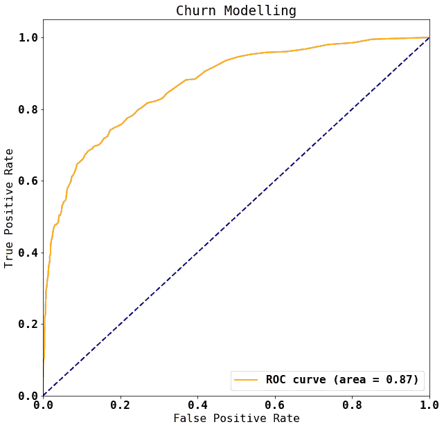

图 9.6 – ROC 曲线

ROC 曲线下的面积大约为 0.87，通常认为这是一个相当好的分类器的标志。

1.  由于我们使用的是随机森林分类器，接下来让我们基于默认的 **平均减小不纯度**（**MDI**）标准来探索特征重要性。以下是获得该信息的代码。为了方便理解，我们将特征重要性以条形图的形式进行展示：

    ```py
    # Feature importance in a dataframe
    imp_df = pd.DataFrame({
            'feature': X_train.columns.values,
            'importance':classifier.feature_importances_})
     # Reorder by importance
    ordered_df = imp_df.sort_values(by='importance')
    imp_range = range(1,len(imp_df.index)+1)
    ## Bar chart with confidence intervals
    height = ordered_df['importance']
    bars = ordered_df['feature']
    y_pos = np.arange(len(bars))
    plt.barh(y_pos, height)
    plt.yticks(y_pos, bars)
    plt.xlabel("Mean reduction in tree impurity in random forest")
    plt.tight_layout()
    plt.show()
    ```

这是条形图的显示方式：

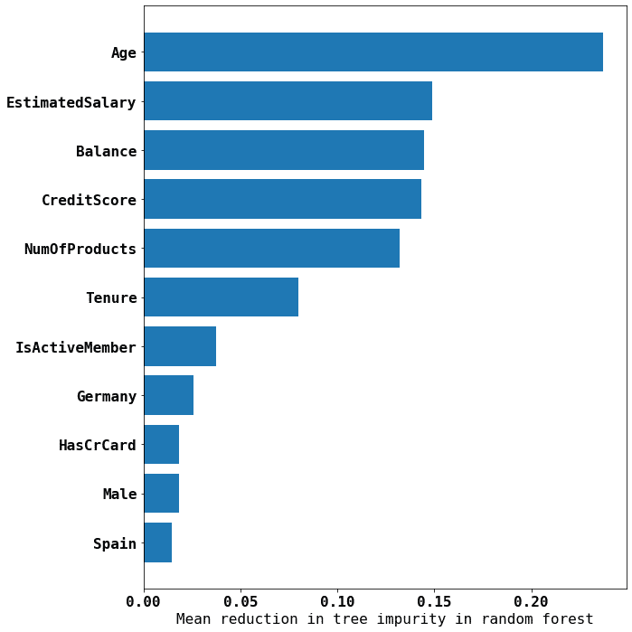

图 9.7 – 使用 scikit-learn 的 MDI 标准的特征重要性

在前面的图中，我们可以看到，影响客户是否留存或流失的五个最重要特征分别是他们的年龄、估计薪资、账户余额、信用评分以及他们购买的产品数量。

接下来，我们使用 ELI5 来理解分类器。

## 使用 ELI5 来理解分类模型

我们使用 ELI5 的`PermutationImportance`方法来解释我们构建的分类模型。`PermutationImportance`是 ELI5 中实现的一个特征重要性度量方法，可以用来估算任何特征的重要性。`PermutationImportance`方法通过随机排列单个特征的值，然后测量排列对所选模型性能的影响。模型的性能受到排列影响越大，特征的重要性就越高。我们将训练好的模型和数据集作为输入传递给 ELI5 中定义的`PermutationImportance`类。让我们从这个开始：

1.  在以下代码中，我们使用 ROC 曲线下面积作为度量来评估训练模型中不同特征的重要性：

    ```py
    perm_test = PermutationImportance(classifier,
            scoring=make_scorer(roc_auc_score),
            n_iter=50, random_state=123, cv="prefit")
    ```

1.  让我们使用训练数据集计算特征重要性：

    ```py
    perm_test.fit(X_train, y_train)
    ```

1.  我们现在可以使用`explain_weights`或`show_weights`函数来获取每个特征的排列重要性：

    ```py
    imp_df = eli5.explain_weights_df(perm_test)
    ```

1.  `imp_df`数据框包含估算器参数。同样，为了便于理解，最好重新排序它们并将结果绘制成条形图。这里是相关代码和条形图：

    ```py
    label_df = pd.DataFrame({
            'feature': [ "x" + str(i) for i in range(
            len(X_test.columns))],
            'feature_name': X_test.columns.values})
    imp_df = pd.merge(label_df, imp_df, on='feature',
            how='inner', validate="one_to_one")
    # Reorder by importance
    ordered_df = imp_df.sort_values(by='weight')
    imp_range=range(1,len(imp_df.index)+1)
    ## Bar chart with confidence intervals
    height = ordered_df['weight']
    bars = ordered_df['feature_name']
    y_pos = np.arange(len(bars))
    plt.barh(y_pos, height)
    plt.yticks(y_pos, bars)
    plt.xlabel("Permutation feature importance training
            set (decrease in AUC)")
    plt.tight_layout()
    plt.show()
    ```

这里是条形图：

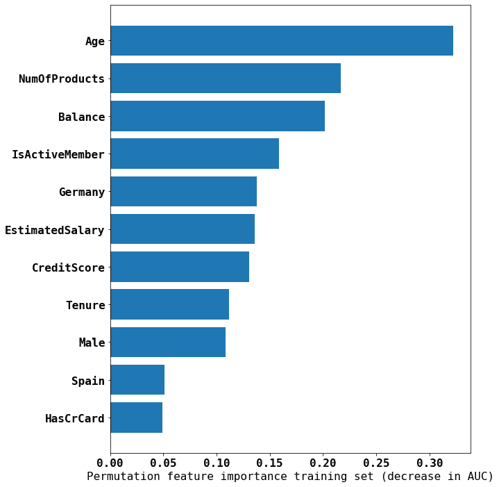

图 9.8 – 使用 ELI5 PermutationImportance 并以 AUC 作为评分计算特征重要性

根据此图，年龄是最重要的因素，其次是购买的产品数量、余额以及是否为活跃会员。

现在，让我们尝试使用 LIME 来解释模型的预测结果。

## 实践 LIME

你可以将 LIME 应用于任何类型的数据集，无论是表格、文本还是图像数据。在本节中，我们将介绍如何使用 LIME 来理解我们的随机森林分类器在客户流失建模中的预测。

这里，我们有表格数据。通过使用 LIME，我们可以更好地理解模型如何做出决策，并识别出在预测客户流失时最重要的因素：

1.  由于这是表格数据，我们将使用`lime_tabular`中定义的`LimeTabularExplainer`类：

注意

理想情况下，我们不应该对分类特征进行独热编码，因为当 LIME 尝试做出预测时，它可能会给出无意义的输入。更多信息，请参见[`github.com/marcotcr/lime/issues/323`](https://github.com/marcotcr/lime/issues/323)的讨论。

```py
interpretor = lime_tabular.LimeTabularExplainer(
    training_data=np.array(X_train),
    feature_names=X_train.columns,
    mode='classification')
```

1.  现在，我们可以使用 LIME 来解释一个实例的预测结果。我们选择了以下实例：

    ```py
    X_test.iloc[3]:
    CreditScore           788.00
    Age                    32.00
    Tenure                  4.00
    Balance            112079.58
    NumOfProducts           1.00
    HasCrCard               0.00
    IsActiveMember          0.00
    EstimatedSalary     89368.59
    France                  1.00
    Germany                 0.00
    Spain                   0.00
    Female                  0.00
    Male                    1.00
    Name: 5906, dtype: float64
    ```

1.  现在，我们使用 LIME 的`explain_instance`函数来概述其对输入的解释：

    ```py
    exp = interpretor.explain_instance(
        data_row=X_test.iloc[3], #new data
        predict_fn=classifier.predict_proba
    )
    exp.show_in_notebook(show_table=True)
    ```

输出结果如下所示：

![图 9.9 – 使用 LIME 解释器解释 X_test.iloc[3]实例的特征重要性](img/Figure_9.09_B18681.jpg)

图 9.9 – 使用 LIME 解释器解释 X_test.iloc[3]实例的特征重要性

LIME 解释器告诉我们，对于给定的客户，流失的概率微乎其微（0.01）。此外，在前面的结果中，我们可以看到各个因素对每个类别的贡献以及它们的贡献性质。再次发现，年龄对预测的影响最大。

我们可以看到所有工具都指向了同一个方向：`年龄` 是流失建模的重要特征。让我们看看 SHAP 的解释。

## SHAP 实践

在本节中，我们将向您展示如何使用 SHAP 来解释我们流失预测模型的预测结果。SHAP 是一种强大的可解释 AI（XAI）技术，可以帮助我们理解输入数据点中的每个特征对机器学习模型预测的相对重要性。通过使用 SHAP，我们可以更好地理解模型如何做出决策，并识别出在预测流失时最重要的因素：

1.  我们将使用 SHAP 的 `TreeExplainer` 类，该类专门设计用于树模型。`TreeExplainer` 类通过遍历模型的决策树并计算每个特征对每个树节点的预测贡献，从而工作。然后将这些贡献聚合，以生成模型预测的全局解释：

    ```py
    explainer = shap.TreeExplainer(classifier)
    shap_values = explainer.shap_values(X_test)
    ```

1.  现在我们将对与 LIME 使用的相同实例 `X_test[3]` 进行操作：

    ```py
    shap.initjs() #initialize javascript in cell
    shap.force_plot(explainer.expected_value[0],
            shap_values[0][3,:], X_test.iloc[3,:])
    ```

这将生成一个给定实例的 SHAP 力量图。该力量图直观地解释了各个因素对该特定实例预测的贡献。显示了输入数据中每个特征的相对重要性，以及每个特征如何影响预测。第一个参数 `explainer.expected_value[0]` 表示该实例的模型期望值为 `0`——也就是说，它属于 0 类，即没有流失。第二个参数 `shap_values[0][3,:]` 提供了我们给定实例的 SHAP 值数组。SHAP 值表示每个特征对模型为 0 类做出的预测的贡献。在这里，你可以看到这个图表：

![图 9.10 – SHAP 力量图用于 X_test.iloc[3] 实例](img/Figure_9.10_B18681.jpg)

图 9.10 – SHAP 力量图用于 X_test.iloc[3] 实例

如我们所见，SHAP 力图展示了一个线性坐标轴。这个坐标轴表示模型的输出。你还应该看到一组水平条形图，它们表示输入数据中的特征。该图还包括一个基准值，它是模型在为特定类别或标签进行解释时的预期输出值。每个水平条形图的长度表示相应特征对预测的相对重要性。较长的条形图表示更高的重要性，而较短的条形图表示较低的重要性。每个条形图的颜色表示该特征值如何影响预测结果。蓝色条形图表示该特征的较高值导致较高的预测值，而红色条形图表示该特征的较高值导致较低的预测值。

1.  我们还可以使用 SHAP 的依赖图来了解输入数据集中特定特征与模型预测之间的关系。以下命令生成一个图，展示`Age`特征对 0 类别预测的影响：

    ```py
    shap.dependence_plot("Age", shap_values[0], X_test)
    ```

这里是它的图示：

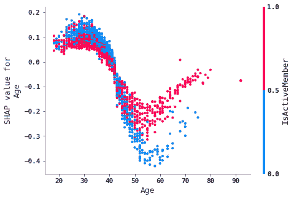

图 9.11 – SHAP 依赖图（Age 特征）

1.  总结图使我们能够可视化所有输入特征的重要性。以下是相关代码：

    ```py
    shap.summary_plot(shap_values[1], X_test, plot_type="violin")
    ```

图示如下：

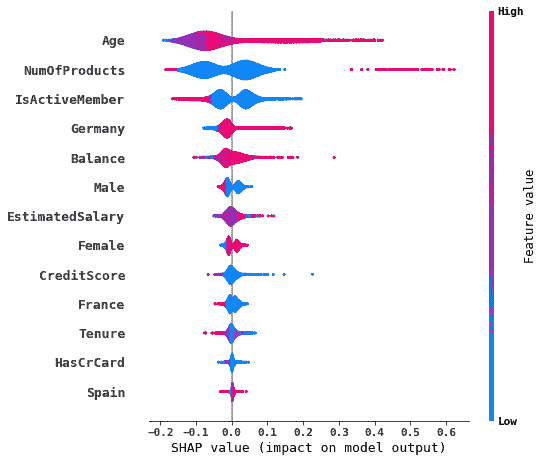

图 9.12 – SHAP 总结图

SHAP 总结图由一个垂直坐标轴组成，表示模型的输出（通常标记为`f(x)`），以及一组水平的小提琴图，表示每个特征的 SHAP 值分布。小提琴图展示了每个特征在数据集中所有实例中的 SHAP 值分布，可以用来理解每个特征的值是如何影响模型的预测结果的。

到目前为止，我们所审视的库为我们提供了许多基于各特征重要性的模型预测见解。接下来，我们将探索一些提供因果关系分析的库。

# CausalNex

CausalNex 是一个开源 Python 库，允许我们开发有助于推断因果关系的模型，而非仅仅观察相关性。CausalNex 提供的`what if`库用于测试场景，利用**贝叶斯网络**进行因果推理。一些 CausalNex 的突出特点如下：

+   **通过可视化简化贝叶斯网络中的因果关系理解**：CausalNex 的主要特点之一是它通过可视化简化了贝叶斯网络中因果关系的理解。该库提供了一系列可视化贝叶斯网络的工具，包括网络图、影响图和决策图，允许用户查看不同变量之间的连接及其相互影响。

+   **理解变量之间的条件依赖关系**：CausalNex 还提供了用于理解变量之间条件依赖关系的工具。该库包括最先进的结构学习方法，这些算法可以从数据中自动学习贝叶斯网络的结构。这些方法使用户能够识别变量之间的关系，并理解它们如何受到网络中其他变量的影响。

+   **增强领域知识**：CausalNex 还提供了增强领域知识的工具，领域知识指的是用户在建模过程中所带入的特定知识和专业技能。该库允许用户将其领域知识融入贝叶斯网络的结构中，从而帮助提高模型的准确性和可靠性。

+   **评估模型质量**：CausalNex 包括用于评估模型质量的工具，如统计检查和模型选择方法。这些工具使用户能够确保他们构建的模型是准确的，并且适用于他们特定的问题。

+   **基于结构关系构建预测模型**：该库还包括基于贝叶斯网络中结构关系构建预测模型的工具，这对于预测未来结果或以“假设如果”的方式测试场景非常有用。

在下图中，你可以看到一个显示学生表现与可能影响因素之间因果关系的图：

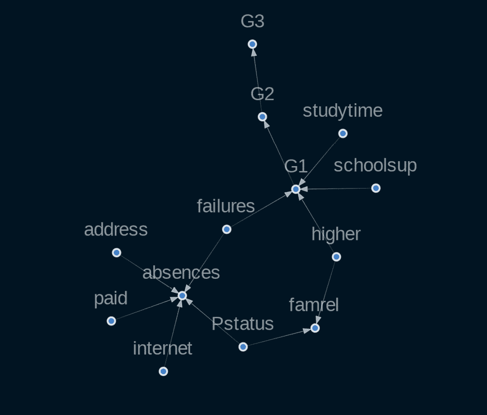

图 9.13 – 子图显示影响学生表现的不同因素之间的因果关系

该结果来源于 CausalNex 的入门教程，[`causalnex.readthedocs.io/en/latest/03_tutorial/01_first_tutorial.html`](https://causalnex.readthedocs.io/en/latest/03_tutorial/01_first_tutorial.html)。我们可以看到，过度的互联网使用会导致学生缺课增加。同样地，如果学生增加学习时间，他们的成绩（**G1**）会提高。

总体而言，CausalNex 是一个强大的贝叶斯网络因果推理工具包。它提供了一系列功能，用于简化因果关系的理解，理解变量之间的条件依赖关系，增强领域知识，评估模型质量，以及基于结构关系构建预测模型。

现在让我们探索下一个用于因果推断的 Python 库——DoWhy 库。

# DoWhy 用于因果推断

DoWhy 是一个用于因果推断和分析的 Python 库。它旨在支持与其他因果估计库的互操作性，如 Causal ML 和 EconML，使用户能够轻松地在分析中结合不同的方法和途径。

DoWhy 的主要特点之一是专注于稳健性检验和敏感性分析。该库包括一系列方法来评估因果估计的稳健性，如自助法和安慰剂测试。这些方法帮助用户确保他们的估计是可靠的，不受偏差或混杂因素的影响。

除了稳健性检验外，DoWhy 还提供了一个 API，涵盖因果分析中的常见步骤。这些步骤包括创建因果模型、确定感兴趣的效应、使用统计估计方法估计效应，并通过敏感性分析和稳健性检验验证估计结果。

要创建因果模型，用户可以使用 DoWhy 的因果图和结构假设工具来表示变量之间的关系并指定模型的基本假设。一旦模型创建完成，用户可以使用 DoWhy 的识别工具来确定预期效应是否有效，然后使用该库的估计工具来估算效应。最后，用户可以使用 DoWhy 的验证工具，通过敏感性分析和稳健性检验确保估计结果的准确性和可靠性。

该库为因果推断领域做出了三大主要贡献：

+   **将问题建模为因果图**：DoWhy 允许用户将问题表示为因果图，这些图是变量之间因果关系的图形表示。通过将问题建模为因果图，用户可以明确表达他们的所有假设，从而帮助确保这些假设是透明的并且易于理解。

+   **统一接口**：DoWhy 结合了图模型和潜在结果这两个主要框架，提供了一个统一的接口，支持多种因果推断方法。这使得用户能够轻松地将不同的方法和途径结合到分析中，并选择最适合其特定问题的方法。

+   **自动测试假设有效性**：DoWhy 包括一系列测试假设有效性的工具，如稳健性检验和敏感性分析。通过自动测试假设的有效性，用户可以确保他们的估计是可靠的，不会受到偏差或混杂因素的影响。

DoWhy 将因果推断过程分为四个步骤：**建模**、**识别**、**估计**和**反驳**。在建模步骤中，用户创建因果图以编码他们的假设。在识别步骤中，用户制定他们希望估算的内容。在估计步骤中，用户使用统计估计方法计算效应估计值。最后，在反驳步骤中，用户通过敏感性分析和稳健性检验验证假设。

让我们动手试试，玩一玩 DoWhy。

## DoWhy 的应用

我们将使用一个简单的合成数据集来演示 DoWhy 库的功能。

1.  首先，导入 DoWhy 库以及我们将使用的组件，如下所示：

    ```py
    import dowhy
    import dowhy.datasets
    from dowhy import CausalModel
    ```

1.  接下来，使用 DoWhy 的 `linear_dataset` 函数，我们生成一个合成数据集，使得干预和感兴趣结果之间的关系是线性的，这也称为线性处理效应（在我们的例子中，我们选择了 `beta=10`，因此真实的干预效应为 `10`）。这将创建一个具有指定干预效应的线性模型，并生成符合此模型的一组合成数据点。生成的 DataFrame 包含表示干预的列、表示结果的列，以及一组表示常见原因和工具变量的列。此外，`num_effect_modifiers` 参数指定了影响干预效应的效应修饰符或变量的数量，`num_samples` 参数指定数据集中样本的数量，`treatment_is_binary` 参数指示干预是二元的还是连续的。如果干预是二元的，则它只能取两个值：有效或无效、开或关；如果干预是连续的，则它可以取多个值。`stddev_treatment_noise` 参数指定了干预噪声的标准差，这个噪声会添加到干预效应中，生成合成数据。生成的数据是 `dictdata` 类型。然后从中提取 DataFrame (`df`)：

    ```py
    # Generate data
    data = dowhy.datasets.linear_dataset(beta=10,
            num_common_causes=5,
            num_instruments = 2,
            num_effect_modifiers=2,
            num_samples=6000,
            treatment_is_binary=True,
            stddev_treatment_noise=9,
            num_discrete_common_causes=1)
    df = data["df"]
    ```

1.  `df` DataFrame 将有 11 列，其中 `v0` 列是干预名称，结果在 `y` 列，`W0-W4` 代表五个常见原因，`Z0` 和 `Z1` 是两个工具变量，`X0` 和 `X1` 是两个效应修饰符。现在，我们使用 `CausalModel` 类为我们的合成数据创建因果模型。`CausalModel` 类使用以下参数：

    1.  `data`：一个 pandas DataFrame，包含数据。

    1.  `treatment`：DataFrame 中将被视为 `treatment` 变量的列。它代表的是正在采取的干预或措施，目的是影响结果。

    1.  `outcome`：DataFrame 中将被视为结果变量的列。

    1.  `common_causes`：将被视为常见原因的列。这些变量既能影响干预，也能影响结果，通常也称为 `instruments`（工具变量）：这些是用来推断因果关系的变量。

这将创建一个图形模型，表示数据中因果关系的结构。`graph` 参数指定了因果图，它编码了模型中变量之间因果关系的结构。这里，我们使用的是**图形建模语言**（**GML**）文件格式的因果图：

```py
# Input a causal graph in GML format
model=CausalModel(
        data = df,
        treatment=data["treatment_name"],
        outcome=data["outcome_name"],
        graph=data["gml_graph"]
        )
```

让我们查看 `model.view_model()` 图形：

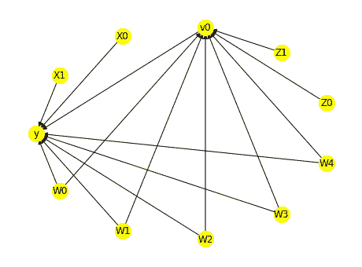

图 9.14 – 数据集的因果图

1.  接下来，我们查看目标变量和识别它们所需的假设。结果告诉我们估计量（模型估计的因果估计量，描述了感兴趣的因果效应）、它们的名称、表达式（用模型变量表示的估计量的数学表达式）以及所需的假设：

    ```py
    # Identification
    identified_estimand =
            model.identify_effect(
            proceed_when_unidentifiable=True)
    print(identified_estimand)
    >>>
     Estimand type: EstimandType.NONPARAMETRIC_ATE
    ### Estimand : 1
    Estimand name: backdoor
    Estimand expression:
      d
    ─────(E[y|W0,W1,W3,W2,W4])
    d[v₀]
    Estimand assumption 1, Unconfoundedness: If U→{v0} and U→y then P(y|v0,W0,W1,W3,W2,W4,U) = P(y|v0,W0,W1,W3,W2,W4)
    ### Estimand : 2
    Estimand name: iv
    Estimand expression:
     ⎡                              -1 ⎤
     ⎢    d        ⎛    d          ⎞  ⎥
    E⎢─────────(y)⋅ ─────────([v₀])    ⎥
     ⎣d[Z₁  Z₀]     ⎝d[Z₁  Z₀]       ⎠  ⎦
    Estimand assumption 1, As-if-random: If U→→y then ¬(U →→{Z1,Z0})
    Estimand assumption 2, Exclusion: If we remove {Z1,Z0}→{v0}, then ¬({Z1,Z0}→y)
    ### Estimand : 3
    Estimand name: frontdoor
    No such variable(s) found!
    ```

1.  现在让我们使用`estimate_effect`方法来识别估计量，以计算治疗效应的估计值。我们可以看到估计的均值是`9.162`，这表示治疗对结果的平均效应，在整个群体中的所有个体上都适用：

    ```py
    # Estimation
    causal_estimate =
            model.estimate_effect(identified_estimand,
            method_name="backdoor.propensity_score_stratification")
    print(causal_estimate)
    >>>
     *** Causal Estimate ***
    ## Identified estimand
    Estimand type: EstimandType.NONPARAMETRIC_ATE
    ### Estimand : 1
    Estimand name: backdoor
    Estimand expression:
      d
    ─────(E[y|W0,W1,W3,W2,W4])
    d[v₀]
    Estimand assumption 1, Unconfoundedness: If U→{v0} and U→y then P(y|v0,W0,W1,W3,W2,W4,U) = P(y|v0,W0,W1,W3,W2,W4)
    ## Realized estimand
    b: y~v0+W0+W1+W3+W2+W4
    Target units: ate
    ## Estimate
    Mean value: 7.151535367146138
    ```

1.  你可以使用`refute_estimate`函数来测试治疗效应估计在数据或模型假设的各种扰动下的稳健性。

总的来说，DoWhy 是一个强大的因果推断和分析工具。它提供了用于创建因果模型、识别效应、估计效应和验证估计的多种功能，是因果推断领域的研究人员和分析师的宝贵资源。

# 用于解释模型的 AI Explainability 360

AI Explainability 360 是一个开源工具包，提供了多种用于解释和理解机器学习模型的技术。它支持模型特定和模型无关的方法，以及局部和全局解释，为用户提供多种理解模型的选项。此外，该工具包构建于流行的机器学习库之上，包括 scikit-learn 和 XGBoost，方便与现有管道集成。

AI Explainability 360 的一些特点包括：

+   **模型无关和模型特定的可解释性技术**：AI Explainability 360 提供了模型无关和模型特定的可解释性技术，可以用来理解和解释任何 AI 模型的预测。模型无关技术，如 LIME 和 SHAP，可以用来解释任何模型的预测，而模型特定技术，如特征重要性和部分依赖图，针对特定类型的模型进行定制。

+   **局部和全局解释**：AI Explainability 360 提供了 AI 模型的局部和全局解释。局部解释侧重于理解模型对单个实例所做的特定预测，而全局解释则侧重于理解模型的整体行为。

+   **支持多种数据类型**：AI Explainability 360 支持多种数据类型的解释，包括表格数据、文本、图像和时间序列数据。它提供了一系列针对每种数据类型特征的可解释性技术。

+   **与流行的 AI 框架集成**：AI Explainability 360 被设计为可以轻松与流行的 AI 框架集成，包括 TensorFlow、PyTorch 和 scikit-learn，方便在实际应用中使用。

+   **广泛的文档和示例**：AI 可解释性 360 配备了丰富的文档和示例，帮助用户在自己的项目中开始探索可解释性。

总体而言，AI 可解释性 360 是一个强大的工具包，用于理解和解释人工智能模型所做的预测，并构建透明、可信、公平的人工智能系统。

# 摘要

人工智能的未来在于使人们能够与机器协作解决复杂问题。像任何高效的合作一样，这需要良好的沟通、信任、清晰度和理解。XAI 旨在通过结合符号 AI 和传统机器学习的最佳特点来解决这些挑战。

在本章中，我们探讨了多种 XAI 技术，这些技术可以用于解释和解读机器学习模型。这些技术可以根据其范围（局部或全局）和模型类型（特定模型或无关模型）进行分类。

我们介绍了几种提供 XAI 功能的 Python 库，并解释了如何使用 ELI5、LIME 和 SHAP 探索模型预测中的特征重要性。LIME 可以为任何分类器做出基于实例的解释。LIME 使用可解释模型局部地近似分类器，并生成一个特征列表，列出在给定实例中对预测有贡献的特征。SHAP 使用 Shapley 值来解释每个特征对预测的贡献，支持局部和全局的解释，并且可以与各种模型类型一起使用。

DoWhy 是另一个因果推断和分析库。它提供了一个 API，涵盖因果分析中的常见步骤，包括建模、识别、估计和反驳。最后，我们介绍了 AI 可解释性 360，这是一个综合性的开源工具包，用于解释和解读机器学习模型。它支持特定模型和无关模型的解释，以及局部和全局的解释。

总之，市场上有多种工具和库可用于解释和解读机器学习模型。这些工具（如 ELI5、LIME、SHAP、CausalNex、DoWhy 和 AI 可解释性 360）提供了多种选项，用于理解模型如何做出预测，并且对于在 XAI 领域工作的研究人员和从业者非常有用。然而，必须注意的是，这一领域仍然存在一些局限性和挑战。

在下一章中，我们将深入探讨模型风险管理，并探索模型治理的最佳实践。

# 参考文献

+   *黑盒与白盒：从实践角度理解它们的优缺点*，Loyola-Gonzalez, Octavio。IEEE Access 7（2019）：154096-154113。

+   *可解释人工智能（XAI）中的机遇与挑战：一项调查*。arXiv 预印本 arXiv:2006.11371，Das, Arun 和 Rad Paul。（2020）

+   *人机交互与可解释人工智能在医疗保健中的系统性回顾与人工智能技术*。IEEE Access 9（2021）：153316-153348，Nazar, Mobeen 等人。

+   *为什么我应该信任你？解释任何分类器的预测*。Ribeiro, Marco Tulio，Singh Sameer 和 Guestrin Carlos。《第 22 届 ACM SIGKDD 国际知识发现与数据挖掘会议论文集》，2016 年。

+   *统一的模型预测解释方法*。《神经信息处理系统进展》30。Lundberg, Scott M. 和 Lee Su-In（2017）

+   *通过定量输入影响实现算法透明性：学习系统的理论与实验*。2016 IEEE 安全与隐私研讨会（SP）。Datta, Anupam，Sen Shayak 和 Zick Yair。IEEE，2016 年。

+   *通过特征贡献解释预测模型和个体预测*。《知识与信息系统》41.3 (2014)：647-665。Štrumbelj, Erik 和 Kononenko Igor。

+   *贝叶斯网络*，Pearl, Judea. (2011)

+   *基于贝叶斯网络的学习教程*。《贝叶斯网络的创新》(2008)：33-82。Heckerman, David。

+   *概率图模型：原理与技术*。MIT Press，2009 年。Koller, Daphne 和 Friedman Nir。

+   *统计中的因果推断：概述*。*统计调查 3*：96-146。Pearl, Judea. (2009)

+   CausalNex 文档：[`causalnex.readthedocs.io/en/latest/`](https://causalnex.readthedocs.io/en/latest/)

+   DoWhy GitHub 仓库：[`github.com/py-why/dowhy`](https://github.com/py-why/dowhy)

+   *介绍 AI 可解释性* *360*：[`www.ibm.com/blogs/research/2019/08/ai-explainability-360/`](https://www.ibm.com/blogs/research/2019/08/ai-explainability-360/)
