# 第十章：道德与模型治理

本章提供了**模型风险管理**（**MRM**）的详细概述，并介绍了最佳的治理实践，以帮助组织降低成本并提高效率。本章的主要目标是通过确保遵循正确的模型指标，展示 MRM 技巧，同时使用来自模型和数据两个角度的工具，帮助我们培养正确的风险缓解和治理实践。你将学习如何设计和制定风险管理记分卡，以帮助防止企业损失额外的资金。

此外，本章还强调了正确的策略和对数据或模型变化模式的了解在识别模型风险方面的有效性。这使我们能够量化部署在生产中的模型及其在模型库存中的风险。本章还解释了如何更好地管理和共享大量运行多个实验的模型库存，以便团队间可以协作共享。

在本章中，以下主题将在接下来的章节中进行讲解：

+   **模型风险** **管理（MRM）**

+   模型版本控制

+   特征存储简介

# 技术要求

本章要求你安装 Python 3.8，并安装以下内容：

+   `pip` `install wandb`

+   从[`docs.docker.com/desktop`](https://docs.docker.com/desktop)安装 Docker

+   `git` `clone` ([`github.com/VertaAI/modeldb.git`](https://github.com/VertaAI/modeldb.git)):

+   `docker-compose -f` `docker-compose-all.yaml up`

+   `pip` `install verta`

+   `pip` `install feast`

+   `pip` `install wandb`

本章的代码可以在 GitHub 上找到：[`github.com/PacktPublishing/Designing-Models-for-Responsible-AI/tree/main/Chapter10`](https://github.com/PacktPublishing/Designing-Models-for-Responsible-AI/tree/main/Chapter10)。

# 模型风险管理（MRM）

在本节中，我们首先讨论为什么有必要为模型中的风险开发一个具体的框架，这一框架最早由顶级机构和金融行业提出。这使得银行和保险公司能够对 MRM 施加额外的控制。然而，这一框架可以扩展并应用到其他行业（如零售、媒体和娱乐），这些行业由于每天发生大量交易，已广泛采用持续监控和模型重训练管道。尽管我们将审视来自金融行业的一个真实案例，组织和领导层应该努力在任何 AI 产品和服务中采纳这些建议，因为 AI 的指南、法律和法规变得越来越严格。

现在我们已经了解了模型库存风险管理的重要性，接下来简要看看模型库存如何管理。模型库存管理是 MRM 的一个子部分。让我们了解它的类型。

## 模型库存管理的类型

AWS 提供了生产模型的目录管理和版本控制，支持模型库存管理，详细信息见此。模型注册表将元数据与模型关联，包括其训练指标、所有者名称和批准状态：

+   **分布式模型库存管理方法**：该方法允许将模型文件和工件存储在它们生成所在的同一账户中。此外，模型会注册到与每个账户关联的 SageMaker 模型注册表中。因此，任何业务单元都可以拥有自己的机器学习测试账户进行**用户验收测试（UAT）**，并允许将训练过程中生成的模型注册并保存在业务单元自己的 UAT/测试账户中。

+   **集中式模型库存管理方法**：该方法允许所有生成的模型与关联的推理 Docker 容器镜像一起存储在共享服务账户中。此外，通过模型包组启用版本管理。任何在生产账户中进行的生产部署/升级，都可以通过来自中央模型包库的**Amazon 资源名称（ARN）**来实现版本控制。

**模型风险管理监管指南**（**SR 11-7**）于 2011 年 4 月由美国联邦储备系统理事会发布。该文件阐述了模型风险的概念，并已成为行业标准。它列出了模型中存在的固定风险，以及由于基于错误或不当使用模型输出和报告的决策，在模型开发生命周期的任何阶段可能引发的不良后果。

该文件还强调了决策者理解模型局限性的重要性，并避免将模型用于其原本不适用的领域。随着模型风险的量化，欧洲银行管理局的监管审查与评估流程也应运而生，该流程规定应识别、映射、测试和审查模型风险，以便机构能够量化市场风险对资本的影响。同时，它还提供了在无法量化特定风险的实际资本金额时分配特定预算的灵活性。

在制定模型风险时，当局已经意识到在评估过程中考虑风险，以简化评估流程。当不同的操作风险因使用预测模型影响到企业时，需要采取措施，如下所述：

+   当组织或银行低估自身资金，使用监管批准的模型时，风险就会产生。**内部评级基础法**（**IRB**）模型在信用风险和资本充足性评估中尤为明显，便是这种情况的例子。

+   风险与缺乏知识以及在定价产品和评估金融工具时不当使用模型相关。

让我们看看 MRM 所能提供的潜在节省。

## MRM 的成本节约

MRM 的主要目标是通过提高构建、验证和部署模型的操作和流程效率来降低成本并防止损失，其中无效的模型将被淘汰。除了成本降低之外，由于减少了不必要的资本缓冲和附加费用，还带来了资本改善。一个定义明确的 MRM 职能通常能增强监管者的信心，减少罚款，并避免不合规带来的支出。MRM 显著改善了**盈亏**（**P&L**），因为当解决了模型所有权分散的问题时，建模成本（以百万计）将大幅降低。复杂模型被替换，并增加了更具可解释性的版本，并将其分配给合适的业务单元。研究结果表明，一家全球银行在*四年*内额外花费了*4400 万欧元*，相比原本的*700 万欧元*（总计*5100 万欧元*），这显示出在模型上的资本预算花费几乎增长了七倍。得益于 MRM 框架，银行在现有模型环境中获得了信心，这有助于他们将模型投资与业务风险及其优先事项对齐，并减少盈亏波动。这不仅将重点放在模型的透明度上，还为他们提供了培养机构风险文化的方法。接着，成本节省释放了可以分配给高优先级决策模型的资源和资金。

明确定义和结构化的模型风险管理（MRM）方法的优势在于，它通过将机器学习开发成本降低*20-30%*，使得银行在面对模型不当使用的风险时更加谨慎，并使其将重点转向模型验证预算，以优化具有更高质量、一致性和韧性的模型库。另一个日益受到关注的重要因素是基于业务决策优先级的风险识别。在这里，我们可以看到模型风险分类技术（也称为分层技术）的出现，这种技术可以通过战略性地利用资源并建立强有力的治理，进一步提高速度和效率。

在金融行业，AI/ML 驱动的解决方案和自动化在管理与银行客户关系方面产生了巨大影响。投资组合管理和优化通过使用验证计划、流程和矩阵，已展示出为企业减少*25%*成本的效果，从而减少了低效性。通过自动化明确且重复的验证任务，测试和编码成本也显著节省了*25%*。例如，标准化测试和模型复制机制也已被引入。

*图 10.1*展示了模型风险的五大基石，具体如下：

+   **模型定义**

+   **模型治理**

+   **模型验证**

+   **操作风险**

+   **模型校准**

这些可以在下图中看到：

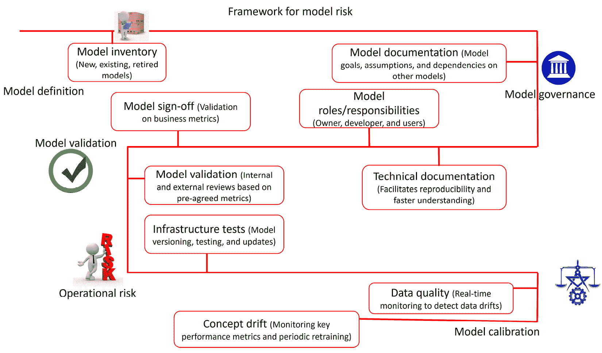

图 10.1 – MRM 框架的四大支柱

每个**模型定义**（包括已退役、新模型和现有模型）都存储在模型清单中。模型清单包含与其相关的所有术语，以便为利益相关者提供一个关于模型的高层次概览，包括模型的作用和局限性。模型清单存储所有在生产中运行的 ML 模型，并允许我们创建依赖关系树，展示它们如何相互作用。

因此，它有助于绘制出哪些模型具有最大固有风险，主要是由于潜在的级联故障。

模型清单包括模型名称和描述、开发阶段（当前在用、开发中或已退役）、高级风险评估、模型目标、关于模型的假设及其局限性、模型的使用量、使用背景和财务影响。模型清单通常会随着时间的推移而过时，因此，管理清单的最佳方式是将责任分配给云/DevOps 工程师，由其负责模型清单管理，并与模型所有者紧密协调，确保每个模型的文档是最新的。文档还提供了模型创建过程中的尽职调查证据，并详细说明了验证的结果。

**模型治理**涉及与政策、控制、版本、角色与责任、文档、度量过程、报告、通知、模型的深入细节、风险评级以证明模型目标、模型的目标和局限性及其对其他模型的依赖等相关的所有活动和细节。由于模型治理控制模型版本和角色变更，它还负责量化模型的风险聚合，以及连续发布的模型版本。此外，模型执行的所有活动也都属于模型治理的范围。因此，它包括与变更控制过程、主要挑战、供应商使用、利益相关者凭证、生命周期过程和法规解释相关的所有信息。SR 11-7 中可用的 MRM 策略的正式化建议银行应专注于“*测试与分析，主要目标是促进* *准确性*”（[`www.afponline.org/ideas-inspiration/topics/articles/Details/model-governance-and-model-risk-management`](https://www.afponline.org/ideas-inspiration/topics/articles/Details/model-governance-and-model-risk-management)）。

以下是建议的用于区分角色和责任的行动步骤：

+   建立第二道和第三道防线，与高级管理层、模型开发者和模型验证人员合作，确保团队组成有适当的文档记录。这是为了为负责内部模型治理和监督的委员会提供授权和报告线，即使随着 ML 模型的变化，团队也会发生变化。

+   模型所有者负责模型的开发、实施和使用。他们与高级管理层密切协调，以定义部署新模型的签字政策。

+   模型开发者按照模型所有者的指导创建和实施机器学习模型。

+   模型用户可以属于与业务对接的内部团队，或是需求和期望已经明确的外部团队。他们还可以参与模型的开发过程，以验证模型在训练过程中的假设。

+   绘制出你的组织架构，包括能够快速识别并缓解与模型不确定性和缺陷相关的性能问题的外部资源。

**模型验证**过程不仅涉及模型的性能指标，还包括与设计过程、使用的数据评估方法、模型测试和文档（实际记录的内容）相关的所有细节。这是一个审计步骤，确保模型的表现符合文档中提到的输入数据和过程。

在模型验证过程中，会将模型的使用程度与预期的模型用途进行对比，这有助于我们决定风险评级；其局限性使我们能够进一步调整并记录设计控制。在验证阶段，所有与编程过程、将模型纳入网络、测试实施标准、基准测试以及每个模型的错误处理过程相关的信息都会得到验证。

组织可以选择定义内部和外部验证流程，以确保模型在部署之前达到期望的性能基准。通过结合外部验证（由外部审计人员或独立方执行验证）和内部验证（由同一团队或部门执行验证），可以实现双方验证策略。尽管验证通常由内部团队进行，但监管机构要求进行外部验证。验证的目标是揭示偏差、极限情况或文档、模型构建或版本控制中的遗漏，找出未考虑的情况，而无需模型所有者的输入。

**操作风险**识别所有涉及运行模型基础设施测试、模型版本管理、执行不同测试策略以及重新训练或更新模型的步骤。它不仅量化了由于数据本身存在固有问题或模型对另一个模型的依赖而产生的风险，还突出显示了由于微服务、延迟以及**分布式拒绝服务**（**DDoS**）攻击对生产环境造成的风险。

**模型校准** 调整模型、模型的时机及建议模型需要重新训练和校准的特征，并衡量其可解释性与所需文档。此外，它还通过监控工具展示了模型重新校准的原因，例如数据和概念漂移。它处理模型跟踪方案，以便在发现模型偏离预期结果或模型误用时立即加以纠正。这需要使用持续的模型监控工具来检测和解决潜在问题，帮助保持模型的条件和性能一致且可重复，即使模型的输入或依赖发生任何变化。

现在，让我们看看一个组织如何在模型开发生命周期的后续阶段中演变其 MRM 框架。

## MRM 的转型之旅

MRM 从起步到转型与差异化的旅程经历了三个不同的阶段。如*图 10.2*所示，MRM 设计框架包含以下几个阶段：

+   **基础阶段**：该阶段建立了 MRM 政策、模型库存、基本的模型工作流工具以及模型治理标准。

+   **实施与执行的成熟阶段**：MRM 框架在大规模应用于大量复杂的机器学习模型时得以实施。本阶段还需要利益相关者的培训，并实施自动化工作流工具，定义数据血缘、模型治理以及其生命周期中的其他控制和流程。

+   **通过价值进行转型/差异化**：这一阶段涉及在卓越中心内开展 MRM 的研究和开发，推动工业化验证、透明度、流程效率以及资源的优化使用。

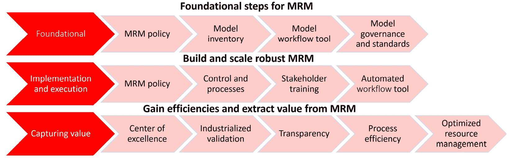

图 10.2 – 将 MRM 实践化

现在我们已经了解了 MRM 框架及其增强方式，接下来让我们学习两个可以帮助模型风险分级的重要工具。本章中描述的大多数模型风险分级工具和技术都受到了*模型风险分级：行业实践与* *原则*（[`www.risk.net/journal-of-risk-model-validation/6710566/model-risk-tiering-an-exploration-of-industry-practices-and-principles`](https://www.risk.net/journal-of-risk-model-validation/6710566/model-risk-tiering-an-exploration-of-industry-practices-and-principles)）的启发和/或改编。

## 模型风险分级

模型风险分层，从绝对的角度来看，是对模型库存风险的抽象外部表现，能够识别并区分一个模型的使用风险与其他模型的风险。评估指标是业务中（特别是在银行）需要考虑的重要参数，能够确定并对比单一业务用例的模型风险，反映任何问题的严重性。这直接取决于我们如何评估模型库存并定义风险分类因素。它与业务的其他外部和内部因素、市场条件以及其他财务风险因素密切相关，这些因素根据模型的重要性排序。

例如，规模、复杂性、年度/季度收入以及涉及的资本量等因素在为组织各部门设计定制化的 MRM 框架时都起着重要作用。例如，一家资产为 10 亿美元的地区性银行，其客户互动、机器学习模型行为、风险敞口和复杂性，与一家资产为 1 万亿美元的大型银行有所不同。

如果考虑这些因素，有助于根据业务的目的平衡 MRM 的层级结构。这些以业务为驱动的需求促使将模型划分为高风险层级、中风险层级和低风险层级，并能在一个稳健的 MRM 框架中共存，无论是对于小型企业，还是大型和复杂企业。

一个模型风险分层工具有助于通过考虑模型对企业决策的影响和重要性，明确模型的实质性（即根据使用量、使用背景和财务影响来衡量模型风险）和复杂性。输出模型的决策和模型质量也起着重要作用。模型分层过程还通过根据模型度量的优先级标准（由业务方规定）定义模型的等级，帮助模型风险的优先级排序。

+   专家判断是设计一个分类工具的主要驱动力，该工具通过经验量化、评估和排序模型风险。它推动了工具的工作哲学，并由业务和功能决策驱动。

+   一个模型风险分层工具应该简单易用、透明，并通过广泛地对所有库存模型进行分类，提供一致、可靠且公正的结果。

+   它更侧重于模型的固有风险，而非模型的剩余风险。这里，固有风险指的是由于使用过时的模型验证技术、完全没有模型验证方法或未解决的问题所导致的模型风险和资本成本。模型的剩余风险则主要指的是当前模型与组织库存中其他模型相比的风险。

+   模型风险类别帮助数据相关方了解模型中存在的相对风险，以及工具标记的不同层级中，预测所带来的间接风险。

+   模型风险分层工具的设计过程应允许团队在组织内的不同业务单元和法务实体之间，强烈关联并链接模型中存在的相对风险。

+   模型风险分类设计过程应生成并解释与管理层预期和业务结果一致的结果。该工具应能够解释所有库存模型的结果，并根据不同的权重因素进行分析。

模型风险分层为组织带来显著好处，尤其是在关键利益相关者意识到不同层级的模型失败所导致的业务损失时。可能包括以下内容：

+   你可以评估和估算模型对当前（账面或市场）价值的影响。财务影响可以通过预测结果的单位（美元价值）以及被建模实体的单位（美元价值）进一步量化。

+   你可以考虑因模型错误（由输入特征的敏感性引起）而导致的潜在业务损失（例如，因需求变化而失去客户）。计算得到的风险指标通常能够揭示模型由于外部波动性所导致的敏感性。

+   你可以理解直接或间接消费预测结果的客户数量对建模实体的影响，或者被建模实体的数量。

+   你可以基于结果分析模型的依赖关系，并评估对业务的影响。

现在，让我们来看看不同类型的风险分类工具。

### 模型风险树

**模型风险树**（**MRT**），由 Mankotia 和 Joshi（2013 年）首次提出，如*图 10.3*所示，采用决策树方法进行分类，以评估模型使用的不同维度。这是一个双重过程，具有透明性，易于理解。它考虑了不同的暴露阈值来标记并分类模型为高风险、中等风险或低风险。

在树的第一层，维度评估模型是否量化风险、延迟、时机、价格或任何其他值——一个指定模型领域覆盖范围整体风险的指标。这为进一步的分类类别铺平了道路。回答“*否*”得出结论，模型属于低风险层级，而回答“*是*”则推动进入下一阶段。下一个评估指标尝试确定模型的使用维度，以判断模型是用于关键决策还是用于监管或财务报告。如果答案是“*是*”，则该模型被标记为高风险或中等风险层级，而“*否*”则将模型标记为低风险到中等风险层级。如果模型属于中等风险到高风险层级，则需要对相对于阈值的暴露水平进行测试。如果暴露水平较高，监管或财务决策模型将被归类为高风险，而暴露有限的相同类别模型则被标记为中等风险。未参与关键决策过程的模型将再次根据暴露水平进行测试，并被分类为低风险或中等风险。这种 MRT 完全依赖于判断输入，并且结果只有二元分类，没有空间容纳多于两种答案。

基于决策树的风险树面临的主要挑战之一是当涉及多级分类变量时，它会迅速使决策树变得非常复杂，导致其偏倚，且更难以表示和解释。它还未能充分区分模型的重要性（相关风险），这导致更多的模型被分配到更高的层级（聚类）。

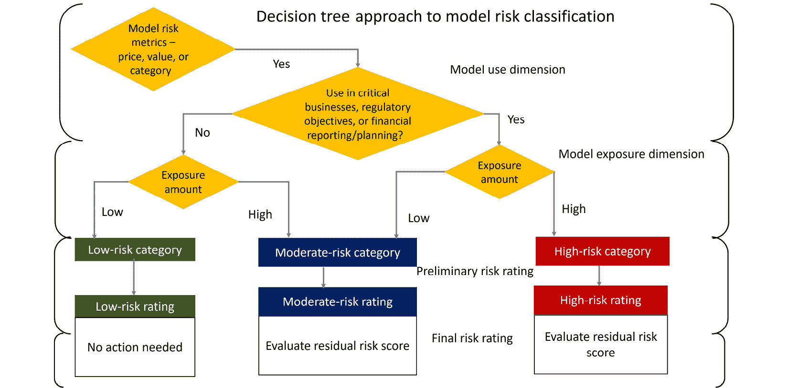

图 10.3 – 模型风险分类

随着多变量的可视化表示变得越来越具有挑战性，解决这一问题的最佳方式是使用更简单的基于评分卡的方法，如*图 10.4*所示。

### 模型风险评分卡

*图 10.4*展示了一个有效地将模型分类为不同风险类别的**模型风险评分卡**（**MRS**）。该评分卡基于因子/元素方法原理，其中包含四个相关因子。因子可以通过单一元素表示，也可以通过多个元素表示：

+   **值范围**列包括可以作为模型输入的值的可能范围。其中一些变量直接从模型配置文件中获取，而另一些则是在预处理后获得。数据转换步骤帮助我们将变量转化为连续、离散或多个级别或类别。这些包括美元影响或暴露、使用模型的用户数量以及广泛的输入变量类型和数量。

+   **权重**列表示每个贡献因素（以黄色标注）对最终得分的相对重要性。通过将其量化为百分比，我们可以表示每个元素对整体评分结构（以粉色标注）的重要性。

+   有两个调整，其中之一是**资本压力测试**指标，在模型分类过程中起着重要作用。它解释了模型在特定类别中的存在，无论其得分如何，以及它对其他因素的影响。

+   **MRM 调整**是一种得分覆盖度量，它覆盖基础结果并允许将配置的值添加到基础度量中。在这个例子中，赋予 MRM 小组负责人灵活性的值已固定为总体可能值的 50%。

+   MRS 会生成一个计算的风险分数，以得出模型所属的最终风险类别。如在*图 10.4*的风险等级分配中所示，它还包含模型的当前风险评级。

分配预处理阈值边界的过程，以及某些元素、因素权重和总体风险评分分类阈值的重要性，反映在评估矩阵中。

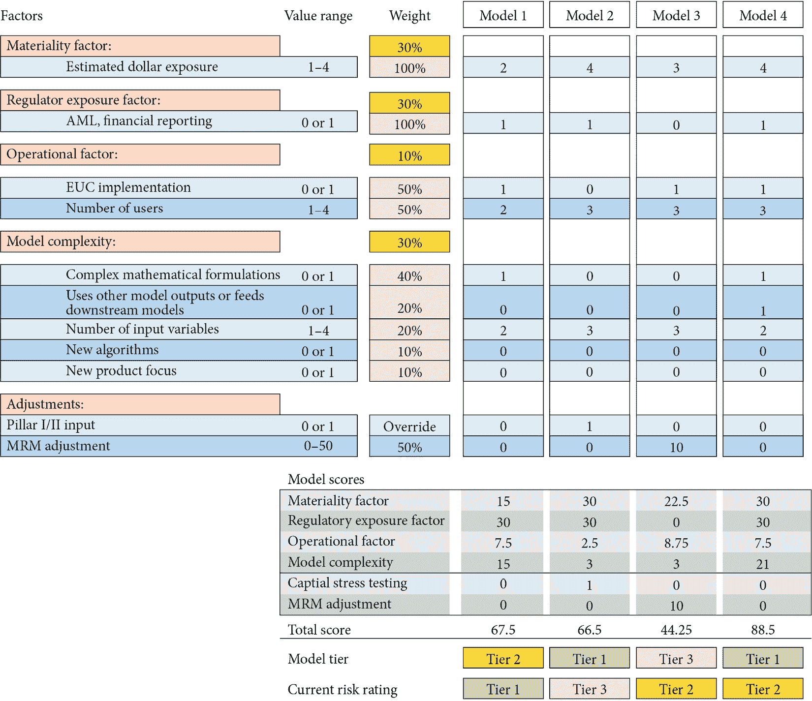

图 10.4 – 模型评分矩阵

样本 MRS 将二元变量与多级分类变量混合使用。它还考虑了加权方案，帮助确定不同重要性的参数。MRS 有明显的优势，特别适用于那些希望在不同类别中包含多个分类变量的组织。MRS 具有清晰的表示风格，使得团队更容易解读计划并考虑使用错误模型的影响。

**重要性因素**得分衡量货币单位中的估计财务影响（范围从 1 到 4），而**监管曝光因素**得分则涵盖与 AI/ML 和财务报告相关的曝光因素（得分为 0 或 1）。**操作因素**得分对模型风险分级过程的总体贡献为 10%，其中 50%由**最终用户计算**（**EUC**）实施贡献（得分因素为 0 或 1），50%由**用户数量**（得分范围为 1 到 4）贡献，后者是一个多层次的分类变量。

计算此操作风险元素的总体值，以评估其对**模型 1**最终得分贡献的公式是：

(1 × 50% + 2/4 × 50%) × 10% = 7.5%

我们知道，调整前的总体得分是 100，而**操作因素**为**模型 1**（*模型 1*得分表中的第三行）贡献了 7.5 分。

计算该模型复杂度的总体得分的公式，复杂度会影响最终得分中的风险元素，对于**模型 1**的公式是：

(1 × 40% + 2/4 × 20%) × 30% = 15%

我们还可以看到，最终的模型层级记录在三种不同颜色（绿色、粉色和橙色）的高亮框中。**模型 1**得分为 69，已被归类为**Tier 2**，而**模型 2**得分为 66.5，已被归类为**Tier 1**，其中**Tier 2**的阈值设定为 48 分，**Tier 1**的阈值为 78 分。此外，**模型 1**和**模型 2**当前的风险级别分别记录为**Tier 1**和**Tier 3**。

我们还观察到有关**模型 2**和**模型 3**的例外情况。**模型 2**的整体评分为 66.5 分，这本应将其归类为**Tier 2**，但该模型被分配到了**Tier 1**。**资本压力测试**的覆盖度量设置为 1，这会自动将所有用于资本压力测试的模型分配到最上层类别，在我们的案例中即为最高风险层级。对于**模型 3**，整体得分为 22.5 + 8.75 + 3 = 34.75 分。MRM 团队的风险量化人员为其增加了 10 分，将得分提升到 44.75 分。然而，这个得分仍不足以影响最终的模型层级分配，因为它未达到 48 分的阈值。

在这个例子中，一个操作因素在解释模型失败风险方面起着明确的作用。它考虑了在受限环境中，模型给出意外结果时可能出现的问题，并探讨了生产环境中可能导致模型失败的因素。

## 模型风险校准

组织通常会把太多的模型归类为高风险，但这样做并不符合预期目的，也意味着 MRS 工具需要校准。校准的一种方法是保持模型的相对排名不变，从而最小化模型风险分配的变化。当风险层级的变化得到系统控制时，这减少了额外的工作，并使得可以在过程中使用已有的与风险相关的信息。校准通常是通过彻底的试错、对模型档案元素的迭代调整以及判断性过程来进行的，目的是对比、对照并评估不同风险类别中模型分布与库存的差异。

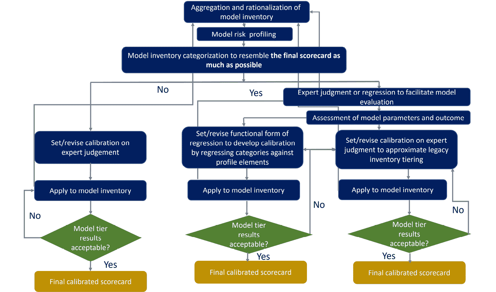

图 10.5 – 模型风险评分校准中的重要因素

在模型重新校准中，模型在各层级之间的变动被记录下来，导致这些变动的主要因素也被记录。一些因素，如*图 10.5*所示，包括单个模型在多种产品或应用中重用的程度；模型库存的综合总结，其中缺失的模型被放置在低风险层级；帮助对齐模型的层级特定 MRM 要求；以及由于监管压力或承受压力测试而应被分类为高风险的库存比例。经过与业务和模型拥有者的审查后，组织可能仍然需要设置覆盖规则，以便 MRS 尽可能谨慎地将模型分配到各层级。这个多层级分类过程有助于解释由于合规要求、财务影响或其他业务因素，与某些类型或某些用途的模型相关的影响因素。

在本节中，我们学习了与模型风险分层相关的重要概念。现在，让我们学习模型的适应性和韧性，它们为强大的 MRM 框架奠定基础。

# 模型版本控制

模型管理是跟踪机器学习模型临时构建的重要环节。它促进了机器学习模型版本的管理、存储和索引，帮助在共享、查询和分析过程中发挥作用。在管理模型时，重新运行建模工作流变得越来越昂贵，这会消耗大量的 CPU/GPU 处理能力。为了使模型结果持久化，开发和部署能够自动构建、跟踪和负责模型开发生命周期中模型管理任务的工具是至关重要的。

模型管理通过生成每个机器学习模型的洞察，结合真实的版本控制，帮助减少开发和跟踪的工作量：

+   数据科学家能够全面了解和洞察迄今为止构建的模型。

+   它帮助我们通过版本化模型的预测结果来巩固和推断重要信息。检查版本化模型的指标使数据科学家能够利用当前模型对业务的影响。

+   它帮助我们发现不同客户和市场细分的趋势与洞察，并加速跨模型的元分析。

+   索引过程使数据科学家能够快速搜索模型库，以识别特征的正确或不当使用。

+   它还促进了数据科学家之间的轻松协作。

现在，让我们讨论如何使用一种名为**ModelDB**的模型管理工具，在其本地环境中自动跟踪机器学习模型。

## ModelDB

ModelDB 通过内置智能技术支持索引和模型探索，提供 SQL 查询和可视化界面。ModelDB 配备了不同的原生客户端学习环境（目前有`spark.ml1`和`scikit-learn2`），一个优化存储模型的存储层，以及一个基于 Web 的可视化界面，可以在多个模型之间进行元分析。它可以记录涉及预处理、训练和测试步骤的多阶段流水线，通过管理与元数据（如预处理步骤的参数和模型超参数）、质量指标（如 AUC 和准确度）以及每个模型的训练和测试数据相关的信息。

如*图 10.6*所示，ModelDB 有四个主要组件：适用于不同机器学习框架（如 Spark ML、scikit-learn 和 R）的原生客户端库，一个定义主要抽象的后台，作为存储层的中介访问器，以及一个用于可视化探索模型性能指标和元数据的 Web 用户界面。模型工件（数据样本、参数、属性、超参数、工件、模型指标以及所有涉及训练模型的元数据和参数的变更版本）通过 ModelDB 客户端提取，并通过 Thrift 接口存储在后台数据库中。

关系型数据库能够通过使用模型索引快速执行搜索操作，以检索模型工件。

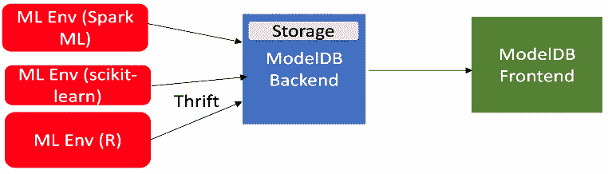

图 10.6 – ModelDB 架构

所有模型和流水线都作为一系列动作存储，并通过一个分支模型来存储历史记录，以记录模型随时间发生的变化。后台的关系型数据库存储流水线信息，而一个自定义引擎则用于存储和索引模型。前端配备了一个易于导航的基于 Web 的可视化界面，允许进行模型和流水线的可视化探索和分析。我们来使用 ModelDB 进行一个实验：

1.  要运行 ModelDB 实验，我们首先需要进行以下导入：

    ```py
    import joblib
    from verta import Client
    from verta.dataset import Path
    from sklearn import ensemble
    ```

1.  接下来，我们连接到 ModelDB 客户端，设置第一次实验，启动实验编号和数据集版本，以便记录与之相关的所有结果。我们还加载了用于训练和测试的 scikit-learn 糖尿病数据集：

    ```py
    modeldb_client = Client("http://localhost:3000")
    proj = modeldb_client.set_project("Model Classification")
    expt = modeldb_client.set_experiment("ModelDB Experiment")
    run = modeldb_client.set_experiment_run("First Run")
    dataset = modeldb_client.set_dataset(name = "Diabetes Data")
    save_path = '/tmp/modeldb_model_artifacts/'
    dataset_version = dataset.create_version(Path(save_path))
    run.log_dataset_version("v1", dataset_version)
    diabetes = datasets.load_diabetes()
    X, y = diabetes.data, diabetes.target
    ```

1.  加载数据集后，我们运行`GradientBoostingRegressor`（来自集成模型库），并使用交叉验证执行网格搜索：

    ```py
    reg_model = ensemble.GradientBoostingRegressor()
    cv = RepeatedStratifiedKFold(n_splits=2, n_repeats=3, random_state=1)
    grid_search = GridSearchCV(estimator=reg_model, param_grid=params, n_jobs=-1, cv=cv, scoring='r2',error_score=0)
    grid_result = grid_search.fit(X, y)
    ```

1.  在下一步中，我们记录最佳模型得分、损失值以及使用网格搜索结果优化模型时使用的不同超参数：

    ```py
    print("Best: %f using %s" % (grid_result.best_score_, grid_result.best_params_))
    run.log_metric("r2", grid_result.best_score_)
    means = grid_result.cv_results_['mean_test_score']
    stds = grid_result.cv_results_['std_test_score']
    params = grid_result.cv_results_['params']
    i = 0
    for mean, stdev, param in zip(means, stds, params):
        print("%f (%f) with: %r" % (mean, stdev, param))
        run.log_observation("mean", mean)
        run.log_observation("stdev", stdev)
        param_dict = dict(param)
        param_dict['iter'] = str(i)
        i = i +1
        run.log_observation("lr", param_dict['learning_rate'])
        run.log_observation("loss", param_dict['loss'])
        run.log_observation("maxdepth", param_dict['max_depth'])
        run.log_observation("minsamplesplit", param_dict['min_samples_split'])
        run.log_observation("nestimator", param_dict['n_estimators'])
        run.log_observation("iter", param_dict['iter'])
    grid_result.fit(X_train, y_train)
    y_pred = grid_result.predict(X_test)
    train_score = grid_result.score(X_train, y_train)
    test_score = grid_result.score(X_test, y_test)
    run.log_metric("Accuracy_train", train_score)
    run.log_metric("Accuracy_test", test_score)
    ```

1.  在获得训练和测试指标后，我们将它们记录在 ModelDB 中。此外，我们还会记录最佳的超参数和实际的模型文件（保存为`joblib`格式）：

    ```py
    run.log_metric("mse", mse)
    run.log_hyperparameters(grid_result.best_params_)
    filename_2 = "simple_model_gbr_2.joblib"
    joblib.dump(grid_result, filename_2)
    run.log_model(save_path, filename_2)
    test_score = np.zeros((grid_result.best_params_["n_estimators"],), dtype=np.float64)
    best_model = grid_result.best_estimator_
    print("test score shape", test_score.shape)
    for i, y_pred in enumerate(best_model.staged_predict(X_test)):
        test_score[i] = best_model.loss_(y_test, y_pred)
        run.log_observation("testscore", test_score[i])
    ```

1.  我们可以绘制涉及的估计器与训练/测试得分的关系图（使用网格搜索结果返回的最佳参数）。该图会作为工件记录在 ModelDB 中：

    ```py
    fig = plt.figure(figsize=(6, 6))
    plt.subplot(1, 1, 1)
    plt.title("Deviance")
    plt.plot(np.arange(grid_result.best_params_["n_estimators"]) + 1,
        best_model.train_score_,
        "b-",
        label="Training Set Deviance",
    )
    plt.plot(np.arange(grid_result.best_params_["n_estimators"]) + 1, test_score, "r-", label="Test Set Deviance"
    )
    plt.legend(loc="upper right")
    plt.xlabel("Boosting Iterations")
    plt.ylabel("Deviance")
    fig.tight_layout()
    plt.savefig(save_path + 'perf_gbr.png')
    run.log_artifact("perf_gbr", save_path + 'perf_gbr.png')
    ```

*图 10.7* 展示了 ModelDB 仪表板，识别模型的单个运行 ID，以及数据集版本、记录的工件、观察、指标和超参数：

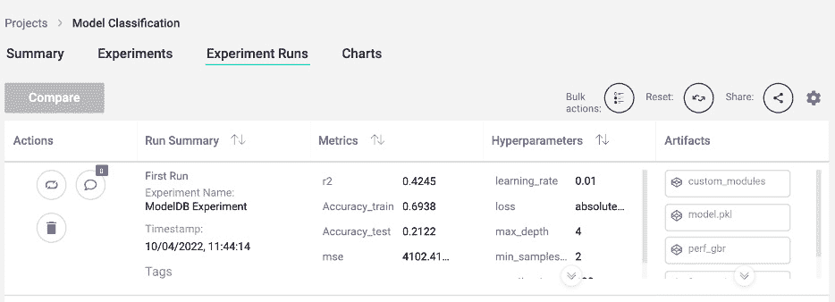

图 10.7 – ModelDB 实验运行仪表板

以下图表帮助我们确定是否要研究随着训练轮次增加的任何模型指标：

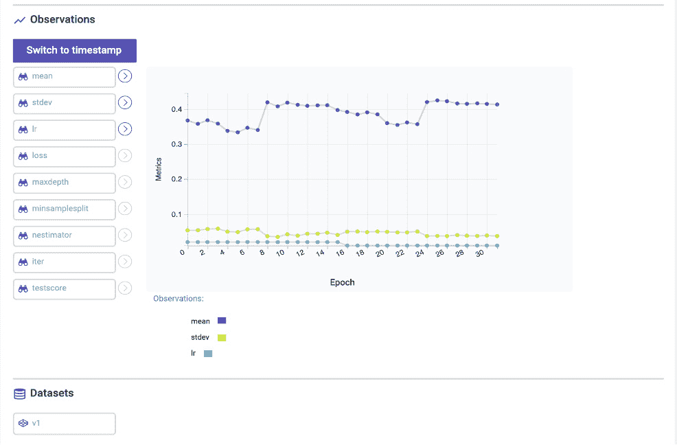

图 10.8 – 随着训练轮次增加，ModelDB 仪表板上的性能指标

在理解了 ModelDB 的架构和使用方式后，让我们来学习一下权重与偏差（Weights & Biases），它是另一个非常流行的用于跟踪机器学习模型的工具。

## 权重与偏差（Weights & Biases）

权重与偏差（Weights & Biases）是 MLOps 中的另一个实验跟踪工具，帮助对传统和深度学习模型进行版本管理。

让我们通过一个例子来了解如何跟踪和可视化结果：

1.  首先，我们导入库并提供登录密钥，该密钥可以通过 [`wandb.ai/authorize`](https://wandb.ai/authorize) 创建：

    ```py
    import wandb
    wandb.login(key='') #please specify our own login key
    ```

1.  在下一步中，我们通过为神经网络提供随机丢弃率来初始化一些实验。随机率在初始化 `wandb` 运行时作为参数提供：

    ```py
    for _ in range(5):
    wandb.init(
    project="pytorch-intro",
    config={
    "epochs": 20,
    "batch_size": 64,
    "lr": 1e-3,
    "dropout": random.uniform(0.02, 0.90),
    })
    config = wandb.config
    ```

1.  在接下来的步骤中，我们通过定义损失函数和优化器来训练我们的模型：

    ```py
    model = get_model(config.dropout)
    loss_func = nn.CrossEntropyLoss()
    optimizer = torch.optim.Adam(model.parameters(), lr=config.lr)example_ct = 0
    step_ct = 0
    for epoch in range(config.epochs):
    model.train()
    for step, (images, labels) in enumerate(train_dl):
    images, labels = images.to(device), labels.to(device)
    outputs = model(images)
    train_loss = loss_func(outputs, labels)
    optimizer.zero_grad()
    train_loss.backward()
    optimizer.step()
    example_ct += len(images)
    metrics = {"train/train_loss": train_loss,
    "train/epoch": (step + 1 + (n_steps_per_epoch * epoch)) / n_steps_per_epoch,
    "train/example_ct": example_ct}
    if step + 1 < n_steps_per_epoch:
    wandb.log(metrics)
    step_ct += 1
    val_loss, accuracy = validate_model(model, valid_dl, loss_func, log_images=(epoch==(config.epochs-1)))
    ```

1.  在最后一步，我们将训练和验证指标记录到 `wandb` 并结束 `wandb` 运行：

    ```py
    val_metrics = {"val/val_loss": val_loss,
    "val/val_accuracy": accuracy}
    wandb.log({**metrics, **val_metrics})
    print(f"Train Loss: {train_loss:.3f}, Valid Loss: {val_loss:3f}, Accuracy: {accuracy:.2f}")
    wandb.summary['test_accuracy'] = 0.8
    wandb.finish()
    ```

1.  它生成了以下汇总表，如*图 10.9*所示，包含来自 MNIST 数据集的每个数字。该表格可以通过以下代码获得：

    ```py
    table = wandb.Table(columns=["image", "pred", "target"]+[f"score_{i}" for i in range(10)])
    for img, pred, targ, prob in zip(images.to("cpu"), predicted.to("cpu"), labels.to("cpu"), probs.to("cpu")):
    table.add_data(wandb.Image(img[0].numpy()*255), pred, targ, *prob.numpy())
    wandb.log({"predictions_table":table}, commit=False)
    ```

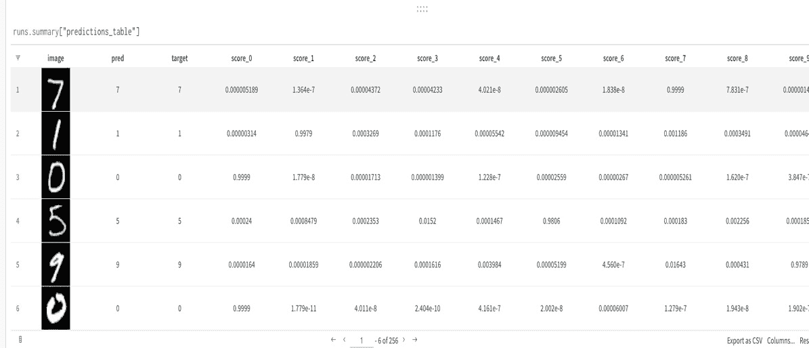

图 10.9 – wandb 跟踪数字 1-10 的预测概率

现在，所有模型实验都已经记录并通过 ModelDB 跟踪，模型的血缘信息可以得以维护。对于企业级 AI 应用程序，我们还可以借助数据血缘工具（如 Apache Atlas）建立级联血缘信息。

### 使用 Apache Atlas 的数据血缘

Atlas 可以与 Hive、Cassandra 及其他我们存储预测模型结果的数据库进行集成。Atlas 是一个可扩展的框架，满足 Hadoop 中的合规性要求，并与企业数据生态系统无缝集成。

Atlas 允许我们创建具有原始属性、复杂属性和对象引用的新类型的元数据。可以创建、组合和检索称为实体的实例类型，实体捕获元数据对象的详细信息及其关系。Atlas 提供了在动态创建分类时的极大灵活性，例如 `PII`、`EXPIRES_ON`、`DATA_QUALITY` 和 `SENSITIVE`，并支持 `EXPIRES_ON` 分类中的 `expiry_date` 属性。

谱系和搜索/发现操作可以通过 REST API 使用 SQL 自由支持。Atlas 的所有功能都具有内嵌安全性，允许其实体与多个分类相关联，而不会导致数据泄露。*图 10.10* 显示了当输出表 `ML_O` 被创建为两个输入表的联合时，谱系图的样子，`ML_O` 表示为 `(select * from ML_I2) UNION ALL (select * from ML_I1)`：

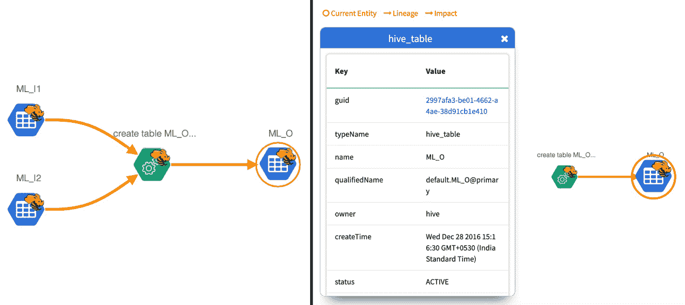

图 10.10 – 使用 Apache Atlas 的模型谱系

在这里，我们能够看到由两个输入表生成的输出表的谱系。接下来，让我们看看如何通过命令来执行相同的操作：

+   以下 `curl` 命令演示了谱系如何帮助定义一种结构，使得数据源可以被聚合，创建新的聚合源，检查源，或删除源。

`lineage.json` 中定义的 JSON 结构创建了两个输入 Hive 表，这些表可以组合成输出表：

```py
curl -v -H 'Accept: application/json, text/plain, */*' -H 'Content-Type: application/json;charset=UTF-8' -u admin:admin -d @lineage.json
```

+   可以通过点击实体找到 GUID，发现所有实体后，调用 API 如下：

    ```py
    http://localhost:21000/api/atlas/entities
    ```

+   在谱系中创建的任何实体都可以通过以下方式删除：

    ```py
    curl -X DELETE -u admin:admin -H 'Content-Type: application/json; charset=UTF-8' 127.0.0.1:21000/api/atlas/entities?guid=febdc024-a3f8-4a66-be88-1e719c23db35
    ```

在检查了一些用于模型和数据治理的框架后，让我们简要了解特征库是什么，它们如何以可重用的方式连接数据和模型治理管道，从而在开发生产级 ML 模型时促进协作。

特征库简介

以数据驱动的组织，甚至是传统的组织，都已经意识到**特征库**在获取实时洞察中的作用和重要性。这些洞察对任何行业领域都非常有价值，因为它们传达了驱动业务的客户指标的有意义信息。这些洞察的实现得益于快速开发和使用预测微服务，能够处理批量数据和实时数据。云端可扩展特征库的主要目的是通过将业务利益相关者、架构师、数据科学家、大数据专业人士和分析专业人士汇聚到一个统一的基础构件下，节省精力和时间。这一特征库促进了数据、模型、特征、结果和报告的共享，从而实现了跨团队的协作，增强了模型部署生命周期。通过允许信息的重用、创建结构化文档、进行必要的版本分析和评估模型性能，特征库能够提升跨团队的协作效果。

特征库的主要目标是：

+   移除各个团队定制系统的开发和维护，转而鼓励跨部门的协调空间，支持任何类型的数据共享。

+   创建一个基于访问驱动的协作空间，便于发现和共享类似类型 ML 模型的特征。当数据来自相同的业务且预测面向相似的客户群体时，这可以节省时间、精力和构建新模型的开发成本。

+   通过利用现有的微服务，在可扩展的大数据系统中复用数据。

+   允许在微服务内部进行轻松集成和通信，具备更强的模型特征分析、再训练、度量比较、模型治理和可追溯性的能力，从而减少每一轮敏捷开发生命周期中所花费的时间。

+   便于轻松跟踪、版本控制和重新训练具有季节性特征的模型，而无需重复进行特征工程和模型训练时涉及的非线性/指数成本。

+   通过设置警报和触发器，跟踪模型训练中特征的添加和/或删除。

+   基于传入的新数据推导特征和洞察，这些数据可以用来推算特征、预计算并自动填充特征。这包括在线计算和离线聚合，以确保训练和服务之间的一致性。

+   确保个人身份信息（PII）的隐私和机密性（无论是在数据库、缓存还是磁盘中），并通过衡量隐私和公平度指标，以及预测模型的可解释性，确保遵循伦理特征存储设计。

现在，让我们通过*图 10.11*来说明 Comcast 开发的特征存储框架：

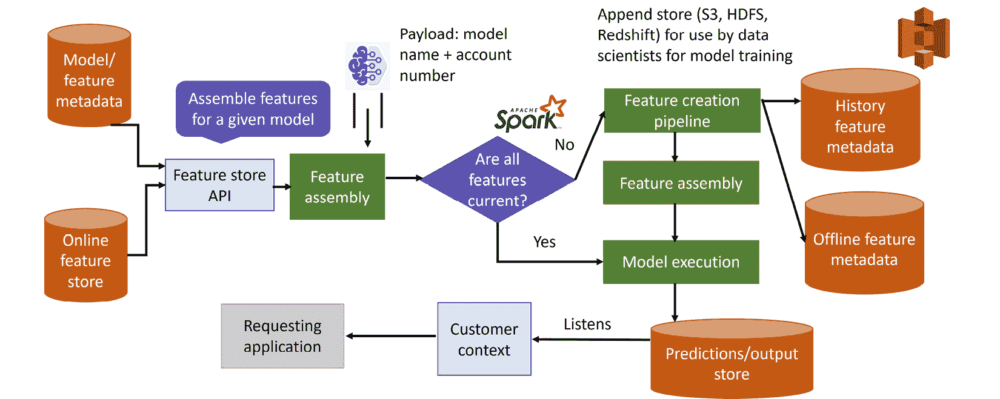

图 10.11 – 在线与离线特征存储

如*图 10.11*所示的特征存储架构允许对流数据和按需特征进行持续的特征聚合。它可以帮助数据科学家复用版本化特征，上传在线（实时）/流数据，并按模型查看特征度量。特征存储是一个动态灵活的单元，能够支持多个可插拔单元。传入特征组装的负载（一个包含模型执行所需特征的仓库，其中包含模型名称和账户号）会被加入，使得特征存储能够持续刷新新数据和新特征，基于模型度量进行再训练，并验证伦理性与合规性。模型的元数据可以解释哪些特征对于哪些团队是必要的，并显著有助于推导模型的洞察。

内置的模型仓库（如*图 10.12*所示）包含与数据预处理（归一化和缩放）相关的工件，展示了执行模型所需特征的映射。该架构使用 Spark 在 Alluxio 上构建（Alluxio 是一个开源的数据编排层，将数据带到计算近处，以支持云中大数据和 AI/ML 工作负载），并结合了 S3、HDFS、RDBMS、Kafka 和 Kinesis。

这种特征存储可以为组织提供可扩展的、容错的、分布式的功能，帮助共享、处理、追踪和存储用例、模型、特征、模型与特征的映射、版本化模型和数据集。当与定义良好的编排服务（如 Kubeflow）集成时，它可以使模型部署容器、预测/结果接收器、容器仓库和 Git 集成数据、代码和运行时工件，以实现 CI/CD 集成。

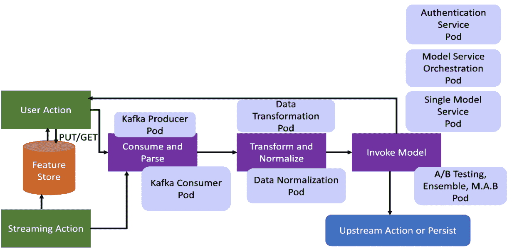

图 10.12 – 在线和流数据的特征存储中的特征处理

现在，让我们通过示例代码来看如何从特征存储中检索历史数据并训练模型。在这里，我们使用了 Google 的特征存储 Feast，以及来自 BigQuery 数据集 `feast_driver_ranking_tutorial` 的司机排名数据：

1.  在初始步骤中，我们导入必要的 Python 库，并从磁盘加载司机订单数据：

    ```py
    import feast
    from joblib import dump
    import pandas as pd
    from sklearn.linear_model import LinearRegression
    orders = pd.read_csv("/content/feast-driver-ranking-tutorial/driver_orders.csv", sep="\t")
    orders["event_timestamp"] = pd.to_datetime(orders["event_timestamp"])
    ```

1.  在下一步，我们连接到特征存储提供商并从 BigQuery 检索训练数据：

    ```py
    fs = feast.FeatureStore(repo_path="/content/feast-driver-ranking-tutorial/driver_ranking")
    training_df = fs.get_historical_features(
    entity_df=orders,
    feature_refs=[
    "driver_hourly_stats:conv_rate",
    "driver_hourly_stats:acc_rate",
    "driver_hourly_stats:avg_daily_trips",
    ],
    ).to_df()
    print("----- Feature schema -----\n")
    print(training_df.info)
    ```

这将输出以下结果：

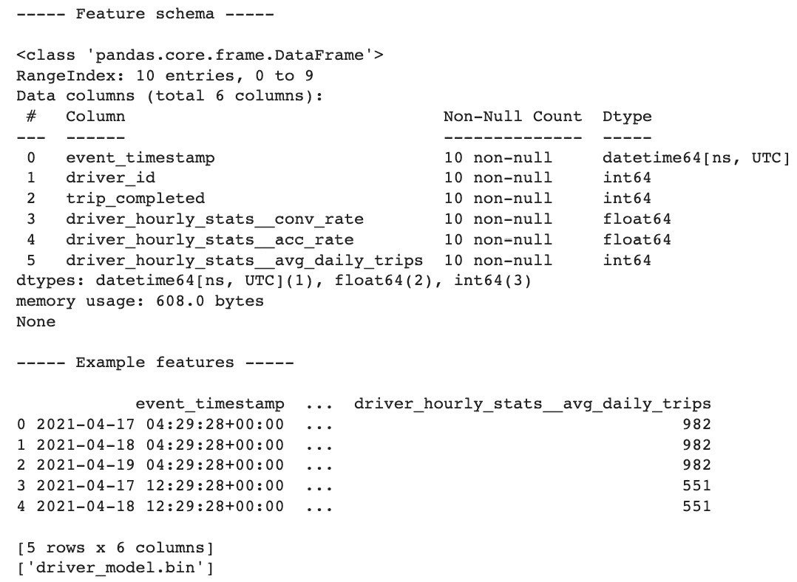

图 10.13 – 使用特征存储进行历史数据检索

1.  现在，我们使用以下代码片段来训练并保存我们的模型：

    ```py
    target = "trip_completed"
    reg = LinearRegression()
    train_X = training_df[training_df.columns.drop(target).drop("event_timestamp")]
    train_Y = training_df.loc[:, target]
    reg.fit(train_X[sorted(train_X)], train_Y)
    dump(reg, "driver_model.bin")
    ```

1.  训练后，我们需要通过以下命令将在线存储物化到 Firestore 中，数据科学家负责访问特征存储并选择将更新到在线存储的日期：

    ```py
    !cd /content/feast-driver-ranking-tutorial/driver_ranking/ && feast materialize-incremental 2022-01-01T00:00:00
    ```

这将输出以下结果：

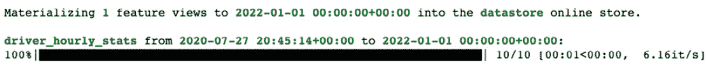

图 10.14 – 将数据保存到在线特征存储

1.  在最后一步，我们再次选择相同的特征存储来进行预测，并选择最佳的司机：

    ```py
    self.fs = feast.FeatureStore(repo_path="/content/feast-driver-ranking-tutorial/driver_ranking/")
    # Read features from Feast
    driver_features = self.fs.get_online_features(
    entity_rows=[{"driver_id": driver_id} for driver_id in driver_ids],
    features=[
    "driver_hourly_stats:conv_rate",
    "driver_hourly_stats:acc_rate",
    "driver_hourly_stats:avg_daily_trips",
    ],
    )
    df = pd.DataFrame.from_dict(driver_features.to_dict())
    df["prediction"] = reg.predict(df[sorted(df)])
     best_driver_id = df["driver_id"].iloc[df["prediction"].argmax()]
    ```

在这个示例中，我们学习了在线特征存储如何在训练和预测任务中发挥作用。在 *第十三章* 中，我们将进一步了解如何使用特征存储的高级概念，促进团队间的合作并推动可持续的训练。

总结

本章中，我们学习了 MRM 指导方针以及组织如何使用这些指导方针节省成本。我们探讨了通过研究与 MRM 相关的不同概念（如模型风险分层、MRT、MRS 和模型风险校准）来减轻业务损失的过程、功能和清单。我们还了解了如何确保正确的目标、假设、限制、量级、政策、控制、角色与职责、文档、测量程序、报告、通知、风险量化和评估方法得以实施。 本章还深入探讨了如何监控模型指标以及理解为什么这很重要，因为模型会受到漂移和模型重训练的影响。

在本章的结尾，我们还学习了特征库。在下一章，我们将学习更多与模型漂移和模型校准相关的详细概念。

# 进一步阅读

+   *模型风险* *管理* 的演变：[`www.mckinsey.com/business-functions/risk-and-resilience/our-insights/the-evolution-of-model-risk-management`](https://www.mckinsey.com/business-functions/risk-and-resilience/our-insights/the-evolution-of-model-risk-management)

+   *模型风险* *管理*：[`www2.deloitte.com/content/dam/Deloitte/fr/Documents/risk/deloitte_model-risk-management_plaquette.pdf`](https://www2.deloitte.com/content/dam/Deloitte/fr/Documents/risk/deloitte_model-risk-management_plaquette.pdf)

+   *模型风险分层：行业实践与* *原则* 的探索：[`www.risk.net/journal-of-risk-model-validation/6710566/model-risk-tiering-an-exploration-of-industry-practices-and-principles`](https://www.risk.net/journal-of-risk-model-validation/6710566/model-risk-tiering-an-exploration-of-industry-practices-and-principles)

+   *模型治理与模型风险* *管理*：[`www.afponline.org/ideas-inspiration/topics/articles/Details/model-governance-and-model-risk-management/`](https://www.afponline.org/ideas-inspiration/topics/articles/Details/model-governance-and-model-risk-management/)

+   *ModelDB：机器学习模型* *管理* 系统：[`cs.stanford.edu/~matei/papers/2016/hilda_modeldb.pdf`](https://cs.stanford.edu/~matei/papers/2016/hilda_modeldb.pdf)

+   *Weights &* *Biases*：[`github.com/wandb/wandb`](https://github.com/wandb/wandb)

# 第四部分：实施组织战略、最佳实践和应用案例

本部分提供了组织战略、可持续技术和最佳实践的全面概述，这些都是为了适应伦理 AI 在组织和政府大规模采用而应采纳的。本部分强调了如何设计稳健的机器学习模型，使其能够适应输入数据的各种变化。还介绍了不同专家小组和工作组织的倡议和行动计划，用于衡量和量化 AI 解决方案对客户、国家或环境可能产生的负面影响。此外，本部分还突出了实际的行业广泛应用案例，旨在加速伦理 AI 解决方案的使用，无论解决方案的规模和大小如何。

本部分由以下章节组成：

+   *第十一章*，*模型适应性的伦理问题*

+   *第十二章*，*构建可持续的企业级 AI 平台*

+   *第十三章*，*可持续模型生命周期管理、特征库和模型校准*

+   *第十四章*，*行业广泛应用案例*
