# 第十二章：构建可持续的企业级 AI 平台

本章的主要目标是向你介绍可持续性最佳实践以及模型治理技术，以便将其与组织目标和计划对齐。你将了解到训练**深度学习（DL）**模型的环境影响以及你可以采取的可能补救措施。你还将熟悉不同平台的可持续性指标，这将有助于实现可持续的模型训练和部署。

到本章结束时，你将掌握**联邦学习（FL）**中的协作和去中心化学习技术，无论是模型训练发生在网络、边缘还是云端。最后，你还将了解帮助跟踪碳排放统计数据的工具。

本章将涵盖以下几个主题：

+   可持续企业级 AI 平台的关键

+   跨不同云平台的可持续实践和指标

+   碳排放追踪器

+   采用 FL 进行可持续模型训练和部署

# 技术要求

本章要求你安装 Python 3.8，并包含以下一些 Python 包：

+   Keras 2.7.0 和 TensorFlow 2.7.0

+   `pip` `install CodeCarbon`

# 可持续企业级 AI 平台的关键

可持续性在伦理 AI 时代中扮演着非常重要的角色，因为预测能源排放的能力可以支持保护环境和节约资源的倡议。AI 平台可以促进排放减少和二氧化碳（CO2）去除，这有助于建立更绿色的交通网络，并监测与控制森林砍伐。因此，通过以可持续的方式有效利用 AI 解决方案，我们可以努力预防极端天气情况。

作为第一步，我们应当理解为什么组织会设定无碳愿景。同时，理解领导层的愿景同样重要，以便将团队与高层领导和 CXO 们设定的可持续使命目标对齐。

因此，作为第一步，我们将探讨组织重构其路线图以构建可持续 AI 解决方案的动机。

## 将 AI 作为组织路线图的可持续解决方案

我们应非常小心地构建环保的解决方案。大量研究表明，仅仅 40 天的研究训练就能排放 96 吨 CO2。这一数值非常庞大，相当于 1,000 小时的航空旅行，约等于 23 个美国家庭的碳足迹（[`www.analyticsinsight.net/new-mit-neural-network-architecture-may-reduce-carbon-footprint-ai/`](https://www.analyticsinsight.net/new-mit-neural-network-architecture-may-reduce-carbon-footprint-ai/)，[`inhabitat.com/mit-moves-toward-greener-more-sustainable-artificial-intelligence/`](https://inhabitat.com/mit-moves-toward-greener-more-sustainable-artificial-intelligence/))。进行神经网络搜索的碳排放量曾高达 600,000 CO2e（磅），相当于 5 辆汽车的生命周期。训练像**自然语言处理（NLP）**模型（或 transformer）这样的算法会消耗大量能量，因此数据科学家在设计此类 DL 神经网络架构时需要格外小心（[`aclanthology.org/P19-1355.pdf`](https://aclanthology.org/P19-1355.pdf)）。这种训练方式对环境可能构成威胁。如果我们继续以这种方式构建 AI 解决方案，未来的世代将面临不利的环境后果。

希望将 AI 应用于可持续发展的组织，不仅应关注可持续的银行业务、能源消费或医疗保健，还应开发最佳实践，通过衡量碳足迹和计算训练及评估数据中心管理方法所需的计算能力来量化 CO2e。

此外，数据科学家和工程师应首先评估是否需要使用 DL 模型。对于某些应用场景，使用标准模型即可保证相似的性能，而无需训练 DL 模型。因此，在训练 DL 模型之前，组织需要建立正确的实践和审核机制，以避免造成过大的碳足迹。

一旦数据科学团队最终确定了模型（无论是在集中式还是 FL 设置中使用传统模型还是 DL 模型），超参数的选择和精确调优在碳排放中起着重要作用。对于 FL 来说，调优超参数可能在能耗方面变得非常昂贵，因为这会导致调优数百个不同的模型（包括客户端中的本地模型）。

FL 中的调优过程可能会变得越来越复杂，这主要是由于聚合策略中的参数化以及客户端各个数据集的异质性。两种学习方式中超参数调优的复杂性必须仔细设计，以尽量减少 CO2e 排放。

团队应该注意数据集的选择以及所涉及的预处理和特征工程的程度。一个例子是，使用金融和零售数据来开发推荐系统时，特征工程技术变得更加详尽和昂贵，而不仅仅是使用零售数据。

让我们研究能够支持这些框架构建的组织标准。

## 可持续框架的组织标准

高管和领导层必须参与将可持续数据和模型实践作为组织目标的强制性要求。这些可伸缩云平台的可持续实践源于设定正确的目标和基于当前业务需求的服务级别协议（SLAs）。这可能需要通过优先考虑业务关键功能并允许非关键功能的较低服务级别来影响可持续性指标，来选择正确的权衡。至关重要的是，企业应通过定义适用于可持续模型训练和部署的架构设计模式来处理跨部门的孤立数据。

现在，让我们开始研究在不同云平台上测量的指标。

# 不同云平台的可持续实践和指标

在本节中，我们将探讨如何评估以下内容：

+   谷歌云的有用排放指标

+   无碳能源的最佳实践和策略

+   数据中心的能源效率

首先，我们将讨论谷歌云的一些指标，并引用微软推广的一些倡议和工具。

谷歌在可持续云解决方案中的角色是巨大的，它一直是领先的云服务提供商，在购买足够的可再生能源方面超过任何其他组织。从 2007 年宣布成为到 2017 年第一家主要碳中和公司的承诺开始，现在其所有电力消耗都来自可再生能源。在没有足够的风能和太阳能或可再生资源的情况下，谷歌从当地电网获取电力来运行本地数据中心的操作。相反，当有足够的电力可用时，多余的电力会反馈到当地电网用于其他用途。以 2030 年实现全天候无碳能源的愿景，谷歌使用以下各节提到的指南使其数据中心和电网无碳。

微软还为 Azure 推出了其 Power BI 应用程序，被称为 Microsoft 可持续性计算器，该应用程序提供了有关每个区域数据中心碳排放量的见解。即使是购买碳中和的可再生能源等举措也有助于推动其年度云消费。

## 谷歌云的排放指标

为了在 2030 年实现碳自由能源，Google Cloud 提出了一个倡议，帮助客户实现 24/7 利用碳自由能源。客户可以在设计解决方案时考虑碳影响，分析一种叫做 **CFE%** 的指标。该指标量化了每小时消耗的碳自由能源，通过将其大致分为两大类：CFE% 和碳强度。CFE% 的计算是基于任何时候向电网供应的能源以及 Google 提供的可再生能源资源供给所做的碳自由能源贡献。

+   **Google CFE%**：该指标提供了碳自由能源的平均百分比。按小时计算时，这一指标为客户提供了一个估算，表明他们的应用程序能够在多长时间内使用碳自由能源，这取决于该地区电网投资的碳自由能源比例。

+   **电网碳强度（gCO**2**eq/kWh）**：该指标量化了在特定位置从电网获取的单位能源的平均生命周期排放。通过这个指标，我们可以比较在同一电网中表现相似的不同位置的电力碳强度。利用这一点，当两个或更多地点的 CFE% 相似时，我们可以选择一个生产应用的部署区域。例如，我们经常会看到法兰克福和荷兰的 CFE% 得分相似，但荷兰的排放率较高。

现在，来讨论一下如何利用碳自由能源的最佳实践。

## 碳自由能源的最佳实践和策略

随着 Google Cloud Platform 积极专注于提升每个 Google Cloud 区域的 CFE%（碳自由能源比例），碳自由能源的比例增加有助于提升部署的可持续性。以下是针对云 AI 专家和架构师的一些独特建议：

+   **选择低碳区域**：在低碳区域（如芬兰或瑞典）建立并运行新应用程序，且该区域具有较高的 CFE%，有助于实现目标碳自由能源排放。

+   **在低碳区域运行批处理任务**：通过精心规划运行批处理工作负载，可以最大限度地利用碳自由能源。这意味着我们无需将低至中等负载的任务分开运行，通过将高负载和低负载的任务结合起来，可以确保高 CPU 利用率。

+   **推动绿色云应用的组织政策**：领导团队和组织应该设定优先级，允许在特定区域使用资源和服务，同时限制在其他区域的访问和使用。

+   **高效使用服务**：有效地规划虚拟机大小，并结合使用无服务器产品如 Cloud Run 和 Cloud Functions，可以进一步减少碳排放，因为它们会根据工作负载自动扩展，并尽可能节省能源。

## 数据中心的能源效率

为了运行高效的数据中心，我们需要精心规划并选择虚拟机在多站点云中的部署位置。除了选择合适的数据中心来托管虚拟机外，虚拟机的大小同样重要，因为它可以防止额外计算资源的浪费，并提高应用程序的执行速度。通过允许并行化并采用合适的技术来合并云资源，我们可以提高数据中心的效率，从而减少能源消耗。

**物理机器**（**PMs**）占数据中心总能源消耗的 35%。它们消耗的能量可以分为**静态**（虚拟机空闲时消耗的能量）和**动态**两部分。动态功率消耗主要依赖于各个组件的使用情况，占最大功率消耗的 50%以上，而空闲功率消耗则保持在最大功率消耗的 50% 以下。此外，睡眠模式下也会消耗少量电力。我们需要在空闲和动态功率消耗之间找到合适的平衡，以实现高利用率的工作负载，从而使 PMs 通过保持与利用负载成比例的能耗，贡献于高能源效率比。我们需要考虑优化以减少能耗，确保空闲功率消耗为 0 W（当 PMs 未使用时），在其他时候，根据工作负载的增加来相应调整，直到达到最大利用负载。虚拟化资源具有将用户任务合并到较少 PMs 中的灵活性。我们还必须仔细决定如何减少 PMs 的使用，以减少空闲功率，从而降低整体消耗。除了 PMs，在确定数据中心的整体效率时，以下是一些需要关注的指标：

+   **功率使用效率**（**PUE**）指标是一个依赖于云服务提供商的可变因素，表示数据中心的能源效率。它通过评估进入数据中心的总电力中，用于使 IT 设备完全正常运行的部分，来估算每个计算周期的开销。一个高效的数据中心将具有接近 1.0 的理想值。

+   **总功率使用效率**（**TUE**）指标用于弥补由 PUE 指标产生的差距。TUE 通过计算数据中心消耗的总能量与单个计算元素消耗的能量之比来获得。因此，它在评估环境影响时更有帮助，因为它只考虑执行工作负载所消耗的能量，而不是整个 IT 设施的能耗。

+   **绿色能源系数**（**GEC**）指标通过百分比估算来自绿色能源来源的能量，其中一些来源受天气条件影响，如太阳能电池板和风力发电机。使用可再生能源的驱动数据中心对环境的负面影响较小，因此更具吸引力。

确保数据中心的高效性还需要遵循一些与我们如何构建程序以在云端运行，以及如何衡量电力消耗相关的最佳实践或技术。以下是值得遵循的一些最佳实践：

+   DevOps 和云架构师无需考虑虚拟机的启动成本，因为这几乎可以忽略不计。

+   开发人员应确保所有程序自动利用虚拟机中可用的所有核心。

+   在工作流的每个步骤中，强烈建议指定计算资源，以便为创建虚拟机（VM）提供支持。实现这一目标的最佳方法是确保有足够的磁盘空间和内存可用，以支持程序的执行。当可用资源准备好执行任务时，允许应用程序开始处理。

+   允许提交的应用程序执行任务的所有步骤，直到任务结束。

+   启用**动态电压和频率调整**（**DVFS**）以减少 PM（物理机）上虚拟机的功耗，通过动态调整 CPU 的电压和频率来实现。

+   禁止在 PM 上过度分配资源，以免影响资源密集型应用程序的执行速度。

现在，让我们估算如何追踪碳排放量。

# 碳排放跟踪器

通过深入了解 Google Cloud 上的碳度量，我们的下一课将集中在单个虚拟机（VM）能效计算机制上，我们已经通过 GitHub 上的示例进行了说明。我们的下一步是通过嵌入碳排放跟踪器来计算碳排放量，碳排放跟踪器可以提供来自源代码中的详细排放统计分析。

现在，让我们探索一些可以用于联邦学习（FL）和集中学习的排放工具。

## FL 碳排放计算器

在一组设备进行联邦学习（FL）时，碳排放量可以通过一种 FL 碳排放计算器来追踪（[`mlsys.cst.cam.ac.uk/carbon_fl/`](https://mlsys.cst.cam.ac.uk/carbon_fl/)，[`github.com/mlco2/codecarbon`](https://github.com/mlco2/codecarbon)），其中需要指定以下参数：

+   **设备**：设备使用的硬件类型。

+   **国家**: 由燃烧化石燃料产生的能源生产量取决于国家。第一个参数用于获取该国的电力/碳转化率，第二个参数用于估算客户端与服务器之间通信所产生的碳排放量。

+   **数据集**: 用于指定平衡的、非**独立同分布** (**IID**) 数据集，如 ImageNet 和 CIFAR-10。与 IID 数据集不同，非 IID 数据集包含随机变量，这些变量之间没有相互独立性，也不是同分布的。这使得它们与 IID 数据集有很大不同，因为它们似乎并非来自同一分布。

+   **轮次数**: 用于指定中央服务器通过聚合过程构建全局模型所使用的总迭代次数。

+   **本地纪元数** (**LEs**): 用于指定每个客户端在将本地模型发送到服务器之前进行训练的迭代次数。

+   **活跃设备数量**: 用于指定每一轮中活跃客户端设备的数量，这通常是所使用的设备总数的一部分。

+   **网络**: 用于定义给定设备集的互联网上传/下载速度。

*图 12.1* 演示了在一个具有 5 个客户端、10 个本地纪元和 10 轮训练的 FL 设置中，总共排放的碳量为 2.51 gCO2eq。这里，CO2eq 用于衡量硬件（如 CPU 和 GPU）的能耗，并确定硬件的位置。结合该地区的平均 CO2 排放（以 gCO2eq/KWh 为单位）和 ML 模型架构，可以帮助确定部署的地区。例如，对于需要高能耗的部署，可以选择像加拿大魁北克这样的地区，但在某些其他情况下，可能会被迫将解决方案部署在美国爱荷华州，该地区的 CO2 排放高达 735.6 gCO2eq/KWh：

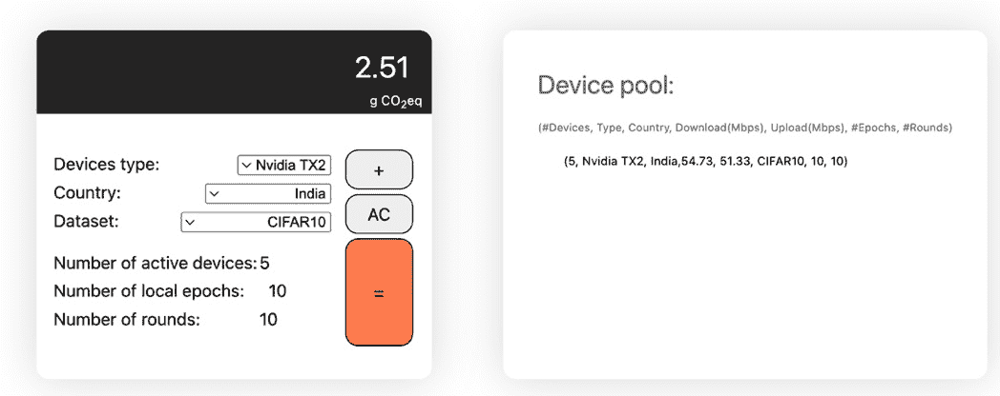

图 12.1 – 来自一个具有 5 个客户端、10 个本地纪元和 10 轮训练的 FL 设置的碳排放

现在，让我们看看如何计算集中式学习的 CO2 排放。

## 集中式学习碳排放计算器

就像 FL 一样，我们也可以对集中式学习做同样的计算，正如 *图 12.1* 所示，使用 ML CO2 影响计算器（[`mlco2.github.io/impact/`](https://mlco2.github.io/impact/) 或 [`github.com/mlco2/codecarbon`](https://github.com/mlco2/codecarbon)）来计算不同云平台的碳排放。

我们还展示了以下示例，说明如何使用 CodeCarbon 工具来衡量碳排放，该工具可以轻松地集成到自然工作流中。它从代码内部捕捉排放指标，并帮助开发人员在函数或模块级别跟踪这些指标：

1.  首先，让我们导入所有必要的库：

    ```py
    import tensorflow as tf
    from codecarbon import EmissionsTracker
    from tensorflow.keras.wrappers.scikit_learn import KerasClassifier
    from sklearn.model_selection import cross_val_score, StratifiedKFold,RandomizedSearchCV
    ```

1.  在接下来的步骤中，以下代码演示了使用 MNIST 数据集训练深度学习模型：

    ```py
    def train_model():
        mnist = tf.keras.datasets.mnist
        (x_train, yv_train), (x_test, y_test) = mnist.load_data()
        x_train, x_test = x_train / 255.0, x_test / 255.0
        model = tf.keras.models.Sequential(
            [
                tf.keras.layers.Flatten(input_shape=(28, 28)), tf.keras.layers.Dense(128, activation="relu"),
                tf.keras.layers.Dropout(0.2),
                tf.keras.layers.Dense(10),
            ])
        loss_fn = tf.keras.losses.SparseCategoricalCrossentropy(from_logits=True)
        model.compile(optimizer="adam", loss=loss_fn, metrics=["accuracy"])
        model.fit(x_train, y_train, epochs=10)
        return model
    ```

1.  最后，使用以下代码，我们可以追踪训练深度学习代码时的排放数据：

    ```py
    with EmissionsTracker(project_name="mnist") as tracker:
        model = train_model()
    print(tracker.final_emissions)
    ```

这里是以千克二氧化碳（kg CO2）为单位的输出：

```py
0.0001063754808656955
```

我们可以看到，深度学习（DL）模型产生了 0.0001063 千克的二氧化碳排放。

现在，我们已经具备了可持续机器学习的指标来控制我们的能耗。然而，研究表明，联邦学习在不同情况下对控制二氧化碳当量（CO2e）排放起着重要作用。让我们现在来看如何在使用联邦学习进行模型训练和部署时融入可持续性。

# 采用可持续的模型训练和部署方式，使用联邦学习（FL）

随着机器学习训练量的指数级增长，从 2012 年到 2018 年增长超过 300,000 倍——即 3-4 个月翻倍（远超摩尔定律的 2 年翻倍周期）——数据科学家和算法研究人员越来越多地研究去中心化的模型训练方法，以试图遏制深度学习模型在数据中心的专用硬件加速器上运行时产生的巨大热量。这些专用硬件消耗大量能源（200 **太瓦时**（**TWh**）），高于一些国家的国家电力消费，并占全球碳排放的 0.3%（2018 年《自然》期刊中引用）。例如，谷歌的 AlphaGo Zero 和训练自然语言处理（NLP）模型已经排放了大量的二氧化碳当量，突显了采用去中心化机制的紧迫性。

移动设备和物联网设备数量的指数级增长意味着联邦学习及其协作训练方法在降低能耗和碳排放方面发挥了重要作用。此外，研究发现，与集中式学习相比，联邦学习的设计具有更绿色的环境影响，因为它的碳排放较少。

现在，让我们理解模型训练过程中的排放指标。

## 二氧化碳当量（CO2e）排放指标

要量化在数据中心或边缘服务器中训练深度学习模型的环境影响，只有考虑以下指标时，才能真正理解其环境影响，因为能源消耗会根据地理位置转化为二氧化碳当量（CO2e）排放：

+   集中式学习和联邦学习系统硬件消耗的总能量，以及联邦学习系统的通信能量

+   数据中心因冷却效应而消耗的能量，特别是在集中式学习的情况下

现在，让我们隔离出导致集中式学习和基于联邦学习的训练系统能耗的因素。

## 比较排放因子——集中式学习与联邦学习（FL）

以下因素总结了集中式学习与联邦学习在能源消耗上的主要区别点。

### 硬件依赖性

集中式学习训练过程中的能耗可以通过在训练期间采样 GPU 和 CPU 的功耗来推算。可以查询 NVIDIA 系统管理界面，以平均所有样本在训练期间的 GPU 功耗。然而，对于 FL 来说，除了配备 GPU 的聚合服务器和客户端之外，这部分能耗可以安全地忽略。

在一个具有分布式训练设置和来自异构边缘设备的多个通信轮次的 FL 环境中，训练时间可能远远超过集中式训练的时间。这是因为集中式训练收敛得更快。对于 FL 来说，训练时间以及能耗与每次迭代中选择的客户端数量、客户端的数据分布（通常是非 IID 的）以及参与训练过程的具有不同计算能力的异构客户端设备密切相关，因为客户端的计算能力各不相同。

除了这些因素外，实际消耗的能源还受到每个客户端设备所使用的硬件设备（RAM 或 HDD）、基础设施和设备分布的影响。在扩展 FL 设置时，我们需要在做出正确的硬件选择之前，仔细评估所有可能的选项。因此，为了区分集中式学习和 FL 的能耗指标，我们需要基准测试 FL 客户端的硬件，以验证比较指标。

### 数据中心冷却

数据中心的冷却过程在整体能源利用中起着重要作用，其贡献高达总能源消耗的 40%（Capozzoli 和 Primiceri, 2015: [`www.researchgate.net/publication/290010399_Cooling_Systems_in_Data_Centers_State_of_Art_and_Emerging_Technologies0`](https://www.researchgate.net/publication/290010399_Cooling_Systems_in_Data_Centers_State_of_Art_and_Emerging_Technologies0)）。这一过程主要由数据中心的效率决定，并通过 PUE 比率进行估算，2019 年全球 PUE 的平均值为 1.67，并且在不同的云服务提供商之间有所不同（2020 年 Google 记录为 1.11，Amazon 为 1.2，Microsoft 为 1.125）。FL 训练过程没有关联的冷却过程。然而，中央聚合服务器也可以配备冷却功能。

一些数据中心的冷却技术通过使用最佳控制机制来实现，如热冷通道布局（不分隔冷热通道以促进空气自由混合）、封闭（通过隔离冷热空气）、机架摆放（促进机架热点的热循环）、电缆整理（确保数据中心内空气流畅通行）以及使用空白面板（防止热空气进入数据中心的气流）。这些高效的冷却方法有助于维持数据中心内的温度。甚至部署监控工具来管理数据中心的气流、湿度、温度、气压和热点，也能通过更好的温度和压力控制提高效率。

### 数据交换过程中的能量利用率

当训练发生在中央服务器上时，肯定不涉及数据交换。相比之下，在 FL 生态系统中，数据和模型会在中央聚合服务器与分布式客户端之间传输、下载或上传。除此之外，能量利用率还考虑了由于下载和上传，路由器和硬件所消耗的能量。

## 说明 FL 比集中学习更有效

Xinchi 团队进行的实验结果（[`arxiv.org/pdf/2102.07627.pdf`](https://arxiv.org/pdf/2102.07627.pdf)）解释、比较并评估了集中学习与 FL 的影响：

+   达到目标精度所需的通信轮次

+   集中学习和 FL 相关的能量

+   集中学习和 FL 的训练时间

+   与 FL 一起使用的不同训练优化器

在 FL 设置中，每个客户端都使用低功耗、支持 GPU 的边缘设备进行小数据集的训练。该设置在一个或五个 LE（训练周期）内达到了目标精度。相比之下，在集中训练环境中，一个 LE 相当于标准的训练周期，这一周期应用于整个数据集的训练过程中。

此外，研究表明，在 FL（联邦学习）设置中，能量利用率甚至比使用节能训练优化器（如 FedAdam）的集中学习设置还要低。FedAdam 因其在初始收敛速度上表现优于**联邦平均法**（**FedAvg**）而广为人知，甚至在与非自适应优化器的比较中也表现更好。这种自适应优化技术不会导致额外的客户端存储或通信成本，而是确保与跨设备 FL 的兼容性。

在 FedAvg 中，参与训练的客户端通过多个**随机梯度下降**（**SGD**）步骤将本地更新共享给服务器。这种方法在异构环境（如具有不同用户和词汇的 NLP 领域）下表现不佳，因为它使用共享更新的简单平均值来升级初始模型。

一种基于梯度的优化技术，如 FedAdam，专注于通过每个坐标的方法来平均客户端的模型更新，从而实现自适应服务器优化过程。在这里，服务器端的优化旨在通过 FedAvg 和服务器动量，从全局视角优化聚合后的模型。另一方面，个别客户端在本地训练期间通过多次迭代使用客户端优化器。通过这种方式，它在有限参与过程中尽可能减少本地数据的总体损失。

在 FL 中，相比集中式学习，更多的 LE 通常会导致 ML 模型在较少的 FL 轮次中更快地收敛。尽管这并不能确保更低的能耗，但像 FedAdam 这样的自适应聚合策略在全局模型收敛速度上表现更好。

此外，非 IID 数据集需要比 IID 数据集更多的 FL 轮次，而 IID 数据集的收敛速度比非 IID 数据集更快。

FedADAM 优化器的有效性在 Xinchi 小组研究中得到了验证（实验结果摘自《*Federated Learning 碳足迹初探*》的研究结果，[`arxiv.org/pdf/2102.07627.pdf`](https://arxiv.org/pdf/2102.07627.pdf)），我们看到它在 CIFAR-10 和 SpeechCmd 数据集上都表现优于 FedAvg。此外，使用五个 LE 时，FedAdam 的 CO2e 排放量低于集中式学习和使用 FedAvg 的 FL。对于 ImageNet 实验，为了在非 IID 数据情况下达到所需的测试准确率，FedAdam 的排放量高于 FedAvg。这是因为该数据集天然不平衡，导致需要多轮训练才能达到目标测试准确度，这导致了更长的训练时间，从而产生更高的 CO2e 排放。例如，使用 FedAdam 优化器时，IID SpeechCmd 数据集的排放量显著更低。

因此，我们可以看到能效取决于集中式学习和 FL 中的多个因素，其中主要因素是 FL 中使用的优化器。在非 IID 数据集（例如，SpeechCmd）中，使用 FedAdam 优化器、较简单的模型架构以及较少的通信轮次，FL 的 CO2 排放量往往低于集中式学习。因此，我们可以得出结论，使用轻量级神经网络时，FL 在能效方面似乎优于集中式学习。

让我们了解如何通过权衡并优化 FL 中的以下因素来减少 CO2 排放。

## FL 的 CO2 足迹

决定集中式学习和 FL 训练 CO2 足迹的一些主要因素如下，这些因素导致了不同水平的 CO2e 排放：

+   **硬件的地理定位**：例如，研究发现，在法国进行训练时会产生最低的 CO2e 排放，因为核能是法国的主要能源来源，这也导致了最低的能量转 CO2e 的转换率。

+   **深度学习模型的类型，特别是模型架构**：例如，基于 FedAvg 的联邦学习优化在使用 ResNet-18 进行图像任务时比现代 GPU 和集中式训练排放更多 CO2。而在 SpeechCmd 数据集上训练 LSTM 模型时，相同的联邦学习优化反而排放较少的 CO2。如果联邦学习中的本地训练任务较轻，通信和数据交换较少，研究表明，这将导致更低的 CO2 排放。

+   **硬件效率**：像 Tegra X2 这样的芯片可能会嵌入到智能手机、平板电脑和其他物联网设备中。当使用这种先进的芯片时，联邦学习将继续减少排放。

+   **数据中心的冷却需求和可用性**：联邦学习在数据中心没有集中式的冷却过程；这些冷却需求分布在联合中的各个设备上，并根据每个设备的需求而变化。集中式学习的分布式设置需要冷却设施。高性能 GPU 或**TPU**（**张量处理单元**）需要大量计算能力，要求更高的冷却需求，从而导致更高的能量消耗。

+   **联邦学习中的通信轮次**：在集中式学习中，一个 LE 产生的 CO2 比五个 LE 更多，无论是聚合策略还是设备类型。这是因为较少的本地训练 epoch 会导致模型收敛所需时间增加，从而导致更多的数据交换和本地客户端与全球服务器之间的通信轮次。使用五个 LE 时，单个设备训练时间更长，导致较少的通信轮次和较低的排放。

+   **联邦学习中的数据交换**：正如我们之前所看到的，CO2e 排放的百分比也主要由**广域网络**（**WAN**）排放所驱动，这些排放源自数据集和联邦学习设置之间的交换。例如，通信的能量利用可能占总排放的 0.4%（五个 LE 的 ImageNet）和 95%（一个 LE 的 CIFAR-10）。

为了在比较 CO2e 排放时达到对等性和一致性，联邦学习中的通信轮次被转换为集中式训练的 epoch。CO2e 排放与集中式 epoch 的数量直接相关。Xinchi 团队提出的一些 CO2 排放增加的关键因素如下：

+   集中式 epoch 的数量

+   硬件的热设计功耗

+   模型大小的增加，增加了通信所消耗的能量

+   训练数据集的大小

+   使用更好的基于深度学习的优化器，例如 FedAdam，它能够优于集中式学习

我们知道，过去十年气候变化的毁灭性影响迫使我们在部署架构之前重新思考和审视我们的排放指标。气候变化和对更绿色星球的关注将推动设计新指标时的研究和创新。所有这些因素汇聚在一起，促使我们选择更好的硬件，以便能够看到 CO2 足迹并提供可能的修正建议。现在，我们必须了解如何部署用于训练 FL 模型的流行设计模式。

我们还应考虑其他可再生能源发电方式，这些方式可以在说服组织控制排放并鼓励投资可再生能源方面发挥重要作用。

因此，让我们探讨如何补偿 CO2e 排放。

## 如何补偿等效 CO2e 排放

为了补偿 CO2e 排放，我们需要理解如何处理有关能源电网的信息或将能源转化为 CO2e 的转换率。由于公共信息来源的匮乏，有一些推荐的实践方法需要牢记：

+   我们必须假设，所有连接到本地电网的数据中心和边缘设备都直接与其物理位置相关联。特定于电力的 CO2e 排放因子以 kg CO2e/kWh 表示，不同国家的排放因子各不相同，例如法国（0.0790）、美国（0.5741）和中国（0.9746）。

+   排放技术（包括计算电力传输和分配时能量损失的适当指标）以及热电厂的吞吐量或生产力可能会影响整体能源利用情况。

+   考虑到上述假设，评估 FL 和集中式学习的转换因子可以帮助我们计算并设定一个具有最少 CO2 排放的能源利用指标。在 FL 中，通信所需的能源因数据分区类型（IID 数据集需要更多能源）、通信轮数、硬件类型、位置及我们已经讨论过的其他因素而有所不同。

+   作为可持续发展专家，我们的下一个目标是通过购买美国的**可再生能源凭证**（**RECs**）或欧盟的**可交易绿色证书**（**TGCs**）来补偿由此产生的 CO2 排放。即使是支持环保项目的倡议，如可再生能源项目或大规模植树活动，也可以得到鼓励。

我们现在需要考虑如何通过考虑不同的参数来训练 FL 模型，这些参数会影响 CO2 排放。

## 基于 FL 的模型训练设计模式

到目前为止，我们一直在集中讨论从可持续性角度看，FL 是一种非常好的方法。然而，除了可持续性之外，FL 还从数据隐私的角度提供了巨大的好处，这与负责任的人工智能（Responsible AI）相关。在 FL 中，客户端能够分享来自本地数据的匿名化学习，而无需将潜在敏感的数据与集中式处理过程共享。在这一部分中，我们将进一步了解这一点，并深入了解 FL 的不同设计模式。

FL 有不同的设计和部署策略，这些策略将影响其二氧化碳排放指标。以下是一些关键指标：

+   每个客户端中非 IID 数据集的大小

+   参与的客户端数量

+   客户端参与训练之前的等待时间，这影响模型的收敛性

+   本地客户端的训练时间以及聚合全局模型的时间

现在让我们来看一下基于 FL 的训练的不同模式。

当我们考虑使用 FL 进行模型训练和数据处理模式时，我们需要考虑数据类型，以及客户端参与本地训练的动机。因此，我们可以将它们主要分为三种类型：

+   一个多任务模型训练器，用于训练非独立同分布（non-IID）数据集

+   一种用于训练异构数据集的异构数据处理器

+   一个激励注册系统，通过奖励机制激励客户端

在每个与设计模式对应的示意图中，我们使用了以下的 FL 序列：

1.  一个通用的全局模型由中央服务器训练。

1.  在特定训练轮次中选择的每个客户端下载全局模型，并启动本地训练过程。

1.  客户端本地训练的模型随后会在全球服务器上进行更新。

1.  服务器使用 FedAvg 算法聚合全局模型，以改进共享版本的模型。

1.  然后，本地设备将被更新为最新的重训练全局模型，这为它们的本地重训练做准备，并更新它们以进行后续迭代。

### 多任务模型训练器

这种训练模式的主要目标是提高学习效率和模型性能指标。此外，它最适合在本地设备上训练独立的相关模型。具体而言，当客户端的数据分布模式有所不同，并且全局模型无法代表每个客户端所展示的数据模式时，我们会使用这种方法。例如，正如下图所示，在计算机视觉、强化学习、语音识别和自然语言处理（NLP）上训练独立的模型，对于建模和展示每个模型的目的至关重要：

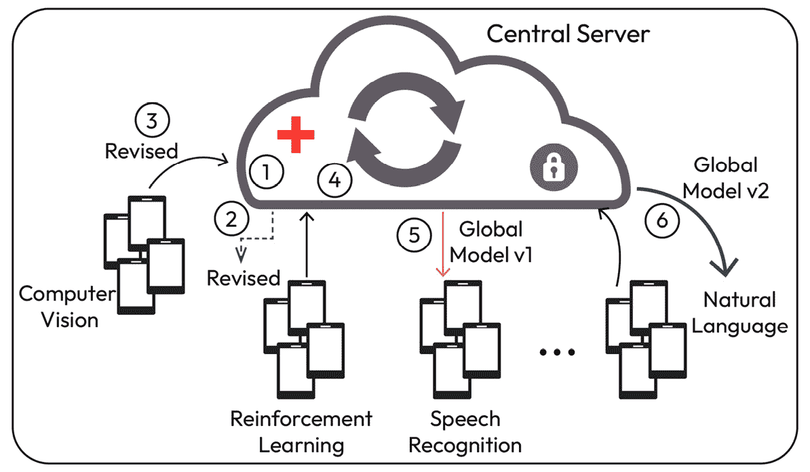

图 12.2 – FL 模型训练设计模式 – 一个多任务模型训练器

一个现实世界的例子是使用机器学习（ML）解决下一个词预测任务（涉及自然语言处理的相关机器学习任务），通过使用设备数据，如文本消息、网页浏览器搜索字符串和电子邮件。

为了获得更高的准确性，该设计每一轮都涉及更多的训练时间、计算和能源资源，这与其他传统联邦学习（FL）技术的期望一致。该方法的主要挑战是本地客户容易受到数据隐私威胁的影响，并且训练只能应用于凸损失函数。

### 一个异构数据处理器

这种训练模式通过应用诸如数据增强和使用生成对抗网络进行对抗训练等特殊处理技术，保持数据隐私，并在数据分布非独立同分布（non-IID）和偏斜的情况下，找到更好的基本 FL 使用方法：

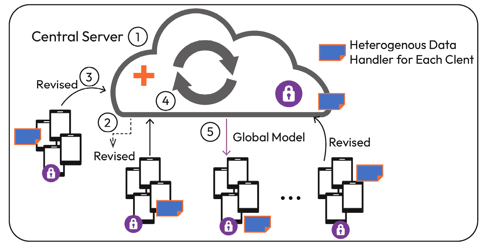

图 12.3 – FL 模型训练设计模式 – 一个异构数据处理器

由于客户的个性化数据导致数据分布不均衡和偏斜，在设备上训练的本地模型在聚合时往往会降低全局模型的准确性。因此，必须通过插入一个异构数据处理器来提升数据效率，该处理器可以正确地增强和提炼联邦数据，同时仍然保持数据隐私。提炼过程使客户端设备能够定期从其他参与设备收集信息，而无需直接访问其他客户的数据。

该机制试图以训练时间和计算资源为代价，提供更好的模型性能指标，最终导致较低的能源效率和较低的可持续性指标。

### 一个激励登记

如下图所示的训练模型根据参与客户在数据量、模型性能、计算资源等方面的贡献进行奖励。这是一种激励客户并提高全局模型性能的措施。下图展示了基于区块链和智能合约的激励机制：

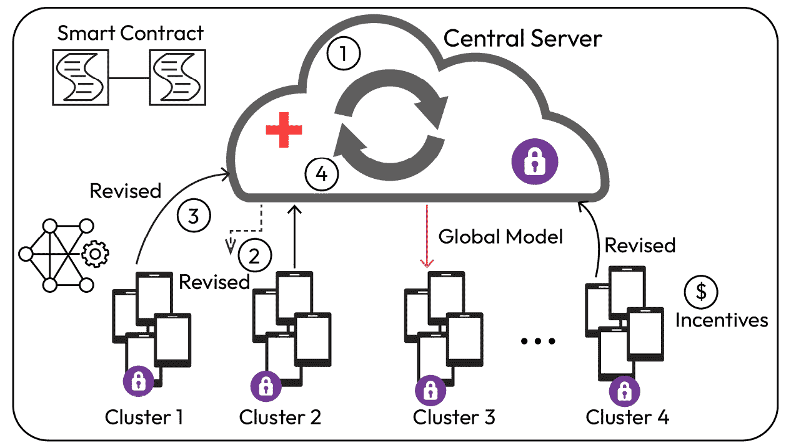

图 12.4 – FL 模型训练设计模式 – 一个激励登记

激励机制能激励更多客户端参与，因为这种训练策略并不是通过每个客户端在每次迭代中都完全参与来驱动的。此外，激励机制需要客户端和学习协调者之间达成共识，以决定评估标准。制定激励机制的一些常见方法包括强化学习、区块链/智能合约和斯塔克尔伯格博弈模型。基于区块链的 FL 激励机制的一个具体应用是 FLChain，它支持协作训练和模型交易市场。该模型同样面临着长时间训练和计算资源挑战的问题。

在本节中，我们了解了控制 FL 训练设置的重要因素，包括参数、客户端数量、时间和训练的时期周期。所有这些因素都影响着训练环境中的能量消耗，从而加剧了全球变暖。除了模型训练，我们还将了解不同的模型部署模式如何影响能源排放。在接下来的章节中，我们将主要讨论一种 FL 环境中的策略，其中只有选定的客户端参与训练。尽管我们将提到参与训练过程的个别客户端，但我们的主要目标是理解那些能促使客户端启动本地训练过程的操作或部署模式。

## 模型部署中的可持续性

在上一节中，我们了解了 FL 在可持续性方面的重要作用。现在，让我们探讨一个可持续的 FL ML 框架。我们将看到如何使用能够从环境中积累能量并在间歇性训练期间有效利用这些能量的可充电设备。

这种框架可以扩展到跨设备和跨信息孤岛的 FL 设置，包括无线边缘网络中的 FL、物联网和**医疗设备互联网**（**IoMD**）。单个本地设备的训练可以推动模型的收敛，并使其适应以下设置：

+   通过允许随机选择少量客户端来最小化每次迭代中的通信开销。

+   启用客户端选择，以最大化学习速率，加速收敛速度。

+   基于每个客户端的能源到达过程启用客户端选择过程。这是为了应对间歇性和非均匀的能源到达模式，以有效管理客户端掉线。

该部署框架非常适合异构设备可用且每轮训练独立进行的场景。这使得框架更加灵活，因为每个参与训练过程的设备在某一轮中不会被未来的连续轮次所约束或依赖。训练过程（由随机的能量供应驱动）由中央服务器协调，服务器汇总客户端的本地模型并将更新的全局模型发送给它们。各个客户端使用自己的数据集进行本地训练，并通过多次 SGD 迭代更新收到的全局模型。该框架不仅有助于节能的可持续 FL 训练，而且在设备通过间歇性和非同质的能量更新过程生成能量的场景下，能够最小化训练的总能量成本。

该框架允许不同类型的客户端具有不同的能量生成水平以参与训练，提供两种不同的配置：

+   一种有偏的模型预测策略，其中全局模型偏向于那些能量供应更频繁的客户端。这种模型在预测结果的准确性上会有性能损失，但能够提供更好的收敛速度。

+   一种无偏的模型预测策略，其中允许所有客户端在每次参与训练过程之前，等待足够的能量生成。这种模型基于最慢客户端的等待时间，会有最长的等待时间。然而，这种训练尽管收敛速度较慢，但在性能指标上表现更好。

提出的框架配备了四个不同的实体，如下所述，以促进一个能量感知的客户端调度和训练策略：

+   **客户端的能量配置**：考虑所有客户端的能量供应是最重要的因素，因为它决定了客户端基于从环境中获得的能量（如太阳能、动能、环境光或射频能量）参与训练的情况。能量配置是一种研究能量模式的机制，用于推断是否有足够的能量来训练本地模型并将更新发送给中央服务器。任何参与的客户端从初始时刻 *t* 开始参与全球轮次的训练过程，确保客户端在该全球轮次的整个时段内参与训练，*{t, . . ., t+T −1}*，期间客户端正在训练本地模型。此外，参与任何全球轮次训练过程的客户端，在该指定的全球轮次训练的整个过程中保持不变。

+   **客户端调度**：该框架具有灵活性，允许客户端根据其能量状态决定是否参与当前迭代的训练过程。随机参与过程在客户端本地估计能量到达过程后，将其纳入调度，以最大化收敛速度或减少训练的通信开销。调度过程无需客户端之间的协调，使得在大规模网络中更容易扩展。

+   **客户端本地训练**：此阶段允许参与的客户端使用 SGD 训练本地数据集，然后将其更新到中央服务器。

+   **服务器更新模型**：此阶段允许服务器聚合本地模型，以整合全球模型并发送到各个设备。

在研究了影响能量智能客户端调度的主要因素后，我们将在此讨论基于客户端能量可用性如何进行调度的过程。

*图 12.5* 说明了两种不同的预测策略，其中客户端要么在能量到达时立即参与，要么等到所有客户端积累了启动训练所需的能量后再开始。图的左侧部分对模型收敛持乐观态度，在能量可用时立即开始客户端调度（由不同颜色的 *t*1、*t*2、*t*3 和 *t*4 表示）。而右侧子图则比较保守，等待所有客户端都具备可用能量后再统一调度，它们的颜色都是相同的橙色，其中 *t*1、*t*2、*t*3 和 *t*4 表示不同的时间点：

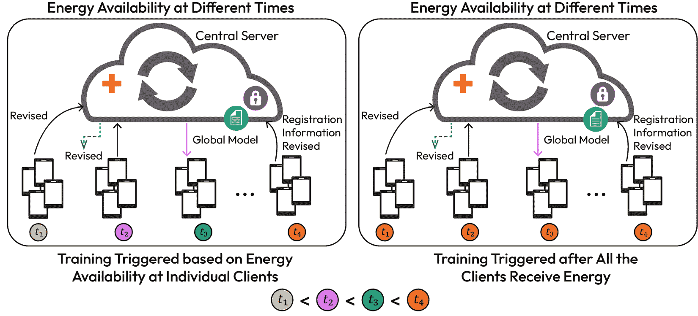

图 12.5 – 基于能量到达模式的客户端调度

本节中，我们已经学习了如何通过使用随机能量到达过程，在大规模网络中部署可持续的 FL。此外，结合模型量化和压缩技术，利用客户端间完全随机的能量可用性，能够更好地描述能量更新过程与训练性能之间的关系。

我们已经理解了基于能量调度客户端的训练过程。现在，让我们看看这些训练模式如何根据架构进行调度，以及如何扩展 FL 模型。

## 基于 FL 的模型部署设计模式

让我们深入探讨一旦 FL 模型在生产环境中上线后，如何管理和聚合它们。在这里，我们将讨论两种架构设计，主要从数据通信、模型管理和治理的角度出发，探讨这些模型如何被聚合并分发给本地客户端：

+   **基于 FL 的模型管理模式**：我们需要模型管理模式来建立与本地客户端的数据或模型大小相关的规则和流程。大小在数据或模型交换中起着至关重要的作用，因此影响能耗。此外，替换模型的频率以及更新全局模型的频率是决定 CO2e 排放量和 FL 可持续性的关键因素。

+   **基于 FL 的模型聚合模式**：我们需要 FL 中的模型聚合模式，将来自单个客户端的学习整合起来，以创建更新后的全局模型。模型聚合过程的模式——无论是异步的、分层的，还是去中心化的——都会影响时机和延迟。所有这些因素共同作用，导致不同水平的 CO2e 排放。

让我们在接下来的部分中讨论这些设计。

### 基于 FL 的模型管理模式

模型管理模式负责模型的传输、部署和治理。根据消息传输方式或客户端如何在本地存储模型，我们可以将它们分为四个大类，如下所述：

+   消息压缩器，减小传输消息的大小

+   一个模型共版本注册表，参与模型版本管理，通过接收客户端的模型更新，帮助促进模型聚合

+   一个模型替换单元，监控全局模型的性能，并在模型性能下降时启动新的训练

+   部署选择器，将改进后的全局模型推送到客户端

让我们详细讨论这四个类别中的每一个。

#### 消息压缩器

如*图 12.6*所示，这一设计模式在每轮模型交换过程中压缩消息，以减小数据大小：

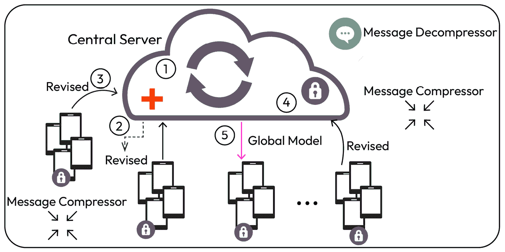

图 12.6 – FL 模型部署设计模式 – 消息压缩器

这个过程通过有效地压缩模型参数或梯度，帮助在带宽有限的情况下提高通信效率。然而，当服务器必须聚合大量的模型参数时，该模式会带来额外的计算成本。此外，它还会增加消息压缩和解压缩的开销，可能会丢失一些关键信息。

### 一个模型共版本注册表

模型共版本注册表，如*图 12.7*所示，通过跟踪每个客户端的模型版本并将其与相应迭代的全局模型对齐，帮助本地模型治理过程：

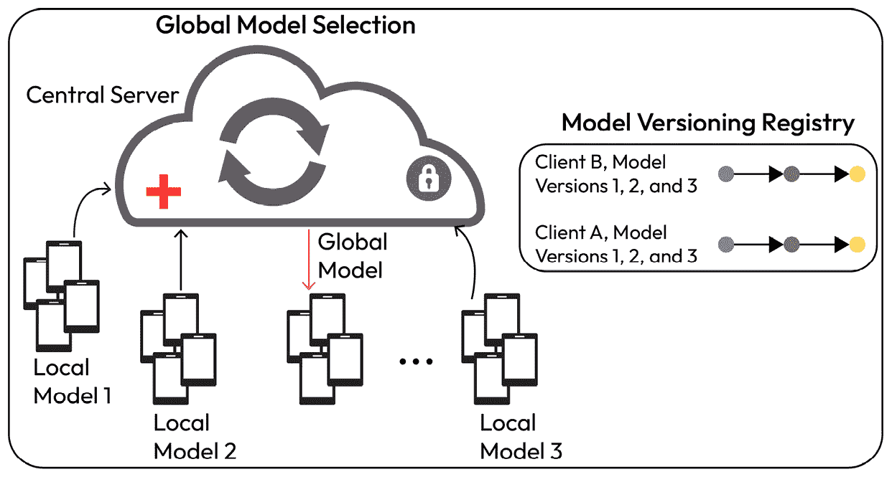

图 12.7 – FL 模型部署设计模式 – 模型共版本注册表

这有助于同步和异步模型更新、客户端掉线、模型选择以及提前停止复杂模型训练。此外，这种模式具有独特的优势，可以跟踪模型质量（包括全局模型、客户端设备更新以及应用程序或设备操作系统/固件的版本），以及客户端的对抗性行为（当客户端充当对手时），以增强系统的问责性。注册表用于收集本地模型更新并将其映射到全局模型，从而确保模型版本号和客户端 ID 保持不变。此模式还可以通过区块链实现，以提供模型来源和共同版本管理。该架构所需的额外存储量，用于存储所有版本的全局和本地模型，带来了额外的好处，即为系统安全提供保障，能够检测出可能导致系统故障的不诚实客户端。这个模式的一个典型例子是基于 Databricks 构建的 MLflow 模型注册表，它提供了一个高效的集中式模型存储，用于跟踪模型的时间线、版本管理和阶段过渡。

#### 一个模型替换触发器

这个联邦学习设计模式通过在新的模型任务上设置触发器来启动模型的替换，当模型的性能降到可接受阈值以下时。为了解决模型准确度下降等问题，这个模式提供了机制，在建立新的模型训练过程之前，先调查这种准确度下降的原因。只有在连续几轮注意到模型性能退化时，才会启动重新训练过程，从而强烈推断性能下降是全局性的。重新训练模型会增加通信和计算成本，但在处理具有异质非独立同分布（non-IID）数据集的联邦学习环境中的客户端时非常有效，因为这些客户端拥有个性化数据集，并且随着多轮迭代，全球模型的性能会更快衰退。微软 Azure 机器学习设计器和 Amazon SageMaker 是基于模型性能退化触发模型重新训练的知名平台。

#### 一个部署选择器

如*图 12.8*所示，这种部署策略能够使全局模型收敛，并根据所运行的应用将全局模型推送到选定的客户端。因此，不同组的客户端接收到不同版本的收敛模型，目的是提高模型的性能指标。模型选择解决了客户端之间非 IID 数据分布的问题，使得不同定制的收敛模型能够更好地服务于不同的客户端组。然而，这一过程会增加服务器的开销，因为中央服务器需要正确识别客户端，以便为它们提供不同版本的全局模型，同时训练和存储适用于不同客户端的不同模型。尽管训练成本增加，但我们根据客户端的 ML 任务得到了更好的泛化模型。此策略需要内置额外的隐私保护措施，以防止在服务器尝试分组客户端时出现隐私泄露。这种 FL 训练可以在 Amazon SageMaker 和 Google Cloud 上进行，它们可以训练和管理多个模型版本，并将其部署到不同的端点：

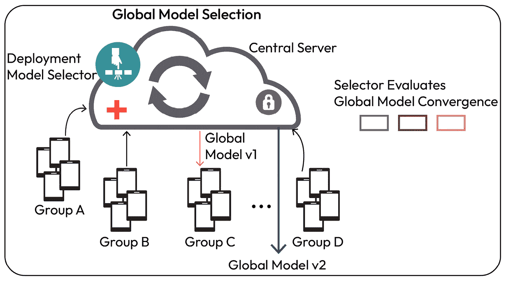

图 12.8 – FL 模型部署设计模式 – 模型部署选择器

### 基于 FL 的模型聚合模式

这种设计模式采用不同的策略进行模型聚合，以减少聚合延迟并提高系统的效率、可靠性和可追溯性。主要目标是通过有效利用最佳资源来改善模型的性能指标。它们可以大致分为以下四种模式：

+   异步安全聚合器

+   去中心化聚合器

+   安全聚合器

+   分层聚合器

我们在以下小节中展示了四种模式；最后两种模式可以组合成一个混合的分层安全聚合器。

#### 异步聚合器

这种异步全局模型聚合策略，如下图所示，使我们能够在新的模型更新到来时加速模型聚合，而无需等待在客户端本地训练的模型。

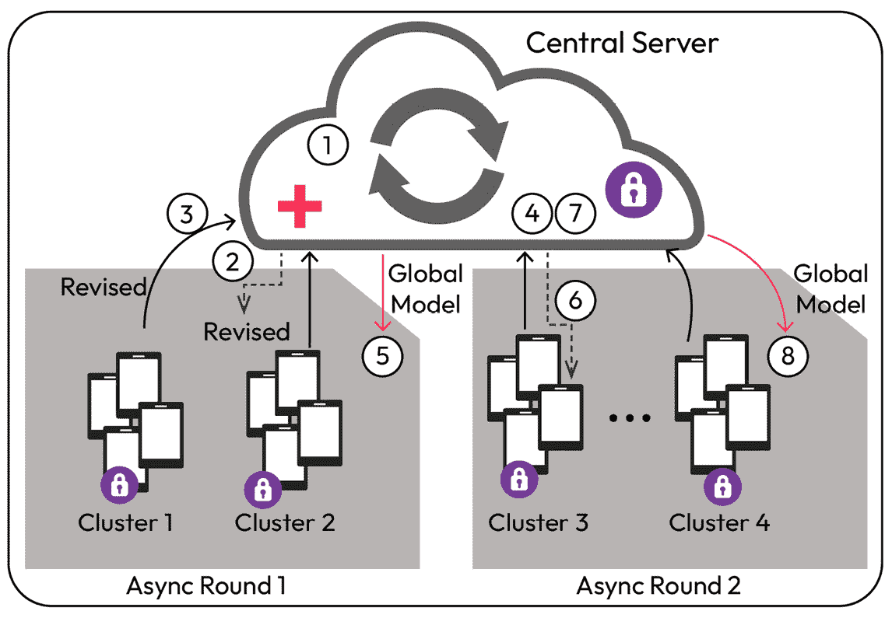

图 12.9 – FL 模型部署设计模式 – 异步聚合器

这一机制与传统的 FL 有所不同，它允许客户端跳过第一次聚合轮次，在下一次（第二次或后续）聚合阶段中客户端异步地更新模型。因此，它能够适应客户端在计算资源、带宽可用性和通信能力方面的差异。客户端在参与全局模型聚合时享有明显优势，因为服务器的模型收敛过程不受延迟的影响。

使用此策略所面临的挑战会导致全局模型产生偏差，如果重要信息被消除，可能会影响模型的质量。此外，服务器上的最大聚合延迟由最慢客户端发送更新的时间决定，从而导致模型收敛速度缓慢。

然而，这种方法的一些主要优点包括在每轮聚合中都进行集中聚合，而不是等待最慢的客户端。我们还看到，每轮的带宽使用量减少，因为只有少数客户端异步发送它们的更新。

设计模式的例子包括**异步在线联邦学习**和**异步** **联邦优化**。

#### 去中心化聚合器

如下图所示，这种聚合策略遵循去中心化联邦学习（FL）方法，通过去除对中央服务器的依赖，避免了单点故障的风险。在这种架构中，中央服务器可能会遇到额外的负载，因为它需要接收并聚合来自所有客户端的更新。图示展示了区块链和智能合约如何在更新共享给相邻设备时接收模型更新。在传统的 FL 训练中，当并非所有参与的客户端都信任中央服务器时，系统可能会受到隐私限制的影响。

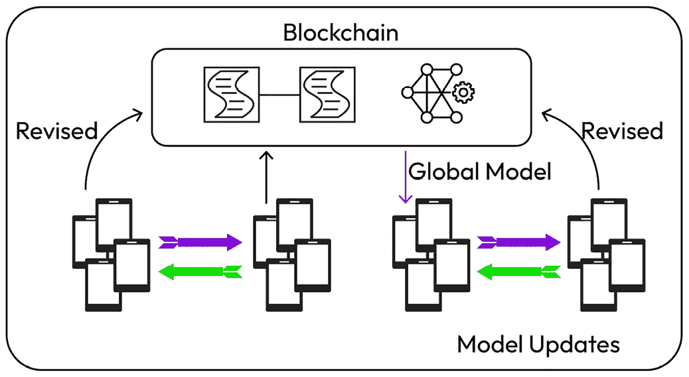

图 12.10 – FL 模型部署设计模式 – 去中心化聚合器

推荐使用这种去中心化方法，其中允许客户端设备之间进行模型更新。然而，这种架构还需要合理定义去中心化的模型管理系统，在该系统中，同行设备能够收集、存储、检查并聚合本地模型。此外，我们还需要定义系统所有权，通过该方式随机选择一个客户端执行来自本地相邻客户端的聚合操作，并将聚合后的模型发送到客户端网络。区块链作为去中心化 FL 的最佳选项之一，可以存储不可变的模型，学习协调者可以维护区块链。区块链机制可靠、可追溯且值得信赖，从而增强了对抗攻击的韧性、信任度和透明度。

该系统的主要缺点之一是由于区块链共识协议在模型聚合过程中的延迟。此外，客户端设备还可能因为参与训练和模型聚合的并行性而导致电池耗电。即便是这种去中心化架构，也存在客户端可能泄露其同伴的敏感信息的风险。此类点对点学习模式的一个实际例子是 BrainTorrent，在该模式中，客户端之间直接进行学习和交流。

#### 安全聚合器

这种聚合策略支持内置的安全协议，比传统的联邦学习（FL）更好地保护模型，且不需要数据加密的支持。这与传统的联邦学习形成对比，后者没有考虑数据加密和参数的安全交换，容易留下未经授权的数据访问空间。为了防止恶意客户端加入训练过程并遏制对数据/模型的污染攻击，我们需要确保在模型向中央服务器发送更新时，合适的安全协议已到位。确保模型参数和梯度不被第三方访问的最佳方式是采用安全的多方计算来进行模型交换和聚合，确保每个参与客户端都能意识到自己的模型输入和输出。我们还可以使用同态加密，使客户端能够加密，服务器能够解密模型。应用级安全机制，如成对遮蔽和差分隐私，有助于减少数据泄露给外部对手的风险。

这种架构模式的一些缺点包括由于增加额外的安全协议和加密方法，导致系统效率降低和模型准确性下降。因此，我们需要选择合适的隐私阈值，以平衡模型性能和隐私之间的权衡。谷歌开发的安全聚合协议（Secure Aggregation）就是联邦学习中一种安全聚合协议的典型例子。

#### 层次化聚合器

这种聚合技术增加了一个额外的层次化聚合器层（如边缘服务器），以减少非独立同分布（non-IID）对全局模型的影响，并提高系统效率。下图展示了我们如何使用边缘网络 1 和边缘网络 2 在触发全局聚合过程之前，先从附近的客户端设备进行部分聚合。这种设计模式引入了位于边缘网络的中间服务器，用于处理客户端与远程服务器之间的慢速通信，从而提高系统效率。引入层次化聚合器有助于扩展联邦学习系统，并促进更好的全局模型聚合，因为服务器可以将来自数据异质性相似的客户端的本地模型进行组合。

这种架构的主要缺点是当设备与边缘服务器断开连接时，系统的可靠性受到影响，进而影响模型的训练和性能。此外，我们还需要特别小心安全协议，因为边缘服务器可能会出现安全漏洞，并且更容易受到网络安全威胁。

一个直接使用这种架构的联邦学习模型的实际例子是层次化联邦平均（Hierarchical FedAvg），在该模型中，根据从客户端逐步接收的更新，采用多个边缘服务器进行部分模型聚合：

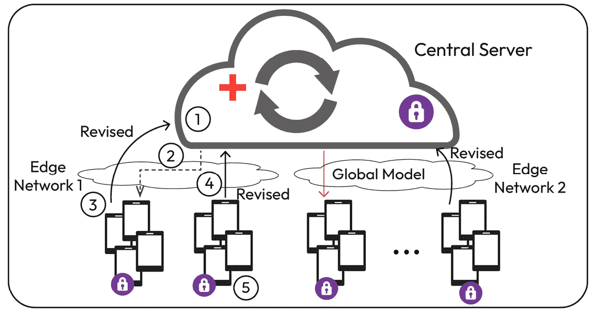

图 12.11 – FL 模型部署设计模式 – 层级聚合器

# 摘要

在本章中，我们了解了在开发 AI 解决方案时可持续性日益重要的背景，以及可以帮助我们减少二氧化碳排放的所需云计算指标、架构和操作技能。我们详细概述了如何根据客户端的能源可用性训练 FL 模型，以减少较高二氧化碳排放的负面影响。现在我们已经了解了高效的基于 FL 的设计模式，无论是训练、模型管理，还是模型聚合模式。

在联邦学习（FL）的训练和部署策略的背景下，我们还获得了探索基于深度学习（DL）的不同训练优化器的优势及其对解决方案可持续性影响的机会。此外，我们还探讨了集中式学习与联邦学习（FL）中的可持续性因素，这有助于我们使用硬件规格、效率、活动运行时、模型架构、冷却需求、云服务提供商和地区等信息来估算 GPU 计算的二氧化碳排放量。我们还探索了如何计算总能耗、可以使用的不同排放指标，以及我们可以遵循的最佳实践，以最大化数据中心的效率。

在下一章中，我们将深入探讨在创建特征存储时如何确保可持续性。

# 进一步阅读

+   *朝着系统化报告机器* *学习的能量和碳足迹*: [`jmlr.org/papers/volume21/20-312/20-312.pdf`](https://jmlr.org/papers/volume21/20-312/20-312.pdf)

+   *如何计算我的 Azure* *虚拟机的 CO2 等效排放量？*: [`devblogs.microsoft.com/sustainable-software/how-can-i-calculate-CO2eq-emissions-for-my-azure-vm/`](https://devblogs.microsoft.com/sustainable-software/how-can-i-calculate-CO2eq-emissions-for-my-azure-vm/)

+   *可持续联邦学习框架,* B. Güler 和 A. Yener: [`dl.ifip.org/db/conf/wiopt/wiopt2021/WiOpt_2021_paper_100-invited.pdf`](https://dl.ifip.org/db/conf/wiopt/wiopt2021/WiOpt_2021_paper_100-invited.pdf), 2021 第 19 届国际移动、自治和无线网络建模与优化研讨会（WiOpt）

+   *可持续的联邦* *学习*: [`arxiv.org/pdf/2102.11274.pdf`](https://arxiv.org/pdf/2102.11274.pdf)

+   *云* *可持续性*: [`cloud.google.com/sustainability`](https://cloud.google.com/sustainability)

+   *你的云服务有多无碳？新的数据让你* *知道*: [`cloud.google.com/blog/topics/sustainability/sharing-carbon-free-energy-percentage-for-google-cloud-regions`](https://cloud.google.com/blog/topics/sustainability/sharing-carbon-free-energy-percentage-for-google-cloud-regions)

+   *联邦* *学习中的 CO2*: [`mlsys.cst.cam.ac.uk/carbon_fl/`](https://mlsys.cst.cam.ac.uk/carbon_fl/)

+   *联邦学习能拯救* *地球吗？* [`arxiv.org/pdf/2010.06537.pdf`](https://arxiv.org/pdf/2010.06537.pdf)

+   *联邦学习系统设计的架构模式*：[`www.researchgate.net/publication/348316341_Architectural_Patterns_for_the_Design_of_Federated_Learning_Systems`](https://www.researchgate.net/publication/348316341_Architectural_Patterns_for_the_Design_of_Federated_Learning_Systems)
