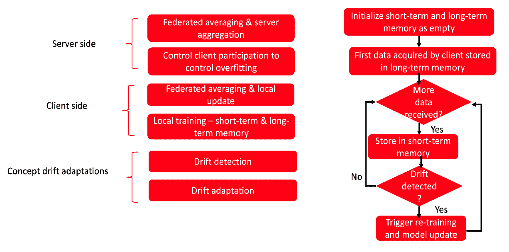

# 第十三章：可持续模型生命周期管理、特征存储和模型校准

本章的主要目标是为你提供在模型开发过程中应遵循的与可持续性相关的最佳实践。这与上一章讨论的与可持续人工智能相关的组织目标一致。我们的目的是鼓励组织层级中的不同层级的人们重构组织路线图，建立可信的人工智能解决方案。你将了解人工智能伦理的各个方面的重要性，以及需要遵循的最佳实践。我们将通过一个特征存储的例子说明如何将隐私、安全和可持续性纳入其中。

本章中，你将学习如何改进模型的概率估计，以获得更准确的结果。我们将从可持续性的角度探讨可调节系统。

通过将可持续性与模型训练和部署的概念结合，你将学习如何实现可持续、可调节的系统，这些系统促进协作和共享。你将探索模型校准，并了解在设计可调节的伦理人工智能解决方案时它的重要性。

本章内容包括以下几点：

+   可持续模型开发实践

+   特征存储中的可解释性、隐私和可持续性

+   探索模型校准

+   构建可持续、可调节的系统

# 可持续模型开发实践

除了道德地部署人工智能（AI）外，可持续性帮助我们所有人向更好的生态完整性和社会正义迈进。在构建人工智能产品的过程中——从创意生成到训练、调整、实施和治理——我们应该意识到我们的行动和人工智能解决方案对环境的影响，并确保它们对未来世代友好。当我们使用度量标准来考虑我们的工作影响时，我们会更负责任地和道德地开展工作。至关重要的是拥有一份描述模型开发各阶段最佳实践的组织路线图，这样变更管理最小且容易跟踪。这还将促进可持续人工智能的创新，并迫使组织为人工智能的训练、验证、部署和使用设定二氧化碳排放目标。

在接下来的子章节中，我们将探讨如何使组织、人员和流程能够朝着可持续人工智能模型开发的方向发展。这将帮助团队部署在长期内取得成功的模型。

首先，让我们看看组织如何制定构建可持续、可信框架的指南。

## 可持续、可信框架的组织标准

在 *第三章* 中，我们学习了关于可信 AI 的法规和政策；我们部署到生产的系统需要 100% 符合这些法规。我们有一些可以重用并集成到现有平台中的开源框架，如下所示：

+   **TensorFlow 模型修正**：这是由 Google 开发的一个库，旨在限制模型预处理训练或后处理过程中产生的偏差。

+   **TensorFlow 隐私**：这是由 Google 开发的一个库，使机器学习优化器能够在融合差分隐私的同时优化机器学习模型的目标函数。

+   **AI 公平性 360**：这是 IBM 开发的一个库，用于检测和缓解偏差。

+   **负责任的 AI 工具箱**：这是由 Microsoft 开发的一个库，旨在帮助在可信环境中伦理地访问、开发和部署 AI 解决方案。

+   **XAI**：这是一个通过模型评估和监控来促进模型可解释性的库。

+   **TensorFlow 联邦**：这是一个支持多个客户端参与的分布式训练的库。

此外，我们需要知道如何将最佳实践融入现有技术平台中，这些平台可以作为评估可信框架的指引。让我们总结一下组织领导应当践行的常见模型治理和风险管理活动。为了在开发和部署生命周期中建立最佳的伦理和可持续实践，需要回答 *图 13.1* 中列出的问题：

| **模型实践** | **关键问题** |
| --- | --- |
| **模型开发阶段** |
| 识别 | 组织是否根据联邦指导方针识别并列出了关键的合规工具？例如，对于银行和保险，某些金融和风险模型需要用于评估框架。 |
| 库存管理 | 模型库存管理策略是什么？例如，在模型开发生命周期中，是否有模型分类过程？不同的风险是否已被考虑，并且这如何影响不同模型的排名？ |
| 命名策略和安全性 | 模型命名空间如何管理？是否考虑了领域问题以及业务用例？关键利益相关者如何参与模型版本控制和安全管理？ |
| 正式化政策和程序 | 是否有适当的指南、审计检查清单以及授权人员参与正式化模型开发、验证、使用、监控和退休的标准和指南？ |
| 合规性 | 是否有合规要求清单？是否有针对合规要求的定期审计？是否有经过培训的人员参与，并与机器学习、数据工程和分析团队密切合作，以确保所有企业系统都遵守确认和合规性？ |
| 研究与最佳实践应用 | 是否有针对模型服务的实际问题进行深入研究的计划？是否有专门训练的人员负责研究并传播当前模型的最佳（标准）实践？ |
| 文档编制 | 是否有良好记录的模型，涵盖问题定义和业务目标的范围？是否有特征存储的定义，并在团队共享和重用特征、模型和数据时建立了沟通流程？如何确保数据和模型的可用性，同时不违反安全性，并确保团队成员的意识？ |
| 共享与重用 | 在集中式和**联邦学习**（**FL**）中，机器学习模型和特征是如何共享的？内建的安全、隐私和通知策略如何在团队之间的特征更新中应用？ |
| **模型验证阶段** |
| 测试与验证 | 当模型部署在服务框架中时，如何进行模型的单元测试和系统测试？为了确保正式的模型验证程序和模型服务 API，采用了哪些干预和监督技术？为了确保跨平台的模型互操作性，已采取哪些准则和实践？考虑了哪些排放指标？ |
| 挑战/有效批评 | 在模型输入、输出、训练、验证和测试过程中遇到的审查/挑战如何处理？有哪些敏捷流程被采用，以便纳入增量模型变更，确保模型准确，同时又符合隐私、公平和可解释性？ |
| **模型实施阶段** |
| 治理的实施和使用 | 模型的标准操作程序是什么，特别是在刷新、查询、链接使用、数据转储和输入标识处理方面？是否遵循了共享控制工具的推荐实践？是否已经建立了共享用户技术，如监视窗口、平衡检查和备份？ |
| **模型的持续监控** |
| 修复 | 是否有适当的模型追踪机制，用于修复和纠正错误？是否已经为平台、机器学习模型和数据管道的可持续性定义了指标？ |
| 变更管理 | 如何追踪和更新模型变更文档？ |
| 审计和审查 | 是否已建立最佳的审计和审查流程，以验证防御层并确保模型输出的质量？如何建立基准，以在更大规模的企业平台中区分和扩展模型？如何有效地控制不同客户平台上基准的成本？ |
| 风险容忍度、风险偏好和风险阈值的定义 | 模型接受的不同阈值水平是什么？我们是否基于问题范围、领域和数据量制定了一个风险容忍度水平，并在一定的不确定性范围内接受？我们是否在维护和建立每个模型期望值的财务影响/美元差异？ |
| 识别次级风险 | 评估管理其他风险（例如延迟完成截止日期或干扰数据架构）所带来的风险的技术是什么？ |
| 识别操作风险 | 我们如何定义模型实施中的操作风险？这是否涉及考虑和定期审查不同特征，例如折扣率，或确保操作程序的验证，如版本控制？ |
| 识别新兴风险 | 随着模型的持续更新，出现的新风险或潜在的风险是什么？ |
| 跟踪 | 传统模型、基于深度学习的模型和基于联邦学习的模型的跟踪步骤有哪些？这些跟踪步骤如何允许修改并在整个模型生命周期内提供额外使用的空间？ |
| 持续监控 | 为了能够定期监控模型的准确性、相关性和可解释性，现有的监控工具和仪表盘有哪些？我们如何使用模型可解释性工具与业务利益相关者沟通关于商业模型的风险、数据以及概念漂移？ |
| **AI 应用使用** |
| 许可协议、使用条款和点击协议的条款 | 我们有哪些审核流程来验证许可协议、使用条款和担保条款？我们如何确保通过包含语言来防止不当使用 AI 应用，避免因意外应用产生的责任？例如，允许针对任何用于生命救援设备、关键任务航空电子设备、军事应用或军火的豁免，并同时声明不允许向禁运国家出口或使用。 |

表 13.1 – 关键模型实践与问题

每个业务单元都需要回答前述问题，以确保建模过程与公司战略的适当对接。这反过来有助于组织意识到可持续性实践，并将注意力集中在数据和模型开发以及治理策略上。总的来说，目标是以环保的方式促进重用和协调。因此，我们需要一个统一的链管理模型，通过提高透明度和可解释性并减少对关键人物的依赖，防止机器学习模型的潜在滥用。设定董事会治理公司和 CxO 办公室运作的伦理边界也是至关重要的。CxO（指 CEO、CTO 和 CIO 角色）发起的组织和推动上述过程的数据团队，是任何 AI 驱动的业务成功的关键。通过这样的举措，我们不仅可以提高几个百分点的利润率，还能通过明智使用资源和雇佣训练有素的数据团队，节省数十亿美元。

那些未能回答前面问题并建立所需流程的组织，通常会遭受时间和金钱的损失。此外，他们无法在这个竞争激烈的世界中维持基于 AI 的业务用例。

在理解了这一点后，我们可以继续深入研究特征存储。

# 特征存储中的可解释性、隐私性和可持续性

在*第十章*中，我们介绍了特征存储的概念，并通过一个例子演示了如何使用在线特征存储。此外，在前一节中，我们学习了可持续模型训练和部署的关键方面，并且了解了如何在不同的云服务商之间跟踪可持续模型指标的最佳实践。我们还在*第十二章*中看到，联邦学习（FL）通过允许设备本地训练，为可持续性提供了一个训练环境。因此，我们必须尝试在医疗保健、零售、银行等行业中，利用 FL 进行机器学习模型的训练，特别是在通用模型表示起到重要作用而计算能力有限的情况下。

在本节中，让我们深入探讨如何创建可解释的、私密的和可持续的特征存储。

## 特征存储的组件和功能

现在，让我们探索特征存储的不同组件如何在分布式架构中发挥其功能角色，如*图 13.1*所示：


图 13.1 – 伦理特征存储的不同组件

以下列表详细介绍了每个组件：

+   第一个组件是数据源单元，在这里数据可以从第三方来源接收并聚合。数据可以是原始数据、SQL 数据或事件数据。为了构建可持续的机器学习模型和特征存储，我们需要在基础设施中构建联邦学习能力，其中数据主要来自移动设备、物联网设备或**医疗物联网**（**IoMTs**）的事件数据。联邦学习无疑为我们提供了实践可持续模型开发的机会。然而，如果没有联邦学习，具有自动反馈循环和再训练能力的系统也可以帮助我们创建可持续的机器学习模型。

+   第二个组件包括数据摄取和特征工程管道，在这里，数据需要匿名化以保护**个人身份信息**（**PII**），我们在*第二章*中有讨论过。为了突出并构建可持续的管道，我们必须在设计中支持重用，以提取可以跨团队使用的相关特征。此外，为了支持基于联邦合作学习方法和部署策略，特征工程管道应该分布在云端和边缘设备上。这将有助于分配负载并控制集中训练程序的排放速率。例如，*图 13.2*展示了在边缘网络中使用**深度神经网络**（**DNNs**）的联邦学习工作方法。我们还展示了可以在服务器组件中使用的不同类型的云服务（来自谷歌云平台）。


图 13.2 – 边缘网络中的联邦学习

在前面的图中，*图 13.2*，客户端从多个物联网设备收集数据，并进行基于本地深度学习的模型训练，而部署在多个边缘的少数服务器负责第一层模型聚合，最终将其聚合到云端。聚合后的模型随后被推送到边缘，客户端继续在本地数据集上进行训练。

+   第三个组件涉及特征管理和在线与离线处理的可解释性。在*第四章*中，我们讨论了如何通过使用适当的安全规则创建沙箱环境或隔离单元，以处理和存储不同团队所需的特征，这些团队具有不同的敏感性级别（请参见*第四章*中的*图 4.12*）。该组件还涉及满足规范特征可解释性、偏差识别和特征推荐的 AI 伦理原则。数据和特征的公平性也需要通过该组件来满足，因为有偏的数据集和提取的特征可能导致有偏的机器学习模型。

+   第四个组件是存储，在此存储元数据、在线和离线特征。这包括 SQL 和 NoSQL 数据库以及缓存，数据可以存储在磁盘上，也可以存储在内存中以便快速检索。

+   第五个组件涉及用户如何执行时间旅行查询，这些查询能够快速搜索并返回某一特定时间点的数据（我们可以了解数据的历史以及记录其沿革），某一时间区间的数据，以及自某一时间点以来数据所做的更改。时间旅行查询通过使用索引（布隆过滤器、*z* 索引和数据跳过索引）高效执行，这些索引值得特别提及，因为它们减少了需要从文件系统或对象存储读取的数据量。

+   最后的组件（与模型训练、部署和监控一同）还负责识别模型漂移。通过对个别模型设置访问权限，该组件促使模型评分指标的比较，以便快速采取模型再训练的措施。

接下来，让我们继续学习 FL 的特征存储。

## FL 的特征存储

我们看到特征存储在 ML 模型重用和集中学习特征中的重要作用，在 *第十章* 中已经讨论过。现在，让我们探讨如何利用现有的特征存储管道概念来支持协作学习，特别是在 FL 框架的案例中。这将促进联合工具的开发和部署，允许组织、教育机构和合作伙伴的技术团队共同协作，分享数据、ML 模型和特征。

我们将看到 **FeatureCloud AI Store** 如何为 FL（主要用于生物医学研究）提供一个平台，通过统一一组即用型应用来跨领域使用。

*图 13**.3* 展示了 FeatureCloud 的不同组件，解释了合作方如何协作创建一个可以包含新的第三方应用程序的云端认证特征存储：


图 13.3 – 一个私有的 FeatureCloud 存储用于 FL

这些统一的联邦应用可以在可扩展平台上产生类似于集中式机器学习的结果。随着协作的增加，内置的隐私机制如**同态加密**、安全多方计算和差分隐私变得极为重要，因为它们可以保护敏感信息。FeatureCloud AI Store 是一个特征存储，通过重新定义**应用程序接口**（**API**），消除了传统基于联邦学习（FL）建模的限制，使开发者可以更容易地重用和分享外部开发者的创新应用程序。配合开放的 API 系统，它支持部署分发，允许通过可配置的工作流程使用算法。该特征存储对外部开发者透明开放，开发者可以自由添加和发布自己的联邦应用，使该系统成为数据、模型和应用程序高效协作的媒介。

如前图所示，第三方应用中提供的应用接口提供了有关不同类别应用的详细信息，通过显示它们的基本信息，包括简短描述、关键词、用户评分和认证状态。此外，每个应用不仅被分类为预处理、分析或评估，还配备了图形化前端或简单配置文件，用于设置应用参数并使其适应不同的上下文。

任何在 FeatureCloud 中运行的应用都在一个 Docker 容器内运行，该容器可以通过 FeatureCloud API 与其他应用交换数据和其他关键信息。该存储通过提供模板和测试模拟器来加速联邦应用的开发。

这种共享应用环境带有应用文档、搜索和过滤功能，以及应用认证流程，以推动 AI 商店中的隐私标准。认证流程对频繁测试隐私泄露有严格的指导原则；如果测试失败，将通知相关开发者解决问题。然而，它也提供了一项功能，即每当应用更新时，都会发起一个新的认证流程。

这种协作型、可持续的平台的一个主要缺点是，协调者在聚合各个模型之前可以访问所有的单独模型。因此，该框架提供了不同的隐私保护措施，如安全多方计算和差分隐私，以防止任何隐私泄露。

联邦工作流可以通过让所有协作伙伴在他们的机器上下载并启动客户端 FeatureCloud 控制器（使用 Docker）来设计。由于用户可以在 FeatureCloud 网站上创建账户，跨用户应用程序的协调可以顺利建立。这通过在工作流中的独立应用程序中集成**交叉验证**（**CV**）、标准化、模型训练和模型评估程序，促进了跨机构的数据和算法共享与分析，如*图 13.4*所示：


图 13.4 – 基于应用程序的 FL 的 FeatureCloud 工作流

当多个应用程序形成一个工作流时，这些应用程序的连续执行完成了一个独特工作流的运行。一个应用程序的输出或结果可以被另一个应用程序消费，整体工作流的进展可以被追踪或监控。工作流的结果可以在参与方之间共享，以便理解和评估整体建模过程的每一步。FeatureCloud 可以解决生物医学和其他领域的实际问题。

现在我们了解了 FeatureCloud 的运作方式，让我们尝试了解一些它的重要属性。

### FeatureCloud 的属性

在这里，我们将学习如何通过一套在联合设置中创建的应用程序，构建一个协作云环境，帮助我们提供更好的工作流：

+   FeatureCloud 提供了多种机器学习算法的组合，来解决常见问题，通过高效地利用 AI 商店或应用模板中的应用程序。

+   它使用一种通用的标准化数据格式，提供了一种简便的方法来组合应用程序进入工作流，从数据摄取和相互数据消费到输出生成。

+   它推动了协作研究，通过引入经验较少的开发者和有经验的专业人士，共同创建定制化的工作流，以实现更广泛的目标。

在本节中，我们了解了与道德合规的联合特征存储相关的概念。现在，让我们了解如何通过确定不同类别预测的可能性，来增强 AI/ML 驱动系统的可预测性。这将帮助我们设计出具有最小漂移的现实系统。

那么，让我们探索模型校准，这是一种不仅能改善模型概率估计，还能帮助创建可持续、稳健的模型预测的后处理技术。

# 探索模型校准

校准是一种模型后处理技术，用于提高概率估计。其目标是改进模型，使得预测概率和观察到的概率的分布及行为相匹配。

对于关键任务应用，需要进行模型校准，在这些应用中，数据点与某一类别相关联的概率非常重要——例如，构建一个预测个体生病概率的模型。

让我们通过经典的猫狗分类器示例更好地理解校准。

假设我们正在使用一个猫狗分类器，其中所有输入图像要么是猫要么是狗。现在，如果模型认为输入图像是猫，它输出`1`；反之，如果它认为输入图像是狗，它输出`0`。我们的模型本质上是连续映射函数——也就是说，它们输出介于`0`和`1`之间的值。这可以通过数学方法实现，例如在最后一层使用 sigmoid 函数作为激活函数。一个好的分类器通常会为猫生成接近`1`的分数，为狗生成接近`0`的分数。

那么这些介于`0`和`1`之间的分数是否代表实际的概率呢？


图 13.5 – 猫狗分类器示例

上图中的 0.18 分数意味着输入图像中有 18%是猫吗？如果模型经过良好校准，那么假设是的！我们可以将其结果解释为概率。主要问题是如何判断我们的模型是否已经校准好。考虑一个现实生活中的例子——当天气应用给出的降雨概率低于 5%时，你却看到外面乌云密布。这通常发生在模型没有良好校准的情况下，从而导致其表现不佳。让我们来看看如何判断一个模型是否经过良好校准。

## 判断模型是否经过良好校准

参考之前的猫狗分类器示例，为了理解这些数字是否可以视为概率，我们需要绘制一个可靠性图。在可靠性图中，*x*轴绘制模型给出的分数——即正类的预测概率（在我们的例子中是`猫`类）。每当接收到一张图像时，它将根据模型给出的分数被放入正确的区间——例如，如果图像的分数为 0.9，它将被放入 0.8 到 1 的区间，模型假定它更有可能是猫的图像。对于分数为 0.06 的图像，它将被放入 0 到 0.2 的区间，表示该图像很可能是狗的图像。我们可以以此类推，继续为许多图像绘制图表。当我们添加大量图像后，可以查看*y*轴，它表示实际为猫的图像数量；换句话说，*y*轴表示正类的实际频率。对于一个良好校准的分类器，这些点将接近对角线。


图 13.6 – 模型输出的分数与实际为猫的图像比例

上述图表展示了一个校准不准确的模型示例。在 0.4 到 0.6 的范围内，如果得分确实代表概率，那么某个图像是猫的概率应该是 40%到 60%。然而，我们只看到在这个区间内，图像为猫的概率为 25%；这表明这是一个校准不准确的模型。

校准适用于分类任务和回归任务。这里我们讨论的是分类任务的示例。在回归任务中，我们关注的是估计预测值的概率分布。校准后的回归模型定义了平均预测值，并且围绕这个均值的预期分布反映了与预测相关的不确定性。

在深入探讨不同的校准技术之前，我们首先要了解为什么会发生校准不准确。

### 为什么会发生校准不准确

校准不准确是机器学习模型常见的问题，尤其是当模型没有在概率框架下训练，且训练数据存在偏差时。在大多数情况下，模型的固有特性决定了该模型是否最终会被校准。以逻辑回归为例，我们利用损失函数，因此无需额外的训练后处理。这是因为其生成的概率在前期已经过校准。高斯朴素贝叶斯中的独立性假设可能导致概率估计不准确，将其推向接近 0 或 1 的值。然而，在随机森林分类器的情况下，接近 0 或 1 的值很少出现，因为是多个内部决策树的平均值计算得出的。唯一能确保达到 0 或 1 的方式是每个模型返回一个接近 0 或 1 的值，这是从概率的角度来看非常有趣的情况。

现在让我们了解各种校准技术。

## 校准技术

一些分类模型，如**支持向量机**（**SVM**）、**k 近邻**和决策树，既不提供概率分数，或者给出的是不准确的估计值。这些方法需要被强制给出类似概率的分数，因此，在使用前必须进行校准。

**Platt 扩展**和**等距回归**是目前最为突出的两种校准技术。两者都将模型的输出转换为似然分数，从而实现校准。我们将在接下来的章节中研究这些技术。

### Platt 扩展

这一技术的原理是将分类模型的输出转换为概率分布。简而言之，当校准图呈现 S 形曲线时，使用 Platt 扩展技术非常有效，尤其适用于小型数据集。


图 13.7 – Platt 扩展示意图

Platt 缩放是一个修改过的 S 型函数，通过求解优化问题来获得 A 和 B。它返回对实际结果的确定程度，而不是返回类别标签。对于诸如支持向量机（SVM）之类的分类模型，如前所述，我们采用特定的转换技术来校准模型，并获取概率作为输出。

### 等距回归

与 Platt 缩放相比，等距回归是一种更强大的校准技术，能够修正任何单调的失真。当校准图形看起来不像 S 型曲线时，它会被使用。等距回归将曲线分割为多个线性模型，因此需要比 Platt 缩放更多的点。这种技术试图找到一组最佳的非递减预测，并尽可能接近原始数据点。该方法在应用于校准问题时，涉及在原始校准曲线上实施回归。与 Platt 缩放不同，等距回归不推荐用于小型数据集，以避免过拟合，并且适用于大型数据集，因为它对离群点较为敏感。

接下来，我们将通过一个动手示例，展示模型校准如何影响模型的可靠性。

## 使用 scikit-learn 进行模型校准

在本节中，我们将使用 scikit-learn 模块合成数据，以比较未校准模型和已校准模型的可靠性与性能。具体方法如下：

1.  首先，我们导入所有必要的模块。在这里，我们将使用 scikit-learn 来生成合成数据，并构建分类器——包括未校准和已校准的分类器：

    ```py
    from sklearn.datasets import make_classification
    from sklearn.calibration import CalibratedClassifierCV
    from sklearn.calibration import calibration_curve
    from sklearn.model_selection import train_test_split
    from sklearn.linear_model import LogisticRegression
    from sklearn.metrics import roc_auc_score, brier_score_loss
    import matplotlib.pyplot as plt
    import pandas as pd
    import numpy as np
    import seaborn as sns
    ```

1.  在这里，我们首先考虑一个平衡的数据集。以下语句生成了 10,000 个样本，每个样本有 10 个特征，并且两类的分布是相等的：

    ```py
    X, y = make_classification(n_samples=10000, n_features=1000, n_redundant=10, random_state=37, weights=[0.5])
    ```

为了方便，我们将特征和标签放入各自的 DataFrame 中：

```py
Xs = pd.DataFrame(X)
ys = pd.DataFrame(y, columns=['label'])
```

1.  现在，让我们使用以下代码验证数据是否平衡：

    ```py
    #plotting bar chart
    ys.value_counts().plot(kind='bar')
    ```

在下图中，您可以看到标签的均匀分布：


图 13.8 – 显示合成数据中类别分布的条形图

1.  接下来，我们将数据分为训练集、验证集和测试集，比例为 60:20:20：

    ```py
    X_train_raw, X_test, y_train_raw, y_test = train_test_split(Xs, ys, test_size=0.20, shuffle=False)
    X_train, X_val, y_train, y_val = train_test_split(X_train_raw, y_train_raw, test_size=0.20, shuffle=False)
    ```

接着，我们在训练数据集上训练一个简单的逻辑回归分类器：

```py
clf = LogisticRegression()
clf.fit(X_train, y_train.values.ravel())
y_pred_uncal = clf.predict_proba(X_test)[:, 1]
```

让我们通过曲线下面积指标来查看分类器的表现：

```py
roc_auc_score(y_test, y_pred_uncal)
>>> 0\. 9185432154389126
```

我们分类器的 `auc` 值是 `0.92`——还不错！

我们还使用 **Brier 分数** 来检查分类器的表现。它是对概率预测准确度的衡量，数学表达式如下：

Brier 分数 = 1*N∑i* *=* 1*Np*(*y*i) *−* *o*(*y*i)²

这里，*N* 是实例的数量，*p*(*y*i) 是实例 `i` 属于 *y*i 类的预测概率，*o*(*y*i) 是实例 `i` 的实际结果，若 *y*i 为真实类别，则 *o*(*y*i) = 1，否则 *o*(*y*i) = 0：

```py
brier_score_loss(y_test, y_pred_uncal)
>>> 0.10919273032433353
```

布赖尔得分的范围从 0 到 1，得分为 0 表示完美准确，得分为 1 表示最差的表现。我们的分类器显示布赖尔得分为 0.11，表现依然优秀。

现在，让我们为同一平衡数据集重复该过程，使用校准后的分类器：

```py
Calibrated_clf = CalibratedClassifierCV(clf, method='sigmoid')
calibrated_clf.fit(X_val, y_val.values.ravel())
y_pred_cal = calibrated_clf.predict_proba(X_test)[:, 1]
print(f'ROC Score {roc_auc_score(y_test, y_pred_cal):.2f} \nBrier Score {brier_score_loss(y_test, y_pred_cal):.2f})
>>> ROC Score 0.92
>>> Brier Score 0.11
```

从准确性和布赖尔得分（Brier score）值来看，我们可以看到，对于平衡数据集，未经校准的分类器与校准后的分类器表现相当：

```py
plt.rcParams.update({'font.size': 10})
frac_of_positives_uncal, pred_prob_uncal = calibration_curve(y_test, y_pred_uncal, n_bins=10)
sns.lineplot(x=pred_prob_uncal, y=frac_of_positives_uncal)
frac_of_positives_cal, pred_prob_cal = calibration_curve(y_test, y_pred_cal, n_bins=10)
sns.lineplot(x=pred_prob_cal, y=frac_of_positives_cal)
plt.grid(linestyle='-', linewidth=0.2)
plt.title("Reliability curve balanced data")
xlabel = plt.xlabel("Probability of positive")
ylabel = plt.ylabel("Fraction of positives")
plt.legend(labels = ['Uncalibrated', 'Calibrated'])
ticks = [0, 0.2, 0.4, 0.6, 0.8, 1]
xticks = plt.xticks(ticks)
yticks = plt.yticks(ticks)
```

以下绘制的可靠性曲线证实了这一点：


图 13.9 - 平衡数据的可靠性曲线

现在，让我们为不平衡数据集重复该过程：

```py
X, y = make_classification(n_samples=10000, n_features=1000, n_redundant=10, random_state=37, weights=[0.7])
Xs = pd.DataFrame(X)
ys = pd.DataFrame(y, columns=['label'])
```

我们可以通过绘制标签的频率图来验证类别的高度不平衡：

```py
#plotting bar chart
ys.value_counts().plot(kind='bar')
```

这里是相应的图表：


图 13.10 - 显示合成数据中类别分布的条形图

如前所述，我们将数据集按 60:20:20 的比例分为训练集、验证集和测试集：

```py
X_train_raw, X_test, y_train_raw, y_test = train_test_split(Xs, ys, test_size=0.20, shuffle=False)
X_train, X_val, y_train, y_val = train_test_split(X_train_raw, y_train_raw, test_size=0.20, shuffle=False)
```

现在，我们探索未经校准的模型：

```py
clf = LogisticRegression()
clf.fit(X_train, y_train.values.ravel())
y_pred_uncal = clf.predict_proba(X_test)[:, 1]
print(f'ROC Score {roc_auc_score(y_test, y_pred_uncal):.2f} \nBrier Score {brier_score_loss(y_test, y_pred_uncal):.2f}')
>>> ROC Score 0.88
>>> Brier Score 0.04
```

最后，我们探索校准后的模型：

```py
calibrated_clf = CalibratedClassifierCV(clf,cv=3, method='isotonic')
calibrated_clf.fit(X_val, y_val.values.ravel())
y_pred_cal = calibrated_clf.predict_proba(X_test)[:, 1]
print(f'ROC Score {roc_auc_score(y_test, y_pred_uncal):.2f} \nBrier Score {brier_score_loss(y_test, y_pred_uncal):.2f}')
>>> ROC Score 0.88
>>>Brier Score 0.04
```

这里是相应的图表：


图 13.11 - 不平衡数据的可靠性曲线

我们可以看到，校准后的模型相比未经校准的模型，对于不平衡数据提供了更可靠的预测。

现在让我们通过考虑动态校准曲线来探索如何设计适应性强的系统。

# 构建可持续、适应性强的系统

我们已经查看了模型治理、可持续模型训练和部署的逐步流程。我们现在也明白了构建可重用特征存储的重要性。

我们了解到，如果没有特征存储（feature store），每个我们想要部署的模型都会有一个独立的特征工程流程。重复的流程不可避免地会导致计算成本增加、数据血统（lineage）开销增大以及大量工程工作。然而，如果建立的特征存储没有足够的鲁棒性和适应性以应对数据和概念漂移，那么建立可持续的特征存储的努力将是徒劳的。

即使在设计大规模分布式机器学习系统时，我们也应考虑构建一个具有检测数据漂移、概念漂移和校准漂移能力的适应性系统。这将有助于持续监控，并意味着我们可以管理来自不同来源的新数据。例如，在零售系统中，我们可能会遇到具有不同购买模式的新客户，而在医疗保健系统中，我们可能会看到新患者带来新的疾病。为了构建能够应对持续变化的适应性系统，我们必须理解校准和动态校准曲线如何帮助我们检测和改善模型性能。校准曲线提供了在一系列预测概率下的模型性能的图示，而动态校准曲线则通过考虑每个观察值的情况，帮助我们可视化时间序列上真实校准曲线的发展。此外，动态曲线通过表示预测概率的加权分布，帮助我们估算评估集上的拟合值。这种拟合有助于评估拟合曲线的性能。你可以在这里阅读更多内容：[`www.sciencedirect.com/science/article/pii/S1532046420302392`](https://www.sciencedirect.com/science/article/pii/S1532046420302392)。

我们构建的特征存储应该内置自动化功能，以支持动态校准曲线，并评估来自新观察的模型性能变化。特征存储漂移检测器可以在新数据积累时提醒团队注意误校准，此外，还可以使用最近的数据窗口自动化重新训练过程。最重要的是，如果我们能够准确检测时间序列中的漂移，并且趋势似乎是永久性的，那么我们还应该看到校准的变化。

一旦校准漂移开始，MLOps 团队应警惕其速度和幅度，这可以通过精确的监控系统有效检测。变化应来自相对较高数量的观察，以确保我们有信心确定模型从已校准状态转变为误校准状态。

由于在相关概率区域内的知识有限，动态校准曲线在低密度、高概率范围内学习误校准的能力不够强。

*图 13.12* 展示了动态校准曲线，特别是其响应如何因模型性能的变化而在一段时间内发展。

所谓误校准（et），是指曲线偏离理想校准的情况，其通过计算观察值的预测概率（pt）与当前曲线在预测概率处的拟合值之间的绝对差异来获得（[`www.sciencedirect.com/science/article/pii/S1532046420302392`](https://www.sciencedirect.com/science/article/pii/S1532046420302392)）。


图 13.12 – 一段时间内的动态标定曲线

这里列出了需要关注的一些重要领域，以检测需要更新模型的标定漂移：

+   动态标定曲线应旨在展示性能衰退，即使不突出具体的衰退部分。

+   错标定可能会在过度预测和欠预测区域之间出现波动，且概率边界较宽。这一点在漂移前后的标定误差变化中得到了进一步体现。

+   标定漂移通常源自过渡状态。

+   动态标定曲线的方差可以通过调整 Adam 优化器的步长或初始学习率来处理，从而快速响应模型性能的变化。（Adam 优化器是一种深度学习优化器，用于随机目标函数的一阶基于梯度的优化）

+   对于模型性能的显著性边际，需要为非常小的标定变化正确设置和定义。

+   根据模型的复杂性，需要定义最小窗口大小，以捕获足够的样本进行模型更新。

正如你在*图 13.13*中看到的，在线和离线特征空间是共享的，创建了一个合并的共享特征，称为**编码器**。参见下图：


图 13.13 – 特征存储中标定漂移检测器的重要性

虽然**B 队**参与离线特征生成过程，**A 队**和**C 队**则参与在线特征生成过程。如果任何在线特征的突然变化触发标定漂移并损害模型的性能，必须立即向**B 队**触发警报，因为该队也访问共享特征空间。使用**B 队**共享特征训练的模型也可能经历标定漂移，并且必须通过触发重新训练来立即进行修正。

在这里，我们观察到运行和触发警报的标定漂移检测算法的重要性。

除了标定漂移，我们在*第七章*中研究了数据和概念漂移如何发挥重要作用，以及适应性框架如何发展以应对这些漂移。现在，重要的是，我们要拓宽视野，将这一概念应用于可持续训练环境，并将适应性框架融入特征存储。我们已经了解了可持续特征存储；现在，让我们将概念漂移的思想整合到 FL 环境中。

## 考虑概念漂移的联邦平均（CDA-FedAvg）

我们在 FL 设计模式中看到，异步发送模型更新的方法对于电力消耗大的设备非常有利，使它们在有电的情况下灵活参与训练。它还帮助在协作环境中进行概念漂移检测和适应技术，服务器负责协调这一过程。

服务器充当协调者，将来自各个设备的模型进行聚合，本地设备则成为决定性主体，选择数据和触发本地训练过程的时间。

由中央服务器聚合的模型是全球公认的（参与实体的每个单独模型都经过服务器的同意并平均化），然后服务器将其广播到所有客户端。客户端负责检测和处理数据和模型模式的变化。客户端在其本地训练数据集上训练模型，并通过三阶段过程来管理漂移：

1.  基于时间的漂移识别

1.  漂移**根本原因分析**（**RCA**）用于识别漂移的原因和漂移开始发生的数据实例

1.  响应与缓解方法以适应漂移，从而产生高精度模型

当客户端接收到来自多个输入源的新收集数据时，它们会配备漂移检测算法以识别新概念（漂移检测）并从中学习。内建的漂移适应技术帮助分析数据或模型在两个时间戳之间的差异，以及分析漂移的性质或其原因，并采取相应的补救措施。当地客户端配备了短期记忆和长期记忆，以便在检测到漂移时立即做出响应。短期记忆帮助存储和比较客户端在最新时间间隔内收集的数据实例，而长期记忆则存储过去事件或概念的数据样本，这些事件或概念与当前时间点相比较。

这种具有短期和长期记忆的适应性帮助我们理解数据、模型模式和概念，并通过长时间存储数据记录来触发本地模型训练或再训练。这个过程按照事件顺序发生，如*图 13.14*所示：



图 13.14 – CDA-FedAvg 在 FL 客户端中的应用

如前所示图所示，我们基于漂移的存在与否采取以下行动：

1.  当本地训练过程尚未启动时，短期和长期记忆都会初始化为空。

1.  一旦客户端获得首个数据，它将作为初始概念存储在长期记忆中，并用于首次训练和本地更新。

1.  客户端收到的任何后续数据将存储在短期记忆中，以评估漂移。

1.  在识别到潜在漂移后，与新概念相关的新数据将被存储在长期记忆中。

1.  此外，新的漂移案例会触发客户端的新的训练轮次。

因此，一个设计良好的系统不仅应运行最佳的概念漂移检测算法，无论是在集中式还是 FL 环境中，还应经过良好的校准，以确保由于输入数据变化导致的漂移最小。

# 总结

在本章中，我们学习了领导者和利益相关者应采取的主要指导原则，以便采取直接行动，推动最佳的模型构建实践融入他们的组织文化。本章深入探讨了如何在设计联邦特征存储时充分利用联邦学习，鼓励通过使用 API 促进协作研究。此外，我们还探索了特征存储中可适应框架的概念，这些框架在隐私、可解释性和公平性方面也符合伦理要求。

此外，我们还学习了如何通过校准来改进模型，当模型输出显示存在高概率区域时，这些区域可能并不真实。也可以考虑将预测分数作为输入的指标——例如，**曲线下面积-接收者操作特征**（**AUC-ROC**）分数基于预测位置，但在准确校准的概率方面表现不佳。

校准在复杂的机器学习系统和实际场景中具有优势。它在训练后调整机器学习模型的结果，并保持输出的一致性。执行校准可能会影响模型的准确性，通常观察到校准后的模型准确度略低于未经校准的模型。然而，这种对准确性的负面影响非常低，而校准所带来的优势则要显著得多。如果模型的目标是实现良好的概率预测，校准模型是提高预测性能的关键步骤。

在本章中，我们识别了伦理模型的可持续性方面，以及如何将联邦学习（FL）和联邦特征存储结合起来，通过可持续能源解决方案来计算和控制碳排放。在充分理解了最佳设计框架用于伦理机器学习建模之后，在下一章中，我们将学习如何将这些模式应用于不同领域，以解决实际的使用案例。

# 深入阅读

+   *FeatureCloud AI Store 在生物医学和* *其他领域中的联邦学习应用*：[`arxiv.org/pdf/2105.05734.pdf`](https://arxiv.org/pdf/2105.05734.pdf)

+   *临床预测模型中校准漂移的检测，以指导模型* *更新*：[`www.sciencedirect.com/science/article/pii/S1532046420302392`](https://www.sciencedirect.com/science/article/pii/S1532046420302392)

+   *校准技术及其在机器* *学习中的重要性*：[`kingsubham27.medium.com/calibration-techniques-and-its-importance-in-machine-learning-71bec997b661`](https://kingsubham27.medium.com/calibration-techniques-and-its-importance-in-machine-learning-71bec997b661)

+   *校准，数据不平衡*：[`amueller.github.io/aml/04-model-evaluation/11-calibration.html`](https://amueller.github.io/aml/04-model-evaluation/11-calibration.html)

+   *Brier 分数：理解模型* *校准*: [`neptune.ai/blog/brier-score-and-model-calibration`](https://neptune.ai/blog/brier-score-and-model-calibration)

+   *如何为不平衡* *分类校准概率*: [`machinelearningmastery.com/probability-calibration-for-imbalanced-classification/`](https://machinelearningmastery.com/probability-calibration-for-imbalanced-classification/)

+   *分类器* *校准*: [`towardsdatascience.com/classifier-calibration-7d0be1e05452`](https://towardsdatascience.com/classifier-calibration-7d0be1e05452)

+   *为什么模型校准很重要，如何实现* *？*: [`www.unofficialgoogledatascience.com/2021/04/why-model-calibration-matters-and-how.html`](https://www.unofficialgoogledatascience.com/2021/04/why-model-calibration-matters-and-how.html)

+   *Python 中的模型校准是什么意思* *？*: [`www.projectpro.io/recipes/what-does-model-calibration-mean`](https://www.projectpro.io/recipes/what-does-model-calibration-mean)

+   *模型* *校准指南*: [`wttech.blog/blog/2021/a-guide-to-model-calibration/`](https://wttech.blog/blog/2021/a-guide-to-model-calibration/)

+   *机器* *学习中的校准*: [`medium.com/analytics-vidhya/calibration-in-machine-learning-e7972ac93555`](https://medium.com/analytics-vidhya/calibration-in-machine-learning-e7972ac93555)

+   *预测与校准技术以优化机器学习* *模型的表现*: [`towardsdatascience.com/calibration-techniques-of-machine-learning-models-d4f1a9c7a9cf`](https://towardsdatascience.com/calibration-techniques-of-machine-learning-models-d4f1a9c7a9cf)
