# 第十四章：行业范围的应用案例

本章展示了关于零售、供应链管理、银行和金融以及医疗健康领域的负责任 AI 的不同应用案例。本章的主要目标是通过实践应用帮助您提升技能，以便将 AI 解决方案应用于现实世界的用例，进而推动创造一个更加公平和包容的世界。您将增强对 AI 伦理和合规性的理解，帮助您更好地识别和解决涉及 AI 在不同产业领域应用的未来用例。此外，本章还将让您通过在大规模分布式系统中应用基于 AI 的工具和算法，测试、衡量和量化各行业领域的业务成果。

在本章结束时，您将能够创建关于零售、银行和医疗领域的无偏、公正的 AI 驱动解决方案。

本章将涵盖以下主题：

+   在各行业中构建道德的 AI 解决方案

+   涉及零售和供应链管理领域的 AI 应用案例

+   涉及银行和金融领域的 AI 应用案例

+   涉及医疗健康领域的 AI 应用案例

# 技术要求

本章要求您安装 Python 3.8，并使用以下命令安装以下 Python 软件包：

+   `tensorflow-2.7.0`

+   `pip` `install pycausalimpact`

+   `pip` `install causalml`

+   `pip` `install dice-ml`

+   `pip` `install causalnex`

+   `pip` `install auton-survival`

在安装这些库时，您可能会发现依赖库之间存在冲突，因此建议您先安装并运行一个库的应用案例，然后再继续安装下一个库。

让我们首先看看各个行业领域如何遭遇偏见解决方案，以及如何构建道德的解决方案来改善客户体验。

# 在各行业中构建道德的 AI 解决方案

聊天机器人在零售、金融、医疗、旅游、酒店和消费品行业，以及其他垂直行业中发挥着重要作用。因此，负责任的 AI 实践应该能够识别由 AI/ML 模型产生的偏见聊天机器人，并采取适当的措施确保它们在预测中的公正性。

## 偏见聊天机器人

聊天机器人无法理解某些口音或方言，导致负面的客户体验。客户被迫直接联系您的客服部门。聊天机器人在零售行业的应用广泛，主要体现在以下几种方式：

+   通过提供 24/7 全天候服务、快速响应时间，并解决客户问题，帮助保留客户。

+   通知客户新产品的可用性，并提醒客户与买家兴趣相符的个性化产品。

+   通过获取客户信息，如电话号码、支付选项等，帮助客户下订单并确保顺利的结账流程。

在多样性不足的数据上训练的聊天机器人会给终端用户提供偏见性的答案，迫使他们直接拨打客户服务电话。在仅使用美式英语口音数据训练的聊天机器人可能无法理解少数群体和被低估群体的口音和方言，例如非裔美国人英语。一个例子是 Facebook 基于 Reddit 数据训练的 Blender 聊天机器人，它很快学会了粗俗的语言。

一个类似的案例是微软于 2016 年推出的 AI 聊天机器人 Tay，它开始发布种族主义言论，并在发布后的 24 小时内被撤回。Tay 仅使用来自 Twitter 的数据进行训练，展示了偏见数据集如何对不同人口群体产生歧视性预测。

除了符合伦理标准的聊天机器人外，我们还需要考虑**扩展现实**（**XR**）/**增强现实**（**AR**）/**虚拟现实**（**VR**）环境的伦理问题，因为它们在各行业中得到了广泛应用。因此，让我们了解在零售行业中，VR、AR 和 XR 环境是如何被使用的，以及它们在设计时遵循最佳实践的重要性。

## XR/AR/VR 中的伦理问题

零售行业已经推出了多种**XR**工具，包括**AR**、**VR**和**混合现实**（**MR**），这些工具通过数字技术使顾客在购买之前能够与他们选中的商品互动和体验。零售商现在配备了 AR/VR 设施，可以将顾客可能想试戴的任何物品进行数字投影，从不同尺寸和颜色的眼镜到珠宝、衣服、鞋子和手表等。顾客还可以利用智能手机相机在家中组织他们计划购买的家具，甚至可以将自己传送到不同的地点，享受他们所穿衣服或鞋子的感觉。

随着品牌在社交媒体平台上的影响力不断上升，品牌和监管机构应当意识到在这些平台上促进人工智能伦理使用的最佳实践。由于通过人口信息定位客户并提供个性化购物体验，一些品牌开始面临关于其产品的指控，因为许多产品被发现带有种族主义的品牌标签。例如，许多国际消费品品牌计划从其产品中移除“公平”、“白色”和“亮白”等标签，包括在印度流行的美白面霜。

**康德义务伦理学**（其制定了适用于所有人类的普遍道德原则，不受情境或背景的限制）解释了人类应当以尊重和荣誉的态度相互对待，就像他们希望别人以同样的方式对待自己一样。这也适用于 AR/VR 的情境——如果我们对虚拟角色不尊重，或故意或无意地实施暴力或不宽容行为，可能会对这些角色所代表的人造成心理伤害。因此，AR/VR 的设计者必须审慎考虑虚拟角色和代理人可能执行的所有行动，禁止它们进行不道德的行为。

在缺乏关于 AR/VR/XR 数据隐私、版权和责任的结构性法规的情况下，我们可以将康德义务伦理学作为思考人工智能伦理影响和应当规范人工智能系统开发和使用的道德规则的框架。例如，康德的定言命令认为我们应当只以我们愿意看到普遍适用的方式行事，这一原则可以应用于人工智能系统的开发。可以认为，我们应当只开发符合道德价值观并愿意普遍适用的人工智能系统，而不是开发可能被用于不正当目的或可能导致负面后果的系统。

此外，伦理机构和经验丰富的研究人员应评估易受影响群体暴露于可能造成伤害并影响用户身心健康的敏感话题的风险。例如，顾客可能访问一个虚假的虚拟零售商店，并被提示进行虚假的商业交易，顾客的个人数据和银行信息将被盗取。

因此，这类 AR/VR 系统的开发者应考虑以下参数，并可能根据受众的特点进行调整。例如，某些 AR/VR 系统可能对残障人士或老年和年轻人群体构成危险 ([`www.frontiersin.org/articles/10.3389/frvir.2020.00001/full`](https://www.frontiersin.org/articles/10.3389/frvir.2020.00001/full))。这包括以下内容：

+   AR/VR 媒体的速度（或帧率）以及人们可能经历的晕动症程度。

+   影响一个人的感官、运动和知觉能力，或者其手动灵活性或身体定位能力。

+   通过劝导行为可能对个体产生的信息过载程度。

+   长期和频繁使用 XR 可能导致对物理世界事件的不信任，以及对虚拟世界事件的过度优先考虑，例如顾客可能在一段时间后无法区分真实与虚拟事件。

+   在虚拟现实环境中，用户需要时间来适应体验的强化，或考虑到需要心理治疗以防止其产生不良反应。

+   在虚拟现实环境中离开后，人们可能带着认知、情感（例如，如果观众的虚拟形象被虚构角色侮辱）和行为（例如，某些在 XR 环境中被接受的行为在社会上是非伦理的，如性别或种族歧视，或对特定群体的错误归因）上的困扰，再次进入现实世界时可能会有负面影响。

+   即使是在虚拟世界中的现实情境，在现实世界中也可能是危险的。当客户在 XR 中看到一些现实世界中没有对应物的事物，并尝试将其复制到现实世界时，就会出现这种情况。一个例子是椅子问题，客户尝试坐在一个没有物理对应物的虚拟椅子上。

为了设计符合伦理的零售行业解决方案，我们必须考虑隐私、公平性和可解释性。

# 零售行业中的使用案例

让我们考虑一些能够传达这些方面重要性的具体使用案例。

## 零售行业的隐私

零售商应主动通过遵守数据隐私和安全相关的法律法规来保护客户的敏感数据，如欧盟的**通用数据保护条例**（**GDPR**）。全球范围内，零售商还必须遵守其他法律，以保护消费者。这包括 2002 年的电子商务条例、支付卡行业数据安全标准、反垃圾邮件法以及全球其他众多规则。为了保障客户数据的安全，一些最佳的安全实践包括安装防火墙服务、强制实行双因素认证以及其他在*第二章*中详细说明的安全做法，*风险规避方法与框架的出现*。

## 零售行业的公平性

在零售行业中，人们观察到，基于人工智能驱动的解决方案往往会根据人们的社会人口学（性别、种族或其他被认为敏感的属性）背景，导致不同的结果。因此，作为人工智能设计师，我们必须深入研究客户细分，以便制定我们的解决方案。我们知道，在零售行业中，客户档案在决定客户对公司终身价值方面起着主导作用。因此，客户档案以及他们的浏览历史，决定了是否可以根据客户的点击流（即用户浏览会话中的一系列事件）来提供促销、折扣和优惠券。然而，即使考虑了这些因素，研究表明，激励购买的行为（Koehn 等人，2020，*通过点击流数据使用深度学习预测在线购物行为*，`https://www.sciencedirect.com/science/article/abs/pii/S0957417420301676`）可能导致优惠券的分发，其中来自某些社会、人口或文化背景的消费者会受到偏袒和不公平的对待，而没有收到折扣的消费者则产生负面情绪。一个例子是当折扣分配不均，并主要面向那些具有更高购买可能性的高收入家庭的人员，而低收入家庭的人员则被排除在外。

此外，点击流会话揭示了男性和女性用户之间的明显差异，并得出结论，性别即使作为一个代理变量，也会导致偏倚模型的产生。统计数据表明，女性用户通常有更高的浏览频率，并且每次会话在网页上的停留时间也更长。随着浏览时间的增加，电子商务平台的后台处理引擎通常会认为女性用户比男性用户更有可能进行购买。然而，这并不适用于所有年龄段的男性和女性。甚至年龄也是产生不同分配的重要因素，女性的平均年龄明显高于男性。为了消除在我们的机器学习模型中使用偏倚数据，我们需要应用“平等机会”原则（如在*第五章*，*公平数据收集* 中研究的），其内容如下：

+   无论性别如何，男性和女性用户在被视为符合优惠券条件的概率上应当是相同的。

+   无论性别如何，男性和女性用户在不被视为符合优惠券条件的概率上应当是相同的。

这将消除由偏见导致的特权用户获得数字优惠券的情况，即使他们的鼠标点击率较低。如果我们实施平等机会原则，那么我们就可以限制真实世界点击流数据中的性别偏见，从而防止通过访问更多优惠券给予某些群体优势。

另一个在电子商务中观察到的著名歧视性推荐是，当 AI 被用来个性化网站互动时，这些 AI 系统显示的广告显著地减少了新产品或由新入场者和小型市场参与者销售的产品广告。

让我们了解一下歧视性推荐的原因：

+   导致歧视性模型结果的第一个原因是，算法从实际客户行为中学习到了歧视性行为（例如，随着越来越多的人被推荐大市场参与者的产品，他们更有可能点击这些广告）。

+   第二个可能的原因是，算法从其他数据来源学习到了这些行为（例如，基于国家人口统计信息的市场领导者赞助的产品和广告中其他形式的性别歧视）。

+   第三个可能性认为，这不是由学习偏见引起的，而是由给定地区的经济因素推动的。举例来说，包括广告投放技术驱动了观察到的差异（例如，高成本广告关键词的价格溢价较高）。

为了遏制这种歧视性结果，消除偏见，并确保 AI 解决方案的公平性，如在*第五章*《数据收集中的公平性》一节中所研究的，单独采用去除敏感属性的技术可能不足以解决问题。这是因为其他属性可能充当代理变量，导致预测结果中固有的偏见。一个例子是在电子商务中，AI 根据用户的浏览历史预测最成功的广告内容。该方法的一个主要缺点是，浏览历史信息常常被作为性别的代理（例如，`github.com`作为男性的代理，`pinterest.com`作为女性的代理）。此外，在*第八章*《模型训练和优化中的公平性》一节中，我们了解到在算法优化器中约束条件的重要性，这些约束可以控制偏见。

在零售领域，价格经常变动，并且影响销售和收入，因此理解价格变化的原因非常重要。那么，我们来探讨一下零售商店中定价项目的伦理问题。

### 伦理定价选择

为了促进社会福祉，伦理定价选择是电子商务应用和平台在使用智能动态定价引擎时一个重要的考量因素。动态定价引擎的设计方法应解决价格变化的根本原因，以减少对顾客、组织和更广泛社会的潜在危害。如果企业避免解决动态定价带来的负面影响，可能会引发媒体报道、诉讼和立法调查。法律和监管的变化可能会损害品牌形象和声誉，并加剧顾客对公司的不信任。

一些在伦理定价选择中的重要因素（参考自[`hbr.org/2021/03/how-ai-can-help-companies-set-prices-more-ethically`](https://hbr.org/2021/03/how-ai-can-help-companies-set-prices-more-ethically)）如下：

+   基本服务和产品价格变化所造成的障碍程度——在最糟的情况下，可能会阻碍人们获取基本服务，如食品、住所、药品、交通和互联网。我们在疫情期间观察到这一点，当时高价格减少了个人防护设备如 N95 口罩和洗手液的获取途径，而失去这些设备的人群暴露在病毒面前。

+   在零售行业，疫情之前，小型第三方卖家曾声称，大型零售商如亚马逊通过利用他们的数据来与这些小型卖家竞争，从供应商处以更低的成本大批量购买相同产品，并以更低的价格销售。由人工智能驱动的制药公司算法提出的高涨价历史上曾阻碍了慢性病患者获取药物的途径，危及他们的生命。

+   价格变动对弱势群体影响的程度。例如，当产品或服务销售给患有慢性/严重疾病或收入有限的顾客时，社会歧视所造成的脆弱性变得更加突出。此外，在保险领域，考虑到投保人的职业、年龄等因素的预期利率指南，最终造成了广泛的社会危害，贫困投保人最终支付的保险费高于精英职业投保人。

+   定价引擎调整价格的方式使得它们可能对顾客产生不利影响。这一问题常常促使我们设计可解释的模型，以便提供更具信息性的购买决策。这也帮助我们阐明，受益于定价引擎的顾客能够做出更加明智的决策。如果价格变动总是通过利用顾客来将商业利益放在首位（例如打车应用在需求高峰期间使用指数型票价上涨），那么这样的模型就需要接受监管机构的审查和批准。

因此，我们可以看到动态定价引擎在电子商务、零售和保险中的负面后果。作为动态定价算法专家，我们应当仔细检查该问题是否引起了企业的足够关注，并确保定价决策对所有客户群体公平。

现在我们理解了零售中的公平性概念，让我们深入探讨可解释性概念如何融入零售行业。

## 可解释性——反事实（CFs）的作用

理解客户的痛点和偏好是电子商务平台上营销活动和促销活动的关键前提。一旦识别出客户需求，零售商可以提供促销优惠和折扣，并重新吸引流失的客户。例如，对于像 Tesco、Carrefour 或 Walmart 这样的零售商来说，能够识别出每个门店的常规客户和大额客户尤为重要，后者通常对该门店的整体月度采购量贡献巨大。一旦零售商理解了主要客户群体及其偏好，他们不仅可以提供实时推荐，还能通过短期和长期的项目和活动推动业务决策。

客户的不满情绪可能由因果推断引起，这种推断将客户满意度或客户奖励积分等无形变量转化为关键业务指标。以 Uber 为例，其推出的促销活动 Uber Pro，作为一个试点项目在美国八个城市开展，旨在奖励最为敬业的司机伙伴。这些司机通过此项目获得了更高的收入、减少的汽车维修费用、优先机场接送权以及免费的凹陷修复服务等奖励。

电子商务平台经常犯的一个错误是过分重视社交媒体广告，认为这可能会导致例如冬季服装销量的增加，而当其他时间的广告预算被削减时，销量却下降。然而，他们未能注意到冬季几个月恰逢圣诞节、感恩节、新年和其他节日，人们通常会互赠礼物。因此，电子商务平台上的社交媒体营销人员需要通过研究如果没有营销活动时，销量的变化来考虑 CF（因果因素）。这意味着要直接确定由于营销活动带来的收入增长，而不是因为商品价格低廉或正在进行的节日活动推动了人们的购买。我们可以通过 A/B 测试进行详细实验，将客户分为两个不同的组：对照组和目标组。对照组不进行任何营销活动，而目标组则进行营销活动。然后，我们比较目标组和对照组之间的收入增长差异。通过更高的信心来确定 CF 的影响，有助于我们通过衡量目标群体和非目标群体之间的差异来深入了解不同干预措施的效果。这还帮助我们评估营销活动、新产品发布、促销活动以及在特定地区和针对特定消费者群体的优惠的影响。接下来，我们将详细了解 CF 营销活动。

### 使用 CF 评估营销活动的影响

通过因果推断，我们可以回答一些因果性问题，这些问题在某些情况下是无法仅通过 A/B 测试来回答的。当我们有一个随机对照的 A/B 测试时，但每个个体所采取的处理（行为）对不同个体而言却是不同的，这时我们通常会遇到另一种困难。例如，组中的某人没有打开邮件或没有使用奖励积分。我们将很快看到一个示例，说明因果推断如何帮助解决这个问题。

首先，让我们研究因果推断如何通过为我们提供以下见解来帮助我们确定营销活动或促销活动对销售的影响：

+   价格变化如何影响选定的活动指标（正向或负向）

+   选定日期间的促销活动如何影响销量

在下面的例子中，我们将展示零售商如何检验网站上新产品推荐的效果，以得出其影响是正面还是负面。我们可以选择任何固定/特定日期，比如圣诞节。观察在指定日期前后的流量变化，可以帮助我们确定通过推荐框架是否实现了改善或退步。销售的增长或下降可以通过因果影响建模来评估，展示某一行动在指定日期前后的效果。我们将在本例中演示这一过程。通过这种方式，我们可以更容易地确定并解释，是否因为新设计的推荐框架而导致了有机搜索数量的增加。此外，我们还可以预测如果没有任何营销活动，可能会出现什么样的结果：

1.  首先，让我们进行必要的导入并加载数据集：

    ```py
    import numpy as np
    import pandas as pd
    import tensorflow as tf
    import tensorflow_probability as tfp
    import matplotlib.pyplot as plt
    from causalimpact import CausalImpact
    df = pd.read_csv('https://raw.githubusercontent.com/flyandlure/datasets/master/causal_impact_dataset.csv')
    ```

1.  现在，让我们为研究设定前后时间段：

    ```py
    pre_period = ['2021-07-04', '2021-07-17']
    post_period = ['2021-07-18', '2021-07-31']
    ```

接下来，我们希望检查零售商网站在`pre_period`和`post_period`日期范围内的点击次数，日期范围来自前面的列表：

```py
model = CausalImpact(df['clicks'], pre_period, post_period)
```

1.  最后，我们必须通过研究干预的影响来分析模型输出：

    ```py
    print(model.summary(output='report'))
    ```

以下是它的输出：

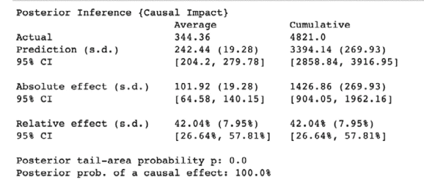

图 14.1 – 从 model.summary()获得的输出

模型总结给出了在干预后期未进行任何干预的情况下，平均预计有 243 次点击。通过干预，我们确定了两个变量之间的关联，*X*和*Y*，其中一个变量*X*是另一个变量*Y*的直接原因，前提是所有其他变量保持固定。

然而，实际观察到的点击次数是 344。所以，预测与实际点击次数之间的*差异*是 101 次点击。这 101 次点击印象展示了干预对模型的因果效应。电商网站上引入产品推荐框架以及其他任何变化，都积极地通过提高网站流量 42%来做出了贡献。

1.  我们还可以使用`model.plot()`绘制数据，研究预测与实际数据之间的差异：

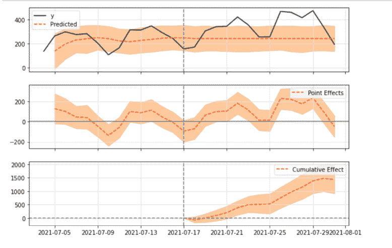

图 14.2 – 通过预测与实际点击次数在干预后期的差异获得的因果效应

这就是我们如何研究干预后期前后的因果效应。

我们现在将研究不同的场景，探讨如何通过必要且充分的因果关系推动客户转化。

### 理解转化率 – 必要且充分的因果关系

让我们通过研究三种不同类型的因果关系来说明优惠券对客户转化率的因果效应：

+   **必要**：一个强制性的条件，没有这个条件客户不会转化，也就是在没有优惠券的情况下。

+   **充分**：一个存在的条件，优惠券有助于将客户转化。

+   **必要且充分**：优惠券在客户转化中起着主要作用，因为没有优惠券，客户在任何情况下都不会转化。

如果我们需要研究这三种类型的干预措施，我们可以将实验数据和观察数据结合起来，以确定每种类型的因果关系发生的概率边界。一旦获得了这些边界，我们就可以安全地推断出最有效的方式来利用基于优惠券的促销，而不浪费资金。以下代码演示了逐步实现这一方法：

1.  首先，让我们导入必要的库：

    ```py
    import numpy as np
    import pandas as pd
    from causalml.optimize import get_pns_bounds
    ```

在这里，我们尝试观察选择促销的个体（例如，拿到药物或收到优惠券的人）与未选择促销的个体的结果。根据田和 Pearl 的假设（[`ftp.cs.ucla.edu/pub/stat_ser/R290-A.pdf`](https://ftp.cs.ucla.edu/pub/stat_ser/R290-A.pdf)）关于识别因果效应的条件，图中所示的两个数据集可以结合起来，以获得通过独立查看任一数据集无法看到的信息。这将帮助我们通过结合两种数据源来识别**必要且充分因果关系**的概率或边界，其中包括处理组和对照组中的死亡与生还数据。

用于实验的数据集如下所示：

| **数据集名称** | **组别** | **处理组** | **对照组** |
| --- | --- | --- | --- |
| 数据集 1 | 未转化数 | 16 | 14 |
| 数据集 2 | 转化数 | 894 | 986 |
| 数据集 3 | 未转化数 | 28 | 2 |
| 数据集 4 | 转化数 | 998 | 972 |

表 14.1 – 实验模拟数据集

这是代码：

```py
num_samples = 5000
half = int(num_samples / 2)
treatment = np.tile([0, 1], half)
recovery = np.zeros(num_samples)
df_expt = pd.DataFrame({'treatment': treatment, 'death': recovery})
df_obsv = pd.DataFrame({'treatment': treatment, 'death': recovery})
```

1.  现在，为了实验目的并分析其影响，我们将实验数据集中的 16 个处理组和 14 个对照组观察的标签设置为 1，并将观察数据集中的 2 个处理组和 28 个对照组观察的标签设置为 1：

    ```py
    df_expt.loc[df_expt.loc[df_expt['treatment'] == 1].sample(n=16).index, 'death'] = 1
    df_expt.loc[df_expt.loc[df_expt['treatment'] == 0].sample(n=14).index, 'death'] = 1
    df_obsv.loc[df_obsv.loc[df_obsv['treatment'] == 1].sample(n=2).index, 'death'] = 1
    df_obsv.loc[df_obsv.loc[df_obsv['treatment'] == 0].sample(n=2).index, 'death'] = 1 df_obsv.loc[df_obs.loc[df_obsv['treatment'] == 0].sample(n=28).index, 'death'] = 1
    ```

1.  接下来，我们将使用`get_pns_bounds()`函数来评估相关的概率边界，主要有三种类型：

    ```py
    pns_lb, pns_ub = get_pns_bounds(df_expt, df_obsv, 'treatment', 'death', type='PNS')
    pn_lb, pn_ub = get_pns_bounds(df_expt, df_obsv, 'treatment','death', type='PN')
    ps_lb, ps_ub = get_pns_bounds(df_expt, df_obsv, 'treatment', 'death', type='PS')
    ```

1.  这产生了以下概率边界：

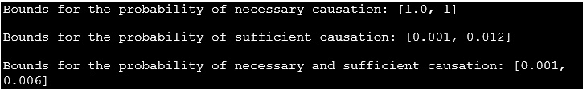

图 14.3 – 必要且充分因果关系的概率边界

这表明，未转化且获得优惠券的参与者相比未获得优惠券的参与者，转化的机会更高。那些已经转化且没有提供优惠券的参与者，如果他们得到优惠券，未转化的风险将在 0.1%到 1.2%之间。此外，我们还可以看到，个体的转化概率范围在 0.1%到 0.6%之间，以及是否获得了优惠券。

现在，让我们了解不同类型的因果推理技术，以及它们如何应用于不同的背景。

### 不同的因果推理技术模式

以下图表描绘了我们可以以非互斥的方式进行因果分析的不同方式，在这种方式下，我们可以将多种方法应用于同一个问题：

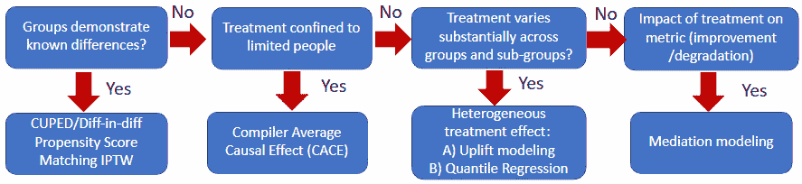

图 14.4 – 不同的因果推理方法

前图中描述的方法可以用来消除选择偏差。选择偏差的例子发生在奖励活动中，当我们试图估计一封邮件的影响时：

+   不是所有在处理组中获得奖励的人都打开了它。

+   在处理组中打开奖励的人与没有得到奖励的对照组的人进行比较。

+   选择打开邮件或申请奖励的人可能与没有选择打开邮件或申请奖励的人有所不同。

为了避免选择偏差，我们可以比较整个处理组（或测试组），无论他们是否打开了邮件或使用了奖励程序。但这并不能避免稀释效应，在这种效应下，处理组中的个体（在多个处理组的背景下更为适用）被以不同的方式对待。为了应对并评估实际接受治疗的影响，我们可以使用**编译器平均因果效应**（**CACE**），其中 CACE 调整了**意图治疗效应**（**ITT**）（即被分配治疗的效应，也就是说，处于测试条件下的效应），并结合合规率。这是因为 ITT 参数低估了干预的效果。毕竟，某些个体在试验中可能偏离了他们分配的治疗。

这种调整有助于估计正在接受治疗或被考虑进行实验的子群体的治疗效应。这里的治疗指的是经历测试条件的实验组。CACE 框架依赖于假设，客户会打开邮件并使用奖励程序，而实际接受治疗（即接受奖励计划的客户群体）的效果驱动了结果变量。总结来说，CACE 通过**工具变量**（**IVs**）来运作，在无法进行可控实验时，它们决定因果关系。

这种情况发生在随机实验中，在这种情况下，治疗（在此背景下为奖励程序）无法实施，因此，无法将此类治疗的影响传递给每个单位。这里可以使用 CACE 框架及其工具变量（IVs）。IV 是一种第三方变量，帮助我们研究候选原因对结果的影响。

#### 当处理效应在不同群体之间存在差异时

零售巨头和运输即服务公司（如 Uber）有着非常不同的客户群体，以至于对一个客户群体实行的处理方法在其他群体中并不适用。推荐使用**异质处理效应估计**（**HTE**）方法进行因果推断，以识别可为所有人带来最大效益的定制体验。在该方法中，成功地部署了**条件平均处理效应**（**CATE**），通过对观察到的协变量进行条件运算来计算处理效应。该方法的主要目标是评估在接受处理时，哪个子群体将从中受益最大。评估通过 A/B 测试进行，其中实验数据用于训练模型。该指标代表提升成功，并通过计算目标组（接受处理的对象）与控制组之间的最大差异（或差值）来评估。Uber 通过使用其提升建模应用 HTE。分位数回归（估算响应变量的条件中位数）也很受欢迎。

**中介建模**是另一种著名的因果推断方法，旨在揭示处理和结果变量之间的“黑匣子”。换句话说，它解释了为何某事发生，从而帮助我们得出是否支持*因果*假设的结论。该机制通过将总处理效应分解为以下两部分来运作：

+   某一特定机制的假设，表示平均因果中介效应

+   其他机制显示了平均直接效应

此外，该方法突出了多个潜在机制的相对重要性，其中无形变量对企业的各个方面（包括收入和客户满意度）产生影响，并有助于制定长期和短期的措施来解决客户痛点。例如，当我们观察到客户在零售商那里经历订单延迟配送时，我们通常会假设这是由于客户参与度增加，客户频繁更改所订购的商品。然而，延迟也可能归因于大量订单的存在，这无可避免地推动了这一群体向更高的参与度发展：

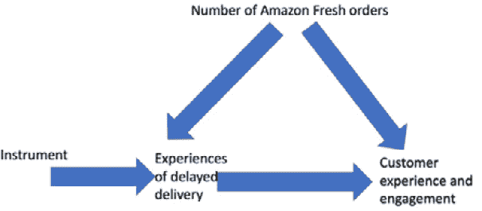

图 14.5 – 具有数据生成能力的因果图，用于展示一个工具/因素对候选因果变量的影响

在前面的图示中，我们可以看到一个因子与结果之间的混杂关系。用户的亚马逊生鲜订单数量表示治疗变量和感兴趣的结果之间存在一个后门路径（某种依赖关系）。因果推断支持观察性分析，我们试图阻止后门路径。这可以通过将订单数量限制为三到四个来实现。确定应该控制哪些变量以及不应该控制哪些变量需要领域专家和数据科学家的合作。此外，如果我们能识别出一个影响延迟交付对客户体验的结果的第三个变量，就可以解决由延迟交付与客户参与之间的后门路径导致的偏估计问题。

另一种已知的方法是**前门法**，在这种方法中，我们通过评估变量与感兴趣结果之间的关系来尝试估计该变量的影响。此方法依赖于中介原理，它要求引入一个介入变量（通常用于临床研究），该变量不同于治疗（即结果），并且通常被称为**因果中介分析**（**CMA**）。它在将治疗的总效应分解为直接效应和间接效应中起着重要作用。

因果建模的第一步是识别应该包含的变量。我们将因果建模技术应用于已识别的变量，比较处理组和未处理组在相关协变量上具有相同值的个体。比较的度量标准依赖于通过预测概率得分对变量的表示。这一概率帮助我们衡量治疗程序的有效性，称为倾向得分（propensity score）。

另一种流行的因果推断技术叫做**回归不连续性**方法。该方法帮助我们研究和评估回归线中的不连续性。干预发生点处的不连续性表明了干预的影响。该方法在确定不同级别的**动态定价**如何影响顾客是否从零售店购买商品或在 Uber 平台上预定行程方面非常有用。

以 Uber 为例，当我们研究因果效应时，我们必须意识到，在没有该效应的情况下，旅行请求率应该在一个明确的临界点两侧相等，例如引入加价定价时。这一假设成立的前提是，接近临界点的乘客在相关的混杂变量（影响独立和因变量的第三变量）上应该相似。此外，在引入加价定价时，如果旅行请求率在该点出现明显的断层现象，表明超过此价格点的加价对请求率产生了因果影响。

另一种类似的方法是分析候选因果事件前后的时间序列数据结果。这种方法称为**中断时间序列设计**，旨在预测事件发生的瞬间时间序列中可能发生的任何变化。用于因果推理的时间序列分析的流行方法有合成控制和贝叶斯结构时间序列。Google 提供的贝叶斯结构时间序列分析的流行库是 Causal Impact 包。

现在，让我们来看看因果建模在解决与供应链相关问题中的作用。

# 供应链应用案例

零售业中公平发挥关键作用的另一个重要方面是供应链。在零售商看到库存短缺和过剩的情况下，作为数据科学和机器学习专家，我们必须监督库存优化政策。因此，我们很可能根据实际需求和当前可用的库存容量来评估公平分配。以下是一些直接影响多个零售商公平库存履行（通过适当匹配供需，避免库存不足和过剩）的因素：

+   零售商的公平库存分配（例如，平等利润、相同的补货率，或者在处理需求不匹配时，供应的公平份额）。这一过程受比例分配政策的管理（在库存不足时最为有效）或库存稀缺以及多余库存的平等分配（用于库存过剩时）。

+   我们如何在行业中满足公平感知，包括公平定价和公平工资等要素。

为了进一步阐述在为多个零售商服务的综合供应链网络中的公平性，我们来考虑一个共享库存池，其中总库存按零售商级别进行分配，总成本在多个零售商位置之间分摊。库存补充和履约订单进入仓库，以下场景中会融入公平性约束：

+   来自多个零售商的总需求超过了可用的供应量。

+   多个供应商的总供应量超过了需求。

+   多个零售商从相同的供应商处获得库存。

+   基于市场需求，在多个零售商之间公平分配库存（受到每个零售商订购商品数量等其他条件的限制），以确保公平的利润分配。

除了在库存优化中引入公平性外，从伦理学角度来看，准确性和可解释性也变得十分重要。因为在供应链不同环节优化的库存分配能够最小化并预测供应商的运输延迟。此外，我们还可以追溯延迟的原因并提出补救措施。

在研究模型可解释性和可理解性时，*第十章*中提到，了解模型预测背后的根本原因能够帮助企业采取补救措施。通过识别漏洞的阶段和来源，复杂供应链中的百万美元损失由于延迟可以避免。例如，如*图 14.6*所示，在疫情期间，供应链管道发生了延迟，这可以归因于多种原因：


图 14.6 – 展示直接和虚假相关性的因果关系

主要的延迟因素是封锁和运营供应商数量减少。然而，这些主要的延迟因素可能导致其他延迟因素，如工厂停工、员工缺席，或者需要旅行通行证来运输货物。

为了解释因果关系，我们需要的是一种评估程序，不仅有助于确定相关性，还能够通过图形辅助因果发现过程，正如我们在这里所展示的。一旦我们获得了因果结构的图形表示，就更容易在问题的每个步骤中建议补救措施或分配资源。

在下一节中，我们将学习因果结构如何帮助我们进行供应链交付。

供应链管理的因果发现

因果图能够捕捉给定问题中不同变量之间的因果关系，突出系统中的关键参与者、他们在系统中的角色以及方向。典型供应链中的关键系统参与者包括以下几类：

+   订单数量和每个订单的数量

+   制造工厂的原材料供应和供应商的可用性

+   工厂的运营模式和在场工人的数量

+   成功的**采购订单**（**PO**）创建

+   一个高效的交付系统，能够确认交付数据

这些主要元素在因果图中共同作用，描述它们之间的相互关系，并阐明某一物品的需求是如何按提前/延迟的时间表到达目的地的，以及延迟对其他上游交付渠道的影响。因此，任何交付管道的延迟和不确定性都能得到更好的解释，这也能加速图形发现过程。不同变量在供给链管道两个不同阶段（采购订单创建和订单交付服务）对整体延迟的相对影响，可以通过下图最清晰地解释：

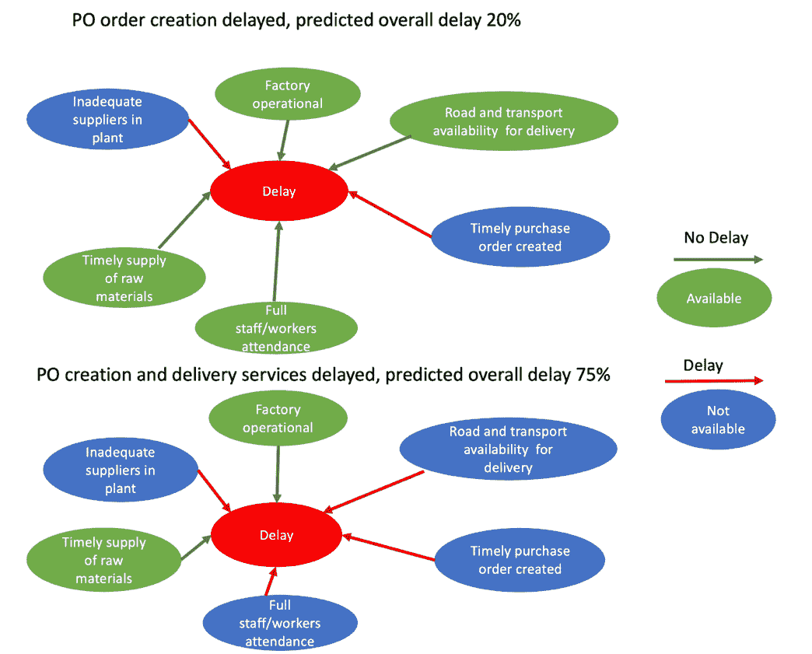

图 14.7 – 供给链生命周期中不同阶段交付延迟的因果图

我们可以进一步从因果图中提取**结构因果模型**（**SCM**），以解释变量之间的交互关系，正如*图 14.8*所示：

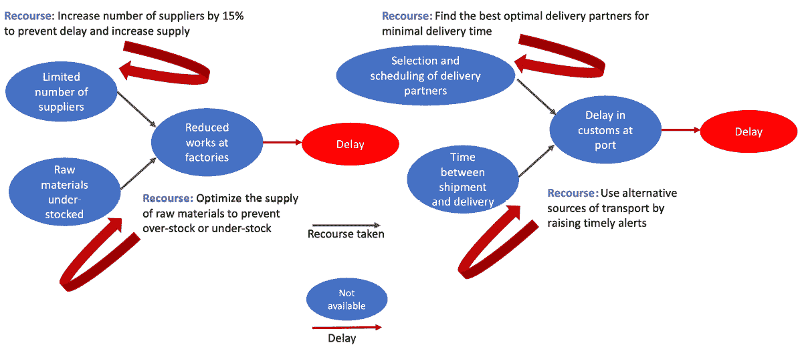

图 14.8 – 供给链生命周期中不同阶段针对某些订单的因果推断（CF）措施

在图的左侧，我们看到通过增加 15%的供应商数量并遵循最佳库存补充策略，我们可以缓解采购订单创建的延迟。在图的右侧，我们看到通过使用因果推断（CF）解释，我们可以发现最佳的交付合作伙伴和路线，以及替代的运输来源（例如，使用航空运输来避免在港口的延迟），这些都可以在因果图中发现。当系统具有实时监控功能时，可以触发因果推断措施，以驱动通过最佳路线尽可能快速到达目的地，从而使这些发现成为可能。

除了降低成本并为企业带来收入提升外，这些由因果图提供支持的因果推断措施还使我们能够了解应使用的适当**关键绩效指标**（**KPIs**），以减少成本并提高收入。

### 多方平台中的公平性

大规模的多方零售平台，如亚马逊、阿里巴巴和 Airbnb，为买家提供个性化的推荐，将他们与相关卖家连接起来。所提供的推荐服务应设计为促进公平，确保每个卖家的推荐物品数量均衡。这将确保小型卖家的商品也能获得公平的推荐机会。公平推荐的主要目标是最大化推荐效用（以便它们能够转化为现实世界中的购买），同时最小化物流成本。

在偏见渗透并且买家收到低效推荐以满足全球卖家的覆盖需求的情况下，公平的政策仍然遥不可及。在一个公平和理想的系统中，我们可以加入约束，以满足卖家的覆盖标准并同时考虑买家的目标，从而为每个买家提供高效的推荐。

现在，让我们来探讨一下**负责任的 AI**在**银行、金融服务和保险**（**BFSI**）行业中的重要作用。

## BFSI 中的应用案例

伦理 AI 的一个重要元素是可解释性，正如我们在*第九章*中讨论的那样。除了模型解释之外，如果我们能向模型设计师、决策者和关键利益相关者提供一种互动方式（调整模型超参数和特征），那么他们就可以调节模型的超参数并模拟不同情景下的数值特征，从而评估和最小化来自高风险金融模型的财务损失。在 BFSI 的背景下，这将为高风险决策的解释提供更高层次的细节，从而降低对生命的关键决策风险，如拒绝抵押贷款或汽车贷款。在这里，CF 解释起着重要作用，一致且可解释的解释可以帮助*审问*模型，找到可以逆转模型决策所需的改变。

以下是 CF 在 BFSI 中一些突出的应用案例：

+   **交易**：CFs 用于分析不同交易的潜在后果以及不同投资策略的潜在风险和回报。例如，AI 系统可以用来分析历史数据并识别可能表明盈利交易机会的模式。然后，CF 分析可以用来理解如果进行不同的交易可能发生什么，并根据这一分析优化交易策略。

+   **投资组合优化**：通过分析不同资产配置的潜在后果，优化金融投资组合的组成。例如，AI 利用历史数据来识别可能表明不同资产相对表现的模式。然后，CF 分析可以用来理解如果不同资产被纳入投资组合可能会发生什么，并基于这一分析优化投资组合。

+   **风险管理**：了解并减轻金融系统中的风险，包括市场风险、信用风险或操作风险。然后，可以使用 CF 分析来理解如果采用不同的风险管理策略，可能会发生什么，并基于此分析优化风险管理。

现在，让我们看看 CF 解释库如何使用。

### CF 解释库的功能

在探索了 BFSI（银行、金融服务和保险）行业中 CF 的一些应用案例后，我们来看一个在贷款申请授予过程中使用 CF 解释的实际示例。我们的示例将使用**Diverse Counterfactual Explanations**（**DiCE**）库。

DiCE 是一个 Python 库，它通过呈现相同输入特征的不同扰动版本来帮助我们传达必要的解释，从而产生不同的结果。在金融机构拒绝贷款等应用场景中，DiCE 能够展示使用给定机器学习模型对同一贷款申请者进行一系列特征扰动的效果。

这可以通过展示拒绝并非最终决定，给客户提供如何提高贷款获批机会的方向，增强客户的信心。例如，如果 DiCE 的 CF（反事实解释）显示“*如果收入增加了 1 万美元，客户将获得贷款*”，这将有助于决策者评估贷款申请的可信度，并同时指导他们理解驱动结果的必要条件（如现有贷款或收入）。例如，基于多个输入的贷款拒绝 CF 解释，有助于评估公平性标准，并减少错误。

然而，DiCE 在生成多样且可行的 CF 解释时面临两大挑战。因此，DiCE 的扩展版本**DiCE4EL**（即**DiCE for Event Logs**，详见[`icpmconference.org/2021/wp-content/uploads/sites/5/2021/09/DiCE4EL_-Interpreting-Process-Predictions-using-a-Milestone-Aware-Counterfactual-Approach.pdf`](https://icpmconference.org/2021/wp-content/uploads/sites/5/2021/09/DiCE4EL_-Interpreting-Process-Predictions-using-a-Milestone-Aware-Counterfactual-Approach.pdf)）应运而生，它通过捕捉和解释中间阶段的日志（例如金融机构的贷款申请日志）和事件，帮助对过程预测进行 CF 解释。DiCE 使用一种通用的神经网络架构，通过考虑静态和动态特征来预测下一个事件。我们可以利用这一架构解决长期过程执行日志的理解问题。此外，通过引入在训练集内搜索有效 CF 并将这些信息应用于损失函数，DiCE 解决了优化带有分类变量的 CF 搜索的困难。

现在，让我们通过 DiCE 来查看如何评估客户贷款申请中的不同特征扰动。这里使用的模型无关的技术应用了黑箱分类器。损失函数优化依赖于根据距离（以及稀疏性、多样性和可行性）对给定点附近的其他点进行采样：

1.  首先，我们需要导入 CF 分析所需的库，并加载成人收入数据集：

    ```py
    import dice_ml
    from dice_ml.utils import helpers
    from sklearn.pipeline import Pipeline
    from sklearn.ensemble import RandomForestClassifier
    dataset = helpers.load_adult_income_dataset()
    d = dice_ml.Data(dataframe=dataset, continuous_features=['age', 'hours_per_week'], outcome_name='income')
    ```

1.  在对特征进行标准化缩放和独热编码处理后，我们必须使用`RandomForestClassifier`来训练模型：

    ```py
    clf = Pipeline(steps=[('preprocessor', transformations),('classifier', RandomForestClassifier())])
    model = clf.fit(x_train, y_train)
    ```

1.  接下来，我们必须将训练好的 ML 模型提供给 DiCE 的模型对象，以生成多样化的 CFs：

    ```py
    backend = 'sklearn'
    m = dice_ml.Model(model=model, backend=backend)
    exp_random = dice_ml.Dice(d, m, method="random")
    dice_exp_random = exp_random.generate_counterfactuals(query_instances, total_CFs=2, desired_class="opposite", verbose=False)
    ```

这是输出结果：

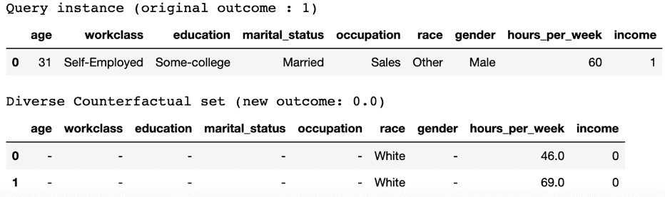

图 14.9 – 使用随机采样生成的 CFs

使用随机采样，我们可以生成比 DiCE 当前实现更加不稀疏的 CFs。然而，增加`total_CFs`确实会增加 CF 的稀疏度。

1.  现在，我们必须选择特征范围，以展示在 CF 生成过程中，如何精确控制作为输入参数的连续特征范围（`permitted_range`）。我们可以使用`features_to_vary`参数设置如`['age','workclass','education','occupation','hours_per_week']`等特征：

    ```py
    dice_exp_random = exp_random.generate_counterfactuals(
    query_instances, total_CFs=4, desired_class="opposite",permitted_range={'age': [22, 50], 'hours_per_week': [40, 60]})
    ```

它的显示方式如下：

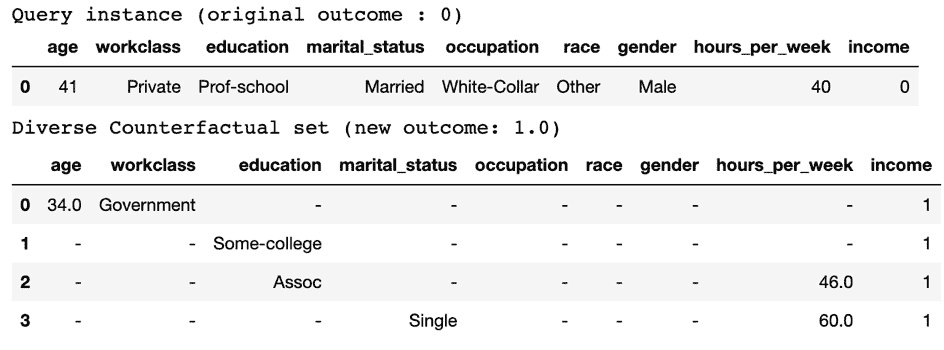

图 14.10 – 使用特征范围（permitted_range）生成的 CFs

为了在接近性和多样性目标之间找到平衡，我们尝试只生成那些对用户可行的 CF 解释。在这里，接近性和多样性帮助我们理解数据与原始输入的相似度，反映出被显著修改的数据如何影响 CF 解释。我们还尝试设置足够的多样性，以便模型可以在多个可能的选项中做出选择。在这里，使用 DiCE 时，我们已将`proximity_weight`（默认值为`0.5`）和`diversity_weight`（默认值为`1.0`）分别调整了接近性和多样性。然而，随着我们研究 CF 如何变化，仍可以进一步调整它们：

```py
query_instance = pd.DataFrame({'age': 25, 'workclass': 'Private', 'education': 'HS-grad', 'marital_status': 'Single','occupation': 'Service', 'race': 'White', 'gender': 'Female',
'hours_per_week': 45}, index=[0])
r_exp = dice_ml.Dice(d, m)
dice_exp = r_exp.generate_counterfactuals(query_instance, total_CFs=4, desired_class="opposite", proximity_weight=1.5, diversity_weight=1.0)
dice_exp.visualize_as_dataframe(show_only_changes=True)
```

它的显示方式如下：

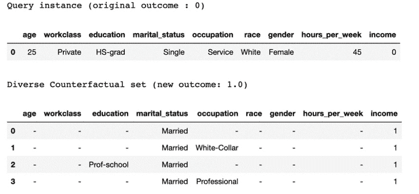

图 14.11 – 使用接近性和多样性参数生成的 CFs

上述输出显示了一个多样化的 CF 集，这些 CF 是从原始数据中生成的，其中**收入**值被翻转，**教育水平**从**高中文凭**变为**职业学校**，**婚姻状况**从**单身**变为**已婚**，而**职业**从**服务业**变为**白领**或**专业人员**。这种替代或多样性帮助银行职员向贷款申请人解释什么因素可能会改变模型的结果。换句话说，它们解释了如果贷款被批准而不是被拒绝，哪些条件可能会发生变化。

在这个例子中，我们了解了如何通过反转目标收入列，从输入查询中生成不同类型的 CFs。我们现在熟悉了模型如何为决策提供建议，以及我们如何与它们互动。在这个基础上，让我们了解一下被误用的机器学习模型如何对 BFSI 行业中的客户构成威胁。接下来我们要讨论的一个强大威胁是深度伪造。

## 深度伪造

无论是在零售、银行还是金融领域，人工智能的一个应用需要负责任的使用，那就是深度伪造技术。深度伪造是通过深度学习方法生成的逼真伪造视频、音频或照片，内容涉及真人。这些生成的合成视频、音频和照片通过对大量数据进行模型训练而获得，其中的模型版本代表了实际人物没有参与的行为或话语。当原始行为被修改时，深度伪造技术带来了前所未有的威胁，可能被用来冒充个人，导致欺诈性电话或视频会议。例如，使用合成的 CEO 声音指示员工转移资产或资金。更高层次的安全漏洞也可能发生，通过音频或视频会议对客户进行合成冒充，可能导致关于项目或组织的敏感信息被转移。

现在，让我们看看深度伪造技术带来的银行和金融领域的潜在威胁：

+   作为洗钱计划的一部分，创建虚假账户。在这种情况下，犯罪分子可能大规模伪造身份，攻击多个账户，并使全球金融服务瘫痪，导致全球损失达到 34 亿美元 ([`www.finextra.com/blogposting/23223/why-deepfake-fraud-losses-should-scare-financial-institutions`](https://www.finextra.com/blogposting/23223/why-deepfake-fraud-losses-should-scare-financial-institutions))。

+   使用“幽灵欺诈”技术，犯罪分子利用已故人员的个人数据，控制他们的在线账户和服务，包括信用卡、储蓄账户、抵押贷款和汽车贷款。

+   合成身份欺诈，指的是犯罪分子通过融合虚假、真实和被盗的信息，创造出不存在于现实中的虚假身份。合成身份欺诈是增长最快的金融犯罪类型。

然而，尽管存在深度伪造技术的滥用，我们也看到了其在零售、电商和时尚领域的几个优势。Facebook Shops 和 Google Shopping 平台利用深度伪造技术接触中小型零售商，通过电子商务平台促进销售。例如，Cadbury 使用基于人工智能的机器学习模型重现了一位流行演员的面部和声音，声音非常接近该演员的原声，甚至能喊出本地商店或品牌的名称。零售商正在探索逼真的数字模型和 **生成对抗网络**（**GANs**）的力量，以为客户创造更好的体验。深度伪造模型展示了不同肤色、身高和体重的服装，吸引更广泛的顾客群体。因此，中小型零售商能够节省成本，充分利用沉浸式逼真平台（如 Unreal Engine）的能力，生成实时模型和背景。

为了确保安全性和隐私，组织需要牢记以下准则，以防止深度伪造带来的威胁：

+   企业安全团队应使用有效的网络安全策略，结合网络安全和社交媒体监控工具，监控支付和转账。

+   组织应教育员工关于深度伪造技术的知识。组织内的所有员工应了解如何检测深度伪造，例如识别其中人物的不一致性或不自然的动作。

+   应用生物特征识别和在线面部验证技术，以验证和认证现有用户和新用户。

现在你已经了解了人工智能在 BFSI 中的角色，让我们来看一下医疗行业中的不同应用案例。

# 医疗领域的应用案例

当我们深入探讨人工智能在医疗行业中的伦理使用时，我们应了解疾病的早期检测和治疗如何与伦理人工智能相关。以下是一些例子：

+   人工智能可以通过 X 射线、CT 扫描和 MRI 影像技术支持诊断。

+   在疾病发展早期阶段检测癌症、肿瘤和其他恶性细胞。

+   进行实验，确定治疗是否有效。

+   监控患者，识别疾病的复发或缓解。

下图展示了基于人工智能的深度学习算法如何帮助在训练过的图像（放射科医生和医生标记为疑似癌症的图像）上识别脑肿瘤中 IDH1 基因突变的存在 ([`www.cancer.gov/news-events/cancer-currents-blog/2022/artificial-intelligence-cancer-imaging`](https://www.cancer.gov/news-events/cancer-currents-blog/2022/artificial-intelligence-cancer-imaging))：

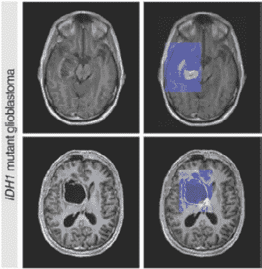

图 14.12 – MRI 扫描预测脑肿瘤中 IDH1 基因突变的存在

在预测高风险疾病的存在时，我们应设计符合医疗标准的系统。让我们研究一个使用 Google Cloud 的参考架构，它符合这些标准。

## 使用 Google Cloud 的医疗系统架构

现在，让我们研究设计一个符合规定的大规模分布式医疗系统所需的不同云组件，用于存储医疗数据和疾病诊断：

+   从放射学检查中获得的 DICOM 影像数据可以通过 Cloud Healthcare DICOM API 导入，方便搜索和检索。该 API 还提供元数据提取和数据整合（存储在 BigQuery 中）功能，以推断疾病预测和临床调查的高级见解。

+   遵守行业范围内的医疗标准：

    +   **FHIR**：一种新兴的医疗数据交换标准

    +   **HL7v2**：最流行的医疗系统集成方法

    +   **DICOM**：放射学和影像领域的主导标准

此外，它还支持使用 Cloud Healthcare API 和 Cloud Dataflow 将数据格式从 HL7v2 转换为 FHIR 格式的功能。此外，它符合美国的 HIPAA、加拿大的 PIPEDA 以及其他全球隐私标准。

+   配备用于检测新数据到达并通过 Cloud Pub/Sub 向应用程序发送通知的单元。这使得与 HL7v2 消息解析栈的无缝集成成为可能。

+   数据去标识化（通过删除或转换）服务，用于保护敏感数据元素，这些元素可以用于分析、机器学习模型和其他使用案例。

+   与 Cloud Datalab 和 Cloud ML 的集成，以探索大规模数据集并在 Cloud Healthcare API 数据集存储的 DICOM 放射学和自然光图像上进行训练：

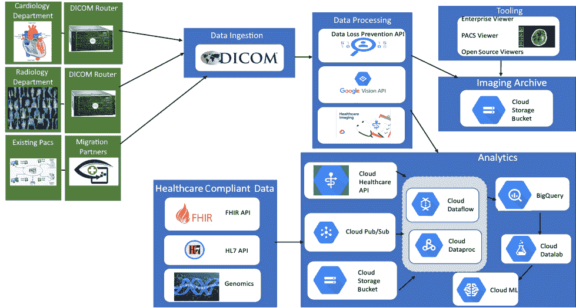

图 14.13 – 使用 Google Cloud 的医疗保健系统架构

现在，让我们学习如何在疾病进入缓解期之前、患者或患者群体进展到死亡之前（例如，在 COVID-19 期间），或者在临床试验中评估不同治疗方法时，构建负责任的人工智能系统。在这些情况下，我们需要利用生存分析来开发人工智能模型。

## 负责任的人工智能在医疗保健应用中的生存分析

负责任的人工智能在医疗保健领域的应用需要准确预测不良事件的发生或可能性，如疾病、住院和死亡。为了解决这些问题，我们通常使用生存分析，这是一种统计方法，可以预测故障的时间和事件的发生时间。此外，生存分析能够处理审查问题（即缺失数据问题），当预期事件在研究期间未发生时，可能是因为感兴趣的对象未参与研究，或在研究结束之前就退出了研究。在这种情况下，研究人员可能只拥有部分关于患者生存时间的数据，例如，在大流行期间，发现患者因病毒以外的疾病而死亡的情况。一个例子是，当研究人员想研究患者开始显示病毒感染迹象的平均时间时，由于缺乏有效的数据收集过程，未能获得个体的完整数据，导致数据缺失。

以下是我们构建负责任的生存分析模型所需具备的关键能力：

+   在领域转移场景下的生存回归调整

+   对审查数据的分析及不同审查理论的影响研究

+   CF 和治疗影响的估计与评估

+   亚组发现和表型化，用于识别和分层不同组的风险因素

+   每个个体都有多个时间依赖和时间变化的协变量观测值，这有助于在估计事件发生时间预测时发现时间依赖性：

+   虚拟双胞胎生存回归（虚拟双胞胎能够通过增强体验实现对整个环境的可视化、建模和仿真）以理解个体行为及对干预措施的异质性治疗效果的响应：

现在，让我们看一个使用 Cox 比例风险深度神经网络与开源`auton-survival`包的例子。这个包帮助评估模型中患者的协变量与治疗效果之间的相互作用（通过比例风险比），并作为建议个性化治疗推荐的机制。我们开始吧：

1.  我们先从所需的库导入开始。请注意，在这个例子中，我们使用的是`SUPPORT`数据集，该数据集附带了`auton-survival`包：

    ```py
    from auton_survival.estimators import SurvivalModel
    from auton_survival.metrics import survival_regression_metric
    from sklearn.model_selection import ParameterGrid
    from estimators_demo_utils import plot_performance_metrics
    ```

1.  接下来，我们将创建`SurvivalModel`对象，并使用`fit`函数来训练模型。我们在这里设置的`times`变量用于在一定时期内调优模型的超参数。我们还提供了用于训练的代码，并展示了从这里定义的`param_grid`参数中选定参数的输出：

    ```py
    param_grid = {'bs': [100, 200],
                  'learning_rate': [ 1e-4, 1e-3],
                  'layers': [ [100], [100, 100]]
         }
    params = ParameterGrid(param_grid)
    times = np.quantile(y_tr['time'][y_tr['event']==1], np.linspace(0.1, 1, 10)).tolist()
    model = SurvivalModel('dcph', random_seed=0, bs=param['bs'], learning_rate=param['learning_rate'], layers=param['layers'])
    model.fit(x_tr, y_tr)
    ```

1.  我们还必须计算验证集上的生存概率，并提供**集成 Brier** **分数**（**IBS**）：

    ```py
    predictions_val = model.predict_survival(x_val, times)
    metric_val = survival_regression_metric('ibs', y_val, predictions_val, times, y_tr)
    ```

1.  接下来，我们必须获取测试集上的生存概率。此外，我们还需要获取特定模型在选定超参数下的预测结果。`times`变量帮助我们获取在某个时刻使用的模型超参数：

    ```py
    predictions_te = model.predict_survival(x_te, times)
    ```

1.  最后，我们必须评估测试集上的 IBS 和时间依赖一致性指数。这将决定模型的表现：

    ```py
    results = dict()
    results['Brier Score'] = survival_regression_metric('brs', outcomes=y_te, predictions=predictions_te, times=times, outcomes_train=y_tr)
    results['Concordance Index'] = survival_regression_metric('ctd', outcomes=y_te, predictions=predictions_te, times=times, outcomes_train=y_tr)
    plot_performance_metrics(results, times)
    ```

在模型超参数集上的最终模型性能统计信息如下图所示：

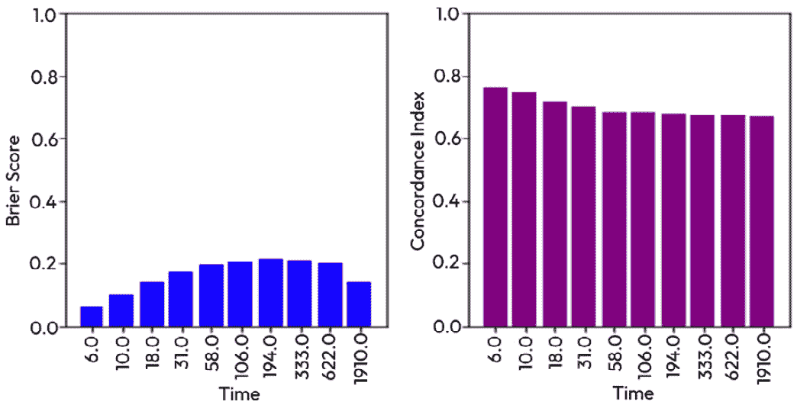

图 14.14 – 模型性能过度调优与超参数：

在前面的示例中，我们学习了如何使用 DeepSurv（一个由网络权重参数化的前馈深度神经网络）评估个人的失败风险（对治疗无反应，有时会导致死亡），通过利用患者协变量对其风险率的影响。在医疗保健行业，这有助于提供个性化的治疗方案/建议，让我们可以研究个人如何根据特定的治疗对评估的风险率做出反应。此外，我们还可以通过创建目标组（接受治疗建议）和对照组（不接受治疗建议）进行 A/B 测试。我们可以对这两组的结果进行 Log-rank 检验，以验证两个子集之间的差异是否显著，从而代表治疗建议的有效性。

现在我们已经理解了生存分析模型在负责任 AI 中的作用，让我们总结一下本章所学的内容。

# 总结

在本章中，我们考察了与零售、供应链、BFSI 和医疗保健领域相关的多种 AI 应用案例。我们了解了零售商必须遵守的隐私法律规定和标准，并且作为负责任 AI 的倡导者，我们理解了动态定价的正面和负面后果，以及如何实现公平定价。接下来，我们深入研究了 CF（因果推断）的概念及其在零售、供应链、BFSI 和医疗保健行业中的不可或缺的应用。通过实例，我们学习了 CF 如何帮助我们评估营销活动、计算零售行业的转化率、了解延迟的影响并减轻供应链管道中的延迟。我们还基于实际案例研究了贷款申请过程，并生成了多种 CF，观察它们如何影响贷款申请的批准/拒绝。

我们还理解了审计和负责任的 AI 法规对深度伪造技术、聊天机器人和 AR/VR/XR 媒体的必要性。这些创新可能通过歧视性和不道德的滥用危及人们的生命。接下来，我们研究了如何构建可扩展、合规和分布式的医疗保健系统架构。最后，我们深入了解了生存回归模型以及它如何帮助我们评估和建议有效的患者治疗方法。

到此为止，我们已经涵盖了平台和模型设计的相关概念。希望你能激励自己继续扩展从本书中获得的知识，保持学习！

我们希望你喜欢阅读这本书。随着 ChatGPT 的到来，虽然负责任 AI 目前是其中的重要方面，但我们没有涵盖与大型语言模型（LLM）、元宇宙和区块链设计相关的 AI 伦理问题。希望未来的版本能够涵盖这些内容。

# 深入阅读

要了解本章涵盖的主题，请查看以下资源：

+   *人工智能中的公平成本：来自电子商务的证据 – Moritz von Zahn, Stefan Feuerriegel, 和 Niklas* *Kuehl*：[`aisel.aisnet.org/cgi/viewcontent.cgi?article=1681&context=bise`](https://aisel.aisnet.org/cgi/viewcontent.cgi?article=1681&context=bise)

+   *利用因果推断改善 Uber 用户* *体验*：[`www.uber.com/blog/causal-inference-at-uber/`](https://www.uber.com/blog/causal-inference-at-uber/)

+   *人工智能如何帮助公司更* *道德地* 设置价格：[`hbr.org/2021/03/how-ai-can-help-companies-set-prices-more-ethically`](https://hbr.org/2021/03/how-ai-can-help-companies-set-prices-more-ethically)

+   *基于因果 AI 的供应链根本原因分析*：[`medium.com/causalens/supply-chain-root-cause-analysis-with-causal-ai-be73c78441f2`](https://medium.com/causalens/supply-chain-root-cause-analysis-with-causal-ai-be73c78441f2)

+   *DeepSurv: 个性化治疗推荐系统，基于 Cox 比例风险深度神经* *网络*：[`bmcmedresmethodol.biomedcentral.com/articles/10.1186/s12874-018-0482-1`](https://bmcmedresmethodol.biomedcentral.com/articles/10.1186/s12874-018-0482-1)

+   *人工智能能否帮助以全新且更好的方式* *发现癌症？*：[`www.cancer.gov/news-events/cancer-currents-blog/2022/artificial-intelligence-cancer-imaging`](https://www.cancer.gov/news-events/cancer-currents-blog/2022/artificial-intelligence-cancer-imaging)

+   *auton-survival: 一个开源包，用于回归、反事实估计、评估和带有审查的事件时间数据的表型*：[`www.cs.cmu.edu/~chiragn/papers/auton_survival.pdf`](https://www.cs.cmu.edu/~chiragn/papers/auton_survival.pdf)

+   *人工智能中的公平成本：来自* *电子商务* 的证据：[`link.springer.com/article/10.1007/s12599-021-00716-w`](https://link.springer.com/article/10.1007/s12599-021-00716-w)

+   *库存分配中的公平理想*：[`onlinelibrary.wiley.com/doi/full/10.1111/deci.12540`](https://onlinelibrary.wiley.com/doi/full/10.1111/deci.12540)

+   *印度辩论肤色偏见，美容公司调整* *广告*：[`www.nytimes.com/2020/06/28/world/asia/india-skin-color-unilever.html`](https://www.nytimes.com/2020/06/28/world/asia/india-skin-color-unilever.html)

+   *虚拟现实和增强现实中的现实主义伦理*：[`www.frontiersin.org/articles/10.3389/frvir.2020.00001/full`](https://www.frontiersin.org/articles/10.3389/frvir.2020.00001/full)

+   *虚拟现实和增强现实的风险是什么，ANSES* *推荐什么良好实践？*：[`www.anses.fr/en/content/what-are-risks-virtual-reality-and-augmented-reality-and-what-good-practices-does-anses`](https://www.anses.fr/en/content/what-are-risks-virtual-reality-and-augmented-reality-and-what-good-practices-does-anses)

+   *Google Cloud Platform: 医疗解决方案* *操作手册*：[`cloud.nih.gov/resources/guides/science-at-cloud-providers/science-on-gcp/GCPHealthcareSolutionsPlaybook.pdf`](https://cloud.nih.gov/resources/guides/science-at-cloud-providers/science-on-gcp/GCPHealthcareSolutionsPlaybook.pdf)
