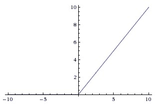

# 第一章：深度神经网络 - 概述

在过去的几年中，我们在人工智能（深度学习）领域取得了显著进展。今天，深度学习是许多先进技术应用的基石，从自动驾驶汽车到艺术和音乐创作。科学家们旨在帮助计算机不仅能理解语音，还能用自然语言进行对话。深度学习是一种基于数据表示学习的方法，而不是任务特定的算法。深度学习使计算机能够从更简单、更小的概念构建复杂的概念。例如，深度学习系统通过将较低层次的边缘和角点组合起来，并以分层方式将它们组合成身体部位，从而识别一个人的图像。那一天已经不远了，深度学习将扩展到能够让机器独立思考的应用中。

在本章中，我们将涵盖以下主题：

+   神经网络的构建模块

+   TensorFlow 简介

+   Keras 简介

+   反向传播

# 神经网络的构建模块

神经网络由许多人工神经元组成。它是大脑的表现形式，还是某些知识的数学表示呢？在这里，我们将简单地尝试理解神经网络在实践中的应用。**卷积神经网络**（**CNN**）是一种非常特殊的多层神经网络。CNN 旨在直接从图像中识别视觉模式，且处理过程最小。该网络的图示如下所示。神经网络领域最初受到建模生物神经系统目标的启发，但此后它已朝着不同方向发展，并成为机器学习任务中工程学和获得良好结果的关键。

人工神经元是一个接受输入并产生输出的函数。所使用的神经元数量取决于当前任务的需求。它可能少至两个神经元，也可能多达几千个神经元。连接人工神经元以创建卷积神经网络（CNN）的方式有很多种。常用的拓扑结构之一是**前馈网络**：


每个神经元从其他神经元接收输入。每条输入线对神经元的影响由权重控制。权重可以是正数也可以是负数。整个神经网络通过理解语言来学习执行有用的计算以识别物体。现在，我们可以将这些神经元连接成一个被称为前馈网络的网络。这意味着每一层的神经元将它们的输出传递到下一层，直到得到最终输出。可以写成如下形式：


上述前向传播的神经元可以通过以下方式实现：

```py
import numpy as np
import math

class Neuron(object):
    def __init__(self):
        self.weights = np.array([1.0, 2.0])
        self.bias = 0.0
    def forward(self, inputs):
        """ Assuming that inputs and weights are 1-D numpy arrays and the bias is a number """
        a_cell_sum = np.sum(inputs * self.weights) + self.bias
        result = 1.0 / (1.0 + math.exp(-a_cell_sum)) # This is the sigmoid activation function
        return result
neuron = Neuron()
output = neuron.forward(np.array([1,1]))
print(output)
```

# TensorFlow 简介

TensorFlow 基于图计算。以以下数学表达式为例：

*c=(a+b)*, *d = b + 5*,

*e = c * d *

在 TensorFlow 中，这表示为计算图，如下所示。之所以强大，是因为计算可以并行执行：


# 安装 TensorFlow

有两种简单的方法可以安装 TensorFlow：

+   使用虚拟环境（推荐并在此处描述）

+   使用 Docker 镜像

# 对于 macOS X/Linux 变体

以下代码片段创建一个 Python 虚拟环境，并在该环境中安装 TensorFlow。运行此代码之前，您应先安装 Anaconda：

```py
#Creates a virtual environment named "tensorflow_env" assuming that python 3.7 version is already installed.
conda create -n tensorflow_env python=3.7 
#Activate points to the environment named "tensorflow"  
source activate tensorflow_env
conda install pandas matplotlib jupyter notebook scipy scikit-learn
#installs latest tensorflow version into environment tensorflow_env
pip3 install tensorflow 
```

请查看官方 TensorFlow 页面上的最新更新，[`www.tensorflow.org/install/`](https://www.tensorflow.org/install/)。

尝试在 Python 控制台中运行以下代码以验证您的安装。如果 TensorFlow 已安装并正常工作，控制台应打印 `Hello World!`：

```py
import tensorflow as tf

#Creating TensorFlow object 
hello_constant = tf.constant('Hello World!', name = 'hello_constant')
#Creating a session object for execution of the computational graph
with tf.Session() as sess:
    #Implementing the tf.constant operation in the session
    output = sess.run(hello_constant)
    print(output)
```

# TensorFlow 基础

在 TensorFlow 中，数据不是以整数、浮点数、字符串或其他基本类型存储的。这些值被封装在一个名为 **张量** 的对象中。它由一组基本值构成，这些值被塑形为任意维度的数组。张量的维度数量称为其 **秩**。在前面的示例中，`hello_constant` 是一个秩为零的常量字符串张量。以下是一些常量张量的示例：

```py
# A is an int32 tensor with rank = 0
A = tf.constant(123) 
# B is an int32 tensor with dimension of 1 ( rank = 1 ) 
B = tf.constant([123,456,789]) 
# C is an int32 2- dimensional tensor 
C = tf.constant([ [123,456,789], [222,333,444] ])
```

TensorFlow 的核心程序基于计算图的概念。计算图是由以下两部分组成的有向图：

+   构建计算图

+   运行计算图

计算图在 **会话** 中执行。TensorFlow 会话是计算图的运行时环境。它分配 CPU 或 GPU，并保持 TensorFlow 运行时的状态。以下代码使用 `tf.Session` 创建一个名为 `sess` 的会话实例。然后，`sess.run()` 函数计算张量并返回存储在 `output` 变量中的结果。最后输出 `Hello World!`：

```py
with tf.Session() as sess:
    # Run the tf.constant operation in the session
    output = sess.run(hello_constant)
    print(output)
```

使用 TensorBoard，我们可以可视化计算图。要运行 TensorBoard，请使用以下命令：

```py
tensorboard --logdir=path/to/log-directory
```

让我们创建一段简单的加法代码，如下所示。创建一个常量整数 `x`，其值为 `5`，然后将 `5` 加到一个新变量 `y` 中并打印结果：

```py
constant_x = tf.constant(5, name='constant_x')
variable_y = tf.Variable(x + 5, name='variable_y')
print (variable_y)
```

区别在于，`variable_y`并没有像 Python 代码中那样给出`x + 5`的当前值。它实际上是一个方程式；也就是说，当计算`variable_y`时，会取`x`在那个时间点的值，并加上`5`。在前面的代码中，`variable_y`的值并没有实际计算出来。这段代码实际上属于典型 TensorFlow 程序中的计算图构建部分。运行这段代码后，你会得到类似`<tensorflow.python.ops.variables.Variable object at 0x7f074bfd9ef0>`的内容，而不是`variable_y`实际的值`10`。为了解决这个问题，我们必须执行计算图的代码部分，代码如下：

```py
#initialize all variables
init = tf.global_variables_initializer()
# All variables are now initialized

with tf.Session() as sess:
    sess.run(init)
    print(sess.run(variable_y))
```

这里是一些基本数学函数的执行示例，如加法、减法、乘法和除法。更多数学函数，请参考文档：

访问 TensorFlow 数学函数，请查看[`www.tensorflow.org/versions/r0.12/api_docs/python/math_ops/basic_math_functions`](https://www.tensorflow.org/versions/r0.12/api_docs/python/math_ops/basic_math_functions)。

# 使用 TensorFlow 进行基本的数学运算

`tf.add()`函数接受两个数字、两个张量或每种一个，并返回它们的和作为一个张量：

```py
Addition
x = tf.add(1, 2, name=None) # 3
```

这是一个包含减法和乘法的示例：

```py
x = tf.subtract(1, 2,name=None) # -1
y = tf.multiply(2, 5,name=None) # 10

```

如果我们想使用非常量值该怎么办？如何将输入数据集传递给 TensorFlow？为此，TensorFlow 提供了一个 API，`tf.placeholder()`，并使用`feed_dict`。

`placeholder`是一个变量，数据稍后会在`tf.session.run()`函数中分配给它。通过这个方法，我们可以在不需要数据的情况下创建操作，并构建计算图。之后，这些数据通过`feed_dict`参数被传递到计算图中，从而设置`placeholder`张量。在以下示例中，在会话运行之前，张量`x`被设置为字符串`Hello World`：

```py
x = tf.placeholder(tf.string)

with tf.Session() as sess:
    output = sess.run(x, feed_dict={x: 'Hello World'})
```

也可以使用`feed_dict`设置多个张量，如下所示：

```py
x = tf.placeholder(tf.string)
y = tf.placeholder(tf.int32, None)
z = tf.placeholder(tf.float32, None)

with tf.Session() as sess:
    output = sess.run(x, feed_dict={x: 'Welcome to CNN', y: 123, z: 123.45}) 
```

占位符还可以在多维的帮助下存储数组。请参见以下示例：

```py
import tensorflow as tf

x = tf.placeholder("float", [None, 3])
y = x * 2

with tf.Session() as session:
    input_data = [[1, 2, 3],
                 [4, 5, 6],]
    result = session.run(y, feed_dict={x: input_data})
    print(result)
```

当传递给`feed_dict`参数的数据类型与张量类型不匹配且无法转换时，将抛出一个错误，例如`ValueError: invalid literal for...`。

`tf.truncated_normal()`函数返回一个从正态分布中生成的随机值的张量。它主要用于网络中的权重初始化：

```py
n_features = 5
n_labels = 2
weights = tf.truncated_normal((n_features, n_labels))
with tf.Session() as sess:
  print(sess.run(weights))
```

# TensorFlow 中的 softmax

softmax 函数将其输入值（称为**logit**或**logit 分数**）转换为 0 到 1 之间的值，并将输出值标准化，使其总和为 1。换句话说，softmax 函数将 logits 转换为概率。数学上，softmax 函数的定义如下：


在 TensorFlow 中，softmax 函数已经实现。它接受 logits 并返回与输入 logits 类型和形状相同的 softmax 激活，如下图所示：


以下代码用于实现这一点：

```py
logit_data = [2.0, 1.0, 0.1]
logits = tf.placeholder(tf.float32)
softmax = tf.nn.softmax(logits)

with tf.Session() as sess:
    output = sess.run(softmax, feed_dict={logits: logit_data})
    print( output )
```

我们在数学上表示标签的方式通常称为 **独热编码**。每个标签由一个向量表示，正确标签的值为 1.0，其它标签的值为 0.0。这种方式在大多数问题中都非常有效。然而，当问题中有数百万个标签时，独热编码就不太高效，因为大部分向量元素都是零。我们通过测量两个概率向量之间的相似度来衡量其距离，这个度量被称为 **交叉熵**，用 *`D`* 表示。

交叉熵是非对称的。这意味着：*D(S,L) != D(L,S)*

在机器学习中，我们通常通过一个数学函数来定义模型的“坏”与“好”。这个函数叫做 **损失**、**代价** 或 **目标** 函数。用来衡量模型损失的一个非常常见的函数是 **交叉熵损失**。这一概念来源于信息论（关于这一点的更多内容，请参考[`colah.github.io/posts/2015-09-Visual-Information/`](https://colah.github.io/posts/2015-09-Visual-Information/)）。直观地，如果模型在训练数据上的分类效果差，损失就会很高；反之，如果分类效果好，损失会很低，如下所示：


交叉熵损失函数

在 TensorFlow 中，我们可以使用 `tf.reduce_sum()` 来编写交叉熵函数；它接受一个数字数组并返回其和作为一个张量（见下方代码块）：

```py
x = tf.constant([[1,1,1], [1,1,1]])
with tf.Session() as sess:
    print(sess.run(tf.reduce_sum([1,2,3]))) #returns 6 
    print(sess.run(tf.reduce_sum(x,0))) #sum along x axis, prints [2,2,2]
```

但在实际操作中，在计算 softmax 函数时，由于指数的存在，某些中间项可能会非常大。因此，除法操作可能在数值上不稳定。我们应该使用 TensorFlow 提供的 softmax 和交叉熵损失 API。以下代码片段手动计算交叉熵损失，并使用 TensorFlow API 打印出相同的结果：

```py
import tensorflow as tf

softmax_data = [0.1,0.5,0.4]
onehot_data = [0.0,1.0,0.0]

softmax = tf.placeholder(tf.float32)
onehot_encoding = tf.placeholder(tf.float32)

cross_entropy = - tf.reduce_sum(tf.multiply(onehot_encoding,tf.log(softmax)))

cross_entropy_loss = tf.nn.softmax_cross_entropy_with_logits(logits=tf.log(softmax), labels=onehot_encoding)

with tf.Session() as session:
    print(session.run(cross_entropy,feed_dict={softmax:softmax_data, onehot_encoding:onehot_data} ))
    print(session.run(cross_entropy_loss,feed_dict={softmax:softmax_data, onehot_encoding:onehot_data} ))

```

# MNIST 数据集简介

这里我们使用 **MNIST**（**修改后的国家标准与技术研究院数据集**），它包含手写数字的图像及其标签。自 1999 年发布以来，这个经典数据集被用来作为分类算法的基准。

数据文件 `train.csv` 和 `test.csv` 包含从 0 到 9 的手绘数字，以灰度图像的形式展示。数字图像是一个数学函数，形式为 *f(x,y)=像素* 值。图像是二维的。

我们可以对图像执行任何数学函数。通过计算图像的梯度，我们可以测量像素值变化的速度和变化的方向。为了简化图像识别，我们将图像转换为灰度图像，并且只有一个颜色通道。**RGB**图像由三个颜色通道组成，**红色**、**蓝色**和**绿色**。在 RGB 颜色模式中，一幅图像是由三张图像（红色、蓝色和绿色）叠加而成的。在灰度颜色模式中，颜色不重要。彩色图像在计算上更难分析，因为它们在内存中占用更多空间。强度是图像明暗的度量，对于识别物体非常有用。在某些应用中，例如自动驾驶汽车应用中的车道线检测，颜色非常重要，因为需要区分黄色车道和白色车道。灰度图像无法提供足够的信息来区分白色和黄色车道线。

任何灰度图像都会被计算机解读为一个矩阵，每个图像像素对应一个条目。每幅图像的高度和宽度为 28 x 28 像素，总共有 784 个像素。每个像素都有一个单独的像素值与之相关联。这个像素值表示该像素的明暗程度。该像素值是一个从 0 到 255 的整数，其中零表示最暗，255 表示最亮，灰色像素的值在 0 和 255 之间。

# 最简单的人工神经网络

以下图像表示一个简单的两层神经网络：


简单的两层神经网络

第一层是**输入层**，最后一层是**输出层**。中间层是**隐藏层**。如果有多个隐藏层，那么这样的网络就是深度神经网络。

每个隐藏层中神经元的输入和输出与下一层中的每个神经元相连。每层的神经元数量可以根据问题的不同而有所不同。我们来看一个例子。一个简单的例子是你可能已经知道的流行手写数字识别，它用于检测一个数字，比如 5。该网络会接受一个数字 5 的图像，并输出 1 或 0。1 表示该图像确实是一个 5，0 则表示不是。网络一旦创建，就需要进行训练。我们可以先用随机权重初始化，然后输入已知的样本数据集（**training dataset**）。对于每个输入样本，我们检查输出，计算误差率，然后调整权重，使得每当它看到 5 时输出 1，而对其他任何数字输出 0。这种训练方法叫做**监督学习**，而调整权重的方法则叫做**反向传播**。在构建人工神经网络模型时，主要的考虑因素之一是如何选择隐藏层和输出层的激活函数。三种最常用的激活函数是 sigmoid 函数、双曲正切函数和**修正线性单元**（**ReLU**）。sigmoid 函数的优点在于它的导数可以在`z`上计算，其计算公式为`z`乘以 1 减去`z`。这意味着：

* dy/dx =σ(x)(1−σ(x)) *

这有助于我们以一种便捷的方式有效地计算神经网络中使用的梯度。如果某一层的逻辑函数的前馈激活值保存在内存中，那么该层的梯度可以通过简单的乘法和减法进行计算，而无需实现和重新计算 sigmoid 函数，因为这需要额外的指数运算。下图展示了 ReLU 激活函数，当*x < 0*时其值为零，而当*x > 0*时其值呈线性关系，斜率为 1：



ReLU 是一个非线性函数，其计算公式为*f(x)=max(0, x)*。这意味着对于负输入，ReLU 的值为 0，而对于所有*x >0*的输入，其值为`x`。这意味着激活函数的阈值设定在零（见前面左侧的图像）。TensorFlow 通过`tf.nn.relu()`实现 ReLU 函数：


反向传播（"backward propagation of errors"的缩写）是训练人工神经网络的一种常用方法，通常与优化方法如梯度下降法结合使用。该方法计算损失函数相对于网络中所有权重的梯度。优化方法会获取梯度并利用它更新权重，以减少损失函数。

# 使用 TensorFlow 构建单层神经网络

让我们一步一步地用 TensorFlow 构建一个单层神经网络。在这个例子中，我们将使用 MNIST 数据集。这个数据集包含 28 x 28 像素的手写数字灰度图像。数据集包括 55,000 条训练数据，10,000 条测试数据和 5,000 条验证数据。每个 MNIST 数据点包含两部分：一个手写数字的图像和一个对应的标签。以下代码块加载数据。`one_hot=True` 表示标签是 one-hot 编码的向量，而不是标签的实际数字。例如，如果标签是 `2`，你将看到 [0,0,1,0,0,0,0,0,0,0]。这使得我们可以直接在网络的输出层中使用它：

```py
from tensorflow.examples.tutorials.mnist import input_data
mnist = input_data.read_data_sets("MNIST_data/", one_hot=True)
```

设置占位符和变量的方法如下：

```py
# All the pixels in the image (28 * 28 = 784)
features_count = 784
# there are 10 digits i.e labels
labels_count = 10
batch_size = 128
epochs = 10
learning_rate = 0.5

features = tf.placeholder(tf.float32, [None,features_count])
labels = tf.placeholder(tf.float32, [None, labels_count])

#Set the weights and biases tensors
weights = tf.Variable(tf.truncated_normal((features_count, labels_count)))
biases = tf.Variable(tf.zeros(labels_count),name='biases')
```

让我们在 TensorFlow 中设置优化器：

```py
loss,
optimizer = tf.train.GradientDescentOptimizer(learning_rate).minimize(loss)    
```

在开始训练之前，让我们设置变量初始化操作和一个用于衡量预测准确度的操作，如下所示：

```py
# Linear Function WX + b
logits = tf.add(tf.matmul(features, weights),biases)

prediction = tf.nn.softmax(logits)

# Cross entropy
cross_entropy = -tf.reduce_sum(labels * tf.log(prediction), reduction_indices=1)

# Training loss
loss = tf.reduce_mean(cross_entropy)

# Initializing all variables
init = tf.global_variables_initializer()

# Determining if the predictions are accurate
is_correct_prediction = tf.equal(tf.argmax(prediction, 1), tf.argmax(labels, 1))
# Calculating prediction accuracy
accuracy = tf.reduce_mean(tf.cast(is_correct_prediction, tf.float32))
```

现在我们可以开始训练模型，代码如下所示：

```py
#Beginning the session
with tf.Session() as sess:
   # initializing all the variables
   sess.run(init)
   total_batch = int(len(mnist.train.labels) / batch_size)
   for epoch in range(epochs):
        avg_cost = 0
        for i in range(total_batch):
            batch_x, batch_y = mnist.train.next_batch(batch_size=batch_size)
            _, c = sess.run([optimizer,loss], feed_dict={features: batch_x, labels: batch_y})
            avg_cost += c / total_batch
        print("Epoch:", (epoch + 1), "cost =", "{:.3f}".format(avg_cost))
   print(sess.run(accuracy, feed_dict={features: mnist.test.images, labels: mnist.test.labels}))
```

# Keras 深度学习库概述

Keras 是一个 Python 中的高级深度神经网络 API，运行在 TensorFlow、CNTK 或 Theano 之上。

这里是一些你需要了解的 Keras 核心概念。TensorFlow 是一个用于数值计算和机器智能的深度学习库。它是开源的，并使用数据流图进行数值计算。数学操作由节点表示，多维数据数组（即张量）由图的边表示。这个框架极其技术性，因此对于数据分析师来说可能比较困难。Keras 使得深度神经网络编码变得简单，同时在 CPU 和 GPU 机器上运行也非常顺畅。

**模型** 是 Keras 的核心数据结构。顺序模型是最简单的模型类型，它由一系列按顺序堆叠的层组成。它提供了常见的功能，如 `fit()`、`evaluate()` 和 `compile()`。

你可以通过以下代码行创建一个顺序模型：

```py
from keras.models import Sequential

#Creating the Sequential model
model = Sequential()
```

# Keras 模型中的层

Keras 层就像神经网络层一样。有全连接层、最大池化层和激活层。可以使用模型的 `add()` 函数向模型中添加层。例如，一个简单的模型可以表示为以下内容：

```py
from keras.models import Sequential
from keras.layers.core import Dense, Activation, Flatten

#Creating the Sequential model
model = Sequential()

#Layer 1 - Adding a flatten layer
model.add(Flatten(input_shape=(32, 32, 3)))

#Layer 2 - Adding a fully connected layer
model.add(Dense(100))

#Layer 3 - Adding a ReLU activation layer
model.add(Activation('relu'))

#Layer 4- Adding a fully connected layer
model.add(Dense(60))

#Layer 5 - Adding an ReLU activation layer
model.add(Activation('relu'))
```

Keras 将自动推断第一层之后所有层的形状。这意味着你只需要为第一层设置输入维度。前面代码片段中的第一层 `model.add(Flatten(input_shape=(32, 32, 3)))` 将输入维度设置为 (32, 32, 3)，输出维度设置为 (3072=32 x 32 x 3)。第二层接收第一层的输出，并将输出维度设置为 (100)。这种将输出传递给下一层的链式过程一直持续到最后一层，即模型的输出。

# 使用 Keras 和 MNIST 进行手写数字识别

一个典型的数字识别神经网络可能有 784 个输入像素，连接到 1000 个隐藏层神经元，隐藏层再连接到 10 个输出目标——每个数字对应一个输出。每一层都与上一层完全连接。下面是这个网络的图形表示，其中`x`是输入，`h`是隐藏层神经元，`y`是输出类别变量：


在这个笔记本中，我们将构建一个神经网络来识别从 0 到 9 的手写数字。

我们正在构建的神经网络类型在许多现实世界应用中得到了应用，例如识别电话号码和按地址排序邮政邮件。为了构建这个网络，我们将使用**MNIST**数据集。

我们将按照以下代码开始，导入所有必需的模块，然后加载数据，最后构建网络：

```py
# Import Numpy, keras and MNIST data
import numpy as np
import matplotlib.pyplot as plt

from keras.datasets import mnist
from keras.models import Sequential
from keras.layers.core import Dense, Dropout, Activation
from keras.utils import np_utils
```

# 获取训练数据和测试数据

MNIST 数据集已经包含了训练数据和测试数据。训练数据有 60,000 个数据点，测试数据有 10,000 个数据点。如果您在`'~/.keras/datasets/' +`路径下没有数据文件，可以通过这个位置下载。

每个 MNIST 数据点都有：

+   一张手写数字的图像

+   一个对应的标签，是一个从 0 到 9 的数字，用于帮助识别图像

图像将被调用，并作为我们神经网络的输入，*`X`*；其对应的标签是*`y`*。

我们希望标签是**独热向量**。独热向量是由许多零和一个组成的向量。通过一个例子来看最为直观。数字 0 表示为[1, 0, 0, 0, 0, 0, 0, 0, 0, 0]，数字 4 表示为[0, 0, 0, 0, 1, 0, 0, 0, 0, 0]，这是一个独热向量。

# 扁平化数据

在这个示例中，我们将使用扁平化数据，或者也可以使用 MNIST 图像的一维表示，而非二维。这样，每个 28 x 28 像素的数字图像将被表示为一个 784 像素的一维数组。

通过扁平化数据，图像的二维结构信息会丢失；然而，我们的数据得到了简化。借助这一点，所有的训练数据都可以包含在一个形状为（60,000，784）的数组中，其中第一维表示训练图像的数量，第二维表示每张图像中的像素数。这样结构的数据可以用简单的神经网络进行分析，如下所示：

```py
# Retrieving the training and test data
(X_train, y_train), (X_test, y_test) = mnist.load_data()

print('X_train shape:', X_train.shape)
print('X_test shape: ', X_test.shape)
print('y_train shape:',y_train.shape)
print('y_test shape: ', y_test.shape)
```

# 可视化训练数据

以下函数将帮助您可视化 MNIST 数据。通过传入训练样本的索引，`show_digit`函数将显示该训练图像及其对应的标签：

```py
# Visualize the data
import matplotlib.pyplot as plt
%matplotlib inline

#Displaying a training image by its index in the MNIST set
def display_digit(index):
    label = y_train[index].argmax(axis=0)
    image = X_train[index]
    plt.title('Training data, index: %d,  Label: %d' % (index, label))
    plt.imshow(image, cmap='gray_r')
    plt.show()

# Displaying the first (index 0) training image
display_digit(0)
X_train = X_train.reshape(60000, 784)
X_test = X_test.reshape(10000, 784)
X_train = X_train.astype('float32')
X_test = X_test.astype('float32')
X_train /= 255
X_test /= 255
print("Train the matrix shape", X_train.shape)
print("Test the matrix shape", X_test.shape)

#One Hot encoding of labels.
from keras.utils.np_utils import to_categorical
print(y_train.shape)
y_train = to_categorical(y_train, 10)
y_test = to_categorical(y_test, 10)
print(y_train.shape)
```

# 构建网络

对于这个例子，您将定义以下内容：

+   输入层，您应该预期每一条 MNIST 数据都包含此层，因为它告诉网络输入的数量

+   隐藏层，它们识别数据中的模式，并将输入层与输出层连接起来

+   输出层，因为它定义了网络如何学习，并为给定图像提供标签输出，如下所示：

```py
# Defining the neural network
def build_model():
    model = Sequential()
    model.add(Dense(512, input_shape=(784,)))
    model.add(Activation('relu')) # An "activation" is just a non-linear function that is applied to the output
 # of the above layer. In this case, with a "rectified linear unit",
 # we perform clamping on all values below 0 to 0.

    model.add(Dropout(0.2))   #With the help of Dropout helps we can protect the model from memorizing or "overfitting" the training data
    model.add(Dense(512))
    model.add(Activation('relu'))
    model.add(Dropout(0.2))
    model.add(Dense(10))
    model.add(Activation('softmax')) # This special "softmax" activation,
    #It also ensures that the output is a valid probability distribution,
    #Meaning that values obtained are all non-negative and sum up to 1.
    return model

#Building the model
model = build_model()
model.compile(optimizer='rmsprop',
          loss='categorical_crossentropy',
          metrics=['accuracy'])
```

# 训练网络

现在我们已经构建了网络，我们将数据输入并进行训练，如下所示：

```py
# Training
model.fit(X_train, y_train, batch_size=128, nb_epoch=4, verbose=1,validation_data=(X_test, y_test))
```

# 测试

当你对训练输出和准确率感到满意时，你可以在**测试数据集**上运行网络，以衡量其性能！

请记住，只有在完成训练并对结果感到满意后，再执行此操作。

一个好的结果会获得**高于 95%的**准确率。已知一些简单的模型甚至可以达到 99.7%的准确率！我们可以测试模型，如下所示：

```py
# Comparing the labels predicted by our model with the actual labels

score = model.evaluate(X_test, y_test, batch_size=32, verbose=1,sample_weight=None)
# Printing the result
print('Test score:', score[0])
print('Test accuracy:', score[1])
```

# 理解反向传播

在这一部分，我们将理解反向传播的直觉。这是一种使用链式法则计算梯度的方法。理解这个过程及其细节对于你能够理解并有效地开发、设计和调试神经网络至关重要。

一般来说，给定一个函数*f(x)*，其中`x`是输入的向量，我们想要计算`f`在`x`处的梯度，记作*∇(f(x))*。这是因为在神经网络的情况下，函数`f`基本上是一个损失函数(`L`)，而输入`x`是权重和训练数据的组合。符号*∇*的发音为**nabla**：

*(xi, yi ) i = 1......N*

为什么我们要对权重参数计算梯度？

给定训练数据通常是固定的，而参数是我们可以控制的变量。我们通常计算参数的梯度，以便可以使用它来更新参数。梯度*∇f*是部分导数的向量，也就是说：

*∇f = [ df/dx, df/dy] = [y,x]*

总的来说，反向传播将包括：

+   执行前向传播操作

+   将模型的输出与期望的输出进行比较

+   计算误差

+   运行反向传播操作（反向传播），将误差传播到每个权重上

+   使用这个来更新权重，得到更好的模型

+   持续进行，直到我们得到一个良好的模型

我们将构建一个识别从 0 到 9 的数字的神经网络。这类网络应用被用于按邮政编码排序邮件、从图像中识别电话号码和门牌号、从包裹图像中提取包裹数量等等。

在大多数情况下，反向传播是在框架中实现的，例如 TensorFlow。然而，仅仅通过添加任意数量的隐藏层，反向传播并不总是会神奇地作用于数据集。事实上，如果权重初始化不当，这些非线性函数可能会饱和并停止学习。也就是说，训练损失会变得平稳并拒绝下降。这就是**梯度消失问题**。

如果你的权重矩阵`W`初始化得过大，那么矩阵乘法的输出可能也会有非常大的范围，这会导致向量`z`中的所有输出几乎都是二进制的：要么是 1，要么是 0。然而，如果是这种情况，那么`z`(1-z)*，即 sigmoid 非线性函数的局部梯度，将会在两种情况下都变为*零*（消失），这将导致`x`和`W`的梯度也为零。由于链式法则中的乘法，接下来的反向传播从这一点开始也会输出全零。

另一个非线性激活函数是 ReLU，它将神经元的值阈值化为零，如下所示。使用 ReLU 的全连接层的前向和反向传播核心包括：

```py
z = np.maximum(0, np.dot(W, x)) #Representing forward pass
dW = np.outer(z > 0, x) #Representing backward pass: local gradient for W
```

如果你观察一段时间，你会发现，如果一个神经元在前向传播中被限制为零（即*z = 0*，它不激活），那么它的权重将获得一个零梯度。这可能会导致所谓的**死 ReLU**问题。这意味着，如果一个 ReLU 神经元初始化时恰好从未激活，或者在训练过程中其权重因大的更新而进入这种状态，那么这个神经元将永远处于“死”状态。就像永久性的、不可恢复的脑损伤一样。有时，你甚至可以将整个训练集通过一个已训练的网络，最终意识到有很大一部分（大约 40%）的神经元一直是零。

在微积分中，链式法则用于计算两个或多个函数的复合函数的导数。也就是说，如果我们有两个函数`f`和`g`，那么链式法则表示它们复合函数*f ∘ g*的导数。该函数将`x`映射到*f(g(x))*，其导数可以通过`f`和`g`的导数及函数的乘积表示如下：


有一种更明确的方式可以通过变量来表示这一点。设*F = f ∘ g*，或者等价地，*F(x) = f(g(x)) *对所有的`x`都成立。然后也可以写作：

*F'(x) = f'(g(x))g'(x)。*

链式法则可以借助莱布尼茨符号以以下方式写出。如果变量`z`依赖于变量`y`，而`y`又依赖于变量`x`（如此`y`和`z`为依赖变量），那么`z`也通过中介变量`y`依赖于`x`。链式法则则表示：


*z = 1/(1 + np.exp(-np.dot(W, x)))* # 前向传播

*dx = np.dot(W.T, z*(1-z))* # 反向传播：`x`的局部梯度

*dW = np.outer(z*(1-z), x)* # 反向传播：`W`的局部梯度

下图左侧的前向传播通过输入变量 `x` 和 `y`，计算函数 *f(x,y)* 得到 `z`。图右侧表示反向传播。接收 *dL/dz*（即损失函数关于 `z` 的梯度），通过链式法则计算出损失函数对 `x` 和 `y` 的梯度，如下图所示：


# 总结

在本章中，我们奠定了神经网络的基础，并通过最简单的人工神经网络进行了讲解。我们学习了如何使用 TensorFlow 构建单层神经网络。

我们研究了 Keras 模型中各层的差异，并使用 Keras 和 MNIST 演示了著名的手写数字识别。

最后，我们理解了什么是反向传播，并使用 MNIST 数据集构建我们的网络，进行数据的训练和测试。

在下一章，我们将介绍卷积神经网络（CNN）。
