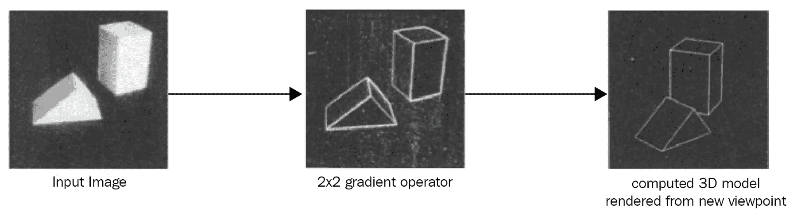
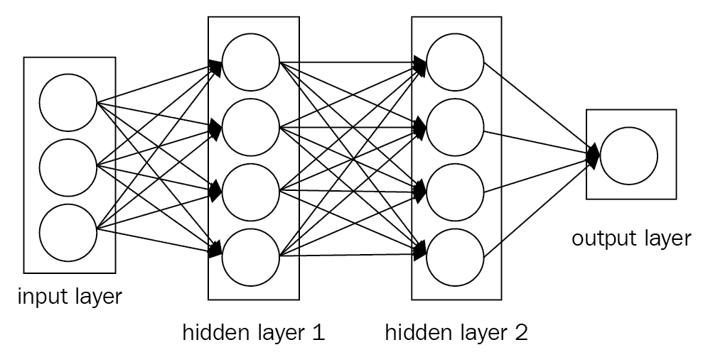
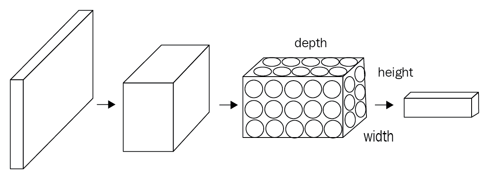
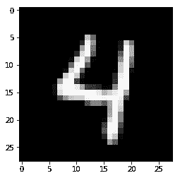
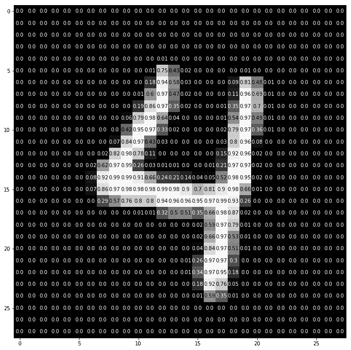
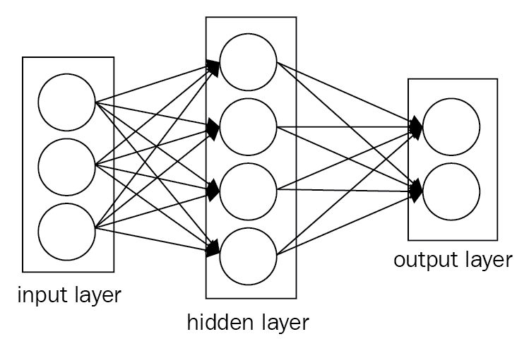
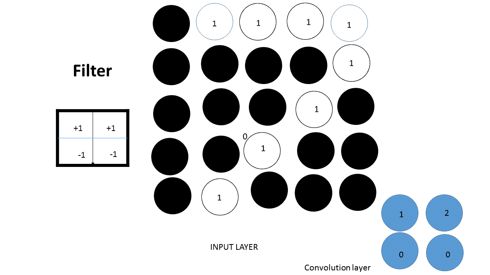
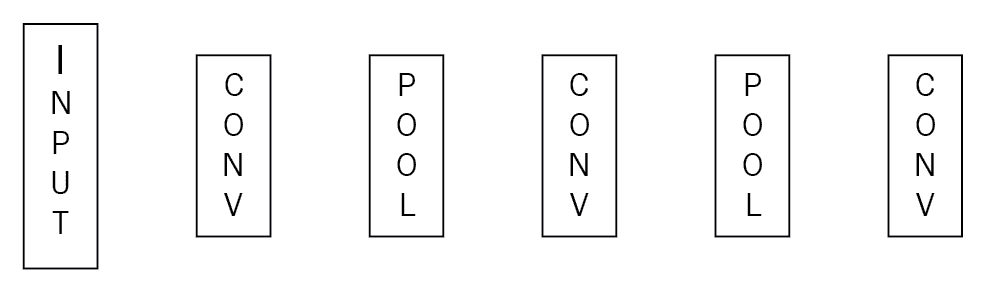

# 第二章：卷积神经网络简介

**卷积神经网络**（**CNNs**）无处不在。在过去五年中，由于引入了深度架构用于特征学习和分类，视觉识别系统的性能得到了显著提升。CNN 在多个领域取得了良好的表现，如自动语音理解、计算机视觉、语言翻译、自动驾驶汽车以及类似 Alpha Go 的游戏。因此，CNN 的应用几乎是无限的。DeepMind（来自谷歌）最近发布了 WaveNet，这是一种利用 CNN 生成模仿任何人类声音的语音的技术（[`deepmind.com/blog/wavenet-generative-model-raw-audio/`](https://deepmind.com/blog/wavenet-generative-model-raw-audio/)）。

在本章中，我们将涵盖以下主题：

+   CNN 的历史

+   CNN 概述

+   图像增强

# CNN 的历史

几十年来，机器识别图像的尝试层出不穷。模仿人脑的视觉识别系统在计算机中是一项挑战。人类的视觉是大脑中最难模仿且最复杂的感知认知系统。我们在这里不会讨论生物神经元，即初级视觉皮层，而是专注于人工神经元。物理世界中的物体是三维的，而这些物体的图像是二维的。在本书中，我们将介绍神经网络，而不借用大脑类比。1963 年，计算机科学家 Larry Roberts，也被称为**计算机视觉之父**，在他的研究论文《BLOCK WORLD》中描述了从物体的二维透视图中提取三维几何信息的可能性。这是计算机视觉领域的第一个突破。全球许多研究者在机器学习和人工智能领域跟随这项工作，并在 BLOCK WORLD 的背景下研究计算机视觉。人类能够识别物体，不论物体的朝向或光照发生何种变化。在这篇论文中，他指出，理解图像中的简单边缘形状是很重要的。他从方块中提取这些边缘形状，以使计算机理解这两个方块无论朝向如何都是相同的：



视觉始于一个简单的结构。这是计算机视觉作为工程模型的起点。MIT 计算机视觉科学家 David Mark 给了我们下一个重要的概念，那就是视觉是层次化的。他写了一本非常有影响力的书，名为*VISION*。这是一本简单的书。他说，一幅图像由几个层次组成。这两个原则构成了深度学习架构的基础，尽管它们并没有告诉我们该使用哪种数学模型。

在 1970 年代，第一种视觉识别算法——**广义圆柱模型**，来自斯坦福大学的 AI 实验室。这个模型的思想是，世界由简单的形状构成，任何现实世界的物体都是这些简单形状的组合。同时，SRI Inc. 发布了另一种模型——**图像结构模型**。其概念与广义圆柱模型相同，但这些部分通过弹簧连接，因此引入了可变性概念。第一个视觉识别算法在 2006 年由富士胶片公司在数码相机中使用。

# 卷积神经网络

CNN 或者 ConvNet 与常规神经网络非常相似。它们仍然由带有权重的神经元组成，这些权重可以通过数据学习得到。每个神经元接收一些输入并进行点积运算。它们仍然在最后的全连接层上使用损失函数。它们仍然可以使用非线性激活函数。我们在上一章学到的所有技巧和方法对于 CNN 仍然有效。正如我们在上一章中看到的，常规神经网络将输入数据作为一个单一的向量，经过一系列隐藏层。每个隐藏层由一组神经元组成，每个神经元与前一层的所有神经元完全连接。在单一层内，每个神经元是完全独立的，它们之间没有任何连接。最后一个全连接层，也称为**输出层**，在图像分类问题中包含类别得分。一般来说，一个简单的 ConvNet 包括三个主要层：**卷积层**、**池化层**和**全连接层**。我们可以在下图中看到一个简单的神经网络：



一个常规的三层神经网络

那么，什么改变了呢？由于 CNN 主要以图像作为输入，这使我们能够在网络中编码一些特性，从而减少了参数的数量。

在实际的图像数据中，CNN 比**多层感知机**（**MLP**）表现更好。其原因有两个：

+   在上一章中，我们看到，为了将图像输入到 MLP 中，我们将输入矩阵转换为一个简单的数值向量，这个向量没有空间结构。它无法理解这些数字是如何在空间上排列的。因此，CNN 正是为了解决这个问题而设计的，旨在揭示多维数据中的模式。与 MLP 不同，CNN 理解图像中彼此距离较近的像素之间关系比远离的像素之间的关系更强：

    *CNN = 输入层 + 隐藏层 + 全连接层*

+   CNN 与 MLP 在模型中包含的隐藏层类型上有所不同。一个 ConvNet 将其神经元按三维方式排列：**宽度**、**高度**和**深度**。每一层使用激活函数将其三维输入体积转换为三维输出体积。例如，在下图中，红色输入层包含图像。因此，它的宽度和高度是图像的维度，深度为三，因为有红色、绿色和蓝色通道：



ConvNet 是深度神经网络，它们在空间上共享参数。

# 计算机如何解读图像？

本质上，每张图像可以表示为一个像素值矩阵。换句话说，图像可以看作是一个函数（*f*），它从*R²*映射到*R*。

*f(x, y)* 给出位置*(x, y)*处的强度值。实际上，函数的值范围仅从*0*到*255*。类似地，一张彩色图像可以表示为三个函数的堆叠。我们可以将其写为一个向量：

*f(x, y) = [ r(x,y) g(x,y) b(x,y)]*

或者我们可以将其写成一个映射：

*f: R x R --> R3*

因此，一张彩色图像也是一个函数，但在这种情况下，每个*(x,y)*位置的值不是一个单一的数字。相反，它是一个向量，包含三种不同的光强度，对应于三个颜色通道。以下是查看图像细节作为计算机输入的代码。

# 用于可视化图像的代码

让我们看一下如何使用以下代码来可视化一张图像：

```py
#import all required lib
import matplotlib.pyplot as plt
%matplotlib inline
import numpy as np
from skimage.io import imread
from skimage.transform import resize
# Load a color image in grayscale
image = imread('sample_digit.png',as_grey=True)
image = resize(image,(28,28),mode='reflect')
print('This image is: ',type(image), 
         'with dimensions:', image.shape)

plt.imshow(image,cmap='gray')

```

我们得到以下结果图像：



```py
def visualize_input(img, ax):

    ax.imshow(img, cmap='gray')
    width, height = img.shape
    thresh = img.max()/2.5
    for x in range(width):
        for y in range(height):
            ax.annotate(str(round(img[x][y],2)), xy=(y,x),
                        horizontalalignment='center',
                        verticalalignment='center',
                        color='white' if img[x][y]<thresh else 'black')

fig = plt.figure(figsize = (12,12)) 
ax = fig.add_subplot(111)
visualize_input(image, ax)
```

得到以下结果：



在前一章中，我们使用基于 MLP 的方法来识别图像。该方法存在两个问题：

+   它增加了参数的数量

+   它只接受向量作为输入，也就是说，将矩阵展平为向量

这意味着我们必须找到一种新的处理图像的方法，在这种方法中，二维信息不会完全丢失。CNN 解决了这个问题。此外，CNN 接受矩阵作为输入。卷积层保留空间结构。首先，我们定义一个卷积窗口，也叫做**滤波器**，或**卷积核**；然后将其在图像上滑动。

# Dropout

神经网络可以被看作是一个搜索问题。神经网络中的每个节点都在搜索输入数据与正确输出数据之间的相关性。

Dropout 在前向传播时随机关闭节点，从而帮助防止权重收敛到相同的位置。完成此操作后，它会打开所有节点并进行反向传播。同样，我们也可以在前向传播时将某些层的值随机设置为零，以便对该层执行 dropout。

仅在训练过程中使用 dropout。在运行时或测试数据集上不要使用它。

# 输入层

**输入层**保存图像数据。在下图中，输入层由三个输入组成。在**全连接层**中，两个相邻层之间的神经元是完全连接的，但在同一层内的神经元之间没有连接。换句话说，这一层的神经元与上一层的所有激活都有全连接。因此，它们的激活可以通过简单的矩阵乘法计算，可能还需要加上偏置项。全连接层与卷积层的区别在于，卷积层中的神经元仅连接到输入的局部区域，并且它们还共享参数：



# 卷积层

卷积在与 ConvNet 相关的目标是从输入图像中提取特征。这一层在 ConvNet 中进行大部分计算。我们在这里不会深入讲解卷积的数学细节，而是了解它在图像上的工作原理。

ReLU 激活函数在 CNN 中非常有用。

# Keras 中的卷积层

在 Keras 中创建卷积层之前，你必须首先导入所需的模块，如下所示：

```py
from keras.layers import Conv2D
```

然后，你可以使用以下格式创建卷积层：

```py
Conv2D(filters, kernel_size, strides, padding, activation='relu', input_shape)
```

你必须传入以下参数：

+   `filters`：过滤器的数量。

+   `kernel_size`：指定卷积窗口（方形）的高度和宽度的数字。你还可以调整一些额外的可选参数。

+   `strides`：卷积的步幅。如果你没有指定，默认为 1。

+   `padding`：这可以是`valid`或`same`。如果没有指定，填充默认为`valid`。

+   `activation`：通常是`relu`。如果没有指定，则不会应用激活函数。强烈建议你在每个卷积层中添加 ReLU 激活函数。

`kernel_size`和`strides`都可以表示为数字或元组。

当将卷积层用作模型中的第一层（位于输入层之后）时，你必须提供一个额外的`input_shape`参数——`input_shape`。它是一个元组，指定输入的高度、宽度和深度（按此顺序）。

如果卷积层不是你网络中的第一层，请确保不包含`input_shape`参数。

你可以设置许多其他可调参数，以改变卷积层的行为：

+   **示例 1**：为了构建一个接受 200 x 200 像素灰度图像的输入层的 CNN。在这种情况下，下一层将是一个具有 16 个过滤器的卷积层，宽度和高度为 2。随着卷积的进行，我们可以设置过滤器每次跳跃 2 个像素。因此，我们可以使用以下代码构建一个不填充零的卷积层：

```py
Conv2D(filters=16, kernel_size=2, strides=2, activation='relu', input_shape=(200, 200, 1))
```

+   **示例 2**：在构建完 CNN 模型后，我们可以在模型中加入下一层，通常是卷积层。这个层会有 32 个滤波器，宽度和高度均为 3，它会将前面示例中构建的层作为输入。在进行卷积操作时，我们设置滤波器每次跳跃一个像素，以便卷积层能够查看前一层的所有区域。通过以下代码，我们可以构建这样一个卷积层：

```py
Conv2D(filters=32, kernel_size=3, padding='same', activation='relu')
```

+   **示例 3**：你还可以在 Keras 中构建大小为 2 x 2 的卷积层，使用 64 个滤波器和 ReLU 激活函数。在这里，卷积操作采用步幅为 1，填充方式为`valid`，其他参数均使用默认值。可以使用以下代码来构建这样一个卷积层：

```py
Conv2D(64, (2,2), activation='relu')
```

# 池化层

如我们所见，卷积层是由一堆特征图组成的，每个滤波器对应一个特征图。更多的滤波器会增加卷积的维度，而维度越高表示参数越多。因此，池化层通过逐渐减小表示的空间大小来控制过拟合，从而减少参数和计算量。池化层通常以卷积层作为输入。最常用的池化方法是**最大池化**。除了最大池化，池化单元还可以执行其他功能，比如**平均池化**。在 CNN 中，我们可以通过指定每个滤波器的大小和滤波器的数量来控制卷积层的行为。为了增加卷积层中的节点数，我们可以增加滤波器的数量；为了增大模式的大小，我们可以增大滤波器的尺寸。此外，还有一些其他的超参数可以调整，其中之一是卷积的步幅。步幅是滤波器在图像上滑动的步长。步幅为 1 时，滤波器会水平和垂直移动 1 个像素。在这种情况下，卷积的输出尺寸将与输入图像的宽度和深度相同。步幅为 2 时，卷积层的输出宽度和高度将为输入图像的一半。如果滤波器超出了图像边界，我们可以选择忽略这些未知值，或者用零来填充它们，这被称为**填充**。在 Keras 中，如果可以接受丢失少量数据，我们可以设置 `padding = 'valid'`；否则，设置 `padding = 'same'`：



一个非常简单的卷积网络如下所示：



# 实际示例 – 图像分类

卷积层有助于检测图像中的区域模式。卷积层之后的最大池化层有助于减少维度。这里是一个使用我们在前面几节中学习的所有原则进行图像分类的例子。一个重要的概念是，在做其他操作之前，首先要将所有图像调整为标准大小。第一个卷积层需要一个额外的`input.shape()`参数。在这一节中，我们将训练一个 CNN 来分类来自 CIFAR-10 数据库的图像。CIFAR-10 是一个包含 60,000 张 32 x 32 大小的彩色图像的数据集。这些图像被标注为 10 个类别，每个类别有 6,000 张图像。这些类别是飞机、汽车、鸟、猫、狗、鹿、青蛙、马、船和卡车。让我们看看如何通过以下代码来实现：

```py
import keras
import numpy as np
import matplotlib.pyplot as plt
%matplotlib inline

fig = plt.figure(figsize=(20,5))
for i in range(36):
    ax = fig.add_subplot(3, 12, i + 1, xticks=[], yticks=[])
    ax.imshow(np.squeeze(x_train[i]))from keras.datasets import cifar10
```

```py
# rescale [0,255] --> [0,1]
x_train = x_train.astype('float32')/255
from keras.utils import np_utils

# one-hot encode the labels
num_classes = len(np.unique(y_train))
y_train = keras.utils.to_categorical(y_train, num_classes)
y_test = keras.utils.to_categorical(y_test, num_classes)

# break training set into training and validation sets
(x_train, x_valid) = x_train[5000:], x_train[:5000]
(y_train, y_valid) = y_train[5000:], y_train[:5000]

# print shape of training set
print('x_train shape:', x_train.shape)

# printing number of training, validation, and test images
print(x_train.shape[0], 'train samples')
print(x_test.shape[0], 'test samples')
print(x_valid.shape[0], 'validation samples')x_test = x_test.astype('float32')/255

from keras.models import Sequential
from keras.layers import Conv2D, MaxPooling2D, Flatten, Dense, Dropout

model = Sequential()
model.add(Conv2D(filters=16, kernel_size=2, padding='same', activation='relu', 
                        input_shape=(32, 32, 3)))
model.add(MaxPooling2D(pool_size=2))
model.add(Conv2D(filters=32, kernel_size=2, padding='same', activation='relu'))
model.add(MaxPooling2D(pool_size=2))
model.add(Conv2D(filters=64, kernel_size=2, padding='same', activation='relu'))
model.add(MaxPooling2D(pool_size=2))
model.add(Conv2D(filters=32, kernel_size=2, padding='same', activation='relu'))
model.add(MaxPooling2D(pool_size=2))
model.add(Dropout(0.3))
model.add(Flatten())
model.add(Dense(500, activation='relu'))
model.add(Dropout(0.4))
model.add(Dense(10, activation='softmax'))

model.summary()

# compile the model
model.compile(loss='categorical_crossentropy', optimizer='rmsprop', 
                  metrics=['accuracy'])
from keras.callbacks import ModelCheckpoint 

# train the model
checkpointer = ModelCheckpoint(filepath='model.weights.best.hdf5', verbose=1, 
                               save_best_only=True)
hist = model.fit(x_train, y_train, batch_size=32, epochs=100,
          validation_data=(x_valid, y_valid), callbacks=[checkpointer], 
          verbose=2, shuffle=True)
```

# 图像增强

在训练 CNN 模型时，我们不希望模型根据图像的大小、角度和位置改变任何预测。图像被表示为像素值的矩阵，因此，大小、角度和位置对像素值有很大的影响。为了使模型对尺寸不变性更强，我们可以将不同尺寸的图像添加到训练集中。同样，为了使模型对旋转不变性更强，我们可以添加具有不同角度的图像。这个过程被称为**图像数据增强**。这还有助于避免过拟合。过拟合发生在模型仅接触到非常少的样本时。图像数据增强是减少过拟合的一种方法，但可能还不够，因为增强后的图像之间仍然存在相关性。Keras 提供了一个图像增强类，叫做`ImageDataGenerator`，它定义了图像数据增强的配置。它还提供了其他功能，例如：

+   样本标准化和特征标准化

+   随机旋转、平移、剪切和缩放图像

+   水平和垂直翻转

+   ZCA 白化

+   维度重排序

+   将更改保存到磁盘

可以按照以下方式创建一个增强型图像生成器对象：

```py
imagedatagen = ImageDataGenerator()
```

该 API 通过实时数据增强生成批量张量图像数据，而不是在内存中处理整个图像数据集。这个 API 旨在在模型拟合过程中创建增强的图像数据。因此，它减少了内存开销，但为模型训练增加了一些时间成本。

创建并配置完毕后，您必须对数据进行拟合。这将计算进行图像数据转换所需的任何统计信息。通过在数据生成器上调用`fit()`函数并将其传递给训练数据集，可以完成此操作，如下所示：

```py
imagedatagen.fit(train_data)
```

可以配置批量大小，准备数据生成器，并通过调用`flow()`函数接收批量图像：

```py
imagedatagen.flow(x_train, y_train, batch_size=32)
```

最后，调用`fit_generator()`函数，而不是在模型上调用`fit()`函数：

```py
fit_generator(imagedatagen, samples_per_epoch=len(X_train), epochs=200)
```

让我们看一些示例来理解 Keras 中的图像增强 API 是如何工作的。在这些示例中，我们将使用 MNIST 手写数字识别任务。

让我们首先来看一下训练数据集中前九张图像：

```py
#Plot images 
from keras.datasets import mnist
from matplotlib import pyplot
#loading data
(X_train, y_train), (X_test, y_test) = mnist.load_data()
#creating a grid of 3x3 images
for i in range(0, 9):
  pyplot.subplot(330 + 1 + i)
  pyplot.imshow(X_train[i], cmap=pyplot.get_cmap('gray'))
#Displaying the plot
pyplot.show()
```

以下代码片段从 CIFAR-10 数据集中创建了增强图像。我们将这些图像添加到上一例中的训练集，并观察分类准确率如何提高：

```py
from keras.preprocessing.image import ImageDataGenerator
# creating and configuring augmented image generator
datagen_train = ImageDataGenerator(
 width_shift_range=0.1, # shifting randomly images horizontally (10% of total width)
 height_shift_range=0.1, # shifting randomly images vertically (10% of total height)
 horizontal_flip=True) # flipping randomly images horizontally
# creating and configuring augmented image generator
datagen_valid = ImageDataGenerator(
 width_shift_range=0.1, # shifting randomly images horizontally (10% of total width)
 height_shift_range=0.1, # shifting randomly images vertically (10% of total height)
 horizontal_flip=True) # flipping randomly images horizontally
# fitting augmented image generator on data
datagen_train.fit(x_train)
datagen_valid.fit(x_valid)

```

# 总结

我们通过简要回顾卷积神经网络（CNN）的历史开始了这一章。我们向你介绍了可视化图像的实现方法。

我们通过一个实际的例子学习了图像分类，运用了本章中学到的所有原理。最后，我们了解了图像增强如何帮助我们避免过拟合，并研究了图像增强提供的其他各种功能。

在下一章中，我们将学习如何从零开始构建一个简单的图像分类 CNN 模型。
