# 第三章：构建你的第一个 CNN 并优化性能

**卷积神经网络**（**CNN**）是一种**前馈神经网络**（**FNN**），其神经元之间的连接模式受到动物视觉皮层的启发。近年来，CNN 在图像搜索服务、自动驾驶汽车、自动视频分类、语音识别和**自然语言处理**（**NLP**）中展现出了超越人类的表现。

考虑到这些动机，在本章中，我们将从零开始构建一个简单的 CNN 图像分类模型，并介绍一些理论方面的内容，如卷积操作和池化操作。然后，我们将讨论如何调整超参数并优化 CNN 的训练时间，以提高分类准确性。最后，我们将通过考虑一些最佳实践来构建第二个 CNN 模型。简而言之，本章将涵盖以下主题：

+   CNN 架构与 DNN 的缺点

+   卷积操作与池化层

+   创建并训练 CNN 进行图像分类

+   模型性能优化

+   创建一个优化性能的改进版 CNN

# CNN 架构与 DNN 的缺点

在第二章，《卷积神经网络简介》中，我们讨论了常规的多层感知器对于小图像（例如，MNIST 或 CIFAR-10）效果良好。然而，对于较大图像，它会因为所需的参数数量庞大而崩溃。例如，一张 100 × 100 的图像有 10,000 个像素，如果第一层只有 1,000 个神经元（这已经严重限制了传递到下一层的信息量），这意味着 10 百万个连接；而这仅仅是第一层。

CNN 通过使用部分连接的层来解决这个问题。由于连续层仅部分连接，并且由于它大量重用权重，CNN 比全连接的 DNN 具有更少的参数，这使得它的训练速度更快，减少了过拟合的风险，并且需要更少的训练数据。此外，当 CNN 学会了一个可以检测特定特征的核时，它可以在图像的任何位置检测到该特征。相比之下，当 DNN 在某个位置学会了一个特征时，它只能在那个特定位置检测到该特征。

由于图像通常具有非常重复的特征，卷积神经网络（CNN）在图像处理任务（如分类）中能比深度神经网络（DNN）更好地进行泛化，并且使用更少的训练样本。重要的是，DNN 对像素如何组织没有先验知识；它并不知道相邻的像素是接近的。CNN 的架构则嵌入了这种先验知识。较低层通常在图像的小区域内识别特征，而较高层将低层特征合并成更大的特征。这对大多数自然图像有效，赋予了 CNN 在与 DNN 的比较中决定性的优势：

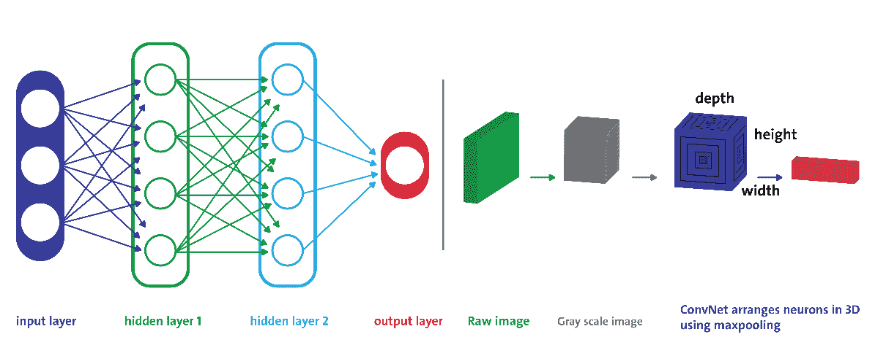

图 1：常规 DNN 与 CNN 的对比，其中每一层的神经元按 3D 排列

例如，在*图 1*中，左侧展示了一个常规的三层神经网络。右侧则是一个卷积神经网络（ConvNet），它将神经元排列在三维空间（宽度、高度和深度）中，正如其中一层所示。ConvNet 的每一层都将 3D 输入体积转化为 3D 输出体积的神经元激活。红色的输入层包含图像，因此它的宽度和高度就是图像的维度，而深度则是三（红色、绿色和蓝色通道）。因此，我们所讨论的所有多层神经网络都是由一长列神经元组成的，我们需要将输入的图像或数据扁平化为一维，再输入到神经网络中。

然而，一旦你尝试直接输入一张 2D 图像会发生什么呢？答案是，在 CNN 中，每一层都是以 2D 形式表示的，这使得神经元和其对应的输入更容易匹配。我们将在接下来的章节中看到这个例子的应用。另一个重要的事实是，特征图中的所有神经元共享相同的参数，因此大大减少了模型中的参数数量；但更重要的是，这意味着一旦 CNN 学会在一个位置识别某个模式，它就能在任何其他位置识别该模式。

相比之下，一旦常规的 DNN 学习到识别一个位置的模式，它只能在该特定位置进行识别。在多层网络（如 MLP 或 DBN）中，输入层所有神经元的输出都会连接到隐藏层中的每个神经元，然后输出将再次作为输入传递到全连接层。在 CNN 网络中，定义卷积层的连接方式则大不相同。卷积层是 CNN 中的主要层类型，其中每个神经元都连接到输入区域的某一特定区域，这个区域被称为**感受野**。

在典型的 CNN 架构中，几个卷积层是以级联的方式连接的。每一层后面都跟着一个**修正线性单元**（**ReLU**）层，接着是一个池化层，然后是一个或多个卷积层（+ReLU），再接一个池化层，最后是一个或多个全连接层。根据问题类型，网络的深度可能不同。每个卷积层的输出是由单个卷积核生成的一组对象，称为**特征图**。然后，这些特征图可以作为输入定义传递到下一层。

CNN 网络中的每个神经元都会产生一个输出，后跟一个激活阈值，该阈值与输入成正比且没有限制。

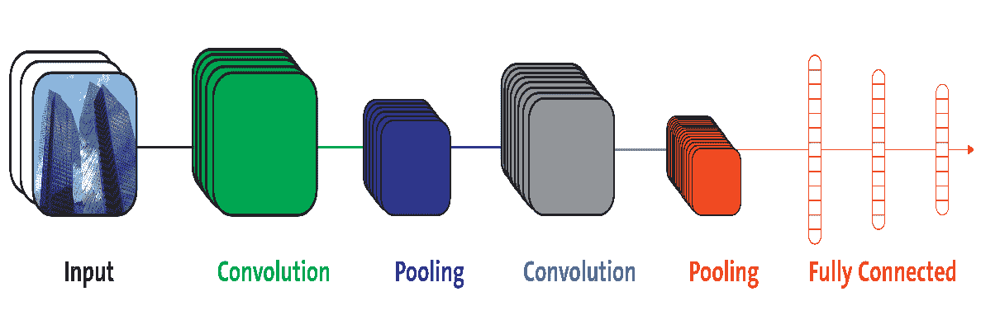

图 2：CNN 的概念性架构

如*图 2*所示，池化层通常位于卷积层之后（例如，在两个卷积层之间）。池化层将卷积区域划分为子区域。然后，使用最大池化或平均池化技术选择一个代表性值，从而减少后续层的计算时间。这样，卷积神经网络（CNN）可以被看作是一种特征提取器。为了更清晰地理解这一点，请参见下图：

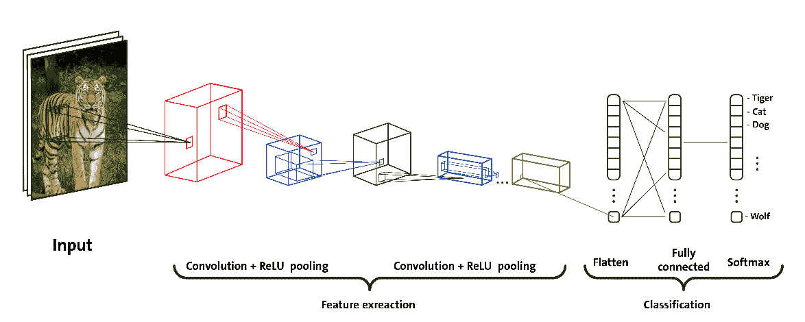

通过这种方式，特征相对于其空间位置的鲁棒性也得到了提高。更具体来说，当特征图作为图像属性并通过灰度图像时，它在网络中逐步变小；但它通常会变得越来越深，因为将添加更多的特征图。

我们已经讨论过这种前馈神经网络（FFNN）的局限性——也就是说，即使在一个浅层架构中，由于图像的输入规模非常大，其中每个像素都是一个相关变量，因此需要大量的神经元。卷积操作为这个问题提供了解决方案，因为它减少了自由参数的数量，使得网络可以更深，且参数更少。

# 卷积操作

卷积是一种数学运算，它将一个函数滑动到另一个函数上，并测量它们逐点乘积的积分。它与傅里叶变换和拉普拉斯变换有着深厚的联系，并且在信号处理领域中被广泛使用。卷积层实际上使用的是互相关，这与卷积非常相似。

在数学中，卷积是对两个函数进行的数学操作，产生一个第三个函数——即原始函数的修改版（卷积版）。结果函数给出了两个函数逐点乘积的积分，作为其中一个原始函数平移量的函数。感兴趣的读者可以参考此网址获取更多信息：[`en.wikipedia.org/wiki/Convolution`](https://en.wikipedia.org/wiki/Convolution)。

因此，卷积神经网络（CNN）最重要的构建块是卷积层。第一卷积层中的神经元并不是与输入图像中的每个像素相连接（就像前馈神经网络（FNN）——例如多层感知机（MLP）和深度信念网络（DBN）那样），而是仅与其感受野中的像素相连接。请参见*图 3*。反过来，第二卷积层中的每个神经元仅与第一层中位于小矩形内的神经元相连接：

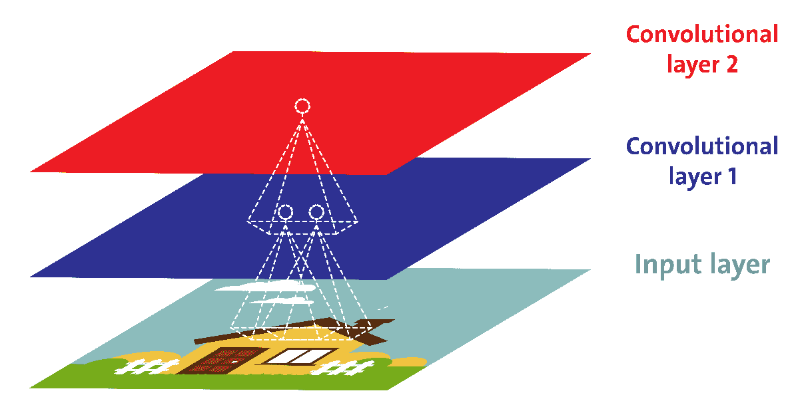

图 3：每个卷积神经元只处理其感受野中的数据

在第二章《卷积神经网络简介》中，我们已经看到所有的多层神经网络（例如，MLP）都由许多神经元组成的层构成，我们需要将输入的图像展平为 1D，然后才能输入神经网络。相反，在 CNN 中，每一层都是以 2D 的形式表示，这使得将神经元与其对应的输入匹配变得更加容易。

感受野的概念被 CNN 用来通过在相邻层的神经元之间强制局部连接模式，从而利用空间局部性。

这种架构允许网络在第一隐藏层集中处理低级特征，然后在下一隐藏层将其组合成更高级的特征，依此类推。这种层次结构在真实世界的图像中很常见，这也是 CNN 在图像识别中表现良好的原因之一。

最后，它不仅需要较少的神经元，而且显著减少了可训练参数的数量。例如，无论图像大小如何，构建大小为 5 x 5 的区域，每个区域使用相同的共享权重，仅需要 25 个可学习参数。通过这种方式，它解决了在使用反向传播训练传统多层神经网络时出现的梯度消失或爆炸问题。

# 池化、步幅和填充操作

一旦你理解了卷积层的工作原理，池化层就很容易理解。池化层通常独立地对每个输入通道进行处理，因此输出深度与输入深度相同。你也可以在深度维度上进行池化，正如我们接下来将看到的那样，在这种情况下，图像的空间维度（例如，高度和宽度）保持不变，但通道的数量减少。我们来看一下来自著名 TensorFlow 网站的池化层的正式定义：

“池化操作通过一个矩形窗口在输入张量上滑动，对每个窗口执行一个归约操作（平均、最大或带有 argmax 的最大值）。每个池化操作使用称为 ksize 的矩形窗口，窗口之间的偏移量由步幅决定。例如，如果步幅为 1，则使用每个窗口；如果步幅为 2，则每个维度使用每隔一个窗口，依此类推。”

因此，总结来说，就像卷积层一样，池化层中的每个神经元都连接到前一层中一小部分神经元的输出，这些神经元位于一个小的矩形感受野内。然而，我们必须定义其大小、步幅和填充类型。因此，总结一下，输出可以通过以下方式计算：

```py
output[i] = reduce(value[strides * i:strides * i + ksize]),
```

在这里，索引还考虑了填充值。

池化神经元没有权重。因此，它所做的就是使用聚合函数（如最大值或均值）聚合输入。

换句话说，使用池化的目的是对输入图像进行子采样，以减少计算负担、内存使用量和参数数量。这有助于避免训练阶段的过拟合。减少输入图像的大小还使得神经网络能够容忍一定程度的图像偏移。卷积操作的空间语义依赖于所选择的填充方案。

填充是一种增加输入数据大小的操作。在一维数据的情况下，你只需在数组前后添加一个常数；在二维数据的情况下，你会在矩阵的周围添加这些常数。在 n 维数据中，你会在 n 维超立方体的四周添加常数。在大多数情况下，这个常数是零，称为**零填充**：

+   **VALID 填充**：仅丢弃最右侧的列（或最底部的行）

+   **SAME 填充**：尽量将左右填充均匀，但如果需要添加的列数为奇数，则会将多余的列添加到右侧，正如这个例子中所示。

让我们通过以下图形来直观地解释前面的定义。如果我们希望某一层与前一层具有相同的高度和宽度，通常会在输入周围添加零，如图所示。这被称为**SAME**或**零填充**。

**SAME** 这个术语表示输出特征图与输入特征图具有相同的空间维度。

另一方面，零填充被引入以使形状根据需要匹配，并且在输入图上每一侧的填充量相等。**VALID** 意味着没有填充，仅丢弃最右侧的列（或最底部的行）：

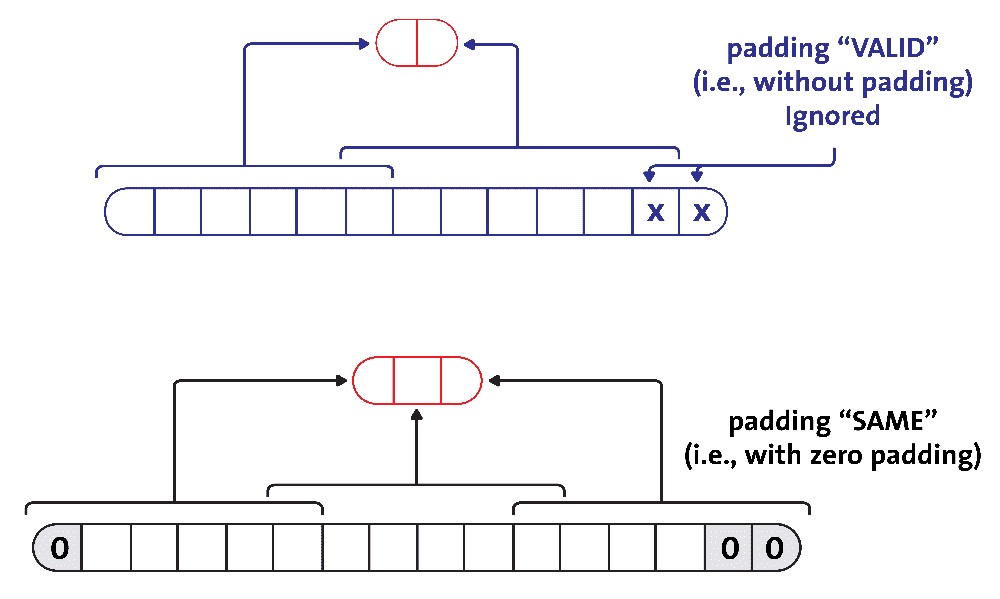

图 4：CNN 中的 SAME 与 VALID 填充对比

在下面的示例（*图 5*）中，我们使用一个 2 × 2 的池化核，步长为 2，并且没有填充。每个池化核中的**最大**输入值进入下一层，因为其他输入会被丢弃（稍后我们将看到这一点）：

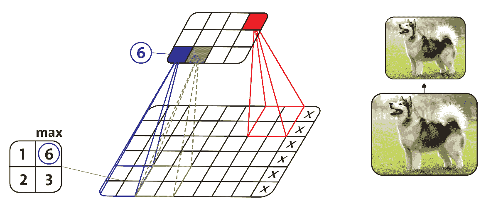

图 5：使用最大池化的示例，即子采样

# 全连接层

在堆栈的顶部，添加了一个常规的全连接层（也称为**FNN**或**密集层**）；它的作用类似于多层感知器（MLP），该网络可能由若干个全连接层（加 ReLU 激活函数）组成。最后一层输出（例如 softmax）为预测结果。一个例子是一个 softmax 层，它输出用于多分类任务的估计类别概率。

全连接层将一层中的每个神经元与另一层中的每个神经元连接。尽管全连接的前馈神经网络（FNN）可以用于学习特征和分类数据，但将这种架构应用于图像并不实际。

# TensorFlow 中的卷积和池化操作

现在我们已经理论上了解了卷积和池化操作的执行方式，接下来我们来看看如何在 TensorFlow 中实际操作这些操作。让我们开始吧。

# 在 TensorFlow 中应用池化操作

使用 TensorFlow 时，子采样层通常通过保持该层初始参数来表示为`max_pool`操作。对于`max_pool`，它在 TensorFlow 中的签名如下：

```py
tf.nn.max_pool(value, ksize, strides, padding, data_format, name) 
```

现在让我们学习如何创建一个利用前面签名的函数，返回一个类型为`tf.float32`的张量，即最大池化输出张量：

```py
import tensorflow as tf

def maxpool2d(x, k=2): 
   return tf.nn.max_pool(x,  
               ksize=[1, k, k, 1],  
               strides=[1, k, k, 1],  
               padding='SAME') 
```

在前面的代码段中，参数可以描述如下：

+   `value`：这是一个 4D 的`float32`张量，形状为（批次长度，高度，宽度和通道数）。

+   `ksize`：一个整数列表，表示每个维度上的窗口大小

+   `strides`：每个维度上滑动窗口的步长

+   `data_format`：支持`NHWC`、`NCHW`和`NCHW_VECT_C`

+   `ordering`：`NHWC`或`NCHW`

+   `padding`：`VALID`或`SAME`

然而，根据 CNN 中的层次结构，TensorFlow 支持其他的池化操作，如下所示：

+   `tf.nn.avg_pool`：返回一个包含每个窗口平均值的缩小张量

+   `tf.nn.max_pool_with_argmax`：返回`max_pool`张量及其最大值的扁平化索引张量

+   `tf.nn.avg_pool3d`：执行一个类似立方体的`avg_pool`操作

+   窗口；输入增加了深度

+   `tf.nn.max_pool3d`：执行与(...)相同的功能，但应用最大操作

现在让我们看一个具体示例，看看填充在 TensorFlow 中的作用。假设我们有一个形状为`[2, 3]`并且只有一个通道的输入图像`x`。现在我们想看看`VALID`和`SAME`填充的效果：

+   `valid_pad`：使用 2 x 2 的内核，步幅为 2，且采用`VALID`填充的最大池化操作

+   `same_pad`：使用 2 x 2 的内核，步幅为 2，且采用`SAME`填充的最大池化操作

让我们看看如何在 Python 和 TensorFlow 中实现这一点。假设我们有一个形状为`[2, 4]`的输入图像，且只有一个通道：

```py
import tensorflow as tf 
x = tf.constant([[2., 4., 6., 8.,], 
                 [10., 12., 14., 16.]]) 
```

现在让我们给出`tf.nn.max_pool`接受的形状：

```py
x = tf.reshape(x, [1, 2, 4, 1]) 
```

如果我们想要应用使用 2 x 2 内核、步幅为 2 的最大池化，并采用`VALID`填充：

```py
VALID = tf.nn.max_pool(x, [1, 2, 2, 1], [1, 2, 2, 1], padding='VALID') 
```

另一方面，使用 2 x 2 内核、步幅为 2 并采用`SAME`填充的最大池化：

```py
SAME = tf.nn.max_pool(x, [1, 2, 2, 1], [1, 2, 2, 1], padding='SAME') 
```

对于`VALID`填充，由于没有填充，输出形状为`[1, 1]`。然而，对于`SAME`填充，由于我们将图像填充为形状`[2, 4]`（使用-`inf`），然后应用最大池化，输出形状为`[1, 2]`。让我们验证它们：

```py
print(VALID.get_shape())  
print(SAME.get_shape())  
>>> 
(1, 1, 2, 1) 
(1, 1, 2, 1) 
```

# TensorFlow 中的卷积操作

TensorFlow 提供了多种卷积方法。经典的形式是通过`conv2d`操作来应用。让我们看看这个操作的用法：

```py
conv2d(
     input,
     filter,
     strides,
     padding,
     use_cudnn_on_gpu=True,
     data_format='NHWC',
     dilations=[1, 1, 1, 1],
     name=None
 )
```

我们使用的参数如下：

+   `input`：该操作将应用于这个原始张量。它有四个维度的确定格式，默认的维度顺序如下所示。

+   `filter`：这是一个表示内核或滤波器的张量。它有一个非常通用的方法：（`filter_height`，`filter_width`，`in_channels`和`out_channels`）。

+   `strides`：这是一个包含四个`int`类型张量的数据列表，表示每个维度的滑动窗口。

+   `padding`：可以是 `SAME` 或 `VALID`。`SAME` 会尽量保持初始张量维度不变，而 `VALID` 则允许其在输出大小和填充计算的情况下增长。稍后我们将看到如何在池化层中执行填充操作。

+   `use_cudnn_on_gpu`：这表示是否使用 `CUDA GPU CNN` 库来加速计算。

+   `data_format`：指定数据组织的顺序（`NHWC` 或 `NCWH`）。

+   `dilations`：这表示一个可选的 `ints` 列表，默认为 (1, 1, 1, 1)。长度为 4 的 1D 张量，表示每个输入维度的扩张因子。如果设置为 k > 1，则在该维度的每个滤波器元素之间会有 k-1 个跳过的单元。维度的顺序由 `data_format` 的值决定；有关详情，请参见前面的代码示例。批处理和深度维度的扩张因子必须为 1。

+   `name`：操作的名称（可选）。

以下是一个卷积层的示例。它将卷积操作连接起来，添加一个偏置参数的和，最后返回我们为整个层选择的激活函数（在本例中为 ReLU 操作，这是一个常用的操作）：

```py
def conv_layer(data, weights, bias, strides=1): 
   x = tf.nn.conv2d(x,  
               weights,  
               strides=[1, strides, strides, 1],  
               padding='SAME') 
   x = tf.nn.bias_add(x, bias) 
   return tf.nn.relu(x) 
```

在这里，x 是 4D 张量输入（批处理大小、高度、宽度和通道）。TensorFlow 还提供了其他几种卷积层。例如：

+   `tf.layers.conv1d()` 创建一个用于 1D 输入的卷积层。例如，在自然语言处理（NLP）中，句子可以表示为一个 1D 的单词数组，感受野覆盖几个相邻的单词。

+   `tf.layers.conv3d()` 创建一个用于 3D 输入的卷积层。

+   `tf.nn.atrous_conv2d()` 创建了一个空洞卷积层（`a` tro*us* 是法语中“带孔”的意思）。这相当于使用一个常规卷积层，并通过插入零行和零列来扩展滤波器。例如，一个 1 × 3 的滤波器（1, 2, 3）可以通过扩张率为 4 来扩展，得到扩张后的滤波器（1, 0, 0, 0, 2, 0, 0, 0, 3）。这使得卷积层可以在不增加计算量和额外参数的情况下拥有更大的感受野。

+   `tf.layers.conv2d_transpose()` 创建了一个转置卷积层，有时也称为 **反卷积层**，它用于上采样图像。它通过在输入之间插入零来实现，因此可以将其视为一个使用分数步幅的常规卷积层。

+   `tf.nn.depthwise_conv2d()` 创建了一个深度卷积层，它将每个滤波器独立应用于每个输入通道。因此，如果有 `f[n]` 个滤波器和 `f[n]`[′] 个输入通道，那么这将输出 *f[n ]*× `f[n]`[′] 个特征图。

+   `tf.layers.separable_conv2d()` 创建了一个可分离卷积层，首先像深度卷积层一样工作，然后对结果特征图应用 1 × 1 的卷积层。这使得可以将滤波器应用于任意输入通道的集合。

# 训练 CNN

在前一节中，我们已经看到如何构建 CNN 并在其不同层上应用不同操作。现在，当涉及训练 CNN 时，由于需要考虑控制这些操作（如应用适当的激活函数、权重和偏置初始化，当然还有智能使用优化器），这变得更加棘手。

还有一些高级考虑因素，如优化的超参数调整。然而，这将在下一节讨论。我们首先从权重和偏置初始化开始我们的讨论。

# 权重和偏置初始化

在训练 DNN 中，最常见的初始化技术之一是随机初始化。使用随机初始化的想法是从输入数据集的正态分布中抽样每个权重，具有低偏差。低偏差可以使网络偏向简单的 0 解决方案。

但这意味着什么呢？事实是，初始化可以完成，而不会造成将权重初始化为 0 的坏影响。其次，Xavier 初始化经常用于训练 CNN。它类似于随机初始化，但通常效果要好得多。现在让我解释一下原因：

+   想象一下，您随机初始化网络权重，但它们却开始太小。然后，信号通过每一层时会收缩，直到变得太微小而无用。

+   另一方面，如果网络中的权重开始过大，则信号在通过每一层时会增长，直到变得太大而无用。

好处在于使用 Xavier 初始化确保权重恰到好处，通过许多层保持信号在合理范围内的值。总结一下，它可以根据输入和输出神经元的数量自动确定初始化的比例。

有兴趣的读者应参考这篇论文获取详细信息：Xavier Glorot 和 Yoshua Bengio，《*理解训练深度前馈神经网络的困难*》，第 13 届人工智能和统计学会议（**AISTATS**）2010 年，位于意大利撒丁岛的 Chia Laguna Resort。JMLR 的第 9 卷：W&CP。

最后，您可能会问一个聪明的问题，*在训练常规的 DNN（例如 MLP 或 DBN）时，我不能摆脱随机初始化吗*？嗯，最近，一些研究人员提到了随机正交矩阵初始化，这种初始化比单纯的任意随机初始化效果更好。

+   **当涉及初始化偏置时**，将偏置初始化为零是可能且常见的，因为权重中的小随机数提供了不对称性破坏。将所有偏置设置为一个小常数值，如 0.01，可以确保所有 ReLU 单元可以传播一些梯度。然而，它既表现不佳，也没有持续改进。因此，建议坚持使用零值。

# 正则化

有多种方法可以控制 CNN 的训练，以防止在训练阶段出现过拟合。例如，L2/L1 正则化、最大范数约束和 dropout：

+   **L2 正则化**：这可能是最常见的正则化形式。它可以通过在目标函数中直接惩罚所有参数的平方大小来实现。例如，使用梯度下降更新参数时，L2 正则化最终意味着每个权重都以线性方式衰减：*W += -*lambda * `W` 向零靠拢。

+   **L1 正则化**：这是另一种相对常见的正则化形式，对于每个权重 `w`，我们将项 *λ∣w∣* 加入到目标函数中。然而，也可以将 L1 正则化与 L2 正则化结合起来：*λ1∣w∣+λ2w2*，这通常被称为 **弹性网正则化**。

+   **最大范数约束**：另一种正则化形式是对每个神经元的权重向量的绝对值设定上限，并使用投影梯度下降法来强制实施这一约束。

最后，dropout 是正则化的一种高级变体，稍后将在本章中讨论。

# 激活函数

激活操作提供了不同类型的非线性函数，用于神经网络中。这些包括平滑的非线性函数，如`sigmoid`、`tanh`、`elu`、`softplus`和`softsign`。另一方面，也可以使用一些连续但在某些点不可导的函数，如`relu`、`relu6`、`crelu`和`relu_x`。所有激活操作都是逐元素应用，并产生与输入张量形状相同的张量。现在，让我们看看如何在 TensorFlow 语法中使用一些常见的激活函数。

# 使用 sigmoid

在 TensorFlow 中，签名 `tf.sigmoid(x, name=None)` 按元素计算 `x` 的 sigmoid 函数，使用 *y = 1 / (1 + exp(-x))*，并返回一个与 `x` 类型相同的张量。下面是参数的描述：

+   `x`：一个张量。它必须是以下类型之一：`float32`、`float64`、`int32`、`complex64`、`int64` 或 `qint32`。

+   `name`：操作的名称（可选）。

# 使用 tanh

在 TensorFlow 中，签名 `tf.tanh(x, name=None)` 按元素计算 `x` 的双曲正切，并返回一个与 `x` 类型相同的张量。下面是参数的描述：

+   `x`：一个张量或稀疏张量。它的类型可以是 `float`、`double`、`int32`、`complex64`、`int64` 或 `qint32`。

+   `name`：操作的名称（可选）。

# 使用 ReLU

在 TensorFlow 中，签名 `tf.nn.relu(features, name=None)` 计算使用 `max(features, 0)` 的修正线性函数，并返回一个与 features 类型相同的张量。下面是参数的描述：

+   `features`：一个张量。它必须是以下类型之一：`float32`、`float64`、`int32`、`int64`、`uint8`、`int16`、`int8`、`uint16` 和 `half`。

+   `name`：操作的名称（可选）。

关于如何使用其他激活函数，请参考 TensorFlow 官网。到目前为止，我们已经具备了构建第一个 CNN 网络进行预测的最基础理论知识。

# 构建、训练和评估我们的第一个 CNN

在下一节中，我们将探讨如何基于原始图像对狗和猫进行分类和区分。我们还将学习如何实现我们的第一个 CNN 模型，以处理具有三个通道的原始彩色图像。这个网络设计和实现并不简单；我们将使用 TensorFlow 的低级 API 来实现。然而，不用担心；在本章的后面，我们将看到如何使用 TensorFlow 的高级 contrib API 实现 CNN 模型。正式开始之前，先简单介绍一下数据集。

# 数据集描述

在这个例子中，我们将使用 Kaggle 提供的狗与猫数据集，它用于著名的“狗与猫分类”问题，这是一个提供内核支持的竞赛数据集。数据集可以从[`www.kaggle.com/c/dogs-vs-cats-redux-kernels-edition/data`](https://www.kaggle.com/c/dogs-vs-cats-redux-kernels-edition/data)下载。

训练文件夹包含 25,000 张狗和猫的图像。该文件夹中的每个图像的标签是文件名的一部分。测试文件夹包含 12,500 张图像，文件名是数字 ID。对于测试集中的每个图像，您应该预测该图像是狗的概率（1 = 狗，0 = 猫）；也就是说，这是一个二分类问题。对于这个例子，有三个 Python 脚本。

# 步骤 1 – 加载所需的包

在这里，我们导入所需的包和库。请注意，您的导入可能会根据平台不同而有所不同：

```py
import time 
import math 
import random 
import os 
import pandas as pd 
import numpy as np 
import matplotlib.pyplot as plt 
import tensorflow as tf 
import Preprocessor 
import cv2 
import LayersConstructor 
from sklearn.metrics import confusion_matrix 
from datetime import timedelta 
from sklearn.metrics.classification import accuracy_score 
from sklearn.metrics import precision_recall_fscore_support 
```

# 步骤 2 – 加载训练/测试图像以生成训练/测试集

我们将图像的颜色通道数量设置为 3。在前面的章节中，我们已经看到，对于灰度图像，它的通道数量应为 1：

```py
num_channels = 3 
```

为了简化问题，我们假设图像的尺寸应该是正方形的。我们将尺寸设置为`128`：

```py
img_size = 128 
```

现在我们已经有了图像的大小（即 `128`）和通道的数量（即 3），图像展开为一维时，图像的大小将是图像尺寸与通道数量的乘积，如下所示：

```py
img_size_flat = img_size * img_size * num_channels 
```

请注意，在后续步骤中，我们可能需要对图像进行重塑，以便适应最大池化层和卷积层，因此我们需要对图像进行重塑。对于我们的情况，它将是一个包含图像高度和宽度的元组，用于重塑数组：

```py
img_shape = (img_size, img_size)  
```

由于我们只有原始彩色图像，并且这些图像没有像其他数字机器学习数据集那样带有标签，因此我们应该明确地定义标签（即类）。让我们如下明确定义类信息：

```py
classes = ['dogs', 'cats']  
num_classes = len(classes) 
```

我们需要定义稍后在 CNN 模型上训练的批量大小：

```py
batch_size = 14  
```

请注意，我们还可以定义训练集的哪一部分将作为验证集。为了简便起见，假设使用 16%的数据：

```py
validation_size = 0.16  
```

一个重要的设置是，在验证损失停止改善后，等待多长时间再终止训练。如果我们不想实现早停，应该使用`none`：

```py
early_stopping = None   
```

现在，下载数据集后，你需要手动做一件事：将狗和猫的图片分开并放入两个不同的文件夹中。具体来说，假设你将训练集放在路径`/home/DoG_CaT/data/train/`下。在 train 文件夹中，创建两个单独的文件夹`dogs`和`cats`，但只显示`DoG_CaT/data/train/`的路径。我们还假设我们的测试集位于`/home/DoG_CaT/data/test/`目录中。此外，你可以定义检查点目录，在该目录中将写入日志和模型检查点文件：

```py
train_path = '/home/DoG_CaT/data/train/' 
test_path = '/home/DoG_CaT/data/test/' 
checkpoint_dir = "models/" 
```

然后我们开始读取训练集并为 CNN 模型做准备。处理测试集和训练集时，我们有另一个脚本`Preprocessor.py`。不过，最好也准备好测试集**：**

```py
data = Preprocessor.read_train_sets(train_path, img_size, classes, validation_size=validation_size) 
```

上述代码行读取猫和狗的原始图像并创建训练集。`read_train_sets()`函数的定义如下：

```py
def read_train_sets(train_path, image_size, classes, validation_size=0): 
  class DataSets(object): 
      pass 
      data_sets = DataSets() 
      images, labels, ids, cls = load_train(train_path, image_size, classes) 
      images, labels, ids, cls = shuffle(images, labels, ids, cls) 

      if isinstance(validation_size, float): 
          validation_size = int(validation_size * images.shape[0]) 
          validation_images = images[:validation_size] 
          validation_labels = labels[:validation_size] 
          validation_ids = ids[:validation_size] 
          validation_cls = cls[:validation_size] 
          train_images = images[validation_size:] 
          train_labels = labels[validation_size:] 
          train_ids = ids[validation_size:] 
          train_cls = cls[validation_size:] 
          data_sets.train = DataSet(train_images, train_labels, train_ids, train_cls) 
          data_sets.valid = DataSet(validation_images, validation_labels, validation_ids, validation_cls) 
  return data_sets 
```

在前面的代码段中，我们使用了`load_train()`方法来加载图像，它是`DataSet`类的一个实例：

```py
def load_train(train_path, image_size, classes): 
    images = [] 
    labels = [] 
    ids = [] 
    cls = [] 

    print('Reading training images') 
    for fld in classes:    
        index = classes.index(fld) 
        print('Loading {} files (Index: {})'.format(fld, index)) 
        path = os.path.join(train_path, fld, '*g') 
        files = glob.glob(path) 
        for fl in files: 
            image = cv2.imread(fl) 
            image = cv2.resize(image, (image_size, image_size), cv2.INTER_LINEAR) 
            images.append(image) 
            label = np.zeros(len(classes)) 
            label[index] = 1.0 
            labels.append(label) 
            flbase = os.path.basename(fl) 
            ids.append(flbase) 
            cls.append(fld) 
    images = np.array(images) 
    labels = np.array(labels) 
    ids = np.array(ids) 
    cls = np.array(cls) 
    return images, labels, ids, cls 
```

`DataSet`类用于生成训练集的批次，其定义如下：

```py
class DataSet(object): 

  def next_batch(self, batch_size): 
    """Return the next `batch_size` examples from this data set.""" 
    start = self._index_in_epoch 
    self._index_in_epoch += batch_size 
    if self._index_in_epoch > self._num_examples: 
      # Finished epoch 
      self._epochs_completed += 1 
      start = 0 
      self._index_in_epoch = batch_size 
      assert batch_size <= self._num_examples 
    end = self._index_in_epoch 
    return self._images[start:end], self._labels[start:end], self._ids[start:end], self._cls[start:end] 
```

然后，类似地，我们从混合的测试图像（狗和猫）中准备测试集：

```py
test_images, test_ids = Preprocessor.read_test_set(test_path, img_size) 
```

我们有`read_test_set()`函数来简化此过程，代码如下：

```py
def read_test_set(test_path, image_size): 
  images, ids  = load_test(test_path, image_size) 
  return images, ids 
```

现在，和训练集类似，我们有一个专门的函数`load_test()`来加载测试集，代码如下：

```py
def load_test(test_path, image_size): 
  path = os.path.join(test_path, '*g') 
  files = sorted(glob.glob(path)) 

  X_test = [] 
  X_test_id = [] 
  print("Reading test images") 
  for fl in files: 
      flbase = os.path.basename(fl) 
      img = cv2.imread(fl) 
      img = cv2.resize(img, (image_size, image_size), cv2.INTER_LINEAR) 
      X_test.append(img) 
      X_test_id.append(flbase) 
  X_test = np.array(X_test, dtype=np.uint8) 
  X_test = X_test.astype('float32') 
  X_test = X_test / 255 
  return X_test, X_test_id 
```

做得好！现在我们可以看到一些随机选取的图像。为此，我们有一个辅助函数`plot_images()`；它创建一个包含 3 x 3 子图的图形。总共会绘制九张图像，并显示它们的真实标签。其代码如下：

```py
def plot_images(images, cls_true, cls_pred=None): 
    if len(images) == 0: 
        print("no images to show") 
        return  
    else: 
        random_indices = random.sample(range(len(images)), min(len(images), 9))         
        images, cls_true  = zip(*[(images[i], cls_true[i]) for i in random_indices])     
    fig, axes = plt.subplots(3, 3) 
    fig.subplots_adjust(hspace=0.3, wspace=0.3) 
    for i, ax in enumerate(axes.flat): 
        # Plot image. 
        ax.imshow(images[i].reshape(img_size, img_size, num_channels)) 
        if cls_pred is None: 
            xlabel = "True: {0}".format(cls_true[i]) 
        else: 
            xlabel = "True: {0}, Pred: {1}".format(cls_true[i], cls_pred[i]) 
        ax.set_xlabel(xlabel)         
        ax.set_xticks([]) 
        ax.set_yticks([])     
    plt.show() 
```

让我们从训练集中随机获取一些图像及其标签：

```py
images, cls_true  = data.train.images, data.train.cls 
```

最后，我们使用前面代码中的辅助函数绘制图像和标签：

```py

plot_images(images=images, cls_true=cls_true) 
```

上述代码行生成从训练集中随机选取的图像的真实标签：

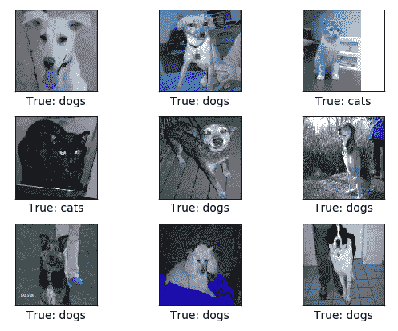

图 6：从训练集中随机选取的图像的真实标签

最后，我们可以打印数据集的统计信息：

```py
print("Size of:") 
print("  - Training-set:tt{}".format(len(data.train.labels)))  
print("  - Test-set:tt{}".format(len(test_images))) 
print("  - Validation-set:t{}".format(len(data.valid.labels))) 
```

```py
>>>
Reading training images
 Loading dogs files (Index: 0)
 Loading cats files (Index: 1)
 Reading test images
 Size of:
 - Training-set: 21000
 - Test-set: 12500
 - Validation-set: 4000
```

# 第 3 步 - 定义 CNN 超参数

现在我们有了训练集和测试集，是时候在开始构建 CNN 模型之前定义超参数了。在第一层和第二层卷积层中，我们定义了每个滤波器的宽度和高度，即`3`，而滤波器的数量是`32`：

```py
filter_size1 = 3  
num_filters1 = 32  
filter_size2 = 3  
num_filters2 = 32  
```

第三层卷积层的维度相同，但滤波器数量是原来的两倍；也就是`64`个滤波器：

```py
filter_size3 = 3
num_filters3 = 64  
```

最后两层是全连接层，指定神经元的数量：

```py
fc_size = 128     
```

现在让我们通过设置较低的学习率来使训练变慢，以进行更为密集的训练，如下所示：

```py
learning_rate=1e-4  
```

# 第 4 步 – 构建 CNN 层

一旦我们定义了 CNN 的超参数，下一步就是实现 CNN 网络。正如你所猜测的，我们的任务将构建一个包含三个卷积层、一个展平层和两个全连接层的 CNN 网络（参见`LayersConstructor.py`）。此外，我们还需要定义权重和偏置。此外，我们还会有隐式的最大池化层。首先，让我们定义权重。在下面，我们有`new_weights()`方法，它需要图像形状并返回截断正态形状：

```py
def new_weights(shape): 
    return tf.Variable(tf.truncated_normal(shape, stddev=0.05)) 
```

接着我们使用`new_biases()`方法来定义偏置：

```py
def new_biases(length): 
    return tf.Variable(tf.constant(0.05, shape=[length])) 
```

现在我们定义一个方法，`new_conv_layer()`，用于构建卷积层。该方法接受输入批次、输入通道数、滤波器大小和滤波器数量，并且它还使用最大池化（如果为真，则使用 2 x 2 的最大池化）来构建新的卷积层。该方法的工作流程如下：

1.  定义卷积的滤波器权重的形状，这由 TensorFlow API 决定。

1.  创建具有给定形状和新偏置的新权重（即滤波器），每个滤波器一个偏置。

1.  创建卷积的 TensorFlow 操作，其中步幅在所有维度上都设置为 1。第一个和最后一个步幅必须始终为 1，因为第一个是为了图像编号，最后一个是为了输入通道。例如，strides= (1, 2, 2, 1)意味着滤波器在图像的`x`轴和`y`轴上各移动两个像素。

1.  将偏置添加到卷积的结果中。然后将偏置值添加到每个滤波器通道中。

1.  然后，它使用池化来下采样图像分辨率。这是 2 x 2 的最大池化，意味着我们考虑 2 x 2 的窗口，并在每个窗口中选择最大的值。然后我们将窗口移动两个像素。

1.  然后使用 ReLU 来计算每个输入像素`x`的*max(x, 0)*。如前所述，ReLU 通常在池化之前执行，但由于`relu(max_pool(x)) == max_pool(relu(x))`，我们可以通过先进行最大池化来节省 75%的 ReLU 操作。

1.  最后，它返回结果层和滤波器权重，因为我们稍后会绘制权重。

现在我们定义一个函数来构建要使用的卷积层：

```py
def new_conv_layer(input,  num_input_channels, filter_size, num_filters,                    use_pooling=True):   
    shape = [filter_size, filter_size, num_input_channels, num_filters] 
    weights = new_weights(shape=shape) 
    biases = new_biases(length=num_filters) 
    layer = tf.nn.conv2d(input=input, 
                         filter=weights, 
                         strides=[1, 1, 1, 1], 
                         padding='SAME') 
    layer += biases 
    if use_pooling: 
        layer = tf.nn.max_pool(value=layer, 
                               ksize=[1, 2, 2, 1], 
                               strides=[1, 2, 2, 1], 
                               padding='SAME') 
    layer = tf.nn.relu(layer) 
    return layer, weights 
```

下一步是定义展平层：

1.  获取输入层的形状。

1.  特征数量为`img_height * img_width * num_channels`。`get_shape()`函数在 TensorFlow 中用于计算这一点。

1.  然后，它将重塑该层为（`num_images` 和 `num_features`）。我们只需将第二维的大小设置为`num_features`，而第一维的大小设置为-1，这意味着在该维度中的大小会被计算出来，以便重塑后张量的总大小不变。

1.  最后，它返回展平层和特征数量。

以下代码与之前描述的`defflatten_layer(layer)`完全相同：

```py
    layer_shape = layer.get_shape() 
    num_features = layer_shape[1:4].num_elements() 
    layer_flat = tf.reshape(layer, [-1, num_features]) 
    return layer_flat, num_features 
```

最后，我们需要构建全连接层。以下函数`new_fc_layer()`接受输入批次、批次数和输出数量（即预测的类别）。它使用 ReLU，然后基于我们之前定义的方法创建权重和偏置。最后，它通过输入与权重的矩阵乘法计算该层，并加上偏置值：

```py
def new_fc_layer(input, num_inputs, num_outputs, use_relu=True):  
    weights = new_weights(shape=[num_inputs, num_outputs]) 
    biases = new_biases(length=num_outputs) 
    layer = tf.matmul(input, weights) + biases 
    if use_relu: 
        layer = tf.nn.relu(layer) 
    return layer 
```

# 第 5 步 – 准备 TensorFlow 图

现在我们为 TensorFlow 图创建占位符：

```py
x = tf.placeholder(tf.float32, shape=[None, img_size_flat], name='x') 
x_image = tf.reshape(x, [-1, img_size, img_size, num_channels]) 
y_true = tf.placeholder(tf.float32, shape=[None, num_classes], name='y_true') 
y_true_cls = tf.argmax(y_true, axis=1) 
```

# 第 6 步 – 创建 CNN 模型

现在我们有了输入；即`x_image`，它已经准备好输入到卷积层。我们正式创建卷积层，后接最大池化：

```py
layer_conv1, weights_conv1 =  
    LayersConstructor.new_conv_layer(input=x_image, 
                   num_input_channels=num_channels, 
                   filter_size=filter_size1, 
                   num_filters=num_filters1, 
                   use_pooling=True) 
```

我们必须有第二个卷积层，其中输入是第一个卷积层`layer_conv1`，后接最大池化：

```py
layer_conv2, weights_conv2 =  
    LayersConstructor.new_conv_layer(input=layer_conv1, 
                   num_input_channels=num_filters1, 
                   filter_size=filter_size2, 
                   num_filters=num_filters2, 
                   use_pooling=True) 
```

现在我们有了第三个卷积层，其中输入是第二个卷积层的输出，即`layer_conv2`，后面接着最大池化：

```py
layer_conv3, weights_conv3 =  
    LayersConstructor.new_conv_layer(input=layer_conv2, 
                   num_input_channels=num_filters2, 
                   filter_size=filter_size3, 
                   num_filters=num_filters3, 
                   use_pooling=True) 
```

一旦第三个卷积层实例化，我们接着实例化平坦化层，如下所示：

```py
layer_flat, num_features = LayersConstructor.flatten_layer(layer_conv3) 
```

一旦我们将图像进行平坦化处理，它们就可以输入到第一个全连接层。我们使用 ReLU：

```py
layer_fc1 = LayersConstructor.new_fc_layer(input=layer_flat, 
                         num_inputs=num_features, 
                         num_outputs=fc_size, 
                         use_relu=True) 
```

最后，我们需要第二个也是最后一个全连接层，其中输入是第一个全连接层的输出：

```py
layer_fc2 = LayersConstructor.new_fc_layer(input=layer_fc1, 
                         num_inputs=fc_size, 
                         num_outputs=num_classes, 
                         use_relu=False) 
```

# 第 7 步 – 运行 TensorFlow 图以训练 CNN 模型

接下来的步骤用于执行训练。代码与我们之前示例中使用的代码一样，易于理解。我们使用 softmax 通过与真实类别进行比较来预测类别：

```py
y_pred = tf.nn.softmax(layer_fc2) 
y_pred_cls = tf.argmax(y_pred, axis=1) 
cross_entropy = tf.nn.softmax_cross_entropy_with_logits_v2(logits=layer_fc2,                                               labels=y_true) 
```

我们定义`cost`函数，然后是优化器（在这里使用 Adam 优化器）。接着我们计算准确率：

```py
cost_op= tf.reduce_mean(cross_entropy) 
optimizer = tf.train.AdamOptimizer(learning_rate=learning_rate).minimize(cost_op) 
correct_prediction = tf.equal(y_pred_cls, y_true_cls) 
accuracy = tf.reduce_mean(tf.cast(correct_prediction, tf.float32)) 
```

然后我们使用 TensorFlow 的`global_variables_initializer()`函数初始化所有操作：

```py
init_op = tf.global_variables_initializer() 
```

然后我们创建并运行 TensorFlow 会话，执行跨张量的训练：

```py
session = tf.Session() 
session.run(init_op) 
```

然后我们输入训练数据，将批量大小设置为 32（参见*步骤 2*）：

```py
train_batch_size = batch_size 
```

我们保持两个列表来跟踪训练和验证的准确性：

```py
acc_list = [] 
val_acc_list = [] 
```

然后我们计算到目前为止已执行的总迭代次数，并创建一个空列表来跟踪所有迭代：

```py
total_iterations = 0 
iter_list = [] 
```

我们通过调用`optimize()`函数正式开始训练，该函数需要指定若干迭代次数。它需要两个参数：

+   `x_batch`是训练样本，其中包含一批图像

+   `y_true_batch`，这些图像的真实标签

它将每张图像的形状从（`num`个示例，行，列，深度）转换为（`num`个示例，平坦化图像形状）。之后，我们将批次放入 TensorFlow 图的`dict`占位符变量中。接下来，我们在训练数据批次上运行优化器。

然后，TensorFlow 将 `feed_dict_train` 中的变量分配给占位符变量。接着执行优化器，在每个 epoch 结束时打印状态。最后，更新我们已执行的总迭代次数：

```py
def optimize(num_iterations): 
    global total_iterations 
    best_val_loss = float("inf") 
    patience = 0 
    for i in range(total_iterations, total_iterations + num_iterations): 
        x_batch, y_true_batch, _, cls_batch = data.train.next_batch(train_batch_size) 
        x_valid_batch, y_valid_batch, _, valid_cls_batch = data.valid.next_batch(train_batch_size) 
        x_batch = x_batch.reshape(train_batch_size, img_size_flat) 
        x_valid_batch = x_valid_batch.reshape(train_batch_size, img_size_flat) 
        feed_dict_train = {x: x_batch, y_true: y_true_batch}         
        feed_dict_validate = {x: x_valid_batch, y_true: y_valid_batch} 
        session.run(optimizer, feed_dict=feed_dict_train)         

        if i % int(data.train.num_examples/batch_size) == 0:  
            val_loss = session.run(cost, feed_dict=feed_dict_validate) 
            epoch = int(i / int(data.train.num_examples/batch_size)) 
            acc, val_acc = print_progress(epoch, feed_dict_train, feed_dict_validate, val_loss) 
            acc_list.append(acc) 
            val_acc_list.append(val_acc) 
            iter_list.append(epoch+1) 

            if early_stopping:     
                if val_loss < best_val_loss: 
                    best_val_loss = val_loss 
                    patience = 0 
                else: 
                    patience += 1 
                if patience == early_stopping: 
                    break 
    total_iterations += num_iterations 
```

我们将在下一部分展示我们的训练进展。

# 步骤 8 – 模型评估

我们已经完成了训练。现在是时候评估模型了。在开始评估模型之前，我们先实现一些辅助函数，用于绘制示例错误并打印验证准确率。`plot_example_errors()` 接受两个参数，第一个是 `cls_pred`，它是一个数组，包含测试集中所有图像的预测类别编号。

第二个参数 `correct` 是一个 `boolean` 数组，用于预测每个测试集中的图像的预测类别是否与 `true` 类别相等。首先，它获取测试集中分类错误的图像。然后，它获取这些图像的预测类别和真实类别，最后绘制前九张图像及其类别（即，预测类别与真实标签的对比）：

```py
def plot_example_errors(cls_pred, correct): 
    incorrect = (correct == False)     
    images = data.valid.images[incorrect]     
    cls_pred = cls_pred[incorrect] 
    cls_true = data.valid.cls[incorrect]     
    plot_images(images=images[0:9], cls_true=cls_true[0:9], cls_pred=cls_pred[0:9]) 
```

第二个辅助函数叫做 `print_validation_accuracy()`，它打印验证准确率。该函数为预测类别分配一个数组，这些预测类别将在批次中计算并填充到此数组中，接着计算每个批次的预测类别：

```py
def print_validation_accuracy(show_example_errors=False, show_confusion_matrix=False): 
    num_test = len(data.valid.images) 
    cls_pred = np.zeros(shape=num_test, dtype=np.int) 
    i = 0 
    while i < num_test: 
        # The ending index for the next batch is denoted j. 
        j = min(i + batch_size, num_test) 
        images = data.valid.images[i:j, :].reshape(batch_size, img_size_flat)    
        labels = data.valid.labels[i:j, :] 
        feed_dict = {x: images, y_true: labels} 
        cls_pred[i:j] = session.run(y_pred_cls, feed_dict=feed_dict) 
        i = j 

    cls_true = np.array(data.valid.cls) 
    cls_pred = np.array([classes[x] for x in cls_pred])  
    correct = (cls_true == cls_pred) 
    correct_sum = correct.sum() 
    acc = float(correct_sum) / num_test 

    msg = "Accuracy on Test-Set: {0:.1%} ({1} / {2})" 
    print(msg.format(acc, correct_sum, num_test)) 

    if show_example_errors: 
        print("Example errors:") 
        plot_example_errors(cls_pred=cls_pred, correct=correct)     
```

现在我们已经有了辅助函数，可以开始优化。在第一步，先让我们对微调进行 10,000 次迭代，看看性能如何：

```py
 optimize(num_iterations=1000) 
```

经过 10,000 次迭代后，我们观察到以下结果：

```py
Accuracy on Test-Set: 78.8% (3150 / 4000) 
Precision: 0.793378626929 
Recall: 0.7875 
F1-score: 0.786639298213 
```

这意味着测试集上的准确率大约为 79%。此外，让我们看看我们的分类器在一张示例图像上的表现如何：

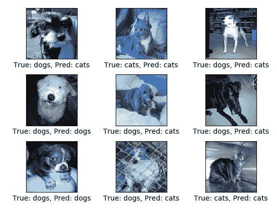

图 7：在测试集上的随机预测（经过 10,000 次迭代）

之后，我们进一步将优化迭代至 100,000 次，并观察到更好的准确率：

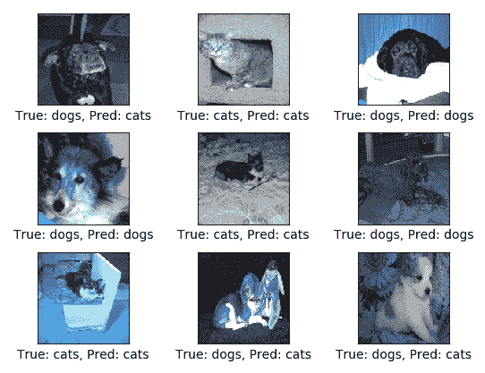

图 8：在测试集上的随机预测（经过 100,000 次迭代）

```py
>>> 
Accuracy on Test-Set: 81.1% (3244 / 4000) 
Precision: 0.811057239265 
Recall: 0.811 
F1-score: 0.81098298755 
```

所以它的改进不大，但整体准确率提高了 2%。现在是时候对我们的模型进行单张图片的评估了。为了简单起见，我们将随机选取一只狗和一只猫的图片，看看我们的模型的预测能力：

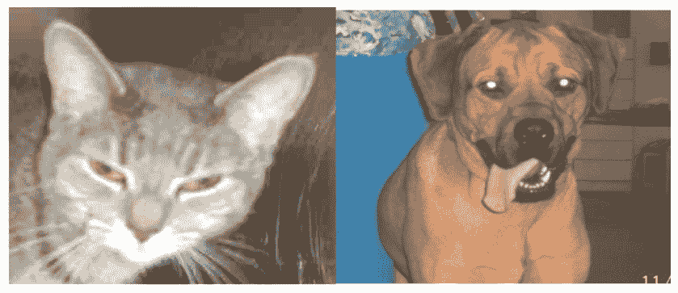

图 9：待分类的猫和狗的示例图像

首先，我们加载这两张图片，并相应地准备测试集，正如我们在本示例的前面步骤中所看到的：

```py
test_cat = cv2.imread('Test_image/cat.jpg') 
test_cat = cv2.resize(test_cat, (img_size, img_size), cv2.INTER_LINEAR) / 255 
preview_cat = plt.imshow(test_cat.reshape(img_size, img_size, num_channels)) 

test_dog = cv2.imread('Test_image/dog.jpg') 
test_dog = cv2.resize(test_dog, (img_size, img_size), cv2.INTER_LINEAR) / 255 
preview_dog = plt.imshow(test_dog.reshape(img_size, img_size, num_channels)) 
```

然后，我们有以下函数来进行预测：

```py
def sample_prediction(test_im):     
    feed_dict_test = { 
        x: test_im.reshape(1, img_size_flat), 
        y_true: np.array([[1, 0]]) 
    } 
    test_pred = session.run(y_pred_cls, feed_dict=feed_dict_test) 
    return classes[test_pred[0]] 
print("Predicted class for test_cat: {}".format(sample_prediction(test_cat))) 
print("Predicted class for test_dog: {}".format(sample_prediction(test_dog))) 

>>>  
Predicted class for test_cat: cats 
Predicted class for test_dog: dogs 
```

最后，当我们完成后，通过调用 `close()` 方法关闭 TensorFlow 会话：

```py
session.close() 
```

# 模型性能优化

由于卷积神经网络（CNN）与传统的分层结构不同，它们有不同的要求和调优标准。那么，如何知道哪种超参数组合最适合你的任务呢？当然，你可以使用网格搜索和交叉验证来找到线性机器学习模型的最佳超参数。

然而，对于 CNN，存在许多需要调优的超参数，而且在大数据集上训练神经网络需要大量时间，因此你只能在合理的时间内探索超参数空间的一小部分。以下是一些可以遵循的见解。

# 隐藏层的数量

对于许多问题，你可以从一个隐藏层开始，通常就能得到合理的结果。实际上，研究表明，仅有一个隐藏层的多层感知机（MLP）只要神经元足够多，甚至可以建模最复杂的函数。长时间以来，这些事实让研究人员相信不需要进一步研究更深层的神经网络。然而，他们忽略了深层网络比浅层网络具有更高的参数效率；深层网络能用指数级更少的神经元建模复杂的函数，使得训练速度大大加快。

需要注意的是，这并非总是适用。然而，总的来说，对于许多问题，你可以从一个或两个隐藏层开始。使用相同数量的神经元，两个隐藏层通常也能取得良好的效果，而且大致相同的训练时间。对于更复杂的问题，你可以逐步增加隐藏层的数量，直到开始过拟合训练集。非常复杂的任务，如大规模图像分类或语音识别，通常需要数十层的网络和大量的训练数据。

# 每个隐藏层的神经元数量

显然，输入层和输出层的神经元数量由任务所需的输入和输出类型决定。例如，如果你的数据集形状为 28 x 28，它应该有 784 个输入神经元，而输出神经元数量应等于要预测的类别数。至于隐藏层，一种常见的做法是将它们的规模设计成漏斗形状，每一层的神经元数量逐渐减少，理由是许多低级特征可以合并成更少的高级特征。然而，现在这种做法已经不再那么常见，你也可以简单地为所有隐藏层使用相同的大小。

如果有四个卷积层，每个卷积层有 256 个神经元，那么就只有一个超参数需要调优，而不是每个层都调优一个。就像隐藏层的数量一样，你可以逐渐增加神经元数量，直到网络开始过拟合。另一个重要的问题是：你何时需要添加最大池化层，而不是使用步幅相同的卷积层？问题在于，最大池化层没有任何参数，而卷积层有很多参数。

有时，添加一个局部响应归一化层，可以使得最强激活的神经元抑制在同一位置但在相邻特征图中的神经元，从而鼓励不同的特征图进行专业化，并推动它们分开，迫使它们探索更广泛的特征范围。通常，它在较低层使用，以便有更多的低级特征供上层构建。

# 批量归一化

**批量归一化**（**BN**）是一种在训练常规 DNN 时减少内部协变量偏移的方法。这也适用于 CNN。由于归一化，BN 进一步防止了参数的小变化被放大，从而允许更高的学习率，使网络更快：

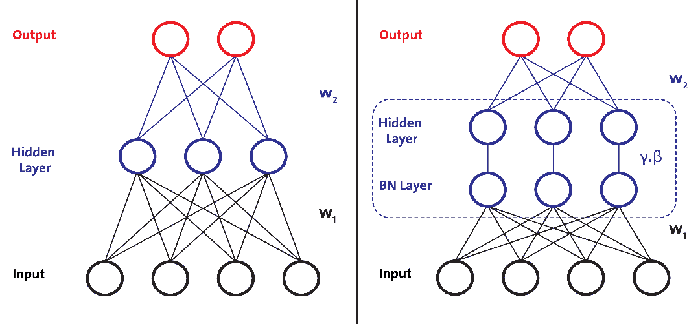

这个想法是在各层之间加入一个额外的步骤，其中前一层的输出会被规范化。更具体来说，在非线性操作的情况下（例如，ReLU），必须对非线性操作应用 BN 变换。通常，整个过程的工作流如下：

+   将网络转换为 BN 网络（见*图 1*）

+   然后训练新的网络

+   将批量统计数据转换为总体统计数据

这样，BN 可以充分参与反向传播过程。如*图 1*所示，BN 在应用该层网络的其他过程之前就已经执行。然而，任何类型的梯度下降（例如，**随机梯度下降**（**SGD**）及其变种）都可以应用于训练 BN 网络。

感兴趣的读者可以参考原始论文以获取更多信息：Ioffe, Sergey, 和 Christian Szegedy. *Batch normalization: Accelerating deep network training by reducing internal covariate shift*. arXiv 预印本 arXiv:1502.03167 (2015).

现在一个合理的问题是：BN 层应该放在哪里？好吧，为了知道答案，可以快速评估 BatchNorm 层在 ImageNet-2012 上的表现（[`github.com/ducha-aiki/caffenet-benchmark/blob/master/batchnorm.md`](https://github.com/ducha-aiki/caffenet-benchmark/blob/master/batchnorm.md)），得到如下基准测试结果：

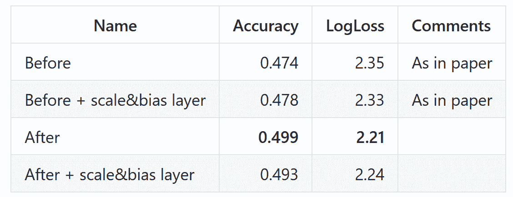

从前面的表格可以看出，将 BN 放置在非线性操作之后是正确的做法。第二个问题是：BN 层应该使用什么激活函数？好吧，从相同的基准测试中，我们可以看到以下结果：

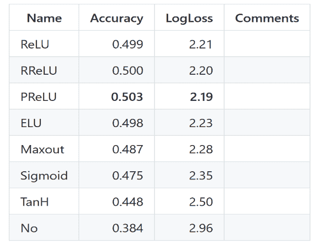

从前面的表格来看，我们可以假设使用 ReLU 或其变种会是一个更好的选择。现在，另一个问题是如何在深度学习库中使用这些方法。在 TensorFlow 中，它是：

```py
training = tf.placeholder(tf.bool)
x = tf.layers.dense(input_x, units=100)
x = tf.layers.batch_normalization(x, training=training)
x = tf.nn.relu(x)
```

一般警告：将此设置为`True`用于训练，设置为`False`用于测试。然而，前面的添加会引入额外的操作，这些操作会在图中更新其均值和方差变量，以确保它们不会成为训练操作的依赖项。为此，我们可以像下面这样单独运行这些操作：

```py
extra_update_ops = tf.get_collection(tf.GraphKeys.UPDATE_OPS)
sess.run([train_op, extra_update_ops], ...)
```

# 高级正则化与避免过拟合

如前一章节所述，在训练大规模神经网络时观察到的主要缺点之一是过拟合，即对于训练数据生成了非常好的近似，但对于单个点之间的区域则发出噪声。减少或甚至避免这个问题有几种方法，比如 dropout、提前停止和限制参数数量。

在过拟合的情况下，模型被特别调整以适应训练数据集，因此它不能用于泛化。因此，尽管它在训练集上表现良好，但在测试数据集及随后的测试中表现较差，因为它缺乏泛化能力。

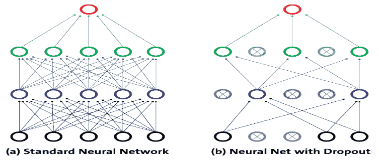

图 10：使用 dropout 与不使用 dropout 的对比

这种方法的主要优势在于，它避免了同步地优化层中所有神经元的权重。通过随机分组进行的这种适应性调整，防止了所有神经元趋向于相同的目标，从而去相关化了适应的权重。在 dropout 应用中发现的第二个特点是，隐藏单元的激活变得稀疏，这也是一个理想的特性。

在前面的图中，我们展示了一个原始的全连接多层神经网络及其与 dropout 连接的相关网络。因此，大约一半的输入被置为零（此示例选择了这个情况，以展示概率并不总是给出预期的四个零）。一个可能让你感到意外的因素是，应用于未被丢弃元素的缩放因子。

该技术用于保持相同的网络，在训练时将其恢复为原始架构，并使用`dropout_keep_prob`设置为 1。使用 dropout 的一个主要缺点是，它对卷积层没有相同的效果，因为卷积层中的神经元不是全连接的。为了解决这个问题，可以应用一些技术，如 DropConnect 和随机池化：

+   DropConnect 与 dropout 类似，它在模型中引入了动态稀疏性，但不同之处在于，稀疏性作用于权重，而不是层的输出向量。关键是，带有 DropConnect 的全连接层变成了一个稀疏连接层，其中连接在训练阶段是随机选择的。

+   在随机池化中，常规的确定性池化操作被一个随机过程所替代，在这个过程中，每个池化区域内的激活值都是根据池化区域内的活动，通过多项分布随机选择的。这种方法不依赖于超参数，可以与其他正则化方法结合使用，如 dropout 和数据增强。

**随机池化与标准最大池化：** 随机池化等价于标准的最大池化，但它使用了多个输入图像副本，每个副本具有小的局部变形。

其次，防止网络过拟合的最简单方法之一是简单地在过拟合有机会发生之前停止训练。这样做的缺点是学习过程会被暂停。第三，限制参数的数量有时是有帮助的，有助于避免过拟合。对于 CNN 训练来说，滤波器大小也会影响参数的数量。因此，限制这类参数直接限制了网络的预测能力，减少了它对数据执行的函数的复杂性，从而限制了过拟合的程度。

# 在 TensorFlow 中应用 dropout 操作

如果我们对一个样本向量应用 dropout 操作，它将作用于将 dropout 传递给所有依赖于架构的单元。为了应用 dropout 操作，TensorFlow 实现了 `tf.nn.dropout` 方法，其工作原理如下：

```py
tf.nn.dropout (x, keep_prob, noise_shape, seed, name)
```

其中 `x` 是原始张量。`keep_prob` 表示保留神经元的概率，以及剩余节点被乘的因子。`noise_shape` 表示一个四个元素的列表，用于确定某个维度是否会独立应用零化操作。让我们看一下这段代码：

```py
import tensorflow as tf X = [1.5, 0.5, 0.75, 1.0, 0.75, 0.6, 0.4, 0.9] 
drop_out = tf.nn.dropout(X, 0.5) 
sess = tf.Session() with sess.as_default(): 
    print(drop_out.eval()) 
sess.close() 
```

```py
[ 3\. 0\. 1.5 0\. 0\. 1.20000005 0\. 1.79999995]
```

在前面的示例中，你可以看到将 dropout 应用到 `x` 变量的结果，零的概率为 0.5；在没有发生的情况下，值被加倍（乘以 1/1.5，dropout 概率）。

# 使用哪个优化器？

在使用 CNN 时，由于目标函数之一是最小化评估的成本，我们必须定义一个优化器。使用最常见的优化器，如 SGD，学习率必须按 *1/T* 的比例缩放才能收敛，其中 `T` 是迭代次数。Adam 或 RMSProp 试图通过自动调整步长来克服这一限制，从而使步长与梯度的尺度相同。此外，在前面的示例中，我们使用了 Adam 优化器，它在大多数情况下表现良好。

然而，如果你正在训练一个神经网络并且计算梯度是必需的，使用`RMSPropOptimizer`函数（该函数实现了`RMSProp`算法）是一个更好的选择，因为它是小批量设置下学习的更快速方法。研究人员还建议在训练深度 CNN 或 DNN 时使用动量优化器。技术上，`RMSPropOptimizer`是梯度下降的高级形式，它通过一个指数衰减的梯度平方均值来调整学习率。建议的衰减参数设置值是 0.9，而学习率的一个良好默认值是 0.001。例如，在 TensorFlow 中，`tf.train.RMSPropOptimizer()`帮助我们轻松使用此方法：

```py
optimizer = tf.train.RMSPropOptimizer(0.001, 0.9).minimize(cost_op)
```

# 内存调优

在本节中，我们尝试提供一些见解。我们从一个问题及其解决方案开始；卷积层需要大量的内存，尤其是在训练期间，因为反向传播的反向传递需要保留在前向传递中计算的所有中间值。在推理期间（即对新实例进行预测时），一个层占用的内存可以在下一个层计算完成后立即释放，因此你只需要两层连续层所需的内存。

然而，在训练期间，前向传递中计算的所有内容需要保留以供反向传递使用，因此所需的内存量（至少）是所有层所需的总内存。如果在训练 CNN 时 GPU 内存不足，这里有五个你可以尝试解决问题的方法（除了购买更大内存的 GPU）：

+   减小小批量大小

+   使用更大的步幅在一层或多层中降低维度

+   删除一层或多层

+   使用 16 位浮点数而不是 32 位

+   将 CNN 分布到多个设备上（更多内容请见[`www.tensorflow.org/deploy/distributed`](https://www.tensorflow.org/deploy/distributed)）

# 合适的层次放置

另一个重要问题是：你何时希望添加最大池化层，而不是具有相同步幅的卷积层？问题在于，最大池化层完全没有参数，而卷积层有相当多的参数。

即使添加一个局部响应归一化层，有时也会导致最强激活的神经元抑制相同位置但在邻近特征图上的神经元，这鼓励不同的特征图进行专业化并将它们推开，迫使它们探索更广泛的特征。它通常用于低层，以便提供更大的低级特征池，供高层构建。

# 通过将所有内容组合起来构建第二个 CNN

现在我们知道如何通过添加 dropout、BN 和偏置初始化器（如 Xavier）来优化 CNN 中的分层结构。让我们尝试将这些应用于一个较简单的 CNN。在这个例子中，我们将看到如何解决一个实际的分类问题。更具体地说，我们的 CNN 模型将能够从一堆图像中分类交通标志。

# 数据集描述和预处理

为此，我们将使用比利时交通数据集（比利时交通标志分类数据集，裁剪图像）。这个数据集可以从 [`btsd.ethz.ch/shareddata/`](http://btsd.ethz.ch/shareddata/) 下载。以下是比利时交通标志的概览：

+   比利时的交通标志通常使用荷兰语和法语。这是一个值得了解的信息，但对于你将要处理的数据集来说，这一点并不是特别重要！

+   比利时的交通标志分为六类：警告标志、优先标志、禁止标志、强制标志、与停车和路面停靠相关的标志，以及最后的标识性标志。

一旦我们下载了上述数据集，我们将看到以下的目录结构（左侧为训练集，右侧为测试集）：

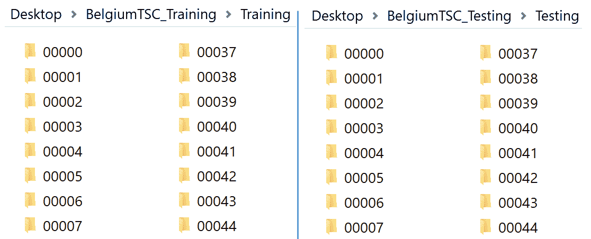

这些图像是 `.ppm` 格式的；否则我们可以使用 TensorFlow 内置的图像加载器（例如 `tf.image.decode_png`）。不过，我们可以使用 `skimage` Python 包。

在 Python 3 中，执行 `$ sudo pip3 install scikit-image` 来安装 `skimage` 包并使用它。所以让我们从显示如下的目录路径开始：

```py
Train_IMAGE_DIR = "<path>/BelgiumTSC_Training/"
Test_IMAGE_DIR = ""<path>/BelgiumTSC_Testing/"
```

接着，让我们写一个使用 `skimage` 库的函数，读取图像并返回两个列表：

+   `images`: 一个包含 Numpy 数组的列表，每个数组表示一张图像

+   `labels`: 一个数字列表，表示图像的标签

```py
def load_data(data_dir):
    # All subdirectories, where each folder represents a unique label
    directories = [d for d in os.listdir(data_dir)if os.path.isdir(os.path.join(data_dir, d))]

    # Iterate label directories and collect data in two lists, labels and images.
    labels = []
    images = []
    for d in directories:label_dir = os.path.join(data_dir, d)
    file_names = [os.path.join(label_dir, f) 
                for f in os.listdir(label_dir) if f.endswith(".ppm")]

    # For each label, load it's images and add them to the images list.
    # And add the label number (i.e. directory name) to the labels list.
    for f in file_names:images.append(skimage.data.imread(f))
    labels.append(int(d))
    return images, labels
```

上面的代码块很直观，并包含内联注释。如何显示与图像相关的统计信息呢？不过，在此之前，让我们调用上面的函数：

```py
# Load training and testing datasets.
train_data_dir = os.path.join(Train_IMAGE_DIR, "Training")
test_data_dir = os.path.join(Test_IMAGE_DIR, "Testing")

images, labels = load_data(train_data_dir)
```

然后让我们查看一些统计信息：

```py
print("Unique classes: {0} \nTotal Images: {1}".format(len(set(labels)), len(images)))
```

```py
>>>
Unique classes: 62
Total Images: 4575
```

因此，我们有 62 个类别需要预测（也就是一个多类别图像分类问题），而且我们也有许多图像，这应该足以满足一个较小的 CNN。现在让我们来直观地查看类别分布：

```py
# Make a histogram with 62 bins of the `labels` data and show the plot: 
plt.hist(labels, 62)
plt.xlabel('Class')
plt.ylabel('Number of training examples')
plt.show()
```

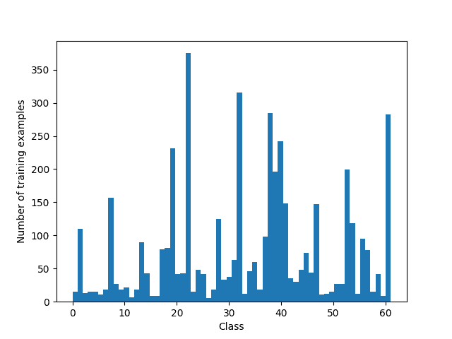

因此，从前面的图示中，我们可以看到类别非常不平衡。然而，为了简化问题，我们不打算处理这一点，接下来，我们可以通过可视化检查一些文件，例如显示每个标签的第一张图片：

```py
def display_images_and_labels(images, labels):
    unique_labels = set(labels)
    plt.figure(figsize=(15, 15))
    i = 1
    for label in unique_labels:
        # Pick the first image for each label.
        image = images[labels.index(label)]
        plt.subplot(8, 8, i) # A grid of 8 rows x 8 column
        splt.axis('off')
        plt.title("Label {0} ({1})".format(label, labels.count(label)))
        i += 1        
        _= plt.imshow(image)
        plt.show()
display_images_and_labels(images, labels)
```

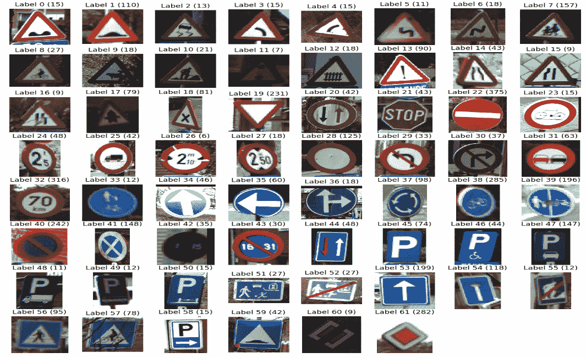

现在你可以从前面的图示中看到，这些图像的大小和形状各不相同。此外，我们还可以通过 Python 代码看到这一点，如下所示：

```py
for img in images[:5]:
    print("shape: {0}, min: {1}, max: {2}".format(img.shape, img.min(), img.max()))
```

```py
>>>
shape: (87, 84, 3), min: 12, max: 255
shape: (289, 169, 3), min: 0, max: 255
shape: (205, 76, 3), min: 0, max: 255
shape: (72, 71, 3), min: 14, max: 185
shape: (231, 228, 3), min: 0, max: 255
```

因此，我们需要对每张图像进行一些预处理，比如调整大小、重塑等等。假设每张图像的大小为 32 x 32：

```py
images32 = [skimage.transform.resize(img, (32, 32), mode='constant') 

for img in images]for img in images32[:5]:
    print("shape: {0}, min: {1}, max: {2}".format(img.shape, img.min(), img.max()))
```

```py
>>>
shape: (32, 32, 3), min: 0.06642539828431372, max: 0.9704350490196079
shape: (32, 32, 3), min: 0.0, max: 1.0
shape: (32, 32, 3), min: 0.03172870710784261, max: 1.0
shape: (32, 32, 3), min: 0.059474571078431314, max: 0.7036305147058846
shape: (32, 32, 3), min: 0.01506204044117481, max: 1.0
```

现在，我们的所有图像都有相同的大小。接下来的任务是将标签和图像特征转换为 `numpy` 数组：

```py
labels_array = np.array(labels)
images_array = np.array(images32)
print("labels: ", labels_array.shape, "nimages: ", images_array.shape)
```

```py
>>>
labels: (4575,)
images: (4575, 32, 32, 3)
```

太棒了！接下来的任务将是创建我们的第二个 CNN，但这次我们将使用 TensorFlow `contrib` 包，这是一个支持层操作的高级 API。

# 创建 CNN 模型

我们即将构建一个复杂的网络。然而，它具有简单的架构。首先，我们使用 Xavier 初始化网络。初始化网络偏置后，输入层后跟卷积层（卷积层 1），然后是 BN 层（即 BN 层 1）。然后是步幅为两个、核大小为两个的池化层。接着第二个卷积层后跟另一个 BN 层。接下来是步幅为两个、核大小为两个的第二个池化层。然后是最大池化层，后面是一个将输入从（None，高度，宽度，通道）扁平化为（None，高度 * 宽度 * 通道）==（None，3072）的扁平化层。

扁平化完成后，输入被送入第一个全连接层 1。然后第三个 BN 被应用为正常化函数。然后在将轻网络馈送到生成大小为（None，62）的 logits 的第二个全连接层 2 之前，我们将有一个 dropout 层。太多了吗？别担心，我们将一步步看到它。让我们从创建计算图开始编码，创建特征和标签占位符：

```py
graph = tf.Graph()
with graph.as_default():
    # Placeholders for inputs and labels.
    images_X = tf.placeholder(tf.float32, [None, 32, 32, 3]) # each image's 32x32 size
    labels_X = tf.placeholder(tf.int32, [None])

    # Initializer: Xavier
     biasInit = tf.contrib.layers.xavier_initializer(uniform=True, seed=None, dtype=tf.float32)

    # Convolution layer 1: number of neurons 128 and kernel size is 6x6.
     conv1 = tf.contrib.layers.conv2d(images_X, num_outputs=128, kernel_size=[6, 6],     
            biases_initializer=biasInit)

    # Batch normalization layer 1: can be applied as a normalizer 
    # function for conv2d and fully_connected
    bn1 = tf.contrib.layers.batch_norm(conv1, center=True, scale=True, is_training=True)

    # Max Pooling (down sampling) with strides of 2 and kernel size of 2
    pool1 = tf.contrib.layers.max_pool2d(bn1, 2, 2)

    # Convolution layer 2: number of neurons 256 and kernel size is 6x6.
    conv2 = tf.contrib.layers.conv2d(pool1, num_outputs=256, kernel_size=[4, 4], stride=2,     
        biases_initializer=biasInit)

    # Batch normalization layer 2: 
    bn2 = tf.contrib.layers.batch_norm(conv2, center=True, scale=True, is_training=True)

    # Max Pooling (down-sampling) with strides of 2 and kernel size of 2
    pool2 = tf.contrib.layers.max_pool2d(bn2, 2, 2)

    # Flatten the input from [None, height, width, channels] to 
    # [None, height * width * channels] == [None, 3072]
    images_flat = tf.contrib.layers.flatten(pool2)

    # Fully connected layer 1
    fc1 = tf.contrib.layers.fully_connected(images_flat, 512, tf.nn.relu)

    # Batch normalization layer 3
    bn3 = tf.contrib.layers.batch_norm(fc1, center=True, scale=True, is_training=True)

    # apply dropout, if is_training is False, dropout is not applied
    fc1 = tf.layers.dropout(bn3, rate=0.25, training=True)

    # Fully connected layer 2 that generates logits of size [None, 62]. 
    # Here 62 means number of classes to be predicted.
    logits = tf.contrib.layers.fully_connected(fc1, 62, tf.nn.relu)
```

到目前为止，我们已经成功生成了大小为（`None, 62`）的 logits。然后，我们需要将 logits 转换为标签索引（`int`），形状为（`None`），即一个长度为 `batch_size` 的 1D 向量：`predicted_labels = tf.argmax(logits, axis=1)`。然后我们定义交叉熵作为 `loss` 函数，这对于分类是一个不错的选择：

```py
loss_op = tf.reduce_mean(tf.nn.sparse_softmax_cross_entropy_with_logits(logits=logits, labels=labels_X))
```

现在，其中一个最重要的部分是更新操作并创建优化器（在我们的案例中是 Adam）：

```py
update_ops = tf.get_collection(tf.GraphKeys.UPDATE_OPS)
with tf.control_dependencies(update_ops):
    # Create an optimizer, which acts as the training op.train =             
    tf.train.AdamOptimizer(learning_rate=0.10).minimize(loss_op)
```

最后，我们初始化所有操作：

```py
init_op = tf.global_variables_initializer()
```

# 训练和评估网络

我们开始创建一个会话来运行我们创建的图形。请注意，为了更快地训练，我们应该使用 GPU。但如果您没有 GPU，只需设置 `log_device_placement=False`：

```py
session = tf.Session(graph=graph, config=tf.ConfigProto(log_device_placement=True))
session.run(init_op)
for i in range(300):
    _, loss_value = session.run([train, loss_op], feed_dict={images_X: images_array, labels_X: 
    labels_array})
    if i % 10 == 0:
        print("Loss: ", loss_value)
```

```py
>>>
Loss: 4.7910895
Loss: 4.3410876
Loss: 4.0275432
...
Loss: 0.523456
```

训练完成后，让我们随机挑选 10 张图片，看看我们模型的预测能力：

```py
random_indexes = random.sample(range(len(images32)), 10)
random_images = [images32[i]
for i in random_indexes]
    random_labels = [labels[i]
for i in random_indexes]
```

然后让我们运行 `predicted_labels op`：

```py
predicted = session.run([predicted_labels], feed_dict={images_X: random_images})[0]
print(random_labels)
print(predicted)
```

```py
>>>
[38, 21, 19, 39, 22, 22, 45, 18, 22, 53]
[20  21  19  51  22  22  45  53  22  53]
```

我们可以看到，一些图片被正确分类了，而一些则错误分类了。然而，视觉检查可能会更有帮助。因此，让我们显示预测和实际情况：

```py
fig = plt.figure(figsize=(5, 5))
for i in range(len(random_images)):
    truth = random_labels[i]
    prediction = predicted[i]
    plt.subplot(5, 2,1+i)
    plt.axis('off')color='green' 
    if truth == prediction 
    else
     'red'plt.text(40, 10, "Truth: {0}nPrediction: {1}".format(truth, prediction), fontsize=12,     
    color=color)
plt.imshow(random_images[i])
>>> 
```

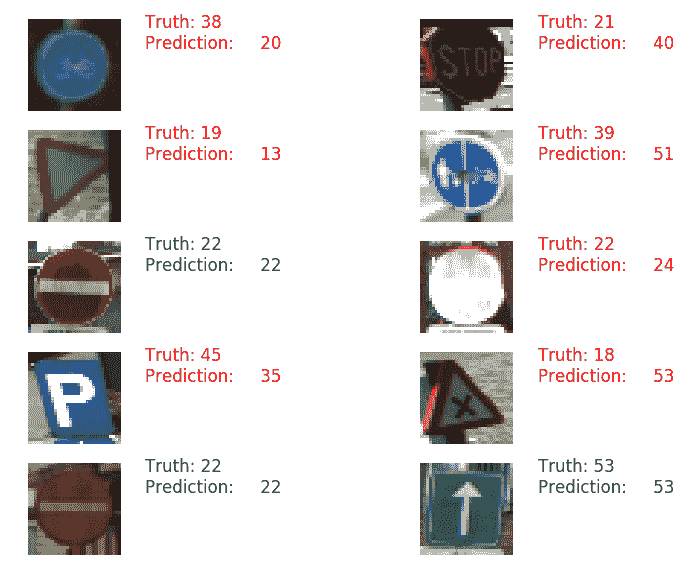

最后，我们可以使用测试集来评估我们的模型。为了看到预测能力，我们计算准确率：

```py
# Load the test dataset.
test_X, test_y = load_data(test_data_dir)

# Transform the images, just as we did with the training set.
test_images32 = [skimage.transform.resize(img, (32, 32), mode='constant') 
for img in test_X]
    display_images_and_labels(test_images32, test_y)

# Run predictions against the test 
setpredicted = session.run([predicted_labels], feed_dict={images_X: test_images32})[0]

# Calculate how many matches
match_count = sum([int(y == y_) for y, y_ in zip(test_y, predicted)])
accuracy = match_count / len(test_y)print("Accuracy: {:.3f}".format(accuracy))
```

```py
>>
Accuracy: 87.583 
```

就准确性而言，并不算糟糕。除此之外，我们还可以计算其他性能指标，如精确度、召回率、F1 值，并将结果可视化为混淆矩阵，以展示预测与实际标签的计数。不过，通过调整网络和超参数，我们仍然可以提高准确性。但这些工作留给读者来完成。

最后，我们完成了任务，接下来让我们关闭 TensorFlow 会话：

```py
session.close()
```

# 总结

在本章中，我们讨论了如何使用 CNN（卷积神经网络），它是一种前馈式人工神经网络，神经元之间的连接模式受到动物视觉皮层组织的启发。我们学习了如何级联一组层来构建 CNN，并在每一层执行不同的操作。接着我们讲解了如何训练 CNN。随后，我们讨论了如何优化 CNN 的超参数和优化方法。

最后，我们构建了另一个 CNN，并在其中应用了所有优化技术。我们的 CNN 模型未能达到出色的准确率，因为我们只对这两个 CNN 进行了几次迭代，甚至没有使用网格搜索技术；这意味着我们没有寻找超参数的最佳组合。因此，收获的经验是：需要在原始图像中应用更强大的特征工程，使用最佳超参数进行更多轮的训练，并观察性能表现。

在下一章中，我们将学习如何使用一些更深层次且流行的 CNN 架构，例如 ImageNet、AlexNet、VGG、GoogLeNet 和 ResNet。我们将了解如何利用这些训练好的模型进行迁移学习。
