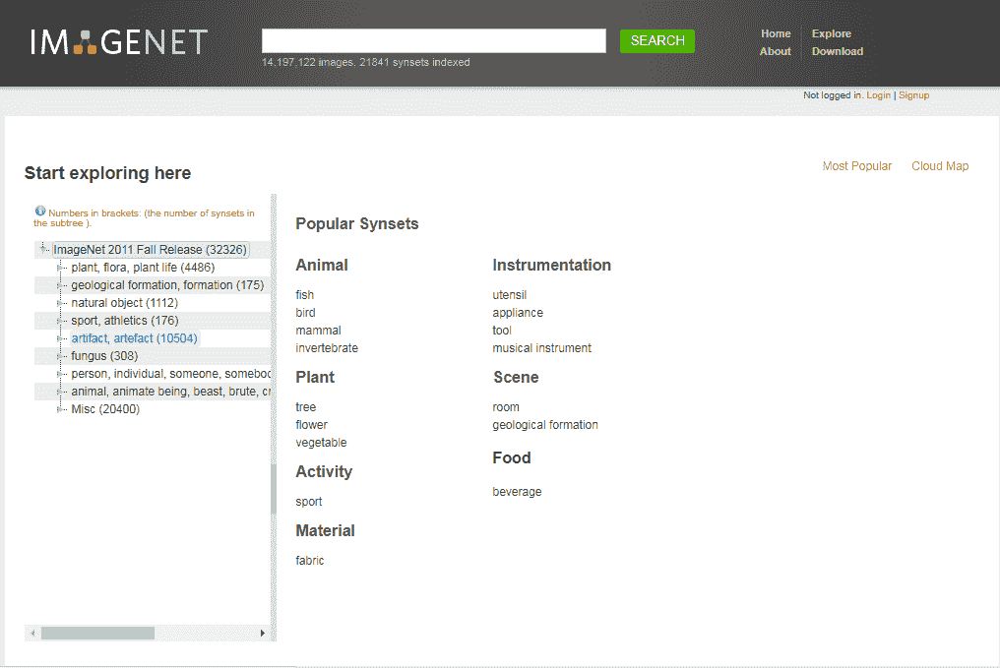
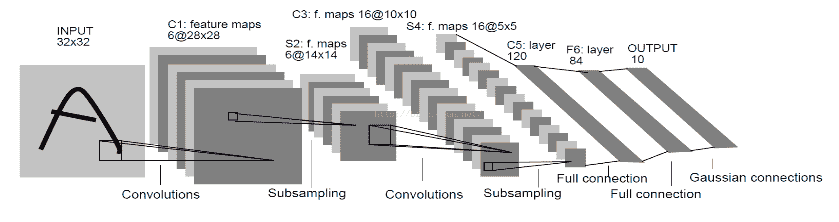
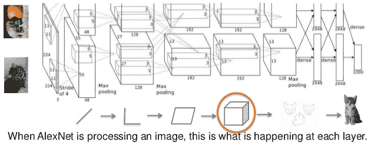
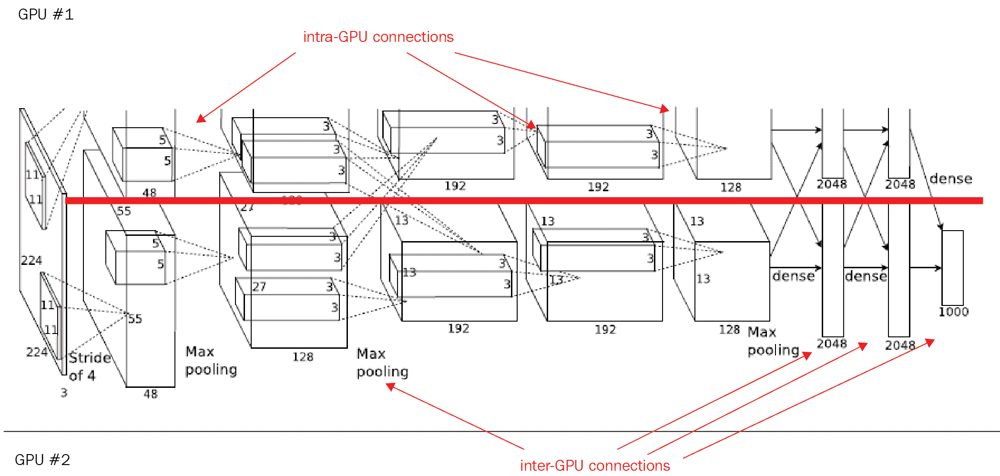
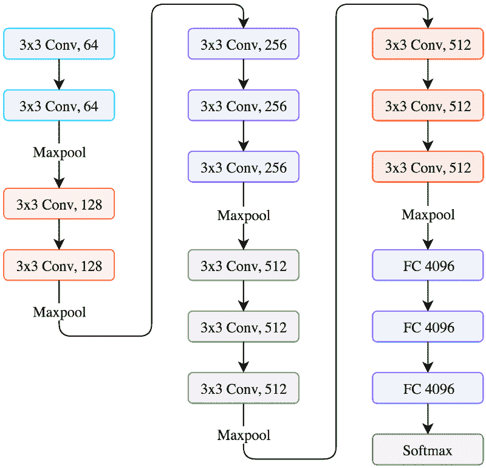
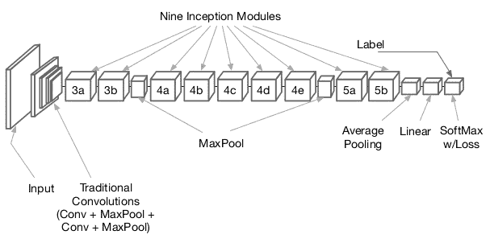
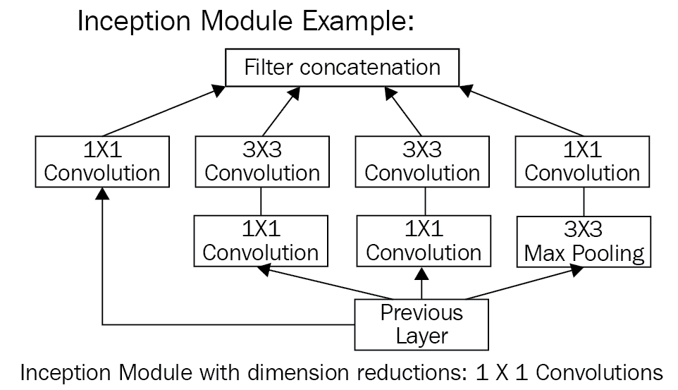
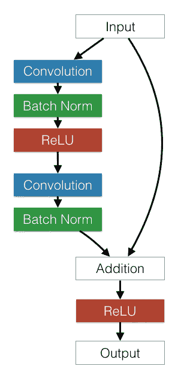

# 第四章：流行的 CNN 模型架构

在本章中，我们将介绍 ImageNet 图像数据库，并讨论以下流行 CNN 模型的架构：

+   LeNet

+   AlexNet

+   VGG

+   GoogLeNet

+   ResNet

# ImageNet 介绍

ImageNet 是一个包含超过 1500 万张手工标注的高分辨率图像的数据库，涵盖大约 22,000 个类别。该数据库的组织结构类似于 WordNet 层次结构，其中每个概念也被称为 **同义集**（即 **synset**）。每个同义集都是 ImageNet 层次结构中的一个节点。每个节点包含超过 500 张图像。

**ImageNet 大规模视觉识别挑战赛** (**ILSVRC**) 于 2010 年成立，旨在大规模提升物体检测和图像分类的最先进技术：



在概述了 ImageNet 之后，我们将进一步介绍各种 CNN 模型架构。

# LeNet

2010 年，ImageNet 发起了一项挑战（称为 **ILSVRC 2010**），该挑战使用了 Yann Lecun 构建的 CNN 架构 LeNet 5。该网络以 32 x 32 的图像作为输入，图像经过卷积层（**C1**），然后进入子采样层（**S2**）。今天，子采样层已被池化层替代。接着，又有一系列卷积层（**C3**），然后是一个池化（即子采样）层（**S4**）。最后，网络有三个全连接层，其中包括最后的 **OUTPUT** 层。该网络曾用于邮局的邮政编码识别。从那时起，每年都有不同的 CNN 架构通过这一竞赛得以推出：



LeNet 5 – 来自 Yann Lecun 1998 年文章的 CNN 架构

因此，我们可以得出以下几点结论：

+   该网络的输入为一张灰度 32 x 32 的图像

+   实现的架构是一个 CONV 层，接着是 POOL 层和一个全连接层

+   CONV 滤波器为 5 x 5，以步幅为 1 应用

# AlexNet 架构

CNN 架构的第一个突破发生在 2012 年。这一获奖的 CNN 架构被称为 **AlexNet**，由多伦多大学的 Alex Krizhevsky 和他的教授 Jeffry Hinton 开发。

在第一次运行时，该网络使用了 ReLU 激活函数和 0.5 的 dropout 来抵抗过拟合。如以下图所示，架构中使用了一个归一化层，但由于使用了大量的数据增强技术，这在实际应用中已不再使用。尽管如今已有更为精确的网络，但由于其相对简单的结构和较小的深度，AlexNet 仍然在今天被广泛使用，尤其是在计算机视觉领域：



AlexNet 使用两个独立的 GPU 在 ImageNet 数据库上进行训练，可能是由于当时 GPU 间连接的处理限制，正如下图所示：



# 使用 AlexNet 的交通标志分类器

在这个例子中，我们将使用迁移学习进行特征提取，并使用一个德国交通标志数据集来开发分类器。这里使用的是 Michael Guerzhoy 和 Davi Frossard 实现的 AlexNet，AlexNet 的权重来自伯克利视觉与学习中心。完整的代码和数据集可以从 [这里](https://example.org)下载。

AlexNet 期望输入的是 227 x 227 x 3 像素的图像，而交通标志图像的尺寸是 32 x 32 x 3 像素。为了将交通标志图像输入到 AlexNet 中，我们需要将图像调整为 AlexNet 所期望的尺寸，即 227 x 227 x 3：

```py
original_image = tf.placeholder(tf.float32, (None, 32, 32, 3))
resized_image = tf.image.resize_images(original_imag, (227, 227))
```

我们可以借助 TensorFlow 的 `tf.image.resize_images` 方法来实现。另一个问题是，AlexNet 是在 ImageNet 数据集上训练的，该数据集有 1,000 个类别的图像。因此，我们将用一个 43 神经元的分类层替换这一层。为此，首先计算最后一个全连接层输出的大小；由于这是一个全连接层，因此它的输出是一个 2D 形状，最后一个元素就是输出的大小。`fc7.get_shape().as_list()[-1]` 完成了这个任务；然后将其与交通标志数据集的类别数结合，得到最终全连接层的形状：`shape = (fc7.get_shape().as_list()[-1], 43)`。其余代码只是 TensorFlow 中定义全连接层的标准方式。最后，通过 `softmax` 计算概率：

```py
#Refer AlexNet implementation code, returns last fully connected layer
fc7 = AlexNet(resized, feature_extract=True)
shape = (fc7.get_shape().as_list()[-1], 43)
fc8_weight = tf.Variable(tf.truncated_normal(shape, stddev=1e-2))
fc8_b = tf.Variable(tf.zeros(43))
logits = tf.nn.xw_plus_b(fc7, fc8_weight, fc8_b)
probs = tf.nn.softmax(logits)
```

# VGGNet 架构

2014 年 ImageNet 挑战赛的亚军是来自牛津大学视觉几何小组的 VGGNet。这个卷积神经网络架构简单而优雅，错误率为 7.3%。它有两个版本：VGG16 和 VGG19。

VGG16 是一个 16 层神经网络，不包括最大池化层和 softmax 层。因此，它被称为 VGG16。VGG19 由 19 层组成。Keras 中有一个预训练模型，适用于 Theano 和 TensorFlow 后端。

这里的关键设计考虑因素是网络的深度。通过增加更多的卷积层来增加网络的深度，这样做是因为所有层中的卷积滤波器大小都为 3 x 3。该模型的默认输入图像大小为 224 x 224 x 3。图像通过一系列卷积层进行处理，步幅为 1 个像素，填充为 1。整个网络使用 3 x 3 卷积。最大池化在一个 2 x 2 像素窗口中进行，步幅为 2，然后是另一组卷积层，接着是三个全连接层。前两个全连接层每个有 4,096 个神经元，第三个全连接层负责分类，包含 1,000 个神经元。最后一层是 softmax 层。与 AlexNet 的 11 x 11 卷积窗口相比，VGG16 使用了更小的 3 x 3 卷积窗口。所有隐藏层都使用 ReLU 激活函数。网络架构如下所示：



VGG16 网络架构

由于小型的 3 x 3 卷积滤波器，VGGNet 的深度得以增加。该网络的参数数量大约为 1.4 亿，主要来自于第一个全连接层。在后来的架构中，VGGNet 的全连接层被**全局平均池化**（**GAP**）层替代，以减少参数数量。

另一个观察是，随着图像尺寸的减小，滤波器的数量会增加。

# VGG16 图像分类代码示例

Keras 应用模块包含了预训练的神经网络模型，以及基于 ImageNet 训练的预训练权重。这些模型可以直接用于预测、特征提取和微调：

```py
#import VGG16 network model and other necessary libraries 

from keras.applications.vgg16 import VGG16
from keras.preprocessing import image
from keras.applications.vgg16 import preprocess_input
import numpy as np

#Instantiate VGG16 and returns a vgg16 model instance 
vgg16_model = VGG16(weights='imagenet', include_top=False) 
#include_top: whether to include the 3 fully-connected layers at the top of the network.
#This has to be True for classification and False for feature extraction. Returns a model instance
#weights:'imagenet' means model is pre-training on ImageNet data.
model = VGG16(weights='imagenet', include_top=True)
model.summary()

#image file name to classify
image_path = 'jumping_dolphin.jpg'
#load the input image with keras helper utilities and resize the image. 
#Default input size for this model is 224x224 pixels.
img = image.load_img(image_path, target_size=(224, 224))
#convert PIL (Python Image Library??) image to numpy array
x = image.img_to_array(img)
print (x.shape)

#image is now represented by a NumPy array of shape (224, 224, 3),
# but we need to expand the dimensions to be (1, 224, 224, 3) so we can
# pass it through the network -- we'll also preprocess the image by
# subtracting the mean RGB pixel intensity from the ImageNet dataset
#Finally, we can load our Keras network and classify the image:

x = np.expand_dims(x, axis=0)
print (x.shape)

preprocessed_image = preprocess_input(x)

preds = model.predict(preprocessed_image)
print('Prediction:', decode_predictions(preds, top=2)[0])
```

当第一次执行上述脚本时，Keras 会**自动**下载并将架构权重缓存到磁盘中的`~/.keras/models`目录。随后的运行会更快。

# GoogLeNet 架构

2014 年，在 ILSVRC 比赛中，Google 发布了自己的网络，名为**GoogLeNet**。它的表现比 VGGNet 略好；GoogLeNet 的表现为 6.7%，而 VGGNet 的表现为 7.3%。GoogLeNet 的主要吸引力在于它运行非常快速，因为引入了一种叫做**inception 模块**的新概念，从而将参数数量减少到仅为 500 万；这是 AlexNet 的 12 倍还少。它的内存使用和功耗也更低。

它有 22 层，因此是一个非常深的网络。添加更多层会增加参数数量，并且可能导致网络过拟合。计算量也会增加，因为滤波器数量的线性增长会导致计算量的平方增长。因此，设计者使用了 inception 模块和 GAP。网络末端的全连接层被 GAP 层替代，因为全连接层通常容易导致过拟合。GAP 没有需要学习或优化的参数。

# 架构洞察

与以前的架构选择特定滤波器大小不同，GoogLeNet 设计者将 1 x 1、3 x 3 和 5 x 5 三种不同大小的滤波器应用到同一图像块上，再通过 3 x 3 最大池化和连接操作将它们合并为一个输出向量。

使用 1 x 1 卷积可以减少在计算量增加的地方，替代了昂贵的 3 x 3 和 5 x 5 卷积。在昂贵的 3 x 3 和 5 x 5 卷积之前，使用了带有 ReLU 激活函数的 1 x 1 卷积。

在 GoogLeNet 中，inception 模块一个接一个地堆叠。这种堆叠方式使得我们可以修改每个模块，而不会影响后面的层。例如，你可以增加或减少任何层的宽度：



GoogLeNet 架构

深度网络也面临着所谓的**梯度消失**问题，尤其是在反向传播时。通过向中间层添加辅助分类器，可以避免这一问题。此外，在训练过程中，将中间损失与折扣因子 0.3 相加，纳入总损失。

由于全连接层容易发生过拟合，因此被替换为 GAP 层。平均池化并不排除使用 dropout，这是一种用于克服深度神经网络中过拟合的正则化方法。GoogLeNet 在 60 层后添加了一个线性层，使用 GAP 层帮助其他人通过迁移学习技术为自己的分类器进行优化。

# Inception 模块

以下图像展示了一个 Inception 模块的例子：



# ResNet 架构

在达到一定深度后，向前馈卷积网络添加额外的层会导致训练误差和验证误差增加。增加层数时，性能只会在一定深度内提升，然后会迅速下降。在**ResNet**（**残差网络**）论文中，作者认为这种欠拟合不太可能是由于梯度消失问题引起的，因为即使使用批量归一化技术，这种情况仍然会发生。因此，他们提出了一个新的概念——**残差块**。ResNet 团队添加了可以跳过层的连接：

ResNet 使用标准卷积神经网络，并添加了可以一次跳过几个卷积层的连接。每个跳跃都形成一个残差块。



残差块

在 2015 年 ImageNet ILSVRC 竞赛中，微软的 ResNet 以 3.57%的错误率赢得了冠军。ResNet 在某种意义上类似于 VGG，因为它的结构会不断重复，从而使网络变得更深。与 VGGNet 不同，ResNet 有不同的深度变种，例如 34 层、50 层、101 层和 152 层。相比于 AlexNet 的 8 层、VGGNet 的 19 层和 GoogLeNet 的 22 层，它有着惊人的 152 层。ResNet 架构是由残差块堆叠而成。其主要思想是通过向神经网络添加连接来跳过某些层。每个残差块包含 3x3 的卷积层。最后的卷积层后面添加了一个 GAP 层。只有一个全连接层用于分类 1000 个类别。它有不同的深度变种，例如 34 层、50 层、101 层或 152 层，用于 ImageNet 数据集。对于更深的网络，比如超过 50 层的网络，使用了**瓶颈**特征概念来提高效率。这个网络没有使用 dropout。

其他需要注意的网络架构包括：

+   网络中的网络

+   超越 ResNet

+   FractalNet，一个没有残差的超深神经网络

# 摘要

本章中，我们学习了不同的 CNN 架构。这些模型是预训练的现有模型，在网络架构上有所不同。每个网络都是为了针对其架构特定的问题而设计的。因此，我们在此描述了它们的架构差异。

我们还理解了我们自己定义的 CNN 架构（在上一章中提到的）与这些先进架构之间的区别。

在下一章，我们将学习如何将这些预训练模型用于迁移学习。
