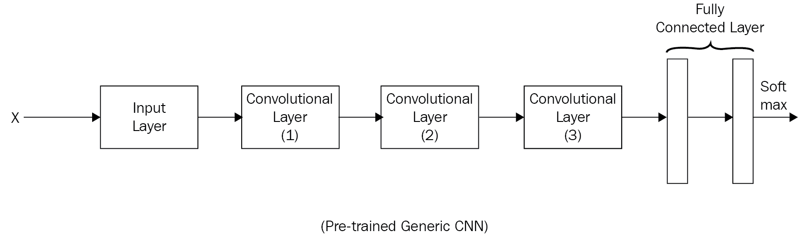
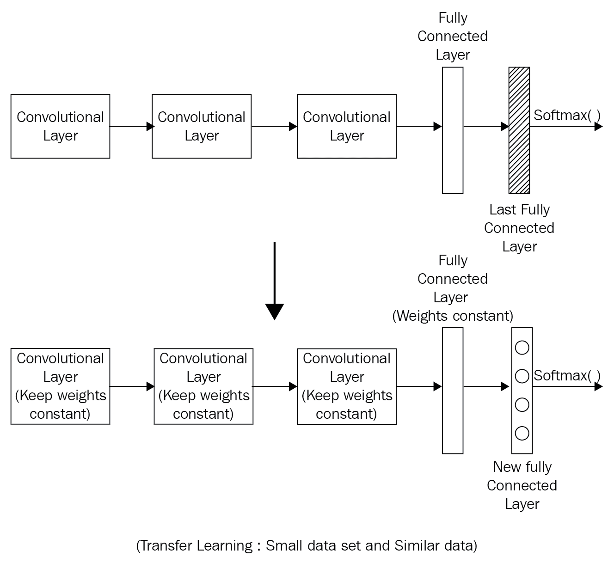
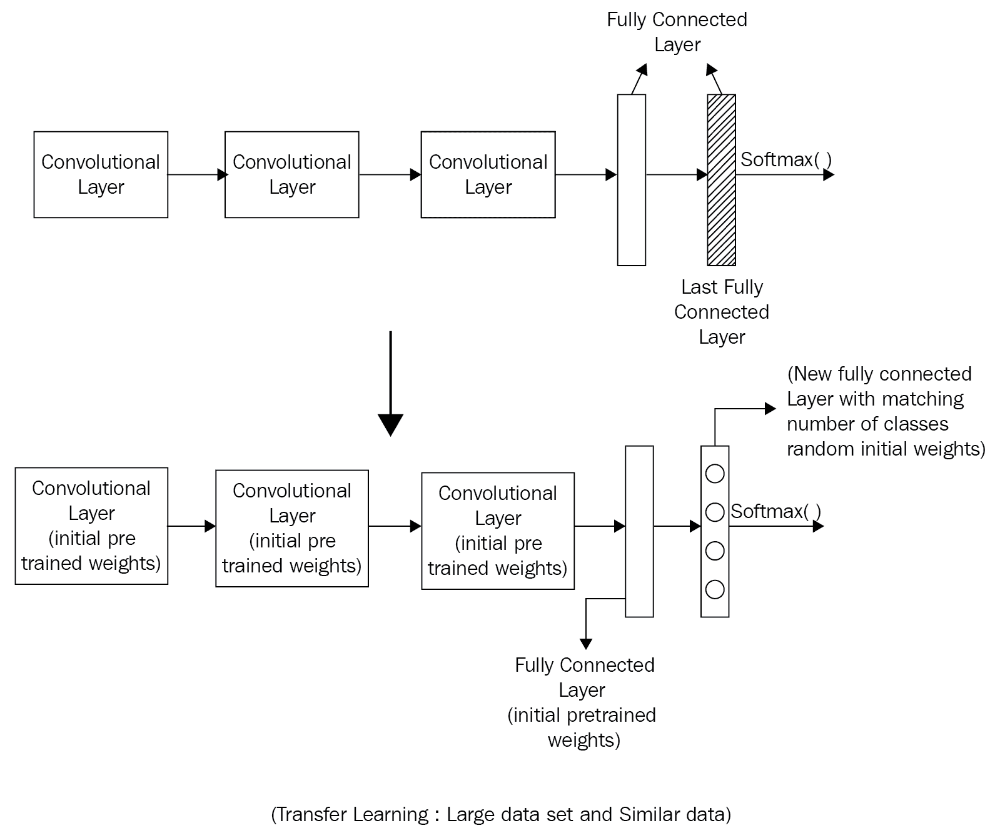
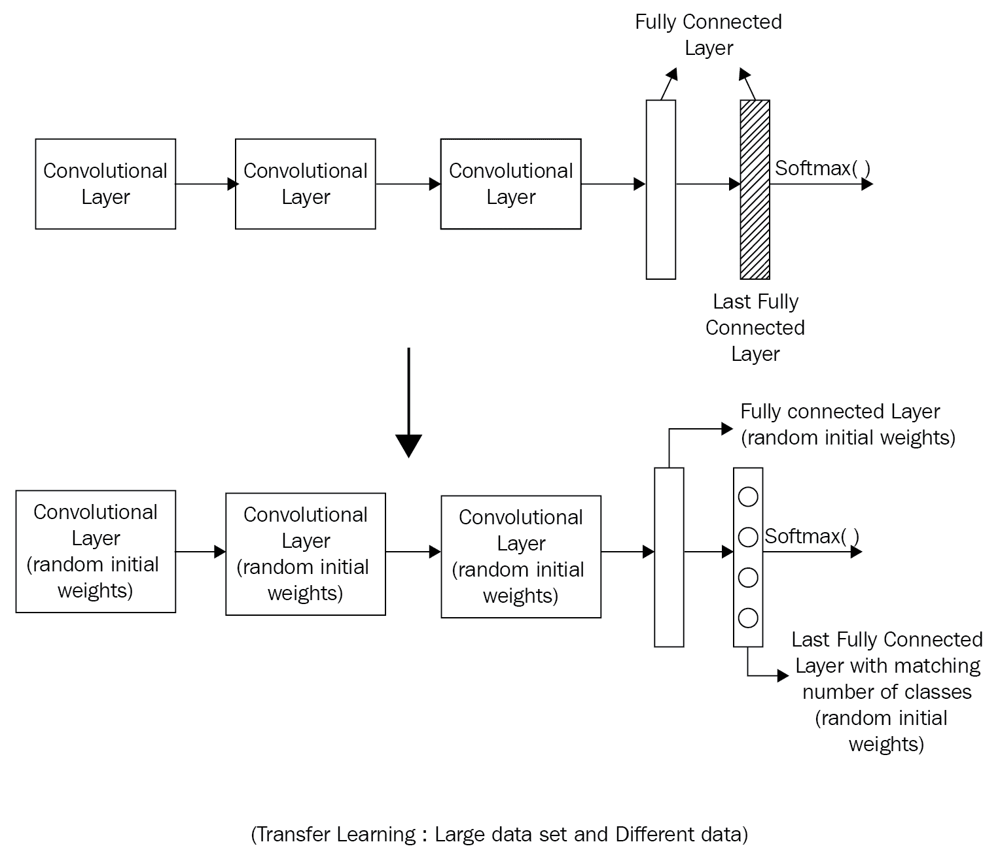
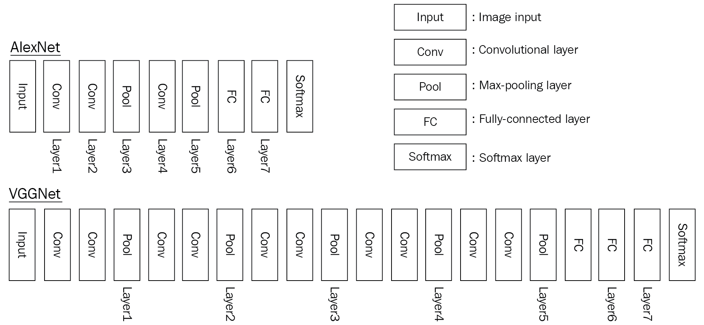

# 第五章：迁移学习

在上一章中，我们学习了卷积神经网络（CNN）由多个层组成。我们还研究了不同的 CNN 架构，调整了不同的超参数，并确定了步幅、窗口大小和填充的值。然后我们选择了一个合适的损失函数并进行了优化。我们用大量图像训练了这个架构。那么，问题来了，我们如何利用这些知识处理不同的数据集呢？与其从头构建 CNN 架构并进行训练，不如使用一个现有的预训练网络，通过一种叫做**迁移学习**的技术将其适配到新的不同数据集上。我们可以通过特征提取和微调来实现这一点。

迁移学习是将已经训练好的网络的知识复制到新网络中，以解决类似问题的过程。

在本章中，我们将讨论以下主题：

+   特征提取方法

+   迁移学习示例

+   多任务学习

# 特征提取方法

在特征提取方法中，我们只训练网络的顶层；其余部分保持不变。当新的数据集相对较小且与原始数据集相似时，可以考虑采用特征提取方法。在这种情况下，从原始数据集中学到的高层次特征应能很好地迁移到新数据集。

当新的数据集较大且与原始数据集相似时，可以考虑微调方法。修改原始权重是安全的，因为网络不太可能会对新的、大型数据集发生过拟合。

让我们考虑一个预训练的卷积神经网络，如下图所示。通过这个示例，我们可以研究如何在不同情况下使用知识迁移：



我们什么时候使用迁移学习？迁移学习可以根据以下情况进行应用：

+   新的（目标）数据集的大小

+   原始数据集和目标数据集之间的相似性

主要有四种使用场景：

+   **案例 1**：新的（目标）数据集较小，并且与原始训练数据集相似

+   **案例 2**：新的（目标）数据集较小，但与原始训练数据集不同

+   **案例 3**：新的（目标）数据集较大，并且与原始训练数据集相似

+   **案例 4**：新的（目标）数据集较大，并且与原始训练数据集不同

现在让我们在接下来的章节中详细讲解每个案例。

# 目标数据集较小，并且与原始训练数据集相似

如果目标数据集较小且与原始数据集相似：

+   在这种情况下，用一个新的全连接层替换最后一个全连接层，使其与目标数据集的类别数量匹配

+   用随机权重初始化旧的权重

+   训练网络以更新新的全连接层的权重：



转移学习可以作为一种避免过拟合的策略，特别是在数据集较小的情况下。

# 目标数据集较小，但与原始训练数据集不同

如果目标数据集较小，但与原始数据集类型不同——例如，原始数据集是狗的图像，而新的（目标）数据集是花卉的图像——那么应执行以下操作：

+   切割网络的大部分初始层

+   在其余的预训练层中添加一个新的全连接层，该层的节点数与目标数据集的类别数相匹配

+   随机化新全连接层的权重，并冻结预训练网络的所有权重

+   训练网络以更新新全连接层的权重

由于数据集较小，过拟合在这里仍然是一个问题。为了解决这个问题，我们将保持原始预训练网络的权重不变，只更新新全连接层的权重：


只需微调网络的高层部分。这是因为开始的层是用来提取更通用的特征的。通常，卷积神经网络的第一层并不特定于某个数据集。

# 目标数据集较大并且与原始训练数据集相似

由于数据集很大，我们不需要担心过拟合。因此，在这种情况下，我们可以重新训练整个网络：

+   移除最后一个全连接层，并用一个与目标数据集类别数匹配的全连接层替换它

+   随机初始化新添加的全连接层的权重

+   使用预训练的权重初始化其余的权重

+   训练整个网络：



# 目标数据集较大，并且与原始训练数据集不同

如果目标数据集较大并且与原始数据集不同：

+   移除最后一个全连接层，并用一个与目标数据集类别数匹配的全连接层替换它

+   从头开始训练整个网络，并随机初始化权重：



`Caffe` 库有 ModelZoo，可以在其中共享网络权重。

当数据集很大并且与原始数据集完全不同时，考虑从头开始训练。在这种情况下，我们有足够的数据来从头开始训练，而不必担心过拟合。然而，即便如此，使用预训练权重初始化整个网络并在新数据集上进行微调可能还是有益的。

# 转移学习示例

在这个例子中，我们将采用预训练的 VGGNet，并使用迁移学习训练一个 CNN 分类器，该分类器根据狗的图像预测狗的品种。Keras 包含许多预训练模型，并提供加载和可视化这些模型的代码。另一个是可以在这里下载的花卉数据集。狗品种数据集有 133 个狗品种类别和 8,351 张狗的图像。请在这里下载狗品种数据集并将其复制到你的文件夹中。VGGNet 从头到尾包含 16 层卷积池化层，以及三个全连接层，后接一个`softmax`函数。它的主要目标是展示网络深度如何带来最佳性能。它来自牛津的**视觉几何组**(**VGG**)。他们表现最佳的网络是 VGG16。狗品种数据集相对较小，并与`imageNet`数据集有些重叠。所以我们可以去除卷积层之后的最后一个全连接层，并用我们自己的层替换它。卷积层的权重保持不变。输入图像通过卷积层并停留在第 16 层：



VGGNet 架构

我们将使用预训练的 VGG16 网络的瓶颈特征 —— 该网络已经从`imageNet`数据集中学习了特征。由于`imageNet`数据集已经包含了一些狗的图像，VGG16 网络模型已学到了用于分类的关键特征。类似地，其他预训练的 CNN 架构也可以作为解决其他图像分类任务的练习。

在此下载 VGG16 的`bottleneck_features`，将其复制到你自己的文件夹中，然后加载：

```py
bottleneck_features = np.load('bottleneck_features/DogVGG16Data.npz')
train_vgg16 = bottleneck_features['train']
valid_vgg16 = bottleneck_features['valid']
test_vgg16 = bottleneck_features['test']
```

现在定义模型架构：

```py
from keras.layers import GlobalAveragePooling2D

model = Sequential()
model.add(GlobalAveragePooling2D(input_shape=(7, 7, 512)))
model.add(Dense(133, activation='softmax'))
model.summary()
Layer (type)                     Output Shape          Param #     Connected to                     
=================================================================================================
globalaveragepooling2d_1 (Global (None, 512)           0           globalaveragepooling2d_input_1[0]
_________________________________________________________________________________________________
dense_2 (Dense)                  (None, 133)           68229       globalaveragepooling2d_1[0][0]   
=================================================================================================
Total params: 68,229
Trainable params: 68,229
Non-trainable params: 0
_________________________________________________________________________________________________
```

编译模型并训练：

```py
model.compile(loss='categorical_crossentropy', optimizer='rmsprop', 
                  metrics=['accuracy'])
from keras.callbacks import ModelCheckpoint 

# train the model
checkpointer = ModelCheckpoint(filepath='dogvgg16.weights.best.hdf5', verbose=1, 
                               save_best_only=True)
model.fit(train_vgg16, train_targets, nb_epoch=20, validation_data=(valid_vgg16, valid_targets), 
          callbacks=[checkpointer], verbose=1, shuffle=True)
```

加载模型并计算测试集上的分类准确度：

```py
# load the weights that yielded the best validation accuracy
model.load_weights('dogvgg16.weights.best.hdf5')
# get index of predicted dog breed for each image in test set
vgg16_predictions = [np.argmax(model.predict(np.expand_dims(feature, axis=0))) 
                     for feature in test_vgg16]

# report test accuracy
test_accuracy = 100*np.sum(np.array(vgg16_predictions)==
                           np.argmax(test_targets, axis=1))/len(vgg16_predictions)
print('\nTest accuracy: %.4f%%' % test_accuracy)
```

# 多任务学习

在多任务学习中，迁移学习是从一个预训练模型到多个任务的同时迁移。例如，在自动驾驶汽车中，深度神经网络同时检测交通标志、行人和前方的其他车辆。语音识别同样受益于多任务学习。

# 总结

在某些特定情况下，训练于图像上的卷积神经网络架构允许我们在新网络中重用已学到的特征。当基础任务和目标任务差异较大时，特征迁移的性能提升会减小。令人惊讶的是，几乎任何层数的卷积神经网络初始化，若采用转移过来的特征，在微调到新数据集后都能提升泛化性能。
