# 第七章：基于 CNN 的物体检测和实例分割

到目前为止，在本书中，我们主要使用**卷积神经网络**（**CNNs**）进行分类。分类将整张图像分类为具有最高检测概率的实体的类别。但如果图像中不仅有一个实体，而是多个感兴趣的实体，我们希望能够关联所有这些实体的图像该怎么办？一种方法是使用标签而不是类别，这些标签是倒数第二个 Softmax 分类层中具有高于给定阈值的概率的所有类别。然而，这里检测概率会根据实体的大小和位置有很大的差异，从下图中我们实际上可以问，*模型有多自信，认为识别出的实体确实是声明的那个？*假设我们非常自信，图像中确实有一个实体，比如狗，但它在图像中的尺度和位置不如它的主人，*人类*实体那样显眼。那么，*多类别标签*是一个有效的方式，但并不是最好的选择：

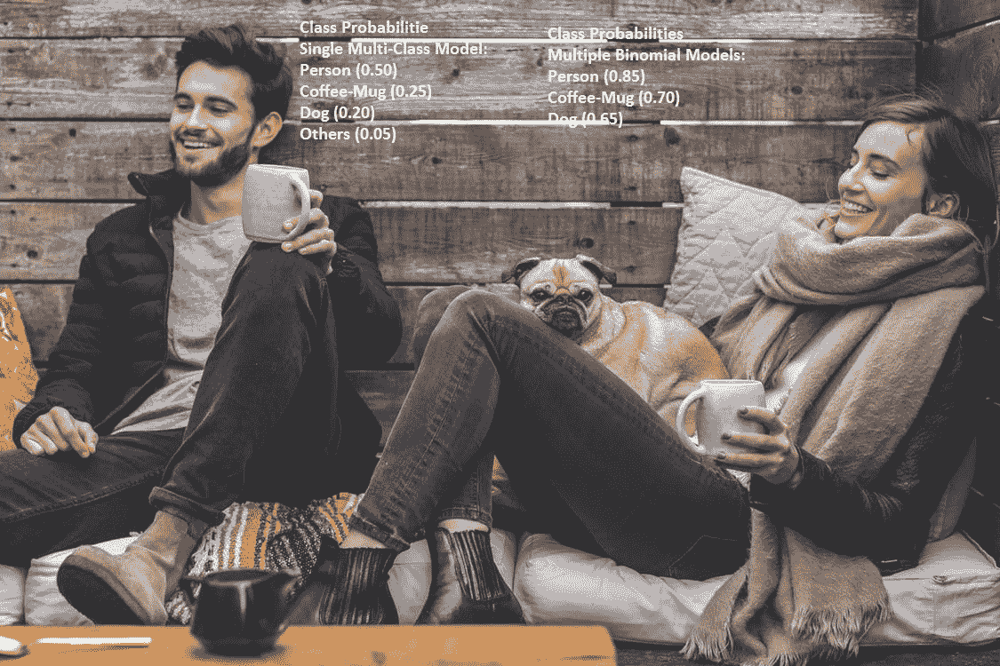

在本章中，我们将涵盖以下主题：

+   物体检测和图像分类的区别

+   传统的非 CNN 物体检测方法

+   基于区域的 CNN 及其特点

+   Fast R-CNN

+   Faster R-CNN

+   Mask R-CNN

# 物体检测和图像分类的区别

让我们举另一个例子。假设你正在观看电影《*101 忠犬*》，你想知道在电影的某个场景中，实际能数到多少只达尔马提亚犬。图像分类在最佳情况下可以告诉你至少有一只狗或者一只*达尔马提亚犬*（具体取决于你为分类器训练的级别），但无法准确告诉你它们有多少只。

基于分类的模型的另一个问题是，它们无法告诉你图像中识别出的实体在哪里。很多时候，这一点非常重要。举个例子，假设你看到邻居的狗正在和他（*人类*）以及他的猫玩耍。你拍了一张他们的照片，想从中提取出狗的图像，以便在网上搜索它的品种或类似的狗。然而，问题是，搜索整张图像可能无法成功，而且如果没有从图像中识别出单独的对象，你就不得不手动进行裁剪-提取-搜索的工作，如下图所示：

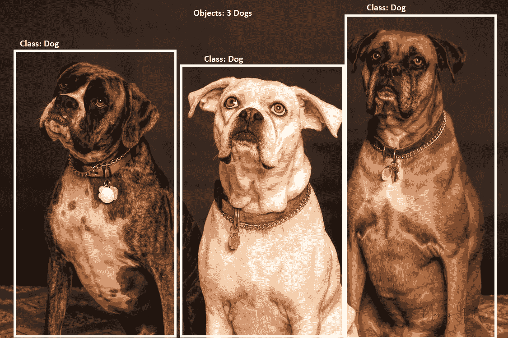

因此，你实际上需要一种技术，它不仅能识别图像中的实体，还能告诉你它们在图像中的位置。这就是所谓的**物体检测**。物体检测为图像中所有识别出的实体提供边界框和类别标签（以及检测的概率）。该系统的输出可以用于支持多个高级用例，这些用例依赖于特定类别的检测对象。

举个例子，像 Facebook、Google Photos 以及许多其他类似应用中的面部识别功能。在这些功能中，在你识别图像中*是谁*参加了派对之前，你需要先检测图像中的所有面部；然后，你可以将这些面部通过你的面部识别/分类模块来获取/分类出他们的名字。所以，物体检测中的“物体”命名不仅限于语言实体，还包括任何具有明确边界并且有足够数据来训练系统的事物，如下图所示：

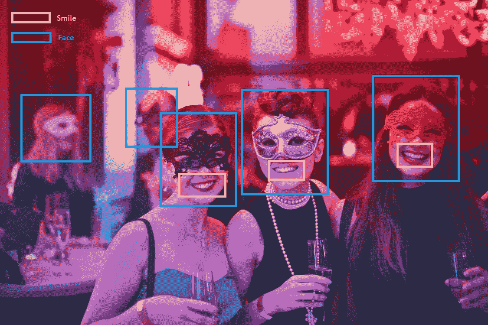

现在，如果你想知道参加你派对的客人中有多少人实际上在**享受**派对，你甚至可以进行一个**微笑脸**的物体检测，或者使用一个**微笑检测器**。目前有非常强大和高效的物体检测模型，适用于大多数可检测的人体部位（眼睛、面部、上半身等）、常见的人的表情（例如微笑）以及许多其他常见物体。所以，下次你使用智能手机上的**微笑快门**功能时（该功能会在场景中大多数面孔被检测为微笑时自动拍照），你就知道是什么驱动了这个功能。

# 为什么物体检测比图像分类更加具有挑战性？

根据我们目前对 CNN 和图像分类的理解，让我们尝试理解如何解决物体检测问题，这应该会逻辑地引导我们发现其潜在的复杂性和挑战。假设我们为了简化问题，处理的是单色图像。

任何高级的物体检测都可以被视为两个任务的组合（我们稍后会反驳这一点）：

+   获取正确的边界框（或者获取足够多的边界框以便后续过滤）

+   在该边界框内对物体进行分类（同时返回分类效果用于过滤）

因此，物体检测不仅要解决图像分类（第二个目标）的所有挑战，还面临着寻找正确或尽可能多的边界框这一新的挑战。我们已经知道如何使用 CNN 进行图像分类，以及相关的挑战，现在我们可以集中精力处理第一个任务，并探讨我们的方案在效果（分类精度）和效率（计算复杂度）方面的有效性——或者更确切地说，探讨这一任务将会有多么具有挑战性。

所以，我们从随机生成图像中的边界框开始。即使我们不担心生成这么多候选框的计算负载，技术上称为**区域提议**（我们发送作为分类物体的提议的区域），我们仍然需要有某种机制来寻找以下参数的最佳值：

+   用于提取/绘制候选边界框的起始（或中心）坐标

+   候选边界框的长度

+   候选边界框的宽度

+   跨越每个轴（从一个起始位置到另一个位置的* x *-水平轴和 * y *-垂直轴的距离）

假设我们可以生成一个算法，给出这些参数的最优值。那么，这些参数的一个值在大多数情况下适用吗？实际上，在某些一般情况下适用吗？根据我们的经验，我们知道每个物体的尺度不同，因此我们知道，对于这些框，`L` 和 `W` 的一个固定值是行不通的。此外，我们还可以理解，相同的物体，比如狗，在不同的图像中可能以不同的比例/尺度和位置出现，正如我们之前的一些例子所示。所以这证实了我们的信念：我们需要的是不同尺度而且不同大小的框。

假设从前面的类比中修正过来，我们希望从图像中的每个起始坐标提取 `N` 个候选框，其中 `N` 包含大多数可能适合我们分类问题的尺寸/尺度。尽管这似乎是一个相当具有挑战性的任务，但假设我们已经有了那个魔法数字，而它远不是 *L[1,l-image] x W[1,w-image]*（所有 `L` 和 `W` 的组合，其中长度是实际图像的所有整数集合，宽度是从 1 到图像宽度）；这将导致每个坐标有 `l`w* 个框：

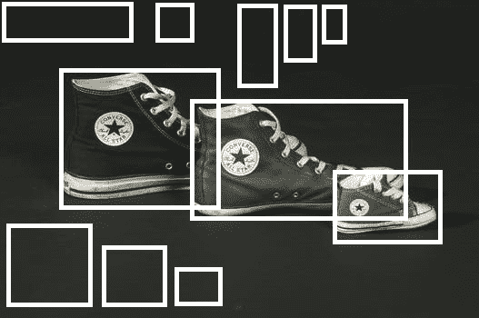

接下来，另一个问题是我们需要在图像中访问多少个起始坐标，从这些位置提取每个 `N` 个框，或者说步长。使用一个非常大的步长会导致我们提取到的子图像本身，而不是可以有效分类并用于实现我们之前示例中某些目标的单一同质物体。相反，步长过短（比如每个方向上 1 个像素）可能意味着会有大量候选框。

从前面的示例中，我们可以理解，即使假设放宽大部分约束条件，我们仍然无法制造出可以装进智能手机、实时检测微笑自拍或甚至明亮面孔的系统（实际上即便是一个小时也不行）。我们的机器人和自动驾驶汽车也无法在移动时识别物体（并通过避开它们来导航）。这种直觉应该帮助我们理解物体检测领域的进展，以及为什么这是一个如此具有影响力的工作领域。

# 传统的非 CNN 物体检测方法

像 OpenCV 这样的库以及其他一些库在智能手机、机器人项目和许多其他软件包中迅速被纳入，以提供特定物体（如面部、微笑等）的检测能力，以及计算机视觉等相关功能，尽管即便是在 CNN 广泛采用之前，也存在一些约束。

基于 CNN 的目标检测和实例分割领域的研究为该领域提供了许多进展和性能提升，不仅使这些系统的大规模部署成为可能，还为许多新解决方案开辟了道路。但在我们计划深入探讨基于 CNN 的进展之前，了解在前一部分中提到的挑战是如何得到解决的，以使得目标检测在各种限制条件下仍能得以实现，将是一个不错的主意。接着，我们将按逻辑开始讨论不同的研究人员以及如何将 CNN 应用于解决传统方法仍然存在的其他问题。

# Haar 特征、级联分类器和 Viola-Jones 算法

与 CNN 或深度学习不同，后者以能够自动生成更高层次概念特征而著称，这些特征反过来可以大大提升分类器的性能，在传统的机器学习应用中，这些特征需要由领域专家手工设计。

正如我们从使用基于 CPU 的机器学习分类器的经验中也可以理解的那样，它们的性能受数据高维度和可应用于模型的特征数量过多的影响，尤其是对于一些非常流行且复杂的分类器，如**支持向量机**（**SVM**），它曾被认为是最先进的技术，直到不久前。

在本节中，我们将了解一些创新的想法，这些想法来自不同科学和数学领域的启发，最终解决了上面提到的一些挑战，从而使得非 CNN 系统中的实时目标检测得以实现。

# Haar 特征

Haar 或类似 Haar 特征是具有不同像素密度的矩形形式。Haar 特征通过在检测区域内特定位置的相邻矩形区域中求和像素强度，根据各区域像素强度总和之间的差异，分类图像的不同子区域。

类 Haar 特征的名称源自数学术语 Haar 小波，它是一系列重新缩放的方形函数，这些函数共同形成了一个小波族或基底。

由于 Haar-like 特征是基于区域间像素强度差异工作的，因此它们在单色图像上效果最佳。这也是为什么前面使用的图像以及本节中的图像是单色的，以便更好地直观理解。

这些类别可以分为三个主要组别，如下所示：

+   两个矩形特征

+   三个矩形特征

+   四个矩形特征

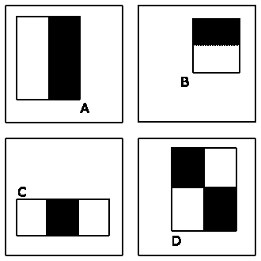

类 Haar 特征

通过一些简单的技巧，图像中不同区域的像素强度计算变得非常高效，并可以实时以非常高的速度处理。

# 级联分类器

即使我们能够非常快速地从特定区域提取 Haar 特征，这也不能解决从图像中许多不同位置提取这些特征的问题；这时，级联特征的概念就能发挥作用。观察到在分类中，只有 1/10,000 的子区域会被判定为面部，但我们必须提取所有特征并在所有区域运行整个分类器。进一步观察到，通过仅使用少数几个特征（级联第一层中的两个特征），分类器可以消除大量区域（级联第一层中 50%的区域）。此外，如果样本仅包含这些减少的区域样本，那么只需稍多的特征（级联第二层中的 10 个特征）就能让分类器排除更多的情况，以此类推。因此，我们按层次进行分类，从需要非常低计算能力的分类器开始，逐步增加剩余子集所需的计算负载，依此类推。

# Viola-Jones 算法

在 2001 年，Paul Viola 和 Michael Jones 提出了一个解决方案，可以很好地应对一些前述挑战，但也有一些约束。尽管这是一个近二十年前的算法，但到目前为止，甚至直到最近，许多流行的计算机视觉软件仍然以某种形式将其嵌入其中。这一事实使得在我们转向基于 CNN 的区域提议方法之前，理解这个非常简单而强大的算法变得非常重要。

OpenCV 是最流行的计算机视觉软件库之一，使用级联分类器作为物体检测的主要模式，Haar 特征类似的级联分类器在 OpenCV 中非常流行。为此，已有许多预训练的 Haar 分类器可供使用，涵盖多种类型的常见物体。

该算法不仅能够提供高**TPR**（**真正率**）和低**FPR**（**假正率**）的检测结果，还能在实时条件下工作（每秒至少处理两帧）。

高 TPR 结合低 FPR 是确定算法鲁棒性的一个非常重要的标准。

他们提出的算法的约束条件如下：

+   该算法仅适用于检测面部，而非识别面部（尽管他们提出的算法是针对面部的，但同样可以用于许多其他物体）。

+   面部必须出现在图像中并且是正面视角，其他视角无法被检测到。

该算法的核心是 Haar（类似）特征和级联分类器。Haar 特征将在后面的一个小节中介绍。Viola-Jones 算法使用 Haar 特征的一个子集来确定面部的一般特征，例如：

+   眼睛（通过一个由两个矩形特征（水平）确定，其中一个较暗的水平矩形在眼睛上方形成眉毛，接着是一个较亮的矩形位于下方）

+   鼻子（三个矩形特征（垂直），鼻子中心为浅矩形，两侧各有一个较暗的矩形，形成太阳穴），等等。

这些快速提取的特征可以用于创建一个分类器，以检测（区分）人脸（与非人脸）。

Haar 特征通过一些技巧，计算速度非常快。

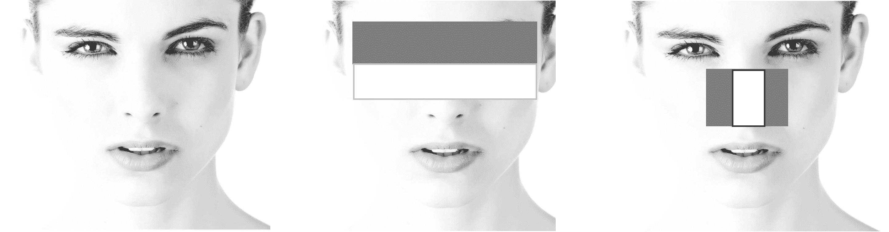

Viola-Jones 算法和 Haar-like 特征用于检测人脸

这些 Haar-like 特征随后被用于级联分类器，以加快检测问题的处理速度，同时不失检测的鲁棒性。

Haar 特征和级联分类器促成了前一代一些非常鲁棒、高效且快速的单目标检测器。然而，训练这些级联以适应新的目标仍然非常耗时，并且存在许多限制，正如前面提到的。这就是新一代基于 CNN 的物体检测器发挥作用的地方。

在本章中，我们仅介绍了 Haar 级联或 Haar 特征的基础（属于非 CNN 范畴），因为它们长期占据主导地位，并且是许多新类型的基础。我们鼓励读者也探索一些后来更有效的基于 SIFT 和 HOG 的特征/级联（相关论文见*参考文献*部分）。

# R-CNN - 带 CNN 特征的区域

在“为什么物体检测比图像分类更具挑战性？”这一节中，我们使用了非 CNN 方法来生成区域提议，并用 CNN 进行分类，我们意识到这样做效果不佳，因为生成的区域并没有经过优化，且输入到 CNN 中的区域并不理想。R-CNN 或带 CNN 特征的区域，顾名思义，完全颠覆了这个示例，使用 CNN 来生成特征，然后采用一种叫做**支持向量机（SVM）**的非 CNN 技术进行分类。

R-CNN 使用滑动窗口方法（就像我们之前讨论的那样，选择一些*L x W*的窗口和步幅）生成约 2000 个感兴趣区域，然后将它们转换为 CNN 特征进行分类。记得我们在迁移学习章节中讨论的内容——最后一层平展层（分类或 Softmax 层之前）可以提取出来，进行迁移学习，从在通用数据上训练的模型中进行学习，并进一步训练它们（与使用领域特定数据从头开始训练的相似性能模型相比，通常需要的数据量要少得多），从而构建领域特定的模型。R-CNN 也使用类似的机制来提高其在特定目标检测上的效果：

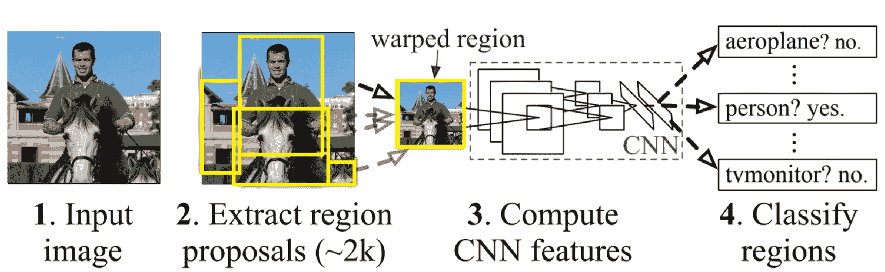

R-CNN - 工作原理

R-CNN 原始论文声称，在 PASCAL VOC 2012 数据集上，它相较于以前的最佳结果提高了**平均精度（mAP）**超过 30%，并且达到了 53.3%的 mAP。

我们在对 ImageNet 数据集进行图像分类练习（使用 CNN）时，得到了非常高精度的结果。不要将该结果与此处给出的对比统计数据一起使用，因为使用的数据集不仅不同（因此无法进行比较），而且任务本身（分类与目标检测）也完全不同，目标检测比图像分类要更具挑战性。

PASCAL **VOC**（**视觉目标挑战**）：每个研究领域都需要某种标准化的数据集和标准的 KPI，以便在不同的研究和算法之间进行结果比较。我们用于图像分类的数据集 ImageNet 不能作为目标检测的标准化数据集，因为目标检测不仅需要对对象类别进行标注，还需要标注对象的位置。ImageNet 并未提供这种数据。因此，在大多数目标检测研究中，我们可能会看到使用标准化的目标检测数据集，如 PASCAL VOC。PASCAL VOC 数据集目前有 4 个版本：VOC2007、VOC2009、VOC2010 和 VOC2012。VOC2012 是其中最新（也是最丰富）的版本。

另一个我们遇到的难点是兴趣区域的不同尺度（和位置），*使用区域进行识别*。这就是所谓的**定位**挑战；在 R-CNN 中，它通过使用不同范围的感受野来解决这个问题，从高达 195 x 195 像素和 32 x 32 步长的区域开始，到较小的区域逐渐减小。

这种方法被称为**使用区域进行识别**。

等一下！这是不是让你想起了什么？我们曾说过将使用 CNN 从这个区域生成特征，但 CNN 使用的是固定大小的输入来生成固定大小的平坦层。我们确实需要固定大小的特征（扁平化的向量大小）作为 SVM 的输入，但这里输入区域的大小是变化的。那么这如何实现呢？R-CNN 使用了一种流行的技术，叫做**仿射图像变换**，通过这种技术，可以从每个区域提议中计算出固定大小的 CNN 输入，无论区域的形状如何。

在几何学中，仿射变换是指在仿射空间之间的变换函数，这种变换保持点、直线和平面的不变。仿射空间是一种结构，它在保留与平行性和相应尺度相关的性质的同时，推广了欧几里得空间的性质。

除了我们已经讨论过的挑战，还有一个值得提到的挑战。我们在第一步中生成的候选区域（在第二步中进行分类）并不非常准确，或者它们缺乏围绕识别对象的紧密边界。因此，我们在这种方法中加入了第三阶段，通过运行回归函数（称为**边界框回归器**）来提高边界框的准确性，以识别分隔的边界。

与早期的端到端非 CNN 方法相比，R-CNN 证明非常成功。但它仅使用 CNN 将区域转换为特征。如我们所知，CNN 在图像分类中也非常强大，但由于我们的 CNN 仅对输入的区域图像工作，而不是对展平后的区域特征进行操作，因此无法直接使用它。在下一节中，我们将看到如何克服这一障碍。

从理解 CNN 在目标检测中的背景使用角度来看，R-CNN 非常重要，因为它是从所有非 CNN 方法中迈出的巨大一步。但由于 CNN 在目标检测中的进一步改进，正如我们接下来会讨论的那样，R-CNN 现在不再被积极开发，代码也不再维护。

# Fast R-CNN – 快速区域卷积神经网络

Fast R-CNN，或称快速区域卷积神经网络方法，是对先前的 R-CNN 的改进。具体来说，与 R-CNN 相比，它的改进统计数据如下：

+   训练速度提升 9 倍

+   在评分/服务/测试时快 213 倍（每张图片处理 0.3 秒），不包括区域提议所花费的时间

+   在 PASCAL VOC 2012 数据集上具有更高的 mAP，达 66%

在 R-CNN 使用较小的（五层）CNN 时，Fast R-CNN 使用更深的 VGG16 网络，这也提高了其准确性。此外，R-CNN 之所以慢，是因为它对每个对象提议执行一次卷积神经网络的前向传播，而没有共享计算：

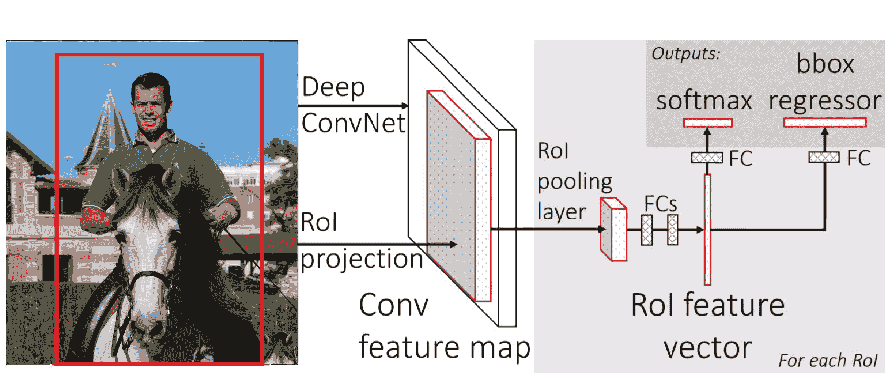

Fast R-CNN：工作原理

在 Fast R-CNN 中，深度 VGG16 CNN 为所有阶段提供了必要的计算，即：

+   **感兴趣区域**（**RoI**）计算

+   对区域内容进行分类（对象或背景）

+   回归以增强边界框

在这种情况下，CNN 的输入不是来自图像的原始（候选）区域，而是完整的实际图像；输出不是最后的展平层，而是之前的卷积（映射）层。从生成的卷积映射中，使用 RoI 池化层（最大池化的变体）来生成对应每个目标提议的展平固定长度 RoI，这些 RoI 随后会通过一些**全连接**（**FC**）层。

RoI 池化是最大池化的一种变体（我们在本书的初始章节中使用过），其中输出大小是固定的，输入矩形是一个参数。

RoI 池化层使用最大池化，将任何有效感兴趣区域中的特征转换为一个具有固定空间范围的小特征图。

来自倒数第二个全连接层的输出将用于以下两项：

+   分类（SoftMax 层），类别数与目标提议的数量相同，额外+1 个类别用于背景（区域中未找到的任何类别）

+   一组回归器，产生四个数字（两个数字表示该物体框的左上角的 x、y 坐标，接下来的两个数字对应于该区域内物体的高度和宽度），这些数字对于每个物体提议都是必需的，以便为该物体提供精确的边界框。

使用 Fast R-CNN 所取得的结果非常出色。更为出色的是，利用强大的 CNN 网络为我们需要克服的所有三个挑战提供了非常有效的特征。但仍然存在一些缺点，正如我们在下一节关于 Faster R-CNN 的内容中将了解的那样，仍然有进一步改进的空间。

# Faster R-CNN – 基于更快区域提议网络的 CNN

我们在前一节中看到，Fast R-CNN 大幅减少了评分（测试）图像所需的时间，但这种减少忽略了生成区域提议所需的时间，这一过程使用了一个独立的机制（尽管是从 CNN 的卷积图中提取的），并继续形成瓶颈。此外，我们观察到，尽管所有三个挑战在 Fast R-CNN 中都使用了来自卷积图的共同特征来解决，但它们使用了不同的机制/模型。

Faster R-CNN 改进了这些缺点，并提出了**区域提议网络**（**RPNs**）的概念，将评分（测试）时间减少到每张图像 0.2 秒，即使包括了区域提议的时间。

Fast R-CNN 在每张图像的评分（测试）上用了 0.3 秒，这还不包括区域提议过程所需的时间。

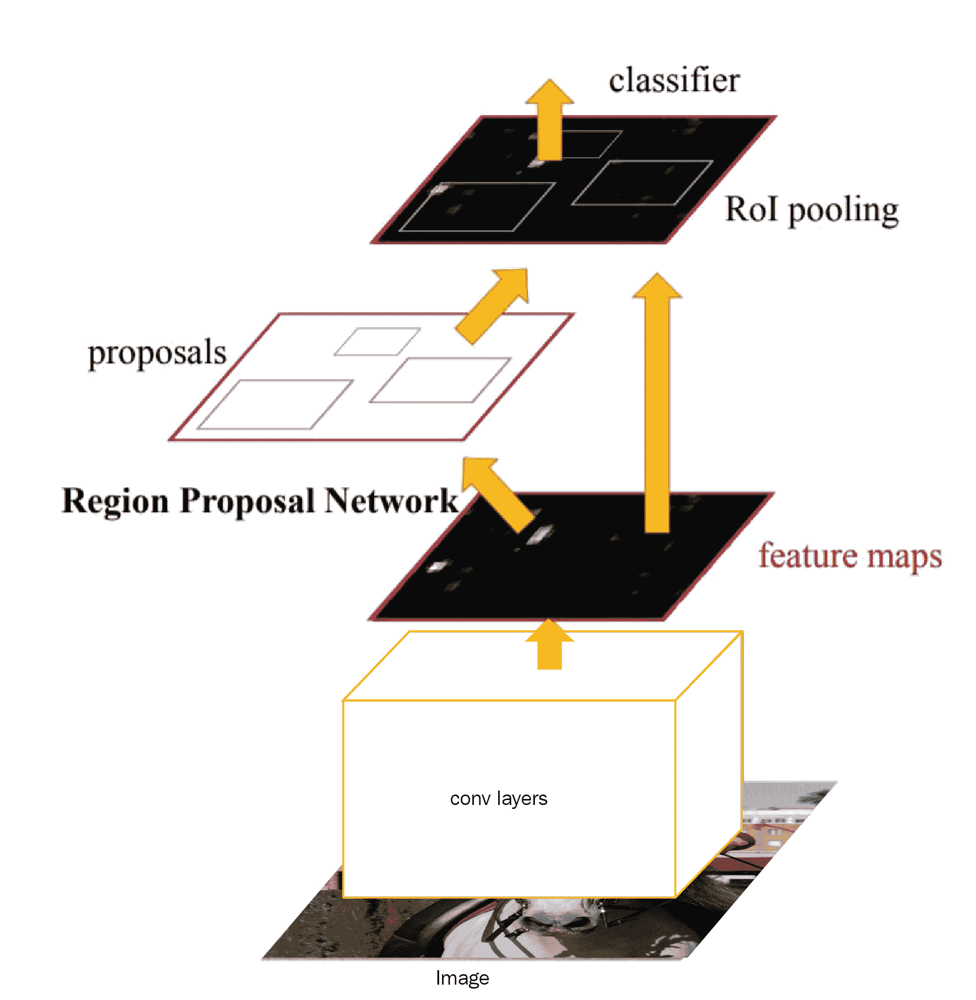

Faster R-CNN: 工作原理 - 区域提议网络作为注意力机制

如前图所示，VGG16（或其他）CNN 直接作用于图像，生成一个卷积图（类似于在 Fast R-CNN 中所做的）。从这里开始有所不同，现在有两个分支，一个进入 RPN，另一个进入检测网络。这再次是相同 CNN 的扩展，用于预测，形成了**全卷积网络**（**FCN**）。RPN 作为注意力机制并且与检测网络共享完整图像的卷积特征。此外，现在由于网络中的所有部分都可以使用高效的基于 GPU 的计算，因此减少了总体所需的时间：

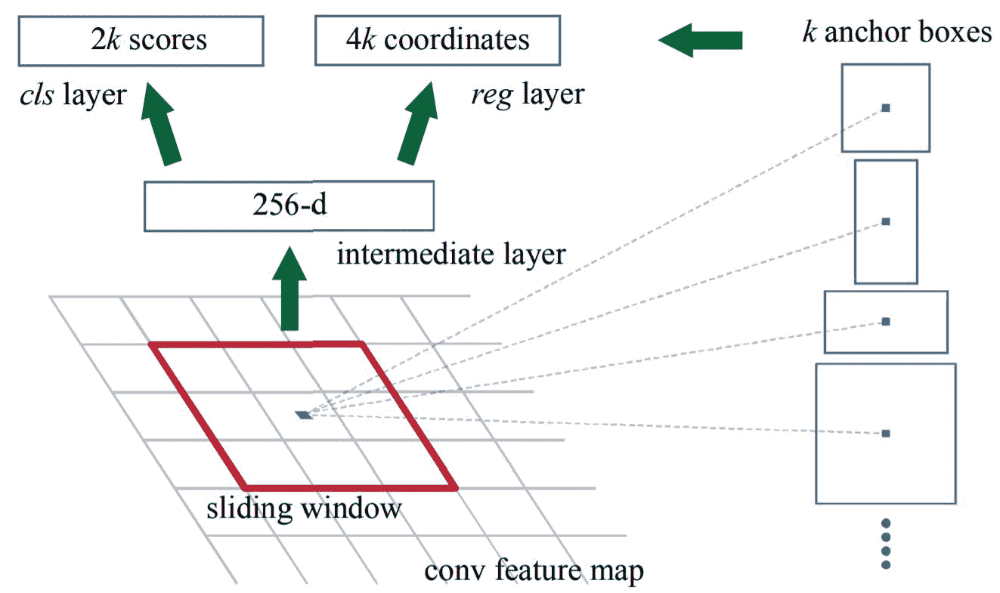

Faster R-CNN: 工作原理 - 区域提议网络作为注意力机制

要更好地理解注意力机制，请参考本书中关于 CNN 的注意力机制章节。

RPN 通过滑动窗口机制工作，其中一个窗口（类似 CNN 滤波器）在共享卷积层的最后一个卷积图上滑动。每次滑动时，滑动窗口会产生*k (k=N[Scale] × N[Size])*个锚框（类似候选框），其中*N[Scale]*是每个*size*的*N[Size]*大小（长宽比）框的尺度数，这些框从滑动窗口的中心提取，就像下图所示。

RPN 输出进入一个展平的全连接（FC）层。然后，输出进入两个网络，一个用于预测每个`k`框的四个数字（确定框的坐标、长宽，如同 Fast R-CNN 中一样），另一个进入一个二项分类模型，确定该框内是否包含目标物体的可能性。来自 RPN 的输出进入检测网络，检测每个 k 框中所包含的具体物体类别，给定框的位置及其物体性。

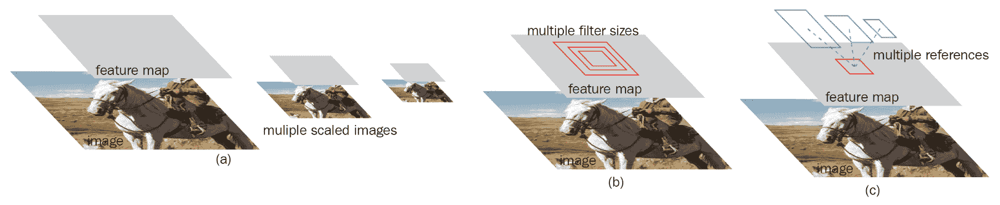

Faster R-CNN：工作原理 - 提取不同尺度和大小

这个架构中的一个问题是两个网络的训练，分别是区域提议网络（Region Proposal）和检测网络。我们了解到，CNN 是通过反向传播训练的，反向传播遍历所有层，并在每次迭代时减少每层的损失。但由于架构分成了两个不同的网络，我们每次只能对一个网络进行反向传播。为了解决这个问题，训练是通过在每个网络中迭代进行的，同时保持另一个网络的权重不变。这有助于两个网络快速收敛。

RPN 架构的一个重要特性是，它对两个函数具有平移不变性，一个生成锚点，另一个为锚点生成属性（其坐标和物体性）。由于平移不变性，反向操作或根据锚点图的向量图生成图像的部分是可行的。

由于平移不变性，我们可以在 CNN 中任意方向移动，即从图像到（区域）提议，从提议到图像的相应部分。

# Mask R-CNN - 使用 CNN 进行实例分割

Faster R-CNN 是目前目标检测领域的最先进技术。但在目标检测的相关领域，Faster R-CNN 无法有效解决一些问题，这就是 Mask R-CNN——Faster R-CNN 的进化版本——能够提供帮助的地方。

本节介绍了实例分割的概念，它结合了本章描述的标准目标检测问题与语义分割的挑战。

在语义分割中，应用于图像时，目标是将每个像素分类到一个固定的类别集中，而不区分物体实例。

还记得我们在直觉部分中提到的计算图像中狗的数量的例子吗？我们能够轻松地数出狗的数量，因为它们彼此相隔很远，没有重叠，因此基本上只需数对象的数量即可完成任务。现在，以以下这张图片为例，使用目标检测数番茄的数量。这将是一项艰巨的任务，因为边界框（Bounding Boxes）重叠严重，很难区分番茄实例与框的关系。

所以，本质上，我们需要进一步深入，超越边界框，进入像素层面，以便获得这种级别的分离和识别。就像我们在目标检测中用物体名称来分类边界框一样，在实例分割中，我们对每个像素进行分割/分类，不仅标出具体的物体名称，还要标出物体实例。

目标检测和实例分割可以被视为两个不同的任务，一个逻辑上引导另一个，正如我们在目标检测中发现的那样，任务是查找区域提议和分类。但是，正如在目标检测中，尤其是使用像 Fast/Faster R-CNN 这样的技术时，我们发现如果能够同时进行这些任务，同时还能够利用大量计算和网络资源来完成任务，这将更加高效，从而使这些任务无缝衔接。

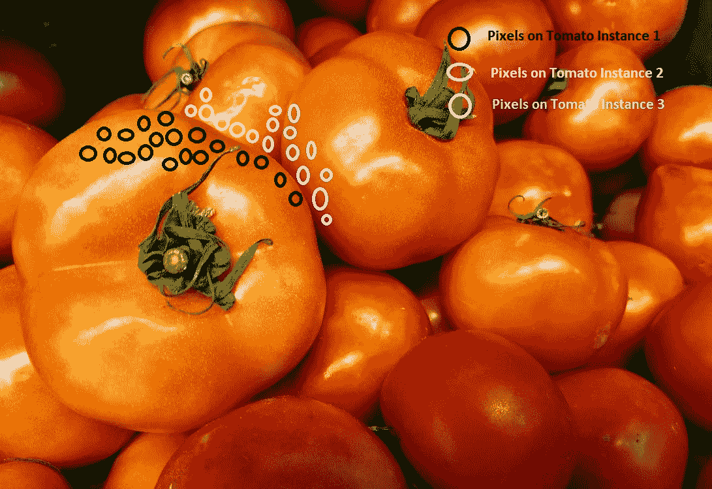

实例分割 – 直觉

Mask R-CNN 是 Faster R-CNN 的一种扩展，前者在之前的网络中已经覆盖，并且使用了 Faster R-CNN 中的所有技术，唯一的新增部分是——在网络中增加了一个额外的路径，用于并行生成每个检测到的对象实例的分割掩码（或对象掩码）。此外，由于这种方法主要利用现有网络，因此它对整个处理过程仅增加了最小的开销，并且其评分（测试）时间几乎等同于 Faster R-CNN。它在所有单模型解决方案中，尤其是在应用于 COCO2016 挑战（使用 COCO2015 数据集）时，具有最好的准确度之一。

类似于 PASCAL VOC，COCO 是另一个大规模的标准数据集（由微软提供）。除了目标检测，COCO 还用于分割和图像描述。COCO 比许多其他数据集更为广泛，最近在目标检测方面的很多比较都是基于 COCO 数据集进行的。COCO 数据集有三个版本，分别是 COCO 2014、COCO 2015 和 COCO 2017。

在 Mask R-CNN 中，除了有两个分支分别生成每个锚框或 RoI 的目标性（objectness）和定位信息外，还有一个第三个全卷积网络（FCN），它接受 RoI 并以逐像素的方式为给定的锚框预测一个分割掩码。

但是仍然存在一些挑战。尽管 Faster R-CNN 确实展示了变换不变性（也就是说，我们可以从 RPN 的卷积图追踪到实际图像的像素图），但卷积图的结构与实际图像像素的结构不同。因此，网络输入和输出之间没有像素级的对齐，这对于我们通过该网络提供像素到像素的遮罩非常重要。为了解决这个问题，Mask R-CNN 使用了一个无量化层（在原文中称为 RoIAlign），它有助于对齐精确的空间位置。这个层不仅提供了精确的对齐，还大大提高了精度，因此 Mask R-CNN 能够超越许多其他网络：

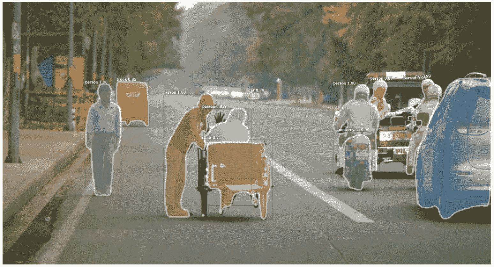

Mask R-CNN – 实例分割遮罩（示例输出）

实例分割的概念非常强大，它能够实现很多使用物体检测单独无法完成的有影响力的应用场景。

我们甚至可以使用实例分割来估计同一框架中的人体姿势并将其消除。

# 代码中的实例分割

现在是时候将我们学到的内容付诸实践了。我们将使用 COCO 数据集及其 API 来获取数据，并使用 Facebook Research 的 Detectron 项目（链接见参考文献），该项目提供了许多前面讨论的技术的 Python 实现，遵循 Apache 2.0 许可协议。该代码适用于 Python2 和 Caffe2，因此我们需要一个带有指定配置的虚拟环境。

# 创建环境

可以按照 *References* 部分中 Caffe2 仓库链接中的 `caffe2` 安装说明来创建带有 Caffe2 安装的虚拟环境。接下来，我们将安装依赖。

# 安装 Python 依赖（Python2 环境）

我们可以按照以下代码块中的方式安装 Python 依赖：

Python 2X 和 Python 3X 是 Python 的两种不同版本（或者更准确地说是 CPython），并不是一个传统意义上的版本升级，因此一个版本的库可能与另一个版本不兼容。在这一部分中，请使用 Python 2X。

*当我们提到（解释型的）编程语言 Python 时，我们需要使用特定的解释器（因为它是解释型语言，而不是像 Java 那样的编译型语言）。我们通常所提到的 Python 解释器（例如从 Python.org 下载的版本或与 Anaconda 捆绑的版本）技术上叫做 CPython，它是 Python 的默认字节码解释器，使用 C 语言编写。但是，也有其他 Python 解释器，例如 Jython（基于 Java 构建）、PyPy（用 Python 本身编写——有点不直观吧？）、IronPython（.NET 实现的 Python）。*

```py
pip install numpy>=1.13 pyyaml>=3.12 matplotlib opencv-python>=3.2 setuptools Cython mock scipy
```

# 下载并安装 COCO API 和 detectron 库（操作系统命令行命令）

然后我们将下载并安装 Python 依赖项，如以下代码块所示：

```py
# COCO API download and install
# COCOAPI=/path/to/clone/cocoapi
git clone https://github.com/cocodataset/cocoapi.git $COCOAPI
cd $COCOAPI/PythonAPI
make install

# Detectron library download and install
# DETECTRON=/path/to/clone/detectron
git clone https://github.com/facebookresearch/detectron $DETECTRON
cd $DETECTRON/lib && make
```

或者，我们可以下载并使用该环境的 Docker 镜像（需要 Nvidia GPU 支持）：

```py
# DOCKER image build
cd $DETECTRON/docker docker build -t detectron:c2-cuda9-cudnn7.
nvidia-docker run --rm -it detectron:c2-cuda9-cudnn7 python2 tests/test_batch_permutation_op.py
```

# 准备 COCO 数据集文件夹结构

现在我们将看到准备 COCO 数据集文件夹结构的代码，如下所示：

```py
# We need the following Folder structure: coco [coco_train2014, coco_val2014, annotations]
mkdir -p $DETECTRON/lib/datasets/data/coco
ln -s /path/to/coco_train2014 $DETECTRON/lib/datasets/data/coco/
ln -s /path/to/coco_val2014 $DETECTRON/lib/datasets/data/coco/
ln -s /path/to/json/annotations $DETECTRON/lib/datasets/data/coco/annotations
```

# 在 COCO 数据集上运行预训练模型

我们现在可以在 COCO 数据集上实现预训练模型，如以下代码片段所示：

```py
python2 tools/test_net.py \
    --cfg configs/12_2017_baselines/e2e_mask_rcnn_R-101-FPN_2x.yaml \
    TEST.WEIGHTS https://s3-us-west-2.amazonaws.com/detectron/35861858/12_2017_baselines/e2e_mask_rcnn_R-101-             FPN_2x.yaml.02_32_51.SgT4y1cO/output/train/coco_2014_train:coco_2014_valminusminival/generalized_rcnn/model_final.pkl \
    NUM_GPUS 1
```

# 参考文献

1.  Paul Viola 和 Michael Jones，*《使用增强级联简单特征进行快速目标检测》*，计算机视觉与模式识别会议，2001 年。

1.  Paul Viola 和 Michael Jones，*《鲁棒的实时目标检测》*，国际计算机视觉杂志，2001 年。

1.  Itseez2015opencv，OpenCV，*《开源计算机视觉库》*，Itseez，2015 年。

1.  Ross B. Girshick，Jeff Donahue，Trevor Darrell，Jitendra Malik，*《准确目标检测和语义分割的丰富特征层次》*，CoRR，arXiv:1311.2524，2013 年。

1.  Ross Girshick，Jeff Donahue，Trevor Darrell，Jitendra Malik，*《准确目标检测和语义分割的丰富特征层次》*，计算机视觉与模式识别，2014 年。

1.  M. Everingham, L. VanGool, C. K. I. Williams, J. Winn, A. Zisserman，*《PASCAL 视觉目标类别挑战赛 2012》*，VOC2012，结果。

1.  D. Lowe，*《基于尺度不变关键点的独特图像特征》*，IJCV，2004 年。

1.  N. Dalal 和 B. Triggs，*《用于人类检测的方向梯度直方图》*，CVPR，2005 年。

1.  Ross B. Girshick，Fast R-CNN，CoRR，arXiv:1504.08083，2015 年。

1.  Rbgirshick，fast-rcnn，GitHub，[`github.com/rbgirshick/fast-rcnn`](https://github.com/rbgirshick/fast-rcnn)，2018 年 2 月。

1.  Shaoqing Ren, Kaiming He, Ross B. Girshick, Jian Sun, Faster R-CNN: *《基于区域提议网络的实时目标检测》*，CoRR，arXiv:1506.01497，2015 年。

1.  Shaoqing Ren 和 Kaiming He 和 Ross Girshick 和 Jian Sun，Faster R-CNN：*《基于区域提议网络的实时目标检测》*，**神经信息处理系统** (**NIPS**)，2015 年。

1.  Rbgirshick，py-faster-rcnn，GitHub，[`github.com/rbgirshick/py-faster-rcnn`](https://github.com/rbgirshick/py-faster-rcnn)，2018 年 2 月。

1.  Ross Girshick，Ilija Radosavovic，Georgia Gkioxari，Piotr Dollar，Kaiming He，

    Detectron，GitHub，[`github.com/facebookresearch/Detectron`](https://github.com/facebookresearch/Detectron)，2018 年 2 月。

1.  Tsung-Yi Lin, Michael Maire, Serge J. Belongie, Lubomir D. Bourdev, Ross B. Girshick, James Hays, Pietro Perona, Deva Ramanan, Piotr Dollar, C. Lawrence Zitnick，*《Microsoft COCO：上下文中的常见物体》*，CoRR，arXiv:1405.0312，2014 年。

1.  Kaiming He, Georgia Gkioxari, Piotr Dollar, Ross B. Girshick，Mask R-CNN，CoRR，arXiv:1703.06870，2017 年。

1.  Liang-Chieh Chen, Alexander Hermans, George Papandreou, Florian Schroff, Peng Wang, Hartwig Adam, MaskLab: *通过语义和方向特征优化目标检测的实例分割*，CoRR，arXiv:1712.04837，2017。

1.  Anurag Arnab, Philip H. S. Torr，*使用动态实例化网络的像素级实例分割*，CoRR，arXiv:1704.02386，2017。

1.  Matterport，Mask_RCNN，GitHub，[`github.com/matterport/Mask_RCNN`](https://github.com/matterport/Mask_RCNN)，2018 年 2 月。

1.  CharlesShang, FastMaskRCNN，GitHub，[`github.com/CharlesShang/FastMaskRCNN`](https://github.com/CharlesShang/FastMaskRCNN)，2018 年 2 月。

1.  Caffe2，Caffe2，GitHub，[`github.com/caffe2/caffe2`](https://github.com/caffe2/caffe2)，2018 年 2 月。

# 总结

在本章中，我们从目标检测任务背后的简单直觉入手，然后逐步介绍了更为先进的概念，例如实例分割，这是当今的研究热点。目标检测在零售、媒体、社交媒体、移动性和安全领域的创新中占据核心地位；这些技术具有巨大的潜力，可以为企业和社会消费创造具有深远影响和盈利潜力的功能。

从算法的角度来看，本章从传奇的 Viola-Jones 算法及其底层机制开始，诸如 Haar 特征和级联分类器。基于这些直觉，我们开始探索卷积神经网络（CNN）在目标检测中的应用，涉及的算法包括 R-CNN、Fast R-CNN，一直到最先进的 Faster R-CNN。

在本章中，我们还奠定了基础，并介绍了一个非常新颖且具有深远影响的研究领域——**实例分割**。我们还讨论了基于 Mask R-CNN 等方法的先进深度 CNN，用于实现实例分割的简便且高效的实现。
