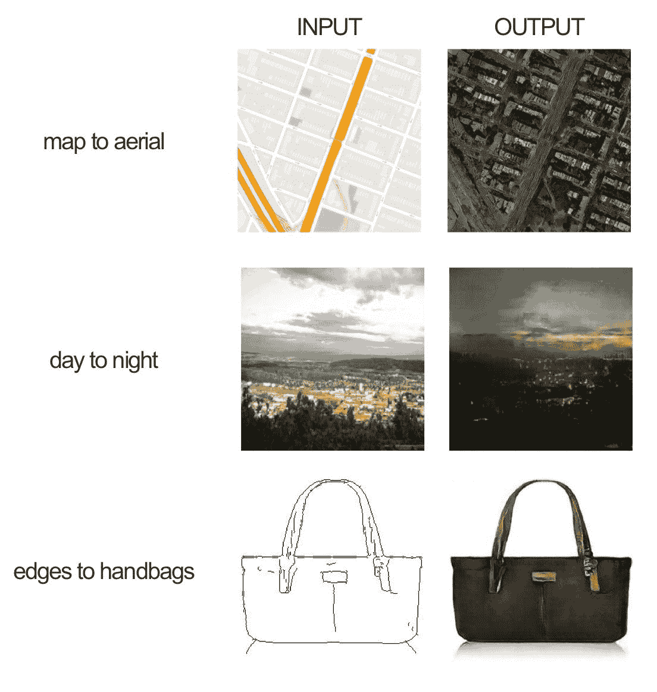
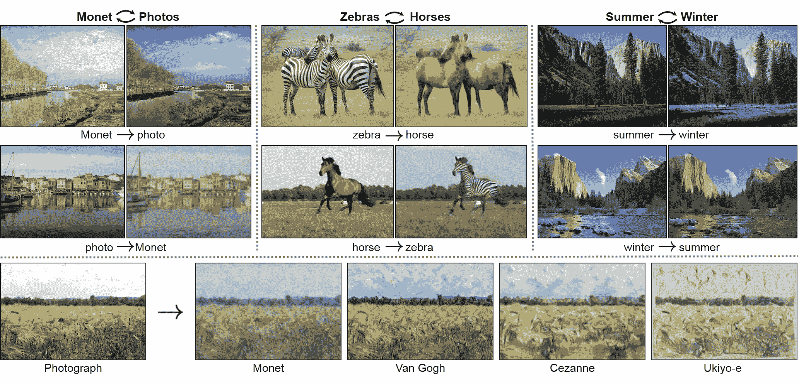
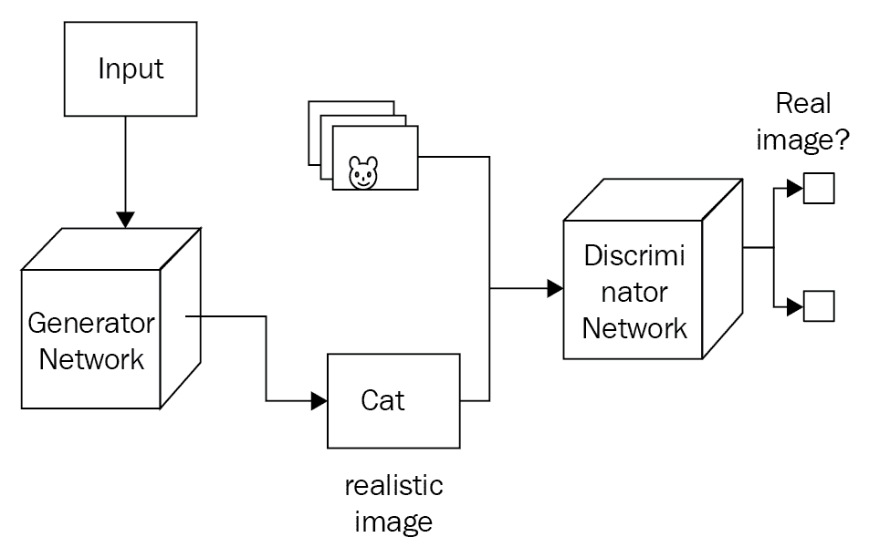
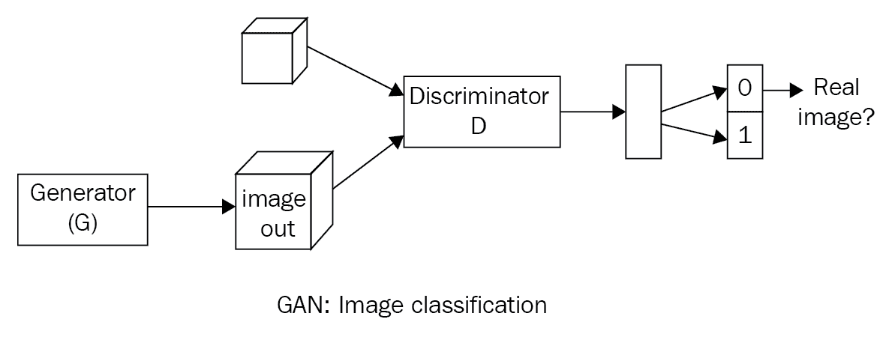
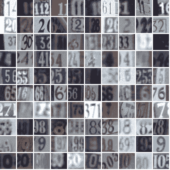

# 第八章：GAN：使用 CNN 生成新图像

通常，神经网络需要带标签的示例才能有效学习。无监督学习方法从未标注的数据中学习的效果并不好。**生成对抗网络**，简称**GAN**，是一种无监督学习方法，但基于可微分的生成器网络。GAN 最初由 Ian Goodfellow 等人于 2014 年发明。从那时起，它们变得非常流行。这是基于博弈论的，有两个参与者或网络：生成器网络和判别器网络，它们相互竞争。这种基于双网络的博弈论方法大大改善了从未标注数据中学习的过程。生成器网络生成伪造数据并传递给判别器。判别器网络也看到真实数据并预测它收到的数据是假的还是真的。因此，生成器被训练成可以轻松生成非常接近真实数据的数据，从而欺骗判别器网络。判别器网络被训练成分类哪些数据是真实的，哪些数据是假的。所以，最终，生成器网络学会生成非常非常接近真实数据的数据。GAN 将在音乐和艺术领域广泛流行。

根据 Goodfellow 的说法，"*你可以把生成模型看作是赋予人工智能一种想象力的形式*。"

以下是一些 GAN 的示例：

+   Pix2pix

+   CycleGAN

# Pix2pix - 图像到图像翻译 GAN

该网络使用**条件生成对抗网络**（**cGAN**）来学习图像的输入和输出之间的映射。以下是原始论文中可以完成的一些示例：



Pix2pix 的 cGAN 示例

在手袋示例中，网络学习如何为黑白图像上色。在这里，训练数据集中的输入图像是黑白的，目标图像是彩色版。

# CycleGAN

CycleGAN 也是一种图像到图像翻译器，但没有输入/输出对。例如，从画作中生成照片，将马的图像转换成斑马图像：



在判别器网络中，使用 dropout 非常重要。否则，它可能会产生较差的结果。

生成器网络以随机噪声作为输入，并产生一个真实感的图像作为输出。对不同类型的随机噪声运行生成器网络会产生不同种类的真实图像。第二个网络，称为**判别器网络**，与常规的神经网络分类器非常相似。该网络在真实图像上进行训练，尽管训练 GAN 与监督训练方法有很大不同。在监督训练中，每个图像在显示给模型之前都会先被标注。例如，如果输入是一张狗的图像，我们会告诉模型这是狗。而在生成模型中，我们会向模型展示大量图像，并要求它从相同的概率分布中生成更多类似的图像。实际上，第二个判别器网络帮助生成器网络实现这一目标。

判别器输出图像是真实的还是生成器生成的假的概率。换句话说，它试图给真实图像分配一个接近 1 的概率，而给假的图像分配一个接近 0 的概率。与此同时，生成器则做相反的事情。它被训练成输出能被判别器判定为接近 1 的图像。随着时间的推移，生成器会生成更真实的图像，从而欺骗判别器：



# 训练 GAN 模型

在前几章中解释的大多数机器学习模型都是基于优化的，也就是说，我们在其参数空间中最小化代价函数。生成对抗网络（GAN）则不同，因为它包含了两个网络：生成器 G 和判别器 D。每个网络都有自己的代价函数。一个简单的方式来理解 GAN 是，判别器的代价函数是生成器代价函数的负值。在 GAN 中，我们可以定义一个值函数，生成器需要最小化，而判别器需要最大化。生成模型的训练过程与监督训练方法大不相同。GAN 对初始权重非常敏感，因此我们需要使用批量归一化（batch normalization）。批量归一化不仅能提高性能，还能使模型更加稳定。在这里，我们同时训练两个模型：生成模型和判别模型。生成模型 G 捕捉数据分布，而判别模型 D 估计一个样本来自训练数据的概率，而不是来自 G。

# GAN – 代码示例

在以下示例中，我们使用 MNIST 数据集并利用 TensorFlow 构建和训练一个 GAN 模型。这里，我们将使用一种特殊版本的 ReLU 激活函数，称为**Leaky ReLU**。输出是一个新的手写数字类型：

Leaky ReLU 是 ReLU 激活函数的一种变体，其公式为*f(x) = max(α∗x, x**)*。因此，`x`为负值时，输出为*alpha * x*，而`x`为正值时，输出为`x`。

```py
#import all necessary libraries and load data set
%matplotlib inline

import pickle as pkl
import numpy as np
import tensorflow as tf
import matplotlib.pyplot as plt

from tensorflow.examples.tutorials.mnist import input_data
mnist = input_data.read_data_sets('MNIST_data')
```

为了构建这个网络，我们需要两个输入，一个是生成器的输入，一个是判别器的输入。在下面的代码中，我们为判别器创建`real_input`的占位符，为生成器创建`z_input`的占位符，输入尺寸分别为`dim_real`和`dim_z`：

```py
#place holder for model inputs 
def model_inputs(dim_real, dim_z):
    real_input = tf.placeholder(tf.float32, name='dim_real')
    z_input = tf.placeholder(tf.float32, name='dim_z')

    return real_input, z_input
```

这里，输入`z`是一个随机向量传入生成器，生成器将这个向量转化为图像。然后我们添加一个隐藏层，这是一个带有泄漏的 ReLU 层，以允许梯度向后传播。泄漏 ReLU 就像普通的 ReLU（对负值输出零）一样，除了对于负输入值，输出有一个小的非零值。生成器使用`tanh`和`sigmoid`函数表现更好。生成器的输出是`tanh`输出。因此，我们必须将 MNIST 图像重新缩放到-1 到 1 之间，而不是 0 到 1 之间。通过这些知识，我们可以构建生成器网络：

```py
#Following code builds Generator Network
def generator(z, out_dim, n_units=128, reuse=False, alpha=0.01):
    ''' Build the generator network.

        Arguments
        ---------
        z : Input tensor for the generator
        out_dim : Shape of the generator output
        n_units : Number of units in hidden layer
        reuse : Reuse the variables with tf.variable_scope
        alpha : leak parameter for leaky ReLU

        Returns
        -------
        out: 
    '''
    with tf.variable_scope('generator', reuse=reuse) as generator_scope: # finish this
        # Hidden layer
        h1 = tf.layers.dense(z, n_units, activation=None )
        # Leaky ReLU
        h1 = tf.nn.leaky_relu(h1, alpha=alpha,name='leaky_generator')

        # Logits and tanh output
        logits = tf.layers.dense(h1, out_dim, activation=None)
        out = tf.tanh(logits)

        return out
```

判别器网络与生成器相同，只是输出层使用的是`sigmoid`函数：

```py

def discriminator(x, n_units=128, reuse=False, alpha=0.01):
    ''' Build the discriminator network.

        Arguments
        ---------
        x : Input tensor for the discriminator
        n_units: Number of units in hidden layer
        reuse : Reuse the variables with tf.variable_scope
        alpha : leak parameter for leaky ReLU

        Returns
        -------
        out, logits: 
    '''
    with tf.variable_scope('discriminator', reuse=reuse) as discriminator_scope:# finish this
        # Hidden layer
        h1 = tf.layers.dense(x, n_units, activation=None )
        # Leaky ReLU
        h1 = tf.nn.leaky_relu(h1, alpha=alpha,name='leaky_discriminator')

        logits = tf.layers.dense(h1, 1, activation=None)
        out = tf.sigmoid(logits)

        return out, logits
```

要构建网络，使用以下代码：

```py
#Hyperparameters
# Size of input image to discriminator
input_size = 784 # 28x28 MNIST images flattened
# Size of latent vector to generator
z_size = 100
# Sizes of hidden layers in generator and discriminator
g_hidden_size = 128
d_hidden_size = 128
# Leak factor for leaky ReLU
alpha = 0.01
# Label smoothing 
smooth = 0.1
```

我们希望在真实数据和假数据之间共享权重，因此需要重用变量：

```py
#Build the network
tf.reset_default_graph()
# Create our input placeholders
input_real, input_z = model_inputs(input_size, z_size)

# Build the model
g_model = generator(input_z, input_size, n_units=g_hidden_size, alpha=alpha)
# g_model is the generator output

d_model_real, d_logits_real = discriminator(input_real, n_units=d_hidden_size, alpha=alpha)
d_model_fake, d_logits_fake = discriminator(g_model, reuse=True, n_units=d_hidden_size, alpha=alpha)
```

# 计算损失

对于判别器，总损失是对真实图像和假图像损失的总和。损失将是 sigmoid 交叉熵损失，我们可以使用 TensorFlow 的`tf.nn.sigmoid_cross_entropy_with_logits`得到。然后我们计算批次中所有图像的均值。因此，损失将如下所示：

```py
tf.reduce_mean(tf.nn.sigmoid_cross_entropy_with_logits(logits=logits, labels=labels))
```

为了帮助判别器更好地泛化，可以通过例如使用`平滑`*参数，将`labels`从 1.0 稍微减少到 0.9。* 这被称为**标签平滑**，通常与分类器一起使用以提高性能。假的数据的判别器损失类似。`logits`是`d_logits_fake`，它是通过将生成器输出传递给判别器得到的。这些假的`logits`与全为零的`labels`一起使用。记住，我们希望判别器对真实图像输出 1，对假图像输出 0，因此我们需要设置损失函数来反映这一点。

最后，生成器的损失使用的是`d_logits_fake`*，*即假的图像`logits`。但现在`labels`全为 1。生成器试图欺骗判别器，因此它希望判别器对假的图像输出 1：

```py
# Calculate losses
d_loss_real = tf.reduce_mean(
                  tf.nn.sigmoid_cross_entropy_with_logits(logits=d_logits_real, 
                                                          labels=tf.ones_like(d_logits_real) * (1 - smooth)))
d_loss_fake = tf.reduce_mean(
                  tf.nn.sigmoid_cross_entropy_with_logits(logits=d_logits_fake, 
                                                          labels=tf.zeros_like(d_logits_real)))
d_loss = d_loss_real + d_loss_fake

g_loss = tf.reduce_mean(
             tf.nn.sigmoid_cross_entropy_with_logits(logits=d_logits_fake,
                                                     labels=tf.ones_like(d_logits_fake)))
```

# 添加优化器

我们需要分别更新生成器和判别器的变量。因此，首先获取图中的所有变量，然后如前所述，我们可以仅从生成器作用域获取生成器变量，类似地从判别器作用域获取判别器变量：

```py
# Optimizers
learning_rate = 0.002

# Get the trainable_variables, split into G and D parts
t_vars = tf.trainable_variables()
g_vars = [var for var in t_vars if var.name.startswith('generator')]
d_vars = [var for var in t_vars if var.name.startswith('discriminator')]

d_train_opt = tf.train.AdamOptimizer(learning_rate).minimize(d_loss, var_list=d_vars)
g_train_opt = tf.train.AdamOptimizer(learning_rate).minimize(g_loss, var_list=g_vars)
```

要训练网络，使用：

```py
batch_size = 100
epochs = 100
samples = []
losses = []
# Only save generator variables
saver = tf.train.Saver(var_list=g_vars)
with tf.Session() as sess:
    sess.run(tf.global_variables_initializer())
    for e in range(epochs):
        for ii in range(mnist.train.num_examples//batch_size):
            batch = mnist.train.next_batch(batch_size)

            # Get images, reshape and rescale to pass to D
            batch_images = batch[0].reshape((batch_size, 784))
            batch_images = batch_images*2 - 1

            # Sample random noise for G
            batch_z = np.random.uniform(-1, 1, size=(batch_size, z_size))

            # Run optimizers
            _ = sess.run(d_train_opt, feed_dict={input_real: batch_images, input_z: batch_z})
            _ = sess.run(g_train_opt, feed_dict={input_z: batch_z})

        # At the end of each epoch, get the losses and print them out
        train_loss_d = sess.run(d_loss, {input_z: batch_z, input_real: batch_images})
        train_loss_g = g_loss.eval({input_z: batch_z})

        print("Epoch {}/{}...".format(e+1, epochs),
              "Discriminator Loss: {:.4f}...".format(train_loss_d),
              "Generator Loss: {:.4f}".format(train_loss_g)) 
        # Save losses to view after training
        losses.append((train_loss_d, train_loss_g))

        # Sample from generator as we're training for viewing afterwards
        sample_z = np.random.uniform(-1, 1, size=(16, z_size))
        gen_samples = sess.run(
                       generator(input_z, input_size, n_units=g_hidden_size, reuse=True, alpha=alpha),
                       feed_dict={input_z: sample_z})
        samples.append(gen_samples)
        saver.save(sess, './checkpoints/generator.ckpt')

# Save training generator samples
with open('train_samples.pkl', 'wb') as f:
    pkl.dump(samples, f)
```

一旦模型训练并保存后，你可以可视化生成的数字（代码不在此处，但可以下载）。

# 半监督学习与 GAN

到目前为止，我们已经看到 GAN 如何用于生成逼真的图像。在本节中，我们将看到 GAN 如何用于分类任务，尤其是在标签数据较少的情况下，但仍希望提高分类器的准确性。这里我们仍然使用相同的 **街景房屋号码**（**SVHN**）数据集来对图像进行分类。如前所述，我们这里也有两个网络，生成器 G 和判别器 D。在这种情况下，判别器被训练成一个分类器。另一个变化是，判别器的输出将传递给 softmax 函数，而不是早期看到的 `sigmoid` 函数。softmax 函数返回标签的概率分布：



现在我们将网络建模为：

*总成本 = 有标签数据的成本 + 无标签数据的成本*

为了获取有标签数据的成本，我们可以使用 `cross_entropy` 函数：

```py
cost of labeled data  = cross_entropy ( logits, labels)
cost of unlabeled data =   cross_entropy ( logits, real)
```

然后我们可以计算所有类别的总和：

```py
real prob = sum (softmax(real_classes))
```

正常的分类器作用于有标签数据。然而，基于 GAN 的半监督分类器作用于有标签数据、真实未标注数据和假图像。这种方法非常有效，即使我们在训练过程中有较少的标注数据，分类错误也较少。

# 特征匹配

特征匹配的思想是，在生成器的成本函数中添加一个额外的变量，以惩罚测试数据和训练数据中的绝对误差之间的差异。

# 使用 GAN 示例进行半监督分类

在本节中，我们将解释如何使用 GAN 来构建一个采用半监督学习方法的分类器。

在监督学习中，我们有一个包含输入 `X` 和类别标签 `y` 的训练集。我们训练一个模型，该模型以 `X` 作为输入并输出 `y`。

在半监督学习中，我们的目标仍然是训练一个模型，该模型以 `X` 作为输入并生成 `y` 作为输出。然而，并非所有的训练示例都有标签 `y`。

我们使用 SVHN 数据集。我们将 GAN 判别器转变为一个 11 类判别器（0 到 9 以及一个假图像标签）。它将识别真实 SVHN 数字的 10 个不同类别，以及来自生成器的第 11 类假图像。判别器将能在真实标注图像、真实未标注图像和假图像上进行训练。通过利用三种数据来源，而不仅仅是单一来源，它将在测试集上表现得比传统的仅在单一数据源上训练的分类器更好：

```py
def model_inputs(real_dim, z_dim):
    inputs_real = tf.placeholder(tf.float32, (None, *real_dim), name='input_real')
    inputs_z = tf.placeholder(tf.float32, (None, z_dim), name='input_z')
    y = tf.placeholder(tf.int32, (None), name='y')
    label_mask = tf.placeholder(tf.int32, (None), name='label_mask')

    return inputs_real, inputs_z, y, label_mask
```

添加生成器：

```py
def generator(z, output_dim, reuse=False, alpha=0.2, training=True, size_mult=128):
    with tf.variable_scope('generator', reuse=reuse):
        # First fully connected layer
        x1 = tf.layers.dense(z, 4 * 4 * size_mult * 4)
        # Reshape it to start the convolutional stack
        x1 = tf.reshape(x1, (-1, 4, 4, size_mult * 4))
        x1 = tf.layers.batch_normalization(x1, training=training)
        x1 = tf.maximum(alpha * x1, x1)

        x2 = tf.layers.conv2d_transpose(x1, size_mult * 2, 5, strides=2, padding='same')
        x2 = tf.layers.batch_normalization(x2, training=training)
        x2 = tf.maximum(alpha * x2, x2)

        x3 = tf.layers.conv2d_transpose(x2, size_mult, 5, strides=2, padding='same')
        x3 = tf.layers.batch_normalization(x3, training=training)
        x3 = tf.maximum(alpha * x3, x3)

        # Output layer
        logits = tf.layers.conv2d_transpose(x3, output_dim, 5, strides=2, padding='same')

        out = tf.tanh(logits)

        return out
```

添加判别器：

```py
def discriminator(x, reuse=False, alpha=0.2, drop_rate=0., num_classes=10, size_mult=64):
    with tf.variable_scope('discriminator', reuse=reuse):
        x = tf.layers.dropout(x, rate=drop_rate/2.5)

        # Input layer is 32x32x3
        x1 = tf.layers.conv2d(x, size_mult, 3, strides=2, padding='same')
        relu1 = tf.maximum(alpha * x1, x1)
        relu1 = tf.layers.dropout(relu1, rate=drop_rate)

        x2 = tf.layers.conv2d(relu1, size_mult, 3, strides=2, padding='same')
        bn2 = tf.layers.batch_normalization(x2, training=True)
        relu2 = tf.maximum(alpha * x2, x2)

        x3 = tf.layers.conv2d(relu2, size_mult, 3, strides=2, padding='same')
        bn3 = tf.layers.batch_normalization(x3, training=True)
        relu3 = tf.maximum(alpha * bn3, bn3)
        relu3 = tf.layers.dropout(relu3, rate=drop_rate)

        x4 = tf.layers.conv2d(relu3, 2 * size_mult, 3, strides=1, padding='same')
        bn4 = tf.layers.batch_normalization(x4, training=True)
        relu4 = tf.maximum(alpha * bn4, bn4)

        x5 = tf.layers.conv2d(relu4, 2 * size_mult, 3, strides=1, padding='same')
        bn5 = tf.layers.batch_normalization(x5, training=True)
        relu5 = tf.maximum(alpha * bn5, bn5)

        x6 = tf.layers.conv2d(relu5, 2 * size_mult, 3, strides=2, padding='same')
        bn6 = tf.layers.batch_normalization(x6, training=True)
        relu6 = tf.maximum(alpha * bn6, bn6)
        relu6 = tf.layers.dropout(relu6, rate=drop_rate)

        x7 = tf.layers.conv2d(relu5, 2 * size_mult, 3, strides=1, padding='valid')
        # Don't use bn on this layer, because bn would set the mean of each feature
        # to the bn mu parameter.
        # This layer is used for the feature matching loss, which only works if
        # the means can be different when the discriminator is run on the data than
        # when the discriminator is run on the generator samples.
        relu7 = tf.maximum(alpha * x7, x7)

        # Flatten it by global average pooling
        features = raise NotImplementedError()

        # Set class_logits to be the inputs to a softmax distribution over the different classes
        raise NotImplementedError()

        # Set gan_logits such that P(input is real | input) = sigmoid(gan_logits).
        # Keep in mind that class_logits gives you the probability distribution over all the real
        # classes and the fake class. You need to work out how to transform this multiclass softmax
        # distribution into a binary real-vs-fake decision that can be described with a sigmoid.
        # Numerical stability is very important.
        # You'll probably need to use this numerical stability trick:
        # log sum_i exp a_i = m + log sum_i exp(a_i - m).
        # This is numerically stable when m = max_i a_i.
        # (It helps to think about what goes wrong when...
        # 1\. One value of a_i is very large
        # 2\. All the values of a_i are very negative
        # This trick and this value of m fix both those cases, but the naive implementation and
        # other values of m encounter various problems)
        raise NotImplementedError()

        return out, class_logits, gan_logits, features
```

计算损失：

```py
def model_loss(input_real, input_z, output_dim, y, num_classes, label_mask, alpha=0.2, drop_rate=0.):
    """
    Get the loss for the discriminator and generator
    :param input_real: Images from the real dataset
    :param input_z: Z input
    :param output_dim: The number of channels in the output image
    :param y: Integer class labels
    :param num_classes: The number of classes
    :param alpha: The slope of the left half of leaky ReLU activation
    :param drop_rate: The probability of dropping a hidden unit
    :return: A tuple of (discriminator loss, generator loss)
    """

    # These numbers multiply the size of each layer of the generator and the discriminator,
    # respectively. You can reduce them to run your code faster for debugging purposes.
    g_size_mult = 32
    d_size_mult = 64

    # Here we run the generator and the discriminator
    g_model = generator(input_z, output_dim, alpha=alpha, size_mult=g_size_mult)
    d_on_data = discriminator(input_real, alpha=alpha, drop_rate=drop_rate, size_mult=d_size_mult)
    d_model_real, class_logits_on_data, gan_logits_on_data, data_features = d_on_data
    d_on_samples = discriminator(g_model, reuse=True, alpha=alpha, drop_rate=drop_rate, size_mult=d_size_mult)
    d_model_fake, class_logits_on_samples, gan_logits_on_samples, sample_features = d_on_samples

    # Here we compute `d_loss`, the loss for the discriminator.
    # This should combine two different losses:
    # 1\. The loss for the GAN problem, where we minimize the cross-entropy for the binary
    # real-vs-fake classification problem.
    # 2\. The loss for the SVHN digit classification problem, where we minimize the cross-entropy
    # for the multi-class softmax. For this one we use the labels. Don't forget to ignore
    # use `label_mask` to ignore the examples that we are pretending are unlabeled for the
    # semi-supervised learning problem.
    raise NotImplementedError()

    # Here we set `g_loss` to the "feature matching" loss invented by Tim Salimans at OpenAI.
    # This loss consists of minimizing the absolute difference between the expected features
    # on the data and the expected features on the generated samples.
    # This loss works better for semi-supervised learning than the tradition GAN losses.
    raise NotImplementedError()

    pred_class = tf.cast(tf.argmax(class_logits_on_data, 1), tf.int32)
    eq = tf.equal(tf.squeeze(y), pred_class)
    correct = tf.reduce_sum(tf.to_float(eq))
    masked_correct = tf.reduce_sum(label_mask * tf.to_float(eq))

    return d_loss, g_loss, correct, masked_correct, g_model
```

添加优化器：

```py
def model_opt(d_loss, g_loss, learning_rate, beta1):
    """
    Get optimization operations
    :param d_loss: Discriminator loss Tensor
    :param g_loss: Generator loss Tensor
    :param learning_rate: Learning Rate Placeholder
    :param beta1: The exponential decay rate for the 1st moment in the optimizer
    :return: A tuple of (discriminator training operation, generator training operation)
    """
    # Get weights and biases to update. Get them separately for the discriminator and the generator
    raise NotImplementedError()

    # Minimize both players' costs simultaneously
    raise NotImplementedError()
    shrink_lr = tf.assign(learning_rate, learning_rate * 0.9)

    return d_train_opt, g_train_opt, shrink_lr
```

构建网络模型：

```py
class GAN:
    """
    A GAN model.
    :param real_size: The shape of the real data.
    :param z_size: The number of entries in the z code vector.
    :param learnin_rate: The learning rate to use for Adam.
    :param num_classes: The number of classes to recognize.
    :param alpha: The slope of the left half of the leaky ReLU activation
    :param beta1: The beta1 parameter for Adam.
    """
    def __init__(self, real_size, z_size, learning_rate, num_classes=10, alpha=0.2, beta1=0.5):
        tf.reset_default_graph()

        self.learning_rate = tf.Variable(learning_rate, trainable=False)
        inputs = model_inputs(real_size, z_size)
        self.input_real, self.input_z, self.y, self.label_mask = inputs
        self.drop_rate = tf.placeholder_with_default(.5, (), "drop_rate")

        loss_results = model_loss(self.input_real, self.input_z,
                                  real_size[2], self.y, num_classes,
                                  label_mask=self.label_mask,
                                  alpha=0.2,
                                  drop_rate=self.drop_rate)
        self.d_loss, self.g_loss, self.correct, self.masked_correct, self.samples = loss_results

        self.d_opt, self.g_opt, self.shrink_lr = model_opt(self.d_loss, self.g_loss, self.learning_rate, beta1)
```

训练并保存模型：

```py
def train(net, dataset, epochs, batch_size, figsize=(5,5)):

    saver = tf.train.Saver()
    sample_z = np.random.normal(0, 1, size=(50, z_size))

    samples, train_accuracies, test_accuracies = [], [], []
    steps = 0

    with tf.Session() as sess:
        sess.run(tf.global_variables_initializer())
        for e in range(epochs):
            print("Epoch",e)

            t1e = time.time()
            num_examples = 0
            num_correct = 0
            for x, y, label_mask in dataset.batches(batch_size):
                assert 'int' in str(y.dtype)
                steps += 1
                num_examples += label_mask.sum()

                # Sample random noise for G
                batch_z = np.random.normal(0, 1, size=(batch_size, z_size))

                # Run optimizers
                t1 = time.time()
                _, _, correct = sess.run([net.d_opt, net.g_opt, net.masked_correct],
                                         feed_dict={net.input_real: x, net.input_z: batch_z,
                                                    net.y : y, net.label_mask : label_mask})
                t2 = time.time()
                num_correct += correct

            sess.run([net.shrink_lr])

            train_accuracy = num_correct / float(num_examples)

            print("\t\tClassifier train accuracy: ", train_accuracy)

            num_examples = 0
            num_correct = 0
            for x, y in dataset.batches(batch_size, which_set="test"):
                assert 'int' in str(y.dtype)
                num_examples += x.shape[0]

                correct, = sess.run([net.correct], feed_dict={net.input_real: x,
                                                   net.y : y,
                                                   net.drop_rate: 0.})
                num_correct += correct

            test_accuracy = num_correct / float(num_examples)
            print("\t\tClassifier test accuracy", test_accuracy)
            print("\t\tStep time: ", t2 - t1)
            t2e = time.time()
            print("\t\tEpoch time: ", t2e - t1e)

            gen_samples = sess.run(
                                   net.samples,
                                   feed_dict={net.input_z: sample_z})
            samples.append(gen_samples)
            _ = view_samples(-1, samples, 5, 10, figsize=figsize)
            plt.show()

            # Save history of accuracies to view after training
            train_accuracies.append(train_accuracy)
            test_accuracies.append(test_accuracy)

        saver.save(sess, './checkpoints/generator.ckpt')

    with open('samples.pkl', 'wb') as f:
        pkl.dump(samples, f)

    return train_accuracies, test_accuracies, samples
```

# 深度卷积 GAN

**深度卷积生成对抗网络**，也称为 **DCGAN**，用于生成彩色图像。在这里，我们在生成器和判别器中使用了卷积层。我们还需要使用批量归一化来确保 GAN 能够正常训练。我们将在《深度神经网络性能提升》章节中详细讨论批量归一化。我们将在 SVHN 数据集上训练 GAN；以下是一个小示例。训练后，生成器将能够创建几乎与这些图像相同的图像。你可以下载这个示例的代码：



Google 街景房屋号码视图

# 批量归一化

批量归一化是一种提高神经网络性能和稳定性的技术。其思想是对层输入进行归一化，使其均值为零，方差为 1。批量归一化最早由 Sergey Ioffe 和 Christian Szegedy 于 2015 年在论文 *Batch Normalization is Necessary to Make DCGANs Work* 中提出。其思路是，与其仅对网络输入进行归一化，不如对网络中各个层的输入进行归一化。之所以称之为 **批量** **归一化**，是因为在训练过程中，我们使用当前小批量中的均值和方差来对每一层的输入进行归一化。

# 概述

在这一章中，我们看到了 GAN 模型如何真正展示 CNN 的强大功能。我们学习了如何训练自己的生成模型，并看到了一个实际的 GAN 示例，它能够将画作转化为照片，将马变成斑马。

我们理解了 GAN 与其他判别模型的区别，并学会了为什么生成模型更受青睐。

在下一章中，我们将从头开始学习深度学习软件的比较。
