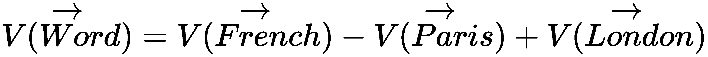
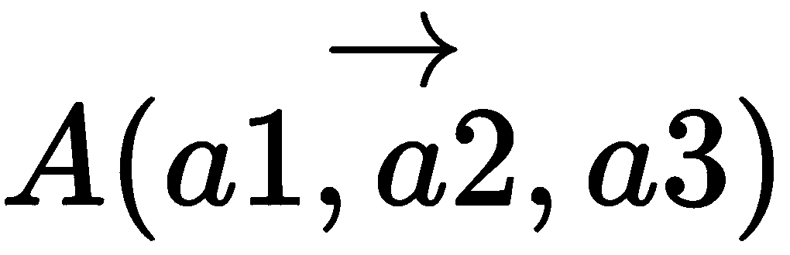

# 第九章：CNN 和视觉模型中的注意力机制

并非图像或文本中的每一部分——或者一般来说，任何数据——从我们需要获得的洞察角度来看都是同等相关的。例如，考虑一个任务，我们需要预测一个冗长陈述序列中的下一个单词，如 *Alice and Alya are friends. Alice lives in France and works in Paris. Alya is British and works in London. Alice prefers to buy books written in French, whereas Alya prefers books in _____.*  

当这个例子给人类时，即使是语言能力相对较好的孩子也能很好地预测下一个词很可能是 *English*。从数学角度出发，在深度学习的背景下，我们同样可以通过创建这些单词的向量嵌入，并使用向量数学计算结果，来得出类似的结论，具体如下：



在这里，*V(Word)* 是所需单词的向量嵌入；类似地，*V(French)*、*V(Paris)* 和 *V(London)* 分别是单词 *French*、*Paris* 和 *London* 的向量嵌入。

嵌入通常是低维且密集（数值型）的向量表示，用于表示输入或输入的索引（对于非数值数据）；在此情况下为文本。

诸如 `Word2Vec` 和 `glove` 等算法可以用来获得单词嵌入。这些模型的预训练变种可在流行的基于 Python 的 NLP 库中找到，如 SpaCy、Gensim 等，也可以使用大多数深度学习库（如 Keras、TensorFlow 等）进行训练。

嵌入（embeddings）这一概念与视觉和图像领域的相关性与文本领域同样重要。

可能没有现成的向量与我们刚刚得到的向量完全匹配，如 ；但是，如果我们尝试找到最接近的现有向量，如 ，并使用反向索引查找代表词，那么这个词很可能与我们人类之前想到的词相同，即 *English*。

诸如余弦相似度等算法可以用来找到与计算出的向量最接近的向量。

对于实现来说，找到最接近向量的计算效率更高的方式是 **近似最近邻** (**ANN**)，可以通过 Python 的 `annoy` 库来实现。

尽管我们通过认知和深度学习方法帮助得出了相同的结果，但两者的输入并不相同。对于人类，我们给出的句子与计算机相同，但对于深度学习应用，我们仔细选择了正确的单词（*French*、*Paris* 和 *London*）及其在方程中的正确位置以获得结果。想象一下，我们如何能轻松地意识到需要关注的正确单词，以理解正确的上下文，从而得出结果；但在当前的形式下，我们的深度学习方法无法做到这一点。

现在，使用不同变体和架构的 RNN（如 LSTM 和 Seq2Seq）的语言建模算法已经相当复杂。这些算法本来可以解决这个问题并得到正确的答案，但它们在较短且直接的句子中最为有效，例如*巴黎对于法语来说，就像伦敦对于 _____ 一样*。为了正确理解一个长句并生成正确的结果，重要的是要有一种机制来教导架构，使得在一长串单词中需要特别关注某些特定的词。这就是深度学习中的**注意力机制**，它适用于许多类型的深度学习应用，但方式略有不同。

**RNN**代表**循环神经网络**，用于表示深度学习中的时间序列数据。由于梯度消失问题，RNN 很少被直接使用；相反，其变体，如**LSTM**（**长短期记忆网络**）和**GRU**（**门控循环单元**）在实际应用中更为流行。**Seq2Seq**代表**序列到序列**模型，由两个 RNN（或其变体）网络组成（因此被称为**Seq2Seq**，其中每个 RNN 网络表示一个序列）；一个作为编码器，另一个作为解码器。这两个 RNN 网络可以是多层或堆叠的 RNN 网络，并通过一个思维或上下文向量连接。此外，Seq2Seq 模型可以使用注意力机制来提高性能，特别是对于更长的序列。

事实上，更准确地说，即使我们需要分层处理前面的信息，首先要理解最后一句话是关于 Alya 的。然后我们可以识别并提取 Alya 所在的城市，接着是 Alice 的城市，依此类推。人类这种分层思维方式类似于深度学习中的堆叠，因此在类似的应用中，堆叠架构非常常见。

若想更了解堆叠在深度学习中的运作方式，特别是在基于序列的架构中，可以探讨一些话题，如堆叠 RNN 和堆叠注意力网络。

本章将涵盖以下主题：

+   图像字幕生成的注意力机制

+   注意力机制的类型（硬注意力和软注意力）

+   使用注意力机制改善视觉模型

    +   视觉注意力的递归模型

# 图像字幕生成的注意力机制

从介绍中，到目前为止，您一定已经清楚注意力机制是在一系列对象上工作的，为每个序列中的元素分配一个特定迭代所需输出的权重。随着每一步的推进，不仅序列会改变，注意力机制中的权重也会发生变化。因此，基于注意力的架构本质上是序列网络，最适合使用 RNN（或其变体）在深度学习中实现。

现在的问题是：我们如何在静态图像上实现基于序列的注意力，尤其是在**卷积神经网络**（**CNN**）中表示的图像上？好吧，让我们通过一个介于文本和图像之间的例子来理解这个问题。假设我们需要根据图像内容为其生成标题。

我们有一些带有人工提供的图像和标题作为训练数据，基于这些数据，我们需要创建一个系统，能够为任何新图像生成合适的标题，且这些图像此前未曾被模型见过。如前所述，我们可以举个例子，看看作为人类我们如何理解这个任务，以及需要在深度学习和卷积神经网络（CNN）中实现的类似过程。让我们考虑以下这张图像，并为其构思一些合理的标题。我们还将通过人工判断对这些标题进行启发式排序：


一些可能的标题（从最可能到最不可能的顺序）是：

+   女人在雪林中看着狗

+   棕色狗在雪中

+   一位戴帽子的人在森林和白雪覆盖的土地上

+   狗、树、雪、人、阳光

这里需要注意的一点是，尽管女人在图像中是中心对象，而狗并不是图像中最大的物体，但我们寻求的标题显然集中在它们及其周围环境。这是因为我们认为它们在此处是重要的实体（假设没有其他上下文）。作为人类，我们如何得出这个结论的过程如下：我们首先快速浏览了整张图像，然后将焦点集中在女人身上，并以高分辨率呈现她，同时将背景的其他部分（假设是**散景**效果）置于低分辨率。我们为此部分确定了标题，然后将狗呈现为高分辨率，背景其他部分则保持低分辨率；接着我们补充了与狗相关的标题部分。最后，我们对周围环境做了相同处理并为之添加了标题部分。

所以，本质上，我们通过以下顺序得出第一个标题：


图像 1：先快速浏览图像


图像 2：聚焦于女人


图像 3：聚焦于狗


图像 4：聚焦于雪


图像 5：聚焦于森林

从注意力或焦点的权重来看，在快速浏览图像之后，我们会将注意力集中在图像中最重要的第一个物体上：这里是女人。这个过程类似于在创建一个心理框架，在这个框架中，我们将包含女人的图像部分置于高分辨率，而图像的其余部分则保持低分辨率。

在深度学习的参考中，注意力序列将会为表示女人概念的向量（嵌入）分配最高的权重。在输出/序列的下一步中，权重将更多地向代表狗的向量偏移，依此类推。

为了直观理解这一点，我们将以 CNN 形式表示的图像转换为一个扁平化的向量或其他类似的结构；然后，我们创建图像的不同切片或具有不同部分和不同分辨率的序列。同时，正如我们在第七章中讨论的那样，*使用 CNN 进行目标检测与实例分割*，我们必须拥有需要检测的相关部分，并且这些部分也必须在不同的尺度下进行有效的检测。这个概念在这里同样适用，除了分辨率，我们还会改变尺度；但为了直观理解，我们暂时忽略尺度部分，保持简单。

这些图像切片或序列现在充当一系列单词，就像我们之前的例子一样，因此它们可以在 RNN/LSTM 或类似的基于序列的架构中进行处理，用于注意力机制。这样做的目的是在每次迭代中获得最合适的单词作为输出。因此，序列的第一次迭代会得到 woman（来自表示*Woman*的序列在*Image 2*中的权重）→ 然后下一次迭代得到→ *seeing*（来自表示*Woman*背面的序列，如*Image 2*）→ *Dog*（来自*Image 3*中的序列）→ *in*（来自所有模糊像素生成的序列，生成*填充词*，从实体过渡到环境）→ *Snow*（来自*Image 4*中的序列）→ *Forest*（来自*Image 5*中的序列）。

填充词如*in*和动作词如*seeing*也可以通过在人类生成的字幕与多张图像之间进行最佳图像切片/序列映射时自动学习。但在更简单的版本中，像*Woman*、*Dog*、*Snow*和*Forest*这样的字幕也能很好地描述图像中的实体和周围环境。

# 注意力的类型

注意力机制有两种类型。它们如下：

+   硬性注意力

+   软性注意力

接下来，我们将详细了解每一种类型。

# 硬性注意力

实际上，在我们最近的图像描述示例中，会选择更多的图片，但由于我们用手写字幕进行训练，这些图片的权重永远不会更高。然而，重要的是要理解系统如何理解所有像素（或者更精确地说，是它们的 CNN 表示），系统聚焦于这些像素，以绘制不同方面的高分辨率图像，并且如何选择下一个像素以重复这一过程。

在前面的例子中，点是从分布中随机选择的，并且该过程会重复进行。而且，哪些像素会获得更高的分辨率是由注意力网络内部决定的。这种类型的注意力被称为**硬性注意力**。

硬注意力存在所谓的**可微性问题**。我们花些时间来理解这个问题。我们知道，在深度学习中，网络需要训练，而训练它们的方式是通过遍历训练批次来最小化损失函数。我们可以通过沿着最小值的梯度方向改变权重，从而最小化损失函数，这样就可以得到最小值，而这个过程是通过对损失函数进行微分得到的。*

这一过程，即从最后一层到第一层在深度网络中最小化损失，是**反向传播**。

在深度学习和机器学习中使用的一些可微损失函数示例包括对数似然损失函数、平方误差损失函数、二项式和多项式交叉熵等。

然而，由于在每次迭代中硬注意力是随机选择点的——而且这种随机像素选择机制不是一个可微函数——我们本质上无法训练这种注意力机制，正如前文所解释的。这个问题可以通过使用**强化学习**（**RL**）或切换到软注意力来解决。

强化学习涉及解决两个问题的机制，可能是分别解决，也可能是结合解决。第一个问题叫做**控制问题**，它决定了在给定状态下，代理在每一步应该采取的最优动作；第二个问题叫做**预测问题**，它决定了状态的最优*值*。

# 软注意力

正如在前面的硬注意力小节中介绍的那样，软注意力使用强化学习逐步训练并确定下一步寻找的地方（控制问题）。

使用硬注意力和强化学习（RL）结合来实现所需目标存在两个主要问题：

+   将强化学习和训练基于强化学习的代理及递归神经网络（RNN）/深度网络分开处理会稍显复杂。

+   策略函数的梯度方差不仅很高（如**A3C**模型），而且其计算复杂度为*O(N)*，其中`N`是网络中单元的数量。这大大增加了此类方法的计算负担。此外，由于注意力机制在过长的序列（无论是词语还是图像嵌入片段）中能提供更多价值——而且训练涉及更长序列的网络需要更大的内存，因此需要更深的网络——这种方法在计算上并不高效。

强化学习中的**策略函数**，表示为*Q(a,s)*，是用来确定最优策略或在给定状态*(s)*下应该采取的动作*(a)*，以最大化奖励的函数。

那么，替代方案是什么呢？正如我们所讨论的，问题的出现是因为我们为注意力机制选择的方式导致了一个不可微的函数，因此我们不得不使用强化学习（RL）。所以让我们在这里采取不同的方式。通过类比我们在前面提到的语言建模问题示例（如在`A`ttention 机制 - 直觉*部分），我们假设我们已经有了注意力网络中对象/词语的向量。此外，在同一向量空间中（比如嵌入超空间），我们将特定序列步骤中的查询所需的对象/词语的标记引入。采用这种方法，找到注意力网络中标记的正确注意力权重与查询空间中的标记之间的关系，就像计算它们之间的向量相似度一样简单；例如，计算余弦距离。幸运的是，大多数向量距离和相似度函数都是可微的；因此，使用这种向量距离/相似度函数在该空间中推导出的损失函数也是可微的，我们的反向传播可以在这种情况下正常工作。

两个向量之间的余弦距离，例如  和 ，在一个多维（此例为三维）向量空间中的计算公式为：

使用可微损失函数训练注意力网络的方法被称为**软注意力**。

# 使用注意力来改善视觉模型

正如我们在之前的注意力机制 - 直觉部分的 NLP 示例中发现的，注意力确实帮助我们在实现新的用例方面取得了巨大进展，这些用例是传统 NLP 无法高效实现的，同时也大大提高了现有 NLP 机制的性能。在 CNN 和视觉模型中，注意力的使用也是类似的。

在前一章第七章，*基于 CNN 的目标检测与实例分割*中，我们发现了如何使用类似注意力机制的区域提议网络（如 Faster R-CNN 和 Mask R-CNN），大大增强和优化了提议区域，并生成分割掩码。这对应于讨论的第一部分。在本节中，我们将讨论第二部分，我们将使用“注意力”机制来提高我们 CNN 的性能，即使在极端条件下。

# 视觉 CNN 模型性能不佳的原因

通过采用适当的调优和设置机制，CNN 网络的性能可以在一定程度上得到改善，这些机制包括：数据预处理、批归一化、权重的最佳预初始化；选择正确的激活函数；使用正则化技术来避免过拟合；使用最佳的优化函数；以及使用大量（优质）数据进行训练。

除了这些训练和架构相关的决策外，还有与图像相关的细节，这些细节可能影响视觉模型的表现。即便在控制了上述训练和架构因素后，传统的基于 CNN 的图像分类器在以下一些与底层图像相关的条件下表现不佳：

+   非常大的图像

+   包含多个分类实体的高度杂乱的图像

+   非常嘈杂的图像

让我们尝试理解在这些条件下性能不佳的原因，然后我们将从逻辑上理解可能修复问题的方案。

在传统的基于 CNN 的模型中，即便是经过层间下采样，计算复杂度仍然相当高。实际上，复杂度是以  为量级，其中 `L` 和 `W` 是图像的长度和宽度（以英寸为单位），*PPI* 是每英寸的像素数（像素密度）。这意味着计算复杂度与图像中总像素数（`P`）线性相关，即 *O(P)*。这直接回答了挑战中的第一个问题；对于更高的 `L`、`W` 或 *PPI*，我们需要更高的计算能力和时间来训练网络。

操作如最大池化、平均池化等有助于大幅减少计算负担，相比于在所有层中对实际图像进行的所有计算。

如果我们可视化 CNN 中每一层形成的模式，我们将理解 CNN 工作原理背后的直觉，并且明白为什么它需要是深层的。在每一层中，CNN 训练更高层次的概念特征，这些特征逐层帮助更好地理解图像中的物体。所以，在 MNIST 的情况下，第一层可能只识别边界，第二层识别基于边界的对角线和直线形状，以此类推：


在 CNN 的不同（初始）层中形成的 MNIST 相关的概念特征


MNIST 是一个简单的数据集，而现实生活中的图像则相当复杂；这需要更高层次的概念特征来区分它们，因此需要更复杂且更深的网络。此外，在 MNIST 中，我们试图区分相似类型的物体（所有都是手写数字）。而在现实生活中，物体可能差异很大，因此需要的不同特征类型也非常多：


这引出了我们的第二个挑战。一个包含过多物体的杂乱图像需要一个非常复杂的网络来建模所有这些物体。此外，由于需要识别的物体太多，图像分辨率需要足够高才能正确提取和映射每个物体的特征，这也意味着图像大小和像素数量需要足够高，以便进行有效的分类。这反过来会通过结合前两个挑战，成倍增加复杂性。

在 ImageNet 挑战赛中使用的流行 CNN 架构的层数，以及因此而增加的复杂性，近年来不断增加。一些例子包括：VGG16（2014）有 16 层，GoogLeNet（2014）有 19 层，ResNet（2015）有 152 层。

并非所有图像都具有完美的单反相机（SLR）质量。通常，由于低光照、图像处理、低分辨率、缺乏稳定性等原因，图像中可能会引入大量噪声。这只是噪声的一种形式，是比较容易理解的一种。从卷积神经网络（CNN）的角度来看，噪声的另一种形式可能是图像过渡、旋转或变换：


没有噪声的图像


添加噪声后的同一图像

在前面的图像中，试着在带噪声和不带噪声的图像中阅读报纸标题*Business*，或者在两张图像中识别手机。带噪声的图像中很难做到这一点，对吧？这就像在噪声图像的情况下，CNN 的检测/分类挑战一样。

即使经过大量训练，完美的超参数调整，以及诸如丢弃法等技术，这些现实中的挑战依然会降低 CNN 网络的图像识别准确性。现在我们已经理解了导致 CNN 准确性和性能不足的原因和直觉，让我们探讨一些使用视觉注意力来缓解这些挑战的方法和架构。

# 视觉注意力的递归模型

*视觉注意力的递归模型*可以用来解决我们在前面部分提到的一些挑战。这些模型使用硬注意力方法，正如在之前的（*注意力类型*）部分中所讲述的那样。在这里，我们使用的是一种流行的视觉注意力递归模型变体——**递归注意力模型**（**RAM**）。

如前所述，硬注意力问题是不可微分的，因此必须使用强化学习（RL）来解决控制问题。因此，RAM 使用强化学习来进行此优化。

视觉注意力的递归模型不会一次性处理整个图像，甚至不会处理基于滑动窗口的边界框。它模仿人眼的工作方式，基于图像中不同位置的*注视*，并结合每次*注视*所获得的重要信息，逐步建立起图像场景的内部表示。它使用递归神经网络（RNN）以顺序方式进行处理。

模型根据 RL 智能体的控制策略选择下一个要固定的位置信息，以最大化基于当前状态的奖励。当前状态又是所有过去信息和任务需求的函数。因此，它找到下一个固定坐标，以便在已经收集的信息基础上（通过 RNN 的记忆快照和先前访问的坐标）最大化奖励（任务需求）。

大多数 RL 机制使用**马尔可夫决策过程**(**MDP**)，其中下一个动作仅由当前状态决定，而与之前访问的状态无关。在这里使用 RNN，能够将来自先前*固定视点*的重要信息结合到当前状态中。

上述机制解决了 CNN 在前面部分中强调的最后两个问题。此外，在 RAM 中，参数的数量和计算量可以独立于输入图像的大小进行控制，从而也解决了第一个问题。

# 在噪声 MNIST 样本上应用 RAM

为了更详细地理解 RAM 的工作原理，让我们尝试创建一个包含一些早期部分所提到的问题的 MNIST 样本：


更大的噪声和失真的 MNIST 图像

上图展示了一个较大的图像/拼贴，使用了一个实际且略微噪声化的 MNIST 图像（数字`2`），以及其他一些失真和部分样本的片段。此外，实际的数字`2`并未居中。此示例代表了之前所述的所有问题，但足够简单，便于理解 RAM 的工作原理。

RAM 使用**瞥视传感器**的概念。RL 智能体将目光固定在特定的坐标(`l`)和特定的时间(*t-1*)。在时间 t-1 时刻，坐标*l[t-1]*和图像*x[t]*的内容，通过**瞥视传感器**提取以*l[t-1]*为中心的类似视网膜的多分辨率图像补丁。这些在时间*t-1*提取的表示 collectively 被称为*p(x[t]*, *l[t-1])*：


瞥视传感器的概念

  ;

这些图像展示了我们的图像在两个固定视点下使用**瞥视传感器**的表示。

从**瞥视传感器**获得的表示经过'瞥视网络'处理，表示会在两个阶段被展平。在第一阶段，**瞥视传感器**和**瞥视网络**的表示分别被展平（），然后它们合并为一个单一的展平层（），以生成时间`t`的输出表示*g[t]*：


Glimpse 网络的概念

这些输出表示然后传递通过 RNN 模型架构。下一步的固定点由 RL 代理决定，以最大化来自此架构的奖励：


模型架构（RNN）

如直观理解所示，Glimpse 传感器捕捉了跨越注视点的重要信息，这有助于识别重要的概念。例如，我们第二个示例图像中表示的 Fixation 处的多个分辨率（此处为 3）具有标记的三种分辨率（按分辨率递减顺序为红色、绿色和蓝色）。如图所示，即使这些被直接使用，我们依然能够检测到由这一噪声拼贴表示的正确数字：


# Glimpse 传感器代码

如前一节所讨论，Glimpse 传感器是一个强大的概念。结合 RNN 和 RL 等其他概念，如前所述，它是提高视觉模型性能的核心。

让我们在这里更详细地查看。代码的每一行都有注释，方便理解，并且自解释：

```py

import tensorflow as tf
# the code is in tensorflow
import numpy as np

def glimpseSensor(image, fixationLocation):
    '''
    Glimpse Sensor for Recurrent Attention Model (RAM)
    :param image: the image xt
    :type image: numpy vector
    :param fixationLocation: cordinates l for fixation center
    :type fixationLocation: tuple
    :return: Multi Resolution Representations from Glimpse Sensor
    :rtype:
    '''

    img_size=np.asarray(image).shape[:2]
    # this can be set as default from the size of images in our dataset, leaving the third 'channel' dimension if any

    channels=1
    # settings channels as 1 by default
    if (np.asarray(img_size).shape[0]==3):
        channels=np.asarray(image).shape[-1]
    # re-setting the channel size if channels are present

    batch_size=32
    # setting batch size

    loc = tf.round(((fixationLocation + 1) / 2.0) * img_size)
    # fixationLocation coordinates are normalized between -1 and 1 wrt image center as 0,0

    loc = tf.cast(loc, tf.int32)
    # converting number format compatible with tf

    image = tf.reshape(image, (batch_size, img_size[0], img_size[1], channels))
    # changing img vector shape to fit tf

    representaions = []
    # representations of image
    glimpse_images = []
    # to show in window

    minRadius=img_size[0]/10
    # setting the side size of the smallest resolution image
    max_radius=minRadius*2
    offset = 2 * max_radius
    # setting the max side and offset for drawing representations
    depth = 3
    # number of representations per fixation
    sensorBandwidth = 8
    # sensor bandwidth for glimpse sensor

    # process each image individually
    for k in range(batch_size):
        imageRepresentations = []
        one_img = image[k,:,:,:]
        # selecting the required images to form a batch

        one_img = tf.image.pad_to_bounding_box(one_img, offset, offset, max_radius * 4 + img_size, max_radius * 4 + img_size)
        # pad image with zeros for use in tf as we require consistent size

        for i in range(depth):
            r = int(minRadius * (2 ** (i)))
            # radius of draw
            d_raw = 2 * r
            # diameter

            d = tf.constant(d_raw, shape=[1])
            # tf constant for dia

            d = tf.tile(d, [2])
            loc_k = loc[k,:]
            adjusted_loc = offset + loc_k - r
            # location wrt image adjusted wrt image transformation and pad

            one_img2 = tf.reshape(one_img, (one_img.get_shape()[0].value, one_img.get_shape()[1].value))
            # reshaping image for tf

            representations = tf.slice(one_img2, adjusted_loc, d)
            # crop image to (d x d) for representation

            representations = tf.image.resize_bilinear(tf.reshape(representations, (1, d_raw, d_raw, 1)), (sensorBandwidth, sensorBandwidth))
            # resize cropped image to (sensorBandwidth x sensorBandwidth)

            representations = tf.reshape(representations, (sensorBandwidth, sensorBandwidth))
            # reshape for tf

            imageRepresentations.append(representations)
            # appending the current representation to the set of representations for image

        representaions.append(tf.stack(imageRepresentations))

    representations = tf.stack(representations)

    glimpse_images.append(representations)
    # return glimpse sensor output
    return representations
```

# 参考文献

1.  Kelvin Xu, Jimmy Ba, Ryan Kiros, Kyunghyun Cho, Aaron C. Courville, Ruslan Salakhutdinov, Richard S. Zemel, Yoshua Bengio, Show, Attend and Tell: *基于视觉注意力的神经图像描述生成*，CoRR，arXiv:1502.03044，2015 年。

1.  Karl Moritz Hermann, Tom's Kocisk, Edward Grefenstette, Lasse Espeholt, Will Kay, Mustafa Suleyman, Phil Blunsom, *教机器阅读与理解*，CoRR，arXiv:1506.03340，2015 年。

1.  Volodymyr Mnih, Nicolas Heess, Alex Graves, Koray Kavukcuoglu, *视觉注意力的递归模型*，CoRR，arXiv:1406.6247，2014 年。

1.  Long Chen, Hanwang Zhang, Jun Xiao, Liqiang Nie, Jian Shao, Tat-Seng Chua, SCA-CNN: *卷积网络中的空间与通道注意力用于图像描述*，CoRR，arXiv:1611.05594，2016 年。

1.  Kan Chen, Jiang Wang, Liang-Chieh Chen, Haoyuan Gao, Wei Xu, Ram Nevatia, ABC-CNN: *一种基于注意力的卷积神经网络用于视觉问答*，CoRR，arXiv:1511.05960，2015 年。

1.  Wenpeng Yin, Sebastian Ebert, Hinrich Schutze, *基于注意力的卷积神经网络用于机器理解*，CoRR，arXiv:1602.04341，2016 年。

1.  Wenpeng Yin, Hinrich Schutze, Bing Xiang, Bowen Zhou, ABCNN: *基于注意力的卷积神经网络用于建模句子对*，CoRR，arXiv:1512.05193，2015 年。

1.  Zichao Yang, Xiaodong He, Jianfeng Gao, Li Deng, Alexander J. Smola, *用于图像问答的堆叠注意力网络*，CoRR，arXiv:1511.02274，2015 年。

1.  Y. Chen, D. Zhao, L. Lv 和 C. Li，*一种基于视觉注意力的卷积神经网络用于图像分类*，*2016 年第 12 届世界智能控制与自动化大会（WCICA）*，桂林，2016 年，第 764-769 页。

1.  H. Zheng，J. Fu，T. Mei 和 J. Luo，*学习多注意力卷积神经网络用于细粒度图像识别*，*2017 年 IEEE 国际计算机视觉会议（ICCV）*，威尼斯，2017 年，5219-5227 页。

1.  肖天俊、徐一冲、杨奎远、张家兴、彭宇欣、张正，*两级注意力模型在深度卷积神经网络中的应用：用于细粒度图像分类*，CoRR，arXiv:1411.6447，2014 年。

1.  Jlindsey15，*循环注意力模型的 TensorFlow 实现*，GitHub，[`github.com/jlindsey15/RAM`](https://github.com/jlindsey15/RAM)，2018 年 2 月。

1.  QihongL，*循环注意力模型的 TensorFlow 实现*，GitHub，[`github.com/QihongL/RAM`](https://github.com/QihongL/RAM)，2018 年 2 月。

1.  Amasky，*循环注意力模型*，GitHub，[`github.com/amasky/ram`](https://github.com/amasky/ram)，2018 年 2 月。

# 摘要

注意力机制是当今深度学习中最热门的话题，被认为是当前研究中大多数前沿算法的核心，并且在未来的应用中也可能处于中心地位。像图像描述、视觉问答等问题，已经通过这种方法得到了很好的解决。事实上，注意力机制不仅限于视觉任务，早期也被应用于神经机器翻译等复杂的自然语言处理问题。因此，理解注意力机制对于掌握许多高级深度学习技术至关重要。

卷积神经网络（CNN）不仅用于视觉任务，还在许多应用中与注意力机制结合，用于解决复杂的自然语言处理问题，如**建模句子对和机器翻译**。本章介绍了注意力机制及其在一些自然语言处理问题中的应用，以及图像描述和循环视觉模型。在 RAM 中，我们没有使用 CNN，而是将 RNN 和注意力机制应用于从 Glimpse 传感器获得的图像缩小表示。然而，最近的研究也开始将注意力机制应用于基于 CNN 的视觉模型。

强烈建议读者参考文献中的原始论文，并探索使用注意力机制的高级概念，如多层次注意力、堆叠注意力模型以及使用 RL 模型（例如**异步优势行为者-批评家**（**A3C**）模型解决硬注意力控制问题）。
