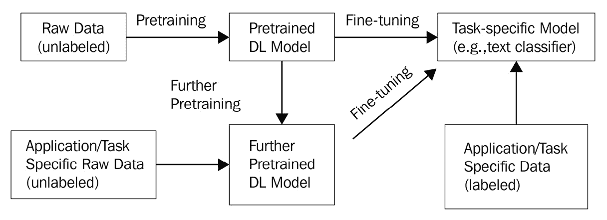
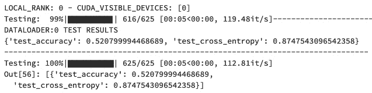
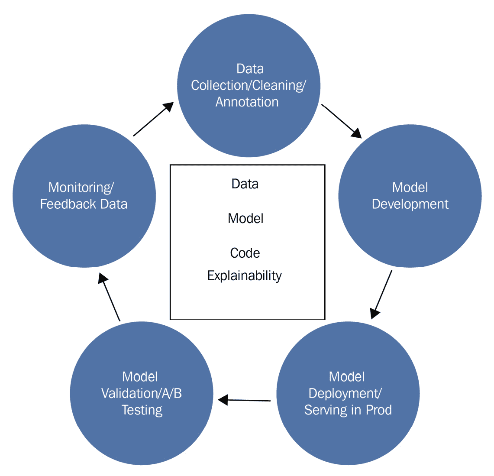
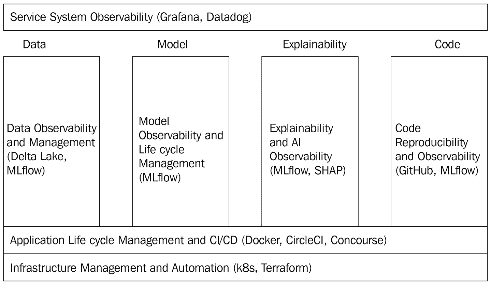
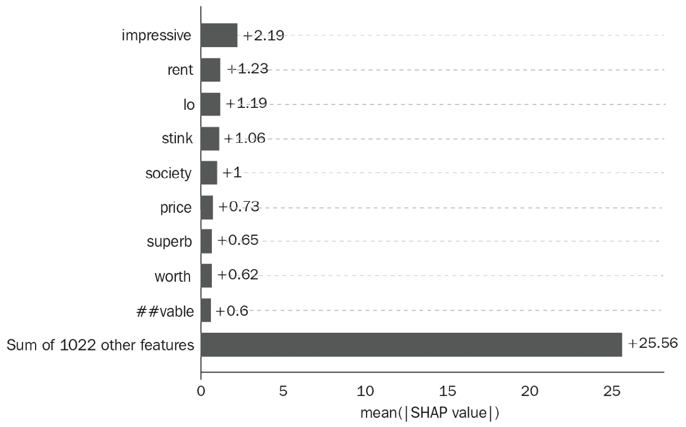

# 第一章：深度学习生命周期与 MLOps 挑战

近年来，**深度学习**（**DL**）在解决实际业务、工业和科学问题方面取得了巨大成功，特别是在**自然语言处理**（**NLP**）、图像、视频、语音识别和对话理解等任务中。尽管这些领域的研究取得了巨大的进展，但将这些深度学习模型从离线实验推广到生产环境，并持续改进模型以提供可持续的价值，仍然是一个挑战。例如，VentureBeat 最近的一篇文章（[`venturebeat.com/2019/07/19/why-do-87-of-data-science-projects-never-make-it-into-production/`](https://venturebeat.com/2019/07/19/why-do-87-of-data-science-projects-never-make-it-into-production/)）发现，87%的数据科学项目从未进入生产。虽然这种低生产率可能有商业原因，但一个主要的因素是缺乏实验管理和成熟的模型生产与反馈平台所带来的困难。

本章将帮助我们理解这些挑战，并通过学习在深度学习模型开发的整个生命周期中常用的概念、步骤和组件来弥合这些差距。此外，我们还将学习一个新兴领域——**机器学习运维**（**MLOps**）的挑战，MLOps 旨在标准化和自动化机器学习生命周期的开发、部署和运营。深入理解这些挑战将激励我们学习本书其余部分中介绍的使用 MLflow 的技能，MLflow 是一个开源的机器学习全生命周期平台。采用 MLOps 最佳实践的商业价值有很多，其中包括更快的模型派生产品功能的市场推出、更低的运营成本、更灵活的 A/B 测试以及更具战略性的决策制定，从而最终改善客户体验。在本章结束时，我们将了解 MLflow 在 MLOps 四大支柱（即数据、模型、代码和可解释性）中所发挥的关键作用，实施我们的第一个工作深度学习模型，并清晰地理解数据、模型、代码和可解释性在深度学习中的挑战。

本章将覆盖以下主要内容：

+   理解深度学习（DL）生命周期和 MLOps 挑战

+   理解深度学习（DL）数据挑战

+   理解深度学习（DL）模型的挑战

+   理解深度学习（DL）代码挑战

+   理解深度学习（DL）可解释性挑战

# 技术要求

本书所有的代码示例都可以在以下 GitHub 网址找到：[`github.com/PacktPublishing/Practical-Deep-Learning-at-Scale-with-MLFlow`](https://github.com/PacktPublishing/Practical-Deep-Learning-at-Scale-with-MLFlow)。

你需要在开发环境中安装 Miniconda（[`docs.conda.io/en/latest/miniconda.html`](https://docs.conda.io/en/latest/miniconda.html)）。在本章中，我们将逐步介绍安装 PyTorch `lightning-flash`库的过程（[`github.com/PyTorchLightning/lightning-flash`](https://github.com/PyTorchLightning/lightning-flash)），该库可以用于在*实现一个基本的深度学习情感分类器*部分中构建我们的第一个深度学习模型。或者，你也可以注册一个免费的 Databricks 社区版账户（[`community.cloud.databricks.com/login.html`](https://community.cloud.databricks.com/login.html)），使用 GPU 集群和笔记本来进行本书中描述的模型开发。

此外，如果你是微软 Windows 用户，我们建议你安装 WSL2（[`www.windowscentral.com/how-install-wsl2-windows-10`](https://www.windowscentral.com/how-install-wsl2-windows-10)），这样你就能拥有一个 Linux 环境来运行本书中的命令行。

# 理解深度学习生命周期和 MLOps 的挑战

目前，成功部署到生产中的大多数深度学习模型主要遵循以下两个步骤：

1.  **自监督学习**：指的是在数据丰富的领域中进行模型的预训练，该领域不需要标签数据。这一步生成了一个预训练模型，也称为**基础模型**，例如，BERT、GPT-3 用于自然语言处理（NLP），以及 VGG-NETS 用于计算机视觉。

1.  **迁移学习**：指的是在特定预测任务中对预训练模型进行微调，例如文本情感分类，这需要有标签的训练数据。

一个开创性且成功的深度学习（DL）模型生产实例是*买家情感分析*模型，该模型基于 BERT 构建，用于分类销售互动邮件信息，提供对买家情感和信号的细致洞察，超越简单的活动指标，如回复、点击和打开率（[`www.prnewswire.com/news-releases/outreach-unveils-groundbreaking-ai-powered-buyer-sentiment-analysis-transforming-sales-engagement-301188622.html`](https://www.prnewswire.com/news-releases/outreach-unveils-groundbreaking-ai-powered-buyer-sentiment-analysis-transforming-sales-engagement-301188622.html)）。关于其工作原理有不同的变体，但在本书中，我们将主要聚焦于**迁移学习**范式，开发和部署深度学习模型，因为它展示了一个实用的深度学习生命周期。

让我们通过一个例子来了解典型的核心深度学习开发范式。例如，2018 年底发布的流行 BERT 模型（BERT 模型的基础版本可以在[`huggingface.co/bert-base-uncased`](https://huggingface.co/bert-base-uncased)找到）最初是在来自 BookCorpus 的 11,000 多本书籍以及整个英文维基百科的原始文本上进行预训练的（没有人工标注）。然后，使用该预训练语言模型对许多下游自然语言处理任务进行了微调，如文本分类和情感分析，应用于不同的领域，比如通过使用标注的电影评论数据进行电影评论分类（[`huggingface.co/datasets/imdb`](https://huggingface.co/datasets/imdb)）。需要注意的是，有时为了提高最终模型在准确度方面的性能，可能需要使用无标签数据在应用领域内进一步预训练基础模型（例如 BERT），然后再进行微调。这个核心的深度学习开发范式如*图 1.1*所示：



图 1.1 – 一个典型的核心深度学习开发范式

注意，虽然*图 1.1*代表了一个常见的开发范式，但并不是所有的步骤在特定的应用场景中都是必要的。例如，你可能只需要使用公开的预训练深度学习模型和你标注好的应用特定数据进行微调。因此，你不需要进行自己的预训练或使用无标签数据进一步预训练，因为其他人或组织已经为你完成了预训练步骤。

深度学习与传统机器学习

与传统的机器学习模型开发不同，通常需要进行特征工程步骤，将原始数据提取并转化为特征，以训练如决策树或逻辑回归这样的机器学习模型，深度学习能够自动学习特征，这一点对于建模非结构化数据（如文本、图像、视频、音频和语音）尤其有吸引力。由于这一特点，深度学习也被称为*表征学习*。除此之外，深度学习通常是数据密集型和计算密集型的，需要**图形处理单元**（**GPUs**）、**张量处理单元**（**TPU**）或其他类型的计算硬件加速器来进行大规模训练和推理。相比传统机器学习模型，深度学习模型的可解释性也更难实现，尽管近期的进展已经使得这一点成为可能。

## 实现一个基本的深度学习情感分类器

为了设置基本的深度学习情感分类器开发环境，你需要在本地创建一个虚拟环境。假设你已经有了`dl_model`，并且安装了 PyTorch 的`lightning-flash`包，这样模型就能被构建：

```py
conda create -n dl_model python==3.8.10
conda activate dl_model
pip install lightning-flash[all]
```

根据你本地机器的内存情况，前面的命令可能需要大约 10 分钟才能完成。你可以通过运行以下命令来验证安装是否成功：

```py
conda list | grep lightning
```

如果你看到类似以下的输出，说明安装成功：

```py
lightning-bolts     0.3.4                    pypi_0    pypi
lightning-flash     0.5.0                    pypi_0    pypi
pytorch-lightning   1.4.4                    pypi_0    pypi
```

现在，你已经准备好构建你的第一个深度学习模型了！

要开始构建一个深度学习模型，请完成以下步骤：

1.  导入必要的`torch`和`flash`库，并从`flash`子包中导入`download_data`、`TextClassificationData`和`TextClassifier`：

    ```py
    import torch
    import flash
    from flash.core.data.utils import download_data
    from flash.text import TextClassificationData, TextClassifier
    ```

1.  为了进行微调，使用`download_data`下载`imdb.zip`文件，它是来自`train.csv`的公共领域二元情感分类（正面/负面）数据集。

1.  `valid.csv`

1.  `test.csv`

每个文件包含两列：`review`和`sentiment`。然后，我们使用`TextClassificationData.from_csv`声明一个`datamodule`变量，将`review`分配给`input_fields`，将`sentiment`分配给`target_fields`。此外，它还将`train.csv`文件分配给`train_file`，将`valid.csv`文件分配给`val_file`，将`test.csv`文件分配给`test_file`属性：

```py
download_data("https://pl-flash-data.s3.amazonaws.com/imdb.zip", "./data/")
datamodule = TextClassificationData.from_csv(
    input_fields="review",
    target_fields="sentiment",
    train_file="data/imdb/train.csv",
    val_file="data/imdb/valid.csv",
    test_file="data/imdb/test.csv"
)
```

1.  一旦我们有了数据，我们现在可以使用基础模型进行微调。首先，通过调用`TextClassifier`并将骨干网络（backbone）设置为`prajjwal1/bert-tiny`来声明`classifier_model`（`prajjwal1/bert-tiny`是一个更小的类似 BERT 的预训练模型，位于 Hugging Face 模型库中：[`huggingface.co/prajjwal1/bert-tiny`](https://huggingface.co/prajjwal1/bert-tiny)）。这意味着我们的模型将基于`bert-tiny`模型。

1.  下一步是通过定义我们希望运行的轮数（epochs）和希望使用的 GPU 数量来设置训练器。这里，`torch.cuda.device_count()`将返回*0*（没有 GPU）或*1*到*N*，其中*N*是你运行环境中最大可用 GPU 的数量。现在，我们已经准备好调用`trainer.finetune`来训练一个二元情感分类器，使用的是 IMDb 数据集：

    ```py
    classifier_model = TextClassifier(backbone="prajjwal1/bert-tiny", num_classes=datamodule.num_classes)
    trainer = flash.Trainer(max_epochs=3, gpus=torch.cuda.device_count())
    trainer.max_epochs=1 if you simply want to get a basic version of the sentiment classifier quickly.
    ```

1.  微调步骤完成后，我们将通过运行`trainer.test()`来测试模型的准确性：

    ```py
    trainer.test()
    ```

测试结果的输出应该类似于以下屏幕截图，表明最终模型的准确率大约为 52%：



图 1.2 – 我们的第一个深度学习模型的测试结果

前面图表中显示的测试结果表明，我们有了模型的基本版本，因为我们只对基础模型进行了三轮微调，并且没有使用诸如超参数调优或更好的微调策略等高级技术。然而，这是一个很大的成就，因为你现在已经掌握了核心深度学习模型的工作原理！我们将在本书的后续章节中探索更高级的模型训练技术。

## 理解深度学习的完整生命周期开发

到目前为止，你应该已经准备好第一个深度学习模型，并应该为此感到自豪。现在，让我们一起探索完整的深度学习生命周期，充分理解其概念、组成部分和挑战。

你可能已经了解到，核心的深度学习开发范式围绕着三个关键要素：*数据*、*模型*和*代码*。除此之外，*可解释性*是另一个在许多关键任务应用场景中所需的重要要素，如医学诊断、金融行业以及刑事司法决策。由于深度学习通常被视为“黑盒”，因此在部署到生产环境之前和之后，提供可解释性越来越成为一个关键要求。

请注意，如果我们仍在试图通过实验室环境中的数据集确定哪个模型有效，那么*图 1.1* 仍然被视为离线实验。即使在这种离线实验环境中，情况也会迅速变得复杂。此外，我们希望了解并追踪我们已经或尚未执行过哪些实验，以便避免浪费时间重复相同的实验，无论我们使用了哪些参数和数据集，或者对于特定模型，我们采用了什么样的指标。一旦我们拥有一个足够适用于用例和客户场景的模型，复杂性将增加，因为我们需要一种持续部署和更新模型的方法，监控模型和数据的漂移，并在必要时重新训练模型。当需要大规模训练、部署、监控和可解释性时，这种复杂性会进一步增加。

让我们来看看深度学习生命周期的样子（见*图 1.3*）。有五个阶段：

1.  数据收集、清洗和注释/标注。

1.  模型开发（也称为离线实验）。*图 1.1* 中的核心深度学习开发范式被视为模型开发阶段的一部分，而该阶段本身可以是一个迭代过程。

1.  模型部署与生产环境中的服务。

1.  模型验证与 A/B 测试（也称为在线实验；通常在生产环境中进行）。

1.  在生产过程中进行监控和反馈数据收集。

*图 1.3* 提供了一个图示，展示了这是一个持续发展的深度学习模型开发周期：



图 1.3 – 完整的深度学习开发生命周期

除此之外，我们还想指出，正如*图 1.3* 所示，这五个阶段的支柱实际上围绕着四个要素：数据、模型、代码和可解释性。我们将在接下来的章节中探讨这些要素在生命周期中的挑战。然而，首先，让我们了解并理解 MLOps，这是一个不断发展的平台概念和框架，支持机器学习的完整生命周期。这将帮助我们在更宏观的背景下理解这些挑战。

## 理解 MLOps 挑战

MLOps 与 DevOps 有一些联系，DevOps 使用一系列技术栈和标准操作流程来进行软件开发和部署，并结合 IT 运维。与传统软件开发不同，机器学习（ML）尤其是深度学习（DL）代表着一种新的软件开发范式——**软件 2.0**（[`karpathy.medium.com/software-2-0-a64152b37c35`](https://karpathy.medium.com/software-2-0-a64152b37c35)）。软件 2.0 的关键区别在于，软件的行为不仅依赖于人们已经理解的编程语言代码（这是软件 1.0 的特点），还依赖于神经网络中学习到的权重，而这些权重很难写成代码。换句话说，代码、数据和模型的整合是不可分割的，必须共同管理。因此，MLOps 正在发展，并且仍在不断演变，以适应这一新的软件 2.0 范式。本书中，MLOps 被定义为一个由三大基础层和四大支柱组成的运营自动化平台。它们如下所示：

+   下面是三大基础层：

    +   基础设施管理与自动化

    +   应用生命周期管理与**持续集成与持续部署**（**CI/CD**）

    +   服务系统可观测性

+   下面是四大支柱：

    +   数据可观测性与管理

    +   模型可观测性与生命周期管理

    +   可解释性与**人工智能**（**AI**）可观测性

    +   代码可复现性与可观测性

此外，我们还将解释 MLflow 在这些 MLOps 层和支柱中的角色，以便我们清楚地了解 MLflow 如何在整体上构建 MLOps 层：

+   **基础设施管理与自动化**：这包括但不限于用于自动化容器编排的*Kubernetes*（也称为 k8s）和用于管理数百个云服务及访问控制的*Terraform*（常用于此）。这些工具已适应于管理已部署为服务端点的机器学习（ML）和深度学习（DL）应用程序。书中并不专注于这些基础设施层；相反，我们将专注于如何使用 MLflow 提供的功能来部署训练好的深度学习模型。

+   **应用生命周期管理和 CI/CD**：这包括但不限于用于虚拟化的*Docker*容器、如 Kubernetes 这样的容器生命周期管理工具，以及用于**CI**和**CD**的*CircleCI*或*Concourse*。通常，CI 指的是每当 GitHub 仓库中的代码或模型发生变化时，一系列自动化测试将被触发，以确保不会引入破坏性更改。一旦这些测试通过，新的更改将自动发布为新包的一部分。这将触发一个新的部署过程（CD），将新包部署到生产环境中（通常，这将包括人为批准作为安全门）。请注意，这些工具并非 ML 应用程序独有，而是已被调整为适应 ML 和 DL 应用，尤其是当我们需要 GPU 和分布式集群来训练和测试 DL 模型时。本书中，我们不会专注于这些工具，但会在需要时提及集成点或示例。

+   **服务系统可观察性**：这主要是用于监控硬件/集群/CPU/内存/存储、操作系统、服务可用性、延迟和吞吐量。这包括如*Grafana*、*Datadog*等工具。同样，这些工具并非 ML 和 DL 应用独有，也不是本书的重点。

+   **数据可观察性和管理**：这在传统的 DevOps 世界中表现得相对不足，但在 MLOps 中变得非常重要，因为数据在 ML/DL 模型的整个生命周期中至关重要。这包括*数据质量监控*、*异常检测*、*数据漂移*和*概念漂移检测*、*偏差检测*、*安全*和*合规的数据共享*、*数据来源追踪*和*版本管理*等。这一领域适用于 ML 和 DL 应用的工具栈仍在不断涌现。一些例子包括**DataFold**（[`www.datafold.com/`](https://www.datafold.com/)）和**Databand**（[`databand.ai/open-source/`](https://databand.ai/open-source/)）。数据管理中的一个最新发展是一个统一的湖仓架构和实现，称为**Delta Lake**（[`delta.io`](http://delta.io)），可用于 ML 数据管理。MLflow 与 Delta Lake 有原生集成点，我们将在本书中介绍该集成。

+   **模型可观察性和生命周期管理**：这是 ML/DL 模型特有的，且由于 MLflow 的兴起，这一功能直到最近才得以广泛应用。这包括模型训练、测试、版本管理、注册、部署、序列化、模型漂移监控等工具。我们将学习 MLflow 在这一领域所提供的令人兴奋的能力。值得注意的是，一旦将 CI/CD 工具与 MLflow 的训练/监控、用户反馈回路和人工标注结合起来，我们就可以实现**持续训练**、**持续测试**和**持续标注**。MLflow 提供了基础能力，使得 MLOps 中的进一步自动化成为可能，尽管这种完全自动化并不是本书的重点。有兴趣的读者可以在本章末尾找到相关参考资料，以便深入探索这一领域。

+   **可解释性和 AI 可观察性**：这是 ML/DL 模型特有的，尤其对 DL 模型而言尤为重要，因为传统上，DL 模型被视为“黑箱”。理解模型为何给出某些预测，对于社会影响深远的应用至关重要。例如，在医疗、金融、司法和许多人机协作的决策支持应用中，如民用和军事应急响应，对可解释性的需求日益增加。MLflow 与一种叫做 SHAP 的流行可解释性框架原生集成，本书将详细介绍该框架。

+   **代码可复现性和可观察性**：这并不完全是 ML/DL 应用程序所特有的。然而，DL 模型面临一些特殊挑战，因为 DL 代码框架种类繁多，且复现模型的需求不仅仅依赖于代码本身（我们还需要数据和执行环境，如 GPU 集群）。此外，笔记本通常用于模型的开发和生产。如何管理笔记本与模型运行之间的关系非常重要。通常，GitHub 被用于管理代码库；然而，我们需要以可复现的方式构建 ML 项目代码，无论是在本地（例如本地笔记本电脑）还是远程（例如，在 Databricks 的 GPU 集群中）。MLflow 提供了这一能力，允许已经编写的 DL 项目在任何地方运行，无论是在离线实验环境中，还是在在线生产环境中。本书将介绍 MLflow 的 MLproject 功能。

总结来说，MLflow 在 MLOps 中扮演着至关重要且基础性的角色。它填补了 DevOps 传统上未覆盖的空白，因此是本书的重点。下图（*图 1.4*）展示了 MLflow 在不断发展的 MLOps 世界中所扮演的核心角色：



图 1.4 – MLOps 的三层结构和四大支柱，以及 MLflow 的作用

虽然底部的两个层和最上层在许多软件开发和部署过程中是常见的，但中间的四个支柱要么完全独特于机器学习/深度学习应用，要么部分独特于机器学习/深度学习应用。MLflow 在 MLOps 的这四个支柱中起着至关重要的作用。本书将帮助你自信地应用 MLflow 解决这四个支柱的问题，同时为你提供进一步集成其他工具的能力，结合*图 1.4*所示的 MLOps 层，依据你的场景需求实现全自动化。

# 理解深度学习数据挑战

在本节中，我们将讨论深度学习生命周期各个阶段的数据挑战，如*图 1.3*所示。本质上，深度学习是数据中心的人工智能，与符号人工智能不同，符号人工智能可以在没有大量数据的情况下利用人类知识。深度学习中的数据挑战贯穿整个生命周期的所有阶段：

+   **数据收集/清洗/标注**：深度学习的首个成功之一始于**ImageNet** ([`www.image-net.org/`](https://www.image-net.org/))，该平台收集并根据 WordNet 数据库中的英文名词对数百万张图像进行了标注 ([`wordnet.princeton.edu/`](https://wordnet.princeton.edu/))。这促成了预训练深度学习模型在计算机视觉领域的成功发展，如 VGG-NETS ([`pytorch.org/hub/pytorch_vision_vgg/`](https://pytorch.org/hub/pytorch_vision_vgg/))，该模型能够执行最先进的图像分类，并广泛应用于工业和商业领域。这种大规模数据收集和标注的主要挑战是未知的偏差，这在这一过程中很难测量 ([`venturebeat.com/2020/11/03/researchers-show-that-computer-vision-algorithms-pretrained-on-imagenet-exhibit-multiple-distressing-biases/`](https://venturebeat.com/2020/11/03/researchers-show-that-computer-vision-algorithms-pretrained-on-imagenet-exhibit-multiple-distressing-biases/))。另一个例子是销售参与平台**Outreach** ([`www.outreach.io/`](https://www.outreach.io/))，我们可以在其中分类潜在买家的情绪。例如，我们可以从收集 100 个付费组织的电子邮件信息开始，以训练一个深度学习模型。接下来，我们需要收集更多组织的电子邮件信息，可能是出于准确性要求或扩展语言覆盖范围（例如从仅限英语到其他语言，如德语和法语）。这些反复的数据收集和标注会生成大量的数据集。通常，我们会仅仅用硬编码的版本号为数据集命名，并将其作为数据集文件名的一部分，例如以下所示：

    ```py
    MyCoolAnnotatedData-v1.0.csv
    MyCoolAnnotatedData-v2.0.csv
    MyCoolAnnotatedData-v3.0.csv
    MyCoolAnnotatedData-v4.0.csv
    ```

这似乎有效，直到由于需要修正注释错误或因客户流失而移除电子邮件消息时，某些 vX.0 数据集需要更改。如果我们需要将多个数据集结合起来，或者进行一些数据清洗和转换以训练一个新的深度学习模型，怎么办？如果我们需要实施数据增强来人工生成一些数据集呢？显然，简单地更改文件名既不可扩展也不可持续。

+   **模型开发**：我们需要理解，用于训练/预训练深度学习模型的数据中的偏差会在应用模型时反映到预测中。虽然本书不会专注于消除数据偏差，但我们必须在训练和服务深度学习模型时，实施数据版本控制和数据来源管理，将其作为首要的构建模块，这样我们才能跟踪所有模型实验。在针对我们的使用场景对预训练模型进行微调时，正如我们之前所做的那样，我们还需要跟踪微调数据集的版本。在我们之前的例子中，我们使用了 BERT 模型的一个变种来微调 IMDb 评论数据。虽然在第一个例子中我们并没有关心数据的版本或来源，但对于实际应用来说，这是非常重要的。总的来说，深度学习模型需要通过一种可扩展的方法与特定版本的数据集关联。本书将提供有关此主题的解决方案。

+   **模型部署与线上服务**：这是将模型部署到生产环境中以服务在线流量的过程。深度学习模型的服务延迟在这一阶段尤为重要，值得收集。这可能使你能够调整用于推理的硬件环境。

+   **模型验证与 A/B 测试**：我们在这一阶段收集的数据主要是在线实验环境中的用户行为指标（[`www.slideshare.net/pavel/ab-testing-ai-global-artificial-intelligence-conference-2019`](https://www.slideshare.net/pavel/ab-testing-ai-global-artificial-intelligence-conference-2019)）。还需要对在线数据流量进行特征分析，以便了解模型输入在离线实验与在线实验之间是否存在统计差异。只有通过 A/B 测试并验证模型确实在用户行为指标方面优于之前的版本，我们才会将其推向生产环境，供所有用户使用。

+   **监控与反馈循环**：在这一阶段，需要注意的是，数据需要持续收集，以便检测数据漂移和概念漂移。例如，在前面讨论的买家情绪分类案例中，如果买家开始使用训练数据中未出现的术语，模型的性能可能会下降。

总结来说，数据跟踪和可观测性是深度学习（DL）生命周期各个阶段中的主要挑战。

# 理解深度学习模型的挑战

在本节中，我们将讨论深度学习（DL）模型的挑战。让我们看看深度学习生命周期各阶段的挑战，如*图 1.3* 所示：

+   **数据收集/清理/标注**：虽然数据挑战已经被提到，但将数据与目标模型关联的挑战仍然存在。MLflow 与 Delta Lake 原生集成，以便任何训练过的模型都可以追溯到 Delta Lake 中的特定版本。

+   `pickle`([`github.com/cloudpipe/cloudpickle`](https://github.com/cloudpipe/cloudpickle)) 通常用于序列化用 Python 编写的模型。然而，TorchScript ([`pytorch.org/docs/stable/jit.html`](https://pytorch.org/docs/stable/jit.html)) 目前在 PyTorch 模型中表现出色。此外，Open Neural Network Exchange 或 ONNX ([`onnx.ai/`](https://onnx.ai/)) 尝试提供更具框架无关性的深度学习序列化。最后，我们需要记录序列化的模型并注册该模型，以便跟踪模型版本。MLflow 是第一个克服这些挑战的开源工具之一。

+   **生产环境中的模型部署和服务**：一个易于使用的模型部署工具，能够与模型注册表进行连接，是一项挑战。MLflow 可以帮助解决这个问题，允许你加载模型进行生产部署，并完整追踪模型的来源。

+   **模型验证和 A/B 测试**：在在线验证和实验过程中，需要验证模型性能并收集用户行为指标。这样我们可以轻松回滚或重新部署特定版本的模型。模型注册表对大规模在线模型生产验证和实验至关重要。

+   **监控和反馈回路**：模型漂移和性能退化是一个现实的挑战。需要持续监控生产环境中模型的性能。反馈数据可用于决定是否需要重新训练模型。

总之，深度学习模型在整个生命周期中的挑战是独特的。同样值得指出的是，一个能够帮助模型开发与在线生产之间反复切换的通用框架至关重要，因为我们不希望仅仅因为执行环境不同就使用不同的工具。MLflow 提供了这个统一的框架来弥合这些差距。

# 理解深度学习代码的挑战

在本节中，我们将讨论深度学习代码的挑战。让我们看看这些代码挑战是如何在*图 1.3*所描述的各个阶段中表现出来的。在本节中，在深度学习开发的背景下，代码指的是用某些编程语言（如 Python）编写的数据处理和实现的源代码，而模型指的是以序列化格式（例如 pickle、TorchScript 或 ONNX）表示的模型逻辑和架构：

+   **数据收集/清洗/标注**：尽管数据是这一阶段的核心，但执行查询、**提取/转换/加载**（**ETL**）以及数据清洗和增强的代码也至关重要。我们无法将模型的开发与为模型提供数据流的数据管道分离开来。因此，实施 ETL 的数据管道需要作为离线实验和在线生产中的集成步骤之一来对待。一个常见的错误是，我们在离线实验中使用不同的数据 ETL 和清洗管道，然后在在线生产中实现不同的数据 ETL/清洗管道，这可能会导致模型行为的不同。我们需要为数据管道进行版本控制并将其序列化，作为整个模型管道的一部分。MLflow 提供了几种方法来帮助我们实现这种多步骤管道。

+   **模型开发**：在离线实验中，除了不同版本的数据管道代码外，我们还可能有不同版本的笔记本，或者使用不同版本的深度学习库代码。在机器学习/深度学习的生命周期中，笔记本的使用尤其独特。需要对每次运行跟踪哪个模型结果是由哪个笔记本/模型管道/数据管道产生的。MLflow 通过自动代码版本追踪和依赖关系管理来实现这一点。此外，不同运行环境中的代码可复现性对深度学习模型来说也具有独特性，因为深度学习模型通常需要硬件加速器，如 GPU 或 TPU。无论是在本地运行，还是在 CPU 或 GPU 环境中远程运行的灵活性都非常重要。MLflow 提供了一种轻量级的方法来组织机器学习项目，从而使得代码可以编写一次并在任何地方运行。

+   **模型部署与生产服务**：当模型服务生产流量时，任何错误都需要追溯到模型和代码。因此，追踪代码来源至关重要。同时，跟踪特定版本模型的所有依赖库版本也同样至关重要。

+   **模型验证与 A/B 测试**：在线实验可能会使用不同版本的模型和不同的数据源。调试任何实验时，不仅需要知道使用了哪个模型，还需要知道哪些代码被用于生成该模型。

+   **监控与反馈循环**：这一阶段与之前的阶段在代码挑战上相似，我们需要知道模型降级是由于代码错误还是模型和数据漂移。监控管道需要收集所有数据和模型性能的指标。

总结来说，深度学习的代码挑战特别独特，因为深度学习框架仍在不断发展（例如，**TensorFlow**、**PyTorch**、**Keras**、**Hugging Face**和**SparkNLP**）。MLflow 提供了一个轻量级的框架，能够克服许多常见挑战，并能无缝地与多个深度学习框架进行对接。

# 理解深度学习可解释性挑战

在本节中，我们将讨论在*图 1.3*所描述的各个阶段，深度学习可解释性面临的挑战。越来越重要的是将可解释性视为一个 integral 且必要的机制，用于在整个模型生命周期中定义、测试、调试、验证和监控模型。尽早嵌入可解释性将使后续的模型验证和运维变得更加容易。此外，为了维持对机器学习/深度学习模型的持续信任，能够在模型上线后解释和调试模型是至关重要的：

+   **数据收集/清洗/注释**：正如我们所了解的，模型预测的可解释性至关重要。任何模型的可信度或偏见的根源都可以追溯到用于训练模型的数据。数据的可解释性仍然是一个新兴领域，但它至关重要。那么，在数据收集/清洗/注释阶段可能会发生什么问题并成为挑战呢？举个例子，假设我们有一个机器学习/深度学习模型，它的预测结果是关于一个贷款申请人是否会还款。如果收集到的数据中存在年龄和贷款还款结果之间的某些相关性，这将导致模型使用年龄作为预测变量。然而，基于个人年龄做出贷款决定是违法的，即使模型效果很好，这也是不允许的。所以，在数据收集过程中，可能会出现采样策略不足以代表某些子人群的问题，例如不同年龄组的贷款申请人。

一个子人群可能会有大量缺失字段，之后在数据清洗过程中被剔除。这可能会导致在数据清洗后的代表性不足。人工注释可能会偏向特权群体，并可能存在其他潜在的无意识偏见。一种叫做**差异化影响**的度量指标可以揭示数据中的隐藏偏见，它比较两个群体中获得积极结果的个体比例：一个是弱势群体，另一个是特权群体。如果弱势群体（例如，年龄>60 岁的人）获得积极结果（例如，贷款批准）的比例少于特权群体（例如，年龄<60 岁的人）比例的 80%，这就是根据当前常见行业标准（五分之四规则）违反了差异化影响。像**Dataiku**这样的工具可以帮助自动化差异化影响和子人群分析，找出可能因模型训练使用的数据而受到不公平或不同对待的群体。

+   **模型开发**：在离线实验阶段，模型的可解释性非常重要，不仅有助于理解模型为何以某种方式表现，还有助于模型选择，决定如果需要将其投入生产，应使用哪个模型。准确性可能不是选择优胜模型的唯一标准。这里有一些深度学习可解释性工具，例如 SHAP（请参阅*图 1.5*）。MLflow 与 SHAP 的集成提供了一种实现深度学习可解释性的方法：



图 1.5 – 使用深度学习模型时的 NLP 文本 SHAP 变量重要性图

*图 1.5* 显示了这个自然语言处理（NLP）模型预测结果的主要特征，第一个特征是词汇`impressive`，其次是`rent`。从本质上讲，这揭示了深度学习（DL）模型的“黑箱”，这大大增强了我们在生产环境中使用深度学习模型的信心。

+   **模型部署和生产环境中的服务**：在生产阶段，如果能够轻松向用户提供模型预测的可解释性，不仅可以提高模型的可用性（用户友好性），还可以收集到更好的反馈数据，因为用户更愿意提供更有意义的反馈。一个好的可解释性解决方案应该为任何预测结果提供点级决策。这意味着我们应该能够回答为什么某个人的贷款被拒绝，以及这个拒绝与其他人（无论是相似还是不同的年龄组）相比如何。因此，挑战在于将可解释性作为发布新版本模型的一个必要部署标准。然而，与准确性指标不同，衡量可解释性作为分数或阈值是非常困难的，尽管某些基于案例的推理可以被应用并自动化。例如，如果我们有某些保留的测试用例，无论模型版本如何，我们都期望得到相同或类似的解释，那么我们可以将其作为一个部署标准。

+   **模型验证与 A/B 测试**：在在线实验和持续的生产模型验证过程中，我们需要可解释性来理解模型是否已应用于正确的数据，或预测是否可信。通常，机器学习（ML）/深度学习（DL）模型编码了复杂的非线性关系。在这一阶段，通常希望了解模型如何影响用户行为的度量指标（例如，购物网站上的更高转化率）。影响敏感性分析可以提供有关某些用户特征（例如用户的收入）对结果是否有正面或负面影响的见解。如果在这一阶段，我们发现由于某些原因，高收入导致贷款批准率下降或转化率降低，那么这一点应该被自动标记。然而，在模型验证和 A/B 测试过程中，自动化的敏感性分析仍然不广泛可用，且仍然是一个具有挑战性的问题。一些供应商，如 TruEra，提供了该领域的潜在解决方案。

+   **监控与反馈循环**：虽然模型性能指标和数据特征在这里非常重要，但可解释性可以为用户提供激励，促使他们提供有价值的反馈和用户行为指标，从而识别模型降级的驱动因素和原因（如果有的话）。正如我们所知，ML/DL 模型容易过拟合，且难以在训练数据之外做出良好的泛化。在模型生产监控过程中，一个重要的可解释性解决方案是衡量不同数据切分下特征重要性的变化（例如，COVID 之前与 COVID 之后）。这有助于数据科学家识别模型性能降级是由于数据变化（如统计分布变化）还是变量之间关系的变化（如概念漂移）。TruEra 提供的一个近期例子（[`truera.com/machine-learning-explainability-is-just-the-beginning/`](https://truera.com/machine-learning-explainability-is-just-the-beginning/)）说明了由于 COVID 前后人们的年收入和贷款目的的变化，贷款模型改变了其预测行为。这种**特征重要性变化**的可解释性在模型生产监控阶段对于识别模型行为变化的根本原因非常有帮助。

总结来说，DL 可解释性是一个重大挑战，仍需要持续的研究。然而，MLflow 与 SHAP 的集成现在为实际的 DL 应用提供了一个现成的工具，稍后我们将在本书的进阶章节中进行介绍。

# 总结

在本章开篇中，我们通过使用 PyTorch `lightning-flash`，遵循预训练加微调的核心深度学习（DL）开发范式，实施了我们的第一个 DL 模型，目标是进行文本情感分类。我们了解了 DL 的完整生命周期的五个阶段。我们定义了 MLOps 的概念，并介绍了其三个基础层和四个 ML/DL 支柱，其中 MLflow 在所有四个支柱（数据、模型、代码和可解释性）中都扮演着关键角色。最后，我们描述了 DL 中数据、模型、代码和可解释性方面的挑战。

在本章中获得的知识和第一个 DL 模型的经验后，我们现在已经准备好在接下来的章节中学习并实施 MLflow。在下一章中，我们将从启用 MLflow 自动记录功能的 DL 模型实现开始。

# 进一步阅读

为了进一步提升您的知识，敬请查阅以下资源和文档：

+   *关于基础模型的机遇与风险*（斯坦福大学）：[`arxiv.org/abs/2108.07258`](https://arxiv.org/abs/2108.07258)

+   *MLOps: 不像它听起来那么无聊*：[`itnext.io/mlops-not-as-boring-as-it-sounds-eaebe73e3533`](https://itnext.io/mlops-not-as-boring-as-it-sounds-eaebe73e3533)

+   *人工智能正在推动软件 2.0……并且几乎无需人工干预*： [`www.datasciencecentral.com/profiles/blogs/ai-is-driving-software-2-0-with-minimal-human-intervention`](https://www.datasciencecentral.com/profiles/blogs/ai-is-driving-software-2-0-with-minimal-human-intervention)

+   *MLOps：机器学习中的持续交付与自动化管道*（Google）： [`cloud.google.com/architecture/mlops-continuous-delivery-and-automation-pipelines-in-machine-learning`](https://cloud.google.com/architecture/mlops-continuous-delivery-and-automation-pipelines-in-machine-learning)

+   *深度学习开发周期*（Salesforce）： [`metamind.readme.io/docs/deep-learning-dev-cycle`](https://metamind.readme.io/docs/deep-learning-dev-cycle)

+   *MLOps — 企业 AI 难题中的缺失环节*： [`www.forbes.com/sites/janakirammsv/2021/01/05/mlopsthe-missing-piece-in-the-enterprise-ai-puzzle/?sh=3d5c89dd24ad`](https://www.forbes.com/sites/janakirammsv/2021/01/05/mlopsthe-missing-piece-in-the-enterprise-ai-puzzle/?sh=3d5c89dd24ad)

+   *MLOps：它是什么，为什么重要，以及如何实施*： [`neptune.ai/blog/mlops`](https://neptune.ai/blog/mlops)

+   *可解释深度学习：初学者指南*： [`arxiv.org/abs/2004.14545`](https://arxiv.org/abs/2004.14545)

+   *机器学习的可解释性仅仅是开始*： [`truera.com/machine-learning-explainability-is-just-the-beginning/`](https://truera.com/machine-learning-explainability-is-just-the-beginning/)

+   *人工智能公平性 — 不公平影响消除器的解释*： [`towardsdatascience.com/ai-fairness-explanation-of-disparate-impact-remover-ce0da59451f1`](https://towardsdatascience.com/ai-fairness-explanation-of-disparate-impact-remover-ce0da59451f1)

+   *数据集的数据表*： [`arxiv.org/pdf/1803.09010.pdf`](https://arxiv.org/pdf/1803.09010.pdf)
