# 第二章：使用 MLflow 开始进行深度学习

MLflow 的一个关键功能是支持**机器学习**（**ML**）实验管理。这一点至关重要，因为数据科学需要可重复性和可追溯性，这样一个**深度学习**（**DL**）模型就能使用相同的数据、代码和执行环境轻松重现。本章将帮助我们快速了解如何实施 DL 实验管理。我们将学习 MLflow 实验管理的概念和功能，设置 MLflow 开发环境，并使用 MLflow 完成我们的第一个 DL 实验。在本章结束时，我们将拥有一个运行中的 MLflow 跟踪服务器，展示我们的第一个 DL 实验结果。

本章将涵盖以下主要内容：

+   设置 MLflow

+   实现我们的第一个启用 MLflow 日志记录的深度学习实验

+   探索 MLflow 的组件和使用模式

# 技术要求

要完成本章的实验，我们需要在计算机上安装或检出以下工具、库和 GitHub 仓库：

+   VS Code：本书中使用的版本是 2021 年 8 月（即版本 1.60）。我们使用 VS Code 作为本地代码开发环境。这是推荐的本地开发方式。请参见[`code.visualstudio.com/updates/v1_60`](https://code.visualstudio.com/updates/v1_60)。

+   MLflow：版本 1.20.2。本章的*设置 MLflow*部分将讲解如何在本地或远程设置 MLflow。请参见[`github.com/mlflow/mlflow/releases/tag/v1.20.2`](https://github.com/mlflow/mlflow/releases/tag/v1.20.2)。

+   Miniconda：版本 4.10.3。请参见[`docs.conda.io/en/latest/miniconda.html`](https://docs.conda.io/en/latest/miniconda.html)。

+   PyTorch `lightning-flash`: 版本 0.5.0。请参见[`github.com/PyTorchLightning/lightning-flash/releases/tag/0.5.0`](https://github.com/PyTorchLightning/lightning-flash/releases/tag/0.5.0)。

+   本章代码的 GitHub URL：你可以在[`github.com/PacktPublishing/Practical-Deep-Learning-at-Scale-with-MLflow/tree/main/chapter02`](https://github.com/PacktPublishing/Practical-Deep-Learning-at-Scale-with-MLflow/tree/main/chapter02)找到。

# 设置 MLflow

**MLflow** 是一个开源工具，主要用 Python 编写。它在 GitHub 源代码库中获得了超过 10,000 个 stars（星标）([`github.com/mlflow/mlflow`](https://github.com/mlflow/mlflow))。使用 MLflow 的好处有很多，但我们可以通过以下场景来说明其中一个好处：假设您正在开始一个新的 ML 项目，试图评估不同的算法和模型参数。在几天之内，您运行了数百次实验，使用了不同的 ML/DL 库，并得到了不同的模型和不同的参数与准确度。您需要比较哪个模型效果更好，并且还要让您的团队成员能够重现结果以进行模型评审。您是否准备了一份电子表格，写下模型名称、参数、准确度以及模型位置？那么，其他人如何重新运行您的代码或使用您训练的模型与不同的评估数据集进行测试呢？当您为不同的项目进行大量迭代时，这可能会变得难以管理。MLflow 可以帮助您跟踪实验、比较模型运行，并让其他人轻松重现您的结果，重用您训练的模型进行评审，甚至轻松地将模型部署到生产环境中。

听起来很令人兴奋吧？那么，来设置一下 MLflow，让我们探索它的组件和模式。MLflow 支持本地设置和基于云的设置。我们将在接下来的章节中详细介绍这两种设置场景。

## 使用 miniconda 本地设置 MLflow

首先，让我们在本地开发环境中设置 MLflow。这可以快速进行原型设计，并帮助您熟悉 MLflow 工具的基本功能。此外，它还允许您在需要时与远程的 MLflow 云服务器进行交互。请按照以下说明设置 MLflow。

假设您已经根据 *第一章*，“*深度学习生命周期与 MLOps 挑战*”创建了一个虚拟 conda 环境，那么您可以准备在同一个虚拟环境中安装 MLflow：

```py
pip install mlflow
```

上述命令将安装最新版本的 MLflow。如果您想安装特定版本的 MLflow，可以使用以下命令：

```py
pip install mlflow==1.20.2
```

如您所见，我已安装了 MLflow 版本 1.20.2。默认情况下，MLflow 将使用本地文件系统来存储所有实验文档（例如，序列化模型）和元数据（参数、指标等）。如果需要关系型数据库作为 MLflow 的后端存储，则需要额外的安装和配置。现在，我们先使用文件系统进行存储。您可以通过在命令行中输入以下内容来验证本地的 MLflow 安装：

```py
mlflow --version
```

然后，它将显示已安装的 MLflow 版本，如下所示：

```py
mlflow, version 1.20.2
```

这表明我们已经在本地开发环境中安装了版本 1.20.2 的 MLflow。此外，您还可以在本地启动 MLflow UI，查看 MLflow 跟踪服务器 UI，如下所示：

```py
mlflow ui
```

接下来，你将看到 UI 网页服务器正在运行：

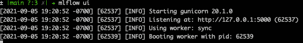

图 2.1 – 在本地环境中启动 MLflow UI

*图 2.1* 显示了本地 MLflow UI 网站：`http://127.0.0.1:5000/`。如果你点击这个 URL，你将在浏览器窗口中看到如下 MLflow UI。由于这是一个全新的 MLflow 安装，当前只有一个 **默认** 实验，且尚未有任何运行记录（请参见 *图 2.2*）：

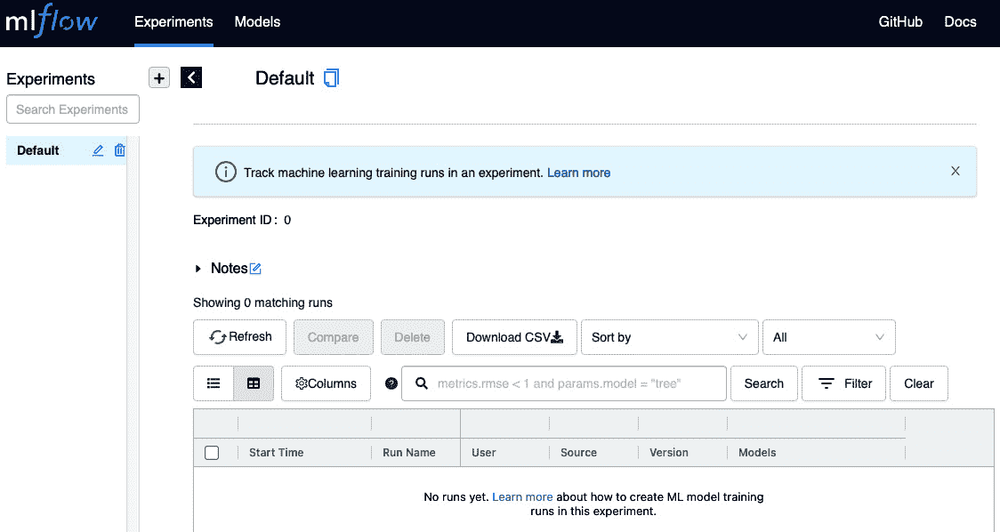

图 2.2 – MLflow 默认实验 UI 网页

看到默认的 MLflow UI 页面已经成功启动，标志着本地 MLflow 跟踪服务器的成功设置。

## 设置 MLflow 与远程 MLflow 服务器的交互

在企业生产环境中，MLflow 通常托管在云服务器上，可以是自托管的，也可以是 Databricks 在云提供商（如 AWS、Azure 或 Google Cloud）中提供的托管服务之一。在这种情况下，需要设置本地开发环境，以便能够在本地运行 ML/DL 实验，同时与远程 MLflow 服务器进行交互。接下来，我们将通过以下三个步骤介绍如何使用环境变量来实现这一目标：

1.  在 bash shell 命令行环境中，如果你正在使用 Databricks 管理的 MLflow 跟踪服务器，请定义三个新的环境变量。第一个环境变量是 `MLFLOW_TRACKING_URI`，其值为 `databricks`：

    ```py
    export MLFLOW_TRACKING_URI=databricks
    export DATABRICKS_HOST=https://*******
    export DATABRICKS_TOKEN=dapi******
    ```

1.  第二个环境变量是 `DATABRICKS_HOST`。如果你的 Databricks 管理网站地址是 `https://dbc-*.cloud.databricks.com/`，那么这就是 `DATABRICKS_HOST` 变量的值（将 `*` 替换为你的实际网站字符串）。

1.  第三个环境变量是 `DATABRICKS_TOKEN`。前往你的 Databricks 管理网站 `https://dbc-*.cloud.databricks.com/#setting/account`，点击 **访问令牌**，然后点击 **生成新令牌**。你将看到一个弹出窗口，其中包含一个 **备注** 字段（用于记录此令牌的用途）和过期日期，如 *图 2.3* 所示：

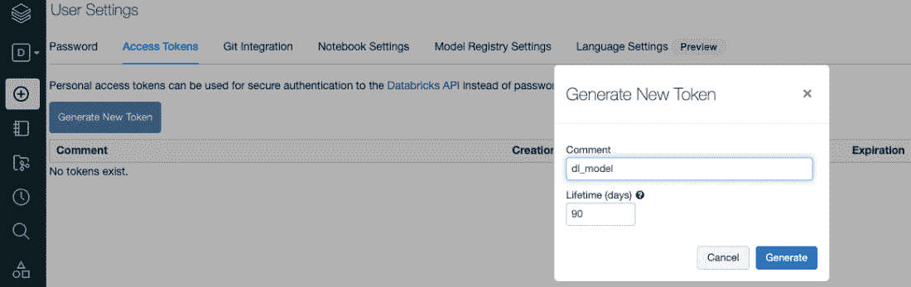

图 2.3 – 生成 Databricks 访问令牌

点击 `DATABRICKS_TOKEN` 环境变量作为其值：

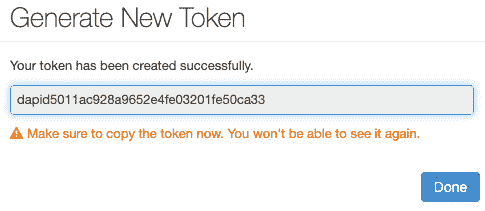

图 2.4 – 复制生成的令牌，将用于环境变量

一旦设置好这三个环境变量，您就可以在未来与 Databricks 管理的 MLflow 服务器进行交互。请注意，出于安全原因，访问令牌有有效期，管理员可以随时撤销该令牌，因此请确保在令牌更新时及时更新环境变量。

总结一下，我们已经学会了如何在本地设置 MLflow，以便与本地 MLflow 追踪服务器或远程 MLflow 追踪服务器进行交互。这将允许我们在下一节中实现第一个启用 MLflow 追踪的深度学习模型，从而以动手的方式探索 MLflow 的概念和组件。

# 使用 MLflow 自动日志记录实现我们的第一个深度学习实验

让我们使用在 *第一章* 中构建的深度学习情感分类器，*深度学习生命周期与 MLOps 挑战*，并向其添加 MLflow 自动日志记录，以探索 MLflow 的追踪功能：

1.  首先，我们需要导入 MLflow 模块：

    ```py
    import mlflow
    ```

这将为记录和加载模型提供 MLflow **应用程序编程接口** (**APIs**)。

1.  在运行训练代码之前，我们需要使用 `mlflow.set_experiment` 为当前运行的代码设置一个活动实验：

    ```py
    EXPERIMENT_NAME = "dl_model_chapter02"
    mlflow.set_experiment(EXPERIMENT_NAME)
    experiment = mlflow.get_experiment_by_name(EXPERIMENT_NAME)
    print("experiment_id:", experiment.experiment_id)
    ```

这将设置一个名为 `dl_model_chapter02` 的实验为当前活动实验。如果此实验在当前的追踪服务器中不存在，它将自动创建。

环境变量

请注意，在运行第一个实验之前，您可能需要使用 `MLFLOW_TRACKING_URI` 环境变量设置追踪服务器的 URI。如果您使用的是托管的 Databricks 服务器，请执行以下操作：

`export MLFLOW_TRACKING_URI=databricks`

如果您使用的是本地服务器，则将此环境变量设置为空或默认的本地主机端口号 `5000`，如下所示（请注意，这是我们当前章节的场景，并假设您正在使用本地服务器）：

`export MLFLOW_TRACKING_URI=http://127.0.0.1:5000`

1.  接下来，添加一行代码以启用 MLflow 的自动日志记录功能：

    ```py
    mlflow.pytorch.autolog()
    ```

这将允许默认的参数、指标和模型自动记录到 MLflow 追踪服务器。

MLflow 自动日志记录

MLflow 中的自动日志记录仍处于实验模式（截至版本 1.20.2），未来可能会发生变化。在这里，我们使用它来探索 MLflow 组件，因为只需要一行代码就能自动记录所有相关信息。在接下来的章节中，我们将学习并实现更多关于在 MLflow 中进行追踪和日志记录的方法。此外，请注意，目前 MLflow 中的 PyTorch 自动日志记录（截至版本 1.20.2）仅适用于 PyTorch Lightning 框架，而不适用于任意的 PyTorch 代码。

1.  使用 Python 上下文管理器 `with` 语句，通过调用 `mlflow.start_run` 来开始实验运行：

    ```py
    with mlflow.start_run(experiment_id=experiment.experiment_id, run_name="chapter02"):
        trainer.finetune(classifier_model, 
                         datamodule=datamodule, 
                         strategy="freeze")
        trainer.test()
    ```

请注意，`with` 块下方的所有代码行都是常规的 DL 模型微调和测试步骤。我们只是启用了自动 MLflow 日志记录，这样我们就可以观察到 MLflow 跟踪服务器记录的元数据。

1.  接下来，你可以使用以下命令行运行整个 `first_dl_with_mlflow.py` 的代码（完整代码可以在本章的 GitHub 上查看：[`github.com/PacktPublishing/Practical-Deep-Learning-at-Scale-with-MLFlow/blob/main/chapter02/first_dl_with_mlflow.py`](https://github.com/PacktPublishing/Practical-Deep-Learning-at-Scale-with-MLFlow/blob/main/chapter02/first_dl_with_mlflow.py)）：

    ```py
    python first_dl_with_mlflow.py
    ```

在没有 GPU 的 macOS 笔记本上，整个运行过程不到 10 分钟。你应该能在屏幕上看到以下输出：

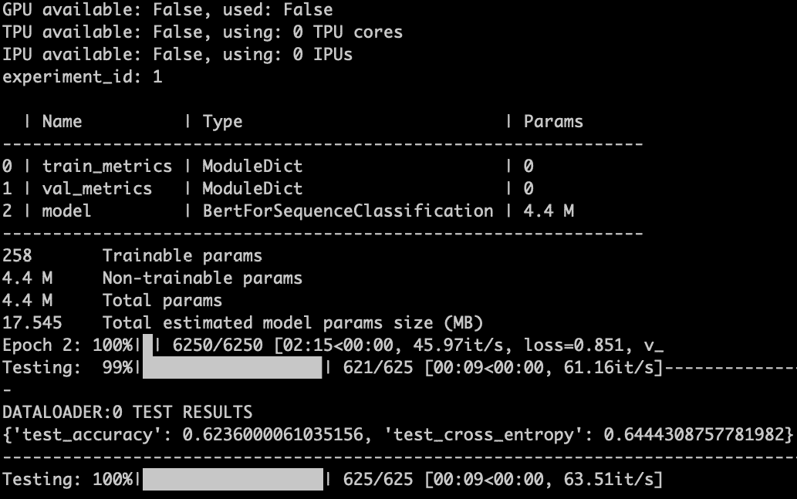

图 2.5 – 启用 MLflow 自动日志记录的 DL 模型训练/测试

如果这是你第一次运行，你会看到名为 `dl_model_chapter02` 的实验不存在。相反，MLflow 会为你自动创建这个实验：

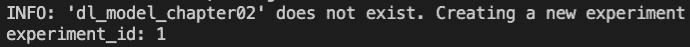

图 2.6 – 如果环境不存在，MLflow 会自动创建一个新的环境

1.  现在，我们可以在本地打开 MLflow UI，通过访问 `http://127.0.0.1:5000/` 来查看本地跟踪服务器记录的内容。在这里，你会看到一个新的实验（`dl_model_chapter02`）和一个新的运行（`chapter02`）已被记录：

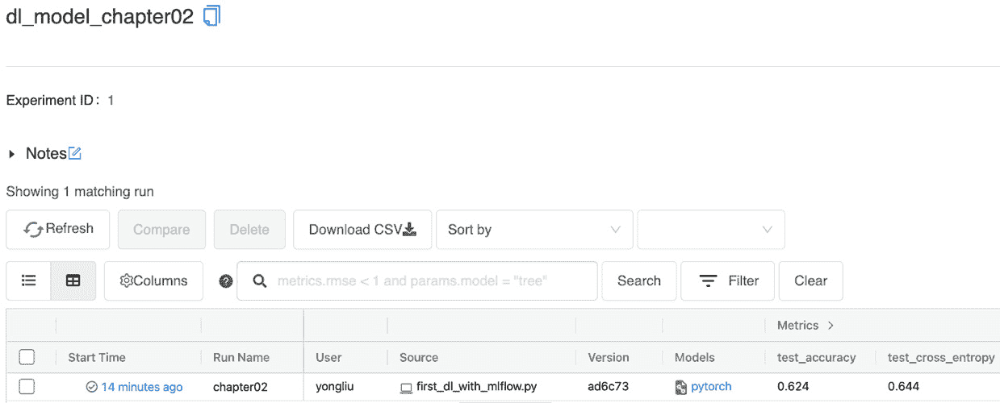

图 2.7 – MLflow 跟踪服务器 UI 显示一个新的实验和新的运行

现在，点击 *图 2.7* 中 **开始时间** 列的超链接。你将看到该运行记录的元数据详情：

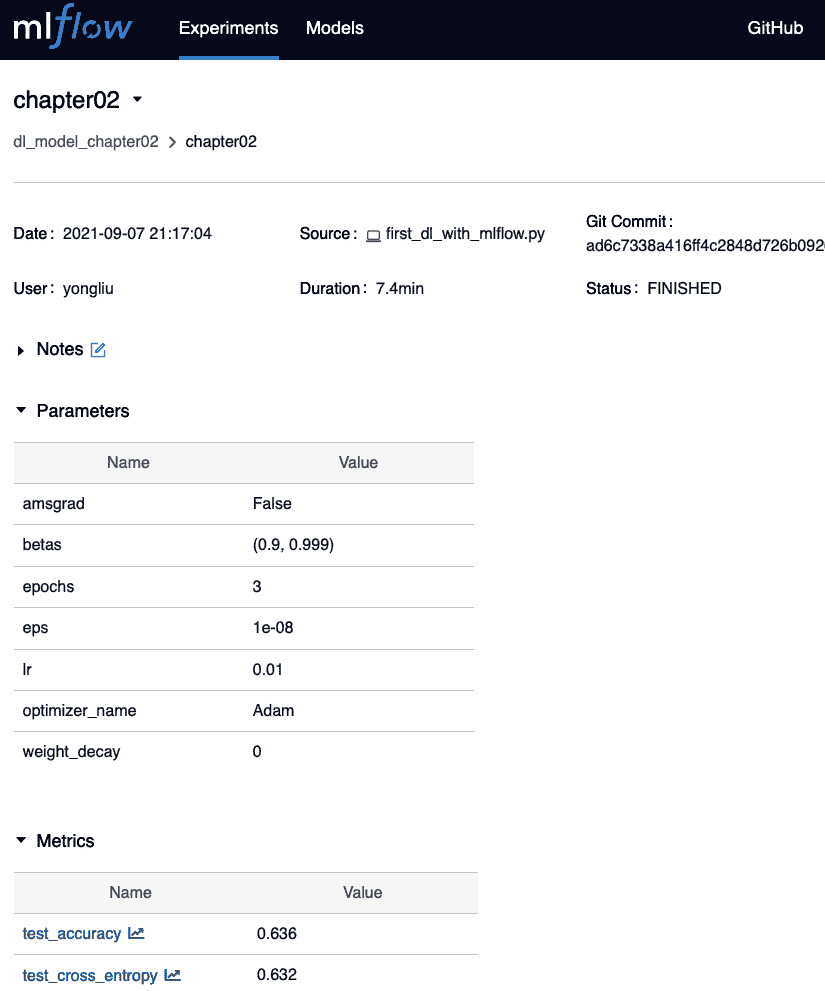

图 2.8 – MLflow 运行 UI 显示实验运行的元数据详情

如果你能在自己的本地环境中看到这个屏幕，那么恭喜你！你刚刚完成了我们第一个 DL 模型的 MLflow 跟踪实现！在下一节中，我们将通过实际示例来探索 MLflow 的核心概念和组件。

# 探索 MLflow 的组件和使用模式

让我们使用上一节中实现的工作示例，探索 MLflow 中以下核心概念、组件和用法。这些包括实验、运行、实验的元数据、实验的工件、模型和代码。

## 在 MLflow 中探索实验和运行

**实验** 是 MLflow APIs 中的一等实体。这是有道理的，因为数据科学家和 ML 工程师需要运行大量实验，以构建符合要求的工作模型。然而，实验的概念不仅限于模型开发阶段，还延伸到整个 ML/DL 开发和部署的生命周期。因此，这意味着当我们对模型进行重训练或为生产版本进行训练时，我们需要将它们视为*生产质量*实验。这种对实验的统一视图建立了线下和线上生产环境之间的桥梁。每个实验由许多运行组成，您可以在每次运行时更改模型参数、输入数据，甚至是模型类型。因此，实验是一个包含一系列运行的总体实体。下图（*图 2.9*）说明了数据科学家可以在 ML/DL 模型生命周期的多个阶段进行线下实验和在线生产实验：

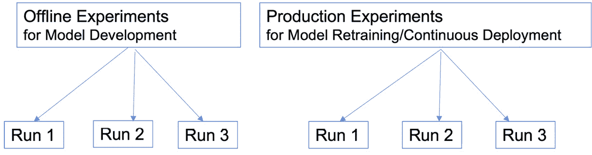

图 2.9 – 跨机器学习（ML）/深度学习（DL）模型线下和线上生产生命周期的实验

如您从*图 2.9*中所见，在模型开发阶段，数据科学家可以根据项目情况运行多个相同实验的运行或多个实验。如果是一个小型 ML 项目，将所有运行放在一个单一的线下实验中可能足够了。如果是一个复杂的 ML 项目，则设计不同的实验并在每个实验下进行运行是合理的。关于设计 ML 实验的良好参考资料可以在[`machinelearningmastery.com/controlled-experiments-in-machine-learning/`](https://machinelearningmastery.com/controlled-experiments-in-machine-learning/)找到。然后，在模型生产阶段，最好设置生产质量的实验，因为我们需要进行模型改进和连续部署与模型重训练。生产实验将提供一个门控准确性检查，以防止新模型的回归。通常，这是通过运行自动模型评估和针对保留测试数据集的验证来实现的，以检查新模型在准确性方面是否仍符合发布标准。

现在，让我们以实际操作的方式探索 MLflow 实验。运行以下 MLflow 命令行与跟踪服务器进行交互：

```py
mlflow experiments list 
```

如果您的`MLFLOW_TRACKING_URI`环境变量指向远程跟踪服务器，则将列出您具有读取权限的所有实验。如果要查看本地跟踪服务器中的内容，可以将`MLFLOW_TRACKING_URI`设置为空（即为空），如下所示（请注意，如果您的本地用户配置文件中从未有过此环境变量，则无需执行此操作；但是，执行此操作将确保您使用本地跟踪服务器）：

```py
export MLFLOW_TRACKING_URI=
```

在你第一次实现启用 MLflow 自动日志记录的 DL 模型之前，列出所有实验的输出应类似于 *图 2.10*（注意，这也取决于你运行命令行的位置；以下输出假设你在本地文件夹中运行该命令，并且可以查看 *第二章* 的 GitHub 代码）：

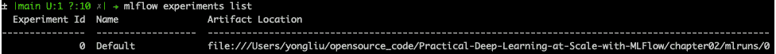

图 2.10 – 本地环境中默认的 MLflow 实验列表

*图 2.10* 列出了实验属性的三列：`mlruns` 文件夹（位于执行 MLflow 命令的目录下）。`mlruns` 文件夹由基于文件系统的 MLflow 跟踪服务器使用，用于存储所有实验运行和工件的元数据。

命令行界面（CLI）与 REST API 与编程语言特定的 API

MLflow 提供了三种不同类型的工具和 API 与跟踪服务器进行交互。在这里，我们使用 CLI 来探索 MLflow 组件。

那么，让我们探索一个特定的 MLflow 实验，如下所示：

1.  首先，使用 MLflow CLI 创建一个新的实验，如下所示：

    ```py
    mlflow experiments create -n dl_model_chapter02
    ```

上述命令创建了一个名为 `dl_model_chapter02` 的新实验。如果你在前一节已经使用 MLflow 自动日志记录运行了第一个 DL 模型，执行上述命令将会报错，如下所示：

```py
mlflow.exceptions.MlflowException: Experiment 'dl_model_chapter02' already exists.
```

这是预期的结果，你并没有做错什么。现在，如果你列出本地跟踪服务器上的所有实验，它应该会包括刚创建的实验，如下所示：

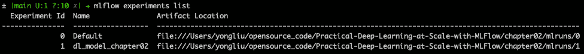

图 2.11 – 创建新实验后，新的 MLflow 实验列表

1.  现在，让我们检查实验与运行之间的关系。如果你仔细查看运行页面的 URL (*图 2.8*)，你将看到类似以下内容：

`http://127.0.0.1:5000/#/experiments/1/runs/2f2ec6e72a5042f891abe0d3a533eec7`

正如你可能已经理解的那样，`experiments` 路径后的整数就是实验的 ID。然后，在实验 ID 后面，有一个 `runs` 路径，接着是一个类似 GUID 的随机字符串，这就是运行 ID。所以，现在我们了解了如何通过一个全球唯一的 ID（称为运行 ID）组织实验下的运行。

知道运行的全球唯一 ID 非常有用。因为我们可以通过 `run_id` 检索该运行的日志数据。如果你使用命令 `mlflow runs describe --run-id <run_id>`，你可以获得该运行记录的元数据列表。对于我们刚才运行的实验，下面显示了包含运行 ID 的完整命令：

```py
mlflow runs describe –-run-id 2f2ec6e72a5042f891abe0d3a533eec7
```

该命令行的输出片段如下 (*图 2.12*)：

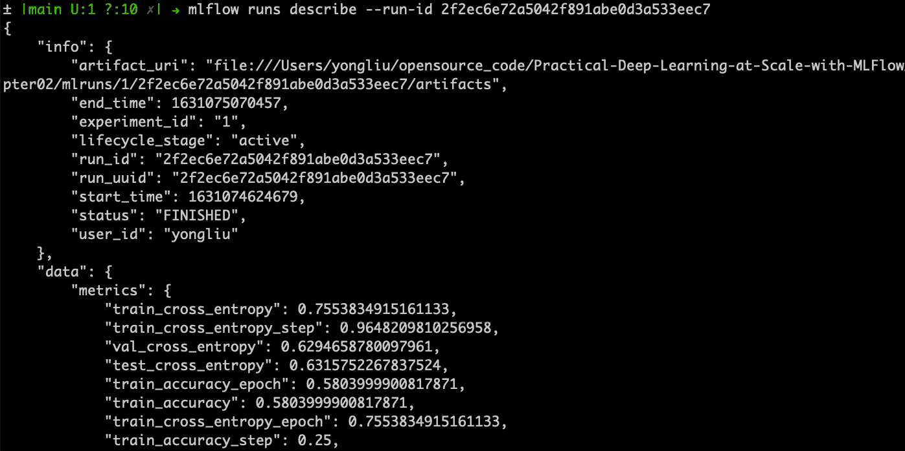

图 2.12 – MLflow 命令行以 JSON 数据格式描述运行

请注意，*图 2.12* 展示了以 JSON 格式呈现的该运行的所有元数据。这些元数据包括模型训练过程中使用的参数；用于衡量模型在训练、验证和测试中的准确度的度量标准等。相同的数据也会在 MLflow 用户界面中以 *图 2.8* 的形式展示。请注意，强大的 MLflow 命令行界面（CLI）将允许非常方便地探索 MLflow 记录的元数据和工件，并支持基于 shell 脚本的自动化，这将在接下来的章节中进一步探讨。

## 探索 MLflow 模型及其用途

现在，让我们探索在 MLflow 跟踪服务器中如何记录 DL 模型工件。在同一运行页面上，如 *图 2.8* 所示，如果你向下滚动到页面底部，你将看到工件部分（*图 2.13*）。这里列出了有关模型的所有元数据和序列化模型本身：

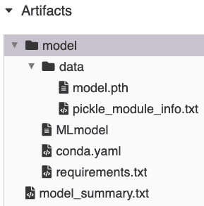

图 2.13 – MLflow 记录的模型工件

MLflow 跟踪服务器的后端存储和工件存储

MLflow 跟踪服务器有两种类型的存储：第一种是后端存储，用于存储实验和运行的元数据，以及运行的参数、度量标准和标签；第二种是工件存储，用于存储较大的文件，如序列化的模型、文本文件，甚至是生成的可视化图表。为了简化起见，本章中我们使用本地文件系统作为后端存储和工件存储。然而，像模型注册表等一些更高级的功能在基于文件系统的工件存储中不可用。在后续章节中，我们将学习如何使用模型注册表。

让我们逐一查看这些工件列表：

+   `model_summary.txt`：在 `root` 文件夹级别，这个文件点击后看起来类似于以下输出。它描述了模型的度量标准和深度学习（DL）模型的层次结构（请参见 *图 2.14*）：

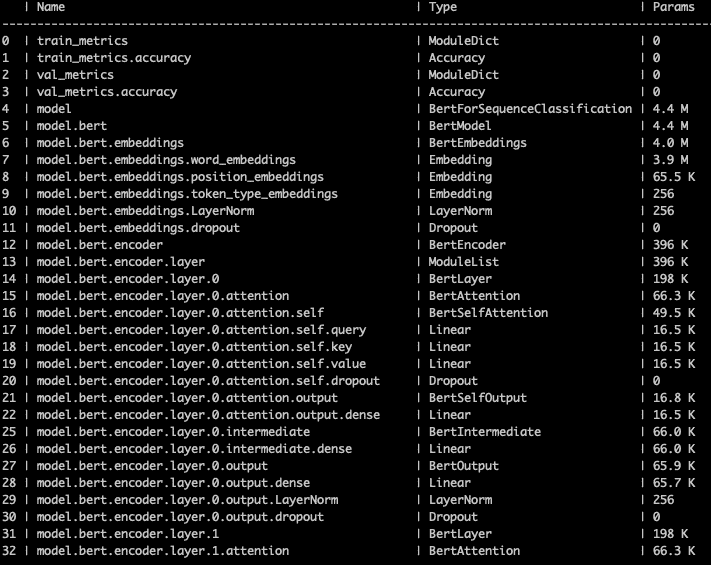

图 2.14 – MLflow 记录的模型摘要文件

*图 2.14* 提供了 DL 模型的简要概述，包括神经网络层的数量和类型、参数的数量和大小，以及训练和验证中使用的度量标准类型。当需要在团队成员或利益相关者之间共享和交流 DL 模型架构时，这非常有帮助。

+   `model` 文件夹：此文件夹包含一个名为 `data` 的子文件夹，并且包含三个文件：`MLmodel`、`conda.yaml` 和 `requirements.txt`：

    +   `MLmodel`：此文件描述了 MLflow 支持的模型类型。`MLmodel` 文件（*图 2.15*）：

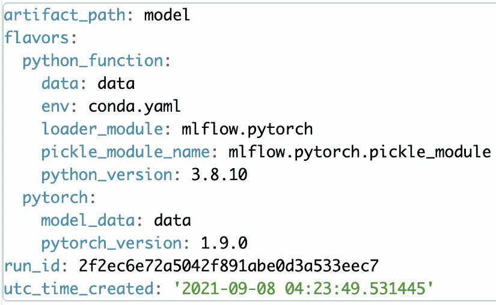

图 2.15 – 我们首次使用 MLflow 运行的 DL 模型的 MLmodel 文件内容

*图 2.15* 展示了这是一个 PyTorch 类型的模型，并且我们刚刚运行了具有 `run_id` 的模型。

+   `conda.yaml`: 这是模型使用的 conda 环境定义文件，用于描述我们的依赖关系。*图 2.16* 列出了 MLflow 在我们刚刚完成的运行中记录的内容：

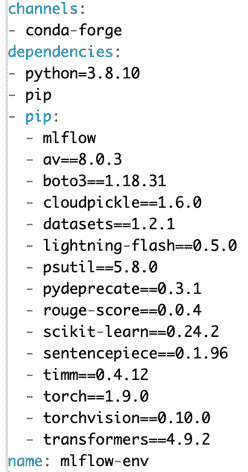

图 2.16 – MLflow 记录的 conda.yaml 文件的内容

+   `requirements.txt`: 这是一个特定于 Python `pip` 的依赖定义文件。它就像 *图 2.16* 中 `conda.yaml` 文件中的 `pip` 部分一样。

+   `data`: 这是一个包含实际序列化模型的文件夹，名为 `model.pth`，以及一个描述文件，名为 `pickle_module_info.txt`，我们第一个 DL 实验的内容如下：

    ```py
    mlflow.pytorch.pickle_module
    ```

这意味着模型使用了 MLflow 提供的 PyTorch 兼容的 pickle 序列化方法进行序列化。这允许 MLflow 在需要时重新加载模型到内存中。

模型注册表与模型日志记录

MLflow 模型注册表需要关系数据库，如 MySQL，作为工件存储，而不仅仅是普通的文件系统。因此，在本章中我们不会深入探讨它。请注意，模型注册表与模型日志记录不同，对于每次运行，您希望记录模型的元数据和工件。但是，仅对符合您的生产要求的特定运行，您可能希望将它们注册到模型注册表以进行生产部署和版本控制。在后续章节中，我们将学习如何注册模型。

到目前为止，您应该对我们实验中的文件列表和关于模型以及序列化模型的元数据有了很好的理解（包括我们实验中的 `.pth` 文件扩展名，这指的是 PyTorch 序列化模型）。在接下来的章节中，我们将学习更多关于 MLflow 模型风格的工作原理以及如何将记录的模型用于模型注册和部署。MLflow 模型风格是 MLflow 支持的模型框架，如 PyTorch、TensorFlow 和 scikit-learn。有兴趣的读者可以在 MLflow 官方文档网站上找到关于当前内置模型风格的更多详细信息，网址为 [`www.mlflow.org/docs/latest/models.html#built-in-model-flavors`](https://www.mlflow.org/docs/latest/models.html#built-in-model-flavors)。

## 探索 MLflow 代码跟踪及其用法

当探索运行的元数据时，我们还可以发现代码是如何被跟踪的。如 MLflow UI 和 JSON 中的命令行输出所示，代码以三种方式进行跟踪：文件名、Git 提交哈希和源类型。您可以执行以下命令行：

```py
mlflow runs describe --run-id 2f2ec6e72a5042f891abe0d3a533eec7 | grep mlflow.source
```

你应该能在输出中找到以下 JSON 键值对的片段：

```py
"mlflow.source.git.commit": "ad6c7338a416ff4c2848d726b092057457c22408",
"mlflow.source.name": "first_dl_with_mlflow.py",
"mlflow.source.type": "LOCAL"
```

基于这个`ad6c7338a416ff4c2848d726b092057457c22408`的 Git 提交哈希，我们可以继续查找我们使用的 Python 代码的确切副本：[`github.com/PacktPublishing/Practical-Deep-Learning-at-Scale-with-MLflow/blob/ad6c7338a416ff4c2848d726b092057457c22408/chapter02/first_dl_with_mlflow.py`](https://github.com/PacktPublishing/Practical-Deep-Learning-at-Scale-with-MLflow/blob/ad6c7338a416ff4c2848d726b092057457c22408/chapter02/first_dl_with_mlflow.py)。

请注意，这里的源类型是`LOCAL`。这意味着我们从代码的本地副本中执行启用 MLflow 的源代码。在后面的章节中，我们将了解其他源类型。

本地与远程 GitHub 代码

如果源代码是本地副本，那么在 MLflow 跟踪服务器中看到的 Git 提交哈希存在一个警告。如果你在本地做了代码更改，但忘记提交它们，然后立即开始 MLflow 实验跟踪运行，MLflow 只会记录最近的 Git 提交哈希。我们可以通过两种方式解决这个问题：

1\. 在运行 MLflow 实验之前提交我们的代码更改。

2\. 使用远程 GitHub 代码运行实验。

由于第一种方法不容易强制执行，因此推荐使用第二种方法。使用远程 GitHub 代码运行 DL 实验是一个高级话题，我们将在后面的章节中探讨。

到目前为止，我们已经了解了 MLflow 跟踪服务器、实验和运行。此外，我们还记录了关于运行的元数据，如参数和指标，检查了代码跟踪，并探讨了模型日志记录。这些跟踪和日志记录功能确保我们有一个扎实的 ML 实验管理系统，不仅用于模型开发，还为未来的模型部署提供支持，因为我们需要跟踪哪些运行生成了用于生产的模型。*可重复性*和*来源追踪*是 MLflow 提供的标志性特点。除此之外，MLflow 还提供了其他组件，如用于标准化 ML 项目代码组织的**MLproject**、用于模型版本控制的模型注册表、模型部署功能和模型可解释性工具。所有这些 MLflow 组件涵盖了 ML/DL 开发、部署和生产的整个生命周期，我们将在后续章节中更深入地探讨这些内容。

# 总结

在本章中，我们学习了如何设置 MLflow，使其与本地 MLflow 跟踪服务器或远程 MLflow 跟踪服务器一起工作。然后，我们实现了第一个启用自动日志记录的 DL 模型。这样，我们就可以通过实践的方式探索 MLflow，理解一些核心概念和基础组件，如实验、运行、实验和运行的元数据、代码跟踪、模型日志记录和模型风味。本章中获得的知识和首次经验将帮助我们在下一章深入学习 MLflow 跟踪 API。

# 进一步阅读

为了进一步拓展你的知识，你可以参考以下资源和文档：

+   MLflow *命令行接口* 文档：[`www.mlflow.org/docs/latest/cli.html`](https://www.mlflow.org/docs/latest/cli.html)

+   MLflow PyTorch 自动记录文档：[`www.mlflow.org/docs/latest/tracking.html#pytorch-experimental`](https://www.mlflow.org/docs/latest/tracking.html#pytorch-experimental)

+   MLflow PyTorch 模型风味文档：[`www.mlflow.org/docs/latest/python_api/mlflow.pytorch.html#module-mlflow.pytorch`](https://www.mlflow.org/docs/latest/python_api/mlflow.pytorch.html#module-mlflow.pytorch)

+   *MLflow 与 PyTorch——前沿 AI 与 MLOps 的结合*：[`medium.com/pytorch/mlflow-and-pytorch-where-cutting-edge-ai-meets-mlops-1985cf8aa789`](https://medium.com/pytorch/mlflow-and-pytorch-where-cutting-edge-ai-meets-mlops-1985cf8aa789)

+   *机器学习中的对照实验*：[`machinelearningmastery.com/controlled-experiments-in-machine-learning/`](https://machinelearningmastery.com/controlled-experiments-in-machine-learning/)
