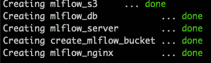
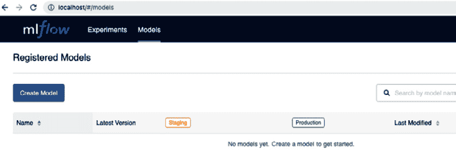
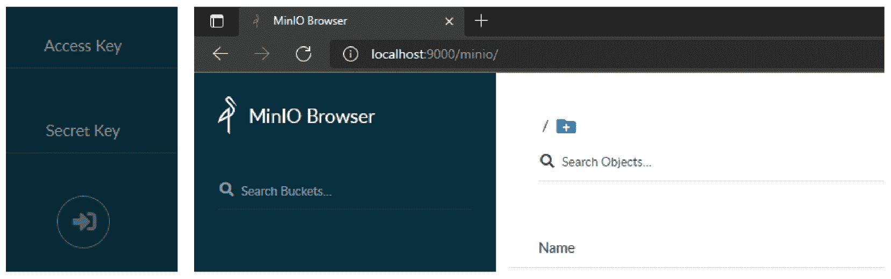
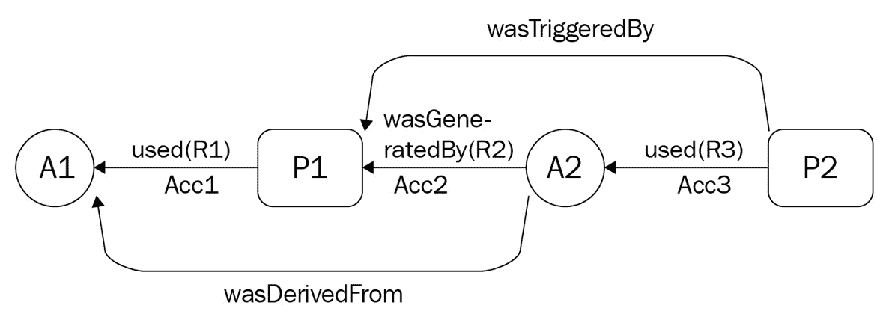
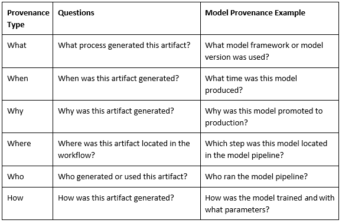
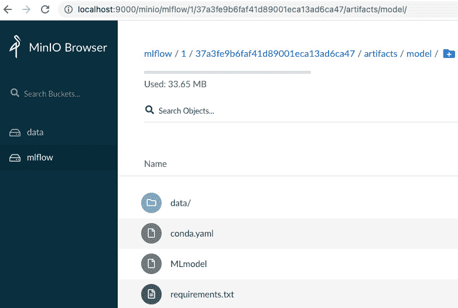
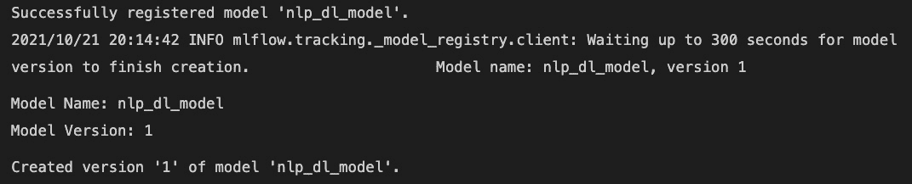
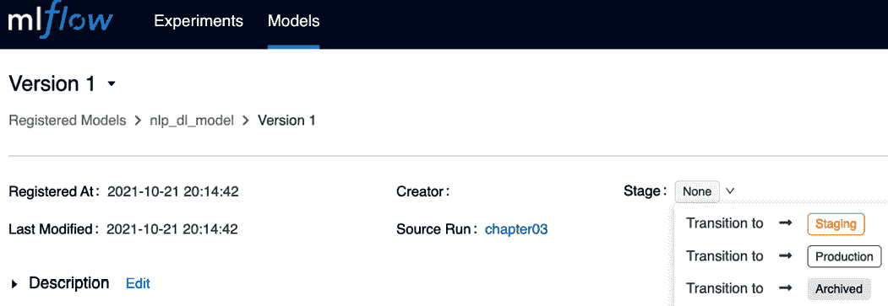
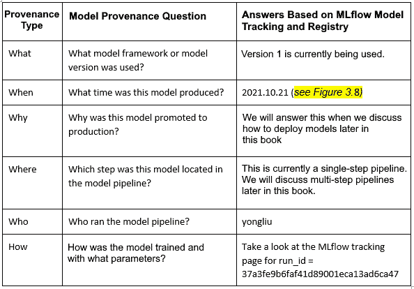
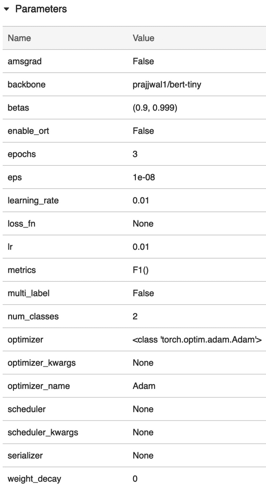

# 第三章：*第三章*：跟踪模型、参数和指标

鉴于 MLflow 可以支持深度学习模型生命周期中的多种场景，通常会逐步使用 MLflow 的功能。通常，人们从 MLflow 跟踪开始，因为它易于使用，能够处理许多可复现性、来源追踪和审计目的的场景。此外，从模型的“摇篮到日落”跟踪其历史，不仅超越了数据科学实验管理领域，而且对于企业中的模型治理也至关重要，因为在生产中使用模型时，需要管理业务和监管风险。虽然在生产中跟踪模型的精确商业价值仍在发展中，但对跟踪模型整个生命周期的需求是不可置疑且日益增长的。为了实现这一点，我们将从本章开始，搭建一个完整的本地 MLflow 跟踪服务器。

然后，我们将深入探讨如何使用 MLflow 的跟踪和注册 API 跟踪模型及其参数和指标。在本章结束时，你应该能够熟练使用 MLflow 的跟踪和注册 API 进行各种可复现性和审计目的。

在本章中，我们将讨论以下主要内容：

+   搭建一个完整的本地 MLflow 跟踪服务器

+   跟踪模型来源

+   跟踪模型指标

+   跟踪模型参数

# 技术要求

以下是你需要遵循本章提供的指令所需的要求：

+   Docker Desktop：[`docs.docker.com/get-docker/`](https://docs.docker.com/get-docker/)。

+   PyTorch `lightning-flash`: 0.5.0： [`github.com/PyTorchLightning/lightning-flash/releases/tag/0.5.0`](https://github.com/PyTorchLightning/lightning-flash/releases/tag/0.5.0)。

+   带有 Jupyter Notebook 扩展的 VS Code：[`github.com/microsoft/vscode-jupyter/wiki/Setting-Up-Run-by-Line-and-Debugging-for-Notebooks`](https://github.com/microsoft/vscode-jupyter/wiki/Setting-Up-Run-by-Line-and-Debugging-for-Notebooks)。

+   本章代码的 GitHub 链接：[`github.com/PacktPublishing/Practical-Deep-Learning-at-Scale-with-MLflow/tree/main/chapter03`](https://github.com/PacktPublishing/Practical-Deep-Learning-at-Scale-with-MLflow/tree/main/chapter03)。

+   WSL2：如果你是 Microsoft Windows 用户，建议安装 WSL2 以运行本书中提供的 Bash 脚本：[`www.windowscentral.com/how-install-wsl2-windows-10`](https://www.windowscentral.com/how-install-wsl2-windows-10)。

# 搭建一个完整的本地 MLflow 跟踪服务器

在*第二章*，*使用 MLflow 进行深度学习入门*中，我们通过实践操作，使用了基于本地文件系统的 MLflow 跟踪服务器，并检查了 MLflow 实验的组件。然而，基于默认本地文件系统的 MLflow 服务器存在一些限制，因为模型注册功能不可用。拥有模型注册的好处在于我们可以注册模型、进行版本控制，并为模型部署到生产环境做准备。因此，模型注册将填补离线实验与在线生产部署之间的空白。因此，我们需要一个功能齐全的 MLflow 跟踪服务器，并且该服务器需要以下存储来跟踪模型的完整生命周期：

+   **后端存储**：需要一个关系型数据库后端来支持 MLflow 存储关于实验的元数据（如度量、参数等）。这还允许查询实验的功能。我们将使用 MySQL 数据库作为本地后端存储。

+   **工件存储**：一个可以存储任意类型对象的对象存储，比如序列化模型、词汇文件、图表等。在生产环境中，常用的选择是 AWS S3 存储。我们将使用**MinIO**（[`min.io/`](https://min.io/)），一个多云对象存储，作为本地工件存储，它完全兼容 AWS S3 存储 API，但可以在本地电脑上运行，无需访问云端。

为了尽可能简化本地设置，我们将使用`docker-compose`（[`docs.docker.com/compose/`](https://docs.docker.com/compose/)）工具，只需一行命令即可启动和停止本地全功能的 MLflow 跟踪服务器，具体步骤如下。请注意，必须先在机器上安装并运行 Docker Desktop（[`docs.docker.com/get-docker/`](https://docs.docker.com/get-docker/)），才能执行这些步骤。Docker 有助于构建和分享容器化应用程序和微服务。以下步骤将在本地 Docker 容器中启动本地 MLflow 跟踪服务器：

1.  查看`chapter03`代码库以便配置本地开发环境：[`github.com/PacktPublishing/Practical-Deep-Learning-at-Scale-with-MLflow/tree/main/chapter03`](https://github.com/PacktPublishing/Practical-Deep-Learning-at-Scale-with-MLflow/tree/main/chapter03)。

1.  进入`mlflow_docker_setup`子文件夹，该文件夹位于`chapter03`文件夹下。

1.  执行以下命令：

    ```py
    bash start_mlflow.sh
    ```

如果命令成功执行，屏幕上应显示类似以下内容的输出：



图 3.1 – 本地全功能的 MLflow 跟踪服务器已启动并运行

1.  访问`http://localhost/`，你应该能看到 MLflow UI 网页。然后，点击 UI 中的**Models**标签（*图 3.2*）。请注意，如果你的 MLflow 追踪服务器仅使用本地文件系统作为后端存储，该标签将无法使用。因此，MLflow UI 的后端现在正在运行在你刚启动的 Docker 容器服务上，而不是本地文件系统。由于这是一个全新的服务器，目前还没有注册的模型：



图 3.2 – MLflow 模型注册 UI

1.  访问`http://localhost:9000/`，此时应该会显示 MinIO 工件存储 Web UI 的页面（*图 3.3*）。在`.env`文件中，输入`minio`作为用户名，`minio123`作为密码，位于`mlflow_docker_setup`文件夹下：



图 3.3 – MinIO Web UI 登录页面和登录后的浏览器页面

此时，你应该已经成功启动了一个完整的本地 MLflow 追踪服务器！如果你想停止服务器，只需输入以下命令：

```py
bash stop_mlflow.sh
```

基于 Docker 的 MLflow 追踪服务器将停止。我们现在准备使用这个本地 MLflow 服务器来追踪模型的来源、参数和指标。

# 追踪模型来源

**来源**追踪在数字工件方面已经在文献中得到广泛研究。例如，在生物医学行业，当你使用一份患者诊断数据时，通常希望知道这些数据的来源，数据经过了哪些处理和清洗，数据的所有者是谁，以及其他有关数据的历史和谱系信息。随着工业和商业场景中 ML/DL 模型的兴起，来源追踪已成为一项必备功能。不同粒度的来源追踪对操作和管理不仅仅是数据科学离线实验至关重要，而且对模型在生产环境中部署前/中/后的管理也至关重要。那么，来源追踪需要追踪哪些内容呢？

## 了解开放来源追踪框架

让我们看一下一个通用的来源追踪框架，以理解为什么来源追踪是一个重大努力。以下图示基于**开放来源模型词汇规范**（[`open-biomed.sourceforge.net/opmv/ns.html`](http://open-biomed.sourceforge.net/opmv/ns.html)）：



图 3.4 – 一个开放的来源追踪框架

在前述图示中，有三个重要的项目：

+   **工件**：由过程生产或使用的事物（**A1** 和 **A2**）。

+   **过程**：通过使用或生产工件来执行的操作（**P1** 和 **P2**）。

+   **因果关系**：在工件和过程之间的边或关系，如前述图示中的*used*、*wasGeneratedBy*和*wasDerivedFrom*（**R1**、**R2**和**R3**）。

直观地说，**开放来源模型** (**OPM**) 框架允许我们提出以下 5W1H（五个 W 和一个 H）问题，如下所示：



](img/B18120_03_005.jpg)

图 3.5 – 来源问题的类型

拥有一个系统化的来源框架和一组问题将帮助我们学习如何追踪模型来源并提供这些问题的答案。这将激励我们在下一节实现 MLflow 模型跟踪时。

## 实现 MLflow 模型跟踪

如果我们为所使用的深度学习模型实现了 MLflow 日志记录和注册功能，我们可以使用 MLflow 跟踪服务器回答这些来源问题中的大多数。首先，让我们回顾 MLflow 在模型来源跟踪方面提供的功能。MLflow 提供了两套用于模型来源的 API：

+   **日志记录 API**：这允许每次实验或模型管道运行时将模型工件记录到工件存储中。

+   **注册表 API**：这允许在一个集中位置跟踪模型的版本和模型生命周期的各个阶段（**无**、**已归档**、**暂存**或**生产**）。

    模型日志记录和模型注册表之间的区别

    尽管每次实验都需要进行日志记录，并且模型需要保存在工件存储中，但并非每个模型实例都需要在模型注册表中注册。这是因为对于许多早期的探索性模型实验来说，模型可能不好。因此，不一定要注册以跟踪版本。只有当模型在离线测试中表现良好并成为推向生产环境的候选模型时，才需要将其注册到模型注册表，以便通过模型提升流程。

    尽管 MLflow 的官方 API 文档将日志记录和注册表分成了两个组件，但在本书中我们将它们统称为 MLflow 的模型跟踪功能。

我们已经在 *第二章*《使用 MLflow 进行深度学习入门》中看到过 MLflow 的自动日志记录功能。尽管自动日志记录功能非常强大，但当前版本存在两个问题：

+   它不会自动将模型注册到模型注册表。

+   如果你仅按照 MLflow 的建议使用 `mlflow.pyfunc.load_model` API 来加载已记录的模型，它不能直接与原始输入数据（在我们的案例中是英文句子）一起工作。这是由于 MLflow 当前自动日志记录 API 的实验性质，可能是一个局限性。

让我们通过一个示例来回顾 MLflow 的功能以及自动日志记录的局限性，并讨论我们如何解决这些问题：

1.  在 Bash 终端中设置以下环境变量，其中你的 MinIO 和基于 MySQL 的 Docker 组件正在运行：

    ```py
    export MLFLOW_S3_ENDPOINT_URL=http://localhost:9000
    export AWS_ACCESS_KEY_ID=minio
    export AWS_SECRET_ACCESS_KEY=minio123
    ```

请注意，`AWS_ACCESS_KEY_ID` 和 `AWS_SECRET_ACCESS_KEY` 使用的是在 `.env` 文件中定义的相同值，该文件位于 `mlflow_docker_setup` 文件夹下。这是为了确保我们使用的是之前设置的 MLflow 服务器。由于这些环境变量是基于会话的，我们还可以在笔记本的代码中设置以下环境变量，如下所示：

```py
os.environ["AWS_ACCESS_KEY_ID"] = "minio"
os.environ["AWS_SECRET_ACCESS_KEY"] = "minio123"
os.environ["MLFLOW_S3_ENDPOINT_URL"] = "http://localhost:9000"
```

前面三行代码可以在本章的笔记本文件中找到，紧接在导入所需的 Python 包之后。在执行笔记本之前，请确保运行以下命令来初始化虚拟环境 `dl_model`，该环境现在包含 `requirements.txt` 文件中定义的额外必需包：

```py
conda create -n dl_model python==3.8.10
conda activate dl_model
pip install -r requirements.txt
```

如果你在之前的章节中设置了 `dl_model` 虚拟环境，你可以跳过创建名为 `dl_model` 的虚拟环境的第一行。然而，你仍然需要激活 `dl_model` 作为当前活动的虚拟环境，然后运行 `pip install -r requirements.txt` 来安装所有所需的 Python 包。一旦 `dl_model` 虚拟环境成功设置，你可以继续执行下一步。

1.  要跟随此模型跟踪实现，请查看 VS Code 中的 `dl_model_tracking.ipynb` 笔记本文件，方法是访问本章的 GitHub 仓库：[`github.com/PacktPublishing/Practical-Deep-Learning-at-Scale-with-MLFlow/blob/main/chapter03/dl_model_tracking.ipynb`](https://github.com/PacktPublishing/Practical-Deep-Learning-at-Scale-with-MLFlow/blob/main/chapter03/dl_model_tracking.ipynb)。

请注意，在 `dl_model_tracking.ipynb` 笔记本的第四个单元格中，我们需要将其指向我们刚刚在 Docker 中设置的正确的新 MLflow 跟踪 URI，并定义一个新的实验，如下所示：

```py
EXPERIMENT_NAME = "dl_model_chapter03"
mlflow.set_tracking_uri('http://localhost')
```

1.  我们仍然会使用 MLflow 提供的自动日志记录功能，但我们将给运行分配一个变量名，`dl_model_tracking_run`：

    ```py
    mlflow.pytorch.autolog()
    with mlflow.start_run(experiment_id=experiment.experiment_id, run_name="chapter03") as dl_model_tracking_run:
        trainer.finetune(classifier_model, datamodule=datamodule, strategy="freeze")
        trainer.test()
    ```

`dl_model_tracking_run` 允许我们以编程方式获取 `run_id` 参数和此运行的其他元数据，正如我们在下一步中将看到的那样。一旦执行了这段代码单元，我们将在 MLflow 跟踪服务器中记录一个训练好的模型，并包含所有所需的参数和指标。然而，模型还没有注册。我们可以在 MLflow 的 Web UI 中找到记录的实验以及所有相关的参数和指标，地址是 http://localhost/#/experiments/1/runs/37a3fe9b6faf41d89001eca13ad6ca47。你可以在 `http://localhost:9000/minio/mlflow/1/37a3fe9b6faf41d89001eca13ad6ca47/artifacts/model/` 找到模型工件并查看存储 UI，如下所示：



图 3.6 – 模型工件记录在 MinIO 存储后端

文件夹结构与我们在*第二章*《*使用 MLflow 开始深度学习*》中看到的类似，当时我们使用普通文件系统来存储模型工件。然而，在这里，我们使用 **MinIO** 桶来存储这些模型工件。

1.  从 `dl_model_tracking_run` 中检索 `run_id` 参数以及其他元数据，如下所示：

    ```py
    run_id = dl_model_tracking_run.info.run_id
    print("run_id: {}; lifecycle_stage: {}".format(run_id,
        mlflow.get_run(run_id).info.lifecycle_stage))
    ```

这将打印出类似以下内容：

```py
run_id: 37a3fe9b6faf41d89001eca13ad6ca47; lifecycle_stage: active
```

1.  通过定义已记录模型的 URI 来检索已记录的模型。这将允许我们在特定位置重新加载已记录的模型：

    ```py
    logged_model = f'runs:/{run_id}/model'
    ```

1.  使用 `mlflow.pytorch.load_model` 和以下 `logged_model` URI 将模型加载回内存，并为给定的输入句子做出新预测，如下所示：

    ```py
    model = mlflow.pytorch.load_model(logged_model)
    model.predict({'This is great news'})
    ```

这将输出一个模型预测标签，如下所示：

```py
['positive']
```

mlflow.pytorch.load_model 与 mlflow.pyfunc.load_model

默认情况下，在 MLflow 实验跟踪页面的工件部分，如果您有已记录的模型，MLflow 会建议使用 `mlflow.pyfunc.load_model` 来加载已记录的模型进行预测。然而，这仅适用于像 pandas DataFrame、NumPy 数组或张量这样的输入；不适用于 NLP 文本输入。由于 PyTorch Lightning 的自动记录使用 `mlflow.pytorch.log_model` 来保存模型，正确的加载已记录模型的方法是使用 `mlflow.pytorch.load_model`，正如我们在这里展示的那样。这是因为 MLflow 的默认设计是使用 `mlflow.pyfunc.load_model`，并且有一个已知的限制，要求输入格式必须是数值类型。对于文本和图像数据，它需要在预处理步骤中进行分词。然而，由于我们在此保存的 PyTorch 模型已经作为序列化模型的一部分执行了分词步骤，我们可以使用原生的 `mlflow.pytorch.load_model` 来直接加载接受文本输入的模型。

有了这些，我们就成功记录了模型并将其加载回来进行预测。如果我们认为这个模型表现足够好，那么我们可以将其注册。

1.  让我们使用 `mlflow.register_model` API 来注册模型：

    ```py
    model_registry_version = mlflow.register_model(logged_model, 'nlp_dl_model')
    print(f'Model Name: {model_registry_version.name}')
    print(f'Model Version: {model_registry_version.version}')
    ```

这将生成以下输出：



图 3.7 – 模型注册成功消息

这表明模型已成功注册为版本 1，并存储在模型注册表中，模型名称为 `nlp_dl_model`。

我们还可以通过点击 `http://localhost/#/models/nlp_dl_model/versions/1` 在 MLflow Web UI 中找到这个已注册的模型：



图 3.8 – MLflow 跟踪服务器 Web UI 显示新注册的模型

默认情况下，新注册模型的阶段为 **None**，如前述截图所示。

通过为模型注册版本号和阶段标签，我们为部署到暂存（也称为预生产）和生产环境奠定了基础。我们将在本书的后面讨论基于已注册模型进行模型部署的方法。

到目前为止，我们已经解决了本节开头关于自动记录限制的两个问题：

+   如何使用 `mlflow.pytorch.load_model` API 而不是 `mlflow.pyfunc.load_model` API 加载已记录的 DL PyTorch 模型

+   如何使用 `mlflow.register_model` API 注册已记录的 DL PyTorch 模型

    MLflow DL 模型记录 API 的选择

    对于 DL 模型，PyTorch 的自动记录仅适用于 `mlflow.pyfunc.log_model` 用于记录模型，特别是当我们需要多步骤 DL 模型管道时。我们将在本书的后面实现这样的自定义 MLflow 模型风格。如果你不想使用 PyTorch 的自动记录，那么可以直接使用 `mlflow.pytorch.log_model`。PyTorch 的自动记录在其实现中使用了 `mlflow.pytorch.log_model`（请参阅官方 MLflow 开源实现：[`github.com/mlflow/mlflow/blob/290bf3d54d1e5ce61944455cb302a5d6390107f0/mlflow/pytorch/_pytorch_autolog.py#L314`](https://github.com/mlflow/mlflow/blob/290bf3d54d1e5ce61944455cb302a5d6390107f0/mlflow/pytorch/_pytorch_autolog.py#L314)）。

如果我们不想使用自动记录，那么可以直接使用 MLflow 的模型记录 API。这还为我们提供了一种同时注册模型的替代方法。您可以使用以下代码行来记录和注册训练好的模型：

```py
mlflow.pytorch.log_model(pytorch_model=trainer.model, artifact_path='dl_model', registered_model_name='nlp_dl_model')
```

请注意，此代码行不记录模型的任何参数或度量值。

通过这种方式，我们不仅在跟踪服务器中记录了许多实验和模型以进行离线实验，而且还注册了性能优越的模型，以便将来能够进行版本控制和溯源跟踪，并将其部署到生产环境中。我们现在可以回答本章开头提出的一些溯源问题：



图 3.9 – 模型溯源问题的答案

为什么和在哪里的问题尚未完全解答，但将在本书后续部分中解答。这是因为生产模型的“为什么”问题只有在模型准备部署时才能被跟踪和记录，此时我们需要添加注释和理由来证明模型的部署合理性。至于“在哪里”的问题，当我们有多步骤模型流水线时可以完全解答。然而，在这里，我们只有一个单步骤流水线，这是最简单的情况。一个多步骤流水线包含明确分离的模块化代码，用于指定每个步骤执行什么功能，这样我们就可以轻松更改任何步骤的详细实现，而不改变流水线的流程。在接下来的两个部分中，我们将探讨如何在不使用自动日志记录的情况下跟踪模型的指标和参数。

# 跟踪模型指标

PyTorch `lightning-flash`包中的文本分类模型的默认指标是**准确率**。如果我们想将指标更改为**F1 分数**（精度和召回率的调和平均数），这是衡量分类器性能的常用指标，那么我们需要在开始模型训练过程之前更改分类器模型的配置。让我们学习如何进行此更改，并使用 MLflow 的非自动日志记录 API 来记录指标：

1.  在定义分类器变量时，我们将传递一个名为`torchmetrics.F1`的度量函数作为变量，而不是使用默认的度量函数，如下所示：

    ```py
    classifier_model = TextClassifier(backbone="prajjwal1/bert-tiny", num_classes=datamodule.num_classes, metrics=torchmetrics.F1(datamodule.num_classes))
    ```

这使用了`torchmetrics`的内置度量函数`F1`模块，并将数据中需要分类的类数作为参数。这确保了模型在训练和测试时使用了这个新指标。您将看到类似以下的输出：

```py
{'test_cross_entropy': 0.785443127155304, 'test_f1': 0.5343999862670898}
```

这表明模型的训练和测试使用的是 F1 分数作为指标，而不是默认的准确率指标。有关如何使用`torchmetrics`自定义指标的更多信息，请参考其文档网站：[`torchmetrics.readthedocs.io/en/latest/`](https://torchmetrics.readthedocs.io/en/latest/)。

1.  现在，如果我们想将所有指标记录到 MLflow 跟踪服务器中，包括训练、验证和测试指标，我们需要通过调用训练器的回调函数来获取所有当前的指标，如下所示：

    ```py
        cur_metrics = trainer.callback_metrics
    ```

接下来，我们需要将所有度量值转换为`float`，以确保它们与 MLflow 的`log_metrics` API 兼容：

```py
    metrics = dict(map(lambda x: (x[0], float(x[1])), cur_metrics.items()))
```

1.  现在，我们可以调用 MLflow 的`log_metrics`来记录所有在跟踪服务器中的指标：

    ```py
        mlflow.log_metrics(metrics)
    ```

使用 F1 分数作为分类器指标后，您将看到以下指标，这些指标将被记录在 MLflow 的跟踪服务器中：

```py
{'train_f1': 0.5838666558265686, 
'train_f1_step': 0.75, 
'train_cross_entropy': 0.7465656399726868, 
'train_cross_entropy_step': 0.30964696407318115, 
'val_f1': 0.5203999876976013, 
'val_cross_entropy': 0.8168156743049622, 
'train_f1_epoch': 0.5838666558265686, 
'train_cross_entropy_epoch': 0.7465656399726868, 
'test_f1': 0.5343999862670898, 
'test_cross_entropy': 0.785443127155304}
```

使用 MLflow 的`log_metrics` API 让我们通过额外的代码行获得更多控制，但如果我们对其自动日志记录功能满意，那么我们只需要改变我们想要在模型训练和测试过程中使用的度量。此时，我们只需要在声明新的深度学习模型时定义一个新的度量（即使用 F1 分数而不是默认的准确率度量）。

1.  如果您想同时跟踪多个模型度量，例如 F1 分数、准确率、精确度和召回率，那么您需要做的就是定义一个包含您想要计算和跟踪的度量的 Python 列表，如下所示：

    ```py
    list_of_metrics = [torchmetrics.Accuracy(),
       torchmetrics.F1(num_classes=datamodule.num_classes),
       torchmetrics.Precision(num_classes=datamodule.num_classes),
       torchmetrics.Recall(num_classes=datamodule.num_classes)]
    ```

然后，在模型初始化语句中，您可以不传递单个度量到`metrics`参数，而是传递我们刚刚定义的`list_of_metrics` Python 列表，如下所示：

```py
classifier_model = TextClassifier(backbone="prajjwal1/bert-tiny", num_classes=datamodule.num_classes, metrics=list_of_metrics)
```

剩下的代码无需再做任何更改。因此，在`dl_model-non-auto-tracking.ipynb`笔记本（https://github.com/PacktPublishing/Practical-Deep-Learning-at-Scale-with-MLFlow/blob/main/chapter03/dl_model-non-auto-tracking.ipynb）中，您会注意到前一行默认被注释掉。然而，您可以取消注释它，然后注释掉前面的那一行：

```py
classifier_model = TextClassifier(backbone="prajjwal1/bert-tiny", num_classes=datamodule.num_classes, metrics=torchmetrics.F1(datamodule.num_classes))
```

然后，当您运行笔记本的其余部分时，您将在笔记本输出中获得模型测试报告，附带以下度量：

```py
{'test_accuracy': 0.6424000263214111, 'test_cross_entropy': 0.6315688490867615, 'test_f1': 0.6424000263214111, 'test_precision': 0.6424000263214111, 'test_recall': 0.6424000263214111}
```

您可能会注意到准确率、F1 分数、精确度和召回率的数字是相同的。这是因为，默认情况下，`torchmetrics`使用一个不支持`none`方法的`torchmetrics`，该方法为每个类计算度量，并返回每个类的度量，即使是二分类模型。因此，这不会生成一个单一的标量值。然而，您总是可以调用 scikit-learn 的度量 API，通过传递两个值列表来根据二元平均方法计算 F1 分数或其他度量。在这里，我们可以使用`y_true`和`y_predict`，其中`y_true`是地面真实标签值的列表，而`y_predict`是模型预测标签值的列表。这可以作为一个很好的练习，供您尝试，因为这是所有机器学习模型的常见做法，而不仅仅是深度学习模型的特殊处理。

# 跟踪模型参数

如我们所见，使用 MLflow 的自动日志记录有许多好处，但如果我们想要跟踪额外的模型参数，我们可以使用 MLflow 在自动日志记录记录的基础上记录额外的参数，或者直接使用 MLflow 记录我们想要的所有参数，而不使用自动日志记录。

让我们在不使用 MLflow 自动日志记录的情况下走一遍笔记本。如果我们想要完全控制 MLflow 记录哪些参数，可以使用两个 API：`mlflow.log_param`和`mlflow.log_params`。第一个用于记录单个键值对参数，而第二个用于记录整个键值对参数的字典。那么，我们可能会感兴趣跟踪哪些类型的参数呢？以下是答案：

+   使用 `log_params` API 在实验中记录它们。

+   **模型参数**：这些参数是在模型训练过程中学习到的。对于深度学习模型，这通常指的是在训练过程中学习到的神经网络权重。我们不需要单独记录这些权重参数，因为它们已经包含在已记录的深度学习模型中。

让我们使用 MLflow 的 `log_params` API 来记录这些超参数，代码如下：

```py
    params = {"epochs": trainer.max_epochs}
```

```py
    if hasattr(trainer, "optimizers"):
```

```py
        optimizer = trainer.optimizers[0]
```

```py
        params["optimizer_name"] = optimizer.__class__.__name__
```

```py
    if hasattr(optimizer, "defaults"):
```

```py
        params.update(optimizer.defaults)
```

```py
    params.update(classifier_model.hparams)
```

```py
    mlflow.log_params(params)
```

请注意，在这里，我们记录了最大轮数、训练器的第一个优化器名称、优化器的默认参数以及整体分类器的超参数（`classifier_model.hparams`）。那行代码 `mlflow.log_params(params)` 将 `params` 字典中的所有键值参数记录到 MLflow 跟踪服务器。如果你在 MLflow 跟踪服务器中看到以下超参数，说明它已经生效！



图 3.10 – MLflow 跟踪服务器的 Web UI 显示已记录的模型超参数

注意，这个参数列表比自动记录器记录的要多，因为我们在实验中添加了额外的超参数。如果你想记录其他自定义的参数，可以按照相同的模式在你的实验中进行。完整的笔记本（没有使用自动记录）可以在本章的 GitHub 仓库中查看，链接为 [`github.com/PacktPublishing/Practical-Deep-Learning-at-Scale-with-MLFlow/blob/main/chapter03/dl_model-non-auto-tracking.ipynb`](https://github.com/PacktPublishing/Practical-Deep-Learning-at-Scale-with-MLFlow/blob/main/chapter03/dl_model-non-auto-tracking.ipynb)。

如果你已经读到这一部分，说明你已经成功实现了一个 MLflow 跟踪模型以及其度量和参数！

# 总结

在本章中，我们设置了一个本地的 MLflow 开发环境，完全支持使用 MySQL 和 MinIO 对象存储进行后端存储和工件存储。这在我们本书中开发 MLflow 支持的深度学习模型时非常有用。我们首先介绍了开放的溯源跟踪框架，并提出了有关模型溯源的相关问题。我们解决了自动记录的问题，并成功地通过 `mlflow.pytorch.load_model` API 从已记录的模型中加载一个训练好的模型进行预测，完成了训练模型的注册工作。我们还尝试了如何在没有自动记录的情况下直接使用 MLflow 的 `log_metrics`、`log_params` 和 `log_model` API，这使我们能够更好地控制和灵活地记录额外的或自定义的度量和参数。通过执行模型溯源跟踪，我们能够回答许多溯源问题，并提出了几个需要进一步研究的问题，例如使用 MLflow 跟踪多步骤模型管道及其部署。

在下一章，我们将继续我们的学习旅程，学习如何使用 MLflow 进行代码和数据跟踪，这将为我们提供更多的能力，以回答与数据和代码相关的来源问题。

# 进一步阅读

若要了解本章涉及的更多主题，请查看以下资源：

+   MLflow Docker 设置参考：[`github.com/sachua/mlflow-docker-compose`](https://github.com/sachua/mlflow-docker-compose)

+   MLflow PyTorch 自动日志记录实现：[`github.com/mlflow/mlflow/blob/master/mlflow/pytorch/_pytorch_autolog.py`](https://github.com/mlflow/mlflow/blob/master/mlflow/pytorch/_pytorch_autolog.py)

+   MLflow PyTorch 模型日志记录、加载和注册文档：[`www.mlflow.org/docs/latest/python_api/mlflow.pytorch.html`](https://www.mlflow.org/docs/latest/python_api/mlflow.pytorch.html)

+   MLflow 参数和指标日志记录文档：[`www.mlflow.org/docs/latest/python_api/mlflow.html`](https://www.mlflow.org/docs/latest/python_api/mlflow.html)

+   MLflow 模型注册文档：[`www.mlflow.org/docs/latest/model-registry.html`](https://www.mlflow.org/docs/latest/model-registry.html)

+   深入了解大规模来源（使用 SPADE）：[`queue.acm.org/detail.cfm?id=3476885`](https://queue.acm.org/detail.cfm?id=3476885)

+   如何使用`torchmetrics`和`lightning-flash`：[`www.exxactcorp.com/blog/Deep-Learning/advanced-pytorch-lightning-using-torchmetrics-and-lightning-flash`](https://www.exxactcorp.com/blog/Deep-Learning/advanced-pytorch-lightning-using-torchmetrics-and-lightning-flash)

+   为什么在多类问题中使用微平均时，精度、召回率和 F1 分数相等？[`simonhessner.de/why-are-precision-recall-and-f1-score-equal-when-using-micro-averaging-in-a-multi-class-problem/`](https://simonhessner.de/why-are-precision-recall-and-f1-score-equal-when-using-micro-averaging-in-a-multi-class-problem/)
