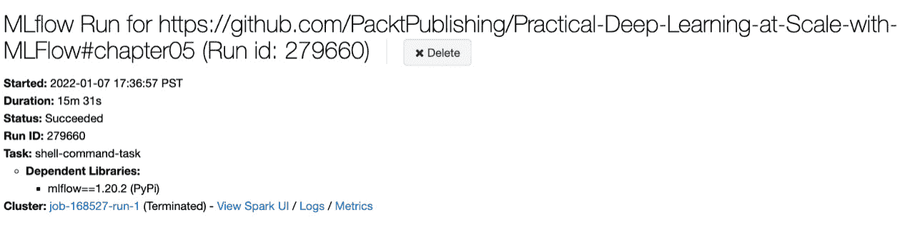

# 第五章：在不同环境中运行 DL 管道

在不同执行环境中运行 **深度学习** (**DL**) 管道的灵活性至关重要，例如在本地、远程、企业内部或云中运行。这是因为在 DL 开发的不同阶段，可能会有不同的约束或偏好，目的是提高开发速度或确保安全合规性。例如，进行小规模模型实验时，最好在本地或笔记本环境中进行，而对于完整的超参数调优，我们需要在云托管的 GPU 集群上运行模型，以实现快速的迭代时间。考虑到硬件和软件配置中的多样化执行环境，过去在单一框架内实现这种灵活性是一个挑战。MLflow 提供了一个易于使用的框架，能够在不同环境中按规模运行 DL 管道。本章将教你如何实现这一点。

在本章中，我们将首先了解不同的 DL 管道执行场景及其执行环境。我们还将学习如何在不同的执行环境中运行 DL 管道的不同步骤。具体而言，我们将涵盖以下主题：

+   不同执行场景和环境的概述

+   本地运行本地代码

+   在 GitHub 中远程运行本地代码

+   在云中远程运行本地代码

+   在云中远程运行，并使用 GitHub 中的远程代码

本章结束时，你将能够熟练地设置 DL 管道，以便在不同执行环境中本地或远程运行。

# 技术要求

完成本章学习所需的技术要求如下：

+   本章的代码可以在以下 GitHub URL 找到：[`github.com/PacktPublishing/Practical-Deep-Learning-at-Scale-with-MLFlow/tree/main/chapter05`](https://github.com/PacktPublishing/Practical-Deep-Learning-at-Scale-with-MLFlow/tree/main/chapter05)。

+   安装 Databricks **命令行界面** (**CLI**) 工具以访问 Databricks 平台并远程执行 DL 管道：[`github.com/databricks/databricks-cli`](https://github.com/databricks/databricks-cli)。

+   访问 Databricks 实例（必须是企业版，因为社区版不支持远程执行），以学习如何在 Databricks 集群上远程运行 DL 管道。

+   在本地运行时使用完整的 MLflow 跟踪服务器。此 MLflow 跟踪服务器设置与前几章相同。

# 不同执行场景和环境的概述

在前几章中，我们主要集中在学习如何使用 MLflow 的跟踪功能来跟踪深度学习管道。我们的执行环境大多数是在本地环境中，比如本地笔记本电脑或桌面环境。然而，正如我们所知，深度学习完整生命周期由多个阶段组成，其中我们可能需要在不同的执行环境中完全、部分地或单独运行深度学习管道。以下是两个典型的例子：

+   在访问用于模型训练的数据时，通常需要数据处于符合企业安全性和隐私合规要求的环境中，在这种环境下，计算和存储不能超出合规边界。

+   在训练深度学习（DL）模型时，通常希望使用远程 GPU 集群来最大化模型训练的效率，因为本地笔记本电脑通常不具备所需的硬件能力。

这两种情况都需要仔细定义的执行环境，这种环境可能在深度学习生命周期的一个或多个阶段中有所需求。需要注意的是，这不仅仅是为了在从开发阶段过渡到生产环境时的灵活性要求，因生产环境中的执行硬件和软件配置通常会有所不同。这也是一个要求，即能够在开发阶段或不同的生产环境中切换运行环境，而不需要对深度学习管道进行重大修改。

在这里，我们根据深度学习管道源代码和目标执行环境的不同组合，将不同的场景和执行环境分类为以下四种场景，如下表所示：


](img/B18120_05_01.jpg)

图 5.1 – 深度学习管道源代码和目标执行环境的四种不同场景

*图 5.1* 描述了在开发或生产环境中，我们可能遇到的使用本地或远程代码在不同执行环境中运行的情况。我们将逐一检查这些情况，如下所示：

+   **本地源代码在本地目标环境中运行**：这通常发生在开发阶段，在本地环境中适度的计算能力足以支持快速原型开发或对现有管道的小变更进行测试运行。这也是我们在前几章中使用的场景，尤其是在学习如何跟踪管道时，使用了 MLflow 的实验。

+   **本地源代码在远程目标环境中运行**：这通常发生在开发阶段或重新训练现有深度学习模型时，在这种情况下，需要使用 GPU 或其他类型的硬件加速器，如**张量处理单元**（**TPU**）或**现场可编程门阵列**（**FPGA**），来执行计算密集型和数据密集型的模型训练或调试，以便在合并 GitHub 仓库（首先使用本地代码更改）之前进行调试。

+   **远程源代码在本地目标环境中运行**：通常发生在我们代码没有更改，但数据发生变化时，无论是在开发阶段还是生产阶段。例如，在 DL 开发阶段，我们可能会通过某些数据增强技术（例如，使用**AugLy**来增强现有训练数据：[`github.com/facebookresearch/AugLy`](https://github.com/facebookresearch/AugLy)）或新的注释训练数据来改变数据。在生产部署步骤中，我们经常需要运行回归测试，以评估待部署的 DL 管道在保留的回归测试数据集上的表现，这样我们就不会在模型性能精度指标未达到标准时部署一个性能下降的模型。在这种情况下，保留的测试数据集通常不大，因此执行可以在本地部署服务器上完成，而不需要启动到 Databricks 服务器的远程集群。

+   **远程源代码在远程目标环境中运行**：这通常发生在开发阶段或生产阶段，当我们希望使用 GitHub 上的固定版本的 DL 管道代码，在远程 GPU 集群上进行模型训练、超参数调整或再训练时。此类大规模执行可能非常耗时，而远程 GPU 集群在这种情况下非常有用。

鉴于这四种不同的场景，最好能有一个框架，在这些条件下以最小的配置更改来运行相同的 DL 管道。在 MLflow 出现之前，支持这些场景需要大量的工程和手动工作。MLflow 提供了一个 MLproject 框架，通过以下三种可配置机制来支持这四种场景：

1.  **入口点**：我们可以定义一个或多个入口点来执行深度学习（DL）管道的不同步骤。例如，以下是定义一个主入口点的示例：

    ```py
    entry_points:
      main:
        parameters:
          pipeline_steps: { type: str, default: all }
        command: "python main.py –pipeline_steps {pipeline_steps}"
    ```

入口点的名称是`main`，默认情况下，当执行 MLflow 运行时如果没有指定 MLproject 的入口点，则会使用该入口点。在这个`main`入口点下，有一组参数列表。我们可以使用简短的语法定义参数的类型和默认值，如下所示：

```py
parameter_name: {type: data_type, default: value}
```

我们还可以使用长语法，如下所示：

```py
parameter_name:
  type: data_type
  default: value
```

在这里，我们只定义了一个参数，叫做`pipeline_steps`，使用简短的语法格式，类型为`str`，默认值为`all`。

1.  `yaml` 配置文件或 Docker 镜像用来定义 MLproject 入口点可以使用的软件和库依赖。请注意，一个 MLproject 只能使用 conda `yaml` 文件或 Docker 镜像中的一个，而不能同时使用两者。根据深度学习管道的依赖，有时使用 conda .`yaml` 文件而非 Docker 镜像更为合适，因为它更加轻量，且更容易修改，无需额外的 Docker 镜像存储位置或在资源有限的环境中加载大型 Docker 镜像。然而，如果在运行时需要 Java 包（`.jar`），那么使用 Docker 镜像可能会有优势。如果没有这样的 JAR 依赖，那么更推荐使用 conda .`yaml` 文件来指定依赖。此外，MLflow 版本 1.22.0 以后，在 Databricks 上运行基于 Docker 的项目尚未得到 MLflow 命令行支持。如果确实有 Java 包依赖，可以通过 `yaml` 配置文件来定义执行环境依赖，本书中会有介绍。

1.  **硬件依赖**：我们可以使用集群配置 JSON 文件来定义执行目标后端环境，无论是 GPU、CPU 还是其他类型的集群。当目标后端执行环境非本地时，才需要这个配置，无论是在 Databricks 服务器还是 **Kubernetes**（**K8s**）集群中。

之前，我们学习了如何使用 MLproject 创建一个多步骤的深度学习管道，在本地环境中运行，如 *第四章*《跟踪代码和数据版本控制》，用于跟踪目的。现在，我们将学习如何使用 MLproject 支持前面提到的不同运行场景。

# 在本地运行带有本地代码的项目

让我们从第一个运行场景开始，使用相同的 **自然语言处理（NLP）** 文本情感分类示例作为驱动案例。建议您从 GitHub 上获取以下版本的源代码，以便跟随步骤并学习： [`github.com/PacktPublishing/Practical-Deep-Learning-at-Scale-with-MLFlow/tree/26119e984e52dadd04b99e6f7e95f8dda8b59238/chapter05`](https://github.com/PacktPublishing/Practical-Deep-Learning-at-Scale-with-MLFlow/tree/26119e984e52dadd04b99e6f7e95f8dda8b59238/chapter05)。请注意，这需要一个特定的 Git 哈希提交版本，如 URL 路径所示。这意味着我们要求您检查一个特定的提交版本，而不是主分支。

让我们从下载评论数据到本地存储的深度学习管道开始，作为第一次执行练习。检查完本章的代码后，您可以输入以下命令行来执行深度学习管道的第一步：

```py
mlflow run . --experiment-name='dl_model_chapter05' -P pipeline_steps='download_data'
```

如果我们没有指定入口点，它默认是 `main`。在这种情况下，这是我们期望的行为，因为我们希望运行 `main` 入口点来启动父级深度学习管道。

*点*表示当前本地目录。这告诉 MLflow 使用当前目录中的代码作为执行项目的源。如果此命令行运行成功，你应该能够在控制台中看到前两行输出，如下所示，同时也可以看到目标执行环境的位置：

```py
2022/01/01 19:15:37 INFO mlflow.projects.utils: === Created directory /var/folders/51/whxjy4r92dx18788yp11ycyr0000gp/T/tmp3qj2kws2 for downloading remote URIs passed to arguments of type 'path' ===
2022/01/01 19:15:37 INFO mlflow.projects.backend.local: === Running command 'source /Users/yongliu/opt/miniconda3/bin/../etc/profile.d/conda.sh && conda activate mlflow-95353930ddb7b60101df80a5d64ef8bf6204a808 1>&2 && python main.py --pipeline_steps download_data' in run with ID 'f7133b916a004c508e227f00d534e136' ===
```

请注意，第二行输出显示了 `mlflow.projects.backend.local`，这意味着目标运行环境是本地的。你可能会好奇我们在初始命令行中在哪里定义了本地执行环境。事实证明，默认情况下，名为 `--backend`（或 `-b`）的参数的值是 `local`。因此，如果我们列出默认值，`mlflow run` 命令行将如下所示：

```py
mlflow run . -e main -b local --experiment-name='dl_model_chapter05' -P pipeline_steps='download_data'
```

请注意，我们还需要在命令行中或通过名为 `MLFLOW_EXPERIMENT_NAME` 的环境变量指定 `experiment-name`，以定义此项目将运行的实验。或者，你可以指定一个 `experiment-id` 参数，或者一个名为 `MLFLOW_EXPERIMENT_ID` 的环境变量，以定义已经存在的实验整数 ID。你只需要定义环境的 ID 或名称之一，而不是两者。通常我们会定义一个人类可读的实验名称，然后在代码的其他部分查询该实验的 ID，以确保它们不会不同步。

运行 MLproject 的 MLflow 实验名称或 ID

要使用 CLI 或 `mlflow.run` Python API 运行一个 MLproject，如果我们没有通过环境变量或参数赋值指定 `experiment-name` 或 `experiment-id`，它将默认使用 `Default` MLflow 实验。这并不是我们想要的，因为我们希望将实验组织成明确分开的实验。此外，一旦 MLproject 开始运行，任何子运行将无法切换到不同的实验名称或 ID。因此，最佳实践是始终在启动 MLflow 项目运行之前指定实验名称或 ID。

一旦你完成运行，你将看到如下的输出：

```py
2022-01-01 19:15:48,249 <Run: data=<RunData: metrics={}, params={'download_url': 'https://pl-flash-data.s3.amazonaws.com/imdb.zip',
 'local_folder': './data',
 'mlflow run id': 'f9f74ebd80f246d58a5f7a3bfb3fc635',
 'pipeline_run_name': 'chapter05'}, tags={'mlflow.gitRepoURL': 'git@github.com:PacktPublishing/Practical-Deep-Learning-at-Scale-with-MLFlow.git',
 'mlflow.parentRunId': 'f7133b916a004c508e227f00d534e136',
```

请注意，这是一个嵌套的 MLflow 运行，因为我们首先启动一个 `main` 入口点来启动整个管道（这就是为什么有 `mlflow.parentRunId`），然后在这个管道下，我们运行一个或多个步骤。这里我们运行的步骤叫做 `download_data`，这是在 MLproject 中定义的另一个入口点，但它是通过 `mlflow.run` Python API 调用的，如下所示，在 `main.py` 文件中：

```py
download_run = mlflow.run(".", "download_data", parameters={})
```

请注意，这还指定了要使用的代码源（`local`，因为我们指定了一个 *点*），并默认使用本地执行环境。这就是为什么你应该能够在控制台输出中看到以下内容的原因：

```py
 'mlflow.project.backend': 'local',
 'mlflow.project.entryPoint': 'download_data',
```

你还应该能看到该入口点的运行参数的其他几个细节。命令行输出的最后两行应如下所示：

```py
2022-01-01 19:15:48,269 finished mlflow pipeline run with a run_id = f7133b916a004c508e227f00d534e136
2022/01/01 19:15:48 INFO mlflow.projects: === Run (ID 'f7133b916a004c508e227f00d534e136') succeeded ===
```

如果你看到这个输出，你应该感到自豪，因为你已经成功运行了一个包含一个步骤的管道，并且已完成。

虽然我们之前也做过类似的事情，虽然没有了解其中的一些细节，但接下来的部分将让我们能够在本地环境中运行远程代码，你将看到 MLproject 的灵活性和功能越来越强大。

# 在本地运行 GitHub 上的远程代码

现在，让我们看看如何在本地执行环境中运行 GitHub 仓库中的远程代码。这让我们能够准确地运行一个特定版本，该版本已被提交到 GitHub 仓库中并使用提交哈希标识。我们继续使用之前的例子，在本章节中运行 DL 管道的单个 `download_data` 步骤。在命令行提示符中，运行以下命令：

```py
mlflow run https://github.com/PacktPublishing/Practical-Deep-Learning-at-Scale-with-MLFlow#chapter05 -v 26119e984e52dadd04b99e6f7e95f8dda8b59238  --experiment-name='dl_model_chapter05' -P pipeline_steps='download_data'
```

注意这条命令行和前一节中的命令行之间的区别。我们不再用一个 *点* 来表示本地代码的副本，而是指向一个远程的 GitHub 仓库（[`github.com/PacktPublishing/Practical-Deep-Learning-at-Scale-with-MLFlow`](https://github.com/PacktPublishing/Practical-Deep-Learning-at-Scale-with-MLFlow)），并指定包含我们想要引用的 MLproject 文件的文件夹名称（`chapter05`）。`#` 符号表示相对于根文件夹的路径，这是根据 MLflow 的约定来定义的（详情请参考 MLflow 文档：[`www.mlflow.org/docs/latest/projects.html#running-projects`](https://www.mlflow.org/docs/latest/projects.html#running-projects)）。然后我们通过指定 Git 提交哈希，使用 `-v` 参数来定义版本号。在这种情况下，它是我们在 GitHub 仓库中的这个版本：

[`github.com/PacktPublishing/Practical-Deep-Learning-at-Scale-with-MLFlow/tree/26119e984e52dadd04b99e6f7e95f8dda8b59238/chapter05`](https://github.com/PacktPublishing/Practical-Deep-Learning-at-Scale-with-MLFlow/tree/26119e984e52dadd04b99e6f7e95f8dda8b59238/chapter05)

运行 GitHub 的主分支时，MLflow 项目的隐性 Bug

当我们在 MLflow 运行中省略 `-v` 参数时，MLflow 会假设我们想使用 GitHub 项目的默认 `main` 分支。然而，MLflow 的源代码中硬编码了对 GitHub 项目 `main` 分支的引用，作为 `origin.refs.master`，这要求 GitHub 项目中必须存在 `master` 分支。这在新的 GitHub 项目中不起作用，例如本书中的项目，因为默认分支已经不再叫 `master`，而是叫做 `main`，这是由于 GitHub 最近的更改所导致的（详见：[`github.com/github/renaming`](https://github.com/github/renaming)）。因此，在写这本书时，MLflow 版本 1.22.0 无法运行 GitHub 项目的默认 `main` 分支。我们需要在运行 GitHub 仓库中的 MLflow 项目时，明确声明 Git 提交哈希版本。

那么，当你在运行 MLflow 项目时使用远程 GitHub 项目仓库中的代码会发生什么呢？当你看到以下控制台输出的第一行时，这个问题就会变得清晰。

```py
2021/12/30 18:57:32 INFO mlflow.projects.utils: === Fetching project from https://github.com/PacktPublishing/Practical-Deep-Learning-at-Scale-with-MLFlow#chapter05 into /var/folders/51/whxjy4r92dx18788yp11ycyr0000gp/T/tmpdyzaa1ye ===
```

这意味着 MLflow 会代表用户开始将远程项目克隆到一个本地临时文件夹，路径为`/var/folders/51/whxjy4r92dx18788yp11ycyr0000gp/T/tmpdyzaa1ye`。

如果你导航到这个临时文件夹，你会看到整个 GitHub 项目的内容都已经被克隆到这个文件夹，而不仅仅是包含你要运行的 ML 项目的文件夹。

其余的控制台输出就像我们在使用本地代码时看到的一样。完成 `download_data` 步骤的运行后，你应该能够在 `chapter05` 下的临时文件夹中找到下载的数据，因为我们在 ML 项目文件中将本地目标文件夹定义为相对于路径 `./data`：

```py
local_folder: { type: str, default: ./data }
```

MLflow 会自动将其转换为绝对路径，然后变成相对路径，指向 `chapter05` 下的克隆项目文件夹，因为 MLproject 文件就位于该文件夹中。

这种能够引用远程 GitHub 项目并在本地环境中运行的能力，无论这个本地环境是你的笔记本还是云端的虚拟机，都非常强大。它使得通过**持续集成和持续部署**（**CI/CD**）实现自动化成为可能，因为这一过程可以直接在命令行中调用，并且可以被编写成 CI/CD 脚本。追踪部分也非常精准，因为我们有在 MLflow 跟踪服务器中记录的 Git 提交哈希，这使得我们能够准确知道执行的是哪个版本的代码。

请注意，在我们刚才讨论的两种场景中，执行环境是发出 MLflow run 命令的本地机器。MLflow 项目会*同步*执行至完成，这意味着它是一个阻塞调用，运行过程中会实时显示控制台输出的进度。

然而，我们需要支持一些额外的运行场景。例如，有时发出 MLflow 项目运行命令的机器不够强大，无法支持我们所需的计算任务，比如训练一个需要多个 epoch 的深度学习模型。另一个场景可能是，训练所需的数据达到多个 GB，你不希望将其下载到本地笔记本进行模型开发。这要求我们能够在远程集群中运行代码。接下来我们将看看如何实现这一点。

# 在云端远程运行本地代码

在前面的章节中，我们在本地笔记本环境中运行了所有代码，并且由于笔记本的计算能力有限，我们将深度学习微调步骤限制为仅三个 epoch。这能够实现代码的快速运行和本地环境的测试，但并不能真正构建一个高性能的深度学习模型。我们实际上需要在远程 GPU 集群中运行微调步骤。理想情况下，我们应该只需更改一些配置，仍然在本地笔记本控制台中发出 MLflow run 命令，但实际的流水线将提交到云端的远程集群。接下来，我们将看看如何在我们的深度学习流水线中实现这一点。

我们从向 Databricks 服务器提交代码开始。需要三个前提条件：

+   **企业版 Databricks 服务器**：您需要访问一个企业许可的 Databricks 服务器或 Databricks 服务器的免费试用版（[`docs.databricks.com/getting-started/try-databricks.html#sign-up-for-a-databricks-free-trial`](https://docs.databricks.com/getting-started/try-databricks.html#sign-up-for-a-databricks-free-trial)）在云端。Databricks 的社区版不支持此远程执行。

+   **Databricks CLI**：您需要在运行 MLflow 项目命令的地方设置 Databricks CLI。要安装它，只需运行以下命令：

    ```py
    pip install databricks-cli
    ```

我们还在 `chapter05` 的 `requirements.txt` 文件中包括了这个依赖，当您获取本章代码时。

+   `.databrickscfg` 文件位于您的本地主文件夹中。您不需要同时存在两者，但如果有两个，使用环境变量定义的文件会在 Databricks 命令行中优先被选取。使用环境变量和生成访问令牌的方法在*第一章*，“深度学习生命周期与 MLOps 挑战”中的 *设置 MLflow 与远程 MLflow 服务器交互* 部分有详细描述。请注意，这些环境变量可以直接在命令行中设置，也可以放入 `.bash_profile` 文件中，如果您使用的是 macOS 或 Linux 机器。

这里我们描述了如何使用 Databricks 命令行工具生成 `.databrickscfg` 文件：

1.  运行以下命令来设置令牌配置：

    ```py
    databricks configure --token
    ```

1.  按照提示填写远程 Databricks 主机 URL 和访问令牌：

    ```py
    Databricks Host (should begin with https://): https://????
    Token: dapi??????????
    ```

1.  现在，如果您检查本地主文件夹，应该会找到一个名为 `.databrickscfg` 的隐藏文件。

如果您打开这个文件，应该能看到类似以下内容：

```py
[DEFAULT]
host = https://??????
token = dapi???????
jobs-api-version = 2.0 
```

请注意，最后一行指示的是 Databricks 服务器正在使用的远程作业提交和执行 API 版本。

现在您已经正确设置了访问权限，让我们看看如何使用以下步骤在远程 Databricks 服务器上远程运行 DL 流水线：

1.  由于我们将使用远程 Databricks 服务器，因此之前设置的本地 MLflow 服务器不再有效。这意味着我们需要在 `main.py` 文件中禁用并注释掉以下几行，这些行仅对本地 MLflow 服务器配置有用（从 GitHub 获取最新版本的 `chapter05` 代码以跟随步骤：[`github.com/PacktPublishing/Practical-Deep-Learning-at-Scale-with-MLFlow.git`](https://github.com/PacktPublishing/Practical-Deep-Learning-at-Scale-with-MLFlow.git)）：

    ```py
    os.environ["MLFLOW_TRACKING_URI"] = http://localhost
    os.environ["MLFLOW_S3_ENDPOINT_URL"] = http://localhost:9000
    os.environ["AWS_ACCESS_KEY_ID"] = "minio"
    os.environ["AWS_SECRET_ACCESS_KEY"] = "minio123"
    ```

相反，我们应该使用以下环境变量，它可以在 `.bash_profile` 文件中定义，或者直接在命令行中执行：

```py
export MLFLOW_TRACKING_URI="databricks"
```

这将使用 Databricks 服务器上的 MLflow 跟踪服务器。如果您不指定这一点，它将默认为 localhost，但由于远程 Databricks 服务器上没有 localhost 版本的 MLflow，因此会失败。因此，请确保正确设置此项。现在，我们已准备好在远程运行本地代码。

1.  现在，运行以下命令行将本地代码提交到远程 Databricks 服务器进行运行。我们将从`download_data`步骤开始，如下所示：

    ```py
    mlflow run . -b databricks --backend-config cluster_spec.json --experiment-name='/Shared/dl_model_chapter05' -P pipeline_steps ='download_data'
    ```

您将看到这次命令行有两个新参数：`-b databricks`，它指定后端为 Databricks 服务器，和`--backend-config cluster_spec.json`，它详细说明了集群规范。这个`cluster_spec.json`文件的内容如下：

```py
{
    "new_cluster": {
        "spark_version": "9.1.x-gpu-ml-scala2.12",
        "num_workers": 1,
        "node_type_id": "g4dn.xlarge"
    }
}
```

该`cluster_spec.json`文件通常位于与 MLproject 文件相同的文件夹中，并且需要预先定义，以便 MLflow 运行命令可以找到它。我们在这里提供的示例仅定义了创建 Databricks 作业集群所需的最小参数集，使用 AWS 的 GPU 虚拟机作为单节点，但如果需要，您可以创建一个更丰富的集群规范（请参阅下面的*Databricks 集群规范*框以获取更多详细信息）。

Databricks 集群规范

在向 Databricks 提交作业时，需要创建一个新的作业集群，这与您已有的交互式集群不同，后者可以通过附加笔记本来运行交互式作业。集群规范是通过最小化指定 Databricks 运行时版本来定义的，在我们当前的示例中是`9.1.x-gpu-ml-scala2.12`，还包括工作节点的数量和节点类型 ID，如我们的示例所示。建议为学习目的使用`g4dn.xlarge`。在这个集群规范中，您还可以定义许多其他配置，包括存储和访问权限，以及`init`脚本。生成有效集群规范 JSON 文件的最简单方法是使用 Databricks 门户 UI 创建一个新集群，您可以选择 Databricks 运行时版本、集群节点类型以及其他参数（[`docs.databricks.com/clusters/create.html`](https://docs.databricks.com/clusters/create.html)）。然后，您可以通过点击**创建集群**UI 页面右上角的 JSON 链接来获取集群的 JSON 表示（见*图 5.2*）。


图 5.2 - 在 Databricks 上创建集群的示例

还需要注意，前面命令中的`experiment-name`参数不再仅仅接受一个实验名称字符串，而是需要包括 Databricks 工作区中的绝对路径。这与本地的 MLflow 跟踪服务器不同。为了使远程作业提交能够正常工作，必须遵循这一约定。注意，如果你希望拥有多个级别的子文件夹结构，例如下面的结构，那么每个子文件夹必须已经在 Databricks 服务器中存在：

```py
/rootPath/subfolder1/subfolder2/my_experiment_name
```

这意味着`rootPath`、`subfolder1`和`subfolder2`文件夹必须已经存在。如果没有，这条命令会失败，因为它无法在 Databricks 服务器上自动创建父文件夹。最后那一串`my_experiment_name`如果不存在，可以自动创建，因为它是实际的实验名称，将承载所有实验的运行。注意，在这个例子中，我们使用命令行参数来指定实验名称，但也可以使用环境变量来指定，方法如下：

```py
export MLFLOW_EXPERIMENT_NAME=/Shared/dl_model_chapter05
```

1.  一旦执行此命令，你会发现这次控制台输出信息明显比上次在本地环境中的运行要简短。这是因为以这种方式执行代码时，它是*异步*执行的，这意味着作业被提交到远程的 Databricks 服务器并立即返回控制台，而不需要等待。让我们看一下输出的前三行：

    ```py
    INFO: '/Shared/dl_model_chapter05' does not exist. Creating a new experiment
    2022/01/06 17:35:32 INFO mlflow.projects.databricks: === Uploading project to DBFS path /dbfs/mlflow-experiments/427565/projects-code/f1cbec57b21eabfca52f417f8482054bbea22be 9205b5bbde461780d809924c2.tar.gz ===
    2022/01/06 17:35:32 INFO mlflow.projects.databricks: === Finished uploading project to /dbfs/mlflow-experiments/427565/projects-code/f1cbec57b21eabfca52f417f8482054bbea22be 9205b5bbde461780d809924c2.tar.gz ===
    ```

第一行意味着实验在 Databricks 服务器上不存在，因此正在创建。如果你第二次运行该命令，这一行就不会出现。第二行和第三行描述了 MLflow 将 MLproject 打包成`.tar.gz`文件并上传到 Databricks 文件服务器的过程。注意，与 GitHub 项目需要从仓库中检出整个项目不同，这里只需要打包`chapter05`文件夹，因为我们的 MLproject 就位于该文件夹内。这可以通过查看 Databricks 集群中的作业运行日志来确认，我们将在接下来的几段中解释（如何获取作业 URL 以及如何查看日志）。

MLproject 的同步与异步运行

官方的 MLflow 运行 CLI 不支持一个参数来指定以异步或同步模式运行 MLflow 项目。然而，MLflow 运行 Python API 确实有一个名为`synchronous`的参数，默认设置为`True`。当使用 MLflow 的 CLI 通过 Databricks 作为后台运行 MLflow 作业时，默认行为是异步的。有时，在 CI/CD 自动化过程中，当您需要确保 MLflow 运行在移动到下一步之前成功完成时，同步行为是有用的。官方的 MLflow 运行 CLI 无法做到这一点，但您可以编写一个包装 CLI 的 Python 函数，调用 MLflow 的 Python API，并将同步模式设置为`True`，然后使用您自己的 CLI Python 命令以同步模式运行 MLflow 作业。还要注意，`mlflow.run()`是`mlflow.projects.run()`API 的高级流畅（面向对象）API。为了保持一致性，我们在本书中广泛使用`mlflow.run()`API。有关 MLflow 运行 Python API 的详细信息，请参见官方文档页面：[`www.mlflow.org/docs/latest/python_api/mlflow.projects.html#mlflow.projects.run`](https://www.mlflow.org/docs/latest/python_api/mlflow.projects.html#mlflow.projects.run)。

输出的接下来的几行看起来类似于以下内容：

```py
2022/01/06 17:48:31 INFO mlflow.projects.databricks: === Running entry point main of project . on Databricks ===
2022/01/06 17:48:31 INFO mlflow.projects.databricks: === Launched MLflow run as Databricks job run with ID 279456. Getting run status page URL... ===
2022/01/06 17:48:31 INFO mlflow.projects.databricks: === Check the run's status at https://???.cloud.databricks.com#job/168339/run/1 ===
```

这些行描述了作业已提交到 Databricks 服务器，并且作业运行 ID 和作业网址显示在最后一行（将`???`替换为您的实际 Databricks 网址，以便使其对您有效）。请注意，MLflow 运行 ID 是`279456`，与作业网址中看到的 ID（`168339`）不同。这是因为作业网址由 Databricks 作业管理系统管理，并且有不同的方式来生成和追踪每个实际的作业。

1.  点击作业网址链接（`https://???.cloud.databricks.com#job/168339/run/1`）查看此作业的状态，该页面将显示进度以及标准输出和错误日志（参见*图 5.3*）。通常，这个页面需要几分钟才能开始显示运行进度，因为它需要先基于`cluster_spec.json`创建一个全新的集群，才能开始运行作业。


图 5.3 – MLflow 运行作业状态页面，显示标准输出

*图 5.3*显示作业已成功完成（`chapter05`文件夹已上传并在**Databricks 文件系统**（**DBFS**）中提取）。如前所述，只有我们想要运行的 MLproject 被打包、上传并在 DBFS 中提取，而不是整个项目仓库。

在同一个作业状态页面上，您还会找到标准错误部分，显示描述我们要运行的管道步骤`download_data`的日志。这些不是错误，而只是信息性消息。所有 Python 日志都会在这里聚合。详情请参见*图 5.4*：


图 5.4 – 在作业状态页面记录的 MLflow 作业信息

*图 5.4* 显示了与我们在本地交互式环境中运行时非常相似的日志，但现在这些运行是在我们提交作业时指定的集群中执行的。请注意，*图 5.4* 中的流水线实验 ID 是 `427565`。你应该能够在 Databricks 服务器上的集成 MLflow 跟踪服务器中，使用实验 ID `427565`，通过以下 URL 模式找到成功完成的 MLflow DL 流水线运行：

`https://[your databricks hostname]/#mlflow/experiments/427565`

如果你看到与前几章中看到的熟悉的跟踪结果，给自己一个大大的拥抱，因为你刚刚完成了在远程 Databricks 集群中运行本地代码的一个重要学习里程碑！

此外，我们可以使用这种方法运行 DL 流水线的多个步骤，而无需更改每个步骤的实现代码。例如，如果我们想同时运行 DL 流水线的 `download_data` 和 `fine_tuning_model` 步骤，我们可以发出以下命令：

```py
mlflow run . -b databricks --backend-config cluster_spec.json --experiment-name='/Shared/dl_model_chapter05' -P pipeline_steps='download_data,fine_tuning_model'
```

输出控制台将显示以下简短信息：

```py
2022/01/07 15:22:39 INFO mlflow.projects.databricks: === Uploading project to DBFS path /dbfs/mlflow-experiments/427565/projects-code/743cadfec82a55b8c76e9f27754cfdd516545b155254e990c2cc62650b8af959.tar.gz ===
2022/01/07 15:22:40 INFO mlflow.projects.databricks: === Finished uploading project to /dbfs/mlflow-experiments/427565/projects-code/743cadfec82a55b8c76e9f27754cfdd516545b155254e990c2cc62650b8af959.tar.gz ===
2022/01/07 15:22:40 INFO mlflow.projects.databricks: === Running entry point main of project . on Databricks ===
2022/01/07 15:22:40 INFO mlflow.projects.databricks: === Launched MLflow run as Databricks job run with ID 279540\. Getting run status page URL... ===
2022/01/07 15:22:40 INFO mlflow.projects.databricks: === Check the run's status at https://?????.cloud.databricks.com#job/168429/run/1 ===
```

然后，你可以转到控制台输出最后一行中显示的作业 URL 页面，等待它创建一个新集群并完成两个步骤。完成后，你应该能够在 MLflow 跟踪服务器中找到两个步骤，使用相同的实验 URL（因为我们使用的是相同的实验名称）。

`https://[your databricks hostname]/#mlflow/experiments/427565`

现在我们知道如何在远程 Databricks 集群中运行本地代码，我们将学习如何在远程 Databricks 集群中运行来自 GitHub 仓库的代码。

# 在云端远程运行，远程代码来自 GitHub

重现 DL 流水线最可靠的方法是指向 GitHub 中的项目代码的特定版本，然后在云端运行它，而不调用任何本地资源。这样，我们就能知道代码的确切版本，并使用项目中定义的相同运行环境。让我们看看如何在我们的 DL 流水线中实现这一点。

作为前提和提醒，在发出 MLflow 运行命令之前，以下三个环境变量需要设置好，以完成本节的学习：

```py
export MLFLOW_TRACKING_URI=databricks
export DATABRICKS_TOKEN=[databricks_token]
export DATABRICKS_HOST='https://[your databricks host name/'
```

我们已经知道如何从上一节设置这些环境变量。可能还需要进行一次额外的设置，即如果你的 GitHub 仓库是非公开的，需要允许 Databricks 服务器访问该仓库（请参阅下面的 *GitHub Token 用于让 Databricks 访问非公开或企业项目仓库* 说明框）。

GitHub Token 用于让 Databricks 访问非公开或企业项目仓库

为了让 Databricks 访问 GitHub 上的项目仓库，还需要另一个令牌。可以通过访问个人 GitHub 页面（https://github.com/settings/tokens）并按照页面上描述的步骤生成。然后，您可以按照 Databricks 文档网站上的说明进行设置：[`docs.databricks.com/repos.html#configure-your-git-integration-with-databricks`](https://docs.databricks.com/repos.html#configure-your-git-integration-with-databricks)。

现在，让我们使用 GitHub 仓库中的特定版本，在远程 Databricks 集群上运行完整的管道：

```py
mlflow run https://github.com/PacktPublishing/Practical-Deep-Learning-at-Scale-with-MLFlow#chapter05 -v 395c33858a53bcd8ac217a962ab81e148d9f1d9a -b databricks --backend-config cluster_spec.json --experiment-name='/Shared/dl_model_chapter05' -P pipeline_steps='all'
```

然后我们会看到简短的六行输出。让我们看看每行显示的重要信息以及其工作原理：

1.  第一行显示项目仓库的内容已下载到本地的位置：

    ```py
    2022/01/07 17:36:54 INFO mlflow.projects.utils: === Fetching project from https://github.com/PacktPublishing/Practical-Deep-Learning-at-Scale-with-MLFlow#chapter05 into /var/folders/51/whxjy4r92dx18788yp11ycyr0000gp/T/tmpzcepn5h5 ===
    ```

如果我们去到本地机器上执行此命令时消息中显示的临时目录，我们会看到整个仓库已经下载到此文件夹：`/var/folders/51/whxjy4r92dx18788yp11ycyr0000gp/T/tmpzcepn5h5`。

1.  接下来的两行显示项目内容已被压缩并上传到 Databricks 服务器上的 DBFS 文件夹：

    ```py
    2022/01/07 17:36:57 INFO mlflow.projects.databricks: === Uploading project to DBFS path /dbfs/mlflow-experiments/427565/projects-code/fba3d31e1895b78f40227b5965461faddb 61ec9df906fb09b161f74efaa90aa2.tar.gz ===
    2022/01/07 17:36:57 INFO mlflow.projects.databricks: === Finished uploading project to /dbfs/mlflow-experiments/427565/projects-code/fba3d31e1895b78f40227b5965461faddb61ec 9df906fb09b161f74efaa90aa2.tar.gz ===
    ```

如果我们使用 Databricks 的本地命令行工具，我们可以像对待本地文件一样列出这个 `.tar.gz` 文件（但实际上，它位于 Databricks 服务器的远程位置）：

```py
databricks fs ls -l dbfs:/mlflow-experiments/427565/projects-code/fba3d31e1895b78f40227b5965461faddb61ec 9df906fb09b161f74efaa90aa2.tar.gz
```

你应该看到类似下面的输出，它描述了文件的属性（大小、所有者/组 ID，及其是否为文件或目录）：

```py
file  3070  fba3d31e1895b78f40227b5965461faddb61ec 9df906fb09b161f74efaa90aa2.tar.gz  1641605818000
```

1.  下一行显示它开始运行 GitHub 项目的 `main` 入口点：

    ```py
    2022/01/07 17:36:57 INFO mlflow.projects.databricks: === Running entry point main of project https://github.com/PacktPublishing/Practical-Deep-Learning-at-Scale-with-MLFlow#chapter05 on Databricks ===
    ```

注意，当我们运行本地代码时的不同（项目后面有一个 *点*，表示当前目录），现在它列出了 GitHub 仓库位置的完整路径。

1.  最后两行输出与前一部分的输出类似，列出了作业 URL：

    ```py
    2022/01/07 17:36:57 INFO mlflow.projects.databricks: === Launched MLflow run as Databricks job run with ID 279660\. Getting run status page URL... ===
    2022/01/07 17:36:57 INFO mlflow.projects.databricks: === Check the run's status at https://????.cloud.databricks.com#job/168527/run/1 ===
    ```

1.  如果我们点击控制台输出最后一行中的作业 URL，我们将能够在该网站上看到以下内容（*图 5.5*）：



图 5.5 – 使用 GitHub 仓库中的代码的 MLflow 作业状态页面

*图 5.5* 显示了该作业的最终状态。请注意，页面的标题现在显示为 **MLflow Run for https://github.com/PacktPublishing/Practical-Deep-Learning-at-Scale-with-MLFlow#chapter05**，而不是之前使用本地代码运行时显示的 **MLflow Run for .**。

任务的状态显示该任务已成功运行，你还会看到结果被记录在实验页面中，和之前一样，所有三个步骤都已完成。模型也已按预期注册在模型注册表中，在 Databricks 服务器下的以下 URL：

`https://[your_databricks_hostname]/#mlflow/models/dl_finetuned_model`

总结来说，这种方法的工作机制在下图中展示（*图 5.6*）：


图 5.6 – 在远程 Databricks 集群服务器上运行远程 GitHub 代码的总结视图

*图 5.6*显示了三个不同的位置（一个是我们发出 MLflow 运行命令的机器，一个是远程 Databricks 服务器，另一个是远程 GitHub 项目）。当发出 MLflow 运行命令时，远程 GitHub 项目的源代码会被克隆到发出命令的机器上，然后上传到远程 Databricks 服务器，并提交任务来执行深度学习管道的多个步骤。这是异步执行的，任务的状态需要根据创建的任务 URL 进行监控。

在其他后端上运行 MLflow 项目

目前，Databricks 支持两种类型的远程运行后端环境：Databricks 和 K8s。然而，从 MLflow 1.22.0 版本开始（[`www.mlflow.org/docs/latest/projects.html#run-an-mlflow-project-on-kubernetes-experimental`](https://www.mlflow.org/docs/latest/projects.html#run-an-mlflow-project-on-kubernetes-experimental)），在 K8s 上运行 MLflow 项目仍处于实验模式，并且可能会发生变化。如果你有兴趣了解更多内容，请参考*进一步阅读*部分中的参考资料，探索提供的示例。此外，还有其他由第三方提供的后端（也称为社区插件），如`hadoop-yarn`（[`github.com/criteo/mlflow-yarn`](https://github.com/criteo/mlflow-yarn)）。由于 Databricks 在所有主要云提供商中都有提供，并且在支持符合企业安全合规的生产场景方面较为成熟，本书目前重点讲解如何在 Databricks 服务器上远程运行 MLflow 项目。

# 摘要

在本章中，我们学习了如何在不同的执行环境（本地或远程 Databricks 集群）中运行 DL 管道，使用的是本地源代码或 GitHub 项目代码。这不仅对于重现性和执行 DL 管道的灵活性至关重要，还通过使用 CI/CD 工具提供了更好的生产力和未来自动化的可能性。能够在资源丰富的远程环境中运行一个或多个 DL 管道步骤，使我们能够以更快的速度执行大规模计算和数据密集型任务，这通常出现在生产质量的 DL 模型训练和微调中。这使我们在必要时能够进行超参数调优或交叉验证 DL 模型。接下来的章节我们将开始学习如何进行大规模的超参数调优，这是我们自然的下一步。

# 进一步阅读

+   MLflow 运行项目参数（适用于命令行和 Python API）：[`www.mlflow.org/docs/latest/projects.html#running-projects`](https://www.mlflow.org/docs/latest/projects.html#running-projects)

+   MLflow 运行命令行（CLI）文档：[`www.mlflow.org/docs/latest/cli.html#mlflow-run`](https://www.mlflow.org/docs/latest/cli.html#mlflow-run)

+   在 Databricks 上运行 MLflow 项目：[`www.mlflow.org/docs/latest/projects.html#run-an-mlflow-project-on-databricks`](https://www.mlflow.org/docs/latest/projects.html#run-an-mlflow-project-on-databricks)

+   在 K8s 上运行 MLflow 项目的示例：[`github.com/SameeraGrandhi/mlflow-on-k8s/tree/master/examples/LogisticRegression`](https://github.com/SameeraGrandhi/mlflow-on-k8s/tree/master/examples/LogisticRegression)

+   在 Azure 上运行 MLflow 项目：[`docs.microsoft.com/en-us/azure/machine-learning/how-to-train-mlflow-projects`](https://docs.microsoft.com/en-us/azure/machine-learning/how-to-train-mlflow-projects)
