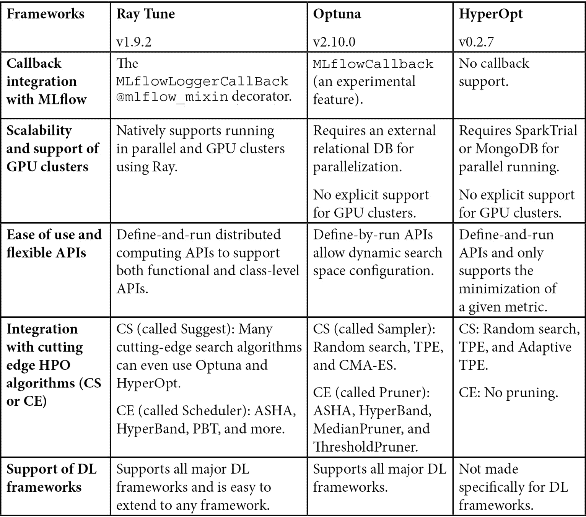
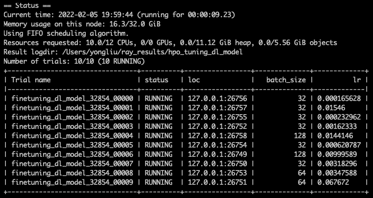
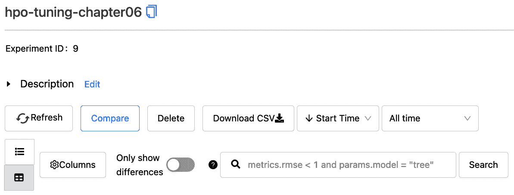
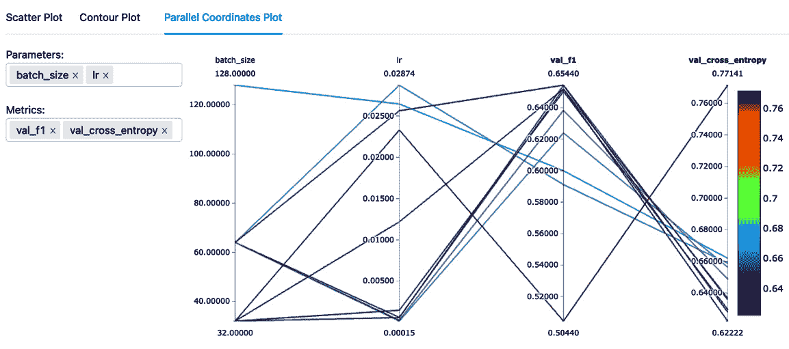
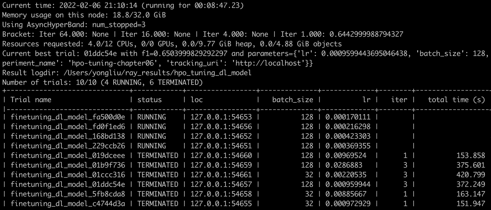

# 第六章：大规模运行超参数调优

**超参数调优**或**超参数优化**（**HPO**）是一种在合理的计算资源约束和时间框架内，找到最佳深度神经网络结构、预训练模型类型以及模型训练过程的程序。这里的超参数是指在机器学习训练过程中无法改变或学习的参数，例如深度神经网络中的层数、预训练语言模型的选择，或训练过程中的学习率、批量大小和优化器。在本章中，我们将使用 HPO 作为超参数调优和优化过程的简称。HPO 是生成高性能机器学习/深度学习模型的关键步骤。由于超参数的搜索空间非常大，因此在大规模上高效地运行 HPO 是一个主要挑战。与经典的机器学习模型相比，深度学习模型的评估复杂性和高成本进一步加剧了这些挑战。因此，我们需要学习最先进的 HPO 方法和实现框架，实现越来越复杂和可扩展的 HPO 方法，并通过 MLflow 跟踪它们，以确保调优过程是可复现的。在本章结束时，你将能够熟练地实现适用于深度学习模型管道的可扩展 HPO。

在本章中，首先，我们将概述不同的自动化 HPO 框架以及深度学习模型调优的应用。此外，我们还将了解应该优化哪些内容以及何时选择使用哪些框架。我们将比较三种流行的 HPO 框架：**HyperOpt**、**Optuna**和**Ray Tune**。我们将展示在大规模运行 HPO 时，哪一种框架是最合适的选择。接着，我们将重点学习如何创建适合 HPO 的深度学习模型代码，这些代码可以使用 Ray Tune 和 MLflow。之后，我们将展示如何轻松切换到使用不同的 HPO 算法，并以 Optuna 为主要示例进行说明。

在本章中，我们将涵盖以下主题：

+   了解深度学习管道的自动化 HPO

+   使用 Ray Tune 和 MLflow 创建适合 HPO 的深度学习模型

+   使用 MLflow 运行第一个 Ray Tune HPO 实验

+   使用 Optuna 和 HyperBand 运行 Ray Tune HPO

# 技术要求

要理解本章的示例，以下是所需的关键技术要求：

+   Ray Tune 1.9.2：这是一个灵活且强大的超参数调优框架（[`docs.ray.io/en/latest/tune/index.html`](https://docs.ray.io/en/latest/tune/index.html)）。

+   Optuna 2.10.0：这是一个命令式的、按运行定义的超参数调优 Python 包（[`optuna.org/`](https://optuna.org/)）。

+   本章的代码可以在以下 GitHub 地址找到，其中还包括包含前述关键包和其他依赖项的`requirements.txt`文件：[`github.com/PacktPublishing/Practical-Deep-Learning-at-Scale-with-MLFlow/tree/main/chapter06`](https://github.com/PacktPublishing/Practical-Deep-Learning-at-Scale-with-MLFlow/tree/main/chapter06)。

# 理解深度学习管道中的自动超参数优化

自动超参数优化（HPO）已经研究了超过二十年，自 1995 年首次发布有关该主题的已知论文以来（[`www.sciencedirect.com/science/article/pii/B9781558603776500451`](https://www.sciencedirect.com/science/article/pii/B9781558603776500451)）。人们普遍理解，调优机器学习模型的超参数可以提升模型的性能——有时，甚至能显著提升。近年来，深度学习（DL）模型的崛起催生了一股新的创新浪潮，并推动了新框架的开发，以应对深度学习管道的超参数优化问题。这是因为，深度学习模型管道带来了许多新的、大规模的优化挑战，而这些挑战不能轻易通过以往的超参数优化方法解决。需要注意的是，与模型训练过程中可以学习到的模型参数不同，超参数集必须在训练之前设定。

超参数优化与迁移学习微调的区别

在本书中，我们一直专注于一种成功的深度学习方法——**迁移学习**（有关详细讨论，请参阅*第一章*，*深度学习生命周期与 MLOps 挑战*）。迁移学习过程中的关键步骤是用一些任务和领域特定的标注数据来微调一个预训练模型，以获得一个良好的任务特定深度学习模型。然而，微调步骤仅仅是模型训练过程中的一种特殊训练方式，它同样涉及许多超参数需要优化。这就是超参数优化发挥作用的地方。

## 超参数类型及其挑战

有几种类型的超参数可以用于深度学习管道：

+   **深度学习模型类型与架构**：在迁移学习的情况下，选择使用哪些预训练模型是一个可能的超参数。例如，**Hugging Face**模型库中有超过 27,000 个预训练模型（[`huggingface.co/models`](https://huggingface.co/models)），包括**BERT**、**RoBERTa**等。对于特定的预测任务，我们可能会尝试其中的几个模型，决定哪个模型是最适合的。

+   **学习和训练相关的参数**：这些包括不同类型的优化器，如**随机梯度下降**（**SGD**）和**Adam**（你可以在[`machinelearningknowledge.ai/pytorch-optimizers-complete-guide-for-beginner/`](https://machinelearningknowledge.ai/pytorch-optimizers-complete-guide-for-beginner/)查看 PyTorch 优化器的完整列表）。它还包括相关的参数，如学习率和批量大小。建议在适用时，首先根据其重要性顺序调整神经网络模型的以下参数：学习率、动量、迷你批量大小、隐藏层数量、学习率衰减和正则化（[`arxiv.org/abs/2003.05689`](https://arxiv.org/abs/2003.05689)）。

+   **数据和管道配置**：深度学习管道可能包括数据处理和转换步骤，这些步骤可能会影响模型训练。例如，如果我们想比较带有或不带有签名文本主体的电子邮件消息的分类模型的性能，那么就需要一个超参数来决定是否包含电子邮件签名。另一个例子是当我们没有足够的数据或数据的变化时，我们可以尝试使用各种数据增强技术，这些技术会为模型训练提供不同的输入集（[`neptune.ai/blog/data-augmentation-nlp`](https://neptune.ai/blog/data-augmentation-nlp)）。

提醒一下，并非所有超参数都是可调的或需要调整的。例如，在深度学习模型中，**训练轮次**不需要调整。这是因为当准确度指标停止提升或不再有改善的可能时，训练应停止。这被称为早停或剪枝，是支撑一些近期最先进超参数优化（HPO）算法的关键技术之一（关于早停的更多讨论，请参考[`databricks.com/blog/2019/08/15/how-not-to-scale-deep-learning-in-6-easy-steps.html`](https://databricks.com/blog/2019/08/15/how-not-to-scale-deep-learning-in-6-easy-steps.html)）。

请注意，所有这三类超参数可以进行混合搭配，整个超参数空间的配置可能非常庞大。例如，如果我们希望选择一个预训练模型的类型作为超参数（例如，选择可能是**BERT**或**RoBERTa**），再加上两个与学习相关的参数（如学习率和批处理大小），以及两种不同的 NLP 文本数据增强技术（如随机插入和同义词替换），那么我们就有五个超参数需要优化。请注意，每个超参数可能有许多不同的候选值可以选择，如果每个超参数有 5 个不同的值，那么我们总共有 55 = 3125 种超参数组合需要尝试。在实际应用中，通常需要尝试几十个超参数，每个超参数可能有几十个选择或分布可供采样。这很容易导致维度灾难问题（[`insaid.medium.com/automated-hyperparameter-tuning-988b5aeb7f2a`](https://insaid.medium.com/automated-hyperparameter-tuning-988b5aeb7f2a)）。这种高维搜索空间的挑战由于 DL 模型训练和评估成本高昂而变得更加复杂；我们知道，即使是一个小型 BERT 的 1 个周期（我们在前几章中尝试过），使用一个小规模的训练和验证数据集也可能需要 1 到 2 分钟。现在想象一个实际的生产级 DL 模型，若要进行 HPO，可能需要数小时、数天，甚至数周，如果没有高效执行的话。通常，以下是需要大规模应用高性能 HPO 的主要挑战：

+   超参数的高维搜索空间

+   随着 DL 模型越来越大，模型训练和评估时间的高成本

+   用于生产环境中 DL 模型的生产时间和部署

    同时进行模型训练和 HPO

    在训练过程中是可以动态改变超参数的。这是一种混合方法，它同时进行模型训练和 HPO，例如**基于种群的训练**（**PBT**；[`deepmind.com/blog/article/population-based-training-neural-networks`](https://deepmind.com/blog/article/population-based-training-neural-networks)）。然而，这并不改变这样一个事实：当开始新的训练周期时，一组超参数需要预先定义。PBT 是尝试减少搜索高维超参数空间和深度学习（DL）模型训练成本的创新之一。感兴趣的读者可以查阅*进一步阅读*部分，深入了解这个话题。

现在我们已经了解了优化超参数的一般挑战和类别，接下来让我们看看 HPO 是如何工作的，以及如何选择适合我们使用的框架。

## HPO 是如何工作的，以及如何选择

有不同的方式理解 HPO 的工作原理。经典的 HPO 方法包括网格搜索和随机搜索，其中会选择一组具有候选值范围的超参数。每个超参数组合独立运行，直到完成，然后根据我们找到的最佳模型性能指标，从我们运行的试验中挑选出最佳的超参数配置。虽然这种搜索方法易于实现，甚至可能不需要复杂的框架来支持，但它本质上是低效的，且由于 HPO 的非凸性质，可能找不到最佳的超参数配置。非凸的意思是存在多个局部最小值或最大值，优化方法可能无法找到全局最优（即最小值或最大值）。简单来说，现代的 HPO 需要做两件事：

+   超参数的自适应采样（也称为**配置选择**或**CS**）：这意味着需要通过利用先前的知识来选择要尝试的超参数集。这主要是通过使用不同变种的贝叶斯优化方法，根据先前的试验以顺序方式自适应地识别新的配置。已证明这种方法优于传统的网格搜索和随机搜索方法。

+   超参数集的自适应评估（也称为**配置评估**或**CE**）：这些方法专注于自适应地将更多资源分配给有前景的超参数配置，同时迅速去除效果不佳的配置。资源可以以不同的形式存在，如训练数据集的大小（例如，仅使用训练数据集的一小部分）或迭代次数（例如，仅使用少量迭代来决定哪些任务需要终止，而不是运行到收敛）。有一类方法称为多臂赌博机算法，例如**异步成功缩减算法**（**ASHA**）。在这里，所有试验从一个初始预算开始，然后去除最差的一半，调整剩余试验的预算，这个过程会重复进行，直到只剩下一个试验。

实际上，我们希望使用以下五个标准来选择一个合适的 HPO 框架：

+   与 MLflow 的回调集成

+   可扩展性和对 GPU 集群的支持

+   易于使用和灵活的 API

+   与前沿 HPO 算法的集成（**CS** 和 **CE**）

+   深度学习框架的支持

在本书中，比较了三种框架，结果总结在*图 6.1*中：



图 6.1：Ray Tune、Optuna 和 HyperOpt 的比较

如*图 6.1*所示，**Ray Tune**（[`docs.ray.io/en/latest/tune/index.html`](https://docs.ray.io/en/latest/tune/index.html)）的表现优于**Optuna**（[`optuna.org/`](https://optuna.org/)）和**HyperOpt**（[`hyperopt.github.io/hyperopt/`](https://hyperopt.github.io/hyperopt/)）。接下来，我们将依次解释以下五个标准：

+   **与 MLflow 的回调集成**：Optuna 对 MLflow 回调的支持仍然是一个实验性功能，而 HyperOpt 根本不支持回调，这就让用户需要额外管理每次试验运行的 MLflow 跟踪。

只有 Ray Tune 支持 Python 混合装饰器和与 MLflow 的回调集成。Python 混合装饰器是一种模式，允许在需要时将独立的函数混合进来。在这种情况下，MLflow 的功能通过`mlflow_mixin`装饰器在模型训练期间自动混合进来。这可以将任何训练函数转变为 Ray Tune 可训练的函数，自动配置 MLflow 并在与每次 Tune 试验相同的进程中创建运行。然后，你可以在训练函数内部使用 MLflow API，结果会自动报告到正确的运行中。此外，它还支持 MLflow 的自动日志记录，这意味着所有的 MLflow 跟踪信息将被记录到正确的试验中。例如，以下代码片段展示了如何将我们之前的深度学习微调函数转换为一个`mlflow_mixin`的 Ray Tune 函数：

```py
@mlflow_mixin
def train_dl_model():
    mlflow.pytorch.autolog()
    trainer = flash.Trainer(
        max_epochs=num_epochs,
        callbacks=[TuneReportCallback(
            metrics, on='validation_end')])
    trainer.finetune()
```

请注意，当我们定义训练器时，可以将`TuneReportCallback`作为回调之一添加，这将把指标反馈给 Ray Tune，而 MLflow 的自动日志记录会同时完成所有跟踪结果的记录。在下一节中，我们将展示如何将上一章中微调深度学习模型的示例转变为 Ray Tune 可训练函数。

+   **可扩展性和 GPU 集群支持**：尽管 Optuna 和 HyperOpt 支持并行化，但它们都依赖于一些外部数据库（如关系数据库或 MongoDB）或 SparkTrials。只有 Ray Tune 通过 Ray 分布式框架原生支持并行和分布式 HPO，而且在这三种框架中，它也是唯一支持在 GPU 集群上运行的。

+   **API 的易用性和灵活性**：在这三个框架中，只有 Optuna 支持**按运行时定义**的 API，这允许您以 Pythonic 编程风格动态定义超参数，包括循环和分支（[`optuna.readthedocs.io/en/stable/tutorial/10_key_features/002_configurations.html`](https://optuna.readthedocs.io/en/stable/tutorial/10_key_features/002_configurations.html)）。这与 Ray Tune 和 HyperOpt 支持的**定义-运行**API 形成对比，其中搜索空间在评估目标函数之前由预定义的字典定义。这两个术语**按运行时定义**和**定义-运行**实际上是由 DL 框架开发社区创造的。在早期，当 TensorFlow 1.0 最初发布时，神经网络首先需要定义，然后稍后惰性执行，这称为定义-运行。这两个阶段，1）神经网络构建阶段和 2）评估阶段，是按顺序执行的，神经网络结构在构建阶段之后不能更改。更新的 DL 框架，如 TensorFlow 2.0（或 TensorFlow 的急切执行版本）和 PyTorch，支持按运行时定义神经网络计算。没有用于构建和评估神经网络的两个单独阶段。用户可以在计算过程中直接操作神经网络。虽然 Optuna 提供的按运行时定义 API 可以用于动态定义超参数搜索空间，但它确实有一些缺点。主要问题是在运行时不知道参数并发性，这可能会使优化方法的实现复杂化。这是因为事先了解参数并发性对于许多采样方法是有很好的支持的。因此，在本书中，我们更喜欢使用**定义-运行**API。还请注意，Ray Tune 可以通过与 Optuna 的集成支持**按运行时定义**API（您可以在 Ray Tune 的 GitHub 存储库中看到一个示例，位于[`github.com/ray-project/ray/blob/master/python/ray/tune/examples/optuna_define_by_run_example.py#L35`](https://github.com/ray-project/ray/blob/master/python/ray/tune/examples/optuna_define_by_run_example.py#L35)）。

+   **与前沿 HPO 算法集成**（**CS 和 CE**）：在**CS**方面，这三种框架中，HyperOpt 在支持或集成最新的前沿 HPO 采样和搜索方法方面开发活跃度最低。其主要的搜索方法是**树结构帕森估计器**（**TPE**），这是一种贝叶斯优化变体，特别适用于混合分类和条件超参数搜索空间。同样，Optuna 的主要采样方法也是 TPE。相反，Ray Tune 支持包括以下内容的所有前沿搜索方法：

    +   DragonFly ([`dragonfly-opt.readthedocs.io/en/master/`](https://dragonfly-opt.readthedocs.io/en/master/))，这是一个高度可扩展的贝叶斯优化框架

    +   BlendSearch ([`microsoft.github.io/FLAML/docs/Use-Cases/Tune-User-Defined-Function/#hyperparameter-optimization-algorithm`](https://microsoft.github.io/FLAML/docs/Use-Cases/Tune-User-Defined-Function/#hyperparameter-optimization-algorithm))，来自微软研究院

此外，Ray Tune 还通过与 Optuna 和 HyperOpt 的集成支持 TPE。

在 **CE** 方面，HyperOpt 不支持任何修剪或调度器来停止不 promising 的超参数配置。Optuna 和 Ray Tune 都支持相当多的修剪器（在 Optuna 中）或调度器（在 Ray Tune 中）。然而，只有 Ray Tune 支持 PBT。考虑到 Ray Tune 活跃的开发社区和灵活的 API，Ray Tune 很有可能会继续及时集成并支持任何新兴的调度器或修剪器。

+   **深度学习框架的支持**：HyperOpt 并非专为任何深度学习框架设计或集成。这并不意味着不能使用 HyperOpt 调优深度学习模型。然而，HyperOpt 不提供任何修剪或调度器支持来对不 promising 的超参数配置进行早停，这是 HyperOpt 用于深度学习模型调优的一个主要缺点。Ray Tune 和 Optuna 都与流行的深度学习框架如 PyTorch Lightning 和 TensorFlow/Keras 集成。

除了我们刚才讨论的主要标准，Ray Tune 还拥有最佳的文档、广泛的代码示例和充满活力的开源开发者社区，这也是我们在本章中偏向使用 Ray Tune 进行学习的原因。在接下来的部分中，我们将学习如何使用 Ray Tune 和 MLflow 创建适合超参数优化的深度学习模型。

# 使用 Ray Tune 和 MLflow 创建适合超参数优化的深度学习模型

为了在超参数优化中使用 Ray Tune 与 MLflow，我们将使用我们在 *第五章* 中的深度学习管道示例中的微调步骤，看看需要设置什么内容以及我们需要做哪些代码更改。在开始之前，首先让我们回顾一下几个与我们使用 Ray Tune 特别相关的关键概念：

+   **目标函数**：目标函数可以是最小化或最大化给定超参数配置的某个指标值。例如，在深度学习模型训练和微调的场景中，我们希望最大化 NLP 文本分类器的 F1 分数。这一目标函数需要被包装成一个可训练的函数，Ray Tune 可以进行超参数优化。在接下来的部分中，我们将演示如何包装我们的 NLP 文本情感分析模型。

+   `tune.report` 用于报告模型指标 ([`docs.ray.io/en/latest/tune/api_docs/trainable.html#function-api`](https://docs.ray.io/en/latest/tune/api_docs/trainable.html#function-api))。基于类的 API 要求模型训练函数（trainable）是 `tune.Trainable` 的子类 ([`docs.ray.io/en/latest/tune/api_docs/trainable.html#trainable-class-api`](https://docs.ray.io/en/latest/tune/api_docs/trainable.html#trainable-class-api))。基于类的 API 提供了更多控制 Ray Tune 如何控制模型训练过程的方式。如果你开始编写神经网络模型的新架构，这可能非常有用。然而，当使用预训练的基础模型进行微调时，使用基于函数的 API 会更容易，因为我们可以利用像 PyTorch Lightning Flash 这样的包来进行 HPO。

+   `tune.run`，在这里 Ray Tune 将协调超参数优化（HPO）过程。

+   `tune.loguniform`) 或来自某些类别变量（例如，`tune.choice(['a', 'b' ,'c'])` 允许你均匀选择这三个选项）。通常，这个搜索空间被定义为一个名为 `config` 的 Python 字典变量。

+   `tune.suggest` API ([`docs.ray.io/en/latest/tune/api_docs/suggestion.html#tune-search-alg`](https://docs.ray.io/en/latest/tune/api_docs/suggestion.html#tune-search-alg))。

+   `tune.suggest` API 提供了用于搜索的优化算法，但它不提供早期停止或修剪功能，以便在仅经过几次迭代后停止明显不太可能成功的实验。由于早期停止或修剪可以显著加速 HPO 过程，因此强烈建议你结合搜索器使用调度器。Ray Tune 通过其调度器 API (`tune.schedulers`) 提供了许多流行的调度器，如 ASHA、HyperBand 等。（请访问 [`docs.ray.io/en/latest/tune/api_docs/schedulers.html#trial-schedulers-tune-schedulers`](https://docs.ray.io/en/latest/tune/api_docs/schedulers.html#trial-schedulers-tune-schedulers).)

在回顾了 Ray Tune 的基本概念和 API 后，在下一节中，我们将设置 Ray Tune 和 MLflow 来运行 HPO 实验。

## 设置 Ray Tune 和 MLflow

现在我们理解了 Ray Tune 的基本概念和 API，让我们看看如何设置 Ray Tune 来执行之前的 NLP 情感分类器的微调步骤的 HPO。你可能想要下载本章的代码 ([`github.com/PacktPublishing/Practical-Deep-Learning-at-Scale-with-MLFlow/blob/main/chapter06/`](https://github.com/PacktPublishing/Practical-Deep-Learning-at-Scale-with-MLFlow/blob/main/chapter06/))，以便跟随这些说明：

1.  通过在你的 conda 虚拟环境 `dl_model_hpo` 中输入以下命令来安装 Ray Tune：

    ```py
    pip install ray[tune]==1.9.2
    ```

1.  这将会在你启动 DL 模型微调的 HPO 任务时，在虚拟环境中安装 Ray Tune。请注意，我们还提供了完整的`requirements.txt`文件，位于本章的 GitHub 仓库中（[`github.com/PacktPublishing/Practical-Deep-Learning-at-Scale-with-MLFlow/blob/main/chapter06/requirements.txt`](https://github.com/PacktPublishing/Practical-Deep-Learning-at-Scale-with-MLFlow/blob/main/chapter06/requirements.txt)），你应该能够运行以下安装命令：

    ```py
    pip install -r requirements.txt
    ```

1.  位于同一文件夹中的`README.md`文件包含完整的说明，如果你需要了解如何设置合适的虚拟环境，它将为你提供更多的指导。

1.  对于 MLflow 设置，假设你已经设置好了完整的 MLflow 跟踪服务器，唯一需要注意的是确保你正确配置了环境变量，以便访问 MLflow 跟踪服务器。在你的终端中运行以下命令来设置这些变量。或者，你也可以通过在 Python 代码中调用`os.environ["environmental_name"]=value`来覆盖你的环境变量。提醒一下，我们已经在终端会话中展示了以下可以设置的环境变量：

    ```py
    export MLFLOW_TRACKING_URI=http://localhost
    export MLFLOW_S3_ENDPOINT_URL=http://localhost:9000
    export AWS_ACCESS_KEY_ID="minio"
    export AWS_SECRET_ACCESS_KEY="minio123"
    ```

1.  运行`download_data`步骤将原始数据下载到`chapter06`父文件夹下的本地文件夹：

    ```py
    mlflow run . -P pipeline_steps='download_data' --experiment-name dl_model_chapter06
    ```

当前面的执行完成后，你应该能够在**chapter06/data/**文件夹下找到 IMDB 数据。

现在我们准备创建一个 HPO 步骤，以微调我们之前构建的 NLP 情感分析模型。

## 为 DL 模型创建 Ray Tune 可训练对象

我们需要做多个更改，才能让 Ray Tune 运行 HPO 任务来微调我们在前几章中开发的 DL 模型。我们将逐步演示这些步骤，如下所示：

1.  首先，让我们列出在之前的微调代码中可能的超参数（包括可调和不可调的）。回想一下，我们的微调代码看起来如下（这里只显示关键代码行；完整代码可以在 GitHub 仓库的`chapter05`中找到，地址为[`github.com/PacktPublishing/Practical-Deep-Learning-at-Scale-with-MLFlow/blob/main/chapter05/pipeline/fine_tuning_model.py#L19`](https://github.com/PacktPublishing/Practical-Deep-Learning-at-Scale-with-MLFlow/blob/main/chapter05/pipeline/fine_tuning_model.py#L19)）：

    ```py
    datamodule = TextClassificationData.from_csv(
        input_fields="review",
        target_fields="sentiment",
        train_file=f"{data_path}/imdb/train.csv",
        val_file=f"{data_path}/imdb/valid.csv",
        test_file=f"{data_path}/imdb/test.csv")
    classifier_model = TextClassifier(
        backbone= "prajjwal1/bert-tiny",
        num_classes=datamodule.num_classes, 
        metrics=torchmetrics.F1(datamodule.num_classes))
    trainer = flash.Trainer(max_epochs=3)
    trainer.finetune(classifier_model, 
        datamodule=datamodule, strategy="freeze") 
    ```

前面的代码包含四个主要部分：

+   `datamodule`变量：这定义了训练、验证和测试的数据源。这里有一个`batch_size`参数，默认值为`1`，虽然在这里没有显示，但它是需要调优的最重要的超参数之一。更多详情，请参阅`lightning-flash`代码文档中的说明（[`github.com/PyTorchLightning/lightning-flash/blob/450902d713980e0edefcfd2d2a2a35eb875072d7/flash/core/data/data_module.py#L64`](https://github.com/PyTorchLightning/lightning-flash/blob/450902d713980e0edefcfd2d2a2a35eb875072d7/flash/core/data/data_module.py#L64)）。

+   `classifier_model`：这定义了一个通过`lightning-flash`的`TextClassifier` API 暴露参数的分类器。输入参数中有多个超参数可以调优，包括`learning_rate`、`backbone`基础模型、`optimizer`等。你可以在`lightning-flash`代码文档中查看`TextClassifier` API 的完整输入参数列表（[`github.com/PyTorchLightning/lightning-flash/blob/450902d713980e0edefcfd2d2a2a35eb875072d7/flash/text/classification/model.py#L44`](https://github.com/PyTorchLightning/lightning-flash/blob/450902d713980e0edefcfd2d2a2a35eb875072d7/flash/text/classification/model.py#L44)）。

+   `trainer`：这定义了一个训练器变量，可用于微调。这里有一些需要设置的超参数，但不一定需要调优，比如`num_epochs`，正如前面所讨论的那样。

+   `trainer.finetune`：这实现了实际的微调（迁移学习）。注意，还有一个可能需要调优的超参数**strategy**。

为了学习目的，我们将选择`learning_rate`和`batch_size`作为两个需要调优的超参数，因为这两个参数对于优化深度学习模型至关重要。一旦你完成这一章，你应该能够轻松地将更多的超参数添加到优化候选列表中。

1.  Ray Tune 要求传入一个可训练的函数到`tune.run`。这意味着我们需要创建一个可训练的函数。默认情况下，训练函数只接受一个必需的输入参数`config`，它包含超参数和其他参数的键值对字典，并用于标识执行环境，如 MLflow 跟踪 URL。然而，Ray Tune 提供了一个包装函数，叫做`tune.with_parameters`，它允许你传递额外的任意参数和对象（[`docs.ray.io/en/latest/tune/tutorials/overview.html#how-can-i-pass-further-parameter-values-to-my-trainable`](https://docs.ray.io/en/latest/tune/tutorials/overview.html#how-can-i-pass-further-parameter-values-to-my-trainable)）。首先，让我们创建一个名为`finetuning_dl_model`的函数，将我们刚才检查的微调步骤逻辑封装起来，并使用`mlflow_mixin`装饰器。这样可以确保每次调用该函数时，MLflow 会自动初始化。

    ```py
    @mlflow_mixin
    def finetuning_dl_model(config, data_dir=None,
                            num_epochs=3, num_gpus=0):
    ```

该函数接受一个`config`字典作为输入，其中可以传入一组超参数和 MLflow 配置。此外，我们为函数签名添加了三个额外的参数：`data_dir`表示目录的位置，`num_epochs`表示每个试验的最大训练轮数，`num_gpus`表示每个试验使用的 GPU 数量（如果有的话）。

1.  在这个`mlflow_mixin`装饰的函数中，如果需要，我们可以使用所有 MLflow 跟踪 API，但从 MLflow 版本 1.22.0 开始，由于 MLflow 的自动日志记录支持不再是实验性特性，而是一个成熟的生产级特性（[`github.com/mlflow/mlflow/releases/tag/v1.22.0`](https://github.com/mlflow/mlflow/releases/tag/v1.22.0)），因此我们应该直接在代码中使用自动日志记录，如下所示：

    ```py
    mlflow.pytorch.autolog()
    ```

这样做是高效的，并且无需进行任何更改。然而，`batch_size`超参数不会被自动记录，因此我们需要在微调完成后再添加一个日志记录语句，如下所示：

```py
mlflow.log_param('batch_size',config['batch_size'])
```

1.  在`finetuning_dl_model`函数的其余实现部分，大部分代码与之前相同。这里有一些更改。在`datamodule`变量赋值语句中，我们添加了`batch_size=config['batch_size']`，以便训练数据的迷你批量大小可以调整，如下所示：

    ```py
    datamodule = TextClassificationData.from_csv(
        input_fields="review",
        target_fields="sentiment",
        train_file=f"{data_dir}/imdb/train.csv",
        val_file=f"{data_dir}/imdb/valid.csv",
        test_file=f"{data_dir}/imdb/test.csv",
        batch_size=config['batch_size'])
    ```

1.  在定义`classifier_model`变量时，不再使用默认的超参数集值，而是需要传入`config`字典来分配这些值：

    ```py
    classifier_model = TextClassifier(
        backbone=config['foundation_model'],
        learning_rate=config['lr'],
        optimizer=config['optimizer_type'],
        num_classes=datamodule.num_classes,
        metrics=torchmetrics.F1(datamodule.num_classes))
    ```

1.  接下来，我们需要修改训练器赋值代码。在这里，我们需要做两件事：首先，我们需要定义一个度量标准的键值字典，以便从 PyTorch Lightning 传递到 Ray Tune。该字典中的键是 Ray Tune 试验运行中要引用的名称，而该字典中键的值是 PyTorch Lightning 报告的相应度量标准名称。

    PyTorch Lightning 验证步骤中的度量标准名称

    在将 metrics 传递给 Ray Tune 时，首先我们需要了解在 PyTorch Lightning 中验证步骤期间使用的指标名称，因为 HPO 仅使用验证数据进行评估，而不使用保留的测试数据集。实际上，PyTorch Lightning 有一个硬编码的约定，所有指标的名称都会以相应的训练、验证和测试步骤名称及下划线为前缀。名为`f1`的指标将在 PyTorch Lightning 中作为`train_f1`在训练步骤中报告，在验证步骤中报告为`val_f1`，在测试步骤中报告为`test_f1`。（你可以在[`github.com/PyTorchLightning/lightning-flash/blob/8b244d785c5569e9aa7d2b878a5f94af976d3f55/flash/core/model.py#L462`](https://github.com/PyTorchLightning/lightning-flash/blob/8b244d785c5569e9aa7d2b878a5f94af976d3f55/flash/core/model.py#L462)查看 PyTorch Lightning 的代码逻辑）。在我们的示例中，我们可以选择`cross_entropy`和`f1`作为验证步骤中的指标，它们分别命名为`val_cross_entropy`和`val_f1`，并将它们作为`loss`和`f1`传递回 Ray Tune。这意味着，在 Ray Tune 的试验运行中，我们将这两个指标引用为`loss`和`f1`。

因此，在这里我们定义了两个希望从 PyTorch Lightning 验证步骤中传递到 Ray Tune 的指标，分别是`val_cross_entropy`和`val_f1`，它们分别作为`loss`和`f1`传递：

```py
metrics = {"loss":"val_cross_entropy", "f1":"val_f1"}
```

现在，我们可以将这个 metrics 字典传递给 trainer 赋值，如下所示：

```py
trainer = flash.Trainer(max_epochs=num_epochs,
    gpus=num_gpus,
    progress_bar_refresh_rate=0,
    callbacks=[TuneReportCallback(metrics, 
        on='validation_end')])
```

注意，metrics 字典会在`validation_end`事件发生时通过`TuneReportCallBack`传递。这意味着当 PyTorch Lightning 中的验证步骤完成时，它会自动触发 Ray Tune 报告函数，将指标列表反馈给 Ray Tune 进行评估。有关`TuneReportCallback`可以使用的有效事件的支持列表，请参考 Ray Tune 与 PyTorch Lightning 的集成源代码（[`github.com/ray-project/ray/blob/fb0d6e6b0b48b0a681719433691405b96fbea104/python/ray/tune/integration/pytorch_lightning.py#L170`](https://github.com/ray-project/ray/blob/fb0d6e6b0b48b0a681719433691405b96fbea104/python/ray/tune/integration/pytorch_lightning.py#L170)）。

1.  最后，我们可以调用`trainer.finetune`来执行微调步骤。在这里，我们可以将`finetuning_strategies`作为可调超参数传递给参数列表：

    ```py
    trainer.finetune(classifier_model,
        datamodule=datamodule,
        strategy=config['finetuning_strategies'])
    ```

1.  这完成了原始微调 DL 模型函数的更改。现在我们有一个新的`finetuning_dl_model`函数，准备被`with_parameters`包装以成为 Ray Tune 的可训练函数。它应该如下所示调用：

    ```py
    trainable = tune.with_parameters(finetuning_dl_model, data_dir, num_epochs, num_gpus)
    ```

1.  请注意，无需传递`config`参数，因为默认假设它是`finetuning_dl_model`的第一个参数。其他三个参数需要传递给`tune.with_parameters`包装器。同时，确保创建 Ray Tune 可训练对象的语句放在`finetuning_dl_model`函数外部。

在下一部分，它将被放入 Ray Tune 的 HPO 运行函数中，名为`run_hpo_dl_model`。

## 创建 Ray Tune HPO 运行函数

现在，让我们创建一个 Ray Tune HPO 运行函数来执行以下五个步骤：

+   定义 MLflow 运行时配置参数，包括追踪 URI 和实验名称。

+   使用 Ray Tune 的随机分布 API 定义超参数搜索空间（[`docs.ray.io/en/latest/tune/api_docs/search_space.html#random-distributions-api`](https://docs.ray.io/en/latest/tune/api_docs/search_space.html#random-distributions-api)），以采样我们之前确定的超参数列表。

+   使用`tune.with_parameters`定义 Ray Tune 的可训练对象，如前一小节末尾所示。

+   调用`tune.run`。这将执行 HPO 运行，并在完成时返回 Ray Tune 的实验分析对象。

+   在整个 HPO 运行完成后，记录最佳配置参数。

让我们一起查看实现过程，看看这个函数是如何实现的：

1.  首先，让我们定义超参数的`config`字典，如下所示：

    ```py
    mlflow.set_tracking_uri(tracking_uri)
    mlflow.set_experiment(experiment_name)
    ```

这将接受`tracking_uri`和`experiment_name`作为 MLflow 的输入参数，并正确设置它们。如果这是你第一次运行，MLflow 还将创建该实验。

1.  然后，我们可以定义`config`字典，其中可以包括可调和不可调的参数，以及 MLflow 的配置参数。如前所述，我们将调整`learning_rate`和`batch_size`，但也会包括其他超参数用于记账和未来的调优目的：

    ```py
    config = {
            "lr": tune.loguniform(1e-4, 1e-1),
            "batch_size": tune.choice([32, 64, 128]),
            "foundation_model": "prajjwal1/bert-tiny",
            "finetuning_strategies": "freeze",
            "optimizer_type": "Adam",
            "mlflow": {
                "experiment_name": experiment_name,
                "tracking_uri": mlflow.get_tracking_uri()
            },
        }
    ```

从`config`字典中可以看到，我们调用了`tune.loguniform`来在`1e-4`和`1e-1`之间采样一个对数均匀分布，以选择学习率。对于批量大小，我们调用了`tune.choice`从三个不同的值中均匀选择。对于其余的键值对，它们是不可调的，因为它们没有使用任何采样方法，但在运行试验时是必需的。

1.  使用`tune.with_parameters`定义可训练对象，包含除`config`参数之外的所有额外参数：

    ```py
    trainable = tune.with_parameters(
        finetuning_dl_model,
        data_dir=data_dir,
        num_epochs=num_epochs,
        num_gpus=gpus_per_trial)
    ```

在下一个语句中，这将被称为` tune.run`函数。

1.  现在我们准备通过调用`tune.run`来运行 HPO，如下所示：

    ```py
    analysis = tune.run(
        trainable,
        resources_per_trial={
            "cpu": 1,
            "gpu": gpus_per_trial
        },
        metric="f1",
        mode="max",
        config=config,
        num_samples=num_samples,
        name="hpo_tuning_dl_model")
    ```

在这里，目标是找到一组超参数，使得所有实验中的 F1-score 最大化，因此模式是 `max`，而指标是 `f1`。请注意，这个指标名称 `f1` 来自我们在之前的 `finetuning_dl_model` 函数中定义的 `metrics` 字典，其中我们将 PyTorch Lightning 的 `val_f1` 映射到 `f1`。然后，这个 `f1` 值会在每次实验验证步骤结束时传递给 Ray Tune。`trainable` 对象作为第一个参数传递给 `tune.run`，这个函数将根据 `num_samples` 的参数被执行多次。接下来，`resources_per_trial` 定义了每个实验使用的 CPU 和 GPU。请注意，在前面的示例中，我们没有指定任何搜索算法，这意味着它将默认使用 `tune.suggest.basic_variant`，这是一种网格搜索算法。我们也没有定义调度器，因此默认情况下不会进行早期停止，所有实验将并行运行，且使用执行机器上允许的最大 CPU 数量。当运行结束时，会返回一个 `analysis` 变量，包含找到的最佳超参数以及其他信息。

1.  记录找到的最佳超参数配置。这可以通过使用从 `tune.run` 返回的 `analysis` 变量来完成，代码如下：

    ```py
    logger.info("Best hyperparameters found were: %s", analysis.best_config)
    ```

就这样。现在我们可以试试看。如果你从本章的 GitHub 仓库下载完整代码，你应该能在 `pipeline` 文件夹下找到 `hpo_finetuning_model.py` 文件。

通过上述更改，我们现在已经准备好运行我们的第一个 HPO 实验。

# 使用 MLflow 运行第一个 Ray Tune HPO 实验

现在我们已经设置好了 Ray Tune、MLflow，并创建了 HPO 运行函数，我们可以尝试运行我们的第一个 Ray Tune HPO 实验，如下所示：

```py
python pipeline/hpo_finetuning_model.py
```

几秒钟后，你将看到以下屏幕，*图 6.2*，显示所有 10 次实验（即我们为 `num_samples` 设置的值）正在并行运行：



图 6.2 – Ray Tune 在本地多核笔记本上并行运行 10 次实验

大约 12-14 分钟后，你会看到所有实验都已完成，并且最佳超参数将显示在屏幕上，如下所示（由于随机性、样本数量有限以及网格搜索的使用，结果可能会有所不同，且网格搜索不保证全局最优解）：

```py
Best hyperparameters found were: {'lr': 0.025639008922511797, 'batch_size': 64, 'foundation_model': 'prajjwal1/bert-tiny', 'finetuning_strategies': 'freeze', 'optimizer_type': 'Adam', 'mlflow': {'experiment_name': 'hpo-tuning-chapter06', 'tracking_uri': 'http://localhost'}}
```

你可以在结果日志目录下找到每个实验的结果，默认情况下该目录位于当前用户的 `ray_results` 文件夹中。从 *图 6.2* 中我们可以看到，结果位于 `/Users/yongliu/ray_results/hpo_tuning_dl_model`。

你将在屏幕上看到最佳超参数的最终输出，这意味着你已经完成了第一次 HPO 实验！你可以看到所有 10 次试验都已记录在 MLflow 跟踪服务器中，并且可以使用 MLflow 跟踪服务器提供的平行坐标图来可视化和比较所有 10 次运行。你可以通过进入 MLflow 实验页面，选择你刚完成的 10 次试验，然后点击页面顶部附近的**Compare**按钮来生成该图（参见*图 6.3*）。这将带你进入并排比较页面，页面底部会显示绘图选项：



图 6.3 – 点击“Compare”以比较 MLflow 实验页面上所有 10 次试验运行

你可以点击**平行坐标图**菜单项，这将允许你选择要绘制的参数和指标。在这里，我们选择**lr**和**batch_size**作为参数，**val_f1**和**val_cross_entropy**作为指标。绘图显示在*图 6.4*中：



图 6.4 – 用于比较 HPO 实验结果的平行坐标图

正如你在*图 6.4*中看到的，非常容易看出**batch_size**为 128，**lr**为 0.02874 时，能够产生最佳的**val_f1**得分 0.6544 和**val_cross_entropy**（损失值）为 0.62222。正如前面所提到的，这次 HPO 运行没有使用任何高级搜索算法和调度器，因此让我们看看在接下来的部分中，通过使用提前停止和修剪，我们能否通过更多的实验做得更好。

# 使用 Optuna 和 HyperBand 通过 Ray Tune 运行 HPO

现在，让我们尝试一些不同的搜索算法和调度器的实验。鉴于 Optuna 是一种非常优秀的基于 TPE 的搜索算法，ASHA 是一种优秀的调度器，可以通过异步并行试验并提前终止那些不太有前景的试验，看看我们需要做多少更改才能使其工作将会很有趣。

结果表明，基于我们在前一部分所做的工作，变化非常微小。这里，我们将展示四个主要的变化：

1.  安装**Optuna**包。可以通过运行以下命令来完成：

    ```py
    pip install optuna==2.10.0
    ```

这将把 Optuna 安装到我们之前的虚拟环境中。如果你已经运行了`pip install -r requirements.text`，那么 Optuna 已经被安装，你可以跳过这一步。

1.  导入与 Optuna 和 ASHA 调度器集成的相关 Ray Tune 模块（在这里，我们使用 ASHA 的 HyperBand 实现）如下：

    ```py
    from ray.tune.suggest import ConcurrencyLimiter
    from ray.tune.schedulers import AsyncHyperBandScheduler
    from ray.tune.suggest.optuna import OptunaSearch
    ```

1.  现在，我们准备好将搜索算法变量和调度器变量添加到 HPO 执行函数`run_hpo_dl_model`中了，具体如下：

    ```py
    searcher = OptunaSearch()
    searcher = ConcurrencyLimiter(searcher, max_concurrent=4)
    scheduler = AsyncHyperBandScheduler()
    ```

请注意，`searcher` 变量现在使用的是 Optuna，我们将并发运行的最大次数设置为 `4`，让这个 `searcher` 变量在 HPO 搜索过程中每次尝试最多同时运行四个试验。调度器初始化时使用 HyperBand 调度器。

1.  将 searcher 和 scheduler 分配给 `tune.run` 调用的相应参数，如下所示：

    ```py
    analysis = tune.run(
        trainable,
        resources_per_trial={
            "cpu": 1,
            "gpu": gpus_per_trial
        },
        metric="f1",
        mode="max",
        config=config,
        num_samples=num_samples,
        search_alg=searcher,
        scheduler=scheduler,
        name="hpo_tuning_dl_model")
    ```

请注意，`searcher` 被分配给了 `search_alg` 参数，`scheduler` 被分配给了 `scheduler` 参数。就这样。现在，我们已经准备好在统一的 Ray Tune 框架下使用 Optuna 进行 HPO，并且已经通过 Ray Tune 提供了所有的 MLflow 集成。

我们已经在 `pipeline` 文件夹中的 `hpo_finetuning_model_optuna.py` 文件中提供了完整的 Python 代码。我们可以按照以下步骤运行这个 HPO 实验：

```py
python pipeline/hpo_finetuning_model_optuna.py
```

你将立即注意到控制台输出中的以下内容：

```py
[I 2022-02-06 21:01:27,609] A new study created in memory with name: optuna
```

这意味着我们现在使用 Optuna 作为搜索算法。此外，你会注意到在屏幕显示的状态输出中有四个并发的试验。随着时间的推移，一些试验会在完成之前的一个或两个迭代（epoch）后被终止。这意味着 ASHA 正在工作，已经淘汰了那些没有前景的试验，以节省计算资源并加快搜索过程。*图 6.5* 显示了运行过程中的一个输出，其中三个试验仅进行了一个迭代就被终止。你可以在状态输出中找到 `num_stopped=3`（在*图 6.5*中的第三行），其中显示 `Using AsynHyerBand: num_stopped=3`。这意味着 `AsyncHyperBand` 在试验完成之前就终止了这三个试验：



图 6.5 – 使用 Optuna 和 AsyncHyperBand 在 Ray Tune 上运行 HPO

运行结束时，你将看到以下结果：

```py
2022-02-06 21:11:59,695    INFO tune.py:626 -- Total run time: 632.10 seconds (631.91 seconds for the tuning loop).
2022-02-06 21:11:59,728 Best hyperparameters found were: {'lr': 0.0009599443695046438, 'batch_size': 128, 'foundation_model': 'prajjwal1/bert-tiny', 'finetuning_strategies': 'freeze', 'optimizer_type': 'Adam', 'mlflow': {'experiment_name': 'hpo-tuning-chapter06', 'tracking_uri': 'http://localhost'}}
```

请注意，总运行时间仅为 10 分钟。与上一节中使用没有提前停止的网格搜索相比，这节省了 2-4 分钟。现在，这看起来可能很短，但请记住，我们这里只使用了一个小型的 BERT 模型，且只有 3 个 epoch。在生产环境中的 HPO 运行中，使用 20 个 epoch 的大型预训练基础模型并不罕见，而结合良好的搜索算法和调度器（如异步 HyperBand 调度器）搜索速度将会显著提升。Ray Tune 提供的 MLflow 集成是免费的，现在我们可以在一个框架下切换不同的搜索算法和/或调度器。

虽然本节仅向您展示了如何在 Ray Tune 和 MLflow 框架中使用 Optuna，但将 Optuna 替换为 HyperOpt 只是一个简单的替换操作。我们可以用 `HyperOptSearch` 替代 `OptunaSearch` 来初始化搜索器（您可以参考示例：[`github.com/ray-project/ray/blob/d6b0b9a209e3f693afa6441eb284e48c02b10a80/python/ray/tune/examples/hyperopt_conditional_search_space_example.py#L80`](https://github.com/ray-project/ray/blob/d6b0b9a209e3f693afa6441eb284e48c02b10a80/python/ray/tune/examples/hyperopt_conditional_search_space_example.py#L80)），其他代码保持不变。我们将这个作为练习留给你自行探索。

使用不同的搜索算法和调度器与 Ray Tune 配合

请注意，并不是所有的搜索算法都能与任何调度器配合使用。你选择的搜索算法和调度器取决于模型的复杂性和评估成本。对于深度学习模型，由于每个训练周期的运行成本通常很高，因此非常推荐使用现代搜索算法，如 TPE、Dragonfly 和 BlendSearch，并结合像我们使用的 HyperBand 调度器等 ASHA 类型的调度器。有关选择哪些搜索算法和调度器的更详细指南，您可以查阅 Ray Tune 网站上的以下文档：[`docs.ray.io/en/latest/tune/tutorials/overview.html#which-search-algorithm-scheduler-should-i-choose`](https://docs.ray.io/en/latest/tune/tutorials/overview.html#which-search-algorithm-scheduler-should-i-choose)。

现在我们已经理解了如何使用 Ray Tune 和 MLflow 为深度学习模型进行高并行和高效的 HPO，这为我们将来在大规模环境中进行更高级的 HPO 实验奠定了基础。

# 小结

在本章中，我们介绍了 HPO 的基本原理和挑战，为什么它对深度学习模型管道非常重要，以及现代 HPO 框架应该支持哪些内容。我们比较了三种流行的框架——Ray Tune、Optuna 和 HyperOpt，并选择了 Ray Tune 作为在大规模运行最先进 HPO 的最佳框架。我们展示了如何使用 Ray Tune 和 MLflow 创建适合 HPO 的深度学习模型代码，并使用 Ray Tune 和 MLflow 运行了我们的第一次 HPO 实验。此外，我们还介绍了在设置好 HPO 代码框架后，如何切换到其他搜索和调度算法，举例说明了如何使用 Optuna 和 HyperBand 调度器。通过本章的学习，您将能够在真实的生产环境中胜任大规模的 HPO 实验，从而以一种具有成本效益的方式产生高性能的深度学习模型。我们还在本章末尾提供了许多参考文献，在*进一步阅读*部分鼓励您深入学习。

在下一章中，我们将继续学习如何使用 MLflow 构建模型推理管道的预处理和后处理步骤，这是在深度学习模型经过 HPO 调优并准备投入生产后，真实生产环境中的典型场景。

# 进一步阅读

+   *模型调优与超参数优化的最佳工具*: [`neptune.ai/blog/best-tools-for-model-tuning-and-hyperparameter-optimization`](https://neptune.ai/blog/best-tools-for-model-tuning-and-hyperparameter-optimization%20)

+   Optuna 与 HyperOpt 的比较: [`neptune.ai/blog/optuna-vs-hyperopt`](https://neptune.ai/blog/optuna-vs-hyperopt)

+   *如何（不）使用 Hyperopt 调优您的模型*: [`databricks.com/blog/2021/04/15/how-not-to-tune-your-model-with-hyperopt.html`](https://databricks.com/blog/2021/04/15/how-not-to-tune-your-model-with-hyperopt.html%20)

+   *为什么超参数调优对您的模型很重要？*: [`medium.com/analytics-vidhya/why-hyper-parameter-tuning-is-important-for-your-model-1ff4c8f145d3`](https://medium.com/analytics-vidhya/why-hyper-parameter-tuning-is-important-for-your-model-1ff4c8f145d3)

+   *通过示例学习深度神经网络的超参数调优艺术*: [`towardsdatascience.com/the-art-of-hyperparameter-tuning-in-deep-neural-nets-by-example-685cb5429a38`](https://towardsdatascience.com/the-art-of-hyperparameter-tuning-in-deep-neural-nets-by-example-685cb5429a38)

+   *自动化超参数调优*: [`insaid.medium.com/automated-hyperparameter-tuning-988b5aeb7f2a`](https://insaid.medium.com/automated-hyperparameter-tuning-988b5aeb7f2a)

+   *通过 Lightning 和 Ray Tune 让你的 PyTorch 模型更强大*: [`towardsdatascience.com/get-better-at-building-pytorch-models-with-lightning-and-ray-tune-9fc39b84e602`](https://towardsdatascience.com/get-better-at-building-pytorch-models-with-lightning-and-ray-tune-9fc39b84e602)

+   *Ray & MLflow: 将分布式机器学习应用程序推向生产环境*: [`medium.com/distributed-computing-with-ray/ray-mlflow-taking-distributed-machine-learning-applications-to-production-103f5505cb88`](https://medium.com/distributed-computing-with-ray/ray-mlflow-taking-distributed-machine-learning-applications-to-production-103f5505cb88)

+   *初学者的超参数优化指南*: [`wood-b.github.io/post/a-novices-guide-to-hyperparameter-optimization-at-scale/`](https://wood-b.github.io/post/a-novices-guide-to-hyperparameter-optimization-at-scale/)

+   在 Databricks 集群上运行 Ray Tune 和 MLflow 的 Databricks 笔记本: [`databricks-prod-cloudfront.cloud.databricks.com/public/4027ec902e239c93eaaa8714f173bcfc/6762389964551879/1089858099311442/7376217192554178/latest.html`](https://databricks-prod-cloudfront.cloud.databricks.com/public/4027ec902e239c93eaaa8714f173bcfc/6762389964551879/1089858099311442/7376217192554178/latest.html)

+   *Ray 分布式对象、Ray Tune 简介及与 Parsl 的简要比较*: [`cloud4scieng.org/2021/04/08/a-brief-introduction-to-ray-distributed-objects-ray-tune-and-a-small-comparison-to-parsl/`](https://cloud4scieng.org/2021/04/08/a-brief-introduction-to-ray-distributed-objects-ray-tune-and-a-small-comparison-to-parsl/)
