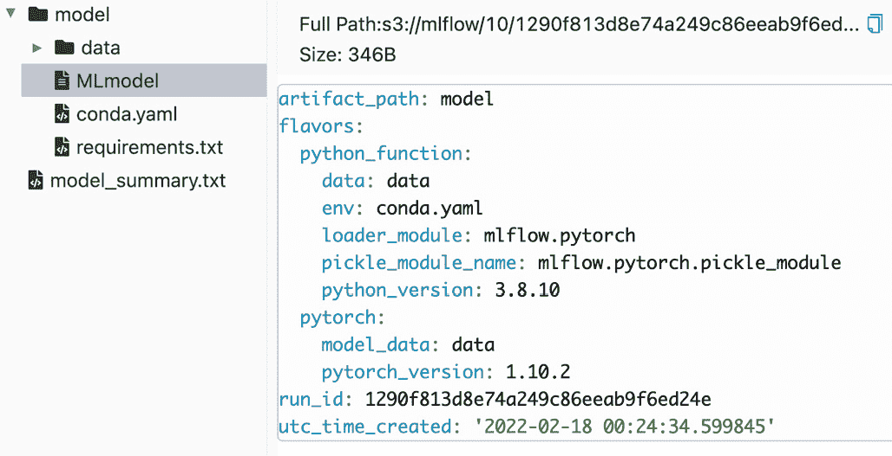
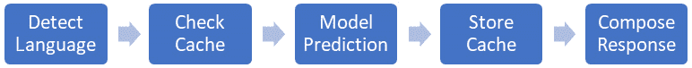
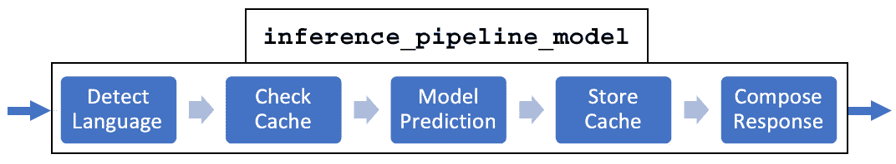
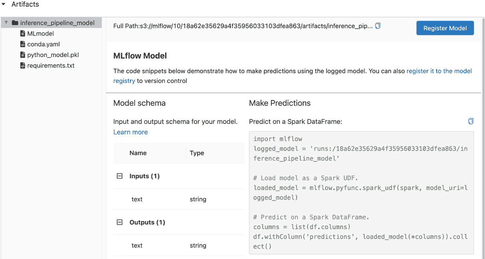
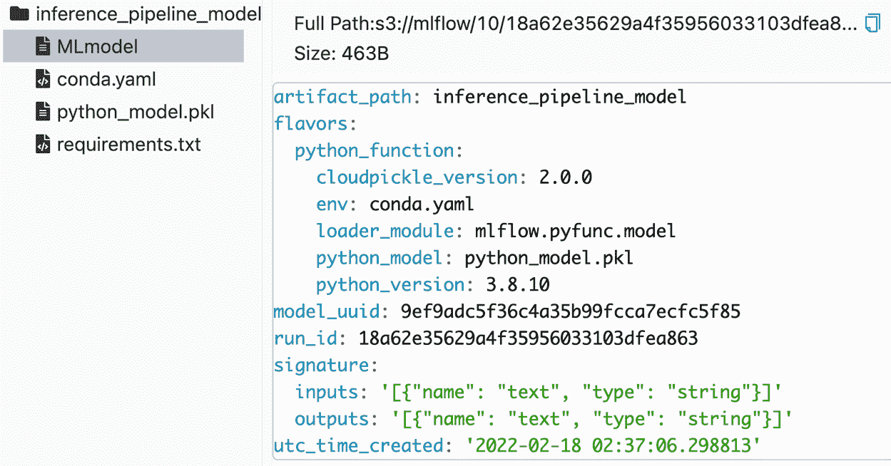
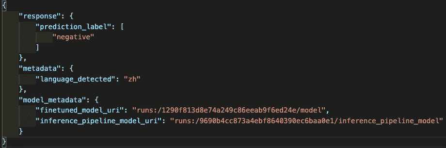
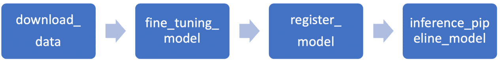

# 第七章：多步骤深度学习推理管道

现在我们已经成功运行了**HPO**（**超参数优化**），并生成了一个经过良好调优、满足业务需求的深度学习模型，是时候迈向下一步，开始使用这个模型进行预测。此时，模型推理管道便发挥了作用，模型将用于在生产环境中预测或评分真实数据，无论是实时模式还是批处理模式。然而，推理管道通常不仅仅依赖单一模型，还需要一些在模型开发阶段可能未见过的预处理和后处理逻辑。预处理步骤的例子包括在将输入数据传递给模型进行评分之前，检测语言区域（英语或其他语言）。后处理可能包括用额外的元数据来丰富预测标签，以满足业务应用的需求。还有一些深度学习推理管道模式，甚至可能涉及多个模型的集成，以解决现实世界中的业务问题。许多机器学习项目往往低估了实现生产环境推理管道所需的工作，这可能导致模型在生产环境中的性能下降，甚至在最糟糕的情况下，整个项目失败。因此，在将模型部署到生产环境之前，了解如何识别不同推理管道的模式并正确实现它们是非常重要的。

到本章结束时，你将能够使用 MLflow 自信地实现多步骤推理管道中的预处理和后处理步骤，并为将来章节中的生产环境使用做好准备。

本章将涵盖以下主要内容：

+   理解深度学习推理管道的模式

+   理解 MLflow 模型 Python 函数 API

+   实现自定义 MLflow Python 模型

+   在深度学习推理管道中实现预处理和后处理步骤

+   将推理管道作为主机器学习项目中的新入口点进行实现

# 技术要求

本章的技术要求如下：

+   本章的 GitHub 代码：[`github.com/PacktPublishing/Practical-Deep-Learning-at-Scale-with-MLFlow/tree/main/chapter07`](https://github.com/PacktPublishing/Practical-Deep-Learning-at-Scale-with-MLFlow/tree/main/chapter07)

+   完整的本地 MLflow 跟踪服务器，如在*第三章*《跟踪模型、参数和指标》中所述，*跟踪模型、参数和指标*。

# 理解深度学习推理管道的模式

随着模型开发进入为即将到来的生产使用实现推理管道的阶段，必须理解，拥有一个调优良好的深度学习模型只是商业 AI 战略成功的一半。另一半包括部署、服务、监控以及模型投入生产后的持续改进。设计和实现深度学习推理管道是迈向故事第二阶段的第一步。尽管模型已经在精心挑选的离线数据集上进行了训练、调优和测试，现在它需要以两种方式处理预测：

+   **批量推理**：这通常需要定期或临时执行推理管道，针对一些离线批量的观察数据。生成预测结果的周转时间通常为每天、每周或其他预定的时间安排。

+   **在线推理**：这通常需要一个 Web 服务来实时执行推理管道，为输入数据在不到一秒钟，甚至少于 100 毫秒的时间内生成预测结果，具体取决于用户场景。

请注意，由于执行环境和数据特征可能与离线训练和测试环境不同，因此在核心模型逻辑周围会有额外的预处理或后处理步骤，这些逻辑是在模型训练和调优步骤中开发出来的。需要强调的是，任何可以共享的数据预处理步骤应该同时在训练管道和推理管道中使用，但不可避免地，一些业务逻辑将会介入，这会使推理管道具备额外的预处理和后处理逻辑。例如，在深度学习推理管道中，一个非常常见的步骤是使用缓存来存储并返回基于最近输入的预测结果，这样就不必每次都调用昂贵的模型评估过程。在模型开发阶段，训练/测试管道不需要此步骤。

尽管推理管道的模式仍在不断发展，但现在已经普遍认为，现实生产环境中至少有四种模式：

+   **多步骤管道**：这是该模型在生产中最典型的使用方式，包括在调用模型逻辑之前的一系列预处理步骤，以及在模型评估结果返回之后的一些后处理步骤。虽然从概念上看这很简单，但实现方式仍然可以有所不同。本章将展示如何使用 MLflow 高效地完成这项工作。

+   **模型集成**：这是一个更复杂的场景，其中可以使用多个不同的模型。这些模型可以是相同类型的模型，只是版本不同，用于 A/B 测试，或者是不同类型的模型。例如，在复杂的对话 AI 聊天机器人场景中，需要一个意图分类模型来将用户查询的意图分类到特定类别中。然后，还需要一个内容相关性模型，根据检测到的用户意图检索相关答案并呈现给用户。

+   **业务逻辑和模型**：这通常涉及如何以及从哪里获取模型输入的额外业务逻辑，例如从企业数据库查询用户信息和验证，或者在调用模型之前从特征库中检索预先计算的额外特征。此外，后处理业务逻辑还可以将预测结果转化为某些特定应用的逻辑，并将结果存储在后台存储中。虽然这可以是一个简单的线性多步骤管道，但它也可以迅速变成一个**DAG**（**有向无环图**），在模型调用前后具有多个并行的 fan-in 和 fan-out 任务。

+   **在线学习**：这是生产中最复杂的推理任务之一，其中模型会不断地学习并更新其参数，例如强化学习。

虽然理解生产环境中推理管道复杂性的全局图景是必要的，但本章的目的是学习如何通过强大且通用的 MLflow 模型 API 创建可重用的推理管道构建块，这些构建块可以在多个场景中使用，并能封装预处理和后处理步骤与训练好的模型。感兴趣的读者可以通过这篇文章（[`www.anyscale.com/blog/serving-ml-models-in-production-common-patterns`](https://www.anyscale.com/blog/serving-ml-models-in-production-common-patterns)）和*进一步阅读*部分中的其他参考资料，深入了解生产中的模型模式。

那么，什么是 MLflow 模型 API，如何使用它来实现多步骤推理管道的预处理和后处理逻辑呢？让我们在下一节中了解。

作为 MLflow 模型的多步骤推理管道

在之前的*第三章*中，*跟踪模型、参数和指标*，我们介绍了使用 MLflow **MLproject**的灵活松耦合多步骤管道实现，使我们能够在 MLflow 中显式地执行和跟踪多步骤训练管道。然而，在推理时，希望在已记录的模型库中的训练模型旁边实现轻量级的预处理和后处理逻辑。MLflow 模型 API 提供了一种机制，将训练好的模型与预处理和后处理逻辑封装起来，然后将新封装的模型保存为一个新模型，封装了推理管道逻辑。这统一了使用 MLflow 模型 API 加载原始模型或推理管道模型的方式。这对于使用 MLflow 进行灵活部署至关重要，并为创造性推理管道的构建打开了大门。

## 了解 MLflow 模型 Python 函数 API

MLflow 模型（[`www.mlflow.org/docs/latest/models.html#id25`](https://www.mlflow.org/docs/latest/models.html#id25)）是 MLflow 提供的核心组件之一，用于加载、保存和记录不同类型的模型（例如，`MLmodel`文件：



图 7.1 – 微调 PyTorch 模型的 MLmodel 内容

从*图 7.1*可以看到，该模型的类型是 PyTorch。还有一些关于模型的其他元数据，例如 conda 环境，它定义了运行该模型的依赖项，以及许多其他内容。凭借这些自包含的信息，应该足以使 MLflow 通过`mlflow.pytorch.load_model` API 如下所示加载该模型：

```py
logged_model = f'runs:/{run_id}/model'
model = mlflow.pytorch.load_model(logged_model)
```

这将允许将通过`run_id`记录的 MLflow 运行模型加载回内存并进行推理。现在假设我们有以下场景，需要添加一些预处理逻辑来检查输入文本的语言类型。这需要加载一个语言检测模型（[`amitness.com/2019/07/identify-text-language-python/`](https://amitness.com/2019/07/identify-text-language-python/)），例如**FastText**语言检测器（[`fasttext.cc/`](https://fasttext.cc/)）或谷歌的**Compact Language Detector v3**（[`pypi.org/project/gcld3/`](https://pypi.org/project/gcld3/)）。此外，我们还希望检查是否存在完全相同输入的缓存预测。如果存在，则应该直接返回缓存结果，而不调用耗时的模型预测部分。这是非常典型的预处理逻辑。对于后处理，一个常见的场景是返回预测结果以及有关模型 URI 的一些元数据，以便我们可以调试生产中的任何潜在预测问题。基于这些预处理和后处理逻辑，推理管道现在看起来如下图所示：



图 7.2 – 多步骤推理管道

从*图 7.2*可以看出，这五个步骤包括以下内容：

+   一个原始的、经过微调的预测模型（一个 PyTorch 深度学习模型）

+   一个额外的语言检测模型，这个模型并未包含在我们之前的训练流程中

+   缓存操作（检查缓存并存储到缓存中）以提高响应性能

+   一个响应消息组成步骤

与其将这五个步骤拆分成五个不同的入口点放入**机器学习项目**中（回想一下，**机器学习项目**中的入口点可以是 Python 中的任意执行代码或其他可执行文件），将这多步骤推理管道组合成一个入口点显得更为优雅，因为这些步骤与模型的预测步骤紧密相关。此外，将这些紧密相关的步骤封装成一个推理管道的优点是，我们可以将推理管道保存并作为 MLmodel 工件加载。MLflow 提供了一种通用方法，将这个多步骤推理管道实现为一个新的 Python 模型，同时不会失去在需要时添加额外预处理和后处理功能的灵活性，正如下面的图所示：



图 7.3 – 将多步骤的预处理和后处理逻辑封装到一个新的 MLflow Python 模型中

从*图 7.3*可以看出，如果我们将预处理和后处理逻辑封装成一个新的 MLflow 模型，称为 `inference_pipeline_model`，那么我们可以像加载其他模型一样加载整个推理管道。这还允许我们规范化推理管道的输入和输出格式（称为**模型签名**），这样任何想要使用这个推理管道的人都不需要猜测输入和输出的格式是什么。

在高层次上实现此机制的方式如下：

1.  首先，创建一个自定义的 MLflow `pyfunc`（Python 函数）模型（[`www.mlflow.org/docs/latest/python_api/mlflow.pyfunc.html#creating-custom-pyfunc-models`](https://www.mlflow.org/docs/latest/python_api/mlflow.pyfunc.html#creating-custom-pyfunc-models)）来包装现有的训练模型。具体来说，我们需要超越 MLflow 提供的内置模型类型（[`www.mlflow.org/docs/latest/models.html#built-in-model-flavors`](https://www.mlflow.org/docs/latest/models.html#built-in-model-flavors)），实现一个新的 Python 类，继承自 `mlflow.pyfunc.PythonModel`（[`www.mlflow.org/docs/latest/python_api/mlflow.pyfunc.html#mlflow.pyfunc.PythonModel`](https://www.mlflow.org/docs/latest/python_api/mlflow.pyfunc.html#mlflow.pyfunc.PythonModel)），并在这个新的 Python 类中定义 `predict()` 和（可选的）`load_context()` 方法。

此外，我们可以通过定义模型输入和输出的模式来指定**模型签名**（[`mlflow.org/docs/latest/models.html#model-signature`](https://mlflow.org/docs/latest/models.html#model-signature)）。这些模式可以是基于列的，也可以是基于张量的。强烈建议在生产环境中实现这些模式，以便进行自动输入验证和模型诊断。

1.  然后，在此 MLflow `pyfunc`中实现预处理和后处理逻辑。这些逻辑可能包括缓存、语言检测、响应消息以及其他所需的逻辑。

1.  最后，在 ML 项目中实现推理流水线的入口点，以便我们可以像调用单一模型工件一样调用推理流水线。

现在我们已经理解了 MLflow 自定义 Python 模型的基本原理，来表示一个多步骤的推理流水线，接下来让我们看看如何为我们的 NLP 情感分类模型实现它，预处理和后处理步骤在下文的*图 7.3*中进行了描述。

# 实现自定义 MLflow Python 模型

首先，让我们描述实现一个自定义 MLflow Python 模型的步骤，而不包含任何额外的预处理和后处理逻辑：

1.  首先，确保我们有一个训练好的深度学习模型，准备好用于推理。在本章的学习中，我们将本章的训练流水线`README`文件包含在 GitHub 仓库中，并*设置相应的环境变量*（[`github.com/PacktPublishing/Practical-Deep-Learning-at-Scale-with-MLFlow/blob/main/chapter07/README.md`](https://github.com/PacktPublishing/Practical-Deep-Learning-at-Scale-with-MLFlow/blob/main/chapter07/README.md)）。然后，在命令行中运行以下命令，在本地 MLflow 跟踪服务器上生成一个微调后的模型：

    ```py
    mlflow run . --experiment-name dl_model_chapter07 -P pipeline_steps=download_data,fine_tuning_model
    ```

完成后，您将在 MLflow 跟踪服务器中记录一个微调的深度学习模型。现在，我们将使用记录的模型 URI 作为推理流水线的输入，因为我们将把它封装起来并保存为一个新的 MLflow 模型。记录的模型 URI 类似于以下内容，其中长的随机字母数字字符串是`fine_tuning_model` MLflow 运行的`run_id`，您可以在 MLflow 跟踪服务器中找到：

```py
runs:/1290f813d8e74a249c86eeab9f6ed24e/model
```

1.  一旦您有了训练/微调后的模型，我们就准备好按如下方式实现一个新的自定义 MLflow Python 模型。您可以查看 GitHub 仓库中的`basic_custom_dl_model.py`（[`github.com/PacktPublishing/Practical-Deep-Learning-at-Scale-with-MLFlow/blob/main/chapter07/notebooks/basic_custom_dl_model.py`](https://github.com/PacktPublishing/Practical-Deep-Learning-at-Scale-with-MLFlow/blob/main/chapter07/notebooks/basic_custom_dl_model.py)），以跟随这里概述的步骤：

    ```py
    class InferencePipeline(mlflow.pyfunc.PythonModel):
        def __init__(self, finetuned_model_uri):
            self.finetuned_model_uri = finetuned_model_uri
        def sentiment_classifier(self, row):
            pred_label = self.finetuned_text_classifier.predict({row[0]})
            return pred_label
        def load_context(self, context):
            self.finetuned_text_classifier = mlflow.pytorch.load_model(self.finetuned_model_uri)
        def predict(self, context, model_input):
            results = model_input.apply(
                        self.sentiment_classifier, axis=1,
                        result_type='broadcast')
            return results
    ```

让我们看看我们已经实现了什么。首先，`InferencePipeline`类继承自`MLflow.pyfunc.PythonModel`模块，并实现了如下四个方法：

+   `predict`：这是`mlflow.pyfunc.PythonModel`要求的方法，用于返回预测结果。在这里，`model_input`参数是一个`pandas` DataFrame，其中包含一个需要分类的输入文本列。我们利用`pandas` DataFrame 的`apply`方法来运行`sentiment_classifier`方法，对每一行的文本进行评分，结果是一个 DataFrame，其中每一行都是预测标签。由于我们原始的微调模型不接受`pandas` DataFrame 作为输入（它接受的是文本字符串的列表），我们需要实现一个新的分类器，作为原始模型的封装器。这就是`sentiment_classifier`方法。另一个`context`参数是 MLflow 上下文，用于描述模型工件存储的位置。由于我们将传递一个 MLflow 记录的模型 URI，因此`context`参数在我们的实现中没有使用，因为记录的模型 URI 包含了加载模型所需的所有信息。

+   `sentiment_classifier`：这是一个封装方法，允许通过调用微调后的 DL 模型的预测函数来为输入的每一行`pandas` DataFrame 评分。请注意，我们将行的第一个元素包装成一个列表，以便 DL 模型可以正确地将其用作输入。

+   `init`：这是一个标准的 Python 构造方法。在这里，我们使用它来传入一个之前微调的 DL 模型 URI，`finetuned_model_uri`，以便我们可以在`load_context`方法中加载它。请注意，我们不希望直接在`init`方法中加载模型，因为那样会导致序列化问题（如果你尝试，你会发现直接序列化 DL 模型并不是一件轻松的事情）。由于微调后的 DL 模型已经通过`mlflow.pytorch` API 进行了序列化和反序列化，我们不需要在这里重新发明轮子。推荐的方法是在`load_context`方法中加载模型。

+   `load_context`：此方法在使用`mlflow.pyfunc.load_model` API 加载 MLflow 模型时调用。在构建 Python 模型后立即执行。在这里，我们通过`mlflow.pytorch.load_model` API 加载微调后的 DL 模型。请注意，在此方法中加载的任何模型都可以使用相应的反序列化方法。这将为加载其他模型提供可能性，例如语言检测模型，它可能包含不能通过 Python 序列化协议进行序列化的本地代码（例如，C++代码）。这是 MLflow 模型 API 框架提供的一个优点。

1.  现在，我们有了一个可以接受基于列输入的 MLflow 自定义模型，我们还可以按如下方式定义模型签名：

    ```py
    input = json.dumps([{'name': 'text', 'type': 'string'}])
    output = json.dumps([{'name': 'text', 'type': 'string'}])
    signature = ModelSignature.from_dict({'inputs': input, 'outputs': output})
    ```

这个签名定义了一个输入格式，其中包含一个名为`text`的列，数据类型为`string`，以及一个输出格式，其中包含一个名为`text`的列，数据类型为`string`。`mlflow.models.ModelSignature`类用于创建这个`signature`对象。当我们在 MLflow 中记录新的自定义模型时，将使用此签名对象，正如我们将在下一步中看到的。

1.  接下来，我们可以像使用通用的 MLflow `pyfunc`模型一样，使用`mlflow.pyfunc.log_model` API 将这个新的自定义模型记录到 MLflow 中，代码如下：

    ```py
    MODEL_ARTIFACT_PATH = 'inference_pipeline_model'
    with mlflow.start_run() as dl_model_tracking_run:
        finetuned_model_uri = 'runs:/1290f813d8e74a249c86eeab9f6ed24e/model'
        inference_pipeline_uri = f'runs:/{dl_model_tracking_run.info.run_id}/{MODEL_ARTIFACT_PATH}'
        mlflow.pyfunc.log_model(
          artifact_path=MODEL_ARTIFACT_PATH,
          conda_env=CONDA_ENV,
          python_model=InferencePipeline(
            finetuned_model_uri),
          signature=signature)
    ```

上述代码将把模型记录到 MLflow 跟踪服务器中，根文件夹名为`inference_pipeline_model`，这是因为我们定义了`MODEL_ARTIFACT_PATH`变量并将其值分配给`mlflow.pyfunc.log_model`方法的`artifact_path`参数。我们分配给的其他三个参数如下：

+   `conda_env`：这是定义此自定义模型运行的 conda 环境。在这里，我们可以传递`conda.yaml`文件的绝对路径，该文件位于本章根文件夹中，由`CONDA_ENV`变量定义（此变量的详细信息可以在 GitHub 上找到`basic_custom_dl_model.py`笔记本的源代码中）。

+   `python_model`：在这里，我们调用了刚刚实现的新的`InferencePipeline`类，并传入了`finetuned_model_uri`参数。这样，推理管道就会加载正确的微调模型进行预测。

+   `signature`：我们还传递了刚刚定义的输入和输出的签名，并将其分配给 signature 参数，以便可以记录模型的输入输出架构并进行验证。

提醒一下，确保你将`'runs:/1290f813d8e74a249c86eeab9f6ed24e/model'`值替换为你在*步骤 1*中生成的自己的微调模型 URI，这样代码才能正确加载原始的微调模型。

1.  如果你按照`basic_custom_dl_model.py`逐步执行，直到*步骤 4*，你应该能够在 MLflow 跟踪服务器的**Artifacts**部分找到一个新记录的模型，正如下面截图所示：



图 7.4 – 推理 MLflow 模型，带有模型架构和名为 inference_pipeline_model 的根文件夹

正如*图 7.4*所示，根文件夹的名称（截图左上角）是`inference_pipeline_model`，这是调用`mlflow.pyfunc.log_model`时`artifact_path`参数的指定值。请注意，如果我们没有指定`artifact_path`参数，默认情况下它的值将是`model`。你可以通过查看本章早些时候的*图 7.1*来确认这一点。还要注意，现在在`inference_pipeline_model`文件夹下有一个`MLmodel`文件，我们可以看到其完整内容如下：



图 7.5 – `inference_pipeline_model`的 MLmodel 文件内容

从*图 7.5*中可以看到，在底部附近的`signature`部分是一个新的部分，相较于*图 7.1*有所不同。然而，在模型类型方面还有一些更重要的区别。`inference_pipeline_model`的类型是通用的`mlflow.pyfunc.model`模型，不再是`mlflow.pytorch`模型。事实上，如果你将*图 7.5*与*图 7.1*进行对比，后者是我们的 PyTorch 微调的深度学习模型，你会发现其中有关于`pytorch`及其`model_data`和`pytorch_version`的部分，而这些在*图 7.5*中已经完全消失。对于 MLflow 来说，它并不了解原始的 PyTorch 模型，而只是将其作为新封装的通用 MLflow `pyfunc`模型。这是一个好消息，因为现在我们只需要一个通用的 MLflow `pyfunc` API 来加载模型，无论封装的模型多复杂，或者这个通用的`pyfunc`模型中包含多少额外的预处理和后处理步骤，当我们在下一节中实现时都不成问题。

1.  我们现在可以使用通用的`mlflow.pyfunc.load_model`来加载`inference_pipeline_model`并使用输入的`pandas`数据框进行预测，如下所示：

    ```py
    input = {"text":["what a disappointing movie","Great movie"]}
    input_df = pd.DataFrame(input)
    with mlflow.start_run():
        loaded_model = \
        mlflow.pyfunc.load_model(inference_pipeline_uri)
        results = loaded_model.predict(input_df)
    ```

这里，`inference_pipeline_uri`是*步骤 4*中生成的 URI，作为`inference_pipeline_model`的唯一标识符。例如，`inference_pipeline_uri`的值可能如下所示：

```py
'runs:/6edf6013d2454f7f8a303431105f25f2/inference_pipeline_model'
```

一旦模型加载完成，我们只需调用`predict`函数对`input_df`数据框进行评分。这会调用我们新实现的`InferencePipleine`类的`predict`函数，如*步骤 2*中所述。结果将类似如下：

![图 7.6 – 推理管道在 pandas 数据框格式中的输出]

](img/B18120_07_06.jpg)

图 7.6 – 推理管道在 pandas 数据框格式中的输出

如果你看到像*图 7.6*中的预测结果，那么你应该为自己感到骄傲，因为你刚刚实现了一个功能强大的自定义 MLflow Python 模型，这个模型具有巨大的灵活性和能力，使我们能够在不更改任何日志记录和加载模型部分的情况下，实施预处理和后处理逻辑，正如我们将在下一节中看到的那样。

创建一个新的 MLflow 自定义模型类型

正如本章所示，我们可以使用已经训练好的模型构建一个封装的 MLflow 自定义模型进行推理。需要注意的是，也可以为训练目的构建一个全新的 MLflow 自定义模型版本。这在你有一个尚未被内置 MLflow 模型版本支持的模型时是必要的。例如，如果你想基于自己的语料库训练一个全新的 **FastText** 模型，但截至 MLflow 1.23.1 版本，还没有 **FastText** 的 MLflow 模型版本，那么你可以构建一个新的 **FastText** MLflow 模型版本（参见参考：`medium.com/@pennyqxr/how-save-and-load-fasttext-model-in-mlflow-format-37e4d6017bf0`）。有兴趣的读者还可以在本章末尾的*进一步阅读*部分找到更多参考资料。

# 在深度学习推理管道中实现预处理和后处理步骤

现在我们有了一个基本的通用 MLflow Python 模型，可以对输入的 `pandas` DataFrame 进行预测，并在另一个 `pandas` DataFrame 中生成输出，我们已经准备好处理之前提到的多步骤推理场景。请注意，尽管上一节中的初始实现看起来可能没有什么突破性，但它为实现之前无法实现的预处理和后处理逻辑打开了大门，同时仍然保持使用通用的 `mlflow.pyfunc.log_model` 和 `mlflow.pyfunc.load_model` 将整个推理管道视为一个通用的 `pyfunc` 模型的能力，无论原始的深度学习模型有多复杂，或者有多少额外的预处理和后处理步骤。让我们在本节中看看如何做到这一点。你可能想查看 GitHub 上的 VS Code 笔记本中的 `multistep_inference_model.py` 来跟随本节中的步骤：[`github.com/PacktPublishing/Practical-Deep-Learning-at-Scale-with-MLFlow/blob/main/chapter07/notebooks/multistep_inference_model.py`](https://github.com/PacktPublishing/Practical-Deep-Learning-at-Scale-with-MLFlow/blob/main/chapter07/notebooks/multistep_inference_model.py)。

在*图 7.3*中，我们描述了模型预测之前的两个预处理步骤，以及模型预测之后的两个后处理步骤。那么，在保持整个推理管道作为单个 MLflow 模型的同时，在哪里以及如何添加预处理和后处理逻辑呢？事实证明，主要的改动会发生在上一节实现的 `InferencePipeline` 类中。让我们在以下小节中一步步梳理实现和变化。

## 实现语言检测预处理逻辑

首先让我们实现语言检测的预处理逻辑：

1.  为了检测输入文本的语言类型，我们可以使用 Google 的`pyfunc`模型。好消息是，MLflow 的`load_context`方法允许我们加载此模型，而无需担心序列化和反序列化。我们只需在`InferencePipeline`类的`load_context`方法中添加两行代码，如下所示，以加载语言检测器模型：

    ```py
    import gcld3
    self.detector = gcld3.NNetLanguageIdentifier(
        min_num_bytes=0,
        max_num_bytes=1000)
    ```

上述两行代码被添加到了`load_context`方法中，此外还有先前用于加载情感分类微调深度学习模型的语句。这样，语言检测器将在`InferencePipeline`类初始化完成后立即加载。该语言检测器将使用输入的前 1,000 个字节来确定语言类型。一旦语言检测器加载完成，我们就可以在预处理方法中使用它来检测语言。

1.  在语言检测的预处理方法中，我们将接受每一行输入文本，检测语言，并返回语言类型作为`string`，如下所示：

    ```py
    def preprocessing_step_lang_detect(self, row):
        language_detected = \
        self.detector.FindLanguage(text=row[0])
        if language_detected.language != 'en':
            print("found Non-English Language text!")
        return language_detected.language
    ```

实现非常直接。我们还添加了一个打印语句，用于查看是否有非英语文本输入到控制台。如果您的业务逻辑需要在处理某些特定语言时执行预防性操作，您可以在此方法中添加更多逻辑。在这里，我们只是返回检测到的语言类型。

1.  然后，在`sentiment_classifier`方法中，为每一行输入打分，我们可以在预测之前添加一行代码，首先检测语言，如下所示：

    ```py
    language_detected = self.preprocessing_step_lang_detect(row)
    ```

然后，我们将`language_detected`变量传递给响应，如我们将在后处理逻辑实现中看到的那样。

这就是将语言检测作为推理管道中的预处理步骤实现的全部过程。

现在让我们看看如何实现另一个步骤：缓存，这需要同时进行预处理（检测是否存在任何预先匹配的预测结果）和后处理（将输入和预测结果的键值对存储到缓存中）。

## 实现缓存的预处理和后处理逻辑

让我们看看如何在`InferencePipeline`类中实现缓存：

1.  我们可以添加一个新语句，在`init`方法中初始化缓存存储，因为它没有问题被序列化或反序列化：

    ```py
    from cachetools import LRUCache
    self.cache = LRUCache(100)
    ```

这将初始化一个带有 100 个对象的最近最少使用（LRU）缓存。

1.  接下来，我们将添加一个预处理方法来检测输入是否在缓存中：

    ```py
    def preprocessing_step_cache(self, row):
        if row[0] in self.cache:
            print("found cached result")
            return self.cache[row[0]]
    ```

如果它在缓存中找到与输入行完全匹配的键，那么它将返回缓存的值。

1.  在`sentiment_classifier`方法中，我们可以添加预处理步骤来检查缓存，如果找到缓存，它将立即返回缓存的响应，而无需调用昂贵的深度学习模型分类器：

    ```py
        cached_response = self.preprocessing_step_cache(row)
        if cached_response is not None:
            return cached_response
    ```

这个预处理步骤应该作为 `sentiment_classifier` 方法中的第一步，在进行语言检测和模型预测之前放置。当输入中有大量重复项时，这可以显著加快实时预测响应的速度。

1.  同样在 `sentiment_classifier` 方法中，我们需要添加一个后处理步骤，将新的输入和预测响应存储在缓存中：

    ```py
    self.cache[row[0]]=response
    ```

就是这样。我们已经成功地将缓存添加为 `InferencePipeline` 类中的预处理和后处理步骤。

## 实现响应组成的后处理逻辑

现在让我们看看如何在原始深度学习模型预测被调用并返回结果后，作为后处理步骤实现响应组成逻辑。仅仅返回 `positive` 或 `negative` 的预测标签通常是不够的，因为我们希望知道使用的是哪个版本的模型，以及在生产环境中进行调试和诊断时检测到的语言。推理管道对调用者的响应将不再是简单的字符串，而是一个序列化的 JSON 字符串。按照以下步骤实现这个后处理逻辑：

1.  在 `InferencePipeline` 类的 `init` 方法中，我们需要添加一个新的 `inference_pipeline_uri` 参数，以便捕获该通用 MLflow `pyfunc` 模型的引用，进行溯源跟踪。`finetuned_model_uri` 和 `inference_pipeline_uri` 两个参数将成为响应 JSON 对象的一部分。`init` 方法现在看起来如下：

    ```py
    def __init__(self, 
                 finetuned_model_uri,
                 inference_pipeline_uri=None):
        self.cache = LRUCache(100)
        self.finetuned_model_uri = finetuned_model_uri
        self.inference_pipeline_uri = inference_pipeline_uri
    ```

1.  在 `sentiment_classifier` 方法中，添加一个新的后处理语句，以根据检测到的语言、预测标签以及包含 `finetuned_model_uri` 和 `inference_pipeline_uri` 的模型元数据来组成新的响应：

    ```py
    response = json.dumps({
                    'response': {
                        'prediction_label': pred_label
                    },
                    'metadata': {
                        'language_detected': language_detected,
                    },
                    'model_metadata': {
                        'finetuned_model_uri': self.finetuned_model_uri,
                        'inference_pipeline_model_uri': self.inference_pipeline_uri
                    },
                })                    
    ```

请注意，我们使用 `json.dumps` 将嵌套的 Python 字符串对象编码为 JSON 格式的字符串，以便调用者可以轻松地使用 JSON 工具解析响应。

1.  在 `mlflow.pyfunc.log_model` 语句中，我们需要在调用 `InferencePipeline` 类时添加一个新的 `inference_pipeline_uri` 参数：

    ```py
    mlflow.pyfunc.log_model(
      artifact_path=MODEL_ARTIFACT_PATH,
      conda_env=CONDA_ENV,
      python_model=InferencePipeline(finetuned_model_uri,
      inference_pipeline_uri),
      signature=signature)
    ```

这将记录一个新的推理管道模型，包含我们实现的所有附加处理逻辑。这完成了图 *7.3* 中描述的多步骤推理管道的实现。

请注意，一旦模型记录了所有这些新步骤，要使用这个新的推理管道，即加载这个模型，不需要任何代码修改。我们可以像以前一样加载新记录的模型：

```py
loaded_model = mlflow.pyfunc.load_model(inference_pipeline_uri)
```

如果你已经按照步骤进行到现在，你应该也逐步运行了 `multistep_inference_model.py` 的 VS Code notebook，直到本小节描述的*第 3 步*。现在我们可以尝试使用这个新的多步骤推理管道进行测试。我们可以准备一组新的输入数据，其中包含重复项和一个非英语文本字符串，如下所示：

```py
input = {"text":["what a disappointing movie", "Great movie", "Great movie", "很好看的电影"]}
input_df = pd.DataFrame(input)
```

这个输入包含了两个重复项（`Great movie`）和一个中文文本字符串（输入列表中的最后一个元素，其中文本含义与`Great Movie`相同）。现在我们只需要加载模型并像之前一样调用`results = loaded_model.predict(input_df)`。在执行该预测语句时，你应该能在控制台输出中看到以下两条语句：

```py
found cached result 
found Non-English language text.
```

这意味着我们的缓存和语言检测器工作正常！

我们也可以通过以下代码打印输出结果，以便再次检查我们的多步骤管道是否正常工作：

```py
for i in range(results.size):
    print(results['text'][i])
```

这将打印出响应中每一行的完整内容。在这里，我们以最后一行（包含中文文本）作为示例进行展示：



图 7.7 – 使用多步骤推理管道处理中文文本字符串输入的 JSON 响应

如*图 7.7*所示，`prediction_label`包含在响应中（其值为`negative`）。由于我们在 JSON 响应中的`metadata`部分使用了`language_detected`字段，我们看到了字符串`"zh"`，表示中文。这是语言检测器在预处理步骤中生成的结果。此外，`model_metadata`部分包括了原始的`finetuned_model_uri`和`inference_pipeline_model_uri`。这些是与 MLflow 追踪服务器相关的 URI，我们可以用它们来唯一地追踪和识别使用了哪个微调模型和推理管道来进行此预测结果。这对于生产环境中的溯源跟踪和诊断分析非常重要。将这个完整的 JSON 输出与*图 7.6*中的早期预测标签输出进行比较，可以看出它为推理管道的使用者提供了更丰富的上下文信息。

如果你在笔记本中看到类似*图 7.7*的 JSON 输出，给自己鼓掌，因为你刚刚完成了实现一个可以重用并部署到生产环境中的多步骤推理管道的重大里程碑，适用于现实的商业场景。

# 将推理管道作为新入口点实现到主 MLproject 中

现在我们已经成功地将多步骤推理管道作为新的自定义 MLflow 模型实现，我们可以更进一步，将其作为主**MLproject**中的一个新入口点，这样我们就可以运行整个管道的端到端流程（*图 7.8*）。请查看本章代码，访问 GitHub 以在本地环境中运行管道。



图 7.8 – 使用 MLproject 的端到端管道

我们可以将新的入口点`inference_pipeline_model`添加到`MLproject`文件中。你可以在 GitHub 仓库中查看这个文件（[`github.com/PacktPublishing/Practical-Deep-Learning-at-Scale-with-MLFlow/blob/main/chapter07/MLproject`](https://github.com/PacktPublishing/Practical-Deep-Learning-at-Scale-with-MLFlow/blob/main/chapter07/MLproject)）：

```py
inference_pipeline_model:
    parameters:
      finetuned_model_run_id: { type: str, default: None }
    command: "python pipeline/inference_pipeline_model.py --finetuned_model_run_id {finetuned_model_run_id}"
```

这个入口点或步骤可以独立调用，也可以作为整个管道的一部分，如*图 7.8*所示。提醒一下，执行 MLflow `run`命令之前，请确保按照本章`README`文件中所述，已设置 MLflow 跟踪服务器和后端存储 URI 的环境变量。此步骤会记录并注册一个新的`inference_pipeline_model`，该模型本身包含多步预处理和后处理逻辑。如果你知道`finetuned_model_run_id`，可以使用以下命令在`chapter07`文件夹的根目录下运行此步骤：

```py
mlflow run . -e inference_pipeline_model  --experiment-name dl_model_chapter07 -P finetuned_model_run_id=07b900a96af04037a956c74ef691396e
```

这不仅会在 MLflow 跟踪服务器中记录一个新的`inference_pipeline_model`，还会在 MLflow 模型注册表中注册一个新的`inference_pipeline_model`版本。你可以通过以下链接在本地 MLflow 服务器中找到注册的`inference_pipeline_model`：

```py
http://localhost/#/models/inference_pipeline_model/
```

作为示例，以下截图展示了注册的`inference_pipeline_model`版本 6：


图 7.9 – 注册的`inference_pipeline_model`，版本 6

你也可以按如下方式运行整个端到端管道，如*图 7.8*所示：

```py
mlflow run . --experiment-name dl_model_chapter07
```

这将执行这个端到端管道中的所有步骤，并最终在模型注册表中记录并注册`inference_pipeline_model`。

`inference_pipeline_model.py`的 Python 代码实现，在调用入口点`inference_pipeline_model`时执行，基本上是复制了我们在 VS Code 笔记本中为`multistep_inference_model.py`实现的`InferencePipeline`类，并进行了一些小的修改，具体如下：

+   添加一个任务函数，作为此步骤的参数化入口点执行：

    ```py
    def task(finetuned_model_run_id, pipeline_run_name):
    ```

这个函数的作用是启动一个新的 MLflow 运行，以记录和注册一个新的推理管道模型。

+   通过如下方式启用在记录时的模型注册：

    ```py
    mlflow.pyfunc.log_model(
        artifact_path=MODEL_ARTIFACT_PATH,
        conda_env=CONDA_ENV,          
        python_model=InferencePipeline(
            finetuned_model_uri, 
            inference_pipeline_uri),
        signature=signature,
        registered_model_name=MODEL_ARTIFACT_PATH)
    ```

请注意，我们将`MODEL_ARTIFACT_PATH`的值（即`inference_pipeline_model`）分配给`registered_model_name`。这使得模型可以在 MLflow 模型注册表中以这个名字注册，如*图 7.9*所示。

这个新入口点的完整代码可以在 GitHub 仓库中找到：[`github.com/PacktPublishing/Practical-Deep-Learning-at-Scale-with-MLFlow/blob/main/chapter07/pipeline/inference_pipeline_model.py`](https://github.com/PacktPublishing/Practical-Deep-Learning-at-Scale-with-MLFlow/blob/main/chapter07/pipeline/inference_pipeline_model.py)。

请注意，我们还需要在 `main.py` 文件中添加一个新部分，以便 `inference_pipeline_model` 入口点也可以从 `main` 入口点内调用。实现方法非常简单，类似于之前在 *第四章* *追踪代码和数据版本控制* 中描述的添加其他步骤。感兴趣的读者可以查看 GitHub 上的 `main.py` 文件，了解实现细节：[`github.com/PacktPublishing/Practical-Deep-Learning-at-Scale-with-MLFlow/blob/main/chapter07/main.py`](https://github.com/PacktPublishing/Practical-Deep-Learning-at-Scale-with-MLFlow/blob/main/chapter07/main.py)。

本章完成了在 **MLproject** 中添加一个新入口点的实现，以便我们可以使用 MLflow run 命令工具运行多步骤的推理管道创建、日志记录和注册。

# 总结

本章介绍了使用 MLflow 的自定义 Python 模型方法（即 `mlflow.pyfunc.PythonModel`）创建多步骤推理管道这一非常重要的主题。

我们讨论了生产环境中四种推理工作流模式，其中通常单一的训练模型不足以完成业务应用需求。很有可能在模型训练和开发阶段没有看到一些预处理和后处理逻辑。这就是为什么 MLflow 的 `pyfunc` 方法是一种优雅的方式，能够实现一个自定义的 MLflow 模型，该模型可以在训练好的深度学习模型之外，加入额外的预处理和后处理逻辑。

我们成功实现了一个推理管道模型，它将我们的深度学习情感分类器与谷歌的紧凑型语言检测器（Compact Language Detector）、缓存以及除预测标签外的其他模型元数据结合。我们更进一步，将推理管道模型的创建步骤融入到端到端的模型开发工作流中，以便通过一个 MLflow run 命令生成一个注册的推理管道模型。

本章中学习的技能和课程对任何希望使用 MLflow `pyfunc` 方法实现真实推理管道的人来说都至关重要。这也为支持灵活且强大的生产环境部署打开了大门，相关内容将在下一章中讨论。

# 进一步阅读

+   *MLflow 模型*（MLflow 文档）：[`www.mlflow.org/docs/latest/models.html#`](https://www.mlflow.org/docs/latest/models.html#)

+   *在 MLflow 中实现 statsmodels 模型类型*：[`blog.stratio.com/implementing-the-statsmodels-flavor-in-mlflow/`](https://blog.stratio.com/implementing-the-statsmodels-flavor-in-mlflow/)

+   *InferLine: ML 推理管道构建框架*：[`www2.eecs.berkeley.edu/Pubs/TechRpts/2018/EECS-2018-76.pdf`](https://www2.eecs.berkeley.edu/Pubs/TechRpts/2018/EECS-2018-76.pdf)

+   *批量推理与在线推理*： [`mlinproduction.com/batch-inference-vs-online-inference/`](https://mlinproduction.com/batch-inference-vs-online-inference/)

+   *构建小型 MLOps 流水线的经验教训*： [`www.nestorsag.com/blog/lessons-from-building-a-small-ml-ops-pipeline/`](https://www.nestorsag.com/blog/lessons-from-building-a-small-ml-ops-pipeline/)

+   *在 Hugging Face 上使用 MLflow 的文本摘要器*： [`vishsubramanian.me/hugging-face-with-mlflow/`](https://vishsubramanian.me/hugging-face-with-mlflow/)
