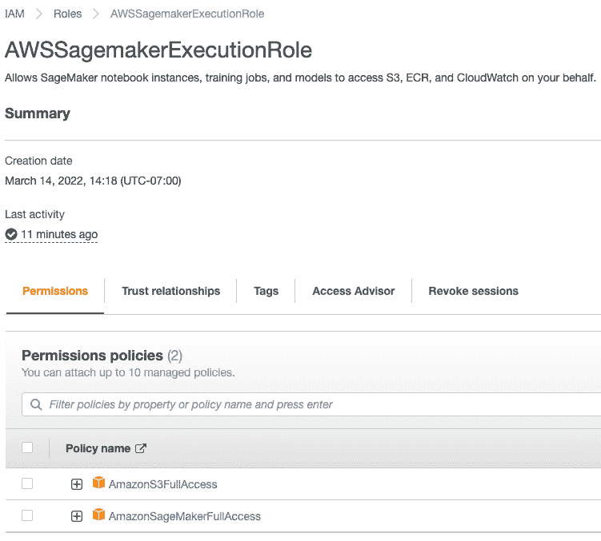

# 第八章：在大规模环境下部署深度学习推理管道

部署 **深度学习**（**DL**）推理管道以供生产使用既令人兴奋又具有挑战性。令人兴奋的部分是，最终深度学习模型管道可以用来对真实生产数据进行预测，为商业场景提供真正的价值。然而，具有挑战性的一点是，有不同的深度学习模型服务平台和托管环境。选择适合的框架来应对合适的模型服务场景并不容易，这需要在最小化部署复杂性的同时提供可扩展、成本效益高的最佳模型服务体验。本章将介绍不同的部署场景和托管环境的概述，然后提供实际操作，学习如何使用 MLflow 部署工具部署到不同的环境，包括本地和远程云环境。到本章结束时，您应该能够自信地将 MLflow 深度学习推理管道部署到各种托管环境中，用于批处理或实时推理服务。

在本章中，我们将讨论以下主要内容：

+   了解部署和托管环境的全貌

+   本地部署用于批处理和 Web 服务推理

+   使用 Ray Serve 和 MLflow 部署插件进行部署

+   部署到 AWS SageMaker – 完整的端到端指南

# 技术要求

本章学习所需的项目：

+   本章的 GitHub 仓库代码：[`github.com/PacktPublishing/Practical-Deep-Learning-at-Scale-with-MLFlow/tree/main/chapter08`](https://github.com/PacktPublishing/Practical-Deep-Learning-at-Scale-with-MLFlow/tree/main/chapter08)。

+   Ray Serve 和 `mlflow-ray-serve` 插件: [`github.com/ray-project/mlflow-ray-serve`](https://github.com/ray-project/mlflow-ray-serve)。

+   AWS SageMaker：您需要拥有一个 AWS 账户。您可以通过 [`aws.amazon.com/free/`](https://aws.amazon.com/free/) 轻松创建一个免费的 AWS 账户。

+   AWS **命令行界面**（**CLI**）：[`docs.aws.amazon.com/cli/latest/userguide/getting-started-install.html`](https://docs.aws.amazon.com/cli/latest/userguide/getting-started-install.html)。

+   Docker Desktop: [`www.docker.com/products/docker-desktop/`](https://www.docker.com/products/docker-desktop/)。

+   完成本书中*第七章*《多步骤深度学习推理管道》的示例。这将为您提供一个可以在本章中使用的可部署推理管道。

# 了解不同的部署工具和托管环境

在 MLOps 技术栈中有不同的部署工具，针对不同的目标用例和主机环境来部署不同的模型推断管道。在*第七章*，*多步骤深度学习推断管道*，我们学习了不同的推断场景和要求，并实现了一个可以部署到模型托管/服务环境中的多步骤 DL 推断管道。现在，我们将学习如何将这样的模型部署到几个特定的模型托管和服务环境中。这在*图 8.1*中如下所示：


图 8.1 – 使用模型部署工具将模型推断管道部署到模型托管和服务环境

如图 8.1 所示，针对不同的模型托管和服务环境可能存在不同的部署工具。在这里，我们列出了三种典型的场景如下：

+   **规模化批量推断**：如果我们想要定期进行批量推断，我们可以使用 PySpark 的**用户定义函数**（**UDF**）加载一个 MLflow 模型格式来执行此操作，因为我们可以利用 Spark 在分布式集群上的可扩展计算方法（[`mlflow.org/docs/latest/models.html#export-a-python-function-model-as-an-apache-spark-udf`](https://mlflow.org/docs/latest/models.html#export-a-python-function-model-as-an-apache-spark-udf)）。我们将在下一节中展示如何做到这一点的示例。

+   **规模化流式推断**：这通常需要一个托管**模型即服务**（**MaaS**）的端点。存在许多用于生产级部署和模型服务的工具和框架。在我们开始学习如何在本章中进行这种类型的部署之前，我们将在本节比较几种工具，以了解它们的工作方式及其与 MLflow 集成的情况。

+   **设备上的模型推断**：这是一个称为**TinyML**的新兴领域，它在资源有限的环境中部署 ML/DL 模型，例如移动设备、传感器或边缘设备（[`www.kdnuggets.com/2021/11/on-device-deep-learning-pytorch-mobile-tensorflow-lite.html`](https://www.kdnuggets.com/2021/11/on-device-deep-learning-pytorch-mobile-tensorflow-lite.html)）。两个流行的框架是 PyTorch Mobile（[`pytorch.org/mobile/home/`](https://pytorch.org/mobile/home/)）和 TensorFlow Lite（[`www.tensorflow.org/lite`](https://www.tensorflow.org/lite)）。这不是本书的重点。建议您在本章结束时查看一些进一步阅读材料。

现在，让我们看看有哪些工具可用于将模型推断部署为服务，特别是那些支持 MLflow 模型部署的工具。有三种类型的模型部署和服务工具，如下所示：

+   **MLflow 内置模型部署**：这是 MLflow 发布时自带的功能，包括部署到本地 Web 服务器、AWS SageMaker 和 Azure ML。Databricks 上也有一个托管的 MLflow，支持模型服务，在本书写作时处于公开审阅阶段，我们不会在本书中涵盖该内容，因为它在官方 Databricks 文档中已经有很好的展示（感兴趣的读者可以在此网站查阅有关该 Databricks 功能的官方文档：[`docs.databricks.com/applications/mlflow/model-serving.html`](https://docs.databricks.com/applications/mlflow/model-serving.html)）。不过，在本章中，我们将展示如何使用 MLflow 内置的模型部署功能，将模型部署到本地和远程的 AWS SageMaker。

+   `mlflow-torchserv`（[`github.com/mlflow/mlflow-torchserve`](https://github.com/mlflow/mlflow-torchserve)），`mlflow-ray-serve`（[`github.com/ray-project/mlflow-ray-serve`](https://github.com/ray-project/mlflow-ray-serve)），以及`mlflow-triton-plugin`（[`github.com/triton-inference-server/server/tree/v2.17.0/deploy/mlflow-triton-plugin`](https://github.com/triton-inference-server/server/tree/v2.17.0/deploy/mlflow-triton-plugin)）。在本章中，我们将展示如何使用`mlflow-ray-serve`插件进行部署。

+   使用`mlflow-ray-serve`插件部署 MLflow Python 模型。需要注意的是，尽管在本书中我们展示了如何使用 MLflow 自定义插件通过 Ray Serve 等通用的机器学习服务工具进行部署，但重要的是要注意，无论是否使用 MLflow 自定义插件，通用机器学习服务工具都能做更多的事情。

    通过专门的推理引擎优化深度学习推理

    有一些特殊的 MLflow 模型格式，比如**ONNX**（[`onnx.ai/`](https://onnx.ai/)）和**TorchScript**（[`huggingface.co/docs/transformers/v4.17.0/en/serialization#torchscript`](https://huggingface.co/docs/transformers/v4.17.0/en/serialization#torchscript)），它们专门设计用于深度学习模型推理运行时。我们可以将深度学习模型转换为 ONNX 模型格式（[`github.com/microsoft/onnxruntime`](https://github.com/microsoft/onnxruntime)）或 TorchScript 服务器（[`pytorch.org/serve/`](https://pytorch.org/serve/)）。由于 ONNX 和 TorchScript 仍在发展中，并且它们是专门为原始深度学习模型部分设计的，而不是整个推理管道，因此我们在本章中不会涵盖它们。

现在我们已经很好地理解了各种部署工具和模型服务框架，接下来让我们通过具体示例学习如何进行部署。

# 本地部署用于批量推理和 Web 服务推理

在开发和测试过程中，我们通常需要将模型本地部署以验证其是否按预期工作。我们来看看如何在两种场景下进行部署：批量推理和 Web 服务推理。

## 批量推理

对于批量推理，请按照以下说明操作：

1.  请确保您已完成*第七章*，*多步骤深度学习推理管道*。这将生成一个 MLflow `pyfunc`深度学习推理模型管道 URI，可以通过标准的 MLflow Python 函数加载。已记录的模型可以通过`run_id`和模型名称唯一定位，如下所示：

    ```py
    logged_model = 'runs:/37b5b4dd7bc04213a35db646520ec404/inference_pipeline_model'
    ```

模型还可以通过模型注册表中的模型名称和版本号进行识别，如下所示：

```py
logged_model = 'models:/inference_pipeline_model/6'
```

1.  按照`README.md`文件中*使用 PySpark UDF 函数进行批量推理*部分的说明（[`github.com/PacktPublishing/Practical-Deep-Learning-at-Scale-with-MLFlow/blob/main/chapter08/README.md`](https://github.com/PacktPublishing/Practical-Deep-Learning-at-Scale-with-MLFlow/blob/main/chapter08/README.md)），设置本地虚拟环境、完整的 MLflow 跟踪服务器和一些环境变量，以便我们能够在本地环境中执行代码。

1.  使用 MLflow 的`mlflow.pyfunc.spark_udf` API 加载模型，以创建一个 PySpark UDF 函数，如下所示。您可能需要查看 GitHub 上的`batch_inference.py`文件来跟进：[`github.com/PacktPublishing/Practical-Deep-Learning-at-Scale-with-MLFlow/blob/main/chapter08/batch/batch_inference.py`](https://github.com/PacktPublishing/Practical-Deep-Learning-at-Scale-with-MLFlow/blob/main/chapter08/batch/batch_inference.py)：

    ```py
    loaded_model = mlflow.pyfunc.spark_udf(spark, model_uri=logged_model, result_type=StringType())
    ```

这将把推理管道封装为一个返回结果类型为`String`的 PySpark UDF 函数。这是因为我们的模型推理管道具有一个模型签名，要求输出为`string`类型的列。

1.  现在，我们可以将 PySpark UDF 函数应用于输入的 DataFrame。请注意，输入的 DataFrame 必须包含一个`text`列，并且该列的数据类型必须为`string`，因为这是模型签名的要求：

    ```py
    df = df.withColumn('predictions', loaded_model())
    ```

因为我们的模型推理管道已经定义了模型签名，所以如果输入的 DataFrame 中包含`text`列（在本示例中是`df`），我们就不需要指定任何列参数。请注意，我们可以使用 Spark 的`read` API 读取大量数据，支持多种数据格式，如 CSV、JSON、Parquet 等。在我们的示例中，我们从 IMDB 数据集读取了`test.csv`文件。如果数据量较大，这将利用 Spark 强大的分布式计算在集群上执行。这使得我们可以轻松地进行大规模的批量推理。

1.  要从头到尾运行批量推理代码，您应该查看存储库中提供的完整代码，地址为：[`github.com/PacktPublishing/Practical-Deep-Learning-at-Scale-with-MLFlow/blob/main/chapter08/batch/batch_inference.py`](https://github.com/PacktPublishing/Practical-Deep-Learning-at-Scale-with-MLFlow/blob/main/chapter08/batch/batch_inference.py)。确保在`batch`文件夹中运行以下命令之前，将`logged_model`变量替换为您自己的`run_id`和模型名称，或注册的模型名称和版本：

    ```py
    python batch_inference.py
    ```

1.  你应该能在屏幕上看到*图 8.2*中的输出：


图 8.2 – 使用 PySpark UDF 函数进行批量推理

从*图 8.2*中可以看到，我们加载的多步推理管道工作正常，甚至能够检测到非英文文本和重复内容，尽管语言检测器可能会产生一些误报。输出是一个两列的 DataFrame，其中模型预测的 JSON 响应保存在 `predictions` 列中。请注意，你可以在 Databricks notebook 中使用 `batch_inference.py` 中提供的相同代码，通过更改输入数据和已记录模型的位置，利用 Spark 集群处理大量的输入数据。

现在我们已经知道如何进行大规模的批量推理，让我们来看看如何将相同的模型推理管道部署到本地 web 服务中。

## 模型作为 web 服务

我们可以将相同的已记录模型推理管道部署到本地的 web 服务中，并拥有一个接受 HTTP 请求并返回 HTTP 响应的端点。

本地部署非常简单，只需要一条命令。我们可以使用模型 URI 来部署已记录的模型或注册的模型，就像之前的批量推理一样，具体如下：

```py
mlflow models serve -m models:/inference_pipeline_model/6
```

你应该能够看到如下内容：

```py
2022/03/06 21:50:19 INFO mlflow.models.cli: Selected backend for flavor 'python_function'
2022/03/06 21:50:21 INFO mlflow.utils.conda: === Creating conda environment mlflow-a0968092d20d039088e2875ad04bbaa0f3a75206 ===
± |main U:1 ?:8 X| done
Solving environment: done
```

这将使用已记录的模型创建 conda 环境，确保其拥有运行所需的所有依赖项。创建完 conda 环境后，你应该会看到如下内容：

```py
2022/03/06 21:52:11 INFO mlflow.pyfunc.backend: === Running command 'source /Users/yongliu/opt/miniconda3/bin/../etc/profile.d/conda.sh && conda activate mlflow-a0968092d20d039088e2875ad04bbaa0f3a75206 1>&2 && gunicorn --timeout=60 -b 127.0.0.1:5000 -w 1 ${GUNICORN_CMD_ARGS} -- mlflow.pyfunc.scoring_server.wsgi:app'
[2022-03-06 21:52:12 -0800] [97554] [INFO] Starting gunicorn 20.1.0
[2022-03-06 21:52:12 -0800] [97554] [INFO] Listening at: http://127.0.0.1:5000 (97554)
[2022-03-06 21:52:12 -0800] [97554] [INFO] Using worker: sync
[2022-03-06 21:52:12 -0800] [97561] [INFO] Booting worker with pid: 97561
```

现在，模型已经作为 web 服务部署，并准备好接受 HTTP 请求进行模型预测。打开一个新的终端窗口，输入以下命令调用模型 web 服务来获取预测响应：

```py
curl http://127.0.0.1:5000/invocations -H 'Content-Type: application/json' -d '{
    "columns": ["text"],
    "data": [["This is the best movie we saw."], ["What a movie!"]]
}'
```

我们可以立即看到如下预测响应：

```py
[{"text": "{\"response\": {\"prediction_label\": [\"positive\"]}, \"metadata\": {\"language_detected\": \"en\"}, \"model_metadata\": {\"finetuned_model_uri\": \"runs:/07b900a96af04037a956c74ef691396e/model\", \"inference_pipeline_model_uri\": \"runs:/37b5b4dd7bc04213a35db646520ec404/inference_pipeline_model\"}}"}, {"text": "{\"response\": {\"prediction_label\": [\"positive\"]}, \"metadata\": {\"language_detected\": \"en\"}, \"model_metadata\": {\"finetuned_model_uri\": \"runs:/07b900a96af04037a956c74ef691396e/model\", \"inference_pipeline_model_uri\": \"runs:/37b5b4dd7bc04213a35db646520ec404/inference_pipeline_model\"}}"}]
```

如果你已经按照步骤操作并看到预测结果，你应该为自己感到非常骄傲，因为你刚刚将一个深度学习模型推理管道部署到了本地 web 服务中！这对于测试和调试非常有用，而且在生产环境的 web 服务器上模型的行为不会发生变化，所以我们应该确保它在本地 web 服务器上正常工作。

到目前为止，我们已经学习了如何使用内置的 MLflow 部署工具。接下来，我们将学习如何使用通用的部署工具 Ray Serve 来部署一个 MLflow 推理管道。

# 使用 Ray Serve 和 MLflow 部署插件进行部署

更通用的部署方式是使用像 Ray Serve 这样的框架（[`docs.ray.io/en/latest/serve/index.html`](https://docs.ray.io/en/latest/serve/index.html)）。Ray Serve 有几个优点，例如支持不同的深度学习模型框架、原生 Python 支持以及支持复杂的模型组合推理模式。Ray Serve 支持所有主要的深度学习框架和任何任意的业务逻辑。那么，我们能否同时利用 Ray Serve 和 MLflow 进行模型部署和服务呢？好消息是，我们可以使用 Ray Serve 提供的 MLflow 部署插件来实现这一点。接下来我们将介绍如何使用`mlflow-ray-serve`插件通过 Ray Serve 进行 MLflow 模型部署（[`github.com/ray-project/mlflow-ray-serve`](https://github.com/ray-project/mlflow-ray-serve)）。在开始之前，我们需要安装`mlflow-ray-serve`包：

```py
pip install mlflow-ray-serve
```

接下来，我们需要首先使用以下两个命令在本地启动一个单节点 Ray 集群：

```py
ray start --head
serve start
```

这将在本地启动一个 Ray 集群，并且你可以通过浏览器访问它的仪表板，网址是`http://127.0.0.1:8265/#/`，如下所示：


图 8.3 – 本地运行的 Ray 集群

*图 8.3*展示了一个本地运行的 Ray 集群。然后，你可以执行以下命令将`inference_pipeline_model`部署到 Ray Serve：

```py
mlflow deployments create -t ray-serve -m runs:/63f101fb3700472ca58975488636f4ae/inference_pipeline_model --name dl-inference-model-on-ray -C num_replicas=1
```

这将显示以下屏幕输出：

```py
2022-03-20 20:16:46,564    INFO worker.py:842 -- Connecting to existing Ray cluster at address: 127.0.0.1:6379
2022-03-20 20:16:46,717    INFO api.py:242 -- Updating deployment 'dl-inference-model-on-ray'. component=serve deployment=dl-inference-model-on-ray
(ServeController pid=78159) 2022-03-20 20:16:46,784    INFO deployment_state.py:912 -- Adding 1 replicas to deployment 'dl-inference-model-on-ray'. component=serve deployment=dl-inference-model-on-ray
2022-03-20 20:17:10,309    INFO api.py:249 -- Deployment 'dl-inference-model-on-ray' is ready at `http://127.0.0.1:8000/dl-inference-model-on-ray`. component=serve deployment=dl-inference-model-on-ray
python_function deployment dl-inference-model-on-ray is created
```

这意味着位于`http://127.0.0.1:8000/dl-inference-model-on-ray`的端点已准备好为在线推理请求提供服务！你可以使用以下提供的 Python 代码在`chapter08/ray_serve/query_ray_serve_endpoint.py`中测试这个部署：

```py
python ray_serve/query_ray_serve_endpoint.py
```

这将在屏幕上显示如下结果：

```py
2022-03-20 21:16:45,125    INFO worker.py:842 -- Connecting to existing Ray cluster at address: 127.0.0.1:6379
[{'name': 'dl-inference-model-on-ray', 'info': Deployment(name=dl-inference-model-on-ray,version=None,route_prefix=/dl-inference-model-on-ray)}]
{
    "columns": [
        "text"
    ],
    "index": [
        0,
        1
    ],
    "data": [
        [
            "{\"response\": {\"prediction_label\": [\"negative\"]}, \"metadata\": {\"language_detected\": \"en\"}, \"model_metadata\": {\"finetuned_model_uri\": \"runs:/be2fb13fe647481eafa071b79dde81de/model\", \"inference_pipeline_model_uri\": \"runs:/63f101fb3700472ca58975488636f4ae/inference_pipeline_model\"}}"
        ],
        [
            "{\"response\": {\"prediction_label\": [\"positive\"]}, \"metadata\": {\"language_detected\": \"en\"}, \"model_metadata\": {\"finetuned_model_uri\": \"runs:/be2fb13fe647481eafa071b79dde81de/model\", \"inference_pipeline_model_uri\": \"runs:/63f101fb3700472ca58975488636f4ae/inference_pipeline_model\"}}"
        ]
    ]
}
```

你应该会看到预期的推理模型响应。如果你按照这些步骤操作至此，恭喜你成功通过`mlflow-ray-serve` MLflow 部署插件完成了部署！如果你不再需要这个 Ray Serve 实例，可以通过执行以下命令行来停止它：

```py
ray stop
```

这将停止你本地机器上所有正在运行的 Ray 实例。

使用 MLflow 部署插件进行部署

有几个 MLflow 部署插件。我们刚刚展示了如何使用`mlflow-ray-serve`部署一个通用的 MLflow Python 模型`inference_pipeline_model`。这为将 Ray 集群部署到许多目标目的地打开了大门，你可以在任何云服务提供商上启动 Ray 集群。由于本书的范围限制，我们不会在这一章进一步探讨更多细节。如果你感兴趣，可以参考 Ray 的文档了解如何启动云集群（AWS、Azure 和**Google Cloud Platform**（**GCP**））：[`docs.ray.io/en/latest/cluster/cloud.html#:~:text=The%20Ray%20Cluster%20Launcher%20can,ready%20to%20launch%20your%20cluster`](https://docs.ray.io/en/latest/cluster/cloud.html#:~:text=The%20Ray%20Cluster%20Launcher%20can,ready%20to%20launch%20your%20cluster)。一旦 Ray 集群启动，你可以按照相同的流程部署 MLflow 模型。

现在我们知道了几种在本地部署的方法，并且如果需要的话可以进一步部署到云端，使用 Ray Serve，让我们看看如何在下一节中部署到云管理的推理服务 AWS SageMaker，因为它被广泛使用，并且可以提供在现实场景中如何部署的良好教训。

# 部署到 AWS SageMaker —— 完整的端到端指南

AWS SageMaker 是由 AWS 管理的云托管模型服务。我们将以 AWS SageMaker 为例，展示如何将模型部署到托管 Web 服务的远程云提供商，以服务真实的生产流量。AWS SageMaker 提供了一套包括支持注释和模型训练等在内的 ML/DL 相关服务。在这里，我们展示如何为部署 BYOM（Bring Your Own Model，自带模型）做准备和部署。这意味着您已在 AWS SageMaker 之外训练了模型推理管道，现在只需部署到 SageMaker 进行托管。按照以下步骤准备和部署 DL 情感模型。需要几个先决条件：

+   您必须在本地环境中运行 Docker Desktop。

+   您必须拥有一个 AWS 账户。您可以通过免费注册网站 [`aws.amazon.com/free/`](https://aws.amazon.com/free/) 轻松创建一个免费的 AWS 账户。

一旦满足这些要求，激活 `dl-model-chapter08` 的 conda 虚拟环境，按照以下几个步骤部署到 SageMaker。我们将这些步骤细分为六个子章节如下：

1.  构建本地 SageMaker Docker 镜像

1.  将额外的模型构件层添加到 SageMaker Docker 镜像上

1.  使用新构建的 SageMaker Docker 镜像进行本地部署测试

1.  将 SageMaker Docker 镜像推送到 AWS Elastic Container Registry

1.  部署推理管道模型以创建 SageMaker 终端节点

1.  查询 SageMaker 终端节点进行在线推理

让我们从第一步开始构建本地 SageMaker Docker 镜像。

## 第 1 步：构建本地 SageMaker Docker 镜像

我们故意从本地构建开始，而不是推送到 AWS，这样我们可以学习如何在此基础镜像上添加额外的层，并在本地验证一切，避免产生任何云端费用：

```py
mlflow sagemaker build-and-push-container --build --no-push -c mlflow-dl-inference
```

您将看到大量的屏幕输出，最后会显示类似以下内容：

```py
#15 exporting to image
#15 sha256:e8c613e07b0b7ff33893b694f7759a10 d42e180f2b4dc349fb57dc6b71dcab00
#15 exporting layers
#15 exporting layers 8.7s done
#15 writing image sha256:95bc539b021179e5e87087 012353ebb43c71410be535ef368d1121b550c57bd4 done
#15 naming to docker.io/library/mlflow-dl-inference done
#15 DONE 8.7s
```

如果您看到镜像名称 `mlflow-dl-inference`，那么说明您已成功创建了一个符合 SageMaker 标准的 MLflow 模型服务 Docker 镜像。您可以通过运行以下命令来验证：

```py
docker images | grep mlflow-dl-inference
```

您应该看到类似以下的输出：

```py
mlflow-dl-inference          latest                  95bc539b0211   6 minutes ago   2GB
```

## 第 2 步：将额外的模型构件层添加到 SageMaker Docker 镜像上

回想一下，我们的推理管道模型是基于一个微调的深度学习模型构建的，我们通过 MLflow PythonModel API 的 `load_context` 函数 ([`www.mlflow.org/docs/latest/python_api/mlflow.pyfunc.html#mlflow.pyfunc.PythonModel`](https://www.mlflow.org/docs/latest/python_api/mlflow.pyfunc.html#mlflow.pyfunc.PythonModel)) 加载该模型，而不需要序列化微调后的模型本身。部分原因是因为 MLflow 无法通过 pickle 正确序列化 PyTorch DataLoader ([`pytorch.org/docs/stable/data.html#single-and-multi-process-data-loading`](https://pytorch.org/docs/stable/data.html#single-and-multi-process-data-loading))，因为 DataLoader 从目前的文档来看并不实现 pickle 序列化。这为我们提供了一个机会，去学习当一些依赖项无法正确序列化时，我们该如何进行部署，尤其是在处理现实世界的深度学习模型时。

让 Docker 容器访问 MLflow 跟踪服务器的两种方法

有两种方法可以让 Docker 容器（如 `mlflow-dl-inference`）在运行时访问并加载微调模型。第一种方法是让容器包含 MLflow 跟踪服务器的 URL 和访问令牌。这在企业环境中可能会引发一些安全隐患，因为此时 Docker 镜像中包含了一些安全凭证。第二种方法是直接将所有引用的工件复制到新建的 Docker 镜像中，从而创建一个自给自足的镜像。在运行时，它不需要知道原始 MLflow 跟踪服务器的位置，因为它已将所有模型工件保存在本地。这种自包含的方法消除了任何安全泄露的担忧。在本章中，我们采用了第二种方法进行部署。

本章中，我们将把引用的微调模型复制到一个新的 Docker 镜像中，该镜像基于基础的 `mlflow-dl-inference` Docker 镜像构建。这将创建一个新的自包含 Docker 镜像，无需依赖任何外部的 MLflow 跟踪服务器。为此，你需要将微调的深度学习模型从模型跟踪服务器下载到当前本地文件夹，或者你可以通过使用本地文件系统作为 MLflow 跟踪服务器后端，直接在本地运行我们的 MLproject 流水线。按照 `README.md` 文件中的 *部署到 AWS SageMaker* 部分，重现本地的 MLflow 运行，准备微调模型和本地文件夹中的 `inference-pipeline-model`。为了学习目的，我们在 GitHub 仓库的 `chapter08` 文件夹中提供了两个示例 `mlruns` 工件和 `huggingface` 缓存文件夹 ([`github.com/PacktPublishing/Practical-Deep-Learning-at-Scale-with-MLFlow/tree/main/chapter08`](https://github.com/PacktPublishing/Practical-Deep-Learning-at-Scale-with-MLFlow/tree/main/chapter08))，以便我们可以立即使用这些现有的工件开始构建新的 Docker 镜像。

要构建一个新的 Docker 镜像，我们需要创建一个如下所示的 Dockerfile：

```py
FROM mlflow-dl-inference
```

```py
ADD mlruns/1/meta.yaml  /opt/mlflow/mlruns/1/meta.yaml
```

```py
ADD mlruns/1/d01fc81e11e842f5b9556ae04136c0d3/ /opt/mlflow/mlruns/1/d01fc81e11e842f5b9556ae04136c0d3/
```

```py
ADD tmp/opt/mlflow/hf/cache/dl_model_chapter08/csv/ /opt/mlflow/tmp/opt/mlflow/hf/cache/dl_model_chapter08/csv/
```

第一行表示它从现有的`mlflow-dl-inference` Docker 镜像开始，接下来的三行`ADD`将会复制一个`meta.yaml`文件和两个文件夹到 Docker 镜像中的相应位置。请注意，如果您已经按照`README`文件中的步骤生成了自己的运行实例，则无需添加第三行。需要注意的是，默认情况下，当 Docker 容器启动时，它会自动进入`/opt/mlflow/`工作目录，因此所有内容都需要复制到这个文件夹中以便于访问。此外，请注意`/opt/mlflow`目录需要超级用户权限，因此您需要准备好输入本地机器的管理员密码（通常，在您的个人笔记本电脑上，密码就是您自己的密码）。

将私有构建的 Python 包复制到 Docker 镜像中

还可以将私有构建的 Python 包复制到 Docker 镜像中，这样我们就可以在`conda.yaml`文件中直接引用它们，而无需走出容器。举例来说，我们可以将一个私有的 Python wheel 包`cool-dl-package-1.0.py3-none-any.whl`复制到`/usr/private-wheels/cool-dl-package/cool-dl-package-1.0-py3-none-any.whl` Docker 文件夹中，然后我们可以在`conda.yaml`文件中指向这个路径。这使得 MLflow 模型工件能够成功加载这些本地可访问的 Python 包。在当前的示例中，我们没有使用这种方法，因为我们没有使用任何私有构建的 Python 包。如果您有兴趣探索这个方法，未来参考时会有用。

现在，您可以运行以下命令，在`chapter08`文件夹中构建一个新的 Docker 镜像：

```py
docker build . -t mlflow-dl-inference-w-finetuned-model
```

这将基于`mlflow-dl-inference`构建一个新的 Docker 镜像`mlflow-dl-inference-w-finetuned-model`。您应该能看到以下输出（为了简洁起见，仅展示第一行和最后几行）：

```py
[+] Building 0.2s (9/9) FINISHED
 => [internal] load build definition from Dockerfile                                                      0.0s
…………
=> => naming to docker.io/library/mlflow-dl-inference-w-finetuned-model
```

现在，您已经有了一个名为`mlflow-dl-inference-w-finetuned-model`的新 Docker 镜像，其中包含微调后的模型。现在，我们准备使用这个新的、兼容 SageMaker 的 Docker 镜像来部署我们的推理管道模型。

## 步骤 3：使用新构建的 SageMaker Docker 镜像测试本地部署

在我们将部署到云端之前，让我们先使用这个新的 SageMaker Docker 镜像在本地进行部署测试。MLflow 提供了一种方便的方式来使用以下命令在本地进行测试：

```py
mlflow sagemaker run-local -m runs:/dc5f670efa1a4eac95683633ffcfdd79/inference_pipeline_model -p 5555 -i mlflow-dl-inference-w-finetuned-model
```

这个命令将会在本地启动`mlflow-dl-inference-w-finetuned-model` Docker 容器，并将运行 ID 为`dc5f670efa1a4eac95683633ffcfdd79`的推理管道模型部署到该容器中。

修复潜在的 Docker 错误

请注意，您可能会遇到一个 Docker 错误，提示**路径/opt/mlflow/mlruns/1/dc5f670efa1a4eac95683633ffcfdd79/artifacts/inference_pipeline_model 未从主机共享，Docker 无法识别该路径**。您可以通过配置共享路径，进入**Docker** | **Preferences...** | **Resources** | **File Sharing** 来解决此 Docker 错误。

我们已经在 GitHub 仓库中提供了这个推理管道模型，所以当你在本地环境中检出仓库时，应该可以开箱即用。Web 服务的端口是`5555`。命令运行后，你会看到很多屏幕输出，最终你应该能看到以下内容：

```py
[2022-03-18 01:47:20 +0000] [552] [INFO] Starting gunicorn 20.1.0
[2022-03-18 01:47:20 +0000] [552] [INFO] Listening at: http://127.0.0.1:8000 (552)
[2022-03-18 01:47:20 +0000] [552] [INFO] Using worker: gevent
[2022-03-18 01:47:20 +0000] [565] [INFO] Booting worker with pid: 565
[2022-03-18 01:47:20 +0000] [566] [INFO] Booting worker with pid: 566
[2022-03-18 01:47:20 +0000] [567] [INFO] Booting worker with pid: 567
[2022-03-18 01:47:20 +0000] [568] [INFO] Booting worker with pid: 568
[2022-03-18 01:47:20 +0000] [569] [INFO] Booting worker with pid: 569
[2022-03-18 01:47:20 +0000] [570] [INFO] Booting worker with pid: 570
```

这意味着服务已经启动并正在运行。你可能会看到一些关于 PyTorch 版本不兼容的警告，但这些可以安全地忽略。一旦服务启动并运行，你就可以在另一个终端窗口中通过发出`curl`网页请求来进行测试，像我们之前尝试过的那样：

```py
curl http://127.0.0.1:5555/invocations -H 'Content-Type: application/json' -d '{
    "columns": ["text"],
    "data": [["This is the best movie we saw."], ["What a movie!"]]
}'
```

请注意，本地主机的端口号是`5555`。然后，你应该能看到如下响应：

```py
[{"text": "{\"response\": {\"prediction_label\": [\"positive\"]}, \"metadata\": {\"language_detected\": \"en\"}, \"model_metadata\": {\"finetuned_model_uri\": \"runs:/d01fc81e11e842f5b9556ae04136c0d3/model\", \"inference_pipeline_model_uri\": \"runs:/dc5f670efa1a4eac95683633ffcfdd79/inference_pipeline_model\"}}"}, {"text": "{\"response\": {\"prediction_label\": [\"negative\"]}, \"metadata\": {\"language_detected\": \"en\"}, \"model_metadata\": {\"finetuned_model_uri\": \"runs:/d01fc81e11e842f5b9556ae04136c0d3/model\", \"inference_pipeline_model_uri\": \"runs:/dc5f670efa1a4eac95683633ffcfdd79/inference_pipeline_model\"}}"}]
```

你可能会想知道这和之前章节的本地推理模型 Web 服务有什么不同。区别在于，这一次我们使用的是 SageMaker 容器，而之前只是没有 Docker 容器的本地 Web 服务。在本地测试 SageMaker 容器非常重要，以避免浪费时间和金钱将失败的模型服务部署到云端。

接下来，我们准备将这个容器部署到 AWS SageMaker。

## 第 4 步：将 SageMaker Docker 镜像推送到 AWS Elastic Container Registry

现在，你可以将新构建的`mlflow-dl-inference-w-finetuned-model` Docker 镜像推送到 AWS **Elastic Container Registry** (**ECR**)，使用以下命令。确保你的 AWS 访问令牌和访问 ID 已正确设置（使用真实的，而不是本地开发的）。一旦你拥有访问密钥 ID 和令牌，运行以下命令以设置对真实 AWS 的访问：

```py
aws configure
```

执行命令后回答所有问题，你就准备好继续了。现在，你可以运行以下命令将`mlflow-dl-inference-w-finetuned-model` Docker 镜像推送到 AWS ECR：

```py
mlflow sagemaker build-and-push-container --no-build --push -c mlflow-dl-inference-w-finetuned-model
```

确保在命令中不包含`--no-build`选项来构建新的镜像，因为我们只需要推送镜像，而不是构建新的镜像。你将看到以下输出，显示镜像正在被推送到 ECR。请注意，在以下输出中，AWS 账户被`xxxxx`掩盖。你将看到你的账户编号出现在输出中。确保你拥有写入 AWS ECR 存储的权限：

```py
2022/03/18 17:36:05 INFO mlflow.sagemaker: Pushing image to ECR
2022/03/18 17:36:06 INFO mlflow.sagemaker: Pushing docker image mlflow-dl-inference-w-finetuned-model to xxxxx.dkr.ecr.us-west-2.amazonaws.com/mlflow-dl-inference-w-finetuned-model:1.23.1
Created new ECR repository: mlflow-dl-inference-w-finetuned-model
2022/03/18 17:36:06 INFO mlflow.sagemaker: Executing: aws ecr get-login-password | docker login  --username AWS  --password-stdin xxxxx.dkr.ecr.us-west-2.amazonaws.com;
docker tag mlflow-dl-inference-w-finetuned-model xxxxx.dkr.ecr.us-west-2.amazonaws.com/mlflow-dl-inference-w-finetuned-model:1.23.1;
docker push xxxxx.dkr.ecr.us-west-2.amazonaws.com/mlflow-dl-inference-w-finetuned-model:1.23.1
Login Succeeded
The push refers to repository [xxxxx.dkr.ecr.us-west-2.amazonaws.com/mlflow-dl-inference-w-finetuned-model]
447db5970ca5: Pushed
9d6787a516e7: Pushed
1.23.1: digest: sha256:f49f85741bc2b82388e85c79f6621f4 d7834e19bdf178b70c1a6c78c572b4d10 size: 3271
```

完成后，如果你访问 AWS 网站（例如，如果你使用的是`us-west-2`区域的数据中心，网址是[`us-west-2.console.aws.amazon.com/ecr/repositories?region=us-west-2`](https://us-west-2.console.aws.amazon.com/ecr/repositories?region=us-west-2)），你应该能在 ECR 中找到你新推送的镜像，并且会看到一个名为`mlflow-dl-inference-w-finetuned-model`的文件夹。然后，你会在该文件夹中找到以下镜像（*图 8.4*）：


图 8.4 – 带有 mlflow-dl-inference-w-finetuned-model 镜像标签 1.23.1 的 AWS ECR 存储库

请注意镜像标签号`Copy URI`选项。它将如下所示（AWS 账户号被屏蔽为`xxxxx`）：

```py
xxxxx.dkr.ecr.us-west-2.amazonaws.com/mlflow-dl-inference-w-finetuned-model:1.23.1
```

您将在下一步中需要此镜像 URI 来部署到 SageMaker。现在让我们将模型部署到 SageMaker，创建一个推理端点。

## 第 5 步：将推理管道模型部署到 SageMaker 以创建 SageMaker 端点

现在，是时候使用我们刚刚推送到 AWS ECR 注册表的镜像 URI 将推理管道模型部署到 SageMaker 了。我们在 GitHub 仓库的`chapter08`文件夹中包含了`sagemaker/deploy_to_sagemaker.py`代码。您需要使用正确的 AWS 角色进行部署。您可以在您的账户中创建一个新的`AWSSageMakerExecutionRole`角色，并将两个权限策略`AmazonS3FullAccess`和`AmazonSageMakerFullAccess`分配给该角色。在实际场景中，您可能希望将权限收紧到更受限的策略，但为了学习目的，这种设置是可以的。下图显示了创建角色后的屏幕：



图 8.5 – 创建一个可以在 SageMaker 中用于部署的角色

您还需要为 SageMaker 创建一个 S3 存储桶，以便 SageMaker 可以上传模型工件并将其部署到 SageMaker。在我们的示例中，我们创建了一个名为`dl-inference-deployment`的存储桶。当我们执行部署脚本时，如下所示，待部署的模型首先会上传到`dl-inference-deployment`存储桶中，然后再部署到 SageMaker。我们已经在`chapter08/sagemaker/deploy_to_sagemaker.py` GitHub 仓库中提供了完整的部署脚本，您可以下载并按如下方式执行（提醒一下，在运行此脚本之前，请确保将环境变量`MLFLOW_TRACKING_URI`重置为空，如`export MLFLOW_TRACKING_URI=`）：

```py
sudo python sagemaker/deploy_to_sagemaker.py
```

此脚本执行以下两个任务：

1.  将本地`mlruns`文件夹下的内容复制到本地的`/opt/mlflow`文件夹中，以便 SageMaker 部署代码能够识别`inference-pipeline-model`并进行上传。由于`/opt`路径通常是受限的，因此我们使用`sudo`（超级用户权限）来执行此复制操作。此操作将提示您在笔记本电脑上输入用户密码。

1.  使用`mlflow.sagemaker.deploy`API 来创建一个新的 SageMaker 端点，`dl-sentiment-model`。

代码片段如下：

```py
mlflow.sagemaker.deploy(
    mode='create',
    app_name=endpoint_name,
    model_uri=model_uri,
    image_url=image_uri,
    execution_role_arn=role,
    instance_type='ml.m5.xlarge',
    bucket = bucket_for_sagemaker_deployment,
    instance_count=1,
    region_name=region
)
```

这些参数需要一些解释，以便我们能完全理解所需的所有准备工作：

+   `model_uri`：这是推理管道模型的 URI。在我们的示例中，它是`runs:/dc5f670efa1a4eac95683633ffcfdd79/inference_pipeline_model`。

+   `image_url`：这是我们上传到 AWS ECR 的 Docker 镜像。在我们的示例中，它是`xxxxx.dkr.ecr.us-west-2.amazonaws.com/mlflow-dl-inference-w-finetuned-model:1.23.1`。请注意，您需要将被屏蔽的 AWS 账户号`xxxxx`替换为您的实际账户号。

+   `execution_role_arn`：这是我们创建的角色，允许 SageMaker 进行部署。在我们的示例中，它是`arn:aws:iam::565251169546:role/AWSSageMakerExecutionRole`。再次提醒，你需要将`xxxxx`替换为你的实际 AWS 账户号码。

+   `bucket`：这是我们创建的 S3 桶，允许 SageMaker 上传模型并进行实际部署。在我们的示例中，它是`dl-inference-deployment`。

其余的参数不言自明。

执行部署脚本后，你将看到如下输出（其中`xxxxx`是隐藏的 AWS 账户号码）：

```py
2022/03/18 19:30:47 INFO mlflow.sagemaker: Using the python_function flavor for deployment!
2022/03/18 19:30:47 INFO mlflow.sagemaker: tag response: {'ResponseMetadata': {'RequestId': 'QMAQRCTJT36TXD2H', 'HostId': 'DNG57U3DJrhLcsBxa39zsjulUH9VB56FmGkxAiMYN+2fhc/rRukWe8P3qmBmvRYbMj0sW3B2iGg=', 'HTTPStatusCode': 200, 'HTTPHeaders': {'x-amz-id-2': 'DNG57U3DJrhLcsBxa39zsjulUH9VB56FmGkxAiMYN+2fhc/rRukWe8P3qmBmvRYbMj0sW3B2iGg=', 'x-amz-request-id': 'QMAQRCTJT36TXD2H', 'date': 'Sat, 19 Mar 2022 02:30:48 GMT', 'server': 'AmazonS3', 'content-length': '0'}, 'RetryAttempts': 0}}
2022/03/18 19:30:47 INFO mlflow.sagemaker: Creating new endpoint with name: dl-sentiment-model ...
2022/03/18 19:30:47 INFO mlflow.sagemaker: Created model with arn: arn:aws:sagemaker:us-west-2:xxxxx:model/dl-sentiment-model-model-qbca2radrxitkujn3ezubq
2022/03/18 19:30:47 INFO mlflow.sagemaker: Created endpoint configuration with arn: arn:aws:sagemaker:us-west-2:xxxxx:endpoint-config/dl-sentiment-model-config-r9ax3wlhrfisxkacyycj8a
2022/03/18 19:30:48 INFO mlflow.sagemaker: Created endpoint with arn: arn:aws:sagemaker:us-west-2:xxxxx:endpoint/dl-sentiment-model
2022/03/18 19:30:48 INFO mlflow.sagemaker: Waiting for the deployment operation to complete...
2022/03/18 19:30:48 INFO mlflow.sagemaker: Waiting for endpoint to reach the "InService" state. Current endpoint status: "Creating"
```

这可能需要几分钟时间（有时超过 10 分钟）。你可能会看到一些关于 PyTorch 版本兼容性的警告信息，就像在进行本地 SageMaker 部署测试时看到的那样。你也可以直接访问 SageMaker 网站，在那里你将看到端点的状态从**Creating**开始，最终变成绿色的**InService**状态，如下所示：


图 8.6 – AWS SageMaker dl-sentiment-model 端点 InService 状态

如果你看到**InService**状态，那么恭喜你！你已成功将一个 DL 推理管道模型部署到 SageMaker，现在你可以将它用于生产流量！

现在服务状态为 InService，你可以在下一步使用命令行进行查询。

## 步骤 6：查询 SageMaker 端点进行在线推理

要查询 SageMaker 端点，你可以使用以下命令行：

```py
aws sagemaker-runtime invoke-endpoint --endpoint-name 'dl-sentiment-model' --content-type 'application/json; format=pandas-split' --body '{"columns":["text"], "data": [["This is the best movie we saw."], ["What a movie!"]]}' response.json
```

然后你将看到如下输出：

```py
{
    "ContentType": "application/json",
    "InvokedProductionVariant": "dl-sentiment-model-model-qbca2radrxitkujn3ezubq"
}
```

实际的预测结果存储在本地的`response.json`文件中，你可以通过运行以下命令查看响应内容：

```py
cat response.json
```

这将显示如下内容：

```py
[{"text": "{\"response\": {\"prediction_label\": [\"positive\"]}, \"metadata\": {\"language_detected\": \"en\"}, \"model_metadata\": {\"finetuned_model_uri\": \"runs:/d01fc81e11e842f5b9556ae04136c0d3/model\", \"inference_pipeline_model_uri\": \"runs:/dc5f670efa1a4eac95683633ffcfdd79/inference_pipeline_model\"}}"}, {"text": "{\"response\": {\"prediction_label\": [\"negative\"]}, \"metadata\": {\"language_detected\": \"en\"}, \"model_metadata\": {\"finetuned_model_uri\": \"runs:/d01fc81e11e842f5b9556ae04136c0d3/model\", \"inference_pipeline_model_uri\": \"runs:/dc5f670efa1a4eac95683633ffcfdd79/inference_pipeline_model\"}}"}]
```

这是我们推理管道模型的预期响应模式！你也可以通过 Python 代码查询 SageMaker 推理端点，我们已在 GitHub 仓库中的`chapter08/sagemaker/query_sagemaker_endpoint.py`文件中提供了该代码。核心代码片段使用了`SageMakerRuntime`客户端的`invoke_endpoint`进行查询，如下所示：

```py
client = boto3.client('sagemaker-runtime') 
```

```py
response = client.invoke_endpoint(
```

```py
    EndpointName=app_name, 
```

```py
    ContentType=content_type,
```

```py
    Accept=accept,
```

```py
    Body=payload
```

```py
    )
```

`invoke_endpoint`的参数需要一些解释：

+   `EndpointName`：这是推理端点的名称。在我们的示例中，它是`dl-inference-model`。

+   `ContentType`：这是请求体中输入数据的 MIME 类型。在我们的示例中，我们使用`application/json; format=pandas-split`。

+   `Accept`：这是推理响应体中期望的 MIME 类型。在我们的示例中，我们期望返回`text/plain`字符串类型。

+   `Body`：这是我们希望使用 DL 模型推理服务预测情感的实际文本。在我们的示例中，它是`{"columns": ["text"],"data": [["This is the best movie we saw."], ["What a movie!"]]}`。

完整的代码已提供在 GitHub 仓库中，你可以在命令行中按照以下方式运行它：

```py
python sagemaker/query_sagemaker_endpoint.py
```

你将在终端屏幕上看到如下输出：

```py
Application status is: InService
[{"text": "{\"response\": {\"prediction_label\": [\"positive\"]}, \"metadata\": {\"language_detected\": \"en\"}, \"model_metadata\": {\"finetuned_model_uri\": \"runs:/d01fc81e11e842f5b9556ae04136c0d3/model\", \"inference_pipeline_model_uri\": \"runs:/dc5f670efa1a4eac95683633ffcfdd79/inference_pipeline_model\"}}"}, {"text": "{\"response\": {\"prediction_label\": [\"negative\"]}, \"metadata\": {\"language_detected\": \"en\"}, \"model_metadata\": {\"finetuned_model_uri\": \"runs:/d01fc81e11e842f5b9556ae04136c0d3/model\", \"inference_pipeline_model_uri\": \"runs:/dc5f670efa1a4eac95683633ffcfdd79/inference_pipeline_model\"}}"}]
```

这就是我们期望从推理管道模型的响应中得到的结果！如果你已经按照本章内容完成学习，恭喜你成功将推理管道模型部署到 AWS SageMaker 上的远程云主机中！完成本章内容后，请务必删除端点，以避免不必要的费用。

让我们总结一下我们在本章中学到的内容。

# 总结

在本章中，我们学习了不同的方法来部署一个 MLflow 推理管道模型，适用于批量推理和在线实时推理。我们从对不同模型服务场景（批处理、流式、设备端）的简要调查开始，并研究了三种不同类别的 MLflow 模型部署工具（MLflow 内置部署工具、MLflow 部署插件，以及可以与 MLflow 推理模型配合使用的通用模型推理服务框架）。然后，我们介绍了几种本地部署场景，使用 PySpark UDF 函数进行批量推理，并使用 MLflow 本地部署进行 Web 服务部署。接着，我们学习了如何结合使用 Ray Serve 和`mlflow-ray-serve`插件，将 MLflow Python 推理管道模型部署到本地 Ray 集群。这为我们打开了部署到任何云平台的大门，比如 AWS、Azure ML 或 GCP，只要我们能在云中设置 Ray 集群。最后，我们提供了一个完整的端到端指南，讲解如何部署到 AWS SageMaker，重点介绍了 BYOM（Bring Your Own Model）常见场景，在这个场景中，我们有一个在 AWS SageMaker 外部训练的推理管道模型，现在需要将其部署到 AWS SageMaker 以提供托管服务。我们的逐步指南应该能帮助你信心满满地将 MLflow 推理管道模型部署到真实生产环境中。

请注意，部署深度学习推理管道模型的领域仍在发展，我们刚刚学到了一些基础技能。我们鼓励你在*进一步阅读*部分探索更多高级主题。

现在我们已经知道如何部署和托管深度学习推理管道，接下来我们将在下一章学习如何进行模型可解释性，这对于许多现实场景中可信赖和可解释的模型预测结果至关重要。

# 进一步阅读

+   *TinyML 简介*：[`towardsdatascience.com/an-introduction-to-tinyml-4617f314aa79`](https://towardsdatascience.com/an-introduction-to-tinyml-4617f314aa79)

+   *性能优化与 MLFlow 集成 - Seldon Core 1.10.0 发布*：[`www.seldon.io/performance-optimizations-and-mlflow-integrations-seldon-core-1-10-0-released/`](https://www.seldon.io/performance-optimizations-and-mlflow-integrations-seldon-core-1-10-0-released/)

+   *Ray 与 MLflow：将分布式机器学习应用推向生产环境*: [`medium.com/distributed-computing-with-ray/ray-mlflow-taking-distributed-machine-learning-applications-to-production-103f5505cb88`](https://medium.com/distributed-computing-with-ray/ray-mlflow-taking-distributed-machine-learning-applications-to-production-103f5505cb88)

+   *使用 MLflow 和 Amazon SageMaker 管理你的机器学习生命周期*: [`aws.amazon.com/blogs/machine-learning/managing-your-machine-learning-lifecycle-with-mlflow-and-amazon-sagemaker/`](https://aws.amazon.com/blogs/machine-learning/managing-your-machine-learning-lifecycle-with-mlflow-and-amazon-sagemaker/)

+   *在云端使用 AWS SageMaker 部署本地训练的 ML 模型*: [`medium.com/geekculture/84af8989d065`](https://medium.com/geekculture/84af8989d065)

+   *2022 年 PyTorch 与 TensorFlow 对比*: [`www.assemblyai.com/blog/pytorch-vs-tensorflow-in-2022/`](https://www.assemblyai.com/blog/pytorch-vs-tensorflow-in-2022/)

+   *尝试 Databricks：免费试用或社区版*: [`docs.databricks.com/getting-started/try-databricks.html#free-trial-or-community-edition`](https://docs.databricks.com/getting-started/try-databricks.html#free-trial-or-community-edition)

+   *使用 MLflow 和 Amazon SageMaker Pipelines 进行 MLOps*: [`towardsdatascience.com/mlops-with-mlflow-and-amazon-sagemaker-pipelines-33e13d43f238`](https://towardsdatascience.com/mlops-with-mlflow-and-amazon-sagemaker-pipelines-33e13d43f238)

+   *PyTorch JIT 与 TorchScript*: [`towardsdatascience.com/pytorch-jit-and-torchscript-c2a77bac0fff`](https://towardsdatascience.com/pytorch-jit-and-torchscript-c2a77bac0fff)

+   *ML 模型服务最佳工具*: [`neptune.ai/blog/ml-model-serving-best-tools`](https://neptune.ai/blog/ml-model-serving-best-tools)

+   *将机器学习模型部署到生产环境 — 推理服务架构模式*: [`medium.com/data-for-ai/deploying-machine-learning-models-to-production-inference-service-architecture-patterns-bc8051f70080`](https://medium.com/data-for-ai/deploying-machine-learning-models-to-production-inference-service-architecture-patterns-bc8051f70080)

+   *如何将大规模深度学习模型部署到生产环境*: [`towardsdatascience.com/how-to-deploy-large-size-deep-learning-models-into-production-66b851d17f33`](https://towardsdatascience.com/how-to-deploy-large-size-deep-learning-models-into-production-66b851d17f33)

+   *使用 Mlflow 在 Kubernetes 上按需服务 ML 模型*: [`medium.com/artefact-engineering-and-data-science/serving-ml-models-at-scale-using-mlflow-on-kubernetes-7a85c28d38e`](https://medium.com/artefact-engineering-and-data-science/serving-ml-models-at-scale-using-mlflow-on-kubernetes-7a85c28d38e)

+   *当 PyTorch 遇上 MLflow*: [`mlops.community/when-pytorch-meets-mlflow/`](https://mlops.community/when-pytorch-meets-mlflow/)

+   *将模型部署到 Azure Kubernetes 服务集群*： [`docs.microsoft.com/en-us/azure/machine-learning/how-to-deploy-azure-kubernetes-service?tabs=python`](https://docs.microsoft.com/en-us/azure/machine-learning/how-to-deploy-azure-kubernetes-service?tabs=python)

+   *ONNX 和 Azure 机器学习：创建并加速 ML 模型*： [`docs.microsoft.com/en-us/azure/machine-learning/concept-onnx`](https://docs.microsoft.com/en-us/azure/machine-learning/concept-onnx)
